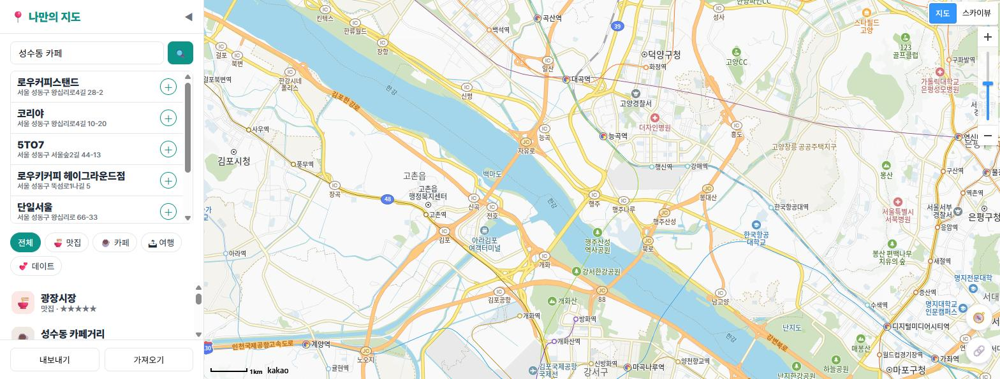
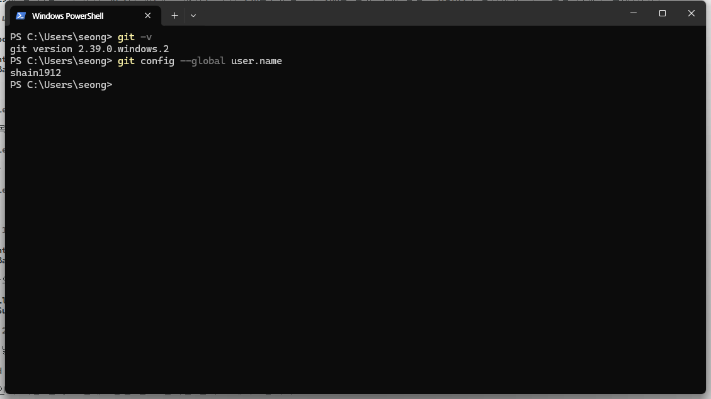
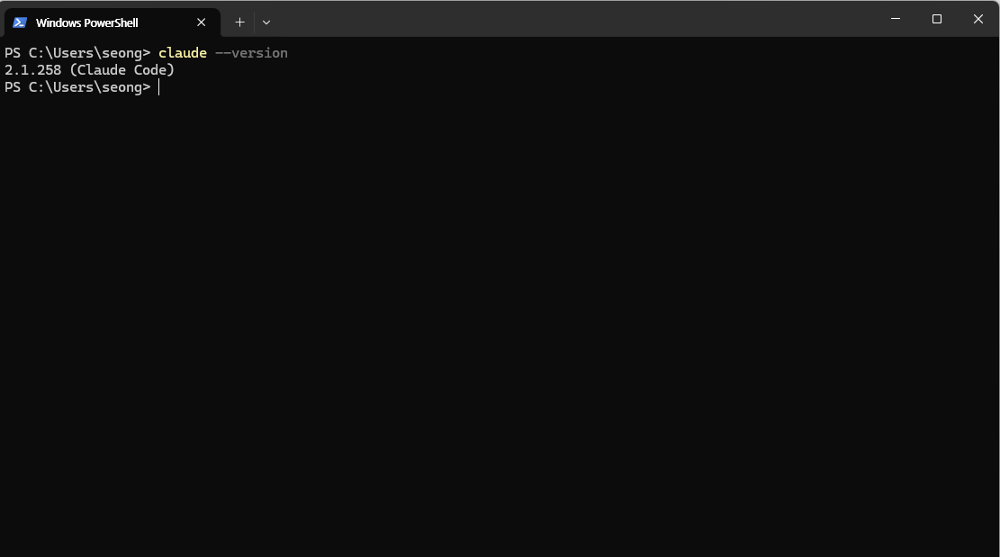
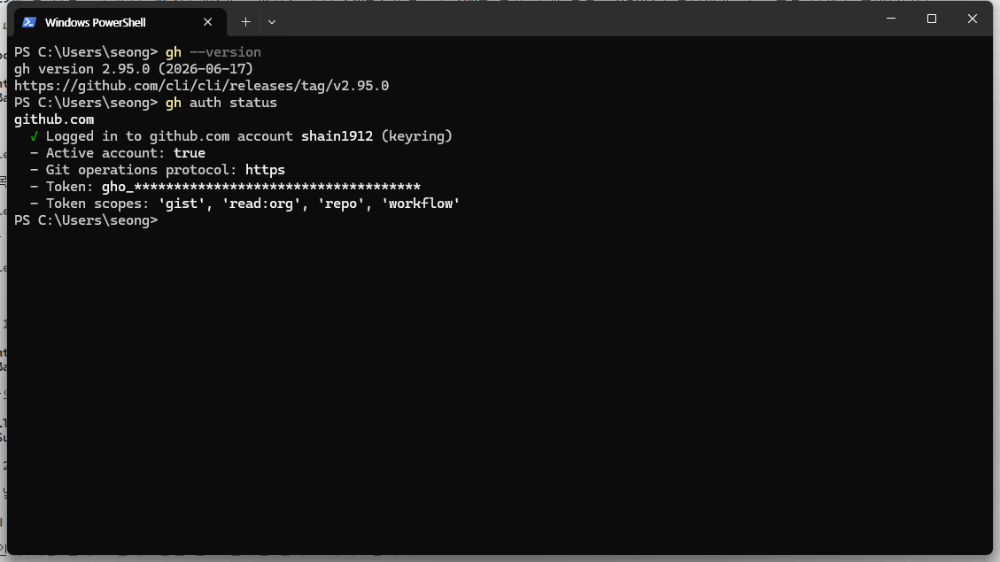
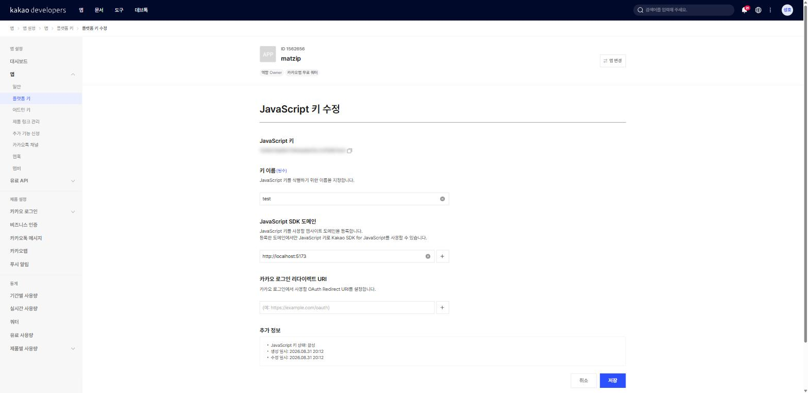
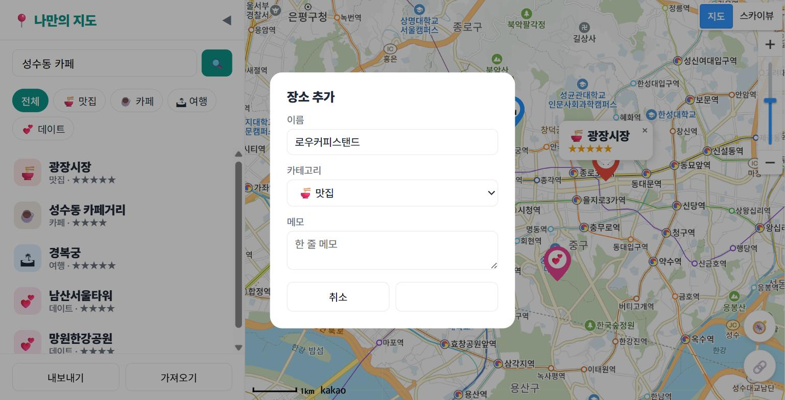
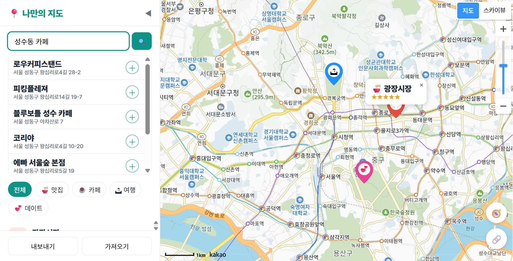
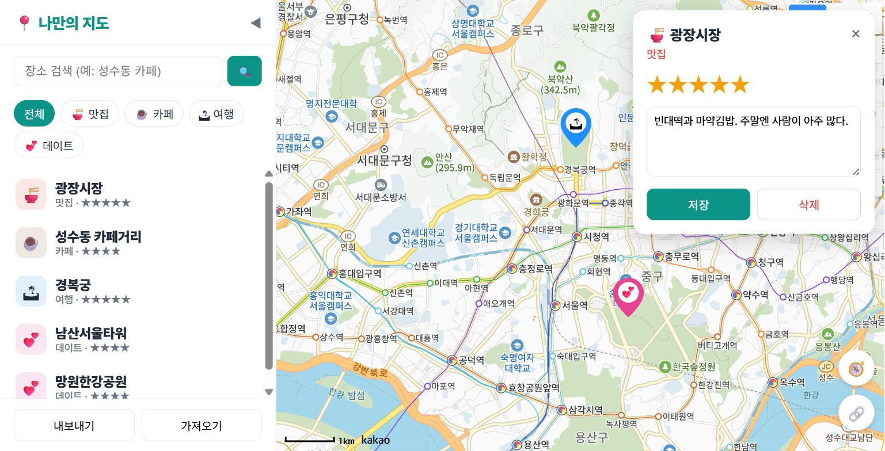
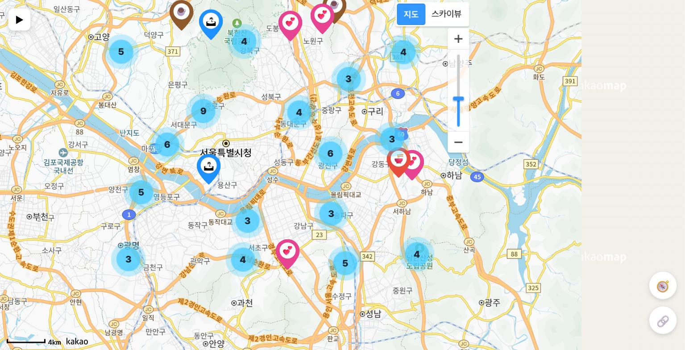

# 바이브코딩으로 만드는 나만의 지도 웹

> AI에게 말로 시켜서 카카오지도 기반 나만의 맛집·여행·데이트 지도를 만들어 세상에 공개하기까지

---

# 0장 이 책에서 만드는 것

!!! note "이 장에서 배우는 것"
    - 이 책에서 완성할 「나만의 지도」 웹앱이 어떤 모습인지 미리 살펴봅니다
    - "바이브코딩"이 무엇이고, 왜 코드를 몰라도 앱을 만들 수 있는지 이해합니다
    - 시작 전에 준비할 것 세 가지(윈도우 PC, 카카오 계정, Claude Pro 또는 무료 대안 에이전트)를 확인합니다
    - 5부 26장으로 이어지는 책 전체의 여정을 한눈에 파악합니다

---

## 0.1 완성된 모습부터 보여드립니다

무언가를 만들기 전에, 완성된 모습을 먼저 보는 것이 좋습니다. 목적지를 알고 떠나는 여행과 모르고 떠나는 여행은 완전히 다르니까요. 그래서 이 책의 첫 장은 설치도, 설정도, 코드도 아닙니다. 여러분이 마지막 장을 덮을 때 손에 쥐게 될 결과물을 먼저 구경하는 시간입니다.

이 책에서 우리는 **「나만의 지도」**라는 웹앱을 만듭니다. 카카오지도 위에 내가 좋아하는 맛집, 카페, 여행지, 데이트 코스를 직접 핀으로 꽂아 관리하는 나만의 지도 서비스입니다. 아래가 완성된 화면입니다.

{ width="760" }

화면 구성은 단순합니다. 왼쪽에는 사이드바가 있습니다. 검색창, 카테고리 필터 버튼, 그리고 내가 저장한 장소 목록이 위에서 아래로 배치되어 있습니다. 오른쪽에는 지도가 화면을 꽉 채웁니다. 지도 위에는 카테고리별로 색이 다른 마커들이 꽂혀 있습니다. 🍜 맛집은 주황색, ☕ 카페는 갈색, 🏝 여행은 파란색, 💕 데이트는 분홍색. 한눈에 "아, 이 동네에 내가 찜한 카페가 몰려 있구나"가 보입니다.

단순해 보이지만, 이 앱에는 실제 지도 서비스가 갖춰야 할 기능이 알차게 들어 있습니다. 하나씩 투어를 돌아보겠습니다.

### 마커를 누르면 말풍선이 뜹니다

지도 위의 마커를 클릭하면 예쁜 말풍선이 나타납니다. 장소 이름, 카테고리, 별점이 담겨 있습니다. 카카오지도가 기본으로 주는 밋밋한 인포윈도우가 아니라, 우리가 HTML과 CSS로 직접 디자인한 커스텀 말풍선입니다. 꼬리 모양까지 CSS로 그려 넣습니다.

<!-- FIG: id=ch00-f02 | type=스크린샷 | file=images/ch00/ch00-f02.png -->
> **그림 0.2 — 마커 클릭 시 나타나는 커스텀 말풍선**
>
> *[스크린샷: 지도 위 마커 하나를 클릭해 말풍선(커스텀 오버레이)이 열린 모습. 말풍선 안에 장소 이름·카테고리 이모지·별점(★)이 보이고, 말풍선 아래로 뾰족한 꼬리가 마커를 가리키는 장면을 확대 캡처]*

### 버튼 하나로 원하는 것만 골라 봅니다

사이드바의 필터 버튼을 누르면 지도가 반응합니다. "☕ 카페"를 누르면 지도에서 카페 마커만 남고 나머지는 사라집니다. "전체"를 누르면 다시 모든 마커가 돌아옵니다. 데이트 코스를 짜는 날에는 💕 버튼만, 점심 메뉴를 고를 때는 🍜 버튼만. 지도가 그날의 목적에 맞춰 변신합니다.

<!-- FIG: id=ch00-f03 | type=스크린샷 | file=images/ch00/ch00-f03.png -->
> **그림 0.3 — 카테고리 필터로 카페만 표시한 화면**
>
> *[스크린샷: 사이드바에서 "☕ 카페" 필터 버튼이 활성화(active)된 상태. 지도에는 카페 마커만 남아 있고, 장소 목록에도 카페만 나열된 모습. 그림 0.1과 비교되도록 같은 지도 영역]*

### 전국 어디든 검색해서 추가합니다

검색창에 "성수동 카페"라고 치면 카카오의 장소 데이터베이스에서 실제 가게들을 찾아 목록으로 보여줍니다. 결과를 클릭하면 지도가 그곳으로 부드럽게 이동하고, ＋ 버튼을 누르면 내 지도에 바로 저장됩니다. 지도의 빈 곳을 클릭해서 직접 추가할 수도 있습니다. "여기가 우리가 처음 만난 곳" 같은, 검색으로는 안 나오는 나만의 장소도 핀으로 남길 수 있다는 뜻입니다.

{ width="760" }

### 별점과 메모까지, 나만의 기록이 쌓입니다

저장한 장소를 클릭하면 상세 패널이 열립니다. 여기서 별점을 1점부터 5점까지 매기고, "웨이팅 김, 평일 오픈런 추천" 같은 메모를 남길 수 있습니다. 필요 없어진 장소는 삭제 버튼으로 정리합니다. 이렇게 쌓인 기록은 브라우저에 저장되어 내일 다시 열어도 그대로 남아 있고, 파일로 내보내 백업할 수도 있습니다.

{ width="760" }

여기까지가 핵심 기능이고, 뒷부분에서는 한 걸음 더 나아갑니다. 🧭 버튼을 누르면 내 현재 위치가 파란 점으로 표시됩니다. 🔗 버튼을 누르면 지금 보고 있는 지도 위치가 링크로 복사되어 친구에게 "여기서 보자"라고 보낼 수 있습니다. 장소가 100개로 불어나도 마커가 자동으로 뭉쳐지는 클러스터 기능, 스마트폰에서도 쓰기 편한 모바일 화면까지 만듭니다. 그리고 마지막에는 이 모든 것을 인터넷에 배포해서, 전 세계 어디서든 주소만 치면 열리는 진짜 웹 서비스로 완성합니다.

!!! tip "💡 팁"
    지금 소개한 기능 이름들 — 마커, 커스텀 오버레이, 필터, localStorage, 클러스터러 — 을 외울 필요는 전혀 없습니다. 각 기능마다 한 장씩 배정되어 있어서, 그 장에 도착하면 충분히 천천히 만나게 됩니다. 지금은 "이런 게 만들어지는구나" 하고 구경만 하셔도 됩니다.

---

## 0.2 그런데, 코드는 누가 짜나요?

여기서 자연스러운 질문이 나옵니다. "이걸 내가 만든다고요? 저는 코딩을 못하는데요."

좋은 소식입니다. 이 책에서 코드를 짜는 것은 여러분이 아닙니다. **AI가 짭니다.** 여러분이 하는 일은 AI에게 한국어로 시키는 것입니다. 이런 식으로요.

!!! tip "🗣 이렇게 시키세요"
    > 지도를 화면 전체에 꽉 차게 띄워줘. 카카오지도 JS SDK를 쓰고, 키는 .env에서 읽어줘.

이렇게 말하면 Claude Code라는 AI 도구가 필요한 파일을 만들고, 코드를 작성하고, 실행까지 해 줍니다. 우리는 결과를 브라우저에서 확인하고, 마음에 안 들면 다시 말로 고칩니다. "말풍선이 너무 작아. 글자를 키우고 그림자를 넣어줘." 이런 식의 대화가 곧 개발 과정입니다.

이런 방식의 개발을 **바이브코딩(vibe coding)**[^1]이라고 부릅니다. 키보드로 코드를 한 줄 한 줄 타이핑하는 대신, 만들고 싶은 것을 말로 설명하고 AI가 작성한 코드를 함께 읽으며 다듬어 가는 방식입니다. 이 책에는 복사-붙여넣기가 없습니다. 대신 매 실습마다 "이렇게 시키세요" 프롬프트 박스가 등장합니다. 여러분은 그 프롬프트를 참고해 AI에게 일을 시키고, AI가 만들어 온 코드를 책과 함께 한 줄씩 읽으며 이해합니다. 바이브코딩이 왜 지금 가능해졌는지, 실제로 어떤 원리로 굴러가는지 — 자세한 작동 원리는 1장에서 본격적으로 파헤칩니다. 이 절에서는 큰 그림만 잡고 가면 충분합니다.

{ width="760" }

"그럼 코드는 안 배워도 되나요?"라고 물으신다면, 절반만 맞습니다. 타이핑은 AI가 하지만, **읽기는 우리가 합니다.** AI가 만든 코드가 무슨 일을 하는지 대략이라도 알아야 "여기가 이상한데?"라고 지적할 수 있고, 원하는 방향으로 고쳐 달라고 시킬 수 있기 때문입니다. 운전에 비유하면, 엔진을 조립할 줄은 몰라도 계기판은 읽을 줄 알아야 하는 것과 같습니다. 이 책의 코드 해설은 정확히 그 수준 — 계기판을 읽는 수준 — 을 목표로 합니다. 외우라고 하지 않습니다. 이해하고 넘어가면 충분합니다.

그리고 한 가지 약속드릴 것이 있습니다. 이 책의 앱은 실제로 이 책이 안내하는 방식 그대로, 저자가 Claude Code에게 시켜서 만든 앱입니다. 여러분이 보게 될 코드는 AI가 작성하고 사람이 검토한, 바이브코딩의 실제 결과물입니다. "이론상 된다"가 아니라 "이렇게 해서 만들었다"를 담았습니다.

!!! warning "⚠️ 주의"
    바이브코딩이 "아무것도 몰라도 된다"는 뜻은 아닙니다. AI는 가끔 틀립니다. 엉뚱한 코드를 만들기도 하고, 시킨 것과 다른 일을 하기도 합니다. 그래서 이 책은 AI에게 **작게 시키고, 결과를 확인하고, 잘못되면 되돌리는** 습관을 처음부터 함께 훈련합니다. 이 세 가지 습관이 바이브코딩의 안전벨트입니다. 1장에서 자세히 다룹니다.

---

## 0.3 준비물 세 가지

이 책을 따라가는 데 필요한 준비물은 딱 세 가지입니다.

**첫째, 윈도우 PC입니다.** 이 책의 모든 스크린샷과 설치 과정은 윈도우 10/11 기준으로 안내합니다. 고사양일 필요는 없습니다. 인터넷이 되고 크롬 브라우저가 돌아가는 PC면 충분합니다. 맥을 쓰시는 분도 따라올 수는 있지만, 설치 화면이 책과 조금 다르게 보일 수 있습니다.

**둘째, 카카오 계정입니다.** 카카오톡을 쓰고 계시다면 이미 있습니다. 우리가 쓸 지도는 카카오에서 제공하는 카카오지도 API[^2]인데, 이걸 쓰려면 카카오 개발자 사이트에서 열쇠(API 키)를 발급받아야 합니다. 발급은 무료이고, 이 책에서 쓰는 범위에서는 요금이 나오지 않습니다. 발급 과정은 7장에서 화면을 하나하나 따라가며 안내합니다.

**셋째, Claude Pro 구독(또는 무료 대안 에이전트)입니다.** 우리 대신 코드를 짜 줄 AI, Claude Code를 쓰기 위한 구독입니다. 월 구독제(약 $20)라서 부담이 없지는 않습니다만, 이 책의 주인공 도구인 만큼 한 달만이라도 구독해서 따라가 보시기를 권합니다. 책 한 권을 완주하는 데는 한 달이면 충분합니다. 당장 구독이 어렵다면 opencode, codex 같은 **무료 대안 에이전트**로도 책을 따라올 수 있는데, 이 도구들은 4장에서 소개합니다.

!!! tip "💡 팁"
    당장 구독이 부담스럽다면 무료 대안도 있습니다. 4장에서 opencode 등 무료로 쓸 수 있는 비슷한 도구들을 박스로 소개합니다. 프롬프트로 시키고 결과를 확인하는 흐름은 어느 도구든 같아서, 책의 내용은 그대로 따라올 수 있습니다.

아, 그리고 목차에서 말씀드린 준비물이 하나 더 있습니다. 바로 **호기심**입니다. 다행히 이것은 발급 절차도, 구독료도 없습니다.

혹시 "프로그래밍 경험"이 준비물 목록에 없는 것을 눈치채셨나요? 맞습니다. 없어도 됩니다. 변수가 뭔지, 함수가 뭔지 몰라도 시작할 수 있습니다. 필요한 개념은 필요해지는 순간에, 필요한 만큼만 설명합니다.

---

## 0.4 책의 지도: 5부로 떠나는 여정

지도 앱을 만드는 책답게, 책 자체의 지도도 그려 드리겠습니다. 이 책은 5부, 26개 장으로 구성되어 있습니다.

<!-- FIG: id=ch00-f07 | type=일러스트 | file=images/ch00/ch00-f07.png -->
> **그림 0.7 — 이 책의 로드맵: 준비운동부터 세상에 공개하기까지**
>
> *[일러스트: 등산로 지도 스타일의 로드맵. 출발점(1부 준비운동: 도구 설치)부터 → 2부 첫 지도 → 3부 나만의 장소 지도 → 4부 한 단계 더 → 정상(5부 세상에 공개)까지 이어지는 길에 각 부의 아이콘(🔧🗺️📍✨🚀)이 찍힌 그림]*

**1부 「바이브코딩 준비운동」(1~6장)**에서는 도구를 갖춥니다. 바이브코딩이 왜 지금 배울 만한 방식인지 이야기한 뒤, Node.js, Git, Claude Code, GitHub CLI, 그리고 여러 AI 에이전트를 지휘하는 Orca까지 — 저자가 실제로 매일 쓰는 도구 다섯 가지를 순서대로 설치하고 길들입니다. 설치가 지루하게 느껴질 수 있지만, 여기서 갖춘 도구들이 책 끝까지 함께 갑니다.

**2부 「카카오 지도 첫걸음」(7~10장)**에서 드디어 지도를 띄웁니다. 카카오 개발자 계정을 만들어 API 키를 발급받고, Vite로 프로젝트를 시작하고, 브라우저 화면 가득 지도가 뜨는 순간을 맞이합니다. 지도를 움직이고 확대하는 기본기까지 익힙니다. 아마 이 책에서 가장 짜릿한 순간 중 하나가 9장에 있을 겁니다. 내 손으로(정확히는 내 말로) 띄운 첫 지도니까요.

**3부 「나만의 장소 지도 만들기」(11~19장)**가 이 책의 심장입니다. 마커를 찍고, 장소 데이터를 설계하고, 말풍선을 달고, 필터와 검색을 붙이고, 클릭으로 장소를 추가하고, 새로고침해도 사라지지 않게 저장하고, 목록과 상세 패널로 관리합니다. 3부가 끝나면 그림 0.1의 화면이 여러분의 브라우저 안에 있습니다.

**4부 「한 단계 더」(20~23장)**에서는 앱을 한층 업그레이드합니다. 내 위치 표시, 링크로 지도 공유, 마커 100개도 거뜬한 클러스터러, 스마트폰 대응까지. "있으면 좋겠다" 싶었던 기능들이 하나씩 붙습니다.

**5부 「세상에 공개하기」(24~26장)**는 완성한 앱을 GitHub에 올리고, GitHub Pages로 배포해서 진짜 인터넷 주소를 얻는 과정입니다. 친구에게 링크를 보내 "이거 내가 만들었어"라고 자랑하는 순간이 이 책의 결승선입니다.

부록도 두 개 있습니다. **부록 A**는 책에 나온 프롬프트를 상황별로 모은 템플릿 모음, **부록 B**는 "지도가 회색으로 나와요" 같은 단골 문제의 해결법을 정리한 트러블슈팅 표입니다. 막힐 때마다 펼쳐 보세요.

!!! tip "💡 팁"
    책은 순서대로 읽도록 설계되어 있지만, 이미 갖춘 도구가 있다면 해당 장은 건너뛰어도 됩니다. 예를 들어 Node.js와 Git이 이미 설치되어 있다면 2~3장은 버전 확인만 하고 넘어가면 됩니다. 다만 7장(카카오 키 발급)과 8장(프로젝트 시작)은 모두가 거쳐야 하는 관문입니다.

---

## 0.5 마무리

!!! abstract "📌 핵심 요약"
    - 이 책의 목표는 카카오지도 기반 「나만의 지도」 웹앱을 완성해 인터넷에 배포하는 것입니다.
    - 완성 앱에는 마커·말풍선·카테고리 필터·검색·장소 추가·저장·상세 패널·위치·공유·클러스터·모바일 대응이 들어갑니다.
    - 코드는 AI(Claude Code)가 짜고, 우리는 말로 시키고 결과를 읽고 확인합니다 — 이것이 바이브코딩입니다.
    - 준비물은 윈도우 PC, 카카오 계정, Claude Pro(또는 무료 대안 에이전트) 세 가지이며 프로그래밍 경험은 필요 없습니다.
    - 책은 5부 26장 구성입니다: 도구 준비 → 첫 지도 → 나만의 지도 → 업그레이드 → 세상에 공개.

!!! question "🤔 생각해보기"
    Q1. 여러분만의 지도에 담고 싶은 장소는 어떤 것들인가요? 카테고리(맛집/카페/여행/데이트)별로 떠오르는 장소를 두세 곳씩 적어 보세요. 책을 따라가는 동안 이 장소들이 실제 데이터가 됩니다.

    ✍️ ____________________________________________

    ✍️ ____________________________________________

    Q2. "코드를 직접 타이핑하는 대신 AI에게 말로 시킨다"는 방식에 대해 기대되는 점과 걱정되는 점을 하나씩 적어 보세요.

    ✍️ ____________________________________________

    ✍️ ____________________________________________

!!! example "✏️ 연습 문제"
    1. 그림 0.1의 완성 화면에서 찾을 수 있는 기능을 다섯 가지 이상 말해 보세요.
    2. 이 책의 준비물 세 가지는 무엇인가요? 그중 지금 내가 이미 갖춘 것과 새로 준비해야 할 것을 구분해 보세요.
    3. 3부가 끝났을 때와 5부가 끝났을 때, 내 앱은 각각 어떤 상태일까요? 한 문장씩 설명해 보세요.

!!! info "🔎 더 찾아보기"
    - `카카오맵` — 우리가 만들 앱의 바탕이 되는 지도 서비스. map.kakao.com에서 완성형 서비스를 미리 구경해 보세요.
    - `구글 마이맵(My Maps)` — 구글이 제공하는 "나만의 지도" 서비스. 우리가 만들 앱과 비슷한 개념이라 비교해 보면 재미있습니다.
    - `PWA(프로그레시브 웹앱)` — 웹앱을 스마트폰 홈 화면에 설치해 앱처럼 쓰는 기술. 이 책 이후의 확장 아이디어입니다.

> **다음 장 예고** — 다음 장에서는 이 책의 개발 방식인 바이브코딩을 본격적으로 파헤칩니다. 왜 지금이 "코드를 몰라도 만드는 시대"인지, 저자가 실제로 Claude Code와 Orca를 어떻게 조합해서 쓰는지, 그리고 AI에게 일을 시킬 때 꼭 지켜야 할 세 가지 습관 — 작게 시키기, 확인하기, 되돌리기 — 를 배웁니다.

[^1]: 바이브코딩(vibe coding): AI에게 자연어로 요구사항을 말하고 AI가 작성한 코드로 소프트웨어를 만드는 개발 방식. 2025년 초 AI 연구자 안드레이 카파시(Andrej Karpathy)가 소셜 미디어에서 처음 사용한 표현으로 널리 알려졌습니다.
[^2]: API(Application Programming Interface): 다른 회사의 서비스(여기서는 카카오지도)를 내 프로그램에서 가져다 쓸 수 있게 열어 둔 창구. 카카오지도 API를 쓰면 카카오가 만든 지도를 우리 웹앱 안에 띄울 수 있습니다.


<!-- 페이지 나눔 -->


# 1장 왜 바이브코딩인가

!!! note "이 장에서 배우는 것"
    - 바이브코딩이 무엇인지, 왜 지금 이 방식으로 배우는 것이 유리한지 이해합니다.
    - 저자가 실제로 쓰는 작업 흐름(Claude Code + Orca + Git + GitHub CLI)을 미리 구경합니다.
    - "이해하려 노력하되 외우지 않는다"는 이 책의 학습 철학을 익힙니다.
    - AI 에이전트에게 일을 시킬 때의 세 가지 마음가짐 — 작게 시키기, 확인하기, 되돌리기 — 을 배웁니다.
    - 다음 장부터 설치할 도구 5종이 각각 어떤 역할인지 큰 그림을 그립니다.

---

## 1.1 코드를 몰라도 만드는 시대

혹시 이런 경험이 있으신가요? "나만의 맛집 지도를 웹으로 만들어 보고 싶다"는 생각이 들어 검색을 시작했는데, HTML을 배워야 하고, CSS를 배워야 하고, 자바스크립트를 배워야 하고, API가 뭔지도 알아야 한다는 글을 읽다가 조용히 브라우저 탭을 닫아버린 경험 말입니다. 프로그래밍을 배우다 포기한 분들의 이야기를 들어보면 대부분 비슷합니다. 만들고 싶은 것은 분명한데, 그것을 만들기까지 배워야 할 것이 너무 많아서 시작조차 못 하는 것입니다.

바이브코딩(vibe coding)은 이 순서를 뒤집습니다. 문법부터 배우고 나서 만드는 것이 아니라, **먼저 만들고 싶은 것을 말로 설명하면 AI가 코드를 대신 작성**합니다. 여러분은 결과물을 눈으로 확인하고, 마음에 안 들면 다시 말로 고쳐 달라고 시킵니다. "지도를 화면에 꽉 차게 띄워줘", "마커를 클릭하면 말풍선이 뜨게 해줘"처럼 한국어 문장으로 요청하면, AI 코딩 도구가 실제로 동작하는 코드를 만들어 줍니다.

이 단어는 2025년 초, AI 연구자 안드레이 카파시(Andrej Karpathy)[^1]가 "코드의 존재조차 잊고 분위기(vibe)에 몸을 맡긴 채 개발한다"고 표현한 데서 널리 퍼졌습니다. 처음에는 반쯤 농담이었지만, 지금은 실제로 많은 개발자와 비개발자가 이 방식으로 소프트웨어를 만들고 있습니다. 이 책의 원고와 예제 앱 역시 상당 부분 바이브코딩으로 만들어졌습니다.

<!-- FIG: id=ch01-f01 | type=일러스트 | file=images/ch01/ch01-f01.png -->
> **그림 1.1 — 전통적 코딩과 바이브코딩의 순서 비교**
>
> *[일러스트: 왼쪽 "전통 방식" — 문법 공부 → 문서 읽기 → 코드 타이핑 → 에러와 씨름 → (한참 뒤) 결과물. 오른쪽 "바이브코딩" — 말로 요청 → AI가 코드 작성 → 결과 확인 → 말로 수정 요청, 짧은 순환 화살표. 두 경로의 길이 차이가 한눈에 보이게]*

여기서 오해 하나를 짚고 넘어가겠습니다. 바이브코딩은 "코딩을 안 배워도 된다"는 뜻이 아닙니다. 정확히 말하면 **배우는 순서와 방법이 바뀐다**는 뜻입니다. 예전에는 문법을 다 외운 다음에야 뭔가를 만들 수 있었다면, 이제는 만들면서 필요한 만큼 이해하면 됩니다. 운전을 배울 때 엔진의 열역학부터 공부하지 않는 것과 같습니다. 일단 운전대를 잡고 도로에 나가되, 계기판이 무엇을 말하는지, 경고등이 왜 켜졌는지는 알아야 안전하게 다닐 수 있습니다. 이 책이 여러분께 드리려는 것이 바로 그 "계기판 읽는 법"입니다.

그리고 한 가지 더. 이 책에는 복사-붙여넣기가 없습니다. 긴 코드를 책에서 보고 한 글자씩 따라 치는 실습도 없습니다. 대신 매 실습마다 ① AI에게 시키는 프롬프트를 먼저 보여드리고, ② AI가 만들어 준 코드를 함께 읽고, ③ 왜 그렇게 동작하는지 해설한 다음, ④ 브라우저에서 결과를 확인합니다. 타이핑은 AI가 하고, 판단은 여러분이 합니다.

!!! tip "💡 팁"
    바이브코딩이라는 이름 때문에 "대충 감으로 한다"고 오해하기 쉽지만, 잘하는 사람일수록 요청을 명확하게 하고 결과를 꼼꼼히 확인합니다. 분위기에 맡기는 것은 타이핑이지, 판단이 아닙니다.

## 1.2 저자의 실제 워크플로 — 이 책은 그 방식 그대로 갑니다

시중의 많은 입문서는 "교육용으로 정리된 방법"을 가르칩니다. 이 책은 조금 다르게, 저자가 실제 프로젝트에서 매일 쓰는 작업 흐름을 거의 그대로 보여드립니다. 도구는 네 가지 축으로 구성됩니다.

첫째, **Claude Code**입니다. 터미널에서 실행하는 AI 코딩 에이전트로, 이 책의 주인공입니다. 단순히 코드 조각을 답해 주는 챗봇이 아니라, 프로젝트 폴더 안에서 파일을 직접 만들고, 고치고, 명령어를 실행하고, 에러를 읽고 스스로 수정하는 "에이전트"입니다. 여러분이 "검색 기능을 붙여줘"라고 하면, 어떤 파일을 어떻게 바꿀지 계획을 세우고 실제로 바꿉니다.

둘째, **Git**입니다. 코드의 시간을 되돌리는 타임머신입니다. AI가 코드를 대신 쓰는 세계에서 Git은 선택이 아니라 안전벨트입니다. AI가 만든 수정이 마음에 안 들면, 언제든 마지막으로 잘 동작하던 시점으로 되돌릴 수 있어야 하기 때문입니다. 이 이야기는 3장에서 자세히 다룹니다.

셋째, **GitHub CLI(gh)**입니다. 만든 코드를 인터넷 저장소인 GitHub에 올리고 관리하는 명령줄 도구입니다. 브라우저에서 버튼을 찾아 클릭하는 대신 명령어 한 줄로 저장소를 만들 수 있어서, AI 에이전트와 궁합이 아주 좋습니다.

넷째, **Orca**입니다. 여러 AI 에이전트를 나란히 띄워 놓고 지휘하는 데스크톱 앱입니다. 한 에이전트에게 기능 A를 시켜 놓고, 기다리는 동안 다른 에이전트에게 기능 B를 시키는 식의 병렬 작업이 가능합니다. 처음에는 없어도 되지만, 손에 익으면 작업 속도가 눈에 띄게 달라집니다.

<!-- FIG: id=ch01-f02 | type=일러스트 | file=images/ch01/ch01-f02.png -->
> **그림 1.2 — 저자의 바이브코딩 워크플로 한눈에 보기**
>
> *[일러스트: 가운데 "나(지휘자)" 아이콘. 그 아래 Orca 창 안에 Claude Code 에이전트 2~3개가 나란히 일하는 모습. 오른쪽으로 Git(되돌리기 화살표)과 GitHub CLI(클라우드 업로드) 아이콘으로 흐름이 이어짐. 각 도구에 짧은 역할 라벨]*

이 네 가지가 맞물려 돌아가는 하루를 상상해 보면 이렇습니다. 아침에 Orca를 켜고 Claude Code에게 "어제 만든 지도에 카테고리 필터를 붙여줘"라고 시킵니다. 에이전트가 코드를 고치는 동안 커피를 내리고 돌아와서, 브라우저로 결과를 확인합니다. 마음에 들면 Git으로 저장(커밋)하고 GitHub에 올립니다. 마음에 안 들면 "버튼 색이 너무 튀는데 차분하게 바꿔줘"라고 다시 시키거나, 아예 되돌리고 요청을 다르게 써 봅니다. 코드를 한 줄도 직접 타이핑하지 않은 날도 많지만, 무엇을 만들지 결정하고 결과를 판정하는 것은 언제나 사람의 몫입니다.

이 책의 1부(2~6장)는 정확히 이 워크플로를 여러분의 윈도우 PC에 그대로 세팅하는 과정입니다. 남의 작업실 구경으로 끝나지 않고, 여러분의 작업실이 됩니다.

## 1.3 이해하려 노력하되, 외우지 않는다

AI가 코드를 다 써 준다면, 우리는 무엇을 배워야 할까요? 이 책의 대답은 한 문장입니다. **이해하려 노력하되, 외우지 않는다.**

외우지 않아도 되는 것부터 말씀드리겠습니다. 함수 이름의 정확한 철자, 괄호와 세미콜론의 위치, API 옵션의 나열 순서 같은 것들입니다. 예전 프로그래밍 학습에서 시간을 가장 많이 잡아먹던 부분인데, 이제 이런 것은 AI가 사람보다 훨씬 정확하게 기억합니다. 카카오지도에서 마커를 만드는 클래스 이름이 `Marker`인지 `MapMarker`인지 헷갈려도 전혀 문제없습니다. AI에게 시키면 되니까요.

반대로 이해해야 하는 것은 **구조와 흐름**입니다. 이를테면 이런 것들입니다. "내 앱은 장소 데이터를 어디에 저장하고 있지?" "지도에 마커가 그려지기까지 어떤 순서로 코드가 실행되지?" "API 키는 왜 코드에 직접 쓰면 안 되지?" 이런 질문에 대략이라도 답할 수 있으면, AI가 만든 코드가 이상할 때 알아챌 수 있고, 무엇을 고쳐 달라고 해야 할지 정확히 말할 수 있습니다.

비유하자면 여러분은 건축주이자 현장 감독입니다. 벽돌을 직접 쌓는 법(문법)은 몰라도 되지만, 도면(구조)을 읽을 줄은 알아야 합니다. 도면을 못 읽는 건축주는 시공사가 방 하나를 빼먹어도 완공식 날까지 모릅니다. 이 책의 코드 해설이 길지 않으면서도 꼬박꼬박 등장하는 이유가 이것입니다. 우리는 코드를 "채점"하러 읽는 것이 아니라 "도면을 확인"하러 읽습니다.

<!-- FIG: id=ch01-f03 | type=일러스트 | file=images/ch01/ch01-f03.png -->
> **그림 1.3 — 외울 것과 이해할 것**
>
> *[일러스트: 저울 그림. 왼쪽 접시 "외우지 않아도 되는 것: 문법·철자·옵션 순서" 위에 AI 로봇이 대신 들고 있는 모습. 오른쪽 접시 "이해해야 하는 것: 데이터 흐름·파일 구조·키 보안" 위에 사람이 도면을 보는 모습. 오른쪽이 더 무겁게 기울어짐]*

그래서 이 책의 실습에는 "설명 요청 프롬프트"가 자주 등장합니다. AI에게 일을 시킨 다음, 이렇게 한 번 더 물어보는 것입니다.

!!! tip "🗣 이렇게 시키세요"
    > 방금 만든 코드를 프로그래밍을 처음 배우는 사람에게 설명하듯이, 위에서 아래로 실행 순서를 따라가며 설명해줘. 비유를 하나 들어줘.

AI는 훌륭한 코딩 도구인 동시에, 지치지 않는 과외 선생님이기도 합니다. 같은 질문을 열 번 해도 짜증 내지 않습니다. 모르는 것을 모른다고 말하는 데 부끄러움을 느낄 필요가 없는 상대라는 점이, 어쩌면 바이브코딩 학습의 가장 큰 축복일지도 모릅니다.

## 1.4 에이전트에게 일 시키는 마음가짐 — 작게, 확인, 되돌리기

AI 에이전트는 유능하지만 완벽하지 않습니다. 자신만만하게 틀린 코드를 내놓기도 하고, 시키지 않은 것까지 고쳐 놓기도 합니다. 그래서 에이전트와 일할 때는 신입 동료와 일할 때와 비슷한 요령이 필요합니다. 이 책 전체를 관통하는 세 가지 원칙으로 정리했습니다.

**첫째, 작게 시킵니다.** "맛집 지도 앱을 통째로 만들어줘"라고 시키면 AI는 뭔가를 만들어 내긴 하지만, 여러분이 통제할 수 없는 커다란 덩어리가 나옵니다. 어디가 잘못됐는지 찾기도 어렵고, 배우는 것도 없습니다. 대신 "지도만 띄워줘" → "마커 하나만 찍어줘" → "마커를 클릭하면 말풍선이 뜨게 해줘"처럼 한 번에 한 걸음씩 시킵니다. 요청이 작을수록 결과를 확인하기 쉽고, 잘못됐을 때 원인을 좁히기 쉽습니다. 이 책의 26개 장 구성 자체가 바로 이 "작게 시키기"의 순서도입니다.

**둘째, 확인합니다.** AI가 "다 했습니다"라고 말하는 것과 실제로 동작하는 것은 다른 문제입니다. 요청 하나가 끝날 때마다 브라우저를 새로고침해서 눈으로 확인하고, 개발자 도구의 콘솔에 빨간 에러가 없는지 봅니다. 확인 없이 다음 요청을 쌓아 올리면, 나중에 문제가 터졌을 때 어느 층에서 금이 갔는지 알 수 없게 됩니다. "한 요청, 한 확인"을 습관으로 만드세요.

**셋째, 되돌립니다.** 확인해 보니 이상하다면, 그 위에 수정 요청을 덧대는 것보다 깨끗하게 되돌리고 다시 시키는 편이 나을 때가 많습니다. Git으로 잘 동작하던 시점을 저장해 두었다면 되돌리기는 명령어 한 줄입니다. 되돌릴 수 있다는 확신이 있으면 실험이 두렵지 않게 되고, 실험이 두렵지 않으면 배움이 빨라집니다. 바이브코딩의 용기는 사실 Git에서 나옵니다.

<!-- FIG: id=ch01-f04 | type=일러스트 | file=images/ch01/ch01-f04.png -->
> **그림 1.4 — 바이브코딩 3원칙: 작게 시키기 · 확인하기 · 되돌리기**
>
> *[일러스트: 세 개의 순환 아이콘. ① 큰 바위를 작은 돌 세 개로 쪼개는 그림(작게), ② 돋보기로 화면을 보는 그림(확인), ③ 시계 반대 방향 화살표와 안전벨트 그림(되돌리기). 셋이 원형 순환 구조로 연결]*

!!! warning "⚠️ 주의"
    AI가 만든 코드를 확인 없이 계속 쌓아 올리는 것이 바이브코딩 실패의 제1원인입니다. 특히 "그냥 알아서 다 해줘" 식의 큰 요청 뒤에는 반드시 동작 확인을 하고, 잘 되는 시점을 Git으로 저장해 두세요. 저장하지 않은 채 다음 요청을 던지는 것은 세이브 없이 보스전에 들어가는 것과 같습니다.

이 세 원칙은 4장에서 배울 "프롬프트 4요소(맥락·목표·제약·출력)"와 함께, 이 책에서 여러분이 얻어 갈 가장 오래가는 기술입니다. 도구는 몇 년 뒤에 바뀔 수 있어도, 에이전트에게 일을 시키는 이 감각은 어떤 AI 도구를 쓰든 그대로 통합니다.

## 1.5 이 책에서 쓸 도구 5종 한눈에 보기

이제 다음 장부터 하나씩 설치할 도구들을 미리 소개합니다. 각 도구가 "왜" 필요한지만 알아 두면, 설치 과정이 훨씬 덜 지루해집니다.

<!-- FIG: id=ch01-f05 | type=일러스트 | file=images/ch01/ch01-f05.png -->
> **그림 1.5 — 도구 5종의 역할 지도**
>
> *[일러스트: 공사 현장 비유. 바닥 기초에 "Node.js(전기·수도 같은 기반)", 그 위에 작업자 "Claude Code(일하는 에이전트)", 지휘소 "Orca(현장 사무소)", 타임머신 "Git(되돌리기)", 물류 트럭 "GitHub CLI(세상에 내보내기)". 각 요소를 화살표로 연결]*

**① Node.js (2장).** 자바스크립트를 브라우저 밖에서도 실행하게 해 주는 프로그램입니다. 우리가 쓸 개발 서버(Vite)와 Claude Code가 모두 Node.js 위에서 돌아가기 때문에 가장 먼저 설치합니다. 집으로 치면 전기·수도 같은 기반 설비입니다.

**② Git (3장).** 앞서 이야기한 코드 타임머신입니다. 프로젝트의 상태를 사진 찍듯 저장(커밋)해 두었다가 언제든 그 시점으로 돌아갈 수 있습니다. 바이브코딩의 안전벨트이므로, 지도를 띄우기 전에 반드시 먼저 채웁니다.

**③ Claude Code (4장).** 이 책의 주인공인 AI 코딩 에이전트입니다. 터미널에서 실행하며, 한국어로 시키면 파일을 만들고 고치고 실행까지 해 줍니다. 유료 구독(Claude Pro)이 필요하지만, 4장에서 무료 대안도 함께 소개합니다.

**④ GitHub CLI (5장).** 코드를 인터넷 저장소 GitHub에 올리는 명령줄 도구입니다. 나중에 25장에서 우리 지도 앱을 전 세계에 무료로 공개(GitHub Pages 배포)할 때의 기반이 됩니다.

**⑤ Orca (6장).** 여러 에이전트를 나란히 지휘하는 데스크톱 앱입니다. 다섯 가지 중 유일하게 "없어도 책을 끝까지 따라갈 수 있는" 도구지만, 저자의 실제 작업 방식을 체험해 보는 재미가 있습니다.

여기에 도구는 아니지만 재료가 하나 더 필요합니다. **카카오지도 API 키**(7장)입니다. 카카오가 제공하는 지도 데이터를 우리 앱에서 쓰기 위한 열쇠로, 무료로 발급받을 수 있습니다. 도구 5종을 설치하고 열쇠까지 받으면, 8장부터는 드디어 지도를 띄우기 시작합니다.

!!! tip "💡 팁"
    설치 장(2~6장)에서 도구 버전이 책의 화면과 조금 다르게 보여도 당황하지 마세요. 도구들은 자주 업데이트되지만 큰 흐름은 같습니다. 화면이 많이 다르면 그 화면을 캡처해서 AI에게 "이 화면에서 뭘 눌러야 해?"라고 물어보는 것도 훌륭한 바이브코딩입니다.

---

## 1.6 마무리

!!! abstract "📌 핵심 요약"
    - 바이브코딩은 말로 요청하고 AI가 코드를 작성하는 개발 방식입니다. 타이핑은 AI가, 판단은 사람이 합니다.
    - 이 책은 저자의 실제 워크플로(Claude Code + Orca + Git + GitHub CLI)를 그대로 따라 만듭니다.
    - 학습 철학은 "이해하려 노력하되 외우지 않는다" — 문법·철자는 AI에게 맡기고, 구조와 흐름을 읽는 눈을 기릅니다.
    - 에이전트와 일하는 3원칙: 작게 시키기, 확인하기, 되돌리기. 되돌릴 수 있어야 과감하게 실험할 수 있습니다.
    - 도구 5종의 역할 — Node.js(기반), Git(안전벨트), Claude Code(에이전트), GitHub CLI(공개), Orca(지휘).

!!! question "🤔 생각해보기"
    Q1. 여러분이 지금까지 "배워야 할 게 너무 많아서" 포기했던 만들기 프로젝트가 있나요? 바이브코딩 방식이라면 그 프로젝트의 첫 요청 문장을 어떻게 쓰시겠어요?

    ✍️ ____________________________________________

    ✍️ ____________________________________________

    Q2. "작게 시키기" 원칙에 따라, "맛집 지도 앱 만들어줘"라는 큰 요청을 세 개의 작은 요청으로 쪼개 보세요.

    ✍️ ____________________________________________

    ✍️ ____________________________________________

!!! example "✏️ 연습 문제"
    1. 바이브코딩에서 사람이 맡는 역할과 AI가 맡는 역할을 각각 두 가지씩 적어 보세요.
    2. 에이전트와 일하는 3원칙(작게 시키기·확인하기·되돌리기) 중 하나를 골라, 지키지 않았을 때 벌어질 수 있는 문제 상황을 상상해서 써 보세요.
    3. 이 책에서 쓰는 도구 5종을 설치 순서대로 나열하고, 각 도구의 역할을 한 줄로 요약해 보세요.
    4. "이해하려 노력하되 외우지 않는다"에서, 외우지 않아도 되는 것의 예 두 가지와 이해해야 하는 것의 예 두 가지를 적어 보세요.

!!! info "🔎 더 찾아보기"
    - `AI 페어 프로그래밍` — 사람과 AI가 짝을 이뤄 함께 코드를 만드는 개발 문화 전반을 가리키는 말
    - `프롬프트 엔지니어링` — AI에게서 원하는 결과를 얻기 위해 요청문을 설계하는 기술 (4장에서 실전 버전을 배웁니다)
    - `터미널(명령 프롬프트)` — 마우스 대신 글자 명령으로 컴퓨터를 조작하는 창. 2장부터 계속 만나게 됩니다
    - `오픈소스` — 코드를 공개해 누구나 보고 고칠 수 있게 하는 문화. 우리도 24장에서 코드를 공개합니다

> **다음 장 예고** — 2장에서는 모든 도구의 기반이 되는 Node.js를 설치합니다. 다운로드 버튼이 여러 개라 헷갈리는 공식 사이트에서 무엇을 골라야 하는지, 설치가 잘 됐는지 터미널에서 어떻게 확인하는지, 그리고 초보자를 가장 자주 괴롭히는 PATH 문제까지 스크린샷과 함께 차근차근 해결합니다.

[^1]: 안드레이 카파시(Andrej Karpathy) — 테슬라의 AI 총괄과 OpenAI 창립 멤버를 지낸 AI 연구자. 2025년 2월 X(트위터)에 올린 글에서 "vibe coding"이라는 표현을 사용해 화제가 되었습니다.


<!-- 페이지 나눔 -->


# 2장 Node.js 설치

!!! note "이 장에서 배우는 것"
    - Node.js가 무엇이고, 왜 이 책의 모든 도구가 Node.js 위에서 도는지 이해합니다
    - 내 컴퓨터에 Node.js가 이미 있는지 `node -v`로 확인합니다
    - nodejs.org에서 LTS 버전을 내려받아 윈도우에 설치합니다
    - "명령을 찾을 수 없습니다"라는 PATH 오류를 스스로 해결합니다
    - npm이 무엇인지, 앞으로 어디에 쓰는지 감을 잡습니다

---

## 2.1 Node.js가 왜 필요한가요

1장에서 우리는 "코드는 AI에게 시키고, 나는 지휘한다"는 바이브코딩의 마음가짐을 배웠습니다. 그런데 지휘를 하려면 무대가 먼저 있어야 합니다. 이번 장부터 6장까지는 그 무대, 즉 개발 환경을 차근차근 설치합니다. 그 첫 번째 주인공이 바로 **Node.js**입니다.

Node.js를 한 문장으로 말하면 이렇습니다. **"웹 브라우저 바깥에서 자바스크립트를 실행해 주는 프로그램"**입니다.

원래 자바스크립트는 웹 페이지 안에서만 살 수 있는 언어였습니다. 크롬이나 엣지 같은 브라우저가 열어 준 페이지 안에서만 동작했지요. 그런데 2009년에 Node.js가 등장하면서 이야기가 달라졌습니다. 브라우저 없이도, 그러니까 내 컴퓨터의 터미널에서 곧바로 자바스크립트를 돌릴 수 있게 된 것입니다. 덕분에 자바스크립트로 서버도 만들고, 개발 도구도 만들고, 명령줄 프로그램도 만들 수 있게 되었습니다.

"나는 지도 웹앱을 만들고 싶은 건데, 브라우저 바깥 이야기가 왜 필요하지?"라는 의문이 들 수 있습니다. 좋은 질문입니다. 이 책에서 우리가 쓸 핵심 도구 두 가지가 모두 Node.js 위에서 돌기 때문입니다.

첫째, **Vite**(비트, 8장에서 만납니다)입니다. Vite는 우리가 지도 앱을 개발하는 동안 옆에서 개발 서버를 띄워 주고, 코드를 고칠 때마다 브라우저 화면을 자동으로 새로고침해 주는 도구입니다. 이 Vite가 바로 Node.js로 만들어진 프로그램입니다. Node.js가 없으면 Vite는 시작조차 하지 못합니다.

둘째, **Claude Code**(4장에서 설치합니다)입니다. 우리 대신 코드를 써 줄 AI 에이전트 역시 Node.js로 만들어진 명령줄 프로그램입니다. 설치할 때도 잠시 뒤에 소개할 npm이라는 Node.js의 패키지 관리자를 사용합니다.

비유하자면 이렇습니다. 우리가 만들 지도 앱이 공연이라면, 카카오지도는 무대 위의 배우이고, Vite는 조명과 음향을 맡은 스태프이며, Claude Code는 대본을 써 주는 작가입니다. 그리고 Node.js는 이들이 모두 올라설 **무대 바닥**입니다. 무대가 없으면 배우도 스태프도 작가도 일할 곳이 없지요. 관객(사용자)의 눈에는 보이지 않지만, 없으면 공연 자체가 열리지 못하는 존재입니다.

정리하면 이렇습니다. Node.js는 이 책의 **기초 공사**입니다. 건물을 올리기 전에 땅을 다지듯, 지도 앱을 만들기 전에 Node.js부터 깝니다. 한 가지 미리 안심시켜 드리면, 이 책에서 여러분이 Node.js를 직접 프로그래밍할 일은 없습니다. Vite와 Claude Code가 알아서 Node.js를 사용하고, 우리는 그 위에서 지휘만 하면 됩니다. 설치 자체는 10분이면 끝나니 부담 갖지 않으셔도 됩니다.

!!! tip "💡 팁"
    Node.js라는 이름의 "js"는 JavaScript(자바스크립트)의 줄임말입니다. 앞으로 파일 이름 끝에 붙는 `.js` 확장자를 자주 보게 될 텐데, 모두 자바스크립트 파일이라는 뜻입니다.

---

## 2.2 먼저 확인부터 — 이미 설치되어 있을 수도 있습니다

무엇이든 설치하기 전에 확인하는 습관을 들입시다. 예전에 다른 프로그램을 깔면서 Node.js가 함께 설치되었을 수도 있으니까요. 확인하는 곳은 **터미널**입니다.

터미널은 글자로 컴퓨터에게 명령을 내리는 창입니다. 마우스로 아이콘을 클릭하는 대신, 키보드로 명령어를 입력하지요. 바이브코딩에서는 이 터미널이 우리의 지휘소가 되니, 여는 방법부터 손에 익혀 둡시다.

윈도우에서 터미널을 여는 가장 쉬운 방법은 이렇습니다.

1. 키보드에서 **윈도우 키**를 누릅니다.
2. 검색창에 **terminal** 또는 **터미널**이라고 입력합니다.
3. **터미널**(Windows Terminal) 앱이 보이면 클릭해서 엽니다.

검은색(또는 흰색) 창이 뜨고, `PS C:\Users\사용자이름>` 같은 글자가 보이면 성공입니다. 이 글자를 **프롬프트**라고 부릅니다. "명령을 입력해 주세요"라며 컴퓨터가 기다리고 있다는 표시입니다.

!!! tip "💡 팁"
    윈도우 10 일부 버전에는 Windows Terminal이 기본 설치되어 있지 않을 수 있습니다. 그럴 때는 검색창에 **PowerShell**(파워셸)이라고 입력해서 나오는 파란 아이콘을 열면 됩니다. 이 책에서 하는 작업은 둘 중 무엇을 써도 똑같이 됩니다.

이제 프롬프트에 아래 명령을 입력하고 **Enter** 키를 눌러 봅시다.

```
node -v
```

`node`는 Node.js를 부르는 명령이고, `-v`는 "버전(version)을 알려 줘"라는 옵션입니다. 결과는 둘 중 하나입니다.

**경우 1 — 버전 번호가 나온다.** `v22.19.0`처럼 `v`로 시작하는 숫자가 출력되면 이미 Node.js가 설치되어 있는 것입니다. 다만 버전이 너무 낮으면(예: v16 이하) 이 책의 도구들이 제대로 돌지 않을 수 있습니다. 앞자리 숫자가 20 이상이면 그대로 써도 좋고, 그보다 낮으면 이번 장을 따라 최신 LTS로 다시 설치해 주세요. 새로 설치하면 기존 버전 위에 덮어써집니다.

**경우 2 — 오류가 나온다.** 아래와 비슷한 빨간 글씨가 나오면 아직 Node.js가 없는 것입니다.

```
node : 'node' 용어가 cmdlet, 함수, 스크립트 파일 또는 실행할 수 있는
프로그램 이름으로 인식되지 않습니다.
```

당황할 필요 없습니다. "그런 프로그램 못 찾겠는데요?"라는 뜻일 뿐입니다. 지금부터 설치하면 됩니다.

여기서 터미널 사용 요령 두 가지만 미리 익혀 둡시다. 앞으로 이 책 내내 써먹게 됩니다. 첫째, **위쪽 화살표(↑) 키**를 누르면 방금 입력했던 명령이 다시 나타납니다. 같은 명령을 여러 번 실행할 때 일일이 다시 칠 필요가 없습니다. 둘째, 터미널에서 **붙여넣기는 마우스 오른쪽 클릭** 또는 `Ctrl+V`로 합니다. 책에 나오는 명령을 눈으로 보고 한 자씩 옮겨 적다 보면 오타가 나기 쉬우니, 전자책으로 보시는 분은 복사해서 붙여넣는 편이 정확합니다. 다만 명령이 무슨 뜻인지 한 번씩 소리 내어 읽어 보는 습관은 들여 두세요. 바이브코딩은 코드를 외우는 공부는 아니지만, 내가 무엇을 실행하는지는 알고 실행하는 공부입니다.

<!-- FIG: id=ch02-f01 | type=스크린샷 | file=images/ch02/ch02-f01.png -->
> **그림 2.1 — 설치 전 `node -v` 실행 결과**
>
> *[스크린샷: Windows Terminal(PowerShell)에서 `node -v` 입력 후 "용어가 인식되지 않습니다" 오류가 출력된 화면. 오류 메시지 전체가 보이도록 캡처, 글자 크게]*

---

## 2.3 nodejs.org에서 LTS 내려받기

이제 공식 홈페이지에서 설치 파일을 받겠습니다. 브라우저를 열고 주소창에 아래 주소를 입력합니다.

```
https://nodejs.org
```

첫 화면에 커다란 다운로드 버튼이 보입니다. 버튼에는 버전 번호와 함께 **LTS**라는 글자가 붙어 있습니다.

여기서 잠깐, LTS가 무엇인지 짚고 갑시다. LTS는 **Long Term Support**, 우리말로 **장기 지원 버전**이라는 뜻입니다. Node.js는 새 기능을 실험하는 **Current**(최신) 버전과, 안정성이 검증되어 오래 지원되는 **LTS** 버전 두 갈래로 배포됩니다. 스마트폰에 비유하면 Current는 이번 주에 나온 베타 운영체제이고, LTS는 몇 달 동안 수많은 사람이 써 보며 문제를 걸러낸 정식 버전입니다. 최신 기능보다 "말썽 없이 잘 도는 것"이 중요한 우리 같은 사용자에게는 언제나 LTS가 정답입니다. 참고로 Node.js는 **짝수 번호 버전만 LTS가 되는** 전통이 있습니다. 20, 22, 24처럼 짝수 버전은 시간이 지나면 LTS로 승격되고, 21, 23 같은 홀수 버전은 실험용으로 쓰이다 사라집니다. 이 책을 쓰는 시점의 LTS는 v22 계열이지만, 여러분이 보는 화면에는 더 높은 숫자가 적혀 있을 수 있습니다. 숫자가 몇이든 **LTS라고 적힌 쪽**을 받으면 됩니다.

다운로드 페이지에서 운영체제가 **Windows**로, 설치 방식이 **Installer(.msi)** 로 선택되어 있는지 확인하고 초록색 다운로드 버튼을 누릅니다. 대부분은 자동으로 윈도우용이 선택되어 있습니다. `node-v22.19.0-x64.msi` 같은 이름의 파일이 다운로드 폴더에 저장됩니다.

<!-- FIG: id=ch02-f02 | type=스크린샷 | file=images/ch02/ch02-f02.png -->
> **그림 2.2 — nodejs.org 다운로드 페이지**
>
> *[스크린샷: 크롬으로 https://nodejs.org 접속, LTS 다운로드 버튼이 화면 중앙에 보이는 첫 화면. "LTS" 글자와 Windows Installer(.msi) 선택 상태가 보이도록 캡처]*

!!! tip "🍎 Mac 사용자라면"
    같은 페이지에서 **macOS Installer(.pkg)** 를 내려받아 더블클릭하고, 안내에 따라 "계속"만 몇 번 누르면 설치가 끝납니다. 설치 후 확인 방법(`node -v`, `npm -v`)은 윈도우와 완전히 같습니다. 터미널은 Spotlight(⌘+Space)에서 "터미널"을 검색해 엽니다. 이후 장에서도 명령어는 윈도우와 거의 동일하니, 이 책의 터미널 명령을 그대로 따라 하시면 됩니다.

!!! tip "💡 팁"
    터미널에 익숙한 분이라면 홈페이지에 가지 않고도 설치할 수 있습니다. 윈도우에 내장된 패키지 관리자 winget으로 `winget install OpenJS.NodeJS.LTS` 한 줄이면 끝납니다. 다만 처음이라면 이번 장의 설치 마법사 방식을 권합니다. 어떤 화면이 지나가는지 눈으로 보아 두는 것도 공부가 되니까요.

---

## 2.4 설치 마법사, 단계별로 따라가기

다운로드한 `.msi` 파일을 더블클릭하면 설치 마법사가 시작됩니다. 화면이 예닐곱 번 넘어가는데, 결론부터 말하면 **전부 기본값 그대로 Next만 눌러도 됩니다**. 그래도 각 화면이 무엇을 묻는 것인지 알고 넘어가면 나중에 다른 프로그램을 설치할 때도 두렵지 않으니, 하나씩 짚어 보겠습니다.

**① 시작 화면(Welcome).** "Node.js 설치 마법사에 오신 것을 환영합니다"라는 인사말이 나옵니다. **Next**를 누릅니다.

<!-- FIG: id=ch02-f03 | type=스크린샷 | file=images/ch02/ch02-f03.png -->
> **그림 2.3 — 설치 마법사 시작 화면**
>
> *[스크린샷: Node.js Setup Wizard의 Welcome 화면. 창 전체 캡처, Next 버튼이 보이게]*

**② 라이선스 동의(License Agreement).** 소프트웨어 사용 약관입니다. Node.js는 무료 오픈소스라 부담 없이 동의해도 됩니다. **I accept the terms in the License Agreement**에 체크하고 **Next**를 누릅니다.

**③ 설치 위치(Destination Folder).** 어디에 설치할지 묻습니다. 기본값은 `C:\Program Files\nodejs\`입니다. 바꾸지 말고 그대로 **Next**를 누릅니다. 나중에 문제가 생겼을 때 기본 경로여야 원인을 찾기 쉽습니다.

**④ 구성 요소 선택(Custom Setup).** 무엇을 함께 설치할지 트리 모양 목록으로 보여 줍니다. 여기에 중요한 항목이 두 개 있습니다. **npm package manager**(잠시 뒤에 소개할 npm), 그리고 **Add to PATH**(터미널 어디에서든 `node` 명령을 쓸 수 있게 등록)입니다. 둘 다 기본으로 선택되어 있으니 건드리지 말고 **Next**를 누릅니다. 특히 Add to PATH가 빠지면 2.6절의 오류를 만나게 되니, 눈으로 한 번 확인만 해 두세요.

<!-- FIG: id=ch02-f04 | type=스크린샷 | file=images/ch02/ch02-f04.png -->
> **그림 2.4 — 구성 요소 선택 화면 (npm과 Add to PATH 확인)**
>
> *[스크린샷: Custom Setup 화면에서 트리 목록에 "npm package manager"와 "Add to PATH" 항목이 보이는 상태. 두 항목이 잘 보이도록 창 전체 캡처]*

**⑤ 네이티브 모듈 도구(Tools for Native Modules).** "일부 npm 패키지는 C/C++ 컴파일이 필요한데, 그 도구를 자동으로 설치할까요?"라고 묻는 화면입니다. 체크박스가 하나 있는데, **체크하지 않고** 그냥 **Next**를 누르세요. 이 책의 지도 앱에는 필요하지 않고, 체크하면 설치 시간이 크게 늘어납니다. 나중에 필요해지면 그때 설치해도 늦지 않습니다.

<!-- FIG: id=ch02-f05 | type=스크린샷 | file=images/ch02/ch02-f05.png -->
> **그림 2.5 — Tools for Native Modules 화면 (체크 해제 상태)**
>
> *[스크린샷: Tools for Native Modules 화면, "Automatically install the necessary tools" 체크박스가 해제된 상태로 캡처]*

**⑥ 설치 시작(Ready to install).** **Install** 버튼을 누릅니다. 이때 "이 앱이 디바이스를 변경할 수 있도록 허용하시겠어요?"라는 파란 창(사용자 계정 컨트롤)이 뜨면 **예**를 누릅니다. 프로그램을 시스템에 설치하는 것이니 허용해야 진행됩니다.

**⑦ 완료(Finish).** 초록 진행 막대가 다 차고 나면 완료 화면이 나옵니다. **Finish**를 눌러 마법사를 닫습니다.

<!-- FIG: id=ch02-f06 | type=스크린샷 | file=images/ch02/ch02-f06.png -->
> **그림 2.6 — 설치 완료 화면**
>
> *[스크린샷: "Completed the Node.js Setup Wizard" 문구와 Finish 버튼이 보이는 마지막 화면. 창 전체 캡처]*

!!! warning "⚠️ 주의"
    설치가 끝났어도 **이미 열려 있던 터미널 창은 Node.js를 모릅니다.** 터미널은 열리는 순간의 시스템 설정을 기억하기 때문에, 설치 전에 열어 둔 창에서는 여전히 `node`를 찾지 못합니다. 반드시 터미널을 **완전히 닫았다가 새로 열고** 다음 절의 확인을 진행하세요. 설치 후 가장 많이 겪는 실수 1위입니다.

---

## 2.5 설치 확인 — 오늘의 합격 도장

터미널을 새로 열고, 이번에는 두 가지 명령을 차례로 입력해 봅시다.

```
node -v
npm -v
```

첫 줄에서 `v22.19.0`처럼 v로 시작하는 버전이, 둘째 줄에서 `10.9.3`처럼 숫자로 된 버전이 출력되면 **합격**입니다. 숫자가 책과 조금 달라도 괜찮습니다. LTS는 계속 업데이트되니까요. 중요한 것은 오류 없이 버전이 찍힌다는 사실입니다.

{ width="760" }

축하합니다. 여러분의 컴퓨터는 이제 자바스크립트를 실행할 수 있는 무대가 되었습니다. 기념으로 아주 작은 것 하나만 실행해 볼까요? 터미널에 아래를 입력해 봅시다.

```
node -e "console.log(1 + 1)"
```

`2`가 출력됩니다. `-e` 옵션은 "따옴표 안의 자바스크립트 코드를 바로 실행해 줘"라는 뜻이고, `console.log`는 결과를 화면에 찍는 명령입니다. 방금 여러분은 브라우저 없이 자바스크립트를 실행했습니다. 이것이 바로 Node.js가 하는 일입니다. 이 한 줄의 의미는 몰라도 앞으로 진도에 아무 지장이 없으니, "아, 터미널에서도 자바스크립트가 도는구나" 하는 느낌만 챙겨 가시면 충분합니다.

---

## 2.6 "명령을 찾을 수 없습니다" — PATH 문제 해결

새 터미널에서도 여전히 `'node' 용어가 인식되지 않습니다` 오류가 난다면, 십중팔구 **PATH** 문제입니다. 여기서 막히는 분이 많으니 원리부터 차분히 설명하겠습니다.

터미널에 `node`라고 입력하면, 윈도우는 컴퓨터 전체를 뒤지는 게 아니라 **PATH라는 목록에 적힌 폴더들만** 순서대로 열어 보며 `node.exe`라는 파일을 찾습니다. PATH는 말하자면 윈도우의 **단축 다이얼 목록**입니다. 목록에 `C:\Program Files\nodejs\`가 등록되어 있으면 어느 폴더에서든 `node` 한 마디로 실행되고, 등록되어 있지 않으면 파일이 멀쩡히 있어도 "그런 프로그램 없는데요"라는 답이 돌아옵니다.

실생활에 비유하면 이렇습니다. 친구에게 "철수한테 전화해 줘"라고 부탁했는데 친구의 연락처 목록에 철수가 없다면, 철수가 실제로 존재하는 사람이어도 친구는 전화를 걸 수 없습니다. 철수(node.exe)는 멀쩡히 있는데 연락처 목록(PATH)에 번호가 등록되지 않은 상황, 이것이 바로 지금 우리가 겪는 오류입니다. 해결책도 똑같습니다. 연락처에 번호를 등록해 주면 됩니다.

설치 마법사의 **Add to PATH** 항목이 이 등록을 대신해 주는데, 드물게 등록이 누락되거나 꼬이는 경우가 있습니다. 아래 순서로 점검해 봅시다.

**1단계 — 재부팅.** 가장 간단하고 의외로 잘 듣는 방법입니다. 컴퓨터를 다시 시작하면 PATH 변경 사항이 모든 프로그램에 확실히 반영됩니다. 재부팅 후 새 터미널에서 `node -v`를 다시 실행해 보세요.

**2단계 — 파일이 실제로 있는지 확인.** 파일 탐색기로 `C:\Program Files\nodejs` 폴더를 열어 봅니다. 폴더 안에 `node.exe`가 보이면 설치 자체는 된 것이고 PATH 등록만 문제라는 뜻입니다. 폴더 자체가 없다면 설치가 실패한 것이니 2.4절의 설치를 처음부터 다시 진행하세요.

**3단계 — PATH에 직접 등록.** 파일은 있는데 명령만 안 된다면 PATH에 손으로 등록합니다.

1. 윈도우 키를 누르고 **환경 변수**라고 검색한 뒤 **시스템 환경 변수 편집**을 엽니다.
2. 창 아래쪽의 **환경 변수(N)...** 버튼을 누릅니다.
3. 아래쪽 **시스템 변수** 목록에서 **Path**를 찾아 선택하고 **편집(I)...** 을 누릅니다.
4. 목록에 `C:\Program Files\nodejs\`가 있는지 확인합니다. 없으면 **새로 만들기(N)** 를 눌러 `C:\Program Files\nodejs\`를 입력합니다.
5. **확인**을 세 번 눌러 모든 창을 닫습니다.
6. 터미널을 새로 열고 `node -v`를 다시 실행합니다.

<!-- FIG: id=ch02-f08 | type=스크린샷 | file=images/ch02/ch02-f08.png -->
> **그림 2.8 — 환경 변수 편집 창에서 Path에 nodejs 경로 확인**
>
> *[스크린샷: "환경 변수 편집" 창의 Path 목록에 `C:\Program Files\nodejs\` 항목이 선택(하이라이트)된 상태. 창 전체 캡처]*

**4단계 — 그래도 안 되면 재설치.** 제어판(설정 → 앱 → 설치된 앱)에서 Node.js를 제거한 뒤, 2.3절부터 다시 설치합니다. 이번에는 Custom Setup 화면에서 **Add to PATH**가 선택되어 있는지 꼭 눈으로 확인하세요.

!!! tip "💡 팁"
    PATH 개념은 Node.js만의 이야기가 아닙니다. 3장의 Git, 5장의 GitHub CLI도 설치되면 PATH에 등록되어야 터미널에서 `git`, `gh`로 부를 수 있습니다. 앞으로 어떤 도구든 "설치했는데 명령이 안 먹혀요" 상황을 만나면, 오늘 배운 순서 그대로 ①터미널 새로 열기 → ②재부팅 → ③PATH 확인을 떠올리세요. 개발자들도 똑같이 이 순서로 해결합니다.

---

## 2.7 덤으로 따라온 npm — 개발 도구의 앱스토어

2.5절에서 `npm -v`도 함께 확인했지요. npm은 우리가 따로 설치한 적이 없는데도 Node.js를 깔 때 함께 들어왔습니다. npm이 무엇인지 미리 인사만 해 둡시다.

npm은 **Node Package Manager**의 줄임말로, 자바스크립트 세계의 **앱스토어**라고 생각하면 됩니다. 스마트폰에 앱을 깔 때 앱스토어에서 검색해 설치 버튼을 누르듯, 개발 도구나 코드 꾸러미(이것을 **패키지**라고 부릅니다)가 필요할 때 npm에게 명령 한 줄로 부탁하면 알아서 내려받아 설치해 줍니다. 전 세계 개발자들이 만들어 올린 패키지가 수백만 개나 등록되어 있는, 세계에서 가장 큰 코드 저장소입니다.

이 책에서 npm은 앞으로 두 장면에서 결정적으로 등장합니다.

- **4장**: `npm install -g @anthropic-ai/claude-code` — Claude Code를 설치할 때
- **8장**: `npm create vite@latest` — 지도 앱 프로젝트를 처음 만들 때

그리고 바이브코딩 관점에서 한 가지 더 말씀드리면, 앞으로 npm 명령을 여러분이 손으로 입력하는 일조차 많지 않을 것입니다. 8장 이후로는 Claude Code에게 "이러이러한 기능을 만들어 줘"라고 시키면, 필요한 패키지가 있을 때 에이전트가 알아서 `npm install` 명령을 실행하겠다고 제안합니다. 여러분은 그 제안을 보고 승인만 하면 됩니다. 그래도 오늘 npm의 정체를 알아 두는 이유는, 에이전트가 "이 패키지를 설치하겠습니다"라고 물어 왔을 때 그것이 무슨 뜻인지 이해하고 승인하기 위해서입니다. 무엇을 승인하는지 아는 지휘자와 모르는 지휘자의 차이는 생각보다 큽니다.

지금은 명령을 외울 필요가 전혀 없습니다. "npm은 도구를 설치해 주는 도구이고, Node.js를 깔면 공짜로 따라온다"라는 것만 기억하면 이번 장의 목표는 전부 달성입니다.

!!! tip "💡 팁"
    `node -v`의 버전과 `npm -v`의 버전은 서로 다른 숫자입니다. Node.js가 v22인데 npm이 10이라고 해서 뭔가 잘못된 게 아닙니다. 둘은 별개의 프로그램이라 각자의 버전 번호를 가질 뿐입니다.

---

## 2.8 마무리

이번 장에서 우리는 바이브코딩 무대의 기초 공사를 마쳤습니다. 터미널을 여는 법, 버전을 확인하는 법, 그리고 문제가 생겼을 때 PATH를 점검하는 법까지 배웠으니, 단순히 프로그램 하나를 설치한 것 이상의 소득입니다. 다음 장에서는 두 번째 기초 공사인 Git을 설치합니다.

!!! abstract "📌 핵심 요약"
    - Node.js는 브라우저 밖에서 자바스크립트를 실행해 주는 프로그램으로, 이 책의 Vite와 Claude Code가 모두 그 위에서 동작합니다
    - 설치 전 터미널에서 `node -v`로 이미 설치되어 있는지 먼저 확인합니다
    - nodejs.org에서는 항상 **LTS**(장기 지원 버전)를 내려받고, 설치 마법사는 기본값 그대로 진행합니다
    - 설치 후에는 **터미널을 새로 열어** `node -v`와 `npm -v`로 확인합니다
    - "명령을 찾을 수 없습니다" 오류는 PATH 문제 — ①새 터미널 ②재부팅 ③환경 변수의 Path 확인 순서로 해결합니다
    - npm은 Node.js에 딸려 오는 패키지 관리자로, 4장(Claude Code 설치)과 8장(Vite 프로젝트 생성)에서 사용합니다

!!! question "🤔 생각해보기"
    Q1. 설치 직후 기존에 열려 있던 터미널에서 `node -v`가 실패하는 이유는 무엇이고, 어떻게 해결해야 할까요?

    ✍️ ____________________________________________

    ✍️ ____________________________________________

    Q2. 최신 기능이 더 많은 Current 버전 대신 LTS 버전을 설치하라고 권하는 이유는 무엇일까요?

    ✍️ ____________________________________________

    ✍️ ____________________________________________

!!! example "✏️ 연습 문제"
    1. 터미널을 열고 `node -v`와 `npm -v`를 실행해, 출력된 두 버전 번호를 책 여백에 적어 보세요.
    2. `node -e "console.log(7 * 6)"`을 실행해 보고, 어떤 숫자가 출력되는지 확인해 보세요.
    3. "시스템 환경 변수 편집" 창을 직접 열어, Path 목록에서 `C:\Program Files\nodejs\` 항목을 찾아보세요. (찾기만 하고 수정하지는 마세요!)
    4. 파일 탐색기로 `C:\Program Files\nodejs` 폴더를 열어 `node.exe`와 `npm` 관련 파일들이 실제로 있는지 눈으로 확인해 보세요.

!!! info "🔎 더 찾아보기"
    - `nvm-windows` — 한 컴퓨터에 여러 Node.js 버전을 설치해 두고 골라 쓰게 해 주는 버전 관리 도구
    - `npx` — 패키지를 설치하지 않고 한 번만 빌려 실행하는 npm의 형제 명령
    - `package.json` — npm이 프로젝트의 패키지 목록을 기록해 두는 파일 (8장에서 직접 만나게 됩니다)
    - `Node.js 릴리스 일정` — nodejs.org의 Release Schedule 페이지에서 LTS 버전들의 지원 기간을 볼 수 있습니다

> **다음 장 예고** — 3장에서는 **Git for Windows**를 설치합니다. Git은 코드의 모든 변경 이력을 기록해 두었다가 언제든 과거로 되돌릴 수 있게 해 주는 도구입니다. AI에게 코드를 맡기는 바이브코딩에서 "잘못되면 되돌리면 된다"는 안전벨트가 되어 줄, 어쩌면 이 책에서 가장 중요한 준비물입니다.


<!-- 페이지 나눔 -->


# 3장 Git for Windows 설치

!!! note "이 장에서 배우는 것"
    - git이 바이브코딩에서 왜 "안전벨트"인지 이해합니다
    - Git for Windows를 다운로드하고, 헷갈리는 설치 옵션을 골라 설치합니다
    - `git -v`로 설치를 확인하고, 이름과 이메일 첫 설정을 마칩니다
    - 저장소·커밋·브랜치 — 딱 세 단어의 개념을 그림 한 장으로 잡습니다

---

## 3.1 git은 왜 필요한가 — 되돌리기는 바이브코딩의 안전벨트

2장에서 Node.js를 설치했으니, 이번에는 git 차례입니다. 그런데 솔직히 말해서, git은 처음 듣는 분에게는 꽤 낯선 도구입니다. "버전 관리 시스템"이라는 딱딱한 이름표를 달고 있고, 프로그래머들이 쓰는 전문 도구라는 인상이 강하지요. 코드를 직접 짜지도 않을 건데 이걸 왜 설치해야 할까요?

답은 이 책의 핵심 정체성인 바이브코딩에 있습니다. 바이브코딩은 말로 시키고 AI가 코드를 쓰는 방식입니다. AI는 빠릅니다. 여러분이 "지도에 마커를 찍어줘"라고 한마디 하면 몇 초 만에 파일 서너 개를 만들거나 고칩니다. 그런데 빠르다는 건 양날의 검입니다. 가끔 AI는 우리가 기대한 것과 전혀 다른 방향으로 코드를 뒤엎어 놓기도 합니다. 잘 돌아가던 화면이 갑자기 하얗게 변하고, 어제까지 멀쩡했던 버튼이 사라지는 일이 실제로 일어납니다.

이때 필요한 말이 딱 하나 있습니다.

**"방금 전으로 되돌려줘."**

이 한마디가 통하려면, 컴퓨터 어딘가에 "방금 전"이 기록되어 있어야 합니다. 그 기록 장치가 바로 git입니다. git은 프로젝트 폴더의 상태를 원하는 순간마다 사진 찍듯 저장해 두고, 언제든 그 시점으로 폴더 전체를 되돌릴 수 있게 해 줍니다. 게임으로 치면 세이브 포인트입니다. 보스전에 들어가기 전에 세이브를 해 두면, 져도 다시 도전할 수 있지요. 세이브 없이 보스전에 들어가는 사람은 없습니다.

자동차에 비유하면 이렇습니다. AI는 엔진입니다. 엄청나게 빠르지요. git은 안전벨트입니다. 안전벨트가 있다고 사고가 안 나는 건 아니지만, 사고가 나도 다치지 않습니다. 안전벨트를 맨 운전자는 속도를 낼 수 있습니다. 마찬가지로 git이 있으면 AI에게 과감하게 일을 시킬 수 있습니다. "실패해도 되돌리면 그만"이라는 든든함이 바이브코딩의 속도를 만들어 줍니다.

실제 상황을 하나 상상해 볼까요? 이 책의 후반부에서 여러분은 지도에 카테고리 필터를 붙이게 됩니다. 그때 AI에게 "필터 버튼 디자인을 좀 더 예쁘게 바꿔줘"라고 시켰는데, AI가 버튼만 고치는 게 아니라 화면 전체의 스타일 파일을 통째로 다시 쓰는 바람에 지도가 화면 밖으로 밀려나 버렸다고 합시다. 어디가 어떻게 바뀌었는지 파일을 일일이 뒤져 원상 복구하는 일은, 코드를 모르는 사람에게는 사실상 불가능합니다. 하지만 직전에 세이브가 있다면 이야기가 다릅니다. "되돌려줘" 한마디로 몇 초 만에 사고 이전으로 돌아가고, 이번에는 "버튼 색만 바꿔줘, 다른 파일은 건드리지 마"라고 더 정확하게 다시 시키면 됩니다. 실패가 값싸지면, 시도는 과감해집니다.

"Ctrl+Z가 있잖아요?"라고 물으실 수 있습니다. 좋은 질문입니다. 하지만 Ctrl+Z는 파일 하나, 그것도 편집기를 열어 둔 동안만 통하는 되돌리기입니다. AI는 한 번에 여러 파일을 고치고, 새 파일을 만들고, 어떤 파일은 지우기도 합니다. 편집기를 닫으면 Ctrl+Z 기록도 사라집니다. 반면 git은 프로젝트 폴더 전체를 통째로, 컴퓨터를 껐다 켜도, 몇 달이 지나도 되돌릴 수 있습니다. 차원이 다른 되돌리기입니다.

!!! tip "💡 팁"
    저자의 실제 작업 습관을 하나 공개하면 이렇습니다. AI에게 큰 작업을 시키기 전에 반드시 세이브(커밋)를 하나 만들어 둡니다. 그리고 결과가 마음에 안 들면 미련 없이 되돌립니다. 세이브가 자주 있을수록 AI에게 더 과감한 주문을 할 수 있습니다. "일단 시켜 보고, 아니면 되돌린다" — 이게 바이브코딩의 리듬입니다.

참고로 git은 취미용 장난감이 아닙니다. 전 세계 소프트웨어 개발 현장의 표준 도구이고, 우리가 앞으로 쓸 GitHub(5장), Claude Code(4장), Orca(6장)가 모두 git 위에서 굴러갑니다. 오늘 설치하는 이 작은 프로그램이 이 책 전체의 기반 공사인 셈입니다. 이제 설치할 이유가 충분히 생겼으니, 진짜로 설치해 봅시다.

---

## 3.2 이미 설치되어 있는지 확인하기

설치 파일을 받기 전에, 혹시 내 컴퓨터에 git이 이미 있는지부터 확인합니다. 다른 프로그램을 설치할 때 함께 딸려 왔을 수도 있거든요. 2장에서 했던 것과 똑같이, 시작 버튼을 눌러 **터미널**(또는 PowerShell)을 열고 아래를 입력한 뒤 Enter를 누릅니다.

```powershell
git -v
```

두 가지 결과 중 하나가 나옵니다. `git version 2.51.0.windows.1`처럼 버전 번호가 나온다면 축하합니다 — 이미 설치되어 있으니 3.5절의 "첫 설정"으로 건너뛰시면 됩니다. 반대로 아래처럼 빨간 글씨의 오류가 나온다면, git이 없다는 뜻입니다.

<!-- FIG: id=ch03-f01 | type=스크린샷 | file=images/ch03/ch03-f01.png -->
> **그림 3.1 — git이 설치되어 있지 않을 때의 터미널 화면**
>
> *[스크린샷: PowerShell에서 `git -v` 입력 후 "'git' 용어가 cmdlet, 함수... 이름으로 인식되지 않습니다" 오류 출력. 오류 문구가 잘 보이게]*

"용어가 인식되지 않습니다"라는 문구는 2장에서 본 것과 같은 의미입니다. 윈도우가 `git`이라는 이름의 프로그램을 어디서 찾아야 할지 모른다는 뜻이지요. 지금부터 설치해서 알려 주면 됩니다.

---

## 3.3 다운로드와 설치 시작

브라우저를 열고 주소창에 **gitforwindows.org** 를 입력합니다. "Git for Windows"라는 이름 그대로, 윈도우용 git을 배포하는 공식 사이트입니다. 첫 화면 한가운데의 **Download** 버튼을 누르면 다운로드 페이지로 이동합니다.

<!-- FIG: id=ch03-f02 | type=스크린샷 | file=images/ch03/ch03-f02.png -->
> **그림 3.2 — gitforwindows.org 다운로드 페이지**
>
> *[스크린샷: gitforwindows.org 첫 화면. Download 버튼이 화면에 보이도록 캡처]*

다운로드 목록에서 **64-bit Git for Windows Setup**을 선택합니다. 요즘 윈도우 PC는 거의 전부 64비트이니 고민할 필요 없습니다. 내려받은 `Git-2.xx.x-64-bit.exe` 파일을 더블클릭해 실행합니다. "이 앱이 디바이스를 변경할 수 있도록 허용하시겠어요?"라는 사용자 계정 컨트롤 창이 뜨면 **예**를 누릅니다.

설치 마법사가 시작되면 라이선스 안내(GNU General Public License) 화면이 먼저 나옵니다. git이 누구나 무료로 쓸 수 있는 오픈소스 소프트웨어라는 안내이니 **Next**를 누릅니다. 설치 경로 선택 화면도 기본값 그대로 **Next**, 구성 요소 선택 화면(바탕화면 아이콘, 탐색기 메뉴 연동 등을 고르는 곳)도 기본값 그대로 **Next**를 누릅니다.

여기까지는 쉽습니다. 문제는 그다음부터입니다.

---

## 3.4 설치 옵션, 뭘 골라야 할까

Git for Windows 설치 마법사는 선택 화면이 유난히 많기로 유명합니다. 에디터 선택, 브랜치 이름, PATH, 줄바꿈 처리… 열 개가 넘는 질문이 연달아 나옵니다. 처음 보면 "내가 뭘 잘못 고르면 큰일 나는 거 아냐?" 하고 겁이 나지요.

미리 결론부터 말씀드립니다. **모르는 화면은 기본값 그대로 Next.** 이 원칙 하나면 됩니다. Git for Windows의 기본값은 수많은 사용자의 경험이 쌓여 정해진 무난한 선택지라서, 그대로 두어도 이 책의 모든 실습이 잘 돌아갑니다. 그리고 이 화면들에서 무엇을 고르든 설치 후에 전부 바꿀 수 있으니, "잘못 고르면 되돌릴 수 없다"는 걱정은 접어 두셔도 됩니다. 다만 두 개의 화면만은 잠깐 멈춰서 살펴볼 가치가 있습니다.

### 화면 하나 — 기본 에디터 선택 (Choosing the default editor used by Git)

git이 여러분에게 메시지를 입력받아야 할 때 어떤 편집기를 열지 고르는 화면입니다. 기본값이 **Vim**으로 되어 있는데, 이것만은 바꾸시길 권합니다. Vim은 강력하지만 조작법이 워낙 독특해서, 초보자가 실수로 Vim 화면에 들어가면 종료하는 방법조차 몰라 당황하기 딱 좋습니다. 실제로 "Vim에서 나가는 법"은 전 세계 개발자 커뮤니티의 유명한 밈일 정도입니다.

목록을 펼쳐 **Use the Notepad as Git's default editor**(메모장)를 선택하세요. 만약 Visual Studio Code를 이미 설치해 두셨다면 **Use Visual Studio Code as Git's default editor**도 좋은 선택입니다. 어느 쪽이든, 익숙한 편집기가 열린다는 사실이 중요합니다.

<!-- FIG: id=ch03-f03 | type=스크린샷 | file=images/ch03/ch03-f03.png -->
> **그림 3.3 — 기본 에디터 선택 화면에서 Notepad를 고른 모습**
>
> *[스크린샷: 설치 마법사의 "Choosing the default editor used by Git" 화면. 드롭다운에서 "Use the Notepad as Git's default editor"가 선택된 상태]*

!!! warning "⚠️ 주의"
    에디터 선택을 깜빡하고 Vim인 채로 설치를 마쳤더라도 걱정하지 마세요. 나중에 터미널에서 `git config --global core.editor notepad` 한 줄이면 메모장으로 바꿀 수 있습니다. 잘못 골랐다고 재설치할 필요는 없습니다. 사실 이 장의 설치 옵션 전부가 그렇습니다 — 어떤 선택도 나중에 바꿀 수 있으니, 긴장하지 않으셔도 됩니다.

### 화면 둘 — PATH 설정 (Adjusting your PATH environment)

2장에서 만난 PATH가 여기서 다시 등장합니다. "git 명령을 어디서 쓸 수 있게 할까?"를 정하는 화면으로, 선택지가 세 개 있습니다.

- **Use Git from Git Bash only** — git을 전용 터미널(Git Bash)에서만 쓸 수 있게 합니다. 우리가 쓰는 PowerShell에서는 `git`이 안 먹히게 되니 **선택하면 안 됩니다.**
- **Git from the command line and also from 3rd-party software** — PowerShell을 포함한 모든 터미널과 다른 프로그램에서 git을 쓸 수 있게 합니다. **Recommended(권장)** 표시가 붙은 기본값이고, 우리가 고를 답입니다.
- **Use Git and optional Unix tools from the Command Prompt** — 유닉스 도구까지 몽땅 PATH에 넣는 옵션인데, 윈도우 기본 명령과 이름이 겹쳐 부작용이 생길 수 있습니다. 설치 화면 스스로 경고를 띄우는 옵션이니 피합니다.

가운데 옵션이 기본으로 선택되어 있을 테니, 확인만 하고 **Next**를 누르면 됩니다.

<!-- FIG: id=ch03-f04 | type=스크린샷 | file=images/ch03/ch03-f04.png -->
> **그림 3.4 — PATH 설정 화면. 가운데 Recommended 옵션이 선택된 모습**
>
> *[스크린샷: "Adjusting your PATH environment" 화면. 두 번째 옵션 "Git from the command line and also from 3rd-party software"가 선택된 상태]*

### 나머지 화면들 — 전부 기본값으로

이후로도 질문이 계속 이어집니다. HTTPS 연결 방식, 줄바꿈 처리(Checkout Windows-style, commit Unix-style line endings), 터미널 에뮬레이터(MinTTY), `git pull`의 기본 동작, 자격 증명 관리자(Git Credential Manager)… 전부 기본값 그대로 **Next**를 누르시면 됩니다. 각각이 무슨 뜻인지 지금 알 필요는 없습니다. 마지막 화면에서 **Install**을 누르면 설치가 진행되고, 잠시 뒤 **Finish**로 마무리됩니다.

혹시 설치 화면 중에 "Adjusting the name of the initial branch in new repositories"(새 저장소의 첫 브랜치 이름)라는 화면을 보셨다면, 이것도 기본값(Let Git decide)으로 두면 됩니다. 브랜치가 무엇인지는 이 장의 끝에서 곧 만나게 됩니다.

---

## 3.5 설치 확인과 첫 설정

### 버전 확인

설치가 끝났으면 확인할 차례입니다. 여기서 2장에서 배운 규칙 하나를 복습합니다 — **터미널을 새로 열어야 합니다.** 설치 전에 열어 둔 터미널은 바뀐 PATH를 모르는 상태라서, 거기서는 여전히 `git`이 인식되지 않습니다. 열려 있던 터미널 창을 닫고, 새 터미널을 열어 입력합니다.

```powershell
git -v
```

{ width="760" }

`git version 2.xx.x.windows.1` 같은 버전 번호가 나오면 성공입니다. 뒤의 숫자는 설치 시점에 따라 다를 수 있고, 달라도 전혀 문제없습니다.

!!! warning "⚠️ 주의"
    새 터미널을 열었는데도 여전히 "인식되지 않습니다" 오류가 난다면 순서대로 점검해 보세요. 첫째, 정말로 **새** 창인지 확인합니다(탭을 새로 여는 것이 아니라 창을 완전히 닫았다가 다시 엽니다). 둘째, 컴퓨터를 한 번 재부팅하고 다시 시도합니다. PATH 변경이 재부팅 후에야 반영되는 경우가 가끔 있습니다. 셋째, 그래도 안 되면 설치 파일을 다시 실행해 3.4절의 PATH 화면에서 가운데 옵션(Recommended)이 선택되어 있는지 확인하며 재설치합니다. 2장의 Node.js 때와 똑같은 요령입니다.

### 이름과 이메일 등록하기

설치 확인이 끝났으면, 딱 두 줄짜리 첫 설정을 합니다. git은 세이브 포인트(커밋)를 만들 때마다 "누가 저장했는지"를 함께 기록합니다. 그래서 여러분의 이름과 이메일을 미리 알려 주어야 합니다. 터미널에 아래 두 줄을 한 줄씩 입력합니다. 따옴표 안의 내용은 여러분의 것으로 바꾸세요.

```powershell
git config --global user.name "홍길동"
git config --global user.email "hong@example.com"
```

여기서 `--global`은 "이 컴퓨터의 모든 프로젝트에 공통으로 적용하라"는 뜻입니다. 한 번만 해 두면 앞으로 어떤 폴더에서 작업하든 다시 설정할 필요가 없습니다. 이름은 한글이든 영어든 닉네임이든 자유입니다. 다만 이메일은 5장에서 만들 GitHub 계정에 쓸 주소와 같은 것으로 해 두시길 권합니다. 그래야 나중에 GitHub에 올린 기록이 여러분의 계정 활동으로 깔끔하게 연결됩니다.

두 줄을 실행해도 터미널에는 아무 반응이 없습니다. 원래 그렇습니다. 잘 저장됐는지 눈으로 확인하고 싶다면 아래를 입력해 보세요.

```powershell
git config --global --list
```

<!-- FIG: id=ch03-f06 | type=스크린샷 | file=images/ch03/ch03-f06.png -->
> **그림 3.6 — user.name과 user.email이 등록된 모습**
>
> *[스크린샷: `git config --global --list` 실행 결과에 user.name=..., user.email=... 두 줄이 보이는 터미널]*

목록에 `user.name=홍길동`과 `user.email=hong@example.com`이 보이면 완료입니다. 오타를 냈더라도 같은 명령을 다시 실행하면 새 값으로 덮어써지니 부담 갖지 마세요. 이 설정은 컴퓨터에 파일로 저장되어 계속 유지되므로, 이 두 줄은 이 책을 통틀어 오늘 딱 한 번만 입력하면 됩니다.

!!! tip "💡 팁"
    이메일을 공개하기 꺼려진다면 걱정하지 않으셔도 됩니다. GitHub는 실제 이메일 대신 쓸 수 있는 가림용 주소(`아이디@users.noreply.github.com`)를 제공합니다. 5장에서 GitHub 계정을 만든 뒤 이 주소로 바꿔 등록해도 됩니다.

---

## 3.6 딱 세 단어만 알면 됩니다 — 저장소, 커밋, 브랜치

git의 명령어는 수십 개가 넘지만, 이 책에서 여러분이 외워야 할 명령은 사실상 없습니다. 4장에서 Claude Code를 설치하고 나면, git 조작도 대부분 말로 시키게 되기 때문입니다. 대신 **개념 세 개**는 머릿속에 있어야 합니다. AI에게 시킬 때도, AI가 한 일을 확인할 때도 이 세 단어가 계속 나오거든요.

{ width="760" }

**저장소(repository)** 는 git이 지켜보는 프로젝트 폴더입니다. 평범한 폴더에 "이제부터 여기를 기록해 줘"라고 선언하면(이 선언이 `git init`입니다) 폴더 안에 `.git`이라는 숨김 폴더가 생기고, 그 순간부터 폴더는 저장소가 됩니다. 겉보기엔 그냥 폴더인데, 안에 타임머신이 한 대 들어 있는 셈입니다.

**커밋(commit)** 은 세이브 포인트 그 자체입니다. "지금 이 순간의 폴더 전체 상태"를 사진 한 장처럼 찍어서 기록에 남기는 행위이자, 그렇게 남은 기록 하나하나를 부르는 이름입니다. 커밋에는 시각, 아까 등록한 이름과 이메일, 그리고 "지도에 마커 표시 기능 추가"처럼 무엇을 했는지 적는 한 줄 메시지가 함께 저장됩니다. 커밋이 쌓이면 프로젝트의 역사책이 됩니다. 그리고 역사책의 어느 페이지로든 되돌아갈 수 있다는 것 — 이게 3.1절에서 말한 안전벨트의 정체입니다.

커밋 메시지를 쓰는 요령도 미리 하나 챙겨 두세요. 몇 주 뒤의 내가 읽어도 무슨 세이브인지 알 수 있게, "수정", "작업중" 같은 말 대신 "검색 결과 클릭하면 지도 이동하게 함"처럼 **무엇이 달라졌는지**를 적는 것입니다. 사실 바이브코딩에서는 이 메시지조차 AI가 대신 써 주는 경우가 많지만, AI가 써 준 메시지가 적절한지 알아보는 눈은 여러분에게 있어야 합니다. 세이브 포인트에 이름표가 잘 붙어 있을수록 "어디로 되돌아갈지" 고르기도 쉬워집니다.

**브랜치(branch)** 는 실험용 평행 작업 공간입니다. 커밋의 줄기에서 샛길을 하나 내서, 본래 줄기를 건드리지 않고 새로운 시도를 해 보는 기능입니다. 예를 들어 "지도 디자인을 다크 모드로 확 바꿔 보고 싶은데, 망치면 어쩌지?" 싶을 때 샛길을 하나 내고 거기서 마음껏 실험합니다. 실험이 성공하면 본 줄기에 합치고, 실패하면 샛길째 버리면 됩니다. 본 줄기는 처음부터 끝까지 멀쩡합니다. 이 책의 실습은 대부분 `main`이라는 기본 줄기 하나로 진행하니, 지금은 "그런 샛길을 낼 수도 있구나" 정도만 알아 두면 충분합니다. 참고로 6장에서 만날 Orca의 워크트리도 이 브랜치 개념 위에서 여러 AI 에이전트를 동시에 부리는 기술입니다.

세 단어를 안전벨트 서사로 다시 엮으면 이렇습니다. **저장소**라는 기록 공간에 **커밋**이라는 세이브 포인트를 쌓아 가며, 위험한 실험은 **브랜치**라는 샛길에서 한다. AI가 코드를 어떻게 뒤엎어 놓아도, 세이브 포인트가 있는 한 우리는 언제든 안전한 과거로 돌아갈 수 있습니다.

!!! tip "🗣 이렇게 시키세요 (4장 예고편)"
    Claude Code를 설치하고 나면, 되돌리기도 이렇게 말로 시키게 됩니다. 명령어를 외울 필요가 없다는 게 어떤 느낌인지 미리 맛보기로 보여 드립니다.

    > 지금까지 작업한 걸 "지도 마커 기능 추가"라는 메시지로 커밋해줘.

    > 방금 네가 고친 것 때문에 화면이 하얗게 나와. 마지막 커밋 상태로 전부 되돌려줘.

    두 번째 프롬프트가 바로 이 장에서 말한 안전벨트를 당기는 순간입니다. 이 말이 통하려면 첫 번째 프롬프트, 즉 평소의 부지런한 세이브가 먼저라는 것도 함께 기억해 두세요.

---

## 3.7 마무리

!!! abstract "📌 핵심 요약"
    - git은 프로젝트 폴더 전체를 시점별로 기록하고 되돌리는 도구로, AI에게 과감히 일을 시키게 해 주는 바이브코딩의 안전벨트입니다.
    - 설치는 gitforwindows.org에서 64비트 설치 파일을 받아 진행하며, 옵션은 기본값이 원칙입니다. 단 기본 에디터는 Vim 대신 Notepad(또는 VS Code)로 바꿉니다.
    - PATH 화면에서는 권장 옵션인 "Git from the command line and also from 3rd-party software"를 그대로 둡니다.
    - 설치 후 **새 터미널**에서 `git -v`로 확인하고, `git config --global`로 이름과 이메일을 한 번만 등록합니다.
    - 저장소는 기록되는 프로젝트 폴더, 커밋은 세이브 포인트, 브랜치는 실험용 샛길입니다.

!!! question "🤔 생각해보기"
    Q1. Ctrl+Z와 git의 되돌리기는 무엇이 다른가요? "범위"와 "지속성"이라는 두 단어를 넣어 설명해 보세요.

    ✍️ ____________________________________________

    ✍️ ____________________________________________

    Q2. AI에게 큰 작업을 시키기 직전에 커밋을 만들어 두면 좋은 이유는 무엇일까요? 여러분의 말로 적어 보세요.

    ✍️ ____________________________________________

    ✍️ ____________________________________________

!!! example "✏️ 연습 문제"
    1. 새 터미널을 열어 `git -v`를 실행하고, 출력된 버전 번호를 적어 보세요.
    2. `git config --global --list`를 실행해 user.name과 user.email이 여러분의 정보로 등록되어 있는지 확인하세요. 오타가 있다면 `git config --global user.name "..."` 형식으로 고쳐 보세요.
    3. 설치 마법사에서 기본 에디터를 Vim으로 두면 초보자에게 왜 곤란한지, 그리고 설치 후에 에디터를 바꾸는 명령이 무엇이었는지 본문에서 찾아 적어 보세요.
    4. 저장소·커밋·브랜치 세 단어를 게임(또는 여러분이 좋아하는 다른 비유)에 빗대어 각각 한 문장으로 설명해 보세요.

!!! info "🔎 더 찾아보기"
    - `git log` — 지금까지 쌓인 커밋(세이브 포인트) 목록을 시간순으로 보여 주는 명령
    - `.gitignore` — 기록에서 제외할 파일을 지정하는 목록 파일. 비밀 키를 지킬 때 씁니다(8장·24장에서 실전 등장)
    - `GitHub Desktop` — 명령어 없이 마우스로 git을 다루는 공식 GUI 프로그램
    - `Git Bash` — Git for Windows가 함께 설치해 주는 리눅스풍 터미널
    - `git checkout` / `git restore` — 과거 시점으로 되돌아갈 때 실제로 쓰이는 명령 키워드

> **다음 장 예고** — 안전벨트를 맸으니 드디어 주인공을 태울 차례입니다. 4장에서는 이 책의 핵심 도구인 **Claude Code**를 설치합니다. 가입과 요금제 선택부터 `npm install -g @anthropic-ai/claude-code` 설치, 첫 실행과 로그인, 그리고 AI에게 일을 잘 시키는 프롬프트 4요소(맥락·목표·제약·출력)까지 — 말로 코딩하는 첫 경험이 시작됩니다.


<!-- 페이지 나눔 -->


# 4장 Claude Code 설치하고 길들이기

!!! note "이 장에서 배우는 것"
    - Claude 계정을 만들고 Pro 플랜을 준비하는 방법
    - npm으로 Claude Code를 설치하고 첫 실행·로그인까지 마치는 방법
    - 좋은 프롬프트의 4요소 — 맥락·목표·제약·출력 형식
    - 권한 프롬프트가 뜨는 이유와 안전하게 허용하는 기준

---

## 4.1 드디어 주인공 등장 — Claude Code란

2장에서 Node.js를, 3장에서 Git을 설치했습니다. 무대는 다 갖춰졌습니다. 이제 이 책의 주인공, **Claude Code**를 데려올 차례입니다.

Claude Code는 Anthropic이 만든 **터미널에서 동작하는 AI 코딩 에이전트**입니다. 챗봇에게 질문하고 답을 복사해 오는 방식이 아닙니다. Claude Code는 여러분의 프로젝트 폴더 안에 직접 들어와서 파일을 읽고, 코드를 쓰고, 명령을 실행하고, 에러가 나면 스스로 고칩니다. 여러분이 "지도를 화면에 띄워줘"라고 말하면, 어떤 파일을 만들어야 하는지 스스로 판단해서 만들어 줍니다.

복사-붙여넣기가 없습니다. 이게 핵심입니다.

챗봇으로 코딩을 해 본 분이라면 이런 경험이 있을 겁니다. 코드를 받아서 붙여넣었는데 에러가 나고, 에러 메시지를 다시 복사해서 챗봇에게 보여주고, 고친 코드를 또 붙여넣고… 이 왕복 배달이 바이브코딩의 가장 큰 병목이었습니다. Claude Code는 이 배달 일을 통째로 없앱니다. 에러가 나면 자기가 읽고 자기가 고칩니다. 여러분은 방향만 잡아주면 됩니다.

{ width="760" }

이런 방식으로 일하는 프로그램을 **에이전트**(agent)라고 부릅니다. 질문에 답만 하는 게 아니라, 목표를 받으면 계획을 세우고, 도구를 골라 쓰고, 중간 결과를 확인하면서 스스로 다음 행동을 결정하는 프로그램이라는 뜻입니다. 1장에서 "에이전트에게 일 시키는 마음가짐"을 이야기했는데, 그 에이전트가 바로 이 녀석입니다. 여러분의 역할은 코더가 아니라 **일 시키는 사람**입니다. 무엇을 만들지 정하고, 진행 상황을 확인하고, 방향이 틀어지면 바로잡는 것. 회사로 치면 신입 개발자를 옆자리에 앉힌 팀장의 역할에 가깝습니다.

이 책의 나머지 전부 — 지도를 띄우고, 마커를 찍고, 검색을 붙이고, 배포하는 일 — 는 이 도구에게 시켜서 진행합니다. 그러니 이번 장에서 설치만 하고 끝내지 않고, **어떻게 말을 걸어야 일을 잘하는지**까지 함께 배웁니다. 도구를 길들이는 장입니다.

## 4.2 계정 만들기와 Pro 플랜

Claude Code를 쓰려면 Claude 계정이 필요합니다. 아직 없다면 지금 만들어 봅시다.

1. 브라우저에서 **claude.ai** 에 접속합니다.
2. 구글 계정으로 가입하거나 이메일 주소로 가입합니다. 이메일로 가입하면 인증 메일이 오니 받은편지함을 확인해 주세요.
3. 가입이 끝나면 채팅 화면이 열립니다. 이 계정 하나로 웹의 Claude와 터미널의 Claude Code를 모두 씁니다.

<!-- FIG: id=ch04-f02 | type=스크린샷 | file=images/ch04/ch04-f02.png -->
> **그림 4.2 — claude.ai 가입 화면**
>
> *[스크린샷: claude.ai 로그인/가입 페이지. 구글 계정 버튼과 이메일 입력란이 보이도록 캡처]*

가입할 때 쓴 이메일 주소는 잘 기억해 두세요. 잠시 뒤 터미널에서 로그인할 때 같은 계정을 씁니다. 계정이 두 개면 "분명 결제했는데 왜 안 되지?" 하는 미궁에 빠지기 쉽습니다.

다음은 플랜입니다. 무료 플랜으로도 Claude와 대화할 수 있지만, Claude Code를 본격적으로 쓰려면 **Pro 플랜**(월 20달러 수준)을 권합니다. 이 책의 실습은 Pro 플랜 기준으로 진행합니다. 화면 왼쪽 아래 프로필 → 설정에서 플랜을 업그레이드할 수 있습니다.

"책 한 권 따라 하자고 유료 결제까지?"라는 생각이 들 수 있습니다. 솔직하게 말씀드리면, 이 20달러가 이 책 전체에서 가장 가성비 좋은 투자입니다. 지도 앱 하나를 처음부터 끝까지 만들면서 여러분 옆에 붙어 있는 개발자를 한 달 고용하는 비용이라고 생각해 주세요. 그래도 결제가 부담스럽다면, 이 장 끝의 무료 대안 박스를 참고하세요. 책의 흐름은 다른 도구로도 따라올 수 있습니다.

!!! warning "⚠️ 주의"
    Pro 플랜에도 사용량 한도가 있습니다. 일정 시간 안에 쓸 수 있는 양이 정해져 있어서, 아주 긴 작업을 쉬지 않고 시키면 "한도에 도달했다"는 안내와 함께 잠시 기다려야 할 수 있습니다. 고장이 아니니 당황하지 마세요. 안내된 시간이 지나면 다시 쓸 수 있습니다. 이 책의 실습 분량은 Pro 한도 안에서 여유 있게 소화됩니다.

## 4.3 설치 — 명령어 한 줄이면 됩니다

2장에서 Node.js를 설치할 때 npm이 함께 깔렸다고 했던 것, 기억나시나요? npm이 드디어 첫 임무를 수행합니다. 터미널(Windows Terminal 또는 PowerShell)을 열고 아래 한 줄을 입력하세요.

```
npm install -g @anthropic-ai/claude-code
```

명령어를 뜯어보면 이렇습니다.

- `npm install` — 패키지를 설치하라.
- `-g` — global(전역)의 약자. 지금 폴더만이 아니라 **컴퓨터 어디서든** 쓸 수 있게 설치하라는 뜻입니다. Claude Code는 앞으로 모든 프로젝트에서 부를 도구니까 전역으로 설치합니다.
- `@anthropic-ai/claude-code` — 패키지 이름. `@anthropic-ai/`는 Anthropic 팀이 배포한 공식 패키지라는 소속 표시입니다.

잠시 진행 막대가 지나가고 몇 줄의 로그가 출력되면 설치 끝입니다.

<!-- FIG: id=ch04-f03 | type=스크린샷 | file=images/ch04/ch04-f03.png -->
> **그림 4.3 — npm으로 Claude Code 설치**
>
> *[스크린샷: 터미널에서 `npm install -g @anthropic-ai/claude-code` 실행 후 added ... packages 완료 메시지가 보이는 화면. 글자 크게]*

잘 설치됐는지 확인해 봅시다. Node.js 때 `node -v`로 확인했던 것과 똑같은 요령입니다.

```
claude --version
```

버전 번호가 출력되면 성공입니다. 참고로 Claude Code는 업데이트가 아주 잦은 도구입니다. 새 기능이 매주 쏟아지다시피 하죠. 나중에 책의 화면과 여러분의 화면이 조금 다르더라도 놀라지 마세요. 큰 흐름 — 설치하고, 실행하고, 말로 시키고, 승인하는 구조 — 는 변하지 않습니다. 최신 버전으로 올리고 싶을 때는 설치 때와 똑같은 명령을 한 번 더 실행하면 됩니다.

{ width="760" }

!!! tip "💡 팁"
    `claude`를 입력했는데 "명령을 찾을 수 없습니다"라는 에러가 나면, 십중팔구 터미널을 새로 열면 해결됩니다. 설치 직후에는 기존 터미널 창이 새 명령어의 위치를 아직 모르는 경우가 있거든요. 2장의 PATH 이야기와 같은 원리입니다. 새 창에서도 안 되면 `npm install -g @anthropic-ai/claude-code`를 한 번 더 실행해 보세요.

## 4.4 첫 실행과 로그인

이제 실행해 봅시다. 연습용 폴더를 하나 만들고 그 안에서 실행하겠습니다. Claude Code는 **실행한 폴더를 자기 작업실로 삼기 때문에**, 아무 데서나 실행하기보다 프로젝트 폴더 안에서 실행하는 습관을 처음부터 들이는 게 좋습니다.

```
mkdir hello-claude
cd hello-claude
claude
```

`mkdir`은 폴더를 만드는 명령, `cd`는 그 폴더로 이동하는 명령입니다. 마지막 줄의 `claude`가 Claude Code를 실행합니다.

처음 실행하면 몇 가지 초기 설정 화면이 나옵니다. 화면 테마를 고르는 정도의 가벼운 질문이니 마음에 드는 것을 선택하면 됩니다. 그다음이 중요한 단계, **로그인**입니다. 로그인 방법을 묻는 화면에서 Claude 구독 계정(Pro 플랜)으로 로그인하는 항목을 선택하세요. 그러면 브라우저가 자동으로 열리면서 claude.ai 인증 페이지로 이동합니다. 4.2절에서 만든 계정으로 로그인하고 승인 버튼을 누르면, 터미널로 돌아와 "로그인 완료" 안내를 볼 수 있습니다.

<!-- FIG: id=ch04-f05 | type=스크린샷 | file=images/ch04/ch04-f05.png -->
> **그림 4.5 — Claude Code 첫 실행 화면**
>
> *[스크린샷: 터미널에서 `claude` 실행 직후 나타나는 환영 화면(로고와 초기 설정 안내). 글자 크게]*

로그인이 끝나면 입력창이 깜빡이는 대화 화면이 나타납니다. 여기가 앞으로 이 책 내내 머물게 될 곳입니다. 인사부터 건네 볼까요.

!!! tip "🗣 이렇게 시키세요"
    > 안녕! 이 폴더에 hello.txt 파일을 만들고, 그 안에 "바이브코딩 시작!"이라고 써줘.

Claude Code가 잠시 생각하더니, 파일을 만들어도 되는지 **허락을 구하는 화면**을 보여줄 겁니다(이 화면의 의미는 4.6절에서 자세히 다룹니다). 허용을 선택하면 파일이 만들어지고, 탐색기로 폴더를 열어 보면 진짜로 `hello.txt`가 생겨 있습니다. 방금 여러분은 코드를 한 줄도 안 치고 컴퓨터에게 파일을 만들게 했습니다. 사소해 보여도, 이것이 바이브코딩의 첫 걸음입니다.

내친김에 하나 더 시켜 봅시다. 이번에는 만들기가 아니라 **물어보기**입니다.

!!! tip "🗣 이렇게 시키세요"
    > 방금 무슨 일을 했는지, 그리고 이 폴더에 지금 어떤 파일이 있는지 정리해서 알려줘.

Claude Code가 폴더를 살펴보고 현재 상황을 요약해 줍니다. 이 사용법을 꼭 기억해 두세요. 앞으로 코드가 이해되지 않을 때마다 "이 코드가 무슨 뜻인지 설명해줘", "왜 이렇게 짰어?"라고 물어보는 것이 이 책의 학습 방식입니다. 1장에서 말한 "코드를 이해하려 노력하되 외우지 않는다"는 철학은, 궁금할 때마다 바로 옆의 AI에게 물어볼 수 있기에 가능한 것입니다. 설명 요청은 파일을 바꾸지 않으니 권한 프롬프트도 뜨지 않습니다. 부담 없이, 마음껏 물어보세요.

대화를 끝내고 싶으면 `/exit`를 입력하거나 Ctrl+C를 두 번 누르면 됩니다. 다시 시작하고 싶으면 그 폴더에서 `claude`를 다시 실행하면 됩니다.

!!! tip "💡 팁"
    입력창에 `/`를 입력하면 슬래시 명령어 목록이 열립니다. 지금 다 외울 필요는 없고, `/exit`(종료), `/clear`(대화 초기화), `/help`(도움말) 세 개만 기억해 두세요. 나머지는 필요할 때마다 책에서 하나씩 소개합니다.

## 4.5 길들이기 — 프롬프트의 4요소

설치는 끝났습니다. 이제 이 장의 진짜 핵심, **말 거는 법**입니다.

Claude Code는 유능하지만 독심술사는 아닙니다. 같은 일을 시켜도 어떻게 말하느냐에 따라 결과가 크게 달라집니다. 음식점에서 "맛있는 거 주세요"라고 주문하면 뭐가 나올지 알 수 없지만, "덜 맵게, 국물 많이, 계란 추가"라고 주문하면 원하는 음식이 나오는 것과 같은 이치입니다. AI에게 건네는 이런 주문서를 **프롬프트**(prompt)라고 부릅니다. 다행히 좋은 프롬프트에는 공식이 있습니다. 딱 네 가지만 기억하세요. **맥락, 목표, 제약, 출력 형식**입니다.

<!-- FIG: id=ch04-f06 | type=일러스트 | file=images/ch04/ch04-f06.png -->
> **그림 4.6 — 프롬프트의 4요소**
>
> *[일러스트: 말풍선 하나를 네 조각 퍼즐로 나눈 개념도. 각 조각에 ①맥락(어떤 상황에서) ②목표(무엇을) ③제약(단, 이 조건으로) ④출력 형식(결과는 이렇게) 라벨. 지도 핀 아이콘 곁들임]*

하나씩 살펴봅시다. 예시는 전부 우리가 만들 지도 앱에서 가져왔습니다.

**① 맥락(Context) — 지금 어떤 상황인지 알려주기.** Claude Code는 폴더 안의 파일을 읽을 수 있지만, 여러분 머릿속 사정까지는 모릅니다. 프로젝트가 무엇인지, 지금 어디까지 왔는지 한 줄이라도 깔아주면 정확도가 크게 오릅니다.

- 나쁜 예: "지도 띄워줘." (어떤 지도? 무슨 프로젝트에서?)
- 좋은 예: "카카오지도 JS SDK를 쓰는 Vite 바닐라 JS 프로젝트야. 지금 빈 페이지 상태고, 여기에 지도를 띄우고 싶어."

**② 목표(Goal) — 원하는 결과를 구체적으로.** "잘 만들어줘"는 목표가 아닙니다. 완성된 모습이 눈에 그려지게 말해야 합니다.

- 나쁜 예: "마커 기능 추가해줘."
- 좋은 예: "장소 데이터에 있는 맛집 5곳에 마커를 찍고, 마커를 클릭하면 가게 이름이 말풍선으로 뜨게 해줘."

**③ 제약(Constraints) — 하지 말아야 할 것, 지켜야 할 것.** 이 요소가 초보와 고수를 가릅니다. AI는 시키지 않으면 종종 과잉 친절을 부립니다. 파일을 왕창 만들거나, 안 쓰는 라이브러리를 설치하거나, 멀쩡한 코드를 갈아엎기도 합니다. 울타리를 쳐 주세요.

- 예: "라이브러리는 새로 설치하지 말고, mapView.js 파일 하나만 수정해줘."
- 예: "지도 키는 코드에 직접 쓰지 말고 .env에서 읽어줘."

**④ 출력 형식(Output) — 결과를 어떤 모양으로 받을지.** 코드만 필요한지, 설명도 필요한지, 확인 방법까지 알려줬으면 하는지 미리 말해 두면 대화가 짧아집니다.

- 예: "바뀐 부분만 보여주고, 왜 그렇게 했는지 한 줄씩 설명해줘."
- 예: "다 만들면 브라우저에서 확인하는 방법을 알려줘."

네 요소를 전부 합치면 이런 프롬프트가 됩니다.

!!! tip "🗣 이렇게 시키세요"
    > 카카오지도 JS SDK를 쓰는 Vite 바닐라 JS 프로젝트야. (맥락)
    > 장소 데이터의 맛집 5곳에 마커를 찍고, 클릭하면 가게 이름 말풍선이 뜨게 해줘. (목표)
    > 새 라이브러리 설치는 하지 말고 mapView.js만 수정해. (제약)
    > 바뀐 부분만 보여주고 한 줄씩 설명해줘. (출력 형식)

배운 것은 바로 써 봐야 남습니다. `hello-claude` 폴더에서 4요소를 갖춘 프롬프트를 직접 실험해 봅시다.

!!! tip "🗣 이렇게 시키세요"
    > 여기는 연습용 폴더야. (맥락)
    > 내가 좋아하는 장소 세 곳의 이름과 한 줄 소개를 담은 places.txt 파일을 만들어줘. (목표)
    > 파일은 하나만 만들고, 내용은 한국어로 써. (제약)
    > 다 만들면 파일 내용을 보여줘. (출력 형식)

그리고 비교를 위해 대화를 `/clear`로 초기화한 뒤, 이번에는 일부러 뭉툭하게 "장소 파일 만들어줘"라고만 시켜 보세요. AI가 어떤 장소를, 어떤 형식으로 만들지 자기 마음대로 정하는 모습을 보게 될 겁니다. 결과가 나쁘다는 게 아니라, **여러분이 원한 결과가 아닐 확률이 높다**는 게 문제입니다. 프롬프트가 구체적일수록 AI의 추측이 줄어들고, 추측이 줄어들수록 다시 시키는 횟수가 줄어듭니다. 같은 일을 두 번 시키지 않는 것, 그것이 좋은 프롬프트의 실질적인 이득입니다.

매번 네 요소를 논문 쓰듯 갖출 필요는 없습니다. "오타 고쳐줘" 같은 잔심부름은 한 줄이면 충분합니다. 하지만 결과물이 마음에 안 들 때, 프롬프트를 다시 보면 십중팔구 네 요소 중 하나가 빠져 있습니다. 그때 이 공식을 꺼내 점검하세요. 앞으로 이 책의 모든 "🗣 이렇게 시키세요" 박스는 이 공식 위에서 쓰였습니다. 박스를 읽을 때마다 "맥락은 어디고 제약은 어디지?" 하고 분해해 보면, 책이 끝날 무렵에는 프롬프트가 몸에 배어 있을 겁니다.

!!! tip "💡 팁"
    1장에서 말한 "작게 시키기"를 잊지 마세요. 네 요소를 갖춰도 "지도 앱 전부 다 만들어줘"처럼 목표가 거대하면 결과를 확인하고 되돌리기 어렵습니다. 한 번에 한 걸음씩 — 지도 띄우기, 그다음 마커, 그다음 말풍선 — 이 리듬이 바이브코딩의 정석입니다.

## 4.6 안전하게 쓰기 — 권한 프롬프트 읽는 법

4.4절에서 파일 하나 만드는데도 Claude Code가 허락을 구했던 것, 기억하시죠? 이 **권한 프롬프트**는 귀찮은 절차가 아니라 Claude Code의 가장 중요한 안전장치입니다.

Claude Code는 여러분의 컴퓨터에서 실제로 파일을 고치고 명령을 실행하는 도구입니다. 강력한 만큼, 잘못된 지시 한 번이 실제 피해로 이어질 수 있습니다. 그래서 Claude Code는 **파일을 새로 만들거나 수정할 때, 그리고 명령어를 실행할 때** 먼저 계획을 보여주고 여러분의 승인을 기다립니다. "이 파일을 이렇게 고치겠습니다. 해도 될까요?" 하고 묻는 것이죠.

<!-- FIG: id=ch04-f07 | type=스크린샷 | file=images/ch04/ch04-f07.png -->
> **그림 4.7 — 권한 프롬프트 화면**
>
> *[스크린샷: Claude Code가 파일 수정 전 변경 내용을 보여주며 Yes/No 선택지를 제시하는 승인 화면. 선택지 부분이 잘 보이게 캡처]*

허용 여부를 판단하는 기준은 간단합니다.

- **파일 만들기·수정**: 대상 파일이 내 프로젝트 폴더 안이고, 보여준 변경 내용이 내가 시킨 일과 맞으면 허용합니다.
- **명령 실행**: 무슨 명령인지 대충이라도 읽어 봅니다. `npm install`(패키지 설치), `npm run dev`(개발 서버 실행)처럼 이 책에서 배운 명령이면 안심하고 허용해도 됩니다.
- **모르겠으면 물어보기**: 승인하기 전에 "이 명령이 뭐 하는 건지 먼저 설명해줘"라고 입력하면 됩니다. Claude Code는 설명해 주고 다시 물어봅니다. 모르는 것을 승인하지 않는 습관, 이것 하나면 충분히 안전합니다.

반대로, 이런 경우에는 잠깐 멈추고 의심해 보세요. 시킨 적 없는 파일을 지우겠다고 할 때, 프로젝트 폴더 바깥의 경로를 건드리려 할 때, 처음 보는 프로그램을 설치하겠다고 할 때. 이럴 때는 거절해도 아무 문제가 없습니다. 거절하면 Claude Code는 "알겠습니다" 하고 다른 방법을 제안하거나 이유를 설명해 줍니다. 거절이 대화를 망치지 않습니다. 오히려 "그 파일은 지우지 말고 다른 방법을 찾아봐"처럼 거절 뒤에 방향을 덧붙이면, 그것이 곧 4.5절에서 배운 '제약'을 추가하는 일이 됩니다.

매번 묻는 게 번거로워지면 "이번 세션 동안 같은 종류는 허용" 같은 선택지로 반복 승인을 줄일 수 있습니다. 다만 처음 몇 주는 하나하나 읽으면서 허용하기를 권합니다. 승인 화면을 읽는 것 자체가 훌륭한 공부거든요. AI가 어떤 파일을 왜 고치는지 어깨너머로 보는 셈이니까요.

!!! warning "⚠️ 주의"
    권한 확인을 아예 꺼 버리는 옵션도 존재하지만, 이 책을 따라 하는 동안은 절대 끄지 마세요. 안전벨트는 사고가 나기 전까지는 늘 거추장스러운 법입니다. 그리고 3장에서 설치한 Git이 두 번째 안전벨트라는 것도 잊지 마세요. 커밋해 둔 상태라면 AI가 무슨 짓을 해도 되돌릴 수 있습니다.

!!! info "🔎 무료 대안 — 꼭 Claude Code가 아니어도 됩니다"
    Pro 결제가 어렵다면 비슷한 터미널 AI 도구로 책을 따라올 수 있습니다. 프롬프트 4요소는 어느 도구에서나 통합니다.

    - `opencode` — 오픈소스 터미널 코딩 에이전트. 여러 AI 모델을 골라 연결할 수 있고 무료 모델 조합도 가능합니다.
    - `codex` — OpenAI의 터미널 코딩 에이전트. ChatGPT 계정으로 사용합니다.
    - `antigravity` — 구글의 AI 코딩 도구. 구글 계정으로 무료 사용이 가능합니다.

    단, 이 책의 화면·명령어 설명은 Claude Code 기준이라 세부 조작은 조금씩 다를 수 있습니다.

---

## 4.7 마무리

!!! abstract "📌 핵심 요약"
    - Claude Code는 터미널에서 파일을 직접 읽고 쓰고 실행하는 AI 코딩 에이전트로, 복사-붙여넣기 왕복이 없습니다.
    - 설치는 `npm install -g @anthropic-ai/claude-code` 한 줄, 확인은 `claude --version`입니다.
    - 프로젝트 폴더 안에서 `claude`를 실행하고, 브라우저 인증으로 Pro 계정과 연결합니다.
    - 좋은 프롬프트의 4요소는 맥락·목표·제약·출력 형식입니다.
    - 권한 프롬프트는 안전장치입니다. 내용을 읽고 허용하고, 모르면 설명을 먼저 요청하세요.

!!! question "🤔 생각해보기"
    Q1. "지도 만들어줘"라는 프롬프트에는 4요소 중 무엇이 빠져 있나요? 빠진 요소를 채워서 다시 써 보세요.

    ✍️ ____________________________________________

    ✍️ ____________________________________________

!!! example "✏️ 연습 문제"
    1. `hello-claude` 폴더에서 Claude Code에게 "구구단 3단을 출력하는 gugudan.js 파일을 만들고 node로 실행해서 결과를 보여줘"라고 시켜 보세요. 권한 프롬프트가 몇 번 나오는지, 각각 무엇을 허락해 달라는 것인지 기록해 보세요.
    2. 다음 요청을 프롬프트 4요소를 갖춘 문장으로 고쳐 보세요 — "내 여행 사진 정리 좀."
    3. Claude Code에게 "방금 만든 gugudan.js가 어떻게 동작하는지 초등학생에게 설명하듯 알려줘"라고 시켜 보세요. AI에게는 만들기만이 아니라 설명도 시킬 수 있습니다.

!!! info "🔎 더 찾아보기"
    - `CLAUDE.md` — 프로젝트 폴더에 두면 Claude Code가 매번 읽는 프로젝트 설명서 파일. 맥락을 미리 저장해 두는 방법
    - `MCP` — Claude Code에 외부 도구(브라우저, 데이터베이스 등)를 연결하는 확장 규격
    - `시스템 프롬프트` — AI의 기본 행동 방침을 정하는 숨은 지시문이라는 개념

> **다음 장 예고** — 도구 상자에 마지막 연장을 넣을 차례입니다. 다음 장에서는 GitHub CLI(`gh`)를 설치하고 깃허브 계정과 연결합니다. 내 코드를 인터넷 금고에 올려 두는 길이 열리고, 나중에 25장에서 이 금고가 그대로 배포 무대가 됩니다.


<!-- 페이지 나눔 -->


# 5장 GitHub CLI로 깃허브 연결

!!! note "이 장에서 배우는 것"
    - 깃허브(GitHub)가 무엇이고 왜 필요한지 이해합니다
    - GitHub 계정을 만들고, GitHub CLI(`gh`)를 winget으로 설치합니다
    - `gh auth login`으로 터미널과 깃허브를 브라우저 인증으로 연결합니다
    - `gh repo create`로 첫 원격 저장소를 만들고 `git push`로 올려 봅니다

---

## 5.1 깃허브, 내 코드의 클라우드 금고

3장에서 우리는 Git을 설치하면서 "되돌리기는 바이브코딩의 안전벨트"라고 배웠습니다. Git은 내 컴퓨터 안에서 코드의 역사를 기록해 주는 도구였지요. 그런데 한 가지 불안이 남습니다. 그 역사가 전부 **내 컴퓨터 안에만** 있다는 점입니다.

노트북을 잃어버리면? 하드디스크가 고장 나면? 커피를 쏟으면? 지금까지 쌓아 온 커밋이 통째로 사라집니다. 사진을 구글 포토나 아이클라우드에 백업하듯, 코드에도 클라우드 백업이 필요합니다. 그 역할을 하는 곳이 바로 **깃허브(GitHub)**[^1]입니다.

깃허브는 Git 저장소를 인터넷에 올려 두는 서비스입니다. 내 컴퓨터의 저장소를 깃허브에 올려 두면(이걸 **푸시(push)**라고 합니다) 컴퓨터가 어떻게 되든 코드는 안전합니다. 다른 컴퓨터에서 내려받아 이어서 작업할 수도 있고, 링크 하나로 다른 사람에게 보여 줄 수도 있습니다.

이 책에서 깃허브는 세 가지 역할을 맡습니다.

1. **백업** — 매일의 작업을 클라우드에 안전하게 보관합니다.
2. **포트폴리오** — 완성한 지도 웹앱의 코드가 내 깃허브 프로필에 쌓입니다. 개발자에게 깃허브 프로필은 명함이자 이력서입니다.
3. **배포** — 25장에서 우리는 깃허브의 무료 호스팅 기능(GitHub Pages)으로 지도 웹을 전 세계에 공개합니다. 깃허브에 올라가 있어야 배포도 할 수 있습니다.

깃허브에는 백업 이상의 매력도 있습니다. 전 세계 개발자들이 깃허브에 코드를 공개해 두고 서로의 코드를 읽고, 고치고, 나눕니다. 우리가 이 책에서 쓰는 도구들 — Node.js도, Git도, 심지어 GitHub CLI 자신도 — 전부 깃허브에 코드가 공개돼 있는 오픈소스입니다. 계정을 만든다는 것은 이 거대한 공유의 세계에 내 자리를 하나 마련하는 일이기도 합니다.

그런데 깃허브를 터미널에서 편하게 다루려면 도구가 하나 더 필요합니다. 바로 **GitHub CLI**, 명령어로는 `gh`입니다. CLI는 Command Line Interface의 약자로, 마우스 클릭 대신 명령어로 조작하는 프로그램을 말합니다. 원래 깃허브에 저장소를 만들려면 브라우저를 열고, 로그인하고, 버튼을 여러 번 눌러야 합니다. `gh`가 있으면 터미널에서 명령 한 줄로 끝납니다. 저장소 만들기, 목록 보기, 삭제, 나중에 배울 풀 리퀘스트까지 깃허브에서 할 수 있는 거의 모든 일을 터미널에서 처리할 수 있습니다.

무엇보다 중요한 건, **Claude Code가 `gh`를 아주 잘 쓴다**는 점입니다. "이 프로젝트 깃허브에 올려 줘"라고 시키면 Claude Code는 속으로 `gh` 명령을 실행합니다. 브라우저는 사람의 도구이지 에이전트의 도구가 아닙니다. 에이전트는 터미널에서 일하기 때문에, 터미널에서 깃허브를 다룰 수 있는 `gh`가 곧 에이전트의 손발이 됩니다. 우리가 미리 `gh`를 설치하고 로그인해 두면, 그때부터 깃허브 관련 일은 전부 에이전트에게 맡길 수 있게 되는 겁니다. 이 장에서 우리가 하는 일은 말하자면 에이전트에게 깃허브 출입증을 만들어 주는 일입니다.

!!! tip "💡 팁"
    Git과 GitHub는 이름이 비슷해서 자주 헷갈립니다. **Git**은 내 컴퓨터에서 도는 버전 관리 프로그램이고, **GitHub**는 Git 저장소를 올려 두는 웹 서비스입니다. "한글(프로그램)"과 "네이버 클라우드(서비스)"의 관계와 비슷합니다. GitHub 말고도 GitLab, Bitbucket 같은 비슷한 서비스가 있지만, 세계에서 가장 많이 쓰이는 곳은 GitHub입니다.

---

## 5.2 GitHub 계정 만들기

이미 깃허브 계정이 있다면 이 절은 건너뛰고 5.3절로 가셔도 됩니다. 처음이라면 함께 만들어 봅시다. 계정 생성은 무료이고, 신용카드도 필요 없습니다.

브라우저에서 **github.com** 에 접속한 뒤 오른쪽 위의 **Sign up** 버튼을 누릅니다.

<!-- FIG: id=ch05-f01 | type=스크린샷 | file=images/ch05/ch05-f01.png -->
> **그림 5.1 — GitHub 가입 페이지**
>
> *[스크린샷: github.com/signup 페이지. 이메일 입력란과 Continue 버튼이 보이게. 개인정보가 입력되지 않은 빈 상태로 캡처]*

가입 절차는 화면 안내를 따라가면 됩니다. 순서대로 정리하면 이렇습니다.

1. **Email** — 자주 확인하는 이메일 주소를 입력합니다. 인증 메일이 오니 실제 쓰는 주소여야 합니다.
2. **Password** — 15자 이상, 또는 숫자와 소문자를 포함한 8자 이상이어야 합니다.
3. **Username** — 깃허브에서 나를 부르는 이름입니다. 프로필 주소가 `github.com/사용자이름` 이 되니 신중하게 고릅시다. 영문 소문자와 숫자, 하이픈(-)만 쓸 수 있습니다.
4. **이메일 인증** — 입력한 메일함으로 온 인증 코드(또는 퍼즐 확인)를 입력하면 가입이 끝납니다.

!!! tip "💡 팁"
    Username은 나중에 포트폴리오 주소가 됩니다. `github.com/kimcoding` 처럼 깔끔한 이름이 `github.com/qwer1234asdf` 보다 훨씬 보기 좋습니다. 본명 로마자, 닉네임, 블로그 아이디 등 오래 써도 부끄럽지 않을 이름을 추천합니다. 나중에 바꿀 수는 있지만, 바꾸면 기존 주소 링크가 끊어질 수 있습니다.

가입을 마치면 몇 가지 설문(팀 규모, 관심사 등)이 나올 수 있는데, 아래쪽의 건너뛰기(Skip) 링크를 눌러도 아무 문제 없습니다. 유료 플랜을 권하는 화면이 나와도 마찬가지입니다 — 이 책의 모든 작업은 **무료 플랜(Free)**으로 충분합니다. 공개 저장소는 개수 제한 없이 만들 수 있고, 비공개 저장소도 무료로 쓸 수 있으며, 25장에서 쓸 GitHub Pages 배포까지 전부 무료 범위 안입니다. 대시보드 화면이 나오면 계정 준비 완료입니다.

시간이 있다면 한 가지를 더 해 두면 좋습니다. 프로필 설정에서 **2단계 인증(Two-factor authentication)**을 켜는 것입니다. 비밀번호가 유출돼도 휴대폰 인증 앱의 확인이 없으면 로그인할 수 없게 막아 주는 장치입니다. 깃허브 계정에는 앞으로 여러분의 모든 코드가 쌓이게 되므로, 은행 계좌만큼은 아니어도 이메일 계정만큼은 소중히 지킬 가치가 있습니다. 오른쪽 위 프로필 아이콘 → Settings → Password and authentication 메뉴에서 켤 수 있습니다. 지금 당장 하지 않아도 이 장을 진행하는 데 지장은 없습니다.

!!! warning "⚠️ 주의"
    가입에 쓴 **이메일 주소를 기억해 두세요.** 3장에서 `git config user.email`에 설정한 주소와 깃허브 가입 주소가 같아야, 내가 올린 커밋이 내 프로필 활동(잔디밭)으로 집계됩니다. 다르게 설정했다면 `git config --global user.email "깃허브가입메일"` 로 맞춰 주면 됩니다.

---

## 5.3 GitHub CLI 설치 — winget 한 줄이면 끝

이번에는 설치가 아주 쉽습니다. 2장의 Node.js처럼 홈페이지에서 설치 파일을 내려받아 마법사를 몇 번씩 넘길 필요도 없습니다. 윈도우에 기본으로 들어 있는 패키지 관리자 **winget**[^2]을 쓰면 명령 한 줄로 끝납니다. 패키지 관리자란 프로그램의 다운로드·설치·업데이트를 명령어로 대신해 주는 도구입니다. 스마트폰에서 앱스토어가 하는 일을 터미널에서 한다고 생각하면 정확합니다. 명령줄에 익숙해질수록 이런 설치 방식이 오히려 클릭보다 빠르고 실수도 적다는 걸 느끼게 되실 겁니다.

**PowerShell**(또는 Windows Terminal)을 열고 아래 명령을 입력하세요.

```powershell
winget install GitHub.cli
```

처음 실행하면 약관(msstore 이용 약관) 동의를 묻는 경우가 있습니다. `Y`를 입력하고 Enter를 누르면 다운로드와 설치가 자동으로 진행됩니다.

<!-- FIG: id=ch05-f02 | type=스크린샷 | file=images/ch05/ch05-f02.png -->
> **그림 5.2 — winget으로 GitHub CLI 설치**
>
> *[스크린샷: PowerShell에서 `winget install GitHub.cli` 실행 후 다운로드 진행 막대와 "설치가 완료되었습니다" 메시지까지 보이게 캡처]*

설치가 끝났다면 확인해 봅시다. 여기서 **중요한 한 가지** — 지금 열려 있는 터미널 창은 방금 설치된 `gh`의 위치(PATH)를 아직 모릅니다. **터미널을 완전히 닫고 새로 연 다음** 아래를 입력하세요.

```powershell
gh --version
```

```
gh version 2.x.x (2025-xx-xx)
https://github.com/cli/cli/releases/tag/v2.x.x
```

{ width="760" }

버전 번호가 나오면 성공입니다. 숫자는 책과 달라도 괜찮습니다. 만약 `'gh' 용어가 cmdlet... 이름으로 인식되지 않습니다` 같은 빨간 오류가 나온다면, 십중팔구 터미널을 새로 열지 않은 것이니 창을 닫고 다시 열어 보세요. 그래도 안 되면 컴퓨터를 한 번 재부팅하면 대부분 해결됩니다.

!!! tip "🗣 이렇게 시키세요"
    > winget install GitHub.cli 를 실행했는데 새 터미널에서도 gh --version이 안 먹혀. 오류 메시지는 이거야: (오류 붙여넣기) 원인 찾아서 고쳐 줘.

    설치 문제야말로 Claude Code에게 맡기기 좋은 일입니다. 4장에서 설치한 Claude Code를 띄우고 오류 메시지를 그대로 붙여 넣으면, PATH 환경 변수를 점검하고 해결 방법을 단계별로 알려 줍니다. 오류 메시지를 요약하지 말고 **통째로 복사해서** 주는 게 요령입니다.

---

## 5.4 gh auth login — 터미널과 깃허브 악수시키기

`gh`를 설치했지만 아직 `gh`는 내가 누군지 모릅니다. 이 상태로 저장소를 만들려고 하면 "먼저 로그인하라"는 안내만 돌아옵니다. 터미널이 "저는 방금 가입한 그 계정 주인입니다"라고 깃허브에 증명하는 절차가 필요합니다. 이것을 **인증(authentication)**이라고 하고, 명령은 `gh auth login` 입니다.

과정이 여러 단계처럼 보이지만 실제로는 3분이면 끝납니다. 큰 흐름은 이렇습니다: **터미널이 8자리 코드를 보여 준다 → 브라우저가 열린다 → 코드를 입력한다 → 끝.** 은행 앱에서 새 기기를 등록할 때 인증 번호를 확인하는 것과 같은 원리입니다. 하나씩 따라가 봅시다.

새 터미널에서 입력합니다.

```powershell
gh auth login
```

그러면 터미널이 물음표(?)가 붙은 질문을 차례로 던집니다. 화살표 키(↑↓)로 고르고 Enter로 확정합니다.

**질문 1 — 어디에 로그인할까요?**

```
? Where do you use GitHub?  [Use arrows to move, type to filter]
> GitHub.com
  other
```

**GitHub.com** 을 선택합니다. (회사에서 쓰는 별도 깃허브 서버가 아니라면 항상 이것입니다.)

**질문 2 — Git 통신 방식은?**

```
? What is your preferred protocol for Git operations on this host?
> HTTPS
  SSH
```

**HTTPS** 를 선택합니다. SSH는 열쇠 파일을 따로 만들어야 하는 고급 방식인데, HTTPS로도 전혀 부족함이 없습니다.

**질문 3 — Git 인증도 깃허브 계정으로?**

```
? Authenticate Git with your GitHub credentials?
> Yes
```

**Yes** 를 선택합니다. 이걸 Yes로 해 두면 나중에 `git push` 할 때 아이디와 비밀번호를 따로 묻지 않습니다. 아주 편해지는 옵션이니 꼭 Yes로 하세요.

**질문 4 — 어떻게 로그인할까요?**

```
? How would you like to authenticate GitHub CLI?
> Login with a web browser
  Paste an authentication token
```

**Login with a web browser** 를 선택합니다. 토큰 방식은 문자열을 직접 발급받아 붙여 넣는 방식으로, 지금은 필요 없습니다.

<!-- FIG: id=ch05-f04 | type=스크린샷 | file=images/ch05/ch05-f04.png -->
> **그림 5.4 — gh auth login 질문 4단계**
>
> *[스크린샷: 터미널에 네 가지 질문과 선택 결과(GitHub.com / HTTPS / Yes / Login with a web browser)가 모두 표시된 상태]*

여기까지 답하면 터미널에 **일회용 코드**가 나타납니다.

```
! First copy your one-time code: A1B2-C3D4
Press Enter to open https://github.com/login/device in your browser...
```

<!-- FIG: id=ch05-f05 | type=스크린샷 | file=images/ch05/ch05-f05.png -->
> **그림 5.5 — 일회용 코드 발급**
>
> *[스크린샷: one-time code가 표시된 터미널. 코드 부분이 잘 보이게. 실제 코드는 더미(A1B2-C3D4 형태)여도 무방]*

이 코드(예: `A1B2-C3D4`)를 마우스로 드래그해 복사(Ctrl+C)해 두고, **Enter를 누릅니다.** 그러면 기본 브라우저가 자동으로 열리면서 깃허브의 **Device Activation** 페이지가 나타납니다. (깃허브에 로그인돼 있지 않다면 먼저 로그인 화면이 나옵니다 — 5.2절에서 만든 계정으로 로그인하세요.)

<!-- FIG: id=ch05-f06 | type=스크린샷 | file=images/ch05/ch05-f06.png -->
> **그림 5.6 — 브라우저의 Device Activation 화면**
>
> *[스크린샷: github.com/login/device 페이지. 8자리 코드 입력 칸이 보이게. 코드 미입력 상태]*

브라우저 화면의 입력 칸에 아까 복사한 코드를 붙여 넣고 **Continue**를 누릅니다. 이어서 "GitHub CLI가 계정에 접근하는 것을 허용할까요?"라고 묻는 **Authorize github** 화면이 나오면 초록색 **Authorize** 버튼을 누릅니다. "Congratulations, you're all set!" 같은 완료 메시지가 보이면 브라우저에서 할 일은 끝입니다.

터미널로 돌아와 보세요. 몇 초 안에 이런 출력이 나타납니다.

```
✓ Authentication complete.
- gh config set -h github.com git_protocol https
✓ Configured git protocol
✓ Logged in as 여러분의아이디
```

{ width="760" }

`Logged in as` 뒤에 내 아이디가 나오면 연결 성공입니다. 방금 무슨 일이 일어난 걸까요? 브라우저에서 Authorize를 누르는 순간, 깃허브는 "이 터미널을 믿어도 된다"는 증표인 **접근 토큰**을 발급해서 `gh`에게 건네줍니다. `gh`는 이 토큰을 내 컴퓨터에 안전하게 저장해 두고, 이후 깃허브와 통신할 때마다 비밀번호 대신 토큰을 내밉니다. 비밀번호는 브라우저의 깃허브 화면에 딱 한 번 입력했을 뿐, 터미널에는 흔적도 남지 않습니다. 코드를 브라우저에 입력하는 이 방식이 번거로워 보여도 실은 비밀번호를 여기저기 흘리지 않기 위한 안전 설계인 셈입니다.

이 인증은 한 번 해 두면 계속 유지됩니다. 컴퓨터를 껐다 켜도 다시 로그인할 필요가 없습니다. 다만 컴퓨터를 새로 장만하거나 포맷하면 토큰도 사라지므로 그때는 `gh auth login`을 다시 하면 됩니다. 언제든 상태가 궁금하면 `gh auth status` 를 입력해 보세요. 어떤 계정으로 로그인돼 있는지, 어떤 프로토콜을 쓰는지 보여 줍니다.

!!! warning "⚠️ 주의"
    일회용 코드에는 **유효 시간**이 있습니다. 코드를 받아 놓고 한참 뒤에 입력하면 만료돼서 실패합니다. 만료됐다면 당황하지 말고 터미널에서 `gh auth login` 을 처음부터 다시 실행하면 새 코드가 나옵니다. 또 하나 — 인증 과정에서 깃허브 비밀번호는 **브라우저의 github.com 화면에만** 입력합니다. 터미널이 비밀번호 자체를 묻는 일은 없습니다.

---

## 5.5 첫 원격 저장소 — gh repo create와 git push

연결이 됐으니 기념으로 첫 저장소를 깃허브에 올려 봅시다. 지도 앱은 8장부터 만들 것이므로, 여기서는 연습용 미니 저장소로 전체 흐름만 경험합니다. 흐름은 네 박자입니다. **폴더 만들기 → git init(지역 저장소) → commit(기록) → gh repo create(깃허브에 올리기).**

바이브코딩답게, 이번에는 Claude Code에게 통째로 시켜 보겠습니다. 연습 폴더를 하나 만들어 Claude Code를 띄운 뒤 이렇게 말합니다.

!!! tip "🗣 이렇게 시키세요"
    > hello-github 라는 연습용 저장소를 만들고 싶어. 이 폴더에 나를 소개하는 README.md를 한국어로 짧게 만들고, git 저장소로 초기화해서 첫 커밋을 한 다음, gh로 내 깃허브에 public 리포로 올려 줘.

Claude Code는 권한을 물어 가며(4장에서 배운 그 확인 창입니다) 대략 다음 명령들을 실행합니다. AI가 실행하는 명령을 하나씩 함께 읽어 봅시다. 우리가 직접 칠 일은 없지만, **무슨 일이 벌어지는지는 알고 있어야** 에이전트를 지휘할 수 있습니다.

```powershell
git init
git add README.md
git commit -m "첫 커밋: README 추가"
gh repo create hello-github --public --source=. --push
```

한 줄씩 뜯어 보면 이렇습니다.

- `git init` — 이 폴더를 Git 저장소로 만듭니다(3장 복습). 아직 내 컴퓨터 안 이야기입니다.
- `git add` / `git commit` — README 파일을 기록장에 올리고 "첫 커밋"이라는 이름으로 역사에 도장을 찍습니다.
- `gh repo create hello-github --public --source=. --push` — 이 한 줄이 오늘의 주인공입니다. 깃허브에 `hello-github`라는 저장소를 만들고(`--public`: 누구나 볼 수 있게), 현재 폴더(`--source=.`)를 그 저장소와 연결한 뒤, 지금까지의 커밋을 즉시 올립니다(`--push`).

여기서 개념 하나만 짚고 갑시다. 내 컴퓨터의 저장소와 깃허브의 저장소가 연결되면, 깃허브 쪽을 **원격 저장소(remote)**라고 부르고 보통 **origin**이라는 별명을 붙입니다. 이후로 커밋을 깃허브에 올릴 때는 이렇게 씁니다.

```powershell
git push
```

`push`는 "밀어 올리다"라는 뜻 그대로, 내 컴퓨터에 쌓인 새 커밋을 origin(깃허브)으로 밀어 올리는 명령입니다. 반대로 깃허브의 내용을 내 컴퓨터로 끌어오는 명령은 `git pull`입니다. 올릴 땐 push, 받을 땐 pull — 이 두 단어만 기억하면 됩니다.

정말 올라갔는지 눈으로 확인해 봅시다. 터미널에 아래를 입력하면 방금 만든 저장소가 브라우저로 열립니다.

```powershell
gh repo view --web
```

<!-- FIG: id=ch05-f08 | type=스크린샷 | file=images/ch05/ch05-f08.png -->
> **그림 5.8 — 깃허브에 올라간 첫 저장소**
>
> *[스크린샷: github.com/사용자이름/hello-github 저장소 페이지. README 내용과 커밋 1개가 보이게]*

브라우저에 `github.com/내아이디/hello-github` 페이지가 뜨고, 방금 만든 README가 그대로 보이면 성공입니다. 축하합니다 — 여러분의 코드가 처음으로 인터넷에 올라갔습니다. 저장소 페이지를 잠깐 둘러봅시다. 가운데에 파일 목록이 있고, 그 아래에 README 내용이 자동으로 펼쳐져 보입니다. 파일 목록 위의 "1 commit" 같은 표시를 누르면 커밋 역사를 볼 수 있습니다. 앞으로 커밋이 쌓일수록 이 역사가 길어지고, 프로필의 잔디밭(기여 그래프)에도 초록 칸이 하나씩 채워집니다.

이제 이 흐름이 이 책 전체에서 습관처럼 반복됩니다. 작업이 하나 끝날 때마다 **커밋하고(commit), 밀어 올리는(push)** 두 박자. 저는 실제로 기능 하나를 바이브코딩으로 완성할 때마다 Claude Code에게 "커밋하고 푸시해 줘"라고 말하는 것을 마무리 인사처럼 씁니다. 하루 작업이 날아가는 최악의 사고는, 이 두 박자 습관만 있으면 절대 일어나지 않습니다. 24장에서는 지도 웹앱을 이 방법 그대로 올리고, 25장에서는 거기서 바로 배포까지 갑니다.

!!! tip "💡 팁"
    연습이 끝난 `hello-github` 저장소는 지워도 됩니다. 깃허브 저장소 페이지에서 **Settings** 탭 맨 아래 Danger Zone의 **Delete this repository**를 누르면 됩니다. 실수 삭제를 막으려고 저장소 이름을 그대로 입력해야 지워지게 되어 있으니, 반대로 말하면 웬만해선 실수로 지워질 일도 없습니다. 그냥 둬도 물론 괜찮습니다.

---

## 5.6 마무리

이제 우리 작업 환경의 마지막 퍼즐이 맞춰졌습니다. Node.js(2장) 위에서 도구들이 돌고, Git(3장)이 역사를 기록하고, Claude Code(4장)가 코드를 짜고, GitHub CLI(5장)가 그 결과를 클라우드로 올립니다. 앞으로 어떤 장에서든 "지금까지 작업 깃허브에 올려 줘" 한마디면 커밋과 푸시가 자동으로 이루어지는 환경이 완성된 것입니다. 터미널에서 `gh auth status` 한 줄로 언제든 연결 상태를 확인할 수 있다는 것도 기억해 두세요.

!!! abstract "📌 핵심 요약"
    - **GitHub**는 Git 저장소의 클라우드 백업이자 포트폴리오, 그리고 배포(25장)의 발판입니다.
    - **GitHub CLI(`gh`)**는 `winget install GitHub.cli` 한 줄로 설치하며, 설치 후에는 터미널을 새로 열어야 합니다.
    - **`gh auth login`**은 GitHub.com → HTTPS → Yes → 브라우저 로그인 순서로 답하고, 일회용 코드를 브라우저에 입력하면 끝납니다. 인증은 한 번이면 계속 유지됩니다.
    - **`gh repo create 이름 --public --source=. --push`**로 현재 폴더를 깃허브 저장소로 만들어 즉시 올릴 수 있습니다.
    - 올릴 땐 **`git push`**, 받을 땐 **`git pull`**. 깃허브 쪽 저장소의 별명은 **origin**입니다.

!!! question "🤔 생각해보기"
    Q1. Git과 GitHub의 차이를 한 문장으로 설명한다면 어떻게 말할 수 있을까요?

    ✍️ ____________________________________________

    Q2. `gh auth login` 인증을 컴퓨터마다 다시 해야 하는 이유는 무엇일까요? (힌트: "이 컴퓨터의 터미널"이 증명하는 것은 무엇인가요?)

    ✍️ ____________________________________________

!!! example "✏️ 연습 문제"
    1. `gh auth status`를 실행해 출력에서 ① 로그인된 계정 이름 ② Git 통신 프로토콜(https) 두 가지를 찾아보세요.
    2. `hello-github` 저장소의 README.md를 수정한 뒤, Claude Code에게 "변경 사항 커밋하고 푸시해 줘"라고 시켜 보세요. 그리고 브라우저에서 새로고침해 수정이 반영됐는지 확인해 보세요.
    3. `gh repo view --web` 대신 `gh repo list`를 실행하면 무엇이 나오는지 확인해 보세요.

!!! info "🔎 더 찾아보기"
    - `SSH 키 인증` — HTTPS 대신 열쇠 파일 쌍으로 인증하는 방식. 서버 작업이 많아지면 배울 가치가 있습니다.
    - `gh pr` — 협업의 핵심인 풀 리퀘스트(Pull Request)를 터미널에서 만들고 리뷰하는 명령 모음.
    - `Personal Access Token` — 브라우저 없이 문자열 토큰으로 인증하는 방법. CI 서버 등 자동화 환경에서 쓰입니다.
    - `프라이빗 저장소` — `--public` 대신 `--private`을 붙이면 나만 볼 수 있는 저장소가 됩니다.

> **다음 장 예고** — 도구가 모두 갖춰졌습니다. 6장에서는 저자가 실제로 쓰는 지휘소, **Orca**를 소개합니다. 여러 개의 Claude Code 에이전트를 워크트리라는 독립된 작업 공간에 하나씩 앉혀 두고 동시에 일을 시키는, 한 단계 위의 바이브코딩을 경험해 봅니다.

[^1]: GitHub(깃허브) — 2008년 시작된 세계 최대 코드 호스팅 서비스. 2018년부터 마이크로소프트 소유이며, 공개 저장소는 무료로 무제한 사용할 수 있습니다. https://github.com
[^2]: winget — 윈도우 10/11에 기본 포함된 명령줄 패키지 관리자(Windows Package Manager). 스마트폰의 앱스토어처럼 명령 한 줄로 프로그램을 설치·업데이트할 수 있습니다.


<!-- 페이지 나눔 -->


# 6장 Orca로 에이전트 지휘하기

!!! note "이 장에서 배우는 것"
    - 여러 AI 에이전트를 동시에 부리는 도구, Orca가 무엇인지 이해합니다
    - 바이브코딩의 숨은 주역인 git 워크트리(worktree) 개념을 익힙니다
    - Orca 터미널에 Claude Code를 띄우고 작업을 병렬로 돌리는 흐름을 배웁니다
    - 저자가 실제로 쓰는 화면 구성을 구경하며 나만의 작업 방식을 상상해 봅니다

---

## 6.1 에이전트가 하나면 아쉬워지는 순간

4장에서 Claude Code를 설치하고 첫 대화를 나눠 보셨습니다. 아마 이런 생각이 드셨을 겁니다. "오, 시키면 진짜 하네?" 맞습니다. 그런데 조금만 더 쓰다 보면 새로운 아쉬움이 생깁니다.

Claude Code에게 일을 시키면, 에이전트가 파일을 읽고 코드를 고치는 동안 우리는 **기다립니다**. 1~2분짜리 작업이면 괜찮은데, 큰 작업을 시키면 5분, 10분씩 걸리기도 합니다. 그 시간 동안 멍하니 화면만 보고 있자니 아깝지요. 게다가 이런 상황도 생깁니다.

- 지도에 마커 찍는 기능을 만드는 **동안**, 사이드바 디자인도 손보고 싶다
- 에이전트 A에게 기능을 만들게 하고, 에이전트 B에게는 A가 만든 코드를 검토시키고 싶다
- 실험적인 수정을 해 보고 싶은데, 지금 잘 돌아가는 코드는 건드리고 싶지 않다

사람 팀이라면 답은 간단합니다. 일을 나눠서 **동시에** 하면 됩니다. AI 에이전트도 똑같습니다. 한 명(?)만 고용할 이유가 없습니다. 여러 에이전트에게 서로 다른 일을 맡기고, 우리는 관리자처럼 결과만 확인하면 됩니다. 1장에서 "바이브코딩은 코드를 치는 일이 아니라 일을 시키는 일"이라고 했지요. 그 말을 끝까지 밀고 나가면 자연스럽게 이런 그림에 도착합니다. 우리는 개발자라기보다 **지휘자**에 가까워지고, 지휘자에게 필요한 것은 빠른 손이 아니라 전체를 보는 눈입니다.

이런 일하는 방식을 도와주는 도구가 이번 장의 주인공, **Orca**입니다.

Orca는 여러 AI 코딩 에이전트를 **작업 공간 단위로 병렬 지휘**하는 데스크톱 앱입니다. 범고래(orca)가 무리를 지어 사냥하듯, 여러 에이전트를 한 화면에서 부린다는 이름입니다. 화면 왼쪽에는 작업(워크트리) 목록이 카드처럼 늘어서 있고, 각 작업을 클릭하면 그 작업 전용 터미널이 열립니다. 터미널마다 Claude Code 같은 에이전트를 한 명씩 앉혀 두고, 우리는 카드 사이를 오가며 "이건 어떻게 됐나?" 하고 순시하는 그림입니다.

{ width="760" }

!!! warning "⚠️ 주의 — 이 장은 건너뛰어도 됩니다"
    먼저 분명히 해 두겠습니다. **이 책의 모든 실습은 Claude Code 하나만 있어도 따라갈 수 있습니다.** Orca는 저자가 실제로 쓰는 방식을 소개하는 선택 사항입니다. "터미널 하나로도 벅찬데?" 싶으시면 이 장은 가볍게 읽고 넘어가셨다가, 책을 다 만든 뒤에 다시 돌아오셔도 전혀 문제없습니다. 병렬 작업은 어디까지나 편의이지, 필수가 아닙니다.

---

## 6.2 워크트리 — 병렬 작업의 비밀

에이전트를 여러 명 부리려면 먼저 풀어야 할 문제가 있습니다. 바로 **작업 공간 충돌**입니다.

같은 폴더에서 에이전트 두 명이 동시에 일한다고 상상해 보세요. A가 `main.js`를 고치는 중인데 B도 `main.js`를 고칩니다. 서로의 수정이 뒤엉켜서 파일이 엉망이 됩니다. 사람 두 명이 같은 공책에 동시에 필기하는 꼴입니다. 공책을 한 권씩 나눠 줘야 합니다.

여기서 3장에서 설치한 git이 다시 등장합니다. git에는 **워크트리(worktree)**라는 기능이 있습니다. 하나의 저장소에서 **브랜치마다 독립된 폴더를 하나씩 더 꺼내 쓰는** 기능입니다.

3장에서 브랜치를 "평행우주"에 비유했던 것을 기억하시나요? 보통은 브랜치를 바꾸면(checkout) 같은 폴더의 내용물이 통째로 갈아 끼워집니다. 우주는 여러 개인데 문은 하나인 셈이지요. 워크트리는 여기에 **문을 하나 더 다는** 기능입니다. `git worktree add` 한 번이면, 같은 저장소를 바라보는 별도의 폴더가 하나 생기고, 그 폴더는 자기만의 브랜치를 물고 있습니다.

```
H:\my-map\               ← 원래 폴더 (main 브랜치)
H:\my-map-feature\       ← 워크트리 1 (feature/marker 브랜치)
H:\my-map-review\        ← 워크트리 2 (review 브랜치)
```

이렇게 되면 폴더가 세 개니까 에이전트 세 명이 **서로를 전혀 방해하지 않고** 동시에 일할 수 있습니다. 각자 자기 폴더에서 마음껏 파일을 고치고, 결과가 마음에 들면 git으로 합치고(merge), 마음에 안 들면 폴더째 버리면 됩니다. 복사-붙여넣기로 폴더를 통째로 복제하는 것과 달리, 워크트리는 저장소의 역사(커밋 기록)를 공유하기 때문에 용량도 아끼고 합치기도 쉽습니다.

<!-- FIG: id=ch06-f02 | type=일러스트 | file=images/ch06/ch06-f02.png -->
> **그림 6.2 — 워크트리 개념도**
>
> *[일러스트: 가운데에 "저장소(.git)" 원통 하나. 거기서 가지 세 개가 뻗어 나와 각각 폴더 아이콘 "my-map (main)", "my-map-feature", "my-map-review"로 연결. 각 폴더 앞에 로봇 에이전트가 한 명씩 앉아 작업 중. 폴더끼리는 점선으로 구분되어 "서로 침범 금지" 표시]*

!!! tip "💡 팁 — 워크트리는 바이브코딩의 안전벨트 2호"
    3장에서 "되돌리기(커밋)는 바이브코딩의 안전벨트"라고 했습니다. 워크트리는 안전벨트 2호입니다. 에이전트에게 과감한 실험을 시킬 때 워크트리에서 하게 하면, 원본 폴더의 잘 돌아가는 코드는 **애초에 건드려질 일이 없습니다**. 실험이 실패해도 워크트리만 지우면 끝입니다.

궁금하신 분을 위해, 워크트리가 실제로 어떤 명령인지 잠깐 맛만 보겠습니다. 외울 필요는 없습니다. Orca가 대신해 줄 것이고, 필요하면 에이전트에게 "워크트리 하나 만들어 줘"라고 시켜도 되기 때문입니다.

```
git worktree add ..\my-map-feature -b feature/marker
```

이 한 줄이 "저장소 옆에 `my-map-feature` 폴더를 만들고, 거기에 `feature/marker`라는 새 브랜치를 물려라"라는 뜻입니다. `git worktree list`를 치면 지금 열려 있는 워크트리 목록이 나오고, 다 쓴 워크트리는 `git worktree remove` 명령으로 정리합니다. 명령어 세 개가 전부입니다. 이 정도면 뒤에서 Orca가 무슨 일을 대신해 주는지 감을 잡기에 충분합니다.

그런데 워크트리를 손으로 관리하려면 명령어를 몇 개 외워야 하고, 폴더가 늘어날수록 "어느 폴더가 무슨 작업이었지?" 하고 헷갈리기 시작합니다. Orca는 바로 이 지점을 맡아 줍니다. 버튼 하나로 워크트리를 만들고, 작업마다 카드로 정리해 주고, 다 쓴 워크트리는 정리까지 해 줍니다. 말하자면 **워크트리 매니저 + 에이전트 지휘소**입니다.

---

## 6.3 Orca 설치하기

Orca는 윈도우에서 동작하는 데스크톱 앱입니다. 설치 파일과 최신 설치 방법은 공식 사이트에서 확인하는 것이 가장 정확합니다. 이런 도구들은 업데이트가 잦아서, 책에 적어 둔 버튼 이름이 몇 달 뒤에는 달라져 있을 수 있기 때문입니다.

설치 절차의 큰 흐름은 여느 윈도우 앱과 같습니다.

1. 공식 사이트(검색창에 "Orca 에이전트" 또는 안내받은 주소)에서 윈도우용 설치 파일을 내려받습니다
2. 내려받은 파일을 실행하고 안내에 따라 설치를 마칩니다
3. Orca를 실행한 뒤, 우리가 작업할 **프로젝트 폴더(git 저장소)**를 엽니다

세부 화면이 책과 조금 다르더라도 당황할 필요 없습니다. 이 장에서 중요한 것은 버튼의 위치가 아니라 **워크트리 카드로 작업을 나누고, 카드마다 에이전트를 앉힌다**는 뼈대이며, 이 뼈대는 버전이 바뀌어도 그대로입니다. 설치 화면이 낯설면 화면을 캡처해서 Claude Code에게 "이 화면에서 뭘 눌러야 해?"라고 물어보는 것도 아주 바이브코딩다운 해결책입니다.

<!-- FIG: id=ch06-f03 | type=스크린샷 | file=images/ch06/ch06-f03.png -->
> **그림 6.3 — Orca 첫 실행 화면**
>
> *[스크린샷: Orca 앱을 처음 실행해 프로젝트 폴더를 연 직후 화면. 왼쪽에 워크트리 카드 목록(비어 있거나 main 하나), 오른쪽에 터미널 영역이 보이도록. 창 전체 캡처]*

!!! warning "⚠️ 주의"
    Orca는 2장의 Node.js, 3장의 git, 4장의 Claude Code가 **먼저 설치되어 있어야** 제 역할을 합니다. 특히 워크트리는 git 기능이므로, 열려는 폴더가 git 저장소가 아니면 워크트리 기능을 쓸 수 없습니다. 아직 우리 지도 프로젝트는 만들기 전이니(8장에서 만듭니다), 지금은 아무 연습용 폴더에서 `git init`을 해 보거나, 화면 구경만 하고 넘어가셔도 충분합니다.

---

## 6.4 터미널에 Claude Code 띄우기

Orca의 기본 단위는 **"워크트리 카드 하나 = 작업 하나 = 터미널 하나"**입니다. 사용 흐름은 이렇습니다.

**첫째, 작업 카드를 만듭니다.** 새 워크트리를 만들면 카드가 하나 생깁니다. 카드에는 "마커 기능 만들기"처럼 작업 이름을 붙입니다. 뒤에서는 git이 새 브랜치와 새 폴더를 만들어 주지만, 우리 눈에는 그냥 카드 한 장이 늘어난 것으로 보입니다. 이름은 나중에 봐도 무슨 일이었는지 알 수 있게 짓는 것이 좋습니다. "작업1", "테스트" 같은 이름은 사흘만 지나면 정체불명이 됩니다. "검색기능", "사이드바-디자인"처럼 **일의 내용이 그대로 드러나는 이름**을 추천합니다.

**둘째, 카드의 터미널에 에이전트를 앉힙니다.** 카드를 열면 그 워크트리 폴더를 바라보는 터미널이 나옵니다. 여기서 4장에서 배운 대로 입력하면 됩니다.

```
claude
```

이게 전부입니다. 4장에서 쓰던 Claude Code와 완전히 같은 프로그램이 뜨는데, 단지 **이 카드 전용 폴더 안에서** 동작한다는 점만 다릅니다. 에이전트가 무슨 파일을 고치든 이 워크트리 밖으로는 나가지 않습니다. Orca를 위해 새로 배울 명령이 따로 있는 게 아니라, 이미 아는 도구를 **자리만 옮겨서** 쓰는 것입니다. 4장에서 익힌 습관 — 권한 프롬프트를 읽고 허용하기, 작게 시키고 확인하기 — 도 그대로 통합니다.

**셋째, 평소처럼 일을 시킵니다.** 프롬프트를 쓰는 요령은 4장의 4요소(맥락·목표·제약·출력) 그대로입니다.

!!! tip "🗣 이렇게 시키세요"
    > 이 폴더는 카카오지도 웹앱 프로젝트야. 지도에 마커를 찍는 기능을 만들어 줘. 기존 코드 스타일을 따르고, 다 만들면 바꾼 파일 목록을 정리해 줘.

<!-- FIG: id=ch06-f04 | type=스크린샷 | file=images/ch06/ch06-f04.png -->
> **그림 6.4 — 워크트리 터미널에서 실행한 Claude Code**
>
> *[스크린샷: Orca의 워크트리 카드 하나를 연 상태. 터미널 영역에 Claude Code가 실행되어 환영 배너와 프롬프트 입력창이 보이는 화면. 카드 이름(예: "마커 기능")이 함께 보이게]*

!!! tip "💡 팁 — Claude Code 말고 다른 에이전트도"
    터미널은 그냥 터미널이라서, Claude Code 대신 다른 CLI 에이전트를 띄워도 됩니다. 4장 끝에서 소개한 codex 같은 무료 대안을 어떤 카드에는 Claude Code, 어떤 카드에는 codex 식으로 섞어 앉힐 수 있습니다. 저는 한 에이전트가 만든 코드를 **다른 회사 에이전트에게 검토**시키는 용도로 즐겨 씁니다. 같은 모델끼리는 비슷한 실수를 눈감아 주는 경향이 있는데, 서로 다른 모델은 의외로 냉정하게 흠을 잡아 주기 때문입니다.

---

## 6.5 작업을 병렬로 돌리기

이제 진짜 재미있는 부분입니다. 카드를 **여러 장** 만들어 봅시다.

예를 들어 우리 지도 앱을 만들다가 이런 상황이 왔다고 해 보겠습니다. 할 일이 세 가지인데, 서로 건드리는 파일이 다릅니다.

| 카드(워크트리) | 맡길 일 | 에이전트 |
|---|---|---|
| `feature-search` | 검색 기능 만들기 | Claude Code |
| `style-sidebar` | 사이드바 디자인 다듬기 | Claude Code |
| `review` | 어제 만든 코드 검토 | codex |

카드 세 장을 만들고, 각 터미널에 에이전트를 띄우고, 각각 프롬프트를 던집니다. 그러면 세 작업이 **동시에** 굴러갑니다. 우리가 할 일은 카드 사이를 오가며 진행 상황을 확인하고, 에이전트가 물어보는 것(권한 허용, 선택지 결정)에 답해 주는 것뿐입니다. 체감상 가장 큰 변화는 **기다리는 시간이 사라진다**는 점입니다. A가 일하는 동안 B를 확인하고, B가 일하는 동안 C에게 다음 일을 시키는 식으로, 우리 손이 놀지 않게 됩니다.

어떤 일을 병렬로 묶을지 판단하는 기준도 하나 알려드리겠습니다. 스스로에게 이렇게 물어보세요. **"이 두 일은 서로의 결과가 필요한가?"** 검색 기능과 사이드바 디자인은 서로의 결과가 필요 없으니 동시에 돌려도 됩니다. 반면 "마커 찍기"와 "마커를 클릭하면 말풍선 띄우기"는 앞의 결과 위에 뒤가 쌓이는 일이라, 병렬이 아니라 **순서대로** 시켜야 합니다. 독립적인 일은 옆으로 나란히, 의존적인 일은 앞뒤로 줄 세우기 — 이것이 지휘의 기본 문법입니다. 사실 이 판단력은 사람 팀을 이끌 때 필요한 것과 정확히 같아서, 에이전트 지휘를 연습하다 보면 일 나누는 감각 자체가 늘어 있는 걸 발견하게 됩니다.

작업이 끝난 카드는 어떻게 할까요? 결과가 마음에 들면 그 워크트리의 브랜치를 main으로 **합칩니다**(merge — git이 해 주고, 에이전트에게 "이 브랜치 main에 합쳐 줘"라고 시켜도 됩니다). 마음에 안 들면 카드를 버립니다. 워크트리를 지워도 원본 폴더는 멀쩡하니, 부담 없이 실험하고 부담 없이 버리면 됩니다.

<!-- FIG: id=ch06-f05 | type=스크린샷 | file=images/ch06/ch06-f05.png -->
> **그림 6.5 — 카드 세 장이 동시에 굴러가는 모습**
>
> *[스크린샷: Orca 왼쪽 패널에 워크트리 카드 3장이 세로로 늘어선 화면. 각 카드에 작업 이름이 붙어 있고, 진행 중임을 알 수 있는 상태 표시가 보이게. 오른쪽에는 그중 한 카드의 터미널에서 에이전트가 작업 로그를 출력 중인 장면]*

!!! warning "⚠️ 주의 — 병렬은 만능이 아닙니다"
    **같은 파일을 고치는 작업 두 개를 동시에 돌리면 안 됩니다.** 폴더는 분리되어 있으니 작업 중에는 충돌이 없지만, 나중에 두 브랜치를 합칠 때 같은 파일의 같은 부분이 다르게 고쳐져 있으면 git이 "어느 쪽이 맞아요?" 하고 충돌(conflict)을 냅니다. 처리 못 할 일은 아니지만 입문 단계에서는 골치 아픕니다. 병렬로 돌릴 일은 **서로 다른 파일을 건드리는 일**로 고르는 것이 요령입니다. 그리고 에이전트를 여럿 돌리면 4장에서 이야기한 사용량(요금제 한도)도 그만큼 빨리 소모된다는 점도 기억해 두세요.

---

## 6.6 저자의 실전 화면 구성

제가 이 책과 예제 앱을 만들 때 실제로 쓰는 구성을 공개합니다. 거창하지 않습니다.

- **모니터 왼쪽 절반 — Orca.** 워크트리 카드 목록과 터미널. 보통 카드 2~4장이 살아 있습니다. 하나는 지금 만드는 기능, 하나는 검토나 문서 작업, 나머지는 실험용입니다.
- **모니터 오른쪽 절반 — 브라우저.** 만들고 있는 지도 앱 화면(`localhost:5173`)을 띄워 두고, 에이전트가 "다 했습니다" 하면 바로 새로고침해서 눈으로 확인합니다.
- **정기 순찰.** 몇 분에 한 번씩 카드를 훑으며 멈춰 있는 에이전트(질문 대기 중)를 풀어 주고, 끝난 작업은 결과를 확인해서 합치거나 버립니다.

이 책을 쓰는 동안의 어느 오후를 예로 들면 이렇습니다. 카드 1에서는 Claude Code가 지도 앱의 새 기능을 만들고 있고, 카드 2에서는 다른 에이전트가 어제 쓴 원고의 오탈자와 어색한 문장을 검토하고 있고, 카드 3은 "이렇게 바꾸면 어떨까?" 싶은 실험을 던져 둔 상태입니다. 저는 커피를 마시면서 카드 1 → 2 → 3 순서로 돌아보고, 질문에 답해 주고, 끝난 것을 합칩니다. 세 시간짜리 일이 한 시간 남짓에 끝나는 날도 있습니다. 물론 셋 다 엉뚱한 결과를 내서 전부 버린 날도 있습니다만, 워크트리 덕분에 버리는 것조차 부담이 없었습니다.

핵심은 화려한 설정이 아니라 **리듬**입니다. 시키고 → 다른 카드 보고 → 확인하고 → 합치고. 이 리듬이 몸에 붙으면, 혼자서도 작은 개발팀 하나를 운영하는 감각이 생깁니다. 관리자가 팀원 일을 다 대신하지 않듯, 우리도 코드를 다 직접 쓰지 않습니다. 대신 **무엇을 시킬지 정하고, 결과를 판단하는 눈**을 기릅니다. 그 눈은 이 책을 따라 지도 앱을 만들면서 자연스럽게 길러질 겁니다.

<!-- FIG: id=ch06-f06 | type=일러스트 | file=images/ch06/ch06-f06.png -->
> **그림 6.6 — 저자의 작업 화면 배치도**
>
> *[일러스트: 와이드 모니터 그림. 왼쪽 절반에 Orca(카드 목록+터미널) 영역, 오른쪽 절반에 브라우저(지도 앱) 영역을 블록으로 나눠 표시. 화살표로 "시킨다 → 확인한다 → 합친다" 순환 루프를 그려 넣기]*

다시 한번 강조합니다. 이 구성은 **선택**입니다. 다음 장부터의 모든 실습은 터미널 하나 + Claude Code 하나로 진행할 수 있게 쓰여 있습니다. 다만 책 후반쯤 가서 "기다리는 시간이 아깝다"는 생각이 들기 시작하면, 그때 이 장으로 돌아와 카드를 두 장으로 늘려 보세요. 한번 맛보면 돌아가기 어렵습니다.

---

## 6.7 마무리

!!! abstract "📌 핵심 요약"
    - Orca는 여러 AI 에이전트를 **워크트리 단위로 병렬 지휘**하는 데스크톱 앱입니다
    - 워크트리는 하나의 git 저장소에서 **브랜치별 독립 폴더**를 꺼내 쓰는 기능으로, 에이전트끼리 파일 충돌 없이 동시에 일하게 해 줍니다
    - 각 워크트리의 터미널에서 `claude`를 실행하면 그 폴더 전용 Claude Code가 뜹니다
    - 병렬 작업은 **서로 다른 파일을 건드리는 일**끼리 묶는 것이 요령입니다
    - 이 책의 실습은 **Claude Code 하나만으로 전부 가능**하며, Orca는 선택 사항입니다

!!! question "🤔 생각해보기"
    Q1. 지금 만들고 싶은 웹앱에서, 서로 다른 파일을 건드릴 것 같아서 병렬로 시켜도 될 작업 두 가지를 골라 본다면 무엇인가요?

    ✍️ ____________________________________________

    ✍️ ____________________________________________

    Q2. 에이전트가 만든 코드를 다른 에이전트에게 검토시키면 어떤 점이 좋을까요? 사람 팀에 빗대어 생각해 보세요.

    ✍️ ____________________________________________

    ✍️ ____________________________________________

!!! example "✏️ 연습 문제"
    1. 워크트리와 "폴더 통째로 복사"의 차이를 두 가지 이상 설명해 보세요.
    2. 같은 파일을 고치는 작업 두 개를 병렬로 돌리면 안 되는 이유를, 합치기(merge) 시점에 벌어지는 일로 설명해 보세요.
    3. (선택) 연습용 폴더에서 `git init` 후 `git worktree add ../연습-실험 -b experiment`를 실행해 폴더가 생기는지 확인하고, `git worktree list`로 목록을 본 뒤 `git worktree remove ../연습-실험`으로 정리해 보세요.

!!! info "🔎 더 찾아보기"
    - `git worktree` — 워크트리를 명령어로 직접 다루는 git 공식 기능
    - `머지 충돌(merge conflict)` — 두 브랜치가 같은 부분을 다르게 고쳤을 때 벌어지는 일과 해결법
    - `멀티에이전트 워크플로` — 에이전트 여러 명에게 역할(개발·검토·테스트)을 나눠 주는 작업 패턴
    - `tmux` — 터미널 화면 분할 도구. 앱 없이 터미널만으로 비슷한 병렬 구성을 꾸미는 고전적 방법

> **다음 장 예고** — 준비운동이 끝났습니다. 다음 장부터는 드디어 지도 앱 만들기가 시작됩니다. 카카오 개발자 사이트에서 계정을 만들고, 우리 앱의 신분증인 **JavaScript 키**를 발급받고, 지도를 띄울 주소(`localhost:5173`)를 등록합니다. 지도를 화면에 띄우기 위한 마지막 열쇠를 받으러 갑시다.


<!-- 페이지 나눔 -->


# 7장 카카오 개발자 계정과 앱 만들기

!!! note "이 장에서 배우는 것"
    - API 키가 무엇이고 왜 필요한지 이해합니다
    - developers.kakao.com에 개발자 계정을 만들고 애플리케이션(앱)을 생성합니다
    - 플랫폼 키 3종(REST API·JavaScript·네이티브 앱) 가운데 JavaScript 키가 무엇인지, 어디에 쓰이는지 배웁니다
    - JavaScript 키의 **JavaScript SDK 도메인**에 `http://localhost:5173`을 등록합니다
    - 키를 공개하면 안 되는 이유와 "도메인 제한"의 의미를 배웁니다

---

드디어 2부입니다. 1부에서 우리는 바이브코딩에 필요한 도구들을 하나씩 설치했습니다. Node.js, Git, Claude Code, GitHub CLI, 그리고 Orca까지. 이제 공구함은 다 채워졌습니다. 남은 준비물은 딱 하나, **지도**입니다.

우리가 만들 웹앱의 심장은 카카오지도입니다. 카카오맵 앱에서 보던 바로 그 지도를 우리 웹페이지 안에 끼워 넣을 수 있는데, 이걸 가능하게 해 주는 것이 카카오가 제공하는 **지도 API**[^1]입니다. 그런데 카카오가 아무에게나 지도를 내주지는 않습니다. "당신 누구세요?"를 확인할 수 있는 **열쇠**를 요구하죠. 이번 장에서는 그 열쇠를 발급받습니다.

이번 장은 코드를 한 줄도 쓰지 않습니다. 그래서 Claude Code에게 시킬 일도 없습니다. 웹사이트 가입과 설정은 아직 사람이 직접 하는 편이 빠르고 안전한 영역이거든요. 마우스 클릭 몇 번이면 끝나는 쉬운 장이지만, 여기서 만드는 열쇠 하나가 8장부터 26장까지 책 전체를 관통합니다. 그리고 이 장의 마지막 절에서 다루는 "키 보안" 이야기는, 앞으로 여러분이 어떤 개발을 하든 평생 따라다닐 주제입니다. 천천히, 정확하게 따라와 주세요.

## 7.1 API 키 — 놀이공원 자유이용권

먼저 개념부터 잡고 갑시다. API 키란 무엇일까요?

놀이공원을 떠올려 보세요. 놀이공원의 놀이기구는 아무나 탈 수 없습니다. 입구에서 자유이용권을 사고, 손목에 밴드를 차야 합니다. 놀이기구 앞에 설 때마다 직원이 밴드를 확인하죠. "이 사람은 정당하게 입장한 손님이군" 하고요.

카카오지도 API도 똑같습니다. 카카오는 지도 서비스라는 거대한 놀이공원을 운영하고 있고, 우리는 그 놀이기구(지도 표시, 장소 검색, 마커 찍기)를 이용하려는 손님입니다. **API 키는 손목 밴드입니다.** 우리 웹페이지가 카카오 서버에 "지도 좀 보여주세요"라고 요청할 때마다 이 키를 함께 보내고, 카카오 서버는 키를 보고 "아, 등록된 개발자의 요청이구나" 하고 지도를 내어 줍니다.

키가 왜 필요할까요? 카카오 입장에서 생각해 보면 답이 나옵니다.

첫째, **누가 얼마나 쓰는지 알아야** 합니다. 지도 데이터를 서버에서 내려보내는 데는 비용이 듭니다. 키가 있으면 "이 앱이 하루에 지도를 몇 번 불렀다"를 셀 수 있고, 과도한 사용을 제한할 수 있습니다.

둘째, **문제가 생겼을 때 연락할 수 있어야** 합니다. 어떤 앱이 비정상적인 요청을 쏟아낸다면, 카카오는 키를 보고 어느 개발자의 앱인지 찾아 조치할 수 있습니다.

셋째, **개발자 입장에서도 보호 장치**가 됩니다. 뒤에서 자세히 다루겠지만, 키에는 "이 키는 이 주소에서만 동작한다"는 제한을 걸 수 있어서, 남이 내 키를 함부로 가져다 쓰지 못하게 막을 수 있습니다.

정리하면 이렇습니다. **카카오 개발자 사이트에서 계정을 만들고 → 애플리케이션(앱)을 하나 등록하면 → 카카오가 그 앱에 키를 발급해 준다.** 오늘 우리가 할 일의 전부입니다.

!!! tip "💡 팁"
    "앱"이라는 말에 겁먹지 마세요. 스마트폰 앱을 만들어서 스토어에 올리라는 뜻이 아닙니다. 카카오 개발자 사이트에서 말하는 애플리케이션은 그냥 **"내 프로젝트 등록 카드"** 한 장입니다. 이름 하나 정해서 등록하면 끝이고, 1분이면 만듭니다.

## 7.2 카카오 개발자 사이트 가입하기

이제 실제로 해 봅시다. 브라우저를 열고 주소창에 다음 주소를 입력하세요.

```
https://developers.kakao.com
```

"카카오 디벨로퍼스(Kakao Developers)"라는 사이트가 열립니다. 카카오가 외부 개발자들에게 지도, 로그인, 메시지 같은 기능을 빌려주는 공식 창구입니다. 시간이 있다면 첫 화면을 잠깐 구경해 보세요. 카카오톡 메시지 보내기, 카카오로 로그인하기처럼 평소 다른 앱에서 봤던 기능들이 전부 여기서 출발한다는 사실을 알게 되면, 개발자 사이트가 조금은 친근하게 느껴질 겁니다.

<!-- FIG: id=ch07-f01 | type=스크린샷 | file=images/ch07/ch07-f01.png -->
> **그림 7.1 — 카카오 디벨로퍼스 첫 화면**
>
> *[스크린샷: developers.kakao.com 메인 페이지. 우측 상단 "로그인" 버튼이 보이도록 전체 화면 캡처]*

화면 오른쪽 위의 **로그인** 버튼을 누르세요. 카카오 계정 로그인 화면이 나타납니다. 여기서 좋은 소식 하나. **카카오톡을 쓰고 있다면 이미 카카오 계정이 있습니다.** 카카오톡에 연결된 이메일과 비밀번호로 그대로 로그인하면 됩니다. 별도의 "개발자 전용 회원가입" 절차는 없습니다.

카카오 계정이 없거나 새로 만들고 싶다면 로그인 화면의 **회원가입** 링크를 눌러 이메일 인증을 거쳐 계정을 만들 수 있습니다. 몇 분이면 충분합니다.

처음 로그인하면 개발자 사이트 이용을 위한 **동의 화면**이 나올 수 있습니다. 약관을 읽고 동의하면 여러분은 그 순간부터 "카카오 개발자"입니다. 자격증도 시험도 없습니다. 로그인 한 번이면 개발자가 되는 시대입니다.

!!! warning "⚠️ 주의"
    학교나 회사 컴퓨터처럼 여러 사람이 쓰는 PC라면, 실습이 끝난 뒤 꼭 로그아웃하세요. 개발자 계정에는 앞으로 발급받을 키가 들어 있어서, 남이 로그인된 화면을 보는 것만으로 키가 노출될 수 있습니다.

## 7.3 앱 생성하기

로그인이 됐으면 이제 개발자 콘솔로 들어갑니다. 첫 화면 상단 메뉴에서 콘솔(내 애플리케이션)을 찾아 누르거나, 주소창에 직접 다음 주소를 입력하세요.

```
https://developers.kakao.com/console/app
```

**전체 앱**이라는 제목 아래에 앱 목록이 보입니다. 방금 가입했다면 텅 빈 목록이 보일 겁니다. 당연합니다. 아직 아무 앱도 만들지 않았으니까요.

{ width="760" }

화면 오른쪽 위의 **앱 생성** 버튼을 누르세요. 앱 정보를 입력하는 창이 열립니다. 입력할 것은 많지 않습니다.

- **앱 이름** — 이 프로젝트의 이름입니다. 저는 `나만의지도`라고 지었습니다. 여러분은 `맛집지도`, `우리동네지도`처럼 마음에 드는 이름을 자유롭게 쓰세요. 나중에 언제든 바꿀 수 있습니다.
- **회사명(사업자명)** — 회사가 아니어도 됩니다. 개인 개발자는 자기 이름이나 닉네임을 적으면 충분합니다.
- **카테고리** — 앱의 분류를 고르는 항목이 있다면 지도·위치와 관련된 것을 고르거나, 마땅한 게 없으면 기타를 골라도 실습에는 아무 지장이 없습니다.

<!-- FIG: id=ch07-f03 | type=스크린샷 | file=images/ch07/ch07-f03.png -->
> **그림 7.3 — 앱 생성 창에 앱 이름 입력**
>
> *[스크린샷: "+ 앱 생성"을 눌러 열린 앱 생성 화면. 앱 이름 "나만의지도", 회사명 입력란이 채워진 상태]*

입력을 마치고 저장(생성) 버튼을 누르면, 전체 앱 목록에 방금 만든 앱이 한 줄로 나타납니다. 축하합니다. 여러분의 첫 애플리케이션이 등록됐습니다. 목록에서 앱 이름을 클릭하면 그 앱의 관리 화면으로 들어가는데, 왼쪽에 **앱 설정, 대시보드, 앱, 유료 API, 제품 설정, 통계** 같은 메뉴가 세로로 늘어서 있습니다. 앞으로 우리가 드나들 곳은 이 가운데 **앱** 메뉴 하나뿐이니, 나머지는 "이런 것도 있구나" 하고 눈도장만 찍어 두세요.

참고로 애플리케이션은 여러 개 만들 수 있습니다. 나중에 다른 프로젝트를 시작하면 그 프로젝트용 앱을 새로 하나 만들면 됩니다. 프로젝트마다 앱을 따로 두면 키도 설정도 분리되어 관리가 깔끔해집니다. 실수로 만든 앱은 앱 관리 화면 안에서 삭제할 수도 있으니, 잘못 만들었다고 당황할 필요는 없습니다.

!!! tip "💡 팁"
    앱 이름은 나중에 카카오 로그인 같은 기능을 붙일 때 사용자에게 보이기도 합니다. 지금은 우리만 보는 이름이니 부담 없이 짓되, 욕설이나 남의 상표(예: "카카오맵")는 피하세요. 운영 정책에 걸릴 수 있습니다.

## 7.4 플랫폼 키 3종 — 우리가 쓸 건 JavaScript 키

이제 열쇠를 보러 갑시다. 앱 관리 화면의 왼쪽 메뉴에서 **앱**을 펼치면 그 아래에 **일반, 플랫폼 키, 어드민 키, 제품 링크 관리** 같은 하위 메뉴가 보입니다. 이 중 **플랫폼 키**를 클릭하세요. "플랫폼별(Android, iOS, 웹)로 API 요청을 인증하는 키를 생성하고 관리"한다는 설명과 함께, 키들이 세 묶음으로 나뉘어 여러분을 기다리고 있습니다.

{ width="760" }

키가 세 종류나 되는 이유는, 카카오 기능을 **어디에서 부르느냐**에 따라 쓰는 열쇠가 다르기 때문입니다. 하나씩 살펴봅시다.

| 키 이름 | 어디서 쓰나 | 우리 책에서는 |
|---|---|---|
| REST API 키 | 서버에서 카카오 API를 부를 때 | 안 씁니다 |
| **JavaScript 키** | **웹 브라우저에서 동작하는 웹페이지** | **이것만 씁니다!** |
| 네이티브 앱 키 | 안드로이드·iOS 스마트폰 앱 | 안 씁니다 |

우리가 만드는 것은 브라우저에서 돌아가는 **웹**앱입니다. 그러니 우리의 열쇠는 **JavaScript 키** 하나입니다. 처음 앱을 만들면 각 묶음마다 기본 키가 하나씩 자동으로 만들어져 있습니다(JavaScript 키 묶음에는 "Default JS Key" 같은 이름으로요). 키 값은 대략 이런 모양의 32자리 문자열입니다.

```
0123abcd4567efgh8901ijkl2345mnop
```

물론 위 값은 이 책을 위한 가짜 키입니다. 여러분 화면에는 여러분만의 키가 표시됩니다. 키 옆의 복사 버튼을 누르면 클립보드로 복사됩니다. 지금 당장 어딘가 붙여 넣을 필요는 없습니다. 8장에서 프로젝트를 만들 때 이 화면으로 다시 돌아와 복사해 갈 것이니, **"JavaScript 키가 여기 있다"는 위치만 기억**해 두세요. 참고로 각 묶음의 **+ JavaScript 키 추가** 같은 버튼으로 키를 여러 개 만들 수도 있지만, 우리는 기본 키 하나면 충분합니다.

혹시 "키를 어디 적어 놨는데 잃어버리면 어쩌지?" 하는 걱정이 든다면 안심하세요. 키는 외우는 물건이 아닙니다. 필요할 때마다 이 화면에 로그인해서 다시 보면 됩니다. 반대로 키가 어딘가에 유출된 것 같다면, 키를 새로 만들어 갈아 끼우고 이전 키를 삭제해 무효로 만들 수도 있습니다. 열쇠가 새면 자물쇠를 통째로 바꿀 수 있다는 뜻이니, 이 기능의 존재도 함께 기억해 두면 좋습니다.

!!! warning "⚠️ 주의"
    왼쪽 메뉴를 보면 플랫폼 키 아래에 **어드민 키**라는 별도 메뉴가 하나 더 있습니다. **어드민 키는 절대로 웹페이지나 GitHub에 올리면 안 됩니다.** 이름 그대로 관리자용 마스터 키라서, 유출되면 앱 설정 전체가 남의 손에 넘어갈 수 있습니다. 이 책에서는 어드민 키를 쓸 일이 전혀 없으니, "건드리지 않는 키"로 기억해 두면 충분합니다.

## 7.5 JavaScript SDK 도메인 등록 — localhost:5173

키를 확인했으니 이제 끝... 이면 좋겠지만, 한 단계가 더 남았습니다. 그리고 이 단계가 **초보자들이 가장 많이 빠뜨리는 단계**입니다. 9장에서 지도가 안 뜨고 회색 화면만 보인다면 십중팔구 여기가 원인입니다.

카카오는 JavaScript 키를 내주면서 이렇게 묻습니다. **"이 키를 어느 주소의 웹사이트에서 쓸 건가요?"** 미리 등록된 주소에서 온 요청만 받아 주겠다는 뜻입니다. 결혼식장 입구의 하객 명단을 떠올리면 쉽습니다. 청첩장(키)을 들고 있어도 명단(등록 도메인)에 없는 사람은 들여보내지 않는 것이죠. 이 명단은 별도의 메뉴가 아니라 **JavaScript 키 자체에 붙어** 있습니다. 키마다 "이 키가 통하는 주소 목록"을 따로 갖는 구조입니다.

방금 보던 **플랫폼 키** 화면에서, JavaScript 키 묶음의 기본 키(Default JS Key)를 클릭하세요. **JavaScript 키 수정** 화면이 열립니다. 위에서부터 ① 키 값(복사 버튼 포함), ② 키 이름, ③ **JavaScript SDK 도메인**, ④ 카카오 로그인 리다이렉트 URI 순으로 항목이 늘어서 있습니다. ④는 카카오 로그인용이라 이 책에서는 쓰지 않고, 우리의 목적지는 ③입니다. 설명문에 적힌 그대로입니다 — "JavaScript 키를 사용할 웹사이트 도메인을 등록합니다. 등록한 도메인에서만 JavaScript 키로 Kakao SDK for JavaScript를 사용할 수 있습니다."

{ width="760" }

**JavaScript SDK 도메인** 입력란에 다음 주소를 정확히 입력하세요.

```
http://localhost:5173
```

여기서 규칙 하나를 정확히 알아 둡시다. **호스트와 포트는 등록한 값과 정확히 일치**해야 합니다 — 카카오 입장에서 `localhost:5173`과 `localhost:5174`는 서로 다른 주소입니다. 다만 프로토콜만은 예외라서, `http`와 `https` 중 **하나만 등록해도 양쪽 모두 인정**됩니다. 우리는 개발 서버 주소 그대로 `http://localhost:5173`으로 적습니다. 입력했으면 옆의 **+** 버튼으로 목록에 추가하고, 화면 아래의 **저장** 버튼까지 눌러야 반영됩니다.

<!-- FIG: id=ch07-f06 | type=스크린샷 | file=images/ch07/ch07-f06.png -->
> **그림 7.6 — JavaScript SDK 도메인에 http://localhost:5173 이 등록된 모습**
>
> *[스크린샷: JavaScript 키 수정 화면의 JavaScript SDK 도메인 목록에 http://localhost:5173 이 추가·저장 완료된 상태, 키 값은 모자이크 처리]*

그런데 이 이상한 주소는 대체 뭘까요? 미리 살짝 설명해 두겠습니다.

- **localhost**는 "내 컴퓨터 자신"을 가리키는 특별한 주소입니다. 인터넷 어딘가의 서버가 아니라, 지금 여러분이 쓰고 있는 바로 그 PC를 뜻합니다.
- **5173**은 포트 번호[^2]입니다. 한 컴퓨터 안에서도 여러 프로그램이 동시에 통신을 하는데, 서로 헷갈리지 않도록 프로그램마다 다른 번호의 창구를 씁니다. 다음 장에서 설치할 개발 도구 **Vite**가 개발용 서버를 열 때 기본으로 사용하는 창구 번호가 5173입니다.

즉 `http://localhost:5173`은 **"내 컴퓨터에서 Vite로 돌리는 개발 중인 웹페이지"**의 주소입니다. 8장에서 프로젝트를 만들고 개발 서버를 켜면, 브라우저 주소창에 정확히 이 주소가 뜨는 것을 보게 됩니다. 그 페이지에서 카카오지도를 불러야 하니, 카카오에게 미리 "이 주소에서 요청이 갈 거예요"라고 신고해 두는 것입니다.

먼 훗날(사실 25장이면 옵니다) 완성된 지도를 GitHub Pages로 인터넷에 공개할 때는, 그 공개 주소를 여기에 **추가로** 등록하게 됩니다. 도메인은 여러 개 등록할 수 있으니 걱정 마세요.

!!! tip "💡 팁"
    JavaScript SDK 도메인은 기본적으로 **최대 10개**까지 등록할 수 있고, `*.example.com` 같은 **와일드카드 서브도메인** 등록도 지원됩니다. 개발·스테이징·운영 주소를 여럿 추가하다 한도에 막히면 이 숫자를 떠올리세요.

!!! tip "💡 팁"
    나중에 지도가 안 뜨면서 브라우저 개발자도구 콘솔에 401이나 403 같은 숫자가 찍힌다면, 가장 먼저 이 JavaScript 키 수정 화면으로 돌아와 SDK 도메인이 정확히 등록됐는지 확인하세요. 포트 번호 오타(5173↔5174), 호스트 철자, 마지막의 불필요한 슬래시(`/`)가 3대 범인입니다(프로토콜은 하나만 등록해도 양쪽에서 인정되니 범인 목록에서 빠집니다). 트러블슈팅 전체 목록은 부록 B에 정리되어 있습니다.

## 7.6 키를 공개하면 안 되는 이유, 그리고 도메인 제한의 의미

여기서 자연스러운 의문이 하나 생깁니다. 잠깐만요, JavaScript 키는 웹페이지에서 쓰는 키라면서요? 웹페이지의 코드는 브라우저에서 "페이지 소스 보기"만 눌러도 누구나 볼 수 있잖아요. **그럼 키가 어차피 공개되는 것 아닌가요?**

날카로운 질문입니다. 맞습니다. JavaScript 키는 구조적으로 브라우저에 노출될 수밖에 없습니다. 카카오도 그걸 알고 있습니다. 그래서 준비한 안전장치가 바로 방금 우리가 설정한 **도메인 제한**입니다.

!!! warning "⚠️ 키 보안 — 도메인 제한이 지켜주는 것"
    카카오 서버는 지도 요청을 받을 때 **키**와 함께 **요청이 출발한 웹페이지의 주소**를 확인합니다. 키가 맞더라도, 출발지 주소가 그 앱에 등록된 도메인 목록에 없으면 요청을 거절합니다.

    누군가 여러분의 JavaScript 키를 복사해서 자기 사이트 `evil-site.com`에 붙여 넣어도, `evil-site.com`은 여러분 앱의 등록 도메인이 아니므로 지도가 뜨지 않습니다. 열쇠를 훔쳐 가도 **등록된 문에서만 돌아가는 열쇠**인 셈입니다. 이것이 도메인 제한의 의미이자, 브라우저에 노출되는 키가 그럭저럭 안전할 수 있는 이유입니다.

그렇다면 "도메인 제한이 있으니 키를 아무 데나 올려도 되겠네?"라고 생각할 수 있는데, 그건 또 아닙니다. 두 가지 이유가 있습니다.

첫째, **모든 키가 도메인의 보호를 받는 건 아닙니다.** 도메인 제한은 JavaScript 키 이야기입니다. REST API 키나 어드민 키는 성격이 달라서, 유출되면 실제 피해로 이어질 수 있습니다. "이 키는 괜찮고 저 키는 위험하고"를 매번 따지는 것보다, **"키라는 물건은 원래 공개하지 않는다"**는 습관 하나를 몸에 붙이는 편이 훨씬 안전합니다.

둘째, **습관은 옮겨 갑니다.** 여러분은 앞으로 카카오 말고도 수많은 API 키를 다루게 될 겁니다. 그중에는 유출되는 순간 요금 폭탄이 떨어지는 키(예: 유료 AI API 키)도 있습니다. 첫 키부터 "키는 코드와 분리해서 보관한다"를 연습해 두면, 나중에 진짜 위험한 키 앞에서도 손이 알아서 움직입니다.

그래서 다음 장에서 우리는 키를 코드에 직접 적지 않고 `.env`라는 **비밀 보관용 파일**에 넣은 뒤, 그 파일은 GitHub에 올라가지 않게 막는 방법을 배웁니다. 본문에서는 앞으로 키가 필요한 자리마다 `여러분의 JS 키`라고 쓰거나 `0123abcd...` 같은 가짜 키로 표기할 테니, 그 자리에 자기 키를 넣으면 됩니다.

!!! tip "🗣 이렇게 물어보세요"
    > 카카오 JavaScript 키는 어차피 브라우저에 노출된다는데, 그럼 .env에 숨기는 건 무슨 의미가 있어? 초보자한테 설명하듯 알려줘.

    개념이 헷갈릴 때 Claude Code는 훌륭한 과외 선생님이 됩니다. 설치·설정 단계에서도 궁금한 것을 그때그때 물어보는 습관을 들이세요. 참고로 위 질문의 답은 "노출 자체를 막는다기보다, 코드와 설정을 분리해 관리하고 위험한 키까지 아우르는 안전 습관을 만드는 것"입니다. 여러분이 받은 답과 비교해 보세요.

## 7.7 마무리

이번 장에서 우리는 코드 한 줄 없이, 그러나 책 전체에서 가장 중요한 준비물 하나를 손에 넣었습니다. 카카오 개발자 계정을 만들고, 앱을 생성하고, 플랫폼 키 화면에서 JavaScript 키의 위치를 확인했으며, 그 키의 JavaScript SDK 도메인에 `http://localhost:5173`을 등록했습니다.

떠나기 전에 마지막 점검입니다. 전체 앱 목록에 앱이 보이나요? 앱 > 플랫폼 키 화면에서 JavaScript 키를 찾을 수 있나요? JavaScript 키 수정 화면의 SDK 도메인에 `http://localhost:5173`이 오타 없이 등록되어 있나요? 세 가지 모두 "네"라면 완벽합니다. 열쇠는 준비됐습니다. 이제 이 열쇠로 열 문, 즉 우리의 프로젝트를 만들 차례입니다.

!!! abstract "📌 핵심 요약"
    - API 키는 카카오 서버에 "등록된 개발자의 요청"임을 증명하는 열쇠입니다.
    - developers.kakao.com은 카카오 계정만 있으면 바로 가입(로그인)할 수 있습니다.
    - 개발자 콘솔(developers.kakao.com/console/app)의 **전체 앱 → + 앱 생성**으로 앱을 만들면 **앱 > 플랫폼 키**에 REST API·JavaScript·네이티브 앱 키 3종이 준비됩니다.
    - 웹앱인 우리 프로젝트가 쓰는 키는 **JavaScript 키** 하나입니다. 별도 메뉴의 어드민 키는 절대 노출 금지입니다.
    - JavaScript 키를 클릭해 **JavaScript SDK 도메인**에 `http://localhost:5173`을 등록해야 개발 중인 페이지에서 지도를 부를 수 있습니다.
    - 도메인 제한 덕분에 JS 키는 등록된 주소에서만 동작하지만, "키는 공개하지 않는다"는 습관을 처음부터 들입니다.

!!! question "🤔 생각해보기"
    Q1. 누군가 여러분의 JavaScript 키를 훔쳐 자기 웹사이트에 붙여 넣었습니다. 그 사이트에서 지도가 뜰까요? 이유와 함께 적어 보세요.

    ✍️ ____________________________________________

    ✍️ ____________________________________________

    Q2. `http://localhost:5173`에서 `localhost`와 `5173`은 각각 무엇을 뜻할까요?

    ✍️ ____________________________________________

    ✍️ ____________________________________________

!!! example "✏️ 연습 문제"
    1. 플랫폼 키 3종(REST API 키, JavaScript 키, 네이티브 앱 키)과 어드민 키의 용도를 한 줄씩 적어 보세요.
    2. 앱 > 플랫폼 키 화면에서 여러분의 JavaScript 키를 찾아, 앞 4글자만 종이에 적어 보세요. (전체를 적어 두면 종이가 유출 경로가 됩니다!)
    3. JavaScript 키 수정 화면의 SDK 도메인 목록에 `http://localhost:5173`이 정확히 등록됐는지 확인하고, 포트 번호가 `5173`이 맞는지·끝에 불필요한 `/`가 붙어 있지는 않은지 점검해 보세요.

!!! info "🔎 더 찾아보기"
    - `카카오 디벨로퍼스 문서` — developers.kakao.com의 "문서" 메뉴. 지도 API의 공식 설명서가 모여 있습니다.
    - `쿼터(Quota)` — API를 하루에 몇 번까지 부를 수 있는지 정한 사용량 한도. 카카오지도의 무료 한도를 검색해 보세요.
    - `OAuth` — "카카오로 로그인" 버튼을 만들 때 쓰는 인증 방식. 이 책 범위 밖이지만 같은 콘솔에서 설정합니다.

> **다음 장 예고** — 열쇠를 손에 쥐었으니 이제 집을 지을 차례입니다. 8장에서는 Claude Code에게 시켜 Vite로 프로젝트의 뼈대를 만들고, 개발 서버를 켜서 브라우저에 `http://localhost:5173`이 진짜로 뜨는 것을 확인합니다. 그리고 오늘 발급받은 JavaScript 키를 `.env` 파일에 안전하게 숨기는 방법을 배웁니다.

[^1]: API(Application Programming Interface) — 프로그램끼리 기능을 주고받기 위한 약속된 창구. "카카오지도 API"는 카카오가 만들어 둔 지도 기능을 우리 코드에서 불러 쓸 수 있게 열어 둔 창구입니다.
[^2]: 포트(port) — 한 컴퓨터 안에서 여러 프로그램이 네트워크 통신을 나눠 쓰기 위한 번호표. 같은 컴퓨터라도 5173번 창구는 Vite, 다른 번호 창구는 다른 프로그램이 씁니다.


<!-- 페이지 나눔 -->


# 8장 Vite로 프로젝트 시작

!!! note "이 장에서 배우는 것"
    - Vite가 무엇인지(개발 서버 + 빌드 도구) 이해합니다
    - Claude Code에게 시켜 `npm create vite`로 프로젝트 뼈대를 만듭니다
    - 생성된 폴더 구조와 `package.json`을 투어하며 각 파일의 역할을 파악합니다
    - `npm run dev`로 개발 서버를 켜고 `http://localhost:5173`에 접속합니다
    - 7장에서 발급받은 JavaScript 키를 `.env` 파일에 숨기고, `.gitignore`로 보호합니다
    - `import.meta.env`로 코드가 키를 읽어 오는 원리를 배웁니다

---

7장에서 우리는 카카오지도의 열쇠, JavaScript 키를 손에 넣었습니다. 그리고 카카오에게 "제 지도는 `http://localhost:5173`에서 돌아갈 거예요"라고 신고까지 마쳤습니다. 그런데 정작 그 주소에는 아직 아무것도 없습니다. 브라우저에 `http://localhost:5173`을 입력해 보세요. "사이트에 연결할 수 없음"이라는 차가운 화면만 보일 겁니다. 당연합니다. 그 주소에 살 집을 아직 짓지 않았으니까요.

이번 장에서 그 집의 **뼈대**를 세웁니다. 개발자들은 이 뼈대를 스캐폴드[^1]라고 부릅니다. 건물을 지을 때 먼저 둘러 세우는 비계(공사용 발판)라는 뜻인데, 프로젝트의 기본 폴더와 설정 파일을 미리 갖춰진 틀로 찍어내는 것을 말합니다. 그리고 이 틀을 찍어내 주는 도구가 오늘의 주인공 **Vite**(비트)입니다.

기억하세요. 우리는 바이브코딩으로 만듭니다. 명령어를 외워서 한 자 한 자 치는 대신, Claude Code에게 "프로젝트 만들어줘"라고 시키고, AI가 무엇을 했는지 함께 읽으며 이해할 겁니다. 복사-붙여넣기조차 거의 없습니다. 말로 시키고, 눈으로 확인합니다.

## 8.1 Vite가 뭐길래 — 개발 서버와 빌드 도구

먼저 이름부터. Vite는 프랑스어로 "빠르다"라는 뜻이고, "비트"라고 읽습니다. 이름값을 하는 도구입니다. 시작이 빠르고, 수정 반영이 빠릅니다.

그런데 근본적인 질문이 하나 있습니다. 웹페이지는 그냥 HTML 파일 아닌가요? 메모장으로 `index.html`을 만들어서 더블클릭하면 브라우저에 열리는데, 굳이 도구가 왜 필요할까요?

작은 페이지라면 그 말이 맞습니다. 하지만 우리가 만들 지도 앱은 파일이 열 개가 넘고, 파일끼리 서로를 불러다 쓰고, `.env`에 숨긴 키도 읽어야 합니다. HTML 파일을 더블클릭해서 여는 방식(주소창에 `file:///...`로 시작하는 그 방식)으로는 이런 일들이 제대로 돌아가지 않습니다. 브라우저가 보안상 여러 기능을 잠가 버리거든요. 무엇보다 7장에서 카카오에 등록한 주소는 `file:///...`이 아니라 `http://localhost:5173`이었습니다. 지도를 부르려면 우리 페이지가 **진짜 웹 서버**에서 서빙되어야 합니다.

Vite는 크게 두 가지 일을 해 줍니다.

첫째, **개발 서버**입니다. 내 컴퓨터 안에 작은 웹 서버를 띄워서, 내가 만들고 있는 페이지를 `http://localhost:5173`이라는 정식 주소로 보여 줍니다. 요리로 치면 **맛보기 국자**입니다. 간을 볼 때마다 상을 차릴 필요는 없죠. 국자로 떠서 바로바로 맛보면 됩니다. 코드를 고치고 저장하는 순간 브라우저 화면이 자동으로 갱신되는데, 이 기능 덕분에 "고치고 → 저장하고 → 결과 보고"의 사이클이 몇 초가 아니라 눈 깜짝할 사이에 돌아갑니다.

둘째, **빌드 도구**입니다. 개발이 다 끝나면 손님상을 차려야 합니다. 여기저기 흩어진 코드 파일들을 압축하고 정리해서, 인터넷에 올리기 좋은 완성품 꾸러미(`dist` 폴더)로 포장해 주는 것이 빌드[^2]입니다. 이 기능은 25장에서 GitHub Pages에 배포할 때 진가를 발휘합니다. 지금은 "개발할 땐 개발 서버, 공개할 땐 빌드"라는 두 얼굴만 기억하면 충분합니다.

!!! tip "💡 팁"
    2장에서 설치한 Node.js가 여기서 일합니다. Vite는 Node.js 위에서 돌아가는 프로그램이라서, Node가 없으면 시작조차 못 합니다. 우리가 쓰는 Vite 7 버전은 Node 20 이상을 요구하는데, 2장에서 LTS 버전을 설치했다면 조건을 이미 만족합니다. 혹시 오래된 Node가 깔려 있다면 터미널에서 `node -v`로 버전부터 확인하세요.

## 8.2 Claude Code에게 프로젝트를 만들게 하기

이제 진짜로 시작합니다. 프로젝트를 담을 폴더를 정하고(저는 문서 폴더 아래에 작업 폴더를 만들었습니다), 그 위치에서 Claude Code를 실행하세요. 4장에서 배운 대로 터미널에 `claude`를 입력하면 됩니다. 그리고 첫 지시를 내립니다.

!!! tip "🗣 이렇게 시키세요"
    > Vite로 새 프로젝트를 만들어줘. 프로젝트 이름은 my-map, 템플릿은 vanilla(순수 자바스크립트)로. 만든 다음 의존성 설치까지 해줘.

프롬프트의 4요소를 점검해 봅시다. 맥락(Vite로 만드는 새 프로젝트라는 상황), 목표(프로젝트 생성), 제약(이름 my-map, 템플릿 vanilla), 출력(의존성 설치까지 완료) — 4장에서 배운 네 요소가 다 들어 있습니다. Claude Code는 이 지시를 받고 대략 다음 명령들을 실행하겠다고 알려 준 뒤, 여러분의 승인을 받아 진행합니다.

```bash
npm create vite@latest my-map -- --template vanilla
cd my-map
npm install
```

<!-- FIG: id=ch08-f01 | type=스크린샷 | file=images/ch08/ch08-f01.png -->
> **그림 8.1 — Claude Code가 npm create vite로 프로젝트를 생성하는 모습**
>
> *[스크린샷: Claude Code 세션에서 npm create vite@latest my-map -- --template vanilla 실행 승인 후 "Scaffolding project..." 출력이 보이는 터미널]*

AI가 실행한 명령을 함께 읽어 봅시다. 이 세 줄이 이번 절의 전부입니다.

- `npm create vite@latest my-map` — npm에게 "Vite의 최신 프로젝트 생성기를 받아서 `my-map`이라는 프로젝트를 만들어라"라고 시키는 명령입니다. 2장에서 소개한 npm이 드디어 큰일을 합니다.
- `-- --template vanilla` — 템플릿 지정입니다. Vite는 React, Vue 같은 인기 프레임워크용 템플릿도 찍어낼 수 있는데, 우리는 **vanilla**, 즉 아무 프레임워크도 얹지 않은 순수 자바스크립트를 골랐습니다. 바닐라 아이스크림처럼 "아무 토핑도 없는 기본 맛"이라는 뜻의 개발자 은어입니다. 이 책은 자바스크립트와 카카오지도 그 자체에 집중하기 위해 기본 맛으로 갑니다.
- `npm install` — 템플릿이 만들어 준 `package.json`을 읽고, 프로젝트에 필요한 부품(지금은 Vite 하나)을 인터넷에서 내려받아 `node_modules` 폴더에 설치합니다.

잠깐, 명령어를 직접 안 치는데 이런 해설이 왜 필요할까요? 1장에서 약속했듯이, 바이브코딩은 "이해를 포기하는 코딩"이 아니라 "타이핑을 위임하는 코딩"입니다. AI가 무엇을 했는지 읽고 고개를 끄덕일 수 있어야, 다음에 문제가 생겼을 때 어디를 의심할지 감이 옵니다.

설치가 끝나면 Claude Code가 완료 보고를 합니다. 진짜 끝났는지는 우리 눈으로 확인해야겠죠. 탐색기에서 방금 만들어진 `my-map` 폴더를 열어 보세요.

폴더가 잘 생겼다면, 다음 절로 넘어가기 전에 **꼭 해야 할 일**이 하나 있습니다. 위 명령의 `cd my-map`은 명령을 실행한 그 순간의 이야기일 뿐, 여러분과 대화 중인 **Claude Code 자신은 여전히 부모 폴더(처음 `claude`를 실행한 작업 폴더)를 작업 디렉터리로 잡고 있을 수 있습니다.** 그래서 지금 세션을 한 번 끝내고, `my-map` 폴더 **안에서** Claude Code를 다시 엽니다. 순서는 이렇습니다.

1. Claude Code 대화창에서 `/exit`를 입력해 세션을 끝냅니다.
2. 터미널에서 `cd my-map`을 입력해 프로젝트 폴더로 들어갑니다. 프롬프트에 표시되는 경로 끝에 `my-map`이 보이는지 확인하세요.
3. 그 자리에서 다시 `claude`를 입력해 새 세션을 엽니다.

새 세션이 열리면 인사 삼아 "지금 작업 디렉터리가 어디야?"라고 물어보세요. 답변의 경로 끝이 `my-map`이면 통과입니다.

!!! warning "⚠️ 주의"
    이 확인을 건너뛰고 작업 디렉터리가 부모 폴더에 남은 채 진행하면, 8.6에서 만들 `.env` 파일이 `my-map` **바깥** 엉뚱한 곳에 생깁니다. 그러면 파일은 분명히 만들었는데 9장에서 키가 `undefined`로 나오고 지도는 뜨지 않는, 입문자가 원인을 찾기 가장 어려운 함정에 빠집니다. `.env` 위치를 세 번 점검해도 못 찾는 문제의 정체가 바로 이것입니다. 앞으로 이 책의 모든 실습은 **Claude Code를 `my-map` 폴더 안에서 연 상태**를 전제로 합니다.

## 8.3 폴더 구조 투어 — 무엇이 생겼나

`my-map` 폴더 안은 대략 이런 모습입니다.

```
my-map/
├── node_modules/        ← 설치된 부품 창고 (건드리지 않음)
├── public/              ← 그대로 서빙되는 정적 파일
├── src/                 ← 우리가 작성할 코드 (여기가 주 무대!)
│   ├── counter.js       ← 데모용 예제 코드
│   ├── main.js          ← 앱의 출발점
│   └── style.css        ← 스타일
├── index.html           ← 웹페이지의 현관문
├── package.json         ← 프로젝트 신분증
└── package-lock.json    ← 부품 버전 잠금 장부
```

<!-- FIG: id=ch08-f02 | type=스크린샷 | file=images/ch08/ch08-f02.png -->
> **그림 8.2 — 생성된 my-map 프로젝트의 폴더 구조**
>
> *[스크린샷: 탐색기 또는 VS Code 탐색기 패널에서 my-map 폴더 트리를 펼친 모습. index.html, package.json, src 폴더가 보이게]*

하나씩 짚어 봅시다. 앞으로 책이 끝날 때까지 매일 드나들 동네이니, 첫 산책은 천천히 해 두는 게 좋습니다.

**`index.html`** — 웹페이지의 현관문입니다. 브라우저가 우리 사이트에 접속하면 가장 먼저 이 파일을 받아 갑니다. 다른 모든 코드는 이 문을 통해 연결됩니다.

**`src/`** — source(소스 코드)의 줄임말로, 우리가 작성하는 코드가 모이는 폴더입니다. 이 책의 지도 앱도 `src/main.js`에서 출발해서 장이 거듭될수록 `src/` 안에 파일이 하나씩 늘어납니다.

**`node_modules/`** — `npm install`이 내려받은 부품 창고입니다. 열어 보면 폴더가 수백 개쯤 있어서 깜짝 놀랄 수 있는데, 놀라기만 하고 닫으세요. 이 폴더는 **절대 직접 수정하지 않고, GitHub에도 올리지 않습니다**. 장부(`package.json`)만 있으면 `npm install` 한 번으로 언제든 통째로 다시 받을 수 있는, 말하자면 "언제든 재구매 가능한 소모품"이기 때문입니다.

**`package.json`** — 프로젝트의 신분증이자 장부입니다. 열어 보면 우리 프로젝트는 이렇게 생겼습니다.

```json
{
  "name": "my-map",
  "private": true,
  "version": "0.0.0",
  "type": "module",
  "scripts": {
    "dev": "vite",
    "build": "vite build",
    "preview": "vite preview"
  },
  "devDependencies": {
    "vite": "^7.1.0"
  }
}
```

읽는 법을 알려 드리겠습니다. `name`과 `version`은 이름표입니다. `0.0.0`은 Vite 템플릿이 찍어 주는 기본값인데, 여러분의 파일에서 버전 숫자나 Vite 버전이 책과 조금 달라도 실패가 아니니 안심하세요. 생성 시점에 따라 달라지는 것이 정상입니다. `scripts`는 **단축 명령 모음**입니다. 터미널에서 `npm run dev`라고 치면 npm이 이 장부를 보고 "아, dev는 vite를 실행하라는 뜻이군" 하고 대신 실행해 줍니다. 개발 서버는 `dev`, 완성품 포장은 `build`, 포장 결과 미리보기는 `preview` — 앞으로 이 세 단축키를 계속 쓰게 됩니다. `devDependencies`는 "개발할 때 필요한 부품 목록"이고, 지금은 Vite 7이 유일한 부품입니다. `npm install`은 바로 이 목록을 보고 창고를 채운 것입니다.

**`package-lock.json`** — 부품의 정확한 버전을 자물쇠처럼 고정해 두는 파일입니다. 자동으로 관리되니 우리가 손댈 일은 없습니다.

!!! tip "💡 팁"
    폴더 구조가 낯설다면 이것도 물어보면 됩니다. Claude Code에 "이 프로젝트 폴더 구조를 초보자에게 설명하듯 알려줘"라고 시켜 보세요. 자기 프로젝트를 자기에게 설명시키는 것, 바이브코딩에서 가장 값싸고 효과 좋은 학습법입니다.

## 8.4 개발 서버 켜기 — npm run dev와 5173

뼈대가 섰으니 불을 켜 봅시다. Claude Code에게 시켜도 되고, 이 명령만큼은 자주 쓰게 되니 직접 쳐 보는 것도 좋습니다. `my-map` 폴더의 터미널에서 실행합니다.

```bash
npm run dev
```

1~2초쯤 뒤에 터미널에 이런 출력이 나타납니다.

```
  VITE v7.1.0  ready in 421 ms

  ➜  Local:   http://localhost:5173/
  ➜  Network: use --host to expose
  ➜  press h + enter to show help
```

{ width="760" }

`ready in 421 ms`. 1초도 안 돼서 서버가 준비됐다는 뜻입니다. 이름이 "빠르다"인 이유를 첫 실행부터 보여 주네요. 그리고 그 아래, 낯익은 주소가 보입니다. **`http://localhost:5173/`** — 7장에서 카카오에 등록한 바로 그 주소입니다. localhost는 내 컴퓨터, 5173은 Vite가 기본으로 여는 창구 번호라고 했던 것, 기억나시죠? 방금 그 창구가 실제로 열린 것입니다.

브라우저를 열고 `http://localhost:5173`에 접속해 보세요. 아까는 "연결할 수 없음"이었던 주소에, 이제 Vite 로고와 카운터 버튼이 있는 환영 페이지가 뜹니다. 빈 땅에 첫 건물이 올라간 순간입니다.

<!-- FIG: id=ch08-f04 | type=스크린샷 | file=images/ch08/ch08-f04.png -->
> **그림 8.4 — 브라우저에서 확인한 Vite 환영 페이지**
>
> *[스크린샷: 크롬에서 http://localhost:5173 접속. Vite 로고와 "Hello Vite!" 카운터 데모 페이지, 주소창의 localhost:5173이 보이게]*

여기서 개발 서버의 마법을 하나 체험해 봅시다. 서버를 켠 채로 `index.html`을 열어 아무 글자나 하나 바꾸고 저장해 보세요. 새로고침 버튼을 누르지 않았는데도 브라우저 화면이 즉시 바뀝니다. 이것이 Vite의 즉시 반영(HMR)[^3] 기능입니다. 앞으로 지도 앱을 만드는 내내, 우리는 "Claude Code가 코드를 고친다 → 브라우저가 스스로 갱신된다 → 눈으로 확인한다"의 리듬으로 일하게 됩니다.

두 가지 운영 요령도 알아 두세요. 첫째, 개발 서버는 터미널이 켜져 있는 동안만 삽니다. 터미널에서 ++ctrl+c++를 누르면 서버가 꺼지고, 다시 `npm run dev`를 치면 켜집니다. 둘째, 서버가 도는 터미널은 그 일에 전념하므로 다른 명령을 받지 못합니다. 그래서 **개발 서버 터미널은 끄지 말고 그대로 켜 둔 채, 두 번째 터미널을 열어 거기서 작업**해야 합니다. Claude Code에게 `npm run dev`를 시키고 그 대화창에서 계속 일하려 하면 대화가 멈추고, 서버를 끄면 미리보기가 죽는 딜레마에 빠지거든요. 두 번째 터미널을 여는 방법은 어렵지 않습니다. Windows Terminal이라면 ++ctrl+shift+t++로 새 탭을 열고 `cd my-map`으로 프로젝트 폴더에 들어가면 되고, VS Code를 쓴다면 터미널 패널 오른쪽 위의 ＋ 버튼(또는 분할 버튼)을 눌러 두 번째 터미널을 열면 처음부터 프로젝트 폴더에서 시작합니다. 6장에서 배운 Orca를 쓰고 있다면 터미널 여러 개쯤은 이미 익숙하실 겁니다. 어느 쪽이든 규칙은 하나입니다 — **한 터미널에는 개발 서버, 다른 터미널에는 Claude Code.**

!!! warning "⚠️ 주의"
    `npm run dev`를 쳤는데 주소가 5173이 아니라 `5174`처럼 다른 번호로 뜬다면, 5173 창구를 이미 다른 프로그램(대개 이전에 켜 둔 또 하나의 Vite)이 쓰고 있다는 뜻입니다. 이대로 두면 카카오에 등록한 주소와 달라져서 9장에서 지도가 안 뜹니다. 먼저 켜져 있던 서버 터미널을 찾아 ++ctrl+c++로 끄고 다시 실행하세요.

## 8.5 데모 걷어내고 우리 페이지 만들기

환영 페이지는 반가웠지만, 카운터 버튼은 우리 지도 앱과 아무 상관이 없습니다. 남의 모델하우스 가구를 빼내고 우리 집처럼 꾸며 봅시다. 물론 직접 지우지 않습니다. 시킵니다.

!!! tip "🗣 이렇게 시키세요"
    > Vite 기본 템플릿의 데모 코드를 정리해줘. counter.js와 데모용 이미지는 지우고, index.html은 한국어 페이지로 바꿔서 제목을 "나만의 지도"로 해줘. main.js와 style.css는 거의 비운 상태로 남겨줘.

Claude Code가 파일 몇 개를 지우고 고친 뒤 결과를 보고합니다. 정리가 끝난 `index.html`은 이런 모습입니다.

```html
<!DOCTYPE html>
<html lang="ko">
  <head>
    <meta charset="UTF-8" />
    <meta name="viewport" content="width=device-width, initial-scale=1.0" />
    <title>나만의 지도</title>
  </head>
  <body>
    <div id="app"></div>
    <script type="module" src="/src/main.js"></script>
  </body>
</html>
```

핵심만 읽어 봅시다. `lang="ko"`는 한국어 페이지라는 선언이고, `<title>`은 브라우저 탭에 표시될 이름입니다. 몸통에는 앞으로 화면을 담을 그릇 `<div id="app">` 하나와, `src/main.js`를 불러오는 `<script>` 한 줄만 남았습니다. `type="module"`이라는 속성 덕분에 자바스크립트 파일들이 서로를 import로 불러다 쓸 수 있게 되는데, 이 구조는 다음 장부터 본격적으로 활용합니다.

저장하는 순간 브라우저가 또 스스로 갱신됩니다. 화면은 하얗게 비었고, 탭 제목은 "나만의 지도"로 바뀌었을 겁니다. 텅 빈 화면이지만 실망하지 마세요. 이 여백이 다음 장에서 통째로 지도가 됩니다.

## 8.6 .env — 키를 숨기는 비밀 서랍

이제 이번 장의 하이라이트입니다. 7장에서 발급받은 JavaScript 키를 프로젝트에 들여올 차례인데, 여기서 초보와 고수의 갈림길이 나옵니다. 초보는 키를 코드에 바로 붙여 넣습니다. 고수는 코드와 키를 **분리**합니다. 우리는 첫날부터 고수의 길로 갑니다.

방법은 `.env`라는 특별한 파일입니다. environment(환경)의 줄임말로, "코드에 직접 적으면 안 되는 설정값"을 모아 두는 비밀 서랍입니다. Claude Code에게 시켜 봅시다.

!!! tip "🗣 이렇게 시키세요"
    > 프로젝트 루트에 .env 파일을 만들고 VITE_KAKAO_JS_KEY라는 이름으로 카카오 JavaScript 키를 넣을 자리를 만들어줘. 실제 키값은 내가 직접 붙여 넣을게. 그리고 .env가 절대 git에 올라가지 않게 .gitignore도 확인해줘.

프롬프트에 담긴 태도를 눈여겨보세요. **키값 자체는 AI에게조차 불러 주지 않았습니다.** 키는 필요한 곳에 최소한으로만 흘러가게 하는 것, 이것이 7장에서 약속한 습관입니다. Claude Code가 만들어 준 `.env` 파일을 열면 이런 한 줄이 있습니다.

```
VITE_KAKAO_JS_KEY=여기에_여러분의_JS_키
```

이제 developers.kakao.com에 로그인해서 **내 애플리케이션 → 앱 설정 → 앱 키**에서 JavaScript 키를 복사한 뒤, `여기에_여러분의_JS_키` 자리에 붙여 넣고 저장하세요. 완성된 모습은 이렇습니다(값은 물론 가짜 키입니다).

```
VITE_KAKAO_JS_KEY=0123abcd4567efgh8901ijkl2345mnop
```

규칙 세 가지만 지키면 됩니다. 등호(`=`) 양옆에 공백을 넣지 않고, 따옴표도 치지 않고, 키 이름은 반드시 `VITE_`로 시작해야 합니다. 왜 `VITE_`인지는 다음 절에서 밝혀집니다.

<!-- FIG: id=ch08-f05 | type=스크린샷 | file=images/ch08/ch08-f05.png -->
> **그림 8.5 — .env 파일에 VITE_KAKAO_JS_KEY를 넣은 모습**
>
> *[스크린샷: 에디터에서 .env 파일을 연 화면. VITE_KAKAO_JS_KEY=0123abcd... 형태의 더미 키 한 줄. 실제 키는 절대 노출 금지]*

Claude Code는 `.gitignore` 점검 결과도 보고해 줍니다. `.gitignore`는 "git이 못 본 척할 파일 목록"인데, Vite 템플릿에는 다행히 처음부터 이런 항목들이 들어 있습니다.

```
node_modules
dist
*.local
```

보다시피 이 목록에 `.env` 줄이 **없습니다.** Vite 기본 `.gitignore`는 `*.local`류만 가릴 뿐 `.env` 자체는 무시하지 않기 때문에, 우리가 프롬프트에서 시킨 대로 Claude Code가 한 줄을 추가합니다. 추가가 끝난 `.gitignore`는 이렇게 바뀌어 있어야 합니다.

```
node_modules
dist
*.local
.env
```

마지막 줄의 `.env`가 실제로 들어갔는지 **파일을 직접 열어 눈으로** 확인하세요. AI가 "확인했습니다"라고 보고만 하고 실제 추가를 빠뜨리는 일도 드물게 있으니, 결과 파일을 보는 것까지가 확인입니다.

한 걸음 더 확실히 하고 싶다면 git에게 직접 물어보는 방법도 있습니다. 터미널(개발 서버가 도는 터미널 말고, 8.4에서 연 두 번째 터미널)에서 `git status`를 실행해 보세요.

- 3장에서 배운 습관대로 이 폴더에서 이미 `git init`을 해 두었다면, 출력의 파일 목록(Untracked files)에 `.env`가 **없어야** 정상입니다. `.gitignore`가 제 일을 하고 있다는 증거입니다. 목록에 `.env`가 보인다면 `.gitignore`의 철자와 위치(프로젝트 루트)를 다시 확인하세요.
- `fatal: not a git repository ...`라는 메시지가 나온다면, 아직 이 폴더를 git 저장소로 만들지 않았다는 뜻일 뿐 잘못이 아닙니다. 24장에서 `git init` 직후에 같은 확인을 다시 한 번 하게 됩니다.

이로써 24장에서 프로젝트를 GitHub에 올릴 때, 키가 든 `.env`는 창고(`node_modules`)와 함께 **업로드 대상에서 자동으로 제외**됩니다. 코드는 세상에 공개하되 열쇠는 내 서랍에 남는 구조가 완성된 것입니다. 이 `.env` 한 줄이 빠진 채 24장에 도착하면 키가 전 세계에 공개되니, 오늘의 이 확인이 그날의 안전벨트입니다.

!!! warning "⚠️ 주의"
    `.env`는 이름이 점(`.`)으로 시작해서 윈도우 탐색기 설정에 따라 안 보일 수 있습니다. 파일이 안 보이면 탐색기 상단 메뉴에서 "숨긴 항목 표시"를 켜거나, 에디터(VS Code 등)의 파일 목록에서 확인하세요. 그리고 `.env`를 절대 카카오톡·이메일·스크린샷으로 공유하지 마세요. 이 책의 스크린샷들이 전부 가짜 키를 쓰는 이유입니다.

## 8.7 import.meta.env — 서랍 속 키를 꺼내 쓰는 법

서랍에 키를 넣었으니, 코드가 그 키를 꺼내 쓰는 법도 봐야겠죠. Vite 프로젝트의 자바스크립트 코드에서는 이렇게 씁니다.

```js
const KAKAO_KEY = import.meta.env.VITE_KAKAO_JS_KEY;
```

`import.meta.env`는 Vite가 코드에 넣어 주는 **환경값 꾸러미**입니다. Vite는 개발 서버를 켤 때 `.env` 파일을 읽어 두었다가, 코드 어디선가 `import.meta.env.VITE_KAKAO_JS_KEY`라고 부르면 그 자리에 서랍 속 값을 넣어 줍니다. 파일을 여는 코드도, 복잡한 설정도 필요 없습니다. 이름만 정확히 부르면 됩니다.

여기서 앞 절의 수수께끼가 풀립니다. 왜 키 이름이 `VITE_`로 시작해야 할까요? `.env`에는 온갖 비밀이 담길 수 있는데, 그걸 전부 브라우저 코드에 노출하면 위험합니다. 그래서 Vite는 **`VITE_`로 시작하는 변수만** 코드로 배달하고 나머지는 감춥니다. `VITE_` 접두사는 "이 값은 브라우저에 보내도 된다"는 개발자의 서명인 셈입니다. `KAKAO_JS_KEY`라고만 적으면 배달이 거부되어 코드에서는 `undefined`(값 없음)가 나옵니다.

정말 배달이 되는지 실험해 봅시다. 실습 리듬 그대로, 시키고 → 읽고 → 확인합니다.

!!! tip "🗣 이렇게 시키세요"
    > main.js에 .env의 VITE_KAKAO_JS_KEY를 읽어서 콘솔에 앞 4글자만 출력하는 테스트 코드를 넣어줘. 키 전체가 콘솔에 찍히면 안 돼.

Claude Code가 `src/main.js`에 이런 코드를 넣어 줍니다.

```js
const key = import.meta.env.VITE_KAKAO_JS_KEY;
console.log('카카오 키 로드:', key ? key.slice(0, 4) + '... (OK)' : '없음!');
```

두 줄을 읽어 봅시다. 첫 줄은 방금 배운 대로 환경값 꾸러미에서 키를 꺼내 `key`라는 상자에 담습니다. 둘째 줄은 브라우저 콘솔에 확인 메시지를 찍는데, `key ? A : B`는 "키가 있으면 A, 없으면 B"라는 조건 표현이고, `key.slice(0, 4)`는 키의 앞 4글자만 잘라냅니다. 전체 키를 콘솔에 찍지 않는 것까지, 우리가 프롬프트에 건 제약이 코드에 그대로 반영됐습니다.

이제 실행 확인입니다. **`.env`를 만들거나 고친 뒤에는 개발 서버를 껐다 켜야 합니다.** Vite는 서버를 시작할 때 `.env`를 읽기 때문에, 켜진 채로는 새 값을 모릅니다. 터미널에서 ++ctrl+c++ 후 다시 `npm run dev`. 그리고 브라우저에서 ++f12++를 눌러 개발자도구의 **Console** 탭을 여세요.

```
카카오 키 로드: 0123... (OK)
```

<!-- FIG: id=ch08-f06 | type=스크린샷 | file=images/ch08/ch08-f06.png -->
> **그림 8.6 — 브라우저 콘솔에서 키 로드 확인**
>
> *[스크린샷: 크롬 개발자도구 Console 탭에 "카카오 키 로드: 0123... (OK)" 메시지가 찍힌 화면. 더미 키 앞 4글자만 보이게]*

`(OK)`가 보인다면 성공입니다. `.env`의 비밀이 코드까지 안전하게 배달되는 통로가 뚫렸습니다. `없음!`이 나온다면 세 가지를 점검하세요. 변수 이름이 `VITE_`로 시작하는지, `.env`가 (src 안이 아니라) 프로젝트 루트에 있는지, 서버를 껐다 켰는지. 확인이 끝났으면 이 테스트 코드는 다음 장에서 진짜 지도 코드로 바꿀 것이니 그대로 두어도 좋습니다.

## 8.8 마무리

이번 장에서 우리 프로젝트는 "아무것도 없음"에서 "키를 품은 뼈대"가 되었습니다. Claude Code에게 시켜 Vite 프로젝트를 스캐폴드했고, 폴더 구조와 `package.json`을 읽는 법을 배웠고, `npm run dev`로 `http://localhost:5173`에 불을 켰습니다. 그리고 JavaScript 키를 `.env`에 숨기고, `.gitignore`로 지키고, `import.meta.env`로 꺼내 쓰는 왕복 통로까지 확인했습니다. 7장의 열쇠와 8장의 집이 만났으니, 이제 지도를 들일 일만 남았습니다.

!!! abstract "📌 핵심 요약"
    - Vite는 **개발 서버**(즉시 미리보기 + 자동 갱신)와 **빌드 도구**(배포용 포장)를 겸하는 도구입니다.
    - `npm create vite@latest my-map -- --template vanilla`로 순수 자바스크립트 프로젝트를 스캐폴드하고, `npm install`로 부품을 설치합니다.
    - 스캐폴드 직후에는 `cd my-map`으로 이동해 **그 폴더 안에서 Claude Code를 다시 엽니다.** 작업 디렉터리가 부모 폴더에 남으면 `.env`가 엉뚱한 곳에 생깁니다.
    - 개발 서버 터미널은 켜 둔 채, 두 번째 터미널(Windows Terminal 새 탭 ++ctrl+shift+t++ 또는 VS Code 터미널 분할)에서 작업합니다.
    - `package.json`의 `scripts` 덕분에 `npm run dev` 한 줄로 개발 서버가 켜지고, 주소는 `http://localhost:5173`입니다.
    - `node_modules`는 수정도 업로드도 하지 않는 부품 창고입니다.
    - 키는 코드가 아니라 `.env`에 `VITE_KAKAO_JS_KEY=...` 형태로 넣고, `.gitignore`로 git에서 제외합니다. `.gitignore`에 `.env` 줄이 실제로 추가됐는지 파일을 열어 보고, `git status` 목록에 `.env`가 없는지도 확인합니다.
    - 코드에서는 `import.meta.env.VITE_KAKAO_JS_KEY`로 읽으며, `VITE_` 접두사가 붙은 값만 브라우저로 전달됩니다. `.env` 수정 후에는 서버 재시작이 필요합니다.

!!! question "🤔 생각해보기"
    Q1. `npm run dev`를 실행했더니 주소가 `http://localhost:5174`로 떴습니다. 왜 이런 일이 생겼고, 이대로 9장을 진행하면 어떤 문제가 예상될까요?

    ✍️ ____________________________________________

    ✍️ ____________________________________________

    Q2. `.env`에 `KAKAO_JS_KEY=...`라고 적었더니 코드에서 `undefined`가 나왔습니다. 무엇이 문제일까요?

    ✍️ ____________________________________________

    ✍️ ____________________________________________

!!! example "✏️ 연습 문제"
    1. `package.json`의 `scripts`에 있는 세 가지 명령(`dev`, `build`, `preview`)의 역할을 한 줄씩 적어 보세요.
    2. 개발 서버를 켠 채로 `index.html`의 `<title>`을 다른 이름으로 바꿔 저장하고, 브라우저 탭이 몇 초 만에 바뀌는지 관찰해 보세요.
    3. Claude Code에게 "node_modules 폴더는 왜 git에 올리지 않는지 설명해줘"라고 물어보고, 답을 자기 말로 두 문장 요약해 보세요.

!!! info "🔎 더 찾아보기"
    - `번들러(bundler)` — 여러 코드 파일을 하나로 묶는 도구. Vite가 빌드 때 내부적으로 하는 일입니다.
    - `Vite 공식 문서(ko.vite.dev)` — 한국어로 잘 번역된 공식 가이드가 있습니다.
    - `시맨틱 버저닝(semver)` — `^7.1.0` 같은 버전 표기의 규칙. `^`가 무슨 뜻인지 검색해 보세요.

> **다음 장 예고** — 집도 지었고 열쇠도 서랍에 넣었습니다. 9장에서는 드디어 카카오지도 SDK를 불러와 화면 가득 **첫 지도**를 띄웁니다. `autoload=false`라는 수수께끼 같은 옵션이 왜 필요한지, 지도가 안 뜨고 회색 화면만 나올 때는 어디부터 의심해야 하는지도 함께 배웁니다.

[^1]: 스캐폴드(scaffold) — 공사장의 비계(임시 발판)에서 온 말로, 프로젝트의 기본 폴더·설정 파일 골격을 자동으로 만들어 주는 것. "스캐폴딩한다"처럼 동사로도 씁니다.
[^2]: 빌드(build) — 사람이 읽기 좋은 개발용 코드를, 브라우저가 빠르게 받을 수 있는 배포용 파일 묶음으로 변환·압축하는 과정. 결과물은 `dist`(distribution) 폴더에 담깁니다.
[^3]: HMR(Hot Module Replacement) — 코드를 저장하면 페이지 전체를 새로고침하지 않고 바뀐 부분만 갈아 끼워 즉시 반영하는 기능. "핫 리로드"라고도 부릅니다.


<!-- 페이지 나눔 -->


# 9장 첫 지도 띄우기

!!! note "이 장에서 배우는 것"
    - `script` 태그로 외부 SDK를 불러오는 원리와, 동적 로드가 필요한 이유를 이해합니다
    - `autoload=false`와 `kakao.maps.load()`가 왜 필요한지 배웁니다
    - Claude Code에게 시켜 SDK 로더 모듈(`loader.js`)을 만들고 함께 읽습니다
    - 지도 생성 3요소(컨테이너 · center · level)와 위경도(LatLng) 개념을 배웁니다
    - 회색 화면, 401/403 오류 같은 첫 지도의 단골 사고를 스스로 해결합니다

---

드디어 이 순간입니다. 7장에서 열쇠(JavaScript 키)를 발급받았고, 8장에서 집터(Vite 프로젝트)를 닦고 열쇠를 `.env`에 숨겨 두었습니다. 이번 장이 끝나면 브라우저 화면 가득 **진짜 카카오지도**가 뜹니다. 마우스로 끌면 서울에서 부산까지 움직이고, 휠을 굴리면 골목길까지 확대되는, 카카오맵 앱에서 보던 바로 그 지도가 여러분의 웹페이지 안에서 돌아갑니다.

책 전체를 통틀어 "와!" 소리가 처음 나오는 장이기도 합니다. 지금까지는 설치하고 가입하고 설정하는, 솔직히 조금 지루한 준비의 연속이었죠. 오늘부터는 만듭니다. 그리고 이 책의 방식대로, 코드는 Claude Code가 짜고 우리는 **시키고, 읽고, 확인**합니다. 복사-붙여넣기가 없습니다. 대신 "왜 이렇게 짰는지"를 함께 뜯어봅니다. 이번 장의 코드는 몇 줄 안 되지만, 그 몇 줄에 웹 개발의 굵직한 개념이 셋이나 들어 있습니다. 외부 스크립트 로드, 비동기 대기, 그리고 좌표계. 천천히 갑시다.

## 9.1 SDK — 카카오가 미리 만들어 둔 지도 부품 상자

지도를 밑바닥부터 만든다고 상상해 보세요. 전 세계 도로 데이터를 구하고, 확대 단계마다 타일 이미지를 준비하고, 마우스 드래그를 계산하고... 대기업 팀이 몇 년을 매달리는 일입니다. 다행히 우리는 그럴 필요가 없습니다. 카카오가 그 모든 것을 **SDK**[^1]라는 이름의 자바스크립트 파일 하나에 담아 두었기 때문입니다.

카카오지도 JavaScript SDK는 한마디로 **지도 부품 상자**입니다. 이 파일을 우리 페이지에 불러오기만 하면, `kakao.maps`라는 이름 아래 지도 만들기(`Map`), 좌표 다루기(`LatLng`), 마커 찍기(`Marker`) 같은 완제품 부품이 우르르 쏟아집니다. 우리가 할 일은 부품을 조립하는 것뿐입니다.

그럼 이 파일을 어떻게 불러올까요? 웹페이지가 외부 자바스크립트를 불러오는 표준 방법은 HTML의 `script` 태그입니다. 카카오 공식 문서에도 처음에는 이런 방법이 나옵니다.

```html
<!-- 방법 1: index.html에 직접 적기 (우리는 이 방법을 안 씁니다) -->
<script src="https://dapi.kakao.com/v2/maps/sdk.js?appkey=0123abcd4567efgh8901ijkl2345mnop"></script>
```

주소 뒤에 `?appkey=...`가 붙어 있죠. 7장에서 배운 대로, 카카오 서버는 요청마다 열쇠를 확인합니다. `script` 태그로 SDK를 요청할 때 열쇠를 함께 내미는 방법이 바로 이 **주소 뒤에 붙이는 물음표 뒷부분**(쿼리 문자열이라고 부릅니다)입니다.

간단해 보이는데, 왜 우리는 이 방법을 안 쓸까요? 위 코드를 다시 보세요. **키가 HTML에 그대로 박혀 있습니다.** 8장에서 우리는 키를 `.env` 파일에 숨기고, `.gitignore`로 GitHub에 올라가지 않게 막았습니다. 그런데 HTML에 키를 직접 적는 순간 그 노력이 물거품이 됩니다. `index.html`은 GitHub에 올라가는 파일이니까요.

"그럼 HTML에서도 `.env`를 읽으면 되잖아?" 좋은 생각이지만, 안타깝게도 순수한 HTML은 변수를 읽지 못합니다. `import.meta.env.VITE_KAKAO_JS_KEY`라는 마법은 **자바스크립트 안에서만** 통합니다.

그래서 방법 2, **동적 로드**가 등장합니다. HTML에 `script` 태그를 미리 적어 두는 대신, 자바스크립트 코드가 실행되는 시점에 `script` 태그를 **코드로 만들어서** 페이지에 꽂아 넣는 방식입니다. 자바스크립트 안에서라면 `.env`의 키를 읽어 주소에 끼워 넣을 수 있죠. 정리하면 이렇습니다.

| | 방법 1: HTML에 직접 | 방법 2: 동적 로드 (우리의 선택) |
|---|---|---|
| 적는 곳 | `index.html` | 자바스크립트 파일 |
| 키 처리 | HTML에 그대로 노출 | `.env`에서 읽어서 끼움 |
| 코드 관리 | GitHub에 키가 올라감 | 키 없는 코드만 올라감 |

<!-- FIG: id=ch09-f01 | type=일러스트 | file=images/ch09/ch09-f01.png -->
> **그림 9.1 — SDK를 불러오는 두 가지 방법**
>
> *[일러스트: 좌우 2단 비교. 왼쪽 "HTML에 직접" — index.html 문서 안에 script 태그와 열쇠 아이콘이 박혀 있고 GitHub 아이콘으로 화살표(경고 표시). 오른쪽 "동적 로드" — JS 파일이 .env 금고에서 열쇠를 꺼내 script 태그를 조립해 페이지에 꽂는 흐름. 오른쪽에 체크 표시]*

!!! tip "💡 팁"
    "동적(dynamic)"이라는 말이 나오면 "실행 중에, 그때그때"로 바꿔 읽으세요. 동적 로드는 "페이지가 실행되는 도중에 그때그때 스크립트를 불러온다"는 뜻입니다. 반대말 "정적(static)"은 "미리 정해져 있다"입니다.

## 9.2 autoload=false — 택배 도착과 조립 완료는 다르다

동적 로드에는 함정이 하나 숨어 있습니다. SDK 파일 다운로드가 끝났다고 해서 **지도를 만들 준비까지 끝난 것은 아니라는** 점입니다.

택배로 조립식 책장을 주문했다고 해 봅시다. 택배 상자가 현관에 도착했습니다(파일 다운로드 완료). 그 순간 바로 책을 꽂을 수 있나요? 아니죠. 상자를 뜯고 부품을 조립하는 시간이 따로 필요합니다. 카카오 SDK도 같습니다. 파일이 도착한 뒤 내부적으로 지도 모듈을 준비하는 **초기화** 작업이 한 박자 더 있습니다. 이 준비가 끝나기 전에 `new kakao.maps.Map(...)`으로 지도를 만들려 들면, "그런 건 아직 없는데요?"라는 에러가 납니다. 얄궂게도 이 에러는 **날 때도 있고 안 날 때도 있습니다.** 네트워크가 빠른 날엔 잘 되다가, 느린 날엔 갑자기 죽는 식이죠. 이런 "타이밍 운"에 기대는 코드가 가장 잡기 어려운 버그를 만듭니다.

카카오는 이 문제를 위한 공식 장치를 준비해 두었습니다. SDK 주소 뒤에 **`autoload=false`** 라는 옵션을 붙이는 것입니다. "파일이 도착해도 **자동으로 조립하지 말고** 기다려"라는 뜻입니다. 그 대신 우리가 원하는 시점에 `kakao.maps.load(콜백)`을 부르면, SDK가 조립을 시작하고 **조립이 완전히 끝난 순간** 우리가 넘긴 콜백 함수[^2]를 실행해 줍니다. 순서를 그림으로 그리면 이렇습니다.

<!-- FIG: id=ch09-f02 | type=일러스트 | file=images/ch09/ch09-f02.png -->
> **그림 9.2 — autoload=false일 때 SDK가 준비되는 순서**
>
> *[일러스트: 왼쪽→오른쪽 타임라인 4단계. ① script 태그 삽입(코드 아이콘) → ② SDK 파일 다운로드 완료 = 택배 도착(상자 아이콘, "아직 지도 못 만듦" 말풍선) → ③ kakao.maps.load() 호출 = 조립 시작(공구 아이콘) → ④ 콜백 실행 = 조립 완료(완성된 지도 아이콘, "이제 지도 만들기 OK"). 단계 ②와 ③ 사이에 "우리가 시점을 정한다" 강조 화살표]*

정리하면 우리의 로드 전략은 세 문장입니다. **자바스크립트로 `script` 태그를 만들어 꽂는다. 주소에는 `.env`에서 읽은 키와 `autoload=false`를 붙인다. 그리고 `kakao.maps.load()`의 콜백 안에서만 지도를 만든다.** 이 전략을 코드로 옮길 시간입니다. 물론, 우리 손으로 치는 게 아니라요.

## 9.3 Claude Code에게 로더를 시키자

Claude Code를 열고(프로젝트 폴더에서 `claude`를 실행하는 것, 이제 익숙하시죠) 이렇게 시켜 봅시다. 4장에서 배운 프롬프트 4요소 — 맥락·목표·제약·출력 — 을 담았습니다.

!!! tip "🗣 이렇게 시키세요"
    > 카카오지도 JS SDK를 동적으로 불러오는 모듈을 src/loader.js로 만들어줘. 키는 .env의 VITE_KAKAO_JS_KEY에서 읽고, autoload=false로 받아서 kakao.maps.load()가 끝나면 resolve되는 Promise를 반환해줘. 키가 없거나 로드에 실패하면 이유를 알 수 있는 에러로 reject해줘.

잠시 후 Claude Code가 파일을 만들고 결과를 보여 줍니다. 이 장 시점의 `src/loader.js` 전문입니다. (이 파일은 앞으로 딱 두 번 더 자랍니다 — 검색을 만드는 15장에서 `services`, 마커를 묶는 22장에서 `clusterer` 라이브러리를 하나씩 추가해 최종형이 됩니다.)

```javascript
// 카카오 지도 SDK를 동적으로 불러오는 모듈
// autoload=false로 받아서 kakao.maps.load() 콜백 안에서 지도를 만든다.
export function loadKakaoSdk() {
  return new Promise((resolve, reject) => {
    const key = import.meta.env.VITE_KAKAO_JS_KEY;
    if (!key) {
      reject(new Error('VITE_KAKAO_JS_KEY가 .env에 없습니다.'));
      return;
    }
    const script = document.createElement('script');
    script.src =
      `https://dapi.kakao.com/v2/maps/sdk.js?appkey=${key}` +
      `&autoload=false`;
    script.onload = () => kakao.maps.load(() => resolve(kakao));
    script.onerror = () => reject(new Error('카카오 SDK 로드 실패 — 키/도메인 확인'));
    document.head.appendChild(script);
  });
}
```

열여덟 줄. 짧지만 알찬 코드입니다. 위에서부터 함께 읽어 봅시다.

**`export function loadKakaoSdk()`** — 이 파일이 바깥 세상에 내놓는 함수는 딱 하나입니다. `export`를 붙였으니 다른 파일에서 `import`해서 쓸 수 있습니다. 이렇게 "SDK 불러오기"라는 한 가지 일만 하는 파일로 분리해 두면, 나중에 지도 코드가 아무리 커져도 로드 문제는 이 파일 하나만 보면 됩니다.

**`return new Promise((resolve, reject) => {...})`** — Promise는 "지금은 안 끝났지만 **언젠가 끝나면 알려줄게**"라는 약속 증서입니다. SDK 다운로드는 네트워크를 타는 일이라 몇 밀리초가 걸릴지 아무도 모릅니다. 그래서 함수가 결과 대신 약속을 반환하고, 일이 잘 끝나면 `resolve`(약속 이행), 잘못되면 `reject`(약속 파기)를 부릅니다. 이 약속을 받는 쪽에서는 `await loadKakaoSdk()`라고 쓰면 "약속이 이행될 때까지 여기서 기다렸다가 다음 줄로 간다"가 됩니다. 다음 절에서 실제로 그렇게 씁니다.

**`const key = import.meta.env.VITE_KAKAO_JS_KEY;`** — 8장의 주인공이 재등장했습니다. Vite가 `.env` 파일에서 읽어 둔 키를 꺼내는 코드입니다. 바로 아래 `if (!key)`는 방어 코드입니다. 키가 비어 있으면 어차피 지도는 안 뜰 텐데, 그때 카카오 서버의 불친절한 에러를 보는 대신 **"VITE_KAKAO_JS_KEY가 .env에 없습니다"라는 한국어 문장**을 보게 됩니다. 미래의 나를 위한 친절이죠. 좋은 코드는 실패할 때 더 빛납니다.

**`document.createElement('script')` ~ `document.head.appendChild(script)`** — 9.1절에서 예고한 동적 로드의 실체입니다. `script` 태그를 코드로 만들고, `src` 주소에 키를 끼워 넣고, 마지막 줄에서 페이지의 `<head>`에 꽂습니다. 꽂히는 순간 브라우저가 다운로드를 시작합니다.

**`&autoload=false`** — 9.2절에서 배운 "자동 조립 금지" 옵션입니다. 지금 주소에 붙은 옵션은 키와 이것 둘뿐이지만, 앞서 예고한 대로 이 주소는 앞으로 두 번 더 자랍니다. 장소 검색을 만드는 15장에서 `services`, 마커를 묶는 22장에서 `clusterer`라는 부록 라이브러리를 `&libraries=` 옵션으로 하나씩 이어 붙여 최종형이 됩니다. 필요한 시점에 필요한 부품만 청구서에 올리는 셈이죠. 지금은 "부록은 나중에 추가한다"로만 기억해 두세요.

**`script.onload = () => kakao.maps.load(() => resolve(kakao));`** — 이 코드의 심장입니다. 괄호가 겹쳐 있어 어지럽다면 시간 순서로 풀어 읽으세요. ① 파일 다운로드가 끝나면(`onload`) → ② SDK 조립을 시작시키고(`kakao.maps.load`) → ③ 조립까지 끝나면 약속을 이행한다(`resolve`). 택배 도착과 조립 완료를 모두 기다린 뒤에야 약속이 이행되므로, 이 함수를 `await`한 다음 줄에서는 **안심하고** 지도를 만들 수 있습니다.

**`script.onerror = () => reject(...)`** — 다운로드 자체가 실패하면(인터넷 끊김, 잘못된 키 등) 약속을 파기하면서 "키/도메인 확인"이라는 힌트를 남깁니다. 이 힌트가 9.7절 트러블슈팅에서 활약합니다.

!!! warning "⚠️ 주의"
    `onerror`는 만능 경보기가 아닙니다. **파일 다운로드가 네트워크 수준에서 실패했을 때만** 울립니다. 광고 차단 확장 프로그램이나 보안 정책(CSP)이 스크립트를 막거나, 어떤 이유로 `kakao.maps.load()`의 콜백이 끝내 호출되지 않으면, 에러 한 줄 없이 약속이 영원히 대기 상태로 남아 앱이 조용히 멈출 수 있습니다. 지도가 소식 없이 잠잠하면 콘솔과 함께 **Network 탭에서 `dapi.kakao.com` 요청이 정말 성공했는지** 확인하는 습관을 들이세요. (심화 과제 — "일정 시간 안에 로드가 안 끝나면 실패로 처리하는 타임아웃과, 두 번 호출해도 스크립트가 중복 삽입되지 않는 장치를 넣어줘"라고 Claude Code에게 시켜 보세요.)

!!! tip "💡 팁"
    Claude Code가 만들어 준 코드가 책과 한 글자도 다르지 않을 필요는 없습니다. 변수 이름이 다르거나 에러 메시지 문구가 달라도, **"Promise 반환, .env에서 키, autoload=false, load 콜백에서 resolve"** 네 기둥이 서 있으면 같은 코드입니다. 다르게 나온 부분이 궁금하면 "왜 이렇게 짰어?"라고 바로 물어보세요. 자기가 짠 코드는 자기가 제일 잘 설명합니다.

## 9.4 지도가 들어갈 자리 — index.html의 #map

부품 상자는 준비됐고, 이제 지도를 **어디에** 그릴지 정할 차례입니다. 카카오 SDK는 "이 상자 안에 지도를 그려줘"라고 HTML 요소 하나를 지정받아야 합니다. 관례적으로 `id="map"`을 붙인 `div`를 씁니다. 이 장 시점의 `index.html`은 이렇게 단순합니다.

```html
<!DOCTYPE html>
<html lang="ko">
  <head>
    <meta charset="UTF-8" />
    <meta name="viewport" content="width=device-width, initial-scale=1.0" />
    <title>나만의 지도</title>
  </head>
  <body>
    <div id="app">
      <div id="map"></div>
    </div>
    <script type="module" src="/src/main.js"></script>
  </body>
</html>
```

`<div id="map"></div>` — 이 빈 상자가 지도의 캔버스입니다. 지금은 텅 비어 있지만, 잠시 후 자바스크립트가 이 안을 지도 타일로 가득 채웁니다. (앞으로 장이 진행되면서 이 HTML에는 사이드바, 검색창, 상세 패널이 하나씩 늘어납니다. 뼈대는 오늘 세우는 이 구조 그대로입니다.)

여기서 **초보자의 90%가 걸려 넘어지는 함정**을 미리 밟고 지나갑시다. 빈 `div`의 높이는 **0**입니다. HTML의 `div`는 내용물만큼만 키가 크는데, 내용이 없으니 키도 없는 거죠. 높이가 0인 상자에 지도를 그리면? 지도는 정상적으로 만들어지지만 **보이지 않습니다.** 에러도 안 납니다. 그냥 하얀 화면만 나옵니다. 그래서 CSS로 상자의 크기를 명시해 줘야 합니다. `src/style.css`에 들어갈 핵심 규칙입니다.

```css
html, body, #app, #map {
  height: 100%;
  margin: 0;
}
```

"화면 전체 높이를 `html`부터 `#map`까지 릴레이로 물려준다"는 뜻입니다. `#map`에만 `height: 100%`를 주면 안 되냐고요? 안 됩니다. CSS의 `100%`는 "**부모의** 100%"라서, 부모(`#app`), 그 부모(`body`), 그 부모(`html`)까지 전원이 100%여야 비로소 화면 전체가 됩니다. 한 명이라도 빠지면 릴레이가 끊겨 다시 높이 0이 됩니다. 이 함정은 9.7절에서 다시 만납니다.

## 9.5 지도 생성 3요소 — 컨테이너, center, level

이제 마지막 조각, 지도를 실제로 만드는 코드입니다. Claude Code에게 이어서 시킵니다.

!!! tip "🗣 이렇게 시키세요"
    > src/main.js를 앱 진입점으로 만들어줘. loader.js의 loadKakaoSdk를 await로 기다렸다가, 성공하면 #map에 서울시청 중심(레벨 7)의 지도를 만들어줘. SDK 로드에 실패하면 #map 안에 실패 이유를 보여줘.

Claude Code가 만들어 준 `src/main.js`입니다. (아래는 이 장 진도에 맞춘 모습입니다. 장이 진행되면 이 파일에 사이드바·검색 등의 조립 코드가 늘어나지만, "SDK를 기다렸다가 지도를 만든다"는 척추는 끝까지 그대로입니다.)

```javascript
// 앱 진입점 — SDK를 기다렸다가 지도를 만든다
import './style.css';
import { loadKakaoSdk } from './loader.js';

async function main() {
  try {
    await loadKakaoSdk();
  } catch (e) {
    document.getElementById('map').innerHTML =
      `<p class="sdk-error">지도를 불러오지 못했습니다.<br>${e.message}</p>`;
    return;
  }

  const map = new kakao.maps.Map(
    document.getElementById('map'),          // ① 컨테이너: 어디에
    {
      center: new kakao.maps.LatLng(37.5665, 126.978), // ② 어디를 중심으로
      level: 7,                                        // ③ 얼마나 확대해서
    }
  );
}

main();
```

**`async function main()` / `await loadKakaoSdk()`** — 9.3절에서 예고한 약속 받기입니다. `await`는 async 함수 안에서만 쓸 수 있어서 `main`에 `async`가 붙었습니다. 이 한 줄이 "SDK 조립 완료까지 대기"를 의미하므로, 그 아래에서는 `kakao.maps`를 마음껏 써도 됩니다.

**`try { ... } catch (e) { ... }`** — 약속이 파기되면(`reject`) `catch`로 떨어집니다. 우리는 에러를 조용히 삼키는 대신, 지도 자리에 "지도를 불러오지 못했습니다"와 실패 이유를 띄웁니다. 사용자는 무슨 일이 났는지 알 수 있고, 개발자인 우리는 `e.message`에 담긴 힌트(키 없음? 로드 실패?)로 원인을 좁힐 수 있습니다.

그리고 핵심, **`new kakao.maps.Map(컨테이너, 옵션)`**. 지도 한 장을 만드는 데 필요한 재료는 딱 셋입니다.

첫째, **컨테이너**. 지도를 그릴 HTML 요소입니다. `document.getElementById('map')`으로 9.4절에서 만든 빈 상자를 집어 건넵니다.

둘째, **center**. 지도가 처음 열릴 때 화면 한가운데 올 지점입니다. 좌표는 `kakao.maps.LatLng(위도, 경도)`로 만듭니다. LatLng는 위도(**Lat**itude)와 경도(**L**o**ng**itude)를 합친 이름인데, 지구 위의 한 점을 숫자 두 개로 찍는 전 세계 공통 주소 체계입니다. **위도**는 적도를 0으로 남북 방향 위치를(북쪽으로 갈수록 커짐), **경도**는 영국 그리니치를 0으로 동서 방향 위치를 나타냅니다. 서울시청은 위도 37.5665, 경도 126.978. 대한민국 땅이라면 위도는 대략 33~38, 경도는 124~132 사이입니다. 여러분 동네 좌표를 얻는 방법은 12장에서 배우니, 오늘은 서울시청에서 출발합시다.

<!-- FIG: id=ch09-f03 | type=일러스트 | file=images/ch09/ch09-f03.png -->
> **그림 9.3 — 위도와 경도: 숫자 두 개로 지구 위 한 점 찍기**
>
> *[일러스트: 지구본 그림. 가로줄(위도선)과 세로줄(경도선) 격자, 적도에 "위도 0°", 그리니치에 "경도 0°" 라벨. 한반도 위 서울 위치에 핀을 꽂고 "서울시청 (37.5665, 126.978)" 말풍선. 위도는 남북 화살표, 경도는 동서 화살표로 표시]*

!!! warning "⚠️ 주의"
    `LatLng`는 이름 그대로 **위도가 먼저, 경도가 나중**입니다. 순서를 바꿔 `LatLng(126.978, 37.5665)`라고 쓰면 에러 없이 지도가 뜨는데, 중심이 서울이 아니라 엉뚱한 바다 한가운데입니다. 지도가 떴는데 온통 파란색이라면 십중팔구 위경도가 뒤집힌 겁니다.

셋째, **level**. 확대 단계입니다. 숫자가 **작을수록 확대**(1이면 건물 하나가 큼직하게), **클수록 축소**(14면 한반도 전체)입니다. "레벨이 높은데 왜 더 멀리 보이지?"라고 헷갈리기 쉬운데, "레벨 = 헬리콥터의 고도"라고 기억하면 편합니다. 높이 올라갈수록 넓게, 대신 작게 보이니까요. 레벨 7은 도시의 여러 동네가 한눈에 들어오는 적당한 높이입니다. 레벨 감각은 다음 장에서 손으로 바꿔 보며 익힙니다.

## 9.6 실행 — 첫 지도와의 만남

모든 조각이 맞춰졌습니다. 터미널에서 개발 서버를 켭니다. (8장에서 켜 둔 채였다면 저장만 해도 Vite가 알아서 새로고침해 줍니다.)

```
npm run dev
```

브라우저에서 `http://localhost:5173`을 여세요. 1~2초 뒤, 화면 가득 지도가 떠오릅니다.

<!-- FIG: id=ch09-f04 | type=스크린샷 | file=images/ch09/ch09-f04.png -->
> **그림 9.4 — 첫 지도! 서울시청을 중심으로 화면 가득 뜬 카카오지도**
>
> *[스크린샷: localhost:5173을 연 Chrome 창 전체. 서울시청 일대가 중심에 오고 지도가 브라우저 화면을 꽉 채운 상태. 주소창의 localhost:5173이 보이게 캡처]*

축하합니다! 여러분의 웹페이지에 지도가 떴습니다. 잠깐 놀다 가세요. 마우스로 끌어서 고향 동네까지 가 보고, 휠로 확대해서 자주 가는 골목도 찾아보세요. 이 지도는 이미지 한 장이 아니라 **살아 있는 지도**입니다. 움직일 때마다 SDK가 필요한 지도 타일을 카카오 서버에서 실시간으로 받아와 이어 붙이고 있는 겁니다. 그 모든 통신에 여러분의 JavaScript 키가 신분증으로 쓰이고 있고요. 7장, 8장, 9장의 조각이 지금 이 화면 한 장에서 전부 맞물려 돌아가고 있습니다.

놀다 오셨으면, 개발자에게 더 중요한 화면을 하나 확인합시다. `F12`(또는 `Ctrl+Shift+I`)로 브라우저 **개발자 도구**를 열고 **Console** 탭을 보세요. 빨간 에러 없이 조용하다면 완벽한 성공입니다. 콘솔은 앞으로 우리의 계기판입니다. 지도가 잘 떠도 콘솔을 한 번 들여다보는 습관을 들이면, 문제를 사용자보다 먼저 발견하는 개발자가 됩니다.

## 9.7 트러블슈팅 — 지도가 안 뜰 때 보는 처방전

첫 지도는 유난히 사고가 잦습니다. 등장인물이 많기 때문이죠. 카카오 콘솔의 설정, `.env`의 키, CSS 높이, SDK 타이밍까지 넷 중 하나만 어긋나도 지도는 침묵합니다. 다행히 증상별로 범인이 거의 정해져 있습니다. 위에서부터 순서대로 확인하세요.

**증상 1: 하얀(또는 텅 빈) 화면 — 에러도 없다.** 범인은 십중팔구 **`#map`의 높이 0**입니다(9.4절의 함정). 개발자 도구의 Elements 탭에서 `#map`을 클릭해 보세요. 요소는 있는데 크기가 `너비×0`으로 나오면 확정입니다. `html, body, #app, #map`에 `height: 100%` 릴레이가 끊긴 곳이 없는지 `style.css`를 점검하세요. 지도를 만든 **뒤에** 늦게 높이가 생긴 경우라면 새로고침 한 번으로도 해결됩니다.

**증상 2: 401 (Unauthorized) — "너 누구야?"** 콘솔이나 Network 탭에 `401`이 찍혔을 때 **가장 흔한 원인**은 카카오 서버가 **열쇠 자체를 인정하지 않은 경우**입니다. 점검 순서는 이렇습니다. ① `.env`의 변수 이름이 정확히 `VITE_KAKAO_JS_KEY`인가(`VITE_` 접두사가 없으면 Vite가 아예 안 읽어 줍니다). ② 값이 **JavaScript 키**가 맞는가(REST API 키를 붙여 넣는 실수가 정말 많습니다. 7장의 플랫폼 키 화면에서 열을 다시 확인하세요). ③ 키 앞뒤에 따옴표나 공백이 붙지 않았는가. ④ 그리고 결정적으로 — **`.env`를 고쳤으면 개발 서버를 껐다 켰는가.** Vite는 `.env`를 서버 시작 시점에 한 번만 읽습니다. 터미널에서 `Ctrl+C`로 끄고 `npm run dev`로 다시 켜세요.

**증상 3: 403 (Forbidden) — "너는 알겠는데, 여기선 안 돼."** 가장 흔한 원인은, 키는 진짜인데 **요청이 출발한 주소가 등록되어 있지 않은 경우**입니다. 7장에서 배운 도메인 제한이 작동한 것이죠. 참고로 "401=키, 403=도메인" 짝은 공식 분류표가 아니라 가장 흔한 원인을 가리키는 나침반이니, 어느 쪽이든 Network 탭에서 실패한 요청을 클릭해 실제 요청 URL과 응답을 눈으로 확인하고 시작하세요. 카카오 콘솔(developers.kakao.com) → 전체 앱 → 내 앱 → **앱 > 플랫폼 키 → JavaScript 키**의 **JavaScript SDK 도메인**에 `http://localhost:5173`이 있는지 확인하세요. 있는데도 403이라면 오타를 의심하세요. 프로토콜(`http`/`https`)은 하나만 등록해도 양쪽에서 인정되지만 **호스트와 포트는 정확히 일치**해야 합니다. 포트가 `5173`이 아니거나(8장에서 배웠듯 5173이 사용 중이면 Vite가 5174로 옮겨 앉습니다 — 그러면 5174도 등록해야 합니다), 호스트 철자가 다르거나, 끝에 `/`가 더 붙은 경우가 단골입니다.

<!-- FIG: id=ch09-f05 | type=스크린샷 | file=images/ch09/ch09-f05.png -->
> **그림 9.5 — 도메인 미등록 시 콘솔에 찍히는 403 에러**
>
> *[스크린샷: Chrome 개발자 도구 Console 탭. 카카오 SDK 요청이 403으로 실패한 빨간 에러 메시지가 보이는 화면. 주소창의 localhost:5173과 에러 줄에 강조 박스]*

{ width="760" }

**증상 4: "지도를 불러오지 못했습니다: VITE_KAKAO_JS_KEY가 .env에 없습니다."** 우리가 loader.js에 심어 둔 방어 코드가 작동한 겁니다. `.env` 파일이 프로젝트 **최상위 폴더**(package.json 옆)에 있는지, 파일 이름이 `.env.txt`처럼 되어 버리진 않았는지 확인하고, 역시 서버를 재시작하세요.

**증상 5: 회색 바탕만 있고 지도 타일이 안 나온다.** 지도 객체는 만들어졌는데 타일을 못 받았거나, 숨겨진(크기 0) 상자에 그렸다가 나중에 상자가 커진 경우입니다. 먼저 Network 탭에서 빨간 실패 요청이 있으면 증상 2·3의 처방을 따르세요. 통신은 멀쩡한데 회색이라면 상자 크기가 나중에 바뀐 경우이니 새로고침을 해 보고, 그래도 반복되면 "지도 컨테이너 크기가 바뀐 뒤 relayout을 호출해야 한다"는 것이 원인입니다 — 사이드바를 접었다 펴는 23장에서 정식으로 다룹니다.

그리고 이 모든 처방보다 강력한 만능 열쇠가 하나 있습니다. **에러를 Claude Code에게 그대로 보여주는 것**입니다.

!!! tip "🗣 이렇게 시키세요"
    > 지도가 안 떠. 브라우저 콘솔에 이런 에러가 나와: (콘솔의 빨간 에러 메시지를 그대로 복사해서 붙여넣기) 원인을 찾아서 고쳐줘. 카카오 콘솔 설정 문제라면 뭘 확인해야 하는지 알려줘.

    바이브코딩의 디버깅 제1원칙: **에러 메시지를 요약하지 말고 통째로 붙여넣는다.** "지도가 안 떠"보다 에러 원문 한 줄이 백 배 많은 정보를 담고 있습니다. 코드 문제라면 Claude Code가 직접 고치고, 콘솔 설정 문제라면 확인할 화면을 짚어 줍니다.

!!! warning "⚠️ 주의"
    401·403을 고치겠다고 이것저것 만지다가 **키를 채팅창이나 커뮤니티에 통째로 붙여넣지 않도록** 조심하세요. 에러 메시지에는 키가 들어 있지 않아 안전하지만, `.env` 내용이나 SDK 요청 URL 전체를 복사하면 키가 딸려 갑니다. 질문할 때는 키 부분을 `0123abcd...`처럼 가리는 습관을 들이세요.

## 9.8 마무리

이번 장에서 우리는 책의 첫 번째 "만들기"를 해냈습니다. Claude Code에게 시켜 SDK를 동적으로 불러오는 `loader.js`를 만들었고, `autoload=false`와 `kakao.maps.load()`로 타이밍 문제를 원천 봉쇄했으며, 컨테이너·center·level 세 재료로 지도를 띄웠습니다. 그리고 지도가 안 뜨는 다섯 가지 상황의 처방전까지 챙겼습니다.

화면에 뜬 지도를 다시 한 번 보세요. 아직 마커 하나 없는 맨 지도지만, 이 위에 앞으로 우리의 맛집이 찍히고, 말풍선이 열리고, 필터와 검색이 붙습니다. 오늘 만든 두 파일 — `loader.js`와 `main.js` — 이 그 모든 것의 주춧돌입니다.

!!! abstract "📌 핵심 요약"
    - SDK는 카카오가 만들어 둔 지도 부품 상자이며, `kakao.maps` 아래의 부품을 조립해 지도를 만듭니다.
    - HTML에 `script` 태그를 직접 적으면 키가 노출되므로, 자바스크립트에서 `.env`의 키를 읽어 `script` 태그를 만들어 꽂는 **동적 로드**를 씁니다.
    - 파일 다운로드 완료 ≠ 사용 준비 완료. `autoload=false`로 자동 초기화를 막고, `kakao.maps.load()` 콜백 안에서만 지도를 만듭니다.
    - `loader.js`는 이 과정을 Promise로 감싸, `await loadKakaoSdk()` 한 줄로 "준비 완료까지 대기"를 표현합니다.
    - 지도 생성 3요소: **컨테이너**(`#map` div — CSS 높이 필수!), **center**(`LatLng(위도, 경도)` — 위도가 먼저), **level**(작을수록 확대).
    - 트러블슈팅: 빈 화면 → `#map` 높이 0, 401 → 키 문제(`VITE_` 접두사, JS 키 확인, 서버 재시작), 403 → JavaScript 키의 SDK 도메인에 `http://localhost:5173` 미등록. (401·403 짝은 "가장 흔한 원인" 기준이니 Network 탭의 실패 요청도 함께 확인합니다.)

!!! question "🤔 생각해보기"
    Q1. `autoload=false` 없이 SDK를 불러오면 "될 때도 있고 안 될 때도 있는" 버그가 생길 수 있습니다. 왜 항상 실패하지 않고 가끔만 실패할까요?

    ✍️ ____________________________________________

    ✍️ ____________________________________________

    Q2. 401과 403은 둘 다 "지도를 안 준다"는 답이지만 의미가 다릅니다. 각각을 "경비원의 말 한마디"로 바꿔 표현해 보세요.

    ✍️ ____________________________________________

    ✍️ ____________________________________________

!!! example "✏️ 연습 문제"
    1. `main.js`의 `center` 좌표를 부산 시청 근처(위도 35.1798, 경도 129.0750)로 바꾸고 저장해 보세요. 지도가 어디로 이동하나요? 확인 후 다시 서울시청으로 되돌리세요.
    2. `level`을 3으로, 다시 12로 바꿔 보며 화면에 보이는 범위가 어떻게 달라지는지 관찰하고, "레벨 = 헬리콥터 고도" 비유가 맞는지 검증해 보세요.
    3. 일부러 사고를 내 봅시다. `.env`의 키에서 마지막 한 글자를 지우고 서버를 재시작해 보세요. 콘솔에 어떤 에러가 찍히나요? 9.7절의 처방전에서 몇 번 증상인지 찾아본 뒤, 키를 원래대로 복구하세요.

!!! info "🔎 더 찾아보기"
    - `async/await` — Promise를 기다리는 문법의 나머지 이야기. `Promise.all`로 여러 약속을 동시에 기다리는 법도 있습니다.
    - `쿼리 문자열(query string)` — URL의 `?key=value&key2=value2` 부분. SDK 주소의 `appkey`·`autoload`(그리고 15장부터 추가할 `libraries`)가 모두 이 형식입니다.
    - `WGS84` — 우리가 쓴 위경도 좌표의 공식 이름(세계 측지계). GPS와 대부분의 지도 서비스가 이 좌표계를 씁니다.
    - `HTTP 상태 코드` — 401·403 말고도 404, 500 등 서버의 대답 코드 체계. 앞으로 계속 만나게 됩니다.

> **다음 장 예고** — 지도가 떴으니 이제 지도를 **길들일** 차례입니다. 10장에서는 코드로 지도를 부리는 법을 배웁니다. 중심을 순간이동시키는 `setCenter`와 부드럽게 미끄러지는 `panTo`의 차이, 확대 레벨 조절, 지도 위에 확대/축소 버튼 붙이기, 그리고 지도를 클릭한 곳의 좌표를 알아내는 이벤트까지. 16장에서 "클릭해서 장소 추가"를 만들 때 쓸 밑재료를 미리 만져 봅니다.

[^1]: SDK(Software Development Kit) — 소프트웨어 개발 키트. 어떤 서비스를 내 프로그램에서 쉽게 쓸 수 있도록 필요한 코드·도구를 묶어 제공하는 꾸러미입니다. 카카오지도 JS SDK는 자바스크립트 파일 형태로 제공됩니다.
[^2]: 콜백(callback) 함수 — "이 일이 끝나면 이 함수를 불러줘(call back)"라며 다른 코드에 맡겨 두는 함수. `kakao.maps.load(콜백)`은 SDK 초기화가 끝난 시점에 우리가 맡긴 함수를 대신 실행해 줍니다.


<!-- 페이지 나눔 -->


# 10장 지도 다루기

!!! note "이 장에서 배우는 것"
    - 지도 객체를 "리모컨"처럼 다루는 방법을 배웁니다 — 콘솔에서 직접 지도를 움직여 봅니다
    - `setCenter`와 `panTo`의 차이(순간이동 vs 부드러운 이동)를 이해합니다
    - `setLevel`로 확대·축소하며 레벨 숫자와 축척 감각을 익힙니다
    - 지도에 MapTypeControl(지도 타입 버튼)과 ZoomControl(확대·축소 버튼)을 답니다
    - `click`, `dragend` 이벤트로 지도의 신호를 받아, 클릭한 곳의 좌표를 콘솔에 찍어 봅니다

---

9장에서 우리는 브라우저 화면 가득 카카오지도를 띄웠습니다. 처음 지도가 뜨던 순간의 뿌듯함, 아직 생생하시죠? 그런데 지금 우리 지도는 솔직히 말해 **구경만 하는 지도**입니다. 마우스로 끌면 움직이고 휠을 돌리면 커지긴 하지만, 그건 카카오 SDK가 기본으로 해 주는 동작일 뿐, 우리가 코드로 지도에게 뭔가를 "시킨" 적은 아직 없습니다.

이번 장에서는 지도와 대화하는 법을 배웁니다. "부산으로 가", "더 확대해", "버튼 좀 달아" 같은 명령을 내리는 법, 그리고 반대로 지도가 보내오는 신호 — "사용자가 여기를 클릭했어요", "지도를 끌어서 이동했어요" — 를 받아 듣는 법입니다. 명령을 내리는 것이 **메서드**, 신호를 듣는 것이 **이벤트**입니다. 이 두 가지가 이번 장의 전부이고, 사실 앞으로 만들 모든 기능의 뿌리입니다. 11장의 마커도, 16장의 "지도 클릭해서 장소 추가"도 결국 오늘 배우는 메서드와 이벤트의 조합이거든요.

물론 우리는 바이브코딩으로 갑니다. 코드를 외워서 치는 게 아니라, Claude Code에게 시키고, 나온 코드를 함께 읽으며 "아, 이렇게 돌아가는구나"를 챙깁니다. 다만 이번 장에는 특별한 재미가 하나 있습니다. 브라우저 **개발자도구 콘솔에서 지도를 실시간으로 조종**해 보는 실습입니다. 코드를 고치고 저장하는 과정 없이, 명령을 한 줄 치면 눈앞의 지도가 즉시 반응합니다. 게임기 조이스틱을 처음 잡는 기분일 겁니다.

## 10.1 지도 리모컨 잡기 — Map 객체와 메서드

9장에서 지도를 만들 때 이런 코드를 봤습니다.

```js
const map = new kakao.maps.Map(container, {
  center: new kakao.maps.LatLng(37.5665, 126.978),
  level: 7,
});
```

여기서 `map`이라는 변수에 주목하세요. `new kakao.maps.Map(...)`이 만들어 준 **지도 객체**가 이 변수에 담겨 있습니다. 지도 객체는 화면에 보이는 지도 그 자체이면서, 동시에 그 지도를 조작하는 **리모컨**입니다. TV 리모컨에 채널 버튼, 볼륨 버튼이 있듯이, 지도 객체에는 `setCenter`(중심 이동), `setLevel`(확대 레벨 변경), `getCenter`(현재 중심 알려줘) 같은 버튼이 잔뜩 달려 있습니다. 이런 버튼들을 프로그래밍 용어로 **메서드**[^1]라고 부릅니다. `map.setLevel(3)`처럼 "객체 이름, 점, 메서드 이름, 괄호" 순서로 쓰면 버튼을 누르는 것과 같습니다.

그런데 이 리모컨, 지금은 코드 안에만 있어서 우리가 손으로 만져 볼 수가 없습니다. 코드를 고치고 저장해야만 결과를 볼 수 있다면 실험이 번거롭겠죠. 그래서 리모컨을 브라우저 콘솔로 꺼내 놓겠습니다. Claude Code에게 이렇게 시키세요.

!!! tip "🗣 이렇게 시키세요"
    > main.js에서 만든 지도 객체를 브라우저 개발자도구 콘솔에서도 만질 수 있게 window에 노출해줘. 실험용이라는 주석도 달아줘.

Claude Code가 `main.js`의 지도 생성 코드 아래에 한 줄을 추가해 줍니다.

```js
window.__map = map; // 콘솔 실험용 — 브라우저 콘솔에서 __map으로 접근
```

`window`는 브라우저의 전역 공간입니다. 여기에 붙여 둔 것은 개발자도구 콘솔에서 이름만 부르면 바로 잡을 수 있습니다. 이름 앞에 밑줄 두 개(`__`)를 붙인 것은 "이건 정식 기능이 아니라 개발용 뒷문"이라는 개발자들의 관례적인 표시입니다.

이제 개발 서버(`npm run dev`)가 켜진 상태에서 브라우저로 가서, F12 키를 눌러 개발자도구를 열고 **Console** 탭을 클릭하세요. 그리고 입력란에 이렇게 쳐 봅니다.

```js
__map.setLevel(3)
```

엔터를 치는 순간, 지도가 골목이 보일 정도로 확 확대됩니다. 코드 파일은 한 글자도 안 고쳤는데 지도가 움직였습니다. 이것이 콘솔의 힘입니다. 콘솔은 지금 열려 있는 페이지의 자바스크립트 세계에 직접 손을 넣을 수 있는 창구라서, 궁금한 명령을 즉석에서 실험하기에 최고의 놀이터입니다.

<!-- FIG: id=ch10-f01 | type=스크린샷 | file=images/ch10/ch10-f01.png -->
> **그림 10.1 — 콘솔에서 `__map.setLevel(3)`을 실행해 확대된 지도**
>
> *[스크린샷: 개발자도구 Console 탭에 `__map.setLevel(3)` 입력·실행된 상태, 왼쪽 지도는 서울시청 일대가 골목 수준으로 확대된 화면. 콘솔과 지도가 한 화면에 보이게]*

이번엔 지도에게 물어봅시다. 콘솔에 다음을 쳐 보세요.

```js
__map.getCenter().toString()
```

`(37.5665..., 126.978...)` 비슷한 좌표가 출력됩니다. `set`으로 시작하는 메서드는 값을 **바꾸는** 버튼, `get`으로 시작하는 메서드는 값을 **알려주는** 버튼입니다. 이 짝꿍 규칙은 카카오 SDK 전체에서 통합니다. `setLevel`이 있으면 `getLevel`도 있겠구나 — 맞습니다. `__map.getLevel()`을 쳐 보면 방금 바꾼 `3`이 나옵니다.

!!! tip "💡 팁"
    콘솔에서 `__map.`까지 치고 잠깐 기다리면, 이 객체가 가진 메서드 목록이 자동완성으로 주르륵 뜹니다. 방향키로 훑어보세요. 전부 외울 필요는 전혀 없습니다. "이런 버튼들이 있구나" 하고 구경해 두면, 나중에 Claude Code가 써 준 코드에서 낯선 메서드를 만나도 "아, 리모컨 버튼 중 하나구나" 하고 읽어 낼 수 있습니다.

## 10.2 중심 이동 — setCenter와 panTo

리모컨을 잡았으니 첫 명령은 역시 "이동"입니다. 지도의 중심을 옮기는 메서드는 두 개인데, 결과는 같아도 **느낌**이 완전히 다릅니다.

콘솔에서 직접 비교해 봅시다. 지도를 서울에 둔 상태에서, 먼저 순간이동입니다.

```js
__map.setCenter(new kakao.maps.LatLng(35.1587, 129.1604))
```

엔터를 치면 지도가 **한순간에** 부산 해운대로 바뀝니다. 중간 과정 없이 뚝. 화면이 순식간에 갈아 끼워지는 느낌입니다. 이번엔 지도를 다시 서울로 되돌린 뒤(방금 배운 `setCenter`로 `37.5665, 126.978`을 넣으면 됩니다), 가까운 곳으로 부드럽게 이동해 봅니다.

```js
__map.panTo(new kakao.maps.LatLng(37.4979, 127.0276))
```

이번에는 지도가 강남역 쪽으로 **스르륵 미끄러져** 갑니다. 손으로 지도를 끌어 준 것 같은 자연스러운 애니메이션이죠. 이것이 `panTo`입니다. pan은 카메라를 옆으로 천천히 돌리는 촬영 기법을 뜻하는 영어 단어인데, 이름 그대로 카메라가 훑고 지나가듯 이동합니다.

<!-- FIG: id=ch10-f02 | type=일러스트 | file=images/ch10/ch10-f02.png -->
> **그림 10.2 — setCenter는 순간이동, panTo는 미끄러지는 이동**
>
> *[일러스트: 왼쪽에는 지도 위에서 번쩍 하고 순간이동하는 핀(setCenter), 오른쪽에는 곡선 화살표를 따라 스르륵 이동하는 핀(panTo)을 대비시킨 개념도. 각각 "순간이동", "부드럽게 이동" 라벨]*

둘을 언제 골라 쓸까요? 기준은 **사용자가 이동 과정을 봐야 하는가**입니다.

- **setCenter** — 페이지를 처음 열 때 시작 위치를 잡는 것처럼, 이동을 "보여줄" 필요가 없을 때. 애니메이션이 없어 즉각적입니다.
- **panTo** — 사용자가 목록에서 장소를 클릭해서 지도가 그리로 이동할 때처럼, "지금 이쪽으로 가고 있어요"를 느끼게 하고 싶을 때. 화면이 뚝 바뀌면 사용자는 방향 감각을 잃는데, 스르륵 이동하면 "아까 거기서 이쪽으로 왔구나"가 자연스럽게 전달됩니다.

실제로 우리 완성 앱의 코드에도 이 선택이 그대로 들어 있습니다. 사이드바에서 장소를 클릭하면 실행되는 함수가 `map.panTo(pos)`를 씁니다. 18장에서 이 코드를 다시 만나면 "아, 10장에서 배운 그거"라고 반가워하게 될 겁니다.

!!! warning "⚠️ 주의"
    `panTo`에는 숨은 규칙이 하나 있습니다. 이동할 거리가 현재 화면 크기보다 훨씬 멀면 — 예를 들어 서울에서 부산까지 — 애니메이션을 생략하고 그냥 순간이동합니다. 몇 초 동안 전국을 날아가는 애니메이션은 오히려 사용자를 답답하게 만드니, SDK가 알아서 생략해 주는 것입니다. "panTo를 썼는데 왜 스르륵 안 가지?" 싶을 때는 이동 거리가 너무 멀지 않은지 먼저 확인하세요.

그리고 좌표 이야기를 잠깐. 위 실습에서 쓴 `35.1587, 129.1604` 같은 숫자는 9장에서 배운 위도·경도입니다. "그런데 해운대 좌표를 내가 어떻게 알아?"라는 의문이 당연히 들 텐데, 정상적인 의문입니다. 좌표는 외우는 것이 아니라 **얻는** 것입니다. 이 장의 10.5절에서 클릭만 하면 좌표가 튀어나오는 장치를 만들 것이고, 12장에서는 카카오맵에서 좌표를 얻는 다른 방법도 배웁니다. 지금은 책에 적힌 좌표를 복사해 쓰면 충분합니다.

## 10.3 확대와 축소 — setLevel과 축척 감각

10.1절에서 이미 `setLevel(3)`을 눌러 봤습니다. 이번에는 이 **레벨**이라는 숫자의 감각을 제대로 잡아 봅시다.

카카오지도의 레벨은 **1부터 14까지**이고, **숫자가 작을수록 확대**입니다. 처음엔 방향이 헷갈리기 쉬운데, "레벨은 높이"라고 기억하면 편합니다. 레벨 1은 드론이 건물 바로 위에 떠 있는 높이, 레벨 14는 인공위성에서 한반도를 내려다보는 높이입니다. 숫자가 커질수록 높이 올라가니까 넓게 보이고, 대신 자세한 것은 안 보입니다.

콘솔에서 사다리를 오르내려 봅시다. 하나씩 쳐 보면서 지도가 어떻게 변하는지 관찰하세요.

```js
__map.setLevel(1)   // 건물 출입구까지 보이는 최대 확대
__map.setLevel(3)   // 동네 골목 수준
__map.setLevel(7)   // 도시 전체가 한눈에 (우리 앱의 시작 레벨)
__map.setLevel(11)  // 몇 개 도(道)가 함께 보이는 수준
__map.setLevel(14)  // 한반도 전체
```

레벨이 1 커질 때마다 지도에 보이는 범위는 대략 두 배로 넓어집니다. 그래서 레벨 7과 레벨 8은 별 차이가 없어 보여도, 레벨 3과 레벨 10은 완전히 다른 세계입니다.

<!-- FIG: id=ch10-f03 | type=스크린샷 | file=images/ch10/ch10-f03.png -->
> **그림 10.3 — 같은 위치, 다른 레벨: 레벨 3(왼쪽)과 레벨 7(오른쪽)**
>
> *[스크린샷: 서울시청을 중심으로 레벨 3으로 확대한 지도와 레벨 7로 축소한 지도를 좌우로 나란히 합성. 각 이미지 위에 "level: 3", "level: 7" 라벨]*

우리 앱에서 레벨 선택이 실제로 쓰이는 자리를 미리 보면 감이 옵니다. 앱을 처음 열 때는 레벨 7로 시작합니다. 서울 전체가 보여서 "내 장소들이 어디쯤 흩어져 있나"를 조망하기 좋은 높이입니다. 반면 나중에 목록에서 장소 하나를 콕 집어 이동할 때는 레벨 4로 내려갑니다. 그 가게가 어느 골목 어느 모퉁이에 있는지 보여야 하니까요. **조망은 높게, 안내는 낮게** — 이 감각만 있으면 레벨 숫자 고르기는 어렵지 않습니다.

레벨에도 짝꿍 메서드가 있습니다. `__map.getLevel()`은 현재 레벨을 알려줍니다. 그리고 재미있는 실험 하나 — 콘솔에서 `__map.setLevel(0)`이나 `__map.setLevel(99)`를 쳐 보세요. 지도는 고장 나지 않고, 허용 범위 안의 가장 가까운 레벨에서 멈춥니다. SDK가 말도 안 되는 값을 알아서 걸러 주는 것인데, 이렇게 **일부러 이상한 값을 넣어 보는 것**도 훌륭한 공부입니다. 콘솔 실험은 부숴도 새로고침 한 번이면 원상복구되니까요.

## 10.4 지도에 버튼 달기 — MapTypeControl과 ZoomControl

지금까지는 개발자인 우리가 콘솔에서 지도를 조종했습니다. 그런데 우리 앱을 쓸 사용자는 콘솔을 열 줄 모릅니다. 사용자를 위한 조작 장치, 즉 **컨트롤**을 지도 위에 달아 줄 차례입니다. 카카오 SDK는 자주 쓰는 컨트롤 두 개를 기본으로 제공합니다.

- **MapTypeControl** — 일반 지도와 스카이뷰(위성 사진)를 전환하는 버튼
- **ZoomControl** — 확대(+)·축소(−) 버튼

카카오맵 앱에서 늘 보던 그 버튼들입니다. Claude Code에게 시켜 봅시다.

!!! tip "🗣 이렇게 시키세요"
    > 지도 오른쪽 위에 일반지도/스카이뷰 전환 버튼을, 오른쪽에 확대·축소 버튼을 달아줘. 카카오 SDK가 기본 제공하는 컨트롤을 사용해.

Claude Code가 지도 생성 코드 바로 아래에 두 줄을 추가합니다. 우리 앱의 실제 코드에서 그대로 가져온 모습입니다.

```js
const map = new kakao.maps.Map(container, {
  center: new kakao.maps.LatLng(37.5665, 126.978),
  level: 7,
});

// 지도 타입 컨트롤 — 일반 지도 / 스카이뷰 전환 버튼
map.addControl(new kakao.maps.MapTypeControl(), kakao.maps.ControlPosition.TOPRIGHT);
// 줌 컨트롤 — 확대(+) / 축소(-) 버튼
map.addControl(new kakao.maps.ZoomControl(), kakao.maps.ControlPosition.RIGHT);
```

두 줄이 똑같은 구조라는 점부터 보세요. `map.addControl(무엇을, 어디에)` — 지도 리모컨의 `addControl` 버튼에 두 가지를 알려주는 형태입니다.

**무엇을**: `new kakao.maps.MapTypeControl()`은 지도 타입 전환 버튼을, `new kakao.maps.ZoomControl()`은 확대·축소 버튼을 새로 만듭니다. 9장에서 `new kakao.maps.Map(...)`으로 지도를 만들었던 것과 같은 `new` 문법입니다. 카카오 SDK의 부품들은 이렇게 `new kakao.maps.부품이름()`으로 찍어 냅니다.

**어디에**: `kakao.maps.ControlPosition.TOPRIGHT`는 오른쪽 위, `RIGHT`는 오른쪽 중앙을 뜻합니다. SDK가 정해 둔 위치 이름표 목록에서 골라 쓰는 방식이라, `TOPLEFT`, `BOTTOMRIGHT`처럼 이름만 바꾸면 자리를 옮길 수 있습니다. 방향을 영어로 조합한 이름들이니 읽기는 어렵지 않을 겁니다.

파일이 저장되면 Vite가 자동으로 새로고침해 줍니다. 브라우저를 보세요.

<!-- FIG: id=ch10-f04 | type=스크린샷 | file=images/ch10/ch10-f04.png -->
> **그림 10.4 — 컨트롤이 달린 지도: 오른쪽 위 지도 타입 버튼, 오른쪽 줌 버튼**
>
> *[스크린샷: 지도 오른쪽 위에 "지도/스카이뷰" 전환 버튼, 오른쪽 가장자리에 +/− 줌 컨트롤이 표시된 전체 화면. 두 컨트롤에 강조 표시]*

오른쪽 위의 **스카이뷰** 버튼을 눌러 보세요. 지도가 위성 사진으로 바뀝니다. 서울시청의 실제 지붕, 도로의 실제 차선이 보입니다. 나만의 맛집 지도를 만들 때 "그 가게가 있는 건물이 진짜 어떻게 생겼더라"를 확인하기 좋은 기능입니다.

<!-- FIG: id=ch10-f05 | type=스크린샷 | file=images/ch10/ch10-f05.png -->
> **그림 10.5 — 스카이뷰로 전환한 지도**
>
> *[스크린샷: 스카이뷰(위성 사진) 모드로 전환된 서울시청 일대. 오른쪽 위 컨트롤에서 스카이뷰가 선택된 상태가 보이게]*

줌 컨트롤의 +/− 버튼도 눌러 보세요. 지도가 확대·축소됩니다. 눈치채셨나요? 이 버튼이 하는 일은 우리가 콘솔에서 친 `setLevel`과 정확히 같습니다. 버튼을 누르면 내부적으로 레벨이 1씩 오르내리는 것뿐입니다. 화려해 보이는 UI도 속을 들여다보면 우리가 아는 메서드를 대신 눌러 주는 껍데기인 경우가 많습니다. 이걸 알고 나면 SDK가 덜 신비롭고, 더 만만해집니다.

!!! tip "💡 팁"
    컨트롤을 단 뒤에도 마우스 휠 확대·축소와 드래그 이동은 그대로 동작합니다. 컨트롤은 조작 수단을 "추가"하는 것이지 "대체"하는 것이 아닙니다. 참고로 이런 기본 조작을 막는 메서드도 있습니다. `__map.setZoomable(false)`를 콘솔에 쳐 보세요. 휠 확대가 잠깁니다(true로 되돌릴 수 있습니다). 지도를 배경 장식으로만 쓰고 싶은 페이지에서 쓰는 기능입니다.

## 10.5 지도의 말 듣기 — click과 dragend 이벤트

지금까지는 우리가 지도에게 명령했습니다. 이제 방향을 뒤집어, 지도가 우리에게 보내는 신호를 들어 봅시다.

사용자가 지도를 클릭하면, 지도는 "방금 누가 나를 클릭했어요, 위치는 여기예요"라는 신호를 쏩니다. 드래그를 끝내면 "지도 이동이 끝났어요"라는 신호를 쏩니다. 이런 신호를 **이벤트**[^2]라고 부릅니다. 신호는 쏘는 것만으로는 아무 일도 일어나지 않습니다. 누군가 듣고 있어야죠. 그래서 우리는 **리스너**(listener, 듣는 사람)라는 함수를 등록해 둡니다. "click 신호가 오면 이 함수를 실행해 줘"라고 예약하는 것입니다.

백문이 불여일견, 만들어 봅시다. 이 장의 미니 실습이자, 16장에서 만들 "지도 클릭으로 장소 추가" 기능의 씨앗입니다.

!!! tip "🗣 이렇게 시키세요"
    > 지도를 클릭하면 클릭한 지점의 위도·경도를 콘솔에 출력해줘. 나중에 이 좌표로 장소를 추가할 거라 좌표를 정확히 얻는 게 목적이야.

Claude Code가 `main.js`에 다음 코드를 추가합니다.

```js
// 지도 클릭 → 클릭한 지점의 좌표를 콘솔에 출력
kakao.maps.event.addListener(map, 'click', (e) => {
  const lat = e.latLng.getLat();
  const lng = e.latLng.getLng();
  console.log('클릭한 곳:', lat, lng);
});
```

한 줄씩 읽어 봅시다.

- `kakao.maps.event.addListener(map, 'click', 함수)` — 이벤트 예약 창구입니다. 세 가지를 알려줍니다. **누구를** 지켜볼지(`map`), **어떤 신호**를 기다릴지(`'click'`), 신호가 오면 **무엇을 실행**할지(세 번째 자리의 함수). "지도에서 click이 일어나면 이 함수를 불러 줘"라는 예약입니다.
- `(e) => { ... }` — 신호가 왔을 때 실행될 함수입니다. 화살표(`=>`)로 쓰는 요즘 자바스크립트의 함수 표기법입니다. 중요한 것은 매개변수 `e`인데, SDK가 신호와 함께 건네주는 **사건 정보 꾸러미**입니다. "클릭이 일어났다"는 사실만이 아니라 "어디를 클릭했는지"까지 이 꾸러미에 담겨 옵니다.
- `e.latLng` — 꾸러미 속에서 가장 중요한 내용물, 클릭 지점의 좌표 객체입니다. 9장에서 만난 `LatLng`과 같은 종류라서, `getLat()`으로 위도를, `getLng()`으로 경도를 꺼낼 수 있습니다.
- `console.log(...)` — 괄호 안의 내용을 개발자도구 콘솔에 출력합니다. 화면에는 아무것도 안 보이지만 콘솔에는 찍힙니다. 개발 중에 값을 확인하는 가장 기본적인 도구입니다.

저장하고 브라우저로 가서, 콘솔을 열어 둔 채 지도 아무 곳이나 클릭해 보세요.

```
클릭한 곳: 37.56682420267543 126.97865225189799
```

클릭할 때마다 콘솔에 좌표가 한 줄씩 찍힙니다. 시청 앞을 찍고, 한강을 찍고, 스카이뷰로 바꿔서 남산을 찍어 보세요. **지도 위의 모든 점이 숫자 두 개로 표현된다**는 사실이 손끝으로 느껴질 겁니다. 10.2절에서 "해운대 좌표를 어떻게 알아?"라고 했던 의문도 풀렸습니다. 지도를 축소해서 해운대를 찾아 클릭하면, 좌표가 콘솔에 나타납니다.

<!-- FIG: id=ch10-f06 | type=스크린샷 | file=images/ch10/ch10-f06.png -->
> **그림 10.6 — 지도를 클릭할 때마다 콘솔에 찍히는 좌표**
>
> *[스크린샷: 지도와 개발자도구 콘솔이 함께 보이는 화면. 콘솔에 "클릭한 곳: 37.56... 126.97..." 형식의 로그가 서너 줄 찍혀 있는 상태]*

이벤트를 하나 더 들어 봅시다. 이번엔 `dragend` — 사용자가 지도를 끌다가 손을 뗀 순간의 신호입니다.

```js
// 드래그가 끝나면 → 새 중심 좌표를 콘솔에 출력
kakao.maps.event.addListener(map, 'dragend', () => {
  const c = map.getCenter();
  console.log('지도 중심 이동:', c.getLat(), c.getLng());
});
```

구조가 아까와 똑같죠? 달라진 것은 신호 이름(`'dragend'`)과 실행 내용뿐입니다. 한 가지 차이가 있다면, 이번 함수에는 `(e)`가 없습니다. 드래그 종료 이벤트는 클릭과 달리 "어느 지점"이라는 정보를 줄 필요가 없어서, 대신 우리가 아는 리모컨 버튼 `map.getCenter()`로 새 중심을 직접 물어봤습니다. 명령(메서드)과 듣기(이벤트)가 한 코드 안에서 협업하는 모습입니다. 지도를 이리저리 끌어 보세요. 손을 뗄 때마다 새 중심 좌표가 콘솔에 찍힙니다.

이벤트 이름은 이 밖에도 `zoom_changed`(레벨이 바뀜), `rightclick`(우클릭) 등 여러 가지가 있습니다. 전부 외울 필요는 없습니다. "지도에 무슨 일이 생기면 신호가 오고, addListener로 들을 수 있다"는 구조 하나만 가져가면, 나머지는 필요할 때 Claude Code에게 "지도 우클릭 이벤트도 있어?"라고 물으면 됩니다.

!!! tip "💡 팁"
    콘솔에 좌표를 찍는 이 작은 장치는 "허접한 연습"이 아니라 실제 개발자들이 늘 쓰는 기법입니다. 새 기능을 만들 때 화면부터 만들지 않고, 먼저 `console.log`로 "값이 제대로 들어오는지"부터 확인하는 것이죠. 16장에서 우리는 오늘 만든 클릭 리스너의 `console.log` 자리를 "장소 추가 입력창 열기"로 바꿔 끼우게 됩니다. 뼈대는 이미 오늘 완성된 셈입니다.

## 10.6 마무리

이번 장에서 우리는 지도를 "보는 것"에서 "다루는 것"으로 넘어왔습니다. 콘솔이라는 놀이터에서 지도 리모컨을 마음껏 눌러 봤고, 그 감각 그대로 코드에 옮겼습니다.

정리하면 이렇습니다. 지도 객체는 리모컨입니다. `setCenter`는 순간이동, `panTo`는 스르륵 이동, `setLevel`은 높낮이 조절이고, `get` 짝꿍 메서드로 현재 상태를 물을 수 있습니다. 사용자를 위해서는 `addControl`로 지도 타입·줌 버튼을 달았습니다. 그리고 방향을 뒤집어 `addListener`로 지도의 신호를 들었습니다. 클릭 한 번에 좌표가 콘솔에 찍히는 순간, 여러분은 이 책 후반부를 지탱할 핵심 기술 하나를 손에 넣은 것입니다.

!!! abstract "📌 핵심 요약"
    - 지도 객체(`map`)는 메서드라는 버튼이 달린 리모컨입니다. `window.__map`으로 노출하면 콘솔에서 실시간 실험이 가능합니다.
    - `setCenter`는 즉시 이동, `panTo`는 부드러운 이동입니다. 단, 이동 거리가 화면보다 훨씬 멀면 `panTo`도 애니메이션을 생략합니다.
    - 레벨은 1(최대 확대)부터 14(한반도 전체)까지이며, **숫자가 작을수록 확대**입니다. 조망은 높게, 안내는 낮게.
    - `map.addControl(컨트롤, 위치)`로 MapTypeControl(지도/스카이뷰 전환)과 ZoomControl(+/−)을 달 수 있습니다.
    - `kakao.maps.event.addListener(map, '이벤트이름', 함수)`로 지도의 신호를 듣습니다. `click` 이벤트의 `e.latLng`에서 `getLat()`/`getLng()`로 클릭 좌표를 얻습니다.

!!! question "🤔 생각해보기"
    Q1. 사이드바 목록에서 장소를 클릭했을 때 지도가 그 장소로 이동하는 기능을 만든다면, `setCenter`와 `panTo` 중 무엇을 쓰겠습니까? 이유와 함께 적어 보세요.

    ✍️ ____________________________________________

    ✍️ ____________________________________________

    Q2. `click` 이벤트 리스너에서는 `e.latLng`로 좌표를 얻었는데, `dragend` 리스너에서는 왜 `map.getCenter()`를 썼을까요?

    ✍️ ____________________________________________

    ✍️ ____________________________________________

!!! example "✏️ 연습 문제"
    1. 콘솔에서 여러분이 사는 동네를 지도 클릭으로 찾아 좌표를 얻고, 그 좌표로 `__map.panTo(...)`를 실행해 보세요.
    2. 줌 컨트롤의 위치를 `ControlPosition.RIGHT`에서 다른 위치(예: `BOTTOMRIGHT`)로 바꿔 달라고 Claude Code에게 시켜 보고, 화면에서 확인해 보세요.
    3. 레벨이 바뀔 때마다 콘솔에 현재 레벨을 출력하는 `zoom_changed` 이벤트 리스너를 Claude Code에게 시켜서 추가해 보세요. 휠을 돌리면 콘솔에 숫자가 찍히나요?

!!! info "🔎 더 찾아보기"
    - `kakao.maps.event.removeListener` — 등록한 리스너를 떼어 내는 메서드. 리스너를 붙였다 뗄 수 있어야 하는 상황을 검색해 보세요.
    - `setBounds` — 좌표 여러 개가 모두 화면에 들어오도록 중심과 레벨을 SDK가 알아서 맞춰 주는 메서드.
    - `지오코딩(geocoding)` — "서울시청" 같은 주소·이름을 좌표로 바꾸는 기술. 15장의 장소 검색이 이 기술의 사촌입니다.

> **다음 장 예고** — 지도를 자유자재로 다룰 수 있게 됐으니, 이제 지도 위에 **나의 흔적**을 남길 차례입니다. 11장에서는 마커를 찍습니다. 첫 마커 하나에서 시작해 마커 여러 개를 반복문으로 찍고, 마지막에는 카테고리별 색과 이모지가 들어간 나만의 예쁜 핀 이미지로 갈아 끼웁니다. 우리 지도가 드디어 "나만의 지도"다워지기 시작합니다.

[^1]: 메서드(method) — 객체에 딸려 있는 함수. `객체.메서드()` 형태로 호출하며, 그 객체를 조작하거나 정보를 꺼내는 역할을 합니다. 리모컨의 버튼에 비유할 수 있습니다.
[^2]: 이벤트(event) — 클릭, 드래그, 키 입력처럼 프로그램 안에서 "일어난 사건"을 알리는 신호. 이벤트에 함수를 등록해 두면(리스너) 사건이 일어날 때마다 그 함수가 자동으로 실행됩니다.


<!-- 페이지 나눔 -->


# 11장 마커 찍기

!!! note "이 장에서 배우는 것"
    - `kakao.maps.Marker`로 지도 위에 첫 마커를 찍습니다
    - 배열과 반복문으로 마커 여러 개를 한 번에 표시합니다
    - `MarkerImage`로 기본 파란 마커를 원하는 이미지로 바꿉니다
    - SVG와 data URI로 이미지 파일 없이 커스텀 핀을 그립니다
    - 장소 배열을 받아 마커를 그려 주는 `renderPlaces` 함수를 만듭니다

---

드디어 3부입니다. 9장에서 지도를 띄웠고, 10장에서 지도를 움직이고 클릭하는 법을 배웠습니다. 그런데 지금 우리 지도는 솔직히 말해 그냥 카카오맵 축소판입니다. 아직 "나만의" 지도라고 부르기엔 부족하죠. 나만의 지도가 되려면 뭐가 필요할까요? **내가 아끼는 장소들이 지도 위에 표시**되어야 합니다.

지도 앱에서 특정 위치를 가리키는 뾰족한 핀, 그것이 바로 **마커(Marker)**입니다. 카카오맵에서 장소를 검색하면 나타나는 그 핀 말입니다. 이번 장에서는 마커 하나를 찍는 것부터 시작해서, 여러 개를 반복문으로 찍고, 마지막에는 카테고리마다 색과 이모지가 다른 우리만의 예쁜 핀까지 만들어 봅니다. 이 장이 끝나면 지도가 비로소 "내 것" 같아 보이기 시작할 겁니다.

## 11.1 첫 마커 하나 찍기

가장 작은 것부터 시작합시다. 서울 시청 위에 마커 딱 하나를 찍어 보겠습니다. 언제나처럼 코드를 직접 치는 게 아니라, Claude Code에게 시킵니다.

!!! tip "🗣 이렇게 시키세요"
    > 지도에 마커를 하나 찍고 싶어. 서울 시청(위도 37.5665, 경도 126.978) 위치에 카카오지도 기본 마커를 표시해줘. main.js에서 지도를 만든 다음 줄에 추가해줘.

Claude Code가 `src/main.js`에 몇 줄을 추가해 줍니다. 핵심만 보면 이렇습니다.

```js
// 마커가 놓일 위치
const position = new kakao.maps.LatLng(37.5665, 126.978);

// 마커를 만들고
const marker = new kakao.maps.Marker({ position });

// 지도 위에 올린다
marker.setMap(map);
```

세 줄뿐이지만 한 줄씩 뜯어보겠습니다.

첫 줄은 익숙한 얼굴입니다. 9장에서 배운 `LatLng`, 위도와 경도를 묶어 "지도 위의 한 점"을 표현하는 객체죠. 마커는 지도 위 어딘가에 꽂혀야 하므로, 꽂을 지점부터 정의합니다.

둘째 줄이 이번 장의 주인공, **`kakao.maps.Marker`**입니다. `new`로 마커 객체를 하나 만들면서 설정 객체를 넘기는데, 최소한 `position`(어디에 꽂을지)만 있으면 마커가 만들어집니다. 지도를 만들 때 `new kakao.maps.Map(container, {...})` 하던 것과 같은 패턴이죠. 카카오지도 SDK의 객체들은 대부분 이런 식으로 태어납니다.

셋째 줄 `setMap(map)`이 재미있는 부분입니다. 마커를 만들었다고 해서 바로 화면에 보이는 게 아닙니다. 마커는 만들어진 순간 아직 "허공"에 있습니다. `setMap(map)`을 호출해서 "이 지도 위에 올라가라"라고 말해 줘야 비로소 화면에 나타납니다. 압정을 산 것(생성)과 지도에 꽂은 것(setMap)이 다른 것과 같습니다.

이 구조의 좋은 점은 **반대로도 된다**는 것입니다. `marker.setMap(null)`을 호출하면 마커가 지도에서 내려옵니다. 삭제가 아니라 "잠깐 떼어 두기"에 가깝습니다. 나중에 다시 `setMap(map)` 하면 같은 마커가 다시 나타나죠. 이 켰다 껐다 하는 능력이 14장에서 카테고리 필터를 만들 때 결정적인 역할을 합니다. 지금은 "마커는 setMap으로 붙였다 뗐다 할 수 있다"만 기억해 두세요.

저장하고 브라우저를 확인해 봅시다. Vite 개발 서버가 켜져 있다면 저장하는 순간 화면이 자동으로 새로고침됩니다. 서울 시청 위에 파란 몸통에 뾰족한 꼬리가 달린 카카오 기본 마커가 서 있으면 성공입니다.

<!-- FIG: id=ch11-f01 | type=스크린샷 | file=images/ch11/ch11-f01.png -->
> **그림 11.1 — 서울 시청 위에 찍힌 첫 마커**
>
> *[스크린샷: 앱 실행 화면. 서울 시청 부근을 중심으로 한 지도 위에 카카오 기본 파란 마커 1개가 표시된 상태. 마커가 화면 중앙에 오도록 캡처]*

!!! tip "💡 팁"
    마커를 만들 때 `position`과 함께 `map`을 넘기면(`new kakao.maps.Marker({ position, map })`) `setMap` 호출 없이 곧바로 지도에 올라갑니다. 한 줄이 줄어드는 지름길이지만, 이 책에서는 `setMap`을 따로 쓰는 쪽을 권합니다. "만들기"와 "붙이기"를 분리해 두면 필터처럼 마커를 붙였다 떼는 기능을 만들 때 코드 흐름이 눈에 잘 들어오기 때문입니다.

## 11.2 마커 여러 개 — 배열과 반복문

마커 하나는 찍었습니다. 그런데 우리 지도에 올라갈 장소가 하나일 리 없죠. 맛집, 카페, 여행지… 수십 개는 될 겁니다. 마커 하나에 세 줄이 필요했으니 서른 개면 아흔 줄일까요? 그렇게 코드를 복사-붙여넣기 하고 있다면 뭔가 잘못된 겁니다. 프로그래밍의 오랜 격언이 있습니다. **같은 코드를 두 번 쓰고 있다면, 반복문이 필요한 순간이다.**

!!! tip "🗣 이렇게 시키세요"
    > 마커를 여러 개 찍고 싶어. 서울의 유명한 장소 4곳(이름, 위도, 경도)을 배열로 만들고, 반복문으로 각각 마커를 찍어줘. 마커에 마우스를 올리면 장소 이름이 보이게 해줘.

Claude Code가 만들어 준 코드는 대략 이렇습니다.

```js
const spots = [
  { name: '경복궁',   lat: 37.5796, lng: 126.977 },
  { name: '남산타워', lat: 37.5512, lng: 126.9882 },
  { name: '광장시장', lat: 37.5701, lng: 126.9996 },
  { name: '한강공원', lat: 37.5285, lng: 126.9328 },
];

for (const spot of spots) {
  const marker = new kakao.maps.Marker({
    position: new kakao.maps.LatLng(spot.lat, spot.lng),
    title: spot.name,
  });
  marker.setMap(map);
}
```

구조가 아름답습니다. 위쪽 `spots`는 **데이터**입니다. 장소 하나가 `{ name, lat, lng }` 모양의 객체 하나이고, 그런 객체들이 배열 `[ ]` 안에 나란히 담겨 있습니다. 아래쪽 `for...of` 반복문은 **동작**입니다. 배열에서 장소를 하나씩 꺼내(`spot`) 그 좌표로 마커를 만들어 지도에 올립니다. 장소가 4개든 400개든 아래쪽 코드는 한 글자도 바뀌지 않습니다. 배열에 줄만 추가하면 마커가 늘어나죠.

새로 등장한 옵션 `title`도 눈여겨보세요. 마커에 마우스를 올리면 잠시 뒤 장소 이름이 작은 말풍선(브라우저 기본 툴팁)으로 나타나게 해 줍니다. HTML 태그의 `title` 속성과 같은 역할입니다. 화려하진 않지만 공짜로 얻는 기능이니 챙겨 둡시다. 제대로 예쁜 말풍선은 13장에서 직접 만듭니다.

<!-- FIG: id=ch11-f02 | type=스크린샷 | file=images/ch11/ch11-f02.png -->
> **그림 11.2 — 반복문으로 찍은 마커 4개**
>
> *[스크린샷: 서울 중심부 지도에 기본 마커 4개(경복궁·남산타워·광장시장·한강공원)가 표시된 화면. 마커 하나에 마우스를 올려 title 툴팁 "남산타워"가 보이는 순간 캡처]*

여기서 잠깐, 방금 우리가 한 일의 의미를 짚고 넘어가겠습니다. 우리는 방금 **"데이터와 화면을 분리"**했습니다. 장소 정보는 배열에, 그리는 방법은 반복문에. 이 분리는 이 책 후반부 전체를 지탱하는 기둥입니다. 12장에서 이 배열을 제대로 된 장소 데이터 파일로 키우고, 17장에서는 localStorage에 저장하고, 사용자가 장소를 추가하면 배열에 넣고 다시 그리기만 하면 됩니다. 그리는 코드는 그대로인데 데이터만 바뀌는 구조. 오늘 그 첫 단추를 끼운 겁니다.

!!! warning "⚠️ 주의"
    마커가 안 보인다면 십중팔구 좌표 문제입니다. 위도(lat)와 경도(lng)를 서로 바꿔 넣으면 마커가 화면 밖 엉뚱한 곳(심하면 남극 근처 바다)에 찍힙니다. 한국이라면 위도는 33~38 근처, 경도는 126~131 근처의 숫자입니다. "지도는 나오는데 마커가 없어요"라면 좌표 두 숫자를 먼저 의심하세요. 지도를 한참 축소(레벨을 크게)해 보면 엉뚱한 곳에 찍힌 마커를 찾아내는 데 도움이 됩니다.

## 11.3 마커 이미지 바꾸기 — MarkerImage

기본 마커는 훌륭하지만 문제가 하나 있습니다. **전부 똑같이 생겼다**는 겁니다. 맛집도 파란 핀, 카페도 파란 핀, 데이트 명소도 파란 핀. 지도만 봐서는 어떤 장소인지 구분할 방법이 없습니다. 우리 앱의 핵심 기능이 카테고리별 장소 관리인데, 이래서는 곤란하죠.

카카오지도 SDK는 마커의 생김새를 통째로 바꿀 수 있는 **`MarkerImage`**를 제공합니다. 먼저 인터넷에 있는 이미지로 시험해 봅시다.

!!! tip "🗣 이렇게 시키세요"
    > 마커의 기본 이미지를 다른 이미지로 바꾸는 방법을 보여줘. 카카오 공식 예제에 나오는 별 모양 마커 이미지를 써서 마커 하나만 시험 삼아 바꿔줘.

```js
const imageSrc =
  'https://t1.daumcdn.net/localimg/localimages/07/mapapikit/marker_red.png';
const imageSize = new kakao.maps.Size(64, 69);
const imageOption = { offset: new kakao.maps.Point(27, 69) };

const markerImage = new kakao.maps.MarkerImage(imageSrc, imageSize, imageOption);

const marker = new kakao.maps.Marker({
  position: new kakao.maps.LatLng(37.5665, 126.978),
  image: markerImage,
});
marker.setMap(map);
```

`MarkerImage`는 재료 세 가지를 받습니다.

첫째, **이미지 주소**(`imageSrc`)입니다. 웹에서 접근 가능한 이미지 URL이면 됩니다.

둘째, **크기**(`Size`)입니다. 이미지를 지도 위에 몇 픽셀 크기로 보여줄지 정합니다. 가로 64, 세로 69픽셀이라는 뜻입니다.

셋째가 중요합니다. **`offset`**, 우리말로 하면 "기준점"입니다. 이게 뭔지 이해하려면 질문을 하나 던져야 합니다. 마커 이미지는 가로세로가 있는 네모난 그림인데, 그 네모의 **어느 지점**이 좌표에 정확히 닿아야 할까요? 핀 모양 이미지라면 당연히 **뾰족한 끝**이 좌표를 찔러야 합니다. 이미지의 왼쪽 위 모서리가 좌표에 붙어 버리면, 핀은 실제 위치보다 오른쪽 아래를 가리키는 것처럼 보이겠죠. `offset: new kakao.maps.Point(27, 69)`는 "이미지의 왼쪽 위에서 오른쪽으로 27px, 아래로 69px 내려간 지점(즉 핀 끝)을 좌표에 맞춰라"라는 뜻입니다.

<!-- FIG: id=ch11-f03 | type=일러스트 | file=images/ch11/ch11-f03.png -->
> **그림 11.3 — offset 기준점의 의미**
>
> *[일러스트: 핀 모양 마커 이미지의 확대도 2개 비교. 왼쪽은 offset이 없어 이미지 좌상단 모서리가 좌표점(X 표시)에 붙어 핀이 엉뚱한 곳을 가리키는 그림, 오른쪽은 offset(27,69)으로 핀 끝이 좌표점에 정확히 닿은 그림. 좌상단에서 핀 끝까지 가로·세로 화살표로 27px, 69px 표기]*

offset을 잘못 잡으면 이상한 일이 벌어집니다. 지도를 확대·축소할 때마다 마커가 미끄러지듯 어긋나 보이거든요. 좌표에 닿아 있는 지점이 핀 끝이 아니기 때문에, 지도가 늘어나고 줄어들 때 핀 끝이 가리키는 위치가 계속 달라지는 겁니다. 마커가 "떠다니는" 느낌이 든다면 offset부터 확인하세요.

브라우저에서 확인해 보면 파란 기본 마커 대신 별이 그려진 빨간 마커가 서 있을 겁니다. 마커의 옷을 갈아입히는 데 성공했습니다.

<!-- FIG: id=ch11-f04 | type=스크린샷 | file=images/ch11/ch11-f04.png -->
> **그림 11.4 — MarkerImage로 옷을 갈아입은 마커**
>
> *[스크린샷: 지도 위에 카카오 예제 별 마커 이미지가 적용된 마커가 표시된 화면. 기본 마커와 비교되도록 기본 마커 1개를 옆에 함께 표시해도 좋음]*

## 11.4 이미지 파일 없이 핀 그리기 — SVG와 data URI

남의 이미지를 빌려 쓰는 건 시험까지만입니다. 우리 앱에는 카테고리가 4개 있고(맛집·카페·여행·데이트), 카테고리마다 색이 다른 핀을 쓰고 싶습니다. 그럼 핀 이미지 4장을 그림판으로 그려서 프로젝트에 넣어야 할까요? 나중에 카테고리가 추가되면 또 그리고요?

더 우아한 방법이 있습니다. **코드로 그림을 그리는 겁니다.** 여기서 두 가지 재료가 등장합니다.

첫째는 **SVG**[^1]입니다. 그림을 픽셀 덩어리가 아니라 "도형을 그리는 지시문"으로 표현하는 이미지 형식입니다. "여기 핀 모양 경로를 빨간색으로 채우고, 그 위에 흰 원을 그리고, 가운데에 글자를 써라"라고 텍스트로 적으면 그게 곧 이미지가 됩니다. 텍스트이기 때문에 색이나 글자를 바꾸는 일이 문자열 치환만큼 쉽고, 아무리 확대해도 계단 현상 없이 매끈합니다.

둘째는 **data URI**[^2]입니다. 조금 전 `MarkerImage`는 이미지 "주소"를 요구했습니다. 그런데 주소가 꼭 `https://...`처럼 서버를 가리켜야 하는 건 아닙니다. `data:image/svg+xml;charset=utf-8,<svg...>` 형식으로 **이미지의 내용물 자체를 주소 자리에 밀어 넣는** 문법이 있습니다. 택배에 비유하면, 물건 보관함 위치를 알려주는 대신 상자를 통째로 손에 쥐여 주는 셈이죠. 파일도, 서버 요청도 필요 없습니다.

이 둘을 합치면 "자바스크립트 문자열로 핀을 그려서 그 자리에서 마커 이미지로 쓰는" 마법이 완성됩니다. 시켜 봅시다.

!!! tip "🗣 이렇게 시키세요"
    > 이미지 파일 없이 SVG로 마커 핀을 그리고 싶어. 색과 이모지를 인자로 받아서, 그 색의 핀 안에 흰 원과 이모지가 들어간 MarkerImage를 돌려주는 함수 markerImageFor를 만들어줘. SVG는 data URI로 변환해서 써줘. 핀 끝이 좌표에 정확히 닿게 offset도 맞춰줘.

Claude Code가 만들어 준 함수입니다. 우리 앱 `src/mapView.js`에 실제로 들어 있는 코드와 뼈대가 같습니다.

```js
function markerImageFor(emoji, color) {
  const svg = `
    <svg xmlns="http://www.w3.org/2000/svg" width="36" height="46" viewBox="0 0 36 46">
      <path d="M18 0C8 0 0 8 0 18c0 12 18 28 18 28s18-16 18-28C36 8 28 0 18 0z" fill="${color}"/>
      <circle cx="18" cy="17" r="12" fill="white"/>
      <text x="18" y="22" font-size="14" text-anchor="middle">${emoji}</text>
    </svg>`;
  const url = 'data:image/svg+xml;charset=utf-8,' + encodeURIComponent(svg);
  return new kakao.maps.MarkerImage(url, new kakao.maps.Size(36, 46), {
    offset: new kakao.maps.Point(18, 46),
  });
}
```

위에서부터 해설해 보겠습니다.

**SVG 문자열.** 백틱(`` ` ``)으로 감싼 템플릿 문자열 안에 SVG가 통째로 들어 있습니다. 가로 36, 세로 46픽셀의 캔버스에 세 도형을 겹쳐 그립니다. `<path>`가 물방울을 뒤집은 듯한 핀 몸통입니다. `d="M18 0C8 0..."`라는 암호 같은 문자열은 "펜을 (18,0)으로 옮기고, 곡선을 그리며 내려와 (18,46)의 뾰족한 끝을 만들고 다시 올라가라"는 그리기 지시문인데, 외울 필요는 전혀 없습니다. 이런 걸 사람 대신 만들어 주는 게 AI의 특기니까요. 그다음 `<circle>`이 핀 안의 흰 원, `<text>`가 그 위에 얹히는 이모지입니다. 눈여겨볼 곳은 `${color}`와 `${emoji}` 두 군데입니다. 함수가 받은 인자가 문자열 속에 끼워 넣어지는 자리, 즉 **핀의 색과 얼굴이 결정되는 지점**입니다.

**encodeURIComponent.** SVG 문자열을 data URI에 넣기 전에 한 번 감싸 주는 함수입니다. URL이라는 세계에는 `<`, `>`, `#`, 이모지 같은 문자가 그대로 들어갈 수 없어서, 이들을 URL이 소화할 수 있는 `%3C` 같은 표기로 바꿔 줍니다. 일종의 포장 작업이죠. 이걸 빼먹으면 어떤 브라우저에서는 되고 어떤 브라우저에서는 마커가 안 보이는, 가장 잡기 싫은 유형의 버그가 생깁니다.

**MarkerImage 조립.** 마지막 `return` 문은 11.3절에서 배운 그대로입니다. 방금 만든 data URI를 주소로, 크기는 36×46, offset은 `Point(18, 46)`. 가로의 정확히 절반(18)에 세로 맨 끝(46), 즉 **핀의 뾰족한 끝**입니다. 이제 이 함수를 한 줄로 부르면 원하는 색과 이모지의 핀이 뚝딱 나옵니다.

```js
const marker = new kakao.maps.Marker({
  position: new kakao.maps.LatLng(37.5665, 126.978),
  image: markerImageFor('🍜', '#e74c3c'),
});
marker.setMap(map);
```

색 몇 개로 실험해 보세요. `#e74c3c`(빨강)는 맛집, `#8e5a2d`(갈색)는 카페, `#1e90ff`(파랑)는 여행, `#e84393`(분홍)은 데이트. 눈치채셨겠지만 이 색들이 12장에서 만들 카테고리 체계의 공식 색입니다.

<!-- FIG: id=ch11-f05 | type=스크린샷 | file=images/ch11/ch11-f05.png -->
> **그림 11.5 — markerImageFor로 만든 카테고리별 커스텀 핀 4종**
>
> *[스크린샷: 지도 위에 색이 다른 SVG 핀 4개 — 빨강🍜, 갈색☕, 파랑🏝, 분홍💕 — 이 나란히 표시된 화면. 핀 모양과 이모지가 잘 보이게 확대 레벨을 낮춰 캡처]*

!!! tip "💡 팁"
    SVG가 어떻게 생긴 그림인지 눈으로 확인하고 싶다면, 코드의 `<svg>...</svg>` 부분을 복사해 새 텍스트 파일에 붙여 넣고 `pin.svg`로 저장한 뒤 브라우저로 열어 보세요. 숫자를 바꿔 저장할 때마다 모양이 어떻게 변하는지 노는 것만으로 SVG와 금세 친해집니다. Claude Code에게 "핀을 더 통통하게 바꿔줘"라고 시켜 보는 것도 좋은 실험입니다.

## 11.5 장소 배열을 마커로 — renderPlaces 함수

이제 이 장의 부품들을 하나로 조립할 시간입니다. 11.2절의 "배열 → 반복문 → 마커"와 11.4절의 `markerImageFor`를 합쳐서, **장소 배열을 통째로 받아 지도에 그려 주는 함수** 하나로 만들겠습니다.

!!! tip "🗣 이렇게 시키세요"
    > 지도 코드를 정리하고 싶어. src/mapView.js 파일에서, 장소 객체 배열을 받아 마커로 그려 주는 renderPlaces 함수를 만들어줘. 다시 호출하면 기존 마커를 모두 지우고 새로 그려야 해. 마커 이미지는 아까 만든 markerImageFor를 써줘.

```js
let markers = [];

export function renderPlaces(places) {
  // 1) 기존 마커를 모두 지도에서 내린다
  for (const marker of markers) marker.setMap(null);
  markers = [];

  // 2) 받은 장소마다 마커를 만들어 올린다
  for (const place of places) {
    const marker = new kakao.maps.Marker({
      position: new kakao.maps.LatLng(place.lat, place.lng),
      image: markerImageFor(place.emoji, place.color),
      title: place.name,
    });
    marker.setMap(map);
    markers.push(marker);
  }
}
```

이 함수의 영혼은 **"지우고 다시 그린다"**에 있습니다. 함수 첫머리에서 기존 마커를 전부 `setMap(null)`로 내리고 배열을 비운 다음, 받은 장소들로 처음부터 다시 그립니다. "기존 마커 중에 뭐가 바뀌었는지 찾아서 그것만 고치면 더 효율적이지 않나?"라는 생각이 들 수 있습니다. 맞는 말이지만, 그 "찾아서 고치기"가 바로 버그의 온상입니다. 우리 규모(장소 수십~수백 개)에서는 전부 지우고 다시 그려도 눈 깜짝할 사이에 끝나므로, 단순하고 틀릴 수 없는 쪽을 택합니다. **화면은 언제나 데이터를 다시 그린 결과**라는 이 원칙은 14장 필터에서 진가를 발휘합니다. 필터가 바뀌면? 걸러낸 배열로 `renderPlaces`를 다시 부르면 끝이거든요.

그러려면 지운다는 것이 가능해야 하고, 그래서 모듈 맨 위의 `let markers = []`가 필요합니다. 만든 마커들을 배열에 차곡차곡 담아 두지 않으면(마지막 줄 `markers.push(marker)`), 다음번에 지우고 싶어도 잡을 손잡이가 없습니다. 지도에 올려놓기만 하고 참조를 버린 마커는 우리 손을 떠난 압정과 같습니다.

이제 사용하는 쪽(main.js)은 이렇게 단순해집니다.

```js
import { renderPlaces } from './mapView.js';

renderPlaces([
  { name: '광장시장 육회골목', lat: 37.5701, lng: 126.9996, emoji: '🍜', color: '#e74c3c' },
  { name: '연남동 소금빵집',   lat: 37.5606, lng: 126.9256, emoji: '☕', color: '#8e5a2d' },
  { name: '남산타워 전망대',   lat: 37.5512, lng: 126.9882, emoji: '💕', color: '#e84393' },
]);
```

<!-- FIG: id=ch11-f06 | type=스크린샷 | file=images/ch11/ch11-f06.png -->
> **그림 11.6 — renderPlaces가 그린 나만의 장소 지도**
>
> *[스크린샷: 서울 지도 위에 커스텀 핀 3개(빨강🍜 광장시장, 갈색☕ 연남동, 분홍💕 남산타워)가 표시된 앱 화면. 한 핀 위에 title 툴팁이 보이면 더 좋음]*

한 가지 고백할 것이 있습니다. 완성된 앱의 `mapView.js`를 열어 보면 `renderPlaces`가 이보다 조금 더 깁니다. 장소마다 이모지·색을 들고 다니는 대신 `place.category` 하나만 적으면 색과 이모지가 자동으로 정해지고(12장), 마커를 클릭하면 말풍선이 열리고(13장), 마커가 아주 많아지면 자동으로 뭉쳐집니다(22장). 하지만 뼈대는 오늘 만든 이 모습 그대로입니다. 앞으로의 장들은 이 뼈대에 살을 붙이는 과정입니다.

!!! warning "⚠️ 주의"
    `renderPlaces`를 여러 번 호출했더니 마커가 자꾸 겹쳐 쌓인다면, 함수 첫머리의 "기존 마커 지우기"가 빠졌거나 `markers` 배열이 함수 **안**에 선언되어 있는 경우입니다. `markers`는 반드시 함수 밖에 있어야 호출과 호출 사이에 살아남아 이전 마커들을 기억할 수 있습니다. Claude Code가 만든 코드가 이상하게 동작하면 "renderPlaces를 두 번 부르면 마커가 겹치는 것 같아. 원인 찾아서 고쳐줘"라고 증상을 그대로 말해 주세요.

## 11.6 마무리

지도 위에 우리의 흔적을 남기기 시작했습니다. 마커 하나에서 출발해 배열과 반복문, 이미지 교체, 코드로 그리는 SVG 핀, 그리고 데이터를 화면으로 바꿔 주는 `renderPlaces`까지. 특히 "데이터 따로, 그리기 따로"와 "지우고 다시 그린다"라는 두 원칙은 이 앱이 끝날 때까지 계속 만나게 될 친구들이니 꼭 챙겨 가세요.

!!! abstract "📌 핵심 요약"
    - 마커는 `new kakao.maps.Marker({ position })`로 만들고 `setMap(map)`으로 지도에 올립니다. `setMap(null)`이면 내려옵니다.
    - 마커 여러 개는 장소 **배열(데이터)**과 **반복문(그리기)**으로 분리해 처리합니다. 데이터가 늘어도 그리는 코드는 그대로입니다.
    - `MarkerImage(주소, Size, { offset })`로 마커의 생김새를 바꿉니다. `offset`은 이미지의 어느 지점을 좌표에 맞출지 정하는 기준점으로, 핀이라면 뾰족한 끝이어야 합니다.
    - SVG(텍스트로 그리는 그림) + data URI(내용물을 주소 자리에 넣는 문법) + `encodeURIComponent`(URL용 포장)를 조합하면 이미지 파일 없이 커스텀 핀을 만들 수 있습니다.
    - `renderPlaces`는 기존 마커를 전부 지우고 배열을 처음부터 다시 그립니다. 단순함이 곧 버그 없는 길입니다.

!!! question "🤔 생각해보기"
    Q1. `markerImageFor`의 offset이 `Point(18, 46)`이 아니라 `Point(0, 0)`이라면, 지도를 확대·축소할 때 마커가 어떻게 보일까요? 이유와 함께 적어 보세요.

    ✍️ ____________________________________________

    ✍️ ____________________________________________

    Q2. `renderPlaces`가 "바뀐 마커만 고치기" 대신 "전부 지우고 다시 그리기"를 택한 이유는 무엇이었나요? 어떤 상황이 오면 이 선택을 다시 고민해야 할까요?

    ✍️ ____________________________________________

    ✍️ ____________________________________________

!!! example "✏️ 연습 문제"
    1. 여러분이 실제로 좋아하는 장소 3곳의 좌표를 찾아 `spots` 배열에 넣고 마커를 찍어 보세요. (좌표는 10장에서 만든 "클릭하면 콘솔에 좌표 찍기"를 활용하면 됩니다.)
    2. Claude Code에게 시켜 `markerImageFor`의 핀 크기를 36×46에서 48×60으로 키워 보세요. offset의 두 숫자는 각각 얼마로 바뀌어야 할까요? 먼저 예상한 뒤 결과와 비교해 보세요.
    3. 새 카테고리 "🏃 운동"을 상상하고 어울리는 색을 골라 `markerImageFor('🏃', '#??????')`로 핀을 만들어 지도에 찍어 보세요.
    4. `renderPlaces`를 빈 배열 `[]`로 호출하면 어떻게 될지 예상해 보고, 실제로 실행해 확인해 보세요.

!!! info "🔎 더 찾아보기"
    - `kakao.maps.MarkerImage spriteOrigin` — 여러 마커 그림을 한 장의 이미지(스프라이트)에 모아 두고 잘라 쓰는 기법
    - `SVG path 문법` — `d` 속성의 M·C·L 명령으로 곡선과 직선을 그리는 규칙
    - `Base64 data URI` — 텍스트가 아닌 이미지(PNG 등)를 data URI로 만들 때 쓰는 인코딩
    - `marker.setDraggable` — 사용자가 마커를 드래그해 옮길 수 있게 하는 옵션

> **다음 장 예고** — 이번 장 끝에서 장소 하나가 이모지와 색까지 직접 들고 다니는 게 조금 무거워 보였을 겁니다. 12장에서는 장소 데이터를 제대로 설계합니다. 장소에는 `category` 이름표 하나만 붙이고, 카테고리의 색·이모지·라벨은 `categories.js` 한 곳에서 관리하는 구조로 바꿉니다. id, 별점, 메모까지 갖춘 장소 스키마를 정의하고 나면, 우리 지도는 진짜 "데이터로 움직이는 앱"이 됩니다.

[^1]: SVG(Scalable Vector Graphics) — 도형·선·글자를 XML 텍스트로 기술하는 벡터 이미지 표준. 확대해도 깨지지 않고, 코드로 내용을 바꿀 수 있어 아이콘·차트에 널리 쓰입니다.
[^2]: data URI — `data:[미디어타입][;인코딩],내용물` 형식으로, 외부 파일 대신 데이터 자체를 URL 자리에 담는 표기법(RFC 2397).


<!-- 페이지 나눔 -->


# 12장 장소 데이터 설계

!!! note "이 장에서 배우는 것"
    - "데이터와 화면을 분리한다"는 프로그래밍의 대원칙을 이해합니다
    - 장소 하나를 표현하는 객체 스키마(id·name·category·lat·lng·rating·memo)를 설계합니다
    - 예시 장소 데이터 파일 `defaultPlaces.js`와 카테고리 정의 파일 `categories.js`를 만듭니다
    - 데이터 배열을 받아 마커를 찍어 주는 렌더링 함수 `renderPlaces`를 만듭니다
    - 지도에 올릴 장소의 위도·경도 좌표를 직접 구하는 두 가지 방법을 배웁니다

---

11장에서 우리는 지도 위에 마커를 찍는 법을 배웠습니다. 카테고리 색깔의 SVG 핀까지 만들었으니 겉모습은 제법 그럴듯합니다. 그런데 지금 우리 코드를 솔직하게 들여다보면, 조금 부끄러운 구석이 있습니다. 마커의 좌표와 이름이 **코드 여기저기에 직접 박혀** 있다는 점입니다. 장소를 하나 추가하려면 코드 한복판을 열어 마커 생성 코드를 통째로 복사해 붙여야 하죠.

장소가 세 개일 때는 그래도 참을 만합니다. 하지만 우리가 만드는 앱은 맛집·카페·여행지·데이트 코스를 계속 쌓아 가는 "나만의 지도"입니다. 장소가 서른 개, 백 개가 되면 어떨까요? 별점을 저장하고 싶어지면? 카테고리별로 필터링하고 싶어지면? 그때마다 마커 생성 코드를 복사해 붙이는 방식으로는 버틸 수 없습니다.

이번 장에서 우리는 앱의 **뼈대 설계**를 합니다. 화면에 보이는 것(마커)과 화면 뒤의 알맹이(장소 데이터)를 깔끔하게 갈라놓는 작업입니다. 새 코드를 왕창 쓰는 장은 아니지만, 이 책 후반부 전체가 이번 장에서 세운 구조 위에 올라갑니다. 14장의 필터도, 17장의 저장도, 18장의 목록도 전부 오늘 만드는 데이터 구조를 재료로 쓰거든요. 건물로 치면 철근을 배근하는 날입니다. 겉보기 변화는 작아도 가장 중요한 날이죠.

## 12.1 데이터와 화면 분리 — 요리사와 레시피

먼저 개념부터 잡겠습니다. "데이터와 화면을 분리한다"는 게 무슨 뜻일까요?

식당 주방을 떠올려 보세요. 요리사는 요리하는 **방법**을 압니다. 재료를 썰고, 볶고, 접시에 담는 기술이죠. 하지만 "오늘 뭘 만들지"는 요리사의 머릿속이 아니라 **주문서**에 적혀 있습니다. 주문서가 김치찌개면 김치찌개를, 된장찌개면 된장찌개를 만듭니다. 요리사(방법)와 주문서(내용)가 분리되어 있기 때문에, 신메뉴가 나와도 요리사를 새로 뽑을 필요가 없습니다. 주문서만 바뀌면 됩니다.

프로그램도 똑같이 만들 수 있습니다.

- **데이터** = 주문서. "광장시장, 맛집, 위도 37.5701, 경도 126.9996, 별 5개" 같은 순수한 정보 목록입니다. 지도가 뭔지, 마커가 뭔지 전혀 모릅니다.
- **화면 그리는 코드** = 요리사. 장소 목록을 받아서 "장소 하나당 마커 하나"를 찍는 방법만 압니다. 목록에 뭐가 들어 있는지는 신경 쓰지 않습니다.

{ width="760" }

이렇게 갈라놓으면 무엇이 좋을까요? 첫째, **장소 추가가 쉬워집니다.** 코드를 건드리지 않고 데이터 목록에 한 줄만 보태면 마커가 하나 늘어납니다. 둘째, **기능 확장이 쉬워집니다.** 같은 데이터 목록을 사이드바 목록에도, 검색에도, 저장에도 재사용할 수 있습니다. 마커용 데이터 따로, 목록용 데이터 따로 관리하는 악몽을 피할 수 있죠. 셋째, **고장이 줄어듭니다.** 데이터에 오타가 나면 데이터 파일만 보면 되고, 마커가 이상하게 그려지면 그리는 함수만 보면 됩니다. 문제의 범인이 숨을 곳이 절반으로 줄어듭니다.

이 원칙은 카카오지도만의 이야기가 아닙니다. 엑셀과 차트, 데이터베이스와 웹페이지, 유튜브 서버와 유튜브 앱 — 세상의 거의 모든 소프트웨어가 이 구조로 만들어져 있습니다. 오늘 이 감각을 몸에 익히면, 나중에 어떤 프레임워크를 배우든 훨씬 수월해집니다.

!!! tip "💡 팁"
    이 구조에는 "단방향 흐름"이라는 별명도 있습니다. **데이터가 바뀌면 → 화면을 다시 그린다.** 항상 이 한 방향으로만 흐르게 만드는 겁니다. 화면 여기저기서 마커를 직접 만들고 지우기 시작하면 "데이터에는 5개인데 화면에는 6개"처럼 데이터와 화면이 어긋나는 버그가 생깁니다. 리액트(React) 같은 유명 프레임워크의 핵심 철학도 결국 이것입니다.

## 12.2 장소 스키마 설계 — 장소 하나를 어떻게 표현할까

분리하기로 마음먹었으니, 이제 데이터의 **생김새**를 정해야 합니다. "장소 하나"를 자바스크립트 객체로 표현한다면 어떤 칸이 필요할까요? 이렇게 데이터의 구조를 미리 약속하는 것을 **스키마**(schema)[^1]라고 부릅니다.

우리 앱의 완성 모습을 떠올리며 필요한 칸을 역산해 봅시다. 지도에 마커를 찍으려면 **좌표**가 필요합니다. 말풍선과 목록에 보여줄 **이름**도 필요하고, 필터링하려면 **카테고리**, 상세 패널에는 **별점**과 **메모**가 필요합니다. 그리고 눈에 보이지는 않지만 아주 중요한 칸이 하나 더 있습니다. 바로 **id**입니다. 정리하면 표 12.1과 같습니다.

> **표 12.1 — 장소 객체 스키마**

| 칸(속성) | 타입 | 예시 | 하는 일 |
|---|---|---|---|
| `id` | 문자열 | `'seed01'` | 장소를 유일하게 식별하는 번호표 |
| `name` | 문자열 | `'광장시장'` | 화면에 보여줄 이름 |
| `category` | 문자열 | `'food'` | 분류. food/cafe/travel/date 중 하나 |
| `lat` | 숫자 | `37.5701` | 위도 (남북 위치) |
| `lng` | 숫자 | `126.9996` | 경도 (동서 위치) |
| `rating` | 숫자 | `5` | 별점 1~5 |
| `memo` | 문자열 | `'빈대떡과 마약김밥...'` | 자유 메모 |

몇 가지 설계 결정에는 이유가 있습니다. 하나씩 짚어 보겠습니다.

**왜 id가 필요할까요?** 이름으로 구분하면 안 될까요? 안 됩니다. "스타벅스"라는 장소를 두 곳 저장하는 순간 이름은 더 이상 유일하지 않습니다. 나중에 "이 장소를 삭제해줘", "이 장소의 별점을 바꿔줘"라고 할 때, 프로그램은 정확히 어느 장소인지 집어낼 수 있는 번호표가 필요합니다. 주민등록번호가 동명이인 문제를 해결하는 것과 같은 원리입니다. 16장에서 장소를 직접 추가할 때 id를 자동 생성하는 기법도 배웁니다.

**왜 category는 `'맛집'`이 아니라 `'food'`일까요?** 화면에 보이는 한글 이름과 프로그램 내부에서 쓰는 식별자를 분리한 것입니다. 내부 식별자를 영문 소문자로 고정해 두면, 나중에 "맛집"을 "먹거리"로 표시를 바꾸고 싶을 때 데이터는 한 글자도 손대지 않고 표시용 이름만 바꾸면 됩니다. 이 표시용 이름이 어디 사는지는 잠시 뒤 12.4절에서 보게 됩니다.

**왜 lat·lng는 따옴표 없는 숫자일까요?** 좌표는 계산에 쓰이기 때문입니다. `kakao.maps.LatLng`는 숫자를 기대하고, 나중에 거리 계산 같은 걸 하게 되면 문자열 `'37.5701'`은 골칫거리가 됩니다. 숫자는 숫자로 저장한다 — 데이터 설계의 기본기입니다.

!!! warning "⚠️ 주의"
    위도(lat)와 경도(lng)의 순서를 헷갈리는 실수가 정말 많습니다. 한국(서울 기준)이라면 **위도는 33~38 근처, 경도는 126~129 근처**입니다. 마커가 지도에 안 보이고 엉뚱한 바다 위에 찍혀 있다면 십중팔구 두 숫자가 뒤바뀐 겁니다. "위도 37, 경도 127 — 서울"을 주문처럼 외워 두세요.

## 12.3 defaultPlaces.js — 예시 장소 다섯 곳

스키마를 정했으니 실제 데이터 파일을 만들 차례입니다. 처음 실행한 사용자에게 텅 빈 지도를 보여주는 것보다, 예시 장소 몇 개가 미리 찍혀 있는 편이 훨씬 친절하겠죠. Claude Code에게 시켜 봅시다.

!!! tip "🗣 이렇게 시키세요"
    > src/defaultPlaces.js 파일을 만들어줘. 처음 실행할 때 보여줄 예시 장소 5개를 배열로 export 해줘. 각 장소는 id, name, category, lat, lng, rating, memo 속성을 가진 객체야. category는 food/cafe/travel/date 중 하나로 하고, 서울의 유명한 장소들로 채워줘. 좌표는 실제 위치와 맞게.

Claude Code가 만들어 준 `src/defaultPlaces.js`입니다.

```js
// 처음 실행할 때 보여줄 예시 장소들 (서울 유명 스팟)
export const DEFAULT_PLACES = [
  {
    id: 'seed01',
    name: '광장시장',
    category: 'food',
    lat: 37.5701,
    lng: 126.9996,
    rating: 5,
    memo: '빈대떡과 마약김밥. 주말엔 사람이 아주 많다.',
  },
  {
    id: 'seed02',
    name: '성수동 카페거리',
    category: 'cafe',
    lat: 37.5446,
    lng: 127.0562,
    rating: 4,
    memo: '공장 개조 카페 투어. 평일 오후 추천.',
  },
  {
    id: 'seed03',
    name: '경복궁',
    category: 'travel',
    lat: 37.5796,
    lng: 126.977,
    rating: 5,
    memo: '한복 입으면 무료 입장. 수문장 교대식 10시/14시.',
  },
  {
    id: 'seed04',
    name: '남산서울타워',
    category: 'date',
    lat: 37.5512,
    lng: 126.9882,
    rating: 4,
    memo: '야경 명소. 케이블카 타고 올라가기.',
  },
  {
    id: 'seed05',
    name: '망원한강공원',
    category: 'date',
    lat: 37.5546,
    lng: 126.8957,
    rating: 4,
    memo: '라면 끓여 먹기 좋은 곳. 노을이 예쁘다.',
  },
];
```

같이 읽어 봅시다. 파일 전체가 하는 일은 단 하나, **객체 5개가 든 배열을 `DEFAULT_PLACES`라는 이름으로 내보내는 것**입니다. `export const`는 8장에서 배운 모듈 문법 그대로입니다. 다른 파일에서 `import { DEFAULT_PLACES } from './defaultPlaces.js'` 한 줄이면 이 목록을 가져다 쓸 수 있습니다.

객체 하나하나는 정확히 표 12.1의 스키마를 따릅니다. id는 `seed01`부터 `seed05`까지 — "seed"는 씨앗이라는 뜻으로, 프로그램에 미리 심어 두는 초기 데이터를 개발자들이 흔히 **시드 데이터**라고 부르기 때문에 붙인 이름입니다. 나중에 사용자가 직접 추가하는 장소는 다른 방식의 id를 갖게 되므로, "seed로 시작하면 예시 데이터구나" 하고 구분하기도 좋습니다.

<!-- FIG: id=ch12-f02 | type=스크린샷 | file=images/ch12/ch12-f02.png -->
> **그림 12.2 — Claude Code가 defaultPlaces.js를 생성한 모습**
>
> *[스크린샷: Claude Code 터미널 세션. 위 프롬프트를 입력하고 defaultPlaces.js 생성 diff(초록색 추가 줄)가 표시된 화면. 파일 경로 src/defaultPlaces.js가 보이게]*

여기서 눈여겨볼 점이 하나 있습니다. 이 파일에는 **지도 코드가 한 줄도 없습니다.** `kakao`라는 단어도, `Marker`라는 단어도 등장하지 않죠. 순수한 정보만 담겨 있어서, 극단적으로 말하면 카카오지도를 네이버지도로 갈아타도 이 파일은 그대로 재사용할 수 있습니다. 이것이 12.1절에서 말한 분리의 힘입니다.

!!! tip "💡 팁"
    목차에서 이 장의 이름이 "places.json"이었던 걸 기억하는 분이 있을지 모르겠습니다. 데이터 목록은 `.json` 파일로도 만들 수 있는데, 우리는 `.js` 모듈을 골랐습니다. 이유는 두 가지입니다. ① `.js`는 `import` 한 줄로 불러올 수 있지만 `.json`은 별도의 불러오기 처리가 필요하고, ② `.js`에는 지금 보는 것처럼 주석을 달 수 있습니다(JSON은 주석 금지!). 다만 JSON이라는 형식 자체는 17장(localStorage 저장·내보내기)에서 주인공으로 다시 등장하니 이름만 기억해 두세요.

## 12.4 categories.js — 카테고리는 한 곳에서만

데이터 파일에서 category를 `'food'` 같은 영문 식별자로 저장했습니다. 그런데 화면에는 "🍜 맛집"이라고 보여줘야 하고, 11장에서 만든 SVG 핀에는 카테고리마다 다른 색을 칠해야 합니다. 즉 카테고리마다 **한글 이름, 이모지, 색상** 세 가지 정보가 따라다닙니다.

이 정보를 마커 코드에 한 벌, 필터 버튼 코드에 한 벌, 목록 코드에 한 벌씩 흩어 놓으면 어떻게 될까요? 나중에 "여행 카테고리 색을 초록으로 바꿔줘"라고 했을 때 세 군데를 전부 고쳐야 하고, 하나라도 빠뜨리면 마커는 파란색인데 버튼은 초록색인 앱이 됩니다. 그래서 프로그래머들은 오랜 격언을 따릅니다. **"같은 정보는 한 곳에만 둔다."**[^2]

!!! tip "🗣 이렇게 시키세요"
    > src/categories.js 파일을 만들어줘. food/cafe/travel/date 네 카테고리의 한글 이름, 이모지, 색상을 객체 하나에 모아서 export 하고, 카테고리 id를 넣으면 그 정보를 돌려주는 categoryOf 함수도 만들어줘. 목록에 없는 id가 들어오면 '기타'로 처리해줘.

Claude Code가 만들어 준 `src/categories.js`입니다. 짧지만 알찬 파일입니다.

```js
// 카테고리 정의 — 지도 전체에서 이 한 곳만 고치면 된다.
export const CATEGORIES = {
  food:   { label: '맛집',   emoji: '🍜', color: '#e74c3c' },
  cafe:   { label: '카페',   emoji: '☕', color: '#8e5a2d' },
  travel: { label: '여행',   emoji: '🏝', color: '#1e90ff' },
  date:   { label: '데이트', emoji: '💕', color: '#e84393' },
};

export function categoryOf(id) {
  return CATEGORIES[id] ?? { label: '기타', emoji: '📍', color: '#555' };
}
```

`CATEGORIES`는 "객체 안에 객체"가 든 구조입니다. 바깥 객체의 키는 카테고리 id(`food`, `cafe`...)이고, 값은 표시 정보 묶음(`label`·`emoji`·`color`)입니다. `CATEGORIES['food'].color`처럼 꺼내 쓰면 `'#e74c3c'`(빨강)가 나옵니다. 색상값은 8장에서 스쳐 지나간 16진수 색상 코드입니다.

`categoryOf` 함수의 `??`는 처음 보는 기호일 텐데, **널 병합 연산자**라고 읽습니다. "왼쪽 값이 있으면 왼쪽을, 없으면(`undefined`나 `null`이면) 오른쪽을 써라"라는 뜻입니다. 데이터에 오타가 나서 `category: 'fodo'` 같은 엉뚱한 값이 들어와도, 앱이 죽는 대신 회색 📍 "기타" 핀으로 안전하게 표시됩니다. 이렇게 잘못된 입력이 와도 무너지지 않게 받쳐 주는 안전망을 **폴백**(fallback)이라고 부릅니다. 좋은 코드의 조용한 미덕이죠.

<!-- FIG: id=ch12-f03 | type=일러스트 | file=images/ch12/ch12-f03.png -->
> **그림 12.3 — categories.js 한 곳을 여러 화면이 참조하는 구조**
>
> *[일러스트: 가운데에 categories.js 파일 아이콘(🍜맛집·☕카페·🏝여행·💕데이트 4행 표). 그로부터 화살표 3개가 뻗어 나가 각각 "마커 핀(11장)", "필터 버튼(14장)", "사이드바 목록(18장)"을 가리키는 방사형 다이어그램. "한 곳만 고치면 전부 바뀐다" 문구]*

11장에서 만든 `markerImageFor` 함수를 다시 떠올려 보세요. SVG 핀의 색과 이모지를 이 파일에서 가져다 썼습니다(`const { emoji, color } = categoryOf(category)`). 14장의 필터 버튼도, 18장의 목록도 전부 이 파일 하나를 바라보게 됩니다. 언젠가 "🏕 캠핑" 카테고리를 추가하고 싶어지면? `CATEGORIES`에 한 줄만 넣으면 마커·버튼·목록이 한꺼번에 캠핑을 알게 됩니다.

## 12.5 데이터를 화면으로 — renderPlaces 함수

주문서(데이터)가 준비됐으니 요리사(렌더링 함수)를 만들 차례입니다. 목표는 명확합니다. **장소 배열을 받아서, 장소 하나당 마커 하나를 찍는 함수.**

!!! tip "🗣 이렇게 시키세요"
    > mapView.js에 renderPlaces 함수를 만들어줘. 장소 배열을 받아서 각 장소마다 11장에서 만든 markerImageFor로 카테고리 핀 마커를 찍어줘. 다시 호출하면 기존 마커를 싹 지우고 새로 그리도록 해줘. 그리고 main.js에서 DEFAULT_PLACES를 import 해서 renderPlaces로 그리게 연결해줘.

Claude Code가 `src/mapView.js`에 추가한 코드입니다. (실제 앱의 완성본에는 말풍선과 클러스터러 코드가 더 붙어 있는데, 그건 13장과 22장에서 배울 내용이라 이 장의 진도에 맞게 걷어낸 모습으로 보여 드립니다.)

```js
import { categoryOf } from './categories.js';

let markers = []; // 지금 지도 위에 떠 있는 마커들

export function renderPlaces(map, places) {
  // 1) 기존 마커를 전부 지도에서 내린다
  for (const m of markers) m.setMap(null);
  markers = [];

  // 2) 데이터 한 건당 마커 하나씩 새로 찍는다
  for (const place of places) {
    const marker = new kakao.maps.Marker({
      map,
      position: new kakao.maps.LatLng(place.lat, place.lng),
      image: markerImageFor(place.category),
      title: place.name,
    });
    markers.push(marker);
  }
}
```

그리고 `main.js`에서 연결합니다.

```js
import { DEFAULT_PLACES } from './defaultPlaces.js';
import { renderPlaces } from './mapView.js';

// ... 지도 생성 코드 아래에 ...
renderPlaces(map, DEFAULT_PLACES);
```

함수의 동작을 순서대로 따라가 봅시다.

**1단계 — 싹 지우기.** 함수는 그리기 전에 먼저 `markers` 배열에 들어 있던 기존 마커를 전부 `setMap(null)`로 내립니다. 왜 지우고 시작할까요? 이 함수는 앞으로 **여러 번** 불리기 때문입니다. 14장에서 "카페" 필터를 누르면 카페만 남긴 배열로 `renderPlaces`를 다시 부르고, 16장에서 장소를 추가하면 한 건 늘어난 배열로 또 부릅니다. 지우지 않고 그리기만 하면 부를 때마다 마커가 겹겹이 쌓여서, 필터를 눌러도 이전 마커가 유령처럼 남아 있게 됩니다. **"항상 전부 지우고, 현재 데이터 그대로 다시 그린다"** — 단순 무식해 보여도, 데이터와 화면이 절대 어긋나지 않게 보장하는 가장 확실한 방법입니다.

**2단계 — 데이터만큼 반복.** `for...of` 반복문이 배열을 한 바퀴 돌며 장소마다 마커를 만듭니다. 11장에서 배열과 반복문으로 마커 여러 개를 찍던 코드와 골격이 같은데, 결정적 차이가 하나 있습니다. 반복문 안 어디에도 `'광장시장'`이나 `37.5701` 같은 구체적인 값이 없다는 점입니다. 전부 `place.name`, `place.lat`처럼 **데이터에서 꺼내 옵니다.** 이 함수는 장소가 5개든 500개든, 서울이든 제주든 전혀 상관하지 않습니다. 요리사는 주문서를 읽을 뿐입니다.

만든 마커를 `markers.push(marker)`로 배열에 챙겨 두는 것도 잊지 않았습니다. 다음번에 지우려면 손잡이를 쥐고 있어야 하니까요.

이제 저장하고 브라우저를 확인해 봅시다. 개발 서버(`npm run dev`)가 켜져 있다면 저장하는 순간 화면이 갱신됩니다.

<!-- FIG: id=ch12-f04 | type=스크린샷 | file=images/ch12/ch12-f04.png -->
> **그림 12.4 — DEFAULT_PLACES 다섯 곳이 카테고리 핀으로 찍힌 지도**
>
> *[스크린샷: 앱 실행 화면. 서울 중심부 지도에 🍜빨강(광장시장)·☕갈색(성수동)·🏝파랑(경복궁)·💕분홍(남산타워·망원한강공원) 핀 5개가 보이도록 레벨 조정 후 캡처]*

서울 지도 위에 다섯 가지 핀이 색색으로 찍혀 있다면 성공입니다. 겉보기에는 11장의 결과와 비슷해 보여도, 속은 완전히 다른 앱이 됐습니다. 시험 삼아 `defaultPlaces.js`에 여러분의 단골 가게를 한 객체 추가하고 저장해 보세요. 지도 코드는 한 글자도 안 건드렸는데 마커가 하나 늘어납니다. 이 순간의 편안함이 바로 데이터와 화면을 분리한 보상입니다.

## 12.6 좌표는 어떻게 구할까

방금 "단골 가게를 추가해 보세요"라고 했는데, 아마 손이 멈췄을 겁니다. 우리 가게의 위도·경도를 어떻게 알아내죠? 좌표 구하는 방법 두 가지를 소개합니다.

**방법 1 — 카카오맵에서 우클릭.** 브라우저에서 카카오맵(map.kakao.com)을 열고, 원하는 지점을 찾아 **마우스 오른쪽 버튼**을 눌러 보세요. 작은 메뉴가 나타나는데, 여기서 클릭한 지점의 **주소를 확인**할 수 있습니다(길찾기 출발지·도착지로 지정하는 메뉴도 함께 보입니다). 장소 이름과 주소를 정확히 알아 두는 것만으로도 절반은 해결입니다. 15장에서 키워드 검색을 배우면 이름만으로 좌표까지 자동으로 받아 오게 되거든요.

<!-- FIG: id=ch12-f05 | type=스크린샷 | file=images/ch12/ch12-f05.png -->
> **그림 12.5 — 카카오맵에서 우클릭으로 지점 정보 확인**
>
> *[스크린샷: map.kakao.com에서 임의 지점 우클릭 → 컨텍스트 메뉴가 열린 상태. 주소/길찾기 관련 메뉴 항목이 보이게 캡처]*

**방법 2 — 우리 지도를 좌표 자판기로 쓰기.** 더 개발자다운 방법입니다. 10장 미니 실습에서 지도를 클릭하면 콘솔에 좌표를 찍는 코드를 만들었던 것, 기억하시나요? 바로 그 코드가 오늘을 위한 복선이었습니다. 혹시 지워 버렸다면 Claude Code에게 다시 부탁하면 됩니다.

!!! tip "🗣 이렇게 시키세요"
    > 지도를 클릭하면 클릭한 지점의 위도와 경도를 콘솔에 찍어줘. defaultPlaces.js에 바로 복사해 넣기 좋게 lat: 숫자, lng: 숫자 형식으로 출력해줘.

앱을 띄우고 F12로 개발자 도구 콘솔을 연 다음, 지도에서 원하는 지점을 클릭해 보세요. 콘솔에 `lat: 37.5546, lng: 126.8957` 같은 좌표가 찍힙니다. 지도를 확대(레벨을 낮게)할수록 클릭 지점이 정밀해지니, 건물 하나를 정확히 찍고 싶다면 최대한 확대한 뒤 클릭하세요. 찍힌 좌표를 그대로 복사해 `defaultPlaces.js`의 새 객체에 붙여 넣으면 끝입니다.

<!-- FIG: id=ch12-f06 | type=스크린샷 | file=images/ch12/ch12-f06.png -->
> **그림 12.6 — 지도 클릭으로 콘솔에 좌표 찍기**
>
> *[스크린샷: 우리 앱 실행 화면 + F12 개발자 도구 콘솔. 지도 위 클릭 지점과 콘솔에 출력된 "lat: 37.xxxx, lng: 126.xxxx" 텍스트가 함께 보이게 캡처]*

이 클릭 좌표 얻기는 16장에서 "지도를 클릭하면 그 자리에 장소 추가" 기능으로 승격됩니다. 지금은 콘솔에 찍기만 하지만, 곧 클릭 한 번으로 입력 폼이 열리는 앱이 될 겁니다.

!!! tip "💡 팁"
    좌표는 소수점 4자리(약 10m 오차)면 마커 찍기에 충분합니다. 콘솔에 `37.55461283...`처럼 길게 나와도 앞 4~5자리까지만 옮겨 적어도 됩니다. 물론 통째로 복사해 붙여도 아무 문제 없습니다.

---

## 12.7 마무리

이번 장은 화면의 변화보다 **구조의 변화**가 큰 장이었습니다. 장소 정보는 `defaultPlaces.js`에, 카테고리 정의는 `categories.js`에, 그리는 방법은 `renderPlaces`에 — 각자의 자리가 정해졌습니다. 다음 장부터는 이 구조 위에 기능을 차곡차곡 올립니다.

!!! abstract "📌 핵심 요약"
    - **데이터와 화면을 분리**하면 장소 추가·기능 확장·버그 수정이 모두 쉬워집니다. 흐름은 항상 "데이터 → 화면" 단방향입니다.
    - 장소 하나는 `id`·`name`·`category`·`lat`·`lng`·`rating`·`memo` 일곱 칸의 객체(**스키마**)로 표현합니다. `id`는 이름 중복 문제를 해결하는 유일한 번호표입니다.
    - 예시 데이터는 `defaultPlaces.js`에 배열로 담아 export 합니다. 순수한 정보만 있고 지도 코드는 없습니다.
    - 카테고리의 한글 이름·이모지·색상은 `categories.js` **한 곳**에만 둡니다. `categoryOf`의 `??`(널 병합 연산자)는 모르는 카테고리를 "기타"로 받아 주는 폴백입니다.
    - `renderPlaces`는 **기존 마커를 전부 지우고, 현재 데이터대로 다시 그립니다.** 이 함수는 필터·추가·삭제 때마다 재사용됩니다.
    - 좌표는 카카오맵 우클릭으로 지점을 확인하거나, 우리 지도의 클릭 이벤트로 콘솔에 찍어 구합니다.

!!! question "🤔 생각해보기"
    Q1. 장소 스키마에 여러분만의 칸을 하나 추가한다면 무엇을 넣고 싶나요? (예: 방문 날짜, 같이 간 사람, 사진 주소...) 그 칸의 이름과 타입을 스키마 표처럼 적어 보세요.

    ✍️ ____________________________________________

    ✍️ ____________________________________________

    Q2. `renderPlaces`가 기존 마커를 지우지 않고 그리기만 한다면, "카페 필터 → 전체 필터"를 눌렀을 때 화면에 정확히 어떤 문제가 생길까요?

    ✍️ ____________________________________________

    ✍️ ____________________________________________

!!! example "✏️ 연습 문제"
    1. `defaultPlaces.js`에 여러분이 실제로 좋아하는 장소를 2개 추가해 보세요. 좌표는 12.6절의 두 방법 중 하나로 직접 구하고, 저장 후 지도에 새 핀이 나타나는지 확인하세요.
    2. `categories.js`에 다섯 번째 카테고리(예: `camping: { label: '캠핑', emoji: '🏕', color: '#27ae60' }`)를 추가하고, 그 카테고리의 장소를 하나 만들어 초록 핀이 찍히는지 확인해 보세요.
    3. `defaultPlaces.js`에서 장소 하나의 category를 일부러 `'fodo'`로 틀리게 바꿔 보세요. 앱이 죽지 않고 회색 📍 핀이 나타나는 이유를 `categoryOf` 함수에서 찾아 한 문장으로 설명해 보세요.

!!! info "🔎 더 찾아보기"
    - `JSON` — 데이터를 텍스트로 주고받는 표준 형식. 17장에서 저장·내보내기의 주인공으로 등장합니다
    - `단일 진실 공급원(Single Source of Truth)` — "같은 정보는 한 곳에만"의 정식 명칭. 소프트웨어 설계의 핵심 원칙
    - `Array.prototype.map` — 배열을 다른 배열로 변환하는 메서드. 데이터→화면 변환의 단짝 도구
    - `GeoJSON` — 지리 데이터를 표현하는 국제 표준 JSON 형식. 우리 스키마의 어른 버전

> **다음 장 예고** — 마커를 클릭해도 아직 아무 일도 일어나지 않습니다. 13장에서는 마커를 클릭하면 장소 이름과 별점이 담긴 **말풍선**이 뜨게 만듭니다. 카카오가 기본 제공하는 인포윈도우 대신, HTML과 CSS로 마음껏 꾸밀 수 있는 **커스텀 오버레이**로 우리만의 말풍선을 디자인합니다. 말풍선 꼬리를 CSS로 그리는 재미있는 트릭도 기다리고 있습니다.

[^1]: 스키마(schema) — 데이터가 어떤 칸(속성)들로 이루어지는지, 각 칸에는 어떤 타입의 값이 들어가는지를 정한 설계도. 데이터베이스 분야에서 온 용어지만, 자바스크립트 객체의 구조를 약속할 때도 널리 씁니다.
[^2]: 이 원칙의 정식 이름은 DRY(Don't Repeat Yourself — 반복하지 마라)입니다. 같은 지식을 두 곳에 적으면 언젠가 한 곳만 고치게 되고, 그 순간 버그가 태어납니다.


<!-- 페이지 나눔 -->


# 13장 커스텀 오버레이 말풍선

!!! note "이 장에서 배우는 것"
    - 카카오지도가 기본 제공하는 InfoWindow를 써 보고, 왜 금방 한계에 부딪히는지 확인합니다
    - CustomOverlay로 HTML/CSS 말풍선을 지도 위에 띄우는 방법을 배웁니다
    - yAnchor로 말풍선을 마커 머리 위에 정확히 올려놓는 원리를 이해합니다
    - "말풍선은 한 번에 하나만" — openOverlay 변수 하나로 열고 닫기 상태를 관리합니다
    - CSS border 트릭으로 말풍선 꼬리(삼각형)를 그립니다

---

12장에서 우리는 장소 데이터를 설계하고, 데이터 배열을 돌면서 마커를 찍는 renderPlaces 함수를 만들었습니다. 지도 위에 알록달록한 카테고리 핀이 늘어선 모습, 꽤 그럴듯했죠. 그런데 지금 마커를 클릭해 보면 어떻게 되나요? 아무 일도 일어나지 않습니다. 마커는 "여기에 뭔가 있다"고 위치만 알려줄 뿐, **그게 무엇인지**는 말해 주지 않습니다.

카카오맵 앱을 떠올려 보세요. 지도에서 가게 핀을 누르면 가게 이름과 별점이 적힌 작은 말풍선이 뿅 하고 떠오릅니다. 이번 장에서 우리가 만들 것이 바로 그 말풍선입니다. 마커를 클릭하면 장소 이름, 카테고리 이모지, 별점이 담긴 말풍선이 마커 머리 위에 나타나고, × 버튼이나 다른 마커를 누르면 닫히는 것. 말로 하면 간단하지만, 그 안에는 "지도 위에 HTML을 올린다"는 새로운 개념과 "상태를 하나로 관리한다"는 중요한 설계 습관이 숨어 있습니다.

이번 장도 물론 바이브코딩입니다. 코드를 외울 필요는 없습니다. 다만 AI가 만들어 준 코드를 함께 읽으면서 **왜 이렇게 생겼는지**는 이해하고 넘어갑시다. 그 이해가 다음 프롬프트의 질을 결정하니까요.

## 13.1 일단 기본 도구부터 — InfoWindow 써 보기

카카오지도 SDK에는 말풍선 전용 부품이 이미 들어 있습니다. 이름은 **InfoWindow**(인포윈도우)입니다. 새 도구를 만나면 일단 기본 제공품부터 써 보는 것이 순서죠. Claude Code에게 이렇게 시켜 봅시다.

!!! tip "🗣 이렇게 시키세요"
    > 마커를 클릭하면 장소 이름이 적힌 말풍선이 뜨게 해줘. 카카오지도 기본 InfoWindow를 써서 가장 간단하게.

Claude Code가 만들어 주는 코드는 대략 이런 모양입니다.

```js
const infowindow = new kakao.maps.InfoWindow({
  content: `<div style="padding:5px;">${place.name}</div>`,
});

kakao.maps.event.addListener(marker, 'click', () => {
  infowindow.open(map, marker);
});
```

InfoWindow 객체를 만들 때 `content`에 HTML 문자열을 넣고, 마커 클릭 이벤트에서 `open(지도, 마커)`를 부르면 끝입니다. 저장하고 브라우저에서 마커를 눌러 보세요. 정말로 말풍선이 뜹니다. 3분 만에 성공입니다.

<!-- FIG: id=ch13-f01 | type=스크린샷 | file=images/ch13/ch13-f01.png -->
> **그림 13.1 — 기본 InfoWindow가 열린 모습**
>
> *[스크린샷: 지도 위 마커 하나를 클릭해 카카오 기본 InfoWindow가 열린 상태. 흰 사각형 테두리와 기본 꼬리가 보이도록 마커 주변을 확대 캡처]*

그런데 화면을 가만히 보면 뭔가 아쉽습니다. 말풍선의 테두리, 배경, 꼬리 모양이 전부 **카카오가 정해 둔 그대로**입니다. 모서리를 더 둥글게 하고 싶고, 그림자를 넣고 싶고, 별점을 노란색으로 예쁘게 찍고 싶고, 닫기 버튼도 우리 앱 분위기에 맞추고 싶은데 — InfoWindow는 내용물(content)만 바꿀 수 있을 뿐, **바깥 껍데기는 손댈 수 없습니다.** 껍데기 스타일이 SDK 내부에 굳어 있기 때문입니다.

비유하자면 InfoWindow는 편의점 도시락입니다. 반찬(내용물)은 조금 고를 수 있지만 도시락 용기 모양은 정해져 있죠. 우리가 원하는 것은 그릇부터 직접 고르는 요리입니다. 그래서 카카오지도 SDK는 도시락 옆에 빈 그릇도 함께 팝니다. 그 빈 그릇의 이름이 **CustomOverlay**(커스텀 오버레이)입니다.

!!! tip "💡 팁"
    InfoWindow가 나쁜 부품이라는 뜻은 아닙니다. "위치와 이름만 빠르게 보여주면 충분한" 관리자 도구나 시제품에서는 InfoWindow가 훨씬 경제적입니다. 디자인을 우리 마음대로 해야 할 때 CustomOverlay로 갈아타는 것뿐입니다. 도구 선택의 기준은 언제나 "지금 무엇이 필요한가"입니다.

## 13.2 CustomOverlay — 지도 위에 HTML을 올린다

CustomOverlay의 개념은 한 문장입니다. **"내가 만든 HTML 요소를, 지도 위의 특정 위경도 좌표에 붙여 둔다."**

일반 웹페이지에서 HTML 요소의 위치는 픽셀로 정합니다. 왼쪽에서 100px, 위에서 50px 하는 식이죠. 그런데 CustomOverlay는 위치를 **위경도**로 정합니다. "위도 37.5665, 경도 126.978에 이 div를 붙여 놔"라고 선언하면, 그다음은 지도가 알아서 합니다. 지도를 드래그하면 말풍선도 함께 움직이고, 확대·축소해도 정확히 그 좌표 위에 붙어 있습니다. 픽셀 계산은 전부 SDK가 대신해 주는 겁니다.

만드는 법은 InfoWindow와 크게 다르지 않습니다.

```js
const overlay = new kakao.maps.CustomOverlay({
  content: el,        // 우리가 만든 HTML 요소 (또는 HTML 문자열)
  position: pos,      // kakao.maps.LatLng — 붙어 있을 위경도
  yAnchor: 1.35,      // 세로 기준점 (곧 설명합니다)
  zIndex: 10,         // 다른 오버레이보다 위에 그리기
  clickable: true,    // 오버레이 클릭이 지도 클릭으로 번지지 않게
});
overlay.setMap(map);    // 지도에 표시
overlay.setMap(null);   // 지도에서 제거
```

여기서 처음 보는 낯선 녀석이 하나 있습니다. `yAnchor`입니다.

### yAnchor — 말풍선의 "기준점" 정하기

CustomOverlay에 `position`으로 좌표를 주면, 오버레이의 **어느 부분**이 그 좌표에 닿아야 할까요? 가운데? 아래 끝? 이걸 정하는 값이 `yAnchor`(세로 기준점)입니다.

- `yAnchor: 0` — 오버레이의 **맨 위**가 좌표에 닿습니다. 오버레이가 좌표 아래로 늘어집니다.
- `yAnchor: 0.5` — 오버레이의 **세로 중앙**이 좌표에 옵니다. (기본값)
- `yAnchor: 1` — 오버레이의 **맨 아래**가 좌표에 닿습니다. 오버레이가 좌표 위로 올라갑니다.

<!-- FIG: id=ch13-f02 | type=일러스트 | file=images/ch13/ch13-f02.png -->
> **그림 13.2 — yAnchor 값에 따라 달라지는 말풍선 위치**
>
> *[일러스트: 같은 좌표점(빨간 점) 위에 yAnchor 0 / 0.5 / 1 / 1.35 네 가지 경우의 말풍선 위치를 나란히 비교. 1.35에서 마커 핀 그림 위로 말풍선이 떠 있는 모습 강조]*

그런데 우리 앱의 코드를 보면 `yAnchor: 1.35`입니다. 1을 넘는 값이라니, 이상하지 않나요? 규칙을 그대로 연장하면 됩니다. 1이 "맨 아래가 좌표에 닿는" 상태이니, 1.35는 거기서 **오버레이 높이의 35%만큼 더 위로** 밀어 올린 상태입니다.

왜 더 올릴까요? 좌표 위에는 이미 **마커 핀이 서 있기 때문**입니다. 11장에서 만든 우리의 SVG 핀은 높이가 46px이고, 핀의 뾰족한 발끝이 정확히 좌표를 딛고 서 있습니다. `yAnchor: 1`로 하면 말풍선의 밑변이 좌표에 닿아 버려서 핀과 말풍선이 겹칩니다. 그래서 35%만큼 여유를 줘서 말풍선을 핀 머리 위로 띄운 겁니다. 이 숫자는 물리 법칙이 아니라 디자인 조정값입니다. 여러분의 핀 크기가 다르면 1.2도, 1.5도 될 수 있습니다. "숫자를 바꿔 가며 눈으로 맞춘다"가 정답인 종류의 값입니다.

!!! tip "💡 팁"
    가로 방향 기준점인 `xAnchor`도 있습니다(0 왼쪽 끝, 0.5 중앙, 1 오른쪽 끝). 우리 말풍선은 마커 정중앙 위에 두면 되므로 기본값 0.5를 그대로 쓰고, 코드에도 적지 않았습니다. 기본값과 같은 옵션은 생략하는 것이 읽기 좋은 코드의 습관입니다.

## 13.3 말풍선 HTML 만들기 — overlayContent

개념을 잡았으니 이제 시킬 차례입니다. 우리가 원하는 말풍선의 모습을 구체적으로 묘사해서 프롬프트를 만들어 봅시다. 4장에서 배운 프롬프트 4요소(맥락·목표·제약·출력)를 기억하시죠?

!!! tip "🗣 이렇게 시키세요"
    > InfoWindow 대신 CustomOverlay로 말풍선을 바꾸고 싶어. mapView.js에 말풍선 HTML을 만드는 함수를 추가해줘.
    > 말풍선에는 카테고리 이모지 + 장소 이름, 별점(★☆ 5개), 오른쪽 위 × 닫기 버튼을 넣어줘.
    > 스타일은 style.css에 .bubble 클래스로: 흰 배경, 둥근 모서리, 그림자, 아래쪽 가운데에 꼬리 삼각형.
    > 장소 이름은 나중에 사용자가 입력할 수도 있으니 HTML 이스케이프 처리해줘.

Claude Code가 mapView.js에 만들어 준 함수를 함께 읽어 봅시다.

```js
function overlayContent(place) {
  const cat = categoryOf(place.category);
  const stars = '★'.repeat(place.rating || 0) + '☆'.repeat(5 - (place.rating || 0));
  const el = document.createElement('div');
  el.className = 'bubble';
  el.innerHTML = `
    <div class="bubble-inner">
      <strong>${cat.emoji} ${escapeHtml(place.name)}</strong>
      <span class="bubble-stars">${stars}</span>
      <button class="bubble-close" title="닫기">×</button>
    </div>
    <div class="bubble-tail"></div>`;
  return el;
}

export function escapeHtml(s = '') {
  return s.replace(/[&<>"']/g, (c) => ({
    '&': '&amp;', '<': '&lt;', '>': '&gt;', '"': '&quot;', "'": '&#39;',
  })[c]);
}
```

한 줄씩 뜯어 봅시다.

**별점 문자열 만들기** — `'★'.repeat(3)`은 `"★★★"`를 만듭니다. 별점이 3점이면 채운 별 3개 + 빈 별 2개, 그래서 `'☆'.repeat(5 - 3)`을 뒤에 이어 붙입니다. `place.rating || 0`은 "rating이 없으면 0으로 치라"는 안전장치입니다. 별점을 아직 안 매긴 장소도 빈 별 5개로 깔끔하게 표시됩니다.

**요소 만들기** — `document.createElement('div')`로 진짜 DOM 요소를 만들고 `innerHTML`로 속을 채웁니다. CustomOverlay의 `content`에는 HTML 문자열을 바로 줄 수도 있지만, **요소로 만들어 두면 그 안의 버튼에 클릭 이벤트를 달 수 있다**는 결정적 장점이 있습니다. × 닫기 버튼이 실제로 동작하려면 이 방식이어야 합니다. 13.5절에서 확인하게 됩니다.

**구조** — 말풍선 본체(`bubble-inner`)와 꼬리(`bubble-tail`)를 형제로 나란히 두고, 둘을 `bubble`이라는 껍데기로 감쌌습니다. 본체와 꼬리를 분리해 두면 CSS로 각각 다듬기 쉽습니다.

**escapeHtml** — 잠깐, 이건 왜 필요할까요? `innerHTML`은 문자열을 **HTML로 해석**합니다. 만약 장소 이름에 `` 같은 문자열이 들어 있다면, 이름을 표시하려던 것뿐인데 브라우저가 그걸 태그로 해석해서 **코드가 실행**될 수 있습니다. 지금은 우리가 만든 데이터라 괜찮지만, 16장부터는 사용자가 장소 이름을 직접 입력합니다. escapeHtml은 `<`를 `&lt;`처럼 "그냥 글자"로 바꿔서 이런 사고를 막는 함수입니다. 이 주제(XSS[^1])는 19장에서 제대로 다시 다룹니다. 지금은 **"사용자가 입력한 문자열을 innerHTML에 넣을 땐 반드시 이스케이프"**라는 규칙만 기억해 두세요.

<!-- FIG: id=ch13-f03 | type=일러스트 | file=images/ch13/ch13-f03.png -->
> **그림 13.3 — 말풍선의 구조 분해도**
>
> *[일러스트: 말풍선을 분해한 다이어그램. .bubble 껍데기 안에 .bubble-inner(이모지+이름, 별점, × 버튼 위치 표시)와 .bubble-tail(꼬리 삼각형)이 세로로 배치된 구조를 화살표와 라벨로 표시]*

## 13.4 꼬리 삼각형 — CSS border 트릭

말풍선에서 가장 재미있는 부분은 꼬리입니다. Claude Code가 style.css에 추가해 준 스타일을 봅시다.

```css
/* ── 말풍선(커스텀 오버레이) ───────────── */
.bubble { position: relative; }
.bubble-inner {
  background: #fff; border-radius: 10px; padding: 8px 30px 8px 12px;
  box-shadow: 0 2px 10px rgb(0 0 0 / 0.2);
  display: flex; flex-direction: column; cursor: pointer; white-space: nowrap;
}
.bubble-stars { color: #f59e0b; font-size: 12px; }
.bubble-close {
  position: absolute; top: 4px; right: 6px; border: none; background: none;
  cursor: pointer; color: var(--muted); font-size: 15px;
}
.bubble-tail {
  width: 0; height: 0; margin: 0 auto;
  border: 8px solid transparent; border-top-color: #fff; border-bottom: none;
}
```

`bubble-inner`는 익숙한 속성들입니다. 흰 배경, 둥근 모서리 10px, 은은한 그림자, 이름이 길어도 줄바꿈되지 않게 `white-space: nowrap`. 오른쪽 패딩만 30px로 넉넉한 이유는 그 자리에 × 버튼이 `position: absolute`로 떠 있기 때문입니다. 껍데기 `.bubble`에 `position: relative`를 준 것도 이 버튼의 기준 좌표를 만들기 위해서입니다.

진짜 마술은 `bubble-tail`입니다. 가로세로가 0인데 어떻게 삼각형이 보일까요?

비밀은 **테두리(border)가 만나는 모서리**에 있습니다. CSS에서 두꺼운 테두리를 가진 상자를 그리면, 위 테두리와 옆 테두리가 만나는 모서리는 45도로 비스듬히 잘립니다. 액자 틀의 모서리가 대각선으로 이어 붙는 것과 같습니다. 이제 상자의 **본체 크기를 0으로 줄이면** 남는 것은 테두리뿐이고, 각 방향의 테두리는 삼각형 4개가 됩니다. 여기서 위쪽 테두리만 흰색(`border-top-color: #fff`)으로 칠하고 나머지는 투명(`transparent`)으로 두면 — **아래를 향한 흰 삼각형**만 남습니다. 아래쪽 테두리는 아예 없애서(`border-bottom: none`) 삼각형 밑에 투명한 여백이 생기지 않게 했습니다. `margin: 0 auto`는 이 삼각형을 말풍선 가로 중앙에 정렬합니다.

<!-- FIG: id=ch13-f04 | type=일러스트 | file=images/ch13/ch13-f04.png -->
> **그림 13.4 — border 트릭으로 삼각형이 만들어지는 과정**
>
> *[일러스트: 3단계 과정도. ① 두꺼운 4색 테두리 상자(모서리가 45도로 잘린 모습) ② 본체 크기를 0으로 줄여 테두리 삼각형 4개만 남은 모습 ③ 위쪽만 흰색, 나머지 투명 처리해 아래 방향 흰 삼각형만 남은 모습]*

이 트릭은 지도 말풍선만이 아니라 툴팁, 드롭다운 화살표 등 웹 어디서나 쓰이는 고전 기법입니다. 원리를 한 번 이해해 두면 다른 사람의 CSS를 읽다가 `width: 0; height: 0; border: ...`가 나왔을 때 "아, 삼각형이구나" 하고 바로 알아볼 수 있습니다.

!!! warning "⚠️ 주의"
    말풍선이 마커와 어긋나 보인다면 대부분 yAnchor와 CSS의 합이 안 맞는 경우입니다. 말풍선의 padding이나 글자 크기를 바꾸면 말풍선 전체 높이가 달라지고, 그러면 yAnchor 1.35가 만들던 간격도 달라집니다. 디자인을 수정한 뒤에는 꼭 브라우저에서 마커와 말풍선 사이 간격을 눈으로 확인하세요.

## 13.5 하나만 열기 — openOverlay 상태 관리

이제 말풍선을 마커 클릭에 연결할 차례입니다. 그 전에 잠깐, 설계 결정을 하나 해야 합니다. **마커 A의 말풍선이 열려 있는데 마커 B를 클릭하면 어떻게 돼야 할까요?**

아무 처리도 하지 않으면 말풍선이 두 개, 세 개, 계속 쌓입니다. 장소가 스무 개라면 화면이 말풍선 벽지가 될 수도 있습니다. 카카오맵을 비롯한 대부분의 지도 앱은 **"말풍선은 한 번에 하나만"** 규칙을 씁니다. 새 것을 열기 전에 이전 것을 닫는 거죠. 우리도 그렇게 갑니다.

!!! tip "🗣 이렇게 시키세요"
    > 마커를 클릭하면 그 마커의 말풍선이 열리게 해줘. 단, 말풍선은 화면에 항상 하나만 있어야 해.
    > 다른 마커를 클릭하면 이전 말풍선은 닫히고 새 말풍선이 열려. × 버튼을 누르면 그냥 닫혀.

Claude Code가 만들어 준 코드입니다. 먼저 "지금 열려 있는 말풍선"을 기억하는 부분부터.

```js
let openOverlay = null; // 지금 열려 있는 말풍선 (없으면 null)

export function closeOverlay() {
  if (openOverlay) {
    openOverlay.setMap(null); // 지도에서 떼어낸다
    openOverlay = null;
  }
}
```

핵심은 `openOverlay`라는 변수 하나입니다. 말풍선이 닫혀 있으면 `null`, 열려 있으면 그 오버레이 객체가 들어 있습니다. `closeOverlay()`는 "열린 게 있으면 지도에서 떼고, 기억을 비운다"는 두 줄짜리 함수입니다. 이렇게 **현재 상태를 변수 하나에 담고, 상태를 바꾸는 통로를 함수 하나로 좁히는 것**이 상태 관리의 기본기입니다. 앞으로 14장의 필터(currentFilter), 17장의 저장(save)에서도 똑같은 패턴을 다시 만나게 됩니다.

이제 12장의 renderPlaces에 오버레이를 심습니다. 마커를 만드는 반복문 안에 다음이 추가됐습니다.

```js
export function renderPlaces(places) {
  closeOverlay(); // 다시 그리기 전에 열린 말풍선부터 정리
  markers.forEach((m) => m.marker.setMap(null));
  markers = [];

  for (const place of places) {
    const pos = new kakao.maps.LatLng(place.lat, place.lng);
    const marker = new kakao.maps.Marker({
      position: pos,
      image: markerImageFor(place.category),
      title: place.name,
    });
    marker.setMap(map);

    // ── 이번 장의 주인공: 말풍선 오버레이 ──
    const el = overlayContent(place);
    const overlay = new kakao.maps.CustomOverlay({
      content: el,
      position: pos,
      yAnchor: 1.35,
      zIndex: 10,
      clickable: true, // 말풍선 클릭이 지도 클릭(장소 추가)으로 번지지 않게
    });
    el.querySelector('.bubble-close').addEventListener('click', (e) => {
      e.stopPropagation();
      closeOverlay();
    });

    kakao.maps.event.addListener(marker, 'click', () => {
      closeOverlay();       // ① 이전 말풍선 닫기
      overlay.setMap(map);  // ② 이 말풍선 열기
      openOverlay = overlay; // ③ "지금 열린 건 이거"라고 기억
    });

    markers.push({ marker, overlay, place });
  }
}
```

읽어 봅시다. 흐름이 아주 논리적입니다.

**만들어 두되, 열지는 않는다** — 장소마다 오버레이를 미리 만들어 `markers` 배열에 마커와 함께 짝지어 보관합니다. 하지만 `overlay.setMap(map)`은 아직 부르지 않으므로 화면에는 보이지 않습니다. 클릭되는 순간에만 붙이는 거죠.

**마커 클릭 = 닫고, 열고, 기억하기** — 클릭 리스너의 세 줄이 이 장의 심장입니다. 어떤 마커를 눌러도 ① 먼저 `closeOverlay()`로 기존 말풍선을 닫고 ② 자기 말풍선을 열고 ③ `openOverlay`에 자신을 기록합니다. 이 순서 덕분에 말풍선은 절대 두 개가 될 수 없습니다. 같은 마커를 연달아 눌러도 "닫았다 다시 여는" 것이라 문제가 없습니다.

**× 버튼과 stopPropagation** — 13.3절에서 content를 DOM 요소로 만든 보람이 여기서 나옵니다. `el.querySelector('.bubble-close')`로 말풍선 안의 × 버튼을 찾아 클릭 이벤트를 달 수 있으니까요. 그런데 `e.stopPropagation()`은 뭘까요? 브라우저에서 클릭 이벤트는 눌린 요소에서 부모로 **거품처럼 번져 올라갑니다**(버블링). ×를 눌렀는데 이벤트가 말풍선 본체까지 번지면, 나중에 말풍선 클릭에 다른 동작(18~19장에서 상세 패널 열기를 답니다)을 달았을 때 "닫으려고 눌렀는데 상세가 열리는" 황당한 일이 생깁니다. `stopPropagation()`은 "이 클릭은 여기서 끝, 위로 번지지 마"라는 선언입니다.

**`clickable: true`** — 오버레이 옵션에 붙은 이 한 줄도 같은 계열의 방어입니다. `stopPropagation`이 말풍선 **안**에서의 번짐을 막는다면, `clickable: true`는 말풍선 클릭이 **지도 자체의 click 이벤트**로 번지는 것을 SDK 차원에서 막아 줍니다. 16장에서 "지도 클릭 = 장소 추가"를 달고 나면 이 옵션의 진가가 드러나는데, 없을 경우 말풍선을 누를 때마다 장소 추가 다이얼로그가 튀어나오는 황당한 사고가 납니다.

**renderPlaces 첫 줄의 closeOverlay()** — 목록을 다시 그릴 때는 기존 마커와 오버레이를 전부 버리고 새로 만듭니다. 그런데 열려 있던 말풍선을 안 닫고 버리면, 화면에는 붙어 있는데 아무도 기억하지 못하는 "유령 말풍선"이 남습니다. 그래서 다시 그리기 전에 반드시 먼저 닫습니다. 14장에서 필터 버튼을 누를 때마다 renderPlaces가 다시 불리게 되는데, 이 한 줄이 그때 진가를 발휘합니다.

<!-- FIG: id=ch13-f05 | type=일러스트 | file=images/ch13/ch13-f05.png -->
> **그림 13.5 — "하나만 열기" 상태 흐름도**
>
> *[일러스트: 상태 흐름 다이어그램. openOverlay=null 상태에서 "마커 A 클릭" → A 말풍선 열림(openOverlay=A) → "마커 B 클릭" 화살표에 closeOverlay() 표시 → B 말풍선 열림(openOverlay=B) → "× 클릭" → 다시 null. 각 상태를 둥근 상자로, 전이를 화살표로]*

!!! tip "💡 팁"
    실제 앱의 mapView.js를 열어 보면 renderPlaces가 `clusterer.addMarkers(...)`를 쓰고, 마커 클릭 시 `onMarkerClick(place.id)`도 함께 부릅니다. 각각 22장(마커 클러스터러)과 19장(상세 패널)에서 배우는 내용이라 이 장의 코드에서는 `marker.setMap(map)`으로 단순화했습니다. 책의 진도에 따라 같은 함수가 점점 자라나는 과정 자체가 실전 개발의 모습입니다.

## 13.6 실행 확인

이제 브라우저로 갑시다. `npm run dev`가 돌고 있는 상태에서 저장하면 Vite가 자동으로 새로고침해 줍니다. 확인할 것은 네 가지입니다.

1. **마커 클릭** — 말풍선이 마커 머리 위에 뜨나요? 이모지, 이름, 노란 별점이 보이나요?
2. **다른 마커 클릭** — 이전 말풍선이 닫히고 새 말풍선만 남나요? 여러 마커를 빠르게 눌러도 말풍선은 항상 하나뿐인가요?
3. **× 버튼** — 말풍선이 닫히나요?
4. **지도 드래그·확대** — 말풍선이 마커에 딱 붙어 함께 움직이나요?

<!-- FIG: id=ch13-f06 | type=스크린샷 | file=images/ch13/ch13-f06.png -->
> **그림 13.6 — 완성된 커스텀 말풍선**
>
> *[스크린샷: 지도 위 여러 카테고리 마커 중 하나를 클릭해 흰색 둥근 말풍선(이모지+이름, 노란 별점, × 버튼, 아래 꼬리)이 마커 위에 열린 모습. 말풍선이 잘 보이게 확대]*

네 가지가 모두 통과라면 축하합니다. InfoWindow로는 흉내 낼 수 없는, 우리 앱만의 말풍선이 완성됐습니다. 혹시 말풍선이 마커 뒤에 숨는다면 `zIndex`를, 위치가 어긋난다면 `yAnchor`를 의심하세요. 그리고 이런 미세 조정이야말로 바이브코딩이 빛나는 순간입니다. "말풍선이 핀에 살짝 겹쳐 보여. yAnchor를 조금씩 바꿔 가면서 안 겹치는 값을 찾아줘"라고 시키면 됩니다.

---

## 13.7 마무리

!!! abstract "📌 핵심 요약"
    - InfoWindow는 빠르지만 껍데기 스타일을 바꿀 수 없습니다. 디자인이 필요하면 CustomOverlay를 씁니다.
    - CustomOverlay는 우리가 만든 HTML 요소를 위경도 좌표에 붙이는 부품입니다. `setMap(map)`으로 열고 `setMap(null)`로 닫습니다.
    - `yAnchor`는 오버레이의 세로 기준점입니다. 1이면 밑변이 좌표에 닿고, 1.35처럼 1보다 크면 마커 높이만큼 위로 떠오릅니다.
    - "말풍선은 하나만" 규칙은 `openOverlay` 변수 하나 + `closeOverlay()` 함수 하나로 구현합니다. 새로 열기 전에 항상 먼저 닫습니다.
    - 말풍선 꼬리는 크기 0짜리 상자의 border 트릭으로 그립니다. 위쪽 테두리만 색을 칠하면 아래를 향한 삼각형이 남습니다.
    - 클릭 번짐은 두 겹으로 막습니다. 말풍선 안에서는 `stopPropagation`, 말풍선 → 지도 방향은 CustomOverlay의 `clickable: true` 옵션입니다.
    - 사용자 입력이 들어갈 수 있는 문자열을 `innerHTML`에 넣을 때는 escapeHtml로 이스케이프합니다(자세한 이야기는 19장에서).

!!! question "🤔 생각해보기"
    Q1. 말풍선을 "한 번에 하나만" 열기로 한 이유는 무엇이었나요? 만약 여러 개를 동시에 열 수 있게 만든다면 어떤 점이 좋아지고 어떤 점이 불편해질까요?

    ✍️ ____________________________________________

    ✍️ ____________________________________________

    Q2. `yAnchor: 1.35`에서 1.35라는 숫자는 어떻게 정해졌을까요? 우리 앱에서 이 값을 바꿔야 하는 상황은 언제일까요?

    ✍️ ____________________________________________

    ✍️ ____________________________________________

!!! example "✏️ 연습 문제"
    1. Claude Code에게 시켜서 말풍선 배경을 흰색 대신 연한 노란색(`#fffbe6`)으로 바꿔 보세요. 본체만 바꾸면 꼬리 색이 따로 놀 겁니다. 꼬리까지 맞추려면 CSS의 어느 속성을 함께 바꿔야 할까요?
    2. `yAnchor` 값을 0, 0.5, 1, 1.35로 바꿔 가며 저장해 보고, 말풍선이 각각 어디에 나타나는지 그림 13.2와 비교해 보세요.
    3. 말풍선에 카테고리 라벨(예: "맛집")을 별점 아래 한 줄로 추가해 보세요. `categoryOf(place.category)`가 돌려주는 객체에 이미 `label`이 들어 있습니다.
    4. (도전) 지도의 빈 곳을 클릭했을 때도 말풍선이 닫히게 만들어 보세요. 힌트: 10장에서 배운 지도 click 이벤트에서 `closeOverlay()`를 부르면 됩니다.

!!! info "🔎 더 찾아보기"
    - `이벤트 버블링` — 클릭 이벤트가 자식에서 부모로 번져 올라가는 규칙. stopPropagation의 배경 원리
    - `CSS clip-path` — border 트릭 없이 다각형을 직접 오려내는 최신 CSS 속성. 삼각형 그리기의 또 다른 방법
    - `CSS pointer-events` — 요소가 마우스 이벤트를 받을지 자체를 CSS로 끄고 켜는 속성. 클릭이 "뒤에 있는 것"으로 뚫고 지나가게 만들 수도 있습니다
    - `툴팁(tooltip) UI 패턴` — 말풍선류 UI의 위치 잡기·화면 밖 처리 같은 일반 설계 문제

> **다음 장 예고** — 말풍선까지 갖춘 지도, 그런데 장소가 늘어나니 맛집만 보고 싶을 때가 생깁니다. 14장에서는 🍜맛집 / ☕카페 / 🏝여행 / 💕데이트 버튼으로 지도를 골라 보는 **카테고리 필터**를 만듭니다. 이번 장에서 익힌 "상태 변수 하나 + 다시 그리기" 패턴이 그대로 다시 등장합니다. renderPlaces 첫 줄의 closeOverlay()가 왜 미리 들어가 있었는지도 그때 확인하게 됩니다.

[^1]: XSS(Cross-Site Scripting) — 사용자 입력에 섞인 스크립트가 웹페이지에서 실행되는 보안 취약점. 19장에서 자세히 다룹니다.


<!-- 페이지 나눔 -->


# 14장 카테고리 필터

!!! note "이 장에서 배우는 것"
    - "상태(state)"가 무엇인지, 왜 화면보다 상태가 먼저인지 이해합니다
    - 필터 상태를 담는 변수 `currentFilter`와 배열의 `filter()` 메서드를 배웁니다
    - 🍜맛집/☕카페/🏝여행/💕데이트 필터 버튼을 만들고 `active` 클래스를 토글합니다
    - "상태 → 화면" 한 방향으로만 흐르는 단방향 렌더링 구조를 익힙니다
    - "전체" 버튼처럼 예외 케이스를 상태 설계에 녹이는 법을 배웁니다

---

13장까지 따라온 여러분의 지도에는 이제 다섯 개의 장소가 찍혀 있습니다. 빨간 맛집 핀, 갈색 카페 핀, 파란 여행 핀, 분홍 데이트 핀이 저마다의 색과 이모지를 뽐내고, 핀을 누르면 예쁜 말풍선까지 뜹니다. 여기까지만 해도 충분히 자랑할 만한 지도입니다.

그런데 장소가 다섯 개가 아니라 쉰 개라면 어떨까요? 주말 데이트 코스를 짜려고 지도를 열었는데, 화면에는 맛집·카페·여행지 핀이 뒤섞여 빼곡합니다. 정작 보고 싶은 💕 핀은 그 사이에 파묻혀 있죠. 카카오맵이나 배달 앱을 떠올려 보세요. 상단에 "음식점", "카페", "편의점" 같은 버튼이 줄지어 있고, 하나를 누르면 그 종류만 남습니다. 오늘 우리가 만들 것이 바로 그 **카테고리 필터**입니다.

기능만 보면 작은 장입니다. 버튼 다섯 개와 함수 두어 개가 전부니까요. 하지만 이 장에는 이 책 후반부 전체를 지탱하는 커다란 개념이 하나 숨어 있습니다. 바로 **상태(state)**[^1]와 **단방향 데이터 흐름**입니다. 15장의 검색도, 16장의 장소 추가도, 18장의 목록 연동도 전부 오늘 만드는 구조 위에서 돌아갑니다. 작은 기능으로 큰 뼈대를 세우는 장이니, 코드보다 흐름에 집중해 주세요.

## 14.1 필터의 정체 — 버튼이 아니라 "상태"

필터 기능을 처음 상상하면 이런 그림이 떠오릅니다. "카페 버튼을 누르면 → 카페가 아닌 마커를 숨긴다." 버튼과 마커를 직접 연결하는 그림이죠. 직관적이지만, 이렇게 만들면 금방 꼬입니다. 카페 버튼을 눌렀다가 여행 버튼을 누르면? 숨겼던 마커 중 어떤 걸 다시 보여줘야 하죠? 나중에 검색으로 장소가 추가되면 그 마커는 지금 필터에 맞춰 숨겨야 하나요, 보여줘야 하나요? 경우의 수가 폭발합니다.

그래서 프로그래머들은 질문을 바꿉니다. "버튼을 누르면 무엇을 할까?"가 아니라, **"지금 무엇이 선택되어 있는가?"**를 먼저 묻습니다. 그리고 그 답을 변수 하나에 적어 둡니다.

```js
let currentFilter = 'all';
```

이 변수가 바로 **필터 상태**입니다. `'all'`이면 전체 보기, `'cafe'`면 카페만 보기. 지도에 마커가 몇 개 떠 있든, 진실은 언제나 이 변수 하나에 있습니다. 화면은 이 변수를 보고 그려지는 **결과물**일 뿐입니다.

이 관점의 전환이 왜 강력한지 비유로 설명해 보겠습니다. 식당의 주문서를 떠올려 보세요. 주방장이 손님 얼굴을 일일이 기억해서 요리를 바꾸는 식당은 손님이 늘면 반드시 실수합니다. 잘 되는 식당은 **주문서 한 장**을 진실로 삼습니다. 주문서가 바뀌면 주방은 주문서대로 다시 만들 뿐이죠. `currentFilter`가 주문서이고, 지도 화면이 요리입니다. 버튼은 주문서를 고쳐 쓰는 펜일 뿐, 요리에 직접 손대지 않습니다.

{ width="760" }

그림으로 정리하면 흐름은 딱 세 단계입니다.

1. 버튼 클릭 → **상태를 바꾼다** (`currentFilter = 'cafe'`)
2. 상태 기준으로 → **데이터를 거른다** (`filteredPlaces()`)
3. 걸러진 데이터로 → **화면을 다시 그린다** (`renderPlaces(...)`)

<!-- FIG: id=ch14-f02 | type=일러스트 | file=images/ch14/ch14-f02.png -->
> **그림 14.2 — 단방향 데이터 흐름: 버튼 → 상태 → 필터링 → 렌더링**
>
> *[일러스트: 왼쪽부터 "필터 버튼 클릭" → "currentFilter 상태 변경" → "filteredPlaces()로 배열 거르기" → "renderPlaces()로 마커 다시 그리기" 네 개의 박스가 오른쪽 화살표로만 연결된 개념도. 화살표가 한 방향으로만 흐른다는 점을 강조]*

화살표가 오른쪽으로만 흐른다는 점을 눈여겨보세요. 화면이 상태를 거꾸로 바꾸는 일은 없습니다. 이것을 **단방향 데이터 흐름**이라고 부르고, React나 Vue 같은 유명 프레임워크들도 전부 이 원리 위에 서 있습니다. 우리는 프레임워크 없이 바닐라 자바스크립트로 같은 원리를 직접 구현해 봅니다. 원리를 손으로 만들어 본 사람은 나중에 어떤 프레임워크를 만나도 낯설지 않습니다.

## 14.2 필터 바 UI 만들기

개념을 잡았으니 Claude Code에게 일을 시킬 차례입니다. 늘 그랬듯 코드를 직접 치지 않습니다. 무엇을 원하는지 정확히 말하는 것이 우리의 일입니다.

!!! tip "🗣 이렇게 시키세요"
    > 사이드바 상단, 제목 바로 아래에 카테고리 필터 바를 만들어줘. "전체 / 🍜 맛집 / ☕ 카페 / 🏝 여행 / 💕 데이트" 버튼 5개를 알약 모양으로 가로 배치하고, 각 버튼에 data-category 속성으로 카테고리 id(all, food, cafe, travel, date)를 달아줘. 선택된 버튼은 active 클래스로 배경색이 채워지게 하고, 처음에는 "전체"가 선택된 상태로 시작해줘. 카테고리 id는 12장에서 만든 categories.js와 똑같이 맞춰줘.

프롬프트에서 눈여겨볼 부분은 두 가지입니다. 첫째, 버튼에 표시할 **한글 라벨**과 코드에서 쓸 **카테고리 id**를 구분해서 지정했습니다. 둘째, "categories.js와 똑같이 맞춰줘"라고 기존 코드와의 연결 고리를 명시했습니다. AI는 우리 프로젝트를 전부 기억하지 못할 때가 있으므로, 기준이 되는 파일을 짚어 주면 어긋남이 확 줄어듭니다.

Claude Code가 `index.html`의 사이드바에 추가한 필터 바입니다.

```html
<nav id="filter-bar">
  <button class="filter-btn active" data-category="all">전체</button>
  <button class="filter-btn" data-category="food">🍜 맛집</button>
  <button class="filter-btn" data-category="cafe">☕ 카페</button>
  <button class="filter-btn" data-category="travel">🏝 여행</button>
  <button class="filter-btn" data-category="date">💕 데이트</button>
</nav>
```

짧지만 배울 것이 알찬 HTML입니다. 하나씩 읽어 봅시다.

- **`data-category="food"`** — HTML 표준이 제공하는 **데이터 속성**입니다. `data-`로 시작하는 속성은 브라우저가 아무 의미를 부여하지 않고, 우리가 자바스크립트에서 `btn.dataset.category`로 꺼내 쓸 수 있는 메모장입니다. 버튼의 겉모습(🍜 맛집)과 코드용 이름(`food`)을 분리하는 표준적인 방법이죠. 나중에 라벨을 "맛집"에서 "먹거리"로 바꿔도 코드는 한 줄도 고칠 필요가 없습니다.
- **첫 버튼에만 `active`** — "처음엔 전체 보기"라는 초기 상태를 HTML에도 반영했습니다. 잠시 뒤 자바스크립트의 `currentFilter = 'all'` 초기값과 짝이 맞는다는 것을 확인하게 됩니다.
- **`<nav>`** — 버튼 묶음이 "탐색 도구"라는 의미를 담는 시맨틱 태그입니다. `<div>`로 해도 동작은 같지만, 의미가 있는 태그를 골라 쓰는 습관은 AI가 먼저 보여주는 좋은 본보기입니다.

스타일은 `style.css`에 이렇게 추가됐습니다.

```css
#filter-bar { display: flex; flex-wrap: wrap; gap: 6px; padding: 10px 16px; }
.filter-btn {
  border: 1px solid var(--line); background: none; border-radius: 999px;
  padding: 5px 11px; font-size: 13px; cursor: pointer; color: var(--text);
}
.filter-btn.active { background: var(--brand); border-color: var(--brand); color: #fff; }
```

`border-radius: 999px`는 버튼을 알약(pill) 모양으로 만드는 CSS 관용구입니다. 높이의 절반보다 큰 값이면 무조건 완전한 반원 모서리가 되니, 넉넉하게 999를 주는 거죠. 그리고 마지막 줄이 오늘의 주인공 중 하나입니다. `.filter-btn.active` — "filter-btn이면서 **동시에** active 클래스를 가진 요소"라는 뜻으로, 선택된 버튼만 배경이 채워집니다. 클래스 하나를 붙였다 뗐다 하는 것만으로 "선택됨"을 표현하는, 웹에서 가장 흔한 패턴입니다.

저장하고 브라우저를 확인해 보세요. 사이드바 제목 아래로 알약 버튼 다섯 개가 가지런히 놓여 있으면 성공입니다. 물론 아직 눌러도 아무 일도 일어나지 않습니다. 상태와 연결하지 않았으니까요. 미리 한마디 얹어 두면, 15장에서 검색창이 제목과 이 필터 바 사이에 끼어들어 와서 사이드바의 최종 레이아웃은 위에서부터 **검색창 → 필터 → 목록(18장)** 순이 됩니다.

<!-- FIG: id=ch14-f03 | type=스크린샷 | file=images/ch14/ch14-f03.png -->
> **그림 14.3 — 완성된 필터 바 UI ("전체"가 active 상태)**
>
> *[스크린샷: 사이드바 부분 확대. 사이드바 제목 아래 알약 모양 필터 버튼 5개가 보이고 "전체" 버튼만 브랜드 색으로 채워진 상태]*

!!! tip "💡 팁"
    `data-category`의 값(`food`, `cafe`, `travel`, `date`)은 12장 `categories.js`의 키, 그리고 장소 데이터의 `category` 값과 **철자까지 완전히 같아야** 합니다. 한 글자라도 다르면(예: `cafe` vs `caffe`) 필터가 조용히 빈 결과만 내놓습니다. 에러도 안 나서 찾기 어려운 버그죠. 이런 "같은 이름을 여러 곳에서 쓰는" 값은 categories.js처럼 한 파일에 모아 두고 나머지가 따라가게 하는 것이 12장에서 배운 설계의 힘입니다.

## 14.3 필터 상태와 filteredPlaces()

이제 두뇌를 만들 차례입니다. 사이드바 관련 코드는 `sidebar.js`라는 새 모듈로 분리하겠습니다. main.js가 비대해지는 것을 막고, 역할별로 파일을 나누는 우리 프로젝트의 원칙 그대로입니다.

!!! tip "🗣 이렇게 시키세요"
    > src/sidebar.js 모듈을 새로 만들어줘. currentFilter 변수로 현재 선택된 카테고리를 기억하고(초기값 'all'), filteredPlaces() 함수는 전체 장소 배열에서 currentFilter에 해당하는 장소만 골라 돌려줘. 'all'이면 거르지 말고 전부 돌려줘. 그리고 initSidebar() 함수에서 .filter-btn들에 클릭 이벤트를 달아서, 누른 버튼의 data-category를 currentFilter에 넣고, active 클래스를 누른 버튼으로 옮기고, 마지막에 화면을 다시 그리는 콜백을 호출해줘.

Claude Code가 만들어 준 `sidebar.js`의 필터 부분입니다. 지금 시점에서는 장소 데이터의 원천이 12장의 `DEFAULT_PLACES` 배열이라는 점을 눈에 담아 두세요. 16장에서 이 원천이 `store`라는 저장소 모듈로 이사하게 되는데, 그때 이 함수가 어디를 바라보게 바뀌는지가 중요한 관전 포인트가 됩니다.

```js
// 사이드바 — 카테고리 필터 (이 장 시점: 데이터 원천은 아직 DEFAULT_PLACES)
import { DEFAULT_PLACES } from './defaultPlaces.js';

let currentFilter = 'all';       // 필터 상태: 지금 무엇이 선택되어 있는가
let onFilterChange = () => {};   // 필터가 바뀌면 호출할 함수 (main.js가 넣어줌)

export function filteredPlaces() {
  return currentFilter === 'all'
    ? DEFAULT_PLACES
    : DEFAULT_PLACES.filter((p) => p.category === currentFilter);
}
```

핵심은 `filteredPlaces()` 안의 **`filter()`**입니다. 자바스크립트 배열이 기본으로 제공하는 메서드로, 배열의 요소를 하나씩 검사해 **시험을 통과한 요소만 모은 새 배열**을 돌려줍니다. 콘솔에서 감을 잡아 봅시다.

```js
const nums = [1, 2, 3, 4, 5];
nums.filter((n) => n >= 3);   // → [3, 4, 5]
```

`(n) => n >= 3`은 "n이 3 이상인가?"를 묻는 시험 문제입니다. 화살표(`=>`)가 들어간 이 문법은 **화살표 함수**라고 부르는데, "n을 받아서 `n >= 3`의 결과를 돌려주는 작은 함수"를 한 줄로 적은 것입니다. `filter()`는 요소마다 이 시험을 치르게 하고, `true`를 받은 요소만 합격시킵니다. 함수를 값처럼 다른 함수에 건네주는 이 스타일은 처음엔 낯설지만, 자바스크립트 코드 어디를 열어도 만나게 되는 기본 문형입니다. AI가 짜 주는 코드에도 계속 등장하니, "괄호 속 화살표는 요소 하나를 검사하는 작은 시험지"라고 읽는 눈만 챙겨 두세요. 우리 코드의 시험 문제는 `(p) => p.category === currentFilter`, 즉 "이 장소의 카테고리가 지금 선택된 카테고리와 같은가?"입니다. `currentFilter`가 `'cafe'`라면 성수동 카페거리만 합격하고, 광장시장과 경복궁은 탈락하는 거죠.

중요한 성질이 하나 있습니다. **`filter()`는 원본을 건드리지 않습니다.** `DEFAULT_PLACES` 배열은 그대로 두고, 합격자만 담은 새 배열을 만들어 돌려줍니다. 덕분에 카페 필터를 걸었다가 전체로 돌아와도 데이터는 온전합니다. 원본은 신성하게 보존하고, 화면용 사본만 매번 새로 만든다 — 이것도 단방향 흐름을 지탱하는 기둥입니다.

그런데 "전체" 버튼은 왜 따로 처리했을까요? 장소 데이터의 `category`에는 `food`, `cafe`, `travel`, `date`만 있고 `all`이라는 카테고리는 없습니다. `all`은 장소의 속성이 아니라 **"거르지 않겠다"는 필터 쪽 사정**이거든요. 그래서 삼항 연산자[^2]로 `'all'`이면 시험 자체를 생략하고 전체를 돌려줍니다. 만약 이 분기가 없다면 `p.category === 'all'`인 장소는 하나도 없으니 전체 버튼을 눌렀는데 지도가 텅 비는 황당한 결과가 나옵니다. 예외 케이스를 상태 설계 단계에서 정리해 두는 좋은 예입니다.

## 14.4 버튼 클릭 — active 토글과 재렌더링

이제 버튼과 상태를 연결합니다. 같은 `sidebar.js`의 `initSidebar()`입니다.

```js
export function initSidebar({ onFilter }) {
  onFilterChange = onFilter;

  document.querySelectorAll('.filter-btn').forEach((btn) => {
    btn.addEventListener('click', () => {
      currentFilter = btn.dataset.category;   // ① 상태를 바꾼다
      document.querySelectorAll('.filter-btn')
        .forEach((b) => b.classList.toggle('active', b === btn)); // ② 버튼 표시 갱신
      onFilterChange();                       // ③ 화면을 다시 그리라고 알린다
    });
  });
}
```

클릭 한 번에 일어나는 일이 ①②③ 딱 세 줄입니다. 그림 14.2의 화살표 순서 그대로죠.

①은 이미 익숙합니다. `btn.dataset.category`로 HTML의 `data-category` 값을 읽어 상태에 넣습니다. 카페 버튼이면 `'cafe'`가 들어가겠죠.

②가 이 절의 백미입니다. `classList.toggle('active', 조건)`은 두 번째 인자가 `true`면 클래스를 붙이고 `false`면 뗍니다. 버튼 다섯 개를 전부 돌면서 `b === btn`, 즉 "네가 방금 눌린 그 버튼이냐?"를 묻습니다. 눌린 버튼만 `true`니까 active가 붙고, 나머지 넷은 전부 `false`라서 active가 떨어집니다. "이전에 눌려 있던 버튼을 찾아서 해제한다" 같은 기억이 전혀 필요 없습니다. 매번 다섯 개 전부를 현재 상태에 맞게 다시 칠할 뿐이죠. 이것 역시 작은 단방향 렌더링입니다. 기억 대신 재계산 — 코드가 단순해지는 만능 열쇠입니다.

그런데 ②를 보면서 이런 의문이 들었을 수도 있습니다. "active는 상태가 아닌가? 왜 currentFilter처럼 변수로 안 두지?" 좋은 질문입니다. active 클래스는 상태가 아니라 **상태의 화면 표현**입니다. 진짜 상태는 `currentFilter` 하나뿐이고, 버튼의 active는 그 상태를 사람 눈에 보여주는 화장일 뿐이죠. 그래서 ②는 상태를 읽어 화면을 칠하는 렌더링의 일부이지, 상태를 하나 더 만드는 게 아닙니다. 같은 정보를 변수와 화면 두 곳에 따로 기억하기 시작하면 둘이 어긋나는 순간 버그가 됩니다. **진실은 한 곳에만** — 오늘 여러 번 반복하는 이 원칙이 여기에도 적용되고 있습니다.

③에서 `onFilterChange()`를 호출하는데, 정작 sidebar.js는 이 함수가 무슨 일을 하는지 모릅니다. "필터 바뀌었어요!"라고 종만 울릴 뿐, 실제로 화면을 다시 그리는 일은 조립 담당인 `main.js`가 정합니다. 모듈끼리 서로의 속사정을 모르게 하는 이런 분리 덕분에, 나중에 18장에서 사이드바에 목록이 생겨도 지도 갱신 쪽 연결은 이 콜백 그대로 유지됩니다. 미리 예고해 두면, 18장에서는 이 클릭 핸들러에 목록을 갱신하는 `renderList()` 한 줄이 추가됩니다. 목록은 sidebar.js 자신의 화면이니 콜백 너머로 부탁할 일이 아니고 직접 그리면 되거든요. 남의 화면(지도)은 콜백으로, 내 화면(목록)은 직접 — 이 구분도 18장에서 자연스럽게 만나게 됩니다.

마지막 조립입니다. `main.js`에 세 줄이 추가됩니다.

```js
import { initSidebar, filteredPlaces } from './sidebar.js';

const rerender = () => renderPlaces(filteredPlaces());

initSidebar({ onFilter: rerender });
rerender();   // 첫 화면도 같은 함수로 그린다
```

`rerender`는 "현재 필터를 통과한 장소들로 지도를 다시 그려라"라는 한 문장을 함수로 만든 것입니다. `renderPlaces()`는 13장에서 만든 바로 그 함수인데, 첫 줄에서 기존 마커를 전부 지도에서 떼어낸 뒤 받은 배열로 처음부터 다시 그리도록 되어 있습니다.

```js
export function renderPlaces(places) {
  closeOverlay();
  markers.forEach((m) => m.setMap(null));   // 기존 마커를 싹 지우고
  markers = [];
  for (const place of places) { /* ...받은 배열만큼 새로 그린다... */ }
}
```

"지웠다 다시 그리기"가 비효율처럼 보일 수 있지만, 마커 수십 개 수준에서는 눈 깜짝할 사이에 끝나고, 코드는 비교할 수 없이 단순해집니다. 마지막 줄의 `rerender()` 호출도 놓치지 마세요. 첫 화면조차 특별 취급하지 않고 같은 함수로 그립니다. "화면을 그리는 길은 오직 하나"가 되는 순간입니다.

이제 실행해 봅시다. `npm run dev`가 켜져 있다면 저장만 해도 브라우저가 새로고침됩니다.

1. **☕ 카페**를 누르세요. 버튼이 채워지며 지도에 카페 마커만 남습니다.
2. **💕 데이트**를 누르세요. 남산서울타워와 망원한강공원, 두 개만 남습니다.
3. **전체**를 누르세요. 다섯 개가 모두 돌아옵니다.
4. 말풍선이 열린 상태에서 필터를 바꿔 보세요. 말풍선도 함께 정리됩니다(`renderPlaces` 첫 줄의 `closeOverlay()` 덕분입니다).

{ width="760" }

<!-- FIG: id=ch14-f05 | type=스크린샷 | file=images/ch14/ch14-f05.png -->
> **그림 14.5 — 💕 데이트 필터 적용: active 버튼과 걸러진 마커**
>
> *[스크린샷: "💕 데이트" 버튼이 채워진 필터 바 확대 + 지도에 남산서울타워·망원한강공원 마커 2개만 보이는 상태]*

네 가지가 모두 잘 된다면 오늘의 기능은 완성입니다. 잊지 말고 안전벨트도 채워 둡시다. 3장에서 약속한 대로, 기능 하나가 눈으로 확인될 때마다 커밋을 남깁니다. 터미널에서 `git add -A` 한 뒤 `git commit -m "카테고리 필터 추가"`라고 입력하거나, 더 편하게는 Claude Code에게 "지금까지 작업 커밋해줘. 메시지는 카테고리 필터 추가로"라고 시키면 됩니다. 다음 절에서 이런저런 실험을 하다가 코드가 꼬여도, 이 커밋 지점으로 언제든 되돌아올 수 있습니다.

!!! warning "⚠️ 주의"
    필터를 눌렀는데 이전 마커가 사라지지 않고 겹겹이 쌓인다면, `renderPlaces()`가 새로 그리기 전에 기존 마커를 `setMap(null)`로 떼어내는지 확인하세요. 카카오지도의 마커는 우리 배열에서 지워도 **지도에게 떼어 달라고 말하기 전까지는** 화면에 남아 있습니다. AI가 만든 코드에서 이 줄이 빠졌다면 "renderPlaces에서 새로 그리기 전에 기존 마커를 setMap(null)로 전부 제거해줘"라고 시키면 됩니다.

## 14.5 단방향 흐름이 주는 선물

버튼 다섯 개짜리 기능 치고는 설계 이야기를 길게 했습니다. 그만한 값어치가 있기 때문입니다. 오늘 세운 구조를 다시 보죠.

<!-- FIG: id=ch14-f06 | type=일러스트 | file=images/ch14/ch14-f06.png -->
> **그림 14.6 — rerender 하나로 모이는 구조: 필터·추가·삭제 어떤 변화든 같은 길로 화면이 된다**
>
> *[일러스트: 왼쪽에 "필터 변경", "장소 추가(16장)", "장소 삭제(19장)" 세 개의 입구가 모두 가운데 "상태" 박스로 화살표를 보내고, 상태에서 "rerender()" 하나를 거쳐 오른쪽 "지도 화면"으로 이어지는 깔때기 모양 개념도]*

만약 우리가 처음의 직관대로 "버튼이 마커를 직접 숨기는" 코드를 짰다면 어땠을까요? 15장에서 검색이 들어오고, 16장에서 장소 추가가 들어올 때마다 "지금 어떤 필터가 걸려 있더라?"를 각 기능이 알아서 챙겨야 합니다. 기능이 다섯 개면 조합은 수십 가지가 되고, 어딘가에서 반드시 어긋납니다.

단방향 구조에서는 이야기가 다릅니다. 어떤 기능이든 **상태만 바꾸고 `rerender()`를 부르면 끝**입니다. 새 장소가 추가되면? 데이터에 넣고 `rerender()`. 필터가 걸린 상태였다면 `filteredPlaces()`가 알아서 거르니, 추가 기능은 필터의 존재조차 몰라도 됩니다. 실제로 16장에서 장소 추가가, 17장에서 저장이 들어오고, 18장에 이르면 "데이터가 바뀔 때마다 자동으로 rerender를 부르는" 구독 패턴으로 이 구조가 한 번 더 진화하는데, 그 진화가 가능한 것도 오늘 길을 하나로 모아 뒀기 때문입니다.

바이브코딩 관점에서도 짚어 둘 것이 있습니다. 사실 이 구조는 우리가 처음부터 설계도를 그려서 나온 게 아니라, AI에게 "필터가 바뀌면 화면을 다시 그리는 콜백을 호출해줘"라고 시켰더니 자연스럽게 따라온 것입니다. AI는 수많은 코드에서 검증된 패턴을 기본값으로 내놓는 경향이 있습니다. 그래서 **AI가 짠 코드의 "모양"을 읽고 왜 이렇게 생겼는지 묻는 것**이 최고의 공부가 됩니다. 이해가 안 되는 구조를 만나면 그대로 물어보세요. "왜 버튼에서 마커를 직접 안 지우고 콜백을 호출해?" — 이 질문 하나면 Claude Code가 방금 제가 한 설명을 여러분의 코드 기준으로 다시 들려줄 겁니다.

!!! tip "💡 팁"
    필터 상태가 의심될 때는 콘솔이 가장 빠른 창구입니다. 개발자도구 콘솔에서 `document.querySelector('.filter-btn.active').dataset.category`를 입력하면 지금 active인 버튼의 카테고리가 나옵니다. 화면의 active 표시와 실제 걸러진 마커가 어긋난다면, 상태를 바꾸는 곳과 화면을 그리는 곳 중 어느 한쪽이 단방향 규칙을 어기고 있다는 신호입니다.

## 14.6 마무리

버튼 다섯 개를 달았을 뿐인데, 우리는 이 책에서 가장 중요한 설계 원칙 하나를 손에 넣었습니다. 진실은 상태에 있고, 화면은 상태의 그림자다. 다음 장부터 기능이 쏟아져 들어와도 이 원칙 하나면 길을 잃지 않습니다.

!!! abstract "📌 핵심 요약"
    - 필터의 본질은 버튼이 아니라 **상태**입니다. `currentFilter` 변수 하나가 "지금 무엇이 선택됐는가"의 유일한 진실입니다.
    - 배열의 `filter()`는 조건을 통과한 요소만 모은 **새 배열**을 돌려주며, 원본은 건드리지 않습니다.
    - `'all'`은 장소의 카테고리가 아니라 "거르지 않겠다"는 필터 쪽 상태이므로 분기로 따로 처리합니다.
    - `classList.toggle('active', 조건)`으로 버튼 다섯 개를 매번 다시 칠하면, "이전 버튼 기억하기" 없이 선택 표시가 끝납니다.
    - 흐름은 항상 한 방향입니다: **클릭 → 상태 변경 → filteredPlaces() → rerender()**. 화면이 상태를 거꾸로 바꾸지 않습니다.

!!! question "🤔 생각해보기"
    Q1. "전체" 버튼을 누르면 `filter()`를 아예 실행하지 않고 원본 배열을 그대로 돌려줍니다. 만약 이 분기 없이 `p.category === 'all'`로 걸렀다면 화면에 무슨 일이 벌어질까요? 그 이유는 무엇일까요?

    ✍️ ____________________________________________

    Q2. 지금 구조에서 "🍜 맛집과 ☕ 카페를 동시에 보기" 같은 다중 선택 필터를 만든다면, `currentFilter`를 어떤 형태의 값으로 바꾸면 좋을까요?

    ✍️ ____________________________________________

!!! example "✏️ 연습 문제"
    1. 브라우저 콘솔에서 `[3, 7, 1, 9, 4].filter((n) => n > 3)`을 실행해 결과를 확인하고, 원본 배열이 그대로인지도 확인해 보세요.
    2. Claude Code에게 시켜 별점 필터 버튼을 하나 추가해 보세요. "⭐ 별 5개" 버튼을 누르면 `rating`이 5인 장소만 보이게 하는 겁니다. 카테고리 필터와 조건이 어떻게 달라지는지 관찰해 보세요. (다 해 봤다면 git으로 되돌려도 좋습니다.)
    3. `categories.js`에 새 카테고리(예: `shopping: { label: '쇼핑', emoji: '🛍', color: '#9b59b6' }`)를 추가하고 필터 버튼까지 연결해 보세요. 몇 개의 파일을 고쳐야 했나요? 그 개수를 줄이려면 무엇을 자동화하면 될까요?

!!! info "🔎 더 찾아보기"
    - `Array.prototype.map` / `Array.prototype.find` — `filter()`의 형제들. 배열을 변형하거나 하나만 찾을 때 씁니다.
    - `단방향 데이터 흐름 (one-way data flow)` — React·Vue 같은 프레임워크의 핵심 철학. 오늘 손으로 만든 구조의 정식 명칭입니다.
    - `dataset API` — `data-*` 속성을 자바스크립트에서 읽고 쓰는 표준 방법.
    - `:has() CSS 선택자` — 자바스크립트 없이 상태에 따라 스타일을 바꾸는 최신 CSS 기능.

> **다음 장 예고** — 지금까지는 우리가 좌표를 아는 장소만 지도에 올렸습니다. 15장에서는 카카오가 가진 전국 장소 데이터베이스를 빌려 옵니다. "성수동 카페"라고 입력하면 검색 결과가 주르륵 나오고, 클릭하면 지도가 그곳으로 날아가는 **키워드 장소 검색**을 만듭니다. SDK에 services 라이브러리를 추가하는 것부터 시작합니다.

[^1]: 상태(state) — 프로그램이 "지금 어떤 상황인가"를 기억하기 위해 변수에 담아 두는 값. 현재 필터, 로그인 여부, 장바구니 목록처럼 시간에 따라 변하고 화면에 영향을 주는 값을 가리킵니다.
[^2]: 삼항 연산자 — `조건 ? 값A : 값B` 형태의 표현식. 조건이 참이면 값A, 거짓이면 값B가 됩니다. 짧은 if-else를 한 줄로 쓰는 자바스크립트 문법입니다.


<!-- 페이지 나눔 -->


# 15장 키워드 장소 검색

!!! note "이 장에서 배우는 것"
    - 지도 SDK의 확장팩인 **services 라이브러리**를 로드합니다 (`&libraries=services`)
    - `kakao.maps.services.Places` 객체와 `keywordSearch` 메서드로 장소를 검색합니다
    - **콜백 함수**와 `Status.OK`로 비동기 응답을 처리하는 법을 배웁니다
    - 검색 결과 **상위 7개**를 사이드바 목록으로 렌더링합니다
    - 결과를 클릭하면 `panTo`로 지도가 그 장소까지 미끄러져 가게 만듭니다

---

14장까지 우리 지도는 꽤 근사해졌습니다. 마커가 찍히고, 말풍선이 열리고, 카테고리 버튼으로 🍜맛집만 골라 볼 수도 있습니다. 그런데 써 보면 볼수록 한 가지 불편함이 커집니다. **새 장소를 넣으려면 좌표를 알아야 한다**는 점입니다. 12장에서 우리는 카카오맵에서 우클릭해 위도·경도를 복사하는 방법을 배웠지만, 솔직히 말해 매번 그러기는 번거롭습니다. 친구가 "성수동에 괜찮은 카페 있던데"라고 말하면, 우리는 카페 이름만 알지 좌표는 모릅니다.

생각해 보면 카카오맵 앱에서는 이 문제를 이미 해결하고 있습니다. 검색창에 "성수동 카페"라고 치면 후보 목록이 주르륵 나오고, 하나를 누르면 지도가 그리로 날아가죠. 좌표 따위는 아무도 신경 쓰지 않습니다. 좋은 소식은, 카카오가 바로 그 검색 기능을 우리 같은 개발자에게도 열어 두었다는 것입니다. 이번 장에서는 우리 앱에 **키워드 장소 검색**을 답니다. 검색창에 낱말을 치면 카카오의 방대한 장소 데이터베이스가 답을 주고, 결과를 클릭하면 지도가 그 자리로 이동합니다. 이 장이 끝나면 여러분의 지도는 "보는 지도"에서 "찾는 지도"로 한 단계 진화합니다.

## 15.1 services 라이브러리 — 지도 SDK의 확장팩

시작하기 전에 짚고 갈 개념이 하나 있습니다. 9장에서 불러온 카카오지도 SDK는 사실 **지도를 그리는 일**만 담당합니다. 지도 타일을 내려받아 화면에 깔고, 마커를 찍고, 오버레이를 띄우는 것까지가 기본 SDK의 몫입니다. 장소 검색이나 주소를 좌표로 바꾸는 기능은 기본 패키지에 들어 있지 않습니다.

게임에 비유하면 기본 SDK는 본편이고, 검색 기능은 **확장팩(DLC)**입니다. 카카오는 이 확장팩에 `services`라는 이름을 붙였습니다. 확장팩을 켜는 방법은 아주 간단합니다. SDK를 불러오는 주소 뒤에 `&libraries=services`라는 꼬리표를 하나 붙이면 끝입니다. 왜 처음부터 다 넣어 주지 않냐고요? 검색 기능을 안 쓰는 앱까지 무거운 코드를 내려받게 하는 것은 낭비이기 때문입니다. 필요한 사람만 필요한 만큼 가져가라는 설계죠.

<!-- FIG: id=ch15-f01 | type=일러스트 | file=images/ch15/ch15-f01.png -->
> **그림 15.1 — 기본 SDK와 services 확장팩의 관계**
>
> *[일러스트: 큰 상자 "카카오지도 SDK(지도 그리기·마커·오버레이)" 옆에 플러그처럼 꽂히는 작은 상자 "libraries=services(장소 검색·주소 변환)". "&libraries=services" 꼬리표가 연결선 위에 표시]*

우리 앱에서 SDK 주소를 조립하는 곳은 9장에서 만든 `src/loader.js` 한 곳뿐입니다. "SDK 로드는 한 곳에서만"이라는 원칙을 지켜 온 덕분에, 수정할 파일도 한 곳뿐입니다. Claude Code에게 이렇게 시켜 봅시다.

!!! tip "🗣 이렇게 시키세요"
    > src/loader.js에서 카카오 SDK 주소에 &libraries=services를 추가해줘. 다음 기능으로 장소 키워드 검색을 만들 거야. 다른 부분은 건드리지 마.

Claude Code가 고친 `loader.js`는 이렇습니다. 바뀐 곳은 단 한 줄입니다.

```js
// src/loader.js — 카카오 지도 SDK를 동적으로 불러오는 모듈
export function loadKakaoSdk() {
  return new Promise((resolve, reject) => {
    const key = import.meta.env.VITE_KAKAO_JS_KEY;
    if (!key) {
      reject(new Error('VITE_KAKAO_JS_KEY가 .env에 없습니다.'));
      return;
    }
    const script = document.createElement('script');
    script.src =
      `https://dapi.kakao.com/v2/maps/sdk.js?appkey=${key}` +
      `&autoload=false&libraries=services`;   // ← 확장팩 추가!
    script.onload = () => kakao.maps.load(() => resolve(kakao));
    script.onerror = () => reject(new Error('카카오 SDK 로드 실패 — 키/도메인 확인'));
    document.head.appendChild(script);
  });
}
```

주소의 물음표(`?`) 뒤는 `이름=값` 쌍을 `&`로 이어 붙이는 **쿼리 문자열**입니다. `appkey`로 우리가 누구인지 밝히고, `autoload=false`로 "준비되면 내가 직접 시작하겠다"고 말하고(9장), 이제 `libraries=services`로 "검색 확장팩도 같이 주세요"라고 요청하는 셈입니다. 확장팩이 여러 개 필요하면 쉼표로 이어서 `libraries=services,clusterer`처럼 씁니다. 22장에서 마커 클러스터러를 배울 때 실제로 그렇게 확장하게 됩니다.

제대로 붙었는지 바로 확인해 봅시다. 개발 서버(`npm run dev`)가 켜진 상태에서 브라우저를 새로고침하고, ++f12++ 로 개발자도구 콘솔을 연 다음 이렇게 입력해 보세요.

```js
kakao.maps.services
```

`{Places: ƒ, Geocoder: ƒ, Status: {…}, ...}` 같은 객체가 출력되면 성공입니다. 꼬리표를 붙이기 전이라면 `undefined`가 나왔을 겁니다. 이 객체 안에 오늘의 주인공 `Places`가 들어 있습니다.

!!! warning "⚠️ 주의"
    `&libraries=services`를 붙였는데도 `kakao.maps.services`가 `undefined`라면, 십중팔구 **브라우저가 예전 스크립트를 캐시**하고 있는 경우입니다. ++ctrl+shift+r++ 로 강력 새로고침을 해 보세요. 그래도 안 되면 주소에 오타(`libraries`의 철자, `&` 누락)가 없는지 `loader.js`를 다시 확인합니다.

## 15.2 검색창 UI 만들기

검색 기능을 부르기 전에, 사용자가 낱말을 입력할 **검색창**부터 필요합니다. 14장에서 만든 필터 버튼 위쪽, 사이드바 제목 바로 아래가 좋은 자리입니다. 검색창(입력칸 + 🔍 버튼)과 그 아래에 결과가 나타날 목록(`ul`)을 만들어 달라고 시켜 봅시다.

!!! tip "🗣 이렇게 시키세요"
    > index.html 사이드바 제목 아래에 장소 검색 UI를 추가해줘. 텍스트 입력칸(id=search-input, 플레이스홀더 "장소 검색 (예: 성수동 카페)")과 🔍 버튼(id=btn-search)을 한 줄로 놓고, 그 아래에 검색 결과 목록 ul(id=search-results)을 만들어줘. 결과 목록은 평소에 hidden으로 숨겨두고, style.css에 어울리는 스타일도 넣어줘.

Claude Code가 `index.html`의 사이드바에 추가한 마크업입니다.

```html
<div id="search-box">
  <input id="search-input" type="text" placeholder="장소 검색 (예: 성수동 카페)" />
  <button id="btn-search">🔍</button>
</div>
<ul id="search-results" hidden></ul>
```

구조는 단순합니다. `search-box` 안에 입력칸과 버튼이 나란히 있고, 결과 목록 `search-results`는 **`hidden` 속성** 덕분에 평소에는 화면에서 사라져 있습니다. 검색 결과가 생기는 순간에만 자바스크립트로 `hidden`을 풀어 보여 줄 계획입니다. 13장에서 말풍선을 "필요할 때만 연다"고 했던 것과 같은 발상입니다. 화면의 요소는 상태에 따라 나타나고 사라집니다.

스타일도 `style.css`에 함께 들어갑니다. 핵심만 발췌하면 이렇습니다.

```css
#search-box { display: flex; gap: 6px; padding: 12px 16px 6px; }
#search-input {
  flex: 1; padding: 9px 12px; border: 1px solid var(--line); border-radius: 8px; font-size: 14px;
}
#btn-search { border: none; background: var(--brand); color: #fff; border-radius: 8px; width: 40px; cursor: pointer; }

#search-results {
  list-style: none; margin: 4px 16px; border: 1px solid var(--line); border-radius: 8px;
  max-height: 240px; overflow-y: auto; background: #fff;
}
.search-item {
  display: flex; align-items: center; justify-content: space-between;
  padding: 8px 10px; border-bottom: 1px solid var(--line); cursor: pointer;
}
.search-item:hover { background: #f0fdfa; }
```

`display: flex`와 `flex: 1` 조합으로 입력칸이 남는 폭을 전부 차지하고, 버튼은 40px만 가져갑니다. 결과 목록에는 `max-height`와 `overflow-y: auto`를 걸어서, 결과가 아무리 많아도 목록이 사이드바를 잡아먹지 않고 안에서 스크롤되게 했습니다.

<!-- FIG: id=ch15-f02 | type=스크린샷 | file=images/ch15/ch15-f02.png -->
> **그림 15.2 — 사이드바 상단에 추가된 검색창**
>
> *[스크린샷: 사이드바 위쪽. "📍 나만의 지도" 제목 아래에 검색 입력칸("장소 검색 (예: 성수동 카페)" 플레이스홀더)과 🔍 버튼이 보이는 상태. 결과 목록은 아직 숨겨져 있음]*

브라우저를 새로고침해서 검색창이 예쁘게 자리 잡았는지 확인하세요. 아직 눌러도 아무 일도 일어나지 않습니다. 당연합니다. 두뇌를 아직 안 달았으니까요.

## 15.3 Places.keywordSearch — 카카오에게 물어보기

이제 진짜 검색입니다. services 확장팩이 주는 도구 가운데 우리가 쓸 것은 `kakao.maps.services.Places`입니다. 이름 그대로 "장소" 담당 객체이고, 그중에서도 `keywordSearch`라는 메서드가 오늘의 핵심입니다. 사용법의 뼈대는 이렇게 생겼습니다.

```js
const ps = new kakao.maps.services.Places();
ps.keywordSearch('성수동 카페', (data, status) => {
  // 응답이 도착하면 여기가 실행된다
});
```

첫 번째 인자는 검색어입니다. 두 번째 인자가 조금 낯설 텐데, 값이 아니라 **함수**를 통째로 넘기고 있습니다. 이런 함수를 **콜백(callback)**[^1]이라고 부릅니다. 왜 이런 구조일까요?

`keywordSearch`를 호출하는 순간, 우리 코드는 인터넷 너머 카카오 서버로 질문을 보냅니다. 답이 돌아오기까지는 짧게는 수십 밀리초, 길게는 몇 초가 걸릴 수 있습니다. 그 시간 동안 브라우저가 하던 일을 전부 멈추고 기다린다면 지도는 얼어붙고 화면은 먹통이 될 겁니다. 그래서 자바스크립트는 기다리지 않습니다. 식당에서 주문하고 **진동벨**을 받아 자리로 돌아가는 것과 같습니다. "음식(검색 결과)이 나오면 이 벨(콜백 함수)을 울려 주세요" 하고 함수를 맡겨 두고, 브라우저는 하던 일을 계속합니다. 답이 도착하는 순간 카카오 SDK가 우리의 콜백을 호출해 주면서, 첫 번째 인자로 **결과 데이터**를, 두 번째 인자로 **상태 코드**를 넣어 줍니다.

상태 코드부터 봅시다. `status`에는 세 가지 값 중 하나가 들어옵니다.

| 상태 | 의미 | 우리의 대응 |
|---|---|---|
| `kakao.maps.services.Status.OK` | 검색 성공, 결과 있음 | 목록을 그린다 |
| `kakao.maps.services.Status.ZERO_RESULT` | 검색은 됐지만 결과 0건 | "결과가 없습니다" 안내 |
| `kakao.maps.services.Status.ERROR` | 통신 오류 등 실패 | 마찬가지로 안내 |

성공(`OK`)이 아닐 때 결과를 그리려 들면 코드가 깨지니, 콜백의 첫 줄에서 **문지기 검사**를 합니다. `if (status !== kakao.maps.services.Status.OK) return;` — "성공이 아니면 여기서 끝"이라는 관용구입니다. 조건을 겹겹이 중첩하는 대신 아닌 경우를 먼저 내보내는 이 패턴은, 앞으로 여러분이 읽을 수많은 코드에서 계속 만나게 됩니다.

그럼 성공했을 때 `data`에는 무엇이 들어 있을까요? 백문이 불여일견입니다. 콘솔에서 직접 실험해 봅시다. 개발자도구 콘솔에 다음을 붙여 넣어 보세요.

```js
const ps = new kakao.maps.services.Places();
ps.keywordSearch('성수동 카페', (data, status) => {
  console.log(status, data);
});
```

<!-- FIG: id=ch15-f03 | type=스크린샷 | file=images/ch15/ch15-f03.png -->
> **그림 15.3 — 콘솔에서 keywordSearch 결과 확인**
>
> *[스크린샷: 개발자도구 콘솔. 위 코드를 실행해 "OK"와 배열(15개 안팎)이 출력되고, 첫 항목을 펼쳐 place_name, road_address_name, x, y, phone 등의 필드가 보이는 상태]*

방금 여러분은 카카오맵 검색창이 하는 일을 코드 다섯 줄로 재현한 것입니다. 카카오가 수십 년 쌓아 온 전국 장소 데이터베이스에 질문 한 줄을 던지고 답을 받았습니다. API를 쓴다는 것은 이런 것입니다. 거인의 어깨 위에 올라타는 일이죠.

`data`는 장소 객체들의 **배열**입니다. 한 항목을 펼쳐 보면 이런 필드들이 보입니다.

- `place_name` — 장소 이름 (예: "어니언 성수")
- `road_address_name` — 도로명 주소. 없는 곳도 있어서 지번 주소인 `address_name`이 예비로 있습니다
- `x` — **경도(lng)**, `y` — **위도(lat)**
- 그 밖에 전화번호(`phone`), 카테고리, 카카오맵 상세 페이지 링크(`place_url`) 등

여기서 초보자 열에 아홉이 걸려 넘어지는 함정이 하나 있습니다. **`x`가 경도이고 `y`가 위도**라는 점입니다. 우리는 지금까지 `LatLng(위도, 경도)` 순서, 즉 lat이 먼저인 세계에서 살아왔는데, 검색 결과는 수학 좌표평면처럼 x(가로 = 경도), y(세로 = 위도)로 줍니다. 게다가 이 값들은 숫자가 아니라 **문자열**(`"127.0447"`)로 옵니다. 그대로 계산에 쓰면 이상한 일이 생길 수 있으니 `Number()`로 감싸 숫자로 바꿔 쓰는 습관이 필요합니다. 잠시 뒤 코드에서 실제로 그렇게 처리합니다.

!!! tip "💡 팁"
    검색어에 지역명을 함께 넣으면 결과가 훨씬 정확해집니다. "카페"보다 "성수동 카페", "국밥"보다 "부산 서면 국밥"이 낫습니다. `keywordSearch`는 옵션 인자로 "지도 중심 근처 우선" 같은 조건도 받을 수 있는데, 장 끝의 🔎 더 찾아보기에서 확장 키워드로 소개합니다.

## 15.4 검색 모듈 만들기 — 상위 7개만 보여 주기

원리를 확인했으니 이제 정식 모듈로 만들 차례입니다. 그런데 모듈을 시키기 전에 준비물이 하나 필요합니다. 15.3절의 표에서 봤듯 검색은 **실패할 수 있는 기능**입니다. 결과가 0건이면 사용자에게 "없다"고 알려 줘야 하는데, 우리 앱에는 아직 그런 알림 수단이 없습니다. `alert()`는 화면을 가로막는 데다 촌스럽죠. 요즘 앱들이 쓰는 방식은 화면 아래에 잠깐 떴다가 스르르 사라지는 작은 알림, 이른바 **토스트(toast)**입니다. 토스터에서 빵이 톡 튀어나오듯 나타난다고 붙은 이름입니다. 알림은 검색만이 아니라 앞으로 여러 기능(추가 완료, 저장 실패 등)이 함께 쓸 공용 부품이니, 사이드바 모듈에 만들어 두고 어디서든 가져다 쓰겠습니다.

!!! tip "🗣 이렇게 시키세요"
    > 화면 하단 중앙에 잠깐 떴다 사라지는 토스트 알림을 만들어줘. index.html에 빈 div(id=toast, hidden)를 두고, sidebar.js에서 toast(msg) 함수를 export 해줘. 메시지를 넣고 hidden을 풀었다가 2초쯤 뒤에 다시 숨기면 되는데, 연달아 호출해도 타이머가 꼬이지 않게 해줘. style.css에 까만 알약 모양 스타일도 추가해줘. 앞으로 여러 기능이 공용으로 쓸 알림이야.

Claude Code가 세 파일에 나눠 넣은 결과입니다. 먼저 `index.html`의 `</body>` 근처에 빈 그릇 하나.

```html
<div id="toast" hidden></div>
```

`sidebar.js`에는 이 그릇을 채우고 비우는 함수가 들어갑니다.

```js
// src/sidebar.js — 공용 토스트 알림
let toastTimer;
export function toast(msg) {
  const el = document.getElementById('toast');
  el.textContent = msg;
  el.hidden = false;
  clearTimeout(toastTimer);
  toastTimer = setTimeout(() => (el.hidden = true), 2200);
}
```

읽는 데 30초면 충분한 코드지만 배려가 두 개 숨어 있습니다. 첫째, 메시지를 넣을 때 `innerHTML`이 아니라 **`textContent`**를 씁니다. 알림 문구에는 HTML이 필요 없으니 글자 그대로만 다루는 안전한 통로를 고른 것입니다. 둘째, `setTimeout`으로 2.2초 뒤에 숨기는데, 그 전에 `clearTimeout(toastTimer)`으로 **이전 타이머를 취소**합니다. 이 한 줄이 없으면 토스트가 연달아 두 번 뜰 때 첫 번째 타이머가 두 번째 메시지를 너무 일찍 꺼 버리는 미묘한 버그가 생깁니다. `style.css`의 옷도 확인해 두세요.

```css
#toast {
  position: fixed; bottom: 28px; left: 50%; transform: translateX(-50%);
  background: #111827; color: #fff; padding: 10px 18px; border-radius: 999px;
  font-size: 14px; z-index: 60; box-shadow: 0 4px 12px rgb(0 0 0 / 0.3);
}
```

`position: fixed`와 `left: 50%; transform: translateX(-50%)` 조합은 요소를 화면 가로 정중앙에 못 박는 관용구이고, `border-radius: 999px`는 14장 필터 버튼에서 본 알약 만들기 그대로입니다. `toast`는 모듈 안에 사는 함수라 콘솔에서 직접 부를 수는 없지만, 걱정할 것 없습니다. 잠시 뒤 검색 모듈이 연결되면 엉터리 검색어 한 번으로 눈앞에서 확인하게 됩니다.

준비물이 갖춰졌으니 이제 검색 모듈입니다. 우리 앱의 규칙대로 검색 기능도 파일 하나에 담습니다. 이름은 `src/search.js`. Claude Code에게 설계를 통째로 말해 봅시다. 프롬프트가 길지만, 4장에서 배운 4요소(맥락·목표·제약·출력)를 그대로 담았을 뿐입니다.

!!! tip "🗣 이렇게 시키세요"
    > src/search.js를 새로 만들어줘. initSearch 함수를 export하고, 그 안에서 kakao.maps.services.Places로 키워드 검색을 구현해줘. 🔍 버튼 클릭이나 Enter 키로 검색을 실행하고, Status.OK가 아니면 toast로 "검색 결과가 없습니다."를 띄우고 목록을 숨겨줘. 성공하면 상위 7개만 #search-results에 이름+주소로 렌더링하고, 항목을 클릭하면 지도를 레벨 3으로 확대해서 그 좌표로 panTo 해줘. x가 경도, y가 위도인 것과 문자열이라는 점을 주의해줘. 만든 initSearch는 main.js에서 호출해줘.

프롬프트를 다시 읽어 보세요. "어떻게 짜라"는 코드 이야기는 한 줄도 없습니다. 상위 7개, Enter 키, 실패 시 안내문, x·y 함정처럼 **무엇이 되어야 하는지**만 조목조목 말했습니다. 바이브코딩에서 우리의 역할은 타자수가 아니라 기획자입니다. 요구사항을 정확히 말하는 사람이 좋은 코드를 받습니다. 특히 "x가 경도, y가 위도"처럼 우리가 미리 알고 있는 함정을 프롬프트에 적어 주면, AI가 실수할 확률이 눈에 띄게 줄어듭니다.

Claude Code가 만들어 준 `src/search.js`입니다. 한 번에 다 보면 길어 보이니, 검색을 실행하는 앞부분부터 잘라서 함께 읽어 봅시다.

```js
// src/search.js — 키워드 장소 검색 (kakao.maps.services.Places)
import { escapeHtml, getMap } from './mapView.js';
import { toast } from './sidebar.js';

let ps;

export function initSearch() {
  ps = new kakao.maps.services.Places();
  const input = document.getElementById('search-input');
  const btn = document.getElementById('btn-search');
  const resultsEl = document.getElementById('search-results');

  const run = () => {
    const q = input.value.trim();
    if (!q) {
      resultsEl.hidden = true; // 빈 검색어면 이전 결과를 닫는다
      return;
    }
    ps.keywordSearch(q, (data, status) => {
      if (status !== kakao.maps.services.Status.OK) {
        toast('검색 결과가 없습니다.');
        resultsEl.hidden = true;
        return;
      }
      renderResults(data.slice(0, 7));
    });
  };

  btn.addEventListener('click', run);
  input.addEventListener('keydown', (e) => {
    if (e.key === 'Enter') run();
  });
```

위에서부터 읽어 봅시다.

**`run` 함수** — 검색 한 번의 절차를 담은 함수입니다. 버튼 클릭과 Enter 키, 두 곳에서 같은 일을 해야 하므로 함수로 묶어 재사용합니다. `input.value.trim()`으로 입력값 양끝의 공백을 잘라 내고, 빈 문자열이면 카카오 서버에 묻지 않고 반환합니다. 빈 검색어로 서버를 괴롭힐 이유가 없으니까요. 다만 그냥 돌아서지 않고 `resultsEl.hidden = true`로 **이전 검색 결과 목록부터 닫아 줍니다**. 이 한 줄이 없으면, 검색어를 지우고 Enter를 눌렀는데 아까 찾던 결과가 화면에 계속 남아 있는 어색한 상황이 생깁니다. 사용자가 검색창을 비우는 행동에는 "이제 그만 보고 싶다"는 뜻이 담겨 있으니, 그 뜻대로 치워 주는 것이죠.

**콜백 안의 문지기** — 앞 절에서 배운 그대로입니다. `Status.OK`가 아니면 `toast`로 사용자에게 알리고, 혹시 이전 검색 결과가 떠 있었다면 `resultsEl.hidden = true`로 치웁니다. `toast`는 이 절 첫머리에서 사이드바 모듈에 만들어 둔 바로 그 알림 함수입니다. 파일 위쪽의 `import { toast } from './sidebar.js';` 한 줄로 가져와 쓰고 있죠. 공용 부품을 미리 만들어 둔 보람이 벌써 나타나는 셈입니다.

!!! tip "💡 팁"
    지금 문지기는 `ZERO_RESULT`(결과 0건)와 `ERROR`(통신 오류)를 구분하지 않고 둘 다 "검색 결과가 없습니다."라는 한 가지 토스트로 처리합니다. 코드가 단순해지는 대신, 서버나 네트워크가 아픈 날에도 사용자에게는 그냥 "결과 없음"으로 보인다는 한계가 있죠. 그래서 "분명 있어야 할 검색어인데 결과가 없다"는 이상한 상황을 만나면 토스트만 믿지 말고 **콘솔부터 열어 보는 습관**을 들이세요. 콜백에서 `status` 값을 `console.log`로 찍어 보면 결과가 없는 것인지, 통신이 실패한 것인지 바로 구분됩니다. 두 경우의 안내 문구를 나누는 개선은 연습 문제로 남겨 둡니다.

**`data.slice(0, 7)`** — 카카오는 한 번에 최대 15개의 결과를 줍니다. 다 보여 주면 좁은 사이드바가 검색 결과로 도배되어 정작 내 장소 목록이 밀려나 버립니다. `slice(0, 7)`은 배열의 0번부터 7번 **앞까지**, 즉 상위 7개만 잘라 낸 새 배열을 만듭니다. 검색 결과는 정확도 순으로 정렬되어 오기 때문에, 웬만한 검색은 상위 7개 안에서 답이 나옵니다. 화면은 유한하고 사용자의 인내심은 더 유한합니다. 다 보여 주는 것보다 **알맞게 보여 주는 것**이 좋은 UI입니다.

**Enter 키 처리** — 검색창에서 Enter를 치는 것은 만국 공통의 본능입니다. `keydown` 이벤트에서 `e.key === 'Enter'`를 확인해 같은 `run`을 부릅니다. 이 세 줄이 없으면 사용자는 반드시 "왜 엔터가 안 먹지?"라며 어리둥절해합니다.

이어서 결과를 그리는 `renderResults`입니다. `initSearch` 안에 함께 들어 있습니다.

```js
  function renderResults(items) {
    resultsEl.hidden = false;
    resultsEl.innerHTML = items
      .map(
        (item, i) => `
        <li class="search-item" data-i="${i}">
          <span class="search-info">
            <strong>${escapeHtml(item.place_name)}</strong>
            <small>${escapeHtml(item.road_address_name || item.address_name || '')}</small>
          </span>
        </li>`
      )
      .join('');
```

`hidden`을 풀어 목록을 드러낸 다음, 12장 데이터 렌더링에서 익힌 **배열 → HTML 문자열** 패턴을 그대로 씁니다. `items.map(...)`으로 항목 하나하나를 `<li>` 문자열로 바꾸고 `join('')`으로 이어 붙여 `innerHTML`에 한 번에 꽂습니다. 주소는 `item.road_address_name || item.address_name || ''`처럼 **OR 사슬**로 골랐습니다. 도로명 주소가 있으면 그것을, 없으면 지번 주소를, 그마저 없으면 빈 문자열을 쓰라는 뜻입니다. 각 `<li>`에는 `data-i="${i}"`로 자기 번호표를 달아 두었습니다. 잠시 뒤 클릭된 항목이 몇 번째인지 알아내는 데 씁니다.

`escapeHtml`이라는 낯선 함수가 보이나요? 바깥에서 온 문자열(장소 이름·주소)을 `innerHTML`에 넣을 때 특수문자를 무해하게 바꿔 주는 **안전장치**입니다. 지금은 "외부 데이터를 HTML에 넣을 땐 이걸 씌운다"고만 기억해 두세요. 왜 필요한지, 안 쓰면 무슨 일이 벌어지는지는 19장에서 XSS라는 이름과 함께 제대로 배웁니다.

<!-- FIG: id=ch15-f04 | type=스크린샷 | file=images/ch15/ch15-f04.png -->
> **그림 15.4 — "성수동 카페" 검색 결과 상위 7개**
>
> *[스크린샷: 검색창에 "성수동 카페" 입력 후 결과 목록이 펼쳐진 사이드바. 각 항목에 장소 이름(굵게)과 도로명 주소(작은 글씨)가 7개 표시된 상태]*

## 15.5 결과 클릭 → panTo로 지도 이동

목록이 떴으니 마지막 조각입니다. 항목을 클릭하면 지도가 그 장소로 이동해야죠. `renderResults`의 나머지 부분입니다.

```js
    resultsEl.querySelectorAll('.search-item').forEach((li) => {
      const item = items[Number(li.dataset.i)];
      const lat = Number(item.y);   // y가 위도!
      const lng = Number(item.x);   // x가 경도!
      // 결과 클릭 → 지도 이동
      li.addEventListener('click', () => {
        getMap().setLevel(3);
        getMap().panTo(new kakao.maps.LatLng(lat, lng));
      });
    });
  }
}
```

방금 그린 `<li>`들을 `querySelectorAll`로 다시 모아, 하나씩 클릭 리스너를 답니다. `li.dataset.i`로 번호표를 읽으면 이 `<li>`가 `items` 배열의 몇 번째 장소인지 알 수 있습니다. 그리고 15.3절에서 예고한 함정 처리가 여기 있습니다. `Number(item.y)`가 위도, `Number(item.x)`가 경도. 문자열을 숫자로 바꾸면서 x·y를 lat·lng로 번역하는 두 줄입니다. 이 두 줄의 순서를 바꾸면 성수동을 검색했는데 지도가 서해 바다 한가운데로 날아가는 마법을 경험하게 됩니다.

클릭 리스너 안은 단 두 줄입니다. `setLevel(3)`으로 골목이 보일 만큼 확대하고, `panTo`로 이동합니다. 10장에서 배운 `setCenter`와 `panTo`의 차이를 기억하나요? `setCenter`는 순간이동, `panTo`는 **부드럽게 미끄러지는 이동**입니다. 검색 결과로 이동할 때는 panTo가 압도적으로 좋습니다. 지도가 스르륵 움직이는 동안 사용자는 "아, 여기서 저쪽으로 가는구나" 하는 방향 감각을 유지할 수 있거든요. 확대(`setLevel`)를 먼저 하고 이동하는 순서도 의도적입니다. 좁은 시야로 미끄러져 가야 도착지가 화면 한가운데 크게 잡힙니다.

마지막으로 이 모듈을 앱에 연결합니다. Claude Code가 `main.js`에 두 줄을 추가했습니다.

```js
import { initSearch } from './search.js';
// ... 지도 생성 뒤
initSearch();
```

이제 전체 흐름을 실행으로 확인해 봅시다. 브라우저를 새로고침하고 순서대로 눌러 보세요.

1. 검색창에 **성수동 카페**를 입력하고 Enter — 결과 7개가 목록으로 나타납니다.
2. 마음에 드는 항목을 클릭 — 지도가 확대되며 그 카페 위치로 스르륵 이동합니다.
3. 이번에는 **ㅁㄴㅇㄹ** 같은 엉터리 검색어로 검색 — 화면 아래에 "검색 결과가 없습니다." 토스트가 뜨고 목록은 숨겨집니다.

<!-- FIG: id=ch15-f05 | type=스크린샷 | file=images/ch15/ch15-f05.png -->
> **그림 15.5 — 결과 클릭 후 레벨 3으로 확대 이동한 지도**
>
> *[스크린샷: 검색 결과 하나를 클릭한 직후. 지도가 해당 장소 중심으로 레벨 3까지 확대된 상태. 사이드바 결과 목록에서 클릭한 항목이 보이도록 함께 캡처]*

<!-- FIG: id=ch15-f06 | type=스크린샷 | file=images/ch15/ch15-f06.png -->
> **그림 15.6 — 결과가 없을 때의 토스트 알림**
>
> *[스크린샷: 검색창에 "ㅁㄴㅇㄹ" 입력 후 화면 하단 중앙에 "검색 결과가 없습니다." 검은 토스트가 떠 있는 상태]*

잘 되나요? 혹시 결과 목록은 뜨는데 클릭해도 지도가 꿈쩍하지 않는다면, 콘솔에 빨간 에러가 있는지부터 보세요. `getMap is not a function` 류의 에러라면 `mapView.js`에서 `getMap`을 export하고 있는지, `Cannot read properties of undefined` 류라면 `initSearch()`가 지도 생성 **이후에** 호출되는지 확인하면 됩니다. 에러 메시지를 통째로 복사해 Claude Code에게 붙여 넣고 "이 에러 고쳐줘"라고 시키는 것도 훌륭한 바이브코딩입니다. 에러 메시지는 우리보다 AI가 훨씬 잘 읽습니다.

세 가지가 모두 동작한다면 이 장의 목표 달성입니다. 그런데 한 가지 아쉬움이 남지 않나요? 검색으로 찾아간 그 카페, **내 지도에 저장**하고 싶어집니다. 지금은 지도가 이동만 할 뿐 마커도 데이터도 남지 않죠. 일부러 남겨 둔 숙제입니다. 바로 다음 장에서 검색 결과 옆에 ＋ 버튼을 달아 해결합니다.

!!! info "🔎 REST API 검색과는 뭐가 다를까"
    카카오 문서를 구경하다 보면 "로컬 API(REST)"라는, 똑같이 키워드로 장소를 검색하는 API를 만나게 됩니다. 주소(`dapi.kakao.com/v2/local/...`)로 직접 요청을 보내고 **REST API 키**를 헤더에 실어 인증하는 방식으로, 주로 서버 프로그램에서 씁니다. 우리가 쓴 `services` 라이브러리는 사실 그 API를 브라우저용으로 곱게 포장한 것입니다. JavaScript 키 하나로 인증이 끝나고, 결과도 바로 쓸 수 있는 형태로 옵니다. 브라우저에서 돌아가는 우리 앱에는 지금 방식이 정답이고, 나중에 백엔드 서버를 만들게 되면 그때 REST 방식을 다시 만나게 될 겁니다.

## 15.6 마무리

!!! abstract "📌 핵심 요약"
    - 장소 검색은 기본 SDK가 아닌 **services 확장 라이브러리**의 기능이며, SDK 주소에 `&libraries=services`를 붙여 로드합니다.
    - `new kakao.maps.services.Places()`의 `keywordSearch(검색어, 콜백)`으로 검색합니다. 응답은 기다리지 않고 **콜백 함수**로 받습니다.
    - 콜백 첫 줄에서 `status !== kakao.maps.services.Status.OK`이면 빠져나가는 **문지기 검사**를 합니다.
    - 검색 결과의 `x`는 **경도**, `y`는 **위도**이고 둘 다 **문자열**이므로 `Number()`로 변환해 `LatLng(lat, lng)` 순서로 넣습니다.
    - `data.slice(0, 7)`로 상위 7개만 렌더링하고, 항목 클릭 시 `setLevel(3)` 후 `panTo`로 부드럽게 이동합니다.

!!! question "🤔 생각해보기"
    Q1. `keywordSearch`는 왜 결과를 `return`으로 돌려주지 않고 콜백 함수로 전달할까요? 진동벨 비유를 떠올리며 여러분의 말로 설명해 보세요.

    ✍️ ____________________________________________

    ✍️ ____________________________________________

    Q2. 검색 결과의 `x`·`y`를 반대로(`lat = Number(item.x)`) 넣으면 지도는 어디로 이동하게 될까요? 위도 37, 경도 127이라는 숫자를 놓고 추리해 보세요.

    ✍️ ____________________________________________

    ✍️ ____________________________________________

!!! example "✏️ 연습 문제"
    1. `data.slice(0, 7)`을 `data.slice(0, 3)`으로 바꿔 결과를 3개만 보여 주도록 Claude Code에게 시켜 보고, 다시 7개로 되돌려 보세요.
    2. 결과 클릭 시 `panTo`를 `setCenter`로 바꿔 실행해 보고, 두 이동 방식의 느낌 차이를 직접 비교한 뒤 원래대로 되돌리세요.
    3. 콘솔에서 `ps.keywordSearch`로 여러분의 학교(또는 회사) 이름을 검색해, 첫 번째 결과의 `place_url` 값을 열어 보세요. 무엇이 나오나요?
    4. 검색창을 비운 채 🔍 버튼을 눌러도 아무 일이 없는 이유를 `run` 함수에서 찾아 한 줄로 적어 보세요.
    5. `Status.ZERO_RESULT`와 `Status.ERROR`를 구분해서, 진짜 오류일 때는 "잠시 후 다시 시도해 주세요."라는 다른 토스트가 뜨도록 Claude Code에게 시켜 보세요. 확인 후 원래대로 되돌려도 좋습니다.

!!! info "🔎 더 찾아보기"
    - `categorySearch` — 키워드 대신 "카페", "편의점" 같은 카테고리 코드로 검색하는 Places의 또 다른 메서드.
    - `Geocoder` — 주소↔좌표를 서로 변환해 주는 services 라이브러리의 다른 도구. "주소로 검색" 기능을 만들 때 씁니다.
    - `Pagination` — keywordSearch 콜백의 세 번째 인자. 15개 넘는 결과를 다음 페이지로 넘겨 받을 수 있습니다.
    - `location · radius 옵션` — keywordSearch에 옵션 객체를 넘겨 "지도 중심 반경 몇 km 안에서만" 검색하도록 좁히는 방법.

> **다음 장 예고** — 검색으로 장소를 찾을 수 있게 됐으니, 이제 **내 지도에 담을** 차례입니다. 16장에서는 검색 결과마다 ＋ 버튼을 달고, 지도의 빈 곳을 클릭해도 같은 입력 폼이 열리게 만듭니다. 이름·카테고리·메모를 채워 저장하면 곧바로 마커가 찍히는, 진짜 "나만의 지도"의 핵심 기능이 완성됩니다.

[^1]: 콜백(callback) — "다시(back) 불러 달라(call)"는 뜻 그대로, 어떤 작업이 끝났을 때 실행해 달라고 미리 맡겨 두는 함수. 시간이 걸리는 작업(네트워크 요청, 타이머 등)의 결과를 받는 자바스크립트의 대표적인 방법입니다.


<!-- 페이지 나눔 -->


# 16장 클릭·검색으로 장소 추가

!!! note "이 장에서 배우는 것"
    - 장소 데이터를 **`src/store.js` 저장소 모듈**로 옮기고, 화면이 `store.all()`을 보도록 데이터 원천을 바꿉니다
    - 지도의 빈 곳을 **클릭**하면 장소 추가 다이얼로그가 열리게 만듭니다
    - 검색 결과마다 **＋ 버튼**을 달아, 같은 다이얼로그를 **재사용**합니다
    - 폼 값 **검증**(이름 필수)으로 엉터리 데이터가 들어오는 것을 막습니다
    - `store.add()`와 `Date.now().toString(36)`으로 겹치지 않는 **id**를 만듭니다
    - 이벤트 **버블링**을 이해하고, 클릭 영역 분리와 `stopPropagation`으로 클릭이 엉뚱한 곳까지 번지는 사고를 막습니다

---

15장 끝에서 우리는 일부러 아쉬움을 하나 남겨 두었습니다. 검색으로 성수동의 카페를 찾아 지도가 스르륵 이동까지 했는데, 정작 그 카페를 **내 지도에 담을 방법이 없었습니다**. 지도는 이동만 할 뿐, 마커도 데이터도 남지 않았죠. 12장에서 만든 기본 장소들만 덩그러니 있는 지도는 아직 "카카오가 준 지도"이지 "나만의 지도"가 아닙니다.

이번 장에서 그 벽을 넘습니다. 새 장소를 추가하는 입구를 **두 개** 만들 겁니다. 하나는 검색 결과 옆의 ＋ 버튼입니다. "어니언 성수"를 검색해서 ＋를 누르면 이름이 미리 채워진 입력 폼이 뜨고, 카테고리와 메모만 골라 저장하면 끝입니다. 다른 하나는 지도 클릭입니다. 이름은 몰라도 "여기 그 골목!"이라고 위치는 아는 장소가 있잖아요. 지도의 그 자리를 콕 찍으면 같은 폼이 열립니다. 저장 버튼을 누르는 순간 마커가 즉시 지도에 찍힙니다. 앱 개발자들이 흔히 CRUD[^1]라고 부르는 네 가지 기본기 중 첫 글자, **C(Create, 생성)**를 오늘 완성하는 셈입니다.

## 16.1 설계 먼저 — 입구는 둘, 문은 하나

코드를 시키기 전에 잠깐 설계 이야기를 하겠습니다. 방금 "입구를 두 개 만든다"고 했는데, 초보 시절에 하기 쉬운 실수가 바로 **입구마다 문을 따로 만드는 것**입니다. 검색 추가용 폼 하나, 지도 클릭용 폼 하나. 당장은 돌아가지만, 나중에 폼에 별점 칸을 하나 추가하고 싶어지면 두 군데를 고쳐야 합니다. 한쪽만 고치고 다른 쪽을 잊으면? 사용자는 "어떤 때는 별점이 있고 어떤 때는 없는" 이상한 앱을 만나게 됩니다.

그래서 우리는 처음부터 이렇게 설계합니다. **입구는 둘이지만 문은 하나.** 장소 추가 다이얼로그를 여는 함수 `openAddDialog`를 딱 하나 만들고, 검색 ＋ 버튼도, 지도 클릭도 이 함수 하나를 호출하게 합니다. 두 입구의 차이는 함수에 넘기는 재료뿐입니다. 검색 결과에서 왔다면 이름과 좌표를 이미 알고 있으니 `{ name, lat, lng }`를 넘기고, 지도 클릭에서 왔다면 좌표만 아니까 `{ lat, lng }`만 넘깁니다. 이름 칸은 비워진 채 열리겠죠.

<!-- FIG: id=ch16-f01 | type=일러스트 | file=images/ch16/ch16-f01.png -->
> **그림 16.1 — 입구는 둘, 문은 하나: 장소 추가의 전체 흐름**
>
> *[일러스트: 왼쪽에 입구 두 개 — "🔍 검색 결과 ＋ 버튼(이름+좌표)"과 "🗺 지도 클릭(좌표만)". 두 화살표가 가운데 하나의 문 "openAddDialog(장소 추가 폼)"으로 모이고, 문에서 나온 화살표가 "store.add() → 마커가 찍힌 지도"로 이어지는 구조]*

이렇게 "같은 일을 하는 코드는 한 곳에만 둔다"는 원칙을 개발자들은 **재사용**이라고 부릅니다. 사실 여러분은 이미 여러 번 경험했습니다. 9장에서 SDK 로드를 `loader.js` 한 곳에 모아 둔 덕분에 15장에서 확장팩을 붙일 때 한 줄만 고쳤고, 15장의 `run` 함수 하나를 버튼 클릭과 Enter 키가 함께 썼습니다. 바이브코딩에서도 이 원칙은 그대로 중요합니다. AI에게 "검색 추가 폼 만들어줘", "클릭 추가 폼 만들어줘"라고 따로따로 시키면 AI는 정말로 폼을 두 벌 만들어 버릴 수 있습니다. **공용으로 쓸 것이라고 처음부터 말해 주는 것**, 그것이 기획자인 우리의 일입니다.

그런데 문을 달기 전에 먼저 해결해야 할 문제가 하나 더 있습니다. 새 장소를 추가하면 그 장소는 **어디에 담기나요?** 지금 우리 장소 데이터는 12장의 `defaultPlaces.js`가 수출하는 `DEFAULT_PLACES` 배열이고, 14장의 `filteredPlaces()`도 이 배열만 바라봅니다. 그런데 `DEFAULT_PLACES`는 이름 그대로 "기본 데이터"입니다. 여기에 새 장소를 마구 `push`하기 시작하면 기본과 추가분이 뒤섞여 버리죠. 추가·수정·삭제가 시작되는 지금이, 데이터를 도맡을 전담 창구를 만들 때입니다.

## 16.2 장소 데이터의 이사 — store 모듈 만들기

전담 창구의 이름은 `src/store.js`, 역할은 **저장소(store)**입니다. 장소 배열을 이 모듈 안으로 이사시키고, 바깥에서는 배열을 직접 만지는 대신 store가 내주는 창구(메서드)로만 데이터를 읽고 씁니다. 은행에 비유하면, 금고(배열)는 안쪽에 숨기고 창구 직원(`all`, `add`)을 통해서만 거래하는 구조입니다. Claude Code에게 시켜 봅시다.

!!! tip "🗣 이렇게 시키세요"
    > src/store.js 모듈을 새로 만들어줘. defaultPlaces.js의 기본 장소 배열을 복사해서 places 변수에 담고, 두 가지 메서드가 있는 store 객체를 export 해줘. all()은 현재 장소 배열을 돌려주고, add(place)는 새 장소를 배열에 추가해줘. add에서 id는 'p' + Date.now().toString(36)으로 만들고, rating 0과 memo 빈 문자열을 기본값으로 채워줘. 그리고 sidebar.js의 filteredPlaces()가 DEFAULT_PLACES 대신 store.all()을 보도록 바꿔줘. localStorage 저장은 다음 장에서 붙일 거니까 아직 넣지 말아줘.

프롬프트 마지막 문장을 눈여겨보세요. "아직 넣지 말아줘"라고 **범위를 잘라 주는 것**도 훌륭한 프롬프트 기술입니다. AI는 친절이 지나쳐서 시키지 않은 저장 기능까지 한꺼번에 만들어 버리는 경우가 있는데, 그러면 우리가 코드를 따라 읽는 속도가 학습 속도를 추월해 버립니다. Claude Code가 만들어 준 `src/store.js`입니다.

```js
// src/store.js — 장소 데이터 저장소 (이 장 시점 버전: 저장 기능은 17장에서 붙습니다)
import { DEFAULT_PLACES } from './defaultPlaces.js';

let places = [...DEFAULT_PLACES];   // 기본 데이터의 복사본으로 시작

export const store = {
  all() {
    return places;
  },
  add(place) {
    const id = 'p' + Date.now().toString(36);
    const item = { id, rating: 0, memo: '', ...place };
    places.push(item);
    return item;
  },
};
```

`let places = [...DEFAULT_PLACES]`는 원본 배열을 그대로 쓰지 않고 스프레드(`...`)로 **복사본**을 만들어 시작합니다. 앞으로 이 배열에는 추가·수정이 일어날 텐데, 원본 `DEFAULT_PLACES`는 새것 그대로 보존해 두려는 것입니다(17장에서 이 복사가 한층 더 단단한 방식으로 업그레이드됩니다). `all()`은 현재 배열을 돌려주는 읽기 창구이고, `add()`가 오늘의 주인공인 쓰기 창구입니다. `add()` 속의 요술 같은 두 줄(`toString(36)` id와 `...place`)은 폼과 연결하는 16.4절에서 찬찬히 뜯어보기로 하고, 지금은 이사부터 마무리합시다. `sidebar.js`의 바뀐 부분입니다.

```js
// src/sidebar.js — 데이터 원천이 DEFAULT_PLACES에서 store로 바뀌었다
import { store } from './store.js';

export function filteredPlaces() {
  const all = store.all();
  return currentFilter === 'all' ? all : all.filter((p) => p.category === currentFilter);
}
```

14장에서 `DEFAULT_PLACES`를 직접 바라보던 `filteredPlaces()`가 이제 `store.all()`을 바라봅니다. 맨 위의 `import { DEFAULT_PLACES } ...`도 `import { store } ...`로 바뀌었습니다. 기본 데이터를 아는 것은 이제 store 하나뿐이고, 화면 쪽 코드는 "장소가 어디서 왔는지" 전혀 모릅니다. 이 한 수가 왜 중요하냐면 — 17장에서 데이터의 출처가 localStorage로 바뀔 때, 화면 쪽 코드는 **한 줄도 고칠 필요가 없어지기** 때문입니다. 출처가 무엇이든 `store.all()`이라는 창구는 그대로니까요.

저장하고 브라우저를 확인해 봅시다. 지도도 필터도 **어제와 완전히 똑같이** 동작하면 성공입니다. "고쳤는데 똑같다니?"라고 실망할 것 없습니다. 겉모습은 그대로 두고 속 구조만 바꾸는 작업을 개발자들은 **리팩터링**[^3]이라고 부르는데, 리팩터링의 성공 판정 기준이 바로 "아무것도 달라 보이지 않을 것"입니다. 필터 버튼을 몇 개 눌러 보고, 콘솔에 에러가 없는지도 확인하세요. 이삿짐은 다 옮겼고 집은 멀쩡합니다. 이제 새 식구(추가 기능)를 들일 준비가 끝났습니다.

!!! tip "💡 팁"
    이 절처럼 "동작은 그대로, 구조만 변경"하는 작업을 시킬 때는 확인 직후에 커밋해 두는 것이 특히 중요합니다. 다음 절부터 기능이 얹히기 시작하면, 문제가 생겼을 때 "구조 변경 탓인지 새 기능 탓인지" 갈라 볼 수 있는 기준점이 되기 때문입니다. "장소 데이터를 store 모듈로 분리, 커밋해줘"라고 시켜 두세요.

## 16.3 장소 추가 다이얼로그 만들기

그럼 문부터 만들어 봅시다. 화면 한가운데에 카드처럼 뜨는 다이얼로그(대화상자)입니다. 이름·카테고리·메모를 입력받고, 추가/취소 버튼이 있습니다. 검색 기능과 짝을 이루는 기능이니 파일은 15장에서 만든 `src/search.js`에 이어서 담겠습니다. Claude Code에게 4요소(맥락·목표·제약·출력)를 갖춰 시켜 봅시다.

!!! tip "🗣 이렇게 시키세요"
    > src/search.js에 openAddDialog 함수를 만들어서 export 해줘. { name, lat, lng }를 받아서 화면 가운데에 장소 추가 다이얼로그를 띄우는 함수야. 이름 입력칸(name이 있으면 미리 채움), 카테고리 select(🍜맛집 food, ☕카페 cafe, 🏝여행 travel, 💕데이트 date), 메모 textarea, 취소/추가 버튼을 넣어줘. 이 함수는 검색 결과 추가와 지도 클릭 추가 두 곳에서 공용으로 쓸 거야. 다이얼로그는 한 번에 하나만 열리게 하고, 반투명 배경으로 지도를 덮어줘. style.css에 스타일도 추가해줘.

프롬프트 마지막 문장들을 눈여겨보세요. "두 곳에서 공용으로 쓸 거야"라고 설계 의도를 밝혔고, "한 번에 하나만"이라는 제약도 미리 걸었습니다. Claude Code가 `search.js`를 고친 결과를 봅시다. 우선 파일 맨 위의 import 목록부터입니다. 15장에서 있던 두 줄에 `store`가 새로 합류해 석 줄이 됐습니다.

```js
// src/search.js — 파일 맨 위 import (15장의 두 줄 + 이번 장의 store)
import { store } from './store.js';
import { escapeHtml, getMap } from './mapView.js';
import { toast } from './sidebar.js';
```

이 석 줄이 이번 장 코드 전체의 재료 목록입니다. `escapeHtml`과 `toast`는 15장부터 쓰던 낯익은 얼굴이고, `store`는 16.2절에서 만든 새 창구죠. 이제 파일 아래쪽에 추가된 다이얼로그를 만들어 띄우는 앞부분부터 봅시다.

```js
// 장소 추가 폼 (검색 추가 + 지도 클릭 추가 공용)
export function openAddDialog({ name = '', lat, lng }) {
  closeAddDialog();
  const wrap = document.createElement('div');
  wrap.id = 'add-dialog';
  wrap.innerHTML = `
    <div class="dialog-card">
      <h2>장소 추가</h2>
      <label>이름 <input id="add-name" value="${escapeHtml(name)}" placeholder="장소 이름" /></label>
      <label>카테고리
        <select id="add-category">
          <option value="food">🍜 맛집</option>
          <option value="cafe">☕ 카페</option>
          <option value="travel">🏝 여행</option>
          <option value="date">💕 데이트</option>
        </select>
      </label>
      <label>메모 <textarea id="add-memo" rows="2" placeholder="한 줄 메모"></textarea></label>
      <div class="dialog-actions">
        <button id="add-cancel">취소</button>
        <button id="add-ok" class="primary">추가</button>
      </div>
    </div>`;
  document.body.appendChild(wrap);
```

한 줄씩 함께 읽어 봅시다.

**`{ name = '', lat, lng }`** — 함수의 인자 자리에서 객체를 바로 풀어 받고 있습니다. `name = ''` 부분은 **기본값**입니다. 지도 클릭처럼 `name` 없이 호출되면 자동으로 빈 문자열이 됩니다. 입구가 둘이어도 함수 하나가 감당할 수 있는 비결이 바로 이 기본값입니다.

**`closeAddDialog()`가 첫 줄인 이유** — 새 다이얼로그를 만들기 전에, 혹시 떠 있을지 모르는 이전 다이얼로그부터 치웁니다. "한 번에 하나만"이라는 제약을 지키는 가장 단순한 방법은 **열기 전에 무조건 닫기**입니다. 13장에서 말풍선을 하나만 열리게 관리했던 것과 똑같은 발상이죠. 사실 잠시 뒤에 볼 CSS에서 배경막이 화면 전체를 덮기 때문에, 다이얼로그가 열린 동안에는 지도도 검색 결과도 클릭할 수 없어 두 겹이 쌓일 상황이 지금은 일어나지 않습니다. 그런데도 이 한 줄을 두는 것이 프로의 습관입니다. 나중에 배경막 디자인이 바뀌거나 다른 코드가 `openAddDialog`를 연달아 부르는 날이 와도, 이 함수는 스스로 "하나만"을 지켜 냅니다. 자기 규칙을 남에게 의존하지 않는 코드를 **방어적 코드**라고 부릅니다.

**`document.createElement` + `innerHTML`** — 이 다이얼로그는 `index.html`에 미리 써 두지 않았습니다. 필요한 순간에 자바스크립트로 `<div>`를 만들고(`createElement`), 그 속을 템플릿 문자열로 채운 뒤, `document.body.appendChild(wrap)`으로 화면에 붙입니다. 평소에는 존재하지도 않다가 부를 때만 나타나는 요소입니다.

**`value="${escapeHtml(name)}"`** — 검색 결과에서 넘어온 이름이 입력칸에 **미리 채워지는** 부분입니다. 그리고 여기에도 15장에서 만난 안전장치 `escapeHtml`이 있습니다. 장소 이름은 카카오 서버에서 온 **바깥 데이터**입니다. 바깥 데이터를 HTML에 끼워 넣을 때는 반드시 이 장갑을 낍니다. 이 습관이 왜 목숨줄인지는 19장에서 제대로 다룹니다.

닫는 쪽 함수는 짧습니다.

```js
export function closeAddDialog() {
  document.getElementById('add-dialog')?.remove();
}
```

물음표가 붙은 `?.`는 **옵셔널 체이닝**이라는 문법입니다. "다이얼로그가 있으면 지우고, 없으면 아무 일도 하지 말라"는 뜻입니다. 이게 없으면 다이얼로그가 안 떠 있을 때 `null.remove()`를 호출하다 에러가 납니다. 짧지만 방어가 들어 있는 한 줄입니다.

스타일은 `style.css`에 함께 들어갔습니다. 핵심은 배경막입니다.

```css
#add-dialog {
  position: fixed; inset: 0; z-index: 50;
  background: rgb(0 0 0 / 0.35);
  display: flex; align-items: center; justify-content: center;
}
.dialog-card {
  background: #fff; border-radius: 16px; padding: 22px; width: 320px;
  display: flex; flex-direction: column; gap: 12px;
}
```

`position: fixed`와 `inset: 0`으로 화면 전체를 덮는 층을 만들고, 반투명 검정(`rgb(0 0 0 / 0.35)`)을 깔았습니다. 다이얼로그 뒤의 지도가 어둑하게 비치면서 "지금은 이 폼에 집중하세요"라는 신호를 줍니다. 그 층을 flex 정중앙 정렬로 쓰니 하얀 카드가 화면 한가운데에 떠오릅니다.

{ width="760" }

## 16.4 폼 검증과 store.add — 추가 버튼의 속사정

문은 만들었는데 아직 손잡이가 없습니다. 취소·추가 버튼에 일을 시켜야죠. 다이얼로그 UI를 시켰던 프롬프트와는 별도로, 버튼의 동작을 한 번 더 시킵니다. "시키고 → 읽고 → 확인"의 리듬을 지키는 것입니다.

!!! tip "🗣 이렇게 시키세요"
    > openAddDialog의 두 버튼에 동작을 달아줘. 취소 버튼은 다이얼로그를 닫기만 하면 돼. 추가 버튼은 이름을 trim해서 검증하고, 비어 있으면 toast로 "이름을 입력하세요."를 띄우되 다이얼로그는 닫지 말고 입력값을 유지해줘. 검증을 통과하면 이름·카테고리·메모·좌표를 store.add로 저장하고, "내 지도에 추가했습니다!" toast를 띄운 뒤 다이얼로그를 닫아줘. 그리고 장소가 추가되면 지도에 마커가 바로 나타나야 하니까, main.js의 rerender를 콜백으로 연결해서 추가 직후에 호출해줘.

Claude Code가 완성한 `openAddDialog`의 나머지 부분입니다.

```js
  wrap.querySelector('#add-cancel').addEventListener('click', closeAddDialog);
  wrap.querySelector('#add-ok').addEventListener('click', () => {
    const nameVal = wrap.querySelector('#add-name').value.trim();
    if (!nameVal) {
      toast('이름을 입력하세요.');
      return;
    }
    store.add({
      name: nameVal,
      category: wrap.querySelector('#add-category').value,
      memo: wrap.querySelector('#add-memo').value.trim(),
      lat,
      lng,
    });
    notifyChange();   // 데이터가 바뀌었으니 지도를 다시 그려 달라고 알린다 (이 장 시점의 다리)
    toast('내 지도에 추가했습니다!');
    closeAddDialog();
  });
}
```

취소 버튼은 한 줄로 끝입니다. `closeAddDialog`를 그대로 리스너로 넘겼습니다. 추가 버튼이 이 절의 주인공입니다.

**검증이 저장보다 먼저입니다.** 추가 버튼의 첫 일은 저장이 아니라 **검사**입니다. `value.trim()`으로 양끝 공백을 잘라 낸 이름이 빈 문자열이면, `toast`로 "이름을 입력하세요."라고 알리고 `return`으로 끝냅니다. 15장 콜백의 문지기 검사와 같은 관용구입니다. 여기서 중요한 것은 `return`이 **다이얼로그를 닫지 않는다**는 점입니다. 폼은 입력값을 그대로 간직한 채 열려 있고, 사용자는 이름만 채워서 다시 누르면 됩니다. 틀렸다고 문전박대하며 처음부터 다시 쓰게 하는 폼은 나쁜 폼입니다.

왜 이름만 필수일까요? 좌표는 검증할 필요가 없습니다. 두 입구 모두 좌표를 **이미 알고** 다이얼로그를 열었기 때문입니다. 폼에 위도·경도 입력칸이 아예 없다는 점을 눈치채셨나요? 사용자에게 물어볼 필요가 없는 값은 폼에 올리지 않는 것이 좋은 설계입니다. `lat`, `lng`는 `openAddDialog`가 인자로 받아 둔 값을 클로저[^2]로 기억하고 있다가 저장 시점에 그대로 씁니다. 카테고리는 select라서 어차피 넷 중 하나가 선택되어 있고, 메모는 없어도 그만인 값입니다. 결국 **사용자가 망칠 수 있는 값은 이름뿐**이고, 그래서 검증도 이름 하나면 충분합니다.

!!! warning "⚠️ 주의"
    검증 없이 `store.add`부터 호출하면 어떻게 될까요? 이름이 빈 장소가 데이터에 들어가고, 18장에서 만들 사이드바 목록에 "이름 없는 유령 장소"가 쌓이기 시작합니다. 잘못된 데이터는 **들어오는 문 앞에서** 막는 것이 가장 쌉니다. 일단 들어온 쓰레기 데이터를 나중에 골라내는 일은 몇 배로 고생스럽습니다.

검사를 통과하면 드디어 `store.add({...})`입니다. 폼의 값들을 좌표와 합쳐 객체 하나로 만들어 넘기고 있습니다. 이 `store`는 16.2절에서 이사를 마친 바로 그 저장소 창구죠. 그때 "나중에 뜯어보자"고 미뤄 둔 `add()`의 속을 지금 열어 봅니다.

```js
// src/store.js의 add — 16.2절에서 만든 그대로 (17장에서 이 끝에 저장이 한 줄 더 붙습니다)
  add(place) {
    const id = 'p' + Date.now().toString(36);
    const item = { id, rating: 0, memo: '', ...place };
    places.push(item);
    return item;
  },
```

짧지만 씹을 거리가 많은 코드입니다.

**id는 왜 필요한가** — 12장에서 설계한 장소 스키마의 첫 필드가 `id`였습니다. 이름은 겹칠 수 있습니다. "스타벅스"를 두 개 저장하는 순간, 이름으로는 둘을 구별할 수 없죠. 19장에서 장소를 수정·삭제하려면 "정확히 이 장소"를 가리킬 **주민등록번호**가 필요하고, 그것이 id입니다.

**`Date.now().toString(36)`** — 그 id를 만드는 재치 있는 한 줄입니다. `Date.now()`는 1970년 1월 1일부터 지금까지 흐른 시간을 밀리초로 셉니다. `1772483920133`처럼 13자리 숫자죠. 밀리초는 1초의 천분의 일이니, 사람이 손으로 장소를 추가하는 한 같은 값이 두 번 나올 일은 사실상 없습니다. **시간 자체가 겹치지 않는 번호표**인 셈입니다. 뒤의 `.toString(36)`은 이 숫자를 **36진수** 문자열로 바꿉니다. 36진수는 숫자 10개(0–9)에 알파벳 26개(a–z)까지 동원해 한 자리를 표현하는 방식이라, 13자리 숫자가 `pxk3q2l9` 같은 8자리 문자열로 압축됩니다. 앞에 `'p'`(place의 p)를 붙이면 `pmxk3q2l9` 같은 형태의 최종 id가 됩니다. 콘솔에서 `Date.now().toString(36)`을 직접 실행해 보세요. 실행할 때마다 다른 값이 나오는 것을 눈으로 확인할 수 있습니다.

**`{ id, rating: 0, memo: '', ...place }`** — 점 세 개(`...`)는 **스프레드 문법**으로, `place` 객체의 필드를 그 자리에 쏟아 붓습니다. 순서가 절묘합니다. 기본값(`rating: 0, memo: ''`)을 **먼저** 깔고 `...place`를 **나중에** 쏟기 때문에, 폼에서 메모를 입력했다면 그 값이 기본값을 덮어쓰고, 입력하지 않은 필드는 기본값이 살아남습니다. 별점은 폼에 아예 없으니 항상 0으로 시작합니다(별점 매기기는 19장 상세 패널의 몫입니다). 어느 입구로 들어왔든, 이 한 줄을 통과하면 모든 장소가 12장 스키마를 온전히 갖춘 모습이 됩니다.

**`notifyChange()` — 지도에게 소식을 전하는 다리** — 여기가 이번 절의 마지막 퍼즐입니다. `store.add`는 배열에 장소를 넣을 뿐, **화면은 스스로 갱신되지 않습니다.** 14장에서 세운 단방향 원칙을 떠올려 보세요. 상태를 바꿨으면(`store.add`) 화면을 다시 그려야(`rerender`) 마커가 나타납니다. 그런데 `rerender`는 `main.js`에 사는 함수고, 이 코드는 `search.js`에 있죠. 그래서 14장의 `onFilter`와 똑같은 콜백 방식으로 다리를 놓습니다. `search.js` 위쪽에 콜백 보관 변수를 두고, `initSearch`가 받아 둡니다.

```js
// src/search.js — 이 장 시점의 다리 (18장에서 구독 패턴으로 승격되며 걷어냅니다)
let notifyChange = () => {};   // 장소 데이터가 바뀌면 호출할 함수 (main.js가 넣어줌)

export function initSearch({ onChange }) {
  notifyChange = onChange;
  // ...15장에서 만든 검색 코드 그대로...
}
```

`main.js` 쪽은 호출부에 인자 하나가 늘었을 뿐입니다.

```js
// src/main.js — 이 장 시점: 추가가 끝나면 지도를 다시 그리도록 rerender를 넘겨준다
initSearch({ onChange: rerender });
```

이 다리가 놓인 **다음부터** "추가 버튼을 누르면 마커가 즉시 찍힌다"가 성립합니다. `store.add`만으로는 배열에만 쌓일 뿐 지도는 옛 그림 그대로거든요. 그리고 솔직히 말하면 이 다리는 임시 가설교입니다. 데이터가 바뀌는 곳이 늘어날 때마다 다리도 하나씩 더 놓아야 한다면 금방 번거로워지겠죠. 18장에서 "데이터가 바뀌면 화면이 알아서 따라오는" 구독 패턴으로 이 다리를 우아하게 대체합니다. 그때까지는 이 명시적인 한 줄이 단방향 흐름을 눈에 보이게 해 주는 좋은 교재입니다.

<!-- FIG: id=ch16-f03 | type=스크린샷 | file=images/ch16/ch16-f03.png -->
> **그림 16.3 — 이름을 비우고 추가를 누르면 뜨는 검증 토스트**
>
> *[스크린샷: 장소 추가 다이얼로그가 열린 채 이름 칸이 비어 있고, 화면 하단 중앙에 "이름을 입력하세요." 검은 토스트가 떠 있는 상태. 다이얼로그가 닫히지 않고 남아 있는 것이 보이게]*

## 16.5 검색 결과에 ＋ 버튼 달기

문이 완성됐으니 첫 번째 입구를 뚫읍시다. 15장의 검색 결과 목록에 ＋ 버튼을 답니다.

!!! tip "🗣 이렇게 시키세요"
    > src/search.js의 renderResults를 수정해줘. 각 검색 결과 항목 오른쪽에 ＋ 버튼(내 지도에 추가)을 달고, 누르면 openAddDialog에 그 장소의 이름과 좌표를 넘겨서 열어줘. 기존의 "항목 클릭 → 지도 이동"은 이름·주소 영역을 클릭했을 때만 동작하게 유지하고, ＋ 버튼 클릭이 지도 이동까지 일으키면 안 돼. 추가 폼을 열면 검색 결과 목록은 숨겨줘.

여기서도 제약 조건이 핵심입니다. "＋ 클릭이 지도 이동까지 일으키면 안 돼" — 이 한 문장을 빼먹으면 높은 확률로 버그 있는 코드를 받게 됩니다. 왜 그런지는 코드를 보면서 설명하겠습니다. Claude Code가 고친 `renderResults`입니다.

```js
  function renderResults(items) {
    resultsEl.hidden = false;
    resultsEl.innerHTML = items
      .map(
        (item, i) => `
        <li class="search-item" data-i="${i}">
          <span class="search-info">
            <strong>${escapeHtml(item.place_name)}</strong>
            <small>${escapeHtml(item.road_address_name || item.address_name || '')}</small>
          </span>
          <button class="btn-add" title="내 지도에 추가">＋</button>
        </li>`
      )
      .join('');

    resultsEl.querySelectorAll('.search-item').forEach((li) => {
      const item = items[Number(li.dataset.i)];
      const lat = Number(item.y);
      const lng = Number(item.x);
      // 결과 클릭 → 지도 이동
      li.querySelector('.search-info').addEventListener('click', () => {
        getMap().setLevel(3);
        getMap().panTo(new kakao.maps.LatLng(lat, lng));
      });
      // ＋ 클릭 → 내 지도에 추가
      li.querySelector('.btn-add').addEventListener('click', (e) => {
        e.stopPropagation();
        openAddDialog({ name: item.place_name, lat, lng });
        resultsEl.hidden = true;
      });
    });
  }
```

15장 코드와 달라진 곳을 짚어 봅시다. `<li>` 안에 `.btn-add` 버튼이 추가된 것은 예상대로인데, 그보다 조용하지만 중요한 변화가 하나 더 있습니다. 15장에서는 지도 이동 클릭이 **`<li>` 전체**에 달려 있었죠(`li.addEventListener('click', ...)`). 그런데 지금 코드는 이동 리스너를 이름·주소를 감싼 **`<span class="search-info">`**로 옮겨 달았습니다. 왜 AI가 굳이 이렇게 고쳤을까요?

15장 코드를 그대로 두고 ＋ 버튼만 얹었다고 상상해 봅시다. 그 순간 버그가 태어납니다. 브라우저에서 클릭 이벤트는 클릭된 요소에서 끝나지 않고 **부모로, 그 부모로 물속의 거품처럼 위로 번져 올라갑니다**. 이것을 이벤트 **버블링(bubbling)**이라고 부릅니다. ＋ 버튼은 `<li>`의 자식이므로, ＋를 클릭하면 그 클릭이 `<li>`에게도 전달됩니다. `<li>`에 이동 리스너가 달려 있다면? ＋를 눌렀는데 다이얼로그가 열리는 **동시에** 지도까지 이동해 버리는 어리둥절한 상황이 벌어지는 겁니다. 우리가 프롬프트에 "＋ 클릭이 지도 이동까지 일으키면 안 돼"라고 못 박은 이유가 바로 이것입니다.

이 문제의 정공법이 지금 코드에 들어 있는 **클릭 영역 분리**입니다. 이동 리스너를 `<li>`가 아니라 `.search-info`에 달면, ＋ 버튼은 `.search-info`의 자식이 아니라 **형제**이므로 ＋에서 출발한 거품이 아무리 위로 올라가도(`li` → `ul` → ...) `.search-info`를 지나가지 않습니다. 버블링은 부모 방향으로만 번지지, 옆집(형제)으로는 번지지 않거든요. 두 클릭의 영토를 아예 갈라 버린, 구조로 푸는 해법입니다.

그럼 ＋ 리스너 첫 줄의 `e.stopPropagation()`은 뭘까요? "이 클릭은 여기서 소화했으니 위로 올려 보내지 마"라고 번짐을 끊는 명령입니다. 영역 분리가 이미 문제를 해결했으니 지금 구조에서는 이 줄이 없어도 지도는 움직이지 않습니다. 즉, 이 한 줄은 **보험**입니다. ＋의 클릭은 여전히 `<li>`와 `<ul>`로 번져 올라가고 있고, 나중에 누군가(미래의 우리, 혹은 AI가) `<li>`나 목록 전체에 클릭 리스너를 다시 다는 순간 잠자던 버그가 깨어납니다. 그 가능성을 문장 하나로 미리 막아 둔 것이죠. 버튼 속의 버튼, 목록 속의 버튼을 만들 때는 "영역을 나눠 달고, 안쪽 버튼에서는 번짐을 끊는다"를 한 세트로 기억해 두세요.

마지막의 `resultsEl.hidden = true`는 UX 다듬기입니다. 다이얼로그가 열리는데 뒤에 검색 결과 목록까지 계속 떠 있으면 화면이 어수선하니, 추가 폼을 여는 순간 목록을 접습니다.

{ width="760" }

브라우저에서 확인해 봅시다. "성수동 카페"를 검색하고 한 항목의 ＋를 누르면, 검색 목록이 사라지면서 다이얼로그가 뜹니다. 이름 칸에 그 카페의 이름이 **미리 채워져** 있는 것이 포인트입니다. `openAddDialog({ name: item.place_name, ... })`로 넘긴 이름이 16.3절의 `value="${escapeHtml(name)}"` 자리에 꽂힌 결과입니다. 카테고리는 첫 옵션인 🍜 맛집으로 열리니, select를 눌러 ☕ 카페로 바꾸고 추가를 누르면 — 토스트가 뜨고, 지도에 새 마커가 즉시 찍힙니다. 16.4절에서 놓은 `notifyChange` 다리가 제 몫을 하는 순간입니다.

<!-- FIG: id=ch16-f05 | type=스크린샷 | file=images/ch16/ch16-f05.png -->
> **그림 16.5 — ＋를 누르면 이름이 미리 채워진 다이얼로그가 열린다**
>
> *[스크린샷: 검색 결과에서 ＋를 누른 직후. 다이얼로그의 이름 칸에 검색한 장소 이름이 채워져 있고, 카테고리 select를 펼쳐 기본값 🍜 맛집에서 ☕ 카페로 바꾸는 중인 상태]*

## 16.6 지도 클릭으로 추가하기

두 번째 입구는 허무할 만큼 쉽습니다. 문(`openAddDialog`)이 이미 있으니, 지도 클릭과 문을 연결만 하면 됩니다. 기억을 되살려 보면, 10장 미니 실습에서 우리는 지도를 클릭하면 콘솔에 좌표를 찍어 본 적이 있습니다. 그때 "이 좌표로 나중에 재미있는 걸 한다"고 예고했었죠. 그 나중이 바로 지금입니다.

!!! tip "🗣 이렇게 시키세요"
    > main.js에 지도 click 이벤트 리스너를 달아줘. 클릭한 지점의 위도·경도를 얻어서 search.js의 openAddDialog를 좌표만 넘겨서 열어줘. 이름은 비운 채로.

Claude Code가 `main.js`에 추가한 코드는 단 세 줄입니다. import 문에 `openAddDialog`가 추가된 것까지 합쳐도 네 줄이죠.

```js
import { initSearch, openAddDialog } from './search.js';

// ... 지도 생성과 initSearch({ onChange: rerender }) 호출 뒤 ...

// 지도 클릭 → 장소 추가
kakao.maps.event.addListener(map, 'click', (e) => {
  openAddDialog({ lat: e.latLng.getLat(), lng: e.latLng.getLng() });
});
```

`kakao.maps.event.addListener`는 10장에서 배운 카카오지도의 이벤트 등록 방법 그대로입니다. 클릭 이벤트 객체 `e`의 `latLng` 속성에 클릭 지점의 좌표가 들어 있고, `getLat()`·`getLng()` 메서드로 위도·경도를 꺼냅니다. 10장에서는 이 값을 `console.log`로 흘려보냈지만, 오늘은 `openAddDialog`에 담아 보냅니다. `name`은 넘기지 않았으니 16.3절에서 본 기본값 `name = ''`이 작동해서 이름 칸이 빈 다이얼로그가 열립니다. 추가 버튼의 속은 이미 완성되어 있으니(검증 → `store.add` → `notifyChange`), 이 입구에서 들어온 장소도 저장 즉시 마커가 찍힙니다. 콘솔 실습이 실전 기능이 되는 순간입니다.

이제 이 장의 전체 흐름을 처음부터 끝까지 확인해 봅시다. 브라우저를 새로고침하고 순서대로 해 보세요.

1. **검색 추가** — "성수동 카페" 검색 → ＋ 클릭 → 이름이 채워진 폼 → 카테고리 ☕ 선택 → 추가. 지도에 ☕ 마커가 찍히고 "내 지도에 추가했습니다!" 토스트가 뜹니다.
2. **클릭 추가** — 지도에서 아무 골목이나 클릭 → 빈 폼 → 이름에 "단골 산책길" 입력 → 카테고리 🏝 → 추가. 클릭했던 바로 그 자리에 마커가 찍힙니다.
3. **검증** — 지도를 클릭해 폼을 열고, 이름을 비운 채(또는 공백만 입력하고) 추가 클릭 → "이름을 입력하세요." 토스트가 뜨고 폼은 그대로 남아 있습니다.
4. **취소와 영역 분리** — 폼을 연 채 취소를 눌러 깔끔히 닫히는지 확인합니다. 그리고 다시 검색해서 이번에는 ＋가 아니라 **이름·주소 영역**을 클릭 — 다이얼로그 없이 지도만 이동하고, ＋를 클릭했을 때는 지도가 움직이지 않고 다이얼로그만 열리는지, 두 클릭 영역이 서로를 침범하지 않는지 확인합니다.

<!-- FIG: id=ch16-f06 | type=스크린샷 | file=images/ch16/ch16-f06.png -->
> **그림 16.6 — 지도 클릭으로 추가한 장소에 마커가 찍힌 모습**
>
> *[스크린샷: 지도 클릭 → 빈 다이얼로그에 "단골 산책길" 입력 → 추가를 마친 직후. 클릭했던 위치에 🏝 여행 카테고리 마커가 새로 찍혀 있고 하단에 "내 지도에 추가했습니다!" 토스트가 남아 있는 상태]*

네 가지가 모두 통과했다면 축하합니다. 여러분의 지도는 이제 **자라는 지도**입니다. 카카오의 전국 데이터베이스에서 골라 담을 수도 있고, 지도 위 어디든 콕 찍어 나만 아는 장소를 새길 수도 있습니다.

!!! tip "💡 팁"
    ＋ 버튼을 눌렀는데 다이얼로그와 함께 지도까지 움직인다면, 십중팔구 이동 리스너가 15장처럼 **`<li>` 전체에 달려 있는** 것입니다(AI가 영역 분리를 빼먹은 경우죠). 추가를 눌렀는데 마커가 안 찍힌다면 `notifyChange` 다리(`initSearch({ onChange: rerender })`)가 연결됐는지 보고, 추가한 마커가 필터와 안 맞게 보인다면 `filteredPlaces()`가 `store.all()`을 보는지 확인하세요. 증상만 보고도 원인 코드를 짚을 수 있게 되는 것 — 그것이 AI가 짠 코드를 "함께 읽어 온" 사람의 힘입니다. 원인을 짚었으면 고치는 일은 Claude Code에게 시키면 됩니다. "＋ 버튼 클릭이 지도 이동까지 일으켜. 이동 리스너가 li 전체에 달려 있는 것 같은데 search-info 영역으로 옮겨줘."

다만 한 가지, 김이 새는 실험을 해 보겠습니다. 방금 추가한 "단골 산책길"이 지도에 잘 찍혀 있죠? 이제 브라우저를 **새로고침**해 보세요. ...사라졌습니다. 애써 담은 장소들이 흔적도 없이 증발하고 12장의 기본 장소들만 남았습니다. 우리의 데이터가 아직 **브라우저의 기억(메모리)** 에만 있었기 때문입니다. 메모리는 새로고침 한 번에 백지가 되는 칠판입니다. 이 허무함을 해결하는 것이 바로 다음 장의 임무입니다.

## 16.7 마무리

!!! abstract "📌 핵심 요약"
    - 장소 데이터의 창구는 이제 **`src/store.js`** 하나입니다. `filteredPlaces()`는 `DEFAULT_PLACES` 대신 `store.all()`을 바라보고, 화면은 데이터의 출처를 모릅니다.
    - 장소 추가의 입구는 둘(검색 ＋ 버튼, 지도 클릭)이지만, 다이얼로그를 여는 함수는 `openAddDialog` **하나를 재사용**합니다. 같은 일을 하는 코드는 한 곳에만 둡니다.
    - 저장 전에 **검증**이 먼저입니다. 이름이 비었으면 toast로 알리고 `return` — 단, 다이얼로그는 닫지 않고 입력값을 보존합니다.
    - `store.add`는 `'p' + Date.now().toString(36)`으로 **겹치지 않는 id**를 만들고, 기본값 뒤에 `...place`를 펼쳐 스키마를 완성합니다. 데이터를 바꾼 뒤에는 `notifyChange` 다리로 `rerender()`를 불러야 마커가 나타납니다(18장에서 구독 패턴으로 승격됩니다).
    - 클릭 이벤트는 부모로 번져 올라갑니다(**버블링**). 안쪽 버튼의 정공법은 **클릭 영역 분리**(이동은 `.search-info`, 추가는 `.btn-add`)이고, `e.stopPropagation()`은 미래의 조상 리스너를 대비한 보험입니다.
    - 지도 클릭 좌표는 `e.latLng.getLat()` / `e.latLng.getLng()`로 얻습니다. 10장의 콘솔 실습이 그대로 실전 기능이 됐습니다.

!!! question "🤔 생각해보기"
    Q1. 검색 추가용 폼과 클릭 추가용 폼을 따로 두 벌 만들었다면, 앞으로 어떤 순간에 어떤 문제가 생길까요? 구체적인 상황을 하나 상상해서 적어 보세요.

    ✍️ ____________________________________________

    ✍️ ____________________________________________

    Q2. id를 `Date.now()` 대신 "장소 이름"으로 쓰면 어떤 문제가 생길까요? 또, 같은 밀리초에 장소 두 개가 추가될 수 있는 상황(사람이 아닌 코드가 추가한다면?)도 상상해 보세요.

    ✍️ ____________________________________________

    ✍️ ____________________________________________

!!! example "✏️ 연습 문제"
    1. 콘솔에서 `Date.now().toString(36)`을 세 번 실행해 값이 매번 달라지는 것을 확인하고, `(1234567890).toString(36)`과 `(1234567890).toString(16)`도 비교해 보세요.
    2. ＋ 버튼 리스너에서 `e.stopPropagation()` 한 줄을 잠시 지우고 ＋를 눌러 보세요. 지도가 움직이나요? 아무 변화가 없다면 그 이유를 16.5절의 클릭 영역 분리로 설명해 보고, "그런데도 이 줄을 남겨 두는 이유"를 한 줄로 적은 뒤 원래대로 되돌리세요. (직접 지워도 좋고, Claude Code에게 시켜도 좋습니다.)
    3. 다이얼로그의 배경막(어두운 부분)을 클릭하면 취소와 똑같이 닫히도록 Claude Code에게 시켜 보세요. 힌트: 클릭된 대상이 `#add-dialog` 자신일 때만 닫아야 카드 안쪽 클릭으로는 닫히지 않습니다.
    4. 메모를 200자 넘게 입력하면 toast로 경고하고 저장을 막는 검증을 추가해 보고, 확인 후 되돌리세요.

!!! info "🔎 더 찾아보기"
    - `<dialog>` 요소 — HTML에 내장된 진짜 다이얼로그 태그. `showModal()` 메서드와 `::backdrop` 가상 요소로 우리가 손수 만든 배경막을 공짜로 얻을 수 있습니다.
    - `submit 이벤트와 required 속성` — `<form>`으로 감싸면 브라우저가 기본 제공하는 폼 검증. 우리가 만든 자바스크립트 검증과 비교해 보세요.
    - `crypto.randomUUID()` — 브라우저에 내장된 고유 id 생성기. `Date.now()` 방식보다 충돌 걱정이 원천적으로 없는 표준 도구입니다.
    - `이벤트 캡처링(capturing)` — 버블링과 반대로, 이벤트가 조상에서 자손으로 **내려오는** 단계. `addEventListener`의 세 번째 인자와 관련이 있습니다.

> **다음 장 예고** — 애써 추가한 장소가 새로고침 한 번에 증발하는 허무함, 방금 겪으셨죠? 17장에서는 브라우저에 내장된 저장 공간 **localStorage**로 데이터를 영속화합니다. `store.js`를 처음부터 끝까지 해부하면서 JSON 직렬화, 저장이 실패하는 경우의 방어, 그리고 내 데이터를 파일로 내보내고 가져오는 백업 기능까지 만듭니다. 새로고침해도, 컴퓨터를 껐다 켜도 남아 있는 진짜 "나만의 지도"가 됩니다.

[^1]: CRUD — 데이터를 다루는 네 가지 기본 동작인 Create(생성)·Read(읽기)·Update(수정)·Delete(삭제)의 머리글자. 이 책에서는 16장(C), 18장(R), 19장(U·D)에 걸쳐 완성합니다.
[^2]: 클로저(closure) — 함수가 자기가 만들어질 때 주변에 있던 변수를 계속 기억하는 성질. 버튼 리스너가 나중에 실행되어도 `openAddDialog`가 받았던 `lat`·`lng`를 그대로 쓸 수 있는 이유입니다.
[^3]: 리팩터링(refactoring) — 겉으로 보이는 동작은 바꾸지 않으면서 코드의 내부 구조를 개선하는 작업. 기능 추가 전에 구조를 정리해 두면 이후 변경이 쉬워집니다.


<!-- 페이지 나눔 -->


# 17장 localStorage 저장

!!! note "이 장에서 배우는 것"
    - 새로고침 한 번에 장소가 몽땅 사라지는 이유를 **메모리와 저장소**의 차이로 이해합니다
    - 브라우저에 딸린 키-값 저장소 **localStorage**의 사용법을 배웁니다
    - 배열을 문자열로 포장하고 다시 푸는 **JSON.stringify / JSON.parse**를 익힙니다
    - 저장이 실패할 수 있는 상황과 **try-catch**로 안전하게 감싸는 법을 배웁니다
    - 저장 코드를 **save() 한 곳**에 모으는 설계와, JSON **내보내기/가져오기** 백업 기능을 만듭니다

---

16장은 우리 앱의 큰 도약이었습니다. 지도를 클릭해서, 또 검색 결과의 ＋ 버튼으로 장소를 추가할 수 있게 됐죠. 성수동 카페를 검색해 담고, 지도를 클릭해 단골 국밥집도 넣고, 나만의 지도가 제법 채워졌을 겁니다. 그런데 지금부터 아주 잔인한 실험을 하나 해 보겠습니다. 장소를 두세 개 정성껏 추가한 다음, ++f5++ 를 눌러 **새로고침**해 보세요.

방금 추가한 장소가 전부 사라졌습니다. 마커도, 목록도, 흔적도 없이. 남은 것은 12장에서 넣어 둔 기본 장소들뿐입니다. 열심히 만든 지도가 새로고침 한 번에 초기화된다면, 이 앱은 장난감이지 도구가 아닙니다. 이번 장에서는 이 문제를 해결합니다. 새로고침해도, 브라우저를 껐다 켜도, 컴퓨터를 재부팅해도 내 장소가 그대로 남아 있는 **진짜 저장**을 만듭니다. 그리고 한 걸음 더 나아가, 내 지도를 파일로 **내보내고 가져오는** 백업 기능까지 답니다.

<!-- FIG: id=ch17-f01 | type=스크린샷 | file=images/ch17/ch17-f01.png -->
> **그림 17.1 — 새로고침 전(왼쪽)과 후(오른쪽): 추가한 장소가 사라졌다**
>
> *[스크린샷: 좌우 2분할 비교. 왼쪽은 장소를 2~3개 추가해 마커가 늘어난 지도, 오른쪽은 F5 새로고침 직후 추가한 마커가 사라지고 기본 장소만 남은 같은 지도. 사라진 마커 자리에 빨간 원 표시]*

## 17.1 왜 사라질까 — 변수는 메모리에 산다

범인부터 찾아봅시다. 우리 장소 데이터는 지금 `store.js` 안의 `places`라는 **변수**에 배열로 담겨 있습니다. 16장에서 `store.add()`를 호출하면 이 배열에 새 장소가 `push`되고, 화면에 마커가 찍혔습니다. 여기까지는 완벽합니다. 문제는 이 변수가 사는 동네입니다.

자바스크립트 변수는 컴퓨터의 **메모리(RAM)**에 삽니다. 메모리는 아주 빠르지만 치명적인 특징이 하나 있습니다. **전원이 꺼지면, 프로그램이 끝나면, 내용이 통째로 증발한다**는 것입니다. 브라우저에서 "프로그램이 끝나는" 순간이 언제일까요? 바로 새로고침입니다. 새로고침은 페이지를 살짝 다듬는 게 아니라, 실행 중이던 자바스크립트 세계를 완전히 철거하고 처음부터 다시 짓는 일입니다. `places` 배열도 철거와 함께 사라지고, 새로 지어진 세계에서는 `defaultPlaces.js`의 기본 데이터로 다시 시작합니다. 우리가 추가한 장소는 어디에도 기록된 적이 없으니 돌아올 방법도 없습니다.

책상에 비유하면 이렇습니다. 메모리는 **책상 위**입니다. 지금 작업 중인 서류를 펼쳐 놓고 빠르게 읽고 쓰기에 좋지만, 퇴근할 때(새로고침) 책상은 싹 치워집니다. 내일도 봐야 할 서류라면 퇴근 전에 **서랍**에 넣어 둬야 합니다. 서랍은 책상보다 여닫기 번거롭지만, 내용물이 밤새 사라지지 않습니다. 우리에게 필요한 것이 바로 이 서랍, 즉 **영속 저장소**[^1]입니다. 그리고 브라우저는 모든 웹사이트에게 작은 서랍을 하나씩 기본으로 제공합니다. 이름이 바로 localStorage입니다.

<!-- FIG: id=ch17-f02 | type=일러스트 | file=images/ch17/ch17-f02.png -->
> **그림 17.2 — 책상(메모리)과 서랍(localStorage)**
>
> *[일러스트: 왼쪽에 책상 위 서류 더미("places 변수 · 빠름 · 새로고침하면 증발"), 오른쪽에 잠긴 서랍("localStorage · 새로고침에도 유지"). 가운데에 save()/load() 화살표가 양방향으로 오가는 개념도]*

## 17.2 localStorage — 브라우저 안의 작은 서랍

localStorage는 브라우저가 사이트마다 하나씩 마련해 주는 **키-값(key-value) 저장소**입니다. 사용법은 이름표(키)를 붙여 값을 넣고, 나중에 같은 이름표로 꺼내는 것이 전부입니다. 백문이 불여일견, 개발자도구 콘솔(++f12++)에서 직접 만져 봅시다.

```js
localStorage.setItem('hello', '반갑습니다');  // 저장
localStorage.getItem('hello');                // → '반갑습니다'
```

이제 결정적인 실험입니다. **새로고침을 한 다음** 콘솔에 다시 입력해 보세요.

```js
localStorage.getItem('hello');   // → '반갑습니다' (살아 있다!)
```

값이 그대로 살아 있습니다. 브라우저를 완전히 껐다 켜도, 내일 다시 열어도 남아 있습니다. 변수와는 완전히 다른 세계죠. 개발자도구의 **Application 탭 → Local Storage → http://localhost:5173**을 열면 방금 저장한 키와 값을 눈으로 확인할 수 있습니다. 한국어 크롬에서는 탭 이름이 **「애플리케이션」**으로 표시되고, 탭 목록에 안 보이면 개발자도구 오른쪽 끝의 `»` 버튼 속에 숨어 있습니다. 이 화면은 앞으로 우리 서랍 속을 들여다보는 창문 역할을 하니 위치를 기억해 두세요.

<!-- FIG: id=ch17-f03 | type=스크린샷 | file=images/ch17/ch17-f03.png -->
> **그림 17.3 — 개발자도구 Application 탭에서 본 localStorage**
>
> *[스크린샷: 개발자도구 Application 탭. 왼쪽 트리에서 Local Storage > http://localhost:5173 선택, 오른쪽 표에 Key "hello" / Value "반갑습니다" 행이 보이는 상태]*

localStorage의 성격을 세 가지만 정리하면 이렇습니다.

- **사이트별 서랍입니다.** `localhost:5173`이 저장한 값은 `localhost:5173`에서만 보입니다. 다른 사이트가 우리 서랍을 열어 볼 수 없고, 우리도 남의 서랍을 못 엽니다. 이 구분 단위를 오리진(origin)[^2]이라고 부릅니다.
- **용량은 보통 5MB 안팎입니다.** 텍스트 데이터에게는 넉넉한 크기입니다. 장소 하나가 200자 정도라면 수만 개도 들어갑니다. 다만 사진 같은 큰 데이터를 넣을 곳은 아닙니다.
- 그리고 가장 중요한 특징 — **문자열만 저장할 수 있습니다.**

마지막 항목이 우리의 다음 관문입니다. 우리 `places`는 문자열이 아니라 객체가 담긴 **배열**이니까요. 시험 삼아 배열을 그냥 넣으면 어떻게 되는지 콘솔에서 확인해 봅시다.

```js
localStorage.setItem('test', [1, 2, 3]);
localStorage.getItem('test');   // → '1,2,3' ...?!
```

배열이 `'1,2,3'`이라는 문자열로 뭉개져 버렸습니다. 저장하는 순간 자바스크립트가 배열을 억지로 문자열로 바꿔 버린 결과인데, 이 과정에서 구조가 망가집니다. 객체라면 더 심각해서 `'[object Object]'`라는 쓸모없는 문자열이 됩니다. 서랍에는 종이(문자열)만 들어가는데, 우리는 입체 모형(배열·객체)을 넣으려는 셈입니다. 모형을 **설계도 종이로 옮겨 그리는** 기술이 필요합니다.

## 17.3 JSON.stringify와 parse — 포장하고 풀기

그 기술이 바로 **JSON 직렬화**입니다. 12장에서 장소 데이터를 설계할 때 JSON이라는 형식을 스쳐 지나갔는데, 오늘 제대로 씁니다. 자바스크립트에는 이 변환을 담당하는 내장 도구가 두 개 있습니다.

- `JSON.stringify(값)` — 배열·객체를 **JSON 문자열**로 바꿉니다. (포장)
- `JSON.parse(문자열)` — JSON 문자열을 다시 배열·객체로 되살립니다. (개봉)

콘솔에서 왕복 여행을 시켜 봅시다.

```js
const trip = [{ name: '어니언 성수', lat: 37.5446, lng: 127.0447 }];

const packed = JSON.stringify(trip);
packed;               // → '[{"name":"어니언 성수","lat":37.5446,"lng":127.0447}]'
typeof packed;        // → 'string'  (진짜 문자열!)

const unpacked = JSON.parse(packed);
unpacked[0].name;     // → '어니언 성수'  (완벽하게 복원!)
```

`stringify`가 만든 결과는 사람 눈에도 원본과 거의 비슷하게 생겼지만, 정체는 순수한 **문자열**입니다. 구조 정보(중괄호·대괄호·따옴표)가 전부 글자로 기록되어 있어서, `parse`가 이 글자들을 읽고 원래의 배열·객체를 그대로 다시 조립해 낼 수 있습니다. 이 왕복이 손실 없이 이루어진다는 것이 핵심입니다. 포장(`stringify`) → 서랍 보관(`setItem`) → 꺼내기(`getItem`) → 개봉(`parse`)의 4단계 파이프라인만 있으면, 어떤 데이터든 새로고침 너머로 살려 보낼 수 있습니다.

<!-- FIG: id=ch17-f04 | type=일러스트 | file=images/ch17/ch17-f04.png -->
> **그림 17.4 — 직렬화 왕복 파이프라인**
>
> *[일러스트: 왼쪽 "places 배열(객체 모형)" → JSON.stringify → 가운데 "문자열(설계도 종이)" → setItem → "localStorage 서랍" 아이콘. 아래쪽 복귀 경로: getItem → 문자열 → JSON.parse → 오른쪽 "places 배열 복원". 위 경로에 '포장', 아래 경로에 '개봉' 라벨]*

!!! tip "💡 팁"
    `JSON.parse`는 까다로운 검사관입니다. 문자열이 JSON 문법에 조금이라도 어긋나면(따옴표 하나만 빠져도) 값을 돌려주는 대신 **에러를 던지며** 멈춥니다. "이상한 값을 조용히 돌려주는 것보다 크게 소리치는 게 낫다"는 설계인데, 덕분에 우리는 에러에 대비하는 코드를 함께 써야 합니다. 바로 다음 절의 try-catch가 그 역할입니다.

## 17.4 store.js에 영속화 달기 — save()는 한 곳에

원리는 전부 손에 넣었습니다. 이제 우리 `store.js`에 적용할 차례입니다. 설계 요구사항을 정리해서 Claude Code에게 통째로 시켜 봅시다.

!!! tip "🗣 이렇게 시키세요"
    > src/store.js에 localStorage 영속화를 추가해줘. 키 이름은 'my-map-places-v1'로 하고, 시작할 때 저장된 데이터가 있으면 JSON.parse로 불러오고 없거나 깨져 있으면 기본 데이터로 시작해줘. 불러온 값이 배열이 아니거나 항목의 name/lat/lng 형식이 이상하면 그 항목은 걸러내줘. 저장하는 코드는 save() 함수 딱 한 곳에만 두고, 데이터를 바꾸는 모든 메서드 끝에서 save()를 부르게 해줘. 지금은 add뿐이지만 앞으로 쓸 get·update·remove·replaceAll 창구도 이참에 만들어서 같은 규칙을 적용해줘. localStorage는 사생활 모드 같은 데서 실패할 수 있으니 읽기와 쓰기 모두 try-catch로 감싸고, 실패해도 앱이 죽지 않게 해줘.

프롬프트에 설계 원칙이 세 개나 들어 있습니다. **키 이름**, **save() 한 곳**, **try-catch**. 이런 원칙을 우리가 정해서 말해 주는 것이 바이브코딩의 요령입니다. Claude Code가 고쳐 준 `store.js`의 앞부분, 불러오기와 저장 담당입니다.

```js
// src/store.js — 장소 데이터 저장소 (localStorage 영속화)
import { DEFAULT_PLACES } from './defaultPlaces.js';

const STORAGE_KEY = 'my-map-places-v1';
const listeners = [];               // ← 18장의 예고편 (아래 박스 참고)

let places = load();

function load() {
  try {
    const raw = localStorage.getItem(STORAGE_KEY);
    if (raw) {
      const data = JSON.parse(raw);
      if (Array.isArray(data)) return data.map(normalize).filter(Boolean);
    }
  } catch (e) {
    console.warn('저장 데이터를 읽지 못해 기본 데이터로 시작합니다.', e);
  }
  return structuredClone(DEFAULT_PLACES);
}

function save() {
  try {
    localStorage.setItem(STORAGE_KEY, JSON.stringify(places));
  } catch (e) {
    console.warn('localStorage 저장 실패', e);
  }
  listeners.forEach((fn) => fn(places));   // ← 이 줄도 18장의 예고편
}
```

16장에서 `let places = [...DEFAULT_PLACES]`였던 첫 줄이 `let places = load()`로 바뀐 것부터 눈에 들어옵니다. 앱이 시작될 때 서랍부터 열어 보는 구조가 된 것이죠. 찬찬히 읽어 봅시다.

**`STORAGE_KEY = 'my-map-places-v1'`** — 서랍에 붙일 이름표를 상수로 뽑아 뒀습니다. `data` 같은 밋밋한 이름 대신 앱 이름이 들어간 구체적인 키를 쓰면 다른 코드와 충돌할 일이 없습니다. 끝의 `v1`은 버전 표시입니다. 나중에 데이터 구조를 크게 바꾸게 되면 `v2`라는 새 키로 갈아타는 식으로, 옛 형식의 데이터와 새 코드가 충돌하는 사고를 피할 수 있습니다. 작은 습관이지만 미래의 나를 구해 주는 보험입니다.

**`load()`** — 앱이 시작될 때 딱 한 번 실행됩니다. 서랍에서 꺼내(`getItem`) 개봉(`JSON.parse`)하는, 그림 17.4의 아래쪽 경로 그대로입니다. `raw`가 `null`이면(한 번도 저장한 적 없는 첫 방문) `if (raw)`를 통과하지 못하고 아래로 내려가 기본 데이터로 시작합니다. 그런데 개봉한 다음에 두 가지 검사가 더 붙어 있죠. `Array.isArray(data)`로 "꺼낸 것이 정말 배열인가"를 확인하고, 배열이 맞으면 `data.map(normalize).filter(Boolean)`으로 항목을 하나씩 걸러 냅니다. 처음 보는 이름 `normalize`가 궁금하실 텐데, 잠시 뒤에 정체를 밝힙니다.

**try-catch** — 처음 보는 문법이니 짚고 갑시다. `try { ... } catch (e) { ... }`는 "일단 해 보고, **터지면** catch 블록으로 수습하라"는 안전망입니다. try 블록 안에서 에러가 나면 프로그램이 죽는 대신 catch로 점프해서 하던 일을 이어 갑니다. 여기서 터질 수 있는 상황은 실제로 존재합니다. 누군가 개발자도구에서 저장된 값을 잘못 건드려 JSON이 깨졌다면 `JSON.parse`가 에러를 던지고, 브라우저의 **사생활 보호 모드**나 쿠키·사이트 데이터 차단 설정에서는 `localStorage` 접근 자체가 에러를 내는 경우가 있습니다. 안전망이 없다면 이 사용자들에게 우리 앱은 하얀 화면만 보여 주고 죽어 버립니다. 안전망 덕분에 "저장은 안 되지만 일단 쓸 수는 있는" 앱으로 살아남죠. 저장이 본업이 아니라 보조 기능일 때는, 실패해도 앱은 계속 돌아가게 만드는 것이 좋은 태도입니다.

**`normalize` — 데이터 검문소** — try-catch가 "JSON이 아예 깨진" 사고를 막아 준다면, normalize는 그다음 단계의 방어입니다. `JSON.parse`가 성공했다고 안심할 수는 없거든요. 문법은 멀쩡한 JSON인데 **내용이 엉터리**일 수 있습니다. 이름이 없는 장소, 위도가 999인 좌표, 별점이 -3인 항목 — 누군가 개발자도구에서 값을 만졌거나, 옛 버전 앱이 남긴 데이터거나, (17.5절에서 만들) 가져오기로 들어온 남의 파일일 수도 있습니다. 그래서 store는 문 앞에 검문소를 하나 세워 두고, **어디서 온 데이터든 화면에 올리기 전에 한 번씩 통과**시킵니다. `store.js` 위쪽에 있는 그 검문소입니다.

```js
// 어디서 온 데이터든(저장소·가져오기) 화면에 올리기 전에 한 번 걸러낸다.
function normalize(p) {
  if (typeof p !== 'object' || p === null) return null;
  if (typeof p.name !== 'string' || !p.name.trim()) return null;
  const lat = Number(p.lat);
  const lng = Number(p.lng);
  if (!Number.isFinite(lat) || lat < -90 || lat > 90) return null;
  if (!Number.isFinite(lng) || lng < -180 || lng > 180) return null;
  const id = typeof p.id === 'string' && /^[\w-]{1,40}$/.test(p.id)
    ? p.id
    : 'p' + Date.now().toString(36) + Math.random().toString(36).slice(2, 6);
  let rating = Math.floor(Number(p.rating));
  if (!Number.isFinite(rating)) rating = 0;
  rating = Math.min(5, Math.max(0, rating));
  return {
    id,
    name: p.name.trim().slice(0, 60),
    category: typeof p.category === 'string' ? p.category : 'food',
    lat,
    lng,
    rating,
    memo: typeof p.memo === 'string' ? p.memo.slice(0, 500) : '',
  };
}
```

검문 규칙을 읽어 보면 태도가 두 가지로 나뉩니다. **고칠 수 없는 결함은 탈락**시킵니다. 이름이 없거나, 위도가 -90~90을 벗어나거나, 경도가 -180~180 밖이면 장소라고 부를 수 없으니 `null`을 돌려보내고, `load()`의 `filter(Boolean)`이 그 `null`들을 배열에서 걷어 냅니다(`Boolean(null)`은 `false`니까요). 반면 **고칠 수 있는 흠은 고쳐서 통과**시킵니다. 별점이 7이면 5로, -3이면 0으로 눌러 맞추고(`Math.min(5, Math.max(0, ...))` — 값을 범위 안에 가두는 이 수법을 클램프라고 부릅니다), 60자가 넘는 이름과 500자가 넘는 메모는 잘라 내고, `id`가 없거나 이상한 문자가 섞여 있으면 안전한 새 id를 발급해 줍니다(`/^[\w-]{1,40}$/`는 "영문·숫자·밑줄·하이픈 1~40자"라는 정규식 검사인데, 정규식은 21장에서 제대로 배웁니다). 항목 하나가 이상하다고 지도 전체를 포기하지 않고, 살릴 수 있는 것은 최대한 살리는 것이죠. 검문소를 **함수 하나**로 만들어 둔 것도 save()와 같은 이유입니다. 데이터가 들어오는 문이 여러 개라도(localStorage, 가져오기 파일) 검사 규칙은 한 곳에만 있으면 됩니다.

**`structuredClone(DEFAULT_PLACES)`** — 기본 데이터를 그대로 쓰지 않고 **깊은 복사본**을 만들어 씁니다. 16장에서는 스프레드(`[...DEFAULT_PLACES]`)로 복사했는데, 그 방식은 배열 껍데기만 복사하는 **얕은 복사**라서 안에 든 장소 객체들은 여전히 원본과 공유됩니다. 19장에서 장소 **수정**이 시작되면 그 공유가 원본 오염 사고로 이어질 수 있어, 속까지 통째로 복사하는 `structuredClone`으로 업그레이드한 것입니다. 원본은 언제나 새것 그대로 두고 복사본에 낙서한다 — 이것도 두고두고 쓰는 습관입니다.

**`save()`** — 포장(`stringify`) 후 보관(`setItem`), 그림 17.4의 위쪽 경로입니다. 역시 try-catch로 감쌌습니다. 쓰기는 용량 초과(5MB)나 사생활 모드에서 실패할 수 있습니다.

!!! info "🔎 낯선 두 줄, `listeners`는 18장의 예고편입니다"
    코드에 우리가 시키지 않은 것이 두 줄 있습니다. 맨 위의 `const listeners = []`와 `save()` 끝의 `listeners.forEach((fn) => fn(places))`. Claude Code가 "데이터가 바뀌면 알림을 받고 싶은 함수들의 명단"을 미리 마련해 둔 것인데, 지금은 명단이 **텅 빈 배열**이라 `forEach`는 아무 일도 하지 않습니다. 즉, 이 두 줄은 이번 장의 동작에 아무 영향이 없습니다. 이 명단에 누가 이름을 올리고 무슨 일이 벌어지는지 — 그것이 18장의 하이라이트인 **구독 패턴**입니다. 지금은 "save()가 저장 후에 방송할 준비까지 해 두었다" 정도로만 기억해 두세요.

그런데 이 `save()`는 **누가, 언제** 불러 줄까요? 여기가 이번 장 설계의 백미입니다. 데이터를 바꾸는 문은 `store`에 몇 개 없습니다. 추가(`add`), 수정(`update`), 삭제(`remove`), 통째 교체(`replaceAll`) — 16장에는 `add` 하나뿐이었는데, 프롬프트에서 부탁한 대로 앞으로 쓸 문들까지 이번에 미리 달렸습니다. 이 **모든 문의 마지막 줄에서 save()를 호출**합니다.

```js
export const store = {
  all() { return places; },
  get(id) { return places.find((p) => p.id === id); },
  add(place) {
    const id = 'p' + Date.now().toString(36);
    const item = { id, rating: 0, memo: '', ...place };
    places.push(item);
    save();                 // 바꿨으면 저장!
    return item;
  },
  update(id, patch) {
    const p = this.get(id);
    if (!p) return;
    Object.assign(p, patch);
    save();                 // 여기도!
  },
  remove(id) {
    places = places.filter((p) => p.id !== id);
    save();                 // 여기도!
  },
  replaceAll(next) {
    places = next;
    save();                 // 여기도!
  },
  // ...내보내기/가져오기는 17.5절에서
};
```

"저장 버튼을 따로 만들지 않는다"는 점을 눈여겨보세요. 사용자가 장소를 추가하는 순간, 별점을 고치는 순간, 삭제하는 순간 — 데이터가 변하는 **모든 순간에 자동으로** 서랍에 기록됩니다. 사용자는 저장이라는 개념 자체를 신경 쓸 필요가 없습니다. 그리고 저장 로직이 `save()` 한 곳에 모여 있으니, 나중에 저장 방식을 바꾸고 싶어도(예: 서버 저장) 고칠 곳이 딱 한 곳입니다. 만약 `add` 안에도 `setItem`, `remove` 안에도 `setItem`을 흩뿌려 놓았다면, 수정할 때마다 네 군데를 찾아다니고 한 군데를 빼먹는 버그가 생겼을 겁니다. **한 가지 일은 한 곳에서.** 8장부터 지켜 온 우리 앱의 제1원칙이 여기서도 반복됩니다.

한 가지 미리 말해 두면, 이 네 개의 문 중에서 오늘 실제로 두드릴 수 있는 것은 `add`(16장의 추가 폼)뿐입니다. `update`와 `remove`를 누르는 UI(별점·메모 수정, 삭제 버튼)는 19장에서 만들고, `replaceAll`류의 통째 교체는 잠시 뒤 17.5절의 가져오기에서 만납니다. AI가 창구를 미리 다 만들어 둔 것이니, "아직 안 쓰는 코드가 있네?"라고 놀라지 않아도 됩니다.

!!! warning "⚠️ 주의"
    `update`처럼 이미 배열 안에 있는 객체의 속성만 바꾸는 경우, "배열은 그대로인데 저장할 게 있나?" 싶을 수 있습니다. 있습니다. localStorage에 저장되는 것은 배열의 **현재 내용 전체를 찍은 문자열**이므로, 속성 하나만 바뀌어도 다시 `save()`해야 서랍 속 내용이 최신이 됩니다. 데이터를 바꾸는 메서드를 새로 만들 때 `save()` 호출을 빼먹는 것이 이 패턴의 유일한 함정입니다.

이제 대망의 실행 확인입니다. 확인은 **서랍과 화면, 두 단계**로 나눠서 합니다.

**확인 ① — 서랍에 기록됐는가.** 브라우저를 새로고침하고, 지도를 클릭해 장소를 하나 추가하세요. 그리고 개발자도구의 Application(「애플리케이션」) 탭 → Local Storage → `http://localhost:5173`을 엽니다. `my-map-places-v1` 키 아래에 우리 장소들이 JSON 문자열로 얌전히 누워 있으면, `save()`가 제 일을 한 것입니다. 방금 추가한 장소의 이름이 문자열 안에 보이는지까지 확인해 보세요.

**확인 ② — 새로고침 후에도 화면에 남는가.** 이제 ++f5++. **장소가 그대로 있습니다.** 브라우저를 완전히 껐다가 다시 열어도, 내일 아침에 열어도 그대로입니다. 이 두 번째 확인이 성립하는 데는 사실 두 장의 합작이 필요했습니다. 오늘의 `load()`가 시작 시점에 서랍을 열어 `places`를 채우고, **16장에서 데이터 원천을 `store.all()`로 옮겨 둔 덕분에** 첫 화면을 그리는 `rerender()`가 그 배열을 그대로 지도에 올리는 것입니다. 만약 화면이 아직 14장처럼 `DEFAULT_PLACES`를 보고 있었다면, 서랍에 아무리 쌓여도 화면은 기본 다섯 개만 보여 줬을 겁니다. ①은 되는데 ②가 안 된다면 바로 그 지점 — `filteredPlaces()`가 어느 배열을 보는지 — 을 의심하세요.

새로고침 한 번에 사라지던 장난감이, 방금 기록이 쌓이는 도구가 됐습니다.

<!-- FIG: id=ch17-f05 | type=스크린샷 | file=images/ch17/ch17-f05.png -->
> **그림 17.5 — 새로고침 후에도 살아남은 장소와 Application 탭의 저장 데이터**
>
> *[스크린샷: 장소 추가 → 새로고침 후에도 마커가 유지된 지도 화면. 개발자도구 Application 탭을 함께 열어 Key "my-map-places-v1"에 JSON 문자열 값이 저장된 행이 보이도록 캡처]*

## 17.5 내보내기와 가져오기 — 내 데이터는 내가 지킨다

축배를 들기 전에, localStorage의 한계도 정직하게 알아 둡시다. 서랍은 **이 컴퓨터, 이 브라우저**에 붙어 있습니다. 크롬에 저장한 지도는 엣지에서 안 보이고, 집 컴퓨터의 지도는 노트북에 없습니다. 더 아픈 시나리오도 있습니다. 브라우저 설정에서 "사이트 데이터 삭제"나 "인터넷 사용 기록 삭제"를 실행하면 서랍째 비워집니다. 반년 동안 모은 맛집 100곳이 청소 버튼 한 번에 날아갈 수 있다는 뜻입니다.

그래서 진짜 서비스들은 데이터를 서버에 보관하지만, 서버는 이 책의 범위를 넘어갑니다(26장에서 다음 단계로 소개합니다). 대신 우리는 실용적인 절충안을 답니다. 내 장소 전체를 **JSON 파일로 다운로드**하는 내보내기와, 그 파일을 다시 읽어 오는 **가져오기**입니다. 파일로 뽑아 두면 그것이 곧 백업이고, 다른 컴퓨터로 옮기는 이삿짐이며, 친구에게 "내 맛집 지도 받아"라며 건넬 수 있는 선물이 됩니다.

!!! tip "🗣 이렇게 시키세요"
    > 사이드바 아래쪽에 "내보내기"와 "가져오기" 버튼을 추가해줘. 내보내기는 store의 장소 전체를 보기 좋게 들여쓰기한 JSON 파일(my-map-places.json)로 다운로드하고, 가져오기는 숨긴 파일 입력으로 JSON 파일을 받아서 store를 통째로 교체해줘. 가져온 데이터가 배열이 아니거나 name/lat/lng 형식이 이상하면 교체하지 말고 toast로 실패 이유를 알려줘. store 쪽에는 exportJson/importJson 메서드로 만들어줘.

먼저 `store.js`에 추가된 두 메서드입니다.

```js
  exportJson() {
    return JSON.stringify(places, null, 2);
  },
  importJson(text) {
    const data = JSON.parse(text);
    if (!Array.isArray(data)) throw new Error('배열(JSON)이 아닙니다.');
    const cleaned = data.map(normalize);
    if (cleaned.some((p) => p === null)) {
      throw new Error('name/lat/lng 형식이 올바르지 않은 항목이 있습니다.');
    }
    places = cleaned;
    save();
  },
```

`exportJson`의 `JSON.stringify(places, null, 2)`에 처음 보는 인자가 붙었습니다. 세 번째 인자 `2`는 "**들여쓰기 2칸으로 예쁘게** 포장하라"는 옵션입니다. localStorage에 넣을 때는 아무도 안 읽으니 한 줄로 꽉 눌러 담았지만, 파일은 사람이 열어 볼 수 있으니 읽기 좋게 뽑는 배려입니다.

`importJson`은 이 장에서 가장 어른스러운 코드입니다. 바깥에서 온 파일을 **믿지 않습니다**. 파싱한 결과가 배열이 맞는지 확인한 다음, 17.4절에서 세운 검문소 `normalize`에 항목을 전부 통과시킵니다. 같은 검사를 다시 짜지 않고 **검문소를 재사용**한 점을 눈여겨보세요. 이름·좌표 검사부터 별점 클램프, id 검증까지 한 번에 따라옵니다. 다만 태도는 `load()`보다 한층 엄격합니다. `load()`는 불량 항목을 조용히 걸러 내고 나머지로 시작하지만, `importJson`은 `cleaned.some((p) => p === null)` — "검문 탈락자가 한 명이라도 있는가" — 를 확인해서 있으면 `throw`로 에러를 던지고 **교체 자체를 거부**합니다. 왜 이렇게까지 할까요? 사용자가 실수로 엉뚱한 파일(가계부 JSON이라든지)을 고를 수 있고, 손으로 편집하다 깨뜨린 파일일 수도 있기 때문입니다. 검증 없이 덮어썼다간 멀쩡하던 지도가 즉사하고, 반쯤만 받아 주면 사용자는 "가져오기가 됐는데 장소가 왜 없지?"라며 더 헷갈립니다. 명시적인 사용자 행동에는 성공 아니면 실패, 둘 중 하나로 분명하게 답하는 것이죠. **잘못된 데이터는 받는 문턱에서 막는다** — 19장에서 배울 보안 감각의 예고편이기도 합니다.

다음은 사이드바에서 버튼과 연결하는 부분입니다(`sidebar.js`).

```js
  // 내보내기 — JSON 파일 다운로드
  document.getElementById('btn-export').addEventListener('click', () => {
    const blob = new Blob([store.exportJson()], { type: 'application/json' });
    const a = document.createElement('a');
    a.href = URL.createObjectURL(blob);
    a.download = 'my-map-places.json';
    a.click();
    URL.revokeObjectURL(a.href);
  });

  // 가져오기 — JSON 파일 업로드
  const fileInput = document.getElementById('import-file');
  document.getElementById('btn-import').addEventListener('click', () => fileInput.click());
  fileInput.addEventListener('change', async () => {
    const file = fileInput.files[0];
    if (!file) return;
    try {
      store.importJson(await file.text());
      toast('가져오기 완료!');
    } catch (e) {
      toast('가져오기 실패: ' + e.message);
    }
    fileInput.value = '';
  });
```

내보내기 쪽은 브라우저에서 파일을 다운로드시키는 표준 마술입니다. `Blob`[^3]은 "문자열 덩어리를 파일처럼 다루게 해 주는 포장지"입니다. JSON 문자열을 Blob으로 싸고, `URL.createObjectURL`로 그 Blob을 가리키는 임시 주소를 만든 뒤, 보이지 않는 `<a>` 링크에 `download` 속성(저장될 파일 이름)을 달아 **코드로 클릭**합니다. 사용자 눈에는 그냥 다운로드가 시작된 것처럼 보이죠. 마지막의 `revokeObjectURL`은 다 쓴 임시 주소를 반납해 메모리를 아끼는 뒷정리입니다.

가져오기 쪽은 반대 방향입니다. 파일 선택 대화상자는 못생긴 기본 `<input type="file">`만 열 수 있는데, 이걸 `hidden`으로 숨겨 두고 예쁜 우리 버튼이 대신 `fileInput.click()`을 눌러 주는 흔한 트릭을 씁니다. 사용자가 파일을 고르면 `change` 이벤트가 울리고, `await file.text()`로 파일 내용을 문자열로 읽습니다.[^4] 그 문자열을 `store.importJson`에 넘기는데, 이 호출을 **try-catch로 감쌌다**는 점이 중요합니다. 아까 `importJson`이 이상한 파일에 대해 `throw`로 에러를 던지게 만들었죠? 그 에러가 여기 catch로 날아와 `toast('가져오기 실패: ...')`로 변신합니다. store는 검사하고 소리치는 역할, sidebar는 그 소리를 받아 사용자에게 전하는 역할 — 던지는 쪽과 받는 쪽의 분업입니다. 마지막 줄 `fileInput.value = ''`는 같은 파일을 연달아 다시 골라도 `change`가 울리도록 입력을 비워 두는 마무리입니다.

방금 자바스크립트가 `getElementById`로 찾는 버튼들의 실체도 확인해 둡시다. 이 마크업이 없으면 `null.addEventListener` 에러로 사이드바 초기화가 통째로 죽어 버리니, 프롬프트대로 `index.html`의 사이드바 맨 아래에 버튼이 실제로 생겼는지 꼭 눈으로 확인하세요.

```html
<!-- index.html — 사이드바 맨 아래에 추가된 부분 -->
<footer id="sidebar-footer">
  <button id="btn-export">내보내기</button>
  <button id="btn-import">가져오기</button>
  <input id="import-file" type="file" accept=".json" hidden />
</footer>
```

`accept=".json"`은 파일 선택창이 JSON 파일 위주로 보여 주게 하는 힌트이고, `hidden`이 위에서 말한 "숨겨 둔 진짜 입력"입니다. `style.css`에는 어울리는 옷도 함께 들어갔습니다.

```css
#sidebar-footer { display: flex; gap: 8px; padding: 12px 16px; border-top: 1px solid var(--line); }
#sidebar-footer button {
  flex: 1; padding: 8px; border: 1px solid var(--line); background: none;
  border-radius: 8px; cursor: pointer; font-size: 13px;
}
```

이제 백업 훈련을 한번 해 봅시다. 참고로 장소 **삭제** 버튼은 19장에서 만들기 때문에, 오늘은 삭제 사고 대신 "실수로 되돌리고 싶은 변경"을 추가로 흉내 냅니다.

1. **내보내기** 버튼 클릭 — `my-map-places.json` 파일이 다운로드됩니다. 메모장으로 열어 보세요. 들여쓰기된 내 장소들이 보입니다. 이 파일이 이 시점의 스냅사진입니다.
2. 지도를 클릭해 "실수" 같은 이름의 장소를 하나 **추가**합니다. (아차, 넣지 말았어야 했다고 칩시다!) ++f5++ 를 눌러도 남아 있죠? 17.4절의 자동 저장이 성실히 일한 결과라, 새로고침으로는 되돌릴 수 없습니다.
3. **가져오기** 버튼으로 1번의 파일을 선택 — "가져오기 완료!" 토스트가 뜹니다. ++f5++ 로 새로고침하면 지도가 파일을 내보낸 시점으로 되돌아가 "실수" 장소가 사라져 있습니다. 백업이 곧 타임머신인 셈입니다. (지금은 새로고침을 해야 화면이 따라오는데, 데이터가 바뀌면 화면이 즉시 따라오게 만드는 것이 바로 18장의 구독 패턴입니다.)
4. 이번에는 아무 텍스트 파일이나 골라 보세요 — "가져오기 실패: ..." 토스트가 뜨고, 지도는 멀쩡합니다.

19장에서 삭제 버튼이 생기면, 그때 "진짜로 지웠다가 백업으로 살려 내는" 훈련을 한 번 더 해 보세요. 오늘 만든 두 버튼이 그날의 안전망입니다.

<!-- FIG: id=ch17-f06 | type=스크린샷 | file=images/ch17/ch17-f06.png -->
> **그림 17.6 — 내보내기로 받은 my-map-places.json 파일**
>
> *[스크린샷: 내보내기 버튼 클릭 후 다운로드된 my-map-places.json을 메모장(또는 VS Code)으로 연 모습. 들여쓰기 2칸의 JSON 배열에 id/name/category/lat/lng/rating/memo 필드가 보이는 상태]*

<!-- FIG: id=ch17-f07 | type=스크린샷 | file=images/ch17/ch17-f07.png -->
> **그림 17.7 — 가져오기 성공 토스트**
>
> *[스크린샷: 가져오기 버튼으로 JSON 파일 선택 직후, 화면 하단에 "가져오기 완료!" 토스트가 떠 있는 상태. 새로고침 후 마커가 파일 시점대로 복원된 지도가 보이면 더 좋음]*

!!! tip "💡 팁"
    localStorage를 통째로 비우고 처음부터 테스트하고 싶다면 콘솔에서 `localStorage.removeItem('my-map-places-v1')`을 실행하고 새로고침하세요. 기본 장소로 리셋됩니다. 반대로, 22장에서 마커 100개 실험을 할 때는 가져오기 기능이 대량 데이터를 투입하는 통로로 재활용됩니다. 오늘 만든 기능이 도구 상자에 하나 더 들어간 셈입니다.

## 17.6 마무리

!!! abstract "📌 핵심 요약"
    - 변수는 **메모리**에 살아서 새로고침하면 사라집니다. 남기려면 **localStorage** 같은 영속 저장소에 기록해야 합니다.
    - localStorage는 사이트(오리진)별 **키-값 저장소**이며 **문자열만** 저장합니다. 배열·객체는 `JSON.stringify`로 포장해 넣고 `JSON.parse`로 되살립니다.
    - 사생활 모드·깨진 데이터 등으로 읽기·쓰기가 실패할 수 있으므로 **try-catch**로 감싸고, 실패해도 앱은 계속 동작하게 합니다.
    - 저장 코드는 **save() 한 곳**에 모으고, 데이터를 바꾸는 모든 메서드(add·update·remove·replaceAll)의 끝에서 호출합니다. 저장 버튼 없이 자동 저장됩니다.
    - JSON 문법이 멀쩡해도 내용이 엉터리일 수 있으므로, **normalize 검문소 한 곳**에서 이름·좌표 범위·별점(0~5 클램프)·id 형식·메모 길이를 걸러 냅니다. `load()`는 불량 항목만 걸러 내고, `importJson`은 하나라도 불량이면 통째로 거부합니다.
    - localStorage는 이 브라우저에만 남으므로, **내보내기(Blob 다운로드)/가져오기(파일 읽기+검증)**로 백업 통로를 만들어 둡니다.

!!! question "🤔 생각해보기"
    Q1. 저장 코드를 `save()` 한 곳에 모으지 않고 add·update·remove 각각에 `localStorage.setItem(...)`을 직접 썼다면, 앞으로 어떤 종류의 사고가 날 수 있을까요?

    ✍️ ____________________________________________

    ✍️ ____________________________________________

    Q2. `importJson`은 왜 검증에 실패하면 데이터를 "일부라도" 받아 주지 않고 통째로 거부할까요? 절반만 가져오는 설계와 비교해 장단점을 생각해 보세요.

    ✍️ ____________________________________________

    ✍️ ____________________________________________

!!! example "✏️ 연습 문제"
    1. 콘솔에서 `JSON.parse(localStorage.getItem('my-map-places-v1')).length`를 실행해 지금 저장된 장소가 몇 개인지 확인해 보세요.
    2. Application 탭에서 `my-map-places-v1` 값을 일부러 지워 보고(우클릭 → Delete) 새로고침하면 무슨 일이 일어나는지, `load()`의 어느 줄 덕분인지 설명해 보세요.
    3. 내보낸 JSON 파일을 메모장에서 열어 장소 이름 하나를 바꾼 뒤 다시 가져와 보세요. 지도에 반영되나요?
    4. 내보내는 파일 이름을 `my-map-places.json`에서 오늘 날짜가 들어간 이름(예: `my-map-2026-09-02.json`)으로 바꿔 달라고 Claude Code에게 시켜 보세요.
    5. `JSON.stringify(places, null, 2)`에서 `2`를 빼면 파일이 어떻게 달라지는지 콘솔에서 비교해 보세요.

!!! info "🔎 더 찾아보기"
    - `sessionStorage` — localStorage와 사용법이 같지만 탭을 닫으면 사라지는 형제 저장소.
    - `IndexedDB` — 대용량·구조화 데이터를 위한 브라우저 내장 데이터베이스. localStorage의 상위 호환.
    - `storage 이벤트` — 다른 탭이 localStorage를 바꿨을 때 알림을 받는 방법.
    - `QuotaExceededError` — 저장 용량을 초과했을 때 setItem이 던지는 에러 이름.
    - `FileReader` — `file.text()` 이전 시대에 파일을 읽던 고전 API. 옛 코드에서 자주 만납니다.

> **다음 장 예고** — 데이터는 이제 안 죽습니다. 그런데 내 장소들을 한눈에 훑어볼 곳이 아직 없죠. 18장에서는 사이드바에 **장소 목록**을 만듭니다. 목록을 클릭하면 지도가 그 장소로 날아가 말풍선이 열리고, 무엇보다 store에 **구독(subscribe) 패턴**을 얹어 "데이터가 바뀌면 화면이 알아서 새로 그려지는" 구조를 완성합니다. save() 한 곳에 모아 둔 오늘의 설계가 18장에서 진가를 발휘합니다.

[^1]: 영속 저장소(persistent storage) — 프로그램이 꺼져도 데이터가 남는 저장 공간. 하드디스크·SSD가 대표적이며, localStorage는 브라우저가 디스크에 대신 써 주는 저장소입니다.
[^2]: 오리진(origin) — 프로토콜+도메인+포트의 묶음(예: `http://localhost:5173`). 브라우저는 이 단위로 localStorage·쿠키 등의 접근을 격리합니다.
[^3]: Blob(Binary Large Object) — 텍스트나 이진 데이터 덩어리를 파일처럼 다루기 위한 브라우저 객체. 다운로드 만들기, 이미지 처리 등에 쓰입니다.
[^4]: `file.text()`는 파일 내용을 문자열로 읽는 최신 방식으로, 결과가 Promise로 오기 때문에 앞에 `await`를 붙여 기다립니다. 예전 코드는 같은 일을 `FileReader`라는 API로 했습니다.


<!-- 페이지 나눔 -->


# 18장 사이드바 장소 목록

!!! note "이 장에서 배우는 것"
    - 배열의 `map()`과 `join()`으로 데이터 배열을 HTML 목록으로 바꾸는 정석 패턴을 익힙니다
    - 목록 항목을 클릭하면 지도가 그 장소로 날아가 말풍선을 여는 `focusPlace()` 연동을 만듭니다
    - 데이터가 바뀌면 화면이 저절로 갱신되는 **구독(subscribe) 패턴**을 완성합니다
    - 목록이 비었을 때 사용자를 안내하는 **빈 상태(empty state)** UI를 배웁니다

---

17장까지 오면서 우리 앱은 어느새 "진짜 앱"의 꼴을 갖췄습니다. 지도를 클릭하거나 검색해서 장소를 추가할 수 있고, 추가한 장소는 localStorage에 저장되어 새로고침해도 사라지지 않습니다. 그런데 며칠 쓰다 보면 묘한 답답함이 생깁니다. "내가 지금까지 저장한 장소가 몇 개더라? 지난주에 넣어 둔 그 카페 이름이 뭐였지?" 답을 알려면 지도를 이리저리 끌고 다니며 핀을 하나씩 눌러 봐야 합니다. 지도는 **어디에 있는지**를 보여주는 데는 최고지만, **무엇이 있는지**를 훑어보는 데는 영 서툴거든요.

카카오맵 앱을 열어 보세요. 지도 옆이나 아래에 항상 **목록**이 함께 있습니다. 음식점을 검색하면 왼쪽엔 이름·별점·주소가 줄줄이 나오는 리스트, 오른쪽엔 핀이 찍힌 지도가 나란히 서고, 목록을 클릭하면 지도가 그리로 움직입니다. 지도와 목록은 같은 데이터를 두 가지 방식으로 보여주는 단짝입니다. 이번 장에서 우리 앱에도 이 단짝을 만들어 줍니다.

그리고 이 장에는 보너스가 하나 있습니다. 17장에서 `store.js`를 읽을 때 "18장의 예고편"이라며 미뤄 둔 수수께끼의 코드, 기억하시나요? 텅 빈 명단 `listeners` 배열과, `save()` 끝에서 그 명단을 향해 헛방송을 하던 `forEach` 한 줄 말입니다. 오늘 그 명단에 드디어 이름이 올라갑니다. 이름하여 **구독 패턴** — 데이터가 바뀌는 순간 지도와 목록이 **알아서 동시에** 갱신되게 만드는, 이 앱 구조의 마지막 퍼즐 조각입니다. 16장에서 "추가했으면 직접 알려라"라며 손으로 놓았던 `notifyChange` 임시 다리도 오늘 이 패턴으로 승격되면서 우아하게 철거됩니다.

## 18.1 목록도 상태의 그림자다

새 기능이지만 설계는 새로 할 것이 없습니다. 14장에서 세운 원칙을 그대로 한 번 더 적용하면 되거든요. **진실은 상태에 있고, 화면은 상태의 그림자다.** 지도 위의 마커들이 `store`의 장소 배열을 그린 결과물이었듯, 사이드바의 목록도 **같은 배열을 다른 모양으로 그린 결과물**일 뿐입니다.

<!-- FIG: id=ch18-f01 | type=일러스트 | file=images/ch18/ch18-f01.png -->
> **그림 18.1 — 하나의 데이터, 두 개의 화면: store를 지도(renderPlaces)와 목록(renderList)이 각자 그린다**
>
> *[일러스트: 가운데에 "store (장소 배열)" 원통 모양 박스. 거기서 화살표 두 개가 갈라져 나와 왼쪽 아래 "renderList() → 사이드바 목록", 오른쪽 아래 "renderPlaces() → 지도 마커"로 이어지는 개념도. 두 화살표 모두 데이터에서 화면으로 한 방향]*

그림 18.1의 구조에서 눈여겨볼 점은 지도와 목록이 **서로를 전혀 모른다**는 것입니다. 목록이 지도에게 "나 갱신했으니 너도 갱신해"라고 말하지 않습니다. 둘 다 그저 store만 바라보고, store가 바뀌면 각자 자기 화면을 다시 그립니다. 초보 시절에 흔히 저지르는 실수가 "장소를 추가하는 코드에서 지도도 고치고, 목록도 고치고, 개수 표시도 고치고…" 하는 식으로 화면 조각들을 일일이 챙기는 것인데, 화면 조각이 하나 늘 때마다 고칠 곳이 늘어나 금방 지옥이 됩니다. 우리는 반대로 갑니다. 데이터를 바꾸는 쪽은 데이터만 바꾸고, 화면들은 각자 알아서 따라오게 합니다. 그 "알아서 따라오게" 하는 장치가 이 장 후반의 구독 패턴입니다.

목록이 그려질 자리부터 마련합시다. 지금 `index.html`의 사이드바에는 목록을 담을 태그가 아직 없으니, 필터 바 아래에 빈 `<ul>` 하나를 추가하는 것으로 이 장을 시작합니다.

!!! tip "🗣 이렇게 시키세요"
    > index.html 사이드바의 필터 바(#filter-bar) 바로 아래에 장소 목록이 들어갈 빈 ul을 추가해줘. id는 place-list로 하고, 내용은 자바스크립트로 채울 거니까 비워둬.

Claude Code가 `index.html`에 추가한 마크업입니다. 필터 바와 17장에서 만든 내보내기/가져오기 푸터 사이, 딱 한 줄입니다.

```html
  <button class="filter-btn" data-category="date">💕 데이트</button>
</nav>

<ul id="place-list"></ul>   <!-- ← 오늘 추가된 목록 자리 -->

<footer id="sidebar-footer">
```

저장하고 새로고침해도 화면에는 아무 변화가 없습니다. 당연합니다. 빈 `<ul>`은 눈에 보이지 않으니까요. 이 텅 빈 그릇을 채우는 것이 오늘 할 일입니다.

## 18.2 map과 join — 배열을 HTML로 바꾸는 정석

Claude Code에게 일을 시켜 봅시다. 원하는 목록의 생김새를 구체적으로 말하는 것이 포인트입니다.

!!! tip "🗣 이렇게 시키세요"
    > sidebar.js에 renderList() 함수를 만들어서 #place-list에 장소 목록을 그려줘. 필터가 적용된 장소들(filteredPlaces)을 대상으로 하고, 항목마다 카테고리 이모지(카테고리 색을 연하게 깐 동그란 배경), 장소 이름(굵게), 카테고리 이름과 별점(★ 반복, 작은 회색 글씨)을 보여줘. 각 li에는 data-id로 장소 id를 달아줘. 장소 이름은 escapeHtml로 감싸는 것 잊지 말고. 장소가 하나도 없으면 "장소가 없습니다. 검색하거나 지도를 클릭해 추가해 보세요!"라는 안내 문구를 보여줘.

Claude Code가 `sidebar.js`에 추가한 `renderList()`입니다. 이 장의 심장이니 천천히 읽어 봅시다.

```js
import { store } from './store.js';
import { categoryOf } from './categories.js';
import { escapeHtml } from './mapView.js';

export function renderList() {
  const ul = document.getElementById('place-list');
  const places = filteredPlaces();
  if (places.length === 0) {
    ul.innerHTML = '<li class="empty">장소가 없습니다.<br>검색하거나 지도를 클릭해 추가해 보세요!</li>';
    return;
  }
  ul.innerHTML = places
    .map((p) => {
      const cat = categoryOf(p.category);
      const stars = '★'.repeat(p.rating || 0);
      return `
        <li class="place-item" data-id="${p.id}">
          <span class="place-emoji" style="background:${cat.color}22">${cat.emoji}</span>
          <span class="place-info">
            <strong>${escapeHtml(p.name)}</strong>
            <small>${cat.label} ${stars ? '· ' + stars : ''}</small>
          </span>
        </li>`;
    })
    .join('');
}
```

핵심 구조는 단 세 단계입니다. **배열 → `map()`으로 HTML 문자열 배열 → `join('')`으로 하나의 큰 문자열 → `innerHTML`에 대입.** 자바스크립트로 목록을 그리는 가장 유명한 관용구라서, AI에게 "배열을 목록으로 그려줘"라고 시키면 열에 아홉은 이 모양의 코드가 나옵니다. 하나씩 뜯어 봅시다.

**`map()`** — 14장에서 배운 `filter()`의 형제입니다. `filter()`가 시험을 통과한 요소만 골라내는 체라면, `map()`은 **모든 요소를 다른 모습으로 변신시키는 공장**입니다. 요소 수는 그대로 유지하면서, 각 요소에 함수를 적용한 결과로 새 배열을 만듭니다. 콘솔에서 감을 잡아 보세요.

```js
['광장시장', '성수동 카페거리'].map((name) => `<li>${name}</li>`);
// → ['<li>광장시장</li>', '<li>성수동 카페거리</li>']
```

장소 객체 배열이 들어가서 `<li>...</li>` 문자열 배열이 되어 나옵니다. 데이터가 화면 조각으로 변신하는 순간이죠.

**`join('')`** — `map()`이 돌려준 것은 아직 문자열의 **배열**입니다. `innerHTML`에는 배열이 아니라 문자열 하나를 넣어야 하므로, `join('')`으로 배열의 모든 요소를 이어 붙여 긴 문자열 하나로 만듭니다. 괄호 안의 `''`는 "이어 붙일 때 사이에 아무것도 끼우지 말라"는 뜻입니다. 이걸 빼먹고 `join()`이라고만 쓰면 기본 구분자인 쉼표가 끼어들어서, 목록 항목 사이마다 정체불명의 쉼표가 찍히는 우스운 화면이 됩니다. AI가 짠 코드를 검토할 때 한 번쯤 확인해 볼 만한 지점입니다.

**백틱(`` ` ``) 문자열** — `<li>...</li>` 부분을 감싼 것은 따옴표가 아니라 백틱입니다. **템플릿 리터럴**[^1]이라고 부르는 이 문법은 두 가지 특권이 있습니다. 문자열 안에서 줄바꿈을 마음껏 할 수 있고, `${...}` 자리에 변수나 표현식을 끼워 넣을 수 있습니다. HTML 조각을 만들 때 이만한 도구가 없죠. `${p.id}`, `${cat.emoji}`, `${escapeHtml(p.name)}`이 전부 이 문법입니다.

**`data-id="${p.id}"`** — 14장의 필터 버튼에서 만난 데이터 속성이 다시 등장했습니다. 각 `<li>`에 자기가 어떤 장소를 나타내는지 이름표를 달아 두는 것입니다. 잠시 뒤 클릭 처리에서 "어느 항목이 눌렸는가"를 알아내는 열쇠가 됩니다.

**`'★'.repeat(p.rating || 0)`** — 문자열의 `repeat()` 메서드는 문자열을 주어진 횟수만큼 반복합니다. 별점이 3이면 `'★★★'`가 되죠. 뒤에 붙은 `|| 0`은 방어 코드입니다. 아직 별점을 매기지 않은 장소는 `rating`이 `undefined`일 수 있는데, `undefined`를 `repeat()`에 넣으면 에러가 납니다. `|| 0`은 "값이 없으면 0으로 치라"는 안전장치입니다. 그리고 목록 쪽 템플릿의 `${stars ? '· ' + stars : ''}`는 별이 하나라도 있을 때만 가운뎃점과 함께 표시하는 잔손질입니다. 별점 0개짜리 장소에 점만 덩그러니 찍히는 것을 막는 거죠. 이런 한 끗이 UI의 완성도를 만듭니다.

**`escapeHtml(p.name)`** — 13장과 15장에서 약속한 규칙, "사용자가 입력했을 수 있는 문자열을 `innerHTML`에 넣을 땐 반드시 이스케이프"가 여기서도 지켜지고 있습니다. 16장부터 장소 이름은 사용자가 직접 입력한 값입니다. 이 규칙이 왜 목숨줄인지는 예고대로 19장에서 XSS라는 이름과 함께 파헤칩니다.

`style.css`에는 목록 스타일이 추가됐습니다.

```css
#place-list { list-style: none; flex: 1; overflow-y: auto; padding: 4px 8px; }
.place-item {
  display: flex; align-items: center; gap: 10px;
  padding: 10px; border-radius: 10px; cursor: pointer;
}
.place-item:hover { background: #f0fdfa; }
```

`#place-list`의 `flex: 1`과 `overflow-y: auto` 조합이 실속 있는 부분입니다. 사이드바 안에서 남는 세로 공간을 목록이 전부 차지하되, 장소가 많아져 넘치면 **목록 안에서만** 스크롤이 생깁니다. 사이드바 전체가 밀려 내려가지 않죠. `cursor: pointer`와 `:hover` 배경색은 "이거 클릭할 수 있어요"라는 무언의 신호입니다. 아직 클릭 기능을 달기 전이지만, AI가 다음 단계를 내다보고 미리 깔아 둔 셈입니다.

저장하고 확인해 봅시다. `main.js`에서 `initSidebar()`가 호출될 때 `renderList()`도 한 번 실행되도록 연결되어 있다면(잠시 뒤 전체 코드에서 확인합니다), 사이드바 필터 바 아래로 장소들이 카드처럼 줄지어 나타납니다.

{ width="760" }

목록이 떴으니 14장의 필터 버튼과도 이어 줄 차례입니다. 지금 ☕ 카페를 눌러 보면 지도는 걸러지는데 **목록은 그대로**일 겁니다. 14장의 클릭 핸들러가 지도 갱신 콜백(`onFilterChange`)만 부를 뿐, 오늘 태어난 `renderList()`의 존재를 아직 모르기 때문이죠. 14장에서 "18장에서 목록 갱신 한 줄이 추가된다"고 예고했던 바로 그 한 줄을 지금 넣습니다.

!!! tip "🗣 이렇게 시키세요"
    > sidebar.js의 필터 버튼 클릭 핸들러에서, active 클래스를 옮긴 다음에 renderList()도 호출해줘. 필터가 바뀌면 지도뿐 아니라 목록도 현재 필터에 맞게 다시 그려지게.

`initSidebar()`의 필터 부분이 이렇게 바뀝니다. 추가된 것은 `renderList()` 한 줄뿐입니다.

```js
document.querySelectorAll('.filter-btn').forEach((btn) => {
  btn.addEventListener('click', () => {
    currentFilter = btn.dataset.category;
    document.querySelectorAll('.filter-btn').forEach((b) => b.classList.toggle('active', b === btn));
    renderList();      // ← 오늘 추가: 내 화면(목록)은 직접 다시 그린다
    onFilterChange();  // 남의 화면(지도)은 여전히 main.js의 콜백에게
  });
});
```

주석 두 줄이 14장에서 예고한 구분 그대로입니다. 목록은 sidebar.js 자신의 화면이니 콜백 없이 직접 부르고, 지도는 여전히 콜백 너머 조립 담당 `main.js`의 몫입니다. 모듈의 경계는 그대로인 채 한 줄만 늘어난 것이죠.

이제 필터 버튼을 눌러 보세요. `renderList()`가 `store.all()`이 아니라 `filteredPlaces()`를 데이터원으로 삼았기 때문에, ☕ 카페를 누르면 **지도의 마커와 사이드바의 목록이 함께** 카페만 남습니다. 필터라는 상태 하나를 두 화면이 공유하는, 단방향 구조의 힘이 눈에 보이는 순간입니다.

{ width="760" }

## 18.3 빈 목록에도 할 말이 있다

`renderList()` 앞부분의 `if (places.length === 0)` 분기를 다시 봅시다. 장소가 하나도 없으면 목록 대신 안내 문구를 보여주고 곧바로 `return`으로 함수를 끝냅니다.

```js
if (places.length === 0) {
  ul.innerHTML = '<li class="empty">장소가 없습니다.<br>검색하거나 지도를 클릭해 추가해 보세요!</li>';
  return;
}
```

"장소가 없으면 그냥 아무것도 안 그리면 되는 것 아닌가?" 싶을 수 있습니다. 기능만 보면 맞는 말입니다. 하지만 사용자 입장에서 상상해 보세요. 처음 앱을 연 사람, 혹은 필터를 눌렀더니 결과가 0개인 사람 앞에 **그냥 하얀 여백**만 있다면 어떤 생각이 들까요? "고장 났나?" "로딩 중인가?" 텅 빈 화면은 침묵이고, 침묵은 사용자를 불안하게 합니다.

그래서 잘 만든 앱들은 비어 있는 화면을 그냥 두지 않습니다. 이것을 **빈 상태(empty state)** 디자인이라고 부릅니다. 좋은 빈 상태 문구는 두 가지를 말해 줍니다. 첫째, **지금 상황**("장소가 없습니다" — 고장이 아니라 원래 빈 것임). 둘째, **다음 행동**("검색하거나 지도를 클릭해 추가해 보세요!" — 이걸 채우려면 뭘 하면 되는지). 우리 문구가 정확히 이 두 문장으로 이루어져 있죠. 카카오톡의 "친구와 대화를 시작해 보세요", 메일 앱의 "받은 편지함이 비어 있어요" 같은 문구가 전부 같은 원리입니다.

```css
.empty { text-align: center; color: var(--muted); padding: 40px 10px; font-size: 14px; line-height: 1.7; }
```

스타일도 의도가 있습니다. 흐린 색(`--muted`)과 넉넉한 여백으로 "이건 데이터가 아니라 안내문"임을 시각적으로 구분합니다. 진짜 목록 항목처럼 진하게 그리면 사용자가 클릭하려 들 테니까요.

확인해 봅시다. 필터에서 결과가 0개가 되게 만들면 됩니다. 예를 들어 아직 데이트 장소를 하나도 추가하지 않았다면 💕 데이트 필터를 눌러 보세요. 또는 19장을 미리 맛보는 셈 치고, 개발자도구 콘솔에서 `localStorage.clear()`를 입력하고 새로고침하면 저장된 장소가 모두 사라져 완전한 빈 목록을 볼 수 있습니다(17장에서 만든 내보내기로 백업해 두셨죠? 가져오기로 언제든 복구할 수 있으니 겁내지 않아도 됩니다).

<!-- FIG: id=ch18-f04 | type=스크린샷 | file=images/ch18/ch18-f04.png -->
> **그림 18.4 — 빈 목록 안내: 텅 빈 여백 대신 상황과 다음 행동을 알려준다**
>
> *[스크린샷: 사이드바 확대. 목록 영역에 "장소가 없습니다. 검색하거나 지도를 클릭해 추가해 보세요!" 안내 문구가 흐린 회색으로 가운데 정렬되어 표시된 상태]*

!!! tip "💡 팁"
    빈 상태는 목록만의 문제가 아닙니다. 검색 결과가 0건일 때, 이미지를 불러오는 중일 때, 네트워크가 끊겼을 때 — 화면이 "정상 데이터"가 아닌 모든 순간이 디자인 대상입니다. AI에게 화면을 시킬 때 "비었을 때/실패했을 때는 이렇게 보여줘"까지 말해 주는 습관을 들이면, 앱의 완성도가 눈에 띄게 달라집니다. 프롬프트에 예외 상황 한 줄을 얹는 것, 그게 프로와 아마추어 화면의 차이를 만듭니다.

## 18.4 목록 클릭 → 지도가 날아간다

이제 목록과 지도를 잇습니다. 목표는 카카오맵과 같은 경험입니다. 목록에서 "광장시장"을 클릭하면 지도가 광장시장으로 미끄러지듯 이동하고, 확대되면서, 말풍선까지 활짝 열리는 것.

!!! tip "🗣 이렇게 시키세요"
    > 목록 항목을 클릭하면 지도가 그 장소로 이동하게 해줘. renderList에서 각 항목에 클릭 이벤트를 달아서 data-id를 콜백으로 넘기고, main.js에서는 그 id로 store에서 장소를 찾아 mapView의 focusPlace를 호출해줘. focusPlace는 지도를 레벨 4로 확대하면서 panTo로 부드럽게 이동하고, 그 장소의 말풍선을 열어줘.

`renderList()`의 끝에 코드가 몇 줄 붙었습니다.

```js
ul.querySelectorAll('.place-item').forEach((li) => {
  li.addEventListener('click', () => onSelect(li.dataset.id));
});
```

`innerHTML`로 목록을 그린 **직후에** 이벤트를 다는 순서가 중요합니다. `innerHTML`에 새 값을 대입하면 기존 요소들은 통째로 버려지고 문자열로부터 완전히 새 요소들이 태어납니다. 예전 요소에 달아 뒀던 이벤트 리스너도 요소와 함께 사라지죠. 그래서 목록을 다시 그릴 때마다 새 요소들에게 이벤트도 다시 달아 줘야 합니다. "그리기와 이벤트 달기는 한 세트"라고 기억해 두세요. AI가 만든 목록에서 "처음엔 클릭이 되는데 갱신 후엔 안 돼요" 같은 증상이 보이면 십중팔구 이 순서가 어긋난 것입니다.

클릭된 항목이 어느 장소인지는 `li.dataset.id`로 알아냅니다. 18.2절에서 심어 둔 이름표가 여기서 수확되는 거죠. 그런데 `onSelect`는 뭘까요? `sidebar.js` 위쪽을 보면 이렇게 준비되어 있습니다.

```js
let onSelect = () => {};   // 목록 항목이 선택되면 호출할 함수 (main.js가 넣어줌)

export function initSidebar({ onSelectPlace, onFilter }) {
  onSelect = onSelectPlace;
  // ... 14장에서 만들고 18.2절에서 renderList()를 보탠 필터 버튼 연결 ...
}
```

14장의 `onFilterChange`와 똑같은 구도입니다. sidebar.js는 "항목이 선택됐다"고 종만 울릴 뿐, 그래서 무슨 일이 벌어지는지는 모릅니다. 지도를 움직일지, 상세 화면을 열지(19장의 스포일러입니다)는 조립 담당인 `main.js`가 정합니다. 사이드바는 지도의 존재조차 모른 채 자기 일만 하는 것 — 모듈을 나눈 보람이 이런 데서 나타납니다.

`main.js`의 조립 부분입니다.

```js
import { focusPlace } from './mapView.js';
import { initSidebar, filteredPlaces } from './sidebar.js';

initSidebar({
  onSelectPlace: (id) => {
    const p = store.get(id);
    if (p) focusPlace(p);
  },
  onFilter: rerender,
});
```

id로 `store.get(id)`를 호출해 장소 객체를 찾고, 찾았으면 `focusPlace(p)`에 넘깁니다. `if (p)` 확인은 만에 하나 목록과 데이터가 어긋났을 때(예: 방금 삭제된 장소의 목록이 아직 화면에 남은 찰나에 클릭) 에러 대신 조용히 무시하게 하는 안전장치입니다. 19장에서 상세 패널이 생기면 이 콜백에 `openDetail(id)` 한 줄이 더 붙게 됩니다 — 사이드바 코드는 그대로 둔 채 말이죠.

마지막 주자는 `mapView.js`의 `focusPlace()`입니다.

```js
export function focusPlace(place, level = 4) {
  const pos = new kakao.maps.LatLng(place.lat, place.lng);
  map.setLevel(level);
  map.panTo(pos);
  const entry = markers.find((m) => m.place.id === place.id);
  if (entry) {
    closeOverlay();
    entry.overlay.setMap(map);
    openOverlay = entry.overlay;
  }
}
```

전반부는 10장의 복습입니다. `setLevel(4)`로 동네가 보이는 수준까지 확대하고, `setCenter()` 대신 `panTo()`를 써서 지도가 순간이동이 아니라 **미끄러지듯** 이동하게 합니다. 이 부드러운 움직임 하나가 "내가 클릭한 곳으로 가고 있구나"라는 방향 감각을 만들어 줍니다.

후반부가 흥미롭습니다. `markers` 배열은 13장에서 `{ marker, overlay, place }`를 짝지어 보관하기로 한 바로 그 배열입니다. `find()`로 클릭된 장소의 짝꿍을 찾아, 미리 만들어 둔 말풍선(`entry.overlay`)을 지도에 붙입니다. 그 직전의 `closeOverlay()`는 13장의 약속 — "말풍선은 한 번에 하나만" — 을 지키기 위해 열려 있던 말풍선을 먼저 닫는 것입니다. 마커를 직접 클릭했을 때와 목록에서 클릭했을 때, 서로 다른 입구로 들어와도 똑같은 말풍선 규칙이 지켜집니다.

저장하고 실행해 봅시다. 목록에서 아무 장소나 클릭해 보세요. 지도가 스르륵 미끄러져 그 장소를 중앙에 놓고, 확대되고, 말풍선이 열립니다. 목록을 위아래로 훑으며 여러 장소를 연달아 클릭해 보세요. 저장해 둔 장소들 사이를 목록으로 순간이동하는, 꽤 그럴듯한 지도 앱이 됐습니다.

<!-- FIG: id=ch18-f05 | type=스크린샷 | file=images/ch18/ch18-f05.png -->
> **그림 18.5 — 목록 클릭 → focusPlace: 지도가 해당 장소로 이동·확대되고 말풍선이 열린 모습**
>
> *[스크린샷: 사이드바 목록에서 한 항목에 마우스 호버(배경색 표시)된 상태, 오른쪽 지도는 그 장소가 중앙에 레벨 4로 확대되어 말풍선이 열려 있는 화면 전체]*

기능이 눈으로 확인됐으니 안전벨트를 챙깁니다. Claude Code에게 "지금까지 작업 커밋해줘. 메시지는 사이드바 장소 목록과 지도 연동 추가로"라고 시켜 두세요.

## 18.5 구독 패턴 — 데이터가 바뀌면 화면이 따라온다

이제 이 장의 하이라이트이자, 17장에서 미뤄 둔 수수께끼를 풀 시간입니다. 현재 목록에는 흠이 하나 있습니다. 지도를 클릭해 새 장소를 추가하면 지도에는 즉시 마커가 생기는데, **목록은 옛날 그대로**라는 것. 새로고침해야 비로소 새 장소가 목록에 나타납니다. 왜일까요? 16장에서 놓은 `notifyChange` 다리가 `rerender`(지도 다시 그리기) **하나에만** 연결되어 있기 때문입니다. `store.add()` 뒤에 지도는 다리를 통해 소식을 듣지만, 오늘 태어난 `renderList()`는 아직 아무에게도 소식을 못 받습니다.

정공법대로라면 이렇게 고치면 됩니다. "다리를 하나 더 놓아서 `renderList()`도 불러 준다." 하지만 세어 봅시다. 장소가 바뀌는 곳이 어디어디죠? 지도 클릭 추가(16장), 검색 결과 추가(16장), 가져오기(17장), 그리고 다가올 19장의 별점 수정·메모 수정·삭제까지. 여섯 군데가 넘습니다. 그 모든 곳에서 `renderList()`도 부르고 `rerender()`도 부르고… 데이터가 바뀌는 곳 × 갱신할 화면 조각 수만큼 다리가 늘어나고, 하나라도 빠뜨리면 "저장은 됐는데 화면은 옛날" 버그가 됩니다. 16장에서 다리를 놓으며 "임시 가설교"라고 예고했던 이유가 이것입니다. 18.1절에서 경고한 바로 그 지옥이죠.

발상을 뒤집어 봅시다. 화면들이 데이터 바뀌는 곳을 쫓아다니는 게 아니라, **데이터 쪽에서 "나 바뀌었어!"라고 방송을 하면 어떨까요?** 화면들은 그 방송을 구독해 두기만 하면 됩니다. 신문 구독과 똑같습니다. 독자(화면)가 매일 신문사에 전화해서 "새 소식 있어요?"라고 묻는 게 아니라, 한 번 구독 신청을 해 두면 새 신문이 나올 때마다 집 앞에 배달되는 거죠.

17장에서 스쳐 지나간 `store.js`의 그 코드가 정확히 이 장치입니다.

```js
const listeners = [];            // 구독자 명단

function save() {
  try {
    localStorage.setItem(STORAGE_KEY, JSON.stringify(places));
  } catch (e) {
    console.warn('localStorage 저장 실패', e);
  }
  listeners.forEach((fn) => fn(places));   // ← 수수께끼였던 그 줄: 구독자 전원에게 방송
}

export const store = {
  // ...add, update, remove, replaceAll...
  subscribe(fn) {
    listeners.push(fn);          // 구독 신청: 명단에 함수를 올린다
  },
};
```

구조가 허무할 만큼 단순합니다. `subscribe(fn)`은 함수를 `listeners` 배열에 넣어 두는 게 전부입니다. 그리고 `save()` — 17장에서 확인했듯 `add`든 `remove`든 `update`든 데이터가 바뀌면 **반드시 마지막에 거쳐 가는 단 하나의 길목** — 의 끝에서, 명단에 있는 함수를 전부 호출합니다. 데이터가 바뀌는 모든 사건이 어차피 `save()`를 지나가니, 거기서 한 번만 방송하면 빠뜨릴 일이 원천적으로 없습니다. 17장에서 "저장 시점을 `save()` 한 곳으로 모은" 설계가 여기서 두 번째 보상을 주는 셈입니다.

이 구조에는 **발행-구독 패턴**[^2]이라는 근사한 이름이 있습니다. 유튜브 채널 구독, 앱 푸시 알림, 이메일 뉴스레터 — 여러분이 매일 쓰는 서비스들이 전부 이 패턴의 거대한 버전입니다. 그리고 방금 우리는 그것을 배열 하나와 `forEach` 한 줄로 직접 만들었습니다.

이제 구독 신청만 하면 됩니다.

!!! tip "🗣 이렇게 시키세요"
    > store에 subscribe로 화면 갱신 함수들을 등록해서, 장소 데이터가 바뀌면 지도와 사이드바 목록이 자동으로 다시 그려지게 해줘. 지도 갱신(rerender)은 main.js에서, 목록 갱신(renderList)은 sidebar.js의 initSidebar 안에서 구독해줘. 이제 구독이 갱신을 책임지니까, 16장에 만들었던 search.js의 onChange 콜백(notifyChange)은 걷어내고 initSearch()는 인자 없이 호출하게 정리해줘.

두 군데에 각각 한 줄씩입니다. 먼저 `sidebar.js`의 `initSidebar()` 끝부분.

```js
export function initSidebar({ onSelectPlace, onFilter }) {
  // ...필터 버튼, 내보내기/가져오기 연결...

  store.subscribe(renderList);   // 데이터가 바뀌면 목록을 다시 그려주세요
  renderList();                  // 첫 화면은 직접 한 번 그린다
}
```

그리고 `main.js`.

```js
const rerender = () => renderPlaces(filteredPlaces());

store.subscribe(rerender);       // 데이터가 바뀌면 지도도 다시 그려주세요
rerender();
```

구독은 신청만 해 두는 것이라 **미래의** 변경에만 반응합니다. 그래서 두 곳 모두 구독 직후에 `renderList()`와 `rerender()`를 한 번씩 직접 호출해 첫 화면을 그립니다. 신문 구독을 시작해도 어제 신문은 배달되지 않으니, 첫 부는 가판대에서 직접 사 오는 것과 같습니다.

여기서 18.2절의 그 한 줄을 다시 떠올려 봅시다. 필터 클릭 핸들러에서는 `renderList()`를 직접 불렀는데, 구독이 있으니 그 줄은 이제 지워도 될까요? 안 됩니다. 구독 방송은 `save()` — 즉 **store의 데이터가 바뀔 때** — 에만 울립니다. 그런데 필터 클릭은 사이드바의 화면 상태(`currentFilter`)만 바꿀 뿐, store는 손끝 하나 건드리지 않죠. `save()`도, 방송도 일어나지 않으니 구독자는 아무 소식을 못 듣습니다. 정리하면 갱신 경로는 두 갈래입니다. **데이터 변경은 구독이 책임지고, 필터처럼 store를 거치지 않는 변경은 직접 호출로 챙긴다.** 두 갈래가 공존하는 것이 어중간한 타협이 아니라, "무엇이 바뀌었는가"에 따라 알맞은 길을 고른 결과입니다.

그리고 약속대로 임시 가설교를 철거합니다. 16장에서 `search.js`에 두었던 `notifyChange` 변수와 추가 버튼 속의 `notifyChange()` 호출이 지워지고, `main.js`의 호출부도 원래의 단정한 모습으로 돌아갑니다.

```js
initSearch();   // 16장의 onChange 다리는 구독이 대신하므로 인자가 사라졌다
```

다리가 사라졌는데 어떻게 마커가 계속 즉시 찍힐까요? `store.add()`의 마지막 일이 `save()`이고, `save()` 끝의 방송이 구독자 `rerender`를 부르기 때문입니다. 추가하는 쪽 코드는 이제 화면의 존재 자체를 모릅니다. 데이터만 바꾸면 나머지는 방송이 알아서 — 18.1절에서 예고한 "알아서 따라오게 하는 장치"가 완성된 것입니다.

이것으로 그림 18.1의 구조가 완성됐습니다. 확인해 봅시다. 지도의 빈 곳을 클릭해서 새 장소를 추가해 보세요. 다이얼로그에서 저장을 누르는 순간 — 지도에 마커가 돋아나고, **동시에 사이드바 목록에도 새 항목이 스윽 나타납니다.** 목록에서 방금 그 항목을 클릭하면 지도가 그리로 날아가는 것까지, 모든 것이 맞물려 돌아갑니다. 검색으로 추가해도, 가져오기로 파일을 통째로 불러와도 마찬가지입니다. 우리는 어디에도 "목록을 갱신하라"는 코드를 추가로 심지 않았습니다. 데이터가 바뀌었고, 구독자들이 각자 따라왔을 뿐입니다.

<!-- FIG: id=ch18-f06 | type=일러스트 | file=images/ch18/ch18-f06.png -->
> **그림 18.6 — 구독 패턴: 어떤 경로로 데이터가 바뀌든 save()가 방송하고, 구독자(지도·목록)가 각자 갱신한다**
>
> *[일러스트: 왼쪽에 "지도 클릭 추가", "검색 추가", "가져오기", "수정·삭제(19장)" 네 입구가 가운데 "store.save()" 박스로 모이고, save()에서 확성기 아이콘과 함께 화살표 두 개가 "rerender() → 지도", "renderList() → 목록" 구독자 박스로 퍼져 나가는 방송 개념도]*

!!! warning "⚠️ 주의"
    구독 패턴을 쓸 때 초보가 가장 많이 빠지는 함정은 **구독한 함수 안에서 다시 데이터를 바꾸는 것**입니다. 예컨대 renderList 안에서 `store.update(...)`를 부르면, update가 save를 부르고, save가 다시 renderList를 부르고… 무한 반복에 빠져 브라우저가 멈춥니다. 규칙은 간단합니다. **구독자는 읽고 그리기만 한다. 쓰지 않는다.** 화면이 얼어붙으면서 콘솔에 "Maximum call stack size exceeded"가 보인다면 이 순환을 의심하고, Claude Code에게 "store를 구독한 함수 중에 store를 다시 수정하는 곳이 있는지 찾아줘"라고 시키세요.

바이브코딩 관점의 한마디. 오늘 우리가 AI에게 시킨 프롬프트 어디에도 "발행-구독 패턴으로 만들어줘"라는 전문 용어는 없었습니다. "데이터가 바뀌면 지도와 목록이 자동으로 다시 그려지게 해줘"라고 **원하는 결과**를 말했을 뿐인데, AI는 검증된 패턴을 꺼내 왔습니다. 용어를 몰라도 결과를 정확히 말하면 좋은 구조가 나온다 — 다만 나온 코드를 오늘처럼 읽고 이름을 알아 두면, 다음부터는 "구독 패턴으로 해줘" 한마디로 더 정확하게 시킬 수 있게 됩니다. 어휘가 늘수록 프롬프트가 짧아지는 것, 그것이 바이브코딩의 성장 곡선입니다.

## 18.6 마무리

지도와 목록이 한 몸처럼 움직이기 시작했습니다. 그리고 그 뒤에는 "데이터는 방송하고, 화면은 구독한다"는 우아한 구조가 자리 잡았습니다. 19장에서 수정·삭제 기능이 들어와도 화면 갱신 걱정은 이제 없습니다. 구독자들이 알아서 따라올 테니까요.

!!! abstract "📌 핵심 요약"
    - 목록 렌더링의 정석은 **배열 → `map()`으로 HTML 문자열 변환 → `join('')`으로 합치기 → `innerHTML` 대입** 4단계입니다.
    - `innerHTML`로 다시 그리면 기존 요소와 이벤트가 함께 사라지므로, **그린 직후 이벤트를 다시 답니다.** 어느 항목인지는 `data-id`로 식별합니다.
    - 빈 목록에는 침묵 대신 **빈 상태(empty state)** 안내를 — "지금 상황"과 "다음 행동"을 알려 줍니다.
    - `focusPlace()`는 `setLevel` + `panTo`로 지도를 부드럽게 이동시키고, `markers` 배열에서 짝꿍 말풍선을 찾아 엽니다.
    - **구독 패턴**: `store.subscribe(fn)`으로 구독자 명단에 함수를 올려 두면, 데이터가 바뀔 때마다 `save()`가 명단의 함수를 전부 호출합니다. 데이터를 바꾸는 쪽은 화면의 존재를 몰라도 됩니다.
    - 구독자는 **읽고 그리기만** 합니다. 구독한 함수 안에서 데이터를 다시 바꾸면 무한 반복에 빠집니다.

!!! question "🤔 생각해보기"
    Q1. `renderList()`는 장소가 하나만 바뀌어도 목록 전체를 지우고 다시 그립니다. 장소가 1만 개라면 문제가 될 수도 있는 방식인데, 우리 앱에서는 왜 이 단순한 방식을 선택해도 괜찮을까요? 단순함과 성능 사이의 저울질을 여러분의 언어로 적어 보세요.

    ✍️ ____________________________________________

    Q2. 지금은 지도(rerender)와 목록(renderList) 두 구독자가 있습니다. 만약 사이드바 상단에 "저장된 장소 12개"처럼 개수를 보여주는 기능을 추가한다면, 구독 패턴 덕분에 코드 몇 줄이면 될까요? 어디에 무엇을 쓰면 될지 상상해 보세요.

    ✍️ ____________________________________________

!!! example "✏️ 연습 문제"
    1. 브라우저 콘솔에서 `['a','b','c'].map((x) => x.toUpperCase())`와 `['a','b','c'].join('-')`을 각각 실행해 결과를 확인하고, 두 개를 이어서 `map(...).join('')` 형태로도 실행해 보세요.
    2. Claude Code에게 시켜 목록 항목에 좌표(`lat`, `lng`)를 소수점 4자리까지 작게 표시해 보세요. 확인했다면 git으로 되돌려도 좋습니다.
    3. 콘솔에서 `store.subscribe(() => console.log('데이터가 바뀌었다!'))`처럼 나만의 구독자를 등록해 보세요(모듈이라 직접 접근이 안 되면 Claude Code에게 "콘솔에서 store를 쓸 수 있게 window에 잠깐 노출해줘"라고 시키세요). 장소를 추가할 때마다 콘솔에 메시지가 찍히나요?
    4. Claude Code에게 "목록을 이름 가나다순으로 정렬해서 보여줘"라고 시켜 보세요. `renderList()`의 어느 지점에 `sort()`가 끼어드는지, 원본 배열을 건드리지 않으려고 AI가 어떤 처리를 하는지 관찰해 보세요.

!!! info "🔎 더 찾아보기"
    - `이벤트 위임 (event delegation)` — 항목마다 리스너를 다는 대신 부모 `<ul>`에 하나만 달고 `event.target`으로 구분하는 기법. 항목이 수천 개일 때의 정석입니다.
    - `Array.prototype.sort` — 배열 정렬 메서드. 원본을 바꾸는 메서드라서 `[...배열].sort()`처럼 복사 후 정렬하는 관용구와 함께 알아 두세요.
    - `옵저버 패턴 (Observer pattern)` — 발행-구독 패턴의 뿌리가 되는 고전 디자인 패턴. Vue의 반응성, React 상태 관리 라이브러리들의 조상입니다.
    - `<template> 태그` — HTML 조각을 문자열이 아닌 진짜 DOM 조각으로 미리 만들어 두고 복제해 쓰는 표준 방법.

> **다음 장 예고** — 목록에서 장소를 클릭하면 지도가 날아가지만, 정작 그 장소의 별점을 고치거나 메모를 남기거나 삭제할 방법이 아직 없습니다. 19장에서는 장소 하나를 자세히 보여주는 **상세 패널**을 만듭니다. 별점 버튼, 메모 저장, confirm을 곁들인 삭제 — 그리고 13장부터 미뤄 온 숙제, `escapeHtml`이 막아 주는 XSS 공격의 정체를 드디어 정면으로 다룹니다. 여러분의 첫 보안 수업입니다.

[^1]: 템플릿 리터럴(template literal) — 백틱(`` ` ``)으로 감싼 문자열. 여러 줄을 그대로 쓸 수 있고 `${표현식}`으로 값을 끼워 넣을 수 있어, HTML 조각을 만들 때 특히 유용한 ES6 문법입니다.
[^2]: 발행-구독 패턴(publish-subscribe pattern) — 데이터를 바꾸는 쪽(발행자)과 그 변화에 반응하는 쪽(구독자)을 직접 연결하지 않고, "구독 명단"을 사이에 두어 느슨하게 잇는 설계 방식. 발행자는 구독자가 몇이든 누구든 신경 쓰지 않고 방송만 하면 됩니다.


<!-- 페이지 나눔 -->


# 19장 상세 패널

!!! note "이 장에서 배우는 것"
    - 장소 하나를 자세히 보고 편집하는 **상세 패널 UI**를 만듭니다
    - **별점 버튼(1~5)**으로 평점을 매기고, 클릭 즉시 화면에 반영합니다
    - 메모를 입력하고 저장하는 흐름과 `store.update`의 쓰임새를 익힙니다
    - 삭제 전에 `confirm`으로 **한 번 더 물어보는** 이유를 배웁니다
    - **XSS 공격**이 무엇인지 직접 실험해 보고, `escapeHtml`로 막는 법을 배웁니다 — 이 책의 첫 보안 수업입니다

---

드디어 퍼즐의 마지막 조각입니다. 16장에서 장소를 **추가**했고, 17장에서 localStorage에 **저장**했고, 18장에서 사이드바 **목록**으로 훑어볼 수 있게 됐습니다. 그런데 아직 못 하는 일이 두 가지 남아 있습니다. 저장해 둔 장소의 별점과 메모를 **고치는 일**, 그리고 이제 안 가는 가게를 **지우는 일**입니다. 프로그래머들은 데이터 다루기의 네 가지 기본기를 CRUD라고 부릅니다. Create(만들기)·Read(읽기)·Update(고치기)·Delete(지우기)의 머리글자죠. 우리는 C와 R을 끝냈고, 이번 장에서 U와 D를 완성합니다.

이 두 기능이 살 집으로 우리는 **상세 패널**을 만듭니다. 마커나 목록에서 장소를 고르면 지도 오른쪽 위에 카드가 스르륵 나타나서, 그 장소의 이름·카테고리·별점·메모를 보여 주고 그 자리에서 바로 편집까지 하게 해 주는 화면입니다. 카카오맵에서 가게를 눌렀을 때 옆에 뜨는 상세 화면의 미니 버전이라고 생각하면 됩니다. 그리고 이 장의 끝에는 특별한 손님이 기다리고 있습니다. 15장에서 "19장에서 제대로 배운다"고 미뤄 뒀던 `escapeHtml`의 정체, 즉 **XSS**라는 웹 보안의 고전을 직접 실험으로 만나 봅니다. 여러분의 첫 해킹(과 방어) 실습입니다.

## 19.1 상세 패널 설계 — 어디에, 무엇을

코드를 시키기 전에 늘 하던 대로 그림부터 그려 봅시다. 상세 패널에 들어갈 내용은 네 덩어리입니다.

1. **머리글** — 카테고리 이모지 + 장소 이름, 그리고 닫기(×) 버튼
2. **별점 줄** — ★ 버튼 다섯 개. 현재 별점만큼 노랗게 칠해져 있고, 누르면 그 값으로 바뀝니다
3. **메모 칸** — 여러 줄 입력이 되는 `textarea`
4. **동작 버튼** — 저장, 그리고 빨간 글씨의 삭제

<!-- FIG: id=ch19-f01 | type=일러스트 | file=images/ch19/ch19-f01.png -->
> **그림 19.1 — 상세 패널의 네 덩어리 구조**
>
> *[일러스트: 카드 와이어프레임. 위에서부터 ①"🍜 성수동 국밥집  ×" 머리글, ②★★★☆☆ 별점 줄, ③"메모를 남겨 보세요" textarea, ④[저장][삭제] 버튼 두 개. 각 덩어리에 번호 말풍선]*

자리는 지도 **오른쪽 위**가 좋습니다. 왼쪽은 사이드바가 차지하고 있으니, 반대편에 띄우면 목록과 상세를 나란히 놓고 볼 수 있습니다. 13장의 말풍선처럼 지도 위에 겹쳐 뜨는 요소이므로 `position: absolute`를 쓰고, 평소에는 `hidden` 속성으로 숨겨 둡니다. 15장의 검색 결과 목록과 똑같은 작전입니다. 화면 요소는 상태에 따라 나타나고 사라진다 — 이제 익숙한 리듬이죠.

그런데 한 가지 미리 결정할 것이 있습니다. 패널의 **속 내용물**을 HTML에 미리 다 써 둘까요, 아니면 그때그때 자바스크립트로 만들어 넣을까요? 검색 결과 목록은 후자였습니다. 상세 패널도 후자가 맞습니다. 어떤 장소가 클릭될지, 별점이 몇 개일지, 메모가 뭐라고 적혀 있을지는 **클릭되는 순간에야** 알 수 있으니까요. 그래서 HTML에는 빈 그릇만 두고, 열 때마다 내용을 새로 그려 넣는 방식으로 갑니다. Claude Code에게 그릇과 스타일부터 부탁합시다.

!!! tip "🗣 이렇게 시키세요"
    > index.html의 지도 영역 안에 상세 패널 그릇을 추가해줘. `<section id="detail-panel" hidden></section>` 하나면 되고 내용은 자바스크립트로 채울 거야. style.css에는 지도 오른쪽 위(right/top 12px)에 뜨는 폭 280px 흰색 카드로 스타일을 잡아줘. 둥근 모서리와 그림자로 말풍선·다이얼로그와 톤을 맞춰줘.

Claude Code가 `index.html`에 넣은 것은 정말로 이 한 줄입니다.

```html
<section id="detail-panel" hidden></section>
```

`style.css`에 추가된 스타일의 핵심은 이렇습니다.

```css
#detail-panel {
  position: absolute; right: 12px; top: 12px; z-index: 25;
  width: 280px; background: #fff; border-radius: 14px;
  box-shadow: 0 6px 24px rgb(0 0 0 / 0.18); padding: 16px;
}
.detail-stars .star {
  border: none; background: none; font-size: 24px; cursor: pointer; color: #d1d5db;
}
.detail-stars .star.on { color: #f59e0b; }
#detail-memo {
  width: 100%; margin: 10px 0; padding: 8px; border: 1px solid var(--line);
  border-radius: 8px; font-family: inherit; font-size: 13px; resize: vertical;
}
button.primary { background: var(--brand); border-color: var(--brand); color: #fff; }
button.danger { color: #dc2626; border-color: #fecaca; }
```

눈여겨볼 곳은 별점입니다. `.star`는 평소 회색(`#d1d5db`)이고, `on` 클래스가 붙은 것만 노란색(`#f59e0b`)이 됩니다. 14장 필터 버튼의 `active` 토글과 똑같은 수법이죠. **모양은 CSS가, 켜고 끄기는 클래스가** 담당합니다. 삭제 버튼에는 `danger`라는 클래스로 빨간 계열을 입혔습니다. 위험한 버튼은 빨갛게 — 전 세계 UI의 공용어입니다.

## 19.2 openDetail — 패널을 그리는 함수

이제 두뇌 차례입니다. 우리 앱의 규칙대로 상세 패널도 파일 하나에 담습니다. 이름은 `src/detail.js`. 요구사항을 정리해서 통째로 시켜 봅시다.

!!! tip "🗣 이렇게 시키세요"
    > src/detail.js를 새로 만들어줘. openDetail(id)과 closeDetail을 export하고, openDetail은 store.get(id)으로 장소를 찾아 #detail-panel 안에 카테고리 이모지+이름 머리글(닫기 × 버튼 포함), 별 버튼 5개(현재 별점만큼 on 클래스), 메모 textarea, 저장/삭제 버튼을 그려줘. 별을 누르면 store.update로 rating을 바꾸고, 저장은 memo를 update하고 toast를 띄우고, 삭제는 confirm으로 물어본 뒤 store.remove 해줘. 이름과 메모는 mapView.js의 escapeHtml로 감싸줘. 그리고 main.js에서 마커 클릭과 사이드바 목록 클릭이 openDetail을 부르게 연결해줘.

Claude Code가 만들어 준 `src/detail.js`를 세 토막으로 나눠 읽겠습니다. 먼저 패널을 그리는 앞부분입니다.

```js
// src/detail.js — 상세 패널: 별점·메모 편집, 삭제
import { store } from './store.js';
import { categoryOf } from './categories.js';
import { escapeHtml } from './mapView.js';
import { toast } from './sidebar.js';

let currentId = null;

export function openDetail(id) {
  const place = store.get(id);
  if (!place) return;
  currentId = id;
  const panel = document.getElementById('detail-panel');
  const cat = categoryOf(place.category);
  panel.hidden = false;
  panel.innerHTML = `
    <header>
      <h2>${cat.emoji} ${escapeHtml(place.name)}</h2>
      <button id="detail-close" title="닫기">×</button>
    </header>
    <p class="detail-cat" style="color:${cat.color}">${cat.label}</p>
    <div class="detail-stars" id="detail-stars">
      ${[1, 2, 3, 4, 5]
        .map((n) => `<button class="star ${n <= (place.rating || 0) ? 'on' : ''}" data-n="${n}">★</button>`)
        .join('')}
    </div>
    <textarea id="detail-memo" rows="4" placeholder="메모를 남겨 보세요">${escapeHtml(place.memo || '')}</textarea>
    <div class="detail-actions">
      <button id="detail-save" class="primary">저장</button>
      <button id="detail-delete" class="danger">삭제</button>
    </div>`;
```

첫 줄부터 봅시다. `store.get(id)`으로 장소 객체를 찾고, 없으면 조용히 반환합니다. 15장에서 배운 **문지기 검사**입니다. 이미 삭제된 장소의 id가 어디선가 굴러들어 와도 앱이 깨지지 않게 막아 줍니다. 그다음 `panel.hidden = false`로 그릇을 드러내고, `innerHTML`에 템플릿 문자열로 내용 전체를 한 번에 그려 넣습니다. 12장 이후 계속 써 온 **데이터 → HTML 문자열** 패턴 그대로입니다.

가장 재미있는 줄은 별점입니다.

```js
[1, 2, 3, 4, 5].map((n) => `<button class="star ${n <= (place.rating || 0) ? 'on' : ''}" ...>★</button>`)
```

`<button class="star">★</button>`를 다섯 번 복사해 붙이는 대신, `[1, 2, 3, 4, 5]` 배열을 `map`으로 돌려 다섯 개를 **찍어 냅니다**. 각 버튼은 자기 번호 `n`을 알고 있고, `n <= place.rating`이면, 그러니까 자기 번호가 현재 별점 이하이면 `on` 클래스를 답니다. 별점이 3이면 1·2·3번 별에만 `on`이 붙어 노랗게 빛나는 것이죠. `place.rating || 0`은 별점이 아직 없는(=`undefined`) 장소를 0점으로 취급하는 안전장치입니다. 삼항 연산자[^1] `조건 ? 참일때 : 거짓일때`는 이렇게 클래스 이름을 골라 넣을 때 특히 자주 만나게 됩니다.

`data-n="${n}"`도 눈에 익지 않나요? 15장 검색 결과의 `data-i`와 같은 **번호표**입니다. 잠시 뒤 클릭된 별이 몇 번째인지 알아내는 데 씁니다. 그리고 이름과 메모에 씌워진 `escapeHtml` — 아직은 "외부 문자열엔 이걸 씌운다"는 주문으로만 알고 넘어가세요. 19.5절에서 이 주문을 안 외우면 무슨 일이 벌어지는지 눈으로 보게 됩니다.

{ width="760" }

## 19.3 별점 버튼 — 클릭하면 다시 그린다

`innerHTML`로 그리기가 끝나면, 이어서 방금 만든 버튼들에 생명을 불어넣습니다. `openDetail`의 뒷부분입니다.

```js
  panel.querySelector('#detail-close').addEventListener('click', closeDetail);
  panel.querySelectorAll('.star').forEach((btn) => {
    btn.addEventListener('click', () => {
      const n = Number(btn.dataset.n);
      // 다시 그리기 전에 쓰던 메모를 잃지 않게 보관한다
      const draft = panel.querySelector('#detail-memo').value;
      store.update(id, { rating: n });
      openDetail(id); // 다시 그려서 별 반영
      panel.querySelector('#detail-memo').value = draft;
    });
  });
```

별 버튼 다섯 개를 `querySelectorAll`로 모아 하나씩 클릭 리스너를 답니다. 클릭되면 번호표(`btn.dataset.n`)를 읽어 몇 번째 별인지 알아내고 — `dataset` 값은 언제나 문자열이므로 `Number()`로 변환하는 습관, 15장에서 배웠죠 — `store.update(id, { rating: n })`로 저장소에 새 별점을 기록합니다. 17장에서 만든 `update`는 그 장소 객체에 변경분만 덮어쓰고 `save()`를 부르니, localStorage 저장까지 이 한 줄로 끝납니다.

그런데 뒤쪽의 `openDetail(id)`가 묘합니다. 지금 실행 중인 함수를 **자기가 다시 부릅니다**. 왜일까요? 별점은 방금 3에서 5로 바뀌었는데, 화면의 별들은 여전히 3개만 노란 상태이기 때문입니다. 노란 별을 두 개 더 칠하는 코드를 조심조심 짤 수도 있겠지만, 그보다 훨씬 단순한 방법이 있습니다. **패널을 통째로 다시 그리는 것**입니다. `openDetail`은 어차피 "현재 데이터를 읽어 패널을 그리는 함수"이니, 데이터를 바꾼 뒤 한 번 더 부르면 바뀐 별점이 반영된 새 패널이 나타납니다. 화면을 요리조리 수선하지 않고 **상태를 바꾸고 → 다시 그린다**. 14장 필터에서 익힌 단방향 흐름이 여기서도 반복됩니다. 요즘 유행하는 React 같은 프레임워크의 핵심 사상도 사실 이것과 똑같습니다. 우리는 그걸 바닐라 자바스크립트로 손수 해 보고 있는 셈입니다.

그리고 `openDetail(id)`를 앞뒤로 감싼 두 줄, `draft`를 보관했다가 되돌려 놓는 코드가 이 방식의 **비용을 계산한 흔적**입니다. 패널을 통째로 다시 그린다는 것은 textarea도 새로 만든다는 뜻입니다. 만약 메모 칸에 **저장 안 한 글**을 쓰던 중에 별을 눌렀다면, 새 textarea에는 저장된 옛 메모가 들어가면서 쓰던 글이 증발해 버립니다. 열심히 쓴 후기 세 줄이 별 한 번 눌렀다고 사라진다면 사용자는 배신감을 느끼겠죠. 그래서 다시 그리기 **전에** textarea의 현재 값을 `draft` 변수에 피신시켜 두고, 다시 그린 **후에** 그 값을 새 textarea에 되돌려 놓습니다. 철거 전에 귀중품부터 챙기는 것입니다. "통째로 다시 그리기"의 단순함은 지키면서, 그 부작용만 두 줄로 막은 절충안입니다.

한 가지 더 좋은 일이 공짜로 따라옵니다. `store.update`가 `save()`를 부르면, 18장에서 심어 둔 **구독 패턴**이 발동합니다. `main.js`의 `store.subscribe(rerender)` 덕분에 지도의 마커와 말풍선도 자동으로 다시 그려지죠. 말풍선에는 별점이 ★★★☆☆처럼 표시되고 있었는데(13장), 상세 패널에서 별을 바꾸는 순간 말풍선의 별도 함께 바뀝니다. 우리가 이번 장에서 그 연동 코드를 한 줄도 안 썼는데도요. 데이터의 길목 한 곳(`save`)에 방송국을 세워 둔 설계가 이렇게 계속 이자를 쳐서 돌아옵니다.

<!-- FIG: id=ch19-f03 | type=스크린샷 | file=images/ch19/ch19-f03.png -->
> **그림 19.3 — 별 5개를 클릭한 직후, 패널과 말풍선의 별이 함께 바뀐 모습**
>
> *[스크린샷: 상세 패널에서 다섯 번째 별을 클릭해 별 5개가 모두 노랗게 된 상태. 같은 장소의 지도 말풍선에도 ★★★★★가 표시되어 두 곳이 동기화된 것이 보이게]*

!!! tip "💡 팁"
    "바꾸고 다시 그리기"를 쓰는 화면에서는 **입력 중이던 값**이 항상 요주의 대상입니다. 우리는 textarea 하나뿐이라 `draft` 두 줄로 끝났지만, 입력칸이 여러 개라면 챙길 짐도 늘어납니다. React 같은 프레임워크가 입력 상태를 별도로 관리하는 이유가 바로 이 문제 때문입니다. AI가 짜 준 "다시 그리기" 코드를 검토할 때는 "다시 그리는 순간 사용자가 쓰던 값이 날아가지 않아?"라고 한 번 물어보는 습관을 들이세요. 연습 문제에서 이 두 줄을 직접 실험해 봅니다.

## 19.4 메모 저장, 그리고 confirm으로 묻는 삭제

남은 두 버튼입니다. 먼저 저장 버튼.

```js
  panel.querySelector('#detail-save').addEventListener('click', () => {
    store.update(id, { memo: panel.querySelector('#detail-memo').value });
    toast('저장했습니다.');
  });
```

textarea의 현재 값을 읽어 `store.update`로 memo에 덮어쓰고, `toast`로 "저장했습니다."를 잠깐 띄웁니다. 이 토스트 한 줄을 우습게 보면 안 됩니다. 저장은 눈에 보이는 변화가 없는 동작이라, 알림이 없으면 사용자는 "눌린 건가?" 하며 버튼을 세 번쯤 연타하게 됩니다. **소리 없는 동작에는 반드시 피드백을** — 좋은 UI의 기본 예절입니다.

다음은 삭제 버튼입니다. 여기엔 처음 보는 함수가 등장합니다.

```js
  panel.querySelector('#detail-delete').addEventListener('click', () => {
    if (confirm(`'${place.name}'을(를) 삭제할까요?`)) {
      store.remove(id);
      closeDetail();
      toast('삭제했습니다.');
    }
  });
```

`confirm`은 브라우저가 기본으로 제공하는 **확인 다이얼로그**입니다. 호출하면 메시지와 [확인]·[취소] 버튼이 있는 작은 창이 뜨고, 사용자가 답할 때까지 코드 실행이 멈춥니다. 확인을 누르면 `true`, 취소를 누르면 `false`가 돌아오죠. 그래서 `if (confirm(...))` 안에 삭제 코드를 넣으면, 취소를 누른 경우엔 아무 일도 일어나지 않습니다.

왜 이렇게까지 할까요? 별점 변경은 다시 누르면 그만이고, 메모도 다시 쓰면 됩니다. 하지만 **삭제는 돌이킬 수 없습니다**. `store.remove`가 실행되고 `save()`가 localStorage를 덮어쓰는 순간, 그 장소는 이 세상 어디에도 없습니다. 실행 취소(Ctrl+Z) 같은 것도 우리 앱엔 없죠. 이렇게 **되돌릴 수 없는 동작 앞에서는 반드시 한 번 더 묻는다** — 이것도 만국 공통의 UI 관례입니다. 파일을 지울 때, 회원 탈퇴를 할 때, 여러분이 수없이 만나 온 "정말 삭제하시겠습니까?"가 전부 이 `confirm`의 친척들입니다. 메시지에 `place.name`을 넣은 것도 의도적입니다. "삭제할까요?"보다 "'성수동 국밥집'을(를) 삭제할까요?"가 실수를 훨씬 잘 막아 줍니다. 내가 **무엇을** 지우려는 건지 눈으로 확인시켜 주니까요.

확인을 눌렀다면 세 줄이 차례로 실행됩니다. `store.remove(id)`로 데이터에서 지우고 — 구독 패턴이 마커와 목록도 알아서 치워 줍니다 — `closeDetail()`로 이제 주인 잃은 패널을 닫고, 토스트로 결과를 알립니다. `closeDetail`은 파일 끝에 있는 단출한 함수입니다.

```js
export function closeDetail() {
  const panel = document.getElementById('detail-panel');
  panel.hidden = true;
  currentId = null;
}
```

`hidden`을 되돌리고, "지금 열려 있는 장소" 기억(`currentId`)을 비웁니다. 열 때 `currentId = id`로 적어 두고 닫을 때 지우는 이 변수는, 나중에 다른 모듈이 "지금 상세 패널에 어떤 장소가 떠 있지?"를 물어볼 때를 위한 장부입니다.

<!-- FIG: id=ch19-f04 | type=스크린샷 | file=images/ch19/ch19-f04.png -->
> **그림 19.4 — 삭제 버튼을 누르면 뜨는 confirm 다이얼로그**
>
> *[스크린샷: 삭제 버튼 클릭 직후. 브라우저 기본 확인 창에 "'장소이름'을(를) 삭제할까요?" 메시지와 확인/취소 버튼이 떠 있는 상태. 뒤로 상세 패널이 보이게]*

마지막으로 연결입니다. Claude Code가 `main.js`에서 두 곳을 `openDetail`로 이어 붙였습니다.

```js
import { openDetail } from './detail.js';
// ...
setMarkerClickHandler((id) => openDetail(id));   // 마커 클릭 → 상세
initSidebar({
  onSelectPlace: (id) => {
    const p = store.get(id);
    if (p) {
      focusPlace(p);      // 지도 이동 + 말풍선 (18장)
      openDetail(id);     // 상세 패널도 함께
    }
  },
  // ...
});
```

마커를 클릭해도, 사이드바 목록을 클릭해도 같은 상세 패널이 열립니다. 입구는 여러 개, 함수는 하나. 16장에서 추가 다이얼로그를 재사용했던 것과 같은 원칙입니다.

## 19.5 XSS — 여러분의 첫 보안 실험

이제 미뤄 둔 숙제를 풀 시간입니다. 15장부터 코드 곳곳에 등장한 `escapeHtml`, 도대체 왜 씌우는 걸까요? 백문이 불여일견, **직접 공격을 해 보면서** 배웁시다.

우리 앱에서 사용자가 입력한 문자열이 `innerHTML`로 들어가는 곳을 떠올려 보세요. 장소 이름과 메모입니다. 16장의 추가 다이얼로그에서 이름을 아무거나 적을 수 있었죠. 그럼 이름에 글자 대신 **HTML 태그**를 적으면 어떻게 될까요? 지도를 클릭해 추가 다이얼로그를 열고, 이름 칸에 이렇게 넣어 보세요.

```
<b>굵은 국밥집</b>
```

저장한 뒤 상세 패널을 열어 봅니다. 우리 앱에서는 `<b>굵은 국밥집</b>`이라는 글자가 **꺾쇠까지 그대로** 보입니다. `escapeHtml`이 일을 한 것입니다. 그런데 만약 이 안전장치가 없었다면? `innerHTML`은 문자열 속 `<b>`를 글자가 아니라 "굵게 태그"로 해석해서, 패널에는 **굵은 국밥집**이라고 렌더링됐을 겁니다. 사용자가 입력한 문자열이 우리 앱의 HTML 구조에 **끼어든** 것이죠.

"글씨 좀 굵어지는 게 뭐 어때서?"라고 생각할 수 있습니다. 문제는 태그로 할 수 있는 일이 굵은 글씨 정도가 아니라는 데 있습니다. 이런 이름은 어떨까요.

```

```

깨진 이미지 태그입니다. 브라우저는 `x`라는 이미지를 못 찾으니 `onerror`에 적힌 **자바스크립트를 실행**합니다. `escapeHtml`이 없는 앱이라면, 이 "이름"의 장소를 여는 순간 경고창이 뜹니다. 장소 이름을 그렸을 뿐인데 남이 쓴 코드가 내 브라우저에서 돌아간 것입니다. 이런 공격을 **XSS(Cross-Site Scripting, 교차 사이트 스크립팅)**[^2]라고 부릅니다. 웹에서 가장 오래되고 가장 흔한 공격 중 하나입니다.

<!-- FIG: id=ch19-f05 | type=일러스트 | file=images/ch19/ch19-f05.png -->
> **그림 19.5 — XSS 공격의 원리: 입력이 코드가 되는 순간**
>
> *[일러스트: 왼쪽에 입력 폼("이름: ")→ 가운데 innerHTML 관문 → 오른쪽 두 갈래. 위쪽 갈래(빨강, escapeHtml 없음): 브라우저에서 alert 창이 터지는 그림. 아래쪽 갈래(초록, escapeHtml 통과): 패널에 태그가 글자 그대로 표시되는 그림]*

"내 지도에 내가 이상한 이름을 넣어 봤자 나만 당하는 거 아닌가요?" 좋은 질문입니다. 지금 우리 앱은 데이터가 내 브라우저 안에만 있으니 실제 피해자는 나뿐입니다. 하지만 세 가지를 생각해 보세요. 첫째, 17장에서 만든 **가져오기** 기능으로 남이 준 JSON 파일을 불러올 수 있습니다. 그 파일 속 장소 이름에 공격 코드가 심겨 있다면? 둘째, 15장의 검색 결과도 엄밀히는 **바깥에서 온 데이터**입니다. 카카오를 믿지만, 원칙적으로 외부 데이터는 전부 의심 대상입니다. 셋째, 언젠가 이 앱에 서버를 붙여 여러 사람이 장소를 공유하게 되면, 한 명이 심은 공격 코드가 **모든 방문자의 브라우저**에서 실행됩니다. 진짜 세상의 XSS 사고는 대부분 이런 식으로 터집니다. 방명록에, 댓글에, 닉네임에 심긴 스크립트가 그 페이지를 여는 모든 사람을 공격하는 것이죠.

참고로 우리 앱의 방어는 이스케이프 한 겹만이 아닙니다. 17장에서 store에 세운 검문소 `normalize`를 기억하시나요? 가져오기 파일이 들어오면 이름·좌표만이 아니라 **`id`까지** 검사해서, 영문·숫자·밑줄·하이픈으로만 된 id가 아니면 안전한 새 id로 갈아 끼웁니다. id는 화면에 보이는 값이 아니라서 방심하기 쉽지만, `data-id="${p.id}"`처럼 HTML 속성에 끼워 넣는 코드가 어딘가 생기는 순간 공격 통로가 될 수 있거든요. **들어올 때 검증하고(normalize), 나갈 때 이스케이프한다(escapeHtml)** — 문과 창문에 각각 잠금장치를 다는 이 이중 방어가 보안의 기본 자세입니다. 한쪽을 깜빡해도 다른 쪽이 버텨 주니까요.

그래서 원칙은 이렇게 외웁니다. **사용자(또는 외부)가 만든 문자열을 innerHTML에 넣을 때는 반드시 이스케이프한다.** 우리의 방패 `escapeHtml`은 `mapView.js`에 있는 여섯 줄짜리 함수입니다.

```js
// src/mapView.js — HTML 특수문자를 무해한 표기로 바꾼다
export function escapeHtml(s = '') {
  return s.replace(/[&<>"']/g, (c) => ({
    '&': '&amp;', '<': '&lt;', '>': '&gt;', '"': '&quot;', "'": '&#39;',
  })[c]);
}
```

정규식 `/[&<>"']/g`로 HTML에서 특별한 의미를 갖는 다섯 글자를 전부(`g`) 찾아, 각각을 **HTML 엔티티**라는 무해한 표기로 바꿉니다. `<`는 `&lt;`로, `>`는 `&gt;`로 바뀌는 식입니다. 브라우저는 `&lt;`를 만나면 태그 시작이 아니라 "그냥 < 라는 글자"로 그립니다. 태그의 이빨을 뽑아 버리는 것이죠.

| 원래 글자 | 바뀐 표기 | HTML에서의 원래 의미 |
|---|---|---|
| `&` | `&amp;` | 엔티티의 시작 |
| `<` | `&lt;` | 태그 열기 |
| `>` | `&gt;` | 태그 닫기 |
| `"` | `&quot;` | 속성값 따옴표 |
| `'` | `&#39;` | 속성값 따옴표 |

이제 15장의 문장을 완성할 수 있습니다. 검색 결과의 `place_name`에, 상세 패널의 `place.name`과 `place.memo`에, 13장 말풍선의 이름에 — 외부에서 온 문자열이 `innerHTML`을 통과하는 **모든 길목**에 우리 앱은 이미 이 방패를 세워 뒀습니다. 여러분이 아까 `<b>굵은 국밥집</b>`을 넣었을 때 태그가 글자 그대로 보인 이유입니다.

<!-- FIG: id=ch19-f06 | type=스크린샷 | file=images/ch19/ch19-f06.png -->
> **그림 19.6 — escapeHtml 덕분에 태그가 글자 그대로 표시된 상세 패널**
>
> *[스크린샷: 이름을 "<b>굵은 국밥집</b>"으로 저장한 장소의 상세 패널. 제목에 꺾쇠 포함 문자열이 굵어지지 않고 그대로 보이는 상태. 말풍선에도 같은 문자열이 보이면 함께 캡처]*

!!! warning "⚠️ 주의"
    `textarea` 안에 값을 넣을 때도 이스케이프가 필요합니다. "textarea는 입력칸이니까 괜찮겠지"라고 생각하기 쉽지만, 메모에 `</textarea>`라는 문자열이 들어 있으면 브라우저가 입력칸을 거기서 닫아 버리고 나머지를 HTML로 해석합니다. 우리 코드가 `${escapeHtml(place.memo || '')}`로 감싼 이유입니다. 규칙은 예외 없이: **innerHTML로 들어가는 외부 문자열은 전부 이스케이프.**

!!! tip "💡 팁"
    이스케이프 말고 근본적으로 안전한 길도 있습니다. `el.textContent = place.name`처럼 **textContent**에 넣으면 브라우저가 처음부터 순수한 글자로만 취급하므로 XSS가 원천 차단됩니다. 다만 우리처럼 템플릿 문자열로 HTML 구조를 통째로 조립할 때는 쓸 수 없어서, 구조는 innerHTML로 만들되 끼워 넣는 값마다 escapeHtml을 씌우는 절충안을 택한 것입니다. 규모가 커지면 이 문제를 프레임워크(React 등)가 자동으로 처리해 줍니다. AI가 짜 준 코드를 검토할 때 "사용자 입력이 innerHTML에 그대로 들어가는 곳은 없어?"라고 물어보는 습관을 들이세요. 바이브코딩 시대에도 보안 검토의 최종 책임자는 사람입니다.

## 19.6 실행 확인

전체 흐름을 점검해 봅시다. 브라우저를 새로고침하고 순서대로 해 보세요.

1. 마커를 클릭 — 말풍선과 함께 오른쪽 위에 상세 패널이 열립니다.
2. 별 다섯 번째를 클릭 — 별 5개가 노래지고, 말풍선의 별도 함께 바뀝니다.
3. 메모를 적고 저장 — "저장했습니다." 토스트가 뜹니다. **새로고침해도** 메모가 남아 있는지 꼭 확인하세요(17장의 localStorage가 일하고 있다는 증거입니다).
4. 사이드바 목록에서 다른 장소 클릭 — 지도가 이동하며 패널 내용이 그 장소로 바뀝니다.
5. 삭제 버튼 → 취소 — 아무 일도 없습니다. 다시 삭제 → 확인 — 패널이 닫히고 마커와 목록에서도 사라집니다.
6. 지도를 클릭해 이름이 `<b>테스트</b>`인 장소를 추가 — 상세 패널과 말풍선에 태그가 글자 그대로 보이면, 여러분의 방패는 정상 작동 중입니다.

여기까지 됐다면 축하합니다. 추가·저장·목록·상세·삭제 — **CRUD가 완성**됐습니다. PLAN의 마일스톤 M5 달성입니다. 여러분의 지도는 이제 남의 데모가 아니라, 매일 열어 쓸 수 있는 진짜 도구입니다.

## 19.7 마무리

!!! abstract "📌 핵심 요약"
    - 상세 패널은 빈 그릇(`<section id="detail-panel" hidden>`)만 HTML에 두고, `openDetail(id)`이 열릴 때마다 현재 데이터로 내용을 다시 그립니다.
    - 별점은 `[1,2,3,4,5].map(...)`으로 버튼 5개를 찍어 내고, `n <= rating`인 별에만 `on` 클래스를 붙여 색을 켭니다. 클릭하면 `store.update` 후 `openDetail`을 다시 불러 **상태 → 다시 그리기**로 반영하되, 쓰던 메모(draft)는 다시 그리기 전에 보관했다가 되돌려 놓습니다.
    - `store.update`가 `save()`를 부르는 순간 구독 패턴이 발동해, 말풍선·목록 등 다른 화면도 자동으로 갱신됩니다.
    - 되돌릴 수 없는 삭제 앞에서는 `confirm`으로 한 번 더 묻고, 메시지에 장소 이름을 넣어 무엇을 지우는지 보여 줍니다.
    - **XSS**는 사용자 입력 속 태그가 `innerHTML`에서 코드로 해석되는 공격입니다. 외부 문자열이 innerHTML로 들어가는 모든 길목에 `escapeHtml`(&, <, >, ", ' 다섯 글자를 엔티티로 치환)을 씌워 막습니다.

!!! question "🤔 생각해보기"
    Q1. 별 클릭 후 노란 별 개수만 고치는 대신 `openDetail(id)`로 패널을 통째로 다시 그리는 방식의 장점과 단점을 각각 한 가지씩 적어 보세요.

    ✍️ ____________________________________________

    ✍️ ____________________________________________

    Q2. 삭제에는 `confirm`을 씌우면서 별점 변경에는 씌우지 않은 이유는 무엇일까요? "되돌릴 수 있는가"를 기준으로 설명해 보세요.

    ✍️ ____________________________________________

    ✍️ ____________________________________________

!!! example "✏️ 연습 문제"
    1. 장소 이름을 ``로 저장해 보고, 경고창이 뜨지 않는 이유를 escapeHtml의 다섯 글자 표에서 찾아 설명해 보세요. (확인 후 그 장소는 삭제!)
    2. 별을 다시 누르면 0점으로 돌아가는 "별점 취소" 기능을 Claude Code에게 시켜 보세요. (힌트: 클릭한 `n`이 현재 `rating`과 같으면 0으로)
    3. 별 클릭 리스너에서 `draft`를 보관·복원하는 두 줄을 잠시 주석 처리한 뒤, 메모에 저장 안 한 글이 있는 채로 별을 눌러 보세요. 글이 사라지는 문제를 재현했다면 주석을 되돌려 두 줄의 역할을 확인하세요.
    4. `confirm` 메시지를 "삭제하면 되돌릴 수 없습니다. 계속할까요?"로 바꿔 보고, 원래 메시지와 어느 쪽이 더 실수를 잘 막아 줄지 생각해 보세요.

!!! info "🔎 더 찾아보기"
    - `DOMPurify` — 태그를 일부 허용하면서도 위험한 것만 걸러 주는 유명 XSS 방어 라이브러리. 사용자에게 서식 있는 입력을 허용할 때 씁니다.
    - `Content-Security-Policy` — 브라우저에게 "이 출처의 스크립트만 실행해"라고 선언하는 HTTP 헤더. XSS의 2차 방어선입니다.
    - `<dialog>` 요소 — `confirm`보다 예쁘게 꾸밀 수 있는 HTML 표준 다이얼로그. `showModal()`로 엽니다.
    - `OWASP Top 10` — 세계적으로 정리된 웹 취약점 순위 목록. XSS가 어떤 이웃들과 함께 있는지 구경해 보세요.

> **다음 장 예고** — 지도의 기본기가 완성됐으니 4부에서는 한 단계 더 나아갑니다. 20장에서는 **내 위치 표시** 기능을 답니다. 브라우저의 Geolocation API로 현재 위치를 얻어 파란 점으로 표시하고, 위치 권한을 물어보는 프롬프트를 다루는 법, 그리고 이 기능이 https와 localhost에서만 동작하는 이유까지 배웁니다. "지금 내 주변의 저장된 맛집"을 찾는 지도가 됩니다.

[^1]: 삼항 연산자 — `조건 ? A : B` 형태로, 조건이 참이면 A를, 거짓이면 B를 값으로 내놓는 한 줄짜리 if문. 피연산자가 3개라서 "삼항"입니다.
[^2]: XSS(Cross-Site Scripting) — 공격자가 심은 스크립트가 다른 사용자의 브라우저에서 실행되게 만드는 공격. 약자가 CSS가 아닌 이유는 스타일시트(CSS)와 헷갈리지 않기 위해서입니다.


<!-- 페이지 나눔 -->


# 20장 내 위치 표시

!!! note "이 장에서 배우는 것"
    - 브라우저에 내장된 **Geolocation API**로 사용자의 현재 위치를 알아냅니다
    - 위치 **권한 프롬프트**가 왜 뜨는지, 언제 요청해야 좋은지(권한 UX)를 배웁니다
    - `getCurrentPosition`의 **성공 콜백 / 실패 콜백** 두 갈래 흐름을 처리합니다
    - CSS만으로 만든 **파란 점 오버레이**를 지도 위에 띄웁니다
    - 위치 기능이 **https 또는 localhost에서만** 동작하는 이유를 이해합니다

---

3부까지 달려온 우리 지도 앱은 이제 어엿한 CRUD 앱입니다. 장소를 추가하고, 저장하고, 목록에서 고르고, 별점과 메모까지 남길 수 있습니다. 4부에서는 여기에 "있으면 확 편해지는" 기능들을 하나씩 얹어 갑니다. 그 첫 번째가 **내 위치 표시**입니다.

이런 상황을 상상해 보세요. 여러분이 성수동 골목을 걷다가 문득 "내가 저장해 둔 카페가 이 근처 어디였더라?" 하고 앱을 엽니다. 그런데 지도는 서울시청을 중심으로 떠 있습니다. 지금 내가 어디 있는지부터 지도에서 손으로 찾아야 한다면, 그 지도는 절반만 완성된 것입니다. 카카오맵이든 구글맵이든 모든 지도 앱의 오른쪽 아래에는 나침반 모양 버튼이 있고, 누르면 지도가 **내가 서 있는 곳**으로 날아가 파란 점을 찍어 줍니다. 이번 장에서 우리 앱에도 똑같은 버튼을 답니다.

재미있는 사실 하나. 이 기능을 만드는 데 카카오 SDK의 도움은 거의 필요 없습니다. 사용자의 위치를 알아내는 능력은 **브라우저 자체**에 내장되어 있기 때문입니다. 카카오는 그렇게 얻은 좌표에 지도를 이동시키고 점을 찍는 마무리만 담당합니다. 즉 이번 장의 주인공은 카카오가 아니라 웹 표준 API인 **Geolocation API**입니다.

## 20.1 Geolocation API — 브라우저는 내 위치를 어떻게 알까

`Geolocation`은 "지리적(geo) 위치(location)"라는 뜻 그대로, 브라우저에게 "지금 이 기기가 지구 어디에 있어?"라고 물어보는 표준 API입니다. 크롬, 엣지, 사파리, 파이어폭스 등 여러분이 쓸 만한 브라우저에는 전부 들어 있고, 자바스크립트에서는 `navigator.geolocation`이라는 객체로 만납니다.

그런데 브라우저는 GPS 위성과 직접 교신하는 것도 아닌데, 내 위치를 어떻게 아는 걸까요? 사실 브라우저는 운영체제에게 물어보고, 운영체제는 손에 잡히는 단서를 총동원합니다. 대표적인 단서가 세 가지입니다.

- **GPS** — 스마트폰이라면 GPS 칩이 위성 신호로 위치를 계산합니다. 오차 수 미터 수준으로 가장 정확하지만, 실내에서는 신호가 약해집니다.
- **와이파이** — 주변에 잡히는 와이파이 공유기 목록을 위치 데이터베이스와 대조합니다. "이 조합의 공유기들이 보이면 여기는 강남역 근처"라는 식이죠. 도시에서는 꽤 정확합니다.
- **IP 주소** — 마지막 수단입니다. 인터넷 회선의 IP로 대략의 지역을 추정하는데, 시 단위까지만 맞고 동네는 틀리기 일쑤입니다.

{ width="760" }

그래서 같은 코드라도 **어떤 기기에서 실행하느냐에 따라 정확도가 다릅니다.** GPS가 달린 스마트폰에서는 파란 점이 내가 선 골목까지 맞히지만, 유선 랜에 연결된 데스크톱 PC에서는 옆 동네를 가리킬 수도 있습니다. 이건 우리 코드의 버그가 아니라 단서의 한계입니다. 이따가 실행 확인을 할 때 "어, 좀 빗나가네?" 싶어도 놀라지 마세요.

중요한 점이 하나 더 있습니다. 우리 자바스크립트 코드는 이 계산 과정에 **전혀 관여하지 않습니다.** 우리는 그저 "위치 주세요"라고 요청하고, 브라우저가 알아서 최선의 답을 구해 좌표로 돌려줍니다. 복잡한 일은 플랫폼에 맡기고 우리는 결과만 받아 쓰는 것, 바이브코딩과도 닮은 분업입니다.

!!! tip "💡 팁"
    개발자도구 콘솔에 `navigator.geolocation`을 입력해 보세요. `Geolocation {}` 객체가 나오면 여러분의 브라우저가 위치 기능을 지원한다는 뜻입니다. 요즘 브라우저에서 `undefined`가 나오는 일은 거의 없지만, "쓰기 전에 있는지 확인한다"는 습관은 코드에도 그대로 들어갑니다. 잠시 뒤에 보게 됩니다.

## 20.2 권한 프롬프트 — 물어보고 쓰는 문화

위치는 편리한 만큼 민감한 정보입니다. 내가 어디 있는지는 곧 내가 어디 사는지, 어디서 일하는지, 어디를 다니는지로 이어지니까요. 그래서 브라우저는 아무 웹사이트나 위치를 가져가도록 두지 않습니다. 웹사이트가 처음으로 위치를 요청하는 순간, 브라우저는 코드 실행을 잠시 멈추고 **사용자에게 직접 물어봅니다.**

<!-- FIG: id=ch20-f02 | type=스크린샷 | file=images/ch20/ch20-f02.png -->
> **그림 20.2 — 크롬의 위치 권한 프롬프트**
>
> *[스크린샷: localhost:5173 앱에서 🧭 버튼을 누른 직후. 주소창 왼쪽 아래로 "localhost:5173에서 다음 권한을 요청합니다: 위치 액세스" 프롬프트가 열리고 "허용" / "차단" 버튼이 보이는 상태]*

이 대화 상자가 **권한 프롬프트**입니다. 여기서 사용자가 고를 수 있는 답은 크게 세 가지이고, 각각 결과가 다릅니다.

| 사용자의 선택 | 무슨 일이 일어나나 |
|---|---|
| **허용** | 브라우저가 위치를 계산해 성공 콜백으로 좌표를 넘겨줍니다. 이 사이트에 대한 허용이 기억됩니다. |
| **차단** | 실패 콜백이 호출됩니다. 차단도 기억되어, 다음부터는 프롬프트조차 뜨지 않고 곧장 실패합니다. |
| **무시(닫기)** | 이번 요청만 실패하고, 다음에 다시 물어봅니다. |

개발자 입장에서 꼭 새겨야 할 교훈이 두 가지입니다.

첫째, **거부는 오류가 아니라 정상적인 선택지**입니다. 사용자는 얼마든지 "싫어요"라고 답할 권리가 있고, 우리 앱은 그 경우에도 망가지지 않아야 합니다. 허용만 가정하고 만든 앱은 절반짜리입니다. 그래서 Geolocation API는 처음부터 성공과 실패, **두 갈래 길**을 모두 준비하라고 설계되어 있습니다.

둘째, **권한은 필요한 순간에 요청해야 합니다.** 접속하자마자 다짜고짜 위치 권한을 요구하는 사이트, 다들 한 번쯤 겪어 보셨죠? "얘가 왜 내 위치를 원하지?" 싶어 반사적으로 차단을 누르게 됩니다. 반면 사용자가 스스로 🧭 버튼을 누른 직후에 뜨는 프롬프트는 다릅니다. "내 위치를 보여 달라"고 방금 내가 요청했으니, 위치 권한을 묻는 이유가 자명합니다. 이것이 권한 UX의 제1원칙, **"사용자의 행동에 대한 응답으로 요청하라"**입니다. 우리 앱이 페이지 로드 시점이 아니라 버튼 클릭 시점에 위치를 요청하는 것은 우연이 아니라 설계입니다.

!!! warning "⚠️ 주의"
    테스트하다가 실수로 **차단**을 눌렀다면, 새로고침해도 프롬프트는 다시 뜨지 않습니다. 차단이 기억되었기 때문입니다. 크롬 주소창 왼쪽의 자물쇠(사이트 정보) 아이콘 → **사이트 설정** → **위치**를 "허용" 또는 "묻기"로 되돌린 뒤 새로고침하세요. 앱을 만들 때 자주 겪는 일이니 되돌리는 길을 기억해 두면 좋습니다.

## 20.3 버튼 달고 위치 요청하기

개념 준비는 끝났습니다. 이제 Claude Code에게 시켜 봅시다. 만들 것은 세 가지입니다. 지도 위에 떠 있는 🧭 버튼, 버튼을 눌렀을 때 위치를 요청하는 코드, 그리고 받은 좌표에 파란 점을 찍고 지도를 이동시키는 함수입니다.

!!! tip "🗣 이렇게 시키세요"
    > 지도 오른쪽 아래에 🧭 내 위치 버튼을 추가해줘. 누르면 Geolocation API로 현재 위치를 얻어서, 지도를 그 자리로 이동하고 카카오맵처럼 파란 점을 표시해줘. 파란 점은 CustomOverlay + CSS로 만들고, 권한이 거부되면 토스트로 알려줘. 위치 요청은 반드시 버튼을 눌렀을 때만 해야 해.

프롬프트에 지금까지 배운 개념이 녹아 있는 게 보이시나요? "버튼을 눌렀을 때만"은 20.2의 권한 UX 원칙이고, "거부되면 토스트로"는 실패 콜백 처리이고, "CustomOverlay + CSS"는 13장에서 배운 말풍선 기법의 재활용입니다. 개념을 알고 시키면 프롬프트가 정확해지고, 결과물도 원하는 모양으로 나옵니다.

Claude Code는 먼저 `index.html`의 지도 영역에 버튼을 추가합니다.

```html
<main id="map-wrap">
  <div id="map"></div>
  <button id="btn-mylocation" title="내 위치">🧭</button>
</main>
```

그리고 `style.css`에서 이 버튼을 지도 위에 띄웁니다.

```css
#btn-mylocation {
  position: absolute; right: 12px; bottom: 76px; z-index: 15;
  border: 1px solid var(--line); background: #fff; border-radius: 50%;
  width: 42px; height: 42px; cursor: pointer; font-size: 18px;
  box-shadow: 0 2px 6px rgb(0 0 0 / 0.15);
}
```

`#map-wrap`이 `position: relative`이므로, 그 안에서 `position: absolute`를 쓰면 버튼이 지도 위에 겹쳐 뜹니다. `border-radius: 50%`로 동그란 버튼을 만들고 `z-index: 15`로 지도 타일보다 위에 올렸습니다. 카카오맵 앱의 그 버튼과 같은 자리, 같은 모양입니다.

<!-- FIG: id=ch20-f03 | type=스크린샷 | file=images/ch20/ch20-f03.png -->
> **그림 20.3 — 지도 오른쪽 아래에 자리 잡은 🧭 버튼**
>
> *[스크린샷: 앱 전체 화면. 지도 오른쪽 아래 모서리에 동그란 흰색 🧭 버튼이 떠 있는 모습. 버튼 주변을 원으로 강조]*

이제 핵심인 `src/main.js`의 클릭 리스너입니다. 짧지만 이 장의 개념이 전부 들어 있습니다.

```js
// 내 위치
document.getElementById('btn-mylocation').addEventListener('click', () => {
  if (!navigator.geolocation) {
    toast('이 브라우저는 위치를 지원하지 않습니다.');
    return;
  }
  navigator.geolocation.getCurrentPosition(
    (pos) => showMyLocation(pos.coords.latitude, pos.coords.longitude),
    () => toast('위치 권한이 거부되었습니다.')
  );
});
```

위에서부터 한 줄씩 읽어 봅시다.

**지원 확인부터.** `if (!navigator.geolocation)` — 위치 기능이 아예 없는 브라우저라면 정중히 안내하고 물러납니다. 20.1에서 말한 "쓰기 전에 있는지 확인" 습관이 바로 이 줄입니다. 요즘 브라우저에서 걸릴 일은 드물지만, 이 세 줄 덕분에 우리 앱은 어떤 환경에서도 에러 없이 우아하게 동작합니다.

**요청은 한 줄.** `getCurrentPosition`은 이름 그대로 "현재 위치를 얻어라"입니다. 그런데 반환값을 변수에 받지 않는 점이 눈에 띕니다. `const pos = navigator.geolocation.getCurrentPosition(...)`이 아니에요. 왜일까요? 위치 계산은 **시간이 걸리는 일**이기 때문입니다. 권한 프롬프트에서 사용자가 고민하는 시간, GPS가 위성을 잡는 시간이 얼마나 걸릴지 아무도 모릅니다. 그동안 앱을 얼어붙게 둘 수는 없으니, 브라우저는 "끝나면 이 함수를 불러 줘"라는 **콜백** 방식을 씁니다. 15장의 `keywordSearch`가 콜백으로 검색 결과를 돌려주던 것과 정확히 같은 패턴입니다. 한 번 배운 패턴이 이렇게 계속 재등장합니다.

**두 갈래 길.** `getCurrentPosition`은 콜백을 **두 개** 받습니다. 첫 번째 인자는 성공 콜백 — 위치를 얻으면 `pos` 객체와 함께 호출됩니다. 두 번째 인자는 실패 콜백 — 사용자가 차단했거나, 위치를 계산할 수 없으면 호출됩니다. 성공하면 `showMyLocation`으로 파란 점을 찍고, 실패하면 `toast`로 "위치 권한이 거부되었습니다"라고 알립니다. 실패했을 때 아무 반응이 없는 것과, 짧게라도 이유를 알려 주는 것. 사용자가 느끼는 완성도 차이는 생각보다 큽니다.

**좌표 꺼내기.** 성공 콜백이 받는 `pos`는 `GeolocationPosition` 객체입니다. 알맹이는 `pos.coords` 안에 있는데, `latitude`(위도)와 `longitude`(경도)가 우리가 쓸 값입니다. 9장에서 배운 위경도 그대로죠. `coords` 안에는 `accuracy`(오차 반경, 미터)도 들어 있어서, 지금 받은 좌표가 어느 정도 믿을 만한지도 알 수 있습니다.

<!-- FIG: id=ch20-f04 | type=일러스트 | file=images/ch20/ch20-f04.png -->
> **그림 20.4 — getCurrentPosition의 두 갈래 흐름**
>
> *[일러스트: 순서도. "🧭 클릭" → "getCurrentPosition 요청" → 권한 프롬프트 분기점(마름모 "사용자 선택"). "허용" 화살표 → "성공 콜백: pos.coords → showMyLocation(파란 점)" / "차단·실패" 화살표 → "실패 콜백: toast('위치 권한이 거부되었습니다')". 두 길 모두 앱이 멈추지 않음을 강조]*

## 20.4 파란 점 오버레이 — CSS 세 줄의 마법

이제 받은 좌표를 화면에 그릴 차례입니다. Claude Code가 `src/mapView.js`에 추가한 `showMyLocation` 함수를 봅시다.

```js
let myLocationMarker = null;

export function showMyLocation(lat, lng) {
  const pos = new kakao.maps.LatLng(lat, lng);
  if (!myLocationMarker) {
    const el = document.createElement('div');
    el.className = 'my-location-dot';
    myLocationMarker = new kakao.maps.CustomOverlay({ content: el, position: pos, zIndex: 5 });
  }
  myLocationMarker.setPosition(pos);
  myLocationMarker.setMap(map);
  map.setLevel(4);
  map.panTo(pos);
}
```

파란 점의 정체는 마커가 아니라 13장에서 배운 **CustomOverlay**입니다. 내용물(`content`)로 `my-location-dot` 클래스를 단 빈 `div` 하나를 넣었을 뿐입니다. 이미지 파일이 아니라 CSS로 그린 점이죠. `style.css`의 해당 부분은 이렇습니다.

```css
.my-location-dot {
  width: 16px; height: 16px; border-radius: 50%;
  background: #2563eb; border: 3px solid #fff;
  box-shadow: 0 0 0 6px rgb(37 99 235 / 0.25);
}
```

읽어 보면 카카오맵의 그 파란 점이 그대로 보입니다. 16px 정사각형을 `border-radius: 50%`로 동그랗게 말고, 파란색(`#2563eb`)으로 칠하고, 흰 테두리 3px를 둘렀습니다. 마지막 줄이 백미인데, `box-shadow`의 번짐(blur)을 0으로 두고 퍼짐(spread)만 6px 주면 그림자가 아니라 **반투명 파란 링**이 됩니다. GPS 오차 범위를 표현하는 듯한 그 은은한 후광이 CSS 한 줄로 완성됩니다.

자바스크립트 쪽에서 눈여겨볼 것은 `let myLocationMarker = null`과 `if (!myLocationMarker)` 조합입니다. 파란 점 오버레이는 **처음 한 번만 만들고, 그다음부터는 재사용**합니다. 버튼을 열 번 누르면 점이 열 개 생기는 게 아니라, 하나뿐인 점이 `setPosition(pos)`으로 새 위치로 이동합니다. 내 위치는 언제나 한 곳뿐이니 점도 하나여야 한다 — 데이터의 성질이 코드 구조를 결정한 셈입니다. 13장에서 "열린 말풍선은 하나만"이라며 `openOverlay` 변수 하나로 관리했던 것과 같은 발상입니다.

마지막 두 줄 `setLevel(4)`와 `panTo(pos)`는 10장 복습입니다. 지도를 동네가 보이는 축척으로 당기고, 내 위치까지 부드럽게 미끄러져 갑니다. `focusPlace`에서 장소로 이동할 때 쓴 바로 그 조합입니다.

이제 실행해 봅시다. `npm run dev`가 켜진 상태에서 브라우저를 새로고침하고 🧭 버튼을 누르세요. 권한 프롬프트가 뜨면 **허용**을 누릅니다. 잠시 후 지도가 스르륵 움직이더니, 여러분이 있는 곳에 흰 테두리의 파란 점이 나타납니다.

<!-- FIG: id=ch20-f05 | type=스크린샷 | file=images/ch20/ch20-f05.png -->
> **그림 20.5 — 내 위치에 표시된 파란 점**
>
> *[스크린샷: 🧭 클릭 후 지도가 레벨 4로 확대되어 이동한 상태. 지도 중앙에 흰 테두리 + 반투명 링이 있는 파란 점이 표시됨. 파란 점 부분을 확대한 인셋 포함]*

이번에는 실패 쪽 길도 확인합니다. 주소창의 사이트 설정에서 위치를 **차단**으로 바꾸고 버튼을 다시 눌러 보세요. 앱이 조용히 있는 대신, 화면 아래에 토스트가 떠서 "위치 권한이 거부되었습니다"라고 알려 주면 성공입니다. 두 갈래 길이 모두 잘 닦였습니다. 확인이 끝나면 설정을 다시 "묻기"로 되돌려 두세요.

<!-- FIG: id=ch20-f06 | type=스크린샷 | file=images/ch20/ch20-f06.png -->
> **그림 20.6 — 권한 거부 시 토스트 안내**
>
> *[스크린샷: 사이트 설정에서 위치를 차단한 뒤 🧭 클릭. 화면 하단 중앙에 "위치 권한이 거부되었습니다" 토스트 메시지가 떠 있는 상태]*

!!! tip "💡 팁"
    데스크톱 PC에서 파란 점이 실제 위치와 몇 블록 어긋나도 정상입니다(20.1의 단서 이야기를 떠올리세요). 정확한 좌표로 테스트하고 싶다면 개발자도구의 **센서(Sensors)** 패널을 이용하세요. ++f12++ → 오른쪽 위 ⋮ 메뉴 → 도구 더보기 → 센서에서 위치를 "Tokyo"나 직접 입력한 위경도로 **가짜 지정(오버라이드)**할 수 있습니다. 여행 앱 개발자들이 서울에 앉아 파리 테스트를 하는 방법입니다.

## 20.5 https와 localhost — 보안 컨텍스트라는 문지방

마지막으로, 언젠가 여러분을 반드시 한 번 놀라게 할 함정을 미리 밟아 둡시다. Geolocation API는 **아무 페이지에서나 동작하지 않습니다.** 브라우저는 이 API를 **보안 컨텍스트(secure context)**, 쉽게 말해 "안전하다고 믿을 수 있는 페이지"에서만 열어 줍니다. 기준은 주소입니다.

- `https://`로 시작하는 페이지 — ✅ 동작
- `http://localhost` (우리의 `localhost:5173` 포함) — ✅ 동작 (개발용 특례)
- 그 밖의 `http://` 페이지 — ❌ 차단. 권한 프롬프트조차 뜨지 않고 곧장 실패 콜백이 불립니다.

이유는 http의 성질에 있습니다. `http://`로 주고받는 데이터는 **암호화되지 않은 채** 인터넷을 여행합니다. 같은 와이파이에 있는 누군가가 마음만 먹으면 오가는 내용을 엿볼 수 있다는 뜻입니다. 내 위치처럼 민감한 정보가 그런 맨몸 통신으로 흘러 다니게 둘 수는 없으니, 브라우저가 문 앞에서 막아 버리는 것입니다. `https://`는 통신 전체를 암호화하므로 통과이고, `localhost`는 내 컴퓨터 안에서만 도는 통신이라 엿볼 구간 자체가 없으니 개발 편의를 위해 특례로 통과입니다.

<!-- FIG: id=ch20-f07 | type=일러스트 | file=images/ch20/ch20-f07.png -->
> **그림 20.7 — 보안 컨텍스트: 위치 API의 문지방**
>
> *[일러스트: "navigator.geolocation" 문 앞에 문지기. 통과하는 두 명: "https:// (암호화 통신)" 자물쇠 아이콘, "localhost (내 컴퓨터 안)" 집 아이콘. 막히는 한 명: "http:// (암호화 없음)" 열린 자물쇠 아이콘에 ❌ 표시]*

지금 우리는 `localhost:5173`에서 개발 중이니 아무 문제가 없습니다. 함정은 **배포할 때** 나타납니다. 25장에서 GitHub Pages로 배포하면 주소가 `https://아이디.github.io/...`가 되므로 다행히 통과입니다. 하지만 언젠가 여러분이 다른 방법으로 앱을 올렸는데 주소가 `http://`라면, 개발 내내 멀쩡하던 내 위치 버튼이 갑자기 침묵할 겁니다. 코드는 그대로인데 주소가 달라져서 생기는 문제 — 이 장을 기억한다면 "아, 보안 컨텍스트!" 하고 5초 만에 원인을 짚을 수 있습니다.

!!! warning "⚠️ 주의"
    같은 이유로, 개발 서버에 **다른 기기로 접속하면**(예: 스마트폰에서 `http://192.168.0.x:5173`) localhost가 아니므로 위치 기능이 동작하지 않습니다. localhost 특례는 말 그대로 `localhost`라는 주소에만 적용됩니다. 스마트폰 GPS로 테스트해 보고 싶다면 25장에서 https 주소로 배포한 뒤에 하는 것이 가장 간단합니다.

## 20.6 마무리

버튼 하나, 함수 하나, CSS 네 줄. 코드 분량은 이 책에서 손꼽게 적은 장이었지만, 그 뒤에 있는 개념은 결코 가볍지 않았습니다. 브라우저가 위치를 알아내는 방법, 사용자에게 물어보고 쓰는 권한 문화, 성공과 실패 두 갈래를 모두 준비하는 비동기 처리, 그리고 https라는 문지방까지. 앞으로 카메라, 마이크, 알림 같은 다른 브라우저 권한을 만나도 오늘 배운 틀이 그대로 통합니다. 요청은 사용자 행동에 대한 응답으로, 거부는 정상 선택지로, 민감한 API는 보안 컨텍스트에서만.

!!! abstract "📌 핵심 요약"
    - **Geolocation API**(`navigator.geolocation`)는 브라우저 내장 표준 API로, GPS·와이파이·IP를 단서로 위치를 계산합니다. 카카오 SDK와는 별개입니다.
    - 위치 요청 시 브라우저가 **권한 프롬프트**를 띄우며, 거부는 오류가 아니라 정상적인 선택지입니다. 권한은 페이지 로드 시가 아니라 **사용자가 버튼을 누른 순간** 요청합니다.
    - `getCurrentPosition(성공콜백, 실패콜백)` — 성공 시 `pos.coords.latitude / longitude`로 좌표를 얻고, 실패 시 토스트로 안내합니다.
    - 파란 점은 `CustomOverlay` + CSS(`border-radius: 50%`, 흰 `border`, 퍼짐만 준 `box-shadow` 링)로 만들며, 오버레이는 하나만 만들어 `setPosition`으로 재사용합니다.
    - Geolocation은 **https 또는 localhost**(보안 컨텍스트)에서만 동작합니다. http 배포 주소에서는 프롬프트 없이 곧장 실패합니다.

!!! question "🤔 생각해보기"
    Q1. 접속하자마자 위치 권한을 요구하는 사이트와 버튼을 눌렀을 때 요구하는 사이트, 사용자로서 느낌이 어떻게 달랐나요? 우리 앱의 다른 기능에도 이 원칙을 적용할 곳이 있을까요?

    ✍️ ____________________________________________

    ✍️ ____________________________________________

    Q2. 파란 점을 `Marker` 대신 `CustomOverlay`로 만든 이유는 무엇일까요? 13장의 말풍선을 떠올리며 두 방식의 차이를 설명해 보세요.

    ✍️ ____________________________________________

    ✍️ ____________________________________________

!!! example "✏️ 연습 문제"
    1. 성공 콜백에서 `pos.coords.accuracy`를 콘솔에 출력하도록 Claude Code에게 시켜 보세요. 여러분의 환경에서 오차 반경은 몇 미터로 나오나요? 스마트폰과 PC의 값을 비교해 보세요.
    2. 실패 콜백은 사실 `err` 객체를 인자로 받습니다. `err.code`가 1(권한 거부), 2(위치 계산 불가), 3(시간 초과)일 때 각각 다른 토스트 메시지를 보여 주도록 개선해 보세요.
    3. `.my-location-dot`의 `box-shadow` 퍼짐 값을 6px에서 12px로, 색의 투명도를 바꿔 가며 링의 느낌이 어떻게 달라지는지 실험해 보세요.
    4. 개발자도구 센서 패널에서 위치를 "Berlin"으로 오버라이드한 뒤 🧭 버튼을 눌러, 파란 점이 베를린에 찍히는지 확인해 보세요.

!!! info "🔎 더 찾아보기"
    - `watchPosition` — 한 번이 아니라 **이동할 때마다 계속** 위치를 받아오는 메서드. 내비게이션처럼 파란 점이 나를 따라다니게 하려면 이것을 씁니다 (해제는 `clearWatch`).
    - `enableHighAccuracy` — `getCurrentPosition`의 세 번째 인자(옵션)로 넘기는 정확도 우선 모드. 배터리를 더 쓰는 대신 GPS를 적극 활용합니다.
    - `Permissions API` — `navigator.permissions.query`로 권한 상태(granted/denied/prompt)를 **묻기 전에 미리** 확인하는 표준 API.
    - `Geolocation heading/speed` — `pos.coords`에 함께 들어 있는 진행 방향·속도 값. 이동 중인 기기에서만 채워집니다.

> **다음 장 예고** — 내 지도가 근사해질수록 누군가에게 보여 주고 싶어집니다. 21장에서는 지금 보고 있는 지도의 위치와 확대 레벨을 **URL 하나에 담아** 공유하는 기능을 만듭니다. 링크를 받은 친구가 열면 내가 보던 바로 그 화면이 열립니다. 주소창의 `#` 뒤에 상태를 싣는 URL 해시 기법, 그리고 클립보드 API가 등장합니다.


<!-- 페이지 나눔 -->


# 21장 URL로 지도 공유

!!! note "이 장에서 배우는 것"
    - URL의 구조와 **해시(#)** 부분이 하는 특별한 역할을 이해합니다
    - 지도의 현재 상태(중심 좌표·확대 레벨)를 `#lat,lng,level` 형식의 문자열로 **인코딩**합니다
    - **정규식(정규 표현식)**으로 해시를 안전하게 파싱해 지도 상태로 되돌립니다
    - **clipboard API**(`navigator.clipboard.writeText`)로 링크를 클립보드에 복사합니다
    - `history.replaceState`로 방문 기록을 어지럽히지 않고 주소창만 바꿉니다

---

20장까지 오면서 우리 지도는 제법 쓸 만한 물건이 되었습니다. 장소를 저장하고, 검색하고, 별점과 메모를 달고, 내 위치까지 표시합니다. 이쯤 되면 자연스럽게 이런 순간이 옵니다. 성수동 카페 골목을 딱 좋은 확대 레벨로 맞춰 놓고, 친구에게 말하고 싶어지는 겁니다. "야, 여기 봐봐."

그런데 지금은 방법이 없습니다. 주소창의 URL을 복사해 보내면 친구의 화면에는 서울시청 근처, 레벨 7의 **기본 화면**이 뜹니다. 9장에서 우리가 지도의 시작 위치를 코드에 박아 두었기 때문입니다. 내가 어디를 보고 있었는지는 내 브라우저만 알고, URL에는 그 정보가 한 글자도 담겨 있지 않으니까요.

카카오맵이나 구글맵을 써 보셨다면 이 문제의 해답도 이미 보셨을 겁니다. 지도를 이리저리 움직인 뒤 주소창을 보면 URL 어딘가에 좌표 비슷한 숫자들이 붙어서 따라다닙니다. 그 URL을 복사해 보내면 받은 사람도 **정확히 같은 곳**을 보게 되죠. 비밀은 간단합니다. **지도의 상태를 URL 안에 새겨 넣는 것**입니다. 이번 장에서는 우리 지도에도 그 능력을 답니다. 서버도, 데이터베이스도, 로그인도 필요 없습니다. URL이라는 한 줄의 문자열만으로 "내가 보던 화면"을 통째로 배달하는 기술입니다.

## 21.1 URL을 해부해 봅시다 — 해시(#)라는 특별한 자리

먼저 URL이 어떻게 생겼는지 뜯어봐야 합니다. 우리 개발 서버의 주소에 해시를 붙인 예를 놓고 부위별로 이름을 붙여 보겠습니다.

```
http://localhost:5173/#37.54444,127.05611,4
└──┬──┘└─────┬──────┘│└──────────┬─────────┘
프로토콜    호스트    경로       해시(hash)
```

- **프로토콜**(`http:`) — 통신 규약. 배포하면 `https:`가 됩니다.
- **호스트**(`localhost:5173`) — 어느 서버의 몇 번 포트인지. 자바스크립트에서는 프로토콜과 호스트를 합쳐 `location.origin`으로 읽습니다.
- **경로**(`/`) — 서버 안의 어느 페이지인지. `location.pathname`입니다.
- **해시**(`#37.54444,...`) — `#` 기호부터 끝까지. `location.hash`로 읽습니다.

이 중 해시는 나머지와 결정적으로 다른 성질을 두 가지 갖고 있습니다.

첫째, **해시는 서버로 전송되지 않습니다.** 브라우저가 서버에 페이지를 요청할 때 `#` 뒤의 내용은 잘라 내고 보냅니다. 서버 입장에서는 `#37.5,127.0,4`가 붙어 있든 말든 똑같은 요청이고, 똑같은 `index.html`을 돌려줍니다. 해시는 처음부터 끝까지 **브라우저 안에서만 쓰라고 만들어진 메모 칸**인 셈입니다.

둘째, **해시가 바뀌어도 페이지가 새로고침되지 않습니다.** 경로가 바뀌면 브라우저는 새 페이지를 통째로 다시 받아 오지만, 해시만 바뀌면 화면은 그대로 두고 값만 갱신합니다. 원래 용도가 "같은 문서 안의 특정 위치로 점프"(긴 문서의 목차 링크를 떠올려 보세요)였기 때문입니다.

이 두 성질을 합치면 재미있는 결론이 나옵니다. 해시는 **서버 몰래, 새로고침 없이, 자바스크립트가 마음대로 읽고 쓸 수 있는 URL 속 주머니**입니다. 우리 같은 프론트엔드 개발자가 앱의 상태를 URL에 실어 나르기에 이보다 좋은 자리가 없습니다. 실제로 수많은 웹앱이 이 기법을 씁니다. 이름도 있습니다. **URL로 상태를 공유한다**고 해서 딥 링크(deep link)[^1]라고 부르죠.

<!-- FIG: id=ch21-f01 | type=일러스트 | file=images/ch21/ch21-f01.png -->
> **그림 21.1 — URL 해부도와 해시의 특별한 성질**
>
> *[일러스트: URL "http://localhost:5173/#37.54444,127.05611,4"를 부위별 색깔로 나눈 해부도. 프로토콜·호스트·경로 구간에서 서버 아이콘으로 화살표가 가고, 해시 구간에서는 서버로 가는 화살표에 ✕ 표시 + "서버로 전송 안 됨, 브라우저 전용 메모 칸" 말풍선]*

## 21.2 상태를 문자열에 담기 — 인코딩 설계

주머니를 찾았으니 무엇을 담을지 정할 차례입니다. "지금 보고 있는 화면"을 복원하는 데 필요한 최소한의 정보는 무엇일까요? 9장에서 지도를 만들 때 넘겼던 3요소를 떠올리면 답이 나옵니다. **중심 위도, 중심 경도, 확대 레벨.** 이 세 숫자만 있으면 지도는 같은 화면을 다시 그릴 수 있습니다.

이 세 숫자를 하나의 문자열로 만드는 규칙을 정합니다. 우리는 가장 단순한 방식을 씁니다.

```
#위도,경도,레벨        →  예: #37.54444,127.05611,4
```

쉼표로 이어 붙인 것뿐입니다. 이렇게 데이터(자바스크립트의 숫자 3개)를 약속된 형식의 문자열로 바꾸는 일을 **인코딩(encoding)**, 반대로 문자열을 다시 데이터로 되살리는 일을 **디코딩(decoding)** 혹은 **파싱(parsing)**이라고 부릅니다. 17장에서 만난 `JSON.stringify`와 `JSON.parse`도 정확히 같은 관계였죠. 이번에는 형식이 JSON이 아니라 우리가 직접 정한 쉼표 규칙일 뿐입니다. 인코딩과 디코딩은 항상 짝으로 설계해야 합니다. 쓰는 쪽과 읽는 쪽이 같은 약속을 공유하지 않으면, 보낸 링크는 그냥 깨진 링크가 됩니다.

한 가지 디테일이 더 있습니다. 지도에서 좌표를 그대로 꺼내면 `37.544438912...`처럼 소수점 아래가 한없이 길게 나옵니다. 이걸 전부 URL에 실을 필요가 있을까요? 위도·경도의 소수점 다섯째 자리는 실제 거리로 약 **1미터**에 해당합니다. 지도 공유에서 1미터 오차는 아무 의미가 없으니, 다섯 자리에서 잘라도 충분합니다. 자바스크립트의 `toFixed(5)`가 바로 그 일을 합니다. 숫자를 "소수점 아래 5자리 문자열"로 반올림해 주죠. URL은 짧을수록 보기 좋고, 메신저에서 덜 흉하게 접힙니다.

!!! tip "💡 팁"
    "상태를 URL에 담는다"는 발상은 지도 앱만의 것이 아닙니다. 유튜브의 `?t=90`(90초 지점부터 재생), 쇼핑몰의 `?page=3&sort=price`(3페이지, 가격순 정렬)처럼, 잘 만든 웹 서비스의 URL에는 화면 상태가 녹아 있습니다. 좋은 URL은 그 자체로 복원 가능한 스냅샷입니다. 여러분이 즐겨 쓰는 서비스의 주소창을 유심히 봐 두는 것만으로 좋은 설계 공부가 됩니다.

## 21.3 공유 버튼 만들기 — 인코딩 + 클립보드 복사

설계가 끝났으니 만들 차례입니다. 화면 오른쪽 아래, 20장에서 단 🧭 내 위치 버튼 밑에 🔗 공유 버튼을 하나 두겠습니다. 누르면 현재 지도 상태를 해시로 만들어 주소창에 반영하고, 완성된 링크를 클립보드에 복사한 뒤 토스트로 알려 주는 흐름입니다. Claude Code에게 시켜 봅시다.

!!! tip "🗣 이렇게 시키세요"
    > src/share.js를 새로 만들어줘. initShare 함수를 export하고, 🔗 공유 버튼(id=btn-share, 내 위치 버튼 아래에 index.html과 style.css도 추가)을 클릭하면 지도의 현재 중심 좌표와 레벨을 #위도,경도,레벨 해시로 만들어줘. 좌표는 toFixed(5)로 자르고, history.replaceState로 주소창에 반영한 다음, 전체 URL을 navigator.clipboard.writeText로 복사하고 toast로 "지도 링크를 복사했습니다!"라고 알려줘. 클립보드 복사가 실패할 수도 있으니 try-catch로 감싸고 실패 시 안내 토스트를 띄워줘.

프롬프트에 이 장에서 배운 설계가 그대로 들어 있습니다. `toFixed(5)`, `replaceState`, 실패 대비까지 우리가 결정했고, AI는 그 결정을 코드로 옮깁니다. Claude Code가 만들어 준 `src/share.js`의 앞부분입니다.

```js
// src/share.js — URL 해시로 지도 상태 공유 (#lat,lng,level)
import { getMap } from './mapView.js';
import { toast } from './sidebar.js';

export function initShare() {
  document.getElementById('btn-share').addEventListener('click', async () => {
    const map = getMap();
    const c = map.getCenter();
    const hash = `#${c.getLat().toFixed(5)},${c.getLng().toFixed(5)},${map.getLevel()}`;
    const url = location.origin + location.pathname + hash;
    history.replaceState(null, '', hash);
    try {
      await navigator.clipboard.writeText(url);
      toast('지도 링크를 복사했습니다!');
    } catch {
      toast('복사 실패 — 주소창의 URL을 직접 복사하세요.');
    }
  });
}
```

열다섯 줄 남짓이지만 새로 배울 것이 촘촘히 들어 있습니다. 위에서부터 함께 읽어 봅시다.

**상태 꺼내기** — `map.getCenter()`는 현재 화면 중심의 `LatLng` 객체를, `map.getLevel()`은 확대 레벨 숫자를 돌려줍니다. 10장에서 `setCenter`·`setLevel`로 지도에 명령을 내렸다면, 이번에는 반대로 `get-` 메서드로 지도의 현재 상태를 **읽어 옵니다**. 짝을 이루는 이름이죠.

**템플릿 문자열로 인코딩** — 백틱(`` ` ``) 문자열 안에 `${...}`를 끼워 넣어 `#37.54444,127.05611,4` 형태를 조립합니다. `toFixed(5)`로 좌표를 다섯 자리에서 반올림하는 것도 설계대로입니다. 이 한 줄이 이 장의 "인코더" 전부입니다.

**`history.replaceState(null, '', hash)`** — 주소창의 URL을 바꾸는 줄입니다. "그냥 `location.hash = ...`로 대입하면 안 되나요?"라는 질문이 나올 만한데, 됩니다. 다만 부작용이 있습니다. `location.hash`에 값을 대입하면 브라우저는 그것을 **새 페이지로 이동한 것**으로 치고 방문 기록(history)에 한 칸을 쌓습니다. 사용자가 공유 버튼을 다섯 번 누르면 기록이 다섯 칸 쌓이고, 뒤로 가기를 누르면 이전 해시들을 하나하나 거슬러 올라가는 이상한 경험을 하게 됩니다. `history.replaceState`는 이름 그대로 현재 기록 칸을 **교체**만 하기 때문에 기록이 쌓이지 않습니다. 첫 인자는 기록에 얹을 데이터(우리는 필요 없으니 `null`), 둘째는 제목(현대 브라우저가 무시하는 자리라 빈 문자열), 셋째가 새 주소입니다. "주소창은 바꾸되 방문 기록은 어지럽히지 않는다" — 상태를 URL에 싣는 앱들의 표준 매너입니다.

**clipboard API** — `navigator.clipboard.writeText(url)`은 문자열을 사용자의 클립보드에 써 넣습니다. 클립보드는 비밀번호가 담겨 있을 수도 있는 민감한 공간이라, 브라우저는 이 API에 조건을 겁니다. 20장의 Geolocation과 똑같이 **https 또는 localhost**에서만 동작하고, 사용자의 클릭 같은 실제 행동에서 출발한 코드만 쓸 수 있습니다. 그리고 이 함수는 결과를 **Promise**로 돌려주기 때문에 `await`로 기다립니다. 그래서 클릭 리스너 함수 앞에 `async`가 붙어 있는 것입니다.

**try-catch로 실패 대비** — 조건을 만족하지 못했거나 권한이 막혀 있으면 `writeText`는 실패합니다. 실패가 예정된 API를 부를 때는 17장의 localStorage 때처럼 try-catch로 감쌉니다. 중요한 것은 catch 안에서도 사용자를 버려두지 않는다는 점입니다. 복사가 안 됐어도 `replaceState` 덕분에 **주소창에는 이미 완성된 링크가 떠 있으니**, "직접 복사하세요"라고 안내하면 사용자는 목적을 이룰 수 있습니다. 실패해도 대안이 남는 순서로 코드를 배치한 것, 눈여겨볼 만한 설계입니다.

이제 `main.js`에서 `initShare()`를 호출해 연결하면(잠시 뒤 코드로 확인합니다) 버튼이 살아납니다. 개발 서버를 켜고 지도를 아무 데로나 움직인 뒤 🔗 버튼을 눌러 보세요.

<!-- FIG: id=ch21-f02 | type=스크린샷 | file=images/ch21/ch21-f02.png -->
> **그림 21.2 — 공유 버튼 클릭: 주소창에 해시가 생기고 복사 토스트가 뜬 화면**
>
> *[스크린샷: 앱 전체 화면. 주소창에 http://localhost:5173/#37.5xxxx,127.0xxxx,4 형태의 해시가 보이도록 하고, 오른쪽 아래 🔗 버튼과 하단 중앙의 "지도 링크를 복사했습니다!" 토스트가 함께 보이는 상태]*

주소창에 `#37.5...,127.0...,4` 같은 해시가 생기고 토스트가 떴다면 절반은 성공입니다. 메모장에 ++ctrl+v++ 를 눌러 링크가 정말 복사됐는지도 확인해 보세요. 하지만 지금 이 링크를 새 탭에 붙여 넣어 열면… 여전히 서울시청이 뜹니다. 당연합니다. **쓰는 쪽만 만들고 읽는 쪽은 아직 안 만들었으니까요.**

## 21.4 정규식으로 해시 읽기 — 디코딩

이제 짝의 나머지 반쪽, 접속할 때 해시를 읽어 지도 시작 위치로 쓰는 파서를 만듭니다.

!!! tip "🗣 이렇게 시키세요"
    > share.js에 parseHash 함수를 추가로 export해줘. location.hash가 #위도,경도,레벨 형식이면 { lat, lng, level } 객체(모두 숫자)를 돌려주고, 형식이 다르거나 해시가 없으면 null을 돌려줘. 형식 검사는 정규식으로 엄격하게 하고, 정규식을 통과해도 위도 -90~90, 경도 -180~180, 레벨 1~14 범위를 벗어나면 null을 돌려줘. 그리고 main.js에서 지도를 만들 때 parseHash 결과가 있으면 그 위치와 레벨로, 없으면 기존 기본값으로 시작하게 고쳐줘.

Claude Code가 `share.js` 아래쪽에 추가한 함수입니다.

```js
// 접속 시 해시가 있으면 그 위치로 시작
export function parseHash() {
  const m = location.hash.match(/^#(-?[\d.]+),(-?[\d.]+),(\d+)$/);
  if (!m) return null;
  const lat = Number(m[1]);
  const lng = Number(m[2]);
  const level = Number(m[3]);
  // 이상한 링크(#.,.,7 같은)로 들어와도 지도가 깨지지 않게 범위를 확인한다
  if (!Number.isFinite(lat) || lat < -90 || lat > 90) return null;
  if (!Number.isFinite(lng) || lng < -180 || lng > 180) return null;
  if (!Number.isInteger(level) || level < 1 || level > 14) return null;
  return { lat, lng, level };
}
```

열 줄 남짓한 함수인데, 두 번째 줄의 `/^#(-?[\d.]+),(-?[\d.]+),(\d+)$/`라는 외계어가 눈에 박힙니다. 이것이 **정규식(정규 표현식, regular expression)**[^2]입니다. 문자열이 특정 **패턴**에 맞는지 검사하고, 맞으면 원하는 조각을 뽑아내는 미니 언어죠. 처음 보면 고대 문자 같지만, 부품 단위로 자르면 다 읽을 수 있습니다. 왼쪽부터 해체해 봅시다.

| 부품 | 뜻 |
|---|---|
| `/ ... /` | 여기서부터 여기까지가 정규식이라는 울타리 |
| `^` | 문자열의 **맨 앞**이어야 함 |
| `#` | 글자 `#` 그 자체 |
| `-?` | 마이너스 기호가 **있어도 되고 없어도 됨** (`?` = 0번 또는 1번) |
| `[\d.]+` | 숫자(`\d`) 또는 점(`.`)이 **1개 이상**(`+`) 이어짐 |
| `( ... )` | 괄호 안에 매칭된 조각을 **캡처**해서 따로 보관 |
| `,` | 글자 쉼표 그 자체 |
| `\d+` | 숫자만 1개 이상 (레벨은 소수점·마이너스가 없으니까) |
| `$` | 문자열의 **맨 끝**이어야 함 |

<!-- FIG: id=ch21-f03 | type=일러스트 | file=images/ch21/ch21-f03.png -->
> **그림 21.3 — 정규식 해부도: 패턴과 해시 문자열의 대응**
>
> *[일러스트: 위에 정규식 /^#(-?[\d.]+),(-?[\d.]+),(\d+)$/, 아래에 문자열 "#37.54444,127.05611,4"를 놓고 부품별로 같은 색 상자·연결선으로 대응시킨 그림. 괄호 세 쌍에는 m[1], m[2], m[3] 라벨]*

이어 붙여 읽으면 이렇게 됩니다. "맨 앞이 `#`이고, 숫자·점 덩어리(마이너스 허용), 쉼표, 숫자·점 덩어리(마이너스 허용), 쉼표, 순수 숫자 덩어리로 **끝나는** 문자열." 정확히 우리의 인코딩 규칙을 거울에 비춘 모양입니다. 21.2절에서 "인코딩과 디코딩은 짝으로 설계한다"고 했던 약속이 여기서 지켜지고 있는 겁니다.

`location.hash.match(정규식)`은 패턴이 맞으면 결과 배열을, 안 맞으면 `null`을 돌려줍니다. 결과 배열 `m`의 0번 칸에는 매칭된 전체 문자열이, 그리고 **1번 칸부터는 괄호로 캡처한 조각들이 순서대로** 들어 있습니다. `m[1]`이 위도, `m[2]`가 경도, `m[3]`이 레벨인 이유입니다. 캡처된 조각은 어디까지나 **문자열**이므로, 15장의 검색 결과 `x`·`y` 때와 마찬가지로 `Number()`를 씌워 숫자로 바꿔 돌려줍니다.

여기서 `^`와 `$`, 그리고 `if (!m) return null;`의 가치를 짚고 넘어가야 합니다. 해시는 **사용자가 주소창에서 마음대로 고칠 수 있는 값**입니다. 누군가 `#abc`나 `#37.5,127.0`(레벨 빠짐), `#37.5,127.0,4,999`(뭔가 더 붙음) 같은 링크로 들어올 수 있습니다. 앞뒤가 열린 느슨한 패턴이라면 이런 엉터리도 어중간하게 통과해서, `NaN` 좌표로 지도를 만들다 앱이 깨질 수 있습니다. `^`와 `$`로 양끝을 봉인한 덕분에 형식에서 한 글자라도 어긋나면 통째로 탈락하고, 함수는 얌전히 `null`을 돌려줍니다. 19장에서 `escapeHtml`로 배웠던 교훈이 여기서도 반복됩니다. **바깥에서 들어오는 값은 일단 의심한다.** URL도 사용자 입력입니다.

그런데 정규식만으로는 방어가 끝나지 않습니다. 뒤쪽의 범위 검사 세 줄이 **깨진 링크의 두 번째 방어선**입니다. `#999,999,7`이라는 해시를 생각해 보세요. 숫자, 쉼표, 숫자, 쉼표, 숫자 — 형식은 완벽해서 정규식을 유유히 통과합니다. 하지만 위도 999도는 지구 어디에도 없는 좌표라, 이대로 지도를 만들면 엉뚱한 화면이 뜨거나 지도가 깨집니다. 더 짓궂은 예도 있습니다. `[\d.]+`는 "숫자 **또는 점**"의 묶음이므로 `#.,.,7`처럼 점만 달랑 있는 해시도 형식 검사는 통과하는데, `Number('.')`은 `NaN`이 됩니다. 그래서 세 줄이 차례로 묻습니다. 위도는 진짜 숫자이고 -90~90 사이인가(`Number.isFinite`는 `NaN`과 `Infinity`를 걸러 냅니다), 경도는 -180~180 사이인가, 레벨은 카카오지도가 실제로 지원하는 1~14 범위의 정수인가. 하나라도 어긋나면 역시 `null` — 기본 화면으로 안전하게 시작합니다. 17장의 normalize 검문소가 저장 데이터에게 했던 일을, 여기서는 URL에게 하고 있는 셈입니다. **형식 검사(모양이 맞는가)와 범위 검사(말이 되는 값인가)는 다른 층의 방어**라는 것, 바깥 값을 받는 코드를 검토할 때마다 두 층을 모두 확인하는 습관을 들이세요.

!!! warning "⚠️ 주의"
    정규식을 직접 손으로 짜는 일은 초보 단계에서 가장 실수하기 쉬운 작업 중 하나입니다. 다행히 바이브코딩 시대의 우리에게는 두 가지 무기가 있습니다. 첫째, 정규식 작성은 AI가 대단히 잘하는 일이니 "이런 형식을 검사하는 정규식을 만들어줘"라고 시키면 됩니다. 둘째, 받은 정규식이 미덥지 않으면 브라우저 콘솔에서 `"#37.5,127.0,4".match(/^#(-?[\d.]+),(-?[\d.]+),(\d+)$/)`처럼 직접 넣어 보며 검증할 수 있습니다. 이해는 하되, 암기하지 않는다 — 1장의 철학 그대로입니다.

이제 읽는 쪽을 지도 생성에 연결합니다. Claude Code가 고친 `main.js`의 지도 생성 부분입니다.

```js
import { initShare, parseHash } from './share.js';

// 공유 링크(#lat,lng,level)로 들어왔으면 그 위치에서 시작
const hashState = parseHash();
const map = createMap(
  document.getElementById('map'),
  hashState ?? { lat: 37.5665, lng: 126.978 },
  hashState?.level ?? 7
);
// ... 다른 초기화 뒤
initShare();
```

`??`는 **널 병합 연산자**입니다. 왼쪽이 `null`이나 `undefined`**일 때만** 오른쪽 값을 쓰는 연산자죠. 해시가 유효하면 `hashState`의 좌표로, 아니면(`parseHash`가 `null`을 돌려줬으면) 늘 쓰던 서울시청 좌표로 시작합니다. `hashState?.level`의 `?.`(옵셔널 체이닝)는 20장에서도 스쳐 지났던 문법으로, `hashState`가 `null`이면 에러를 내는 대신 그냥 `undefined`가 되게 해 줍니다. 그 `undefined`를 다시 `?? 7`이 받아서 기본 레벨로 처리하고요. 두 연산자의 합작으로, "해시가 있으면 해시대로, 없으면 원래대로"라는 분기가 if문 하나 없이 단정하게 표현됐습니다.

<!-- FIG: id=ch21-f04 | type=일러스트 | file=images/ch21/ch21-f04.png -->
> **그림 21.4 — 공유의 왕복: 인코딩(쓰기)과 파싱(읽기)의 흐름**
>
> *[일러스트: 왼쪽 브라우저 A에서 "getCenter/getLevel → #37.5,127.0,4 → 클립보드 복사", 가운데 메신저 아이콘을 거쳐, 오른쪽 브라우저 B에서 "접속 → parseHash → createMap(같은 위치)"로 이어지는 순환 화살표 다이어그램]*

## 21.5 실행 확인 — 링크 한 줄의 왕복 여행

쓰기와 읽기가 모두 연결됐습니다. 전체 흐름을 처음부터 끝까지 시험해 봅시다.

1. 지도를 좋아하는 동네로 움직이고, 골목이 보일 만큼 확대합니다 (레벨 3~4 정도).
2. 🔗 공유 버튼 클릭 — "지도 링크를 복사했습니다!" 토스트가 뜹니다.
3. **새 탭**을 열고 주소창에 ++ctrl+v++ 로 붙여 넣어 이동합니다.
4. 새 탭의 지도가 기본 화면이 아니라 **방금 보던 그 동네, 그 확대 레벨**로 열리면 성공입니다.

<!-- FIG: id=ch21-f05 | type=스크린샷 | file=images/ch21/ch21-f05.png -->
> **그림 21.5 — 복사한 링크를 새 탭에서 연 결과: 같은 위치·같은 레벨**
>
> *[스크린샷: 두 개의 브라우저 창(또는 탭)을 나란히 배치. 왼쪽은 공유 버튼을 누른 원래 탭, 오른쪽은 링크를 붙여 넣어 연 새 탭. 두 지도가 같은 위치·같은 레벨을 보여 주고, 두 주소창에 동일한 해시가 보이는 상태]*

한 걸음 더 나아가, 파서의 방어력도 시험해 봅시다. 주소창의 해시를 일부러 `#abc`로 고치고 Enter를 눌러 보세요. 지도가 깨지지 않고 기본 위치로 멀쩡히 뜨면, `parseHash`의 `null` 방어가 제 역할을 하고 있는 겁니다. 이번에는 `#999,999,7`처럼 **형식은 맞지만 값이 엉터리인** 해시도 넣어 보세요. 정규식은 통과하지만 범위 검사에 걸려, 역시 기본 화면으로 안전하게 시작합니다. 잘못된 입력에 **조용히, 안전하게** 대처하는 것도 기능입니다.

혹시 복사 토스트 대신 "복사 실패" 안내가 뜬다면 접속 주소를 확인해 보세요. `localhost:5173`이 아니라 `192.168.x.x:5173` 같은 IP 주소로 접속했다면 클립보드 API의 보안 조건(https 또는 localhost)에 걸린 것입니다. 이 경우에도 주소창의 해시는 이미 갱신돼 있으니 URL을 손으로 복사하면 공유는 됩니다. 우리가 catch에서 그렇게 안내하도록 만들어 두었죠.

!!! tip "💡 팁"
    이 공유 기능의 진가는 25장에서 GitHub Pages로 배포한 뒤에 드러납니다. 지금은 `localhost` 링크라 내 컴퓨터에서만 열리지만, 배포 후에는 `https://여러분아이디.github.io/...#37.5,127.0,4` 형태의 링크가 되어 **누구에게든** 보낼 수 있게 됩니다. 코드는 오늘 만든 그대로, 한 글자도 고칠 필요가 없습니다. `location.origin + location.pathname`으로 주소를 조립해 둔 덕분에 어디에 배포되든 알아서 그 주소를 따라갑니다.

## 21.6 한계와 확장 — 장소까지 공유하려면?

기능이 잘 돌아가니 기분이 좋지만, 솔직하게 한계도 짚고 넘어가야 합니다. 친구가 받은 링크로 우리 지도를 열면, 위치는 같아도 **마커는 친구의 것**이 뜹니다. 여러분이 아껴 모은 맛집 마커들은 보이지 않습니다.

이유는 17장을 떠올리면 명확합니다. 장소 데이터는 각자의 브라우저 **localStorage**에 저장됩니다. localStorage는 그 브라우저 안에만 존재하는 개인 창고라서, URL을 아무리 공유해도 창고까지 따라가지는 않습니다. 우리가 URL에 실은 것은 어디까지나 좌표 세 개, "카메라의 위치"일 뿐 "지도 위의 내용물"이 아닙니다.

그럼 장소까지 공유하려면 어떻게 해야 할까요? 크게 두 갈래 길이 있습니다.

**첫 번째 길: 해시에 데이터를 통째로 싣기.** 장소 배열을 `JSON.stringify`로 문자열화하고, URL에 넣어도 안전한 문자로 변환해 해시에 붙이는 방법입니다. 서버 없이 되니 지금 우리 실력으로도 도전할 수 있습니다. 다만 약점이 뚜렷합니다. URL이 순식간에 수천 글자로 불어나고, 브라우저·메신저마다 URL 길이 제한이 있어 장소가 수십 개만 돼도 잘려 나갈 수 있습니다. 장소 3~5개짜리 "미니 코스 공유" 정도가 현실적인 한계입니다.

**두 번째 길: 서버에 저장하고 짧은 코드만 공유하기.** 장소 데이터를 서버 데이터베이스에 올려 두고 `#map=a1b2c3` 같은 짧은 코드만 URL에 싣는 방식입니다. 카카오맵의 "장소 공유"나 URL 단축 서비스가 이 구조입니다. 길이 제한이 없고, 원본을 수정하면 링크를 받은 사람에게도 반영되게 만들 수 있습니다. 대신 서버와 데이터베이스라는 새로운 세계가 필요합니다. 이 책의 범위를 넘어서지만, 26장에서 "다음 단계 로드맵"으로 다시 만나게 될 방향입니다.

한계를 아는 것은 부끄러운 일이 아닙니다. 오히려 "이 기능은 여기까지, 그 너머는 이런 기술이 필요하다"를 말할 수 있는 것이야말로 그 기능을 진짜로 이해했다는 증거입니다.

<!-- FIG: id=ch21-f06 | type=일러스트 | file=images/ch21/ch21-f06.png -->
> **그림 21.6 — 공유되는 것과 공유되지 않는 것**
>
> *[일러스트: 가운데 URL 화살표가 브라우저 A→B로 건너가는 그림. 화살표 위에는 "카메라 상태(중심·레벨) ✅ 함께 감", 브라우저 A 아래 localStorage 창고 아이콘에는 "장소 데이터 ❌ 내 브라우저에 남음" 라벨. 오른쪽 구석에 확장 아이디어 두 갈래(해시에 JSON / 서버+짧은 코드) 미니 분기도]*

## 21.7 마무리

!!! abstract "📌 핵심 요약"
    - URL의 **해시(#)**는 서버로 전송되지 않고, 바뀌어도 새로고침이 일어나지 않는 브라우저 전용 메모 칸입니다. 앱 상태를 URL에 싣기에 알맞은 자리입니다.
    - 지도 상태는 `getCenter()`·`getLevel()`로 읽어 `#위도,경도,레벨` 문자열로 **인코딩**하며, 좌표는 `toFixed(5)`(약 1m 정밀도)로 잘라 URL을 짧게 유지합니다.
    - `history.replaceState(null, '', hash)`는 방문 기록을 쌓지 않고 주소창만 바꿉니다. `location.hash` 대입과의 차이를 기억하세요.
    - `navigator.clipboard.writeText`는 https/localhost에서만 동작하는 **Promise 기반** API라 `await`와 try-catch로 다룹니다.
    - 디코딩은 정규식 `/^#(-?[\d.]+),(-?[\d.]+),(\d+)$/`으로 형식을 엄격히 검사하고, 괄호 캡처(`m[1]~m[3]`)를 `Number()`로 변환합니다. 형식이 어긋나면 `null` — **URL도 사용자 입력이므로 의심**합니다.
    - 형식 검사 다음에는 **범위 검사**가 옵니다. `#999,999,7`처럼 정규식을 통과한 값도 위도 -90~90, 경도 -180~180, 레벨 1~14를 벗어나면 `null`로 탈락시켜 깨진 링크에서 앱을 지킵니다.

!!! question "🤔 생각해보기"
    Q1. 해시가 서버로 전송되지 않는다는 성질은 우리 공유 기능에 왜 유리할까요? 만약 해시가 서버로 전송되는 값이었다면 무엇이 달라졌을지 상상해 보세요.

    ✍️ ____________________________________________

    ✍️ ____________________________________________

    Q2. `history.replaceState` 대신 `location.hash = hash`를 썼다면, 공유 버튼을 여러 번 누른 사용자가 "뒤로 가기"를 눌렀을 때 어떤 경험을 하게 될까요?

    ✍️ ____________________________________________

    ✍️ ____________________________________________

!!! example "✏️ 연습 문제"
    1. 브라우저 콘솔에서 `"#37.5,127.0,4".match(/^#(-?[\d.]+),(-?[\d.]+),(\d+)$/)`를 실행해 결과 배열의 0~3번 칸에 각각 무엇이 들어 있는지 확인해 보세요. 이어서 `"#abc"`로도 실행해 `null`이 나오는지 확인하세요.
    2. `toFixed(5)`를 `toFixed(2)`로 바꾸면 공유된 위치가 최대 몇 미터쯤 어긋날 수 있을지 추정해 보고(소수점 한 자리에 약 ×10), Claude Code에게 바꿔 달라고 시켜 실제로 비교한 뒤 되돌리세요.
    3. 주소창의 해시를 `#37.56650,126.97800,1`로 직접 고쳐 접속해 보세요. 레벨 1은 어느 정도의 확대일까요? 10장에서 배운 레벨 감각과 맞춰 보세요.
    4. 토스트 문구를 "링크 복사 완료! 친구에게 보내 보세요 ✈️"로 바꿔 달라고 Claude Code에게 시켜 보고, 마음에 드는 문구로 다듬어 보세요.

!!! info "🔎 더 찾아보기"
    - `hashchange 이벤트` — 페이지가 열린 상태에서 해시가 바뀌는 순간을 감지하는 이벤트. 뒤로 가기로 해시가 되돌아올 때 지도를 따라 움직이게 만들 수 있습니다.
    - `URLSearchParams` — `?key=value` 형식의 쿼리 문자열을 읽고 쓰는 표준 도구. 해시보다 항목이 많아질 때 유용합니다.
    - `history.pushState` — replaceState의 형제. 기록을 교체하는 대신 **쌓는** 버전으로, SPA 라우팅의 핵심 부품입니다.
    - `encodeURIComponent` — 문자열을 URL에 안전하게 싣기 위한 변환 함수. "해시에 JSON 싣기" 확장에 도전한다면 반드시 만나게 됩니다.
    - `Web Share API` — `navigator.share`로 모바일의 시스템 공유 시트(카카오톡·메시지 앱 선택 화면)를 직접 여는 API.

> **다음 장 예고** — 공유까지 되는 지도가 완성됐지만, 장소를 열심히 모으다 보면 새로운 문제가 찾아옵니다. 마커가 50개, 100개로 불어나면 지도가 마커 반, 지도 반이 되어 버리죠. 22장에서는 **마커 클러스터러**를 붙여, 가까운 마커들을 숫자 배지 하나로 묶었다가 확대하면 스르륵 펼쳐지는, 대형 지도 서비스의 그 기능을 우리 지도에 답니다.

[^1]: 딥 링크(deep link) — 앱이나 사이트의 첫 화면이 아니라 그 안의 특정 상태·화면으로 곧장 데려다주는 링크. "깊숙한 곳까지 연결된다"는 뜻에서 붙은 이름입니다.
[^2]: 정규 표현식(regular expression, 줄여서 regex) — 문자열의 패턴을 기술하는 표기법. 1950년대 수학(형식 언어 이론)에서 출발해 오늘날 거의 모든 프로그래밍 언어와 편집기에 내장된, 검색·검증의 표준 도구입니다.


<!-- 페이지 나눔 -->


# 22장 마커 클러스터러

!!! note "이 장에서 배우는 것"
    - 마커가 100개쯤 되면 지도가 어떻게 망가지는지 직접 시연합니다
    - 가까운 마커를 숫자 하나로 묶는 **클러스터링** 개념을 배웁니다
    - SDK 주소에 `&libraries=clusterer`를 붙여 클러스터러 확장팩을 로드합니다
    - `kakao.maps.MarkerClusterer`를 만들고 `addMarkers`/`removeMarkers`로 마커를 맡깁니다
    - `averageCenter`·`minLevel`·`minClusterSize` 세 가지 옵션의 의미를 이해합니다

---

우리 지도는 이제 어엿한 앱입니다. 장소를 추가하고(16장), 새로고침해도 남고(17장), 목록과 상세 패널로 관리하고(18~19장), 내 위치를 찍고(20장), 링크로 공유까지 합니다(21장). 그런데 이 앱을 정말 열심히 쓰는 미래의 여러분을 상상해 봅시다. 맛집 도장 깨기 1년 차, 저장한 장소가 100개를 넘겼습니다. 그때 지도는 어떤 모습일까요?

결론부터 말하면, **핀 지옥**입니다. 서울 지도 전체가 마커로 뒤덮여서 어디에 뭐가 있는지 하나도 안 보입니다. 마커가 마커를 가리고, 클릭하려던 카페 대신 뒤에 숨은 국밥집 말풍선이 열립니다. 데이터가 많아질수록 지도가 오히려 못 쓰게 되는 역설이죠. 다행히 이 문제는 지도 서비스들이 이미 수십 년 고민해 온 문제이고, 표준 해법도 있습니다. 가까운 마커들을 하나로 **묶어서 숫자로 보여 주는** 클러스터링입니다. 이번 장에서는 먼저 문제를 일부러 만들어 눈으로 확인한 다음, 카카오가 주는 클러스터러 확장팩으로 해결합니다. 고치는 코드보다 문제를 만드는 코드가 더 긴, 조금 특이한 장이 될 겁니다.

## 22.1 장소 100개 — 일부러 문제 만들기

문제를 고치려면 먼저 문제가 눈앞에 있어야 합니다. 그런데 장소 100개를 손으로 하나씩 추가하려면 오늘 하루가 다 갑니다. 이럴 때야말로 AI에게 시킬 일입니다. 앱 코드를 고치는 게 아니라, **브라우저 콘솔에 붙여 넣을 일회용 스크립트**를 짜 달라고 해 봅시다.

그 전에 딱 하나, 안전벨트부터 맵시다. 지금부터 할 실험은 localStorage에 든 **여러분의 진짜 장소 데이터를 테스트 데이터로 통째로 바꿔치기**합니다. 17장에서 만든 **내보내기** 버튼을 눌러 지금 데이터를 JSON 파일로 백업해 두세요. 실험이 끝나면 **가져오기**로 되돌릴 겁니다.

!!! warning "⚠️ 주의"
    이번 실습은 localStorage를 덮어씁니다. 실습 전에 반드시 사이드바의 **내보내기**로 `places.json` 백업 파일을 받아 두세요. 백업 없이 덮어쓰면 그동안 모은 장소가 사라집니다. 되돌리기(3장에서 배운 git)로도 못 구합니다 — localStorage는 코드가 아니라 **브라우저 안**에 있으니까요.

백업을 확인했다면 Claude Code에게 시킵니다.

!!! tip "🗣 이렇게 시키세요"
    > 브라우저 콘솔에 붙여 넣을 일회용 스크립트를 짜줘. 서울 근처(위도 37.45~37.65, 경도 126.85~127.15) 무작위 좌표로 테스트 장소 100개를 만들어서 localStorage 키 'my-map-places-v1'에 저장하고 새로고침까지 해줘. 장소 스키마는 id/name/category/lat/lng/rating/memo이고 category는 food, cafe, travel, date를 골고루 섞어줘. 앱 파일은 건드리지 마.

Claude Code가 만들어 준 스크립트입니다. 개발자도구 콘솔(++f12++)에 통째로 붙여 넣고 Enter를 누르세요.

```js
// 테스트용 장소 100개 생성 → localStorage 덮어쓰기 (일회용)
const cats = ['food', 'cafe', 'travel', 'date'];
const bulk = Array.from({ length: 100 }, (_, i) => ({
  id: 'bulk' + i,
  name: '테스트 장소 ' + (i + 1),
  category: cats[i % 4],
  lat: 37.45 + Math.random() * 0.2,
  lng: 126.85 + Math.random() * 0.3,
  rating: (i % 5) + 1,
  memo: '클러스터 실험용',
}));
localStorage.setItem('my-map-places-v1', JSON.stringify(bulk));
location.reload();
```

짧지만 배울 게 많은 코드입니다. `Array.from({ length: 100 }, ...)`은 "길이 100짜리 배열을 만들되, 각 칸을 두 번째 함수로 채워라"라는 관용구입니다. 두 번째 함수의 `i`는 0부터 99까지의 번호표죠. `cats[i % 4]`는 나머지 연산으로 네 카테고리를 0,1,2,3,0,1,2,3… 돌려 가며 배정하는 고전적인 요령입니다. 좌표는 `Math.random()`(0 이상 1 미만의 난수)에 범위를 곱해 서울 언저리에 흩뿌렸습니다. 마지막 두 줄이 핵심인데, 17장에서 배운 그대로 **객체 배열을 JSON 문자열로 바꿔** 우리 앱이 쓰는 키에 저장하고, `location.reload()`로 새로고침합니다. 새로고침하면 `store.js`의 `load()`가 이 데이터를 읽어 들이겠죠. 앱의 저장 방식을 이해하고 있으면, 이렇게 앱 바깥에서 데이터를 주입하는 테스트 도구도 만들 수 있습니다.

새로고침된 화면을 보세요. 예고한 대로 참사입니다.

<!-- FIG: id=ch22-f01 | type=스크린샷 | file=images/ch22/ch22-f01.png -->
> **그림 22.1 — 마커 100개가 뒤덮은 지도 (클러스터러 적용 전)**
>
> *[스크린샷: 서울 전역이 보이는 레벨 8~9 지도에 커스텀 핀 100개가 빽빽이 겹쳐 찍힌 상태. 마커끼리 서로 가려 지저분한 모습이 잘 드러나게. 사이드바 목록에도 "테스트 장소 1~" 항목들이 보이게]*

지도를 축소할수록 상황은 나빠집니다. 서울 전체가 보이는 레벨에서는 마커들이 완전히 포개져서 몇 개인지 셀 수도 없습니다. 마커를 클릭해 보면 어느 게 클릭될지 복불복이고요. 사이드바 목록은 스크롤로 버티지만, 지도는 면적이 정해져 있어서 버틸 수가 없습니다. 이것이 **마커 100개 문제**입니다. 100개에서 이 정도니 1,000개면 브라우저가 버벅이는 성능 문제까지 겹칩니다.

## 22.2 클러스터링 — 묶으면 보인다

해법은 여러분이 이미 매일 보고 있습니다. 카카오맵이나 배달 앱에서 지도를 축소하면 핀 대신 **숫자가 적힌 동그라미**가 나타나죠. 스마트폰 사진 앱이 사진 수천 장을 "서울 234장, 제주 89장"으로 묶어 주는 것도 같은 발상입니다. 낱개로 보여 줄 수 없을 만큼 많으면, **가까운 것끼리 묶고 개수만 보여 준다** — 이것이 클러스터링(clustering)[^1]입니다.

동작 원리는 단순합니다. 지도가 축소되어 있을 때, 화면상 가까운 마커들을 한 무리(클러스터)로 묶어 마커 대신 원 하나를 그립니다. **원 안의 숫자는 그 무리에 묶인 마커의 개수**입니다. "이 동네에 저장한 곳이 12군데 있구나"라는 정보는 남기면서, 핀 12개의 시각적 아우성은 지우는 겁니다. 그리고 지도를 확대하면 무리가 점점 잘게 쪼개지다가, 충분히 확대되면 원래의 개별 마커로 돌아옵니다. 멀리서는 요약을, 가까이서는 디테일을 — 좋은 지도의 원칙 그대로입니다.

<!-- FIG: id=ch22-f02 | type=일러스트 | file=images/ch22/ch22-f02.png -->
> **그림 22.2 — 클러스터링 개념도**
>
> *[일러스트: 좌우 비교. 왼쪽 "클러스터링 전"은 지도 위에 핀 10여 개가 겹쳐 지저분한 모습. 오른쪽 "클러스터링 후"는 같은 지도에 "7", "4" 숫자 원 두 개와 낱개 핀 1개만 깔끔하게 표시. 아래에 돋보기 아이콘과 함께 "확대하면 다시 낱개 핀으로" 화살표]*

이 묶는 계산을 우리가 직접 짜야 할까요? 다행히 아닙니다. 카카오지도 SDK에는 이 일을 통째로 해 주는 `MarkerClusterer`가 준비되어 있습니다. 다만 15장의 `services`처럼 기본 패키지가 아닌 **확장팩**입니다. 이름은 `clusterer`. 우리가 할 일은 확장팩을 켜고, 클러스터러 객체를 만들고, 마커 관리를 그에게 위임하는 것뿐입니다. 하나씩 갑시다.

## 22.3 clusterer 확장팩 로드하기

15장에서 SDK 주소 뒤에 `&libraries=services`를 붙이며 "확장팩이 여러 개 필요하면 쉼표로 잇는다"고 예고했었습니다. 그 예고를 회수할 시간입니다. 수정할 파일은 이번에도 `src/loader.js` 한 곳뿐입니다.

!!! tip "🗣 이렇게 시키세요"
    > src/loader.js의 카카오 SDK 주소에서 libraries에 clusterer를 추가해줘. 지금 services만 있는데 쉼표로 이어서 둘 다 로드되게 해줘. 다른 부분은 건드리지 마.

바뀐 `loader.js`입니다. 이번에도 딱 한 줄입니다.

```js
// src/loader.js — 카카오 지도 SDK를 동적으로 불러오는 모듈
export function loadKakaoSdk() {
  return new Promise((resolve, reject) => {
    const key = import.meta.env.VITE_KAKAO_JS_KEY;
    if (!key) {
      reject(new Error('VITE_KAKAO_JS_KEY가 .env에 없습니다.'));
      return;
    }
    const script = document.createElement('script');
    script.src =
      `https://dapi.kakao.com/v2/maps/sdk.js?appkey=${key}` +
      `&autoload=false&libraries=services,clusterer`;   // ← 쉼표로 확장팩 추가!
    script.onload = () => kakao.maps.load(() => resolve(kakao));
    script.onerror = () => reject(new Error('카카오 SDK 로드 실패 — 키/도메인 확인'));
    document.head.appendChild(script);
  });
}
```

`libraries=services,clusterer` — 쿼리 문자열 하나에 값 두 개를 쉼표로 실었습니다. 제대로 들어왔는지는 15장 때와 같은 방법으로 확인합니다. 강력 새로고침(++ctrl+shift+r++) 후 콘솔에 입력해 보세요.

```js
kakao.maps.MarkerClusterer
```

`ƒ (a)` 같은 함수(클래스)가 출력되면 성공입니다. `undefined`가 나온다면 철자를 확인하고 강력 새로고침을 다시 해 보세요. 확장팩을 붙였는데 안 보이는 문제의 8할은 캐시입니다.

<!-- FIG: id=ch22-f03 | type=스크린샷 | file=images/ch22/ch22-f03.png -->
> **그림 22.3 — 콘솔에서 MarkerClusterer 로드 확인**
>
> *[스크린샷: 개발자도구 콘솔에 `kakao.maps.MarkerClusterer` 입력 후 함수(클래스)가 출력된 상태. 비교를 위해 위쪽에 확장팩 추가 전 `undefined`가 찍힌 기록이 함께 보이면 더 좋음]*

!!! tip "💡 팁"
    `services`는 검색(15장), `clusterer`는 클러스터링, 그리고 `drawing`이라는 세 번째 확장팩(지도 위에 도형 그리기)도 있습니다. 확장팩은 쓰는 것만 싣는 게 원칙입니다. 우리 앱은 검색과 클러스터링만 쓰니 두 개면 충분합니다.

## 22.4 MarkerClusterer 적용하기

이제 본 공사입니다. 지금까지 우리 `mapView.js`의 `renderPlaces`는 마커를 만들 때마다 `marker.setMap(map)`으로 **한 개씩 직접 지도에 붙이고**, 다시 그릴 때는 한 개씩 떼어 왔습니다. 클러스터러를 쓰면 이 관계가 바뀝니다. 마커를 지도에 직접 붙이는 대신 **클러스터러에게 맡기고**, 붙일지 묶을지는 클러스터러가 지도 레벨을 보며 알아서 결정하게 합니다. 마커 인사팀을 새로 만들어서 채용·배치를 전부 위임하는 셈이죠.

!!! tip "🗣 이렇게 시키세요"
    > src/mapView.js에 마커 클러스터러를 적용해줘. createMap에서 kakao.maps.MarkerClusterer를 하나 만들어서 모듈 변수로 들고 있어줘. 옵션은 averageCenter를 켜고, minLevel 6, minClusterSize 3으로. 그리고 renderPlaces에서 마커를 setMap으로 직접 붙이지 말고 클러스터러의 addMarkers로 한꺼번에 맡기고, 다시 그리기 전에는 removeMarkers로 이전 마커들을 클러스터러에서 빼줘. 말풍선 오버레이 로직은 그대로 둬.

Claude Code가 고친 `mapView.js`의 핵심부입니다. 먼저 지도를 만드는 `createMap` 쪽.

```js
// src/mapView.js — createMap에 클러스터러 생성 추가
let map;
let clusterer;
let markers = []; // { marker, overlay, place }

export function createMap(container, center = { lat: 37.5665, lng: 126.978 }, level = 7) {
  map = new kakao.maps.Map(container, {
    center: new kakao.maps.LatLng(center.lat, center.lng),
    level,
  });
  map.addControl(new kakao.maps.MapTypeControl(), kakao.maps.ControlPosition.TOPRIGHT);
  map.addControl(new kakao.maps.ZoomControl(), kakao.maps.ControlPosition.RIGHT);

  clusterer = new kakao.maps.MarkerClusterer({
    map,                  // 이 지도 위에서 일한다
    averageCenter: true,  // 클러스터 위치 = 묶인 마커들의 평균 좌표
    minLevel: 6,          // 레벨 6 이상(축소)일 때만 묶는다
    minClusterSize: 3,    // 3개 이상 모여야 묶는다
  });
  return map;
}
```

클러스터러는 지도처럼 앱에 딱 하나만 있으면 되는 물건이라, 지도를 만드는 `createMap`에서 함께 만들고 모듈 변수 `clusterer`에 보관합니다. 생성 옵션의 `map`은 어느 지도 위에서 일할지 알려 주는 항목입니다. 꼭 생성 시점에 넘겨야 하는 것은 아니고 만들어 두었다가 나중에 `setMap()`으로 연결할 수도 있지만, 우리는 처음부터 붙여 두는 쪽이 간단합니다. 나머지 세 옵션은 다음 절에서 하나씩 뜯어봅니다.

다음은 `renderPlaces`. 바뀐 곳은 시작과 끝, 딱 두 군데입니다.

```js
export function renderPlaces(places) {
  closeOverlay();
  clusterer.removeMarkers(markers.map((m) => m.marker));  // ← 이전엔 setMap(null) 반복
  markers = [];

  for (const place of places) {
    const pos = new kakao.maps.LatLng(place.lat, place.lng);
    const marker = new kakao.maps.Marker({
      position: pos,
      image: markerImageFor(place.category),
      title: place.name,
      // setMap이 없다! 지도 배치는 클러스터러의 일
    });
    // ... 말풍선 오버레이와 클릭 리스너는 13장 그대로 ...
    markers.push({ marker, overlay, place });
  }
  clusterer.addMarkers(markers.map((m) => m.marker));  // ← 이전엔 setMap(map) 반복
}
```

위에서부터 짚어 봅시다.

**`clusterer.removeMarkers(...)`** — 다시 그리기 전, 이전 판의 마커들을 클러스터러에서 뺍니다. `markers` 배열에는 `{ marker, overlay, place }` 꾸러미가 들어 있으므로 `markers.map((m) => m.marker)`로 **마커만 뽑은 배열**을 만들어 넘깁니다. `removeMarker`(단수)를 반복문으로 100번 부르는 방법도 있지만, 복수형 `removeMarkers`에 배열을 한 번 넘기는 쪽이 코드도 간결하고 클러스터러에게 일감을 한 번에 맡기는 자연스러운 방식입니다. (공식 문서를 보면 두 메서드 모두 화면 다시 그리기를 미루는 선택적 `nodraw` 인자를 받습니다 — 성능을 더 조이고 싶어질 때 찾아볼 키워드입니다.)

**마커 생성에 `setMap`이 없다** — 이게 사고방식의 전환점입니다. 마커는 만들어만 두고 지도에 붙이지 않습니다. 지도에 붙일지, 묶어서 숨길지는 이제 우리가 아니라 클러스터러가 결정합니다. 우리가 직접 `setMap(map)`을 해 버리면 클러스터러가 묶어도 마커가 따로 또 보이는 유령 현상이 생깁니다.

**`clusterer.addMarkers(...)`** — 반복문이 끝난 뒤, 새 마커 전부를 배열로 한 번에 맡깁니다. 이 호출 한 방으로 클러스터러는 현재 지도 레벨을 보고 "묶을 놈은 묶고, 낱개로 보여 줄 놈은 보여 주는" 배치를 끝냅니다. 이후 사용자가 지도를 확대·축소할 때마다 재배치도 알아서 합니다. 우리는 이벤트 하나 달지 않았는데 말이죠.

말풍선(CustomOverlay)은 클러스터러와 무관하게 13장 방식 그대로 `setMap`으로 열고 닫습니다. 클러스터러가 관리하는 것은 어디까지나 **마커**뿐입니다.

새로고침해 봅시다. 아까의 핀 지옥이 있던 자리에, 숫자가 적힌 동그라미 몇 개가 점잖게 앉아 있습니다.

{ width="760" }

덤으로 얻는 것도 있습니다. **성능**입니다. 브라우저 입장에서 마커 하나는 지도 위에 얹힌 그림 조각 하나이고, 지도를 드래그할 때마다 전부 다시 그려야 합니다. 100개면 100개를, 1,000개면 1,000개를요. 클러스터러가 90개를 원 3개로 접어 주면 브라우저는 화면에 실제로 보이는 십수 개만 그리면 됩니다. 보기 좋아지는 김에 빨라지기까지 하는, 드물게 공짜 점심 같은 기능입니다.

그림 22.1과 그림 22.4는 **같은 데이터**입니다. 데이터는 한 글자도 바뀌지 않았고, 보여 주는 방식만 바뀌었습니다. 원 안의 숫자를 읽어 보세요. "이 동네에 23곳"이라는 요약 정보는 오히려 핀 23개보다 유용합니다. 숫자 원을 클릭해 보세요. 지도가 한 단계 확대되면서 그 무리가 더 작은 무리들로 쪼개집니다. 이 클릭-확대 동작은 클러스터러의 기본 동작이라 우리가 짠 코드가 아닙니다.

## 22.5 옵션 3형제 — averageCenter, minLevel, minClusterSize

프롬프트에서 지정한 옵션 세 개를 이제 제대로 이해해 봅시다. 클러스터러의 성격을 결정하는 3형제입니다.

| 옵션 | 우리 설정 | 의미 |
|---|---|---|
| `averageCenter` | `true` | 클러스터 원을 **묶인 마커들의 평균 좌표**에 그린다 (기본값 `false`면 첫 마커 위치) |
| `minLevel` | `6` | **레벨 6 이상**(그만큼 축소된 상태)에서만 클러스터링한다 |
| `minClusterSize` | `3` | **3개 이상** 모여야 묶는다 (기본값 2) |

**`averageCenter`** — 클러스터 원을 지도의 어느 지점에 그릴지 정합니다. 기본값(`false`)은 무리의 첫 번째 마커 위치에 그립니다. 계산은 공짜지만, 마커들이 오른쪽에 몰려 있는데 원은 왼쪽 끝에 그려지는 어색한 그림이 나올 수 있습니다. `true`로 켜면 묶인 마커들의 위도·경도 평균 지점, 즉 무리의 **무게중심**에 그립니다. 반 대표를 뽑는데 출석부 1번을 시키느냐, 교실 한가운데 앉은 친구를 시키느냐의 차이랄까요. 화면의 자연스러움은 평균 쪽이 확실히 낫습니다.

**`minLevel`** — 클러스터링을 시작하는 축소 레벨입니다. 10장에서 배웠듯 카카오지도의 레벨은 **숫자가 클수록 축소**(넓게 보기)입니다. `minLevel: 6`은 "레벨 6 이상으로 축소됐을 때만 묶어라"라는 뜻입니다. 뒤집어 말하면 레벨 5 이하로 확대하면 클러스터가 전부 해제되고 개별 마커가 돌아옵니다. 동네 골목이 보일 만큼 확대했는데도 마커가 숫자 원에 숨어 있으면 답답하겠죠. 우리 앱의 4레벨 확대 이동(`focusPlace`)과도 아귀가 맞습니다. 목록에서 장소를 클릭해 레벨 4로 날아가면, 그 동네 마커들은 항상 낱개로 보입니다.

**`minClusterSize`** — 몇 개부터 묶을지 정합니다. 기본값은 2인데, 겨우 2개를 숫자 "2"로 바꾸는 건 좀 야박합니다. 마커 2개는 그냥 보여 줘도 안 지저분하니까요. 우리는 3으로 올려서 "3개 이상 몰릴 때만" 묶게 했습니다. 이 값을 10으로 올리면 웬만해선 안 묶는 느슨한 클러스터러가, 2로 내리면 부지런히 묶는 깐깐한 클러스터러가 됩니다.

<!-- FIG: id=ch22-f05 | type=일러스트 | file=images/ch22/ch22-f05.png -->
> **그림 22.5 — 옵션 3형제가 각각 결정하는 것**
>
> *[일러스트: 3분할 다이어그램. ① averageCenter: 마커 4개와 그 무게중심에 놓인 클러스터 원(화살표로 "평균 좌표"), ② minLevel: 지도 레벨 눈금자(1~14)에서 6 이상 구간에 "묶음", 5 이하 구간에 "낱개" 표시, ③ minClusterSize: 마커 2개는 그대로, 마커 3개부터 숫자 원 "3"으로 바뀌는 비교 그림]*

이 세 값에 유일한 정답은 없습니다. 6·3이라는 우리 설정도 "서울 안에 장소 100개"라는 상황에 맞춘 출발점일 뿐입니다. 전국 단위 여행 지도라면 `minLevel`을 더 올려 넓은 화면에서만 묶는 게 나을 수 있고, 한 동네 맛집 지도라면 내리는 게 나을 수 있습니다. 다행히 실험 비용은 거의 0입니다. "minLevel을 8로 바꿔줘" 한 줄이면 Claude Code가 고쳐 주고, 새로고침 한 번이면 결과가 보입니다. 숫자를 바꿔 가며 내 데이터에 맞는 감을 잡는 것 — 이것도 바이브코딩의 일부입니다.

이제 옵션이 실제로 동작하는지 눈으로 검증해 봅시다. 지도에서 숫자가 큰 클러스터 하나를 골라 마우스 휠로 천천히 확대해 보세요. 레벨이 내려갈 때마다 큰 무리가 작은 무리로 갈라지고, 레벨 5로 들어서는 순간 숫자 원이 일제히 사라지며 우리의 커스텀 핀들이 촤르륵 나타납니다. 다시 축소하면 역순으로 다시 묶이고요. 14장의 카테고리 필터도 눌러 보세요. 필터를 바꾸면 `renderPlaces`가 다시 실행되고, `removeMarkers` → `addMarkers` 흐름 덕에 클러스터 숫자까지 정확하게 갱신됩니다. ☕카페만 남기면 원 안의 숫자가 카페 개수로 줄어듭니다.

<!-- FIG: id=ch22-f06 | type=스크린샷 | file=images/ch22/ch22-f06.png -->
> **그림 22.6 — 확대하면 클러스터가 낱개 마커로 풀린다**
>
> *[스크린샷: 그림 22.4에서 클러스터 하나를 확대해 들어간 레벨 4~5 화면. 숫자 원이 사라지고 카테고리별 커스텀 핀들이 낱개로 보이는 상태. 확대 전후를 좌우로 나란히 배치하면 더 좋음]*

!!! tip "💡 팁"
    클러스터 원의 파란 스타일이 마음에 안 든다면 `styles` 옵션으로 크기·색·글꼴을 통째로 바꿀 수 있습니다. "클러스터러 styles 옵션으로 우리 앱 브랜드 색에 맞는 원을 만들어줘"라고 시키면 됩니다. 묶인 개수 구간별로 다른 스타일(10개 미만은 작게, 100개 이상은 크게)을 주는 것도 가능합니다. 장 끝 🔎 더 찾아보기에서 키워드로 남겨 둡니다.

실험이 끝났으면 데이터를 원래대로 되돌립시다. 사이드바의 **가져오기** 버튼으로 아까 백업해 둔 `places.json`을 선택하면 끝입니다. 17장에서 "백업은 보험"이라고 했는데, 겨우 다섯 장 만에 보험금을 탔네요. 진짜 데이터로 돌아와도 클러스터러는 그대로 동작합니다. 장소가 적을 때는 조용히 있다가(3개 이상 안 몰리면 묶지 않으니까요), 많아지면 알아서 일하는 — 있는 줄도 모르게 좋은 기능이 됐습니다.

## 22.6 마무리

!!! abstract "📌 핵심 요약"
    - 마커가 수십 개를 넘으면 서로 가리고 겹치는 **마커 100개 문제**가 생기며, 표준 해법은 가까운 마커를 숫자 원으로 묶는 **클러스터링**입니다.
    - 클러스터러는 확장팩입니다. SDK 주소의 `libraries`에 쉼표로 이어 `libraries=services,clusterer`로 로드합니다.
    - `new kakao.maps.MarkerClusterer({ map, ... })`를 하나 만들고, 마커는 `setMap` 대신 `addMarkers`로 맡기고 `removeMarkers`로 뺍니다. 배치와 재계산은 클러스터러의 몫입니다.
    - `averageCenter: true`는 원을 무리의 평균 좌표에, `minLevel`은 묶기 시작하는 축소 레벨을, `minClusterSize`는 묶음의 최소 마커 수를 정합니다.
    - **클러스터 원 안의 숫자는 묶인 마커의 개수**이고, 원을 클릭하면 지도가 확대되며 무리가 풀립니다.

!!! question "🤔 생각해보기"
    Q1. 클러스터러를 쓰면서 마커에 `marker.setMap(map)`까지 직접 호출하면 어떤 문제가 생길까요? "배치 결정권이 누구에게 있는가"를 중심으로 설명해 보세요.

    ✍️ ____________________________________________

    ✍️ ____________________________________________

    Q2. `minLevel`을 1로 낮추면 아무리 확대해도 마커가 묶여 있게 됩니다. 사용자 입장에서 이것이 왜 나쁜 경험인지, 반대로 `minLevel`을 14로 올리면 무슨 일이 생길지 추리해 보세요.

    ✍️ ____________________________________________

    ✍️ ____________________________________________

!!! example "✏️ 연습 문제"
    1. `minClusterSize`를 2로 바꿔 보고, 마커 딱 2개가 몰린 곳의 표시가 어떻게 달라지는지 확인한 뒤 3으로 되돌리세요.
    2. `averageCenter`를 `false`로 바꾸면 클러스터 원의 위치가 어떻게 달라지는지 같은 구도에서 비교해 보고, 다시 `true`로 되돌리세요.
    3. 22.1의 콘솔 스크립트에서 `length: 100`을 `length: 500`으로 올려 500개로도 실험해 보세요. 클러스터 숫자가 어떻게 변하나요? (실험 후 가져오기로 복원하는 것, 잊지 마세요.)
    4. 클러스터 원을 클릭했을 때 지도가 확대되지 않게 막는 옵션의 이름을 카카오지도 문서에서 찾아 Claude Code에게 물어보고, 한 줄로 적어 보세요.

!!! info "🔎 더 찾아보기"
    - `styles 옵션` — 클러스터 원의 크기·색·글꼴을 묶인 개수 구간별로 커스터마이징하는 방법.
    - `disableClickZoom` — 클러스터 클릭 시 자동 확대를 끄는 옵션. 끄면 `clusterclick` 이벤트로 나만의 동작을 달 수 있습니다.
    - `calculator · texts` — 숫자 대신 "10+", "많음" 같은 구간 텍스트를 보여 주도록 바꾸는 옵션 짝꿍.
    - `clustered · clusterclick 이벤트` — 클러스터가 만들어지거나 클릭될 때를 잡아내는 클러스터러 전용 이벤트들.

> **다음 장 예고** — 지도는 이제 데이터 100개도 거뜬합니다. 그런데 이 앱, 스마트폰에서 열어 보셨나요? 좁은 세로 화면에서는 사이드바가 지도를 다 잡아먹습니다. 23장에서는 개발자도구의 디바이스 모드로 모바일 화면을 흉내 내고, 미디어쿼리와 사이드바 접기 버튼으로 **손 안에서도 쓸 만한 지도**를 만듭니다.

[^1]: 클러스터링(clustering) — cluster는 "송이·무리"라는 뜻. 가까운 데이터를 한 무리로 묶는 기법을 통칭하며, 지도 마커뿐 아니라 통계·머신러닝에서도 같은 이름으로 쓰입니다.


<!-- 페이지 나눔 -->


# 23장 모바일 대응

!!! note "이 장에서 배우는 것"
    - 폰 없이 폰 화면을 테스트하는 개발자도구 **디바이스 모드**를 익힙니다
    - **미디어쿼리**(`@media`)로 화면 폭에 따라 다른 CSS를 적용합니다
    - 사이드바 **접기/펼치기**를 만들고 `collapsed` 클래스와 CSS 트랜지션을 배웁니다
    - 컨테이너 크기가 바뀐 것을 카카오지도에 알리는 **relayout()**과, 그걸 몰라서 생긴 버그를 고칩니다
    - 터치 시뮬레이션과 실제 스마트폰 접속으로 모바일 동작을 확인합니다

---

22장까지 달려온 우리의 지도 앱은 이제 어엿한 서비스의 모습을 갖췄습니다. 검색하고, 추가하고, 별점을 매기고, 저장하고, 공유하고, 장소가 백 개라도 클러스터로 깔끔하게 묶입니다. 슬슬 친구에게 자랑하고 싶어지죠. 그런데 잠깐 상상해 보세요. 다음 장에서 배포를 마치고 친구에게 링크를 보냈습니다. 친구는 그 링크를 어디서 열까요? 십중팔구 **스마트폰**입니다. 통계적으로도 요즘 웹 트래픽의 절반 이상이 모바일에서 나옵니다. 우리는 지금까지 널찍한 PC 모니터에서만 앱을 만들어 왔는데, 정작 첫 관객은 손바닥만 한 화면으로 들어오는 겁니다.

폰 화면에서 우리 앱이 어떻게 보일지, 열어 보기 전엔 모릅니다. 그리고 미리 말씀드리면, 지금 상태로는 꽤 민망한 모습이 나옵니다. 320픽셀짜리 고정 폭 사이드바가 폰 화면의 대부분을 잡아먹고, 지도는 오른쪽에 가늘게 끼어 있는 신세가 되거든요. 이 장에서는 이 문제를 **반응형 웹**이라는 개념으로 해결합니다. 화면이 넓으면 넓은 대로, 좁으면 좁은 대로 앱이 스스로 모습을 바꾸게 만드는 것이죠. 그 과정에서 CSS의 미디어쿼리, 사이드바 접기 버튼, 그리고 "지도가 반쪽만 그려지는" 흥미로운 버그와 그 해결까지 경험하게 됩니다. 배포 전 마지막 담금질, 시작해 봅시다.

## 23.1 폰 없이 폰 화면 보기 — 디바이스 모드

모바일 대응의 첫 관문은 의외로 CSS가 아니라 **테스트 방법**입니다. 코드를 고칠 때마다 폰을 꺼내 접속할 수는 없으니까요. 다행히 크롬 개발자도구에는 PC 브라우저 안에서 스마트폰 화면을 흉내 내는 **디바이스 모드(Device Mode)**가 있습니다.

`npm run dev`로 앱을 띄운 상태에서 따라해 보세요.

1. 브라우저에서 ++f12++ 를 눌러 개발자도구를 엽니다.
2. 개발자도구 왼쪽 위, 화살표 아이콘 옆의 **📱 모양 아이콘**(기기 툴바 전환)을 클릭합니다. 단축키는 ++ctrl+shift+m++ 입니다.
3. 화면 상단에 기기 선택 메뉴가 나타납니다. **iPhone SE**나 **Galaxy S20 Ultra** 같은 프리셋을 골라 보세요.

<!-- FIG: id=ch23-f01 | type=스크린샷 | file=images/ch23/ch23-f01.png -->
> **그림 23.1 — 크롬 개발자도구 디바이스 모드 진입 (기기 툴바 아이콘과 기기 선택 메뉴)**
>
> *[스크린샷: 개발자도구가 열린 크롬 창. 좌상단 기기 툴바 아이콘에 강조 표시, 상단에 "iPhone SE / 375 x 667" 기기 선택 드롭다운이 보이는 상태]*

기기를 고르는 순간 화면이 좁고 길쭉한 폰 비율로 바뀝니다. iPhone SE 기준으로 폭이 375픽셀인데, 우리 사이드바는 `--sidebar-w: 320px` 고정 폭이었죠. 375 중에 320을 사이드바가 가져가니, 지도에게 남는 건 겨우 55픽셀. 지도라고 부르기도 민망한 세로 띠 하나가 남습니다. 검색창과 필터 버튼도 비좁게 구겨져 있고요.

<!-- FIG: id=ch23-f02 | type=스크린샷 | file=images/ch23/ch23-f02.png -->
> **그림 23.2 — 모바일 대응 전: 사이드바가 화면을 잡아먹고 지도는 오른쪽 띠로 전락한 모습**
>
> *[스크린샷: 디바이스 모드 iPhone SE(375px)에서 현재 앱을 연 화면. 320px 사이드바가 화면 대부분을 차지하고 지도가 오른쪽에 아주 가늘게 보이는 상태]*

이 처참한 화면이 오늘의 출발점입니다. 문제를 눈으로 확인했으니 이제 고칠 수 있습니다.

!!! tip "💡 팁"
    디바이스 모드가 흉내 내는 건 화면 크기·터치·기기 정보 정도입니다. 실제 폰의 성능, 브라우저 버전, 통신 환경까지 똑같지는 않아요. 그래서 개발 중에는 디바이스 모드로 빠르게 확인하고, 배포 전에 한 번은 진짜 폰으로 열어 보는 것이 정석입니다. 진짜 폰으로 여는 방법은 23.5절에서 다룹니다.

한 가지 다행인 점도 짚고 갑시다. `index.html`의 `<head>`에는 처음부터 이런 줄이 있었습니다.

```html
<meta name="viewport" content="width=device-width, initial-scale=1.0" />
```

Vite가 프로젝트를 만들 때 넣어 준 **뷰포트**[^1] 설정입니다. 이 줄이 없으면 모바일 브라우저는 "이 페이지는 PC용이겠거니" 하고 980픽셀짜리 가상 화면에 페이지를 그린 뒤 폰 크기로 축소해 버립니다. 글자가 개미만 해지는 옛날 웹사이트들이 바로 그 경우죠. 이 줄이 있어야 "기기의 실제 폭을 기준으로 그려라"가 되어, 이제부터 작성할 미디어쿼리가 의도대로 동작합니다. 우리가 한 일은 없지만, 도구가 깔아 둔 기본기를 알아보는 것도 실력입니다.

## 23.2 미디어쿼리 — 화면 폭에 따라 옷 갈아입기

문제의 본질을 정리해 봅시다. 사이드바와 지도가 **옆으로 나란히** 서는 배치는 넓은 화면에서는 훌륭하지만 좁은 화면에서는 재앙입니다. 그렇다고 모바일용 HTML을 따로 만들 수는 없습니다. 파일이 두 벌이 되는 순간 기능 하나 고칠 때마다 두 곳을 고쳐야 하니까요. 우리가 원하는 건 이겁니다. **HTML은 한 벌, CSS만 화면 폭에 따라 갈아입기.**

CSS에는 정확히 이 일을 하는 문법이 있습니다. **미디어쿼리(media query)**입니다.

```css
@media (max-width: 640px) {
  /* 화면 폭이 640px 이하일 때만 적용되는 규칙들 */
}
```

`@media (max-width: 640px)`는 CSS에게 거는 조건문입니다. "화면 폭이 640픽셀 이하인가?"가 참일 때만 중괄호 안의 규칙이 살아나고, 넓은 화면에서는 통째로 없는 셈 칩니다. 이때 기준이 되는 640px 같은 값을 **브레이크포인트**(breakpoint)[^2], 즉 배치가 꺾이는 지점이라고 부릅니다. 폰은 대부분 360~430px, 태블릿 세로는 768px 언저리이니, 640px은 "폰이면 확실히 걸리고 태블릿부터는 PC 배치"가 되는 무난한 경계선입니다.

<!-- FIG: id=ch23-f03 | type=일러스트 | file=images/ch23/ch23-f03.png -->
> **그림 23.3 — 미디어쿼리 개념: 같은 HTML이 화면 폭에 따라 다른 CSS 옷을 입는다**
>
> *[일러스트: 가운데에 HTML 문서 아이콘 하나. 왼쪽 화살표는 넓은 모니터로 이어지며 "기본 CSS: 사이드바+지도 나란히", 오른쪽 화살표는 스마트폰으로 이어지며 "@media ≤640px: 사이드바가 지도 위에 겹침". 640px 지점에 점선으로 '브레이크포인트' 표시]*

그럼 좁은 화면에서는 어떤 배치가 좋을까요? 카카오맵이나 구글맵 모바일 화면을 떠올려 보세요. 지도가 화면 전체를 차지하고, 목록은 필요할 때 지도 **위로 미끄러져 나오는** 서랍이 됩니다. 옆자리를 차지하며 지도를 밀어내는 게 아니라, 지도 위에 **겹쳐서** 떠 있는 거죠. 우리도 이 방식으로 갑니다. 설계가 섰으니 Claude Code에게 시킬 차례입니다.

!!! tip "🗣 이렇게 시키세요"
    > 앱을 모바일에 대응시켜줘. 화면 폭 640px 이하일 때는 ① 사이드바가 지도를 옆으로 밀어내지 말고 position: absolute로 지도 위에 겹치게 하고, 폭은 화면의 84% 정도로 해줘. ② 겹쳐 있다는 게 보이도록 사이드바 오른쪽에 그림자를 넣어줘. ③ 상세 패널은 화면 아래쪽에 좌우로 넓게 붙여줘. HTML은 건드리지 말고 style.css의 미디어쿼리로만 해결해줘.

"HTML은 건드리지 말고 CSS로만"이라는 제약을 명시한 것에 주목하세요. 이런 제약이 없으면 AI가 모바일용 마크업을 새로 짜는 큰 공사를 벌일 수도 있습니다. 우리가 원하는 건 옷만 갈아입히는 작은 수술이니, 수술 범위를 프롬프트에 못 박아 두는 겁니다.

Claude Code가 `style.css` 맨 아래에 추가한 코드입니다.

```css
/* ── 모바일 ────────────────────────────── */
@media (max-width: 640px) {
  :root { --sidebar-w: 84vw; }
  #sidebar { position: absolute; left: 0; top: 0; box-shadow: 4px 0 16px rgb(0 0 0 / 0.12); }
  #detail-panel { left: 12px; width: auto; top: auto; bottom: 12px; }
}
```

겨우 다섯 줄인데, 한 줄 한 줄이 알찹니다.

- **`:root { --sidebar-w: 84vw; }`** — 우리 사이드바 폭은 처음부터 `--sidebar-w`라는 CSS 변수 하나로 관리돼 왔습니다. 그래서 모바일에서는 그 변수 값만 `84vw`로 바꿔치기하면, 이 변수를 쓰는 모든 규칙(`width`, `min-width`, 잠시 뒤 볼 접기 규칙까지)이 한꺼번에 따라옵니다. `vw`는 viewport width의 약자로, `84vw`는 "화면 폭의 84%"입니다. 픽셀 고정값과 달리 어떤 폰에서든 오른쪽에 지도가 빼꼼 보일 만큼의 틈을 남겨 주죠. 값 하나만 바꿨는데 전체가 맞춰 움직인다 — 12장에서 배운 "한 곳에서 관리"의 힘을 CSS에서 다시 확인하는 순간입니다.
- **`position: absolute`** — 이 한 줄이 배치의 성격을 바꿉니다. 기본 상태의 사이드바는 flex 컨테이너의 한 자리를 차지하며 지도를 옆으로 **밀어내는** 존재였습니다. `absolute`가 되면 문서의 자리 배치에서 빠져나와 부모(`#app`) 기준 좌표 위에 **떠 있는** 존재가 됩니다. 자리를 차지하지 않으니 지도는 화면 전체를 쓰고, 사이드바는 그 위에 겹쳐 뜨는 거죠.
- **`box-shadow`** — 겹쳐 떠 있다는 사실을 눈으로 알려 주는 그림자입니다. 그림자가 없으면 사이드바와 지도가 한 평면처럼 보여서, 사용자가 "이건 닫을 수 있는 서랍"이라는 걸 알아차리기 어렵습니다. 시각적 디테일 하나가 UI의 문법을 전달하는 좋은 예입니다.
- **`#detail-panel` 규칙** — 19장에서 만든 상세 패널은 PC에서 오른쪽 위에 280px 폭으로 떠 있었습니다. 모바일에서는 `left: 12px`과 `width: auto`로 좌우에 모두 붙여 넓게 펴고, `top: auto; bottom: 12px`으로 화면 아래에 내려 앉힙니다. 모바일 앱에서 흔히 보는 **바텀 시트** 스타일이죠. 엄지손가락이 닿기 쉬운 아래쪽에 조작 UI를 두는 것은 모바일 UI의 오랜 관습입니다.

저장하고 디바이스 모드 화면을 보세요. 지도가 화면 전체에 시원하게 깔리고, 사이드바가 그 위에 그림자를 드리우며 떠 있으면 성공입니다. 그림 23.2와 비교하면 다른 앱이라고 해도 믿을 정도입니다.

<!-- FIG: id=ch23-f04 | type=스크린샷 | file=images/ch23/ch23-f04.png -->
> **그림 23.4 — 미디어쿼리 적용 후: 지도가 전체 화면을 쓰고 사이드바가 그 위에 겹친 모바일 화면**
>
> *[스크린샷: 디바이스 모드 iPhone SE. 지도가 화면 전체에 깔리고, 왼쪽에서 84vw 폭 사이드바가 오른쪽 그림자와 함께 지도 위에 겹쳐 있으며 오른쪽 가장자리로 지도가 살짝 보이는 상태]*

!!! warning "⚠️ 주의"
    미디어쿼리를 적용했는데 디바이스 모드에서 아무 변화가 없다면 세 가지를 확인하세요. ① 디바이스 모드의 화면 폭이 정말 640px 이하인지(상단 수치 확인), ② `@media` 블록이 기존 규칙보다 **아래**에 있는지(같은 우선순위면 나중 규칙이 이깁니다), ③ 오타로 `max-width`가 `min-width`로 되어 있지 않은지. 특히 ③은 조건이 정반대가 되는 흔한 실수입니다.

## 23.3 사이드바 접기/펼치기

배치는 좋아졌지만 결정적인 문제가 남았습니다. 사이드바가 지도 위에 떠 있을 뿐, **치울 방법이 없습니다.** 화면의 84%를 덮고 있으니 지도를 보려면 사이드바를 접을 수 있어야죠. 사실 이 기능은 모바일만의 것이 아닙니다. PC에서도 지도를 넓게 보고 싶을 때 사이드바를 접고 싶을 때가 있으니, 접기/펼치기는 공통 기능으로 만들고 모바일에서 특히 빛나게 하겠습니다.

!!! tip "🗣 이렇게 시키세요"
    > 사이드바 접기/펼치기를 만들어줘. ① 사이드바 헤더 오른쪽에 ◀ 접기 버튼, 지도 왼쪽 위에 ▶ 펼치기 버튼을 두고, 펼치기 버튼은 사이드바가 열려 있을 땐 숨겨줘. ② 접기는 sidebar에 collapsed 클래스를 붙이는 방식으로 하고, CSS 트랜지션으로 왼쪽으로 미끄러지듯 사라지게 해줘. ③ 모바일 미디어쿼리에서도 확실히 화면 밖으로 나가게 처리해줘.

먼저 `index.html`에 버튼 두 개가 생겼습니다.

```html
<header id="sidebar-header">
  <h1>📍 나만의 지도</h1>
  <button id="btn-collapse" title="사이드바 접기">◀</button>
</header>
...
<main id="map-wrap">
  <div id="map"></div>
  <button id="btn-expand" title="사이드바 열기" hidden>▶</button>
```

`#btn-expand`에 붙은 `hidden` 속성을 눈여겨보세요. 처음에는 사이드바가 열려 있으니 펼치기 버튼은 숨긴 채 시작합니다. HTML 표준 속성 `hidden`은 자바스크립트에서 `요소.hidden = true/false`로 켜고 끌 수 있어서, 토스트나 다이얼로그를 숨길 때 이미 여러 번 써 온 방식입니다.

다음은 `style.css`입니다. 접힘의 핵심은 기본 사이드바 규칙에 있던 두 줄과, 새로 추가된 한 줄입니다.

```css
#sidebar {
  width: var(--sidebar-w);
  /* ...기존 규칙... */
  transition: margin-left 0.25s ease;
}
#sidebar.collapsed { margin-left: calc(-1 * var(--sidebar-w)); }

@media (max-width: 640px) {
  #sidebar.collapsed { margin-left: -100vw; }
}
```

접기의 원리가 재미있습니다. `display: none`으로 확 꺼 버리는 게 아니라, **왼쪽 마진을 자기 폭만큼 음수로** 줍니다. `calc(-1 * var(--sidebar-w))`는 "내 폭이 320px이면 -320px"이라는 뜻이죠. 마진이 -320px이 되면 사이드바는 화면 왼쪽 바깥으로 정확히 자기 몸만큼 밀려나 시야에서 사라집니다. 왜 이렇게 돌아갈까요? `display: none`은 있음/없음의 스위치라 중간 상태가 없어서 **트랜지션이 불가능**하기 때문입니다. 반면 `margin-left`는 0에서 -320까지 이어지는 숫자이므로, `transition: margin-left 0.25s ease`가 그 사이를 0.25초 동안 부드럽게 이어 줍니다. 서랍이 스르륵 닫히는 애니메이션이 CSS 두 줄에서 나오는 겁니다.

모바일 미디어쿼리 안의 `margin-left: -100vw`도 같은 원리입니다. 모바일 폭은 `84vw`니까 `-84vw`면 충분하지 않냐고요? 맞습니다만, AI는 여기에 `-100vw`, 즉 "화면 폭 전체만큼"이라는 더 확실한 값을 골랐습니다. 그림자까지 포함해 어떤 경우에도 잔상이 남지 않는 안전한 선택이죠.

이제 버튼과 클래스를 잇는 자바스크립트입니다. `sidebar.js`의 `initSidebar()`에 두 줄, 그리고 새 함수 하나가 추가됐습니다.

```js
document.getElementById('btn-collapse').addEventListener('click', () => toggleSidebar(false));
document.getElementById('btn-expand').addEventListener('click', () => toggleSidebar(true));
```

```js
export function toggleSidebar(open) {
  document.getElementById('sidebar').classList.toggle('collapsed', !open);
  document.getElementById('btn-expand').hidden = open;
}
```

`toggleSidebar(open)`는 "사이드바를 열어라/닫아라"를 매개변수 하나로 받는 함수입니다. 첫 줄의 `classList.toggle('collapsed', !open)`은 14장에서 필터 버튼의 active를 다룰 때 만난 그 문법입니다. 두 번째 인자가 `true`면 클래스를 붙이고 `false`면 뗀다고 했죠. 열라는 명령(`open`이 `true`)이면 `!open`은 `false`가 되어 `collapsed`가 떨어지고, 닫으라는 명령이면 붙습니다. 둘째 줄은 펼치기 버튼의 표시 상태를 사이드바와 반대로 맞춥니다. 사이드바가 열려 있으면(`open === true`) ▶ 버튼은 숨고, 접혀 있으면 나타납니다. "지금 열려 있는가"라는 상태 하나에서 클래스와 버튼 표시가 모두 계산되어 나오는, 우리에게 익숙한 단방향 그림입니다.

저장하고 눌러 봅시다. ◀를 누르면 사이드바가 왼쪽으로 스르륵 사라지고 지도 왼쪽 위에 ▶ 버튼이 나타납니다. ▶를 누르면 다시 스르륵 돌아오고요.

<!-- FIG: id=ch23-f05 | type=스크린샷 | file=images/ch23/ch23-f05.png -->
> **그림 23.5 — 사이드바를 접은 모바일 화면: 지도가 전체를 차지하고 좌상단에 ▶ 펼치기 버튼만 남는다**
>
> *[스크린샷: 디바이스 모드 iPhone SE. 사이드바가 완전히 사라져 지도가 화면 전체에 보이고, 왼쪽 위에 ▶ 버튼이 떠 있는 상태]*

## 23.4 지도가 반쪽만 나오는 버그 — relayout()

그런데 PC 화면(디바이스 모드를 끈 상태)에서 접기를 눌러 보면 이상한 광경을 만나게 됩니다. 사이드바가 사라지면서 지도 영역이 넓어졌는데, **새로 드러난 오른쪽 부분이 회색으로 텅 비어 있습니다.** 지도를 드래그하면 그제야 타일이 채워지기도 하고요. 뭔가 덜 그려진 느낌, 9장에서 만났던 회색 화면의 데자뷰입니다.

{ width="760" }

원인을 추리해 봅시다. 카카오지도는 처음 만들어질 때 컨테이너(`#map`)의 크기를 재고, 딱 그 크기만큼의 지도 타일을 준비해 그립니다. 그런데 CSS가 사이드바를 치워서 컨테이너가 넓어져도, **지도는 그 사실을 모릅니다.** CSS의 변화가 자바스크립트 객체에게 자동으로 통보되지는 않으니까요. 지도 입장에서 세상은 여전히 예전 크기이고, 새로 생긴 땅은 자기 관할 밖이라 회색으로 남는 겁니다.

이럴 때 바이브코딩의 정석은 원인 분석문을 쓰는 게 아니라, **증상을 본 그대로 말하는 것**입니다.

!!! tip "🗣 이렇게 시키세요"
    > 사이드바를 접으면 지도가 넓어지는데, 새로 드러난 오른쪽 영역이 회색으로 비어 있어. 창 크기를 바꾸거나 지도를 드래그해야 그제야 채워져. 사이드바를 접거나 펼친 뒤에 지도가 새 크기에 맞게 다시 그려지도록 고쳐줘.

실제로 이 앱을 만들 때 AI가 처음 내놓은 해법은 `kakao.maps.event.trigger(map, 'resize')`, 즉 지도에게 "크기가 바뀌었다"는 이벤트를 쏘는 방식이었습니다. 얼핏 동작하는 듯했지만 새로 드러난 영역의 타일이 여전히 안 그려지는 경우가 남았습니다. 증상이 남았다고 다시 말하자, AI는 카카오지도 API가 바로 이 상황을 위해 마련해 둔 정식 메서드 **`relayout()`**으로 코드를 고쳤습니다. `relayout()`은 "컨테이너 크기를 다시 재서 지도를 새로 배치하라"는 명령으로, 문서에도 "지도를 표시하는 HTML 요소의 크기를 변경한 후 호출해야 한다"고 안내되어 있는 정공법입니다. 한 번에 완벽한 답이 안 나와도, 증상을 다시 들려주면 더 나은 답으로 수렴한다 — AI와 일하는 감각이 이런 겁니다.

고쳐진 `toggleSidebar()`의 최종 모습입니다.

```js
export function toggleSidebar(open) {
  document.getElementById('sidebar').classList.toggle('collapsed', !open);
  document.getElementById('btn-expand').hidden = open;
  // 지도 크기가 변하므로 카카오 지도에 알려준다 (CSS 트랜지션 0.25s가 끝난 뒤)
  setTimeout(() => window.__map.relayout(), 300);
}
```

마지막 줄을 뜯어봅시다. 왜 `relayout()`을 바로 부르지 않고 `setTimeout`으로 **300밀리초 뒤에** 부를까요? 사이드바의 트랜지션이 0.25초, 즉 250밀리초 동안 진행되기 때문입니다. 클래스를 토글한 직후는 사이드바가 아직 미끄러지는 **중간**이라, 그 시점에 크기를 재면 어중간한 크기가 잡힙니다. 애니메이션이 완전히 끝난 뒤(250ms + 여유 50ms)에 재야 최종 크기가 나오죠. CSS 애니메이션과 자바스크립트가 협업할 때 자주 등장하는 타이밍 감각입니다.

`window.__map`도 궁금할 겁니다. 지도 객체는 `main.js`가 만들어서 갖고 있는데, `sidebar.js`에서도 그 지도에게 `relayout()`을 말해야 합니다. 그래서 `main.js`가 지도를 만든 직후 전역 창문에 하나 걸어 둔 것이죠.

```js
window.__map = map; // 사이드바 접기에서 지도 크기 갱신용
```

`window`에 값을 붙이면 어느 모듈에서나 접근할 수 있습니다. 남용하면 "누가 언제 바꿨는지 모르는" 전역 변수 지옥이 되지만, 앱에 단 하나뿐이고 바뀔 일 없는 지도 객체 하나를 공유하는 정도는 실용적인 타협입니다. 이름 앞의 밑줄 두 개(`__map`)는 "앱 내부용이니 함부로 만지지 마세요"라는 관례적 표시고요.

이제 다시 접고 펼쳐 보세요. 사이드바가 미끄러져 나간 직후 지도가 넓어진 영역까지 매끈하게 채워집니다. PC에서도, 디바이스 모드에서도요.

!!! warning "⚠️ 주의"
    창 크기를 바꾸거나 컨테이너 크기를 코드로 바꾼 뒤 지도가 이상하게 보이면 십중팔구 `relayout()` 누락입니다. 반대로 `relayout()`을 불렀는데도 회색이 남는다면 타이밍 문제입니다. 크기 변화가 **끝난 뒤**에 부르고 있는지, 트랜지션 시간보다 `setTimeout` 지연이 긴지 확인하세요.

## 23.5 터치로 확인하기

레이아웃은 끝났습니다. 마지막 점검은 **터치**입니다. 마우스의 클릭·드래그가 손가락의 탭·스와이프로 바뀌어도 앱이 다 되는지 확인해야죠.

좋은 소식부터. 디바이스 모드에서는 마우스 커서가 동그란 점으로 바뀌는데, 이 상태의 조작은 브라우저가 터치 이벤트로 바꿔서 페이지에 전달합니다. 그리고 카카오지도 SDK는 터치 대응이 이미 내장되어 있어서, 한 손가락 드래그로 지도 이동, 두 손가락 벌리기(핀치)로 확대·축소가 그냥 됩니다. 디바이스 모드에서 ++shift++ 를 누른 채 드래그하면 두 손가락 핀치를 흉내 낼 수 있으니 확대·축소도 시험해 보세요. 우리가 만든 기능들도 하나씩 눌러 봅니다. 필터 버튼 탭, 목록 탭 → 지도 이동, 지도 탭 → 추가 다이얼로그, 마커 탭 → 상세 패널, 별점 탭. 전부 `click` 이벤트 기반인데, 모바일 브라우저는 탭을 클릭으로 번역해 주므로 손대지 않아도 잘 동작합니다.

그래도 눈여겨볼 대목은 있습니다. **버튼 크기**입니다. 마우스 포인터는 1픽셀짜리 정밀 도구지만 손가락 접촉면은 지름 1센티미터가 넘습니다. 그래서 애플·구글의 디자인 가이드는 터치 대상을 최소 44~48픽셀로 권장하죠. 우리 앱의 내 위치·공유 버튼은 42px, 필터 버튼도 여백 포함 30px대라 아슬아슬하게 쓸 만한 수준입니다. 디바이스 모드의 동그란 커서로 필터 버튼을 연달아 눌러 보고, 자꾸 빗나간다 싶으면 "모바일에서 필터 버튼 터치 영역을 키워줘"라고 시키면 됩니다. 미디어쿼리 안에서 `padding`만 키우면 되는 일입니다.

마무리는 진짜 폰입니다. 배포 전이라도 같은 와이파이에 물려 있으면 폰에서 개발 서버에 접속할 수 있습니다.

1. 개발 서버를 이렇게 다시 띄웁니다: `npm run dev -- --host`. `--host`는 "내 컴퓨터 밖에서의 접속도 받아라"라는 뜻으로, 터미널에 `Local:` 주소 외에 `Network: http://192.168.x.x:5173/` 같은 주소가 추가로 표시됩니다. 처음 띄울 때 윈도우 방화벽 허용 창이 뜨면 허용해 주세요.
2. 폰 브라우저에서 그 `Network:` 주소를 입력해 접속합니다.

그런데 지도가 안 뜨고 콘솔에 403이 찍힐 겁니다. 놀라지 마세요. 7장에서 배운 그 이유입니다. 카카오 개발자 콘솔에는 `http://localhost:5173`만 등록되어 있는데, 폰은 `http://192.168.x.x:5173`이라는 다른 주소로 접속했으니 카카오가 문전박대한 것이죠. **developers.kakao.com → 내 애플리케이션 → 앱 설정 → 플랫폼 → Web**에 터미널이 알려 준 `Network:` 주소를 추가하면 폰에서도 지도가 뜹니다. 우리 앱을 진짜 손가락으로 조작해 보는 첫 순간입니다. 지도를 휙휙 넘기고, 핀치로 줌하고, 사이드바를 접었다 펴 보세요.

<!-- FIG: id=ch23-f07 | type=촬영 | file=images/ch23/ch23-f07.png -->
> **그림 23.7 — 실제 스마트폰에서 열어 본 나만의 지도 (같은 와이파이, Network 주소 접속)**
>
> *[촬영: 스마트폰으로 앱을 연 실제 사진. 지도 전체 화면에 마커와 클러스터가 보이고 손가락이 화면을 조작하는 모습]*

!!! tip "💡 팁"
    개발용으로 등록한 `192.168.x.x` 주소는 공유기가 바뀌면 달라질 수 있고, 남에게 필요한 주소도 아닙니다. 테스트가 끝나면 카카오 콘솔에서 지워 두는 편이 깔끔합니다. 25장에서 진짜 배포 주소를 등록할 때 다시 이 화면을 만나게 됩니다.

## 23.6 마무리

이 장은 코드 양은 적었지만 "내 화면 밖의 사용자"를 처음으로 생각한 장입니다. 화면 폭이라는 조건에 CSS가 반응하게 만들고, CSS의 변화를 자바스크립트가 지도에게 통역해 주는 연결 고리까지 놓았습니다. 이제 이 앱은 어떤 화면에서 열려도 제 모습을 갖춥니다. 세상에 내보낼 준비가 끝났다는 뜻입니다.

!!! abstract "📌 핵심 요약"
    - 개발자도구의 **디바이스 모드**(++ctrl+shift+m++)로 폰 없이 모바일 화면과 터치를 테스트할 수 있습니다.
    - **미디어쿼리** `@media (max-width: 640px)`는 화면 폭이 조건에 맞을 때만 CSS를 적용합니다. HTML은 한 벌, CSS만 갈아입힙니다.
    - 모바일에서는 사이드바를 `position: absolute`로 지도 **위에 겹치게** 하고, CSS 변수 `--sidebar-w` 하나만 재정의해 폭을 바꿉니다.
    - 접기는 `collapsed` 클래스 + **음수 margin-left** + `transition`의 합작입니다. `display: none`은 애니메이션이 안 되기 때문입니다.
    - 컨테이너 크기가 바뀌면 카카오지도는 스스로 모릅니다. 트랜지션이 **끝난 뒤** `map.relayout()`을 호출해 알려 줘야 합니다.

!!! question "🤔 생각해보기"
    Q1. 접힌 사이드바를 `display: none`이 아니라 음수 `margin-left`로 처리한 이유는 무엇이었나요? 만약 `display: none`으로 바꾸면 사용자 눈에 어떤 차이가 생길까요?

    ✍️ ____________________________________________

    Q2. `toggleSidebar()`의 `setTimeout` 지연을 300ms에서 0ms로 바꾸면 어떤 문제가 생길까요? 트랜지션 시간(0.25s)과 연결해 설명해 보세요.

    ✍️ ____________________________________________

!!! example "✏️ 연습 문제"
    1. 디바이스 모드에서 기기를 iPad(768px)로 바꿔 보세요. 미디어쿼리가 적용되나요, 안 되나요? 그 이유를 브레이크포인트 값으로 설명해 보세요.
    2. 디바이스 모드 상단의 "반응형" 모드에서 화면 폭을 손으로 천천히 줄여 보세요. 정확히 몇 픽셀에서 배치가 꺾이는지 확인하고, 640이라는 숫자가 CSS 어디에서 왔는지 짚어 보세요.
    3. Claude Code에게 시켜 모바일에서는 앱이 **사이드바가 접힌 상태로 시작**하게 만들어 보세요. (힌트: 화면 폭은 `window.matchMedia('(max-width: 640px)')`로 알 수 있습니다.) 다 해 봤다면 커밋하거나, 마음에 안 들면 git으로 되돌리세요.

!!! info "🔎 더 찾아보기"
    - `반응형 웹 디자인 (Responsive Web Design)` — 오늘 배운 기법들의 정식 명칭. 유동 그리드·유동 이미지·미디어쿼리 3요소로 정리됩니다.
    - `prefers-color-scheme` — 화면 폭 말고 "사용자가 다크 모드인가"를 묻는 미디어쿼리. 다크 모드 대응의 출발점입니다.
    - `ResizeObserver` — 요소 크기 변화를 자동 감지하는 브라우저 API. `setTimeout` 없이 `relayout()` 시점을 잡는 세련된 방법입니다.
    - `PWA (Progressive Web App)` — 웹앱을 홈 화면에 설치해 진짜 앱처럼 쓰게 하는 기술. 우리 지도 앱의 다음 진화 후보입니다.

> **다음 장 예고** — 앱은 완성됐습니다. 이제 세상에 공개할 차례입니다. 24장에서는 지금까지 커밋해 온 우리 저장소를 GitHub에 올립니다. `gh repo create` 한 줄로 원격 저장소를 만들고, `.env`와 `node_modules`가 절대 따라 올라가지 않도록 `.gitignore`를 재점검하고, 첫 `git push`로 내 코드가 인터넷에 존재하게 되는 순간을 경험합니다.

[^1]: 뷰포트(viewport) — 브라우저가 웹페이지를 그리는 논리적 화면 영역. 모바일 브라우저는 뷰포트 메타 태그가 없으면 PC 폭(약 980px)을 가정해 그린 뒤 축소해 보여 줍니다. `width=device-width`는 "기기 실제 폭을 뷰포트로 써라"는 지시입니다.
[^2]: 브레이크포인트(breakpoint) — 반응형 디자인에서 레이아웃이 바뀌는 기준 폭. 정해진 표준은 없지만 640/768/1024px 같은 값이 관례적으로 쓰입니다.


<!-- 페이지 나눔 -->


# 24장 GitHub에 올리기

!!! note "이 장에서 배우는 것"
    - `my-map` 프로젝트를 Git 저장소로 만들고 첫 커밋을 남깁니다
    - `.gitignore`를 최종 점검합니다 — `.env`와 `node_modules`를 왜 빼는지 확실히 이해합니다
    - `gh repo create my-map --public --source=. --push` 한 줄로 프로젝트를 깃허브에 올립니다
    - GitHub 웹 화면에서 올라간 파일을 눈으로 검수하고, **`.env`가 없는지** 반드시 확인합니다
    - 앞으로 평생 쓸 커밋 메시지 습관을 만듭니다

---

드디어 5부입니다. 돌아보면 꽤 먼 길을 왔습니다. 빈 폴더에서 출발해(8장) 지도를 띄우고(9장), 마커를 찍고(11장), 말풍선과 필터와 검색을 달고(13~15장), 장소를 추가·저장·관리하고(16~19장), 내 위치와 공유와 클러스터러까지(20~22장), 마지막으로 스마트폰 화면에도 맞췄습니다(23장). 여러분의 `my-map`은 이제 어디 내놓아도 부끄럽지 않은 지도 웹앱입니다.

그런데 이 멋진 앱이 지금 어디에 있나요? **여러분의 컴퓨터 안에만** 있습니다. 친구에게 보여 주려면 노트북을 들고 가야 하고, 하드디스크가 고장 나면 함께 사라집니다. 5부의 목표는 이 앱을 세상으로 내보내는 것입니다. 그 첫걸음이 오늘, 프로젝트를 깃허브에 올리는 일입니다. 다음 장에서 배울 배포(GitHub Pages)도, 마지막 장의 README 자랑도, 전부 코드가 깃허브에 올라가 있어야 시작됩니다.

좋은 소식이 있습니다. 오늘 할 일의 연습은 이미 5장에서 끝냈다는 것입니다. `hello-github` 연습 저장소를 만들면서 `git init` → `commit` → `gh repo create`의 네 박자를 한 번 밟아 봤지요. 오늘은 같은 박자를 **진짜 프로젝트**로 밟습니다. 다만 진짜이기 때문에 연습 때는 없던 긴장감이 하나 생깁니다. 이 프로젝트에는 **카카오 JavaScript 키가 든 `.env` 파일**이 있습니다. 이 파일이 딸려 올라가면 안 됩니다. 그래서 이번 장의 절반은 "올리기"가 아니라 "**빼고 올리기**"에 대한 이야기입니다.

## 24.1 올리기 전 점검 — 무엇을 빼고 올릴 것인가

이삿짐을 쌀 때 모든 물건을 다 싸지는 않습니다. 쓰레기는 버리고, 냉장고 속 음식은 비우고, 귀중품은 따로 챙깁니다. 저장소에 올릴 짐을 쌀 때도 똑같습니다. 프로젝트 폴더 안의 모든 파일이 깃허브에 갈 자격이 있는 건 아닙니다. `my-map` 폴더를 열어 짐을 분류해 봅시다.

**올릴 것** — 앱의 설계도에 해당하는 파일들입니다. `index.html`, `src` 폴더의 자바스크립트와 CSS 전부, 그리고 `package.json`. 이 파일들만 있으면 누구든, 어떤 컴퓨터에서든 우리 앱을 다시 살려낼 수 있습니다.

**뺄 것** — 두 가지가 있고, 빼는 이유는 정반대입니다.

첫 번째는 `.env`입니다. 빼는 이유는 **비밀이라서**입니다. 8장에서 우리는 카카오 JavaScript 키를 코드에 직접 적지 않고 `.env`라는 비밀 서랍에 넣었습니다. 잠시 후 우리는 저장소를 `--public`, 즉 전 세계 누구나 볼 수 있게 만들 겁니다. 그 순간 저장소 안의 모든 파일은 구글 검색에도 걸리는 공개 문서가 됩니다. 실제로 공개 저장소에 실수로 올라간 API 키만 자동으로 긁어모으는 봇들이 24시간 돌아다닙니다. 우리 카카오 키는 7장에서 등록한 도메인에서만 동작하는 안전장치가 있긴 하지만, 열쇠를 대문에 붙여 두고 "어차피 우리 집 자물쇠에만 맞아요"라고 하는 것과 열쇠를 주머니에 넣는 것 중 무엇이 옳은 습관인지는 자명합니다. 키는 서랍에, 서랍은 내 컴퓨터에.

두 번째는 `node_modules`입니다. 이쪽은 비밀이라서가 아니라 **짐이라서** 뺍니다. 이 폴더는 npm이 설치해 준 부품 창고인데, 열어 보면 파일이 수천~수만 개에 용량도 수십~수백 메가바이트씩 나갑니다. 그런데 이 창고는 `package.json`이라는 주문서만 있으면 `npm install` 명령 한 번으로 언제든 다시 채워집니다. 다시 말해 **주문서(올림)만 있으면 창고(뺌)는 재생성됩니다.** 이케아 가구를 택배로 보낼 때 조립 완성품 대신 부품 목록이 든 설명서를 보내는 셈이지요. 전 세계 개발자들이 예외 없이 지키는 약속이라, 깃허브에서 `node_modules`가 통째로 올라간 저장소를 보면 다들 초보의 실수라는 걸 알아챕니다.

이 "뺄 목록"을 적어 두는 파일이 바로 `.gitignore`였습니다. 8장에서 `.env`를 만들 때 Claude Code가 한 번 점검해 줬지만, 그때는 저장소를 만들기 한참 전이었습니다. 올리기 직전인 지금, 마지막으로 재점검합시다. 바이브코딩답게 점검도 시킵니다.

!!! tip "🗣 이렇게 시키세요"
    > my-map 프로젝트를 깃허브 공개 저장소에 올리기 전 점검을 해줘. .gitignore에 .env와 node_modules, dist가 빠짐없이 들어 있는지 확인하고, 없으면 추가해줘. 그리고 이 프로젝트에서 절대 공개되면 안 되는 파일이 또 있는지 목록으로 보고해줘.

Claude Code가 `.gitignore`를 열어 확인하고, 부족한 항목이 있으면 채워 넣은 뒤 보고합니다. 점검이 끝난 `.gitignore`에는 최소한 이 세 줄이 있어야 합니다.

```
node_modules
dist
.env
```

한 줄씩 읽어 봅시다. `node_modules`는 방금 이야기한 부품 창고, `.env`는 열쇠 서랍입니다. `dist`는 아직 낯설 텐데, 25장에서 `npm run build`를 실행하면 생기는 **빌드 결과물** 폴더입니다. 이것도 창고와 같은 이유 — 소스코드만 있으면 언제든 다시 만들 수 있어서 — 로 뺍니다. Vite 템플릿의 `.gitignore`에는 이 밖에도 `*.local`, 로그 파일, 에디터 설정 폴더 같은 항목이 미리 들어 있는데, 모두 "다시 만들 수 있거나, 내 컴퓨터에서만 의미 있는 것"이라는 같은 원칙으로 묶입니다.

<!-- FIG: id=ch24-f01 | type=스크린샷 | file=images/ch24/ch24-f01.png -->
> **그림 24.1 — 점검을 마친 .gitignore 파일**
>
> *[스크린샷: 에디터에서 my-map 프로젝트의 .gitignore를 연 화면. node_modules, dist, .env 세 항목이 잘 보이게. .env 줄을 강조 표시]*

!!! warning "⚠️ 주의"
    `.gitignore`는 **앞으로의 커밋**에서만 파일을 빼 줍니다. 이미 커밋된 파일을 소급해서 지워 주지는 않습니다. Git은 역사를 기록하는 도구라서, 한번 커밋에 들어간 `.env`는 나중에 파일을 지우고 다시 커밋해도 **과거 역사 속에 그대로 남습니다.** 깃허브에서 커밋 역사를 뒤지면 누구나 꺼내 볼 수 있지요. 그래서 순서가 중요합니다 — 반드시 `.gitignore` 점검이 먼저, 커밋은 그다음입니다. 만약 이미 `.env`가 커밋된 뒤라면 이 장 끝의 24.4절 응급처치를 따라 주세요.

## 24.2 git init에서 첫 커밋까지

짐 분류가 끝났으니 이제 기록을 시작합니다. 먼저 `my-map` 폴더의 터미널에서 현재 상태부터 확인해 봅시다. 3장에서 배운 그 명령, 상태 확인의 만능 열쇠입니다.

```powershell
git status
```

여기서 여러분은 둘 중 하나의 화면을 만납니다.

**경우 1 — `fatal: not a git repository ...` 라는 오류가 나온다.** 놀랄 것 없습니다. `npm create vite`는 폴더와 파일만 만들어 줄 뿐 Git 저장소로 초기화해 주지는 않기 때문에, 그동안 한 번도 `git init`을 하지 않았다면 이 오류가 정상입니다. 지금부터 함께 만들면 됩니다.

**경우 2 — 파일 목록이 주르륵 나온다.** 3장에서 배운 커밋 습관을 따라 중간중간 커밋을 남겨 온 분들입니다. 훌륭합니다. 이미 저장소가 있으니 아래에서 `git init`은 건너뛰고, 남은 변경분을 커밋하는 부분부터 따라오시면 됩니다.

이번에도 Claude Code에게 통째로 시켜 보겠습니다. 5장의 연습 프롬프트와 비슷하지만, 이번에는 점검 조건을 함께 겁니다.

!!! tip "🗣 이렇게 시키세요"
    > my-map 프로젝트를 git 저장소로 초기화하고 첫 커밋을 만들어줘. 커밋 전에 git status로 커밋될 파일 목록을 나에게 먼저 보여주고, .env나 node_modules가 목록에 있으면 멈추고 알려줘. 커밋 메시지는 "지도 웹앱 완성: 마커·필터·검색·저장·공유"로 해줘.

프롬프트에 담긴 태도를 눈여겨보세요. 그냥 "커밋해 줘"가 아니라 **"커밋될 목록을 먼저 보여 주고, 위험 신호가 있으면 멈춰라"**라는 안전 조건을 걸었습니다. 에이전트에게 일을 맡기더라도 검문소는 사람이 세우는 것 — 1장에서 이야기한 "작게 시키고, 확인하는" 마음가짐이 바로 이런 모습입니다. Claude Code는 승인을 받아 가며 대략 다음 명령들을 실행합니다.

```powershell
git init
git status
git add -A
git commit -m "지도 웹앱 완성: 마커·필터·검색·저장·공유"
```

한 줄씩 함께 읽어 봅시다.

- `git init` — 이 폴더에 `.git`이라는 숨김 폴더를 만들어 역사 기록을 시작합니다. 아직 아무것도 기록되지 않은, 빈 장부를 편 상태입니다.
- `git status` — 커밋 후보 파일들을 보여 줍니다. 여기가 오늘의 검문소입니다.
- `git add -A` — 모든 변경 파일을 **스테이지**(기록 대기석)에 올립니다. 3장의 비유를 다시 쓰면, 사진 찍을 사람들을 촬영장에 세우는 단계입니다.
- `git commit -m "..."` — 대기석에 오른 모습 그대로 역사에 도장을 찍습니다. `-m` 뒤가 이 커밋의 이름표입니다.

검문소에서 무엇을 봐야 할까요? `git status`의 출력에서 **Untracked files** 목록을 훑어보세요. `index.html`, `package.json`, `package-lock.json`, `.gitignore`, `src/` — 이런 이름들이 보이면 정상입니다. 반대로 `.env`나 `node_modules/`가 보이면 **절대 진행하면 안 됩니다.** 24.1절의 `.gitignore` 점검으로 돌아가야 합니다. `.gitignore`가 제 역할을 하고 있다면 두 이름은 목록에 아예 나타나지 않습니다 — Git이 정말로 "못 본 척"하기 때문입니다.

<!-- FIG: id=ch24-f02 | type=스크린샷 | file=images/ch24/ch24-f02.png -->
> **그림 24.2 — 커밋 전 git status 검문소**
>
> *[스크린샷: git status 출력. Untracked files에 index.html, package.json, src/ 등이 보이고 .env와 node_modules는 없는 상태. 목록 부분이 잘 보이게]*

목록이 깨끗하면 진행을 승인합니다. 커밋이 완료되면 이런 출력이 나옵니다.

```
[master (root-commit) a1b2c3d] 지도 웹앱 완성: 마커·필터·검색·저장·공유
 14 files changed, 1042 insertions(+)
 create mode 100644 .gitignore
 create mode 100644 index.html
 ...
```

첫 줄의 `a1b2c3d` 같은 문자열은 이 커밋의 **해시**[^1], 즉 커밋마다 붙는 고유한 일련번호입니다. `14 files changed` 숫자는 여러분의 파일 수에 따라 다를 수 있습니다. 중요한 건 그 목록 어디에도 `.env`가 없다는 사실입니다.

<!-- FIG: id=ch24-f03 | type=스크린샷 | file=images/ch24/ch24-f03.png -->
> **그림 24.3 — 첫 커밋 완료**
>
> *[스크린샷: git commit 실행 후 root-commit 해시와 files changed 요약이 표시된 터미널. create mode 목록에 .env가 없는 것이 보이게]*

!!! tip "💡 팁"
    커밋 직후 `git ls-files | Select-String env` 를 실행해 보면 저장소가 추적 중인 파일 중에 `env`가 들어간 이름이 있는지 한 번 더 확인할 수 있습니다. 아무것도 안 나오면 합격입니다. `git ls-files`는 "지금 Git 장부에 올라 있는 파일 전체 목록"을 보여 주는 명령으로, 의심스러울 때마다 꺼내 쓰기 좋은 검사 도구입니다.

## 24.3 gh repo create — 한 줄로 깃허브에 올리기

내 컴퓨터 안의 장부는 완성됐습니다. 이제 이 장부를 깃허브라는 클라우드 금고로 올립니다. 5장에서 배운 그 한 줄이면 됩니다. `my-map` 폴더의 터미널에서 실행하세요. (물론 Claude Code에게 "이 저장소 깃허브에 public으로 올려 줘"라고 시켜도 같은 명령이 실행됩니다.)

```powershell
gh repo create my-map --public --source=. --push
```

다시 한번 해부해 봅시다. 이번에는 연습이 아니라 실전이니, 옵션 하나하나가 어떤 결정인지까지 짚습니다.

- `my-map` — 깃허브에 만들 저장소 이름입니다. 폴더 이름과 같게 하는 것이 관례입니다. 저장소 주소는 `github.com/여러분의아이디/my-map`이 됩니다.
- `--public` — 누구나 볼 수 있는 공개 저장소로 만듭니다. 잠깐, 공개해도 될까요? 됩니다. **우리가 이 순간을 위해 8장부터 키를 `.env`에 격리해 왔기 때문입니다.** 코드에는 `import.meta.env.VITE_KAKAO_JS_KEY`라는 호출문만 있을 뿐 키값 자체는 없습니다. 코드는 세상에 공개하되 열쇠는 서랍에 남는 구조가 드디어 진가를 발휘합니다. 그리고 공개여야 하는 실용적인 이유도 둘 있습니다. 포트폴리오는 남이 볼 수 있어야 포트폴리오이고, 25장에서 쓸 GitHub Pages 무료 배포는 공개 저장소에서 제공됩니다.
- `--source=.` — 현재 폴더(`.`)의 저장소를 방금 만든 깃허브 저장소와 연결합니다. 이 연결로 깃허브 쪽 저장소는 `origin`이라는 별명을 얻습니다(5장 복습).
- `--push` — 연결만 하고 끝내지 않고, 지금까지 쌓인 커밋을 즉시 밀어 올립니다.

실행하면 몇 초 안에 이런 출력이 나옵니다.

```
✓ Created repository 여러분의아이디/my-map on GitHub
✓ Added remote https://github.com/여러분의아이디/my-map.git
✓ Pushed commits to https://github.com/여러분의아이디/my-map.git
```

<!-- FIG: id=ch24-f04 | type=스크린샷 | file=images/ch24/ch24-f04.png -->
> **그림 24.4 — gh repo create 실행 결과**
>
> *[스크린샷: 터미널에서 gh repo create my-map --public --source=. --push 실행 후 체크 표시 세 줄(Created/Added/Pushed)이 표시된 화면]*

체크 표시 세 줄 — 만들었고(Created), 연결했고(Added remote), 올렸습니다(Pushed). 몇 달의 작업이 클라우드에 안착하는 데 걸린 시간은 몇 초입니다. 만약 "Name already exists" 오류가 나온다면 예전에 같은 이름의 저장소를 만든 적이 있다는 뜻이니, 이름을 `my-map-app`처럼 바꾸거나 기존 저장소를 정리한 뒤 다시 실행하면 됩니다. 인증 관련 오류가 나온다면 `gh auth status`로 로그인 상태부터 확인하세요(5장).

!!! tip "💡 팁"
    `git init`이 만드는 기본 브랜치 이름은 Git 설정에 따라 `master`일 수도, `main`일 수도 있습니다. 어느 쪽이든 `gh repo create --push`는 그대로 올려 주므로 오늘 실습에는 지장이 없습니다. 요즘 깃허브의 표준은 `main`이라서, 통일해 두고 싶다면 푸시 전에 `git branch -M main` 한 줄로 브랜치 이름을 바꿀 수 있습니다. 25장의 배포 워크플로에서 브랜치 이름을 다시 만나게 되니 기억해 두세요.

## 24.4 GitHub 웹에서 확인 — 검수는 눈으로

터미널의 체크 표시를 믿는 것과 내 눈으로 확인하는 것은 다릅니다. 특히 오늘은 "무엇이 올라갔나"만큼 "**무엇이 안 올라갔나**"가 중요한 날이니, 꼭 웹 화면으로 검수합시다.

```powershell
gh repo view --web
```

브라우저에 `github.com/여러분의아이디/my-map` 저장소 페이지가 열립니다. 가운데 파일 목록에 `index.html`, `package.json`, `src` 폴더가 보이고, `src`를 클릭해 들어가면 `main.js`, `mapView.js`, `store.js` 등 우리가 함께 만들어 온 파일들이 그대로 있습니다. 여러분의 코드가 인터넷 주소를 가진 순간입니다.

<!-- FIG: id=ch24-f05 | type=스크린샷 | file=images/ch24/ch24-f05.png -->
> **그림 24.5 — 깃허브에 올라간 my-map 저장소**
>
> *[스크린샷: github.com의 my-map 저장소 첫 화면. 파일 목록(index.html, package.json, src 등)과 커밋 메시지, Public 배지가 보이게]*

이제 검수 목록을 하나씩 확인합니다.

1. **`.env`가 파일 목록에 없는가?** — 가장 중요합니다. 목록을 위에서 아래까지 훑어보세요. 없어야 정상입니다.
2. **`node_modules` 폴더가 없는가?** — 있다면 저장소가 필요 없이 무거워진 것입니다.
3. **`.gitignore`는 있는가?** — 이 파일 자체는 비밀이 아니므로 올라가는 게 맞습니다. 오히려 올라가 있어야 다른 컴퓨터에서 받아 작업할 때도 같은 보호가 유지됩니다.
4. **커밋이 보이는가?** — 파일 목록 위의 커밋 수 표시(예: "1 commit")를 눌러 보세요. 방금 만든 "지도 웹앱 완성: ..." 커밋이 역사의 첫 페이지에 기록돼 있습니다.

<!-- FIG: id=ch24-f06 | type=스크린샷 | file=images/ch24/ch24-f06.png -->
> **그림 24.6 — 검수 포인트: .env와 node_modules가 없다**
>
> *[스크린샷: 저장소 파일 목록 클로즈업. .gitignore·index.html·package.json·src는 있고 .env·node_modules는 없는 상태. 목록 전체가 한눈에 들어오게]*

검색창에서도 확인할 수 있습니다. 저장소 페이지 상단의 검색창에 `VITE_KAKAO_JS_KEY`를 입력해 보세요. 검색 결과에 `loader.js` 같은 코드 파일(키를 **부르는** 쪽)만 나오고, 키값이 적힌 파일(키를 **담은** 쪽)은 나오지 않아야 합니다. 이 확인까지 통과했다면, 여러분은 "비밀을 지키며 공개하는" 오픈소스 세계의 기본기를 정확히 해낸 것입니다.

!!! warning "⚠️ 주의"
    **만약 `.env`가 보인다면** 당황하지 말고 두 가지를 순서대로 하세요. 첫째, 유출된 키를 무효화합니다. developers.kakao.com → 내 애플리케이션 → 앱 설정 → 앱 키에서 JavaScript 키를 **재발급**하면 이전 키는 즉시 죽습니다. 새 키를 `.env`에 넣으면 앱은 계속 동작합니다. 둘째, 저장소를 청소합니다. Claude Code에게 ".env가 깃허브에 올라갔어. 추적에서 제거하고 .gitignore에 추가해서 다시 푸시해 줘. 커밋 역사에 남은 것도 지워야 하면 방법을 알려 줘"라고 시키세요. 키 재발급이 먼저인 이유는, 역사 청소가 끝나기 전까지는 키가 계속 노출 상태이기 때문입니다. 열쇠를 잃어버렸으면 자물쇠부터 바꾸는 게 순서입니다.

## 24.5 커밋 메시지 — 미래의 나에게 보내는 쪽지

저장소가 깃허브에 자리 잡았으니, 이제부터의 이야기는 "습관"입니다. 오늘 이후 여러분은 기능을 고칠 때마다 커밋하고 푸시하게 됩니다. 그때마다 쓰는 커밋 메시지, 대충 지어도 될까요?

석 달 뒤의 여러분을 상상해 봅시다. 지도가 갑자기 이상해져서 커밋 역사를 뒤지는 중입니다. 역사가 이렇게 적혀 있다면 어떨까요 — "수정", "수정2", "진짜 마지막", "ㅁㄴㅇㄹ". 어느 커밋으로 되돌아가야 할지 알 길이 없습니다. 반대로 "카테고리 필터 추가", "말풍선 닫힘 버그 수정", "모바일에서 사이드바 접기"라고 적혀 있다면? 범인 후보가 한눈에 추려집니다. 커밋 메시지는 남에게 잘 보이려고 쓰는 게 아니라, **미래의 나에게 보내는 쪽지**입니다. 3장에서 커밋을 "게임의 세이브 포인트"에 비유했는데, 메시지는 그 세이브 파일의 이름입니다. "저장1"보다 "보스전 직전"이 유용한 것과 같은 이치입니다.

좋은 메시지의 조건은 거창하지 않습니다. 세 가지면 충분합니다.

1. **한 커밋 = 한 가지 일.** "필터 추가 + 버그 수정 + 색상 변경"을 한 커밋에 몰아넣으면 되돌리기가 불가능해집니다. 기능 하나가 눈으로 확인될 때마다 커밋 — 14장부터 지켜 온 그 리듬입니다.
2. **첫 줄에 요약 한 문장.** "무엇을 했는지"가 드러나게 씁니다. 한국어로 써도 전혀 문제없습니다. 여러분의 저장소니까요.
3. **'왜'가 필요하면 덧붙이기.** 이유가 궁금해질 만한 변경이라면 `git commit -m "요약" -m "이유 설명"`처럼 두 번째 `-m`으로 본문을 붙일 수 있습니다.

그리고 바이브코딩 시대의 반가운 소식 — 커밋 메시지야말로 AI가 잘 쓰는 글입니다. Claude Code에게 "지금까지 작업 커밋해 줘"라고만 해도, 변경된 파일들을 읽고 알맞은 메시지를 지어서 보여 줍니다. 우리가 할 일은 그 메시지가 실제 작업 내용과 맞는지 **읽고 승인하는 것**입니다. 메시지가 마음에 안 들면 "메시지는 ~로 바꿔서 커밋해"라고 한마디 얹으면 됩니다.

쌓인 역사를 돌아보는 명령도 하나 챙겨 둡시다. 커밋 한 줄 요약을 시간 역순으로 보여 주는 명령입니다.

```powershell
git log --oneline
```

```
f4e5d6c 모바일에서 사이드바 접기
c3b2a1f 마커 클러스터러 적용
...
a1b2c3d 지도 웹앱 완성: 마커·필터·검색·저장·공유
```

<!-- FIG: id=ch24-f07 | type=스크린샷 | file=images/ch24/ch24-f07.png -->
> **그림 24.7 — git log --oneline으로 본 커밋 역사**
>
> *[스크린샷: 터미널에서 git log --oneline 실행. 해시와 한국어 커밋 메시지 몇 줄이 보이게. 글자 크게]*

이 목록이 곧 여러분의 개발 일지입니다. 깃허브 프로필의 잔디밭(기여 그래프)에도 커밋한 날마다 초록 칸이 채워지니, 꾸준함이 눈에 보이는 재미도 있습니다.

!!! tip "🗣 이렇게 시키세요"
    > 지금까지 변경된 내용을 커밋하고 푸시해줘. 커밋 메시지는 변경 내용을 보고 네가 한국어로 알맞게 지어서, 커밋하기 전에 나한테 먼저 보여줘.

    앞으로 작업을 마칠 때마다 쓰게 될 마무리 인사입니다. 5장에서 예고했던 **커밋하고(commit) 밀어 올리는(push) 두 박자**가 오늘부터 여러분의 진짜 습관이 됩니다. 이 두 박자만 지키면 "하루 작업이 통째로 날아가는" 최악의 사고는 여러분에게 일어나지 않습니다.

## 24.6 마무리

이번 장에서 `my-map`은 내 컴퓨터 속 폴더에서 인터넷 주소를 가진 공개 저장소가 되었습니다. `.gitignore`로 `.env`(비밀이라서)와 `node_modules`(다시 만들 수 있어서)를 걸러 냈고, `git init`부터 첫 커밋까지 검문소를 거치며 진행했고, `gh repo create my-map --public --source=. --push` 한 줄로 올린 뒤 웹 화면에서 눈으로 검수까지 마쳤습니다. 코드는 공개하되 열쇠는 지키는 것 — 오늘 배운 이 균형 감각은 어떤 프로젝트를 하든 평생 따라다닐 기본기입니다.

!!! abstract "📌 핵심 요약"
    - 저장소에는 **재생성 가능한 것과 비밀은 뺀, 설계도만** 올립니다. `.env`는 비밀이라서, `node_modules`는 `npm install`로 다시 만들 수 있어서 뺍니다.
    - `.gitignore`는 **앞으로의 커밋**만 걸러 줍니다. 반드시 `.gitignore` 점검 → 커밋 순서를 지키세요.
    - 커밋 전 `git status`가 검문소입니다. Untracked 목록에 `.env`·`node_modules`가 보이면 진행 금지.
    - `gh repo create my-map --public --source=. --push` — 저장소 생성, origin 연결, 푸시까지 한 줄에 끝납니다.
    - 올린 뒤에는 웹에서 검수합니다: `.env` 없음, `node_modules` 없음, 커밋 역사 확인.
    - 커밋 메시지는 미래의 나에게 보내는 쪽지 — **한 커밋 한 가지 일, 첫 줄 요약**이면 충분합니다.

!!! question "🤔 생각해보기"
    Q1. `.env`와 `node_modules`는 둘 다 깃허브에 올리지 않지만, 빼는 이유는 서로 다릅니다. 각각 한 문장으로 설명해 보세요.

    ✍️ ____________________________________________

    Q2. 친구가 여러분의 공개 저장소를 클론(다운로드)해서 실행하려고 합니다. 코드 말고 친구가 스스로 준비해야 하는 것은 무엇무엇일까요? (힌트: 저장소에 없는 두 가지)

    ✍️ ____________________________________________

!!! example "✏️ 연습 문제"
    1. `git ls-files`를 실행해 저장소가 추적 중인 파일 목록을 확인하고, `.env`가 없는 것을 직접 검증해 보세요.
    2. `src/style.css`에서 아무 색상 하나를 바꾼 뒤, Claude Code에게 커밋 메시지를 지어서 커밋·푸시하게 시켜 보세요. 그리고 깃허브 웹에서 새 커밋이 보이는지 확인해 보세요.
    3. 깃허브 저장소 페이지의 커밋 목록에서 첫 커밋을 클릭해, 그 커밋에 포함된 파일 목록과 24.2절의 `git status` 검문소에서 본 목록이 일치하는지 비교해 보세요.
    4. `.gitignore`에서 `.env` 줄을 지우면 `git status` 출력이 어떻게 달라지는지 실험해 보고, **반드시 다시 되돌려 놓으세요.**

!!! info "🔎 더 찾아보기"
    - `.env.example` — 키값은 비우고 변수 이름만 적어 저장소에 올려 두는 견본 파일. 협업자에게 "이런 키가 필요하다"를 알리는 관례입니다.
    - `git rm --cached` — 파일은 남기고 Git 추적에서만 빼는 명령. 실수로 커밋한 파일을 빼낼 때 씁니다.
    - `Conventional Commits` — `feat:`, `fix:` 같은 접두어로 커밋 메시지를 규격화하는 세계적 관례.
    - `GitHub Secret scanning` — 깃허브가 공개 저장소에서 유출된 API 키를 자동 탐지해 경고해 주는 기능.
    - `git revert` — 특정 커밋을 "취소하는 새 커밋"을 만들어 안전하게 되돌리는 명령.

> **다음 장 예고** — 코드는 깃허브에 올라갔지만, 아직 남들이 우리 지도를 **쓸 수는** 없습니다. 25장에서는 `vite build`로 앱을 배포용으로 포장하고, GitHub Actions와 GitHub Pages로 전 세계 어디서나 접속되는 진짜 웹 주소를 만듭니다. 카카오 콘솔에 새 도메인을 등록하는 마지막 관문까지 통과하면, 여러분의 지도는 링크 하나로 열리는 서비스가 됩니다.

[^1]: 커밋 해시 — 커밋 내용 전체로부터 계산되는 40자리 고유 식별자(SHA-1). 터미널에는 보통 앞 7자리만 줄여서 표시되며, `git log`나 깃허브 화면에서 특정 커밋을 가리킬 때 이 번호를 씁니다.


<!-- 페이지 나눔 -->


# 25장 GitHub Pages 배포

!!! note "이 장에서 배우는 것"
    - `npm run build`로 배포용 파일 묶음(`dist` 폴더)을 만들고 그 안에 뭐가 들었는지 살펴봅니다
    - `vite.config.js`에 `base: '/리포이름/'`을 설정해야 하는 이유 — Pages의 **하위 경로** 문제를 이해합니다
    - GitHub Actions 워크플로(`deploy.yml`)로 **푸시할 때마다 자동 배포**되는 파이프라인을 만듭니다
    - 리포지토리 **Secrets**에 카카오 JS 키를 등록하고 빌드에 주입하는 법을 배웁니다
    - 카카오 개발자 콘솔에 `https://아이디.github.io` 도메인을 추가합니다 (안 하면 지도가 안 뜹니다)
    - 전 세계 누구나 접속할 수 있는 **내 지도 앱의 주소**를 손에 넣습니다

---

24장에서 우리 코드는 GitHub에 올라갔습니다. 리포지토리 페이지를 열면 소스 코드가 보기 좋게 진열되어 있죠. 하지만 아직은 **코드의 전시장**일 뿐, 앱이 아닙니다. 친구에게 리포 주소를 보내면 "이게 뭐야? js 파일 목록인데?"라는 답이 돌아올 겁니다. 친구가 보고 싶은 건 코드가 아니라 **움직이는 지도**니까요.

지금까지 우리 지도는 `npm run dev`가 켜진 내 컴퓨터의 `localhost:5173`에서만 살았습니다. localhost는 이름 그대로 "내 컴퓨터"라는 뜻이라, 내가 노트북을 덮는 순간 지도도 함께 잠듭니다. 이번 장에서 이 지도를 GitHub의 무료 호스팅 서비스인 **GitHub Pages**[^1]에 올립니다. 끝나면 `https://아이디.github.io/my-map/`이라는, 24시간 깨어 있는 진짜 주소가 생깁니다. 서버 임대료는 0원. 게다가 GitHub Actions라는 로봇 비서를 붙여서, 앞으로는 `git push`만 하면 배포까지 자동으로 굴러가게 만들 겁니다. 배포는 처음 세팅이 8할입니다. 오늘 딱 한 번 공들여 두면, 다음부터는 푸시가 곧 배포입니다.

## 25.1 npm run build — 배포용 짐 싸기

개발할 때 우리는 `npm run dev`를 씁니다. 그런데 8장에서 만든 `package.json`을 다시 보면 스크립트가 하나 더 있었죠.

```json
"scripts": {
  "dev": "vite",
  "build": "vite build",
  "preview": "vite preview"
}
```

`dev`와 `build`는 하는 일이 다릅니다. `dev`는 **개발용 임시 서버**입니다. 파일을 고치면 즉시 반영해 주는 대신, 내 컴퓨터에서만 돌고 파일도 개발하기 좋은 형태 그대로 둡니다. 반면 `build`는 **이사용 짐 싸기**입니다. 흩어져 있는 js 모듈들을 합치고, 공백을 지워 용량을 줄이고, 브라우저가 바로 열 수 있는 완성품 폴더 하나로 압축 포장합니다. 이 완성품은 Vite 없이도, Node 없이도, 그냥 파일만 갖다 놓으면 어느 웹서버에서든 동작합니다. 배포란 결국 이 완성품 폴더를 인터넷 어딘가에 올려놓는 일입니다.

직접 짐을 싸 봅시다. 터미널에서 프로젝트 폴더로 이동해 실행하세요.

```bash
npm run build
```

몇 초 만에 이런 출력이 나옵니다.

```
vite v7.1.0 building for production...
✓ 14 modules transformed.
dist/index.html                 0.72 kB │ gzip: 0.41 kB
dist/assets/index-Dk3xUxtB.css  4.21 kB │ gzip: 1.35 kB
dist/assets/index-C4f9x2ma.js  18.6 kB │ gzip: 6.02 kB
✓ built in 384ms
```

<!-- FIG: id=ch25-f01 | type=스크린샷 | file=images/ch25/ch25-f01.png -->
> **그림 25.1 — npm run build 실행 결과와 dist 폴더**
>
> *[스크린샷: 터미널에 `npm run build` 실행 후 dist/index.html, dist/assets/*.css, *.js 목록과 "✓ built in ..." 출력. 옆에 탐색기나 `ls dist` 결과로 dist 폴더 구조가 함께 보이면 더 좋음]*

프로젝트에 `dist`라는 새 폴더가 생겼습니다. distribution(배포판)의 준말입니다. 열어 보면 단출합니다 — `index.html` 하나와 `assets` 폴더 속 css·js 파일 몇 개. 우리가 `src`에 나눠 담았던 `loader.js`, `mapView.js`, `store.js`, `search.js`… 그 많던 모듈이 전부 **js 파일 하나로 합쳐졌습니다**. 파일 이름에 붙은 `C4f9x2ma` 같은 무작위 꼬리표는 내용이 바뀔 때마다 달라지는 지문인데, 브라우저 캐시가 옛 파일을 고집하지 못하게 하는 장치입니다.

여기서 조용히 벌어진 중요한 사건이 하나 있습니다. 합쳐진 js 파일을 열어 검색해 보면 `import.meta.env.VITE_KAKAO_JS_KEY`라는 코드가 **사라지고 그 자리에 키 문자열이 박혀** 있습니다. `.env`는 개발할 때 Vite가 읽어 주는 파일일 뿐, 완성품에는 동봉되지 않습니다. 대신 빌드하는 순간 그 값이 코드에 **도장처럼 새겨집니다**. 즉 빌드가 일어나는 컴퓨터에 키가 준비되어 있어야 완성품에도 키가 들어갑니다. 이 사실을 기억해 두세요. 잠시 후 GitHub의 컴퓨터가 대신 빌드하게 될 때 이 지점이 복선으로 돌아옵니다.

!!! tip "💡 팁"
    빌드 결과를 배포 전에 미리 보고 싶으면 `npm run preview`를 실행하세요. `dist` 폴더를 실제 서비스처럼 띄워 주는 시식 코너입니다(주소는 대개 `localhost:4173`). dev 서버가 아니라 **빌드된 완성품**을 보여 준다는 점이 다릅니다. 그리고 `dist`는 언제든 다시 만들 수 있는 결과물이므로 git에 올리지 않습니다 — Vite 템플릿의 `.gitignore`에 이미 등록되어 있습니다.

## 25.2 base 설정 — 내 앱의 주소는 뿌리가 아니다

바로 배포하고 싶지만, 그 전에 손봐야 할 함정이 하나 있습니다. 이걸 건너뛰면 배포 후 **하얀 화면**만 뜨는 유명한 사고가 납니다.

GitHub Pages가 주는 주소를 잘 보세요. `https://아이디.github.io/my-map/` — 내 앱이 도메인의 뿌리(`/`)가 아니라 `/my-map/`이라는 **하위 경로**에 세들어 삽니다. 아이디 하나가 `github.io`의 방 한 칸을 받고, 리포마다 그 아래 골목 하나씩을 배정받는 구조라서요. 그런데 Vite는 기본적으로 앱이 뿌리에 산다고 가정하고 짐을 쌉니다. `dist/index.html`을 열어 보면 이렇게 적혀 있죠.

```html
<script type="module" src="/assets/index-C4f9x2ma.js"></script>
```

맨 앞의 `/`는 "도메인 뿌리부터"라는 뜻입니다. 브라우저는 이 파일을 `https://아이디.github.io/assets/...`에서 찾습니다. 하지만 실제 파일은 `https://아이디.github.io/my-map/assets/...`에 있으니 전부 404. html은 열렸는데 js·css를 하나도 못 받아서 화면이 하얗게 비는 겁니다. 택배 주소에 "서울시 3번지"까지만 쓰고 동네 이름을 빼먹은 셈이죠.

<!-- FIG: id=ch25-f02 | type=일러스트 | file=images/ch25/ch25-f02.png -->
> **그림 25.2 — base 설정이 필요한 이유: 하위 경로 문제**
>
> *[일러스트: 좌우 비교. 왼쪽 "base 없음": 브라우저가 `/assets/index.js`를 찾아 `github.io/assets/` 쪽으로 화살표를 보내지만 X표(404), 화면은 하얗게 빈 모습. 오른쪽 "base: '/my-map/'": 화살표가 `github.io/my-map/assets/`로 정확히 향하고 지도가 뜬 모습. 아래에 주소 구조 `https://아이디.github.io / my-map / assets/...`를 블록으로 나눠 표시]*

해결책은 Vite에게 "우리 집 주소는 `/my-map/` 골목이야"라고 알려 주는 것입니다. 프로젝트 뿌리의 `vite.config.js` 파일이 그 자리인데, 우리 프로젝트에는 아직 이 파일이 없습니다(지금까지는 기본 설정으로 충분했으니까요). Claude Code에게 시킵시다.

!!! tip "🗣 이렇게 시키세요"
    > 이 프로젝트를 GitHub Pages에 배포할 거야. 리포 이름이 my-map이라서 https://아이디.github.io/my-map/ 하위 경로로 서비스돼. vite.config.js를 만들어서 base를 '/my-map/'으로 설정해줘. 다른 옵션은 건드리지 마.

Claude Code가 만들어 준 `vite.config.js`입니다. 전부 다섯 줄입니다.

```js
// vite.config.js — Vite 설정 파일 (프로젝트 뿌리에 위치)
import { defineConfig } from 'vite';

export default defineConfig({
  base: '/my-map/', // GitHub Pages 하위 경로 = /리포이름/
});
```

`base`는 "빌드 결과물 속 모든 경로 앞에 이 접두사를 붙여라"라는 옵션입니다. **값은 반드시 여러분의 리포 이름과 글자 하나까지 같아야 하고, 양쪽 슬래시도 필수**입니다. 24장에서 리포를 `my-map`이 아닌 다른 이름으로 만들었다면 그 이름을 쓰세요. 저장 후 `npm run build`를 다시 돌려 `dist/index.html`을 열면 경로가 `/my-map/assets/...`로 바뀌어 있을 겁니다. 참고로 `base`는 개발 서버에도 적용됩니다. 이제 `npm run dev`를 켜면 접속 주소가 **`http://localhost:5173/my-map/`** 으로 바뀌니, 주소가 달라졌다고 당황하지 마세요(뿌리 `/`로 들어가면 Vite가 `/my-map/`으로 가 보라는 안내를 띄워 줍니다). 카카오 SDK 도메인 등록은 경로를 보지 않으므로 기존 `http://localhost:5173` 등록은 그대로 유효합니다.

푸시하기 전에 로컬에서 완성품을 한 번 검증합시다. `npm run build` 후 `npm run preview`를 실행하고, 브라우저에서 **base 경로까지 포함한** `http://localhost:4173/my-map/`으로 접속해 하얀 화면 없이 앱이 뜨는지 확인하세요. `dist/index.html`을 파일로 직접 여는 것은 경로 기준이 달라 정확한 검증이 안 됩니다 — 배포 환경과 같은 조건으로 시식하는 방법이 preview입니다.

## 25.3 GitHub Actions — 푸시하면 알아서 배포하는 로봇

이제 `dist`를 GitHub Pages에 올릴 차례입니다. 수동으로 올리는 방법도 있긴 합니다. 하지만 그러면 코드를 고칠 때마다 "빌드하고, 올리고"를 손으로 반복해야 하고, 언젠가 한 번은 빌드를 잊고 옛 버전을 올리는 사고가 납니다. 우리는 처음부터 자동화로 갑니다. 도구는 **GitHub Actions**[^2] — 리포에 어떤 일(예: push)이 생기면 GitHub의 컴퓨터가 우리가 적어 둔 작업 순서를 대신 실행해 주는 서비스입니다. 로봇 비서에게 붙여 줄 업무 매뉴얼을 **워크플로**라고 부르고, `.github/workflows/` 폴더의 YAML 파일로 작성합니다.

매뉴얼을 바닥부터 쓸 필요는 없습니다. Vite 공식 문서가 GitHub Pages 배포용 워크플로 가이드를 제공하거든요. 아래 예제는 그 **공식 가이드를 바탕으로 한 예시**입니다. Claude Code에게 그 가이드를 따라 만들어 달라고 하되, 우리 사정 하나 — 카카오 키 — 를 조건에 끼워 넣습니다.

!!! tip "🗣 이렇게 시키세요"
    > GitHub Pages에 자동 배포하는 GitHub Actions 워크플로를 .github/workflows/deploy.yml로 만들어줘. Vite 공식 정적 배포 가이드를 참고해서: main에 push되면 checkout → setup-node(Node 20, npm 캐시) → npm ci → npm run build → configure-pages로 Pages 설정을 준비하고 → dist를 upload-pages-artifact로 올리고 deploy-pages로 배포. 빌드 단계에서 VITE_KAKAO_JS_KEY 환경변수를 리포 Secrets에서 읽어 넣어줘.

Claude Code가 만들어 준 `.github/workflows/deploy.yml` 전체입니다. 이 책에서 가장 긴 설정 파일이지만, 겁먹지 않아도 됩니다. 한 줄씩 읽으면 그냥 업무 매뉴얼입니다.

```yaml
# .github/workflows/deploy.yml — main에 push되면 빌드해서 Pages로 배포
name: Deploy to GitHub Pages

on:
  push:
    branches: [main]     # main 브랜치에 push될 때마다 실행
  workflow_dispatch:      # Actions 탭에서 수동 실행 버튼도 제공

permissions:
  contents: read          # 코드 읽기
  pages: write            # Pages에 배포하기
  id-token: write         # 배포 신원 증명용

concurrency:
  group: pages
  cancel-in-progress: true  # 연달아 push하면 진행 중이던 옛 배포는 취소

jobs:
  build:
    runs-on: ubuntu-latest              # GitHub이 빌려주는 리눅스 컴퓨터에서
    steps:                              # (액션 버전은 GitHub 공식 문서에서 최신을 확인하세요)
      - uses: actions/checkout@v5       # 1) 리포 코드를 내려받고
      - uses: actions/setup-node@v5     # 2) Node.js를 설치하고
        with:
          node-version: 20
          cache: npm
      - run: npm ci                     # 3) 의존성 설치 (lock 파일 그대로)
      - run: npm run build              # 4) 빌드!
        env:
          VITE_KAKAO_JS_KEY: ${{ secrets.VITE_KAKAO_JS_KEY }}  # 금고에서 키 꺼내 주입
      - uses: actions/configure-pages@v5  # 5) Pages 배포에 필요한 설정 준비
      - uses: actions/upload-pages-artifact@v4
        with:
          path: dist                    # 6) dist 폴더를 배포 꾸러미로 제출

  deploy:
    needs: build                        # build가 성공해야 시작
    runs-on: ubuntu-latest
    environment:
      name: github-pages
      url: ${{ steps.deployment.outputs.page_url }}
    steps:
      - id: deployment
        uses: actions/deploy-pages@v4   # 7) 제출된 꾸러미를 Pages에 개시
```

뼈대부터 봅시다. `on`은 **언제** — main에 push될 때(그리고 필요하면 수동 버튼으로도). `jobs`는 **무엇을** — `build`와 `deploy` 두 단계입니다. `build` 작업은 GitHub이 빌려주는 우분투 컴퓨터에서 우리가 로컬에서 하던 일을 그대로 재연합니다. 코드 받기(`checkout`), Node 설치(`setup-node`), 의존성 설치(`npm ci` — `npm install`의 꼼꼼한 버전으로, `package-lock.json`에 적힌 버전을 정확히 맞춰 설치합니다), 그리고 `npm run build`. 빌드가 끝나면 `configure-pages`가 Pages 배포에 필요한 설정을 준비해 주고(처음 Pages를 켜는 리포에서 특히 든든한 단계입니다), 완성된 `dist`는 `upload-pages-artifact`가 배포 꾸러미로 포장해 제출하고, 이어지는 `deploy` 작업의 `deploy-pages`가 그 꾸러미를 실제 Pages 서버에 개시합니다. `uses:`로 불러 쓰는 `actions/checkout@v5` 같은 것들은 GitHub이 공식 배포하는 **기성 부품**입니다(버전 숫자는 계속 올라가니, 최신 버전은 GitHub 문서에서 확인하세요). 남이 잘 만든 부품을 조립만 하는 것, 어디서 많이 본 방식이죠. 바이브코딩과 같은 철학입니다.

작업을 굳이 `build`와 `deploy` 둘로 나눈 것도 이유가 있습니다. 만들기와 내보내기를 분리해 두면, 빌드가 실패했을 때 어설픈 반제품이 서비스에 올라가는 일이 원천 차단됩니다. `needs: build` 한 줄이 "빌드가 초록불일 때만 배포를 시작하라"는 안전장치죠. 위쪽의 `permissions`는 이 로봇에게 허락된 권한 목록입니다. 코드는 읽기만, Pages에는 쓰기 가능 — 4장에서 Claude Code의 권한 프롬프트를 이야기할 때처럼, 자동화된 일꾼에게는 딱 필요한 만큼만 권한을 주는 것이 기본기입니다.

!!! warning "⚠️ 주의"
    이 워크플로는 `my-map` 리포지토리 **루트에 `package.json`이 있는 표준 구성**(24장에서 우리가 만든 구조) 기준입니다. 만약 앱이 리포의 하위 폴더(예: `app/`) 안에 들어 있는 변형 구성이라면, 루트에서 `npm ci`를 실행하다 "package.json을 찾을 수 없다"며 즉시 실패합니다. 그런 구조에서는 `run` 단계마다 `working-directory: app`을 지정하고, `setup-node`의 캐시 경로(`cache-dependency-path: app/package-lock.json`)와 아티팩트 경로(`path: app/dist`)도 함께 고쳐야 합니다. Actions가 첫 단계부터 빨간 X라면 이 구조 차이부터 의심하세요.

가장 눈여겨볼 곳은 빌드 단계의 `env:` 두 줄입니다. 25.1절의 복선을 회수할 시간입니다. 빌드하는 컴퓨터에 키가 있어야 완성품에 키가 새겨진다고 했죠. 그런데 이번에 빌드하는 컴퓨터는 GitHub의 컴퓨터이고, 우리의 `.env` 파일은 24장에서 `.gitignore`로 막아 뒀기 때문에 **GitHub에는 없습니다**. 그대로 두면 빌드는 성공해도 키가 비어 있어서, 배포된 지도는 "VITE_KAKAO_JS_KEY가 .env에 없습니다" 오류만 내뱉게 됩니다. 그래서 GitHub이 제공하는 금고, **Secrets**에 키를 맡겨 두고 `${{ secrets.VITE_KAKAO_JS_KEY }}` 문법으로 빌드 순간에만 환경변수로 꺼내 쓰는 겁니다.

금고에 키를 넣으러 갑시다. 브라우저에서 내 리포 페이지를 열고 **Settings → Secrets and variables → Actions → New repository secret** 순서로 들어갑니다. Name에는 정확히 `VITE_KAKAO_JS_KEY`, Secret 칸에는 7장에서 발급받은 여러분의 JS 키를 붙여 넣고 **Add secret**을 누릅니다.

<!-- FIG: id=ch25-f03 | type=스크린샷 | file=images/ch25/ch25-f03.png -->
> **그림 25.3 — 리포지토리 Secrets에 VITE_KAKAO_JS_KEY 등록**
>
> *[스크린샷: GitHub 리포 Settings → Secrets and variables → Actions 화면. New repository secret 폼에 Name: VITE_KAKAO_JS_KEY 입력, Secret 값은 더미 키(0123abcd... 형태)를 일부만 보이게. 등록 후 목록에 자물쇠 아이콘과 함께 표시된 모습이면 더 좋음]*

한번 저장한 Secret은 GitHub도 다시 보여 주지 않습니다(수정·삭제만 가능). 리포가 public이어도 Secrets는 공개되지 않고, 워크플로 실행 기록에서도 값이 `***`로 가려집니다.

!!! tip "💡 팁"
    5장에서 설치한 gh CLI로는 터미널에서 한 줄입니다. `gh secret set VITE_KAKAO_JS_KEY`를 실행하면 값을 붙여 넣으라는 프롬프트가 나오고, 붙여 넣으면 등록 끝. 브라우저를 오갈 필요가 없어서 저는 늘 이 방법을 씁니다.

!!! warning "⚠️ 주의"
    "어차피 JS 키는 배포된 js 파일에 새겨져서 누구나 볼 수 있는데, 왜 Secrets씩이나?"라는 의문이 들 수 있습니다. 예리한 지적입니다. 카카오 JS 키는 애초에 브라우저에 노출되는 것을 전제로 만들어졌고, 그래서 7장에서 배운 **도메인 제한**이 진짜 자물쇠 역할을 합니다. 그래도 Secrets를 쓰는 이유는 ①리포 소스 코드에 키를 하드코딩하지 않는 습관 — 나중에 REST API 키·DB 비밀번호처럼 **절대 노출되면 안 되는 값**을 다룰 때도 같은 방식을 그대로 쓸 수 있고 ②키를 바꿀 때 코드 수정 없이 금고만 갈아 끼우면 되기 때문입니다. 지금 올바른 습관을 들여 두는 겁니다.

## 25.4 Settings → Pages — 배포 방식 선택

부품이 다 모였습니다. 마지막 스위치 하나만 켜면 됩니다. GitHub Pages에게 "배포물은 Actions가 가져다줄 거야"라고 알려 주는 설정입니다. 리포 페이지에서 **Settings → Pages**로 들어가, **Build and deployment** 아래 **Source** 드롭다운을 **GitHub Actions**로 바꿉니다. 저장 버튼은 따로 없고 선택 즉시 적용됩니다.

<!-- FIG: id=ch25-f04 | type=스크린샷 | file=images/ch25/ch25-f04.png -->
> **그림 25.4 — Settings → Pages에서 Source를 GitHub Actions로**
>
> *[스크린샷: GitHub 리포 Settings → Pages 화면. Build and deployment 섹션의 Source 드롭다운이 열려 "GitHub Actions"와 "Deploy from a branch" 두 선택지가 보이고, GitHub Actions가 선택된 상태]*

드롭다운에 있는 다른 선택지 "Deploy from a branch"는 특정 브랜치의 파일을 그대로 서비스하는 옛 방식입니다. 빌드 결과물을 브랜치에 직접 커밋해야 해서 우리 같은 빌드형 프로젝트에는 번거롭습니다. 요즘 표준은 방금 고른 GitHub Actions 방식입니다.

이제 발사 준비 완료입니다. 오늘 만든 파일들 — `vite.config.js`와 `.github/workflows/deploy.yml` — 을 커밋하고 푸시합시다. 24장에서 배운 그대로입니다.

```bash
git add vite.config.js .github/workflows/deploy.yml
git commit -m "GitHub Pages 자동 배포 설정 (vite base + Actions 워크플로)"
git push
```

푸시가 끝나자마자 브라우저에서 리포의 **Actions** 탭을 열어 보세요. 방금 커밋 메시지를 단 워크플로가 노란 점(실행 중)으로 돌고 있을 겁니다. 클릭하면 build → deploy 두 작업이 순서대로 진행되는 모습을 실시간 중계로 볼 수 있습니다. GitHub의 컴퓨터가 저 멀리서 Node를 깔고 우리 앱을 빌드하는 중입니다. 1~2분 뒤 두 작업 모두 초록 체크로 바뀌면 성공입니다.

<!-- FIG: id=ch25-f05 | type=스크린샷 | file=images/ch25/ch25-f05.png -->
> **그림 25.5 — Actions 탭: build → deploy 모두 초록 체크**
>
> *[스크린샷: 리포 Actions 탭에서 "Deploy to GitHub Pages" 워크플로 실행 상세 화면. build와 deploy 두 작업이 모두 초록 체크로 성공했고, deploy 쪽에 배포 URL(https://아이디.github.io/my-map/)이 링크로 표시된 상태]*

deploy 작업 아래에 배포 주소가 링크로 떠 있습니다 — `https://아이디.github.io/my-map/`. 우리 지도의 새 집 주소입니다. 두근거리는 마음으로 클릭해 봅시다. 그런데… 페이지는 열리는데 지도가 안 뜨거나, 콘솔(++f12++)에 403 오류가 찍혀 있을 겁니다. 당황하지 마세요. **정상**입니다. 마지막 관문이 하나 남았거든요.

## 25.5 카카오 콘솔에 새 주소 신고하기

7장을 떠올려 보세요. 카카오 JS 키에는 도메인 자물쇠가 걸려 있어서, **등록된 도메인에서 온 요청만** 받아 줍니다. 우리가 등록해 둔 도메인은 `http://localhost:5173` 하나뿐이고요. 그러니 `github.io`에서 날아온 요청을 카카오 서버가 "누구세요?" 하며 403으로 돌려보내는 건 자물쇠가 **일을 제대로 하고 있다**는 증거입니다. 새 주소를 신고해서 출입 명단에 올려 주면 됩니다.

[developers.kakao.com](https://developers.kakao.com)에 로그인 → 전체 앱에서 우리 앱 선택 → **앱 > 플랫폼 키**에서 **JavaScript 키**를 클릭해 **JavaScript SDK 도메인** 수정으로 들어갑니다. 기존 `http://localhost:5173` 아래에 한 줄을 추가하고 저장하세요.

```
https://아이디.github.io
```

<!-- FIG: id=ch25-f06 | type=스크린샷 | file=images/ch25/ch25-f06.png -->
> **그림 25.6 — 카카오 개발자 콘솔 JavaScript SDK 도메인에 github.io 도메인 추가**
>
> *[스크린샷: developers.kakao.com 앱 > 플랫폼 키 > JavaScript 키 수정 화면의 JavaScript SDK 도메인 편집 영역. http://localhost:5173과 https://아이디.github.io 두 줄이 등록된 상태, 키 값은 모자이크 처리]*

세 가지를 조심하세요. 첫째, `아이디` 자리에 **여러분의 GitHub 아이디**를 넣어야 합니다 — 7장에서 배웠듯 프로토콜은 하나만 등록해도 양쪽에서 인정되지만 **호스트는 한 글자만 달라도 다른 주소** 취급입니다. 둘째, 뒤에 `/my-map/` 경로는 **붙이지 않습니다.** 도메인 등록은 `https://호스트` 단위까지만 받고, 그 도메인 아래 모든 경로에 적용됩니다. 셋째, 실제 서비스 주소 그대로 `https`로 적어 두면 헷갈릴 일이 없습니다(GitHub Pages는 https로 서비스됩니다). 저장했다면 배포된 페이지로 돌아가 강력 새로고침(++ctrl+shift+r++)을 해 보세요. 지도가 뜹니다!

이 관문을 잊으면 어떻게 되는지 한 번 더 강조하겠습니다. Actions는 초록 체크, 페이지도 열림, 그런데 지도만 안 뜸 — 이 조합이 나오면 십중팔구 **도메인 미등록**입니다. 배포 자체는 성공했는데 카카오 SDK 요청만 403으로 막힌 상황이니까요. 콘솔의 403 오류와 함께 부록 B 트러블슈팅 표에도 올라갈 단골손님입니다.

## 25.6 배포 확인 — 세계 어디서나 열리는 내 지도

이제 제대로 검수해 봅시다. `https://아이디.github.io/my-map/`에서 확인할 것들입니다.

- **지도가 뜬다** — 도메인 등록까지 통과했다는 뜻입니다.
- **마커·말풍선·필터·검색이 동작한다** — 검색(15장)도 같은 JS 키를 쓰므로 함께 풀립니다.
- **장소 추가와 새로고침 유지** — localStorage(17장)는 브라우저에 저장되므로 배포 후에도 동작합니다. 다만 도메인별 금고라서 localhost에서 모은 장소는 안 보입니다. 17장의 내보내기/가져오기로 옮길 수 있죠 — 그 기능이 여기서 또 효자 노릇을 합니다.
- **내 위치 버튼** — 20장에서 "https에서만 동작한다"고 했는데, Pages는 https라서 통과입니다.
- **스마트폰으로 접속** — 23장의 모바일 대응을 실기기에서 검증할 기회입니다. PC와 같은 와이파이일 필요도 없습니다. 진짜 인터넷이니까요.

<!-- FIG: id=ch25-f07 | type=스크린샷 | file=images/ch25/ch25-f07.png -->
> **그림 25.7 — 배포 완료: github.io 주소에서 동작하는 내 지도**
>
> *[스크린샷: 브라우저 주소창에 https://아이디.github.io/my-map/ 이 보이는 상태로 완성 앱 전체 화면. 지도·마커·사이드바·필터가 모두 표시된 모습. 가능하면 스마트폰으로 같은 주소를 연 사진을 작게 곁들이면 더 좋음]*

이 주소를 친구에게 보내 보세요. 다만 한 가지는 미리 알려 주는 게 좋습니다. 친구가 여는 지도는 여러분이 공들여 채운 지도가 아니라 **빈 지도**라는 것. localStorage는 각자의 브라우저에 저장되는 개인 금고라서, 여러분의 장소 데이터는 여러분의 브라우저에만 있습니다. 친구는 친구대로 자기 장소를 채워 자기만의 지도를 만들게 되는 거죠. 같은 앱, 각자의 데이터 — 이게 지금 구조의 특징이자 한계입니다. 모두가 같은 데이터를 보게 하려면 서버와 데이터베이스가 필요한데, 그 이야기는 26장의 다음 단계 로드맵에서 다시 만납니다.

마지막으로 자동화가 진짜인지 시험해 봅시다. 코드를 아무거나 살짝 고쳐 보세요 — 예를 들어 `index.html`의 `<title>`을 "OO의 맛집 지도"로 바꾸고, 커밋, 푸시. Actions 탭에 새 워크플로가 저절로 돌기 시작하고, 1~2분 뒤 배포 주소를 새로고침하면 바뀐 제목이 반영되어 있습니다. 이것이 오늘 세팅의 진짜 수확입니다. **이제 배포를 의식할 필요가 없습니다.** 다음 장에서 README를 다듬든, 나중에 새 기능을 붙이든, 여러분이 할 일은 늘 하던 커밋과 푸시뿐입니다.

!!! tip "💡 팁"
    반영이 안 된 것처럼 보이면 우선 Actions 탭에서 워크플로가 끝났는지 확인하고, 끝났다면 강력 새로고침(++ctrl+shift+r++)을 해 보세요. 브라우저가 옛 파일을 캐시에서 꺼내 주는 경우가 대부분입니다. Actions에 빨간 X가 떴다면 실패한 단계를 클릭해 로그를 복사한 뒤 Claude Code에게 붙여 넣고 "이 GitHub Actions 로그 보고 원인 찾아서 고쳐줘"라고 시키세요. 배포 디버깅도 바이브코딩으로 합니다.

## 25.7 마무리

!!! abstract "📌 핵심 요약"
    - `npm run build`는 앱을 정적 파일 완성품 `dist` 폴더로 포장하며, `.env`의 `VITE_` 값은 이때 코드에 새겨지므로 **빌드하는 컴퓨터에 키가 있어야** 합니다.
    - GitHub Pages는 앱을 `https://아이디.github.io/리포이름/` **하위 경로**에 서비스하므로, `vite.config.js`에 `base: '/리포이름/'`을 설정해야 하얀 화면을 피할 수 있습니다. `base`는 dev 서버에도 적용되어 개발 주소가 `localhost:5173/리포이름/`이 되며, 푸시 전에는 `npm run preview`(4173 포트, base 경로 포함 접속)로 완성품을 검증합니다.
    - `.github/workflows/deploy.yml` 워크플로는 main에 push될 때마다 checkout → setup-node → `npm ci` → `npm run build` → `configure-pages` → `upload-pages-artifact`(dist) → `deploy-pages` 순서로 자동 배포합니다(리포 **루트**에 package.json이 있는 구성 기준).
    - `.env`는 GitHub에 없으므로 카카오 JS 키를 리포 **Secrets**(`VITE_KAKAO_JS_KEY`)에 등록하고 빌드 단계 `env:`로 주입합니다. **Settings → Pages의 Source는 GitHub Actions**로 선택합니다.
    - 카카오 개발자 콘솔 **플랫폼 키 → JavaScript 키**의 **JavaScript SDK 도메인**에 `https://아이디.github.io`를 추가해야 배포된 지도가 뜹니다(경로 없이 도메인까지만, https로).

!!! question "🤔 생각해보기"
    Q1. 워크플로의 빌드 단계에서 `env:` 두 줄을 지우고 배포하면, Actions는 초록 체크가 뜰까요 빨간 X가 뜰까요? 그리고 배포된 페이지에서는 무슨 일이 벌어질까요? "키가 새겨지는 시점"을 중심으로 추리해 보세요.

    ✍️ ____________________________________________

    ✍️ ____________________________________________

    Q2. 배포된 지도가 403으로 안 뜨는 문제와, 하얀 화면만 나오는 문제는 원인이 서로 다릅니다. 각각 어떤 설정과 연결되는지 짝지어 설명해 보세요.

    ✍️ ____________________________________________

    ✍️ ____________________________________________

!!! example "✏️ 연습 문제"
    1. `npm run build` 후 `dist/assets`의 js 파일을 에디터로 열어, 여러분의 JS 키 문자열이 실제로 새겨져 있는지 검색으로 확인해 보세요.
    2. `vite.config.js`의 `base`를 일부러 `'/wrong-name/'`으로 바꿔 푸시한 뒤 배포 페이지가 어떻게 망가지는지 관찰하고(개발자도구 Network 탭의 404들을 확인), 원래대로 되돌려 다시 푸시하세요.
    3. Actions 탭에서 성공한 워크플로를 클릭해 build 작업의 `npm run build` 단계 로그를 열어 보세요. 로컬 터미널에서 보던 것과 같은 Vite 출력이 있는지, Secrets 값이 로그에 노출되는지 확인해 보세요.
    4. `workflow_dispatch` 덕분에 생긴 수동 실행 기능을 써 봅시다. Actions 탭에서 워크플로를 선택하고 **Run workflow** 버튼으로 푸시 없이 재배포해 보세요.

!!! info "🔎 더 찾아보기"
    - `커스텀 도메인 (Custom domain)` — 내 소유 도메인(예: mymap.co.kr)을 사서 Pages에 연결하는 방법. Settings → Pages에서 설정합니다.
    - `Netlify · Vercel · Cloudflare Pages` — GitHub Pages의 대안이 되는 무료 정적 호스팅 서비스들. 리포를 연결하면 자동 배포까지 알아서 해 줍니다.
    - `GitHub Actions marketplace` — checkout, setup-node처럼 남이 만든 액션 부품을 검색해 조립하는 장터.
    - `환경변수 vs Secrets vs Variables` — GitHub Actions에서 민감한 값과 그냥 설정값을 구분해 관리하는 세 가지 방법.

> **다음 장 예고** — 지도 앱이 드디어 인터넷에 살아 숨쉬고 있습니다. 하지만 리포에 들어온 사람이 처음 보는 건 앱이 아니라 README입니다. 26장에서는 스크린샷 찍는 법부터 기능 소개, 배포 링크, 기술 스택까지 갖춘 README를 써서 리포의 첫인상을 완성하고, 친구들에게 자랑하는 법과 이 책 이후의 로드맵으로 여정을 마무리합니다.

[^1]: GitHub Pages — GitHub이 리포지토리의 정적 파일(html·css·js)을 무료로 호스팅해 주는 서비스. 서버 프로그램은 돌릴 수 없지만, 우리 앱처럼 브라우저에서만 도는 앱에는 안성맞춤입니다.
[^2]: GitHub Actions — 리포지토리에 push 등 사건이 일어나면 미리 적어 둔 작업(워크플로)을 GitHub의 컴퓨터에서 자동 실행해 주는 서비스. 빌드·테스트·배포 자동화(CI/CD)에 널리 쓰입니다. public 리포는 무료입니다.


<!-- 페이지 나눔 -->


# 26장 README와 자랑하기

!!! note "이 장에서 배우는 것"
    - 리포지토리의 얼굴인 **README**가 왜 중요한지, 어떤 구조로 쓰는지 배웁니다
    - ++win+shift+s++ 캡처 도구로 앱의 **대표 스크린샷**을 찍고 리포에 넣습니다
    - Claude Code에게 시켜 스크린샷·기능·기술·실행법이 담긴 README를 완성합니다
    - 배포된 지도를 친구와 SNS에 **자랑하는** 요령을 익힙니다
    - 백엔드 저장·로그인·사진 업로드·다른 API로 이어지는 **다음 단계 로드맵**을 그립니다
    - 0장부터 여기까지, 바이브코딩 여정을 돌아보며 책을 마무리합니다

---

축하합니다. 여러분의 지도는 이제 인터넷에 살아 있습니다. 25장에서 GitHub Pages 배포가 끝난 순간, 여러분은 "코딩을 배워 보고 싶은 사람"에서 "웹 앱을 만들어 배포한 사람"이 되었습니다. 주소창에 `https://여러분의아이디.github.io/my-map/`을 치면 지구 반대편에서도 여러분의 지도가 열립니다. 스마트폰으로도, 친구의 노트북으로도요.

그런데 딱 하나가 비어 있습니다. 친구에게 리포지토리 링크를 보냈다고 상상해 보세요. 친구가 보는 것은 `main.js`, `store.js` 같은 파일 목록뿐입니다. 이게 지도 앱인지, 계산기인지, 뭘 눌러야 돌아가는지 아무 설명이 없습니다. 열심히 만든 앱이 **설명서 없는 상자**로 보이는 거죠. 이번 장에서는 그 상자에 얼굴을 그려 넣습니다. 바로 README입니다. 그리고 완성된 지도를 세상에 자랑하는 법, 여기서 더 나아갈 다음 단계 로드맵까지 다루고, 마지막으로 0장부터 이어 온 바이브코딩 여정을 함께 돌아보겠습니다. 이 책의 마지막 실습 장입니다. 편한 마음으로 시작합시다.

## 26.1 README — 리포지토리의 얼굴

README는 이름 그대로 "나를 읽어 주세요(Read me)"라는 파일입니다. 리포지토리 최상위에 `README.md`라는 이름으로 놓아 두면, GitHub가 리포 첫 화면에 이 파일을 **자동으로 예쁘게 렌더링**해서 보여 줍니다. 방문자가 코드를 한 줄도 열어 보기 전에 만나는 첫인상이죠. 확장자 `.md`는 마크다운(Markdown)[^1]이라는 형식인데, 사실 여러분은 이미 마크다운 사용자입니다. 이 책의 원고도, Claude Code와 주고받는 대화도, `#`으로 제목을 달고 `-`로 목록을 만드는 그 문법이 전부 마크다운이니까요.

좋은 README에 정답 공식은 없지만, 개인 프로젝트라면 전 세계 개발자들이 암묵적으로 합의한 4단 구성이 있습니다. 위에서부터 읽는 사람의 궁금증 순서 그대로입니다.

1. **스크린샷** — "이게 뭐지?"에 대한 답. 백 줄의 설명보다 사진 한 장이 빠릅니다. 제목 바로 아래, 가장 좋은 자리에 둡니다.
2. **기능** — "뭘 할 수 있지?"에 대한 답. 목록으로 짧게. 우리 앱은 자랑할 게 열 개도 넘습니다.
3. **기술** — "뭘로 만들었지?"에 대한 답. 개발자 방문객이 가장 먼저 훑는 부분이고, 나중에 여러분의 포트폴리오가 되는 부분입니다.
4. **실행법** — "나도 돌려 볼 수 있나?"에 대한 답. 클론부터 실행까지 명령어를 순서대로. 우리 앱은 카카오 키가 필요하니 `.env` 안내가 필수입니다.

<!-- FIG: id=ch26-f01 | type=일러스트 | file=images/ch26/ch26-f01.png -->
> **그림 26.1 — README 4단 구성**
>
> *[일러스트: 문서 모양 카드가 위에서 아래로 4개 구역으로 나뉜 구성도. ① 스크린샷(사진 아이콘, "이게 뭐지?"), ② 기능(체크리스트 아이콘, "뭘 할 수 있지?"), ③ 기술(부품 아이콘, "뭘로 만들었지?"), ④ 실행법(터미널 아이콘, "나도 돌려 볼 수 있나?"). 각 구역 옆에 방문자의 말풍선으로 궁금증 표기]*

이 구성이 강력한 이유는 **읽다가 아무 데서나 떠나도 된다**는 점입니다. 지나가던 사람은 스크린샷만 보고 갑니다. 관심 생긴 사람은 기능까지 읽습니다. 개발자는 기술을 확인하고, 정말 돌려 볼 사람만 실행법까지 내려옵니다. 모든 독자를 만족시키는 문서는 이렇게 층층이 씁니다.

!!! tip "💡 팁"
    README는 남을 위한 문서이면서 동시에 **6개월 뒤의 나**를 위한 문서입니다. 시간이 지나면 자기가 만든 앱의 실행법도 잊어버리는 게 사람입니다. "미래의 내가 아무것도 기억 못 한다"고 가정하고 쓰면 딱 좋은 친절함이 나옵니다.

## 26.2 대표 스크린샷 찍기 — ++win+shift+s++

README의 첫인상은 스크린샷이 결정하니, 글보다 사진을 먼저 준비합시다. 윈도우에는 캡처 프로그램을 따로 깔 필요가 없습니다. ++win+shift+s++ — 이 단축키 하나면 됩니다. 누르는 순간 화면이 살짝 어두워지면서 위쪽에 캡처 도구 막대가 나타나고, 마우스로 원하는 영역을 드래그하면 그 부분이 클립보드에 복사됩니다. 캡처 직후 화면 구석에 뜨는 알림을 클릭하면 편집 창이 열려서 자르거나 형광펜을 칠한 뒤 **PNG 파일로 저장**할 수 있습니다.

찍기 전에 무대를 정돈합시다. 배우가 제일 멋져 보이는 각도를 잡는 겁니다.

- **배포된 사이트**(`https://여러분의아이디.github.io/my-map/`)를 엽니다. localhost보다 주소창이 그럴듯합니다.
- 지도를 여러분의 장소가 **가장 몰려 있는 동네**로 옮기고, 마커·말풍선·사이드바가 한 화면에 어우러지게 확대 레벨을 조절합니다. 말풍선을 하나 열어 두면 화면이 훨씬 생동감 있습니다.
- 개발자도구(++f12++)는 닫습니다. 브라우저 창을 적당히 키우고, 관계없는 탭이나 북마크바가 지저분하면 앱 영역만 드래그해서 담습니다.

<!-- FIG: id=ch26-f02 | type=스크린샷 | file=images/ch26/ch26-f02.png -->
> **그림 26.2 — Win+Shift+S 캡처 도구로 앱 화면 캡처**
>
> *[스크린샷: 배포된 지도 앱이 열린 브라우저 위에 Win+Shift+S 캡처 도구 막대(사각형 영역 모드)가 떠 있고, 앱 영역이 드래그 선택된 순간. 지도에는 마커 여러 개와 열린 말풍선, 왼쪽에 사이드바 목록이 보이는 상태]*

저장 위치도 정해 둡시다. 프로젝트 안에 `docs` 폴더를 만들고 `screenshot.png`로 저장하는 것을 추천합니다. `src`는 앱 코드의 집이니 문서용 이미지는 따로 사는 게 깔끔합니다. 이렇게 리포 안에 이미지를 넣어 두면 README에서 `` 한 줄로 불러올 수 있고, 리포를 복제해 간 어디에서든 그림이 함께 따라갑니다.

!!! warning "⚠️ 주의"
    스크린샷도 공개 리포에 올라가는 **공개 정보**입니다. 지도의 말풍선·메모에 집 주소, 실명, 전화번호 같은 개인 정보가 보이지 않는지 캡처 전에 확인하세요. 상세 패널의 메모가 열려 있다면 특히요. 우리 지도는 "내가 아는 장소" 모음이라 무심코 사생활이 찍히기 쉽습니다. 그리고 24장에서 다짐한 것 한 번 더 — `.env`의 키는 스크린샷으로도 새어 나갈 수 있으니, 에디터 화면을 찍을 일이 있다면 `.env` 탭이 열려 있지 않은지 보세요.

## 26.3 README 작성 — 물론, 시켜서

재료가 모였으니 씁니다. 물론 우리 방식대로, Claude Code에게 시킵니다. 여기서 바이브코딩의 재미있는 지점이 하나 있는데, **Claude Code는 우리 프로젝트를 이미 알고 있다**는 겁니다. 25장까지 함께 만들어 온 코드가 전부 눈앞에 있으니, 기능 목록이나 기술 스택을 우리가 불러 줄 필요가 없습니다. 무엇을 넣을지 구조만 정확히 지시하면 됩니다. 4장에서 배운 프롬프트 4요소 중 **출력**을 유난히 자세히 쓰는 프롬프트가 되겠네요.

!!! tip "🗣 이렇게 시키세요"
    > 프로젝트 루트에 README.md를 한국어로 만들어줘. 구조는 ①제목과 한 줄 소개, 배포 주소(https://여러분의아이디.github.io/my-map/), ②스크린샷(docs/screenshot.png), ③주요 기능 목록, ④기술 스택, ⑤로컬 실행법(클론→npm install→.env에 VITE_KAKAO_JS_KEY 설정→npm run dev) 순서로. 기능과 기술은 src 코드를 직접 읽고 정리해줘. 카카오 JS 키 발급과 플랫폼 도메인 등록이 필요하다는 안내도 실행법에 넣어줘. 실제 키 값은 절대 쓰지 마.

Claude Code가 `src` 폴더를 스캔하더니 README를 만들어 줍니다. 핵심 부분을 함께 읽어 봅시다.

````markdown
# 🗺️ 나만의 지도

카카오지도 위에 내 맛집·카페·여행지를 모으는 나만의 장소 지도입니다.
**바이브코딩**(AI에게 시켜서 만들기)으로 만들었습니다.

👉 **바로 써 보기: https://여러분의아이디.github.io/my-map/**


## 주요 기능

- 🗺️ 카카오지도 위에 카테고리별 커스텀 마커(🍜맛집/☕카페/🏝여행/💕데이트)
- 💬 마커 클릭 시 커스텀 오버레이 말풍선
- 🔍 키워드 장소 검색 → 내 지도에 바로 추가
- ➕ 지도 클릭으로 장소 추가, ⭐ 별점·메모 편집, 삭제
- 💾 localStorage 자동 저장 + JSON 내보내기/가져오기
- 🧭 내 위치 표시, 🔗 URL 해시로 현재 화면 공유
- 🔢 마커 클러스터러(장소가 많아도 깔끔), 📱 모바일 반응형

## 기술 스택

- Vanilla JavaScript (프레임워크 없음) + Vite
- Kakao Maps JavaScript SDK (services, clusterer)
- localStorage / GitHub Pages + GitHub Actions 배포

## 로컬에서 실행하기

```bash
git clone https://github.com/여러분의아이디/my-map.git
cd my-map
npm install
```

1. [카카오 개발자 콘솔](https://developers.kakao.com)에서 앱을 만들고
   **JavaScript 키**를 발급받습니다.
2. 앱 설정 → 플랫폼 → Web에 `http://localhost:5173`을 등록합니다.
3. 프로젝트 루트에 `.env` 파일을 만들고 키를 넣습니다.

```
VITE_KAKAO_JS_KEY=여러분의_JS_키
```

4. 개발 서버를 켭니다.

```bash
npm run dev
```
````

26.1절에서 세운 4단 구성이 그대로 보이죠. 눈여겨볼 디테일이 몇 가지 있습니다. 제목 바로 아래 **배포 주소**를 굵게 박았습니다 — 방문자 입장에서 제일 반가운 건 "설치 없이 바로 써 보기"니까요. `` 줄이 26.2절에서 찍은 스크린샷을 불러오는 마크다운 이미지 문법입니다. 대괄호 안은 이미지가 안 뜰 때 대신 보여 줄 대체 텍스트고요. 실행법에는 우리가 7~8장에서 직접 겪은 관문이 정직하게 들어 있습니다. 카카오 키 발급, 플랫폼 등록, `.env` 작성 — 이 세 가지를 빼먹은 README였다면, 클론해 간 사람은 9장에서 우리가 만났던 그 회색 화면을 만나고 조용히 떠났을 겁니다. **내가 넘은 관문을 다음 사람을 위해 적어 두는 것**, 그게 실행법 섹션의 본질입니다.

파일이 생겼으니 24장에서 몸에 익힌 대로 저장하고 올립니다. 스크린샷 파일도 함께요.

!!! tip "🗣 이렇게 시키세요"
    > README.md와 docs/screenshot.png를 커밋하고 푸시해줘. 커밋 메시지는 "docs: README 추가 (스크린샷·기능·기술·실행법)"로.

푸시가 끝나면 브라우저에서 리포지토리를 새로고침해 보세요. 파일 목록 아래에 스크린샷과 기능 목록이 근사하게 펼쳐집니다. 설명서 없는 상자가 드디어 얼굴을 얻었습니다.

<!-- FIG: id=ch26-f03 | type=스크린샷 | file=images/ch26/ch26-f03.png -->
> **그림 26.3 — GitHub 리포 첫 화면에 렌더링된 README**
>
> *[스크린샷: GitHub 리포지토리 메인 페이지. 파일 목록 아래로 README가 렌더링되어 제목 "나만의 지도", 배포 링크, 앱 스크린샷, 이모지 기능 목록이 보이는 상태. 오른쪽 About 영역도 함께 보이게]*

!!! tip "💡 팁"
    리포 오른쪽 위 **About**(톱니바퀴 아이콘)에 한 줄 설명과 배포 URL도 등록해 두세요. 리포 목록이나 검색 결과에서는 README보다 About이 먼저 보입니다. Website 칸에 Pages 주소를 넣으면 리포 첫 화면에 클릭 가능한 링크가 항상 떠 있게 됩니다.

## 26.4 자랑하기 — 만든 자의 특권

배포 주소가 있고 README까지 갖췄으니, 이제 자랑할 시간입니다. 진심으로 하는 말인데, 이 단계를 건너뛰지 마세요. 만든 것을 남에게 보여 주는 순간 두 가지가 생깁니다. 하나는 **동기** — "오, 이거 네가 만들었어?"라는 반응은 다음 프로젝트를 시작하게 하는 가장 강력한 연료입니다. 다른 하나는 **피드백** — 사용자는 만든 사람이 상상도 못 한 방식으로 앱을 씁니다. 친구가 무심코 던진 "사진은 못 넣어?" 한마디가 그대로 다음 버전의 기획이 됩니다.

자랑의 난이도별 코스를 제안합니다.

- **1단계, 가족·친구에게 링크 보내기.** 메신저에 배포 주소를 붙여 넣으면 끝입니다. 여기서 21장의 URL 공유 기능이 빛납니다. 그냥 주소가 아니라 `#37.5563,126.9236,5`처럼 **여러분의 아지트가 보이는 화면 그대로** 링크를 만들어 보내는 거죠. 받는 사람은 열자마자 "우리 동네네?"가 됩니다.
- **2단계, SNS에 올리기.** 26.2절에서 찍은 스크린샷에 링크를 곁들여 인스타그램 스토리든 X든 블로그든 올려 보세요. "코딩 몰랐는데 AI랑 같이 지도 앱 만들어 봤다"는 이야기 자체가 훌륭한 콘텐츠입니다. 만드는 과정에서 겪은 삽질(회색 지도! 403!)을 함께 쓰면 더 사랑받습니다.
- **3단계, 개발 커뮤니티에 공유하기.** GitHub 리포 링크와 함께 개발 커뮤니티나 스터디 모임에 올리면 코드에 대한 피드백까지 받을 수 있습니다. README를 잘 갖춰 놓은 보람이 여기서 나옵니다.

<!-- FIG: id=ch26-f04 | type=일러스트 | file=images/ch26/ch26-f04.png -->
> **그림 26.4 — 자랑하기 3단계 코스**
>
> *[일러스트: 계단 3칸 그림. 1칸 "친구에게 링크"(메신저 말풍선 아이콘, #해시 링크 표시), 2칸 "SNS에 스크린샷+링크"(카메라·하트 아이콘), 3칸 "커뮤니티에 리포 공유"(GitHub 고양이·말풍선 아이콘). 계단 위로 올라갈수록 "피드백"이 커지는 화살표]*

한 가지만 미리 일러두겠습니다. 링크를 받은 친구의 지도에는 **여러분의 장소가 보이지 않습니다.** 17장에서 배웠듯 장소 데이터는 각자의 브라우저 localStorage에 있으니까요. 친구는 기본 장소만 있는 빈 지도에서 시작합니다. "어? 네 맛집 목록 어디 갔어?"라는 질문이 들어오면 당황하지 말고 17장의 **내보내기** 파일을 건네 **가져오기**로 읽게 하세요. 그리고 이 어색함이야말로, 바로 다음 절에서 이야기할 "다음 단계"가 필요한 이유입니다.

## 26.5 다음 단계 로드맵 — 지도는 계속된다

이 책의 지도는 완성됐지만, 여러분의 지도는 이제 시작입니다. 지금 앱의 한계를 정확히 알면 다음에 배울 것이 저절로 정해집니다. 난이도 순으로 네 갈래 길을 소개합니다. 각각이 책 한 권 분량의 세계라서 여기서는 문패만 달아 두지만, 방향을 아는 것과 모르는 것의 차이는 큽니다.

**첫째, 백엔드 저장 — 데이터를 브라우저 밖으로.** 지금은 장소가 localStorage에 살아서 브라우저를 바꾸면 지도가 초기화됩니다. 데이터를 **서버의 데이터베이스**에 저장하면 어느 기기에서 접속해도 같은 지도를 만납니다. Firebase나 Supabase 같은 서비스형 백엔드(BaaS)[^2]를 쓰면 서버 컴퓨터를 직접 운영하지 않고도 시작할 수 있어서 첫걸음으로 좋습니다. `store.js`를 만들 때 저장을 `save()` 한 곳으로 모아 둔 설계가 여기서 진가를 발휘합니다 — 갈아 끼울 곳이 한 곳뿐이니까요.

**둘째, 로그인 — 여러 사람의 지도.** 백엔드가 생기면 자연스럽게 "누구의 데이터인가"라는 질문이 따라옵니다. 카카오 로그인 같은 소셜 로그인을 붙이면 사용자마다 자기 지도를 갖게 되고, 그다음엔 "커플이 함께 쓰는 데이트 지도", "친구들과 공동 편집하는 맛집 지도" 같은 진짜 서비스의 문이 열립니다.

**셋째, 사진 업로드 — 장소에 추억을.** 별점과 메모만으로는 아쉽죠. 그 집 대표 메뉴 사진 한 장이면 말풍선이 완전히 달라집니다. 파일 업로드, 이미지 저장소, 용량·보안 처리를 배우게 되는 갈래입니다.

**넷째, 다른 API — 지도 위에 데이터를 얹기.** 카카오지도 SDK에도 우리가 안 쓴 기능(길찾기 연동, 로드뷰, 도형 그리기)이 남아 있고, 세상에는 공공데이터포털의 무료 API가 수천 개 있습니다. 우리 동네 무인 도서 반납함, 전기차 충전소, 미세먼지 측정소… 7장에서 키 발급을, 15장에서 API 호출과 콜백을 이미 겪어 봤으니 여러분은 어떤 API 문서를 만나도 낯이 익을 겁니다.

<!-- FIG: id=ch26-f05 | type=일러스트 | file=images/ch26/ch26-f05.png -->
> **그림 26.5 — 다음 단계 로드맵 네 갈래 길**
>
> *[일러스트: 가운데 "나만의 지도(현재)" 깃발에서 네 갈래로 뻗는 길 지도. ① 백엔드 저장(구름+데이터베이스 아이콘, "어디서나 같은 지도"), ② 로그인(사람+열쇠 아이콘, "각자의 지도"), ③ 사진 업로드(카메라 아이콘, "장소에 추억을"), ④ 다른 API(퍼즐 조각 아이콘, "길찾기·공공데이터"). 길마다 난이도 별 1~3개 표기]*

무엇부터 갈지 고르는 기준은 하나면 충분합니다. **여러분이 실제로 아쉬웠던 것부터.** 친구에게 지도를 못 보여 줘서 아쉬웠다면 백엔드+로그인부터, 말풍선이 심심했다면 사진부터. 필요가 이끄는 학습이 제일 오래갑니다. 그리고 어느 길을 고르든 진행 방식은 이 책에서 한 그대로입니다 — 작게 시키고, 확인하고, 커밋하고, 막히면 에러 메시지를 통째로 붙여 넣고.

!!! tip "💡 팁"
    다음 단계를 시작할 때도 첫 프롬프트는 계획부터 시키세요. "이 앱에 Supabase로 백엔드 저장을 붙이고 싶어. 코드를 고치기 전에, 어떤 파일을 어떻게 바꿔야 할지 단계별 계획만 먼저 보여줘." — 큰 공사일수록 설계도를 먼저 받아 보고 승인하는 습관이 사고를 막습니다.

## 26.6 바이브코딩 회고 — 우리가 걸어온 지도

마지막으로, 잠깐 뒤를 돌아봅시다. 0장에서 이 책은 여러분에게 낯선 약속을 하나 했습니다. "코드를 직접 치지 않고, AI에게 시켜서 만든다." 그 약속이 어떻게 지켜졌는지 여정을 펼쳐 보면 이렇습니다.

1부(1~6장)에서는 작업대를 차렸습니다. Node.js와 Git이라는 기반, Claude Code라는 파트너, GitHub라는 저장소, Orca라는 지휘소. 2부(7~10장)에서는 카카오 키를 발급받고 Vite 프로젝트에 첫 지도를 띄웠습니다. 회색 화면과 403의 쓴맛도 여기서 봤죠. 3부(11~19장)는 앱의 심장이었습니다. 마커, 데이터 설계, 말풍선, 필터, 검색, 추가, 저장, 목록, 상세 — 상태와 화면을 잇는 웹 앱의 뼈대를 아홉 장에 걸쳐 세웠습니다. 4부(20~23장)에서는 내 위치, URL 공유, 클러스터러, 모바일 대응으로 앱의 완성도를 끌어올렸고, 5부(24~26장)에서 세상에 내보냈습니다.

<!-- FIG: id=ch26-f06 | type=일러스트 | file=images/ch26/ch26-f06.png -->
> **그림 26.6 — 이 책의 여정 지도 (0장→26장)**
>
> *[일러스트: 등산로 지도 스타일의 회고 일러스트. 출발점 "0장 준비물"에서 시작해 "1부 작업대"(공구 아이콘)→"2부 첫 지도"(지도 핀)→"3부 앱의 심장"(하트+마커)→"4부 완성도"(별)→정상 "5부 배포 🚩"까지 굽이치는 길. 길 중간중간 "회색 화면", "403", "핀 지옥" 같은 위기 푯말이 작게 꽂혀 있는 모습]*

이 여정에서 여러분이 얻은 것은 지도 앱 하나가 아닙니다. 돌아보면 우리는 세 가지 근육을 계속 단련해 왔습니다.

**첫째, 시키는 근육.** 1장에서 "작게 시키기"를 약속했고, 실제로 그렇게 했습니다. "지도 앱 만들어줘"라고 시킨 적은 한 번도 없습니다. "SDK 주소에 clusterer를 추가해줘, 다른 부분은 건드리지 마"처럼 맥락과 목표와 제약을 갖춘 작은 주문을 수십 번 쌓았죠. 이 책의 프롬프트들을 다시 훑어 보면(부록 A에 모아 뒀습니다) 좋은 지시의 패턴이 보일 겁니다. 이 근육은 AI 도구가 무엇으로 바뀌어도 그대로 쓰입니다.

**둘째, 읽는 근육.** 우리는 코드를 외우지 않았지만, AI가 만들어 온 코드를 매번 함께 읽었습니다. `autoload=false`가 왜 필요한지, `subscribe`가 어떻게 화면을 자동 갱신하는지, `escapeHtml`이 무엇을 막는지. "이해하려 노력하되 외우지 않는다" — 1장의 이 철학 덕분에 여러분은 AI가 이상한 코드를 가져왔을 때 알아챌 수 있는 감식안을 갖게 됐습니다. 바이브코딩에서 사람의 역할은 타이핑이 아니라 **판단**이라는 것, 이제 몸으로 아실 겁니다.

**셋째, 되돌리는 근육.** git은 3장에서 "안전벨트"라고 소개했는데, 여정 내내 정말 그 역할을 했습니다. 커밋이 있었기에 우리는 겁 없이 시도할 수 있었습니다. 실험이 망하면 되돌리면 되니까요. 안전하게 실패할 수 있는 환경이 과감한 학습을 만든다는 것 — 이건 코딩 바깥에서도 통하는 진리입니다.

이 세 근육을 가진 사람을 뭐라고 불러야 할까요. 저는 "만들 줄 아는 사람"이라고 부르고 싶습니다. 머릿속 아이디어를 말로 정리해 AI에게 시키고, 결과를 읽고 판단하고, 실패를 되돌리며 완성까지 끌고 가는 사람. 여러분은 이제 그런 사람입니다. 이 책의 지도는 여기서 끝나지만, 여러분의 다음 지도는 백지부터 시작해도 됩니다. 무엇이든 만들고 싶은 것이 생기면, 터미널을 열고 이렇게 시작하세요. "새 프로젝트를 시작하고 싶어. 계획부터 세워 보자."

즐겁게 만드세요. 그리고 만든 것을 꼭 자랑하세요.

---

## 26.7 마무리

!!! abstract "📌 핵심 요약"
    - README는 리포지토리 첫 화면에 자동 렌더링되는 프로젝트의 얼굴로, **스크린샷 → 기능 → 기술 → 실행법**의 4단 구성이 기본입니다
    - 윈도우 캡처는 ++win+shift+s++ 하나면 충분하며, 스크린샷은 `docs/` 폴더에 넣어 ``로 README에 싣습니다
    - 실행법에는 카카오 **JS 키 발급·플랫폼 등록·`.env` 작성** 등 내가 넘은 관문을 빠짐없이 적어야 다음 사람이 회색 화면을 만나지 않습니다
    - 공유 링크를 받은 사람에게는 내 localStorage 장소가 보이지 않습니다 — 내보내기/가져오기로 전달하거나, 백엔드 저장이 다음 단계입니다
    - 다음 단계 로드맵은 **백엔드 저장, 로그인, 사진 업로드, 다른 API** 네 갈래이며, 실제로 아쉬웠던 것부터 고르면 됩니다
    - 바이브코딩의 핵심 근육은 **작게 시키기, 읽고 판단하기, 되돌리기** — 도구가 바뀌어도 남는 능력입니다

!!! question "🤔 생각해보기"
    Q1. 여러분의 README 실행법을 처음 보는 친구가 그대로 따라 한다고 상상해 보세요. 어느 단계에서 막힐 것 같은가요? 그 단계에 어떤 안내를 한 줄 더 넣으면 좋을까요?

    ✍️ ____________________________________________

    ✍️ ____________________________________________

    Q2. 26.5절의 네 갈래 길(백엔드 저장·로그인·사진 업로드·다른 API) 중 여러분이 가장 먼저 가고 싶은 길은 무엇인가요? 이 앱을 쓰면서 실제로 아쉬웠던 순간을 근거로 골라 보세요.

    ✍️ ____________________________________________

    ✍️ ____________________________________________

!!! example "✏️ 연습 문제"
    1. ++win+shift+s++ 로 앱의 대표 스크린샷을 찍어 `docs/screenshot.png`로 저장하고, README에서 불러와 GitHub에서 그림이 보이는지 확인해 보세요.
    2. Claude Code에게 시켜 README에 **"만들면서 배운 것"** 섹션을 추가해 보세요. 이 책에서 가장 기억에 남는 삽질(예: 회색 지도, 403)과 해결 과정을 세 줄로 적는 겁니다.
    3. 21장의 URL 공유 버튼으로 여러분의 아지트가 보이는 링크를 만들어 친구 한 명에게 실제로 보내 보세요. 어떤 반응이 오는지, 어떤 기능을 물어보는지 기록해 두세요 — 그게 다음 버전 기획서입니다.
    4. 리포지토리 About에 한 줄 소개와 배포 URL을 등록하고, 리포 첫 화면에서 링크가 클릭되는지 확인해 보세요.

!!! info "🔎 더 찾아보기"
    - `shields.io` — README 상단에 붙이는 배지(빌드 상태, 라이선스 등) 생성 서비스
    - `오픈소스 라이선스 (MIT License)` — 공개 리포에 "이 코드를 이렇게 써도 됩니다"를 밝히는 문서
    - `Firebase / Supabase` — 서버 없이 시작하는 서비스형 백엔드(BaaS), 백엔드 저장·로그인의 첫걸음
    - `공공데이터포털 (data.go.kr)` — 지도에 얹을 수 있는 무료 공공 API 수천 종
    - `GitHub Profile README` — 아이디와 같은 이름의 리포를 만들면 프로필 첫 화면이 되는 특별한 README

> **다음 장 예고** — 본편은 여기서 끝이지만, 책을 덮기 전에 챙겨 갈 선물이 두 개 남았습니다. **부록 A**에는 이 책의 모든 장에서 썼던 핵심 프롬프트에 더해 버그 잡기·리팩토링·설명 요청·되돌리기 같은 상황별 프롬프트 템플릿을 한데 모았습니다. 다음 프로젝트를 시작할 때 옆에 펴 두고 쓰는 치트키입니다.

[^1]: 마크다운(Markdown) — `#`, `-`, `**` 같은 간단한 기호로 서식을 표현하는 경량 문서 형식. GitHub, 노션, 그리고 Claude Code와의 대화까지 개발 생태계의 표준 문서 형식으로 쓰입니다.
[^2]: BaaS(Backend as a Service) — 데이터베이스, 로그인, 파일 저장 같은 서버 기능을 직접 구축하지 않고 서비스로 빌려 쓰는 방식. 대표적으로 Google의 Firebase, 오픈소스 진영의 Supabase가 있습니다.


<!-- 페이지 나눔 -->


# 부록 A — 프롬프트 템플릿 모음

!!! note "이 장에서 배우는 것"
    - 1~26장의 핵심 프롬프트를 여정 순서대로 다시 찾아 쓰는 법
    - 버그 잡기·리팩토링·설명 요청·되돌리기·기능 추가·디자인 수정, 여섯 가지 상황별 템플릿
    - 좋은 프롬프트 4요소(맥락·목표·제약·출력) 최종 체크리스트

---

이 부록은 처음부터 끝까지 읽는 장이 아닙니다. **필요할 때 펼쳐서 베껴 쓰는 장**입니다. 본문에서 만난 "🗣 이렇게 시키세요" 박스들을 한자리에 모았고, 책이 끝난 뒤 여러분이 자기 프로젝트를 만들다 마주칠 상황들을 위한 빈칸 템플릿을 더했습니다. 프롬프트는 주문이 아니라 대화입니다. 그러니 아래 문장들을 토씨 하나 안 틀리고 외울 필요는 없습니다. 대신 각 프롬프트가 **무엇을 어떻게 말하고 있는지** — 어떤 파일을 짚어 주는지, 어떤 함정을 미리 알려 주는지, 어디까지만 하라고 선을 긋는지 — 그 골격을 가져가세요. 골격만 있으면 살은 여러분의 프로젝트에 맞게 얼마든지 바꿔 붙일 수 있습니다.

<!-- FIG: id=ch27-f01 | type=일러스트 | file=images/ch27/ch27-f01.png -->
> **그림 A.1 — 프롬프트 템플릿 사용법: 골격은 가져오고 살은 바꾼다**
>
> *[일러스트: 왼쪽에 뼈대만 있는 문장 템플릿 카드(맥락/목표/제약/출력 4칸), 오른쪽에 그 칸을 자기 프로젝트 내용으로 채워 완성한 말풍선. 가운데 화살표에 "베껴 쓰되 바꿔 쓴다" 라벨. 친근한 플랫 스타일]*

## A.1 장별 핵심 프롬프트 모음 — 26장의 여정을 프롬프트로 다시 걷기

각 장에서 가장 중심이 되었던 프롬프트를 여정 순서대로 모았습니다. 프롬프트 앞의 한 줄은 "언제 이 프롬프트를 꺼내 쓰는가"입니다. 나중에 비슷한 일을 다시 하고 싶을 때, 해당 장을 뒤적이는 대신 여기서 바로 찾으세요.

### 1부 — 바이브코딩 준비운동

**1장 · AI를 과외 선생님으로 쓰기** — 방금 생긴 코드가 이해되지 않을 때.

> 방금 만든 코드를 프로그래밍을 처음 배우는 사람에게 설명하듯이, 위에서 아래로 실행 순서를 따라가며 설명해줘. 비유를 하나 들어줘.

**2장 · 설치 문제 해결** — Node.js 설치 후 `node -v`가 안 먹힐 때. (설치 장에서는 만들기보다 **고치기**를 시킵니다.)

> Node.js를 설치했는데 새 터미널에서 node -v가 안 먹혀. 오류 메시지는 이거야: (오류 붙여넣기) PATH 문제인지 확인하고 해결 방법을 단계별로 알려줘.

**3장 · 커밋과 되돌리기 맛보기** — git 명령을 외우는 대신 말로 시킬 때.

> 지금까지 작업한 걸 "지도 마커 기능 추가"라는 메시지로 커밋해줘.

> 방금 네가 고친 것 때문에 화면이 하얗게 나와. 마지막 커밋 상태로 전부 되돌려줘.

**4장 · 첫 심부름과 4요소 연습** — Claude Code와 처음 대화할 때, 그리고 4요소를 몸에 익힐 때.

> 안녕! 이 폴더에 hello.txt 파일을 만들고, 그 안에 "바이브코딩 시작!"이라고 써줘.

> 여기는 연습용 폴더야. (맥락) 내가 좋아하는 장소 세 곳의 이름과 한 줄 소개를 담은 places.txt 파일을 만들어줘. (목표) 파일은 하나만 만들고, 내용은 한국어로 써. (제약) 다 만들면 파일 내용을 보여줘. (출력 형식)

**5장 · 첫 리포 만들기** — 폴더 하나를 통째로 깃허브에 올릴 때.

> hello-github 라는 연습용 저장소를 만들고 싶어. 이 폴더에 나를 소개하는 README.md를 한국어로 짧게 만들고, git 저장소로 초기화해서 첫 커밋을 한 다음, gh로 내 깃허브에 public 리포로 올려 줘.

**6장 · 워크트리에서 일 시키기** — Orca 워크트리 터미널에서 에이전트에게 작업 단위를 맡길 때.

> 이 폴더는 카카오지도 웹앱 프로젝트야. 지도에 마커를 찍는 기능을 만들어 줘. 기존 코드 스타일을 따르고, 다 만들면 바꾼 파일 목록을 정리해 줘.

**7장 · 카카오 콘솔** — 이 장은 브라우저에서 손으로 하는 장이라 만들기 프롬프트가 없습니다. 대신 설정이 꼬였을 때 이렇게 물어보세요.

> 카카오 개발자 콘솔에서 Web 플랫폼에 http://localhost:5173 을 등록했는데도 지도가 403으로 막혀. 콘솔에서 확인해야 할 화면과 순서를 알려줘. 키는 절대 보여주지 않을게.

### 2부 — 카카오 지도 첫걸음

**8장 · 프로젝트 스캐폴드** — Vite 프로젝트를 새로 시작할 때.

> Vite로 새 프로젝트를 만들어줘. 프로젝트 이름은 my-map, 템플릿은 vanilla(순수 자바스크립트)로. 만든 다음 의존성 설치까지 해줘.

**8장 · 키 숨기기** — API 키를 코드 밖으로 빼고 git에서 지킬 때. 키값 자체는 AI에게도 안 불러 준다는 점이 핵심입니다.

> 프로젝트 루트에 .env 파일을 만들고 VITE_KAKAO_JS_KEY라는 이름으로 카카오 JavaScript 키를 넣을 자리를 만들어줘. 실제 키값은 내가 직접 붙여 넣을게. 그리고 .env가 절대 git에 올라가지 않게 .gitignore도 확인해줘.

**9장 · SDK 로더** — 지도 SDK를 동적으로 불러오는 모듈을 만들 때.

> 카카오지도 JS SDK를 동적으로 불러오는 모듈을 src/loader.js로 만들어줘. 키는 .env의 VITE_KAKAO_JS_KEY에서 읽고, autoload=false로 받아서 kakao.maps.load()가 끝나면 resolve되는 Promise를 반환해줘. 키가 없거나 로드에 실패하면 이유를 알 수 있는 에러로 reject해줘.

**9장 · 지도가 안 뜰 때** — 회색 화면·401·403을 만났을 때. 에러 원문을 통째로 붙여넣는 게 요령입니다.

> 지도가 안 떠. 브라우저 콘솔에 이런 에러가 나와: (콘솔의 빨간 에러 메시지를 그대로 복사해서 붙여넣기) 원인을 찾아서 고쳐줘. 카카오 콘솔 설정 문제라면 뭘 확인해야 하는지 알려줘.

**10장 · 지도 컨트롤과 이벤트** — 지도에 기본 컨트롤을 달고, 클릭 좌표를 얻을 때.

> 지도 오른쪽 위에 일반지도/스카이뷰 전환 버튼을, 오른쪽에 확대·축소 버튼을 달아줘. 카카오 SDK가 기본 제공하는 컨트롤을 사용해.

> 지도를 클릭하면 클릭한 지점의 위도·경도를 콘솔에 출력해줘. 나중에 이 좌표로 장소를 추가할 거라 좌표를 정확히 얻는 게 목적이야.

### 3부 — 나만의 장소 지도 만들기

**11장 · 커스텀 핀 마커** — 이미지 파일 없이 SVG로 카테고리별 핀을 만들 때.

> 이미지 파일 없이 SVG로 마커 핀을 그리고 싶어. 색과 이모지를 인자로 받아서, 그 색의 핀 안에 흰 원과 이모지가 들어간 MarkerImage를 돌려주는 함수 markerImageFor를 만들어줘. SVG는 data URI로 변환해서 써줘. 핀 끝이 좌표에 정확히 닿게 offset도 맞춰줘.

**12장 · 장소 데이터 설계** — 데이터와 화면을 분리하고 스키마를 정할 때.

> src/defaultPlaces.js 파일을 만들어줘. 처음 실행할 때 보여줄 예시 장소 5개를 배열로 export 해줘. 각 장소는 id, name, category, lat, lng, rating, memo 속성을 가진 객체야. category는 food/cafe/travel/date 중 하나로 하고, 서울의 유명한 장소들로 채워줘. 좌표는 실제 위치와 맞게.

**13장 · 말풍선 오버레이** — InfoWindow 대신 HTML 말풍선을 만들 때.

> InfoWindow 대신 CustomOverlay로 말풍선을 바꾸고 싶어. mapView.js에 말풍선 HTML을 만드는 함수를 추가해줘. 말풍선에는 카테고리 이모지 + 장소 이름, 별점(★☆ 5개), 오른쪽 위 × 닫기 버튼을 넣어줘. 스타일은 style.css에 .bubble 클래스로: 흰 배경, 둥근 모서리, 그림자, 아래쪽 가운데에 꼬리 삼각형. 장소 이름은 나중에 사용자가 입력할 수도 있으니 HTML 이스케이프 처리해줘.

**14장 · 카테고리 필터** — 필터 상태와 버튼 토글을 만들 때.

> src/sidebar.js 모듈을 새로 만들어줘. currentFilter 변수로 현재 선택된 카테고리를 기억하고(초기값 'all'), filteredPlaces() 함수는 전체 장소 배열에서 currentFilter에 해당하는 장소만 골라 돌려줘. 'all'이면 거르지 말고 전부 돌려줘. 그리고 initSidebar() 함수에서 .filter-btn들에 클릭 이벤트를 달아서, 누른 버튼의 data-category를 currentFilter에 넣고, active 클래스를 누른 버튼으로 옮기고, 마지막에 화면을 다시 그리는 콜백을 호출해줘.

**15장 · 키워드 검색** — 검색 기능 전체를 요구사항으로 시킬 때. "x가 경도, y가 위도"처럼 아는 함정을 미리 적어 주는 게 포인트입니다.

> src/search.js를 새로 만들어줘. initSearch 함수를 export하고, 그 안에서 kakao.maps.services.Places로 키워드 검색을 구현해줘. 🔍 버튼 클릭이나 Enter 키로 검색을 실행하고, Status.OK가 아니면 toast로 "검색 결과가 없습니다."를 띄우고 목록을 숨겨줘. 성공하면 상위 7개만 #search-results에 이름+주소로 렌더링하고, 항목을 클릭하면 지도를 레벨 3으로 확대해서 그 좌표로 panTo 해줘. x가 경도, y가 위도인 것과 문자열이라는 점을 주의해줘. 만든 initSearch는 main.js에서 호출해줘.

**16장 · 추가 다이얼로그** — 검색 추가와 클릭 추가가 공유하는 폼을 만들 때.

> src/search.js에 openAddDialog 함수를 만들어서 export 해줘. { name, lat, lng }를 받아서 화면 가운데에 장소 추가 다이얼로그를 띄우는 함수야. 이름 입력칸(name이 있으면 미리 채움), 카테고리 select, 메모 textarea, 취소/추가 버튼을 넣어줘. 이 함수는 검색 결과 추가와 지도 클릭 추가 두 곳에서 공용으로 쓸 거야. 다이얼로그는 한 번에 하나만 열리게 하고, 반투명 배경으로 지도를 덮어줘.

**17장 · localStorage 저장** — 새로고침해도 데이터가 남게 만들 때. 키 이름·save() 한 곳·try-catch, 설계 원칙 세 개를 우리가 정해서 말해 줍니다.

> src/store.js에 localStorage 영속화를 추가해줘. 키 이름은 'my-map-places-v1'로 하고, 시작할 때 저장된 데이터가 있으면 JSON.parse로 불러오고 없거나 깨져 있으면 기본 데이터로 시작해줘. 저장하는 코드는 save() 함수 딱 한 곳에만 두고, add·update·remove처럼 데이터를 바꾸는 모든 메서드 끝에서 save()를 부르게 해줘. localStorage는 사생활 모드 같은 데서 실패할 수 있으니 읽기와 쓰기 모두 try-catch로 감싸고, 실패해도 앱이 죽지 않게 해줘.

**18장 · 구독 패턴** — 데이터가 바뀌면 화면이 저절로 다시 그려지게 할 때.

> store에 subscribe로 화면 갱신 함수들을 등록해서, 장소 데이터가 바뀌면 지도와 사이드바 목록이 자동으로 다시 그려지게 해줘. 지도 갱신(rerender)은 main.js에서, 목록 갱신(renderList)은 sidebar.js의 initSidebar 안에서 구독해줘.

**19장 · 상세 패널** — 별점·메모·삭제까지 한 모듈로 시킬 때. escapeHtml을 챙기는 것도 우리 몫입니다.

> src/detail.js를 새로 만들어줘. openDetail(id)과 closeDetail을 export하고, openDetail은 store.get(id)으로 장소를 찾아 #detail-panel 안에 머리글, 별 버튼 5개, 메모 textarea, 저장/삭제 버튼을 그려줘. 별을 누르면 store.update로 rating을 바꾸고, 삭제는 confirm으로 물어본 뒤 store.remove 해줘. 이름과 메모는 escapeHtml로 감싸줘.

### 4부 — 한 단계 더

**20장 · 내 위치** — 권한 UX 원칙("버튼을 눌렀을 때만")을 프롬프트에 담을 때.

> 지도 오른쪽 아래에 🧭 내 위치 버튼을 추가해줘. 누르면 Geolocation API로 현재 위치를 얻어서, 지도를 그 자리로 이동하고 카카오맵처럼 파란 점을 표시해줘. 파란 점은 CustomOverlay + CSS로 만들고, 권한이 거부되면 토스트로 알려줘. 위치 요청은 반드시 버튼을 눌렀을 때만 해야 해.

**21장 · URL 공유** — 지도 상태를 해시로 인코딩해서 링크로 만들 때.

> src/share.js를 새로 만들어줘. 🔗 공유 버튼을 클릭하면 지도의 현재 중심 좌표와 레벨을 #위도,경도,레벨 해시로 만들어줘. 좌표는 toFixed(5)로 자르고, history.replaceState로 주소창에 반영한 다음, 전체 URL을 navigator.clipboard.writeText로 복사하고 toast로 알려줘. 클립보드 복사가 실패할 수도 있으니 try-catch로 감싸줘.

**22장 · 마커 클러스터러** — 장소가 많아져 지도가 어지러울 때.

> src/mapView.js에 마커 클러스터러를 적용해줘. createMap에서 kakao.maps.MarkerClusterer를 하나 만들어서 모듈 변수로 들고 있어줘. 옵션은 averageCenter를 켜고, minLevel 6, minClusterSize 3으로. 그리고 renderPlaces에서 마커를 setMap으로 직접 붙이지 말고 클러스터러의 addMarkers로 한꺼번에 맡기고, 다시 그리기 전에는 removeMarkers로 이전 마커들을 빼줘. 말풍선 오버레이 로직은 그대로 둬.

**23장 · 모바일 대응** — 작은 화면에서 사이드바를 접을 때.

> 화면 폭 640px 이하에서 사이드바가 지도 아래쪽에 접힌 상태로 시작하고, 손잡이를 탭하면 펼쳐지게 미디어쿼리와 collapsed 클래스로 만들어줘. 사이드바가 접히고 펼쳐질 때 지도 크기가 달라지니 kakao 지도의 relayout(resize)을 꼭 다시 호출해줘. 데스크톱 레이아웃은 바뀌면 안 돼.

### 5부 — 세상에 공개하기

**24장 · 깃허브에 올리기** — 완성된 앱을 리포로 만들 때. `.env` 점검을 프롬프트 안에서 시키는 게 안전벨트입니다.

> 이 프로젝트를 git으로 초기화해줘. 먼저 .gitignore에 .env와 node_modules가 들어 있는지 확인하고, 빠져 있으면 추가해줘. 그다음 "나만의 지도 v1"이라는 메시지로 첫 커밋을 하고, gh로 my-map이라는 public 리포를 만들어서 푸시해줘. 푸시 전에 커밋에 .env가 포함되지 않았는지 한 번 더 확인해줘.

**25장 · Pages 배포** — 빌드와 자동 배포를 설정할 때.

> 이 Vite 프로젝트를 GitHub Pages로 배포하고 싶어. vite.config.js에 base를 '/my-map/'으로 설정하고, GitHub 공식 Pages 배포 Actions 워크플로를 추가해서 main에 푸시할 때마다 자동 배포되게 해줘. 다 되면 내가 카카오 콘솔에 등록해야 할 배포 도메인 주소를 알려줘.

**26장 · README 쓰기** — 프로젝트의 얼굴을 만들 때.

> README.md를 만들어줘. 맨 위에 앱 스크린샷 자리, 그 아래 한 줄 소개, 주요 기능 목록(지도·마커·검색·필터·저장·공유), 사용 기술, 로컬 실행 방법(.env 설정 포함), 배포 링크 순서로 구성해줘. 전부 한국어로, 자랑스럽지만 담백하게.

!!! tip "💡 팁"
    프롬프트를 다시 쓸 때는 장 번호보다 **파일 이름**으로 찾는 게 빠릅니다. loader.js가 궁금하면 9장, store.js는 17장, search.js는 15~16장, share.js는 21장. 파일 하나에 장 하나 — 이 책의 구조 자체가 색인입니다.

---

## A.2 상황별 템플릿 — 여섯 가지 자주 오는 순간

책의 여정이 끝나면 프롬프트는 더 이상 장 순서대로 오지 않습니다. 버그가 터지고, 코드가 지저분해지고, 남이 짠 코드를 읽어야 하고, 어제의 내가 원망스러운 순간이 무작위로 옵니다. 그 순간마다 꺼내 쓸 여섯 가지 템플릿입니다. 괄호 속 밑줄 부분만 여러분의 상황으로 바꿔 넣으세요.

### ① 버그 잡기 — 증상·재현·기대, 세 가지를 갖춰서

"안 돼요"는 프롬프트가 아닙니다. AI가 버그를 잡으려면 사람 개발자와 똑같이 세 가지가 필요합니다. **무엇이 잘못됐는지(증상)**, **어떻게 하면 그 잘못이 다시 일어나는지(재현 절차)**, **원래는 어떻게 됐어야 하는지(기대 결과)**. 여기에 에러 메시지 원문을 통째로 붙이면 완성입니다. 9장에서 배운 디버깅 제1원칙 — 에러 메시지를 요약하지 말고 통째로 — 을 기억하세요.

!!! tip "🗣 이렇게 시키세요"
    > (증상) 마커를 클릭해도 말풍선이 안 열려.
    > (재현) 앱을 새로고침하고 → 필터에서 카페를 누른 다음 → 아무 카페 마커나 클릭하면 매번 그래.
    > (기대) 클릭한 마커 위에 말풍선이 하나 열려야 해.
    > (증거) 콘솔에는 이 에러가 나와: Uncaught TypeError: Cannot read properties of null (에러 전문 붙여넣기)
    > 원인을 찾아서 고쳐줘. 고치기 전에 어디가 문제였는지 한 줄로 먼저 말해줘.

마지막 줄 "고치기 전에 원인을 먼저 말해줘"는 작은 습관이지만 큰 차이를 만듭니다. AI의 진단이 엉뚱하면 수정도 엉뚱할 확률이 높은데, 진단을 먼저 들으면 코드가 바뀌기 전에 방향을 바로잡을 수 있습니다.

<!-- FIG: id=ch27-f02 | type=일러스트 | file=images/ch27/ch27-f02.png -->
> **그림 A.2 — 버그 리포트 3종 세트: 증상, 재현 절차, 기대 결과**
>
> *[일러스트: 벌레(버그) 캐릭터를 가운데 두고 세 개의 돋보기가 비추는 그림. 각 돋보기에 "증상: 무엇이 잘못됐나", "재현: 어떻게 하면 또 그러나", "기대: 원래는 어때야 하나" 라벨. 아래에 에러 메시지 쪽지를 통째로 들고 있는 사람. 친근한 플랫 스타일]*

### ② 리팩토링 — 동작은 그대로, 구조만 바꾸기

리팩토링은 "겉보기 동작은 하나도 안 바꾸면서 속 구조만 고치는 일"입니다. 이 정의를 프롬프트에 그대로 넣는 것이 요령입니다. 그리고 리팩토링 전에는 **반드시 먼저 커밋**하세요. 동작이 바뀌었는지 확인할 기준점이 있어야 하고, 잘못되면 돌아갈 곳이 있어야 합니다.

!!! tip "🗣 이렇게 시키세요"
    > 리팩토링 전에 지금 상태를 "리팩토링 전"으로 커밋해줘.
    > 그다음 (main.js) 파일이 너무 길어졌어. (지도 초기화 / 이벤트 연결 / 화면 갱신) 부분이 뒤섞여 있으니 역할별로 함수를 나눠서 정리해줘.
    > 단, 겉보기 동작은 절대 바뀌면 안 돼. 새 파일은 만들지 말고 이 파일 안에서만 정리해줘.
    > 다 되면 무엇을 어떻게 옮겼는지 목록으로 보여줘.

"동작은 바뀌면 안 돼"라는 제약이 없으면, AI는 정리하는 김에 개선까지 해 버리는 경향이 있습니다. 개선은 고맙지만 리팩토링과 섞이면 "어디서 동작이 달라졌는지"를 추적할 수 없게 됩니다. 한 번에 한 종류의 변화 — 이것도 작게 시키기의 연장입니다.

### ③ 설명 요청 — 이해될 때까지, 부끄러움 없이

설명 요청은 파일을 바꾸지 않으니 권한 프롬프트도 뜨지 않고, 아무리 시켜도 부작용이 없습니다. 이 책에서 가장 자주, 가장 마음 편히 쓸 템플릿입니다. 요령은 **수준과 형식을 지정하는 것**입니다. "설명해줘"보다 "처음 배우는 사람에게, 한 줄씩"이 훨씬 좋은 설명을 데려옵니다.

!!! tip "🗣 이렇게 시키세요"
    > (src/store.js)의 (subscribe 함수)를 한 줄씩 설명해줘. 프로그래밍을 처음 배우는 사람 기준으로, 각 줄이 "왜" 필요한지도 같이 말해줘.

    > 이 코드에서 (async/await)가 뭘 하는 건지 비유를 들어 설명해줘. 그리고 이게 없으면 무슨 일이 생기는지도.

    > 방금 네가 고친 부분에서, 고치기 전과 후가 어떻게 다른지 비교해서 설명해줘.

같은 코드를 두 번 세 번 물어봐도 됩니다. AI는 지치지 않는 과외 선생님이고, "코드를 이해하려 노력하되 외우지 않는다"는 이 책의 철학은 언제든 물어볼 수 있다는 전제 위에 서 있습니다.

### ④ 되돌리기 — git이라는 안전벨트 당기기

3장에서 git을 "바이브코딩의 안전벨트"라고 불렀습니다. 안전벨트는 평소에 채워 두어야(자주 커밋) 사고 순간에 작동합니다(되돌리기). 되돌리기 프롬프트는 상황별로 세 단계가 있습니다.

!!! tip "🗣 이렇게 시키세요"
    **평소에 — 기능 하나가 끝날 때마다:**

    > 지금까지 작업한 걸 "(검색 기능 완성)"이라는 메시지로 커밋해줘.

    **방금 한 수정만 무르고 싶을 때:**

    > 방금 네가 고친 것 때문에 (화면이 하얗게 나와). 마지막 커밋 상태로 전부 되돌려줘.

    **특정 파일만, 혹은 며칠 전으로 돌아가고 싶을 때:**

    > (style.css)만 마지막 커밋 상태로 되돌려줘. 다른 파일은 그대로 둬.

    > 커밋 목록을 최근 10개 보여줘. 그중 "(말풍선 완성)" 커밋 시점으로 코드 전체를 되돌리고 싶은데, 지금 상태도 잃고 싶지 않아. 안전한 방법으로 해줘.

마지막 프롬프트의 "지금 상태도 잃고 싶지 않아"가 중요합니다. 되돌리기 명령 중에는 현재 작업을 영영 날리는 것도 있는데, 이렇게 조건을 걸어 두면 AI가 브랜치를 만들거나 임시 커밋을 하는 등 안전한 경로를 택합니다. 무엇을 원하는지만 말하고 방법은 맡기되, **잃으면 안 되는 것을 명시**하세요.

!!! warning "⚠️ 주의"
    "전부 되돌려줘"는 강력한 만큼 커밋하지 않은 작업을 함께 지웁니다. 되돌리기 전에 "지금 커밋 안 된 변경이 뭐가 있는지 먼저 보여줘"라고 한 번 확인하는 습관을 들이면 후회할 일이 없습니다.

### ⑤ 기능 추가 — 새 기능은 4요소 정장을 입혀서

책이 끝난 뒤 여러분이 가장 많이 쓸 템플릿입니다. 새 기능일수록 AI가 추측할 여지가 많으므로, 4요소를 가장 격식 있게 갖춰 입혀야 합니다. 특히 **기존 코드와의 연결 고리**(어느 파일, 어느 함수 옆인지)와 **하지 말 것**(새 라이브러리 금지, 다른 파일 건드리지 않기)을 챙기세요.

!!! tip "🗣 이렇게 시키세요"
    > 카카오지도 JS SDK를 쓰는 Vite 바닐라 JS 프로젝트야. 장소 데이터는 store.js가 관리하고 지도는 mapView.js가 그려. (맥락)
    > 장소마다 "방문함" 체크 표시를 붙이고 싶어. 상세 패널에 체크박스를 넣고, 방문한 장소의 마커는 반투명하게 표시해줘. (목표)
    > 장소 스키마에는 visited 속성 하나만 추가하고, 새 라이브러리는 설치하지 마. 기존 데이터를 불러올 때 visited가 없으면 false로 취급해줘. (제약)
    > 바뀐 파일 목록과 함께, 바뀐 부분만 보여주고 한 줄씩 설명해줘. (출력 형식)

제약 중 "기존 데이터에 visited가 없으면 false로"를 눈여겨보세요. 스키마를 바꾸면 이미 저장된 옛 데이터와의 호환이 항상 문제가 됩니다. 이런 모서리를 프롬프트에서 미리 짚어 주는 사람이, 15장의 "x가 경도, y가 위도"를 짚어 주던 바로 그 기획자입니다.

### ⑥ 디자인 수정 — 형용사 대신 측정할 수 있는 말로

"예쁘게 해줘"는 AI에게 가장 어려운 주문입니다. 예쁨의 기준이 여러분 머릿속에만 있기 때문입니다. 디자인 프롬프트의 요령은 두 가지입니다. 첫째, 형용사를 **값과 비교 대상**으로 번역하기 — "더 크게"가 아니라 "글자를 16px로", "세련되게"가 아니라 "말풍선과 같은 톤으로(흰 배경, 둥근 모서리, 그림자)". 둘째, **한 번에 한 요소씩** 고치기 — 전체 리디자인을 한 방에 시키면 마음에 안 드는 부분을 되돌리기 어렵습니다.

!!! tip "🗣 이렇게 시키세요"
    > 사이드바 목록 항목이 답답해 보여. 항목 위아래 여백을 지금의 1.5배로 늘리고, 장소 이름은 15px 굵게, 카테고리·별점 줄은 12px 회색으로 바꿔줘. style.css의 목록 부분만 수정해.

    > 필터 버튼의 선택 상태가 눈에 잘 안 띄어. 선택된 버튼은 해당 카테고리 색을 배경으로 채우고 글자를 흰색으로 해줘. categories.js에 정의된 색을 그대로 써서 다른 곳과 톤을 맞춰줘.

    > 상세 패널 디자인을 말풍선(.bubble)과 같은 스타일 언어로 맞춰줘: 같은 둥근 모서리 값, 같은 그림자, 같은 글꼴 크기 체계.

세 번째 프롬프트처럼 "이미 잘 만들어진 요소를 기준으로 삼기"는 특히 강력합니다. 여러분의 앱 안에 이미 마음에 드는 부분이 있다면, 그것이 곧 디자인 시스템입니다.

---

## A.3 좋은 프롬프트 4요소 — 최종 체크리스트

4장에서 배운 공식을 마지막으로 한 번 더 폅니다. 프롬프트를 보내기 전 3초, 이 네 칸을 눈으로 훑으세요.

| 요소 | 스스로 묻는 질문 | 빠졌을 때의 증상 |
|---|---|---|
| **맥락** | AI가 이 프로젝트/파일에 대해 알아야 할 배경을 줬나? 기준이 되는 파일을 짚어 줬나? | 엉뚱한 파일을 만들거나, 프로젝트 스타일과 동떨어진 코드가 온다 |
| **목표** | 무엇이 "완성"인지 한 문장으로 말했나? 목표가 한 걸음 크기인가? | 결과물이 내 상상과 다르거나, 너무 커서 확인·되돌리기가 어렵다 |
| **제약** | 하지 말 것(다른 파일 금지, 라이브러리 금지)과 지킬 것(스키마, 함정)을 말했나? | 부탁 안 한 곳까지 고쳐 놓거나, 아는 함정에 그대로 빠진다 |
| **출력 형식** | 결과를 어떻게 보여 달라고 했나(바뀐 부분만, 목록으로, 설명과 함께)? | 무엇이 바뀌었는지 파악하는 데 시간이 더 든다 |

그리고 4요소 바깥에, 이 책이 여정 내내 반복한 세 가지 습관을 겹쳐 놓으면 체크리스트가 완성됩니다.

- **작게 시켰나?** — 지도 띄우기, 그다음 마커, 그다음 말풍선. 한 프롬프트 한 걸음.
- **확인할 방법이 있나?** — 실행해 보기, 콘솔 열어 보기, 바뀐 부분 설명 듣기.
- **돌아갈 곳이 있나?** — 큰 수정 전에는 커밋. 안전벨트는 채워 둘 때만 작동합니다.

매번 네 요소를 논문 쓰듯 갖출 필요는 없습니다. "오타 고쳐줘"는 한 줄이면 충분합니다. 하지만 결과가 마음에 안 들 때 프롬프트를 다시 보면, 십중팔구 네 칸 중 하나가 비어 있습니다. 그때 이 표로 돌아오세요.

<!-- FIG: id=ch27-f03 | type=일러스트 | file=images/ch27/ch27-f03.png -->
> **그림 A.3 — 프롬프트 발사 전 점검: 4요소 + 3습관**
>
> *[일러스트: 로켓 발사 전 점검판 콘셉트. 체크리스트 보드에 맥락·목표·제약·출력 4개의 큰 체크박스, 그 아래 작게·확인·되돌리기 3개의 작은 체크박스. 옆에서 사람이 마지막 항목에 체크하는 모습. 친근한 플랫 스타일]*

---

## A.4 마무리

!!! abstract "📌 핵심 요약"
    - 장별 프롬프트는 외우는 게 아니라 골격을 가져다 쓰는 것 — 파일 이름으로 찾으면 빠릅니다.
    - 버그 리포트는 증상·재현·기대 3종 세트에 에러 원문을 통째로 붙입니다.
    - 리팩토링은 "동작은 그대로"를 명시하고 시작 전에 커밋, 되돌리기는 "잃으면 안 되는 것"을 명시합니다.
    - 디자인 수정은 형용사 대신 값과 비교 대상으로, 한 번에 한 요소씩.
    - 프롬프트 점검은 맥락·목표·제약·출력 4요소 + 작게·확인·되돌리기 3습관.

!!! question "🤔 생각해보기"
    Q1. 최근에 결과가 마음에 안 들었던 프롬프트를 하나 떠올려 보세요. 4요소 중 무엇이 빠져 있었나요?

    ✍️ ____________________________________________

    ✍️ ____________________________________________

!!! example "✏️ 연습 문제"
    1. "지도가 이상해"라는 문장을 A.2의 버그 잡기 템플릿에 맞춰 증상·재현·기대 3종 세트로 다시 써 보세요.
    2. 여러분의 지도에 넣고 싶은 새 기능 하나를 골라, ⑤ 기능 추가 템플릿의 4요소를 모두 채운 프롬프트를 작성해 보세요.
    3. A.1에서 프롬프트 하나를 골라 맥락·목표·제약·출력이 각각 어느 부분인지 밑줄로 분해해 보세요.

!!! info "🔎 더 찾아보기"
    - `프롬프트 엔지니어링` — 좋은 지시문을 설계하는 기법을 다루는 분야. 이 부록의 4요소는 그 입문판입니다.
    - `CLAUDE.md` — 프로젝트 폴더에 두면 Claude Code가 매번 읽는 프로젝트 규칙 파일. 자주 반복하는 맥락·제약을 여기 적어 두면 프롬프트가 짧아집니다.
    - `git revert` — 되돌린 기록까지 남기는 안전한 되돌리기. "지금 상태도 잃고 싶지 않아"의 정석 답안 중 하나.

> **다음 장 예고** — 부록 B에서는 이 책의 여정에서 만날 수 있는 말썽들을 증상→원인→해결 표로 정리하고, git·gh·npm 명령과 카카오 SDK 객체 치트시트를 한 장에 모읍니다. 지도가 회색이거나 401이 뜨는 순간, 부록 B를 펴세요.


<!-- 페이지 나눔 -->


# 부록 B 트러블슈팅 & 치트시트

!!! note "이 장에서 배우는 것"
    - 고장 신고 접수 순서 — 콘솔 확인 → 증상 표 대조 → Claude Code에게 수리 의뢰
    - 이 책에서 만난 대표 고장 15가지의 증상 → 원인 → 해결 총정리
    - git · gh · npm 명령을 한 장에 모은 명령어 치트시트
    - 카카오지도 SDK의 객체·메서드를 한눈에 보는 SDK 치트시트

---

축하합니다. 여기까지 오셨다면 여러분의 지도 웹앱은 이미 세상에 공개되어 있을 것입니다. 그런데 앱은 살아 있는 물건입니다. 내일 새 기능을 붙이다가, 혹은 석 달 뒤 노트북을 바꾸고 프로젝트를 다시 열다가, 분명히 뭔가가 또 고장 납니다. 그때마다 책을 처음부터 뒤질 수는 없죠. 그래서 이 부록을 준비했습니다. **고장 났을 때 딱 이 부록만 펴면 되도록**, 책 전체에 흩어져 있던 트러블슈팅과 명령어, SDK 지식을 한자리에 모았습니다.

읽는 방법은 간단합니다. 지금 뭔가 안 되고 있다면 B.1의 증상 표에서 비슷한 증상을 찾으세요. 명령어가 기억나지 않으면 B.2를, "그 메서드 이름이 뭐였더라?" 싶으면 B.3을 펴면 됩니다. 책상 옆에 두고 사전처럼 쓰는 부록입니다.

## B.1 증상 → 원인 → 해결: 고장 사전

표로 들어가기 전에, 바이브코딩식 고장 수리의 **순서**부터 다시 새깁시다. 이 책을 따라오며 몸에 익혔겠지만, 급할 때일수록 순서가 무너집니다.

**1단계, 콘솔부터 엽니다.** 브라우저에서 ++f12++ 를 누르고 Console 탭을 봅니다. 빨간 글씨가 있다면 그것이 고장 신고서입니다. 에러 메시지는 무섭게 생겼지만 사실 가장 친절한 단서입니다. 읽는 요령은 두 가지입니다. 먼저 **첫 문장**을 읽으세요. `401 (Unauthorized)`, `kakao is not defined`처럼 첫 줄에 병명이 나옵니다. 다음으로 메시지 오른쪽 끝의 **파일 이름과 줄 번호**(`loader.js:14` 같은 표기)를 보세요. 사고가 난 정확한 위치입니다. 영어라서 겁먹을 필요도 없습니다. 9장에서 우리가 `loader.js`에 심어 둔 `'VITE_KAKAO_JS_KEY가 .env에 없습니다.'` 같은 한국어 에러도 여기에 찍히고, 영어 메시지는 어차피 다음 단계에서 AI가 통째로 읽어 줄 테니까요.

**2단계, 아래 표에서 증상을 찾습니다.** 원인을 짚을 수 있으면 해결의 절반은 끝난 것입니다.

**3단계, 그래도 모르겠으면 Claude Code에게 넘깁니다.** 이때 요령이 하나 있습니다. "안 돼요"라고만 하면 AI도 점쟁이가 되어야 합니다. **에러 메시지를 통째로 복사해서 붙여 주세요.** 무엇을 했더니 무엇이 나왔는지가 들어간 프롬프트는 해결 확률이 완전히 다릅니다.

!!! tip "🗣 이렇게 시키세요"
    > npm run dev로 서버를 켜고 localhost:5173에 들어갔는데 지도가 안 뜨고 콘솔에 이 에러가 나와: (에러 메시지 전체 붙여넣기). 원인을 찾아서 고쳐줘. 고치기 전에 뭘 바꿀 건지 먼저 설명해줘.

<!-- FIG: id=ch28-f01 | type=일러스트 | file=images/ch28/ch28-f01.png -->
> **그림 B.1 — 고장 수리 3단계 흐름**
>
> *[일러스트: 왼쪽→오른쪽 3단계 흐름도. ① F12 콘솔 확인(브라우저 창에 빨간 에러 줄, 돋보기 아이콘) → ② 증상 표 대조(이 부록의 표를 펼친 책 아이콘) → ③ Claude Code에 에러 전문 붙여넣기(터미널 아이콘 + 말풍선 "에러를 통째로 붙여넣기!"). 각 단계 아래 짧은 라벨]*

이제 고장 사전입니다. 증상별로 **지도·키**, **개발 환경**, **기능**, **배포** 네 묶음으로 나눴습니다.

### 지도와 키 — 첫 화면에서 막힐 때

첫 지도를 띄우는 9장 근처에서 가장 많이 만나는 고장들입니다. 공통 뿌리는 하나, **카카오 서버와의 악수가 실패**했다는 것입니다. 회색 화면만 예외인데, 이건 서버가 아니라 우리 CSS의 문제입니다. 콘솔에 에러가 있으면 아래에서 번호(401/403)를 찾고, 에러가 **없는데** 회색이면 첫 번째 항목부터 보세요.

| 증상 | 원인 | 해결 |
|---|---|---|
| 지도 자리가 **회색 또는 빈 화면**, 콘솔 에러 없음 | `#map` 컨테이너의 높이가 0. CSS에서 높이를 안 줬거나, 숨겨진(display:none) 상태에서 지도를 만듦 | `#map`에 `height: 100vh` 등 실제 높이를 지정. 숨겼다 펼치는 화면이면 펼친 뒤 `map.relayout()` 호출 (23장 사이드바 접기에서 배운 그 방법) |
| 콘솔에 **401 (Unauthorized)** | 가장 흔한 원인은 카카오 서버의 열쇠 거부. JS 키가 아닌 **REST API 키**를 넣었거나, 키를 복사하다 한 글자가 잘렸거나, 키를 재발급한 뒤 `.env`를 안 바꿈 | developers.kakao.com → 전체 앱 → 앱 > 플랫폼 키에서 **JavaScript 키**를 다시 복사해 `.env`에 붙여넣고 서버 재시작 (7장) |
| 콘솔에 **403 (Forbidden)** | 가장 흔한 원인은 키는 맞지만 **지금 접속한 주소가 SDK 도메인에 미등록**. 카카오는 등록된 도메인에서 온 요청만 허락함. 프로토콜(`http`/`https`)은 하나만 등록해도 양쪽 인정, **호스트·포트는 정확히 일치**해야 함(`localhost:5173` ≠ `5174`) | 플랫폼 키 → JavaScript 키의 **JavaScript SDK 도메인**에 현재 주소를 등록. 개발 중이면 `http://localhost:5173`, 배포 후면 Pages 주소까지 (7장 · 25장) |
| 콘솔에 `kakao is not defined` | SDK 로드가 끝나기 전에 `kakao.maps.*`를 사용. `autoload=false`인데 `kakao.maps.load()` 콜백 밖에서 지도를 만들었거나, `await loadKakaoSdk()`를 빼먹음 | 지도 관련 코드는 반드시 `await loadKakaoSdk()` **다음 줄부터** 실행되게 순서를 잡기 (9장) |
| `'카카오 SDK 로드 실패 — 키/도메인 확인'` 에러 | `loader.js`의 `script.onerror`가 발동. 인터넷이 끊겼거나 키·도메인 문제로 SDK 파일 자체를 못 받음 | 네트워크 확인 → 401/403 항목 순서로 점검 (9장) |

여기서 401과 403의 차이를 한 번 더 새겨 둡시다. 헷갈리기 쉬운데 원인이 완전히 다릅니다. **401은 "너 누구야?"** — 열쇠 자체가 틀렸다는 뜻이니 `.env`의 키를 의심하세요. **403은 "누군지는 알겠는데 여기선 안 돼"** — 열쇠는 맞고 접속한 주소가 등록 목록에 없다는 뜻이니 카카오 콘솔의 JavaScript SDK 도메인 설정을 의심하세요. 번호 하나 차이로 수리할 곳이 `.env`와 카카오 콘솔로 갈립니다. 다만 이 짝은 공식 분류표가 아니라 **가장 흔한 원인을 가리키는 나침반**입니다. 광고 차단기나 보안 정책처럼 번호조차 안 찍히는 실패도 있으니, Network 탭에서 실패한 `dapi.kakao.com` 요청의 URL과 응답을 직접 확인하고 수리를 시작하세요.

### 개발 환경 — 터미널에서 막힐 때

이번엔 브라우저가 아니라 **터미널**에서 나는 고장입니다. 특징이 하나 있는데, 대부분 코드 잘못이 아니라 **환경** 잘못이라는 점입니다. 그래서 해결책도 코드 수정이 아니라 재시작·재설치·설정 확인 쪽입니다. 특히 "터미널을 껐다 켠다"는 처방이 자주 나오는데, 미신이 아닙니다. 터미널은 켜지는 순간의 환경(PATH, `.env` 등)을 기억하고 그 뒤의 변화를 모르기 때문에, 환경을 바꿨으면 새로 태어나게 해 줘야 합니다.

| 증상 | 원인 | 해결 |
|---|---|---|
| `import.meta.env.VITE_KAKAO_JS_KEY`가 **undefined** | ① 변수 이름에 `VITE_` 접두사가 없음 — Vite는 `VITE_`로 시작하는 변수만 브라우저에 넘겨줌 ② `.env`를 고친 뒤 **개발 서버를 재시작하지 않음** — `.env`는 서버가 켜질 때 한 번만 읽힘 ③ `.env` 파일 위치가 프로젝트 루트가 아님 | 변수 이름을 `VITE_KAKAO_JS_KEY`로 확인 → `.env`가 `package.json` 옆에 있는지 확인 → 서버를 ++ctrl+c++ 로 끄고 `npm run dev` 재시작 (8장) |
| `npm run dev` 했더니 주소가 **5174**로 뜸 (5173 충돌) | 5173 포트를 다른 프로그램(대개 **끄지 않은 또 하나의 개발 서버**)이 이미 사용 중. Vite가 자동으로 옆 포트를 잡은 것. 문제는 카카오 JavaScript SDK 도메인에 5173만 등록해서 5174에선 403이 남 | 다른 터미널 창에 살아 있는 `npm run dev`를 찾아 ++ctrl+c++ 로 종료 후 재시작. 못 찾겠으면 `netstat -ano | findstr 5173`으로 점유한 프로세스 확인 |
| `node` / `git` / `gh` 입력 시 **"인식할 수 없는 명령"** | 설치 직후라면 PATH 반영 전 — 설치 프로그램이 등록한 경로를 **이미 켜져 있던 터미널은 모름**. 아니면 설치 시 PATH 등록이 누락 | 터미널(과 VS Code)을 **완전히 껐다가 새로 열기**. 그래도 안 되면 재설치하며 PATH 옵션 확인 (2장 · 3장 · 5장) |
| `npm install` 이 에러로 중단 | 네트워크 순단, 회사·학교 프록시, 또는 꼬여 버린 캐시·의존성 | 인터넷 확인 후 재시도 → 안 되면 `node_modules` 폴더와 `package-lock.json`을 지우고 `npm install` 다시 → 그래도 안 되면 `npm cache clean --force` 후 재시도. 에러 로그를 Claude Code에 붙여넣는 게 가장 빠를 때도 많음 |

### 기능 — 마커·검색·저장이 이상할 때

지도는 뜨는데 그 위의 기능이 말썽인 경우입니다. 이 묶음의 특징은 **에러 없이 조용히 이상한** 경우가 많다는 것입니다. 마커가 안 보여도, 저장이 안 돼도 콘솔은 멀쩡할 수 있죠. 이럴 땐 콘솔에 직접 물어보는 게 지름길입니다. `console.log(store.all())`로 데이터가 진짜 있는지, `console.log(map.getCenter())`로 지도가 어디를 보고 있는지 찍어 보세요. 증상이 아니라 **데이터**를 보면 원인이 드러납니다.

| 증상 | 원인 | 해결 |
|---|---|---|
| **마커가 안 보임** | ① `new kakao.maps.LatLng(lat, lng)`에서 **위도·경도 순서를 바꿔 넣음**(한국 좌표인데 아프리카 앞바다에 찍힘) ② 마커 생성 시 `map` 연결(옵션 또는 `setMap`)을 빼먹음 ③ 카테고리 필터가 켜져 있어 걸러짐 | 좌표 순서 확인(한국은 위도 33~38, 경도 124~132) → `marker.setMap(map)` 확인 → 필터를 "전체"로 (11장 · 14장) |
| **커스텀 오버레이가 엉뚱한 위치**에 붙음 (마커를 가리거나 아래로 처짐) | `yAnchor` 미설정. 기본값 0.5라 오버레이의 **세로 중앙**이 좌표에 붙음 — 말풍선은 꼬리 끝이 좌표에 닿아야 함 | `yAnchor`를 1보다 크게(우리 앱은 마커 높이만큼 더 올리려 1.4 근처) 조정해 꼬리가 마커 위에 앉게 하기 (13장) |
| 검색을 눌러도 **결과가 없거나** 콘솔에 `kakao.maps.services is undefined` | SDK 주소에 `&libraries=services`가 빠짐 — 검색은 부록 라이브러리라 따로 신청해야 실림 | `loader.js`의 SDK 주소에 `&libraries=services,clusterer` 확인 후 새로고침 (15장). 진짜 결과가 0건일 수도 있으니 `Status.ZERO_RESULT` 처리도 확인 |
| 새로고침하면 **저장한 장소가 사라짐** (localStorage에 안 남음) | ① 추가·수정 코드가 `store`를 거치지 않아 `save()`가 안 불림 ② 시크릿(사생활 보호) 창 — 닫으면 localStorage가 비워짐 ③ 저장 데이터가 깨져 `load()`의 try-catch가 기본 데이터로 후퇴 | 데이터 변경은 반드시 `store.add/update/remove`로만 → 일반 창에서 테스트 → F12 → Application → Local Storage에서 `my-map-places-v1` 키 확인 (17장) |
| 장소가 많아도 **클러스터로 안 묶임** | ① `&libraries=clusterer` 누락 ② 마커를 클러스터러에 안 넣고 `setMap(map)`으로 **지도에 직접** 올림 ③ 현재 확대 레벨이 `minLevel`보다 낮아 묶지 않는 게 정상 동작 | SDK 주소 확인 → 마커는 `clusterer.addMarkers(markers)`로만 등록 → 지도를 축소해 `minLevel` 이상에서 확인 (22장) |

### 배포 — 세상에 내놓은 뒤 막힐 때

마지막 묶음은 "내 컴퓨터에선 되는데 배포하면 안 되는" 유형입니다. 로컬과 배포 환경의 **다른 점** — 주소가 다르고, 경로 기준이 다르다는 것 — 이 모든 원인입니다. 25장에서 겪었지만 리포를 새로 만들 때마다 또 만나게 되니 여기 박아 둡니다.

| 증상 | 원인 | 해결 |
|---|---|---|
| GitHub Pages 주소가 **흰 화면**, 콘솔에 JS·CSS 404 | `vite.config.js`의 `base` 미설정. Pages 주소는 `사용자명.github.io/리포명/`처럼 **한 칸 들어간 주소**인데, 빌드 결과물이 파일을 루트(`/`)에서 찾음 | `vite.config.js`에 `base: '/리포명/'` 설정 후 다시 커밋·푸시해 재배포 (25장) |
| 배포 페이지는 뜨는데 **지도만 안 뜸** (콘솔 403) | 카카오 JavaScript SDK 도메인에 `localhost:5173`만 등록되어 있고 **배포 도메인은 미등록** | 플랫폼 키 → JavaScript 키의 SDK 도메인에 `https://사용자명.github.io` 추가 (25장) |

!!! warning "⚠️ 주의"
    표의 해결책을 적용해도 브라우저가 **옛날 파일을 기억**하고 있으면 증상이 그대로일 수 있습니다. 특히 배포 관련 문제는 고친 뒤 ++ctrl+shift+r++ (캐시 무시 새로고침)로 확인하세요. "고쳤는데도 똑같아요"의 절반은 캐시입니다.

<!-- FIG: id=ch28-f02 | type=스크린샷 | file=images/ch28/ch28-f02.png -->
> **그림 B.2 — 403 Forbidden 에러가 찍힌 콘솔**
>
> *[스크린샷: Chrome 개발자도구 Console 탭. dapi.kakao.com 요청에 붉은 403 (Forbidden) 에러가 표시된 화면. Network 탭 대신 Console 기준, 에러 줄이 잘 보이게 확대]*

## B.2 명령어 치트시트 — git · gh · npm

이 책에서 손에 익힌 터미널 명령을 모았습니다. 명령은 외우는 것이 아니라 **찾는 것**입니다. 이 표를 펴 놓고 쓰다 보면 자주 쓰는 것부터 저절로 손에 붙습니다. 각 표의 제목에 그 도구가 처음 등장한 장을 적어 두었으니, "이 명령이 왜 필요하더라?" 싶으면 그 장으로 돌아가세요.

시작하기 전에 터미널의 만능 치트키 하나만 소개합니다. 어떤 명령이든 뒤에 `--help`를 붙이면(`git commit --help`, `gh repo create --help`) 그 명령의 사용법과 옵션 목록이 나옵니다. 이 표에 없는 옵션이 궁금할 때 검색보다 빠를 때가 많습니다.

### git — 되돌리기라는 안전벨트 (3장 · 24장)

| 명령 | 하는 일 |
|---|---|
| `git -v` | 설치 확인 (버전 출력) |
| `git config --global user.name "이름"` | 커밋에 적힐 이름 설정 (최초 1회) |
| `git config --global user.email "메일"` | 커밋에 적힐 이메일 설정 (최초 1회) |
| `git init` | 현재 폴더를 저장소로 만들기 |
| `git status` | 무엇이 바뀌었는지 확인 — **막히면 일단 이것부터** |
| `git add .` | 바뀐 파일 전부를 커밋 대기줄에 올리기 |
| `git commit -m "메시지"` | 대기줄의 변경을 하나의 기록(커밋)으로 저장 |
| `git log --oneline` | 커밋 역사를 한 줄씩 훑어보기 |
| `git diff` | 아직 커밋 안 된 변경의 내용 비교 |
| `git restore 파일명` | 커밋 안 된 변경을 버리고 파일 되돌리기 |
| `git push` | 로컬 커밋을 GitHub에 올리기 |
| `git pull` | GitHub의 변경을 로컬로 받아오기 |

### gh — 터미널에서 GitHub까지 (5장 · 24장)

| 명령 | 하는 일 |
|---|---|
| `winget install GitHub.cli` | gh 설치 (윈도우) |
| `gh auth login` | 브라우저 인증으로 GitHub 로그인 |
| `gh auth status` | 로그인 상태 확인 |
| `gh repo create 이름 --public --source . --push` | 현재 폴더를 공개 리포로 만들고 바로 푸시 |
| `gh repo view --web` | 지금 리포를 브라우저로 열기 |
| `gh browse` | 리포 페이지 열기 (위와 비슷한 단축) |

git과 gh의 역할 분담이 헷갈린다면 이렇게 기억하세요. **git은 내 컴퓨터의 역사 관리인**, **gh는 GitHub라는 웹사이트의 원격 조종기**입니다. 커밋·되돌리기처럼 내 폴더 안에서 벌어지는 일은 git이, 리포 만들기·페이지 열기처럼 GitHub 계정 차원의 일은 gh가 맡습니다. 그 사이를 잇는 다리가 `git push`와 `git pull`이고요.

### npm — Node의 패키지 창구 (2장 · 8장)

| 명령 | 하는 일 |
|---|---|
| `node -v` / `npm -v` | Node / npm 설치 확인 |
| `npm create vite@latest` | Vite 프로젝트 뼈대 생성 (8장) |
| `npm install` | `package.json`의 의존성 전부 설치 |
| `npm run dev` | 개발 서버 켜기 (기본 5173 포트) |
| `npm run build` | 배포용 결과물을 `dist/`에 생성 (25장) |
| `npm run preview` | 빌드 결과물을 로컬에서 미리 확인 |
| `npm install -g @anthropic-ai/claude-code` | Claude Code 전역 설치 (4장) |
| `npm cache clean --force` | 설치가 꼬였을 때 캐시 청소 |

!!! tip "💡 팁"
    명령이 기억나지 않을 때 가장 바이브코딩다운 방법은 따로 있습니다. Claude Code에게 "지금까지 작업 커밋하고 푸시해줘"라고 **말로 시키는 것**입니다. 다만 AI가 실행하는 명령을 이 표와 대조하며 눈으로 따라 읽는 습관은 꼭 유지하세요. 그래야 AI 없이도 살아남는 개발자가 됩니다.

## B.3 카카오 SDK 치트시트

마지막은 이 책의 주인공, 카카오지도 JavaScript SDK입니다. 우리가 쓴 객체 여덟 가지를 **만드는 법**과 **자주 쓰는 메서드** 중심으로 정리했습니다. 모든 객체는 `kakao.maps.` 아래에 살고, `new`로 태어나며, 옵션은 중괄호 객체 하나로 받습니다 — 이 세 가지 공통 문법만 기억하면 표가 술술 읽힐 것입니다. 표의 코드는 형태를 보여 주는 요약이니, 전체 맥락은 각 줄에 표시된 장을 참고하세요. 그리고 이 표는 Claude Code에게 시킬 때도 쓸모가 있습니다. "마커를 옮겨줘"보다 "`setPosition`으로 마커를 옮겨줘"라고 시키면 AI가 헤맬 확률이 뚝 떨어집니다. **정확한 부품 이름을 아는 사람이 더 좋은 지시를 내립니다.**

| 객체 | 만드는 법 | 자주 쓰는 것 | 한 줄 설명 (장) |
|---|---|---|---|
| `Map` | `new kakao.maps.Map(container, { center, level })` | `setCenter(latlng)` 즉시 이동 · `panTo(latlng)` 부드러운 이동 · `setLevel(n)` 확대 조절 · `getCenter()` / `getLevel()` 현재 상태 읽기 · `relayout()` 컨테이너 크기 변경 후 재계산 · `addControl(...)` 컨트롤 부착 | 지도 본체. 컨테이너·center·level 3요소로 태어남 (9~10장) |
| `LatLng` | `new kakao.maps.LatLng(lat, lng)` | `getLat()` / `getLng()` | 위도·경도 한 쌍. **위도가 먼저**라는 것만 기억 (9장) |
| `Marker` | `new kakao.maps.Marker({ position, map, image, title })` | `setMap(map)` 지도에 올리기 · `setMap(null)` 내리기 · `setPosition(latlng)` 위치 변경 · `setImage(img)` 이미지 교체 | 좌표에 꽂는 핀 (11장) |
| `MarkerImage` | `new kakao.maps.MarkerImage(src, size, options)` | `src`에 SVG data URI 가능 · `size`는 `new kakao.maps.Size(w, h)` · `options.offset`으로 꼭짓점 조정 | 마커의 옷. 카테고리별 색·이모지 핀이 이걸로 (11장) |
| `CustomOverlay` | `new kakao.maps.CustomOverlay({ position, content, yAnchor })` | `setMap(map)` 열기 · `setMap(null)` 닫기 · `content`에 HTML 문자열 · `yAnchor`로 세로 기준점 조정 | HTML·CSS 자유형 말풍선. InfoWindow의 상위 호환 (13장) |
| `services.Places` | `new kakao.maps.services.Places()` | `keywordSearch(키워드, callback)` · 콜백에서 `status === kakao.maps.services.Status.OK` 확인 · 결과의 `y`가 위도, `x`가 경도 | 키워드 장소 검색. `&libraries=services` 필수 (15장) |
| `MarkerClusterer` | `new kakao.maps.MarkerClusterer({ map, averageCenter, minLevel, minClusterSize })` | `addMarkers(배열)` 등록 · `removeMarkers(배열)` / `clear()` 비우기 | 마커 뭉치 관리인. `&libraries=clusterer` 필수 (22장) |
| `event` | (생성 없음 — 도구 모음) | `kakao.maps.event.addListener(대상, '이벤트', 핸들러)` · 지도 이벤트: `click`, `dragend`, `zoom_changed` · 마커 이벤트: `click` · 지도 클릭 핸들러의 `e.latLng`로 클릭 좌표 | 지도·마커에 귀를 다는 창구 (10장 · 16장) |

세 가지만 별도로 강조해 둡니다. 표를 훑다 보면 지나치기 쉬운데, 실전에서 가장 자주 발목을 잡는 지점들입니다.

첫째, **좌표 순서**입니다. `LatLng`는 (위도, 경도) 순서인데, `Places` 검색 결과는 `x`가 경도, `y`가 위도입니다. 그래서 검색 결과로 좌표를 만들 때는 `new kakao.maps.LatLng(item.y, item.x)`처럼 **뒤집어** 넣어야 합니다. 15장에서 한 번 겪었지만, 몇 달 뒤에 또 틀리는 단골 함정입니다.

둘째, **부록 라이브러리**입니다. `Places`와 `MarkerClusterer`는 기본 SDK에 없습니다. `loader.js`의 SDK 주소 끝에 `&libraries=services,clusterer`가 있어야 실려 옵니다. "분명 문서대로 했는데 undefined"라면 십중팔구 이것입니다.

셋째, **열고 닫기는 `setMap`** 입니다. 마커도, 오버레이도 지도에 올릴 때는 `setMap(map)`, 내릴 때는 `setMap(null)`입니다. 지웠다고 착각하기 쉬운데, `setMap(null)`은 화면에서 내려놓을 뿐 객체는 살아 있어서 언제든 다시 올릴 수 있습니다. 우리 앱의 말풍선 "하나만 열기"가 이 원리로 굴러갑니다.

## B.4 마무리 — 고장을 대하는 태도

부록을 닫기 전에, 표 어디에도 담지 못한 가장 중요한 이야기를 하겠습니다. 이 책을 쓰는 동안에도 지도는 수십 번 회색이 되었고, 403은 셀 수 없이 만났습니다. 고장은 실력이 부족해서 나는 게 아니라 **만들고 있다는 증거**입니다. 아무것도 안 만들면 아무것도 안 고장 나니까요.

그리고 여러분에게는 이전 세대 입문자에게 없던 무기가 둘 있습니다. 하나는 **git**입니다. 커밋만 성실히 해 뒀다면 어떤 실험도 두렵지 않습니다. 최악의 경우 되돌리면 그만입니다. 다른 하나는 **에러 메시지를 통째로 읽어 주는 AI 동료**입니다. 에러를 붙여넣고, 원인 설명을 듣고, 고치기 전에 계획을 확인하는 습관 — 이 책이 처음부터 끝까지 반복한 그 리듬이 곧 여러분의 트러블슈팅 실력입니다.

한 가지 습관만 더 권합니다. 표에 없는 고장을 해결했을 때, 그 증상과 해결법을 **어딘가에 한 줄이라도 적어 두세요.** 프로젝트 폴더의 메모 파일이어도 좋고, 리포의 README 아래쪽이어도 좋습니다. 신기하게도 같은 고장은 꼭 다시 찾아오는데, 그때의 여러분은 오늘의 해결법을 까맣게 잊고 있을 것이기 때문입니다. 프로 개발자들이 블로그에 트러블슈팅 글을 쓰는 이유도 남에게 자랑하려는 게 아니라 미래의 자신에게 보내는 편지에 가깝습니다.

지도는 완성됐지만 여정은 끝나지 않았습니다. 26장에서 그린 다음 단계 로드맵 — 백엔드 저장, 로그인, 사진 업로드 — 어디로 가든, 고장 나면 이 부록으로 돌아오세요. 그리고 언젠가 이 표에 없는 고장을 스스로 해결하게 되는 날, 여러분만의 부록 C를 써 내려가기 시작한 것입니다.

---

!!! abstract "📌 핵심 요약"
    - 고장 수리는 순서가 전부입니다: **F12 콘솔 확인 → 증상 표 대조 → 에러 전문을 붙여 Claude Code에 의뢰**
    - 지도·키 문제의 3대장은 **회색 화면(컨테이너 높이 0), 401(대개 잘못된 키), 403(대개 도메인 미등록)** — 로컬은 `localhost:5173`, 배포 후엔 Pages 도메인까지 등록해야 하며, 도메인은 프로토콜 무관·호스트와 포트는 정확히 일치입니다
    - `.env`는 **`VITE_` 접두사 + 서버 재시작**이 세트, 검색·클러스터는 **`&libraries=services,clusterer`** 가 세트입니다
    - GitHub Pages 흰 화면은 `vite.config.js`의 **`base: '/리포명/'`**, 명령이 안 먹으면 **터미널 재시작(PATH)** 부터
    - 명령과 메서드는 외우지 말고 이 부록에서 **찾아** 쓰세요 — 자주 쓰는 것은 저절로 외워집니다

!!! question "🤔 생각해보기"
    Q1. 배포한 지도 앱이 내 PC에선 잘 되는데 친구 폰에서만 지도가 안 뜬다고 합니다. B.1의 표에서 어떤 항목부터 의심하겠습니까? 그 이유는 무엇인가요?

    ✍️ ____________________________________________

    ✍️ ____________________________________________

!!! example "✏️ 연습 문제"
    1. `.env`의 키 이름을 일부러 `KAKAO_JS_KEY`(접두사 없이)로 바꾸고 서버를 재시작해 보세요. 콘솔에 어떤 에러가 나오는지 확인하고, `loader.js`의 몇 번째 줄이 그 에러를 만들었는지 찾아보세요.
    2. `loader.js`의 SDK 주소에서 `&libraries=services,clusterer`를 지우고 새로고침한 뒤, 검색 기능이 어떤 에러를 내는지 확인하고 원상 복구하세요.
    3. B.2의 git 표만 보고, 파일 하나를 수정 → 상태 확인 → 커밋 → 푸시까지 명령 네 개로 완주해 보세요.

!!! info "🔎 더 찾아보기"
    - `크롬 개발자도구 Network 탭` — 콘솔 다음으로 강력한 수사 도구. 어떤 요청이 몇 번 상태 코드로 실패했는지 한눈에 보입니다
    - `git revert / git reset` — 커밋 단위로 되돌리는 두 가지 방식과 그 차이
    - `카카오맵 API 공식 문서 (apis.map.kakao.com)` — 이 표에 없는 객체와 옵션의 원전. Sample 페이지의 예제가 특히 유용합니다
    - `console.table()` — 배열 데이터를 표로 찍어 주는 콘솔 명령. 장소 배열 디버깅이 한결 편해집니다

> **다음 장 예고** — 다음 장은 없습니다. 이 책의 지도는 여기까지고, 다음 페이지부터는 여러분이 직접 그립니다. 막히면 언제든 이 부록으로 돌아오세요. 즐거운 바이브코딩 되시길!


<!-- 페이지 나눔 -->


