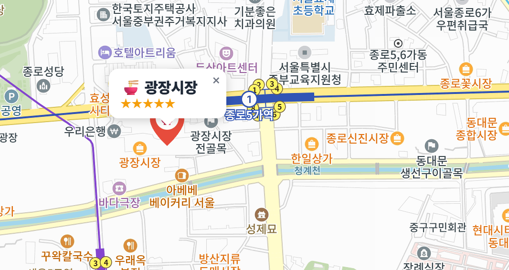
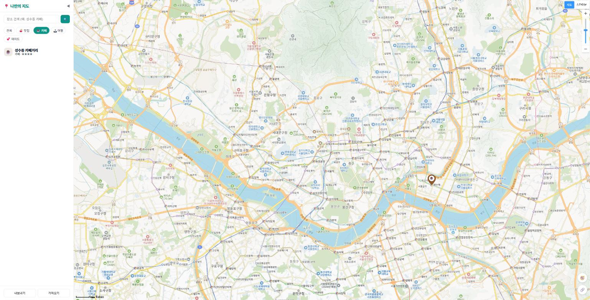
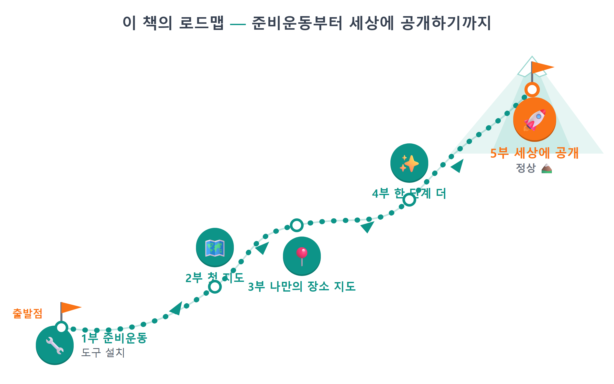

# 0장 이 책에서 만드는 것

!!! note "이 장에서 배우는 것"
    - 이 책에서 완성할 「나만의 지도」 웹앱이 어떤 모습인지 미리 봅니다
    - "바이브코딩"이 무엇이고, 왜 코드를 몰라도 앱을 만들 수 있는지 이해합니다
    - 시작하기 전에 윈도우 PC, 카카오 계정, Claude Pro 구독을 준비합니다
    - 5부 26장으로 이어지는 책 전체의 구성을 한눈에 파악합니다

---

## 0.1 완성된 모습

여러분이 좋아하는 장소만 모아 둔 지도를 하나 가지고 있다고 상상해 보십시오. 지난주에 방문한 국밥집, 오래 머물기 좋았던 카페, 나중에 가고 싶어 따로 기록해 둔 여행지 같은 곳들을 카카오지도에 핀으로 표시해 두고 언제든 다시 확인할 수 있다면 매우 유용할 것입니다. 이 책에서 함께 만들 「나만의 지도」가 바로 그런 용도의 애플리케이션입니다.

이 장에서는 설치나 설정, 코드 작성은 전혀 없습니다. 무엇을 만들 것인지 먼저 살펴보겠습니다.

{ width="760" }
/// caption
그림 0.1 — 완성된 「나만의 지도」 전체 화면
///

화면은 크게 두 부분으로 나뉩니다. 왼쪽의 사이드바에는 검색창, 카테고리 필터 버튼, 그리고 자신이 저장한 장소 목록이 위에서 아래로 보입니다. 오른쪽 영역은 지도가 화면 전체를 채우고 있으며, 지도에 표시된 핀은 카테고리별로 색상이 다릅니다. 즉 맛집은 주황색, 카페는 갈색, 여행지는 파란색, 데이트 코스는 분홍색으로 나타납니다. 색상만 살펴보아도 어느 지역에 카페를 많이 저장했는지 쉽게 알 수 있을 것입니다.

겉으로 보이는 모습은 간단하지만, 그렇다고 내부 기능까지 단순한 것은 아닙니다. 하나씩 자세히 살펴보겠습니다.

### 마커를 누르면 말풍선이 뜹니다

지도 위에 표시된 핀을 클릭해 보십시오. 해당 장소의 이름, 카테고리, 별점이 포함된 말풍선이 나타납니다. 이 말풍선은 HTML과 CSS를 이용해 직접 제작한 것이며, 아래쪽으로 뾰족하게 이어진 꼬리 부분 역시 직접 디자인한 내용입니다.

{ width="420" }
/// caption
그림 0.2 — 마커 클릭 시 나타나는 커스텀 말풍선
///

### 버튼 하나로 원하는 것만 골라 봅니다

사이드바 상단에 위치한 필터 버튼을 눌러 보십시오. "☕ 카페"을 선택하면 지도에 카페만 보이고, "전체"를 선택하면 다시 모든 장소가 표시됩니다. 데이트 코스를 준비할 때는 데이트 버튼을, 점심 식사 장소를 찾을 때는 맛집 버튼을 누르면 원하는 종류의 장소만 쉽게 확인할 수 있을 것입니다.

{ width="760" }
/// caption
그림 0.3 — 카테고리 필터로 카페만 표시한 화면
///

### 전국 어디든 검색해서 추가합니다

검색창에 "성수동 카페"라고 입력하면 카카오에서 제공하는 장소 데이터를 바탕으로 해당 가게를 찾아 목록으로 보여줍니다. 검색 결과를 선택하면 지도가 해당 위치로 이동하며, 더하기 버튼을 누르면 자신의 지도에 저장할 수 있습니다. 검색으로 찾을 수 없는 장소라면 지도의 빈 공간을 직접 클릭해 추가할 수도 있습니다. 예를 들어 "여기가 우리가 처음 만난 곳"와 같은 장소는 이런 방식으로 직접 추가하게 될 것입니다.

{ width="760" }
/// caption
그림 0.4 — 키워드 검색 결과와 장소 추가 버튼
///

### 별점과 메모까지, 나만의 기록이 쌓입니다

저장해 둔 장소를 클릭하면 상세 정보 패널이 열립니다. 여기서는 별점을 1점부터 5점까지 부여할 수 있으며, "웨이팅 김, 평일 오픈런 추천"와 같은 내용의 메모도 남길 수 있습니다. 더 이상 필요하지 않은 장소는 삭제 버튼을 눌러 정리하면 됩니다. 이렇게 기록한 내용은 브라우저에 저장되므로 다음에 다시 열어도 그대로 유지되며, 파일로 내보내면 다른 컴퓨터에서도 확인할 수 있습니다.

{ width="760" }
/// caption
그림 0.5 — 별점과 메모를 편집하는 상세 패널
///

지금까지 설명한 내용이 핵심 기능이며, 이어지는 부분에서는 추가 기능을 더하겠습니다. 나침반 모양 버튼을 누르면 현재 위치가 파란색 점으로 지도에 표시되고, 링크 모양 버튼을 누르면 현재 보고 있는 지도 위치의 링크가 클립보드에 복사됩니다. 이 링크를 친구에게 "여기서 보자"라고 공유할 수도 있을 것입니다. 장소가 100개 이상으로 늘어나 핀이 서로 겹쳐 보기 어려워지면, 가까운 위치의 핀끼리 자동으로 묶어 주는 기능도 함께 구현합니다. 스마트폰 화면에서도 잘 보이도록 최적화한 뒤에는 인터넷에 공개하여, 링크 주소만 알면 누구나 지도를 확인할 수 있도록 하겠습니다.

!!! tip "팁"
마커, 커스텀 오버레이, 필터, localStorage, 클러스터러 같은 기술 용어는 지금 외울 필요는 없습니다. 각 기능별로 설명 장을 따로 마련해 두었으니, 그때 다시 자세히 다루겠습니다. 지금은 어떤 내용을 만들 것인지 가볍게 살펴보고 넘어가면 충분합니다.

---

## 0.2 그런데, 코드는 누가 짜나요?

"이걸 내가 만든다고요? 저는 코딩을 못하는데요."라고 생각하셨을 수도 있습니다.

이 책에서는 코드 작성을 AI가 담당합니다. 여러분은 만들고 싶은 내용을 한국어로 설명하기만 하면 되며, 다음과 같은 방식으로 요청하게 될 것입니다.

!!! tip "이렇게 물어보세요"
    > 지도를 화면 전체에 꽉 차게 띄워줘. 카카오지도 JS SDK를 쓰고, 키는 .env에서 읽어줘.

위와 같이 요청하면 Claude Code라는 AI 도구가 필요한 파일을 생성하고 코드를 작성한 뒤 실행까지 해줍니다. 만들어진 결과는 브라우저에서 확인할 수 있으며, 만약 마음에 들지 않는다면 다시 설명해 수정하도록 요청하면 됩니다. 이렇게 "말풍선이 너무 작아. 글자를 키우고 그림자를 넣어줘"처럼 요청을 이어가다 보면 애플리케이션이 점차 완성되는 모습을 확인할 수 있을 것입니다.

이런 개발 방식을 바이브코딩(vibe coding)[^1]이라고 부릅니다. 코드를 직접 한 줄씩 입력하는 대신 만들고 싶은 기능을 말로 설명하고, AI가 작성한 코드를 읽어보며 함께 수정해 나가는 방식입니다. 따라서 이 책에는 코드를 복사해 붙여넣는 실습은 포함하지 않으며, 대신 각 실습마다 "이렇게 시키세요" 형식의 프롬프트 예시를 제시해 둡니다. 제시된 프롬프트를 참고해 AI에게 요청하고, 돌아온 결과 코드를 책의 내용과 함께 한 줄씩 확인해 보시기 바랍니다. 바이브코딩이 최근에 가능해진 배경에 관해서는 1장에서 자세히 설명하겠으니, 여기서는 전체적인 흐름만 파악하고 넘어가면 됩니다.

{ width="760" }
/// caption
그림 0.6 — 바이브코딩의 흐름: 요청하기 → AI가 코드 작성 → 함께 검토하기 → 결과 확인하기
///

그렇다고 코드를 전혀 몰라도 된다는 의미는 아닙니다. 코드 작성은 AI가 담당하지만, 작성된 내용을 이해하는 일까지 맡길 수는 없습니다. 코드가 어떤 역할을 하는지 기본적으로 알고 있어야 문제가 발생했을 때 원인을 파악하고, 원하는 방향으로 수정하도록 요청할 수 있기 때문입니다. 이 책에서는 코드를 직접 작성할 수준까지 설명하지 않으며, 단지 코드의 내용을 이해할 수 있을 정도로만 설명하겠습니다. 따라서 모든 내용을 암기할 필요는 없습니다.

이 책에서 설명하는 애플리케이션 역시 저자가 이 책에서 제시하는 방식 그대로 Claude Code에 요청해 제작한 것이며, 책에 수록된 코드 역시 AI가 작성한 뒤 사람이 검토한 내용을 그대로 옮긴 것입니다.

!!! warning "주의"
바이브코딩이라고 해서 아무것도 몰라도 된다고 생각하지는 마십시오. AI는 가끔 오류를 범합니다. 요청한 내용과 다른 엉뚱한 코드를 작성하거나, 의도하지 않은 기능을 추가해 놓을 수도 있습니다. 그래서 이 책에서는 작은 단위로 요청하고, 결과를 확인하며, 문제가 있으면 즉시 수정하는 습관을 처음부터 함께 익히도록 하겠습니다. 이런 습관이 갖춰져 있지 않으면, AI가 잘못 작성했을 때 어디서부터 문제가 생겼는지 찾기 어려울 것입니다. 자세한 내용은 1장에서 다루겠습니다.

---

## 0.3 준비물 세 가지

실습에 필요한 준비물은 윈도우 PC, 카카오 계정, 그리고 Claude Pro 구독 권한입니다.

가장 먼저 윈도우 PC가 필요합니다. 이 책의 화면과 설치 과정은 윈도우 10과 윈도우 11을 기준으로 설명합니다. 고사양 컴퓨터가 아니어도 괜찮으며, 인터넷 연결이 가능하고 크롬 브라우저를 실행할 수 있으면 충분합니다. 맥 컴퓨터에서도 실습할 수 있으나, 일부 설치 화면은 책의 내용과 다르게 보일 수 있습니다.

다음으로는 카카오 계정이 필요합니다. 카카오톡을 사용하고 계신다면 이미 가지고 계실 것입니다. 이 책에서 사용하는 지도는 카카오에서 제공하는 카카오지도 API[^2]를 이용하며, 이 API를 활용하려면 카카오 개발자 사이트에서 키를 발급받아야 합니다. 키 발급은 무료이며, 이 책의 실습 수준에서는 별도의 이용료가 부과되지 않습니다. 발급 절차는 7장에서 화면과 함께 자세히 설명하겠습니다.

마지막으로는 Claude Pro 구독이 필요합니다. 코드를 대신 작성해 주는 Claude Code를 이용하려면 Claude Pro 구독이 필수적입니다. 월 약 20달러 정도이므로 전혀 부담이 없다고 할 수는 없지만, 실습 전 과정에서 가장 많이 사용하게 될 도구이므로 최소 한 달 정도만이라도 구독해 따라오시기를 권장합니다. 실습을 처음부터 끝까지 마치는 데 한 달이면 충분합니다. 만약 구독이 어렵다면, opencode나 codex 같은 무료 도구를 이용해도 실습할 수 있으며, 해당 도구들에 관해서는 4장에서 소개하겠습니다.

!!! tip "팁"
당장 구독이 부담스럽다면 무료 도구를 사용해도 좋습니다. 4장에서 opencode와 같이 무료로 이용할 수 있는 도구를 별도로 안내할 예정입니다. 프롬프트를 작성해 요청하고 결과를 확인하는 전체적인 흐름은 어떤 도구를 사용하든 비슷하므로, 책의 내용을 그대로 따라오실 수 있을 것입니다.

프로그래밍 경험은 전혀 없어도 괜찮습니다. 변수나 함수가 무엇인지 몰라도 실습을 시작할 수 있으며, 필요한 개념은 실제로 필요한 시점에 필요한 만큼만 설명하겠습니다.

---

## 0.4 책의 구성: 5부 26장

이 책은 전체 5부, 총 26개 장으로 구성되어 있습니다.

{ width="760" }
/// caption
그림 0.7 — 이 책의 로드맵: 준비운동부터 세상에 공개하기까지
///

제1부 「바이브코딩 준비운동」(1~6장)에서는 실습 환경을 준비합니다. 바이브코딩이 왜 최근에 배우기 적절한 방식인지 알아본 뒤, 저자가 실제로 사용하는 도구들 — Node.js, Git, Claude Code, GitHub CLI, 그리고 여러 AI 도구를 함께 활용하는 Orca — 을 차례로 설치합니다. 설치 과정이 다소 지루하게 느껴질 수 있으나, 여기서 준비한 도구들은 책의 마지막 장까지 계속 사용하게 되므로 꼼꼼히 준비하시기 바랍니다.

제2부 「카카오 지도 첫걸음」(7~10장)에서는 지도를 화면에 표시하는 실습을 합니다. 카카오 개발자 계정을 만들고 API 키를 발급받은 뒤, Vite로 프로젝트를 생성하면 브라우저 화면 전체에 지도가 나타납니다. 이어서 지도를 이동하거나 확대하는 기본적인 조작 방법을 익히며, 요청을 통해 직접 지도를 표시해 보는 실습은 9장에서 진행합니다.

제3부 「나만의 장소 지도 만들기」(11~19장)는 이 책에서 가장 분량이 많은 부분입니다. 지도에 마커를 표시하고 장소 데이터 구조를 설계하며, 말풍선을 추가하고, 필터와 검색 기능을 구현한 뒤, 클릭으로 장소를 추가하는 기능을 만듭니다. 또한 브라우저에 데이터를 저장해 페이지를 다시 열어도 내용이 유지되도록 하고, 저장된 장소를 목록과 상세 패널에서 관리하는 기능까지 구현합니다. 제3부를 마치면 그림 0.1과 같은 화면이 여러분의 브라우저에 나타나게 될 것입니다.

제4부 「한 단계 더」(20~23장)에서는 기본 기능에 추가적인 기능을 더합니다. 현재 위치 표시, 링크를 통한 지도 공유, 마커가 100개 이상이어도 성능이 유지되도록 하는 클러스터러 기능, 그리고 모바일 화면에서도 잘 보이도록 하는 반응형 디자인 적용을 차례로 다루겠습니다.

제5부 「세상에 공개하기」(24~26장)에서는 완성한 애플리케이션을 GitHub에 업로드하고, GitHub Pages를 이용해 인터넷에 공개하여 누구나 접속할 수 있는 주소를 얻는 과정을 설명합니다. 이 과정을 마치면 친구에게 링크를 공유해 함께 지도를 확인해 볼 수 있을 것입니다.

부록은 두 가지가 준비되어 있습니다. 부록 A에는 책에서 사용한 프롬프트를 상황별로 정리해 두었으며, 부록 B에는 "지도가 회색으로 나와요"와 같이 실습 도중 자주 발생하는 문제와 해결 방법을 표로 정리해 두었습니다. 실습 도중 진행이 막히면 가장 먼저 부록을 확인해 보시기 바랍니다.

!!! tip "팁"
이 책은 순서대로 읽으며 실습하도록 구성되어 있으나, 이미 설치한 도구가 있다면 해당 부분은 건너뛰어도 좋습니다. 예를 들어 Node.js와 Git을 이미 사용하고 있다면 2장과 3장에서는 버전 확인만 하고 넘어가도 무방합니다. 다만 7장(카카오 API 키 발급)과 8장(프로젝트 시작)은 건너뛸 수 없습니다.

---

## 0.5 마무리

!!! abstract "이 장의 핵심"
    - 카카오지도를 바탕으로 「나만의 지도」 웹앱을 완성해 인터넷에 배포합니다.
    - 완성 앱에는 마커·말풍선·카테고리 필터·검색·장소 추가·저장·상세 패널·위치·공유·클러스터·모바일 대응이 들어갑니다.
    - 코드는 Claude Code가 작성하고, 사용자는 말로 시킨 뒤 결과를 읽고 확인합니다. 이 방식을 바이브코딩이라고 부릅니다.
    - 준비물은 윈도우 PC, 카카오 계정, Claude Pro(또는 무료 대안 에이전트) 세 가지이며 프로그래밍 경험은 필요 없습니다.
    - 책은 5부 26장으로, 도구 준비 → 첫 지도 → 나만의 지도 → 업그레이드 → 세상에 공개 순으로 나아갑니다.

!!! question "잠깐 생각해 봅시다"
Q1. 자신만의 지도에 담고 싶은 장소는 어디인가요? 카테고리(맛집/카페/여행/데이트)별로 떠오르는 장소를 2~3곳씩 적어 보십시오. 이 책을 따라 실습하는 동안 여기서 적은 장소 정보가 실제 지도에 반영될 데이터가 될 것입니다.

____________________________________________

____________________________________________

Q2. "코드를 직접 타이핑하는 대신 AI에게 말로 시킨다"라는 개발 방식에 대해 기대되는 점과 걱정되는 점을 하나씩 적어 보십시오.

____________________________________________

____________________________________________

!!! example "확인 문제"
    1. 그림 0.1의 완성 화면에서 찾을 수 있는 기능을 다섯 가지 이상 말해 보세요.
    2. 이 책의 준비물 세 가지는 무엇인가요? 그중 지금 내가 이미 갖춘 것과 새로 준비해야 할 것을 구분해 보세요.
    3. 3부가 끝났을 때와 5부가 끝났을 때, 내 앱은 각각 어떤 상태일까요? 한 문장씩 설명해 보세요.

!!! info "더 찾아보기"
    - `카카오맵` — 우리가 만들 앱의 바탕이 되는 지도 서비스. map.kakao.com에서 완성된 서비스를 미리 살펴보세요.
    - `구글 마이맵(My Maps)` — 구글이 제공하는 "나만의 지도" 서비스. 우리가 만들 앱과 비슷한 개념이라 비교해 볼 만합니다.
    - `PWA(프로그레시브 웹앱)` — 웹앱을 스마트폰 홈 화면에 설치해 앱처럼 쓰는 기술. 이 책 이후의 확장 아이디어입니다.

> 다음 장으로. 1장에서는 이 책의 개발 방식인 바이브코딩을 자세히 다룹니다. 이제는 코드를 몰라도 앱을 만들 수 있는 이유를 살펴보고, 저자가 Claude Code와 Orca를 함께 쓰는 방식을 봅니다. AI에게 일을 시킬 때 지켜야 할 작게 시키기, 확인하기, 되돌리기도 여기서 배웁니다.

[^1]: 바이브코딩(vibe coding): AI에게 자연어로 요구사항을 말하고 AI가 작성한 코드로 소프트웨어를 만드는 개발 방식. 2025년 초 AI 연구자 안드레이 카파시(Andrej Karpathy)가 소셜 미디어에서 처음 쓴 뒤 널리 퍼진 표현입니다.
[^2]: API(Application Programming Interface): 다른 회사의 서비스(여기서는 카카오지도)를 내 프로그램에서 가져다 쓸 수 있게 열어 둔 창구. 카카오지도 API를 쓰면 카카오가 만든 지도를 우리 웹앱 안에 띄울 수 있습니다.

