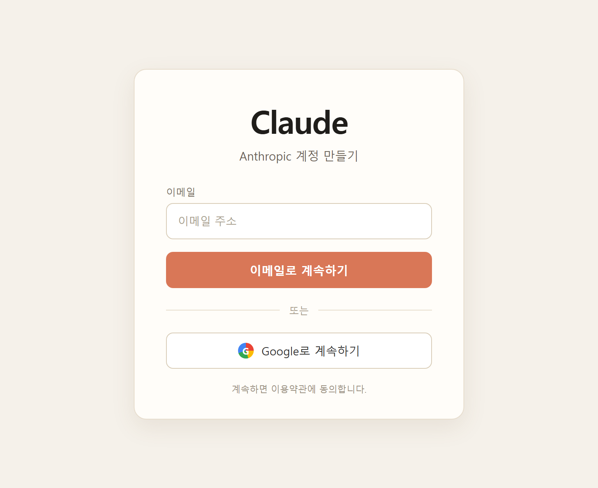
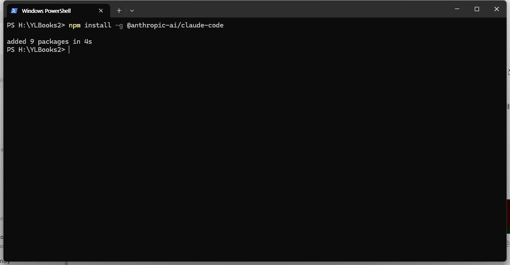
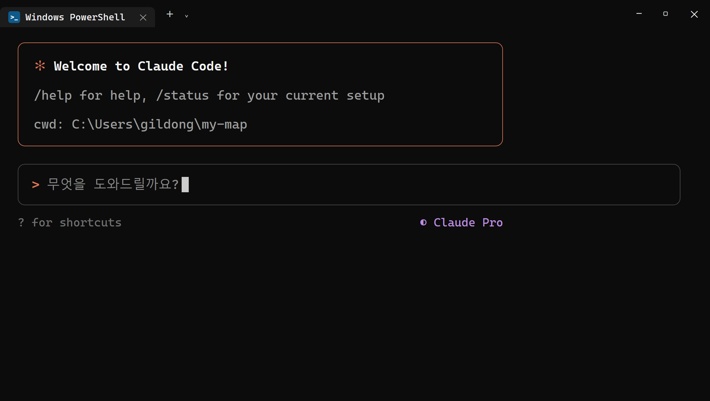
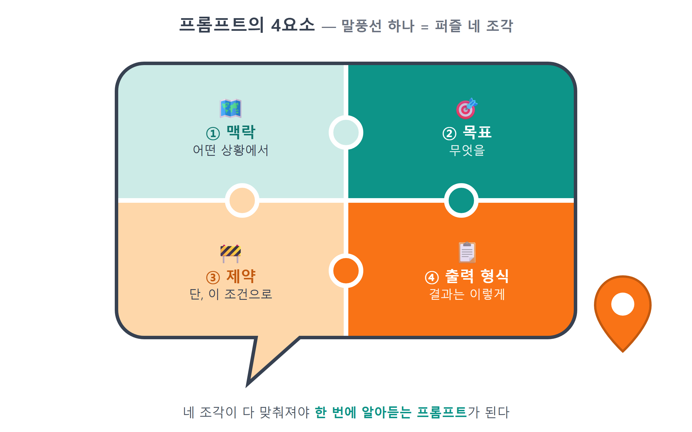
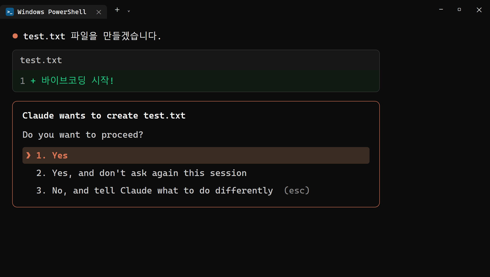

# 4장 Claude Code 설치와 첫 사용

!!! note "이 장에서 배우는 것"
    - Claude 계정을 만들고 Pro 플랜을 준비하는 방법
    - npm으로 Claude Code를 설치하고 첫 실행·로그인까지 마치는 방법
    - 좋은 프롬프트의 4요소: 맥락·목표·제약·출력 형식
    - 권한 프롬프트가 뜨는 이유와 안전하게 허용하는 기준

---

## 4.1 Claude Code란

2장에서는 Node.js를 설치하였고, 3장에서는 Git을 설치하였습니다. 이제 이 책에서 가장 자주 사용하게 될 Claude Code를 설치하도록 하겠습니다.

Claude Code는 Anthropic에서 개발하였으며 터미널에서 작동합니다. 챗봇에 질문하고 답변을 복사해 오는 방식으로 사용하는 도구가 아닙니다. 프로젝트 폴더에 직접 접근하여 파일을 읽고, 코드를 작성하고, 명령을 실행하며, 오류가 발생하면 스스로 수정합니다. "지도를 화면에 띄워줘"라고 요청하시면 어떤 파일을 생성해야 하는지 스스로 판단하여 만들어 줍니다.

코드를 복사하여 붙여넣을 필요가 없다는 점이 기존 방식과의 차이점입니다.

챗봇으로 코딩을 할 경우에는 보통 다음과 같은 과정을 거칩니다. 코드를 받아 붙여넣었더니 오류가 발생하고, 오류 메시지를 다시 복사하여 챗봇에 보여주고, 수정된 코드를 또 다시 붙여넣는 과정을 반복합니다. 이러한 왕복 작업이 전체 작업 시간의 상당 부분을 차지할 수도 있습니다. Claude Code에서는 이 과정이 생략됩니다. 오류가 발생하면 스스로 내용을 파악하고 수정하므로, 여러분은 전체적인 방향만 제시해 주시면 됩니다.

{ width="760" }
/// caption
그림 4.1 — 챗봇 방식과 Claude Code 방식의 차이
///

이런 방식으로 작동하는 프로그램을 에이전트(agent)라고 부릅니다. 단순히 질문에 답변하는 프로그램이 아닙니다. 목표를 전달받으면 스스로 계획을 세우고 필요한 도구를 선택하여 사용합니다. 중간 결과를 확인하면서 다음 행동도 스스로 결정할 수 있습니다. 1장에서 에이전트에게 업무를 요청할 때 준수해야 할 사항에 대해 설명드렸습니다. 그 에이전트가 바로 Claude Code입니다. 여러분이 직접 코드를 작성하지 않아도 업무를 지시할 수 있으며, 무엇을 만들지 결정하고 진행 상황을 확인하며, 방향이 잘못되었을 경우 바로잡기만 하면 됩니다.

지도를 표시하고, 마커를 찍고, 검색 기능을 추가한 뒤 배포하는 작업까지, 이 책의 나머지 모든 실습은 이 도구에 요청하여 진행할 것입니다. 따라서 이번 장에서는 설치 방법과 함께, 원하는 결과를 얻기 위해서는 어떻게 요청해야 하는지에 대해 자세히 알아보겠습니다.

## 4.2 계정 만들기와 Pro 플랜

Claude Code를 사용하려면 Claude 계정이 필요합니다. 아직 계정이 없으시다면 지금 생성하도록 하겠습니다.

1. 브라우저에서 claude.ai 에 접속합니다.
2. 구글 계정으로 가입하거나 이메일 주소로 가입합니다. 이메일로 가입하면 인증 메일이 올 겁니다. 받은편지함을 확인해 주세요.
3. 가입이 끝나면 채팅 화면이 열릴 겁니다. 이 계정 하나로 웹의 Claude와 터미널의 Claude Code를 모두 쓸 수 있습니다.

{ width="560" }
/// caption
그림 4.2 — claude.ai 가입 화면 (예시)
///

가입 시 사용하신 이메일 주소는 기억해 두시는 것이 좋습니다. 잠시 후 터미널에서 로그인할 때 동일한 계정을 사용해야 하기 때문입니다. 만약 계정을 여러 개 사용하실 경우, 결제한 계정과 로그인한 계정이 달라질 수 있습니다. 이 경우 문제가 발생하더라도 원인을 파악하기 어려울 수 있기 때문입니다.

이용 플랜도 선택하셔야 합니다. 무료 플랜으로도 Claude와 대화할 수는 있지만, Claude Code를 지속적으로 사용하시려면 월 20달러 수준의 Pro 플랜을 권장합니다. 이 책의 실습 내용은 Pro 플랜을 기준으로 진행하겠습니다. 화면 왼쪽 아래 프로필 → 설정 메뉴에서 플랜을 업그레이드하실 수 있습니다.

책 한 권을 따라 하기 위해 유료 결제를 해야 하는지 망설여지실 수도 있습니다. 이 책의 실습 내용은 한 달이면 처음부터 끝까지 모두 마칠 수 있는 분량입니다. 따라서 한 달 동안만 구독하고 이후 해지하셔도 전혀 문제가 없습니다. 만약 결제에 부담을 느끼신다면 이 장 끝부분에 있는 무료 대안 안내 부분을 참고하시기 바랍니다. 책의 전체적인 흐름은 다른 도구를 사용하여 따라 하시는 것도 충분히 가능합니다.

!!! warning "주의"
Pro 플랜에도 사용량에 대한 제한은 있습니다. 일정 기간 동안 사용할 수 있는 양이 미리 정해져 있기 때문입니다. 긴 작업을 쉬지 않고 연속적으로 요청하시면 "한도에 도달했다"라는 안내 메시지가 표시되고 잠시 기다려야 하는 상황이 발생할 수 있습니다. 이것은 시스템의 고장이 아니라 정상적인 동작입니다. 안내된 시간이 지나면 다시 사용하실 수 있습니다. 이 책에서 진행하는 실습 분량은 Pro 플랜의 사용 제한 범위 내에서 모두 처리할 수 있습니다.

## 4.3 설치: 명령어 한 줄이면 됩니다

2장에서 Node.js를 설치하실 때 npm이 함께 설치되었습니다. 이제 그 npm을 처음으로 사용해 보도록 하겠습니다. Windows Terminal이나 PowerShell을 연 다음 제시된 명령어 한 줄을 입력하시기 바랍니다.

```
npm install -g @anthropic-ai/claude-code
```

입력하신 명령어의 구성 요소를 자세히 살펴보면 다음과 같습니다.

- `npm install` — 패키지를 설치하라.
- `-g` — global(전역)의 약자. 지금 폴더만이 아니라 컴퓨터 어디서든 쓸 수 있게 설치하라는 뜻입니다. Claude Code는 앞으로 모든 프로젝트에서 부를 도구이므로 전역으로 설치합니다.
- `@anthropic-ai/claude-code` — 패키지 이름. `@anthropic-ai/`는 Anthropic 팀이 배포한 공식 패키지라는 소속 표시입니다.

설치 진행 막대가 모두 지나가고 관련 로그가 몇 줄 출력되면 설치 작업이 완료된 것입니다.

{ width="760" }
/// caption
그림 4.3 — npm으로 Claude Code 설치 (출력 예시)
///

정상적으로 설치되었는지 확인해 보도록 하겠습니다. Node.js를 `node -v`로 확인했던 것과 동일한 방식으로 진행하시면 됩니다.

```
claude --version
```

버전 번호가 정상적으로 출력되면 설치가 제대로 완료된 것이라고 이해하시면 됩니다. Claude Code는 업데이트가 비교적 잦은 도구이기 때문에, 책에 수록된 화면 내용과 실제 여러분의 화면이 약간 다르게 보일 수 있습니다. 다만 설치, 실행, 요청 및 승인이라는 기본적인 작업 흐름 자체가 달라지지는 않습니다. 최신 버전으로 업그레이드하시려면 설치할 때와 동일한 명령어를 한 번 더 실행하시면 됩니다.

{ width="760" }
/// caption
그림 4.4 — claude --version으로 설치 확인
///

!!! tip "팁"
`claude`를 입력했는데 "명령을 찾을 수 없습니다"라는 오류 메시지가 나타난다면 터미널 창을 새로 열어 보시기 바랍니다. 대부분의 경우 이 방법으로 문제가 해결됩니다. 설치 직후에는 기존에 열려 있던 터미널 창이 새로 설치된 명령어의 위치를 인식하지 못하는 경우가 있기 때문입니다. 이 문제는 2장에서 설명드린 환경 변수 PATH와 관련된 현상입니다. 새 터미널 창에서도 동일한 문제가 발생한다면 `npm install -g @anthropic-ai/claude-code`를 한 번 더 실행해 보시기 바랍니다.

## 4.4 첫 실행과 로그인

이제 본격적으로 실행해 보도록 하겠습니다. 연습용 폴더를 하나 만들고 그 안에서 프로그램을 실행해 보겠습니다. Claude Code는 실행 시점의 폴더 내에 있는 파일만을 대상으로 작업을 수행합니다. 따라서 아무 곳에서나 실행하지 마시고, 작업할 프로젝트 폴더 내에서 실행하는 습관을 들이시는 것이 좋습니다.

```
mkdir hello-claude
cd hello-claude
claude
```

`mkdir`로 폴더를 생성하고 `cd`로 해당 폴더로 이동합니다. 마지막 줄의 `claude`를 입력하여 Claude Code를 실행하시면 됩니다.

처음 실행하시면 몇 가지 초기 설정 화면이 나타납니다. 화면 테마를 선택하는 과정이므로 평소에 선호하시는 것을 선택하시면 됩니다. 그 다음으로는 로그인 절차를 진행하게 됩니다. 로그인 방법을 묻는 화면에서 Pro 플랜 구독 계정으로 로그인하는 항목을 선택하시기 바랍니다. 그러면 브라우저가 자동으로 실행되면서 claude.ai 인증 페이지로 연결됩니다. 4.2절에서 생성하신 계정으로 로그인하신 후 승인 버튼을 눌러 주시기 바랍니다. 다시 터미널 창으로 돌아오면 "로그인 완료"라는 안내 메시지가 표시될 것입니다.

{ width="760" }
/// caption
그림 4.5 — Claude Code 첫 실행 화면
///

로그인 절차까지 완료되면 입력창이 깜빡이는 대화 화면이 나타납니다. 앞으로 이 책의 실습 내용은 대부분 이 화면에서 진행하게 될 것입니다. 가장 간단한 요청부터 한 번 시도해 보도록 하겠습니다.

!!! tip "이렇게 물어보세요"
    > 안녕! 이 폴더에 hello.txt 파일을 만들고, 그 안에 "바이브코딩 시작!"이라고 써줘.

Claude Code가 파일을 생성해도 되는지 권한을 묻는 화면이 표시됩니다. 이 화면에 대한 자세한 내용은 4.6절에서 다루도록 하겠습니다. 허용을 선택하시면 요청하신 대로 파일이 생성됩니다. 파일 탐색기로 해당 폴더를 열어보시면 `hello.txt`가 생성된 것을 확인하실 수 있습니다. 여러분이 직접 코드를 한 줄도 입력하지 않았지만 파일이 만들어진 것입니다.

이번에는 파일을 생성하는 요청이 아니라, 질문하여 답변을 받는 방식으로 사용해 보겠습니다.

!!! tip "이렇게 물어보세요"
    > 방금 무슨 일을 했는지, 그리고 이 폴더에 지금 어떤 파일이 있는지 정리해서 알려줘.

그러면 Claude Code가 해당 폴더의 내용을 살펴보고 현재 상황에 대해 간략하게 요약하여 알려줄 것입니다. 이 사용 방법을 잘 기억해 두시기 바랍니다. 앞으로 이해하기 어려운 코드가 나올 때마다 "이 코드가 무슨 뜻인지 설명해줘", "왜 이렇게 짰어?"라고 질문하시면 됩니다. 이 책에서는 이러한 방식으로 내용을 배워나가도록 구성하였습니다. 궁금한 부분이 있을 때마다 언제든지 질문할 수 있으므로, 1장에서 강조드린 "이해하려 노력하되 외우지 않는다"라는 학습 방침도 자연스럽게 준수하실 수 있을 것입니다. 내용에 대한 설명을 요청하는 경우에는 파일의 내용이 변경되지 않으므로 별도의 권한 요청 메시지도 나타나지 않습니다.

대화를 종료하고 싶으실 때는 `/exit`를 입력하시거나 키보드에서 Ctrl+C 키를 두 번 누르시면 종료됩니다. 다시 시작하실 경우에는 동일한 폴더에서 `claude`를 다시 실행하시면 됩니다.

!!! tip "팁"
입력창에 `/`를 입력하시면 슬래시 명령어의 전체 목록이 표시됩니다. 지금 모든 명령어를 외울 필요는 없으며, `/exit`(종료), `/clear`(대화 내용 초기화), `/help`(도움말) 이 세 가지만 우선 기억해 두시기 바랍니다. 나머지 명령어들은 필요할 때마다 책에서 하나씩 차근차근 설명해 드리겠습니다.

## 4.5 요청하는 법: 프롬프트의 4요소

이로써 설치 작업은 모두 완료되었습니다. 이제 원하는 결과를 얻기 위해서는 어떻게 요청해야 하는지에 대해 자세히 알아보도록 하겠습니다.

Claude Code는 오직 여러분이 전달한 내용만을 이해할 수 있습니다. 동일한 작업을 요청하더라도 어떻게 표현하여 전달하는지에 따라 결과물이 크게 달라질 수 있습니다. 이처럼 AI에게 보내는 요청문을 프롬프트(prompt)라고 부릅니다. 좋은 프롬프트에는 반드시 네 가지 요소가 포함되어야 합니다. 구체적인 상황 설명, 목표, 준수해야 할 제약 사항, 그리고 결과물의 형식입니다.

{ width="760" }
/// caption
그림 4.6 — 프롬프트의 네 가지 요소
///

각 요소를 하나씩 자세히 살펴보도록 하겠습니다. 제시해 드리는 예시들은 모두 앞으로 만들게 될 지도 앱과 관련된 내용이므로 크게 낯설지 않으실 것입니다.

① 상황 설명(Context). 현재 어떤 상황인지에 대해 알려주는 부분입니다. Claude Code는 폴더 안에 있는 파일들의 내용을 읽어볼 수는 있지만, 여러분이 최종적으로 무엇을 만들려고 하는지까지 스스로 파악하지는 못합니다. 프로젝트의 성격과 현재까지의 진행 상황에 대해 한 줄이라도 간략히 설명해 주시면, 보다 정확한 결과물을 얻으실 수 있습니다.

- 나쁜 예: "지도 띄워줘." 어떤 지도인지, 무슨 프로젝트인지 알 수가 없습니다.
- 좋은 예: "카카오지도 JS SDK를 쓰는 Vite 바닐라 JS 프로젝트야. 지금 빈 페이지 상태고, 여기에 지도를 띄우고 싶어."

② 목표(Goal). 원하는 결과물의 모습을 구체적으로 작성하는 부분입니다. "잘 만들어줘"라고만 간략히 적어서는 어떤 내용을 어떤 방식으로 만들어야 하는지 AI가 정확히 알지 못합니다. 완성되었을 때의 모습을 상상할 수 있을 정도로 구체적으로 작성하는 것이 좋습니다.

- 나쁜 예: "마커 기능 추가해줘."
- 좋은 예: "장소 데이터에 있는 맛집 5곳에 마커를 찍고, 마커를 클릭하면 가게 이름이 말풍선으로 뜨게 해줘."

③ 제약 사항(Constraints). 작업에서 지켜야 할 규칙과 하지 말아야 할 내용을 명시하는 부분입니다. 네 가지 요소 중에서 가장 빠뜨리기 쉬운 부분이기도 합니다. 별도의 제약을 제시하지 않으면, AI가 불필요한 파일을 여러 개 만들거나, 사용하지 않을 라이브러리를 임의로 설치하거나, 심지어 정상적으로 작동하던 기존 코드까지 변경해 버릴 수도 있습니다. 변경하지 말아야 할 범위와 준수해야 할 사항을 명확히 적어 주시기 바랍니다.

- 예: "라이브러리는 새로 설치하지 말고, mapView.js 파일 하나만 수정해줘."
- 예: "지도 키는 코드에 직접 쓰지 말고 .env에서 읽어줘."

④ 결과물 형식(Output). 결과물을 어떤 형태로 전달받고 싶은지 명시하는 부분입니다. 코드만 받을 것인지, 설명과 함께 받을 것인지, 혹은 정상 작동하는지 확인하는 방법까지 함께 받을 것인지를 미리 알려주시면, 불필요한 질문이 오고 가는 횟수를 줄일 수 있습니다.

- 예: "바뀐 부분만 보여주고, 왜 그렇게 했는지 한 줄씩 설명해줘."
- 예: "다 만들면 브라우저에서 확인하는 방법을 알려줘."

이 네 가지 요소를 모두 포함하여 작성하면 다음과 같은 형태의 프롬프트가 됩니다.

!!! tip "이렇게 물어보세요"
    > 카카오지도 JS SDK를 쓰는 Vite 바닐라 JS 프로젝트야. (맥락)
    > 장소 데이터의 맛집 5곳에 마커를 찍고, 클릭하면 가게 이름 말풍선이 뜨게 해줘. (목표)
    > 새 라이브러리 설치는 하지 말고 mapView.js만 수정해. (제약)
    > 바뀐 부분만 보여주고 한 줄씩 설명해줘. (출력 형식)

`hello-claude` 폴더로 이동하여, 위에서 설명드린 네 가지 요소를 모두 갖춘 프롬프트를 직접 실행해 보도록 하겠습니다.

!!! tip "이렇게 물어보세요"
    > 여기는 연습용 폴더야. (맥락)
    > 내가 좋아하는 장소 세 곳의 이름과 한 줄 소개를 담은 places.txt 파일을 만들어줘. (목표)
    > 파일은 하나만 만들고, 내용은 한국어로 써. (제약)
    > 다 만들면 파일 내용을 보여줘. (출력 형식)

비교를 위해 현재의 대화 내용을 `/clear`로 초기화한 뒤, 이번에는 "장소 파일 만들어줘"라고만 간략히 요청해 보겠습니다. 그러면 AI가 어떤 장소를 어떤 방식으로 보여줄지 스스로 판단하여 작성하게 될 것입니다. 결과물의 완성도가 낮다는 의미는 아닙니다. 다만 여러분이 기대하셨던 내용과 다를 가능성이 매우 높습니다. 프롬프트의 내용이 구체적일수록 AI가 추측해야 하는 부분이 줄어들고, 그만큼 원하는 결과물을 얻기 위해 작업을 다시 요청하는 횟수도 줄어들게 됩니다.

매번 프롬프트에 네 가지 요소를 모두 포함해야 하는 것은 아닙니다. "오타 고쳐줘"와 같은 간단한 요청의 경우에는 한 줄의 내용으로도 충분히 의미가 전달됩니다. 다만 결과물이 기대한 것과 다를 경우, 작성했던 프롬프트를 다시 검토해 보시면 네 가지 요소 중 하나 이상이 빠져 있는 경우가 대부분입니다. 그럴 때 이 네 가지 기준을 바탕으로 프롬프트를 수정해 보시기 바랍니다. 앞으로 이 책에 제시되는 모든 "이렇게 물어보세요" 박스도 이 네 가지 요소를 기준으로 작성하였습니다. 박스의 내용을 읽으실 때 각 부분이 상황 설명과 제약 사항 중 어디에 해당하는지 찾아보시면, 프롬프트 작성 방법에 보다 익숙해지실 수 있을 것입니다.

!!! tip "팁"
1장에서 설명드린 "작게 시키기"의 원칙도 함께 준수하셔야 합니다. 네 가지 요소를 모두 갖추었다고 하더라도 "지도 앱 전부 다 만들어줘"와 같이 한 번에 너무 큰 목표를 제시하면, 결과물을 확인하기도 하고 잘못되었을 때 되돌리기도 어렵게 됩니다. 따라서 지도 표시하기, 그 다음 마커 표시하기, 그 다음 말풍선 추가하기처럼 한 번에 한 단계씩 차근차근 요청하시기 바랍니다.

## 4.6 안전하게 쓰기: 권한 프롬프트 읽는 법

앞서 4.4절에서 파일 하나를 생성할 때도 Claude Code가 권한 확인을 요청하는 것을 보셨을 것입니다. 이처럼 권한을 확인하는 절차가 Claude Code의 안전 장치라고 할 수 있습니다.

Claude Code는 실제로 여러분의 컴퓨터에 저장된 파일을 수정하고 명령어를 실행하는 도구입니다. 그렇기 때문에 잘못된 지시를 한 번 내리게 되면 예기치 않은 피해가 발생할 수도 있습니다. 이러한 위험을 방지하기 위하여 Claude Code는 파일을 생성하거나 수정할 때, 그리고 명령어를 실행할 때 먼저 어떤 작업을 진행할 것인지 계획을 보여주고 승인을 요청하게 됩니다.

{ width="760" }
/// caption
그림 4.7 — 권한 확인 요청 화면
///

작업의 진행을 승인할지 여부를 판단하는 기준은 매우 간단합니다.

- 파일 만들기·수정: 대상 파일이 내 프로젝트 폴더 안이고, 보여준 변경 내용이 내가 시킨 일과 맞으면 허용합니다.
- 명령 실행: 무슨 명령인지 읽어 봅니다. 패키지를 설치하는 `npm install`이나 개발 서버를 띄우는 `npm run dev`처럼 이 책에서 배운 명령이면 허용해도 좋습니다.
- 모르겠으면 물어보기: 승인하기 전에 "이 명령이 뭐 하는 건지 먼저 설명해줘"라고 입력하면 됩니다. 그러면 Claude Code가 설명한 뒤 다시 승인을 묻습니다. 모르는 것을 승인하지 않는 습관 하나로 대부분의 위험을 막을 수 있습니다.

반대로 권한을 승인하지 않고 내용을 확인해야 하는 경우도 있습니다. 요청한 적이 없는 파일을 삭제하려고 할 때, 프로젝트 폴더 바깥의 파일이나 경로를 변경하려고 할 때, 그리고 처음 보는 프로그램을 설치하려고 할 때가 그렇습니다. 이러한 경우에는 승인을 거절하셔도 전혀 문제가 없습니다. 승인을 거절하면 Claude Code가 다른 방법을 제시하거나 작업을 진행하려는 이유에 대해 설명해 줄 것입니다. "그 파일은 지우지 말고 다른 방법을 찾아봐"라고 승인을 거절한 뒤에 원하는 방향을 제시해 보시기 바랍니다. 그러면 앞서 배운 제약 사항을 추가로 명시한 것과 동일한 효과를 얻으실 수 있습니다.

매번 권한을 확인하는 과정이 번거롭게 느껴진다면 "이번 세션 동안 같은 종류는 허용"와 같은 선택지를 사용하여 반복적인 승인 절차를 생략할 수도 있습니다. 다만 처음 사용하시는 동안에는 제시되는 내용을 하나하나 확인하신 뒤 승인하시는 것을 권장합니다. 승인 요청 화면에 표시되는 내용을 읽어보시면 AI가 어떤 파일을, 그리고 왜 변경하려고 하는지 정확히 파악할 수 있기 때문입니다.

!!! warning "주의"
권한 확인 절차 자체를 완전히 끄는 옵션도 존재하지만, 이 책의 내용을 따라 실습하시는 동안에는 해당 옵션을 사용하지 마시기 바랍니다. 권한 확인 절차가 번거롭게 느껴지더라도, 잘못된 내용으로 파일이 수정되는 사고를 실행 전에 미리 막을 수 있는 유일한 방어선이 바로 이 절차이기 때문입니다. 3장에서 설치한 Git도 함께 활용하시기 바랍니다. 중요한 작업 내용을 미리 커밋해 두시면, AI가 파일의 내용을 어떻게 변경하더라도 언제든지 이전 상태로 되돌릴 수 있기 때문에 안전합니다.

!!! info "꼭 Claude Code가 아니어도 됩니다"
Pro 결제가 어렵다면 비슷한 터미널 AI 도구로 책을 따라올 수 있습니다. 프롬프트 4요소는 어느 도구에서나 똑같이 쓸 수 있습니다.

    - `opencode` — 오픈소스 터미널 코딩 에이전트. 여러 AI 모델을 골라 연결할 수 있고, 무료 모델로만 조합할 수도 있습니다.
    - `codex` — OpenAI의 터미널 코딩 에이전트. ChatGPT 계정으로 사용합니다.
    - `antigravity` — 구글의 AI 코딩 도구. 구글 계정으로 무료로 쓸 수 있습니다.

단, 이 책의 화면과 명령어 설명은 Claude Code 기준입니다. 세부 조작은 조금씩 다를 수 있습니다.

---

## 4.7 마무리

!!! abstract "이 장의 핵심"
    - Claude Code는 터미널에서 파일을 직접 읽고 쓰고 실행하는 AI 코딩 에이전트입니다. 복사해서 붙여 넣는 왕복이 없습니다.
    - 설치는 `npm install -g @anthropic-ai/claude-code` 한 줄, 확인은 `claude --version`입니다.
    - 프로젝트 폴더 안에서 `claude`를 실행하고, 브라우저 인증으로 Pro 계정과 연결합니다.
    - 좋은 프롬프트의 4요소는 맥락·목표·제약·출력 형식입니다.
    - 권한 프롬프트는 안전장치입니다. 내용을 읽고 허용하고, 모르겠으면 설명을 먼저 요청하세요.

!!! question "잠깐 생각해 봅시다"
Q1. "지도 만들어줘"라는 프롬프트에는 네 가지 요소 중 어떤 요소가 빠져 있을까요? 빠진 요소를 보완하여 프롬프트를 다시 작성해 보시기 바랍니다.

____________________________________________

____________________________________________ ch04.txt

!!! example "확인 문제"
    1. `hello-claude` 폴더에서 Claude Code에게 "구구단 3단을 출력하는 gugudan.js 파일을 만들고 node로 실행해서 결과를 보여줘"라고 시켜 보세요. 권한 프롬프트가 몇 번 나오는지, 각각 무엇을 허락해 달라고 하는지 기록해 보세요.
    2. 다음 요청을 프롬프트 4요소를 갖춘 문장으로 고쳐 보세요: "내 여행 사진 정리 좀."
    3. Claude Code에게 "방금 만든 gugudan.js가 어떻게 동작하는지 초등학생에게 설명하듯 알려줘"라고 시켜 보세요. AI에게는 만들기만이 아니라 설명도 시킬 수 있습니다.

!!! info "더 찾아보기"
    - `CLAUDE.md` — 프로젝트 폴더에 두면 Claude Code가 매번 읽는 프로젝트 설명서 파일. 맥락을 미리 저장해 두는 방법
    - `MCP` — Claude Code에 외부 도구(브라우저, 데이터베이스 등)를 연결하는 확장 규격
    - `시스템 프롬프트` — AI의 기본 행동 방침을 정하는 숨은 지시문

> 다음 장으로. 5장에서는 GitHub CLI(`gh`)를 설치하고 깃허브 계정과 연결합니다. 내 코드를 인터넷의 저장소에 올려 두는 방법을 익힙니다. 25장에서는 같은 저장소를 이용해 앱을 배포합니다.


