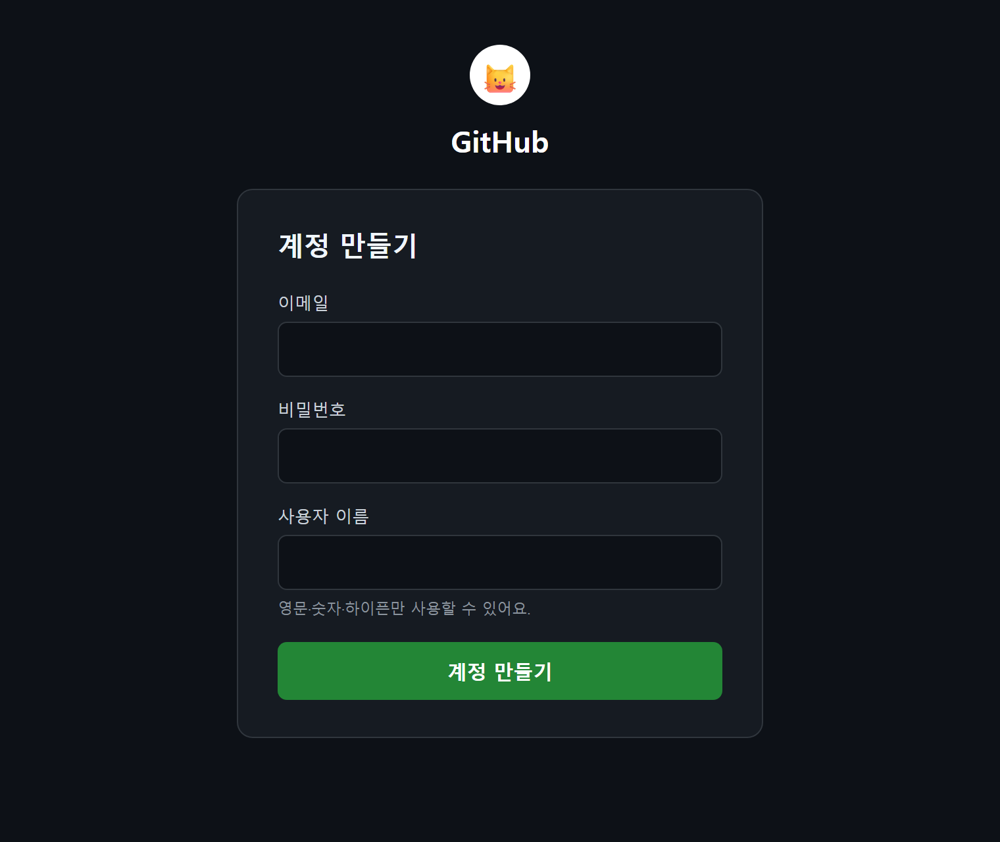
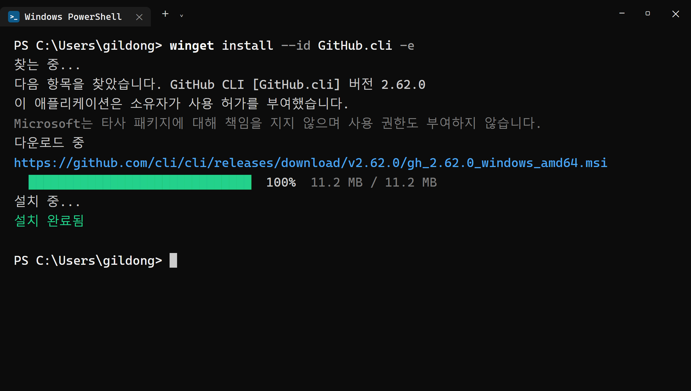
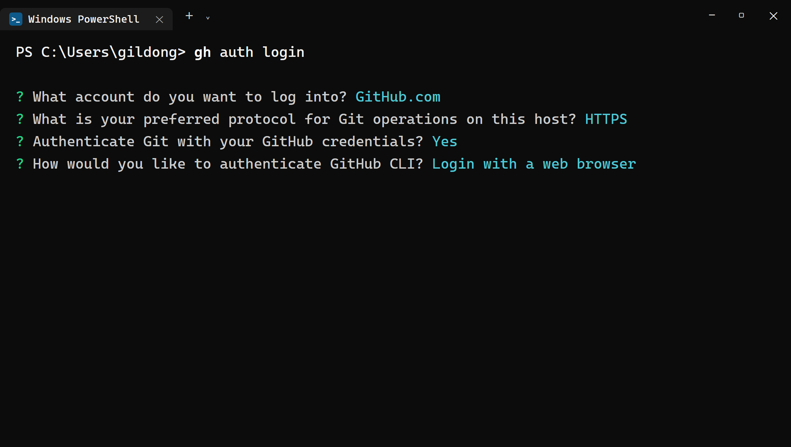
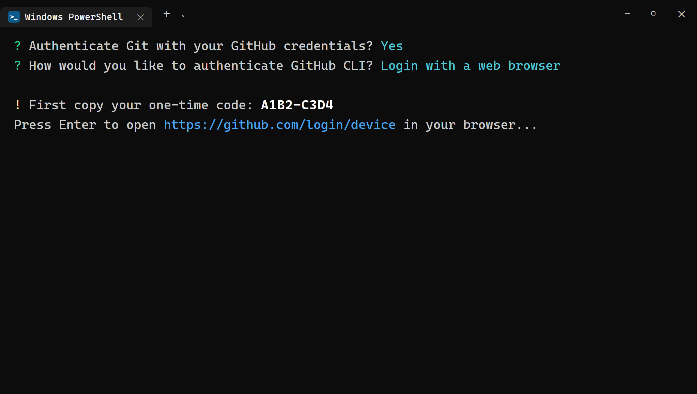
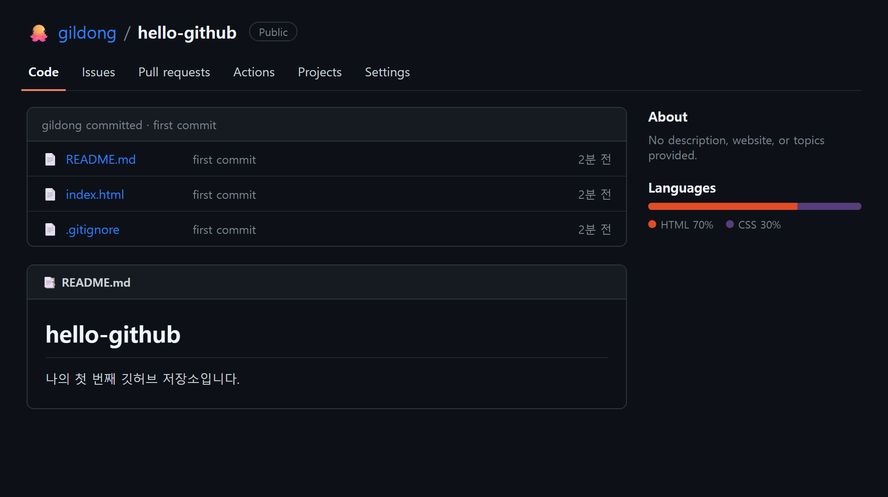

# 5장 GitHub CLI로 깃허브 연결

!!! note "이 장에서 배우는 것"
    - 깃허브(GitHub)가 무엇이고 왜 필요한지 이해합니다
    - GitHub 계정을 만들고, GitHub CLI(`gh`)를 winget으로 설치합니다
    - `gh auth login`으로 터미널과 깃허브를 브라우저 인증으로 연결합니다
    - `gh repo create`로 첫 원격 저장소를 만들고 `git push`로 올려 봅니다

---

## 5.1 깃허브: 코드를 인터넷에 백업하는 곳

3장에서는 Git을 설치하며, 되돌릴 수 있어야 비로소 시도해 볼 수 있다고 말씀드렸습니다. Git은 내 컴퓨터에서 코드의 변경 이력을 기록하지만, 이 이력은 전적으로 내 컴퓨터에만 저장됩니다.

만약 노트북을 분실하거나 하드디스크가 고장 나면, 지금까지 쌓아 올린 커밋이 통째로 사라지게 됩니다. 사진을 구글 포토나 아이클라우드에 백업하듯, 코드 역시 인터넷에 보관해 두어야 안심할 수 있습니다. 깃허브(GitHub)[^1]가 바로 이 역할을 수행합니다.

깃허브는 Git 저장소를 인터넷에 보관하는 서비스입니다. 내 컴퓨터의 저장소를 깃허브로 올리는 작업을 푸시(push)라고 부릅니다. 한 번 올려 두면 컴퓨터에 문제가 생겨도 코드는 깃허브에 그대로 남아 있습니다. 다른 컴퓨터에서 내려받아 작업을 이어갈 수도 있고, 링크 하나로 다른 사람에게 코드를 공유할 수도 있습니다.

이 책에서는 깃허브를 크게 세 가지 용도로 활용할 것입니다.

1. 백업. 매일의 작업을 인터넷에 보관합니다.
2. 포트폴리오. 완성한 지도 웹앱의 코드가 내 깃허브 프로필에 쌓입니다. 개발 직군에서는 이 프로필을 이력서와 함께 확인하는 경우가 많습니다.
3. 배포. 25장에서 깃허브의 무료 호스팅 기능인 GitHub Pages로 지도 웹앱을 공개합니다. 깃허브에 올라가 있어야 배포할 수 있습니다.

깃허브는 단순한 백업 용도 외에도 다양하게 활용할 수 있습니다. 전 세계의 개발자들이 깃허브에 코드를 공개하고 서로의 코드를 참고하며 개선해 나가고 있습니다. 이 책에서 사용하는 Node.js, Git, GitHub CLI의 예제 코드 역시 모두 깃허브에서 확인할 수 있습니다.

그런데 터미널 환경에서 깃허브를 자유롭게 다루려면 별도의 도구가 필요합니다. GitHub CLI를 설치하면 `gh` 명령어를 통해 터미널에서 직접 깃허브를 조작할 수 있습니다. CLI는 Command Line Interface의 약자로, 마우스 클릭 대신 텍스트 명령어로 프로그램을 조작하는 방식을 의미합니다. 깃허브에 저장소를 새로 만들려면 본래 브라우저를 열고 로그인한 뒤 여러 차례 버튼을 클릭해야 하지만, `gh`를 사용하면 터미널에서 명령어 한 줄로 간단히 생성할 수 있습니다. 저장소 생성은 물론 목록 확인, 삭제, 그리고 이후 배울 풀 리퀘스트 작업까지 터미널에서 일괄 처리할 수 있습니다.

`gh`를 설치하는 더욱 중요한 이유는, 바로 Claude Code가 이 명령어를 활용하기 때문입니다. "이 프로젝트 깃허브에 올려 줘"라고 요청하면 Claude Code가 내부적으로 `gh` 명령어를 실행하여 작업을 처리합니다. Claude Code는 터미널에서 동작하므로 브라우저 화면에 있는 버튼을 대신 클릭할 수는 없습니다. 따라서 미리 `gh`를 설치하고 로그인까지 마쳐 두면, 이후 깃허브 관련 작업을 Claude Code에게 맡겨 편리하게 진행할 수 있습니다.

!!! tip "팁"
Git과 GitHub는 이름이 유사하여 자주 혼동되곤 합니다. 간단히 구분하자면, Git은 내 컴퓨터에서 설치해 실행하는 프로그램이며, GitHub는 Git으로 관리하는 저장소를 인터넷에 올려 보관하고 공유할 수 있는 웹 서비스입니다. GitHub 외에도 GitLab, Bitbucket 등 유사한 서비스가 있지만, 현재 가장 널리 사용되는 서비스가 GitHub입니다.

---

## 5.2 GitHub 계정 만들기

이미 깃허브 계정을 보유하고 계시다면 이 절은 건너뛰고 5.3절로 바로 넘어가셔도 좋습니다. 처음 사용하시는 분이라면 함께 계정을 만들어 보겠습니다. 계정은 무료로 생성할 수 있으며, 신용카드 정보는 필요하지 않습니다.

브라우저 주소창에 github.com을 입력하여 접속한 뒤, 화면 오른쪽 위에 위치한 Sign up 버튼을 클릭합니다.

{ width="560" }
/// caption
그림 5.1 — GitHub 가입 페이지 (예시)
///

가입 절차는 화면에 제시되는 안내에 따라 순서대로 진행하시면 됩니다. 각 항목을 하나씩 살펴보겠습니다.

1. Email: 자주 확인하는 이메일 주소를 넣습니다. 인증 메일이 오니 실제로 쓰는 주소여야 합니다.
2. Password: 15자 이상, 또는 숫자와 소문자를 포함한 8자 이상이어야 합니다.
3. Username: 깃허브에서 나를 가리키는 이름입니다. 프로필 주소가 `github.com/사용자이름` 이 되니 신중하게 고릅시다. 영문 소문자와 숫자, 하이픈(-)만 쓸 수 있습니다.
4. 이메일 인증: 입력한 메일함으로 온 인증 코드(또는 퍼즐 확인)를 입력하면 가입이 끝납니다.

!!! tip "팁"
사용자 이름(Username)은 이후 자신의 포트폴리오 주소에 그대로 반영됩니다. `github.com/kimcoding`과 같이 간결하고 명확한 이름이 `github.com/qwer1234asdf` 형식보다 훨씬 보기 좋습니다. 본명의 로마자 표기, 자주 사용하는 닉네임, 혹은 블로그 아이디처럼 오래 사용해도 부담스럽지 않을 이름으로 정하는 것이 좋습니다. 이후 언제든 변경할 수는 있지만, 이름을 바꿀 경우 기존에 공유했던 주소 링크가 더 이상 작동하지 않을 수 있다는 점을 유의하시기 바랍니다.

가입 정보를 모두 입력하고 나면 팀 규모나 관심 분야에 관한 간단한 설문 조사가 나타날 수 있습니다. 이때 화면 하단에 있는 건너뛰기(Skip) 링크를 클릭하시면 설문을 넘길 수 있습니다. 유료 플랜 가입을 권장하는 화면이 나타나도 마찬가지로 건너뛰시면 됩니다. 이 책에서 진행하는 모든 실습은 무료 플랜(Free)으로 충분히 가능합니다. 공개 저장소는 개수 제한 없이 생성할 수 있으며, 비공개 저장소 역시 무료로 사용할 수 있습니다. 25장에서 진행할 GitHub Pages를 통한 웹사이트 배포 기능 역시 무료 플랜의 범위 내에서 이용할 수 있습니다. 모든 과정을 마치고 대시보드 화면이 나타나면 계정 생성은 완료된 것입니다.

시간적 여유가 있으시다면, 계정 생성 후 프로필 설정에서 2단계 인증을 활성화하시는 것을 권장합니다. 화면에서는 Two-factor authentication으로 표시됩니다. 이 기능을 켜 두면, 설령 비밀번호가 외부에 유출된다고 하더라도 휴대폰에 설치된 인증용 앱의 확인 절차 없이는 누구도 계정에 로그인할 수 없게 됩니다. 앞으로 깃허브 계정에는 여러분이 직접 작성한 코드가 차곡차곡 쌓이게 될 것이므로, 미리 보안을 강화해 두는 것이 안전합니다. 오른쪽 위 프로필 아이콘을 클릭하신 뒤 Settings → Password and authentication 메뉴로 이동하시면 설정할 수 있습니다. 지금 당장 설정하지 않으셔도 이 장의 내용을 진행하는 데에는 아무런 지장이 없습니다.

!!! warning "주의"
가입 시 사용하신 이메일 주소를 잘 기억해 두시기 바랍니다. 3장에서 `git config user.email`에 설정한 이메일 주소와 깃허브 가입 시 사용한 주소가 동일해야, 깃허브가 여러분의 커밋을 올바르게 집계하여 프로필의 기여도 그래프(잔디밭)에 정확히 반영합니다. 만약 두 주소가 다르다면 `git config --global user.email "깃허브가입메일"` 명령어를 사용하여 통일해 주시면 됩니다.

---

## 5.3 GitHub CLI 설치: winget 한 줄이면 끝

이번에 설치할 프로그램은 설치 과정이 그리 복잡하지 않습니다. 2장에서 설치했던 Node.js처럼 홈페이지에서 설치 파일을 내려받아 설치 마법사의 단계를 일일이 넘길 필요가 없습니다. 윈도우에 기본적으로 탑재된 패키지 관리자인 winget[^2]을 활용하면, 명령어 한 줄로 설치 과정이 모두 완료됩니다. 여기서 패키지 관리자란 프로그램의 다운로드, 설치, 업데이트 작업을 명령어로 자동화해 주는 도구를 의미합니다. 설치 화면에서 일일이 클릭하며 선택해야 하는 항목이 전혀 없으므로, 잘못된 옵션을 선택할 우려도 없습니다.

PowerShell 혹은 Windows Terminal을 관리자 권한으로 실행한 뒤, 제시되는 명령어를 그대로 입력합니다.

```powershell
winget install GitHub.cli
```

명령어를 처음 실행하면 Microsoft 스토어 이용 약관에 동의할 것인지 묻는 메시지가 나타날 수 있습니다. `Y`를 입력하고 Enter 키를 누르시면, winget이 필요한 파일을 내려받아 설치하는 과정을 자동으로 진행합니다.

{ width="760" }
/// caption
그림 5.2 — winget으로 GitHub CLI 설치 (출력 예시)
///

설치가 정상적으로 완료되었는지 확인해 보겠습니다. 설치를 진행하던 터미널 창에는 새로 설치한 `gh`의 실행 파일 경로가 아직 반영되지 않은 상태입니다. 그러므로 현재 열려 있는 터미널 창을 완전히 종료한 뒤 새로 창을 열고, 제시되는 확인용 명령어를 입력합니다.

```powershell
gh --version
```

```
gh version 2.x.x (2025-xx-xx)
https://github.com/cli/cli/releases/tag/v2.x.x
```

{ width="760" }
/// caption
그림 5.3 — gh 버전 확인
///

명령어를 입력했을 때 버전 번호가 정상적으로 표시된다면 설치는 성공적으로 완료된 것입니다. 버전 번호가 이 책에 적힌 내용과 다르더라도 전혀 문제가 없으니 안심하셔도 좋습니다. 만약 `'gh' 용어가 cmdlet... 이름으로 인식되지 않습니다`와 같은 형식의 빨간색 오류 메시지가 나타난다면, 대부분 터미널을 새로 열지 않은 경우이므로 창을 닫고 다시 열어 확인해 보시기 바랍니다. 그래도 문제가 해결되지 않는다면 컴퓨터를 재부팅한 뒤 다시 시도해 보십시오.

!!! tip "이렇게 물어보세요"
    > winget install GitHub.cli 를 실행했는데 새 터미널에서도 gh --version이 안 먹혀. 오류 메시지는 이거야: (오류 붙여넣기) 원인 찾아서 고쳐 줘.

프로그램 설치 과정에서 문제가 발생했다면, Claude Code에게 확인해 보는 것이 효과적입니다. 4장에서 설치한 Claude Code를 실행한 뒤, 터미널에 표시된 오류 메시지를 그대로 복사하여 붙여넣고 전달하면, Claude Code가 시스템의 PATH 환경 변수를 검토하고 문제의 원인을 찾아 단계별로 해결 방법을 알려 줄 것입니다. 이때 오류 메시지를 요약해서 전달하면, 정작 중요한 원인이 적힌 부분이 누락될 수 있습니다. 따라서 메시지를 수정하거나 간추리지 말고 통째로 그대로 복사하여 전달하시기 바랍니다.

---

## 5.4 gh auth login: 터미널과 깃허브 연결하기

`gh`를 설치하였지만, 아직 `gh`는 이 프로그램을 사용하는 사용자가 누구인지 알지 못하는 상태입니다. 이 상태에서 깃허브에 저장소를 생성하려고 하면, 먼저 로그인을 진행하라는 안내 메시지만 반환될 뿐입니다. 따라서 이 터미널을 사용하는 사람이 방금 가입한 계정의 소유자임을 깃허브에 증명하는 절차가 필요하며, 이를 인증(authentication)이라고 부릅니다. 이 절차를 진행하는 명령어는 `gh auth login`입니다.

절차가 여러 단계로 나뉘어 있는 것처럼 보이지만, 실제로 진행하면 3분 정도면 충분히 완료할 수 있습니다. 터미널이 제시하는 8자리 코드를 자동으로 열리는 브라우저 화면에 입력하기만 하면 인증 절차가 마무리됩니다. 단계별로 함께 따라가 보겠습니다.

새 터미널 창을 열고 제시된 명령어를 입력합니다.

```powershell
gh auth login
```

그러면 터미널이 물음표가 붙은 질문을 차례로 던질 겁니다. 화살표 키(↑↓)로 고르고 Enter로 확정합니다.

질문 1. 어느 호스트에 로그인하시겠습니까?

```
? Where do you use GitHub?  [Use arrows to move, type to filter]
> GitHub.com
  other
```

GitHub.com을 선택합니다. 회사나 별도의 조직에서 운영하는 별도의 깃허브 서버를 사용하는 경우가 아니라면, 언제나 이 항목을 선택하시면 됩니다.

질문 2. Git 통신에 어떤 프로토콜을 사용하시겠습니까?

```
? What is your preferred protocol for Git operations on this host?
> HTTPS
  SSH
```

HTTPS를 선택합니다. SSH 프로토콜은 별도의 인증용 키 파일을 생성하고 관리해야 하는 번거로움이 있습니다. 이 책에서 진행하는 모든 작업은 HTTPS 프로토콜로 충분히 처리할 수 있습니다.

질문 3. Git 작업 시 인증 정보로 깃허브 계정을 사용하시겠습니까?

```
? Authenticate Git with your GitHub credentials?
> Yes
```

Yes를 선택합니다. 이렇게 설정해 두시면, 이후 `git push` 작업을 진행할 때마다 아이디와 비밀번호를 별도로 입력하라고 묻지 않게 되어 편리합니다.

질문 4. 로그인할 방법을 선택해 주십시오.

```
? How would you like to authenticate GitHub CLI?
> Login with a web browser
  Paste an authentication token
```

Login with a web browser를 선택합니다. 토큰 방식은 긴 문자열 형태의 인증 키를 직접 발급받아 입력해야 하는 번거로움이 있으므로, 지금 단계에서는 사용할 필요가 없습니다.

{ width="760" }
/// caption
그림 5.4 — gh auth login 질문 4단계
///

위의 네 가지 질문에 모두 답하고 나면, 터미널에 일회용으로 사용할 인증용 코드가 표시됩니다.

```
! First copy your one-time code: A1B2-C3D4
Press Enter to open https://github.com/login/device in your browser...
```

{ width="760" }
/// caption
그림 5.5 — 일회용 코드 발급
///

`A1B2-C3D4`과 같은 형식으로 표시된 코드를 마우스로 드래그하여 선택한 뒤 Ctrl+C 키로 복사하고 Enter 키를 누릅니다. 그러면 여러분이 사용하는 기본 브라우저가 자동으로 열리며, 깃허브의 기기 인증 페이지가 나타날 것입니다. 만약 깃허브에 로그인하지 않은 상태라면, 먼저 로그인 화면이 표시될 것이므로 5.2절에서 생성한 계정으로 로그인하시기 바랍니다.

{ width="760" }
/// caption
그림 5.6 — 브라우저의 Device Activation 화면
///

브라우저 화면의 코드 입력란에 아까 복사해 둔 코드를 붙여넣고 Continue 버튼을 클릭합니다. 이어서 "GitHub CLI가 계정에 접근해도 될까요?"라고 권한 부여를 묻는 화면이 나타나면, 초록색의 Authorize 버튼을 눌러 권한을 승인합니다. "Congratulations, you're all set!"와 같은 메시지가 표시되면 브라우저에서 진행할 절차는 모두 완료된 것입니다.

다시 터미널 창으로 돌아와 보십시오. 브라우저에서 권한을 승인한 뒤 몇 초 정도 지나면 터미널에 인증 완료 메시지가 나타날 것입니다.

```
✓ Authentication complete.
- gh config set -h github.com git_protocol https
✓ Configured git protocol
✓ Logged in as 여러분의아이디
```

{ width="760" }
/// caption
그림 5.7 — 인증 완료, Logged in as
///

`Logged in as` 문구 바로 뒤에 본인의 깃허브 사용자 이름이 표시된다면, 인증과 연결 절차가 모두 정상적으로 완료된 것입니다. 이 과정에서 내부적으로 어떤 작업이 이루어졌는지 간략히 알아보겠습니다. 브라우저에서 권한을 승인하면, 깃허브는 이 터미널에서 사용할 수 있는 접근용 토큰을 발급하여 `gh`에게 전달합니다. `gh`는 이 토큰을 여러분의 컴퓨터에 안전하게 저장해 두고, 이후 깃허브와 데이터를 주고받을 때마다 비밀번호 대신 이 토큰을 제시하여 인증받습니다. 즉, 비밀번호는 브라우저의 깃허브 페이지에서 한 번 입력했을 뿐 터미널 쪽에는 전혀 전달되거나 저장되지 않습니다. 따라서 번거롭더라도 브라우저를 통한 인증 절차를 거치는 것은, 비밀번호가 여러 곳에 분산되어 저장되는 것을 막아 보안성을 높이기 위한 설계라고 이해하시면 됩니다.

이 인증 절차는 한 번 정상적으로 완료하면 별도로 설정을 변경하지 않는 한 계속해서 유지됩니다. 컴퓨터를 껐다가 다시 켠다고 해서 인증이 풀리거나 다시 로그인해야 하는 것은 아닙니다. 다만 컴퓨터를 새로 구입하거나 시스템을 포맷한 경우에는 저장해 둔 토큰이 사라지므로, 그때 다시 `gh auth login` 절차를 진행해 주시면 됩니다. 언제든 인증 상태를 확인하고 싶다면 `gh auth status` 명령어를 입력해 보십시오. 현재 어떤 계정으로 로그인해 있는지, 그리고 어떤 통신 방식을 사용하고 있는지에 관한 정보를 확인할 수 있습니다.

!!! warning "주의"
앞서 발급받은 일회용 코드는 유효 시간이 정해져 있으므로, 시간이 지나면 사용할 수 없게 됩니다. 코드를 확인한 뒤 한참 뒤에 입력하면 이미 코드의 유효 기간이 만료되어 인증에 실패할 수 있습니다. 만약 코드가 만료되었다면, 터미널에서 `gh auth login` 명령어를 처음부터 다시 실행하면 새로운 코드가 발급되므로 그 코드로 다시 진행하시면 됩니다. 그리고 인증 과정에서 깃허브 계정의 비밀번호는 오직 브라우저의 깃허브 공식 페이지에서만 입력하시면 되며, 터미널에서 비밀번호를 묻는 경우는 없으니 안심하시기 바랍니다.

---

## 5.5 첫 원격 저장소: gh repo create와 git push

이제 깃허브와의 연결이 완료되었으니, 첫 번째 저장소를 깃허브에 직접 올려 보겠습니다. 본격적인 지도 앱 개발은 8장부터 진행하므로, 여기서는 연습용 저장소를 만들어 전체적인 흐름만 확인하고 넘어가겠습니다. 작업할 폴더를 새로 만든 뒤 `git init` 명령어로 내 컴퓨터에 Git 저장소를 초기화합니다. 이후 변경 사항을 `commit` 명령어로 기록하고, `gh repo create` 명령어로 깃허브에 올리는 순서로 진행합니다.

이번에는 위에서 살펴본 일련의 과정을 직접 입력하지 않고, Claude Code에게 요청하여 진행해 보겠습니다. 연습용으로 사용할 폴더를 하나 만들고 그 안에서 Claude Code를 실행한 뒤, 제시되는 내용을 그대로 요청해 보시기 바랍니다.

!!! tip "이렇게 물어보세요"
    > hello-github 라는 연습용 저장소를 만들고 싶어. 이 폴더에 나를 소개하는 README.md를 한국어로 짧게 만들고, git 저장소로 초기화해서 첫 커밋을 한 다음, gh로 내 깃허브에 public 리포로 올려 줘.

그러면 Claude Code가 4장에서 살펴보았던 권한 확인 창을 통해 실행하려는 명령어를 알려 주고, 실행해도 되는지 승인을 요청할 것입니다. 명령어를 직접 입력할 필요는 없지만, 어떤 작업이 진행되는지 파악한 뒤 승인하는 것이 좋으니 참고하시기 바랍니다.

```powershell
git init
git add README.md
git commit -m "첫 커밋: README 추가"
gh repo create hello-github --public --source=. --push
```

요청 내용에 포함된 명령어들을 하나씩 분해하여 살펴보겠습니다.

- `git init` — 이 폴더를 Git 저장소로 만듭니다(3장 복습). 아직 내 컴퓨터 안 이야기입니다.
- `git add` / `git commit` — README 파일을 기록 대상에 올리고 "첫 커밋"이라는 메시지로 저장합니다.
- `gh repo create hello-github --public --source=. --push` — 깃허브에 `hello-github`라는 저장소를 만들고(`--public`: 누구나 볼 수 있게), 현재 폴더(`--source=.`)를 그 저장소와 연결한 뒤, 지금까지의 커밋을 올립니다(`--push`).

명령어를 살펴보기 전에 먼저 중요한 개념 하나를 짚고 넘어가겠습니다. 내 컴퓨터에 있는 저장소를 깃허브의 저장소와 연결하면, 깃허브 쪽에 위치한 저장소를 원격 저장소라고 부르며, 보통 origin이라는 별명을 붙여서 사용합니다. 이후로 커밋 내용을 깃허브에 올릴 때는 이 별명을 활용하여 명령어를 입력하게 됩니다.

```powershell
git push
```

`push` 명령어는 내 컴퓨터에 기록된 새로운 커밋 내용을 깃허브의 원격 저장소(origin)로 올리는 기능을 수행합니다. 반대로 깃허브 원격 저장소의 최신 내용을 내 컴퓨터로 가져오고 싶을 때는 `git pull` 명령어를 사용합니다. 즉, 내용을 올릴 때는 push를, 가져올 때는 pull을 사용한다고 기억하시면 됩니다.

명령어를 입력한 뒤 실제로 저장소가 정상적으로 깃허브에 올라갔는지 확인해 보겠습니다. 터미널에 제시되는 명령어를 입력하면, 브라우저가 자동으로 열리며 방금 생성한 저장소의 페이지를 보여 줄 것입니다.

```powershell
gh repo view --web
```

{ width="820" }
/// caption
그림 5.8 — 깃허브에 업로드된 첫 번째 저장소 (구성 예시)
///

브라우저에 `github.com/내아이디/hello-github` 페이지가 나타나고, 방금 작성한 README 파일의 내용이 제대로 표시된다면 모든 작업이 성공적으로 완료된 것입니다. 저장소 페이지의 구성 요소를 살펴보면, 중앙에는 파일의 목록이 표시되고 그 아래쪽에는 README 파일의 내용이 자동으로 보여집니다. 파일 목록 위쪽에 위치한 "1 commit"와 같은 형태의 버튼을 클릭하면, 지금까지 기록한 커밋의 변경 이력을 확인할 수 있습니다. 앞으로 작업을 진행하며 커밋을 쌓을수록 이 이력은 점차 길어지게 되며, 여러분의 깃허브 프로필 페이지에 있는 기여도 그래프에도 초록색 칸이 하나씩 추가될 것입니다.

지금 살펴본 이 일련의 작업 순서는 이 책 전체에 걸쳐 반복해서 사용하게 될 기본적인 흐름입니다. 작업을 진행하며 기능의 일부가 완성될 때마다 커밋을 만들고, 그 내용을 깃허브에 올리는(push) 습관을 들이시기 바랍니다. 저자 역시 기능 하나를 완성할 때마다 Claude Code에게 "커밋하고 푸시해 줘"라고 요청하여 커밋과 푸시 작업을 진행하고 있습니다. 이 두 가지 기본적인 단계를 습관으로 만들어 두시면, 예기치 못한 상황으로 인해 지금까지의 작업 내용이 통째로 사라지는 안타까운 상황을 미리 예방할 수 있습니다. 실제로 24장에서 제작하는 지도 웹 애플리케이션도 이와 동일한 방식으로 깃허브에 관리하고, 25장에서는 이 저장소를 기반으로 웹사이트 배포를 진행할 예정입니다.

!!! tip "팁"
연습 목적으로 생성했던 `hello-github` 저장소는 이후 사용하지 않으셔도 되므로 삭제하셔도 좋고, 그대로 남겨 두셔도 전혀 문제가 없습니다. 저장소를 삭제하고 싶으시다면, 깃허브의 해당 저장소 페이지에서 Settings 탭으로 이동한 뒤 가장 아래쪽에 위치한 Danger Zone 영역의 Delete this repository 버튼을 클릭하시면 됩니다. 저장소를 실수로 삭제하는 일을 방지하기 위해, 저장소 이름을 직접 정확히 입력한 뒤에야 삭제 처리가 진행되도록 되어 있으니 참고하시기 바랍니다.

---

## 5.6 마무리

이제 앞으로의 개발 작업에 필요한 기본적인 환경 구성이 모두 완료되었습니다. 2장에서 설치한 Node.js를 기반으로 각종 도구가 실행되고, 3장에서 설치한 Git이 코드의 변경 이력을 꼼꼼히 기록하며, 4장에서 알아본 Claude Code가 여러분을 대신하여 코드를 작성하고, 이번 장에서 설치한 GitHub CLI가 그 결과를 인터넷인 깃허브에 안전하게 보관해 줍니다. 앞으로 개발 과정에서 언제든지 "지금까지 작업 깃허브에 올려 줘"라고 요청하시면, Claude Code가 코드의 변경 내용을 커밋하고 깃허브에 푸시하는 작업까지 한 번에 처리해 줄 것입니다. 그리고 터미널에서 `gh auth status` 명령어 한 줄이면 언제든지 깃허브와의 연결 상태를 확인할 수 있으니, 이 명령어 역시 잘 기억해 두시기 바랍니다.

!!! abstract "이 장의 핵심"
    - GitHub는 Git 저장소를 인터넷에 백업하는 곳이자 포트폴리오이며, 25장의 배포도 여기서 합니다.
    - GitHub CLI(`gh`)는 `winget install GitHub.cli` 한 줄로 설치하며, 설치 후에는 터미널을 새로 열어야 합니다.
    - `gh auth login`은 GitHub.com → HTTPS → Yes → 브라우저 로그인 순서로 답하고, 일회용 코드를 브라우저에 입력하면 끝납니다. 인증은 한 번이면 계속 유지됩니다.
    - `gh repo create 이름 --public --source=. --push`로 현재 폴더를 깃허브 저장소로 만들어 즉시 올릴 수 있습니다.
    - 올릴 땐 `git push`, 받을 땐 `git pull`을 씁니다. 깃허브 쪽 저장소의 별명은 origin입니다.

!!! question "잠깐 생각해 봅시다"
Q1. Git과 GitHub의 차이를 한 문장으로 설명한다면 어떻게 표현할 수 있을까요?

____________________________________________

Q2. `gh auth login` 인증 작업을 컴퓨터를 바꿀 때마다 다시 진행해야 하는 이유는 무엇일까요? 이 인증 절차가 현재 사용 중인 컴퓨터의 터미널이 깃허브에 대해 무엇을 증명하는 과정인지 생각해 보시기 바랍니다.

____________________________________________

!!! example "확인 문제"
    1. `gh auth status`를 실행해 출력에서 ① 로그인된 계정 이름 ② Git 통신 프로토콜(https) 두 가지를 찾아보세요.
    2. `hello-github` 저장소의 README.md를 고친 뒤, Claude Code에게 "변경 사항 커밋하고 푸시해 줘"라고 시켜 보세요. 그리고 브라우저에서 새로고침해 수정이 반영됐는지 확인해 보세요.
    3. `gh repo view --web` 대신 `gh repo list`를 실행하면 무엇이 나오는지 확인해 보세요.

!!! info "더 찾아보기"
    - `SSH 키 인증` — HTTPS 대신 키 파일 한 쌍으로 인증하는 방식. 서버 작업이 많아지면 익혀 둘 만합니다.
    - `gh pr` — 협업의 핵심인 풀 리퀘스트(Pull Request)를 터미널에서 만들고 리뷰하는 명령 모음.
    - `Personal Access Token` — 브라우저 없이 문자열 토큰으로 인증하는 방법. CI 서버 같은 자동화 환경에서 씁니다.
    - `프라이빗 저장소` — `--public` 대신 `--private`을 붙이면 나만 볼 수 있는 저장소가 됩니다.

> 다음 장으로. 6장에서는 저자가 실제로 쓰는 Orca를 소개합니다. 여러 개의 Claude Code 에이전트를 워크트리라는 독립된 작업 공간에 하나씩 두고 동시에 일을 시키는 방법을 다룹니다.

[^1]: GitHub(깃허브) — 2008년 시작된 세계 최대 코드 호스팅 서비스. 2018년부터 마이크로소프트 소유이며, 공개 저장소는 무료로 무제한 사용할 수 있습니다. https://github.com
[^2]: winget — 윈도우 10/11에 기본 포함된 명령줄 패키지 관리자(Windows Package Manager). 명령 한 줄로 프로그램을 설치하고 업데이트할 수 있습니다.


