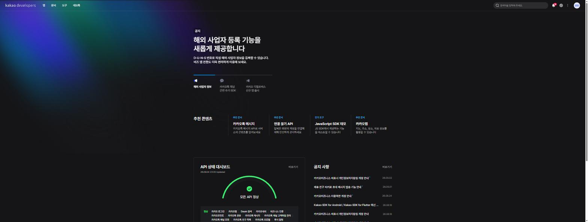
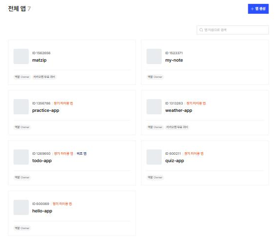
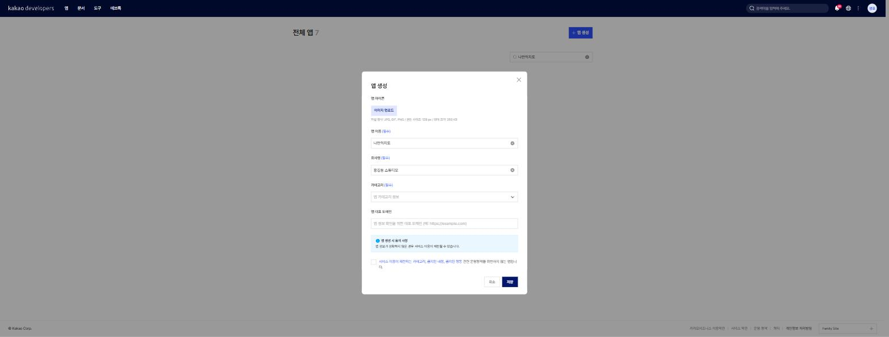
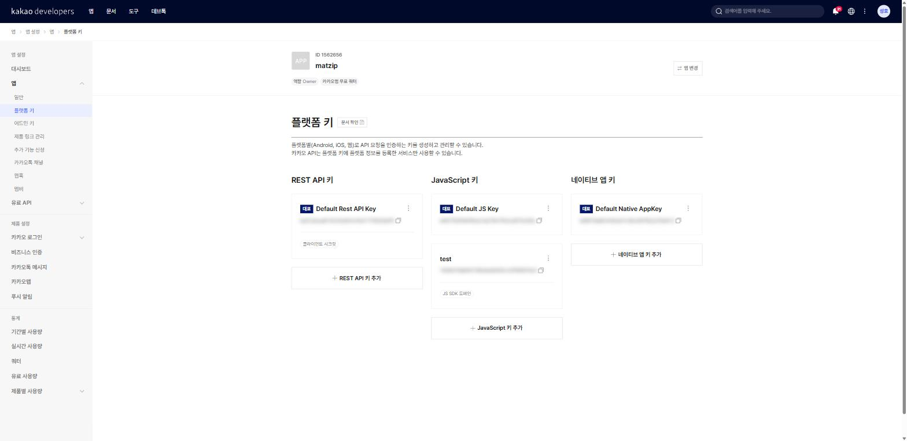
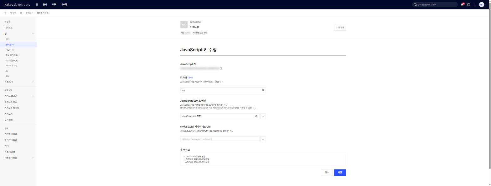

# 7장 카카오 개발자 계정과 앱 만들기

!!! note "이 장에서 배우는 것"
    - API 키가 무엇이고 왜 필요한지 이해합니다
    - developers.kakao.com에 개발자 계정을 만들고 애플리케이션(앱)을 생성합니다
    - REST API 키, JavaScript 키, 네이티브 앱 키 가운데 JavaScript 키가 어디에 쓰이는지 배웁니다
    - JavaScript 키의 JavaScript SDK 도메인에 `http://localhost:5173`을 등록합니다
    - 키를 공개하면 안 되는 이유와 "도메인 제한"의 의미를 배웁니다

---

1부에서는 바이브코딩에 필요한 도구를 차례로 설치하였습니다. 이제 Node.js, Git, Claude Code, GitHub CLI, Orca까지 모두 갖추었으므로, 앞서 나아갈 준비는 마련되었습니다.

우리가 제작할 웹앱은 카카오지도를 기반으로 합니다. 카카오에서 제공하는 지도 API[^1]를 사용하면, 카카오맵 앱에서 보던 것과 같은 지도를 우리 웹페이지에 삽입할 수 있습니다. 다만 카카오에서는 임의의 웹페이지에 지도를 제공하지 않으며, 요청한 측을 식별할 수 있는 인증 키를 요구합니다. 이번 장에서는 해당 인증 키를 발급받는 과정을 설명하겠습니다.

이번 장에서는 코드를 작성하지 않으므로 Claude Code에게 수행할 작업도 없습니다. 웹사이트 가입과 설정 작업은 사람이 직접 진행하는 것이 더욱 빠르고 정확합니다. 따라서 이 장의 내용은 화면을 보며 직접 클릭하여 진행하는 것이 효율적입니다. 마우스 클릭 몇 차례로 완료할 수 있으나, 여기서 발급받는 키는 8장부터 26장까지 계속해서 사용하게 됩니다. 또한 이 장의 마지막 부분에서 설명하는 키 보안 원칙은 다른 API를 사용할 때에도 그대로 적용되므로 숙지하여 주시기 바랍니다.

## 7.1 API 키란 무엇인가

먼저 기본 개념을 명확히 하겠습니다. 그렇다면 API 키란 무엇일까요?

우리의 웹페이지는 카카오 서버에 지도 데이터를 요청할 때 API 키라는 문자열을 함께 전송합니다. 카카오 서버에서는 전송받은 이 문자열을 검증하여 등록된 개발자의 요청임을 확인한 뒤, 요청한 지도 데이터를 반환합니다. 만약 키가 없거나 등록되지 않은 키를 전송하는 경우, 카카오 서버는 해당 요청을 거절하게 됩니다.

API 키가 필요한 이유는 카카오의 입장에서 생각해 보면 쉽게 이해할 수 있습니다.

첫째, 누가 얼마나 사용하고 있는지를 파악하여야 합니다. 지도 데이터를 사용자에게 전송하는 데에는 비용이 발생하기 때문입니다. 키를 통하여 어떤 앱이 하루 동안 지도를 몇 차례 호출하였는지 정확히 집계할 수 있으며, 사용량이 기준을 초과하는 경우에는 서비스 이용을 제한하는 조치를 취할 수도 있습니다.

둘째, 문제가 발생하였을 때 연락할 방안을 확보하여야 합니다. 특정 앱에서 비정상적인 방식으로 요청을 보내는 경우, 카카오에서는 키를 근거로 어느 개발자의 앱인지 식별한 뒤 필요한 조치를 취할 수 있습니다.

셋째, 개발자 측에서도 키를 일종의 보호 수단으로 활용할 수 있습니다. 뒤에서 자세히 설명하겠지만, 특정 주소에서만 키가 작동하도록 제한을 설정하면, 타인이 무단으로 자신의 키를 사용하는 것을 방지할 수 있습니다.

카카오 개발자 사이트에서 계정을 생성하고 애플리케이션을 등록하면, 카카오에서 해당 앱에 사용할 키를 발급하여 줍니다. 이번 장에서 진행할 내용은 바로 이까지입니다.

!!! tip "팁"
여기서 설명하는 "앱"은 스마트폰용 앱을 제작하여 앱 스토어에 등록하는 것을 의미하지는 않습니다. 카카오 개발자 사이트에서의 애플리케이션이란, 개발하려는 프로젝트를 등록하여 관리하는 단위를 의미합니다. 등록할 때에는 앱의 이름만 정하면 되며, 소요 시간은 약 1분 정도입니다.

## 7.2 카카오 개발자 사이트 가입하기

이제 실제로 진행해 보겠습니다. 사용 중인 브라우저를 열고 주소 입력창에 안내하는 주소를 입력하여 접속하여 주시기 바랍니다.

```
https://developers.kakao.com
```

"카카오 디벨로퍼스(Kakao Developers)"라는 사이트가 화면에 나타날 것입니다. 이 사이트는 카카오에서 외부 개발자에게 지도, 로그인, 메시지 등의 기능을 제공하는 공식 개발자 포털 사이트입니다. 첫 화면을 살펴보면 카카오톡 메시지 전송, 카카오 계정으로 로그인하기 등, 카카오의 다양한 서비스 기능을 이곳에서 모두 확인할 수 있습니다.

{ width="820" }
/// caption
그림 7.1 — 카카오 디벨로퍼스 첫 화면
///

화면 오른쪽 상단에 위치한 로그인 버튼을 클릭하여 주시기 바랍니다. 그러면 카카오 계정으로 로그인할 수 있는 화면이 나타납니다. 카카오톡을 이용하고 계신다면 이미 카카오 계정을 보유하고 계실 것입니다. 따라서 카카오톡에 연결된 이메일 주소와 비밀번호를 입력하여 로그인하면 됩니다. 별도의 개발자 전용 회원가입 절차는 마련되어 있지 않습니다.

만약 카카오 계정이 없거나 새로 생성하고자 하는 경우, 로그인 화면에 있는 회원가입 링크를 클릭하여 주시기 바랍니다. 이메일 인증 절차를 거치면 계정을 생성할 수 있으며, 소요 시간은 몇 분 정도이므로 오래 기다리실 필요는 없습니다.

처음으로 로그인하는 경우, 개발자 사이트 이용에 대한 약관 동의 화면이 표시될 수 있습니다. 약관의 내용을 확인한 뒤 동의하면 개발자 계정 등록 절차가 완료됩니다. 별도의 심사나 승인 과정은 포함되어 있지 않습니다.

!!! warning "주의"
학교나 회사의 공용 컴퓨터처럼 여러 사람이 함께 사용하는 기기의 경우, 실습을 마친 뒤 반드시 로그아웃하여 주시기 바랍니다. 개발자 계정에는 앞으로 발급받게 될 인증 키가 포함되어 있기 때문입니다. 로그인한 상태로 화면을 종료할 경우, 제3자에게 키가 노출될 우려가 있습니다.

## 7.3 앱 생성하기

로그인 절차를 마쳤으면 이제 개발자 콘솔 화면으로 이동합니다. 첫 화면 상단의 메뉴에서 콘솔을 선택하여 접속할 수도 있으며, 주소 입력창에 직접 해당 주소를 입력하여 접속하여도 무방합니다.

```
https://developers.kakao.com/console/app
```

전체 앱이라는 제목 아래에 생성한 애플리케이션의 목록이 표시될 것입니다. 이제 막 회원가입을 진행하셨다면 아직 앱을 생성하지 않았으므로 목록은 비어 있을 것입니다.

{ width="520" }
/// caption
그림 7.2 — 개발자 콘솔의 전체 앱 목록과 "앱 생성" 버튼
///

화면 오른쪽 상단에 위치한 앱 생성 버튼을 클릭하여 주시기 바랍니다. 그러면 앱에 관한 기본 정보를 입력하는 창이 나타납니다. 입력하여야 할 항목은 많지 않습니다.

- 앱 이름: 이 프로젝트의 이름입니다. 저는 `나만의지도`라고 지었습니다. 여러분은 `맛집지도`, `우리동네지도`처럼 마음에 드는 이름을 자유롭게 쓰세요. 나중에 언제든 바꿀 수 있습니다.
- 회사명(사업자명): 회사가 아니어도 괜찮습니다. 개인 개발자라면 자기 이름이나 닉네임을 적으면 됩니다.
- 카테고리: 앱의 분류를 고르는 항목이 있다면 지도·위치와 관련된 것을 고르세요. 마땅한 것이 없으면 기타를 골라도 실습에는 지장이 없습니다.

{ width="760" }
/// caption
그림 7.3 — 앱 생성 창에 앱 이름 입력
///

필요한 정보를 모두 입력한 뒤 저장 또는 생성 버튼을 클릭하면, 전체 앱 목록에 방금 생성한 앱이 추가되어 표시됩니다. 목록에서 해당 앱의 이름을 클릭하면 앱 관리 화면으로 이동할 수 있습니다. 화면 왼쪽에는 앱 설정, 대시보드, 앱, 유료 API, 제품 설정, 통계 등의 메뉴가 세로로 배열되어 있습니다. 이 책에서는 이 중에서 앱 메뉴만을 사용하게 될 것입니다.

하나의 개발자 계정으로 여러 개의 애플리케이션을 등록하여 관리할 수 있습니다. 추후 새로운 프로젝트를 시작하게 되는 경우, 해당 프로젝트용 애플리케이션을 별도로 생성하면 됩니다. 프로젝트별로 애플리케이션을 분리하여 관리하면 인증 키와 각종 설정을 독립적으로 관리할 수 있어 편리합니다. 만약 실수로 생성한 애플리케이션이 있다면, 앱 관리 화면에서 언제든지 삭제할 수 있습니다.

!!! tip "팁"
애플리케이션의 이름은 추후 카카오 로그인 등의 기능을 연결할 때 사용자에게 표시될 수도 있습니다. 지금은 본인만 확인하는 이름이지만, 욕설이나 타 기업의 상표 등 "카카오맵"과 같은 이름은 사용하지 않는 것이 좋습니다. 카카오의 운영 정책에 위반될 수 있기 때문입니다.

## 7.4 플랫폼 키 3종: 우리가 쓸 건 JavaScript 키

이제 발급받은 인증 키를 확인하여 보겠습니다. 앱 관리 화면의 왼쪽 메뉴에서 앱 항목을 펼치면 하위 메뉴로 일반, 플랫폼 키, 어드민 키, 제품 링크 관리 등이 표시될 것입니다. 이 중에서 플랫폼 키 메뉴를 선택하여 클릭하여 주시기 바랍니다. "플랫폼별(Android, iOS, 웹)로 API 요청을 인증하는 키를 생성하고 관리"라는 설명과 함께 키가 세 가지 종류로 구분되어 표시됩니다.

{ width="760" }
/// caption
그림 7.4 — 앱 > 플랫폼 키 화면의 키 3종 (JavaScript 키에 강조 표시)
///

키가 세 종류로 구분되어 있는 이유는, 카카오의 기능을 어느 환경에서 호출하는지에 따라 사용하여야 할 키가 서로 다르기 때문입니다. 각 키의 차이점은 아래의 표를 통하여 확인하면 더욱 명확하게 이해할 수 있을 것입니다.

| 키 이름 | 어디서 쓰나 | 우리 책에서는 |
|---|---|---|
| REST API 키 | 서버에서 카카오 API를 부를 때 | 안 씁니다 |
| JavaScript 키 | 웹 브라우저에서 동작하는 웹페이지 | 이것만 씁니다 |
| 네이티브 앱 키 | 안드로이드·iOS 스마트폰 앱 | 안 씁니다 |

우리가 제작할 웹앱은 웹 브라우저에서 동작하므로, 이 중에서 JavaScript 키만을 사용하게 됩니다. 처음으로 애플리케이션을 생성하면 카카오에서 각 종류별로 기본 키를 자동으로 하나씩 발급하여 줍니다. 따라서 JavaScript 키 묶음에서 "Default JS Key"이라는 이름의 키를 찾아주시면 됩니다. 키의 값은 32자로 구성된 문자열 형태로 표시됩니다.

```
0123abcd4567efgh8901ijkl2345mnop
```

위에 표시된 키 값은 설명을 위하여 예시로 작성한 가짜 키입니다. 실제로는 각자의 화면에서 본인의 키 값을 확인할 수 있을 것입니다. 키 값 옆에 있는 복사 버튼을 클릭하면 키 값을 클립보드로 복사할 수 있습니다. 지금 당장 다른 곳에 붙여넣을 필요는 없으며, 8장에서 프로젝트를 생성할 때 다시 이 화면으로 돌아와 확인하겠습니다. 따라서 지금은 JavaScript 키가 어느 위치에 있는지만 기억하여 주시기 바랍니다. 각 키 묶음에 있는 + JavaScript 키 추가 버튼을 통하여 키를 여러 개 생성할 수도 있으나, 이 책에서는 기본으로 발급받은 키 하나만을 사용하겠습니다.

만약 키를 적어 둔 곳을 잊어버렸다고 하여도 걱정할 필요는 없습니다. 필요할 때마다 이 화면에 다시 로그인하면 언제든지 키 값을 확인할 수 있기 때문입니다. 반대로 키가 외부에 유출된 것으로 의심되는 경우, 새로운 키를 생성하여 교체한 뒤 기존의 키를 삭제하여 사용을 중지시킬 수도 있습니다.

!!! warning "주의"
왼쪽 메뉴의 플랫폼 키 항목 아래에는 어드민 키라는 별도의 메뉴도 존재합니다. 이 어드민 키는 웹페이지나 공개된 코드 저장소에 절대로 포함하여서는 안 됩니다. 이 키는 앱의 모든 설정을 변경할 수 있는 권한을 가지고 있으므로, 유출될 경우 제3자에 의하여 앱의 설정이 임의로 변경될 수 있는 위험이 있습니다. 이 책에서는 어드민 키를 사용하지 않을 것이므로 접근하지 않는 것이 좋습니다.

## 7.5 JavaScript SDK 도메인 등록: localhost:5173

인증 키의 확인을 마쳤으면 이제 마지막 설정 단계 하나만을 남겨 두고 있습니다. 이 단계를 빼먹고 진행하는 경우가 매우 많으므로 주의하여 주시기 바랍니다. 만약 9장으로 넘어간 뒤 지도가 정상적으로 표시되지 않고 회색 화면만 나타난다면, 그 원인의 대부분은 이 단계 설정에 있을 것입니다.

카카오에서는 JavaScript 키를 발급할 때, 해당 키를 어느 주소의 웹사이트에서 사용할 것인지를 함께 등록하도록 요구합니다. 즉, 미리 등록된 주소에서 발생한 요청에 대해서만 서비스를 처리하겠다는 의미입니다. 이 주소 목록은 별도의 메뉴가 아닌, 해당 JavaScript 키 자체에 연결되어 관리됩니다. 따라서 각각의 키마다 별도로 허용된 주소 목록을 가지고 있습니다.

앞서 확인하였던 플랫폼 키 화면에서 JavaScript 키 묶음에 있는 기본 키의 이름을 클릭하여 주시기 바랍니다. 그러면 JavaScript 키를 수정할 수 있는 화면으로 전환됩니다. 화면 상단으로부터 ① 키 값, ② 키 이름, ③ JavaScript SDK 도메인, ④ 카카오 로그인 리다이렉트 URI의 순서로 설정 항목이 표시됩니다. 이 중 ④번 항목은 카카오 로그인 기능에 사용되는 설정이므로 이 책에서는 다루지 않습니다. 우리가 입력하여야 할 항목은 바로 ③번 JavaScript SDK 도메인입니다. 화면에 표시된 설명문에는 "JavaScript 키를 사용할 웹사이트 도메인을 등록합니다. 등록한 도메인에서만 JavaScript 키로 Kakao SDK for JavaScript를 사용할 수 있습니다."라고 적혀 있습니다.

{ width="760" }
/// caption
그림 7.5 — JavaScript 키 수정 화면의 JavaScript SDK 도메인 항목
///

JavaScript SDK 도메인을 입력하는 입력창에 안내하는 주소를 정확하게 입력하여 주시기 바랍니다.

```
http://localhost:5173
```

이때 몇 가지 규칙을 알아두어야 합니다. 호스트 이름과 포트 번호는 등록한 값과 완전히 일치하여야 합니다. 예를 들어 카카오의 입장에서는 `localhost:5173`와 `localhost:5174`은 서로 다른 주소로 인식됩니다. 다만 프로토콜 부분은 예외적으로, `http`와 `https` 중 어느 하나만 등록하여도 카카오에서는 양쪽 모두를 인정하여 줍니다. 우리는 앞서 사용하는 개발 서버의 주소인 `http://localhost:5173`을 그대로 입력하겠습니다. 주소를 정확하게 입력하였으면 입력창 오른쪽에 있는 + 버튼을 클릭하여 목록에 추가하여 주시기 바랍니다. 설정을 마친 뒤에는 반드시 화면 하단의 저장 버튼을 클릭하여야 입력한 내용이 실제로 반영됩니다.

{ width="760" }
/// caption
그림 7.6 — JavaScript SDK 도메인에 http://localhost:5173 이 등록된 모습
///

이제 입력한 주소가 어떤 의미를 가지는지 두 부분으로 나누어 설명하겠습니다.

- localhost는 내 컴퓨터 자신을 가리키는 특별한 주소입니다. 인터넷 어딘가의 서버가 아니라, 지금 여러분이 쓰고 있는 이 PC를 뜻합니다.
- 5173은 포트 번호[^2]입니다. 한 컴퓨터 안에서 여러 프로그램이 동시에 통신하므로 프로그램마다 다른 번호를 나눠 씁니다. 다음 장에서 설치할 개발 도구 Vite는 개발용 서버를 열 때 기본으로 5173번을 씁니다.

따라서 주소 `http://localhost:5173`은 현재 사용 중인 컴퓨터에서 Vite 도구를 사용하여 실행 중인 개발용 웹페이지를 가리키는 것입니다. 추후 8장에서 프로젝트를 생성하고 개발 서버를 실행하면 브라우저의 주소창에 바로 이 주소가 표시될 것입니다. 우리는 이 주소에서 카카오지도를 호출하여 사용할 것이므로, 미리 카카오에 이 주소를 허용된 도메인으로 등록하여 두는 것입니다.

이후 25장에서 제작을 완료한 지도 서비스를 GitHub Pages를 통하여 공개할 때, 그 공개된 서비스의 주소를 이곳에 추가로 등록하여 주시면 됩니다. 이처럼 허용할 도메인은 여러 개를 등록하여 관리할 수 있습니다.

!!! tip "팁"
JavaScript SDK 도메인은 기본적으로 최대 10개까지 등록할 수 있습니다. 또한 `*.example.com`와 같은 와일드카드 문자를 사용하여 서브도메인을 일괄적으로 지정하는 것도 가능합니다. 개발 환경, 테스트 환경, 실제 서비스 환경의 주소를 모두 추가하다 보면 등록 가능한 개수 제한에 도달할 수 있으므로, 이 제한 개수를 참고하여 설정하여 주시기 바랍니다.

!!! tip "팁"
추후 지도가 정상적으로 표시되지 않고, 브라우저의 개발자 도구 콘솔 창에 401이나 403과 같은 오류 코드가 표시되는 경우, 가장 먼저 이 JavaScript 키 수정 화면으로 돌아와서 등록한 SDK 도메인 주소가 정확한지 확인하여 주시기 바랍니다. 대부분 포트 번호를 5173 대신 5174로 잘못 적었거나, 호스트 이름의 철자를 틀리게 적었거나, 혹은 주소의 맨 끝에 불필요한 슬래시 기호를 추가한 경우가 이에 해당합니다. 프로토콜 부분은 어느 쪽을 사용하여도 인정되므로 오류의 원인이 아닐 것입니다. 보다 자세한 오류 해결 방법은 부록 B에 정리하여 두었습니다.

## 7.6 키를 공개하면 안 되는 이유, 그리고 도메인 제한의 의미

여기서 한 가지 의문이 생길 수 있습니다. JavaScript 키는 웹페이지에서 사용하는 키인데, 웹페이지의 코드는 브라우저에서 "페이지 소스 보기"만 누르면 언제든지 확인할 수 있습니다. 그렇다면 키의 값도 함께 외부에 공개되는 것이 아닐까요?

그 의문은 맞습니다. JavaScript 키는 본질적으로 웹 브라우저에 그대로 노출될 수밖에 없습니다. 카카오에서도 이 점을 충분히 인지하고 서비스를 제공하고 있습니다. 따라서 카카오에서는 이러한 점을 보완하기 위한 별도의 안전 장치를 마련하여 두었으며, 바로 앞에서 설정한 도메인 제한 기능이 그것입니다.

!!! warning "키 보안: 도메인 제한이 지켜주는 것"
카카오 서버에서는 지도 데이터 요청을 수신할 때, 인증 키의 값과 함께 요청이 발생한 웹페이지의 출발지 주소도 함께 확인합니다. 설령 인증 키의 값이 일치한다고 하여도, 요청이 출발한 주소가 해당 앱에 미리 등록된 도메인 목록에 존재하지 않는다면 카카오 서버는 해당 요청을 거절하게 됩니다.

따라서 만약 제3자가 당신의 JavaScript 키를 복사하여 자신의 웹사이트인 `evil-site.com`에 붙여넣어 사용하려고 하여도, `evil-site.com`이라는 주소는 당신의 앱에 등록된 도메인이 아니기 때문에 카카오 서버가 요청을 거절하여 지도가 표시되지 않을 것입니다. 이처럼 도메인 제한 기능이 작동하기 때문에, 브라우저에 노출되는 JavaScript 키를 사용하면서도 타인에 의한 무단 사용을 방지할 수 있는 것입니다.

그러나 도메인 제한 기능이 있으니 키 값을 아무 곳에나 공개하여도 괜찮다는 의미는 절대로 아닙니다.

첫째, 도메인 제한 기능이 모든 종류의 키에 적용되는 것은 아닙니다. 도메인 제한은 오직 JavaScript 키에만 해당되는 내용입니다. REST API 키나 어드민 키는 그 성격이 완전히 다르기 때문에 만약 유출된다면 심각한 피해로 이어질 수 있습니다. 따라서 키의 종류에 따라 위험 여부를 판단하기보다는, 모든 종류의 키를 외부에 공개하지 않는다는 기본적인 원칙을 일관되게 준수하는 것이 가장 안전합니다.

둘째, 추후에 사용하게 될 키 중에는 유출될 경우 즉시 사용 요금이 청구될 수도 있는 키가 존재합니다. 예를 들어 유료 AI API 키가 바로 그러한 경우에 해당합니다. 따라서 지금부터 사용하는 키를 코드 내에 직접 적어두지 않고 별도로 관리하는 습관을 들이면, 추후 유료 API 키를 다룰 때에도 동일한 방식으로 안전하게 관리할 수 있을 것입니다.

그러므로 다음 장에서는 발급받은 인증 키를 소스 코드에 직접 기입하지 않고, `.env`라는 이름의 별도 파일에 보관한 뒤, 해당 파일이 실수로 GitHub에 업로드되는 일이 없도록 설정하는 방법에 대하여 설명하겠습니다. 앞으로 본문 내용에서 인증 키가 필요한 위치에는 실제 키 값 대신 `여러분의 JS 키`과 같이 표시하거나, `0123abcd...`과 같은 예시용 문자열을 적어 두겠습니다. 해당 위치에 본인의 키 값을 직접 입력하여 사용하면 됩니다.

!!! tip "이렇게 물어보세요"
    > 카카오 JavaScript 키는 어차피 브라우저에 노출된다는데, 그럼 .env에 숨기는 건 무슨 의미가 있어? 초보자한테 설명하듯 알려줘.

만약 개념 설명 중 이해가 되지 않는 부분이 있다면 언제든지 Claude Code에게 물어보아도 좋습니다. 설치와 설정 과정에서 궁금한 점이 생기면 그때마다 확인하며 진행하는 습관을 들이시기 바랍니다. 앞서 제시한 질문에 대한 정답은 "노출 자체를 막는다기보다, 코드와 설정을 분리해서 관리하고 다른 키에도 같은 기준을 적용하기 위해서"에 수록되어 있으니, 확인한 내용과 비교하여 보시기 바랍니다.

## 7.7 마무리

이번 장에서는 단 한 줄의 코드도 작성하지 않았습니다. 그 대신 카카오 개발자 계정을 생성하고, 애플리케이션을 등록한 뒤, 플랫폼 키 화면에서 JavaScript 키의 위치를 확인하였습니다. 그리고 해당 키에 대하여 JavaScript SDK 도메인으로 `http://localhost:5173`을 등록하는 설정까지 완료하였습니다.

다음 단계로 넘어가기 전에 지금까지의 내용을 세 가지 항목에 걸쳐 최종적으로 확인하여 주시기 바랍니다. 전체 앱 목록에서 방금 생성한 앱이 정상적으로 표시되는지, 앱 > 플랫폼 키 메뉴에서 JavaScript 키를 정상적으로 확인할 수 있는지, 그리고 JavaScript 키 수정 화면의 SDK 도메인 항목에 `http://localhost:5173`이 오류 없이 정확하게 등록되었는지를 확인하여 주시기 바랍니다. 이 세 가지 항목이 모두 정상이라면 다음 장의 내용으로 넘어가도 좋습니다.

!!! abstract "이 장의 핵심"
    - API 키는 카카오 서버에 등록된 개발자의 요청임을 증명하는 문자열입니다.
    - developers.kakao.com은 카카오 계정만 있으면 바로 가입(로그인)할 수 있습니다.
    - developers.kakao.com/console/app 에서 전체 앱 → + 앱 생성으로 앱을 만들면 앱 > 플랫폼 키에 REST API·JavaScript·네이티브 앱 키가 준비됩니다.
    - 웹앱인 우리 프로젝트가 쓰는 키는 JavaScript 키 하나뿐입니다. 별도 메뉴의 어드민 키는 절대 노출하면 안 됩니다.
    - JavaScript 키를 클릭해 JavaScript SDK 도메인에 `http://localhost:5173`을 등록해야 개발 중인 페이지에서 지도를 부를 수 있습니다.
    - 도메인 제한이 있으므로 JS 키는 등록된 주소에서만 동작합니다. 그래도 키는 공개하지 않고 `.env`에 분리해 둡니다.

!!! question "잠깐 생각해 봅시다"
Q1. 누군가 당신의 JavaScript 키를 훔쳐 자신의 웹사이트에 등록하여 사용하였습니다. 그 사람의 웹사이트에서 지도가 정상적으로 표시될까요? 그 이유와 함께 설명하여 보십시오.

____________________________________________

____________________________________________

Q2. `http://localhost:5173`에서 `localhost`와 `5173`은 각각 무엇을 의미하는지 설명하여 보십시오.

____________________________________________

____________________________________________

!!! example "확인 문제"
    1. REST API 키, JavaScript 키, 네이티브 앱 키, 어드민 키의 용도를 한 줄씩 적어 보세요.
    2. 앱 > 플랫폼 키 화면에서 여러분의 JavaScript 키를 찾아 앞 4글자만 종이에 적어 보세요. 전체를 적어 두면 그 종이가 유출 경로가 될 수 있습니다.
    3. JavaScript 키 수정 화면의 SDK 도메인 목록에 `http://localhost:5173`이 정확히 등록됐는지 확인하고, 포트 번호가 `5173`이 맞는지·끝에 불필요한 `/`가 붙어 있지는 않은지 점검해 보세요.

!!! info "더 찾아보기"
    - `카카오 디벨로퍼스 문서` — developers.kakao.com의 "문서" 메뉴. 지도 API의 공식 설명서가 모여 있습니다.
    - `쿼터(Quota)` — API를 하루에 몇 번까지 부를 수 있는지 정한 사용량 한도. 카카오지도의 무료 한도를 검색해 보세요.
    - `OAuth` — "카카오로 로그인" 버튼을 만들 때 쓰는 인증 방식. 이 책 범위 밖이지만 같은 콘솔에서 설정합니다.

> 다음 장으로. 8장에서는 Claude Code에게 시켜 Vite로 프로젝트를 만들고, 개발 서버를 켜서 브라우저에 `http://localhost:5173`이 뜨는 것을 확인합니다. 그리고 이번 장에서 발급받은 JavaScript 키를 `.env` 파일에 보관하는 방법을 배웁니다.

[^1]: API(Application Programming Interface) — 프로그램끼리 기능을 주고받기 위해 정해 둔 호출 규격. "카카오지도 API"는 카카오가 만들어 둔 지도 기능을 우리 코드에서 불러 쓸 수 있게 공개한 규격입니다.
[^2]: 포트(port) — 한 컴퓨터 안에서 여러 프로그램이 네트워크 통신을 나눠 쓰기 위해 붙이는 번호. 같은 컴퓨터라도 5173번은 Vite가, 다른 번호는 다른 프로그램이 씁니다.


