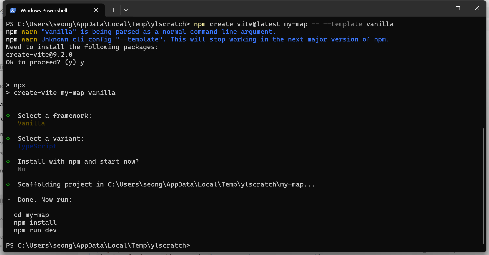
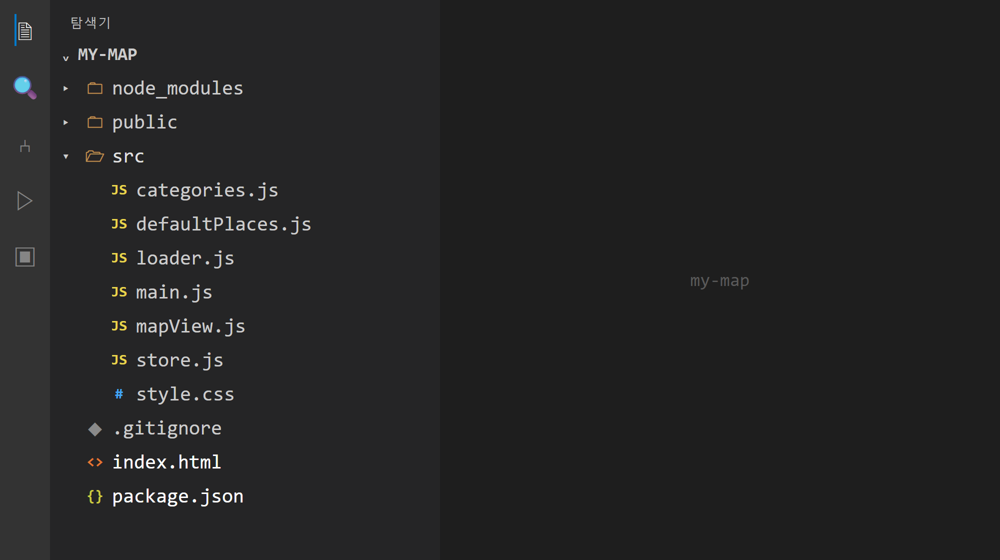
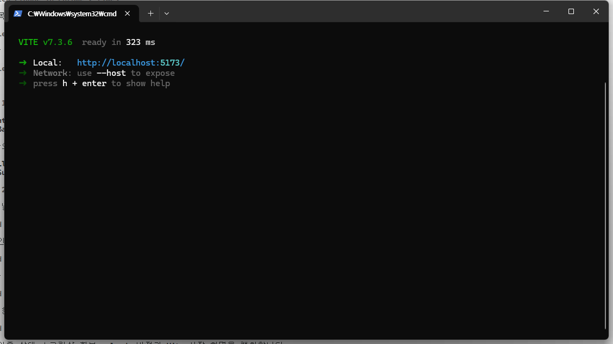
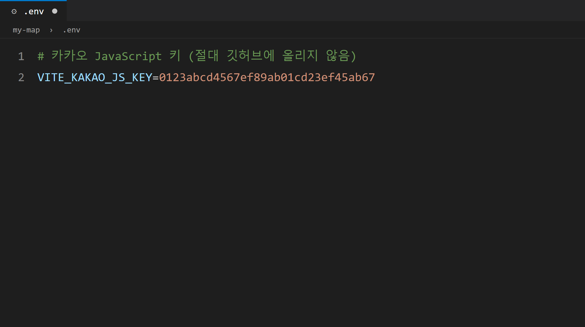
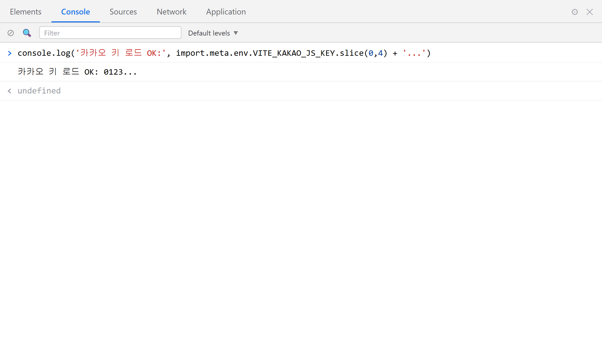

# 8장 Vite로 프로젝트 시작

!!! note "이 장에서 배우는 것"
    - Vite가 무엇인지(개발 서버 + 빌드 도구) 이해합니다
    - Claude Code에게 시켜 `npm create vite`로 프로젝트 기본 구조를 만듭니다
    - 만들어진 폴더 구조와 `package.json`을 살펴보며 각 파일의 역할을 파악합니다
    - `npm run dev`로 개발 서버를 켜고 `http://localhost:5173`에 접속합니다
    - 7장에서 발급받은 JavaScript 키를 `.env` 파일에 숨기고, `.gitignore`로 보호합니다
    - `import.meta.env`로 코드가 키를 읽어 오는 원리를 배웁니다

---

7장에서 카카오지도의 JavaScript 키를 발급받고, 해당 키를 사용할 주소로 `http://localhost:5173`을 미리 등록하였습니다. 다만 아직 그 주소에 관련 내용을 준비하지 않은 상태입니다. 브라우저 주소창에 `http://localhost:5173`을 입력해 보시면 사이트에 연결할 수 없다는 메시지가 표시될 것입니다. 아직 해당 주소에 응답할 서버를 준비하지 않았기 때문입니다.

이번 장에서는 프로젝트의 기본 구조를 구축하는 방법을 알아보겠습니다. 기본 폴더와 설정 파일을 정해진 형식에 맞춰 한 번에 생성하는 작업을 스캐폴드[^1]라고 합니다. 이러한 기본 구조를 생성해 주는 도구가 바로 Vite(비트)입니다.

이번 작업은 AI 보조 프로그래밍 방식으로 진행하겠습니다. 명령어를 별도로 암기하여 직접 입력하는 대신, Claude Code에게 프로젝트 생성을 요청하고 AI가 수행하는 작업 내용을 함께 확인해 보겠습니다.

## 8.1 Vite란 무엇인가: 개발 서버와 빌드 도구

먼저 도구 이름에 대해 알아보겠습니다. Vite는 프랑스어에서 유래하였으며 '빠르다'는 의미를 가지고 있고, "비트"라고 읽습니다. 이름 그대로 서버를 신속하게 실행하고, 수정한 내용은 즉시 반영하여 확인할 수 있도록 도와줍니다.

여기서 한 가지 의문이 생길 수 있습니다. 일반적인 웹페이지는 HTML 파일 형식이므로, 메모장으로 `index.html`을 생성한 뒤 더블클릭하면 브라우저에서 바로 열립니다. 그런데 왜 별도의 도구가 필요한 것일까요?

간단한 웹페이지라면 그 방식으로도 문제가 발생하지 않을 것입니다. 하지만 우리가 제작할 지도 애플리케이션은 파일 개수가 열 개를 넘어가고, 파일 간에 서로 참조하며, `.env`에 저장된 키 값도 불러와야 합니다. HTML 파일을 더블클릭하여 열면 주소창이 `file:///...`로 시작하게 되는데, 이렇게 접근하면 앞서 설명한 기능들이 정상적으로 동작하지 않습니다. 브라우저의 보안 정책에 따라 일부 기능이 제한되기 때문입니다. 또한 7장에서 카카오에 등록한 주소는 `file:///...`이 아닌 `http://localhost:5173`이었습니다. 따라서 지도를 정상적으로 불러오려면 페이지를 웹 서버를 통해 실행하여야 합니다.

Vite는 주로 두 가지 핵심 기능을 제공합니다.

첫 번째는 개발 서버 기능입니다. 로컬 컴퓨터에 내장된 소규모 웹 서버를 실행하여, 제작 중인 페이지를 `http://localhost:5173`이라는 주소로 접속할 수 있도록 해줍니다. 코드를 수정하고 저장하는 순간 브라우저 화면이 자동으로 갱신되므로, 수정·저장·확인 과정을 매우 짧은 시간 내에 완료할 수 있습니다.

두 번째는 빌드 도구 기능입니다. 개발 작업이 완료되면, 분산되어 있는 코드 파일들을 압축하고 정리하여 인터넷에 배포할 수 있는 형태의 파일 묶음으로 변환하여야 합니다. 이 과정을 빌드[^2]라고 하며, 최종 결과물은 `dist` 폴더에 저장됩니다. 이 기능은 25장에서 GitHub Pages에 프로젝트를 배포할 때 다시 활용하게 될 것입니다. 따라서 현재 단계에서는 개발 시에는 개발 서버를 사용하고, 배포 시에는 빌드 기능을 사용한다는 점만 알아두시면 충분합니다.

!!! tip "팁"
2장에서 설치한 Node.js 환경을 여기서 활용합니다. Vite는 Node.js 기반에서 동작하는 프로그램이므로 Node.js가 설치되어 있지 않으면 실행되지 않습니다. 현재 사용하는 Vite 7의 경우 Node.js 20 이상 버전이 요구되는데, 2장에서 LTS 버전을 설치하였다면 이 요구 사항은 이미 충족된 상태입니다. 만약 구버전의 Node.js가 설치되어 있다면, 터미널에서 `node -v` 명령어를 입력하여 버전을 먼저 확인해 보시기 바랍니다.

## 8.2 Claude Code에게 프로젝트를 만들게 하기

프로젝트를 저장할 폴더를 지정한 뒤 해당 경로에서 Claude Code를 실행해 보겠습니다. 본문에서는 문서 폴더 하위에 별도의 작업 폴더를 생성하여 사용하였습니다. 4장에서 안내한 방법에 따라 터미널에 `claude` 명령어를 입력하면 Claude Code가 실행될 것입니다. 그런 다음 아래와 같이 요청하시면 됩니다.

!!! tip "이렇게 물어보세요"
    > Vite로 새 프로젝트를 만들어줘. 프로젝트 이름은 my-map, 템플릿은 vanilla(순수 자바스크립트)로. 만든 다음 의존성 설치까지 해줘.

요청하신 프롬프트의 구성 요소를 검토해 보겠습니다. 작업 배경은 Vite 기반 신규 프로젝트 생성, 목표는 프로젝트 기본 구조 구축, 제약 조건은 프로젝트 이름을 my-map으로 지정하고 템플릿은 vanilla를 사용하는 것, 그리고 예상 결과는 필요한 의존성 설치까지 완료된 프로젝트 상태입니다. Claude Code는 해당 요청을 수신하면 실행할 명령어를 제시하고 승인 요청을 한 뒤 작업을 진행하게 됩니다.

```bash
npm create vite@latest my-map -- --template vanilla
cd my-map
npm install
```

{ width="760" }
/// caption
그림 8.1 — Claude Code가 npm create vite 명령어로 프로젝트 구조를 생성하는 모습
///

AI가 실행하는 명령어의 종류를 확인해 보겠습니다. 이번 절에서 실행할 명령어는 총 세 줄로 구성됩니다.

- `npm create vite@latest my-map` — npm에게 Vite의 최신 프로젝트 생성기를 받아 `my-map`이라는 프로젝트를 만들라고 시키는 명령입니다.
- `-- --template vanilla` — 템플릿 지정입니다. Vite에는 React, Vue 같은 프레임워크용 템플릿도 있는데, 우리는 프레임워크를 쓰지 않는 순수 자바스크립트인 vanilla를 골랐습니다. 이 책은 자바스크립트와 카카오지도 자체를 다루기 위해 프레임워크를 쓰지 않습니다.
- `npm install` — 템플릿이 만들어 준 `package.json`을 읽고, 프로젝트에 필요한 패키지(지금은 Vite 하나)를 인터넷에서 내려받아 `node_modules` 폴더에 설치합니다.

명령어를 직접 입력하지 않고 AI를 통해 작업하는 경우에도 관련 설명을 제시하는 이유는 다음과 같습니다. AI가 수행하는 작업 내용을 정확히 파악하고 있어야, 문제가 발생하였을 때 원인을 파악하고 대응하기 쉽기 때문입니다.

프로젝트 생성 및 설치 작업이 완료되면 Claude Code가 작업 완료 메시지를 전송할 것입니다. AI의 안내에 따라 작업이 완료되었더라도 실제로 프로젝트가 정상적으로 생성되었는지 직접 확인하는 것이 좋습니다. 파일 탐색기를 열어 방금 생성된 `my-map` 폴더가 존재하는지 확인해 보시기 바랍니다.

폴더가 정상적으로 생성된 것을 확인하였다면, 다음 절로 진행하기 전에 한 가지 사항을 추가로 검토하여야 합니다. 앞서 실행한 명령어 중 `cd my-map`은 해당 명령어를 실행하는 동안에만 유효한 경로 정보를 가집니다. 현재 Claude Code 세션은 최초에 `claude`를 실행한 상위 폴더를 작업 대상 경로로 인식하고 있을 수 있습니다. 따라서 현재 세션을 종료하고, `my-map` 폴더 내부에서 Claude Code를 다시 실행한 뒤 작업을 계속 진행하시기 바랍니다.

1. Claude Code 대화창에서 `/exit`를 입력해 세션을 끝냅니다.
2. 터미널에서 `cd my-map`을 입력해 프로젝트 폴더로 들어갑니다. 프롬프트에 표시되는 경로 끝에 `my-map`이 보이는지 확인해 보세요.
3. 그 자리에서 다시 `claude`를 입력해 새 세션을 엽니다.

새 세션이 시작되면 Claude Code에게 "지금 작업 디렉터리가 어디야?"라고 질문하여 보시기 바랍니다. 응답받은 경로의 마지막 부분이 `my-map`와 일치한다면 작업 경로가 정상적으로 설정된 것입니다.

!!! warning "주의"
이 확인 절차를 생략하고 작업 경로가 상위 폴더인 상태로 작업을 진행할 경우, 8.6절에서 생성할 `.env` 파일이 `my-map` 외부에 생성되는 문제가 발생할 수 있습니다. 이 경우 파일 내용 자체에는 문제가 없기 때문에 원인을 파악하기 어려우며, 9장에서 키 값을 불러올 때 `undefined`와 같은 오류가 발생하고 지도가 정상적으로 표시되지 않게 됩니다. 따라서 본문의 모든 실습은 `my-map` 폴더 내부에서 Claude Code를 실행한 상태로 진행하는 것을 기준으로 합니다.

## 8.3 폴더 구조 살펴보기: 무엇이 생겼나

`my-map` 폴더를 열어보시면 다음과 같은 형태의 기본 구조가 확인될 것입니다.

```
my-map/
├── node_modules/        ← 설치된 패키지 (직접 수정하지 않음)
├── public/              ← 그대로 서빙되는 정적 파일
├── src/                 ← 우리가 작성할 코드
│   ├── counter.js       ← 데모용 예제 코드
│   ├── main.js          ← 앱이 처음 실행하는 파일
│   └── style.css        ← 스타일
├── index.html           ← 브라우저가 가장 먼저 받는 파일
├── package.json         ← 프로젝트 정보와 패키지 목록
└── package-lock.json    ← 패키지 버전을 고정하는 파일
```

{ width="620" }
/// caption
그림 8.2 — 생성된 my-map 프로젝트의 폴더 구조
///

프로젝트의 각 파일과 폴더의 역할을 차례로 살펴보겠습니다. 이 파일들은 프로젝트 완료 시까지 계속해서 사용하게 될 핵심 요소입니다.

`index.html`은 브라우저가 웹사이트에 접속할 때 가장 먼저 요청하는 기본 진입 파일입니다. 이 파일을 시작으로 다른 모든 코드 파일이 연결되어 동작하게 됩니다.

`src/`은 source의 약자로, 프로젝트의 주요 소스 코드를 저장하는 폴더입니다. 본문에서 제작할 지도 애플리케이션도 `src/main.js`에 위치한 파일을 기반으로 동작하며, 장이 진행됨에 따라 `src/` 폴더 내부에 파일이 추가되게 됩니다.

`node_modules/`에는 `npm install`이 내려받은 패키지가 들어갑니다. 열어 보면 폴더가 수백 개 있을 겁니다. 이 폴더는 직접 수정하지 않고 GitHub에도 올리지 않습니다. `package.json`에 목록이 있으니 `npm install` 한 번이면 언제든 다시 내려받을 수 있습니다.

`package.json`에는 프로젝트의 기본 정보와 의존하는 패키지 목록이 기록됩니다. 해당 파일을 열어보시면 현재 프로젝트의 구성 내용을 확인할 수 있습니다.

```json
{
  "name": "my-map",
  "private": true,
  "version": "0.0.0",
  "type": "module",
  "scripts": {
    "dev": "vite",
    "build": "vite build",
    "preview": "vite preview"
  },
  "devDependencies": {
    "vite": "^7.1.0"
  }
}
```

파일의 주요 항목별 의미를 살펴보겠습니다. `name`과 `version`에는 프로젝트의 이름과 버전 정보가 명시됩니다. `0.0.0` 항목은 Vite 템플릿에서 기본으로 제공하는 값입니다. 버전 번호나 Vite의 버전은 프로젝트 생성 시점에 따라 달라질 수 있으므로, 본문에 기재된 내용과 약간의 차이가 있더라도 문제는 없습니다. `scripts`에는 프로젝트에서 자주 사용하는 명령어를 간략하게 등록할 수 있습니다. 터미널에서 `npm run dev`라고 입력하면 npm이 해당 파일을 참조하여 `vite`에 해당하는 실제 명령어를 대신 실행하게 됩니다. 개발 서버 실행은 `dev`, 배포용 파일 생성은 `build`, 생성된 결과물 미리보기는 `preview` 명령어로 수행하며, 세 가지 명령어를 앞으로 반복적으로 사용하게 될 것입니다. `devDependencies`에는 개발 환경에서 필요한 패키지가 명시되는데, 현재는 Vite 7 패키지만 등록된 상태입니다. `npm install` 명령어가 이 목록을 참조하여 필요한 패키지를 내려받게 됩니다.

`package-lock.json`은 패키지의 정확한 버전 정보를 기록해 두는 파일입니다. 패키지 간 호환성 문제를 방지하기 위해 자동으로 관리되므로, 해당 파일의 내용을 임의로 수정할 필요는 없습니다.

!!! tip "팁"
프로젝트의 폴더 구조나 파일의 역할이 익숙하지 않은 경우, Claude Code에게 "이 프로젝트 폴더 구조를 초보자에게 설명하듯 알려줘"라고 질문하여 확인할 수 있습니다. Claude Code가 현재 프로젝트의 파일 구조를 직접 분석하여 설명하므로, 일반적인 설명보다 정확한 정보를 얻을 수 있습니다.

## 8.4 개발 서버 켜기: npm run dev와 5173

이제 개발 서버를 실행해 보겠습니다. Claude Code에게 명령어 실행을 요청할 수도 있지만, 해당 명령어는 자주 사용하므로 직접 입력하여 실행해 보시는 것을 권장합니다. `my-map` 폴더 경로에서 터미널을 열고 명령어를 입력하시면 됩니다.

```bash
npm run dev
```

약 1~2초 후에 터미널에 실행 결과가 표시될 것입니다.

```
  VITE v7.1.0  ready in 421 ms

  ➜  Local:   http://localhost:5173/
  ➜  Network: use --host to expose
  ➜  press h + enter to show help
```

{ width="760" }
/// caption
그림 8.3 — npm run dev 명령어 실행 후 개발 서버가 정상적으로 시작된 터미널 화면
///

`ready in 421 ms` 메시지는 서버가 1초도 채 걸리지 않아 준비되었음을 의미합니다. 그 아래에 `http://localhost:5173/` 주소가 표시될 것인데, 이 주소는 7장에서 카카오 개발자 페이지에 등록한 주소와 일치합니다. localhost는 현재 사용 중인 로컬 컴퓨터를 의미하고, 5173은 Vite가 기본으로 사용하는 포트 번호입니다. 해당 포트를 통해 서버에 접속할 수 있는 상태가 된 것입니다.

이제 브라우저를 열고 `http://localhost:5173` 주소에 접속해 보시기 바랍니다. 이전에 연결할 수 없다고 표시되었던 주소에 Vite 로고와 샘플 카운터 버튼이 표시되는 기본 페이지가 나타날 것입니다.

{ width="760" }
/// caption
그림 8.4 — 브라우저에서 확인한 Vite 기본 환영 페이지
///

개발 서버의 주요 기능을 확인해 보겠습니다. 서버를 실행한 상태에서 `index.html` 파일을 열어 임의의 내용을 수정하고 저장해 보시기 바랍니다. 브라우저에서 별도로 새로고침을 수행하지 않아도 화면 내용이 자동으로 변경된 것을 확인할 수 있습니다. 이것은 Vite의 즉시 반영 기능이며, HMR[^3]이라고 부릅니다. 앞으로 프로젝트를 진행하면서 Claude Code가 코드를 수정하면 브라우저 화면이 자동으로 갱신되므로, 별도의 조작 없이 결과만 확인하시면 됩니다.

개발 서버 사용 시 유의할 점이 있습니다. 개발 서버는 해당 서버를 실행한 터미널이 종료되지 않은 상태에서만 동작합니다. 터미널에서 ++ctrl+c++ 키를 누르면 서버가 종료되며, 다시 `npm run dev` 명령어를 입력하면 서버를 재실행할 수 있습니다. 또한 서버가 실행 중인 터미널에서는 다른 명령어를 입력할 수 없으므로, 개발 서버는 별도의 터미널에서 실행해 둔 채 새로운 터미널을 추가로 열어 작업을 진행하여야 합니다. 만약 Claude Code에게 `npm run dev`를 요청하는 작업을 서버 실행 중인 터미널에서 계속 진행하면, 요청이 처리되지 않거나 서버를 종료하여야 하는 상황이 발생할 수 있습니다.

추가 터미널을 여는 방법은 다음과 같습니다. Windows Terminal에서는 ++ctrl+shift+t++ 키를 눌러 새 탭을 생성한 뒤 `cd my-map` 명령어로 프로젝트 폴더 경로로 이동하면 됩니다. VS Code에서는 터미널 패널 우측 상단의 더하기(＋) 버튼 또는 분할 버튼을 클릭하면 새 터미널이 자동으로 프로젝트 폴더 경로에서 실행됩니다. 6장에서 소개한 Orca 에디터를 사용하는 경우에는 각 카드별로 별도의 터미널이 제공되므로 기본 터미널을 그대로 사용하시면 됩니다. 어떤 방식을 사용하시든 한쪽 터미널에서는 개발 서버를 실행한 상태를 유지하고, 다른 터미널에서 Claude Code를 실행하여 작업을 진행하시면 됩니다.

!!! warning "주의"
`npm run dev` 명령어를 실행하였는데 기본 포트인 5173이 아닌 `5174`와 같이 다른 포트 번호가 표시되는 경우, 5173 포트가 다른 프로그램에서 이미 사용 중인 상태입니다. 대부분의 경우 이전에 실행한 Vite 서버가 종료되지 않은 것이 원인입니다. 포트 번호가 달라지면 카카오 개발자 페이지에 등록한 주소와 불일치하게 되어 9장에서 지도가 정상적으로 표시되지 않으므로, 이전에 실행된 서버를 찾아 ++ctrl+c++ 키로 종료한 뒤 다시 명령어를 실행해 보시기 바랍니다.

## 8.5 데모 걷어내고 우리 페이지 만들기

Vite 기본 페이지에 포함된 샘플 카운터 버튼은 지도 애플리케이션 제작에 필요하지 않은 내용입니다. 샘플 코드를 삭제하고 실제 사용할 기본 페이지로 변경해 보겠습니다. 이 작업 역시 Claude Code에게 요청하여 진행할 수 있습니다.

!!! tip "이렇게 물어보세요"
    > Vite 기본 템플릿의 데모 코드를 정리해줘. counter.js와 데모용 이미지는 지우고, index.html은 한국어 페이지로 바꿔서 제목을 "나만의 지도"로 해줘. main.js와 style.css는 거의 비운 상태로 남겨줘.

Claude Code가 불필요한 파일 일부를 삭제하고 기본 내용으로 수정한 뒤 작업 완료를 알려줄 것입니다. 정리 작업이 완료된 `index.html` 파일의 내용은 대략 다음과 같은 형태로 변경될 것입니다.

```html
<!DOCTYPE html>
<html lang="ko">
  <head>
    <meta charset="UTF-8" />
    <meta name="viewport" content="width=device-width, initial-scale=1.0" />
    <title>나만의 지도</title>
  </head>
  <body>
    <div id="app"></div>
    <script type="module" src="/src/main.js"></script>
  </body>
</html>
```

주요 내용을 중심으로 살펴보겠습니다. `lang="ko"`은 해당 페이지의 내용이 한국어로 작성되었음을 나타내는 표시이며, `<title>`에는 브라우저 탭에 표시될 제목이 기록됩니다. `<body>` 본문 영역에는 앞으로 지도 화면이 표시될 `<div id="app">` 요소 하나와 `src/main.js` 기능을 불러오기 위한 `<script>` 코드 한 줄만 남게 됩니다. `type="module"` 속성은 자바스크립트 파일 간에 import 구문으로 서로를 불러와 사용할 수 있도록 설정하는 항목으로, 다음 장부터 해당 구조를 활용하게 될 것입니다.

파일을 저장하면 브라우저 화면이 자동으로 갱신됩니다. 화면은 빈 상태이며 브라우저 탭의 제목은 "나만의 지도"로 변경된 것을 확인할 수 있습니다. 이 빈 화면에 다음 장에서 카카오지도를 표시할 예정입니다.

## 8.6 .env: 키를 코드와 분리해서 보관하기

이제 7장에서 발급받은 JavaScript 키를 프로젝트에 설정하는 작업을 진행하겠습니다. 키 값을 소스 코드에 직접 기입하면 프로젝트를 공개할 때 키 값이 함께 노출되는 문제가 발생하므로, 키 값은 소스 코드와 분리하여 별도로 관리하여야 합니다.

키 값을 저장할 파일은 `.env` 파일입니다. environment 환경 변수 파일을 의미하며, 소스 코드에 직접 작성하지 않는 설정값들을 이 파일에 기록하여 관리합니다. Claude Code에게 해당 파일 생성을 요청해 보시기 바랍니다.

!!! tip "이렇게 물어보세요"
    > 프로젝트 루트에 .env 파일을 만들고 VITE_KAKAO_JS_KEY라는 이름으로 카카오 JavaScript 키를 넣을 자리를 만들어줘. 실제 키값은 내가 직접 붙여 넣을게. 그리고 .env가 절대 git에 올라가지 않게 .gitignore도 확인해줘.

이 요청 시 실제 키 값은 Claude Code에게 전달하지 않으셔도 됩니다. 7장에서 안내한 바와 같이 키 값은 필요한 최소한의 범위에서만 사용하여야 합니다. Claude Code가 생성한 `.env` 파일을 열어보시면 키 값을 기입할 한 줄이 추가된 것을 확인할 수 있습니다.

```
VITE_KAKAO_JS_KEY=여기에_여러분의_JS_키
```

이제 카카오 개발자 포털에 로그인한 뒤 내 애플리케이션 → 앱 설정 → 앱 키 메뉴에서 JavaScript 키를 복사하여, `여기에_여러분의_JS_키` 위치에 붙여넣고 파일을 저장하시면 됩니다. 완성된 형태는 예시와 같으며, 예시에 기입된 키 값은 실제 사용할 수 없는 예시용 값입니다.

```
VITE_KAKAO_JS_KEY=0123abcd4567efgh8901ijkl2345mnop
```

등호 기호 양쪽에 공백을 넣지 않고, 따옴표도 사용하지 않는 형식으로 작성하여야 합니다. 키를 식별하는 이름은 반드시 `VITE_`로 시작하여야 하며, 왜 `VITE_` 형식으로 작성하여야 하는지에 대한 설명은 다음 절에서 상세히 다루겠습니다.

{ width="620" }
/// caption
그림 8.5 — .env 파일에 VITE_KAKAO_JS_KEY 이름으로 키 값을 기입한 모습
///

Claude Code는 `.gitignore` 점검 결과도 함께 알려 줄 겁니다. `.gitignore`에는 git이 기록 대상에서 제외할 파일을 적어 둡니다. Vite 템플릿에는 처음부터 이런 항목이 들어 있을 겁니다.

```
node_modules
dist
*.local
```

기본으로 제공되는 목록에는 `.env`에 해당하는 항목이 누락되어 있습니다. Vite의 기본 설정은 `.gitignore`에서 `*.local` 형식의 환경 변수만을 자동으로 처리할 뿐, `.env` 파일 자체를 버전 관리 대상에서 제외하지는 않으므로, Claude Code에게 요청하여 해당 항목을 추가할 수 있습니다. 수정이 완료된 `.gitignore` 파일에는 해당 내용이 반영되어 있어야 합니다.

```
node_modules
dist
*.local
.env
```

마지막 줄에 `.env` 항목이 정상적으로 추가되었는지 반드시 파일을 열어 확인해 보시기 바랍니다. AI가 작업을 완료하였다고 알려주더라도 내용이 정확히 반영되지 않는 경우가 발생할 수 있으므로, 최종 내용을 직접 확인하는 것이 안전합니다.

설정 내용이 정확하게 적용되었는지 더욱 확실하게 확인하려면 버전 관리 도구를 통해 확인할 수도 있습니다. 8.4절에서 실행한 두 번째 터미널에서 `git status` 명령어를 입력하여 실행해 보시기 바랍니다. 개발 서버를 실행 중인 터미널에서는 해당 명령어가 정상적으로 동작하지 않을 수 있습니다.

- 3장에서 배운 습관대로 이 폴더에서 이미 `git init`을 해 두셨다면, 출력의 Untracked files 목록에 `.env`가 없어야 정상입니다. `.gitignore`가 제 일을 하고 있다는 뜻입니다. 목록에 `.env`가 보인다면 `.gitignore`의 철자와 위치를 다시 확인해 보세요. 프로젝트 루트에 있어야 합니다.
- `fatal: not a git repository ...`라는 메시지가 나온다면, 아직 이 폴더를 git 저장소로 만들지 않았다는 뜻입니다. 잘못된 것은 아닙니다. 24장에서 `git init`을 한 직후에 같은 확인을 다시 한 번 합니다.

이와 같이 설정하면 24장에서 프로젝트를 GitHub에 업로드할 때, 키 값이 포함된 `.env` 파일이 `node_modules`과 함께 업로드 대상에서 제외됩니다. 따라서 프로젝트 코드는 공개되더라도 키 값은 외부로 노출되지 않게 됩니다. 만약 `.gitignore` 파일에 `.env` 항목이 누락된 상태로 24장까지 진행하면 키 값이 그대로 공개될 위험이 있으므로, 지금 정확하게 설정하는 것을 확인하고 넘어가시기 바랍니다.

!!! warning "주의"
`.env` 파일은 파일명 첫 글자가 점(`.`)으로 시작하는 숨김 파일이므로, 윈도우 탐색기의 설정에 따라 화면에 표시되지 않을 수 있습니다. 파일이 보이지 않는 경우 탐색기 상단 메뉴에서 "숨긴 항목 표시" 옵션을 활성화하거나, VS Code와 같은 코드 편집기의 파일 목록에서 확인하실 수 있습니다. 또한 `.env` 파일 자체를 메신저나 이메일로 전송하거나 화면 캡처하여 공유하지 마시기 바랍니다. 본문의 예시 화면에 모두 가짜 키 값을 사용한 것도 바로 이와 같은 이유에서입니다.

## 8.7 import.meta.env: .env의 키를 코드에서 읽는 법

`.env`에 키를 넣었으니, 코드에서 그 키를 읽는 방법을 봅시다. Vite 프로젝트의 자바스크립트 코드에서는 이렇게 씁니다.

```js
const KAKAO_KEY = import.meta.env.VITE_KAKAO_JS_KEY;
```

`import.meta.env` 객체에 Vite가 환경 변수 값을 미리 로드하여 제공해 줍니다. Vite는 개발 서버를 시작할 때 `.env` 파일의 내용을 읽어 메모리에 저장한 뒤, 코드에서 `import.meta.env.VITE_KAKAO_JS_KEY` 형식으로 참조하면 그 위치에 `.env`에 기록된 값을 대신 삽입해 줍니다. 파일을 직접 읽어오는 별도의 코드나 추가 설정은 필요하지 않으며, 변수명을 정확하게 작성하기만 하면 값을 불러올 수 있습니다.

앞서 설명한 키 이름을 `VITE_`로 시작하여야 하는 이유에 대해 알아보겠습니다. `.env` 파일에는 브라우저에 전달해서는 안 되는 중요한 정보가 함께 포함될 수 있기 때문입니다. 따라서 Vite는 `VITE_`로 시작하는 이름의 변수만을 프론트엔드 코드에 전달하고, 나머지 변수들은 전달하지 않습니다. `VITE_` 접두사는 해당 값을 클라이언트 브라우저에 전달해도 안전하다는 표시로 사용됩니다. 만약 `KAKAO_JS_KEY`와 같이 접두사 없이 변수명만 작성하면 값이 전달되지 않아 코드에서는 `undefined` 즉, 값이 없는 상태로 표시됩니다.

실제로 환경 변수 값이 정상적으로 전달되는지 확인하는 작업을 진행하겠습니다. 요청하고, 내용을 확인하고, 결과를 검증하는 순서대로 진행하시면 됩니다.

!!! tip "이렇게 물어보세요"
    > main.js에 .env의 VITE_KAKAO_JS_KEY를 읽어서 콘솔에 앞 4글자만 출력하는 테스트 코드를 넣어줘. 키 전체가 콘솔에 찍히면 안 돼.

Claude Code에게 요청하면 `src/main.js` 파일에 테스트용 코드를 추가해 줄 것입니다.

```js
const key = import.meta.env.VITE_KAKAO_JS_KEY;
console.log('카카오 키 로드:', key ? key.slice(0, 4) + '... (OK)' : '없음!');
```

추가된 코드의 내용을 살펴보겠습니다. 첫 번째 줄에서는 환경 변수에서 키 값을 읽어 `key`라는 변수에 저장합니다. 두 번째 줄에서는 브라우저 개발자 도구 콘솔에 확인용 메시지를 출력합니다. `key ? A : B` 부분은 키 값이 정상적으로 불러와진 경우 A를, 그렇지 않은 경우 B를 출력하도록 하는 조건식이며, `key.slice(0, 4)`에서는 전체 키 값이 아닌 앞 4글자만 추출하여 출력하도록 작성되어 있습니다. 키 값 전체를 노출하지 않도록 제한한 내용이 반영된 것입니다.

이제 설정한 내용이 정상적으로 동작하는지 확인해 보겠습니다. `.env` 파일을 생성하거나 수정한 경우 개발 서버를 재시작하여야 합니다. Vite는 서버를 시작하는 시점에 `.env` 파일을 읽어오기 때문에, 서버를 실행한 상태에서는 변경된 내용을 인식하지 못하기 때문입니다. 터미널에서 ++ctrl+c++ 키를 눌러 서버를 종료한 뒤 다시 `npm run dev` 명령어를 입력하여 서버를 재실행하시기 바랍니다. 그 다음 브라우저에서 ++f12++ 키를 눌러 개발자 도구를 열고 콘솔 탭을 확인하면 테스트 결과가 표시될 것입니다.

```
카카오 키 로드: 0123... (OK)
```

{ width="760" }
/// caption
그림 8.6 — 브라우저 콘솔에서 키 값 로드 상태 확인
///

`(OK)` 메시지가 표시된다면 `.env`에 기록한 값이 코드 측으로 정상적으로 전달된 것입니다. 만약 `없음!` 메시지가 표시된다면 다음 세 가지 사항을 확인해 보시기 바랍니다. 변수명이 `VITE_` 접두사로 시작하는지, `.env` 파일이 src 폴더 내부가 아닌 프로젝트 최상위 경로에 위치하는지, 그리고 환경 변수 파일 수정 후 서버를 재시작하였는지 이 세 가지 사항을 점검하시면 문제를 해결할 수 있습니다. 이 테스트용 코드는 다음 장에서 실제 지도를 표시하는 코드로 교체할 예정이므로 그대로 두시면 됩니다.

## 8.8 마무리

이번 장에서는 프로젝트의 기본 구조를 구축하는 방법을 알아보았습니다. Claude Code의 도움을 받아 Vite 프로젝트를 생성하고, 프로젝트의 폴더 구조와 `package.json` 파일을 관리하는 방법을 학습하였습니다. `npm run dev` 명령어를 이용하여 `http://localhost:5173` 주소에 개발 서버를 실행하는 방법도 확인하였습니다. 그리고 카카오 JavaScript 키를 `.env` 파일에 보관하고, `.gitignore` 설정을 통해 버전 관리 시스템에서 제외한 뒤, `import.meta.env` 형식으로 코드에서 불러와 사용하는 방법까지 확인하였습니다. 다음 장에서는 이 기본 페이지에 카카오지도를 표시하는 작업을 진행하겠습니다.

!!! abstract "이 장의 핵심"
    - Vite는 개발 서버와 빌드 도구를 함께 제공합니다. 개발 서버는 화면을 즉시 갱신해 주고, 빌드는 배포용 파일을 만들어 줍니다.
    - `npm create vite@latest my-map -- --template vanilla`로 순수 자바스크립트 프로젝트를 스캐폴드하고, `npm install`로 필요한 패키지를 설치합니다.
    - 스캐폴드 직후에는 `cd my-map`으로 이동해 그 폴더 안에서 Claude Code를 다시 엽니다. 작업 디렉터리를 부모 폴더에 둔 채 진행하면 `.env`가 엉뚱한 곳에 생길 수 있습니다.
    - 개발 서버 터미널은 켜 둔 채 두 번째 터미널에서 작업합니다. Windows Terminal은 ++ctrl+shift+t++로 새 탭을 열고, VS Code는 터미널을 분할합니다.
    - `package.json`의 `scripts` 덕분에 `npm run dev` 한 줄로 개발 서버가 켜지고, 주소는 `http://localhost:5173`입니다.
    - `node_modules`는 직접 수정하지도, GitHub에 올리지도 않는 폴더입니다.
    - 키는 코드가 아니라 `.env`에 `VITE_KAKAO_JS_KEY=...` 형태로 넣고, `.gitignore`로 git에서 제외합니다. `.gitignore`에 `.env` 줄이 정말 추가됐는지 파일을 열어 보고, `git status` 목록에 `.env`가 없는지도 확인합니다.
    - 코드에서는 `import.meta.env.VITE_KAKAO_JS_KEY`로 읽고, `VITE_` 접두사가 붙은 값만 브라우저로 전달됩니다. `.env`를 고친 뒤에는 서버를 다시 시작해야 합니다.

!!! question "잠깐 생각해 봅시다"
Q1. `npm run dev` 명령어를 실행하였더니 서버 접속 주소가 `http://localhost:5174`로 표시되었습니다. 이와 같이 주소가 달라지는 원인은 무엇이며, 이 상태로 9장의 작업을 진행하면 발생하는 문제점은 무엇인지 설명해 보세요.

____________________________________________

____________________________________________

Q2. `.env` 파일에 `KAKAO_JS_KEY=...` 이름으로 환경 변수를 기록하였는데, 코드에서 값을 불러오면 `undefined`로 표시됩니다. 이 문제의 원인과 해결 방법을 설명해 보세요.

____________________________________________

____________________________________________ ch08.txt

!!! example "확인 문제"
    1. `package.json`의 `scripts`에 있는 `dev`, `build`, `preview` 명령이 각각 무엇을 하는지 한 줄씩 적어 보세요.
    2. 개발 서버를 켠 채로 `index.html`의 `<title>`을 다른 이름으로 바꿔 저장하고, 브라우저 탭이 몇 초 만에 바뀌는지 관찰해 보세요.
    3. Claude Code에게 "node_modules 폴더는 왜 git에 올리지 않는지 설명해줘"라고 물어보고, 답을 자기 말로 두 문장으로 요약해 보세요.

!!! info "더 찾아보기"
    - `번들러(bundler)` — 여러 코드 파일을 하나로 묶는 도구. Vite가 빌드 때 내부적으로 하는 일입니다.
    - `Vite 공식 문서(ko.vite.dev)` — 한국어로 잘 번역된 공식 가이드가 있습니다.
    - `시맨틱 버저닝(semver)` — `^7.1.0` 같은 버전 표기의 규칙. `^`가 무슨 뜻인지 검색해 보세요.

> 다음 장으로. 9장에서는 카카오지도 SDK를 불러와 화면 가득 첫 지도를 띄웁니다. `autoload=false`라는 옵션이 왜 필요한지, 지도가 뜨지 않고 회색 화면만 나올 때는 어디부터 확인해야 하는지도 함께 다룹니다.

[^1]: 스캐폴드(scaffold) — 공사장의 비계(임시 발판)에서 온 말로, 프로젝트의 기본 폴더·설정 파일 골격을 자동으로 만들어 주는 것. "스캐폴딩한다"처럼 동사로도 씁니다.
[^2]: 빌드(build) — 사람이 읽기 좋게 쓴 개발용 코드를, 브라우저가 빠르게 받을 수 있는 배포용 파일 묶음으로 변환하고 압축하는 과정. 결과물은 `dist`(distribution) 폴더에 담깁니다.
[^3]: HMR(Hot Module Replacement) — 코드를 저장하면 페이지 전체를 새로고침하지 않고 바뀐 부분만 갈아 끼워 즉시 반영하는 기능. "핫 리로드"라고도 부릅니다.
