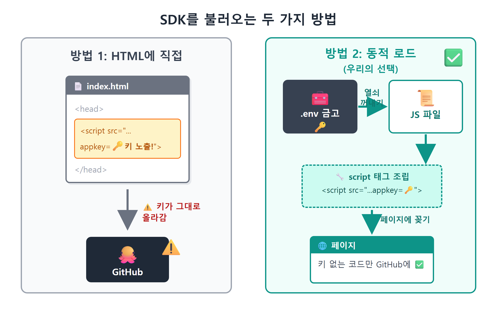
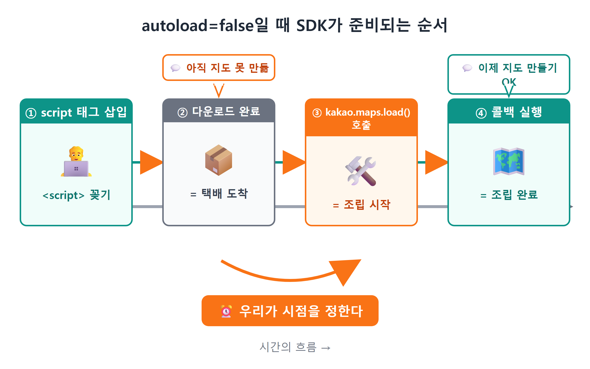
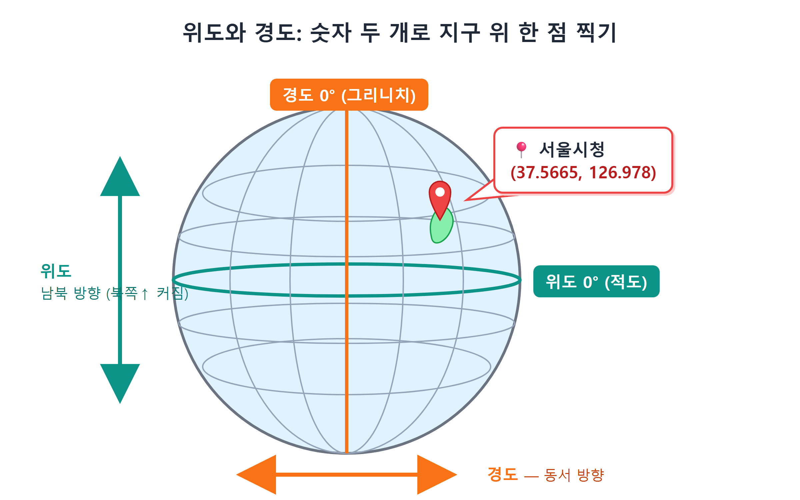
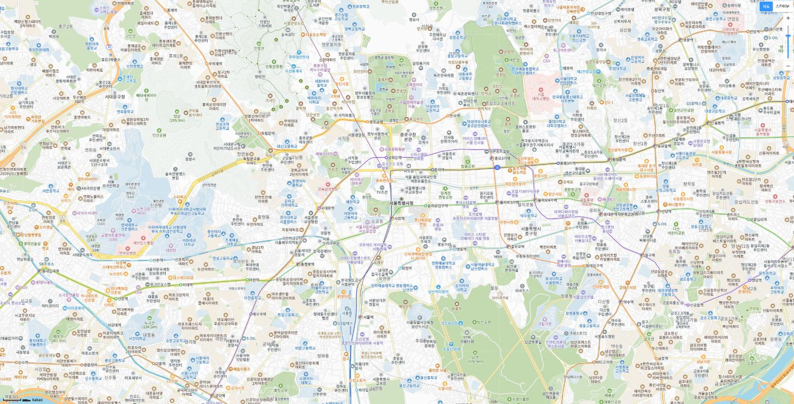
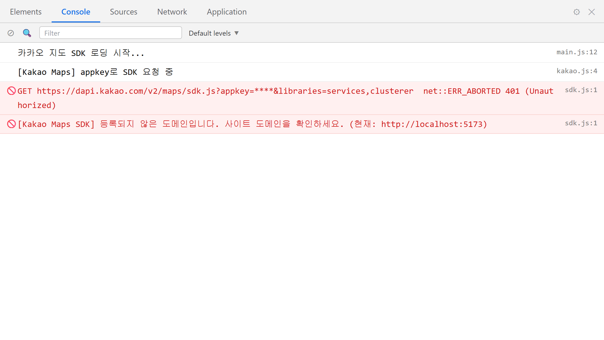

# 9장 첫 지도 띄우기

!!! note "이 장에서 배우는 것"
    - `script` 태그로 외부 SDK를 불러오는 원리와, 동적 로드가 필요한 이유를 이해합니다
    - `autoload=false`와 `kakao.maps.load()`가 왜 필요한지 배웁니다
    - Claude Code에게 시켜 SDK 로더 모듈(`loader.js`)을 만들고 함께 읽습니다
    - 지도를 만들 때 지정하는 컨테이너, center, level과 위경도 좌표 `LatLng`를 배웁니다
    - 회색 화면, 401/403 오류 같은 첫 지도의 단골 사고를 스스로 해결합니다

---

7장에서 JavaScript 키를 발급받았고, 8장에서 Vite 프로젝트를 생성한 후 키를 `.env`에 저장하였습니다. 이번 장을 마치면 브라우저 화면 전체에 카카오지도가 표시됩니다. 마우스로 드래그하면 지도가 이동하며, 마우스 휠을 조작하면 세밀한 영역까지 확대하여 확인할 수 있습니다. 카카오맵 앱에서 확인하던 것과 동일한 지도를 여러분의 웹페이지에서 그대로 사용할 수 있습니다.

지금까지는 설치, 가입, 설정 등 사전 준비 과정을 진행하였습니다. 이번 장부터는 본격적으로 지도를 구현해 보겠습니다. 코드 작성은 Claude Code가 수행하므로, 우리는 요청을 전달하고 결과를 확인하며 검증하기만 하면 됩니다. 이번 장에서 작성할 코드의 분량은 많지 않으나, 그 내용이 단순한 것은 아닙니다. 외부 스크립트 로드, 비동기 처리, 좌표계 관련 내용이 함께 포함됩니다.

## 9.1 SDK: 카카오가 미리 만들어 둔 지도 기능 모음

지도를 직접 구현하려면 전 세계의 도로 데이터를 확보하고, 확대 단계별로 타일 이미지를 준비하며, 마우스 드래그에 따른 화면 이동까지 계산하여야 합니다. 이는 개인이 구현하기에 현실적으로 어려운 작업입니다. 카카오에서는 이러한 모든 기능을 SDK[^1]라는 단일 자바스크립트 파일로 제공하고 있습니다.

카카오지도 JavaScript SDK 파일에 지도 구현에 필요한 기능이 모두 포함되어 있습니다. 이 파일 하나만으로 충분하며, 해당 파일을 웹페이지에 불러오면 `kakao.maps` 환경에서 지도를 생성하는 `Map`, 좌표를 처리하는 `LatLng`, 마커를 표시하는 `Marker` 등의 기능을 사용할 수 있습니다. 우리는 준비된 기능을 호출하여 사용하기만 하면 됩니다.

그렇다면 이 파일을 어떻게 불러올 수 있을까요? 웹페이지에서 외부 자바스크립트 파일을 불러올 때는 일반적으로 HTML의 `script` 태그를 사용하며, 카카오 공식 문서에서도 해당 방법을 우선 제시하고 있습니다.

```html
<!-- 방법 1: index.html에 직접 적기 (우리는 이 방법을 안 씁니다) -->
<script src="https://dapi.kakao.com/v2/maps/sdk.js?appkey=0123abcd4567efgh8901ijkl2345mnop"></script>
```

요청 주소의 뒤쪽에는 `?appkey=...`가 포함되어 있습니다. 7장에서 학습한 바와 같이 카카오 서버는 요청할 때마다 키의 유효성을 검증합니다. `script` 태그를 사용하여 SDK를 요청할 때는 주소의 물음표 뒤에 키를 명시하여 함께 전송하며, 이 부분을 쿼리 문자열이라고 부릅니다.

해당 방법은 간단해 보이지만 키가 HTML 파일에 그대로 노출되므로 사용하지 않는 것이 좋습니다. 8장에서 키를 `.env` 파일에 저장하고 `.gitignore` 설정을 통하여 GitHub에 키가 업로드되지 않도록 조치하였습니다. 반면 `index.html`는 GitHub에 업로드되는 파일이므로, 해당 파일에 키를 명시하면 기존의 보안 조치가 무의미해집니다.

HTML 단계에서 `.env`의 값을 참조하면 되지 않을까 생각할 수 있습니다. 그러나 HTML만으로는 해당 환경 변수를 읽어올 수 없습니다. `import.meta.env.VITE_KAKAO_JS_KEY`는 자바스크립트 코드 내에서만 동작하는 규칙이기 때문입니다.

따라서 두 번째 방법인 동적 로드 방식을 사용합니다. HTML에 `script` 태그를 미리 명시하는 대신, 자바스크립트가 실행되는 시점에 `script` 태그를 동적으로 생성하여 페이지에 추가하는 방식입니다. 이 경우 자바스크립트 내에서 `.env`에 저장된 키를 읽어와 요청 주소에 포함할 수 있습니다. 두 가지 접근 방식의 차이를 표로 비교하여 보겠습니다.

| | 방법 1: HTML에 직접 | 방법 2: 동적 로드 (우리의 선택) |
|---|---|---|
| 적는 곳 | `index.html` | 자바스크립트 파일 |
| 키 처리 | HTML에 그대로 노출 | `.env`에서 읽어서 끼움 |
| 코드 관리 | GitHub에 키가 올라감 | 키 없는 코드만 올라감 |

{ width="760" }
/// caption
그림 9.1 — SDK를 불러오는 두 가지 방법
///

!!! tip "팁"
'동적'이라는 용어는 프로그램이 실행되는 도중에 필요한 처리를 수행하는 의미로 이해하면 좋습니다. 즉 동적 로드는 웹페이지가 실행되는 도중에 필요한 스크립트를 요청하여 불러오는 방식을 의미합니다. 반대로 '정적'은 실행 전에 미리 설정해 둔 방식을 의미합니다.

## 9.2 autoload=false: 다운로드 완료와 사용 준비 완료는 다르다

동적 로드 방식을 사용할 때는 한 가지 주의할 점이 있습니다. SDK 파일의 다운로드가 완료되었다고 하여 지도를 사용할 준비가 모두 끝난 것은 아닙니다.

파일 전송이 완료된 이후에도 SDK는 지도 관련 모듈을 초기화하는 별도의 작업을 추가로 진행합니다. 이 초기화 작업이 완료되기 전에 `new kakao.maps.Map(...)`를 호출하여 지도를 생성하려고 하면 오류가 발생합니다. 해당 오류가 항상 발생하는 것은 아닙니다. 네트워크 속도가 빠른 경우 초기화 작업이 먼저 완료되어 정상적으로 동작하지만, 네트워크 속도가 느린 경우 오류가 발생할 수 있습니다. 이처럼 네트워크 환경에 따라 실행 결과가 달라지면 문제의 원인을 파악하기에 어려움이 발생할 수 있습니다.

카카오에서는 이러한 문제를 방지할 수 있도록 관련 옵션을 제공하고 있습니다. SDK 요청 주소 뒤에 `autoload=false`를 추가하면, 파일 다운로드가 완료된 이후에도 SDK가 자동으로 초기화 작업을 진행하지 않습니다. 대신 우리가 원하는 시점에 `kakao.maps.load(콜백)`를 호출하면 SDK가 초기화 작업을 시작하며, 초기화가 완료되면 전달받은 콜백 함수[^2]를 실행합니다. 처리 순서를 그림으로 나타내면 다음과 같습니다.

{ width="760" }
/// caption
그림 9.2 — autoload=false일 때 SDK가 준비되는 순서
///

SDK를 불러오는 전체적인 순서는 다음과 같습니다. 자바스크립트 코드로 `script` 태그를 생성하여 페이지에 추가하되, 요청 주소에는 `.env`에서 읽어온 키와 `autoload=false` 옵션을 포함합니다. 그리고 `kakao.maps.load()`의 콜백 함수 내에서만 지도 생성 작업을 진행합니다. 이제 해당 내용을 코드로 구현하여 보겠습니다.

## 9.3 Claude Code에게 로더 만들게 하기

프로젝트 폴더에서 `claude` 명령어를 실행하여 Claude Code를 실행한 후, 아래와 같이 요청하여 보십시오. 요청 내용에는 4장에서 학습한 맥락, 목표, 제약 조건, 예상 결과의 네 가지 요소를 포함하였습니다.

!!! tip "이렇게 물어보세요"
    > 카카오지도 JS SDK를 동적으로 불러오는 모듈을 src/loader.js로 만들어줘. 키는 .env의 VITE_KAKAO_JS_KEY에서 읽고, autoload=false로 받아서 kakao.maps.load()가 끝나면 resolve되는 Promise를 반환해줘. 키가 없거나 로드에 실패하면 이유를 알 수 있는 에러로 reject해줘.

잠시 후 Claude Code가 파일을 생성하고 실행 결과를 제시할 것입니다. 아래는 이 장의 시점에서 작성된 `src/loader.js` 파일의 전체 내용입니다. 해당 파일은 이후 두 차례 내용이 추가될 예정입니다. 15장에서 장소 검색 기능을 구현할 때 `services`를 추가하고, 22장에서 마커 관련 기능을 구현할 때 `clusterer`를 추가하면 최종 형태가 완성되며, 이후로는 내용이 변경되지 않을 것입니다.

```javascript
// 카카오 지도 SDK를 동적으로 불러오는 모듈
// autoload=false로 받아서 kakao.maps.load() 콜백 안에서 지도를 만든다.
export function loadKakaoSdk() {
  return new Promise((resolve, reject) => {
    const key = import.meta.env.VITE_KAKAO_JS_KEY;
    if (!key) {
      reject(new Error('VITE_KAKAO_JS_KEY가 .env에 없습니다.'));
      return;
    }
    const script = document.createElement('script');
    script.src =
      `https://dapi.kakao.com/v2/maps/sdk.js?appkey=${key}` +
      `&autoload=false`;
    script.onload = () => kakao.maps.load(() => resolve(kakao));
    script.onerror = () => reject(new Error('카카오 SDK 로드 실패 — 키/도메인 확인'));
    document.head.appendChild(script);
  });
}
```

전체 코드는 18줄로 구성되어 있으므로, 위에서부터 순서대로 각 부분의 역할을 확인하여 보겠습니다.

`export function loadKakaoSdk()`에서는 해당 파일에서 외부로 공개할 함수를 선언합니다. `export` 키워드를 사용하여 선언하였으므로, 다른 파일에서 해당 함수를 `import`하여 사용할 수 있습니다. SDK 로드 관련 기능을 별도의 파일로 분리하여 관리하면, 추후 지도 관련 코드가 확장되더라도 로드 관련 문제는 해당 파일만을 확인하여 해결할 수 있습니다.

`return new Promise((resolve, reject) => {...})`에서는 Promise 객체를 생성하여 반환합니다. Promise는 아직 완료되지 않은 비동기 작업의 결과를 이후에 알 수 있도록 해주는 객체입니다. SDK 파일 다운로드는 네트워크를 통한 요청이므로 작업 완료 시점을 미리 알 수 없습니다. 따라서 함수에서 직접 결과를 반환하는 대신 Promise 객체를 반환하며, 작업이 정상적으로 완료되면 `resolve`를 호출하고, 작업에 실패하면 `reject`를 호출합니다. 해당 Promise를 전달받은 측에서는 `await loadKakaoSdk()` 구문을 사용하여 작업 완료를 기다린 후 다음 처리 과정을 진행할 수 있습니다. 다음 절에서 해당 방식을 적용하여 보겠습니다.

`const key = import.meta.env.VITE_KAKAO_JS_KEY;` 부분은 8장에서 다룬 내용을 기반으로 작성된 코드입니다. Vite가 `.env` 파일에서 읽어온 키 값을 가져오는 역할을 수행합니다. 바로 아래의 `if (!key)` 부분에서는 키 값이 존재하지 않는 경우를 처리합니다. 인증 키가 유효하지 않으면 지도는 정상적으로 표시되지 않습니다. 해당 검증 코드를 추가하면, 카카오 서버로부터의 일반적인 오류 응답 대신 "VITE_KAKAO_JS_KEY가 .env에 없습니다"라는 안내 메시지가 표시되므로 문제의 원인을 보다 빠르게 파악할 수 있습니다.

`document.createElement('script')`부터 `document.head.appendChild(script)`까지의 영역은 9.1절에서 설명한 동적 로드 방식을 구현한 내용입니다. `script` 태그를 동적으로 생성하고, `src` 요청 주소에 인증 키를 포함한 후, 마지막 줄에서 해당 태그를 페이지의 `<head>` 요소에 추가합니다. 태그가 추가되는 시점에 브라우저는 SDK 파일의 다운로드를 시작합니다.

`&autoload=false` 부분은 9.2절에서 학습한 내용에 따라 SDK의 자동 초기화를 비활성화하는 옵션입니다. 현재는 요청 주소에 인증 키와 해당 옵션만을 포함하고 있으나, 추후 두 가지 옵션이 추가될 예정입니다. 15장에서 장소 검색 기능을 구현할 때 `services` 라이브러리를 추가하고, 22장에서 마커 관련 기능을 구현할 때 `clusterer` 라이브러리를 `&libraries=` 옵션으로 추가하게 됩니다. 필요한 시점에 필요한 라이브러리를 선택적으로 불러올 수 있는 장점이 있습니다.

`script.onload = () => kakao.maps.load(() => resolve(kakao));` 부분이 이 파일에서 가장 핵심적인 내용입니다. 중첩된 괄호로 인해 내용을 파악하기에 어려울 수 있으므로, 처리 순서를 기준으로 단계별로 분석하여 보겠습니다. `onload` 이벤트를 통하여 파일 다운로드의 완료를 확인한 후, `kakao.maps.load`를 호출하여 SDK의 초기화 작업을 시작합니다. 초기화 작업까지 완료되면 `resolve`를 호출합니다. 파일 다운로드와 SDK 초기화 모두 정상적으로 완료된 이후에 Promise가 처리되므로, 해당 함수를 `await`한 다음 줄에서는 즉시 지도 관련 기능을 사용할 수 있습니다.

`script.onerror = () => reject(...)` 부분은 SDK 파일의 다운로드 자체가 실패한 경우 Promise를 오류 상태로 처리합니다. 네트워크 연결이 끊어졌거나 인증 키가 올바르지 않은 경우가 해당될 수 있습니다. 이때 표시되는 "키/도메인 확인" 안내 메시지는 9.7절의 트러블슈팅 과정에서 매우 유용하게 활용할 수 있습니다.

!!! warning "주의"
`onerror`에서의 오류 처리가 모든 경우의 실패를 포착하는 것은 아닙니다. 주로 네트워크 레벨에서 파일 다운로드가 실패한 경우에만 동작하며, 광고 차단 확장 프로그램이나 콘텐츠 보안 정책 등에 의하여 스크립트 로드가 제한되는 경우에는 감지하지 못할 수 있습니다. `kakao.maps.load()`의 콜백 함수가 호출되지 않는 경우도 발생할 수 있는데, 이 경우 오류 메시지 없이 Promise가 계속 대기 상태로 남아 있게 되어, 애플리케이션의 실행이 멈춘 것처럼 보일 수 있습니다. 지도가 표시되지 않고 오류 메시지도 나타나지 않는다면, 개발자 도구의 콘솔과 네트워크 탭을 확인하여 `dapi.kakao.com` 요청 자체가 정상적으로 전송되었는지 검토하여 보십시오. 심화 학습 과제로 "일정 시간 안에 로드가 안 끝나면 실패로 처리하는 타임아웃과, 두 번 호출해도 스크립트가 중복 삽입되지 않는 장치를 넣어줘"라고 Claude Code에 요청하여 보십시오.

!!! tip "팁"
Claude Code가 생성하는 코드가 교재의 내용과 완전히 동일하여야 하는 것은 아닙니다. 변수 이름이나 오류 메시지의 문구가 상이하더라도, Promise를 반환하는 구조, `.env`에서 환경 변수를 읽어오는 처리, `autoload=false`, `load`의 콜백 함수에서 `resolve`를 호출하는 로직이 모두 포함되어 있다면 동일한 기능을 수행합니다. 생성된 코드의 일부 내용이 교재와 달라 궁금한 점이 있다면 "왜 이렇게 짰어?"라고 질문하여 확인하여도 좋습니다.

## 9.4 지도가 들어갈 자리: index.html의 #map

SDK를 불러오기 위한 기본 준비가 완료되었으므로, 이제 지도를 표시할 영역을 지정하는 방법을 알아보겠습니다. 카카오지도 SDK를 사용하기 위해서는 지도를 표시할 HTML 요소를 지정하여야 하며, 일반적으로 `id="map"` 식별자가 부여된 `div` 요소를 사용합니다. 이 장 시점의 `index.html` 파일 내용을 확인하여 보겠습니다.

```html
<!DOCTYPE html>
<html lang="ko">
  <head>
    <meta charset="UTF-8" />
    <meta name="viewport" content="width=device-width, initial-scale=1.0" />
    <title>나만의 지도</title>
  </head>
  <body>
    <div id="app">
      <div id="map"></div>
    </div>
    <script type="module" src="/src/main.js"></script>
  </body>
</html>
```

`<div id="map"></div>` 요소는 지도가 표시될 영역을 확보하기 위한 용도로 사용됩니다. 현재는 아무 내용도 작성되지 않은 상태이지만, 이후 자바스크립트 코드에 의하여 해당 영역에 지도 타일 이미지가 표시될 것입니다. 추후 해당 HTML 파일에 사이드바, 검색창, 상세 정보 패널이 추가될 예정이지만, 지도 표시를 위한 기본 구조는 현재의 형태 그대로 유지됩니다.

지도 구현 과정에서 자주 발생하는 문제를 미리 확인하고 넘어가겠습니다. 내용이 비어 있는 `div` 요소의 높이는 기본적으로 0입니다. HTML의 `div` 요소는 내부에 포함된 내용의 높이만큼으로 크기가 결정되므로, 내용이 없으면 높이 값도 0으로 설정됩니다. 높이가 0인 요소에 지도를 렌더링하면 지도 객체는 정상적으로 생성되지만 화면에는 아무것도 표시되지 않습니다. 별도의 오류 메시지도 나타나지 않고 흰색 화면만 보이게 되므로, CSS를 통하여 지도를 표시할 요소의 크기를 지정하여야 합니다. `src/style.css` 파일에 아래의 스타일 규칙을 추가합니다.

```css
html, body, #app, #map {
  height: 100%;
  margin: 0;
}
```

화면 전체 높이를 `html`부터 `#map`까지 차례로 물려준다는 뜻입니다. `#map`에만 `height: 100%`를 주면 되지 않느냐고 생각할 수 있지만, 그렇게 하면 동작하지 않습니다. CSS의 `100%`는 부모 요소 높이의 100%를 뜻합니다. 그래서 부모(`#app`), 그 부모(`body`), 그 부모(`html`)까지 모두 100%여야 화면 전체 높이가 됩니다. 중간에 하나라도 빠지면 높이가 다시 0이 되겠지요. 이 문제는 9.7절에서 다시 다루겠습니다.

## 9.5 지도 생성 3요소: 컨테이너, center, level

이제 지도를 생성하는 코드를 Claude Code에 요청하여 이어서 작성하여 보겠습니다.

!!! tip "이렇게 물어보세요"
    > src/main.js를 앱 진입점으로 만들어줘. loader.js의 loadKakaoSdk를 await로 기다렸다가, 성공하면 #map에 서울시청 중심(레벨 7)의 지도를 만들어줘. SDK 로드에 실패하면 #map 안에 실패 이유를 보여줘.

Claude Code가 생성한 `src/main.js` 파일의 내용을 확인하여 보겠습니다. 아래는 이 장의 학습 내용에 맞추어 작성된 코드의 형태입니다. 이후 사이드바와 검색 관련 기능이 추가되더라도, SDK 로드 완료를 기다린 후 지도를 생성하는 기본 구조는 변경되지 않고 유지됩니다.

```javascript
// 앱 진입점 — SDK를 기다렸다가 지도를 만든다
import './style.css';
import { loadKakaoSdk } from './loader.js';

async function main() {
  try {
    await loadKakaoSdk();
  } catch (e) {
    document.getElementById('map').innerHTML =
      `<p class="sdk-error">지도를 불러오지 못했습니다.<br>${e.message}</p>`;
    return;
  }

  const map = new kakao.maps.Map(
    document.getElementById('map'),          // ① 컨테이너: 어디에
    {
      center: new kakao.maps.LatLng(37.5665, 126.978), // ② 어디를 중심으로
      level: 7,                                        // ③ 얼마나 확대해서
    }
  );
}

main();
```

`async function main()`과 `await loadKakaoSdk()` 부분에서는 9.3절에서 생성한 함수를 호출하여 Promise 객체를 전달받습니다. `await` 구문은 async 키워드가 선언된 함수 내에서만 사용할 수 있으므로, `main`에 `async`를 추가하였습니다. `await` 라인에서 SDK의 초기화 완료를 기다리므로, 그 이후의 코드에서는 SDK에서 제공하는 `kakao.maps`를 즉시 사용할 수 있습니다.

`try { ... } catch (e) { ... }` 부분은 Promise가 `reject` 상태로 완료되는 오류 상황을 처리합니다. 오류를 그대로 전달하지 않고 지도가 표시될 영역에 "지도를 불러오지 못했습니다"와 함께 오류의 발생 원인을 표시하여 사용자가 문제를 인지할 수 있도록 하며, 개발자는 `e.message`에 포함된 내용을 바탕으로 문제의 원인을 보다 쉽게 파악할 수 있습니다. 인증 키가 없거나 SDK 로드에 실패한 경우를 구분하여 확인할 수 있습니다.

그다음 라인에서 `new kakao.maps.Map(컨테이너, 옵션)`를 호출하여 지도 객체를 생성하며, 이때 지도 생성에 필요한 다음의 주요 설정 항목을 지정하여야 합니다.

container 항목에는 지도를 표시할 HTML 요소를 지정하며, `document.getElementById('map')` 메서드를 사용하여 9.4절에서 지정한 지도 영역 요소를 찾아 전달하면 됩니다.

center 항목에는 지도가 처음 표시될 때 화면 중앙에 위치할 지점의 좌표를 지정합니다. 좌표 정보는 `kakao.maps.LatLng(위도, 경도)`를 사용하여 생성합니다. LatLng는 위도(Latitude)와 경도(Longitude)를 합쳐 부여한 이름으로, 지구 표면상의 특정 지점을 두 개의 숫자로 표시하는 방식입니다. 위도는 적도를 기준으로 북쪽과 남쪽 방향의 위치를 나타내며, 북쪽으로 갈수록 그 값이 커집니다. 경도는 영국 그리니치 천문대를 기준으로 동쪽과 서쪽 방향의 위치를 나타냅니다. 서울시청의 좌표는 위도 37.5665, 경도 126.978입니다. 대한민국 영토 내의 지점이라면 일반적으로 위도는 33~38도 사이, 경도는 124~132도 사이의 값을 가집니다. 각 지역의 좌표를 확인하는 구체적인 방법은 12장에서 다루므로, 여기서는 예시로 서울시청의 좌표를 사용하겠습니다.

{ width="760" }
/// caption
그림 9.3 — 위도와 경도: 숫자 두 개로 지구 위 한 점 찍기
///

!!! warning "주의"
`LatLng`는 이름에서 알 수 있듯이 위도를 먼저 작성하고 경도를 나중에 작성하여야 합니다. 만약 순서를 바꾸어 `LatLng(126.978, 37.5665)`라고 작성하면 오류 메시지 없이 지도가 표시되지만, 화면의 중심이 서울이 아닌 바다 위에 위치하게 될 것입니다. 지도가 정상적으로 표시되는데 화면 전체가 파란색으로 보인다면, 위도와 경도의 작성 순서가 올바른지 확인하여 보십시오.

level 항목에는 지도의 확대 수준을 지정합니다. 숫자가 작을수록 좁은 영역이 확대되어 표시되며, 레벨 1에서는 개별 건물의 모습까지 확인할 수 있습니다. 반대로 숫자가 클수록 넓은 영역이 축소되어 표시되며, 레벨 14에서는 한반도 전체의 모습을 확인할 수 있습니다. 레벨 7로 지정하면 서울의 여러 구역이 한 화면에 표시될 것입니다. 추후 레벨 값을 변경하며 지도의 표시 범위를 확인하여 보겠습니다.

## 9.6 실행: 첫 지도 확인하기

지도 구현에 필요한 코드 작성이 완료되었으므로, 이제 터미널에서 개발 서버를 실행하여 보겠습니다. 8장에서 서버를 실행한 상태로 유지하고 있다면, 파일을 저장하기만 하면 Vite가 변경 사항을 감지하여 화면의 내용을 자동으로 갱신합니다.

```
npm run dev
```

브라우저에서 `http://localhost:5173` 주소에 접속하여 보십시오. 약 1~2초 후에 화면 전체에 카카오지도가 표시될 것입니다.

{ width="760" }
/// caption
그림 9.4 — 첫 지도! 서울시청을 중심으로 화면 가득 뜬 카카오지도
///

여러분의 웹페이지에 지도가 정상적으로 표시되었습니다. 마우스로 드래그하여 지도를 이동시켜 다른 지역을 확인하여 보고, 마우스 휠을 사용하여 확대 및 축소 기능을 테스트하여 보십시오. 해당 지도는 단순한 이미지 파일이 아니라, 화면을 이동할 때마다 SDK가 필요한 영역의 지도 타일 이미지를 카카오 서버로부터 전달받아 화면에 배치하며, 매 요청 시마다 인증 키를 함께 전송하는 방식으로 동작합니다. 7장, 8장, 9장에서 진행한 모든 설정이 현재의 화면에서 함께 동작하고 있습니다.

추가로 확인하여야 할 사항이 있으므로, `F12`(또는 `Ctrl+Shift+I`) 단축키를 사용하여 브라우저 개발자 도구를 열고 콘솔 탭의 내용을 확인하여 보십시오. 콘솔 창에 붉은색 오류 메시지가 표시되지 않는다면 정상적으로 동작하는 것입니다. 지도가 정상적으로 표시되는 경우에도 콘솔을 확인하는 습관을 들이면, 사용자가 문제를 인지하기 전에 미리 오류의 존재를 파악할 수 있습니다.

## 9.7 트러블슈팅: 지도가 안 뜰 때 확인하는 순서

첫 지도를 구현하는 과정에서는 확인하여야 할 내용이 많아 예상치 못한 문제가 자주 발생할 수 있습니다. 카카오 개발자 콘솔의 설정 내용, `.env`에 저장된 인증 키, CSS의 높이 설정, SDK 로드의 타이밍 중 어느 하나라도 정확하지 않으면 지도가 정상적으로 표시되지 않을 수 있습니다. 문제가 발생한 경우 아래에 제시된 흔한 원인과 해결 방법을 참고하여 위에서부터 순서대로 확인하여 보십시오.

증상 1. 화면에 아무 내용도 표시되지 않고 흰색으로 보이며 오류 메시지도 나타나지 않습니다. 대부분의 경우 9.4절에서 설명한 바와 같이 `#map` 요소의 높이가 0으로 설정된 것이 원인입니다. 개발자 도구의 요소 탭에서 `#map` 요소를 선택하여 확인하여 보십시오. 요소 자체는 존재하지만 크기 정보가 `너비×0`로 표시된다면 해당 문제에 해당합니다. `html, body, #app, #map` 파일에서 `height: 100%` 관련 스타일 설정이 누락된 부분이 없는지 `style.css`를 확인하여 보십시오. 지도는 정상적으로 생성되었으나 요소의 크기가 이후에 변경된 경우라면, 페이지를 새로고침하는 것만으로도 문제가 해결될 수 있습니다.

증상 2. 콘솔 또는 네트워크 탭에 `401` 오류가 표시됩니다. 카카오 서버에서 전달받은 인증 키의 유효성을 인정하지 못하는 경우에 가장 빈번하게 발생합니다. 문제의 원인을 확인하는 순서는 다음과 같습니다. ① `.env` 파일에서 사용한 변수 이름이 정확히 `VITE_KAKAO_JS_KEY`인지 확인합니다. `VITE_` 접두사가 누락된 경우 Vite가 해당 환경 변수를 정상적으로 읽어오지 못합니다. ② 해당 변수에 저장된 값이 JavaScript 키가 맞는지 확인합니다. REST API 키를 잘못 사용하는 경우가 많으므로, 7장에서 확인한 카카오 플랫폼 키 관리 페이지에서 키의 종류를 다시 확인하여 보십시오. ③ 키 값의 앞뒤에 불필요한 공백이나 따옴표가 포함되지 않았는지 확인합니다. ④ `.env` 파일을 수정한 경우 개발 서버를 종료한 후 다시 시작하였는지 확인합니다. Vite는 서버를 최초로 시작할 때 `.env` 파일의 내용을 한 번만 읽어오기 때문입니다. 터미널에서 `Ctrl+C` 명령어로 서버를 종료한 후, `npm run dev` 명령어로 다시 시작하여 보십시오.

증상 3. 콘솔 또는 네트워크 탭에 `403` 오류가 표시됩니다. 인증 키 자체는 정상적이지만, 요청을 전송한 도메인이 미리 등록된 도메인과 달라서 발생하는 오류로, 7장에서 학습한 도메인 제한 설정이 적용된 경우입니다. 참고로 401 오류는 주로 인증 키 관련 문제, 403 오류는 주로 도메인 관련 문제임을 의미하지만, 이 분류는 공식적인 기준이 아닌 가장 흔한 발생 원인을 구분한 것일 뿐입니다. 어떤 경우이든 네트워크 탭에서 실패한 요청 항목을 선택하여 요청 URL과 응답 내용을 확인하는 것이 문제 해결의 첫걸음입니다. 카카오 개발자 포털에서 내 애플리케이션 > 앱 설정 > 플랫폼 키 > JavaScript 키 메뉴로 접속한 후, JavaScript SDK에 대한 도메인 목록에 현재 사용 중인 `http://localhost:5173`이 정확히 등록되어 있는지 확인하여 보십시오. 주소가 정상적으로 등록되어 있는데도 계속 403 오류가 발생한다면 도메인 주소에 오타가 없는지 확인하여야 합니다. 프로토콜의 경우 `http`와 `https` 중 어느 하나만 등록하여도 양쪽 모두에서 접속이 허용되지만, 호스트 주소와 포트 번호는 정확히 일치하여야 합니다. 포트 번호가 `5173`로 지정되지 않은 경우가 가장 흔한 원인입니다. 8장에서 설명한 바와 같이 5173 포트가 사용 중인 경우 Vite는 자동으로 5174 포트를 사용하므로, 해당 포트 번호도 미리 등록하여야 합니다. 호스트 이름의 철자가 틀렸거나 주소의 끝에 불필요한 `/` 문자가 추가된 경우도 있으므로 꼼꼼히 확인하여 보십시오.

{ width="760" }
/// caption
그림 9.5 — 도메인 미등록 시 콘솔에 찍히는 403 에러
///

{ width="760" }
/// caption
그림 9.6 — 카카오 콘솔의 JavaScript SDK 도메인 등록 재확인
///

증상 4. "지도를 불러오지 못했습니다: VITE_KAKAO_JS_KEY가 .env에 없습니다." loader.js 파일에 추가한 확인용 메시지가 표시되는 경우입니다. `.env` 파일이 프로젝트 최상위 폴더에 package.json 파일과 함께 위치하는지, 파일 이름이 `.env.txt`과 같이 정확한지 확인한 후 개발 서버를 다시 시작하여 보십시오.

증상 5. 회색 바탕만 표시되고 지도 타일 이미지가 나타나지 않습니다. 지도 객체 자체는 정상적으로 생성되었으나 타일 이미지를 전달받지 못하였거나, 지도 영역의 크기가 0인 상태에서 지도를 생성한 후에야 요소의 크기가 변경된 경우에 해당합니다. 우선 네트워크 탭에서 실패한 요청이 존재하는지 확인하고, 요청 오류가 발생하였다면 위에서 설명한 증상 2와 증상 3의 해결 방법을 참고하여 조치하여 보십시오. 네트워크 통신에는 문제가 없으나 계속 회색 화면으로 표시된다면, 지도 영역의 크기가 지도 생성 이후에 변경된 경우이므로 페이지를 새로고침하여 보십시오. 문제가 지속적으로 발생한다면, 지도를 표시하는 요소의 크기가 변경된 이후에 `relayout` 메서드를 호출하여 지도 영역을 다시 조절하여야 합니다. 해당 부분에 대한 자세한 내용은 사이드바 기능을 구현하는 23장에서 다루겠습니다.

위의 방법으로 문제가 해결되지 않는 경우, 발생한 오류 메시지를 그대로 복사하여 Claude Code에 전달하면 도움을 받을 수 있습니다.

!!! tip "이렇게 물어보세요"
    > 지도가 안 떠. 브라우저 콘솔에 이런 에러가 나와. 원인을 찾아서 고쳐줘. 카카오 콘솔 설정 문제라면 뭘 확인해야 하는지 알려줘. 에러 내용은 이거야: 콘솔의 빨간 에러 메시지를 그대로 붙여 넣습니다

문제를 해결하는 과정에서는 오류 메시지를 요약하지 말고 원문 그대로 전달하는 것이 효과적입니다. "지도가 안 떠"라는 추상적인 설명보다 실제 오류 메시지 원문에 문제 해결에 필요한 정보가 더 많이 포함되어 있기 때문입니다. 코드 자체의 문제라면 Claude Code가 직접 코드를 수정하여 주며, 카카오 개발자 콘솔의 설정 관련 문제라면 확인하여야 할 메뉴의 위치를 알려줄 것입니다.

!!! warning "주의"
401 또는 403 오류를 해결하는 과정에서 인증 키가 포함된 내용을 그대로 채팅창이나 온라인 커뮤니티에 공개하지 않도록 각별히 주의하여야 합니다. 오류 메시지 본문에는 인증 키가 포함되지 않더라도, `.env`의 내용이나 SDK 요청 URL 전체를 복사하면 인증 키가 함께 포함될 수 있습니다. 문제 해결을 위한 질문을 작성할 때는 인증 키가 노출되는 부분을 `0123abcd...`와 같이 가리고 내용을 공유하십시오.

## 9.8 마무리

이번 장에서는 첫 번째 기능을 구현하였습니다. Claude Code에 요청하여 SDK를 동적으로 로드하는 `loader.js`를 작성하고, `autoload=false`와 `kakao.maps.load()` 옵션을 활용하여 SDK 초기화 시점으로 인한 문제점을 해결하였습니다. 지도를 표시할 영역, 최초 표시 위치, 확대 수준을 지정하여 지도를 화면에 표시하였으며, 지도가 정상적으로 나타나지 않는 다섯 가지 상황별 확인 방법과 조치 방안을 정리하였습니다.

현재의 지도에는 아직 마커나 추가적인 정보가 표시되지 않은 상태입니다. 그러나 여기서 내용이 끝나는 것이 아닙니다. 추후 해당 지도 위에 장소 정보와 정보창을 표시하고, 검색 기능과 필터링 기능을 추가할 예정입니다. 이번 장에서 구현한 `loader.js`와 `main.js`가 모든 추가 기능의 기반이 될 것입니다.

!!! abstract "이 장의 핵심"
    - SDK는 카카오가 만들어 둔 지도 기능 모음이며, `kakao.maps` 아래의 기능을 불러 지도를 만들 수 있습니다.
    - HTML에 `script` 태그를 직접 적으면 키가 노출되므로, 자바스크립트에서 `.env`의 키를 읽어 `script` 태그를 만들어 넣는 동적 로드를 씁니다.
    - 파일 다운로드가 끝나도 사용 준비가 끝난 것은 아닙니다. `autoload=false`로 자동 초기화를 막고, `kakao.maps.load()` 콜백 안에서만 지도를 만듭니다.
    - `loader.js`는 이 과정을 Promise로 감싸므로, `await loadKakaoSdk()` 한 줄로 준비 완료까지 기다릴 수 있습니다.
    - 지도를 만들 때 컨테이너, center, level을 정해 줍니다. 컨테이너로 쓰는 `#map` div에는 CSS 높이를 반드시 지정해야 합니다. center에는 `LatLng(위도, 경도)` 순서로 좌표를 넣고, level은 숫자가 작을수록 확대됩니다.
    - 화면이 비어 있으면 `#map` 높이가 0인지 봅니다. 401이면 `VITE_` 접두사와 JS 키를 확인하고 서버를 다시 시작합니다. 403이면 JavaScript 키의 SDK 도메인에 `http://localhost:5173`이 등록됐는지 확인합니다. 이 구분은 가장 흔한 원인일 뿐이므로 Network 탭의 실패 요청도 함께 보는 것이 좋습니다.

!!! question "잠깐 생각해 봅시다"
Q1. `autoload=false` 옵션을 지정하지 않고 SDK를 로드하면 "될 때도 있고 안 될 때도 있는" 관련 문제가 발생할 수 있습니다. 해당 문제가 항상 발생하는 것이 아니라 일부 환경에서만 간헐적으로 발생하는 이유는 무엇일까요?

____________________________________________

____________________________________________

Q2. 401 오류와 403 오류는 모두 요청이 거절되었음을 의미하지만 그 발생 원인은 상이합니다. 각각 어떤 경우에 발생하는지 한 문장씩 작성하여 보십시오.

____________________________________________

____________________________________________ 필요하시면 각 질문(Q1, Q2)에 대한 모범 답안을 함께 작성해 드릴까요? ch09.txt

!!! example "확인 문제"
    1. `main.js`의 `center` 좌표를 위도 35.1798, 경도 129.0750으로 바꾸고 저장해 보세요. 부산 시청 근처입니다. 지도가 어디로 이동하나요? 확인한 뒤 다시 서울시청으로 되돌리세요.
    2. `level`을 3으로, 다시 12로 바꿔 보며 화면에 보이는 범위가 어떻게 달라지는지 확인해 보세요.
    3. `.env`의 키에서 마지막 한 글자를 지우고 서버를 재시작해 보세요. 콘솔에 어떤 에러가 찍히나요? 9.7절에서 몇 번 증상인지 찾아본 뒤 키를 원래대로 복구하세요.

!!! info "더 찾아보기"
    - `async/await` — Promise를 기다리는 문법의 나머지 이야기. `Promise.all`로 여러 약속을 동시에 기다리는 법도 있습니다.
    - `쿼리 문자열(query string)` — URL의 `?key=value&key2=value2` 부분. SDK 주소의 `appkey`·`autoload`(그리고 15장부터 추가할 `libraries`)가 모두 이 형식입니다.
    - `WGS84` — 우리가 쓴 위경도 좌표의 공식 이름(세계 측지계). GPS와 대부분의 지도 서비스가 이 좌표계를 씁니다.
    - `HTTP 상태 코드` — 401·403 말고도 404, 500 등 서버의 대답 코드 체계. 앞으로 계속 만납니다.

> 다음 장으로. 10장에서는 코드로 지도를 조작하는 방법을 배웁니다. 중심을 바로 옮기는 `setCenter`와 이동 애니메이션이 있는 `panTo`의 차이, 확대 레벨 조절, 지도 위에 확대·축소 버튼 붙이기, 그리고 지도를 클릭한 곳의 좌표를 얻는 이벤트를 다룹니다. 16장에서 클릭으로 장소를 추가할 때 이 기능을 씁니다.

[^1]: SDK(Software Development Kit) — 소프트웨어 개발 키트. 어떤 서비스를 내 프로그램에서 쓸 수 있도록 필요한 코드와 도구를 묶어 제공하는 것을 말합니다. 카카오지도 JS SDK는 자바스크립트 파일 형태로 제공됩니다.
[^2]: 콜백(callback) 함수 — "이 일이 끝나면 이 함수를 불러줘(call back)"라며 다른 코드에 맡겨 두는 함수. `kakao.maps.load(콜백)`은 SDK 초기화가 끝난 시점에 우리가 맡긴 함수를 대신 실행해 줍니다.
