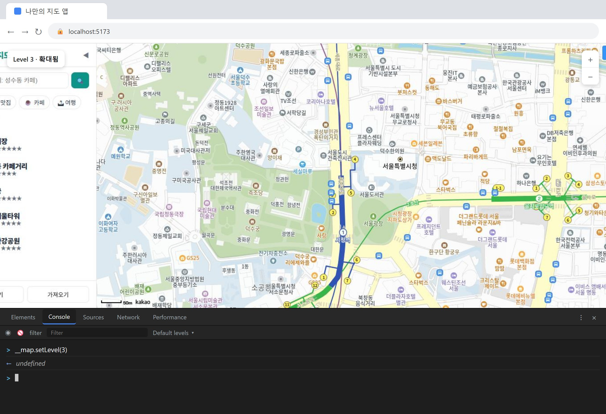
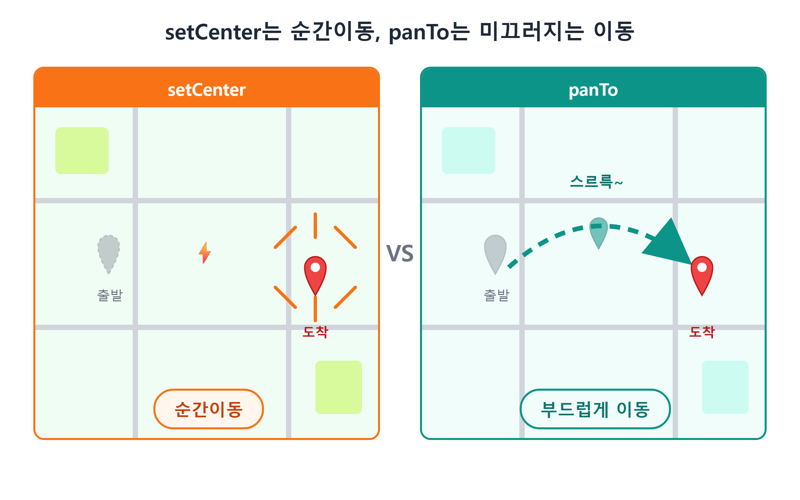
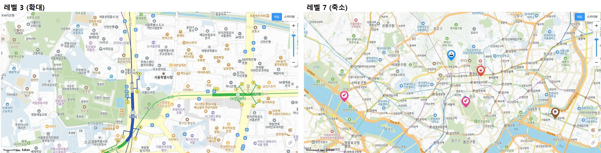
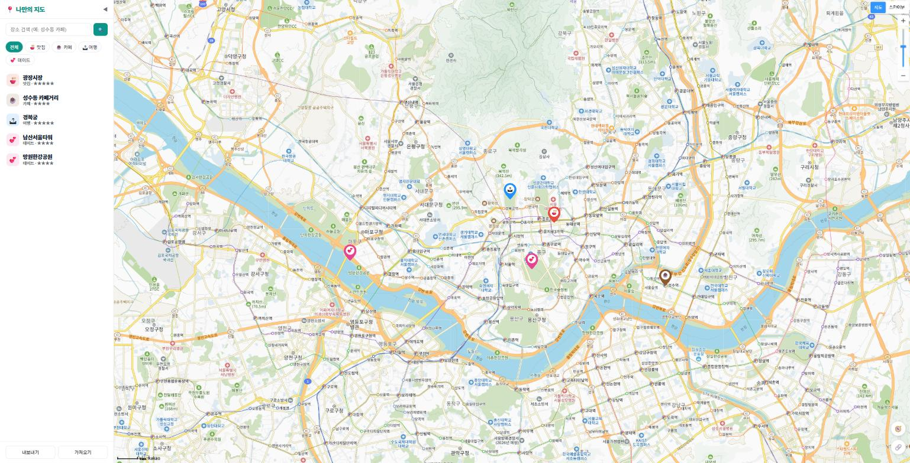
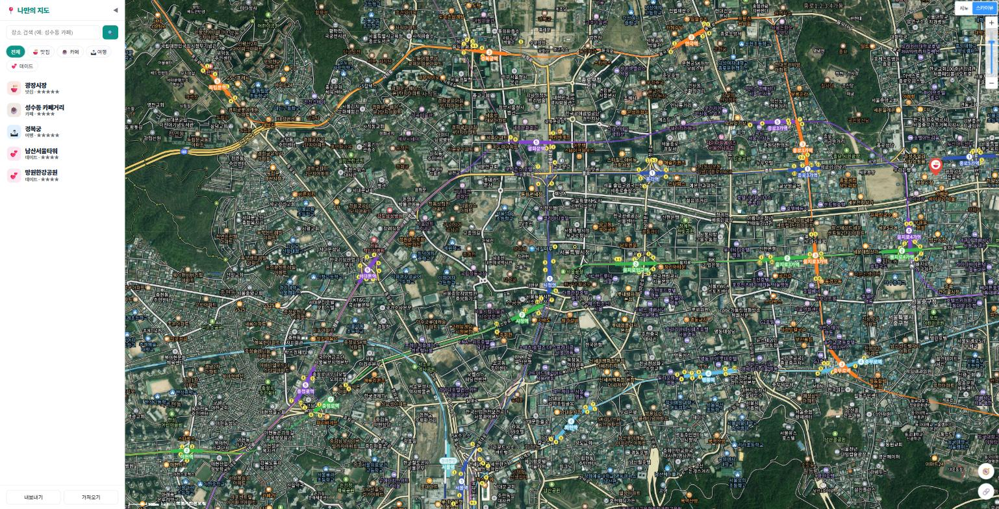
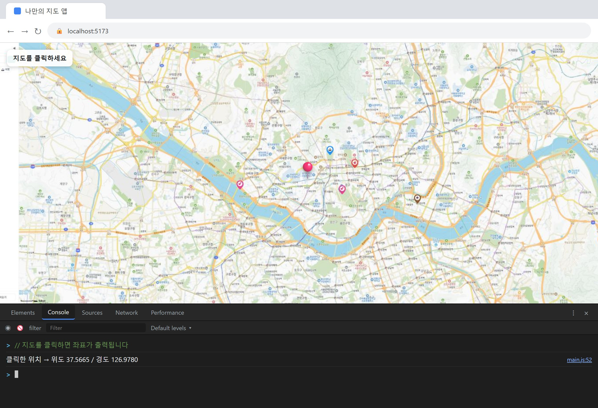

# 10장 지도 다루기

!!! note "이 장에서 배우는 것"
    - 지도 객체의 메서드를 호출해 지도를 조작하는 방법을 배웁니다. 콘솔에서 지도를 직접 움직여 봅니다
    - `setCenter`와 `panTo`의 차이(즉시 이동과 애니메이션 이동)를 이해합니다
    - `setLevel`로 확대·축소하며 레벨 숫자와 축척 감각을 익힙니다
    - 지도에 MapTypeControl(지도 타입 버튼)과 ZoomControl(확대·축소 버튼)을 답니다
    - `click`, `dragend` 이벤트로 지도의 신호를 받아, 클릭한 곳의 좌표를 콘솔에 찍어 봅니다

---

9장에서 브라우저 화면 전체에 카카오지도를 표시하였습니다. 다만 현재는 지도를 단순히 보는 것만 가능할 뿐, 별도의 조작을 명령할 수는 없습니다. 마우스로 드래그하면 지도가 이동하고 마우스 휠을 돌리면 확대 또는 축소되지만, 이는 카카오 SDK에서 기본으로 제공하는 동작일 뿐입니다. 아직 작성하신 코드에서 지도에 별도의 명령을 내린 적은 없습니다.

이번 장에서는 코드를 통해 지도를 조작하는 방법을 학습합니다. 지도를 특정 위치로 이동시키거나 확대 레벨을 변경하고, 버튼을 추가하는 방법을 배우며, 반대로 지도에서 전달하는 이벤트 신호를 수신하는 방법도 알아봅니다. 사용자가 지도의 어느 부분을 클릭하였는지, 지도를 드래그하여 이동시켰는지 등을 이 이벤트 신호를 통해 파악할 수 있습니다. 지도에 명령을 내리는 방식을 메서드라고 하고, 지도에서 전달하는 신호를 수신하는 방식을 이벤트라고 합니다. 이번 장에서는 이 두 가지 내용을 다루며, 이후에 구현할 대부분의 기능은 이 메서드와 이벤트를 조합하여 만들게 됩니다. 11장의 마커 표시 기능과 16장의 지도 클릭으로 장소를 추가하는 기능 역시 여기서 배우는 메서드와 이벤트를 활용하여 구현합니다.

이번 장에서도 Claude Code에게 코드 작성을 요청하고, 생성된 코드를 함께 검토해 보겠습니다. 또한 이번 장에서는 브라우저 개발자 도구의 콘솔에서 직접 지도를 조작해 보는 실습을 추가로 진행합니다. 코드 파일을 수정하고 저장하지 않아도 콘솔에 명령을 한 줄 입력하면 지도가 즉시 반응하는 것을 확인할 수 있습니다.

## 10.1 지도 조작하기: Map 객체와 메서드

9장에서 지도를 생성할 때 다음과 같은 코드를 확인한 바 있습니다.

```js
const map = new kakao.maps.Map(container, {
  center: new kakao.maps.LatLng(37.5665, 126.978),
  level: 7,
});
```

해당 코드에서 `map`라는 변수를 주목해 주십시오. `new kakao.maps.Map(...)`이 생성한 지도 객체가 이 변수에 저장됩니다. 이 지도 객체는 화면에 표시되는 지도 자체일 뿐만 아니라, 지도를 조작하기 위한 통로의 역할도 수행합니다. 지도 객체에는 `setCenter`(중심 이동), `setLevel`(확대 레벨 변경), `getCenter`(현재 중심 좌표 반환)과 같은 기능이 포함되어 있습니다. 이처럼 객체에 속한 기능을 메서드[^1]라고 부릅니다. `map.setLevel(3)`의 형식과 같이 객체 이름, 마침표, 메서드 이름, 괄호 순서로 작성합니다.

다만 이 지도 객체는 현재 코드 내에 정의되어 있기 때문에 콘솔에서 직접 실행해 볼 수 없습니다. 코드를 수정하고 저장해야만 실행 결과를 확인할 수 있다면, 여러 값을 테스트하기에 불편할 것입니다. 따라서 지도 객체를 브라우저 콘솔에서도 사용할 수 있도록 설정하겠습니다. Claude Code에게 다음과 같이 요청하십시오.

!!! tip "이렇게 물어보세요"
    > main.js에서 만든 지도 객체를 브라우저 개발자도구 콘솔에서도 만질 수 있게 window에 노출해줘. 실험용이라는 주석도 달아줘.

그러면 Claude Code가 `main.js`의 지도 생성 코드 바로 아래에 한 줄의 코드를 추가해 줍니다.

```js
window.__map = map; // 콘솔 실험용 — 브라우저 콘솔에서 __map으로 접근
```

`window`는 브라우저의 전역 공간을 의미합니다. 이 전역 공간에 지도 객체를 등록해 두면, 개발자 도구 콘솔에서 객체 이름만 입력하여 즉시 사용할 수 있습니다. 객체 이름 앞에 밑줄 두 개를 붙이면 "이건 정식 기능이 아니라 개발용 뒷문"이라는 의미로 통용됩니다. 이는 문법상의 규칙은 아니지만, 개발자들 사이에서 오랜 기간 사용해 온 명명 규칙입니다.

이제 `npm run dev`로 개발 서버를 실행한 상태에서 브라우저를 열고, F12 키를 눌러 개발자 도구를 실행한 후 콘솔 탭을 선택하십시오. 그리고 콘솔 입력창에 다음과 같이 입력해 보십시오.

```js
__map.setLevel(3)
```

엔터 키를 누르면 지도가 좁은 골목까지 보일 정도로 확대되는 것을 확인할 수 있습니다. 코드 파일을 수정하지 않았음에도 지도가 정상적으로 반응하는 것입니다. 콘솔에서는 현재 열려 있는 페이지의 자바스크립트 코드를 직접 실행할 수 있으므로, 명령을 즉시 테스트하기에 매우 편리합니다.

{ width="820" }
/// caption
그림 10.1 — 콘솔에서 __map.setLevel(3)을 실행하여 확대한 지도
///

이번에는 지도에 현재 상태를 질의해 보겠습니다. 콘솔에 다음과 같이 한 줄을 입력해 보십시오.

```js
__map.getCenter().toString()
```

그러면 `(37.5665..., 126.978...)`와 유사한 좌표 값이 반환됩니다. `set`으로 시작하는 메서드는 값을 변경하는 기능에 가깝고, `get`으로 시작하는 메서드는 현재의 값을 조회하는 기능에 가깝습니다. 이 이름 규칙은 카카오 SDK 전체에서 일관되게 적용되므로, `setLevel`이 존재한다면 `getLevel`도 존재할 것이라고 쉽게 예측할 수 있습니다. 실제로 `__map.getLevel()`을 입력하면 앞서 변경한 `3` 값이 정상적으로 반환되는 것을 확인할 수 있습니다.

!!! tip "팁"
콘솔에서 `__map.`까지 입력하고 잠시 기다리면, 해당 지도 객체가 제공하는 메서드의 목록이 자동 완성 기능으로 표시됩니다. 방향키로 목록을 스크롤하여 확인해 보시되, 모든 메서드를 외울 필요는 없습니다. 어떤 종류의 메서드가 존재하는지 대략적으로 파악해 두기만 하면 충분합니다. 이후 Claude Code가 작성한 코드에서 처음 보는 메서드가 나오더라도, 지도 객체의 기능임을 쉽게 인지할 수 있을 것입니다.

## 10.2 중심 이동: setCenter와 panTo

먼저 지도의 중심 좌표를 이동시켜 보겠습니다. 지도의 중심을 이동시키는 메서드는 두 가지가 있으며, 최종 결과는 동일하지만 이동하는 방식에 차이가 있습니다.

콘솔에서 직접 두 메서드를 비교해 보겠습니다. 먼저 지도의 중심을 서울로 설정한 상태에서, 즉시 이동하는 메서드를 실행해 보십시오.

```js
__map.setCenter(new kakao.maps.LatLng(35.1587, 129.1604))
```

엔터 키를 누르면 이동하는 과정이 표시되지 않고 지도가 즉시 부산 해운대 위치로 변경됩니다. 이번에는 다시 지도를 서울 위치로 되돌려 보겠습니다. 앞서 사용한 `setCenter` 메서드에 `37.5665, 126.978` 좌표 값을 전달하면 됩니다. 그 다음에는 부드럽게 이동하는 메서드를 사용해 보겠습니다.

```js
__map.panTo(new kakao.maps.LatLng(37.4979, 127.0276))
```

이번에는 지도가 강남역 방향으로 이동하는 과정이 화면에 애니메이션으로 표시되는 것을 확인할 수 있습니다. 마우스로 지도를 드래그하여 이동하였을 때와 유사한 효과가 적용됩니다. `panTo` 메서드는 이처럼 부드럽게 지도의 중심을 이동시키는 기능을 수행합니다. 여기서 pan은 카메라를 좌우로 서서히 이동시키는 촬영 기법을 의미하는 영단어입니다.

{ width="760" }
/// caption
그림 10.2 — setCenter는 즉시 이동, panTo는 애니메이션과 함께 이동
///

두 메서드 중 어느 것이 항상 더 우수하다고 할 수는 없습니다. 사용자에게 이동 과정을 보여줄 필요가 있는지 여부에 따라 적절히 선택하여 사용하시면 됩니다.

- setCenter: 페이지를 처음 열 때 시작 위치를 잡는 경우처럼, 이동 과정을 보여줄 필요가 없을 때 쓰면 좋습니다. 애니메이션 없이 바로 바뀝니다.
- panTo: 사용자가 목록에서 장소를 클릭해 지도가 그곳으로 이동할 때 씁니다. 화면이 한 번에 바뀌면 사용자는 지도가 어디에서 어디로 옮겨 갔는지 알기 어렵지만, 이동 과정이 보이면 위치 관계를 파악할 수 있습니다.

실제로 완성될 애플리케이션의 코드에서도 이 두 메서드의 차이를 확인할 수 있습니다. 사이드바에서 특정 장소를 클릭하였을 때 호출되는 함수에서는 `map.panTo(pos)` 메서드를 사용합니다. 이 내용은 18장에서 다시 자세히 다루도록 하겠습니다.

!!! warning "주의"
`panTo` 메서드에는 하나의 특징이 있습니다. 이동할 거리가 현재 화면의 크기보다 매우 클 경우, 예를 들어 서울에서 부산으로 이동하는 경우에는 애니메이션 효과가 생략되고 즉시 이동합니다. 장거리 이동을 애니메이션으로 표시하면 시간이 오래 걸리기 때문에 SDK에서 이와 같이 기본 설정을 적용한 것입니다. 따라서 `panTo` 메서드를 사용하였는데 애니메이션 효과가 나타나지 않는다면, 먼저 이동 거리를 확인해 보시기 바랍니다.

그리고 좌표에 관한 내용을 잠시 추가로 설명하겠습니다. 위 실습에서 사용한 `35.1587, 129.1604`과 같은 숫자 값은 9장에서 학습한 위도와 경도 값입니다. 이 값을 어떻게 알 수 있는지 "그런데 해운대 좌표를 내가 어떻게 알아?"라는 의문이 생길 수 있습니다. 물론 타당한 의문이며, 실제로 좌표 값을 외워서 사용하지 않고 필요할 때마다 획득하여 사용하는 것이 맞습니다. 이 장의 10.5절에서 클릭 한 번으로 해당 지점의 좌표를 확인할 수 있는 기능을 만들고, 12장에서는 카카오지도 서비스에서 좌표를 보다 쉽게 획득하는 다른 방법도 알아보겠습니다. 따라서 지금은 교재에 제시된 좌표 값을 복사하여 사용하시면 됩니다.

## 10.3 확대와 축소: setLevel과 축척 감각

앞서 10.1절에서 이미 `setLevel(3)`을 입력하여 지도 레벨을 변경해 본 적이 있을 것입니다. 이번에는 지도 레벨이라는 값이 의미하는 바를 정확히 이해하도록 하겠습니다.

카카오지도의 레벨은 1부터 14까지의 정수로 표현하며, 숫자가 작을수록 지도가 확대되어 표시됩니다. 처음에는 이 관계가 헷갈리기 쉬운데, "레벨은 높이"와 같이 기억하면 쉽게 이해할 수 있습니다. 레벨 1은 드론이 건물 바로 위에 떠 있는 높이에서 내려다보는 시야에 해당하며, 레벨 14는 인공위성에서 한반도 전체를 내려다보는 시야에 해당합니다. 레벨 값이 커질수록 지도를 보는 시점이 높아지므로 넓은 범위를 한눈에 볼 수 있지만, 세부적인 내용은 확인하기 어려워집니다.

콘솔에서 지도 레벨을 조절하며 확인해 보겠습니다. 레벨을 하나씩 변경해 가면서 지도의 표시 범위가 어떻게 달라지는지 관찰해 보십시오.

```js
__map.setLevel(1)   // 건물 출입구까지 보이는 최대 확대
__map.setLevel(3)   // 동네 골목 수준
__map.setLevel(7)   // 도시 전체가 한눈에 (우리 앱의 시작 레벨)
__map.setLevel(11)  // 몇 개 도(道)가 함께 보이는 수준
__map.setLevel(14)  // 한반도 전체
```

지도 레벨이 1단계 상승할 때마다 화면에 표시되는 지도의 범위는 약 두 배로 넓어집니다. 따라서 레벨 7과 레벨 8은 시각적으로 큰 차이가 없어 보이지만, 레벨 3과 레벨 10은 표시되는 내용이 매우 다릅니다.

{ width="760" }
/// caption
그림 10.3 — 동일한 위치에서의 서로 다른 레벨: 레벨 3(왼쪽)과 레벨 7(오른쪽)
///

실제로 여러분이 만들 애플리케이션에서 지도 레벨을 어떻게 설정하는지 살펴보면, 레벨 값에 관한 기준을 보다 쉽게 이해할 수 있습니다. 애플리케이션을 처음 실행하였을 때는 지도 레벨을 7로 설정하여 시작합니다. 이 경우 서울시 전체가 화면에 표시되므로, 사용자가 저장한 장소들이 어느 지역에 분포하는지 파악하기 용이합니다. 그리고 목록에서 특정 장소를 선택하여 해당 위치로 이동할 때는 지도 레벨을 4로 변경합니다. 이는 해당 장소가 어느 골목에 위치하는지 상세하게 보여주기 위함입니다. 즉, 넓은 범위를 보고자 할 때는 큰 레벨 값을 사용하고, 특정 지점의 세부 내용을 보고자 할 때는 작은 레벨 값을 사용하는 방식입니다.

지도 레벨 역시 현재 값을 조회하는 메서드가 존재합니다. `__map.getLevel()` 메서드를 호출하면 현재 설정된 지도의 레벨 값을 반환합니다. 콘솔에서 `__map.setLevel(0)` 또는 `__map.setLevel(99)`와 같이 임의의 레벨 값을 입력하여 실행해 보십시오. SDK에서 미리 설정된 허용 범위를 벗어나는 값을 자동으로 보정해 주므로, 지도는 오류를 발생시키지 않고 허용 범위 내에서 가장 가까운 레벨로 자동 조정됩니다. 콘솔에서 실행한 테스트는 브라우저를 새로고침하면 초기 상태로 복원되므로, 다양한 값을 입력하여 테스트해 보아도 무방합니다.

## 10.4 지도에 버튼 달기: MapTypeControl과 ZoomControl

지금까지는 개발자인 여러분이 직접 콘솔에 명령을 입력하여 지도를 조작하였습니다. 하지만 실제 애플리케이션을 사용하는 사용자에게 개발자 도구 콘솔을 열어서 사용하라고 요청할 수는 없습니다. 따라서 사용자가 직접 조작할 수 있는 제어 버튼을 지도 화면에 추가하여야 합니다. 카카오지도 SDK에서는 이러한 제어용 버튼을 컨트롤이라고 부릅니다. 가장 널리 사용되는 두 가지 컨트롤은 SDK에서 기본으로 제공하고 있습니다.

- MapTypeControl: 일반 지도와 스카이뷰(위성 사진)를 전환하는 버튼
- ZoomControl: 확대(+)·축소(−) 버튼

카카오지도 공식 애플리케이션에서도 해당 버튼을 본 적이 있을 것입니다. 이제 Claude Code에게 요청하여 해당 컨트롤을 추가해 보겠습니다.

!!! tip "이렇게 물어보세요"
    > 지도 오른쪽 위에 일반지도/스카이뷰 전환 버튼을, 오른쪽에 확대·축소 버튼을 달아줘. 카카오 SDK가 기본 제공하는 컨트롤을 사용해.

그러면 Claude Code가 지도 생성 코드 바로 아래에 두 줄의 코드를 추가해 줄 것입니다. 해당 코드는 이 책에서 사용하는 애플리케이션의 실제 코드에서 가져온 내용입니다.

```js
const map = new kakao.maps.Map(container, {
  center: new kakao.maps.LatLng(37.5665, 126.978),
  level: 7,
});

// 지도 타입 컨트롤 — 일반 지도 / 스카이뷰 전환 버튼
map.addControl(new kakao.maps.MapTypeControl(), kakao.maps.ControlPosition.TOPRIGHT);
// 줌 컨트롤 — 확대(+) / 축소(-) 버튼
map.addControl(new kakao.maps.ZoomControl(), kakao.maps.ControlPosition.RIGHT);
```

추가된 두 줄의 코드는 동일한 구조로 작성된 것을 확인할 수 있습니다. `map.addControl(무엇을, 어디에)`의 형식으로, `addControl` 메서드에 두 가지 정보를 전달하면 컨트롤이 추가됩니다.

첫 번째는 추가할 컨트롤의 종류입니다. `new kakao.maps.MapTypeControl()`는 지도 타입을 전환하는 버튼을 생성하며, `new kakao.maps.ZoomControl()`은 지도의 확대 및 축소를 위한 버튼을 생성합니다. 이는 9장에서 `new kakao.maps.Map(...)` 메서드를 사용하여 지도 객체를 생성하였을 때 적용한 `new` 문법과 동일한 방식입니다. 즉, 카카오 SDK의 모든 구성 요소는 이와 같이 `new kakao.maps.이름()` 방식으로 생성하는 규칙이 적용됩니다.

두 번째는 컨트롤을 표시할 위치입니다. `kakao.maps.ControlPosition.TOPRIGHT`는 화면의 오른쪽 상단 모서리를 의미하며, `RIGHT`는 화면의 오른쪽 중앙 위치를 의미합니다. SDK에서 미리 정의한 위치 식별자 중에서 원하는 값을 선택하여 사용하므로, 단순히 `TOPLEFT` 또는 `BOTTOMRIGHT`와 같이 위치 이름만 변경하면 컨트롤의 위치를 쉽게 이동할 수 있습니다.

코드 파일을 저장하면 Vite에서 자동으로 변경 사항을 감지하고 브라우저를 새로고침하므로, 별도의 조작 없이 브라우저에서 결과를 확인하기만 하면 됩니다.

{ width="760" }
/// caption
그림 10.4 — 컨트롤이 추가된 지도: 오른쪽 상단의 지도 타입 전환 버튼, 오른쪽 중앙의 줌 버튼
///

화면 오른쪽 상단에 위치한 스카이뷰 버튼을 클릭해 보십시오. 지도가 위성 사진 지도로 전환되어 서울시청 건물의 지붕 모양과 도로의 차선까지 상세하게 보일 것입니다. 추후 저장한 장소의 건물 형태를 확인하고자 할 때 매우 유용하게 사용할 수 있습니다.

{ width="760" }
/// caption
그림 10.5 — 스카이뷰로 전환한 지도 화면
///

지도 오른쪽에 위치한 확대·축소 버튼의 더하기와 빼기 버튼을 클릭해 보면, 지도의 레벨이 변경되는 것을 확인할 수 있습니다. 이 버튼이 수행하는 기능은 여러분이 앞서 콘솔에서 실행한 `setLevel` 메서드와 정확히 동일하며, 버튼을 클릭할 때마다 지도의 레벨 값이 1씩 증가하거나 감소하게 됩니다. 이와 같이 화면에 배치한 버튼은 대부분 사용자가 메서드를 직접 호출하는 번거로움을 대신 수행해 주는 역할을 합니다.

!!! tip "팁"
컨트롤 버튼을 추가한 이후에도 마우스 휠을 이용한 지도 확대·축소 기능과 마우스 드래그를 통한 지도 이동 기능은 기존과 동일하게 정상 작동합니다. 컨트롤 버튼을 추가하였다고 하여 기존의 조작 방식이 사라지는 것이 아니라, 단순히 조작할 수 있는 방법이 하나 더 늘어난 것일 뿐입니다. 참고로 이러한 기본 조작 기능을 비활성화하는 메서드도 별도로 제공하고 있습니다. 콘솔에 `__map.setZoomable(false)`를 입력하면 마우스 휠을 이용한 확대·축소 기능이 잠기고, 반대로 `true`를 입력하면 해당 잠금이 해제되어 다시 정상적으로 사용할 수 있습니다. 이 기능은 지도를 단순히 배경 화면으로만 사용하고자 하는 페이지 등에서 활용할 수 있습니다.

## 10.5 지도의 이벤트 받기: click과 dragend

지금까지는 여러분이 직접 지도에 명령을 내리는 방식을 실습하였으므로, 이번에는 반대로 지도 측정에서 전달되는 이벤트 신호를 수신하는 방법에 대해 알아보겠습니다.

사용자가 지도의 특정 지점을 클릭하면, 지도에서는 클릭 이벤트가 발생하였다는 사실과 해당 지점의 좌표 정보를 포함한 이벤트 신호를 전달합니다. 또한 사용자가 마우스 드래그로 지도를 이동시킨 후 마우스 버튼을 놓으면, 지도 이동이 완료되었다는 이벤트 신호를 전달합니다. 이처럼 지도에서 발생하는 각종 상황을 알리는 신호를 이벤트[^2]라고 부릅니다. 하지만 이벤트 신호가 전달되어도 해당 신호를 수신하여 처리할 코드가 미리 준비되어 있지 않다면, 아무런 동작도 수행되지 않습니다. 따라서 이벤트 신호가 발생하였을 때 호출될 함수를 미리 등록하여 두는데, 이렇게 등록하는 함수를 이벤트 리스너라고 부릅니다. 즉, click 이벤트 신호가 전달되면 지정한 함수를 실행하도록 미리 약속하여 설정하여 두는 것입니다.

이번 장에서는 16장에서 구현하게 될 "지도 클릭으로 장소 추가" 기능의 기본 원리가 되는 코드를 직접 작성해 보겠습니다.

!!! tip "이렇게 물어보세요"
    > 지도를 클릭하면 클릭한 지점의 위도·경도를 콘솔에 출력해줘. 나중에 이 좌표로 장소를 추가할 거라 좌표를 정확히 얻는 게 목적이야.

그러면 Claude Code가 `main.js`에 해당 위치에 다음과 같은 코드를 추가해 줄 것입니다.

```js
// 지도 클릭 → 클릭한 지점의 좌표를 콘솔에 출력
kakao.maps.event.addListener(map, 'click', (e) => {
  const lat = e.latLng.getLat();
  const lng = e.latLng.getLng();
  console.log('클릭한 곳:', lat, lng);
});
```

이제 새로 추가된 코드의 내용을 한 줄씩 자세히 살펴보겠습니다.

- `kakao.maps.event.addListener(map, 'click', 함수)` — 이벤트를 등록하는 함수입니다. 세 가지를 전달합니다. 어떤 대상을 지켜볼지(`map`), 어떤 신호를 기다릴지(`'click'`), 신호가 오면 무엇을 실행할지(세 번째 자리의 함수)입니다.
- `(e) => { ... }` — 신호가 왔을 때 실행할 함수입니다. 화살표(`=>`)를 쓰는 자바스크립트의 함수 표기법입니다. 매개변수 `e`는 SDK가 신호와 함께 전달하는 이벤트 정보로, 클릭이 일어났다는 사실뿐 아니라 어디를 클릭했는지도 여기에 담겨 옵니다.
- `e.latLng` — 이벤트 정보 중 클릭 지점의 좌표 객체입니다. 9장에서 다룬 `LatLng`과 같은 종류라서, `getLat()`으로 위도를, `getLng()`으로 경도를 얻을 수 있습니다.
- `console.log(...)` — 괄호 안의 내용을 개발자도구 콘솔에 출력합니다. 화면에는 아무것도 안 보이지만 콘솔에는 찍힙니다. 개발 중에 값을 확인하는 가장 기본적인 도구입니다.

코드 작성을 완료하고 저장한 후 브라우저로 돌아와서, 개발자 도구의 콘솔 창을 열어 둔 상태에서 지도 화면의 아무 곳이나 클릭해 보십시오.

```
클릭한 곳: 37.56682420267543 126.97865225189799
```

지도를 클릭할 때마다 콘솔 창에 해당 지점의 좌표 값이 한 줄씩 표시되는 것을 확인할 수 있습니다. 서울시청 앞, 한강, 스카이뷰로 전환한 후 남산 등 원하는 위치를 차례로 클릭해 보면서, 지도 위의 모든 지점이 위도와 경도라는 두 개의 숫자 값으로 표현됨을 확인하시기 바랍니다. 참고로 앞서 10.2절에서 사용한 부산 해운대의 좌표 값도 이와 동일한 방법으로 획득할 수 있습니다. 지도의 레벨을 낮추어 부산 해운대 지역을 찾은 후 해당 위치를 클릭하면, 콘솔 창에 해운대의 좌표 값이 표시되는 것을 확인할 수 있습니다.

{ width="820" }
/// caption
그림 10.6 — 지도를 클릭할 때마다 콘솔에 표시되는 좌표 값
///

이번에는 또 다른 종류의 이벤트 신호를 수신하여 처리해 보겠습니다. 이번에 사용할 이벤트는 `dragend`이며, 사용자가 마우스 드래그로 지도를 이동시키고 마우스 버튼을 놓은 바로 그 시점에 이벤트 신호가 전달됩니다.

```js
// 드래그가 끝나면 → 새 중심 좌표를 콘솔에 출력
kakao.maps.event.addListener(map, 'dragend', () => {
  const c = map.getCenter();
  console.log('지도 중심 이동:', c.getLat(), c.getLng());
});
```

이 이벤트를 처리하는 코드의 전체적인 구조는 앞서 작성한 클릭 이벤트 처리 코드와 거의 동일하며, 단지 이벤트의 이름 `'dragend'`과 실행되는 코드의 내용만 달라졌을 뿐입니다. 그리고 이번에 작성한 이벤트 처리 함수에서는 매개변수 부분에 `(e)`가 존재하지 않습니다. 이는 지도 드래그 완료 이벤트의 경우, 앞서의 클릭 이벤트와는 달리 이벤트가 발생한 지점의 좌표 정보를 별도로 전달하지 않기 때문입니다. 따라서 함수 내부에서 `map.getCenter()` 메서드를 호출하여 지도의 새로운 중심 좌표 값을 직접 조회하도록 작성한 것입니다. 이처럼 하나의 코드 내에서 메서드와 이벤트를 함께 활용하는 경우가 매우 많습니다. 이제 직접 지도를 마우스로 드래그하여 이동시켜 보면, 마우스 버튼을 놓는 순간 콘솔 창에 변경된 지도의 중심 좌표 값이 표시되는 것을 확인할 수 있습니다.

지도와 관련된 이벤트의 종류는 이 외에도 매우 다양합니다. 예를 들어 지도의 레벨이 변경되었을 때 발생하는 `zoom_changed` 이벤트나, 지도 위에서 마우스 오른쪽 버튼을 클릭하였을 때 발생하는 `rightclick` 이벤트 등이 있습니다. 이 모든 이벤트의 이름을 외울 필요는 전혀 없습니다. 단지 지도에서 특정 상황이 발생하면 해당 이벤트 신호가 전달되며, `addListener`를 이용하여 그 신호를 수신하여 처리한다는 기본적인 원리만 이해하고 있으면 충분합니다. 나머지 세부적인 내용들은 필요한 시점에 Claude Code에게 문의하여 확인하면 됩니다.

!!! tip "팁"
콘솔 창에 좌표 값을 표시하는 이 방법은 단순히 실습에서만 사용하는 편리한 기법이 아닙니다. 실제 프로젝트를 개발하는 과정에서도 매우 빈번하게 활용되는 방식입니다. 새로운 기능을 구현할 때 사용자 인터페이스 화면을 먼저 만들지 않고, 우선 `console.log`를 통해 데이터 값이 정상적으로 전달되는지 여부를 먼저 확인하고 검증하는 것입니다. 그리고 이후 16장에서는 이번에 작성한 클릭 이벤트 리스너의 코드에서 `console.log` 부분의 내용을, 장소 추가용 입력창을 여는 코드로 교체하여 사용하게 됩니다. 즉, 핵심적인 코드의 기본 구조는 이번 장에서 이미 완성하여 두는 것입니다.

## 10.6 마무리

이번 장에서는 지도를 단순히 보기만 하던 초기의 상태에서, 이제 프로그래밍 코드를 이용하여 지도를 직접 제어하는 단계로 발전하였습니다. 콘솔 창에서 직접 메서드를 호출하여 지도의 동작을 확인하고, 동일한 내용을 실제 애플리케이션의 코드로 옮겨 적용하였습니다.

이번 장에서 학습한 주요 내용을 정리해 보겠습니다. 지도 객체가 제공하는 메서드를 이용하여 지도를 제어하였습니다. 그 중 `setCenter` 메서드는 지정한 위치로 즉시 이동시키고, `panTo` 메서드는 부드러운 애니메이션 효과와 함께 이동시키며, `setLevel` 메서드는 지도의 확대 레벨을 조절하는 기능을 수행합니다. 그리고 `get`로 시작하는 메서드들을 이용하여 지도의 현재 상태 값을 조회할 수 있음을 알아보았습니다. 사용자가 조작할 수 있는 지도 타입 전환 버튼과 확대·축소 버튼은 `addControl` 메서드를 이용하여 지도 화면에 추가하였습니다. 그리고 지도와 상호작용하는 방식으로, 반대로 지도에서 전달하는 각종 상황 정보를 `addListener`를 통해 수신하는 방법도 학습하였습니다. 특히 지도를 클릭한 지점의 좌표 값을 획득하는 이 기법은 이 책의 이후 내용에서 계속해서 활용하게 될 매우 중요한 기본 기술입니다.

!!! abstract "이 장의 핵심"
    - 지도 객체(`map`)는 메서드로 조작합니다. `window.__map`으로 노출하면 콘솔에서 바로 실행해 볼 수 있습니다.
    - `setCenter`는 즉시 이동, `panTo`는 부드러운 이동입니다. 단, 이동 거리가 화면보다 훨씬 멀면 `panTo`도 애니메이션을 생략합니다.
    - 레벨은 가장 크게 확대한 1부터 한반도 전체가 보이는 14까지이며, 숫자가 작을수록 확대됩니다. 전체를 볼 때는 큰 레벨, 한 곳을 볼 때는 작은 레벨을 씁니다.
    - `map.addControl(컨트롤, 위치)`로 MapTypeControl(지도/스카이뷰 전환)과 ZoomControl(+/−)을 달 수 있습니다.
    - `kakao.maps.event.addListener(map, '이벤트이름', 함수)`로 지도의 신호를 받습니다. `click` 이벤트의 `e.latLng`에서 `getLat()`/`getLng()`로 클릭 좌표를 얻습니다.

!!! question "잠깐 생각해 봅시다"
Q1. 사이드바에 표시된 장소 목록에서 특정 장소를 클릭하였을 때, 지도 화면이 자동으로 해당 장소의 위치로 이동하도록 기능을 구현한다고 가정할 때, `setCenter`와 `panTo` 중 어느 메서드를 사용하는 것이 적절하다고 생각하십니까? 그 이유와 함께 작성해 보십시오.

____________________________________________

____________________________________________

Q2. 지도 클릭 이벤트 리스너에서는 별도의 메서드 호출 없이 바로 좌표 값을 획득할 수 있었던 반면, `click` 이벤트 리스너에서는 `e.latLng`을 이용하여 좌표 값을 획득하였습니다. `dragend` 이벤트 리스너에서는 왜 `map.getCenter()` 메서드를 별도로 호출하여 좌표를 조회하여야 했는지 그 이유를 설명해 보십시오.

____________________________________________

____________________________________________ ch10.txt

!!! example "확인 문제"
    1. 콘솔에서 여러분이 사는 동네를 지도 클릭으로 찾아 좌표를 얻고, 그 좌표로 `__map.panTo(...)`를 실행해 보세요.
    2. 줌 컨트롤의 위치를 `ControlPosition.RIGHT`에서 다른 위치(예: `BOTTOMRIGHT`)로 바꿔 달라고 Claude Code에게 시켜 보고, 화면에서 확인해 보세요.
    3. 레벨이 바뀔 때마다 콘솔에 현재 레벨을 출력하는 `zoom_changed` 이벤트 리스너를 Claude Code에게 시켜 추가해 보세요. 휠을 돌리면 콘솔에 숫자가 찍히나요?

!!! info "더 찾아보기"
    - `kakao.maps.event.removeListener` — 등록한 리스너를 떼어 내는 메서드. 리스너를 붙였다 뗄 수 있어야 하는 상황을 검색해 보세요.
    - `setBounds` — 좌표 여러 개가 모두 화면에 들어오도록 중심과 레벨을 SDK가 알아서 맞춰 주는 메서드.
    - `지오코딩(geocoding)` — "서울시청" 같은 주소·이름을 좌표로 바꾸는 기술. 15장의 장소 검색이 이 기술의 사촌입니다.

> 다음 장으로. 11장에서는 지도 위에 마커를 찍습니다. 마커 하나에서 시작해 여러 개를 반복문으로 찍고, 마지막에는 카테고리별 색과 이모지가 들어간 핀 이미지로 바꿉니다. 여기서부터 내가 저장한 장소가 지도에 나타나기 시작합니다.

[^1]: 메서드(method) — 객체에 딸려 있는 함수. `객체.메서드()` 형태로 호출하며, 그 객체를 조작하거나 정보를 읽는 역할을 합니다.
[^2]: 이벤트(event) — 클릭, 드래그, 키 입력처럼 프로그램 안에서 "일어난 사건"을 알리는 신호. 이벤트에 함수를 등록해 두면(리스너) 사건이 일어날 때마다 그 함수가 자동으로 실행됩니다.


