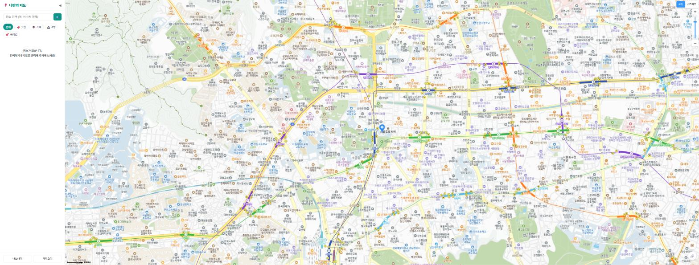
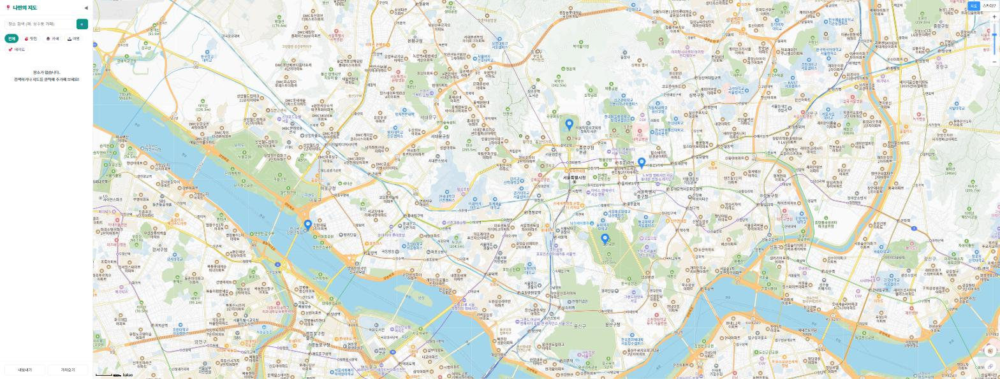
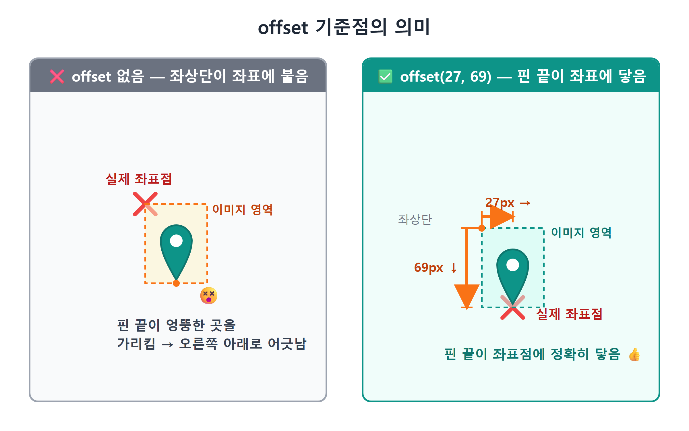
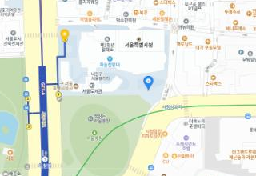
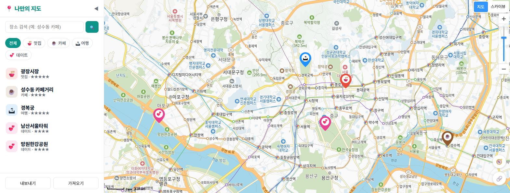
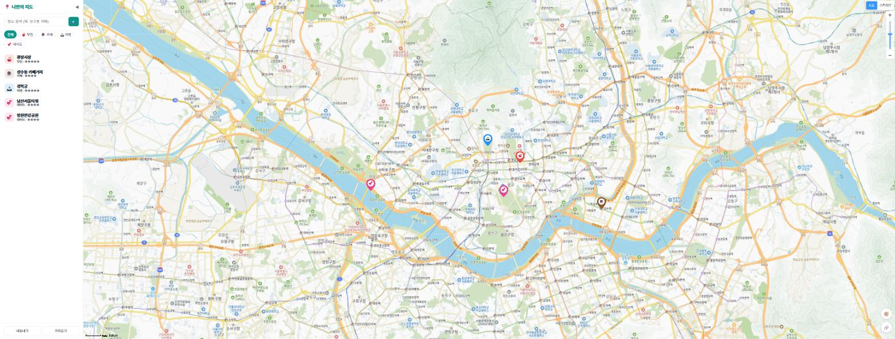

# 11장 마커 찍기

!!! note "이 장에서 배우는 것"
    - `kakao.maps.Marker`로 지도 위에 첫 마커를 찍습니다
    - 배열과 반복문으로 마커 여러 개를 한 번에 표시합니다
    - `MarkerImage`로 기본 파란 마커를 원하는 이미지로 바꿉니다
    - SVG와 data URI로 이미지 파일 없이 직접 만든 핀을 그립니다
    - 장소 배열을 받아 마커를 그려 주는 `renderPlaces` 함수를 만듭니다

---

9장에서 지도를 표시하였고, 10장에서는 지도를 움직이고 클릭하는 방법을 배웠습니다. 그런데 현재 지도에는 사용자가 저장한 장소가 아직 하나도 없습니다. 나만의 지도라고 부르려면 사용자가 저장한 장소가 지도 위에 표시되어야 할 것입니다.

지도 앱에서 특정 위치를 가리키는 핀을 마커(Marker)라고 부릅니다. 카카오맵에서 장소를 검색하면 나타나는 그 핀을 떠올리시면 됩니다. 이번 장에서는 마커 하나를 찍는 것부터 시작합니다. 이어서 여러 개의 마커를 반복문으로 찍고, 마지막에는 카테고리마다 색상과 이모지가 다른 핀을 직접 만들어 보겠습니다.

## 11.1 첫 마커 하나 찍기

가장 간단한 것부터 시작하도록 하겠습니다. 서울 시청 위에 마커 하나를 찍어 보겠습니다. 코드는 직접 입력하지 않고 Claude Code에게 맡기도록 하겠습니다.

!!! tip "이렇게 물어보세요"
    > 지도에 마커를 하나 찍고 싶어. 위도 37.5665, 경도 126.978인 서울 시청 위치에 카카오지도 기본 마커를 표시해줘. main.js에서 지도를 만든 다음 줄에 추가해줘.

Claude Code가 `src/main.js`에 몇 줄의 코드를 추가할 것입니다. 중요한 부분만 살펴보면 다음과 같습니다.

```js
// 마커가 놓일 위치
const position = new kakao.maps.LatLng(37.5665, 126.978);

// 마커를 만들고
const marker = new kakao.maps.Marker({ position });

// 지도 위에 올린다
marker.setMap(map);
```

세 줄뿐이지만 한 줄씩 자세히 살펴보겠습니다.

첫 줄에는 9장에서 배운 `LatLng`가 등장하는데, 위도와 경도를 묶어 지도 위의 한 점을 나타냅니다. 마커는 지도 위의 특정 위치에 표시되어야 하므로 표시할 위치부터 지정하여 줍니다.

그다음 줄에 이번 장에서 다룰 `kakao.maps.Marker`가 등장합니다. `new`를 호출하여 마커 객체를 생성하면서 설정 객체를 전달하는데, 표시할 위치를 알려 주는 `position`만 지정하여 주면 마커를 생성할 수 있습니다. 지도를 생성할 때 `new kakao.maps.Map(container, {...})`이라고 작성한 것과 같은 방식이므로 낯설지 않을 것입니다. 카카오지도 SDK의 객체는 대부분 이와 같이 생성합니다.

그 아래의 `setMap(map)`은 주목하여 살펴보아야 합니다. 마커를 생성하였다고 하여 곧바로 화면에 나타나는 것은 아닙니다. 방금 생성한 마커는 아직 어느 지도와도 연결되지 않은 상태입니다. `setMap(map)`을 호출하여 해당 지도 위에 표시하도록 알려 주어야 화면에 나타나게 됩니다. 따라서 생성하는 작업과 지도에 표시하는 작업이 이렇게 두 단계로 나뉘어 있습니다.

이 구조는 반대로도 활용할 수 있습니다. `marker.setMap(null)`을 호출하면 마커가 지도에서 사라지게 됩니다. 이는 마커를 삭제하는 것이 아니라 "잠깐 떼어 두기"에 가까운 동작입니다. 나중에 다시 `setMap(map)` 하면 동일한 마커가 다시 나타나게 됩니다. 이렇게 마커를 표시하거나 숨기는 기능은 14장에서 카테고리 필터를 제작할 때 매우 유용하게 사용할 것입니다. 현재는 "마커는 setMap으로 붙였다 뗐다 할 수 있다"만 기억하여 두도록 하겠습니다.

저장하고 브라우저에서 확인하여 보겠습니다. Vite 개발 서버가 실행 중이라면 저장하는 순간 화면이 자동으로 새로고침될 것입니다. 서울 시청 위에 파란색 몸통에 뾰족한 끝이 있는 카카오 기본 마커가 표시되면 성공입니다.

{ width="760" }
/// caption
그림 11.1 — 서울 시청 위에 표시한 첫 번째 마커
///

!!! tip "팁"
마커를 생성할 때 `position`과 함께 `map`을 전달하여 `new kakao.maps.Marker({ position, map })`이라고 작성하면 `setMap`을 호출하지 않고도 곧바로 지도에 마커가 표시됩니다. 한 줄의 코드가 줄어들지만 이 책에서는 `setMap`을 별도로 작성하는 방법을 권장합니다. 마커의 생성과 표시를 분리하여 두면 필터와 같이 마커를 표시하거나 숨기는 기능을 제작할 때 코드의 흐름을 보다 명확하게 파악할 수 있을 것입니다.

## 11.2 마커 여러 개: 배열과 반복문

마커 하나를 표시하여 보았습니다. 그런데 우리의 지도에 표시될 장소가 하나뿐일 리는 없습니다. 맛집, 카페, 여행지… 수십 개의 장소가 있을 것입니다. 마커 하나에 세 줄의 코드가 필요하였다면 서른 개면 아흔 줄의 코드가 필요한 것일까요? 코드를 그렇게 복사하여 붙여넣고 있다면 방법이 잘못된 것입니다. 프로그래밍의 오래된 격언을 떠올려 보시기 바랍니다. 동일한 코드를 두 번 작성하고 있다면 반복문이 필요한 시점입니다.

!!! tip "이렇게 물어보세요"
    > 마커를 여러 개 찍고 싶어. 서울의 유명한 장소 4곳(이름, 위도, 경도)을 배열로 만들고, 반복문으로 각각 마커를 찍어줘. 마커에 마우스를 올리면 장소 이름이 보이게 해줘.

Claude Code가 작성한 코드는 대략 다음과 같습니다.

```js
const spots = [
  { name: '경복궁',   lat: 37.5796, lng: 126.977 },
  { name: '남산타워', lat: 37.5512, lng: 126.9882 },
  { name: '광장시장', lat: 37.5701, lng: 126.9996 },
  { name: '한강공원', lat: 37.5285, lng: 126.9328 },
];

for (const spot of spots) {
  const marker = new kakao.maps.Marker({
    position: new kakao.maps.LatLng(spot.lat, spot.lng),
    title: spot.name,
  });
  marker.setMap(map);
}
```

이 코드에서는 데이터와 동작이 명확하게 구분되어 있습니다. 상단의 `spots`에 데이터를 위치시킵니다. 장소 하나가 `{ name, lat, lng }` 형식의 객체 하나에 해당하며, 그러한 객체를 배열 `[ ]` 안에 순서대로 저장합니다. 하단의 `for...of` 반복문이 실제 동작을 수행하는 부분입니다. 배열에서 장소 정보를 하나씩 꺼내어 `spot` 그 좌표값으로 마커를 생성하고 지도에 표시합니다. 장소가 4개이든 400개이든 하단의 코드는 한 줄도 수정할 필요가 없습니다. 배열에 내용을 추가하기만 하면 마커를 원하는 만큼 추가할 수 있습니다.

새롭게 등장한 옵션 `title`에도 주목하여 주시기 바랍니다. 마커에 마우스를 올리면 잠시 후 장소 이름이 작은 말풍선 형태의 브라우저 기본 툴팁으로 표시됩니다. HTML 태그의 `title` 속성과 동일한 역할을 수행합니다. 옵션 한 줄로 얻을 수 있는 편리한 기능이므로 기억하여 두시기 바랍니다. 보다 세련된 디자인의 말풍선은 13장에서 직접 제작하도록 하겠습니다.

{ width="760" }
/// caption
그림 11.2 — 반복문으로 표시한 마커 4개
///

여기서 잠시, 지금까지 진행한 작업의 의미를 짚어보도록 하겠습니다. 우리는 "데이터와 화면을 분리"하였습니다. 장소 정보는 배열에 저장하고, 마커를 그리는 방법은 반복문에 정의하였습니다. 이와 같이 데이터와 동작을 분리하는 방식은 이 책의 후반부에서 계속 활용할 것입니다. 12장에서는 이 배열을 적절한 장소 데이터 파일로 관리하고, 17장에서는 localStorage에 저장할 것입니다. 사용자가 장소를 추가하면 배열에 내용을 추가하고 다시 그리기만 하면 됩니다. 그리는 코드는 수정하지 않고 데이터만 교체하여 사용할 수 있습니다. 이러한 기본 구조를 이번 장에서 처음으로 구현하여 보았습니다.

!!! warning "주의"
마커가 표시되지 않는 경우 대부분 좌표를 잘못 입력한 것입니다. 위도(lat)와 경도(lng)를 서로 바꾸어 입력하면 마커가 화면 밖의 전혀 다른 위치에 표시됩니다. 대한민국의 경우 위도는 33~38 부근, 경도는 126~131 부근의 값을 가집니다. 지도는 정상적으로 표시되는데 마커가 보이지 않는다면 좌표의 두 숫자를 가장 먼저 확인하여 주시기 바랍니다. 지도를 크게 축소하여 레벨을 높이면 다른 위치에 표시된 마커를 찾을 수도 있습니다.

## 11.3 마커 이미지 바꾸기: MarkerImage

기본 마커도 충분히 활용 가치가 있지만 모든 마커가 동일한 모양이라는 점이 아쉬운 부분입니다. 맛집도 파란색 핀, 카페도 파란색 핀, 데이트 명소도 파란색 핀으로 표시되기 때문에 지도만 보고는 어떤 장소인지 구분하기 어렵습니다. 우리 앱의 핵심 기능이 카테고리별로 장소를 관리하는 것임을 고려할 때 이러한 점은 개선할 필요가 있습니다.

마커의 모양은 카카오지도 SDK의 `MarkerImage`를 사용하여 완전히 변경할 수 있습니다. 먼저 인터넷에 있는 이미지를 활용하여 시험하여 보겠습니다.

!!! tip "이렇게 물어보세요"
    > 마커의 기본 이미지를 다른 이미지로 바꾸는 방법을 보여줘. 카카오 공식 예제에 나오는 별 모양 마커 이미지를 써서 마커 하나만 시험 삼아 바꿔줘.

```js
const imageSrc =
  'https://t1.daumcdn.net/localimg/localimages/07/mapapidoc/marker_red.png';
const imageSize = new kakao.maps.Size(64, 69);
const imageOption = { offset: new kakao.maps.Point(27, 69) };

const markerImage = new kakao.maps.MarkerImage(imageSrc, imageSize, imageOption);

const marker = new kakao.maps.Marker({
  position: new kakao.maps.LatLng(37.5665, 126.978),
  image: markerImage,
});
marker.setMap(map);
```

`MarkerImage`는 세 가지 정보를 매개변수로 전달받습니다.

첫 번째는 `imageSrc`라는 이미지 주소 정보로, 웹에서 접근 가능한 이미지 URL이라면 어떤 이미지라도 사용할 수 있습니다.

두 번째는 `Size`로 지정하는 크기 정보입니다. 이미지를 지도 위에 몇 픽셀 크기로 표시할 것인지 결정하며, 여기서는 가로 64픽셀, 세로 69픽셀로 표시하겠다는 의미입니다.

마지막으로 `offset`이 매우 중요합니다. 우리말로 기준점이라고 할 수 있습니다. 마커 이미지는 사각형 형태이므로, 그 사각형의 어느 지점을 실제 좌표 위치에 맞출 것인지 결정하여야 합니다. 핀 모양 이미지의 경우 뾰족한 끝 부분이 좌표 위치에 일치하여야 합니다. 이미지의 왼쪽 위 모서리를 좌표 위치에 맞추면 핀의 실제 위치보다 오른쪽 아래 방향으로 마커가 표시되게 됩니다. `offset: new kakao.maps.Point(27, 69)`는 이미지의 왼쪽 위 모서리에서 오른쪽으로 27px, 아래로 69px 이동한 지점, 즉 핀의 뾰족한 끝 부분을 좌표 위치에 맞추라는 의미입니다.

{ width="760" }
/// caption
그림 11.3 — offset 기준점의 의미
///

offset을 잘못 잡으면 지도를 확대하거나 축소할 때마다 마커가 미끄러지듯 어긋나 보입니다. 좌표에 닿은 지점이 핀 끝이 아니기 때문에, 지도가 늘어나고 줄어들 때마다 핀 끝이 가리키는 위치가 계속 달라집니다. 마커가 "떠다니는" 느낌이 든다면 offset부터 확인하세요.

브라우저에서 확인하여 보면 파란색 기본 마커 대신 별 모양이 그려진 빨간색 마커가 표시되어 있을 것입니다. 마커의 이미지를 성공적으로 변경하였습니다.

{ width="520" }
/// caption
그림 11.4 — MarkerImage로 이미지를 변경한 마커
///

## 11.4 이미지 파일 없이 핀 그리기: SVG와 data URI

외부 이미지는 시험 목적으로만 사용하는 것이 좋습니다. 우리 앱에는 맛집, 카페, 여행, 데이트 총 4가지 카테고리가 있으며, 카테고리마다 색상이 다른 핀을 사용하고자 합니다. 그렇다면 핀 이미지 4장을 그림판으로 직접 제작하여 프로젝트에 포함하여야 할까요? 나중에 카테고리가 추가되면 다시 이미지를 제작하여야 할까요?

더 나은 방법이 있습니다. 코드로 이미지를 생성하는 방법이 있으며, 그러기 위해서는 두 가지 개념을 알아야 합니다.

첫 번째는 SVG[^1]입니다. 이는 이미지를 픽셀 단위의 정보가 아닌 도형을 그리기 위한 명령어 형식으로 작성하는 이미지 형식입니다. "여기 핀 모양 경로를 빨간색으로 채우고, 그 위에 흰 원을 그리고, 가운데에 글자를 써라"라고 텍스트 형식으로 작성하면 그 내용이 그대로 이미지가 되는 것입니다. 텍스트 형식이므로 색상이나 글자를 변경하기가 문자열을 수정하는 것만큼 용이하며, 아무리 확대하여도 계단 현상이 발생하지 않고 선명하게 표시됩니다.

두 번째는 data URI[^2]입니다. 앞서 살펴본 `MarkerImage`는 이미지 주소를 전달받습니다. 그런데 이 주소가 반드시 `https://...`처럼 외부 서버의 경로를 가리켜야 하는 것은 아닙니다. `data:image/svg+xml;charset=utf-8,<svg...>` 형식으로 이미지 자체의 내용을 주소 자리에 직접 작성하여 전달할 수도 있습니다. 이렇게 하면 별도의 이미지 파일을 관리할 필요가 없을 뿐만 아니라 서버에 이미지 요청을 보내는 과정도 생략할 수 있습니다.

이 두 가지 개념을 결합하면 자바스크립트 문자열로 핀 이미지를 직접 생성하여 그대로 마커의 이미지로 사용할 수 있습니다. 이제 직접 구현하여 보겠습니다.

!!! tip "이렇게 물어보세요"
    > 이미지 파일 없이 SVG로 마커 핀을 그리고 싶어. 색과 이모지를 인자로 받아서, 그 색의 핀 안에 흰 원과 이모지가 들어간 MarkerImage를 돌려주는 함수 markerImageFor를 만들어줘. SVG는 data URI로 변환해서 써줘. 핀 끝이 좌표에 정확히 닿게 offset도 맞춰줘.

Claude Code가 작성하여 준 함수로, 우리 앱 `src/mapView.js`에 포함될 코드와 동일한 구조를 가지고 있습니다.

```js
function markerImageFor(emoji, color) {
  const svg = `
    <svg xmlns="http://www.w3.org/2000/svg" width="36" height="46" viewBox="0 0 36 46">
      <path d="M18 0C8 0 0 8 0 18c0 12 18 28 18 28s18-16 18-28C36 8 28 0 18 0z" fill="${color}"/>
      <circle cx="18" cy="17" r="12" fill="white"/>
      <text x="18" y="22" font-size="14" text-anchor="middle">${emoji}</text>
    </svg>`;
  const url = 'data:image/svg+xml;charset=utf-8,' + encodeURIComponent(svg);
  return new kakao.maps.MarkerImage(url, new kakao.maps.Size(36, 46), {
    offset: new kakao.maps.Point(18, 46),
  });
}
```

위에서부터 차례로 살펴보도록 하겠습니다.

SVG 문자열. 백틱(`` ` ``)으로 감싼 템플릿 문자열 안에 SVG가 들어 있습니다. 가로 36, 세로 46픽셀 영역에 도형 세 개를 겹쳐 그립니다. `<path>`가 핀 몸통입니다. `d="M18 0C8 0..."`라는 문자열은 펜을 (18,0)으로 옮기고, 곡선을 그리며 내려와 (18,46)의 뾰족한 끝을 만들고 다시 올라가라는 그리기 지시입니다. 외울 필요는 없습니다. 이런 좌표 문자열은 AI가 대신 만들어 줍니다. 그다음 `<circle>`이 핀 안의 흰 원, `<text>`가 그 위에 얹히는 이모지입니다. 눈여겨볼 곳은 `${color}`와 `${emoji}` 두 군데입니다. 함수가 받은 인자를 문자열 안에 끼워 넣는 자리이고, 여기서 핀의 색과 이모지가 정해집니다.

encodeURIComponent. SVG 문자열을 data URI 형식으로 변환하기 전에 문자열을 처리하는 함수입니다. URL에는 `<`, `>`, `#`, 그리고 이모지와 같은 특수 문자를 그대로 사용할 수 없습니다. 따라서 이러한 문자를 URL에서 문제 없이 인식할 수 있는 `%3C`와 같은 형식으로 변환하여 주는 것입니다. 이 함수를 적용하지 않으면 일부 브라우저에서는 정상적으로 작동하지만 다른 브라우저에서는 마커가 보이지 않는 등의 예기치 않은 문제가 발생할 수 있습니다. 이러한 유형의 문제는 원인을 파악하기가 매우 어렵습니다.

MarkerImage 생성. 마지막 `return` 행은 11.3절에서 배운 내용과 동일한 방식입니다. 앞서 생성한 data URI를 이미지 주소로 전달하고, 크기는 가로 36픽셀, 세로 46픽셀로 지정하였으며, offset 값은 `Point(18, 46)`로 설정하였습니다. 가로 크기의 정확히 절반인 18에 세로 크기의 맨 끝인 46을 지정하였으므로 핀의 뾰족한 끝 부분이 정확한 좌표 위치에 일치하게 됩니다. 이제 이 함수를 한 줄로 호출하기만 하면 원하는 색상과 이모지가 적용된 핀 이미지를 얻을 수 있습니다.

```js
const marker = new kakao.maps.Marker({
  position: new kakao.maps.LatLng(37.5665, 126.978),
  image: markerImageFor('🍜', '#e74c3c'),
});
marker.setMap(map);
```

몇 가지 색상 값으로 시험하여 보시기 바랍니다. 빨간색을 나타내는 `#e74c3c`는 맛집에, 갈색을 나타내는 `#8e5a2d`는 카페에, 파란색을 나타내는 `#1e90ff`는 여행지에, 분홍색을 나타내는 `#e84393`은 데이트 장소에 사용할 색상입니다. 이 색상 값들은 12장에서 정의할 카테고리 체계에서 그대로 사용할 것입니다.

{ width="760" }
/// caption
그림 11.5 — markerImageFor 함수로 제작한 카테고리별 커스텀 핀 4종
///

!!! tip "팁"
SVG 이미지의 형태를 직접 확인하여 보고 싶다면, 코드에서 `<svg>...</svg>` 부분을 복사하여 새 텍스트 파일에 붙여넣고 파일을 `pin.svg` 형식으로 저장한 뒤 브라우저에서 열어보시기 바랍니다. 색상 값이나 숫자를 변경하여 저장하면 이미지의 모양이 어떻게 변화하는지 확인할 수 있으며, 이 과정을 통해 SVG와 보다 친숙해질 수 있을 것입니다. Claude Code에게 "핀을 더 통통하게 바꿔줘"라고 요청하여 보는 것도 좋은 학습 방법입니다.

## 11.5 장소 배열을 마커로: renderPlaces 함수

이제 이 장에서 배운 내용들을 하나로 통합하여 보겠습니다. 11.2절에서 배운 "배열 → 반복문 → 마커"와 11.4절에서 배운 `markerImageFor`를 결합하여, 장소 정보 배열을 전달받아 지도에 마커를 표시하여 주는 하나의 함수를 제작하여 보겠습니다.

!!! tip "이렇게 물어보세요"
    > 지도 코드를 정리하고 싶어. src/mapView.js 파일에서, 장소 객체 배열을 받아 마커로 그려 주는 renderPlaces 함수를 만들어줘. 다시 호출하면 기존 마커를 모두 지우고 새로 그려야 해. 마커 이미지는 아까 만든 markerImageFor를 써줘.

```js
let markers = [];

export function renderPlaces(places) {
  // 1) 기존 마커를 모두 지도에서 내린다
  for (const marker of markers) marker.setMap(null);
  markers = [];

  // 2) 받은 장소마다 마커를 만들어 올린다
  for (const place of places) {
    const marker = new kakao.maps.Marker({
      position: new kakao.maps.LatLng(place.lat, place.lng),
      image: markerImageFor(place.emoji, place.color),
      title: place.name,
    });
    marker.setMap(map);
    markers.push(marker);
  }
}
```

이 함수는 기존 마커를 모두 삭제한 후 다시 그리는 방식으로 동작합니다. 함수의 시작 부분에서 기존에 표시된 마커를 모두 `setMap(null)`로 숨기고 관련 배열을 비운 다음, 전달받은 장소 정보를 바탕으로 처음부터 다시 마커를 생성하여 표시합니다. "기존 마커 중에 뭐가 바뀌었는지 찾아서 그것만 고치면 더 효율적이지 않나?"라는 의문이 생길 수도 있습니다. 타당한 지적이지만, 변경된 부분만 찾아서 수정하는 작업이 생각만큼 간단하지 않을 뿐만 아니라 그러한 과정에서 오류가 발생할 가능성도 높습니다. 우리가 다루는 규모의 장소 정보라면 수십 개에서 수백 개의 마커를 모두 지우고 다시 그리더라도 화면상에서 지연됨을 느끼기 어려울 것입니다. 따라서 보다 간단하고 오류가 발생할 가능성이 적은 방식을 선택하고자 합니다. 화면의 내용은 언제나 데이터를 바탕으로 다시 생성된 결과라는 기본 원칙을 14장의 필터 기능 구현에서도 그대로 적용할 것입니다. 필터 조건이 변경되면 조건에 맞게 걸러낸 배열을 전달하여 `renderPlaces`를 다시 호출하기만 하면 됩니다.

이와 같은 방식을 사용하려면 기존 마커를 제거할 수 있어야 하며, 그 준비를 위해 모듈의 맨 위쪽에 `let markers = []`를 선언하여 두었습니다. 마지막 줄의 `markers.push(marker)`처럼 생성한 마커 객체를 별도의 배열에 저장하여 두지 않으면, 나중에 해당 마커를 제거하고자 하여도 마커에 접근할 방법이 없기 때문입니다. 지도에 표시만 하고 마커에 대한 참조 정보를 저장하지 않으면 이후 코드에서 해당 마커를 제어할 수 없게 됩니다.

이제 이 함수를 호출하는 부분(main.js)의 코드는 매우 간결해집니다.

```js
import { renderPlaces } from './mapView.js';

renderPlaces([
  { name: '광장시장 육회골목', lat: 37.5701, lng: 126.9996, emoji: '🍜', color: '#e74c3c' },
  { name: '연남동 소금빵집',   lat: 37.5606, lng: 126.9256, emoji: '☕', color: '#8e5a2d' },
  { name: '남산타워 전망대',   lat: 37.5512, lng: 126.9882, emoji: '💕', color: '#e84393' },
]);
```

{ width="760" }
/// caption
그림 11.6 — renderPlaces 함수가 생성한 나만의 장소 지도
///

완성된 앱의 `mapView.js`를 열어보면 `renderPlaces`의 내용이 여기서 살펴본 내용보다 조금 더 길 것입니다. 장소마다 이모지와 색상을 개별적으로 지정하는 대신 `place.category` 하나만 지정하면 해당 카테고리에 맞는 색상과 이모지가 자동으로 적용되기 때문입니다. 이 부분에 대한 구체적인 내용은 12장에서 다루도록 하겠습니다. 마커를 클릭하면 말풍선이 표시되는 기능은 13장에서, 마커가 일정 이상 밀집되면 자동으로 묶여 표시되는 기능은 22장에서 구현합니다. 이 책에서 구현할 앱의 기본 구조는 이번 장에서 제작한 형태와 동일하며, 앞으로 이 구조에 새로운 기능을 하나씩 추가하여 가겠습니다.

!!! warning "주의"
`renderPlaces`를 여러 번 호출하였을 때 마커가 계속해서 겹쳐 표시된다면, 함수 시작 부분에 위치한 "기존 마커 지우기"가 누락되었거나 `markers` 배열을 함수 내부에 선언하였기 때문일 가능성이 높습니다. `markers`는 반드시 함수 외부에 선언하여야 함수 호출 간에 값이 유지되어 이전에 생성한 마커 정보를 기억할 수 있습니다. Claude Code가 생성한 코드가 예상과 다르게 동작한다면, 관찰한 증상을 그대로 설명하여 "renderPlaces를 두 번 부르면 마커가 겹치는 것 같아. 원인 찾아서 고쳐줘"라고 요청하여 보시기 바랍니다.

## 11.6 마무리

이제 지도 위에 사용자만의 정보를 표시하기 시작하였습니다. 마커 하나를 표시하는 것에서부터 시작하여, 배열과 반복문을 활용한 다중 마커 표시, 이미지를 적용한 마커 변경, SVG를 활용한 동적 마커 이미지 생성, 그리고 데이터를 바탕으로 화면을 구성하는 `renderPlaces` 함수까지 제작하였습니다. 특히 "데이터 따로, 그리기 따로"와 "지우고 다시 그린다"라는 두 가지 기본 원칙은 이 책에서 앱을 완성할 때까지 계속해서 활용할 내용이므로 반드시 기억하여 두시기 바랍니다.

!!! abstract "이 장의 핵심"
    - 마커는 `new kakao.maps.Marker({ position })`로 만들고 `setMap(map)`으로 지도에 올릴 수 있습니다. `setMap(null)`을 주면 내려옵니다.
    - 마커 여러 개는 데이터인 장소 배열과 그리기를 맡는 반복문으로 나눠 처리합니다. 데이터가 늘어도 그리는 코드는 손대지 않아도 됩니다.
    - `MarkerImage(주소, Size, { offset })`로 마커의 생김새를 바꿉니다. `offset`은 이미지의 어느 지점을 좌표에 맞출지 정하는 기준점으로, 핀이라면 뾰족한 끝이어야 합니다.
    - SVG(텍스트로 그리는 그림) + data URI(내용물을 주소 자리에 넣는 문법) + `encodeURIComponent`(URL용 포장)를 조합하면 이미지 파일 없이 커스텀 핀을 만들 수 있습니다.
    - `renderPlaces`는 기존 마커를 전부 지우고 배열을 처음부터 다시 그립니다. 버그를 줄이려면 단순하게 짜는 쪽이 낫습니다.

!!! question "잠깐 생각해 봅시다"
Q1. `markerImageFor`의 offset 값이 `Point(18, 46)`이 아니라 `Point(0, 0)`이라면 지도를 확대하거나 축소할 때 마커의 모습이 어떻게 보일 것인지, 그 이유와 함께 작성하여 보시기 바랍니다.

____________________________________________

____________________________________________

Q2. `renderPlaces`가 변경된 마커만 선택적으로 수정하는 대신, 전체 마커를 모두 지우고 다시 그리는 방식을 선택한 이유는 무엇입니까? 또한 어떤 상황이 발생하면 이 선택을 다시 검토하여야 할지 함께 작성하여 보시기 바랍니다.

____________________________________________

____________________________________________ ch11.txt

!!! example "확인 문제"
    1. 여러분이 좋아하는 장소 3곳의 좌표를 찾아 `spots` 배열에 넣고 마커를 찍어 보세요. 좌표는 10장에서 만든, 지도를 클릭하면 콘솔에 좌표가 찍히는 기능으로 찾을 수 있습니다.
    2. Claude Code에게 시켜 `markerImageFor`의 핀 크기를 36×46에서 48×60으로 키워 보세요. offset의 두 숫자는 각각 얼마로 바뀌어야 할까요? 먼저 예상한 뒤 결과와 비교해 보세요.
    3. 새 카테고리 "🏃 운동"을 상상하고 어울리는 색을 골라 `markerImageFor('🏃', '#??????')`로 핀을 만들어 지도에 찍어 보세요.
    4. `renderPlaces`를 빈 배열 `[]`로 호출하면 어떻게 될지 예상해 보고, 실제로 실행해 확인해 보세요.

!!! info "더 찾아보기"
    - `kakao.maps.MarkerImage spriteOrigin` — 여러 마커 그림을 한 장의 이미지(스프라이트)에 모아 두고 잘라 쓰는 기법
    - `SVG path 문법` — `d` 속성의 M·C·L 명령으로 곡선과 직선을 그리는 규칙
    - `Base64 data URI` — 텍스트가 아닌 이미지(PNG 등)를 data URI로 만들 때 쓰는 인코딩
    - `marker.setDraggable` — 사용자가 마커를 드래그해 옮길 수 있게 하는 옵션

> 다음 장으로. 이번 장 끝에서 장소 하나가 이모지와 색까지 직접 들고 다니는 모습이 조금 무거워 보였을 겁니다. 12장에서는 장소 데이터를 제대로 설계합니다. 장소에는 `category` 이름표 하나만 붙이고, 카테고리의 색·이모지·라벨은 `categories.js` 한 곳에서 관리하는 구조로 바꿉니다. id, 별점, 메모까지 갖춘 장소 스키마를 정의하고 나면, 우리 지도는 진짜 "데이터로 움직이는 앱"이 됩니다.

[^1]: SVG(Scalable Vector Graphics) — 도형·선·글자를 XML 텍스트로 기술하는 벡터 이미지 표준. 확대해도 깨지지 않고, 코드로 내용을 바꿀 수 있어 아이콘·차트에 널리 쓰입니다.
[^2]: data URI — `data:[미디어타입][;인코딩],내용물` 형식으로, 외부 파일 대신 데이터 자체를 URL 자리에 담는 표기법(RFC 2397).
