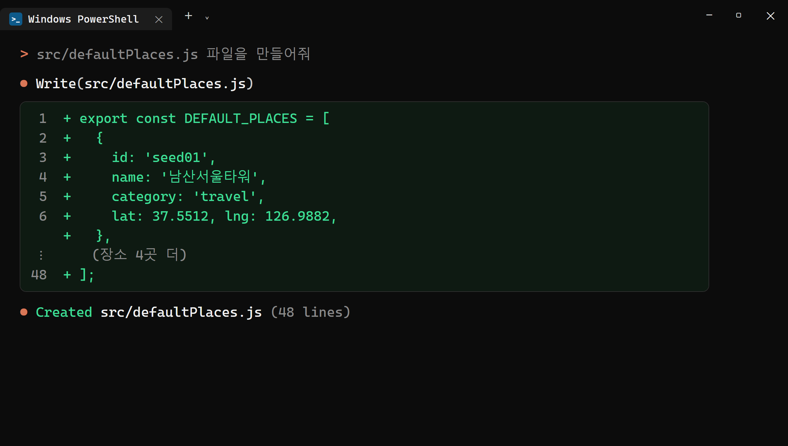
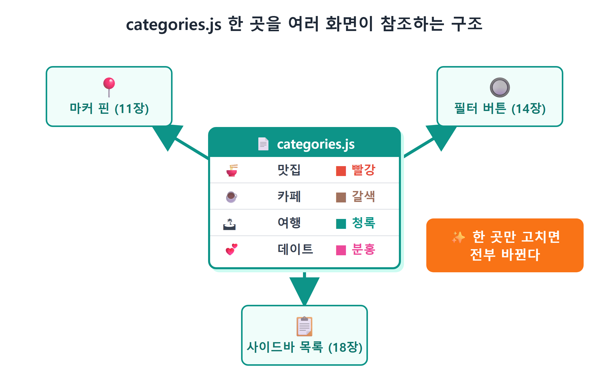
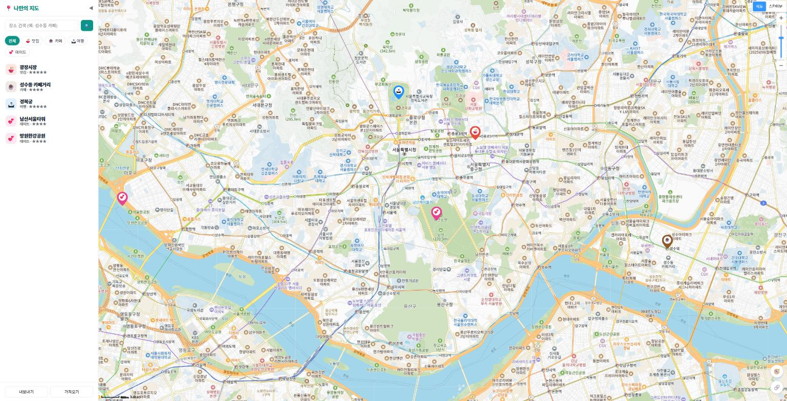
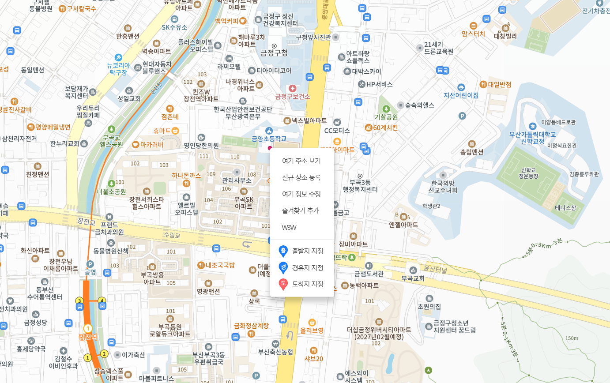
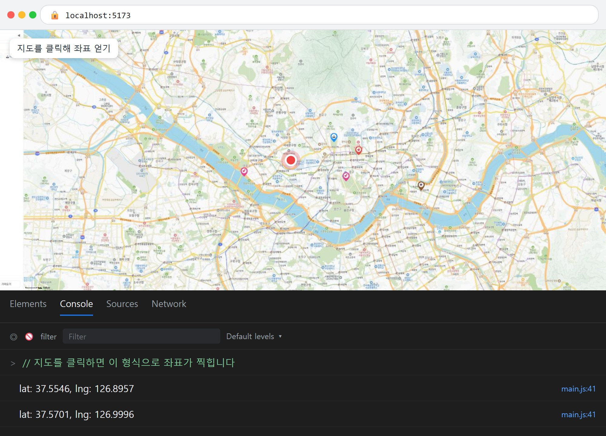

# 12장 장소 데이터 설계

!!! note "이 장에서 배우는 것"
    - "데이터와 화면을 분리한다"는 프로그래밍의 대원칙을 이해합니다
    - 장소 하나를 표현하는 객체 스키마를 id·name·category·lat·lng·rating·memo 일곱 칸으로 설계합니다
    - 예시 장소 데이터 파일 `defaultPlaces.js`와 카테고리 정의 파일 `categories.js`를 만듭니다
    - 데이터 배열을 받아 마커를 찍어 주는 렌더링 함수 `renderPlaces`를 만듭니다
    - 지도에 올릴 장소의 위도·경도 좌표를 직접 구하는 두 가지 방법을 배웁니다

---

11장에서 지도 위에 마커를 표시하는 방법을 배웠습니다. 카테고리 색상을 반영한 SVG 핀까지 제작했으므로, 이제 화면에 보여지는 모습은 갖춰진 상태입니다. 다만 현재 코드에는 마커의 좌표와 이름이 직접 기입되어 있습니다. 장소를 새로 하나 추가하려면 코드를 열어 마커 생성 코드를 복사해 붙여넣어야 합니다.

장소가 세 개일 때는 이런 방식으로도 큰 문제가 없습니다. 하지만 우리가 제작하는 앱은 맛집, 카페, 여행지, 데이트 코스를 계속해서 추가하는 지도 서비스입니다. 장소가 서른 개, 백 개로 늘어나면 이 방식으로는 관리하기가 어려워집니다. 별점을 저장하거나 카테고리별로 필터링할 때도 동일한 문제가 발생할 수 있습니다.

이번 장에서는 화면에 보이는 마커와 그 기반이 되는 장소 데이터를 분리하여 앱의 전체 구조를 정립하겠습니다. 새로 작성해야 하는 코드가 많지는 않습니다. 다만 이 책의 후반부 내용은 모두 이번 장에서 정의한 구조를 기반으로 진행됩니다. 14장의 필터 기능, 17장의 저장 기능, 18장의 목록 기능 모두 이번 장에서 제작하는 데이터 구조를 활용하게 됩니다.

## 12.1 데이터와 화면 분리

먼저 기본 개념부터 정리하겠습니다. 데이터와 화면을 분리한다는 것은 어떤 의미일까요?

현재 작성한 코드에서는 '광장시장'이라는 장소에 대한 정보와, 해당 장소를 지도에 핀으로 표시하는 동작이 한 곳에 혼합되어 있습니다. 이 두 가지는 다음과 같이 분리할 수 있습니다.

- 데이터. "광장시장, 맛집, 위도 37.5701, 경도 126.9996, 별 5개" 같은 정보 목록입니다. 지도나 마커에 관한 내용은 담지 않습니다.
- 화면 그리는 코드. 장소 목록을 받아 장소 하나당 마커 하나를 찍는 일만 합니다. 목록에 어떤 장소가 들어 있는지는 알 필요가 없습니다.

{ width="760" }
/// caption
그림 12.1 — 데이터와 화면의 분리
///

이렇게 분리하면 어떤 점이 달라질까요? 우선 장소 추가가 매우 간편해집니다. 코드를 수정하지 않고 데이터 목록에 한 줄만 추가하면 마커가 자동으로 하나 추가됩니다. 또한 기능을 확장하기도 수월해집니다. 동일한 데이터 목록을 사이드바 목록, 검색 기능, 저장 기능에서 그대로 활용할 수 있으므로, 마커용 데이터와 목록용 데이터를 별도로 관리할 필요가 없습니다. 문제가 발생했을 때 확인해야 할 부분도 줄어듭니다. 예를 들어 데이터에 오타가 있다면 데이터 파일에서 확인하고, 마커가 비정상적으로 표시된다면 마커를 그리는 함수에서 원인을 찾으면 됩니다.

이 원칙은 카카오지도 외의 다른 분야에서도 동일하게 적용됩니다. 엑셀과 차트, 데이터베이스와 웹페이지, 유튜브 서버와 유튜브 앱 등이 모두 이런 구조를 따르고 있습니다. 이 구조에 익숙해지면 향후 어떤 프로그래밍 프레임워크를 학습하더라도 훨씬 수월하게 이해할 수 있을 것입니다.

!!! tip "팁"
이런 구조를 '단방향 흐름'이라고 부르기도 합니다. 즉, 데이터가 변경되면 → 화면을 다시 그리는 방식으로 진행됩니다. 항상 이 한 가지 방향으로만 흐르도록 설계하는 것입니다. 만약 화면의 여러 곳에서 마커를 직접 생성하고 삭제하도록 작성하면, "데이터에는 5개인데 화면에는 6개"과 같이 데이터 상태와 화면 표시가 일치하지 않는 오류가 발생할 수 있습니다. 리액트(React)와 같은 프레임워크에서도 동일한 개념의 흐름 방식을 사용하고 있습니다.

## 12.2 장소 스키마 설계: 장소 하나를 어떻게 표현할까

데이터와 화면을 분리하기로 했으니, 이제 데이터의 형식과 구조를 정의해야 합니다. "장소 하나"를 자바스크립트 객체로 표현한다면 어떤 항목들이 필요할까요? 이처럼 데이터의 구조를 미리 약속하고 정의하는 것을 스키마(schema)[^1]라고 부릅니다.

완성될 앱의 모습을 상상하며 필요한 항목들을 역으로 추려보겠습니다. 지도에 마커를 표시하려면 좌표 정보가 필수적입니다. 말풍선과 목록에 표시할 이름, 필터링에 사용할 카테고리, 상세 정보 영역에 표시할 별점과 메모 내용도 필요합니다. 그리고 화면에는 보이지 않지만 매우 중요한 식별자 id 항목도 추가해야 합니다. 이처럼 필요한 항목들을 표 12.1에 정리했습니다.

> 표 12.1 장소 객체 스키마

| 칸(속성) | 타입 | 예시 | 하는 일 |
|---|---|---|---|
| `id` | 문자열 | `'seed01'` | 장소를 유일하게 식별하는 번호표 |
| `name` | 문자열 | `'광장시장'` | 화면에 보여줄 이름 |
| `category` | 문자열 | `'food'` | 분류. food/cafe/travel/date 중 하나 |
| `lat` | 숫자 | `37.5701` | 위도 (남북 위치) |
| `lng` | 숫자 | `126.9996` | 경도 (동서 위치) |
| `rating` | 숫자 | `5` | 별점 1~5 |
| `memo` | 문자열 | `'빈대떡과 마약김밥...'` | 자유 메모 |

일부 항목을 왜 그렇게 정의했는지 궁금할 수 있으니, 하나씩 자세히 살펴보겠습니다.

우선 id가 왜 필요할까요? 장소 이름만으로는 각 장소를 고유하게 구분하기 어렵습니다. 예를 들어 "스타벅스"와 같은 이름의 장소가 두 곳 이상 존재하게 되는 순간, 이름은 더 이상 고유한 식별 정보가 되지 못합니다. 향후 "이 장소를 삭제해줘", "이 장소의 별점을 바꿔줘"와 같이 특정 장소를 조작하려고 할 때, 프로그램은 정확히 어느 장소를 가리키는지 구분할 수 있는 고유 번호를 필요로 합니다. 이름이 같더라도 id가 서로 다르면 별개의 장소로 인식할 수 있습니다. 참고로 16장에서는 사용자가 직접 장소를 추가할 때 id를 자동으로 생성하는 방법에 대해 알아보겠습니다.

그런데 카테고리 정보를 저장하는 category 항목의 값을 왜 `'맛집'`과 같이 한글 이름 대신 `'food'`과 같이 영문 식별자로 사용하는 것일까요? 이는 화면에 표시할 한글 이름과 프로그램 내부에서 사용할 식별자를 분리하기 위함입니다. 내부 식별자를 영문 소문자로 통일하면 다음과 같은 장점이 있습니다. 추후에 화면에 보여지는 카테고리 이름을 "맛집"에서 "먹거리"으로 변경하고 싶을 때, 데이터 파일의 내용은 전혀 수정하지 않고 화면에 표시되는 이름만 변경하면 되기 때문입니다. 화면 표시용 이름을 별도로 관리하는 방법에 대해서는 뒤에 나오는 12.4절에서 자세히 알아보겠습니다.

위도와 경도 정보를 저장하는 lat, lng 값은 왜 따옴표로 묶지 않고 숫자 형식으로 저장할까요? 좌표 정보는 추후 계산에 활용하기 때문입니다. `kakao.maps.LatLng` 기능은 숫자 형식의 값을 전달받아야 정상적으로 작동하며, 향후 두 지점 간의 거리를 계산할 때에도 문자열 형식으로 저장된 `'37.5701'`는 사용하기 매우 불편합니다. 따라서 데이터를 설계할 때는 계산에 사용할 값은 숫자 타입으로 저장하는 것이 효율적입니다.

!!! warning "주의"
위도(lat)와 경도(lng)의 순서는 자주 혼동하기 쉬우니 주의하시기 바랍니다. 우리나라 지역의 경우 위도는 대체로 33~38도 사이, 경도는 126~129도 사이의 값을 가집니다. 만약 마커가 지도에 정상적으로 표시되지 않고 바다 위에 표시된다면, 위도와 경도의 순서를 바꿔서 입력했을 가능성이 높습니다. '서울 지역은 위도 약 37도, 경도 약 127도 부근'이라는 점을 기억해 두시면 좋습니다.

## 12.3 defaultPlaces.js: 예시 장소 다섯 곳

데이터 구조 즉, 스키마의 정의가 완료되었으니 이제 실제 데이터 파일을 제작해 보겠습니다. 앱을 처음 실행했을 때 텅 빈 지도보다는 예시 장소 몇 군데가 미리 표시되어 있는 것이 사용 방법을 파악하기에도 훨씬 도움이 될 것입니다. 이제 Claude Code에게 데이터 생성을 요청해 보겠습니다.

!!! tip "이렇게 물어보세요"
    > src/defaultPlaces.js 파일을 만들어줘. 처음 실행할 때 보여줄 예시 장소 5개를 배열로 export 해줘. 각 장소는 id, name, category, lat, lng, rating, memo 속성을 가진 객체야. category는 food/cafe/travel/date 중 하나로 하고, 서울의 유명한 장소들로 채워줘. 좌표는 실제 위치와 맞게.

다음은 Claude Code가 제작해 준 `src/defaultPlaces.js`의 내용입니다.

```js
// 처음 실행할 때 보여줄 예시 장소들 (서울 유명 스팟)
export const DEFAULT_PLACES = [
  {
    id: 'seed01',
    name: '광장시장',
    category: 'food',
    lat: 37.5701,
    lng: 126.9996,
    rating: 5,
    memo: '빈대떡과 마약김밥. 주말엔 사람이 아주 많다.',
  },
  {
    id: 'seed02',
    name: '성수동 카페거리',
    category: 'cafe',
    lat: 37.5446,
    lng: 127.0562,
    rating: 4,
    memo: '공장 개조 카페 투어. 평일 오후 추천.',
  },
  {
    id: 'seed03',
    name: '경복궁',
    category: 'travel',
    lat: 37.5796,
    lng: 126.977,
    rating: 5,
    memo: '한복 입으면 무료 입장. 수문장 교대식 10시/14시.',
  },
  {
    id: 'seed04',
    name: '남산서울타워',
    category: 'date',
    lat: 37.5512,
    lng: 126.9882,
    rating: 4,
    memo: '야경 명소. 케이블카 타고 올라가기.',
  },
  {
    id: 'seed05',
    name: '망원한강공원',
    category: 'date',
    lat: 37.5546,
    lng: 126.8957,
    rating: 4,
    memo: '라면 끓여 먹기 좋은 곳. 노을이 예쁘다.',
  },
];
```

함께 내용을 살펴보겠습니다. 이 파일은 여러 개의 객체를 요소로 가지는 배열을 `DEFAULT_PLACES`라는 이름으로 내보내는 역할만 수행할 뿐입니다. 여기서 사용된 `export const` 문법은 8장에서 이미 학습한 모듈 관련 문법이므로, 새롭게 익힐 내용은 아닙니다. 다른 파일에서 이 데이터를 사용하고 싶다면 `import { DEFAULT_PLACES } from './defaultPlaces.js'`와 같이 한 줄만 작성하면 해당 장소 목록을 불러와 사용할 수 있습니다.

배열에 포함된 각 객체들은 앞에서 정의한 표 12.1의 스키마를 정확하게 따르도록 작성했습니다. 각 장소에 부여한 고유 식별자 id는 `seed01`부터 `seed05`까지 순서대로 할당했습니다. 참고로 "seed"는 '씨앗'이라는 의미로, 프로그램에 미리 심어 두는 초기 예시 데이터를 개발자들 사이에서 흔히 시드 데이터라고 부릅니다. 추후 사용자가 직접 추가하는 장소에는 별도의 방식으로 id를 부여할 예정이므로, 미리 준비한 예시 데이터 "seed로 시작하면 예시 데이터구나"와 구분하기도 용이할 것입니다.

{ width="760" }
/// caption
그림 12.2 — Claude Code가 defaultPlaces.js 파일을 생성한 모습
///

여기서 주목해서 보아야 할 중요한 점이 있습니다. 이 데이터 파일에는 지도를 조작하는 코드가 단 한 줄도 포함되어 있지 않습니다. 즉, `kakao`이라는 단어는 물론이고 `Marker`와 같은 지도 관련 용어도 전혀 등장하지 않습니다. 오직 순수한 장소 정보만 담겨 있으므로, 극단적으로 이야기하자면 추후 카카오지도 대신 네이버지도로 변경하더라도 이 데이터 파일은 수정 없이 그대로 사용할 수 있습니다. 이것이 바로 12.1절에서 설명한 데이터와 화면의 분리가 가져오는 효과입니다.

!!! tip "팁"
목차에서 이 장의 제목이 "places.json"였던 점을 기억하시는 분도 계실 것입니다. 장소 데이터 목록은 `.json` 형식의 파일로도 제작할 수 있지만, 우리는 `.js` 모듈 형식을 선택하여 제작했습니다. 그 이유는 다음과 같습니다. 첫째, `.js` 형식의 데이터는 `import`와 같이 한 줄의 코드로 간편하게 불러와 사용할 수 있지만, `.json` 형식의 파일은 별도의 로딩 처리 과정이 필요합니다. 둘째, 현재 선택한 `.js` 모듈 형식에는 지금 보시는 것처럼 설명을 위한 주석을 자유롭게 추가할 수 있습니다. 반면 JSON 형식 파일에는 주석을 추가할 수 없습니다. 물론 JSON 형식은 17장에서 localStorage에 데이터를 저장하고 가져오는 내용을 다룰 때 다시 등장할 예정이니, 용어만 기억해 두시기 바랍니다.

## 12.4 categories.js: 카테고리는 한 곳에서만

데이터 파일에서는 카테고리 정보를 `'food'`과 같은 영문 식별자 형식으로 저장했습니다. 하지만 실제 화면에는 해당 카테고리를 "🍜 맛집"과 같은 한글 이름으로 보여주어야 하며, 11장에서 제작한 SVG 핀에는 각 카테고리에 맞는 고유한 색상을 적용해야 합니다. 즉, 각 카테고리에는 한글 이름, 아이콘 이모지, 색상 정보가 함께 연결되어 있어야 합니다.

만약 이 카테고리 관련 정보를 마커를 그리는 코드, 필터 버튼을 생성하는 코드, 장소 목록을 표시하는 코드에 각각 따로 분산해서 작성하면 어떻게 될까요? 추후에 카테고리 관련 정보를 "여행 카테고리 색을 초록으로 바꿔줘"와 같이 변경해야 할 경우, 해당 내용이 작성된 세 곳을 모두 일일이 수정해야 하는 번거로움이 발생합니다. 심지어 하나라도 수정을 빠뜨리게 되면, 지도의 마커는 파란색인데 필터 버튼은 초록색으로 표시되는 등 화면마다 정보가 불일치하는 현상이 발생하게 될 것입니다. 이처럼 문제가 발생하는 것을 방지하기 위해 프로그래머들은 오랜 시간 공유해 온 기본 원칙을 따르고 있습니다. 그 원칙이 바로 "같은 정보는 한 곳에만 둔다."[^2]입니다.

!!! tip "이렇게 물어보세요"
    > src/categories.js 파일을 만들어줘. food/cafe/travel/date 네 카테고리의 한글 이름, 이모지, 색상을 객체 하나에 모아서 export 하고, 카테고리 id를 넣으면 그 정보를 돌려주는 categoryOf 함수도 만들어줘. 목록에 없는 id가 들어오면 '기타'로 처리해줘.

위의 원칙에 따라 Claude Code가 제작해 준 `src/categories.js` 파일의 내용은 아래와 같이 간결하게 작성되어 있습니다.

```js
// 카테고리 정의 — 지도 전체에서 이 한 곳만 고치면 된다.
export const CATEGORIES = {
  food:   { label: '맛집',   emoji: '🍜', color: '#e74c3c' },
  cafe:   { label: '카페',   emoji: '☕', color: '#8e5a2d' },
  travel: { label: '여행',   emoji: '🏝', color: '#1e90ff' },
  date:   { label: '데이트', emoji: '💕', color: '#e84393' },
};

export function categoryOf(id) {
  return CATEGORIES[id] ?? { label: '기타', emoji: '📍', color: '#555' };
}
```

`CATEGORIES`는 카테고리별 정보를 관리하기 위한 "객체 안에 객체"가 포함된 구조로 되어 있습니다. 외부 객체의 키 값에는 `food`, `cafe`과 같은 카테고리 식별자가 위치하고, 해당 키에 대응하는 값에는 카테고리의 한글 이름, 아이콘 이모지, 색상 정보인 `label`, `emoji`, `color`를 하나의 단위로 묶어 관리하도록 구성되어 있습니다. 따라서 `CATEGORIES['food'].color`와 같이 식별자를 통해 접근하면 해당 카테고리의 색상 정보인 `'#e74c3c'`를 정확하게 가져올 수 있습니다. 참고로 색상 정보에 사용된 값은 8장에서 간략하게 언급했던 16진수 색상 코드 방식으로 작성된 것입니다.

`categoryOf` 함수 내에서 사용된 `??` 기호는 처음 보시는 기호일 수 있는데, '널 병합 연산자'라고 부릅니다. 이 연산자는 왼쪽에 위치한 값이 정상적인 값이라면 왼쪽 값을 사용하고, 만약 왼쪽 값이 `undefined`이거나 `null`인 경우에만 오른쪽에 지정한 기본 값을 사용하도록 지시하는 역할입니다. 이렇게 작성해 두면, 데이터 입력 시 오타가 발생하여 `category: 'fodo'`와 같이 정의되지 않은 잘못된 값이 들어오더라도 앱이 오류로 멈추는 대신, 미리 지정한 기본 값에 따라 회색 위치 표시 아이콘 "기타" 핀을 보여주게 됩니다. 이처럼 예상치 못한 잘못된 입력이 들어오더라도 프로그램이 중단되지 않고 정상적으로 작동하도록 돕는 안전 장치를 '폴백(fallback)'이라고 부릅니다. 사용자의 눈에는 직접 보이지 않지만, 이런 안전 장치를 마련해 두면 단순한 오타 하나 때문에 앱이 작동하지 않는 상황을 미리 방지할 수 있습니다.

{ width="760" }
/// caption
그림 12.3 — 하나의 categories.js 파일을 여러 화면에서 참조하는 구조
///

이제 11장에서 제작했던 `markerImageFor` 함수의 내용을 다시 떠올려 보시기 바랍니다. 해당 함수에서는 SVG 핀의 색상과 이모지 정보를 바로 이 카테고리 정의 파일에서 가져와 사용하도록 작성했습니다. 구체적으로 `const { emoji, color } = categoryOf(category)` 부분의 코드가 바로 그 내용입니다. 앞으로 14장에서 제작할 필터 버튼 기능과 18장에서 제작할 장소 목록 기능 역시 모두 이 카테고리 정의 파일 하나만을 참조하도록 구성할 예정입니다. 이렇게 하면 추후에 '캠핑'과 같은 새로운 "🏕 캠핑" 카테고리를 추가하고 싶을 때, `CATEGORIES` 파일에 딱 한 줄만 추가하면 마커, 필터 버튼, 장소 목록에 새로운 카테고리 정보가 한 번에 반영되는 효과를 얻을 수 있습니다.

## 12.5 데이터를 화면으로: renderPlaces 함수

이제 필요한 데이터의 준비가 모두 완료되었으니, 이 데이터를 바탕으로 지도 위에 마커를 그리는 기능을 제작해 보겠습니다. 기본적인 로직은 장소 정보가 담긴 배열을 전달받아, 배열에 포함된 장소 하나마다 마커를 하나씩 생성해서 표시하는 것입니다.

!!! tip "이렇게 물어보세요"
    > mapView.js에 renderPlaces 함수를 만들어줘. 장소 배열을 받아서 각 장소마다 11장에서 만든 markerImageFor로 카테고리 핀 마커를 찍어줘. 다시 호출하면 기존 마커를 싹 지우고 새로 그리도록 해줘. 그리고 main.js에서 DEFAULT_PLACES를 import 해서 renderPlaces로 그리게 연결해줘.

이제 Claude Code가 `src/mapView.js` 파일에 추가한 코드의 내용을 살펴보겠습니다. 실제 완성된 앱에는 여기에 더해 말풍선 기능과 마커 클러스터링 관련 코드가 추가되어 있지만, 해당 내용은 13장과 22장에서 자세히 다룰 예정이므로 여기서는 제외했습니다.

```js
import { categoryOf } from './categories.js';

let markers = []; // 지금 지도 위에 떠 있는 마커들

export function renderPlaces(map, places) {
  // 1) 기존 마커를 전부 지도에서 내린다
  for (const m of markers) m.setMap(null);
  markers = [];

  // 2) 데이터 한 건당 마커 하나씩 새로 찍는다
  for (const place of places) {
    const marker = new kakao.maps.Marker({
      map,
      position: new kakao.maps.LatLng(place.lat, place.lng),
      image: markerImageFor(place.category),
      title: place.name,
    });
    markers.push(marker);
  }
}
```

그리고 `main.js`에서 연결합니다.

```js
import { DEFAULT_PLACES } from './defaultPlaces.js';
import { renderPlaces } from './mapView.js';

// ... 지도 생성 코드 아래에 ...
renderPlaces(map, DEFAULT_PLACES);
```

이제부터 마커 생성 함수가 실제로 어떤 순서로 작동하는지 단계별로 자세히 알아보겠습니다.

1단계. 기존 마커 지우기. 함수는 그리기 전에 먼저 `markers` 배열에 들어 있던 기존 마커를 전부 `setMap(null)`로 지도에서 내립니다. 이 함수를 앞으로 여러 번 부르기 때문입니다. 14장에서 "카페" 필터를 누르면 카페만 남긴 배열로 `renderPlaces`를 다시 호출하고, 16장에서 장소를 추가하면 한 건 늘어난 배열로 또 호출합니다. 지우지 않고 그리기만 하면 호출할 때마다 마커가 계속 쌓여서, 필터를 눌러도 이전 마커가 그대로 겹쳐 있을 겁니다. 항상 전부 지우고 현재 데이터로 다시 그리면 데이터와 화면이 어긋날 걱정을 덜 수 있습니다.

2단계. 데이터만큼 반복. `for...of` 반복문이 배열을 한 바퀴 돌며 장소마다 마커를 만듭니다. 11장에서 배열과 반복문으로 마커 여러 개를 찍던 코드와 구조가 같지만 한 가지가 다릅니다. 반복문 안에 `'광장시장'`이나 `37.5701` 같은 구체적인 값이 없다는 점입니다. 전부 `place.name`, `place.lat`처럼 데이터에서 읽어 옵니다. 그래서 이 함수는 장소가 5개든 500개든, 서울이든 제주든 똑같이 동작합니다.

그리고 생성한 마커 객체는 반드시 `markers.push(marker)` 배열에 순서대로 보관해 두어야 합니다. 이후에 기존 마커를 삭제하는 과정에서 해당 마커 객체에 접근해서 제어해야 하기 때문입니다.

이제 모든 작성 내용을 저장하고 브라우저에서 실행 결과를 확인해 보겠습니다. 만약 `npm run dev` 명령어로 개발 서버를 실행한 상태라면, 파일을 저장하는 순간 브라우저 화면이 자동으로 갱신되어 변경된 내용이 반영될 것입니다.

{ width="760" }
/// caption
그림 12.4 — 미리 준비한 5곳의 예시 장소가 카테고리별 색상이 적용된 핀으로 지도에 표시된 모습
///

서울 지도 위에 서로 다른 색상의 5개 핀이 정상적으로 표시된다면 모든 설정이 올바르게 완료된 것입니다. 겉으로 보기에는 11장의 실행 결과와 거의 차이가 없어 보일 수 있습니다. 하지만 내부 구조까지 동일한 것은 아닙니다. 이제 직접 테스트를 해보겠습니다. `defaultPlaces.js` 파일에 본인이 자주 방문하는 장소를 객체 형식으로 하나 추가하고 파일을 저장해 보세요. 지도를 그리는 관련 코드는 단 한 줄도 수정하지 않았는데, 지도 위에 마커가 자동으로 하나 더 늘어나는 것을 확인할 수 있습니다. 데이터와 화면을 분리해서 설계했기 때문에 이처럼 간단한 작업만으로도 기능을 확장할 수 있는 것입니다.

## 12.6 좌표는 어떻게 구할까

방금 "단골 가게를 추가해 보세요"라고 했는데, 아마 손이 멈췄을 겁니다. 우리 가게의 위도와 경도를 먼저 알아내야 하기 때문입니다. 좌표를 구하는 방법 두 가지를 소개하겠습니다.

첫 번째 방법. 카카오지도에서 원하는 위치에 마우스 오른쪽 버튼 클릭하기. 브라우저를 열고 공식 카카오지도 웹사이트(map.kakao.com)에 접속한 후, 좌표를 알고 싶은 장소를 찾아 해당 지점에 마우스 오른쪽 버튼을 클릭해 보세요. 팝업 메뉴가 나타나며, 클릭한 지점의 상세 주소 정보를 확인할 수 있습니다. 또한 해당 위치를 길찾기의 출발점이나 도착점으로 설정할 수 있는 메뉴도 함께 표시됩니다. 이렇게 장소의 정확한 이름과 주소를 파악하는 것만으로도 좌표를 알아내는 작업의 절반 이상이 완료된 것과 같습니다. 참고로 15장에서는 키워드로 장소를 검색하는 방법을 배우게 되며, 그 방법을 활용하면 장소 이름만으로 좌표 정보까지 자동으로 조회해서 가져올 수 있습니다.

{ width="760" }
/// caption
그림 12.5 — 카카오지도 웹사이트에서 오른쪽 버튼 클릭으로 위치 정보 확인하는 모습
///

두 번째 방법. 직접 제작 중인 지도 앱에서 원하는 위치를 클릭하기. 실제 개발 현장에서는 이 방법을 더욱 자주 사용합니다. 기억하시는 분도 계시겠지만, 10장의 미니 실습에서 '지도의 특정 위치를 클릭하면 콘솔 창에 해당 위치의 좌표 값을 출력하는 코드'를 미리 제작한 바 있습니다. 만약 해당 코드를 삭제하셨다면 Claude Code에게 다시 요청해서 제작하셔도 좋습니다.

!!! tip "이렇게 물어보세요"
    > 지도를 클릭하면 클릭한 지점의 위도와 경도를 콘솔에 찍어줘. defaultPlaces.js에 바로 복사해 넣기 좋게 lat: 숫자, lng: 숫자 형식으로 출력해줘.

이제 앱을 실행한 상태에서 F12 키를 눌러 개발자 도구의 콘솔 창을 열고, 지도 위에서 좌표를 알고 싶은 정확한 지점을 클릭해 보세요. 그러면 콘솔 창에 `lat: 37.5546, lng: 126.8957`와 같은 형식의 좌표 값이 출력되는 것을 확인할 수 있습니다. 참고로 지도를 확대할수록 즉, 지도의 축척 레벨을 낮출수록 클릭한 위치의 좌표 값이 더욱 정밀하게 표시됩니다. 특정 건물의 정확한 위치에 마커를 표시하고 싶다면, 지도를 최대한 확대한 후 클릭하시면 됩니다. 이렇게 출력된 좌표 값을 그대로 복사해서 `defaultPlaces.js` 파일에 추가한 새로운 장소 객체에 붙여넣기만 하면 모든 작업이 완료됩니다.

{ width="820" }
/// caption
그림 12.6 — 직접 제작 중인 지도 앱에서 위치를 클릭하여 콘솔 창에 좌표 값을 출력하는 모습
///

이처럼 지도를 클릭해서 좌표 값을 얻는 방법은 16장에서 '지도의 특정 위치를 클릭하면 해당 위치에 새로운 장소를 추가하는 기능'으로 확장해서 활용할 예정입니다. 지금은 단순히 클릭한 위치의 좌표를 콘솔 창에 출력하는 단계이지만, 조금만 더 발전시키면 '지도에서 클릭 한 번으로 간단한 입력 폼이 열리고 장소를 등록할 수 있는 앱'으로 완성할 수 있을 것입니다.

!!! tip "팁"
좌표는 소수점 4자리(약 10m 오차)면 마커 찍기에 충분합니다. 콘솔에 `37.55461283...`처럼 길게 나와도 소수점 아래 4~5자리까지만 옮겨 적어도 됩니다. 물론 통째로 복사해 붙여도 아무 문제 없습니다.

---

## 12.7 마무리

이번 장에서는 눈에 보이는 화면의 변화보다는 앱의 전체적인 구조를 근본적으로 개선하는 데 중점을 두고 내용을 진행했습니다. 이제 장소에 대한 정보는 `defaultPlaces.js` 파일에, 카테고리의 분류 기준과 표시 정보는 `categories.js` 파일에, 마커를 화면에 그리는 방법에 대한 로직은 `renderPlaces` 파일에 각각 분리해서 보관하게 되었습니다. 다음 장부터는 이번 장에서 정립한 기본 구조 위에 앱의 각종 부가 기능을 하나씩 추가해 나가겠습니다.

!!! abstract "이 장의 핵심"
    - 데이터와 화면을 나눠 두면 장소 추가와 기능 확장, 버그 수정이 모두 쉬워집니다. 흐름은 언제나 데이터에서 화면으로 한 방향입니다.
    - 장소 하나는 `id`·`name`·`category`·`lat`·`lng`·`rating`·`memo` 일곱 칸을 가진 객체로 표현합니다. 이 형태를 스키마라고 부릅니다. `id`가 있어야 이름이 겹쳐도 서로 구분할 수 있습니다.
    - 예시 데이터는 `defaultPlaces.js`에 배열로 담아 export 합니다. 정보만 담고 지도 코드는 섞지 않습니다.
    - 카테고리의 한글 이름과 이모지, 색상은 `categories.js` 한 곳에만 둡니다. `categoryOf`에 쓴 널 병합 연산자 `??`가 모르는 카테고리를 기타로 받아 줍니다.
    - `renderPlaces`는 기존 마커를 전부 지우고, 현재 데이터대로 다시 그립니다. 이 함수는 필터·추가·삭제 때마다 다시 씁니다.
    - 좌표는 카카오맵 우클릭으로 지점을 확인하거나, 우리 지도의 클릭 이벤트로 콘솔에 찍어 구할 수 있습니다.

!!! question "잠깐 생각해 봅시다"
질문 1. 만약 장소 정보 스키마에 본인만의 항목을 하나 추가한다면 어떤 정보를 넣고 싶으신가요? 예를 들어 방문한 날짜, 함께 방문한 사람, 촬영한 사진의 주소 등을 생각해볼 수 있습니다. 추가하고 싶은 항목의 이름과 데이터 타입을 아래의 스키마 표 형식과 같이 작성해 보세요.

____________________________________________

____________________________________________

질문 2. 만약 `renderPlaces` 함수가 기존에 표시된 마커를 삭제하지 않고 계속해서 새로운 마커만 그리도록 작성되었다고 가정해 봅시다. 이때 "카페 필터 → 전체 필터" 버튼을 눌러서 필터 기능을 실행하면 화면에 어떤 문제가 발생할까요? 예상되는 현상을 구체적으로 작성해 보세요.

____________________________________________

____________________________________________ ch12.txt

!!! example "확인 문제"
    1. `defaultPlaces.js`에 여러분이 좋아하는 장소를 2개 추가해 보세요. 좌표는 12.6절의 두 방법 중 하나로 구하고, 저장한 뒤 지도에 새 핀이 나타나는지 확인해 보세요.
    2. `categories.js`에 `camping: { label: '캠핑', emoji: '🏕', color: '#27ae60' }` 같은 다섯 번째 카테고리를 추가하고, 그 카테고리의 장소를 하나 만들어 초록 핀이 찍히는지 확인해 보세요.
    3. `defaultPlaces.js`에서 장소 하나의 category를 일부러 `'fodo'`로 틀리게 바꿔 보세요. 앱이 죽지 않고 회색 📍 핀이 나타나는 이유를 `categoryOf` 함수에서 찾아 한 문장으로 설명해 보세요.

!!! info "더 찾아보기"
    - `JSON` — 데이터를 텍스트로 주고받는 표준 형식. 17장에서 저장·내보내기의 주인공으로 등장합니다
    - `단일 진실 공급원(Single Source of Truth)` — "같은 정보는 한 곳에만"의 정식 명칭. 소프트웨어 설계의 핵심 원칙
    - `Array.prototype.map` — 배열을 다른 배열로 변환하는 메서드. 데이터→화면 변환의 단짝 도구
    - `GeoJSON` — 지리 데이터를 표현하는 국제 표준 JSON 형식. 우리 스키마의 어른 버전

> 다음 장으로. 마커를 클릭해도 아직 아무 일도 일어나지 않습니다. 13장에서는 마커를 클릭하면 장소 이름과 별점이 담긴 말풍선이 뜨도록 만듭니다. 카카오가 기본 제공하는 인포윈도우 대신, HTML과 CSS로 마음껏 꾸밀 수 있는 커스텀 오버레이로 우리만의 말풍선을 디자인합니다. 말풍선 꼬리를 CSS로 그리는 재미있는 트릭도 함께 배웁니다.

[^1]: 스키마(schema) — 데이터가 어떤 속성으로 이루어지는지, 각 속성에는 어떤 타입의 값이 들어가는지를 정해 둔 것. 데이터베이스 분야에서 온 용어지만, 자바스크립트 객체의 구조를 정할 때도 널리 씁니다.
[^2]: 이 원칙의 정식 이름은 DRY(Don't Repeat Yourself — 반복하지 마라)입니다. 같은 지식을 두 곳에 적으면 언젠가 한 곳만 고치는 날이 오고, 그 순간 버그가 생깁니다.

