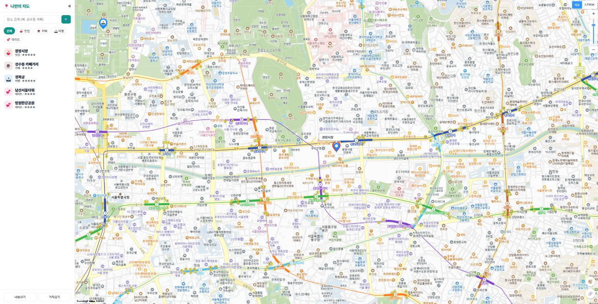
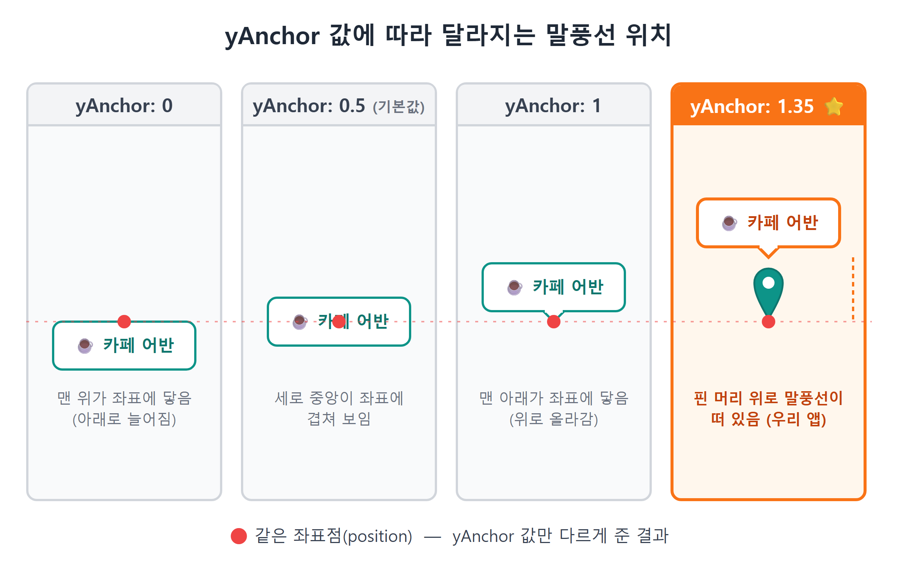
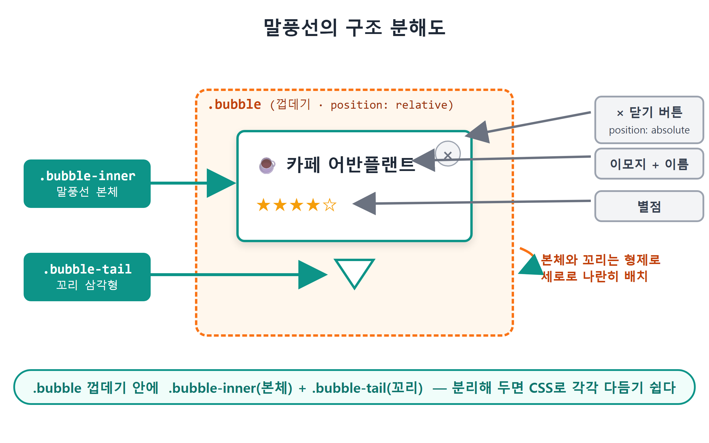
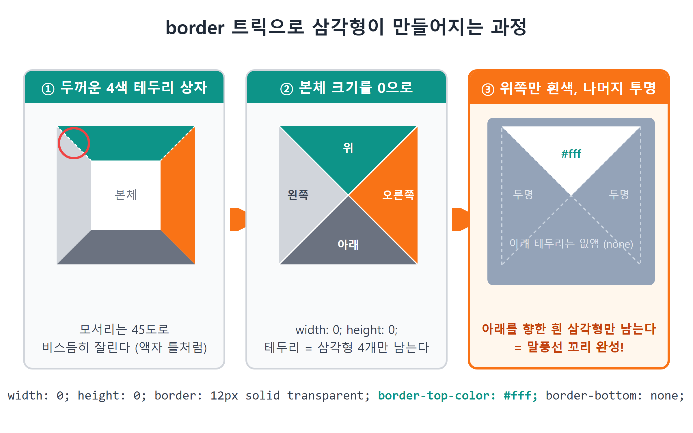
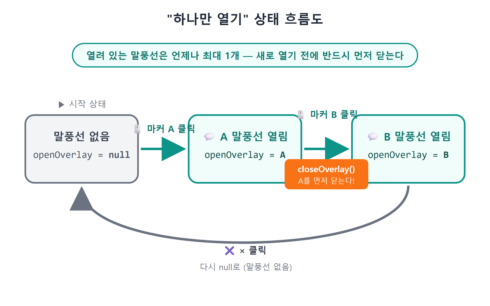
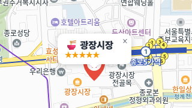

# 13장 커스텀 오버레이 말풍선

!!! note "이 장에서 배우는 것"
    - 카카오지도가 기본 제공하는 InfoWindow를 써 보고, 왜 금방 한계에 부딪히는지 확인합니다
    - CustomOverlay로 HTML/CSS 말풍선을 지도 위에 띄우는 방법을 배웁니다
    - yAnchor로 말풍선을 마커 머리 위에 정확히 올려놓는 원리를 이해합니다
    - "말풍선은 한 번에 하나만": openOverlay 변수 하나로 열고 닫기 상태를 관리합니다
    - CSS border 트릭으로 말풍선 꼬리(삼각형)를 그립니다

---

12장에서는 장소 데이터의 구조를 정의하고, 데이터 배열을 순회하며 마커를 표시하는 renderPlaces 함수를 제작하였습니다. 다만 현재는 마커를 클릭하여도 아무런 동작이 발생하지 않습니다. 마커는 해당 위치에 무언가가 존재한다는 사실만 보여줄 뿐, 그 장소에 대한 상세 정보까지 전달하지는 않기 때문입니다.

카카오맵 앱에서는 지도 위의 가게 핀을 누르면 가게 이름과 별점이 표시된 말풍선이 나타납니다. 이번 장에서는 해당 말풍선을 제작합니다. 마커를 클릭하면 장소 이름, 카테고리 이모지, 별점을 포함한 말풍선이 마커 상단에 표시되도록 설정하며, 닫기 버튼이나 다른 마커를 클릭하면 말풍선이 닫히도록 구현하겠습니다. 이 과정에서 지도 위에 HTML 요소를 배치하는 방법과, 활성화된 말풍선을 효율적으로 관리하는 방법을 함께 학습하겠습니다.

이번 장에서도 코드 작성은 Claude Code에게 요청하겠습니다. 코드를 암기하실 필요는 없으나, AI가 생성한 코드를 함께 살펴보며 해당 구조가 채택된 이유를 확인하고 넘어가시는 것이 좋습니다.

## 13.1 일단 기본 도구부터: InfoWindow 써 보기

카카오지도 SDK는 InfoWindow, 즉 인포윈도우라고 불리는 말풍선 기능을 기본적으로 제공하고 있습니다. 먼저 해당 기본 기능을 활용해 보겠습니다. Claude Code에게 다음과 같이 코드 작성을 요청해 보시기 바랍니다.

!!! tip "이렇게 물어보세요"
    > 마커를 클릭하면 장소 이름이 적힌 말풍선이 뜨게 해줘. 카카오지도 기본 InfoWindow를 써서 가장 간단하게.

Claude Code는 대략 다음과 같은 형태의 코드를 생성해 줄 것입니다.

```js
const infowindow = new kakao.maps.InfoWindow({
  content: `<div style="padding:5px;">${place.name}</div>`,
});

kakao.maps.event.addListener(marker, 'click', () => {
  infowindow.open(map, marker);
});
```

InfoWindow 객체를 생성할 때 `content`에 HTML 문자열을 전달하고, 마커 클릭 이벤트에서 `open(지도, 마커)`를 호출하면 됩니다. 코드를 저장한 뒤 브라우저에서 마커를 클릭해 보시기 바랍니다. 정상적으로 말풍선이 표시되는 것을 확인할 수 있습니다.

{ width="760" }
/// caption
그림 13.1 — 기본 InfoWindow가 열린 상태
///

다만 화면을 확인하시면 개선할 점이 눈에 띌 것입니다. 말풍선의 테두리, 배경, 꼬리 모양이 모두 카카오에서 정한 형태로 고정되어 있기 때문입니다. 모서리를 더욱 둥글게 처리하거나, 그림자 효과를 추가하고, 별점의 색상을 변경하거나, 닫기 버튼을 앱의 디자인에 맞춰 수정할 수 없습니다. InfoWindow는 내용 영역(content)만 변경 가능하며, 외부 디자인과 관련된 스타일은 SDK에서 미리 정해두었기 때문입니다.

카카오지도 SDK는 이러한 경우를 위하여 테두리가 없는 오버레이 기능도 함께 제공하고 있습니다. 이를 CustomOverlay, 즉 커스텀 오버레이라고 부릅니다. 표시할 위치만 지정하면 해당 위치에 사용자가 직접 제작한 HTML 요소를 그대로 표시할 수 있으므로, 말풍선의 모든 디자인 요소를 직접 설계할 수 있습니다.

!!! tip "팁"
InfoWindow의 사용이 부적절한 것은 아닙니다. 위치와 이름만 간략하게 표시하면 되는 관리자용 도구나 시제품을 제작하는 경우에는 InfoWindow를 활용하는 것이 훨씬 간결한 구현 방법입니다. 디자인을 세밀하게 조절해야 하는 경우에만 CustomOverlay를 활용하는 것이 효율적입니다.

## 13.2 CustomOverlay: 지도 위에 HTML을 올린다

CustomOverlay의 핵심 역할은 한 문장으로 정리할 수 있습니다. 사용자가 제작한 HTML 요소를 지도 상단의 특정 위도·경도 좌표에 고정하여 표시하는 기능입니다.

일반적인 웹페이지에서는 HTML 요소의 위치를 픽셀 단위로 지정합니다. 예를 들어 좌측으로부터 100px, 상단으로부터 50px의 위치에 배치하는 방식입니다. 반면 CustomOverlay는 위치를 위도·경도 좌표로 지정합니다. "위도 37.5665, 경도 126.978에 이 div를 붙여 놔"라고 선언하면, 이후의 위치 표시는 지도에 맡기게 됩니다. 지도를 드래그하면 말풍선이 함께 이동하며, 지도를 확대하거나 축소하여도 말풍선은 정확한 좌표 위에 위치합니다. 픽셀 단위의 위치 계산은 SDK에서 자동으로 처리해 줍니다.

CustomOverlay의 제작 방법은 InfoWindow와 크게 다르지 않습니다.

```js
const overlay = new kakao.maps.CustomOverlay({
  content: el,        // 우리가 만든 HTML 요소 (또는 HTML 문자열)
  position: pos,      // kakao.maps.LatLng — 붙어 있을 위경도
  yAnchor: 1.35,      // 세로 기준점 (곧 설명합니다)
  zIndex: 10,         // 다른 오버레이보다 위에 그리기
  clickable: true,    // 오버레이 클릭이 지도 클릭으로 번지지 않게
});
overlay.setMap(map);    // 지도에 표시
overlay.setMap(null);   // 지도에서 제거
```

설명 과정에서 처음 접하는 속성이 하나 등장할 것입니다. 바로 `yAnchor`입니다.

### yAnchor: 말풍선의 "기준점" 정하기

CustomOverlay에 `position` 형식으로 좌표를 전달하면, 오버레이의 어느 지점이 해당 좌표에 위치하여야 할까요? 오버레이의 중앙부일 수도 있으며, 하단 꼭짓점일 수도 있습니다. 해당 기준점을 지정하는 속성이 세로 방향 기준점, 즉 `yAnchor`입니다.

- `yAnchor: 0` — 오버레이의 맨 위가 좌표에 닿습니다. 오버레이가 좌표 아래로 늘어집니다.
- `yAnchor: 0.5` — 오버레이의 세로 중앙이 좌표에 옵니다. (기본값)
- `yAnchor: 1` — 오버레이의 맨 아래가 좌표에 닿습니다. 오버레이가 좌표 위로 올라갑니다.

{ width="760" }
/// caption
그림 13.2 — yAnchor 값에 따른 말풍선 위치 변화
///

그런데 본 예제의 코드를 확인하면 `yAnchor: 1.35`로 설정되어 있습니다. 기준값을 넘어서는 숫자이므로 의아하게 느껴질 수 있습니다. 규칙을 확장하여 해석하면 쉽게 이해하실 수 있습니다. 값이 1인 경우 오버레이의 최하단 지점이 좌표에 위치하는 것이므로, 1.35는 해당 지점으로부터 오버레이 전체 높이의 35%만큼 상단으로 이동한 지점을 기준으로 설정한 것입니다.

말풍선을 상단으로 이동시킨 이유는 해당 좌표 상단에 마커 핀이 위치하고 있기 때문입니다. 11장에서 제작한 SVG 핀의 전체 높이는 46px이며, 뾰족한 하단 끝부분이 정확히 해당 좌표점에 위치하도록 설계되었습니다. 만약 `yAnchor: 1`로 설정하면 말풍선의 하단부가 좌표점에 위치하게 되어 마커 핀과 말풍선이 서로 겹치게 됩니다. 따라서 35%만큼의 간격을 확보하여 말풍선을 마커 핀의 상단 영역에 표시하도록 조정하였습니다. 해당 수치는 정해진 규칙이 아니며, 시각적으로 자연스러운 간격을 고려하여 설정한 값입니다. 만약 사용하시는 마커 핀의 크기가 다른 경우, 1.2 또는 1.5와 같이 적절한 값으로 조절하여 보기 좋은 간격을 찾으시면 됩니다.

!!! tip "팁"
가로 방향 기준점을 지정하는 속성으로 `xAnchor`도 존재합니다. 값이 0인 경우 좌측 끝을 기준으로 배치되며, 0.5인 경우 중앙부, 1인 경우 우측 끝을 기준으로 배치됩니다. 본 예제에서는 말풍선을 마커의 정중앙 상단에 위치시키는 것이 적절하므로, 기본값으로 설정된 0.5를 그대로 사용하며 별도로 코드에 명시하지 않았습니다. 기본값과 동일한 옵션은 별도로 명시하지 않는 것이 코드의 가독성을 높이는 방식입니다.

## 13.3 말풍선 HTML 만들기: overlayContent

이제 본격적으로 CustomOverlay를 제작해 보겠습니다. 구현하고자 하는 말풍선의 디자인 요구사항을 구체적으로 작성하여 프롬프트를 구성합니다. 4장에서 학습한 프롬프트 작성 4가지 요소인 배경·목표·제약사항·출력 형식을 다시 활용해 보시기 바랍니다.

!!! tip "이렇게 물어보세요"
    > InfoWindow 대신 CustomOverlay로 말풍선을 바꾸고 싶어. mapView.js에 말풍선 HTML을 만드는 함수를 추가해줘.
    > 말풍선에는 카테고리 이모지 + 장소 이름, 별점(★☆ 5개), 오른쪽 위 × 닫기 버튼을 넣어줘.
    > 스타일은 style.css에 .bubble 클래스로: 흰 배경, 둥근 모서리, 그림자, 아래쪽 가운데에 꼬리 삼각형.
    > 장소 이름은 나중에 사용자가 입력할 수도 있으니 HTML 이스케이프 처리해줘.

이제 Claude Code가 mapView.js 파일에 작성한 함수 내용을 함께 확인해 보겠습니다.

```js
function overlayContent(place) {
  const cat = categoryOf(place.category);
  const stars = '★'.repeat(place.rating || 0) + '☆'.repeat(5 - (place.rating || 0));
  const el = document.createElement('div');
  el.className = 'bubble';
  el.innerHTML = `
    <div class="bubble-inner">
      <strong>${cat.emoji} ${escapeHtml(place.name)}</strong>
      <span class="bubble-stars">${stars}</span>
      <button class="bubble-close" title="닫기">×</button>
    </div>
    <div class="bubble-tail"></div>`;
  return el;
}

export function escapeHtml(s = '') {
  return s.replace(/[&<>"']/g, (c) => ({
    '&': '&amp;', '<': '&lt;', '>': '&gt;', '"': '&quot;', "'": '&#39;',
  })[c]);
}
```

코드의 각 부분을 한 줄씩 분석하며 이해하겠습니다.

별점 표시 문자열 생성 부분입니다. `'★'.repeat(3)`은 `"★★★"`를 생성하는 로직입니다. 별점이 3점인 경우 채워진 별 3개 뒤에 비어있는 별 2개를 표시하여야 하므로, `'☆'.repeat(5 - 3)`을 이어서 결합합니다. `place.rating || 0`은 "rating이 없으면 0으로 치라"에 대한 예외 처리 로직입니다. 아직 별점이 부여되지 않은 장소의 경우 비어있는 별 5개를 표시하여 화면이 일관되게 보이도록 처리합니다.

HTML 요소 생성 부분입니다. `document.createElement('div')`를 활용하여 실제 DOM 요소를 생성하고, `innerHTML`으로 해당 요소의 내용을 채웁니다. CustomOverlay의 `content` 속성에는 HTML 문자열을 직접 전달할 수도 있습니다. 다만 HTML 요소 형태로 생성하여야만, 내부에 위치한 닫기 버튼에 클릭 이벤트를 연결하는 작업이 가능합니다. 닫기 버튼이 정상적으로 작동하기 위해서는 해당 방식으로 구현하여야 하며, 이에 대한 상세 내용은 13.5절에서 함께 확인하겠습니다.

HTML 구조에 관한 설명입니다. 말풍선의 본체 영역인 `bubble-inner`과 꼬리 부분인 `bubble-tail`을 형제 요소로 나란히 배치하고, 두 요소를 `bubble`이라는 최상위 요소로 감싼 구조입니다. 본체 영역과 꼬리 부분을 분리하여 구성하면 CSS 스타일을 각각 별도로 적용하기 용이합니다.

escapeHtml 함수에 관한 설명입니다. 해당 함수가 필요한 이유를 살펴보겠습니다. `innerHTML`는 전달받은 문자열을 HTML 형식으로 해석하는 속성입니다. 만약 장소 이름에 ``와 같은 문자열이 포함되어 있다고 가정해 보겠습니다. 우리는 단순히 장소 이름을 표시하고자 하였으나, 브라우저가 해당 문자열을 HTML 태그로 인식하여 스크립트 코드가 실행될 수 있는 위험이 발생합니다. 현재 단계에서는 직접 생성한 데이터를 사용하므로 안전하지만, 이후 사용자가 직접 장소 이름을 입력하는 16장부터는 이러한 위험성이 증가합니다. escapeHtml 함수는 `<`를 `&lt;`와 같은 "그냥 글자"로 변환하여 이러한 보안 문제를 미리 예방하는 함수입니다. 해당 주제는 XSS[^1]에 대한 내용으로, 19장에서 보다 자세히 다루겠습니다. 현재 단계에서는 "사용자가 입력한 문자열을 innerHTML에 넣을 때는 반드시 이스케이프"이라는 핵심 규칙만 기억해 두시기 바랍니다.

{ width="760" }
/// caption
그림 13.3 — 말풍선 구조 분해도
///

## 13.4 꼬리 삼각형: CSS border 트릭

이제 말풍선의 디자인 중 꼬리 부분에 주목하여 살펴보겠습니다. Claude Code가 style.css 파일에 추가한 스타일 규칙을 확인해 보겠습니다.

```css
/* ── 말풍선(커스텀 오버레이) ───────────── */
.bubble { position: relative; }
.bubble-inner {
  background: #fff; border-radius: 10px; padding: 8px 30px 8px 12px;
  box-shadow: 0 2px 10px rgb(0 0 0 / 0.2);
  display: flex; flex-direction: column; cursor: pointer; white-space: nowrap;
}
.bubble-stars { color: #f59e0b; font-size: 12px; }
.bubble-close {
  position: absolute; top: 4px; right: 6px; border: none; background: none;
  cursor: pointer; color: var(--muted); font-size: 15px;
}
.bubble-tail {
  width: 0; height: 0; margin: 0 auto;
  border: 8px solid transparent; border-top-color: #fff; border-bottom: none;
}
```

`bubble-inner`에 정의된 스타일 속성들은 익숙한 내용일 것입니다. 흰색 배경, 10px 크기의 둥근 모서리, 부드러운 그림자 효과를 적용하였으며, 장소 이름이 매우 긴 경우에도 자동으로 줄 바뀜되지 않도록 `white-space: nowrap` 속성을 설정하였습니다. 우측 패딩 값만 30px로 넉넉하게 설정한 이유는 해당 공간에 닫기 버튼이 `position: absolute` 형식으로 배치되기 때문입니다. 최상위 요소인 `.bubble`에 `position: relative` 속성을 적용한 것도 닫기 버튼의 위치 기준점을 설정하기 위한 목적입니다.

이제 주목하여 살펴보실 부분은 `bubble-tail`입니다. 가로와 세로의 크기가 모두 0으로 지정되어 있는데, 어떻게 삼각형 모양의 꼬리가 표시되는지 의아할 것입니다.

그 원리는 테두리(border)가 만나는 모서리의 표시 방식에 있습니다. CSS에서 테두리 두께가 두꺼운 사각형을 그리면, 상단 테두리와 측면 테두리가 만나는 모서리 부분은 45도 각도로 잘려 표시됩니다. 이제 사각형의 너비와 높이를 0으로 설정하면, 네 방향의 테두리만이 보이게 되며 각 테두리는 삼각형 형태로 표시됩니다. 여기서 상단 테두리만 `border-top-color: #fff`로 지정하고 나머지 테두리는 `transparent`로 지정하면, 아래쪽을 향하는 흰색 삼각형이 생성됩니다. 하단 테두리는 `border-bottom: none`으로 설정하여 완전히 숨기고, 삼각형 하단에 불필요한 투명 여백이 생기지 않도록 처리하였습니다. `margin: 0 auto` 속성은 해당 삼각형을 말풍선의 가로 방향 중앙에 배치하는 역할을 수행합니다.

{ width="760" }
/// caption
그림 13.4 — 테두리 속성의 특징을 활용한 삼각형 제작 과정
///

이러한 기법은 지도 위의 말풍선뿐만 아니라 웹페이지에서 툴팁이나 드롭다운 메뉴의 화살표를 제작하는 경우에도 매우 널리 사용되는 방식입니다. 해당 원리를 이해하고 있으면, 다른 사람이 작성한 CSS 코드를 확인하던 중 `width: 0; height: 0; border: ...`가 사용된 것을 발견하였을 때 "아, 삼각형이구나" 해당 의도를 쉽게 파악하실 수 있습니다.

!!! warning "주의"
만약 말풍선의 위치가 마커와 맞지 않는 경우, 대부분의 경우 yAnchor 속성값과 CSS 스타일의 높이 간의 간격이 일치하지 않기 때문입니다. 말풍선의 내부 여백이나 글꼴 크기를 변경하면 말풍선 전체의 높이가 변경되며, 이에 따라 기존에 1.35로 조절하였던 간격도 달라지게 됩니다. 따라서 디자인을 수정한 뒤에는 반드시 브라우저에서 마커와 말풍선 사이의 간격을 확인하고 조절하시기 바랍니다.

## 13.5 하나만 열기: openOverlay 상태 관리

이제 제작한 말풍선을 마커의 클릭 이벤트와 연결하겠습니다. 그 전에 미리 결정하여야 할 규칙이 하나 있습니다. 현재 마커 A의 말풍선이 표시되어 있는 상태에서 마커 B를 클릭한 경우 어떻게 동작하여야 할까요?

별도의 처리를 추가하지 않으면 말풍선이 계속하여 누적되어 표시될 것입니다. 만약 장소가 20개인 경우 화면 전체가 말풍선으로 가려지게 될 수도 있습니다. 카카오맵을 비롯한 대부분의 지도 서비스에서는 한 번에 하나의 말풍선만 표시하는 방식을 채택하고 있습니다. 새로운 말풍선을 열기 전에 기존에 열려 있던 말풍선을 닫는 방식입니다. 본 예제에서도 동일한 규칙을 적용하여 제작하겠습니다.

!!! tip "이렇게 물어보세요"
    > 마커를 클릭하면 그 마커의 말풍선이 열리게 해줘. 단, 말풍선은 화면에 항상 하나만 있어야 해.
    > 다른 마커를 클릭하면 이전 말풍선은 닫히고 새 말풍선이 열려. × 버튼을 누르면 그냥 닫혀.

이제 Claude Code가 작성한 코드를 확인해 보겠습니다. 먼저 현재 열려 있는 말풍선을 관리하는 변수 선언 부분부터 살펴보겠습니다.

```js
let openOverlay = null; // 지금 열려 있는 말풍선 (없으면 null)

export function closeOverlay() {
  if (openOverlay) {
    openOverlay.setMap(null); // 지도에서 떼어낸다
    openOverlay = null;
  }
}
```

현재 열려 있는 말풍선의 상태는 `openOverlay`이라는 단일 변수에 저장하여 관리합니다. 말풍선이 닫혀 있는 경우 변수에는 `null`이 저장되며, 말풍선이 열려 있는 경우에는 해당 오버레이 객체가 저장됩니다. `closeOverlay()`는 현재 열려 있는 오버레이가 존재하는 경우 지도에서 제거하고 상태 변수를 초기화하는 두 줄짜리 함수입니다. 이와 같이 상태 정보를 단일 변수에 보관하고, 상태를 변경하는 로직을 별도의 함수로 분리하여 일관되게 관리하면, 이후 14장의 필터 기능과 17장의 저장 기능에서도 동일한 패턴을 활용하실 수 있습니다.

이제 12장에서 제작한 renderPlaces 함수에 오버레이 관련 로직을 추가하겠습니다. 마커를 생성하는 반복문 내부에 다음과 같은 코드를 추가합니다.

```js
export function renderPlaces(places) {
  closeOverlay(); // 다시 그리기 전에 열린 말풍선부터 정리
  markers.forEach((m) => m.marker.setMap(null));
  markers = [];

  for (const place of places) {
    const pos = new kakao.maps.LatLng(place.lat, place.lng);
    const marker = new kakao.maps.Marker({
      position: pos,
      image: markerImageFor(place.category),
      title: place.name,
    });
    marker.setMap(map);

    // ── 이번 장의 주인공: 말풍선 오버레이 ──
    const el = overlayContent(place);
    const overlay = new kakao.maps.CustomOverlay({
      content: el,
      position: pos,
      yAnchor: 1.35,
      zIndex: 10,
      clickable: true, // 말풍선 클릭이 지도 클릭(장소 추가)으로 번지지 않게
    });
    el.querySelector('.bubble-close').addEventListener('click', (e) => {
      e.stopPropagation();
      closeOverlay();
    });

    kakao.maps.event.addListener(marker, 'click', () => {
      closeOverlay();       // ① 이전 말풍선 닫기
      overlay.setMap(map);  // ② 이 말풍선 열기
      openOverlay = overlay; // ③ "지금 열린 건 이거"라고 기억
    });

    markers.push({ marker, overlay, place });
  }
}
```

이제 해당 코드의 실행 흐름을 순서대로 설명하겠습니다.

각 장소에 대응하는 오버레이를 미리 생성하되, 실제로 화면에 표시하지는 않습니다. 생성한 오버레이는 마커와 쌍을 이루어 `markers` 배열에 보관합니다. 다만 아직 `overlay.setMap(map)`을 호출하지 않았으므로 브라우저 화면에는 아무것도 나타나지 않습니다. 이후 사용자가 마커를 클릭하는 시점에 비로소 오버레이를 지도에 추가하여 표시합니다.

마커를 클릭하였을 때의 실행 순서는 기존 말풍선 닫기 → 새 말풍선 열기 → 상태 기록하기의 세 단계로 구성됩니다. 어떤 마커를 클릭하더라도 ① 먼저 `closeOverlay()`를 호출하여 기존에 열려 있던 말풍선을 닫고, ② 클릭한 마커에 해당하는 말풍선을 표시하며, ③ `openOverlay`에 현재 열린 오버레이를 기록합니다. 위 순서를 준수하면 한 번에 두 개 이상의 말풍선이 표시되는 문제는 발생하지 않습니다. 동일한 마커를 반복하여 클릭하는 경우에도 닫았다가 다시 여는 동작을 반복할 뿐이므로 정상적으로 작동합니다.

× 버튼과 stopPropagation. 13.3절에서 content를 DOM 요소로 만들어 둔 덕분에, `el.querySelector('.bubble-close')`로 말풍선 안의 × 버튼을 찾아 클릭 이벤트를 달 수 있습니다. `e.stopPropagation()`은 왜 필요할까요? 브라우저에서 클릭 이벤트는 눌린 요소에서 부모 요소로 차례로 올라갑니다. 이를 버블링이라고 부릅니다. ×를 눌렀는데 이벤트가 말풍선 본체까지 올라간다고 합시다. 나중에 말풍선 클릭에 상세 패널 열기 같은 동작을 달면, 닫으려고 누른 클릭이 오히려 상세 패널을 열 수 있습니다. 상세 패널은 18~19장에서 붙이겠습니다. `stopPropagation()`은 이 클릭을 여기서 끝내고 부모로 전달하지 말라는 뜻입니다.

`clickable: true`에 관한 설명입니다. 오버레이 옵션에 추가한 해당 속성 한 줄은 이벤트 버블링으로 인한 문제를 근본적으로 예방하기 위한 설정입니다. `stopPropagation`는 말풍선 내부 요소에서 발생한 클릭 이벤트가 외부로 전달되는 것을 차단하며, `clickable: true`는 말풍선에서 발생한 클릭 이벤트가 지도 자체의 클릭 이벤트로 인식되는 것을 SDK 차원에서 미리 방지합니다. 해당 옵션의 중요성은 16장에서 "지도 클릭 = 장소 추가" 기능을 추가한 이후에 더욱 명확하게 드러납니다. 만약 해당 옵션을 설정하지 않은 경우, 말풍선을 클릭할 때마다 예기치 않게 장소 추가 다이얼로그가 표시되는 문제가 발생하게 됩니다.

renderPlaces 첫 줄의 closeOverlay(). 목록을 다시 그릴 때는 기존 마커와 오버레이를 전부 버리고 새로 만듭니다. 그런데 열려 있던 말풍선을 안 닫고 버리면, 화면에는 붙어 있는데 아무도 기억하지 못하는 "유령 말풍선"이 생길 수 있습니다. 그래서 다시 그리기 전에 반드시 먼저 닫습니다. 14장에서는 필터 버튼을 누를 때마다 renderPlaces를 다시 부릅니다. 이 한 줄이 그때 진가를 발휘할 겁니다.

{ width="760" }
/// caption
그림 13.5 — "하나만 열기" 상태 흐름도
///

!!! tip "팁"
실제 앱의 mapView.js 파일을 확인하면 renderPlaces 함수에서 `clusterer.addMarkers(...)`를 호출하고, 마커 클릭 시에는 `onMarkerClick(place.id)`를 함께 호출하는 것을 확인하실 수 있습니다. 해당 기능들은 각각 22장(마커 클러스터러)과 19장(상세 정보 패널)에서 자세히 학습할 예정입니다. 따라서 이번 장의 예제 코드에서는 해당 부분을 `marker.setMap(map)`로 간략하게 표시하였습니다. 책의 학습 단계에 따라 동일한 함수가 점차 확장되는 과정을 그대로 확인하실 수 있도록 구성한 내용입니다.

## 13.6 실행 확인

이제 브라우저에서 테스트해 보겠습니다. `npm run dev`가 실행 중인 상태에서 파일을 저장하면 Vite가 자동으로 브라우저 화면을 갱신하여 줍니다. 아래 제시된 순서대로 기능을 확인해 보시기 바랍니다.

1. 마커 클릭: 말풍선이 마커 머리 위에 뜨나요? 이모지, 이름, 노란 별점이 보이나요?
2. 다른 마커 클릭: 이전 말풍선이 닫히고 새 말풍선만 남나요? 여러 마커를 빠르게 눌러도 말풍선은 항상 하나뿐인가요?
3. × 버튼: 말풍선이 닫히나요?
4. 지도 드래그·확대: 말풍선이 마커에 딱 붙어 함께 움직이나요?

{ width="520" }
/// caption
그림 13.6 — 완성된 커스텀 말풍선
///

제시된 네 가지 확인 항목을 모두 통과하셨다면 축하드립니다. 기본 InfoWindow로는 구현할 수 없었던, 오직 여러분의 앱만을 위한 디자인의 말풍선 제작이 완료되었습니다. 만약 말풍선이 마커 뒤에 가려 보이는 경우에는 `zIndex` 속성을 의심해 보시고, 말풍선의 위치가 마커와 어긋나 보이는 경우에는 `yAnchor` 속성을 확인하시기 바랍니다. 그리고 이러한 미세한 위치 조정 작업은 AI에게 요청하는 것이 효율적입니다. Claude Code에게 "말풍선이 핀에 살짝 겹쳐 보여. yAnchor를 조금씩 바꿔 가면서 안 겹치는 값을 찾아줘"라고 요청하면 적절한 값으로 조정하여 줄 것입니다.

---

## 13.7 마무리

!!! abstract "이 장의 핵심"
    - InfoWindow는 빠르지만 바깥 틀의 스타일까지 바꿀 수는 없습니다. 디자인을 손봐야 한다면 CustomOverlay를 씁니다.
    - CustomOverlay는 우리가 만든 HTML 요소를 위경도 좌표에 붙이는 부품입니다. `setMap(map)`으로 열고 `setMap(null)`로 닫습니다.
    - `yAnchor`는 오버레이의 세로 기준점입니다. 1이면 밑변이 좌표에 닿고, 1.35처럼 1보다 크면 마커 높이만큼 위로 떠오릅니다.
    - "말풍선은 하나만" 규칙은 `openOverlay` 변수 하나와 `closeOverlay()` 함수 하나로 구현합니다. 새로 열기 전에 항상 먼저 닫습니다.
    - 말풍선 꼬리는 크기 0짜리 상자의 border 트릭으로 그립니다. 위쪽 테두리만 색을 칠하면 아래를 향한 삼각형이 됩니다.
    - 클릭 번짐은 두 겹으로 막습니다. 말풍선 안에서는 `stopPropagation`으로, 말풍선에서 지도로 번지는 클릭은 CustomOverlay의 `clickable: true` 옵션으로 막습니다.
    - 사용자 입력이 들어갈 수 있는 문자열을 `innerHTML`에 넣을 때는 escapeHtml로 이스케이프합니다(자세한 이야기는 19장에서).

!!! question "잠깐 생각해 봅시다"
Q1. 한 번에 하나의 말풍선만 "한 번에 하나만" 표시하도록 설계한 이유는 무엇일까요? 만약 여러 개의 말풍선을 동시에 표시하도록 변경한다면, 어떤 점이 개선되고 어떤 점이 불편해질까요?

____________________________________________

____________________________________________

Q2. `yAnchor: 1.35` 속성에 설정된 1.35라는 숫자는 어떻게 결정되었을까요? 여러분의 앱에서 이 값을 변경하여야 하는 상황은 언제일까요?

____________________________________________

____________________________________________ 需要我帮你整理成「원문-개정문」대조표，以便对照 검토하시겠습니까？ ch13.txt

!!! example "확인 문제"
    1. Claude Code에게 시켜서 말풍선 배경을 흰색 대신 연한 노란색(`#fffbe6`)으로 바꿔 보세요. 본체만 바꾸면 꼬리 색이 따로 놀 겁니다. 꼬리까지 맞추려면 CSS의 어느 속성을 함께 바꿔야 할까요?
    2. `yAnchor` 값을 0, 0.5, 1, 1.35로 바꿔 가며 저장해 보고, 말풍선이 각각 어디에 나타나는지 그림 13.2와 비교해 보세요.
    3. 말풍선에 카테고리 라벨(예: "맛집")을 별점 아래 한 줄로 추가해 보세요. `categoryOf(place.category)`가 돌려주는 객체에 이미 `label`이 들어 있습니다.
    4. (도전) 지도의 빈 곳을 클릭했을 때도 말풍선이 닫히게 만들어 보세요. 힌트: 10장에서 배운 지도 click 이벤트에서 `closeOverlay()`를 부르면 됩니다.

!!! info "더 찾아보기"
    - `이벤트 버블링` — 클릭 이벤트가 자식에서 부모로 번져 올라가는 규칙. stopPropagation의 배경 원리
    - `CSS clip-path` — border 트릭 없이 다각형을 직접 오려내는 최신 CSS 속성. 삼각형 그리기의 또 다른 방법
    - `CSS pointer-events` — 요소가 마우스 이벤트를 받을지 자체를 CSS로 끄고 켜는 속성. 클릭이 "뒤에 있는 것"으로 뚫고 지나가게 만들 수도 있습니다
    - `툴팁(tooltip) UI 패턴` — 말풍선류 UI의 위치 잡기·화면 밖 처리 같은 일반 설계 문제

> 다음 장으로. 지도에 말풍선까지 갖췄습니다. 그런데 장소가 늘어나면 맛집만 보고 싶을 때가 생깁니다. 14장에서는 🍜맛집 / ☕카페 / 🏝여행 / 💕데이트 버튼으로 지도를 골라 보는 카테고리 필터를 만듭니다. 이번 장에서 익힌 "상태 변수 하나 + 다시 그리기" 패턴이 그대로 다시 등장할 겁니다. renderPlaces 첫 줄의 closeOverlay()가 왜 미리 들어가 있었는지도 그때 확인할 수 있습니다.

[^1]: XSS(Cross-Site Scripting) — 사용자 입력에 섞인 스크립트가 웹페이지에서 실행되는 보안 취약점. 19장에서 자세히 다룹니다.
