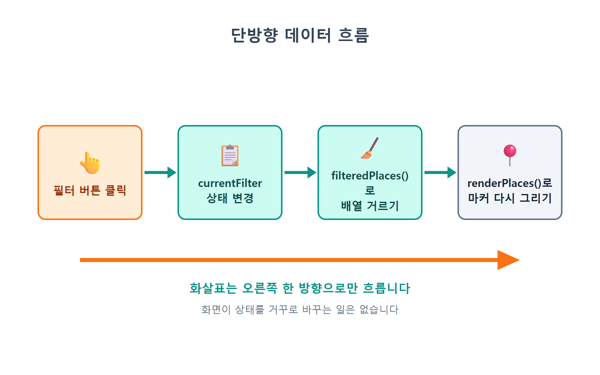
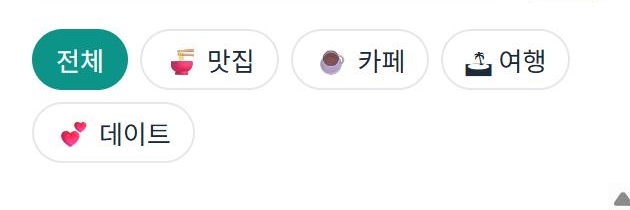
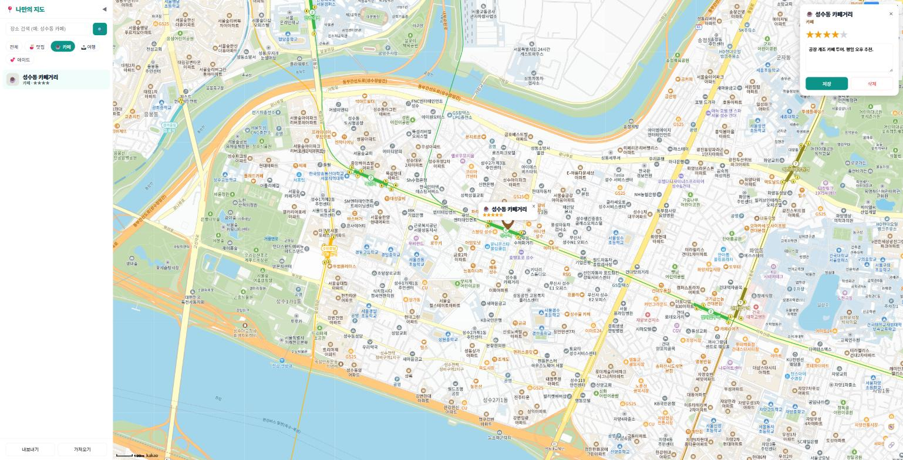
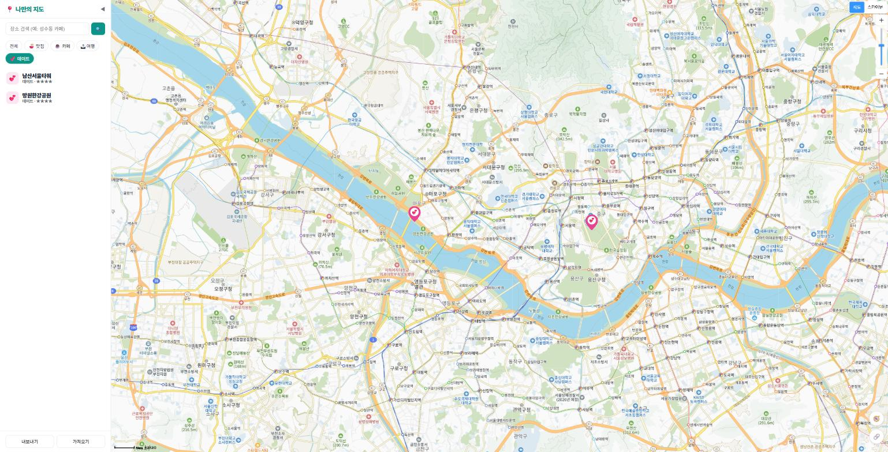
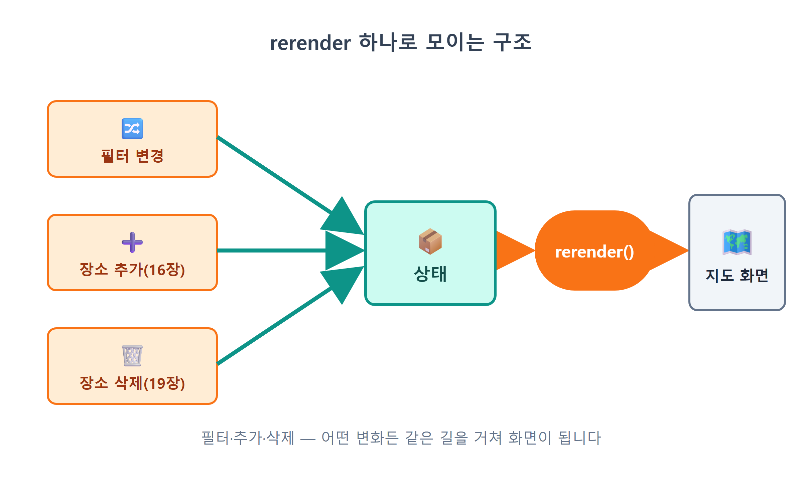

# 14장 카테고리 필터

!!! note "이 장에서 배우는 것"
    - "상태(state)"가 무엇인지, 왜 화면보다 상태가 먼저인지 이해합니다
    - 필터 상태를 담는 변수 `currentFilter`와 배열의 `filter()` 메서드를 배웁니다
    - 🍜맛집/☕카페/🏝여행/💕데이트 필터 버튼을 만들고 `active` 클래스를 토글합니다
    - "상태 → 화면" 한 방향으로만 흐르는 단방향 렌더링 구조를 익힙니다
    - "전체" 버튼처럼 예외 케이스를 상태 설계에 녹이는 법을 배웁니다

---

13장까지 따라오신 여러분의 지도에는 이제 다섯 개의 장소가 표시되어 있습니다. 빨간색 맛집 핀, 갈색 카페 핀, 파란색 여행 핀, 분홍색 데이트 핀이 각각 고유한 색상과 아이콘을 가지고 있으며, 핀을 누르면 말풍선도 나타납니다. 이 수준만으로도 지도 앱의 기본적인 모습은 갖추어진 것입니다.

그런데 장소가 다섯 개가 아니라 쉰 개라면 어떨까요? 주말 데이트 코스를 계획하려고 지도를 열었는데, 화면에 맛집·카페·여행지 핀이 뒤섞여 빼곡하게 표시될 것입니다. 정작 찾고 싶은 💕 핀은 그 사이에 파묻혀 찾기 어려울 것입니다. 카카오맵이나 배달 앱을 떠올려 보시기 바랍니다. 상단에 "음식점", "카페", "편의점"과 같은 버튼이 나열되어 있으며, 하나를 누르면 해당 종류의 장소만 화면에 나타납니다. 이번 장에서는 이 카테고리 필터를 제작합니다.

기능 자체로 보면 분량이 많지는 않습니다. 버튼 다섯 개와 함수 몇 개로 구현할 수 있습니다. 다만 이 장에서는 상태(state)[^1]와 단방향 데이터 흐름이라는 중요한 개념을 다룹니다. 15장의 검색 기능, 16장의 장소 추가 기능, 18장의 목록 연동 기능은 모두 이번 장에서 구축하는 구조를 기반으로 동작하게 될 것입니다. 코드 자체보다는 데이터가 어떤 순서로 흘러가는지에 초점을 맞추어 읽어주시기 바랍니다.

## 14.1 필터의 정체: 버튼이 아니라 "상태"

필터 기능을 처음 떠올리면 버튼과 마커를 직접 연결하는 방식을 생각하기 쉬울 것입니다. "카페 버튼을 누르면 → 카페가 아닌 마커를 숨긴다."와 같은 방식입니다. 직관적이기는 하지만 이렇게 구현하면 상황이 복잡해지기 쉽습니다. 카페 버튼을 눌렀다가 다시 여행 버튼을 눌렀을 때, 이전에 숨겼던 마커 중 어느 것을 다시 보여주어야 할지 판단해야 합니다. 추후 검색 기능으로 장소가 추가되었을 때, 그 마커를 현재 필터 기준에 맞추어 숨겨야 할지 보여주어야 할지 판단해야 하는 경우가 점점 늘어날 것입니다.

그래서 프로그래머들은 접근 방식을 달리합니다. "버튼을 누르면 무엇을 할까?"를 묻는 대신, "지금 무엇이 선택되어 있는가?"를 먼저 묻습니다. 그리고 그 답을 하나의 변수에 저장해 둡니다.

```js
let currentFilter = 'all';
```

이 변수가 필터의 상태를 담고 있습니다. `'all'`이면 전체 장소를 보여주고, `'cafe'`이면 카페만 보여주는 방식입니다. 지도에 마커가 몇 개가 표시되어 있든 언제나 이 하나의 변수를 기준으로 판단할 수 있습니다. 화면을 그릴 때도 오직 이 변수만을 참고합니다.

이렇게 관점을 전환하면 코드를 훨씬 간결하게 작성할 수 있습니다. 개별 마커의 상태를 일일이 기억하는 대신, 현재 어떤 것이 선택되어 있는지만 기억하면 되기 때문입니다. 버튼은 `currentFilter`의 값을 변경하는 역할만 수행할 뿐, 마커를 직접 조작하지는 않습니다. 마커를 어떻게 표시할지는 이 값을 참고하여 화면을 다시 그리는 단 한 곳에서 결정할 수 있습니다.

{ width="760" }
/// caption
그림 14.1 — 필터가 없을 때: 모든 카테고리의 마커가 뒤섞여 표시된 지도
///

이 데이터의 흐름을 그림으로 표현하면 다음과 같습니다.

1. 버튼 클릭 → 상태를 바꾼다: `currentFilter = 'cafe'`
2. 상태 기준으로 → 데이터를 거른다: `filteredPlaces()`
3. 걸러진 데이터로 → 화면을 다시 그린다: `renderPlaces(...)`

{ width="760" }
/// caption
그림 14.2 — 단방향 데이터 흐름: 버튼 → 상태 → 필터링 → 렌더링
///

화살표가 오른쪽 방향으로만 흐른다는 점에 주목하여 주시기 바랍니다. 화면에서 상태를 거슬러 올라가 변경하는 경우는 없습니다. 이와 같은 흐름 방식을 단방향 데이터 흐름이라고 부르며, React나 Vue와 같은 널리 사용되는 프론트엔드 프레임워크도 모두 이 기본 원칙을 바탕으로 설계되었습니다. 우리는 이번 장에서 프레임워크를 사용하지 않고 순수 바닐라 자바스크립트로 이 원칙을 직접 구현해 볼 것입니다. 이 원리를 직접 이해하고 구현해 본 경험이 있다면, 이후 어떤 프레임워크를 접하더라도 쉽게 적응할 수 있을 것입니다.

## 14.2 필터 바 UI 만들기

개념에 대해 설명하였으니, 이제 Claude Code를 활용하여 코드를 작성해 보겠습니다. 코드를 직접 한 줄씩 입력하는 대신, 구현하려는 내용을 정확하게 설명하여 요청하면 됩니다.

!!! tip "이렇게 물어보세요"
    > 사이드바 상단, 제목 바로 아래에 카테고리 필터 바를 만들어줘. "전체 / 🍜 맛집 / ☕ 카페 / 🏝 여행 / 💕 데이트" 버튼 5개를 알약 모양으로 가로 배치하고, 각 버튼에 data-category 속성으로 카테고리 id를 달아줘. id는 all, food, cafe, travel, date로 해줘. 선택된 버튼은 active 클래스로 배경색이 채워지게 하고, 처음에는 "전체"가 선택된 상태로 시작해줘. 카테고리 id는 12장에서 만든 categories.js와 똑같이 맞춰줘.

요청할 때 주목할 점은 두 가지입니다. 먼저, 버튼에 표시할 사용자용 한글 라벨과 코드 내에서 사용할 카테고리 식별자를 구분하여 지정하였습니다. 그리고 "categories.js와 똑같이 맞춰줘"와 같이 기존 코드와의 연결점을 명시하였습니다. 인공지능은 프로젝트의 전체 구조를 항상 기억하고 있지는 않으므로, 기준이 되는 파일을 명시해 주면 예상과 다른 결과가 나오는 경우를 크게 줄일 수 있습니다.

아래는 Claude Code가 `index.html`의 사이드바 영역에 추가한 필터 바입니다.

```html
<nav id="filter-bar">
  <button class="filter-btn active" data-category="all">전체</button>
  <button class="filter-btn" data-category="food">🍜 맛집</button>
  <button class="filter-btn" data-category="cafe">☕ 카페</button>
  <button class="filter-btn" data-category="travel">🏝 여행</button>
  <button class="filter-btn" data-category="date">💕 데이트</button>
</nav>
```

코드의 분량은 많지 않습니다. 하지만 그 안에서 배울 점은 적지 않으니, 한 줄씩 함께 살펴보겠습니다.

- `data-category="food"` — HTML 표준이 제공하는 **데이터 속성**입니다. `data-`로 시작하는 속성에는 브라우저가 아무 의미도 부여하지 않습니다. 우리가 자바스크립트에서 `btn.dataset.category`로 꺼내 쓰는 메모장입니다. 버튼의 겉모습(🍜 맛집)과 코드용 이름(`food`)을 분리하는 표준적인 방법입니다. 나중에 라벨을 "맛집"에서 "먹거리"로 바꿔도 코드는 한 줄도 고칠 필요가 없습니다.
- 첫 버튼에만 `active`: 처음에는 전체 보기라는 초기 상태를 HTML에도 반영해 두었습니다. 잠시 뒤 자바스크립트의 `currentFilter = 'all'` 초기값과 짝이 맞는다는 사실을 확인할 수 있습니다.
- `<nav>` — 버튼 묶음이 "탐색 도구"라는 의미를 담는 시맨틱 태그입니다. `<div>`로 해도 동작은 같지만, 의미가 있는 태그를 골라 쓰는 습관은 AI가 먼저 보여 주는 좋은 본보기일 겁니다.

스타일 정의는 `style.css`에 다음과 같이 작성되었습니다.

```css
#filter-bar { display: flex; flex-wrap: wrap; gap: 6px; padding: 10px 16px; }
.filter-btn {
  border: 1px solid var(--line); background: none; border-radius: 999px;
  padding: 5px 11px; font-size: 13px; cursor: pointer; color: var(--text);
}
.filter-btn.active { background: var(--brand); border-color: var(--brand); color: #fff; }
```

`border-radius: 999px`를 적용하면 버튼의 좌우 끝이 반원 형태로 둥글게 처리됩니다. 값을 높이의 절반 이상으로 지정하면 모서리가 완전한 반원이 되므로, 충분히 큰 값인 999로 지정하였습니다. 마지막 줄은 특히 주목하여 보시기 바랍니다. `.filter-btn.active`는 'filter-btn 클래스를 가지면서 동시에 active 클래스도 가진 요소'를 의미하며, 이를 통해 선택된 버튼만 배경색이 채워지도록 합니다. 이처럼 클래스 하나를 추가하거나 제거하여 선택 상태를 시각적으로 표현하는 방식은 웹 개발에서 매우 널리 사용되는 기법입니다.

이제 파일을 저장하고 브라우저에서 결과를 확인하여 주시기 바랍니다. 사이드바 제목 아래에 버튼 다섯 개가 순서대로 나타나면 정상적으로 구현된 것입니다. 다만, 아직은 버튼을 눌러도 아무런 반응이 나타나지 않을 것입니다. 버튼의 기능을 상태와 연결하지 않았기 때문입니다. 참고로 15장에서는 검색창이 제목과 이 필터 바 사이에 위치하게 되므로, 사이드바의 최종 배치는 위쪽부터 검색창, 필터 바, 18장에서 구현할 장소 목록 순서가 될 것입니다.

{ width="420" }
/// caption
그림 14.3 — 완성된 필터 바 사용자 인터페이스 ("전체"가 활성화된 상태)
///

!!! tip "팁"
`data-category`에 정의하는 `food`, `cafe`, `travel`, `date` 값은 12장 `categories.js`에서 정의한 키 값, 그리고 장소 데이터의 `category` 항목 값과 철자나 대소문자까지 정확하게 일치하여야 합니다. 예를 들어 `cafe`를 `caffe`와 같이 다르게 적는 경우, 단 한 글자만 달라도 필터는 아무런 결과도 반환하지 않고 조용히 넘어가게 됩니다. 오류 메시지도 표시되지 않으므로 문제의 원인을 찾기가 매우 어려울 수 있습니다. 이처럼 여러 곳에서 공통으로 사용하는 값은 categories.js와 같이 별도의 파일에 한 곳에 모아두고, 다른 모든 파일이 이 파일의 값을 참고하도록 설계하는 것이 유리합니다. 12장에서 미리 그렇게 설계해 둔 이유가 바로 여기에 있습니다.

## 14.3 필터 상태와 filteredPlaces()

이제 필터의 핵심 로직을 구현하겠습니다. 사이드바와 관련된 코드는 `sidebar.js`이라는 별도의 모듈로 분리하여 작성하겠습니다. main.js 파일의 내용이 과도하게 많아지는 것을 방지하기 위하여, 기능별로 파일을 구분하는 원칙을 그대로 준수하는 것입니다.

!!! tip "이렇게 물어보세요"
    > src/sidebar.js 모듈을 새로 만들어줘. currentFilter 변수로 현재 선택된 카테고리를 기억하고(초기값 'all'), filteredPlaces() 함수는 전체 장소 배열에서 currentFilter에 해당하는 장소만 골라 돌려줘. 'all'이면 거르지 말고 전부 돌려줘. 그리고 initSidebar() 함수에서 .filter-btn들에 클릭 이벤트를 달아서, 누른 버튼의 data-category를 currentFilter에 넣고, active 클래스를 누른 버튼으로 옮기고, 마지막에 화면을 다시 그리는 콜백을 호출해줘.

아래는 Claude Code가 작성한 `sidebar.js`의 필터 관련 코드입니다. 현재 시점에서는 장소 데이터의 출처가 12장에서 정의한 `DEFAULT_PLACES` 배열이라는 점을 기억하여 주시기 바랍니다. 이후 16장에서는 이 데이터 출처가 `store`라는 저장소 관련 모듈로 변경될 것인데, 그때 이 함수가 어떤 데이터를 참조하도록 변경되는지 함께 살펴보시면 더욱 도움이 될 것입니다.

```js
// 사이드바 — 카테고리 필터 (이 장 시점: 데이터 원천은 아직 DEFAULT_PLACES)
import { DEFAULT_PLACES } from './defaultPlaces.js';

let currentFilter = 'all';       // 필터 상태: 지금 무엇이 선택되어 있는가
let onFilterChange = () => {};   // 필터가 바뀌면 호출할 함수 (main.js가 넣어줌)

export function filteredPlaces() {
  return currentFilter === 'all'
    ? DEFAULT_PLACES
    : DEFAULT_PLACES.filter((p) => p.category === currentFilter);
}
```

실제로 데이터를 걸러내는 작업은 `filteredPlaces()` 안에 있는 `filter()`가 담당합니다. 이는 자바스크립트 배열이 기본으로 제공하는 메서드로, 배열의 각 요소를 하나씩 검사하여 주어진 조건을 통과한 요소만으로 구성된 새로운 배열을 반환하는 기능을 가지고 있습니다. 콘솔 창에서 예시를 통하여 기능을 확인하여 보겠습니다.

```js
const nums = [1, 2, 3, 4, 5];
nums.filter((n) => n >= 3);   // → [3, 4, 5]
```

`(n) => n >= 3`은 'n이 3 이상인가'를 판단하는 조건식입니다. 화살표 기호(`=>`)가 포함된 이 문법은 화살표 함수라고 불리며, 매개변수 n을 전달받아 `n >= 3`의 계산 결과를 반환하는 함수를 간결하게 한 줄로 표현한 것입니다. `filter()`는 배열의 모든 요소에 대하여 이 함수를 실행한 뒤, 반환 값이 `true`인 요소만 남겨서 새로운 배열을 만드는 의미입니다. 이처럼 함수를 다른 함수의 매개변수로 전달하는 방식은 자바스크립트에서 매우 널리 사용되는 패턴이며, 인공지능이 작성하는 코드에서도 빈번하게 접하게 될 것입니다. 즉, 괄호 안에 작성한 화살표 함수는 '배열의 각 요소를 검사하는 조건'으로 이해하면 충분합니다. 우리 코드에서 사용하는 조건은 `(p) => p.category === currentFilter`로, 해당 장소의 카테고리 값이 현재 선택된 필터의 카테고리 값과 일치하는지를 확인하는 내용입니다. 예를 들어 `currentFilter`가 `'cafe'`라면 '성수동 카페거리' 장소만 남고 '광장시장'과 '경복궁'은 목록에서 제외되는 방식입니다.

이 메서드의 중요한 특성 하나를 더 기억하여 주시기 바랍니다. `filter()`는 원본 배열 자체를 변경하지 않습니다. 원본이 되는 `DEFAULT_PLACES` 배열은 그대로 유지한 채, 조건에 통과한 요소들만으로 구성된 새로운 배열을 만들어 반환합니다. 이 덕분에 카페 필터를 적용하였다가 다시 전체 보기로 돌아왔을 때에도 원본 데이터는 전혀 손상되지 않고 그대로 유지됩니다. 즉, 원본 데이터는 그대로 보존하고, 화면에 표시하기 위한 목적의 임시 배열을 매번 새롭게 생성하는 것입니다. 이 방식을 통하여 단방향 데이터 흐름 구조를 지속적으로 유지할 수 있습니다.

그런데 "전체" 버튼은 왜 따로 처리했을까요? 장소 데이터의 `category`에는 `food`, `cafe`, `travel`, `date`만 있고 `all`이라는 카테고리는 없습니다. `all`은 장소의 속성이 아니라 "거르지 않겠다"는 필터 쪽 사정입니다. 그래서 삼항 연산자[^2]로 `'all'`이면 시험 자체를 생략하고 전체를 돌려줍니다. 만약 이 분기가 없다면 어떻게 될까요? `p.category === 'all'`인 장소는 하나도 없으니, 전체 버튼을 눌렀는데 지도가 텅 비는 황당한 결과가 나오겠지요. 예외는 이렇게 상태 설계 단계에서 미리 정리해 두는 편이 좋습니다.

## 14.4 버튼 클릭: active 토글과 재렌더링

이제 작성한 필터 상태를 실제 버튼 클릭과 연결하는 작업을 진행하겠습니다. 아래는 같은 `sidebar.js` 파일에 작성한 `initSidebar()` 관련 코드입니다.

```js
export function initSidebar({ onFilter }) {
  onFilterChange = onFilter;

  document.querySelectorAll('.filter-btn').forEach((btn) => {
    btn.addEventListener('click', () => {
      currentFilter = btn.dataset.category;   // ① 상태를 바꾼다
      document.querySelectorAll('.filter-btn')
        .forEach((b) => b.classList.toggle('active', b === btn)); // ② 버튼 표시 갱신
      onFilterChange();                       // ③ 화면을 다시 그리라고 알린다
    });
  });
}
```

버튼을 한 번 클릭하면 아래 ①, ②, ③의 세 줄 코드가 순서대로 실행됩니다. 이 순서는 앞서 그림 14.2에서 살펴본 데이터 흐름 방향과 정확하게 일치합니다.

첫 번째 줄 ①은 이미 앞에서 살펴본 내용과 동일합니다. `btn.dataset.category`를 통하여 HTML 요소에 지정된 `data-category` 값을 읽어와서, 그 값을 상태 변수에 저장하는 과정입니다. 예를 들어 카페 버튼을 클릭한 경우라면 `'cafe'` 값이 상태 변수에 저장될 것입니다.

②를 눈여겨보세요. `classList.toggle('active', 조건)`은 두 번째 인자가 `true`면 클래스를 붙이고 `false`면 뗍니다. 버튼 다섯 개를 전부 돌면서 `b === btn`으로 방금 눌린 버튼인지 확인합니다. 눌린 버튼만 `true`이므로 active가 붙고, 나머지 넷은 `false`라서 active가 떨어집니다. 이전에 눌려 있던 버튼이 무엇이었는지는 따로 기억하지 않아도 됩니다. 매번 다섯 개 전부를 현재 상태에 맞게 다시 설정하기 때문입니다. 앞에서 본 단방향 렌더링과 같은 원리입니다. 이전 상태를 기억하는 대신 매번 다시 계산하면 코드가 단순해집니다.

그런데 두 번째 줄 ②의 내용을 보시면 한 가지 의문이 생길 수도 있습니다. "active는 상태가 아닌가? 왜 currentFilter처럼 변수로 안 두지?"와 같은 의문은 충분히 가질 수 있는 내용입니다. 다시 한번 명확히 구분하자면, active 클래스는 상태 자체가 아니라 '상태'를 화면에 보기 쉽게 표시하는 시각적인 표현일 뿐입니다. 실제 상태 정보는 `currentFilter` 변수 하나에만 저장되어 있으며, 버튼에 표시되는 active 클래스는 그 상태를 사용자가 눈으로 확인할 수 있도록 보여주는 표시일 뿐, 그 자체가 별도의 상태 정보는 아닙니다. 따라서 ②는 상태 정보를 변경하는 과정이 아니라, '저장된 상태를 참고하여 화면에 시각적으로 표시해주는 렌더링 과정'의 일부일 뿐입니다. 만약 같은 정보를 상태 변수와 화면 요소에 각각 따로 저장하기 시작하면, 두 정보가 서로 일치하지 않게 되는 순간 반드시 오류가 발생하게 됩니다. '정보의 출처는 단 한 곳에만 둔다'는 기본 원칙은 이와 같은 경우에도 그대로 적용됩니다.

마지막 세 번째 줄 ③에서는 `onFilterChange()`라는 함수를 호출하고 있습니다. 중요한 점은, 이 파일 즉 sidebar.js 파일은 이 함수가 실제로 어떤 작업을 수행하는지 전혀 알 필요가 없다는 것입니다. 단순히 '필터 상태가 변경되었다'는 사실만을 알려줄 뿐이며, 상태 변경 이후에 실제로 화면을 다시 그리는 작업은 전체적인 흐름을 조율하는 `main.js`가 담당하도록 설계한 것입니다. 이처럼 각 모듈이 서로의 내부 구현 내용에 대해 알지 않아도 동작하도록 분리하여 두면, 이후 18장에서 사이드바에 장소 목록 기능이 추가되더라도 지도 화면을 갱신하는 연결 구조는 그대로 유지할 수 있습니다. 미리 설명해 두자면, 18장에서는 이 클릭 이벤트 처리기에 목록을 갱신하는 `renderList()`라는 한 줄의 코드를 추가할 예정입니다. 장소 목록은 sidebar.js 자신이 담당하는 화면이므로, 다른 모듈에 요청할 필요 없이 직접 화면을 갱신하면 됩니다. 반면 지도 화면은 다른 모듈의 역할이므로 콜백 함수를 통하여 요청하고, 자신의 담당 부분은 직접 처리하는 이러한 구분 방식은 18장에서 다시 한번 다루게 될 것입니다.

마지막으로, 전체적인 흐름을 조립하는 단계입니다. `main.js`에 해당하는 파일에 아래 세 줄의 코드를 추가하여 주시기 바랍니다.

```js
import { initSidebar, filteredPlaces } from './sidebar.js';

const rerender = () => renderPlaces(filteredPlaces());

initSidebar({ onFilter: rerender });
rerender();   // 첫 화면도 같은 함수로 그린다
```

"현재 필터를 통과한 장소로 지도를 다시 그려라"와 같은 동작을 수행하는 코드 한 줄을 별도의 함수로 분리한 것이 바로 `rerender`입니다. 그리고 `renderPlaces()`는 13장에서 미리 작성한 함수로, 첫 단계에서 기존에 표시된 모든 마커를 지도에서 제거한 뒤, 매개변수로 전달받은 배열의 내용을 바탕으로 모든 마커를 처음부터 다시 표시하는 역할을 수행합니다.

```js
export function renderPlaces(places) {
  closeOverlay();
  markers.forEach((m) => m.setMap(null));   // 기존 마커를 싹 지우고
  markers = [];
  for (const place of places) { /* ...받은 배열만큼 새로 그린다... */ }
}
```

"지웠다 다시 그리기"의 방식은 언뜻 비효율적으로 보일 수도 있습니다. 하지만 실제로 수십 개 수준의 마커에서는 이 과정이 눈치챌 수 없을 만큼 매우 빠르게 완료되며, 반면 코드의 간결함과 안정성은 비교할 수 없을 만큼 향상됩니다. 마지막 줄에 작성한 `rerender()` 호출 부분도 빠뜨리지 않고 작성하여 주시기 바랍니다. 첫 화면을 표시할 때조차도 특별한 예외로 취급하지 않고, 다른 화면 갱신과 완전히 동일한 함수를 호출하여 표시하는 것입니다. 이렇게 하면 화면을 표시하는 방식이 통일되어 코드의 구조가 훨씬 단순하고 명확해집니다.

이제 작성한 내용을 실행하여 확인하여 보겠습니다. 만약 `npm run dev` 기능이 활성화되어 있다면, 파일을 저장하기만 하면 브라우저가 자동으로 새로고침되어 결과가 표시될 것입니다.

1. ☕ 카페를 누르세요. 버튼이 채워지고 지도에는 카페 마커만 뜹니다.
2. 💕 데이트를 누르세요. 남산서울타워와 망원한강공원, 두 개만 뜹니다.
3. 전체를 누르세요. 다섯 개가 모두 돌아옵니다.
4. 말풍선이 열린 상태에서 필터를 바꿔 보세요. 말풍선도 함께 정리됩니다. `renderPlaces` 첫 줄의 `closeOverlay()`가 처리해 줍니다.

{ width="760" }
/// caption
그림 14.4 — ☕ 카페 필터 적용: 카페 카테고리 마커만 표시된 지도
///

{ width="760" }
/// caption
그림 14.5 — 💕 데이트 필터 적용: 활성화된 버튼과 필터링된 마커
///

네 가지 카테고리 필터가 모두 정상적으로 동작하면 이번 장에서 구현할 기능은 모두 완성된 것입니다. 이제 작업 내용을 깃 커밋으로 남겨두도록 하겠습니다. 3장에서 설명한 바와 같이, 기능 하나가 정상적으로 동작하는 것을 확인할 때마다 커밋을 남겨두는 것이 좋습니다. 터미널 창에서 `git add -A` 명령을 실행한 뒤 `git commit -m "카테고리 필터 추가"` 명령을 입력하거나, 혹은 Claude Code에게 "지금까지 작업 커밋해줘. 메시지는 카테고리 필터 추가로"라고 요청하면 자동으로 커밋을 생성할 수도 있습니다. 이렇게 커밋 지점을 미리 남겨두면, 이후 내용을 수정하는 과정에서 문제가 발생하더라도 언제든지 이 지점으로 되돌아올 수 있습니다.

!!! warning "주의"
만약 필터 버튼을 클릭하였을 때 이전 마커가 사라지지 않고 계속 누적되어 표시된다면, `renderPlaces()`가 새로운 마커를 그리기 전에 기존 마커를 `setMap(null)` 메서드를 통하여 제거하는지 확인하여 주시기 바랍니다. 카카오지도의 마커는 단순히 우리가 가진 데이터 배열에서 삭제한다고 해서 자동으로 사라지는 것이 아니라, 지도 객체에 명시적으로 제거 요청을 보내기 전까지는 계속 화면에 남아있는 특성이 있습니다. 만약 인공지능이 작성한 코드에서 이 부분이 빠져 있다면, 인공지능에게 "renderPlaces에서 새로 그리기 전에 기존 마커를 setMap(null)로 전부 제거해줘"라고 요청하면 해당 내용을 추가한 코드를 제시하여 줄 것입니다.

## 14.5 단방향 흐름의 이점

버튼 다섯 개를 만드는 비교적 간단한 기능을 구현하면서도 설계에 관한 내용을 길게 설명하였습니다. 그만큼 이번에 설계한 구조가 중요하기 때문입니다. 이번 장에서 확립한 기본 구조를 다시 한번 정리해 보겠습니다.

{ width="760" }
/// caption
그림 14.6 — 하나의 갱신 함수로 통합되는 구조: 필터·장소 추가·삭제 등 모든 변경 사항이 동일한 과정을 거쳐 화면에 반영됨
///

만약 우리가 처음 떠올렸던 직관적인 방식대로 "버튼이 마커를 직접 숨기는"의 방식으로 코드를 작성하였다면 어떻게 되었을까요? 추후 15장에서 검색 기능이 추가되고, 16장에서 장소를 추가하는 기능이 추가될 때마다, 각 기능이 "지금 어떤 필터가 걸려 있더라?"의 상태를 일일이 확인하고 반영하도록 작성하여야 했을 것입니다. 기능이 늘어날수록 서로 간에 고려하여야 할 조합은 기하급수적으로 늘어나게 되며, 결국 어딘가에서는 반드시 예외가 발생하고 오류가 발생하게 될 것입니다.

단방향 구조에서는 이야기가 다릅니다. 어떤 기능이든 상태만 바꾸고 `rerender()`를 부르면 끝입니다. 새 장소가 추가되면? 데이터에 넣고 `rerender()`. 필터가 걸린 상태였다면 `filteredPlaces()`가 알아서 거르니, 추가 기능은 필터의 존재조차 몰라도 됩니다. 실제로 16장에서 장소 추가가, 17장에서 저장이 들어오고, 18장에 이르면 "데이터가 바뀔 때마다 자동으로 rerender를 부르는" 구독 패턴으로 이 구조가 한 번 더 진화합니다. 그 진화도 오늘 길을 하나로 모아 둔 덕분에 가능한 일입니다.

한 가지 더 짚어 두겠습니다. 이 구조는 우리가 처음부터 설계한 것이 아니라, AI에게 "필터가 바뀌면 화면을 다시 그리는 콜백을 호출해줘"라고 시켰더니 나온 결과입니다. AI는 널리 쓰이는 패턴을 기본값으로 내놓는 편입니다. 그래서 AI가 작성한 코드의 구조를 보고 왜 이런 형태인지 물어보면 그 패턴을 함께 익힐 수 있습니다. 이해가 안 되는 구조를 만나면 그대로 물어보세요. "왜 버튼에서 마커를 직접 안 지우고 콜백을 호출해?"라고 물으면 Claude Code가 여러분의 코드를 기준으로 설명해 줍니다.

!!! tip "팁"
필터의 동작 방식이나 상태 정보에 의문이 생길 때는 개발자 도구 콘솔을 통하여 확인하는 것이 가장 빠른 방법입니다. 개발자 도구 콘솔 창에 `document.querySelector('.filter-btn.active').dataset.category`를 입력하면, 현재 활성화된 필터 버튼의 카테고리 값이 표시됩니다. 만약 화면에 표시되는 active 상태와 실제로 필터링되어 표시되는 마커의 내용이 서로 일치하지 않는다면, 그것은 상태 정보를 변경하는 부분과 화면을 그리는 부분 중 어느 한쪽에서 단방향 데이터 흐름 규칙이 지켜지지 않고 있다는 의미입니다.

## 14.6 마무리

단순히 버튼 다섯 개를 추가하였을 뿐이지만, 우리는 이번 장을 통하여 이 책 전체에 걸쳐 가장 중요한 설계 원칙 하나를 배우고 익히게 되었습니다. '진실은 상태에 있고, 화면은 그 상태를 비추는 그림자일 뿐이다.' 이 원칙 하나만 기억하고 있으면, 앞으로 여러 가지 기능이 추가되고 확장되더라도 전체적인 흐름에서 길을 잃지 않고 꾸준히 나아갈 수 있을 것입니다.

!!! abstract "이 장의 핵심"
    - 필터에서 중요한 것은 버튼이 아니라 상태입니다. `currentFilter` 변수 하나가 "지금 무엇이 선택됐는가"의 유일한 진실입니다.
    - 배열의 `filter()`는 조건을 통과한 요소만 모은 새 배열을 돌려주고, 원본은 건드리지 않습니다.
    - `'all'`은 장소의 카테고리가 아니라 "거르지 않겠다"는 필터 쪽 상태이므로 분기로 따로 처리합니다.
    - `classList.toggle('active', 조건)`으로 버튼 다섯 개를 매번 다시 칠하면, "이전 버튼 기억하기" 없이 선택 표시가 끝납니다.
    - 흐름은 항상 한 방향입니다: 클릭 → 상태 변경 → filteredPlaces() → rerender(). 화면이 상태를 거꾸로 바꾸지 않습니다.

!!! question "잠깐 생각해 봅시다"
Q1. "전체" 버튼을 누르면 `filter()`라는 필터링 과정을 전혀 거치지 않고 원본 배열을 그대로 반환하도록 작성하였습니다. 만약 이 예외 처리 부분을 작성하지 않고 `p.category === 'all'`의 조건으로 모든 데이터를 필터링하였다면, 화면에 어떤 문제가 발생할까요? 그리고 그 이유는 무엇일까요?

____________________________________________

Q2. 지금 구조에서 "🍜 맛집과 ☕ 카페를 동시에 보기" 같은 다중 선택 필터를 만든다면, `currentFilter`를 어떤 형태의 값으로 바꾸면 좋을까요?

____________________________________________ ch14.txt

!!! example "확인 문제"
    1. 브라우저 콘솔에서 `[3, 7, 1, 9, 4].filter((n) => n > 3)`을 실행해 결과를 확인하고, 원본 배열이 그대로인지도 확인해 보세요.
    2. Claude Code에게 시켜 별점 필터 버튼을 하나 추가해 보세요. "⭐ 별 5개" 버튼을 누르면 `rating`이 5인 장소만 보이게 하는 것입니다. 카테고리 필터와 조건이 어떻게 달라지는지 관찰해 보세요. 다 해 봤다면 git으로 되돌려도 좋습니다.
    3. `categories.js`에 `shopping: { label: '쇼핑', emoji: '🛍', color: '#9b59b6' }` 같은 새 카테고리를 추가하고 필터 버튼까지 연결해 보세요. 파일을 몇 개나 고쳐야 했나요? 그 개수를 줄이려면 무엇을 자동화하면 될까요?

!!! info "더 찾아보기"
    - `Array.prototype.map` / `Array.prototype.find` — `filter()`의 형제. 배열을 변형하거나 하나만 찾을 때 씁니다.
    - `단방향 데이터 흐름 (one-way data flow)` — React·Vue 같은 프레임워크의 핵심 철학. 오늘 손으로 만든 구조의 정식 명칭입니다.
    - `dataset API` — `data-*` 속성을 자바스크립트에서 읽고 쓰는 표준 방법.
    - `:has() CSS 선택자` — 자바스크립트 없이 상태에 따라 스타일을 바꾸는 최신 CSS 기능.

> 다음 장으로. 지금까지는 우리가 좌표를 아는 장소만 지도에 올렸습니다. 15장에서는 카카오가 가진 전국 장소 데이터베이스를 빌려 옵니다. "성수동 카페"라고 입력하면 검색 결과가 주르륵 나오고, 클릭하면 지도가 그곳으로 날아가는 키워드 장소 검색을 만듭니다. SDK에 services 라이브러리를 추가하는 일부터 시작합니다.

[^1]: 상태(state) — 프로그램이 "지금 어떤 상황인가"를 기억하기 위해 변수에 담아 두는 값. 현재 필터, 로그인 여부, 장바구니 목록처럼 시간에 따라 변하고 화면에 영향을 주는 값을 가리킵니다.
[^2]: 삼항 연산자 — `조건 ? 값A : 값B` 형태의 표현식. 조건이 참이면 값A, 거짓이면 값B가 됩니다. 짧은 if-else를 한 줄로 쓰는 자바스크립트 문법입니다.
