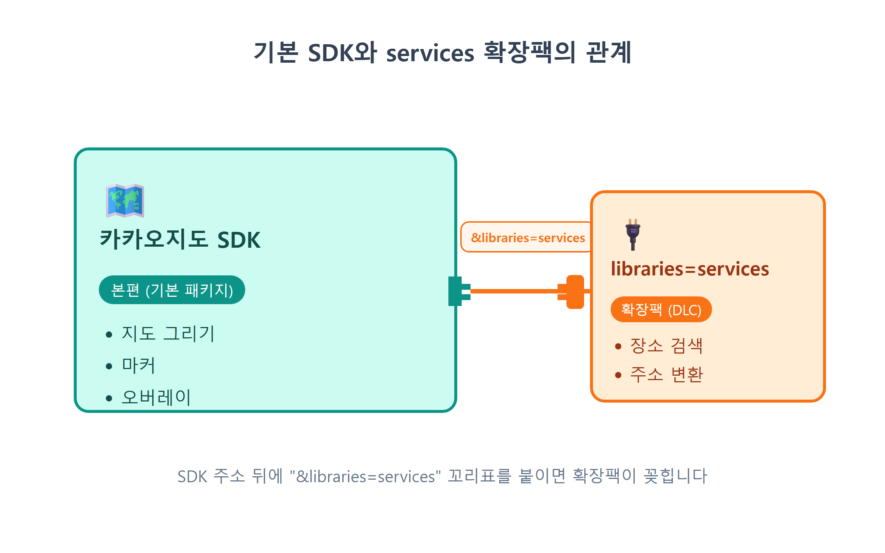
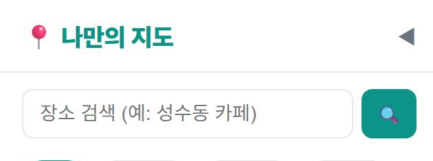
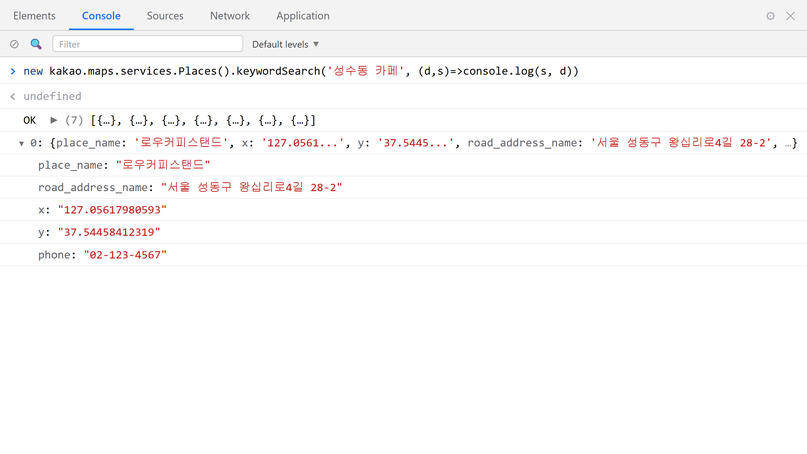
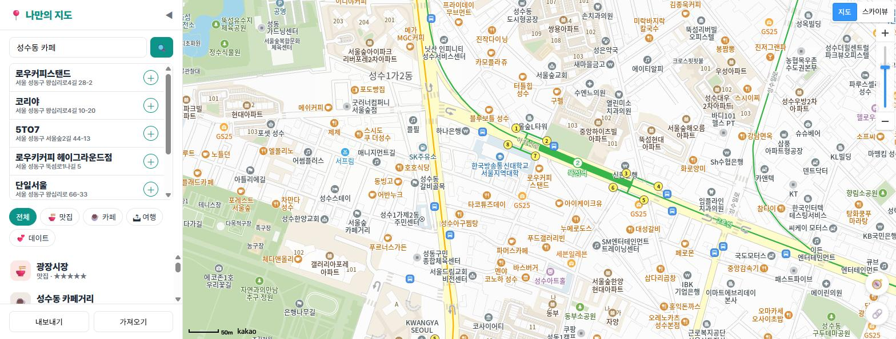
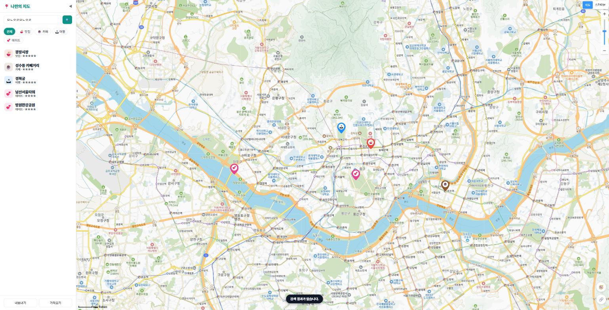

# 15장 키워드 장소 검색

!!! note "이 장에서 배우는 것"
    - SDK 주소에 `&libraries=services`를 붙여 services 라이브러리를 로드합니다
    - `kakao.maps.services.Places` 객체와 `keywordSearch` 메서드로 장소를 검색합니다
    - 콜백 함수와 `Status.OK`로 비동기 응답을 처리하는 법을 배웁니다
    - 검색 결과 상위 7개를 사이드바 목록으로 렌더링합니다
    - 결과를 클릭하면 `panTo`로 지도를 그 장소까지 부드럽게 옮깁니다

---

14장까지 진행하면서 지도에 마커를 표시하고 말풍선을 열어 보며, 카테고리 버튼으로 맛집만 선택하는 기능까지 구현하였습니다. 그런데 사용하다 보면 불편한 점이 하나 있을 것입니다. 새로운 장소를 등록하려면 좌표를 먼저 알아야 한다는 점입니다. 12장에서 카카오맵을 우클릭하여 위도와 경도를 복사하는 방법을 배웠으나, 매번 그렇게 하는 것은 번거로운 일입니다. 친구가 "성수동에 괜찮은 카페 있던데"이라고 말하면 우리는 카페 이름은 알 수 있지만 좌표는 알 수 없습니다.

카카오맵 앱은 이 문제를 이미 해결하고 있습니다. 검색창에 "성수동 카페"라고 입력하면 후보 목록이 나타나고, 원하는 장소를 선택하면 지도가 해당 위치로 이동합니다. 사용자가 일일이 좌표를 알 필요가 없다는 뜻입니다. 카카오에서는 이 검색 기능을 외부 개발자에게도 제공하고 있습니다. 이번 장에서는 이 기능을 활용하여 우리 앱에 키워드 기반 장소 검색 기능을 추가해 보겠습니다. 검색창에 키워드를 입력하면 카카오의 장소 데이터베이스에서 검색 결과를 반환하고, 결과를 클릭하면 지도가 해당 위치로 이동하는 방식입니다.

## 15.1 services 라이브러리: 지도 SDK의 확장팩

본격적인 작업에 앞서 한 가지 짚고 넘어가겠습니다. 9장에서 불러온 카카오지도 SDK는 지도를 그리는 역할만 담당합니다. 지도 타일을 내려받아 화면에 표시하고, 마커를 표시하며, 오버레이를 보여주는 작업이 기본 SDK의 역할입니다. 즉, 장소 검색이나 주소를 좌표로 변환하는 기능은 기본 패키지에 포함되어 있지 않습니다.

검색 기능은 별도로 불러오는 추가 라이브러리에 포함되어 있습니다. 카카오에서는 이 라이브러리에 `services`라는 이름을 부여하였습니다. 라이브러리를 불러오는 방법은 비교적 간단합니다. SDK를 불러오는 주소 뒤에 `&libraries=services`를 추가하면 됩니다. 처음부터 함께 제공하지 않는 데에는 이유가 있습니다. 검색 기능을 사용하지 않는 앱까지 해당 코드를 내려받게 되면 불필요하게 파일 용량만 커지기 때문입니다.

{ width="760" }
/// caption
그림 15.1 — 기본 SDK와 services 확장팩의 관계
///

우리 앱에서 SDK 주소를 설정하는 부분은 9장에서 작성한 `src/loader.js` 하나뿐입니다. SDK 로드를 단일 위치에서 관리한 덕분에 수정해야 할 파일도 하나로 간소화됩니다. 이제 Claude Code에게 요청하여 수정해 보겠습니다.

!!! tip "이렇게 물어보세요"
    > src/loader.js에서 카카오 SDK 주소에 &libraries=services를 추가해줘. 다음 기능으로 장소 키워드 검색을 만들 거야. 다른 부분은 건드리지 마.

Claude Code가 수정한 `loader.js`의 내용을 살펴보겠습니다. 단 한 줄만 변경된 것을 확인할 수 있습니다.

```js
// src/loader.js — 카카오 지도 SDK를 동적으로 불러오는 모듈
export function loadKakaoSdk() {
  return new Promise((resolve, reject) => {
    const key = import.meta.env.VITE_KAKAO_JS_KEY;
    if (!key) {
      reject(new Error('VITE_KAKAO_JS_KEY가 .env에 없습니다.'));
      return;
    }
    const script = document.createElement('script');
    script.src =
      `https://dapi.kakao.com/v2/maps/sdk.js?appkey=${key}` +
      `&autoload=false&libraries=services`;   // ← 확장팩 추가!
    script.onload = () => kakao.maps.load(() => resolve(kakao));
    script.onerror = () => reject(new Error('카카오 SDK 로드 실패 — 키/도메인 확인'));
    document.head.appendChild(script);
  });
}
```

주소의 물음표 기호(`?`) 뒤에는 `이름=값` 형태의 쌍을 `&`로 연결한 쿼리 문자열이 위치합니다. `appkey`를 통해 애플리케이션 정보를 식별하고, `autoload=false`를 통해 "준비되면 내가 직접 시작하겠다"임을 명시하며(9장 참고), 마지막으로 `libraries=services`를 통해 "검색 확장팩도 같이 주세요" 기능을 요청하는 구조입니다. 만약 여러 개의 확장 기능이 필요하다면 쉼표로 구분하여 `libraries=services,clusterer`과 같이 작성하면 됩니다. 실제로 22장에서 마커 클러스터러 기능을 추가할 때 이 방식을 사용하게 될 것입니다.

정상적으로 적용되었는지 확인해 보겠습니다. 개발 서버(`npm run dev`)가 실행 중인 상태에서 브라우저를 새로고침하고, F12 키를 눌러 개발자 도구 콘솔을 연 후 아래 내용을 입력해 보십시오.

```js
kakao.maps.services
```

`{Places: ƒ, Geocoder: ƒ, Status: {…}, ...}`와 같은 객체가 반환되면 라이브러리가 정상적으로 불러와진 것입니다. 만약 라이브러리를 추가하기 전이었다면 `undefined`가 표시되었을 것입니다. 이 객체 내부에 이번 장에서 사용하게 될 `Places`가 포함되어 있습니다.

!!! warning "주의"
`&libraries=services`를 추가하였음에도 `kakao.maps.services`의 값이 `undefined`라면, 브라우저가 이전 스크립트 내용을 캐시하고 있을 가능성이 높습니다. Ctrl+Shift+R 키를 눌러 강제 새로고침을 시도해 보십시오. 이후에도 문제가 지속되면 `libraries`의 철자가 정확한지, `&`를 빠뜨리지 않았는지 `loader.js`에서 다시 확인해 보는 것이 좋습니다.

## 15.2 검색창 UI 만들기

검색 기능을 구현하기 전에 사용자가 검색어를 입력할 검색창부터 준비하여야 합니다. 14장에서 제작한 필터 버튼 상단, 즉 사이드바 제목 바로 아래에 배치하는 것이 적절할 것입니다. 입력창과 검색 버튼으로 구성된 검색창과, 그 아래에 검색 결과가 표시될 `ul` 목록을 추가하도록 요청해 보겠습니다.

!!! tip "이렇게 물어보세요"
    > index.html 사이드바 제목 아래에 장소 검색 UI를 추가해줘. 텍스트 입력칸과 🔍 버튼을 한 줄로 놓고, 그 아래에 검색 결과 목록 ul을 만들어줘. 입력칸 id는 search-input, 플레이스홀더는 "장소 검색 (예: 성수동 카페)", 버튼 id는 btn-search, 목록 id는 search-results로 해줘. 결과 목록은 평소에 hidden으로 숨겨두고, style.css에 어울리는 스타일도 넣어줘.

아래는 Claude Code가 `index.html`의 사이드바 영역에 추가한 마크업 내용입니다.

```html
<div id="search-box">
  <input id="search-input" type="text" placeholder="장소 검색 (예: 성수동 카페)" />
  <button id="btn-search">🔍</button>
</div>
<ul id="search-results" hidden></ul>
```

구조는 복잡하지 않습니다. `search-box` 내부에 입력창과 버튼이 나란히 배치되어 있으며, 결과 목록 `search-results`는 `hidden` 속성으로 인해 평상시에는 화면에 보이지 않습니다. 검색 결과가 생성되는 시점에 자바스크립트로 `hidden`을 조절하여 화면에 표시하는 원리입니다. 13장에서 말풍선을 필요한 경우에만 표시하였던 것과 동일한 방식입니다. 즉, 화면 요소가 상태에 따라 동적으로 나타나거나 사라지는 구조입니다.

스타일 관련 내용은 `style.css`에 함께 포함되어 있습니다. 주요 부분만 간추려 설명하겠습니다.

```css
#search-box { display: flex; gap: 6px; padding: 12px 16px 6px; }
#search-input {
  flex: 1; padding: 9px 12px; border: 1px solid var(--line); border-radius: 8px; font-size: 14px;
}
#btn-search { border: none; background: var(--brand); color: #fff; border-radius: 8px; width: 40px; cursor: pointer; }

#search-results {
  list-style: none; margin: 4px 16px; border: 1px solid var(--line); border-radius: 8px;
  max-height: 240px; overflow-y: auto; background: #fff;
}
.search-item {
  display: flex; align-items: center; justify-content: space-between;
  padding: 8px 10px; border-bottom: 1px solid var(--line); cursor: pointer;
}
.search-item:hover { background: #f0fdfa; }
```

`display: flex`와 `flex: 1`를 조합하여 입력창은 가용한 너비를 모두 차지하도록 하고, 버튼은 40px의 고정 너비를 갖도록 설정하였습니다. 결과 목록에는 `max-height`와 `overflow-y: auto` 속성을 적용하였습니다. 이를 통해 검색 결과가 많더라도 목록 영역이 사이드바를 밀어내지 않고, 내부에서만 스크롤되어 표시됩니다.

{ width="420" }
/// caption
그림 15.2 — 사이드바 상단에 추가된 검색창
///

브라우저를 새로고침하여 검색창이 올바른 위치에 표시되는지 확인해 보십시오. 현재 상태에서는 버튼을 눌러도 아무런 반응이 없을 것입니다. 실제 검색을 처리하는 로직을 아직 추가하지 않았기 때문입니다.

## 15.3 Places.keywordSearch: 카카오에게 물어보기

이제 검색 기능을 구현해 보겠습니다. services 라이브러리에서는 `kakao.maps.services.Places`를 사용하여 장소 정보를 다룹니다. 장소 정보를 관리하는 객체이며, 그중 `keywordSearch` 메서드를 호출하여 검색을 수행하는 방식입니다. 사용 방법을 자세히 살펴보겠습니다.

```js
const ps = new kakao.maps.services.Places();
ps.keywordSearch('성수동 카페', (data, status) => {
  // 응답이 도착하면 여기가 실행된다
});
```

첫 번째 인자에는 검색어를 전달합니다. 두 번째 인자는 다소 생소할 수 있는데, 단순한 값이 아니라 함수 자체를 전달하는 방식입니다. 이와 같은 함수를 콜백(callback)[^1]이라고 부릅니다. 왜 이런 구조로 설계되었는지 알아보겠습니다.

`keywordSearch`를 호출하는 순간, 우리 코드는 인터넷 너머 카카오 서버로 질문을 보냅니다. 답이 돌아오기까지는 짧게는 수십 밀리초, 길게는 몇 초가 걸릴 수 있습니다. 그 시간 동안 브라우저가 하던 일을 전부 멈추고 기다린다면 지도는 얼어붙고 화면은 먹통이 될 겁니다. 그래서 자바스크립트는 기다리지 않습니다. 식당에서 주문하고 진동벨을 받아 자리로 돌아가는 것과 같습니다. "음식(검색 결과)이 나오면 이 벨(콜백 함수)을 울려 주세요" 하고 함수를 맡겨 두고, 브라우저는 하던 일을 계속합니다. 답이 도착하는 순간 카카오 SDK가 우리의 콜백을 호출해 주면서, 첫 번째 인자로 결과 데이터를, 두 번째 인자로 상태 코드를 넣어 줍니다.

먼저 상태 코드에 대해 알아보겠습니다. `status` 변수에 세 가지 값 중 하나가 전달됩니다.

| 상태 | 의미 | 우리의 대응 |
|---|---|---|
| `kakao.maps.services.Status.OK` | 검색 성공, 결과 있음 | 목록을 그린다 |
| `kakao.maps.services.Status.ZERO_RESULT` | 검색은 됐지만 결과 0건 | "결과가 없습니다" 안내 |
| `kakao.maps.services.Status.ERROR` | 통신 오류 등 실패 | 마찬가지로 안내 |

정상적으로 처리된 경우(`OK`)가 아닐 때 검색 결과를 렌더링하려고 하면 코드 오류가 발생할 수 있으므로, 콜백 함수의 첫 부분에서 오류 여부를 확인하는 검사를 수행합니다. 즉, `if (status !== kakao.maps.services.Status.OK) return;`와 같이 성공 상태가 아닌 경우 함수를 종료하도록 작성하는 방식이 일반적입니다. 조건을 중첩하는 대신 예외적인 경우를 먼저 처리하고 종료하는 이 패턴은 이번 내용에서만 사용되는 것이 아닙니다. 앞으로 접하게 될 많은 코드에서 공통적으로 확인할 수 있는 패턴입니다.

그렇다면 정상 응답 시 `data`에는 어떤 정보가 포함될까요? 직접 콘솔에서 확인해 보겠습니다. 개발자 도구 콘솔에 아래 내용을 입력하여 실행해 보십시오.

```js
const ps = new kakao.maps.services.Places();
ps.keywordSearch('성수동 카페', (data, status) => {
  console.log(status, data);
});
```

{ width="760" }
/// caption
그림 15.3 — 콘솔에서 keywordSearch 결과 확인
///

방금 여러분은 카카오맵 검색창이 수행하는 작업을 단 몇 줄의 코드로 구현한 것입니다. 카카오에서 구축한 전국 단위의 장소 데이터베이스에 검색 요청을 보내고 응답을 받아온 과정입니다. 이처럼 API를 활용하면 다른 서비스에서 이미 구축한 기능을 직접 개발하지 않고도 활용할 수 있습니다.

`data`에는 장소 정보 객체가 배열 형태로 포함되어 있습니다. 개별 항목을 펼쳐 보면 다음과 같은 필드 정보를 확인할 수 있습니다.

- `place_name` — 장소 이름 (예: "어니언 성수")
- `road_address_name` — 도로명 주소. 없는 곳도 있으니 지번 주소 `address_name`이 예비로 따라옵니다
- `x` — 경도(lng), `y` — 위도(lat)
- 그 밖에 전화번호(`phone`), 카테고리, 카카오맵 상세 페이지 링크(`place_url`) 등

여기서 주의할 점이 한 가지 있습니다. `x`에 경도 값이 저장되고, `y`에 위도 값이 저장된다는 점입니다. 우리는 지금까지 `LatLng(위도, 경도)`와 같이 위도를 먼저 작성하여 왔으나, 검색 결과는 좌표평면 체계에 따라 가로축 값인 경도를 x에, 세로축 값인 위도를 y에 할당하여 반환합니다. 또한 이 값들은 숫자 형식이 아니라 `"127.0447"`와 같은 문자열 형식으로 전달되므로, 그대로 연산에 사용하면 예기치 않은 오류가 발생할 수 있습니다. 따라서 `Number()`로 감싸 숫자 형식으로 변환하여 사용하는 것이 좋습니다. 이 부분은 이후 코드에서 실제로 처리하는 과정을 함께 살펴보겠습니다.

!!! tip "팁"
검색어와 함께 지역명을 함께 입력하면 검색 결과의 정확도를 크게 높일 수 있습니다. 예를 들어 "카페"보다는 "성수동 카페"가, "국밥"보다는 "부산 서면 국밥"가 더 정확한 결과를 반환합니다. `keywordSearch` 함수는 옵션 인자를 통해 "지도 중심 근처 우선"와 같은 조건을 추가로 지정할 수도 있으며, 보다 자세한 내용은 관련 문서의 장소 검색 확장 키워드 부분을 참고하기 바랍니다.

## 15.4 검색 모듈 만들기: 상위 7개만 보여 주기

작동 원리를 확인하였으므로 이제 정식 모듈로 제작하겠습니다. 그에 앞서 한 가지 준비 작업이 필요합니다. 앞서 살펴본 바와 같이 검색 기능은 실패할 수도 있습니다. 검색 결과가 존재하지 않을 경우 사용자에게 안내할 방법이 필요한데, 현재 앱에는 그러한 알림 기능이 마련되어 있지 않습니다. 물론 `alert()`를 사용할 수도 있지만 화면을 가로막는 방식이므로 사용성이 떨어집니다. 최근 앱에서는 화면 하단에 잠시 나타났다가 사라지는 형태의 알림을 주로 사용합니다. 이런 형태의 알림을 토스트(toast)라고 부릅니다. 토스트 알림은 검색 기능 외에도 여러 기능에서 공통으로 사용할 것이므로, 사이드바 모듈에 공통 컴포넌트로 미리 구축해 두고 필요한 곳에서 활용하도록 하겠습니다.

!!! tip "이렇게 물어보세요"
    > 화면 하단 중앙에 잠깐 떴다 사라지는 토스트 알림을 만들어줘. index.html에 빈 div(id=toast, hidden)를 두고, sidebar.js에서 toast(msg) 함수를 export 해줘. 메시지를 넣고 hidden을 풀었다가 2초쯤 뒤에 다시 숨기면 되는데, 연달아 호출해도 타이머가 꼬이지 않게 해줘. style.css에 까만 알약 모양 스타일도 추가해줘. 앞으로 여러 기능이 공용으로 쓸 알림이야.

Claude Code가 관련 코드를 세 파일에 나누어 작성하였습니다. 먼저 `index.html`의 `</body>` 위치 근처에 알림을 표시할 영역을 추가합니다.

```html
<div id="toast" hidden></div>
```

`sidebar.js`에는 알림 영역에 메시지를 표시하고 숨기는 함수를 정의합니다.

```js
// src/sidebar.js — 공용 토스트 알림
let toastTimer;
export function toast(msg) {
  const el = document.getElementById('toast');
  el.textContent = msg;
  el.hidden = false;
  clearTimeout(toastTimer);
  toastTimer = setTimeout(() => (el.hidden = true), 2200);
}
```

코드는 간단하지만 주목할 만한 부분이 두 군데 있습니다. 첫째, 메시지를 삽입할 때 `innerHTML` 대신 `textContent`를 사용한다는 점입니다. 알림 내용에 HTML 형식이 필요하지 않으므로, 텍스트 내용을 안전하게 처리하는 방식을 선택한 것입니다. 둘째, `setTimeout`를 통해 2.2초 후에 알림이 자동으로 사라지도록 설정하고, 그 전에 `clearTimeout(toastTimer)`로 이전에 예약된 타이머를 취소한다는 점입니다. 이 처리가 없으면 알림을 연달아 표시할 때, 첫 번째 알림의 타이머가 두 번째 알림을 조기에 숨기는 오류가 발생할 수 있습니다. 또한 알림의 시각적 스타일은 `style.css`으로 지정합니다.

```css
#toast {
  position: fixed; bottom: 28px; left: 50%; transform: translateX(-50%);
  background: #111827; color: #fff; padding: 10px 18px; border-radius: 999px;
  font-size: 14px; z-index: 60; box-shadow: 0 4px 12px rgb(0 0 0 / 0.3);
}
```

`position: fixed`와 `left: 50%; transform: translateX(-50%)` 속성은 요소를 화면 가로 방향 중앙에 배치하는 흔히 사용되는 방식이며, `border-radius: 999px`는 14장에서 필터 버튼에 적용하였던 것과 동일한 스타일을 적용한 것입니다. `toast` 함수는 모듈 내부에 정의된 함수이므로 콘솔에서 직접 호출할 수는 없지만, 이후 검색 모듈과 연결하면 동작 여부를 쉽게 확인할 수 있습니다.

준비가 완료되었으므로 이제 검색 기능을 구현한 모듈을 제작하겠습니다. 앱의 구조에 따라 검색 기능도 별도 파일로 분리하여 관리하며, 파일 이름은 `src/search.js`로 정하겠습니다. 이제 Claude Code에게 구현 요구 사항을 상세하게 설명하여 제작을 요청해 보겠습니다. 요청 내용이 비교적 길지만, 4장에서 배운 맥락·목표·제약 사항·출력 형식의 네 가지 요소를 모두 포함한 내용입니다.

!!! tip "이렇게 물어보세요"
    > src/search.js를 새로 만들어줘. initSearch 함수를 export하고, 그 안에서 kakao.maps.services.Places로 키워드 검색을 구현해줘. 🔍 버튼 클릭이나 Enter 키로 검색을 실행하고, Status.OK가 아니면 toast로 "검색 결과가 없습니다."를 띄우고 목록을 숨겨줘. 성공하면 상위 7개만 #search-results에 이름+주소로 렌더링하고, 항목을 클릭하면 지도를 레벨 3으로 확대해서 그 좌표로 panTo 해줘. x가 경도, y가 위도인 것과 문자열이라는 점을 주의해줘. 만든 initSearch는 main.js에서 호출해줘.

요청 내용을 다시 살펴보십시오. "어떻게 짜라"에는 구체적인 코드에 대한 언급은 전혀 포함하지 않았습니다. 상위 7개 결과만 표시, Enter 키 지원, 실패 시 안내 메시지 표시, 좌표 순서 유의 사항 등 구현에 필요한 요구 사항만 명확하게 기술하였습니다. 바이브코딩 방식에서 우리가 수행할 역할은 코드를 직접 작성하는 것이 아니라, 무엇을 구현할 것인지 정확하게 정의하는 것입니다. 요구 사항을 정확하게 전달할수록 원하는 결과물을 얻을 수 있습니다. 특히 "x가 경도, y가 위도"와 같이 미리 파악하고 있는 주의점을 함께 명시하면, AI가 흔히 할 수 있는 실수를 미리 줄일 수 있습니다.

이제 Claude Code가 제작한 `src/search.js`의 내용을 살펴보겠습니다. 전체적인 코드의 양이 많아 보이므로, 검색 요청을 처리하는 부분부터 나누어 확인하겠습니다.

```js
// src/search.js — 키워드 장소 검색 (kakao.maps.services.Places)
import { escapeHtml, getMap } from './mapView.js';
import { toast } from './sidebar.js';

let ps;

export function initSearch() {
  ps = new kakao.maps.services.Places();
  const input = document.getElementById('search-input');
  const btn = document.getElementById('btn-search');
  const resultsEl = document.getElementById('search-results');

  const run = () => {
    const q = input.value.trim();
    if (!q) {
      resultsEl.hidden = true; // 빈 검색어면 이전 결과를 닫는다
      return;
    }
    ps.keywordSearch(q, (data, status) => {
      if (status !== kakao.maps.services.Status.OK) {
        toast('검색 결과가 없습니다.');
        resultsEl.hidden = true;
        return;
      }
      renderResults(data.slice(0, 7));
    });
  };

  btn.addEventListener('click', run);
  input.addEventListener('keydown', (e) => {
    if (e.key === 'Enter') run();
  });
```

위쪽부터 순서대로 살펴보겠습니다.

`run` 함수는 검색 요청 한 차례의 전체 흐름을 정리한 부분입니다. 검색 버튼 클릭과 Enter 키 입력 두 가지 경우에 동일한 동작을 수행하므로, 공통 로직을 함수로 분리하여 재사용하는 구조입니다. `input.value.trim()`를 통해 입력값의 앞뒤 공백을 제거한 후, 내용이 빈 경우 서버에 요청하지 않고 함수를 종료합니다. 빈 검색어로는 유효한 결과를 얻을 수 없기 때문입니다. 이때 그냥 종료하지 않고 `resultsEl.hidden = true`를 통해 이전에 표시되었던 검색 결과 목록을 먼저 숨기는 것이 중요합니다. 이 부분이 없으면 사용자가 검색어를 지우고 Enter 키를 눌러도 이전 검색 결과가 화면에 사라지지 않게 됩니다. 따라서 검색창의 내용이 비었을 때는 결과 목록도 함께 숨기는 것이 사용자 경험에 적절합니다.

다음은 콜백 함수 내부의 오류 처리 부분입니다. 앞서 살펴본 방식에 따라 상태를 확인합니다. 정상 응답이 아닌 경우 `Status.OK`의 값을 확인하여 사용자에게 `toast`로 알리고, 이전 검색 결과가 표시되어 있다면 `resultsEl.hidden = true`로 숨깁니다. 이때 `toast`는 앞서 사이드바 모듈에 구현한 토스트 알림 함수입니다. 파일 상단에서 `import { toast } from './sidebar.js';` 구문으로 미리 가져와 사용하는 구조입니다. 이처럼 공통으로 사용할 기능을 미리 분리하여 구축해 두면, 여러 곳에서 재사용할 수 있어 편리합니다.

!!! tip "팁"
지금 문지기는 `ZERO_RESULT`(결과 0건)와 `ERROR`(통신 오류)를 구분하지 않고 둘 다 "검색 결과가 없습니다."라는 한 가지 토스트로 처리합니다. 코드는 단순해지지만, 서버나 네트워크에 문제가 생긴 날에도 사용자에게는 그냥 "결과 없음"으로 보입니다. 그래서 "분명 있어야 할 검색어인데 결과가 없다"는 이상한 상황을 만나면 토스트만 믿지 말고 콘솔부터 열어 보는 습관을 들이세요. 콜백에서 `status` 값을 `console.log`로 찍어 보면 결과가 없는 것인지, 통신이 실패한 것인지 바로 구분할 수 있습니다. 두 경우의 안내 문구를 나누는 개선은 확인 문제에서 직접 해 봅니다.

`data.slice(0, 7)` 부분입니다. 카카오 검색 API는 한 번에 최대 15개의 결과를 반환합니다. 모든 결과를 그대로 표시하면 좁은 사이드바 공간이 검색 결과로 가득 차, 기존에 보관하던 장소 목록이 보이지 않게 될 수 있습니다. 따라서 `slice(0, 7)`에서는 배열의 0번 인덱스부터 7번 인덱스 직전까지, 즉 상위 7개의 결과만 추출하여 새로운 배열을 구성합니다. 검색 결과는 관련도가 높은 순서대로 정렬되어 반환되므로, 대부분의 경우 상위 7개 내에서 원하는 장소를 찾을 수 있습니다. 불필요한 정보를 줄이고 핵심 결과만 보여 주는 것이 사용 편의성을 높이는 방식입니다.

Enter 키 처리. 사용자는 검색창에서 자연스럽게 Enter를 누릅니다. `keydown` 이벤트에서 `e.key === 'Enter'`를 확인해 같은 `run`을 부릅니다. 이 세 줄이 없으면 사용자는 "왜 엔터가 안 먹지?"라며 어리둥절해하겠지요.

이어서 검색 결과를 화면에 표시하는 `renderResults` 함수의 내용입니다. `initSearch` 내부에 함께 작성된 구조입니다.

```js
  function renderResults(items) {
    resultsEl.hidden = false;
    resultsEl.innerHTML = items
      .map(
        (item, i) => `
        <li class="search-item" data-i="${i}">
          <span class="search-info">
            <strong>${escapeHtml(item.place_name)}</strong>
            <small>${escapeHtml(item.road_address_name || item.address_name || '')}</small>
          </span>
        </li>`
      )
      .join('');
```

`hidden`을 풀어 목록을 드러낸 다음, 12장 데이터 렌더링에서 익힌 '배열 → HTML 문자열' 패턴을 그대로 씁니다. `items.map(...)`으로 항목 하나하나를 `<li>` 문자열로 바꾸고 `join('')`으로 이어 붙여 `innerHTML`에 한 번에 꽂습니다. 주소는 `item.road_address_name || item.address_name || ''`처럼 OR 사슬로 골랐습니다. 도로명 주소가 있으면 그것을, 없으면 지번 주소를, 그마저 없으면 빈 문자열을 쓰라는 뜻입니다. 각 `<li>`에는 `data-i="${i}"`로 자기 번호표를 달아 두었습니다. 잠시 뒤 클릭한 항목이 몇 번째인지 알아낼 때 씁니다.

`escapeHtml`이라는 낯선 함수가 보이나요? 바깥에서 온 문자열(장소 이름·주소)을 `innerHTML`에 넣을 때 특수문자를 무해하게 바꿔 주는 안전장치입니다. 지금은 "외부 데이터를 HTML에 넣을 때는 이 함수를 씌운다"고만 기억해 두세요. 왜 필요한지, 안 쓰면 무슨 일이 벌어지는지는 19장에서 XSS라는 이름과 함께 제대로 배웁니다.

{ width="760" }
/// caption
그림 15.4 — "성수동 카페" 검색 결과 상위 7개
///

## 15.5 결과 클릭 → panTo로 지도 이동

검색 결과 목록이 정상적으로 표시된다면, 이제 마지막 기능을 추가할 차례입니다. 사용자가 결과 항목을 클릭하면 해당 장소로 지도가 이동하도록 하는 기능입니다. 아래 내용은 앞서 작성한 `renderResults`의 나머지 부분입니다.

```js
    resultsEl.querySelectorAll('.search-item').forEach((li) => {
      const item = items[Number(li.dataset.i)];
      const lat = Number(item.y);   // y가 위도!
      const lng = Number(item.x);   // x가 경도!
      // 결과 클릭 → 지도 이동
      li.addEventListener('click', () => {
        getMap().setLevel(3);
        getMap().panTo(new kakao.maps.LatLng(lat, lng));
      });
    });
  }
}
```

방금 그린 `<li>`를 `querySelectorAll`로 다시 모아 하나씩 클릭 리스너를 붙입니다. `li.dataset.i`에 저장해 둔 번호를 읽으면 이 `<li>`가 `items` 배열의 몇 번째 장소인지 알 수 있습니다. 15.3절에서 설명한 좌표 변환도 여기서 합니다. `Number(item.y)`가 위도, `Number(item.x)`가 경도입니다. 문자열을 숫자로 바꾸면서 x와 y를 lat과 lng로 옮기는 두 줄입니다. 이 두 줄은 순서를 바꾸면 안 됩니다. 바꾸는 순간 성수동을 검색해도 지도가 서해 바다로 이동합니다.

클릭 이벤트에 연결되는 함수의 내부 로직은 두 줄로 구성됩니다. 먼저 `setLevel(3)`를 통해 지도를 적절한 확대 수준으로 조절한 후, `panTo`를 사용하여 해당 좌표로 지도를 이동시킵니다. 10장에서 설명한 바와 같이 `setCenter`와 `panTo`는 동작 방식에 차이가 있습니다. `setCenter`는 즉시 위치를 변경하는 반면, `panTo`는 이동하는 과정을 시각적으로 보여줍니다. 검색 결과를 통해 위치를 이동할 때는 `panTo`를 사용하는 것이 적절합니다. 지도가 이동하는 과정을 보여주어 사용자가 현재 위치에서 어디로 이동하는지 직관적으로 이해할 수 있기 때문입니다. 이때 확대 수준을 `setLevel`로 먼저 조절하고 위치를 이동하는 순서도 의도한 것입니다. 확대를 먼저 진행한 후 위치를 이동해야, 도착한 지점을 화면 중앙에서 크고 선명하게 확인할 수 있습니다.

마지막으로 이렇게 제작한 검색 모듈을 앱 전체에 연결하는 작업을 진행합니다. Claude Code가 `main.js` 파일에 두 줄의 코드를 추가하였습니다.

```js
import { initSearch } from './search.js';
// ... 지도 생성 뒤
initSearch();
```

이제 전체 기능이 정상적으로 작동하는지 최종 확인해 보겠습니다. 브라우저를 새로고침한 후, 검색어를 입력하고 결과를 선택하는 과정을 차례로 진행해 보십시오.

1. 검색창에 '성수동 카페'를 입력하고 Enter: 결과 7개가 목록으로 나타납니다.
2. 마음에 드는 항목을 클릭: 지도가 확대되며 그 카페 위치로 스르륵 이동합니다.
3. 이번에는 'ㅁㄴㅇㄹ' 같은 엉터리 검색어로 검색: 화면 아래에 "검색 결과가 없습니다." 토스트가 뜨고 목록은 사라집니다.

{ width="760" }
/// caption
그림 15.5 — 결과 클릭 후 레벨 3으로 확대 이동한 지도
///

{ width="760" }
/// caption
그림 15.6 — 결과가 없을 때의 토스트 알림
///

결과 목록은 뜨는데 클릭해도 지도가 움직이지 않는다면, 콘솔에 빨간 에러가 있는지부터 확인하세요. `getMap is not a function` 같은 에러라면 `mapView.js`에서 `getMap`을 export하는지 봅니다. `Cannot read properties of undefined` 같은 에러라면 `initSearch()`를 지도 생성 이후에 호출하는지 확인합니다. 에러 메시지를 그대로 복사해 Claude Code에게 붙여 넣고 고쳐 달라고 시켜도 됩니다.

위에서 설명한 세 가지 흐름이 모두 정상적으로 동작한다면 이번 장의 학습 목표를 모두 달성한 것입니다. 한 가지 아쉬운 점이 있을 것입니다. 검색으로 찾은 장소를 내 지도에 저장하고 싶다는 점입니다. 현재 상태에서는 지도가 이동할 뿐 마커가 생성되거나 장소 정보가 저장되지 않습니다. 이것은 의도적으로 다음 장으로 미룬 과제입니다. 바로 다음 장에서 검색 결과 항목 옆에 추가 버튼을 배치하여 이 기능을 해결하도록 하겠습니다.

!!! info "REST API 검색과는 뭐가 다를까"
카카오 개발자 문서를 살펴보면, 동일하게 키워드로 장소를 검색하는 "로컬 API(REST)" 방식도 확인할 수 있습니다. 이 방식은 `dapi.kakao.com/v2/local/...` 주소로 직접 요청을 전송하고, REST API 키를 요청 헤더에 포함하여 인증을 처리하는 방식으로, 주로 서버 측 프로그램에서 사용됩니다. 반면 우리가 사용한 `services` 라이브러리는 해당 API를 브라우저 환경에서 쉽게 사용할 수 있도록 편리하게 감싼 형태입니다. JavaScript 키 하나로 인증 절차를 간소화하고, 응답 결과도 바로 사용하기 쉬운 형태로 반환받을 수 있습니다. 따라서 현재와 같이 브라우저에서 동작하는 클라이언트 앱에는 이번에 적용한 방식이 더욱 적합합니다. 이후 백엔드 서버를 개발하게 되면 그때 REST API 방식을 다시 살펴보도록 하겠습니다.

## 15.6 마무리

!!! abstract "이 장의 핵심"
    - 장소 검색은 기본 SDK가 아닌 services 확장 라이브러리의 기능이며, SDK 주소에 `&libraries=services`를 붙여 로드합니다.
    - `new kakao.maps.services.Places()`의 `keywordSearch(검색어, 콜백)`으로 검색합니다. 응답은 기다리지 않고 콜백 함수로 받습니다.
    - 콜백 첫 줄에서 `status !== kakao.maps.services.Status.OK`이면 빠져나가는 문지기 검사를 합니다.
    - 검색 결과의 `x`는 경도, `y`는 위도이고 둘 다 문자열이므로 `Number()`로 변환해 `LatLng(lat, lng)` 순서로 넣습니다.
    - `data.slice(0, 7)`로 상위 7개만 렌더링하고, 항목 클릭 시 `setLevel(3)` 후 `panTo`로 부드럽게 이동합니다.

!!! question "잠깐 생각해 봅시다"
Q1. `keywordSearch`는 왜 결과를 `return`으로 직접 반환하지 않고 콜백 함수를 통해 전달할까요? 본문에서 설명한 진동벨 비유를 떠올리며 자신의 말로 설명해 보십시오.

____________________________________________

____________________________________________

Q2. 검색 결과에서 `x`와 `y`의 값 순서를 바꾸어 `lat = Number(item.x)`와 같이 작성하면 지도는 어디로 이동하게 될까요? 위도 37, 경도 127이라는 값을 기준으로 생각해 보십시오.

____________________________________________

____________________________________________

!!! example "확인 문제"
    1. `data.slice(0, 7)`을 `data.slice(0, 3)`으로 바꿔 결과를 3개만 보여 주도록 Claude Code에게 시켜 보고, 다시 7개로 되돌려 보세요.
    2. 결과 클릭 시 `panTo`를 `setCenter`로 바꿔 실행해 보고, 두 이동 방식의 느낌 차이를 비교한 뒤 원래대로 되돌리세요.
    3. 콘솔에서 `ps.keywordSearch`로 여러분의 학교(또는 회사) 이름을 검색해, 첫 번째 결과의 `place_url` 값을 열어 보세요. 무엇이 나오나요?
    4. 검색창을 비운 채 🔍 버튼을 눌러도 아무 일이 없는 이유를 `run` 함수에서 찾아 한 줄로 적어 보세요.
    5. `Status.ZERO_RESULT`와 `Status.ERROR`를 구분해서, 진짜 오류일 때는 "잠시 후 다시 시도해 주세요."라는 다른 토스트가 뜨도록 Claude Code에게 시켜 보세요. 확인 후 원래대로 되돌려도 좋습니다.

!!! info "더 찾아보기"
    - `categorySearch` — 키워드 대신 "카페", "편의점" 같은 카테고리 코드로 검색하는 Places의 또 다른 메서드.
    - `Geocoder` — 주소↔좌표를 서로 변환해 주는 services 라이브러리의 다른 도구. "주소로 검색" 기능을 만들 때 씁니다.
    - `Pagination` — keywordSearch 콜백의 세 번째 인자. 15개 넘는 결과를 다음 페이지로 넘겨 받을 수 있습니다.
    - `location · radius 옵션` — keywordSearch에 옵션 객체를 넘겨 "지도 중심 반경 몇 km 안에서만" 검색하도록 좁히는 방법.

> 다음 장으로. 16장에서는 검색한 장소를 내 지도에 저장합니다. 검색 결과마다 ＋ 버튼을 달고, 지도의 빈 곳을 클릭해도 같은 입력 폼이 열리게 만듭니다. 이름·카테고리·메모를 채워 저장하면 곧바로 마커가 찍힙니다.

[^1]: 콜백(callback) — "다시(back) 불러 달라(call)"는 뜻 그대로, 어떤 작업이 끝났을 때 실행해 달라고 미리 맡겨 두는 함수. 시간이 걸리는 작업(네트워크 요청, 타이머 등)의 결과를 받는 자바스크립트의 대표적인 방법입니다.
