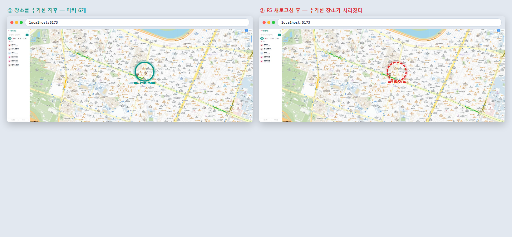
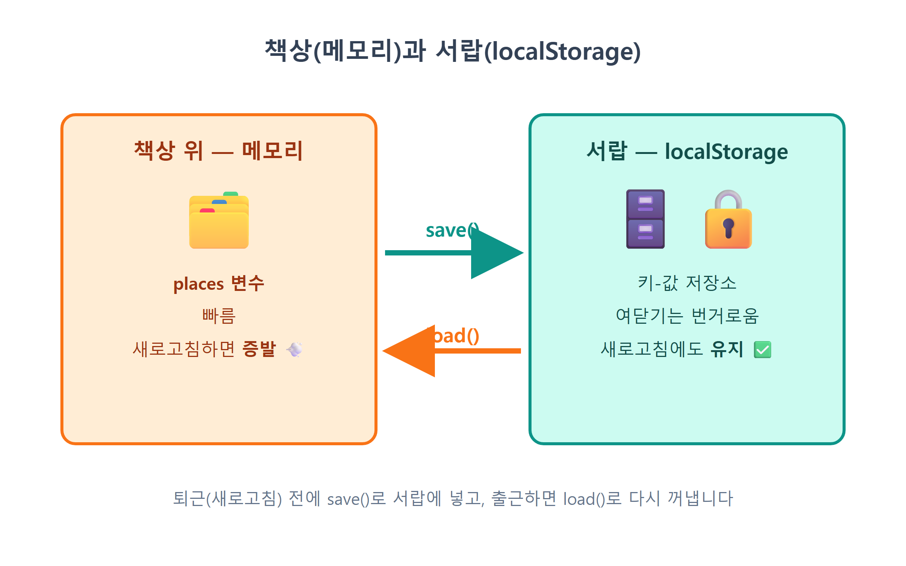
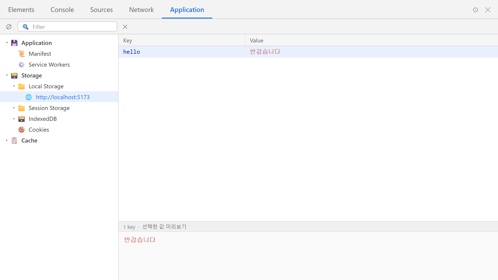
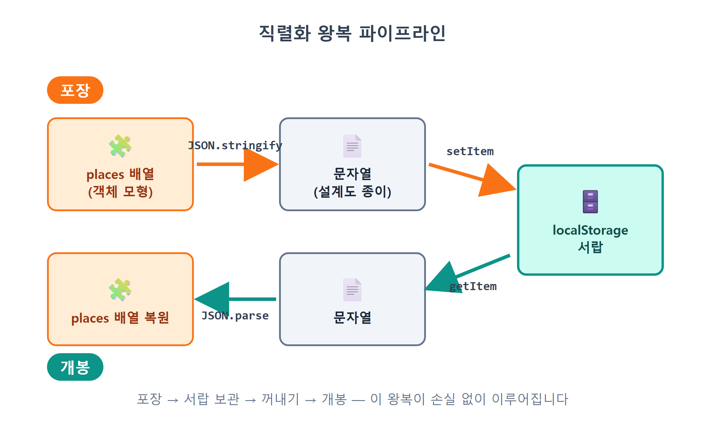
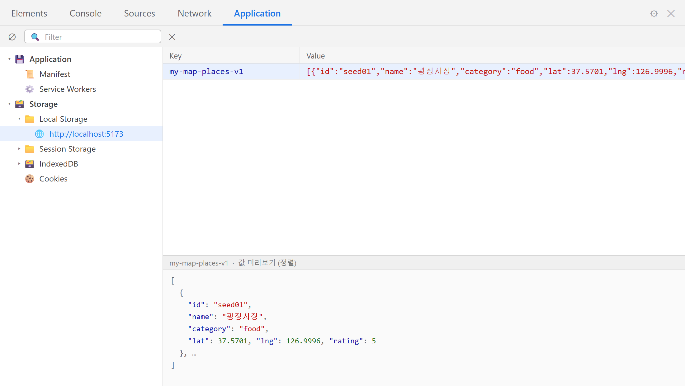
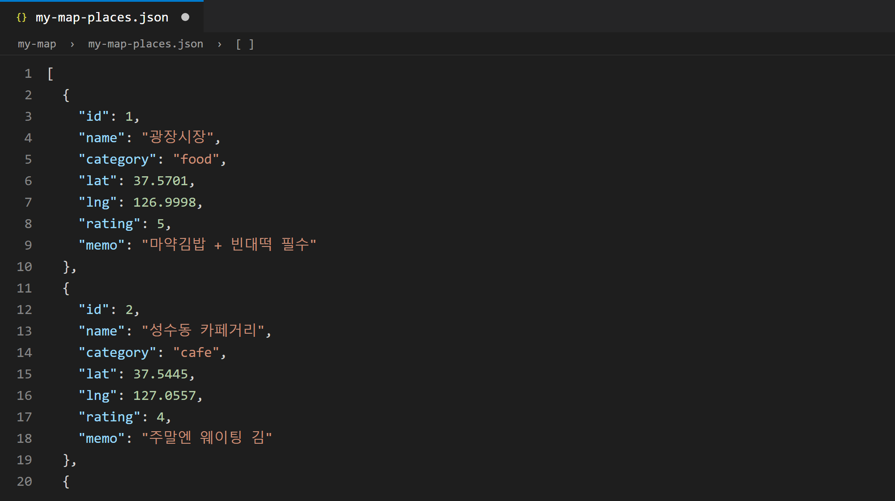
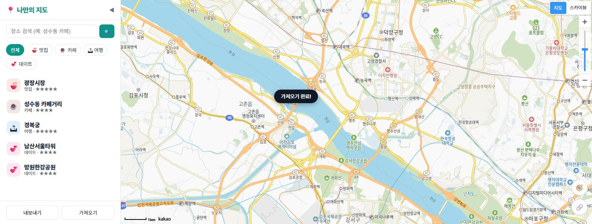

# 17장 localStorage 저장

!!! note "이 장에서 배우는 것"
    - 새로고침 한 번에 장소가 몽땅 사라지는 이유를 메모리와 저장소의 차이로 이해합니다
    - 브라우저에 딸린 키-값 저장소 localStorage의 사용법을 배웁니다
    - 배열을 문자열로 포장하고 다시 푸는 JSON.stringify / JSON.parse를 익힙니다
    - 저장이 실패할 수 있는 상황과 try-catch로 안전하게 감싸는 법을 배웁니다
    - 저장 코드를 save() 한 곳에 모으는 설계와, JSON 내보내기/가져오기 백업 기능을 만듭니다

---

16장에서 우리 앱은 크게 발전하였습니다. 지도를 클릭하거나 검색 결과의 더하기 버튼을 통하여 장소를 추가할 수 있게 되었습니다. 성수동 카페를 검색하여 담고, 지도를 클릭하여 자주 찾는 국밥집도 추가하면 나만의 지도가 알차게 채워졌을 것입니다. 이제 매우 중요한 실험을 하나 진행해 보겠습니다. 장소를 두세 곳 정성껏 추가한 다음, ++f5++ 키를 눌러 새로고침하여 보시기 바랍니다.

방금 추가한 장소가 모두 사라졌습니다. 마커와 목록이 모두 사라지고, 12장에서 미리 추가해 둔 기본 장소만 표시됩니다. 새로고침 한 번으로 작업 내용이 사라지는 앱을 실제로 사용하기는 어렵습니다. 이번 장에서는 이 문제를 해결하겠습니다. 새로고침을 하거나 브라우저를 껐다가 다시 켜거나 컴퓨터를 재부팅하여도 저장한 장소가 그대로 유지되도록 설정할 것입니다. 또한 내 지도를 파일로 내보내고 다시 가져올 수 있는 백업 기능도 함께 구현합니다.

{ width="860" }
/// caption
그림 17.1 — 새로고침 전(왼쪽)과 후(오른쪽): 추가한 장소가 사라진 모습
///

## 17.1 왜 사라질까: 변수는 메모리에만 있다

이제 원인을 파악해 보겠습니다. 현재 장소 데이터는 `store.js` 내의 `places`라는 변수에 배열 형태로 저장되어 있습니다. 16장에서 `store.add()`를 호출하면 이 배열에 새로운 장소가 `push`되고 화면에 마커가 표시되었습니다. 이 부분까지는 정상적으로 작동합니다. 문제는 이 변수가 저장되는 위치에 있습니다.

자바스크립트의 변수는 컴퓨터의 메모리에 저장됩니다. 메모리는 접근 속도가 매우 빠르지만 전원이 꺼지거나 프로그램이 종료되면 내용이 완전히 삭제됩니다. 브라우저에서 프로그램이 종료되는 시점은 바로 새로고침을 실행할 때입니다. 새로고침은 페이지를 단순히 수정하는 것이 아닙니다. 실행 중이던 자바스크립트 코드를 모두 내리고 처음부터 다시 실행하는 과정입니다. `places` 배열도 함께 사라지고, 새로 로드된 환경에서는 `defaultPlaces.js`의 기본 데이터를 기준으로 다시 시작하게 됩니다. 우리가 추가한 장소를 별도의 장소에 기록해 두지 않았으므로 복원할 수 없습니다.

메모리는 프로그램이 실행 중일 때만 데이터를 보관하는 공간입니다. 읽고 쓰는 속도는 빠르지만, 페이지를 새로고침하면 그 안에 저장된 값이 모두 사라집니다. 새로고침 이후에도 유지되어야 하는 값이라면 별도의 장소에 기록해 두어야 합니다. 이처럼 프로그램이 종료되어도 데이터를 보관하는 저장 공간을 영속 저장소[^1]라고 부릅니다. 브라우저는 웹사이트별로 이러한 저장 공간을 하나씩 제공하며, 그 이름이 바로 localStorage입니다.

{ width="760" }
/// caption
그림 17.2 — 메모리와 localStorage의 차이점
///

## 17.2 localStorage: 브라우저가 제공하는 저장 공간

localStorage는 브라우저가 사이트별로 하나씩 할당하는 키-값 형식의 저장소입니다. 키에 이름을 지정하여 값을 저장하고, 나중에 동일한 키를 사용하여 값을 불러올 수 있습니다. 사용 방법은 매우 간단합니다. 직접 확인하는 것이 가장 좋으니, 개발자도구 콘솔(++f12++)에서 직접 실습하여 보시기 바랍니다.

```js
localStorage.setItem('hello', '반갑습니다');  // 저장
localStorage.getItem('hello');                // → '반갑습니다'
```

이제 중요한 실험을 진행해 보겠습니다. 새로고침을 실행한 다음 콘솔에 동일한 명령어를 다시 입력하여 보시기 바랍니다.

```js
localStorage.getItem('hello');   // → '반갑습니다' (살아 있다!)
```

값이 그대로 유지되는 것을 확인할 수 있습니다. 브라우저를 완전히 종료하였다가 다시 실행하여도, 다음 날 접속하여도 값은 그대로 보존될 것입니다. 변수와의 차이점이 바로 이 부분입니다. 개발자도구의 Application 탭 → Local Storage → http://localhost:5173 경로를 열면 방금 저장한 키와 값을 직접 확인할 수 있습니다. 한국어 버전 크롬에서는 탭 이름이 「애플리케이션」으로 표시됩니다. 탭 목록에 해당 항목이 보이지 않는 경우 개발자도구 오른쪽 끝에 위치한 `»` 버튼을 클릭하여 보시기 바랍니다. 앞으로 저장된 값을 확인할 때 이 화면을 자주 사용하게 될 것이므로 위치를 기억해 두시기 바랍니다.

{ width="760" }
/// caption
그림 17.3 — 개발자도구 Application 탭에서 확인한 localStorage
///

localStorage의 주요 특징을 자세히 알아보겠습니다.

- 브라우저는 사이트마다 저장 공간을 따로 둡니다. `localhost:5173`이 저장한 값은 `localhost:5173`에서만 읽을 수 있습니다. 다른 사이트가 우리 저장 공간을 읽지 못하고, 우리도 다른 사이트의 저장 공간을 읽을 수는 없습니다. 이 구분 단위를 오리진(origin)[^2]이라고 부릅니다.
- 용량은 보통 5MB 안팎입니다. 텍스트 데이터라면 넉넉히 담을 수 있습니다. 장소 하나가 200자 정도라면 수만 개도 넣을 수 있습니다. 다만 사진 같은 큰 데이터를 넣을 곳은 아닙니다.
- 그리고 가장 중요한 특징으로, 문자열만 저장할 수 있습니다.

마지막 사항에 관하여는 다음 절에서 해결하겠습니다. 우리가 사용하는 `places`에는 문자열이 아닌 객체가 배열 형태로 저장되어 있습니다. 배열을 그대로 저장하면 어떻게 되는지 콘솔에서 확인하여 보시기 바랍니다.

```js
localStorage.setItem('test', [1, 2, 3]);
localStorage.getItem('test');   // → '1,2,3' ...?!
```

배열이 `'1,2,3'`이라는 문자열 형식으로 변환되어 저장됩니다. 저장하는 시점에 자바스크립트가 배열을 문자열로 자동 변환하기 때문이며, 이 과정에서 배열의 구조 정보가 손실됩니다. 객체의 경우 더욱 심각하여 `'[object Object]'`이라는 문자만 저장됩니다. localStorage에는 문자열 데이터만 저장할 수 있는 반면, 우리가 저장하려는 데이터는 배열과 객체 형식입니다. 따라서 구조를 유지한 채 문자열로 변환하는 방법이 필요합니다.

## 17.3 JSON.stringify와 parse: 문자열로 바꾸고 되돌리기

이러한 변환 과정을 JSON 직렬화라고 부릅니다. 12장에서 장소 데이터 구조를 설계할 때 JSON 형식을 간략하게 언급하였으나, 이번 장에서 자세히 활용하여 보겠습니다. 자바스크립트에서는 이러한 변환 작업을 위한 내장 도구를 두 가지 제공하고 있습니다.

- `JSON.stringify(값)` — 배열·객체를 JSON 문자열로 바꿉니다. (포장)
- `JSON.parse(문자열)` — JSON 문자열을 다시 배열·객체로 되살립니다. (개봉)

콘솔에서 변환과 복원 과정을 직접 실습하여 보시기 바랍니다.

```js
const trip = [{ name: '어니언 성수', lat: 37.5446, lng: 127.0447 }];

const packed = JSON.stringify(trip);
packed;               // → '[{"name":"어니언 성수","lat":37.5446,"lng":127.0447}]'
typeof packed;        // → 'string'  (진짜 문자열!)

const unpacked = JSON.parse(packed);
unpacked[0].name;     // → '어니언 성수'  (완벽하게 복원!)
```

`stringify`가 생성한 결과값은 원본과 유사해 보이지만 실제로는 문자열 형식입니다. 배열과 객체의 구조 정보(중괄호, 대괄호, 따옴표)를 모두 문자열로 변환하여 보관하므로, `parse`가 해당 문자열을 읽어 원래의 배열과 객체 형식으로 완벽하게 복원할 수 있습니다. 데이터의 값이 하나도 손실되지 않는다는 점이 매우 중요합니다. 데이터 변환(`stringify`) → 저장(`setItem`) → 읽기(`getItem`) → 복원(`parse`)의 네 단계를 거치면 어떤 형식의 데이터라도 새로고침 이후에도 유지할 수 있습니다.

{ width="760" }
/// caption
그림 17.4 — 직렬화 및 복원 처리 과정
///

!!! tip "팁"
`JSON.parse`는 문법 검사 기준이 매우 엄격합니다. 따옴표 하나만 누락되어도 JSON 문법 규칙에 위배되어 에러를 발생시키고 작업을 중단합니다. 문제가 있는 데이터를 그대로 반환하는 것보다 에러를 알리는 것이 더 적절하다고 판단하기 때문입니다. 따라서 에러 발생에 대비하는 코드를 함께 작성하여야 하며, 이 작업은 다음 절에서 설명하는 try-catch 구문이 처리할 것입니다.

## 17.4 store.js에 영속화 달기: save()는 한 곳에

기본적인 원리는 모두 설명하였습니다. 이제 이 내용을 우리의 `store.js`에 적용하여 보겠습니다. 구현에 필요한 요구사항을 정리한 다음 Claude Code에게 전체적인 구현을 요청하여 보겠습니다.

!!! tip "이렇게 물어보세요"
    > src/store.js에 localStorage 영속화를 추가해줘. 키 이름은 'my-map-places-v1'로 하고, 시작할 때 저장된 데이터가 있으면 JSON.parse로 불러오고 없거나 깨져 있으면 기본 데이터로 시작해줘. 불러온 값이 배열이 아니거나 항목의 name/lat/lng 형식이 이상하면 그 항목은 걸러내줘. 저장하는 코드는 save() 함수 딱 한 곳에만 두고, 데이터를 바꾸는 모든 메서드 끝에서 save()를 부르게 해줘. 지금은 add뿐이지만 앞으로 쓸 get·update·remove·replaceAll 창구도 이참에 만들어서 같은 규칙을 적용해줘. localStorage는 사생활 모드 같은 데서 실패할 수 있으니 읽기와 쓰기 모두 try-catch로 감싸고, 실패해도 앱이 죽지 않게 해줘.

프롬프트에 포함된 설계 원칙은 세 가지입니다. 키 이름을 별도로 정의하고, 저장 로직을 save() 함수 하나에 통합하며, try-catch 구문을 적용하는 것입니다. 이러한 세부 원칙까지 인공지능이 자동으로 판단하여 적용하지는 않으므로, 우리가 직접 규칙을 정하고 명시하여야 합니다. 먼저 Claude Code가 수정한 `store.js` 파일의 앞부분, 즉 데이터 불러오기와 저장 기능을 담당하는 코드부터 확인하여 보겠습니다.

```js
// src/store.js — 장소 데이터 저장소 (localStorage 영속화)
import { DEFAULT_PLACES } from './defaultPlaces.js';

const STORAGE_KEY = 'my-map-places-v1';
const listeners = [];               // ← 18장의 예고편 (아래 박스 참고)

let places = load();

function load() {
  try {
    const raw = localStorage.getItem(STORAGE_KEY);
    if (raw) {
      const data = JSON.parse(raw);
      if (Array.isArray(data)) return data.map(normalize).filter(Boolean);
    }
  } catch (e) {
    console.warn('저장 데이터를 읽지 못해 기본 데이터로 시작합니다.', e);
  }
  return structuredClone(DEFAULT_PLACES);
}

function save() {
  try {
    localStorage.setItem(STORAGE_KEY, JSON.stringify(places));
  } catch (e) {
    console.warn('localStorage 저장 실패', e);
  }
  listeners.forEach((fn) => fn(places));   // ← 이 줄도 18장의 예고편
}
```

16장에서는 `let places = [...DEFAULT_PLACES]`였던 첫 번째 코드 라인이 `let places = load()`로 변경되었습니다. 이제 앱은 실행 시점에 기본 데이터 대신 저장된 데이터부터 우선적으로 불러오도록 동작합니다. 차례로 해당 내용을 자세히 살펴보겠습니다.

`STORAGE_KEY = 'my-map-places-v1'`에서는 localStorage에 데이터를 저장할 때 사용할 키 이름을 상수로 미리 정의하였습니다. `data`와 같이 일반적인 이름 대신 앱 이름을 포함한 키를 사용하면, 다른 코드에서 사용하는 키 이름과 충돌하는 문제를 방지할 수 있습니다. 키 이름 끝에 추가한 `v1`는 버전을 나타내는 표시입니다. 추후 데이터 구조를 크게 변경하는 경우 `v2`와 같이 새로운 키 이름을 사용하여, 구 버전 형식으로 저장된 데이터를 신 버전 코드가 잘못 읽는 상황을 예방할 수 있습니다.

`load()`는 앱이 시작될 때 한 번만 실행되는 함수입니다. `getItem`를 통하여 localStorage에서 저장된 값을 불러오고, `JSON.parse`를 통하여 원래의 배열과 객체 형식으로 복원합니다. 이는 그림 17.4에 표시된 데이터 불러오기 경로에 해당합니다. 앱에 처음 접속하는 사용자로서 저장된 데이터가 전혀 없는 경우, `raw`의 반환값이 `null`이 되므로 `if (raw)` 조건문을 통과하지 못하고 기본 데이터를 기준으로 앱을 시작하게 됩니다. 데이터를 복원한 이후에는 두 가지 추가 검사를 진행합니다. `Array.isArray(data)`를 사용하여 불러온 데이터가 배열 형식이 맞는지 확인하고, 배열이 맞는 경우 `data.map(normalize).filter(Boolean)`를 사용하여 각 항목의 유효성을 차례로 검사합니다. 이 과정에서 사용되는 `normalize` 함수의 역할과 구현 내용은 잠시 후에 자세히 설명하겠습니다.

try-catch 구문에 관하여 설명하여 드리겠습니다. `try { ... } catch (e) { ... }`는 우선 코드를 실행해 보고, 실행 도중 에러가 발생하면 catch 블록에서 해당 문제를 처리하라는 의미입니다. try 블록 내에서 에러가 발생하면 프로그램이 종료되지 않고 catch 블록으로 이동하여 처리 절차를 이어가게 됩니다. 해당 위치에서 발생할 수 있는 문제는 가상의 상황이 아닌 실제로 발생할 수 있는 상황입니다. 사용자가 개발자도구에서 저장된 값을 임의로 수정하여 JSON 형식이 훼손된 경우, `JSON.parse`가 에러를 발생시킵니다. 또한 브라우저의 사생활 보호 모드나 쿠키 및 사이트 데이터 차단 설정이 활성화된 경우, `localStorage`에 접근하는 것 자체가 에러를 유발할 수 있습니다. 이러한 안전 장치를 마련해 두지 않으면, 해당 환경의 사용자는 앱이 하얀 화면만 보여준 채 정상적으로 작동하지 않는 문제가 발생합니다. 안전 장치를 마련해 두면, 저장 기능이 정상적으로 작동하지 않더라도 앱의 나머지 기능은 계속 사용할 수 있습니다. 저장 기능이 주요 기능이 아닌 보조 기능에 해당하는 경우, 저장에 실패하더라도 앱 자체는 정상적으로 작동하도록 설계하는 것이 바람직합니다.

`normalize`는 불러온 데이터의 유효성을 검사하고 정상화하는 함수입니다. try-catch 구문이 JSON 형식 자체가 훼손된 심각한 오류를 처리한다면, normalize 함수는 그 다음 단계의 문제를 처리하는 역할을 수행합니다. `JSON.parse`가 정상적으로 완료되었다고 하여도 데이터의 내용까지 정상적이라고 단정할 수는 없습니다. 문법적으로는 올바른 JSON 형식이지만 내용에 문제가 있는 경우가 존재할 수 있기 때문입니다. 예를 들어 장소 이름이 누락되었거나, 위도 값이 999로 비정상적이거나, 별점이 -3으로 표시된 데이터가 포함될 수 있습니다. 이러한 문제는 사용자가 개발자도구에서 값을 임의로 수정한 경우, 구 버전 앱에서 저장된 데이터를 불러온 경우, 또는 17.5절에서 설명하는 가져오기 기능을 통하여 외부 파일로부터 불러온 데이터인 경우 발생할 수 있습니다. 따라서 store는 어디에서 유래한 데이터라 하더라도 화면에 표시하기 전에 반드시 이 함수를 통과시켜 검사하고 정리합니다. `store.js` 위치에서 해당 함수의 구현 내용을 확인할 수 있습니다.

```js
// 어디서 온 데이터든(저장소·가져오기) 화면에 올리기 전에 한 번 걸러낸다.
function normalize(p) {
  if (typeof p !== 'object' || p === null) return null;
  if (typeof p.name !== 'string' || !p.name.trim()) return null;
  const lat = Number(p.lat);
  const lng = Number(p.lng);
  if (!Number.isFinite(lat) || lat < -90 || lat > 90) return null;
  if (!Number.isFinite(lng) || lng < -180 || lng > 180) return null;
  const id = typeof p.id === 'string' && /^[\w-]{1,40}$/.test(p.id)
    ? p.id
    : 'p' + Date.now().toString(36) + Math.random().toString(36).slice(2, 6);
  let rating = Math.floor(Number(p.rating));
  if (!Number.isFinite(rating)) rating = 0;
  rating = Math.min(5, Math.max(0, rating));
  return {
    id,
    name: p.name.trim().slice(0, 60),
    category: typeof p.category === 'string' ? p.category : 'food',
    lat,
    lng,
    rating,
    memo: typeof p.memo === 'string' ? p.memo.slice(0, 500) : '',
  };
}
```

검사 규칙을 차례로 봅시다. 고칠 수 없는 값은 제외합니다. 이름이 없거나, 위도가 -90~90을 벗어나거나, 경도가 -180~180 밖이면 장소라고 부를 수 없으니 `null`을 돌려보냅니다. `Boolean(null)`이 `false`이므로 `load()`의 `filter(Boolean)`이 그 `null`을 배열에서 걷어 냅니다. 반면 고칠 수 있는 흠은 고쳐서 통과시킵니다. 별점이 7이면 5로, -3이면 0으로 눌러 맞춥니다. `Math.min(5, Math.max(0, ...))`처럼 값을 범위 안에 가두는 방법을 클램프라고 부릅니다. 60자가 넘는 이름과 500자가 넘는 메모는 잘라 내고, `id`가 없거나 이상한 문자가 섞여 있으면 안전한 새 id를 발급해 줍니다. `/^[\w-]{1,40}$/`는 영문·숫자·밑줄·하이픈 1~40자를 확인하는 정규식입니다. 정규식은 21장에서 제대로 배웁니다. 항목 하나가 잘못됐다고 지도 전체를 비울 수는 없으니, 쓸 수 있는 항목은 최대한 살립니다. 이 검사를 함수 하나로 만들어 둔 이유는 save()와 같습니다. localStorage와 가져오기 파일처럼 데이터가 들어오는 경로가 여러 개여도 검사 규칙은 한 곳에 모아 둘 수 있습니다.

`structuredClone(DEFAULT_PLACES)`는 기본 데이터를 직접 사용하지 않고 데이터의 완전한 복사본을 생성하여 사용합니다. 16장에서는 `[...DEFAULT_PLACES]`와 같이 스프레드 연산자를 사용하여 데이터를 복사하였습니다. 그러한 방식은 배열의 껍데기만 복사하는 얕은 복사 방식이므로, 배열 내부에 포함된 장소 객체 데이터는 원본과 동일한 객체를 참조하게 됩니다. 19장에서 장소 데이터를 수정하는 기능을 구현할 때 원본 데이터까지 함께 변경될 수 있는 문제가 발생할 수 있으므로, 데이터의 내부 내용까지 완전히 복제하는 `structuredClone` 방식으로 변경하였습니다. 이를 통하여 원본 데이터는 언제나 그대로 보존되고, 작업은 언제나 복사본에 대하여 진행하게 되어 원본이 훼손되는 문제를 예방할 수 있습니다.

`save()`는 데이터를 localStorage에 저장하는 기능을 담당하는 함수입니다. 데이터를 `stringify`를 사용하여 문자열 형식으로 변환한 다음 `setItem`를 통하여 localStorage에 저장합니다. 이는 그림 17.4에 표시된 데이터 저장 경로에 해당합니다. 데이터를 저장하는 코드 역시 try-catch 구문으로 감싸서 예외 상황에 대비하였습니다. 데이터 저장 작업은 저장 용량 제한(5MB)을 초과하거나 브라우저의 사생활 보호 모드가 활성화된 경우 실패할 수 있습니다.

!!! info "낯선 두 줄, `listeners`는 18장의 예고편입니다"
코드에 우리가 명시적으로 요청하지 않은 두 줄의 코드가 추가된 것을 확인할 수 있습니다. 파일 최상단에 위치한 `const listeners = []`와 `save()` 끝에 위치한 `listeners.forEach((fn) => fn(places))`가 그것입니다. 데이터가 변경되었을 때 변경 사항을 통보받을 함수의 목록을 Claude Code가 미리 준비하여 둔 것입니다. 현재는 해당 목록이 빈 배열로 설정되어 있으므로 `forEach`가 호출되어도 아무런 동작을 수행하지 않습니다. 이 두 줄의 코드가 이번 장에서 구현하는 기능의 정상적인 동작에 영향을 미치지 않습니다. 이 통보용 목록에 어떤 함수를 등록하고 데이터 변경 시 어떤 작업이 발생하는지에 관하여는 18장에서 구독 패턴을 설명할 때 자세히 다루겠습니다. 지금은 save() 함수가 데이터를 저장한 다음 변경 사항을 알릴 준비까지 마친다는 점만 기억하여 두시기 바랍니다.

그렇다면 이 `save()`는 언제 어떤 경우에 호출될까요? 이번 장에서 구현하는 내용 중 가장 핵심적인 부분입니다. 데이터를 변경하는 통로는 `store`에 총 네 곳밖에 존재하지 않습니다. 장소를 추가하는 `add`, 장소 정보를 수정하는 `update`, 장소를 삭제하는 `remove`, 데이터 전체를 교체하는 `replaceAll`가 바로 그것입니다. 16장에서는 장소를 추가하는 `add` 기능만 존재하였으나, 요청한 바에 따라 앞으로 구현할 기능까지 미리 고려하여 총 네 가지의 데이터 변경 통로를 이번에 함께 구현하여 두었습니다. 그리고 이 네 곳의 통로 모두 마지막 라인에서 save() 함수를 호출하도록 설정하였습니다.

```js
export const store = {
  all() { return places; },
  get(id) { return places.find((p) => p.id === id); },
  add(place) {
    const id = 'p' + Date.now().toString(36);
    const item = { id, rating: 0, memo: '', ...place };
    places.push(item);
    save();                 // 바꿨으면 저장!
    return item;
  },
  update(id, patch) {
    const p = this.get(id);
    if (!p) return;
    Object.assign(p, patch);
    save();                 // 여기도!
  },
  remove(id) {
    places = places.filter((p) => p.id !== id);
    save();                 // 여기도!
  },
  replaceAll(next) {
    places = next;
    save();                 // 여기도!
  },
  // ...내보내기/가져오기는 17.5절에서
};
```

별도의 저장 버튼을 추가하지 않았다는 점에 주목하여 주시기 바랍니다. 사용자가 장소를 추가하거나 별점을 수정하거나 장소를 삭제하는 등 데이터가 변경되는 그 시점에 자동으로 저장 작업이 실행됩니다. 따라서 사용자가 별도로 저장 작업을 명시적으로 수행할 필요가 없습니다. 데이터를 저장하는 로직이 `save()` 한 곳에 집중되어 있으므로, 추후 localStorage가 아닌 서버에 데이터를 저장하는 방식으로 변경하더라도 이 한 곳의 코드만 수정하면 모든 기능에 변경 사항이 적용됩니다. 만약 저장 로직을 통합하지 않고 `add` 내부에 `setItem`를 작성하고, `remove` 내부에 `setItem`를 별도로 작성하였다면, 저장 방식을 변경할 때마다 네 곳의 코드를 모두 찾아 수정하여야 하며 그중 하나를 빠뜨리고 수정하지 못하는 문제가 발생하기 쉬울 것입니다.

한 가지 미리 말해 두겠습니다. 이 넷 중에서 지금 당장 쓰는 것은 16장의 추가 폼이 부르는 `add` 하나입니다. `update`와 `remove`를 부르는 별점·메모 수정과 삭제 버튼은 19장에서 만들고, `replaceAll`류의 통째 교체는 잠시 뒤 17.5절의 가져오기에서 만나겠습니다. AI가 창구를 미리 다 만들어 두었으니, "아직 안 쓰는 코드가 있네?"라고 놀라지 않아도 됩니다.

!!! warning "주의"
`update`처럼 이미 배열 안에 있는 객체의 속성만 바꾸는 경우에도 저장해야 합니다. localStorage에는 배열 전체를 변환한 문자열이 들어갑니다. 속성 하나만 바뀌어도 다시 `save()`를 호출해야 저장된 내용도 최신이 됩니다. 데이터를 바꾸는 메서드를 새로 만들면서 `save()` 호출을 빠뜨리는 실수가 이 구조에서 가장 흔합니다.

이제 앱을 실행하여 데이터 저장 기능이 정상적으로 작동하는지, 저장한 데이터가 화면에 올바르게 표시되는지 차례로 확인하여 보겠습니다.

확인 ①. localStorage에 기록됐는가. 브라우저를 새로고침하고, 지도를 클릭해 장소를 하나 추가하세요. 그리고 개발자도구의 Application(「애플리케이션」) 탭 → Local Storage → `http://localhost:5173`을 엽니다. `my-map-places-v1` 키 아래에 장소가 JSON 문자열로 들어 있다면 `save()`가 제대로 동작했다는 뜻입니다. 방금 추가한 장소의 이름이 그 문자열 안에 있는지도 확인해 보세요.

확인 ②. 새로고침 이후에도 데이터가 그대로 유지되는지 확인합니다. ++f5++ 키를 눌러 새로고침하여 보시기 바랍니다. 추가한 장소가 그대로 표시되는 것을 확인할 수 있습니다. 브라우저를 완전히 종료하였다가 다시 실행하여도 동일하게 유지될 것입니다. 이와 같은 결과를 얻기 위하여 두 장에 걸쳐 작업을 진행하였습니다. 이번 장에서 구현한 `load()` 기능은 앱이 시작될 때 저장된 데이터를 불러와 `places`를 채워줍니다. 그리고 16장에서 데이터의 출처를 `store.all()`로 변경한 덕분에, 앱이 시작될 때 첫 화면을 구성하는 `rerender()`가 해당 배열의 데이터를 지도에 표시하게 됩니다. 만약 앱의 첫 화면이 14장에서와 같이 `DEFAULT_PLACES`를 직접 참조하고 있었다면, localStorage에 아무리 데이터가 잘 저장되어 있더라도 화면에는 기본으로 제공되는 다섯 곳의 장소만 표시되었을 것입니다. 저장 기능은 정상적으로 작동하지만 새로고침 후 데이터가 표시되지 않는 경우, `filteredPlaces()`가 어떤 배열을 참조하고 있는지 확인하여 보시기 바랍니다.

이제 새로고침할 때마다 사라지던 임시 데이터가 영구적으로 보존되는 데이터로 변경되었습니다.

{ width="760" }
/// caption
그림 17.5 — 새로고침 이후에도 유지되는 장소 정보와 Application 탭에 저장된 데이터
///

## 17.5 내보내기와 가져오기: 파일로 백업하기

이제 localStorage의 제한 사항에 관하여도 알아보겠습니다. localStorage에 저장된 데이터는 현재 사용 중인 컴퓨터의 해당 브라우저에서만 접근할 수 있습니다. 크롬 브라우저에 저장한 지도 데이터를 엣지 브라우저에서 확인할 수 없으며, 집 컴퓨터에 저장한 데이터를 다른 컴퓨터에서 접속하여 확인할 수 없습니다. 이보다 더 큰 문제도 존재합니다. 브라우저 설정에서 "사이트 데이터 삭제" 또는 "인터넷 사용 기록 삭제" 기능을 실행하면 localStorage에 저장된 모든 데이터가 삭제됩니다. 그동안 오랫동안 모아온 장소 데이터 100곳이 한 번에 모두 사라질 수도 있다는 의미입니다.

이러한 제한 사항이 있으므로 실제 서비스에서는 데이터를 별도의 서버에 보관하는 방식을 사용합니다. 다만 서버와 데이터베이스에 관한 내용은 이 책의 범위를 벗어나므로 여기서 다루지 않겠습니다. 26장에서 다음 단계로서 간략하게 소개하여 드릴 예정입니다. 그 대신 우리는 별도의 파일 형식으로 데이터를 백업하는 방법을 구현하겠습니다. 전체 장소 데이터를 JSON 파일로 내보내는 기능과, 저장된 JSON 파일을 다시 불러오는 기능을 추가할 것입니다. 파일 형식으로 데이터를 저장해 두면 안전하게 백업할 수 있을 뿐만 아니라, 다른 컴퓨터로 데이터를 옮겨 사용하거나 다른 사람에게 전달하는 것도 가능해집니다.

!!! tip "이렇게 물어보세요"
    > 사이드바 아래쪽에 "내보내기"와 "가져오기" 버튼을 추가해줘. 내보내기는 store의 장소 전체를 보기 좋게 들여쓰기한 my-map-places.json 파일로 다운로드하고, 가져오기는 숨긴 파일 입력으로 JSON 파일을 받아서 store를 통째로 교체해줘. 가져온 데이터가 배열이 아니거나 name/lat/lng 형식이 이상하면 교체하지 말고 toast로 실패 이유를 알려줘. store 쪽에는 exportJson/importJson 메서드로 만들어줘.

먼저 `store.js`에 추가된 두 가지 메서드를 확인하여 보겠습니다.

```js
  exportJson() {
    return JSON.stringify(places, null, 2);
  },
  importJson(text) {
    const data = JSON.parse(text);
    if (!Array.isArray(data)) throw new Error('배열(JSON)이 아닙니다.');
    const cleaned = data.map(normalize);
    if (cleaned.some((p) => p === null)) {
      throw new Error('name/lat/lng 형식이 올바르지 않은 항목이 있습니다.');
    }
    places = cleaned;
    save();
  },
```

`exportJson`의 `JSON.stringify(places, null, 2)` 메서드에 이전에 보지 못했던 세 번째 인자가 추가되었습니다. 세 번째 인자 `2`는 "들여쓰기 2칸으로 예쁘게 포장하라" 옵션에 해당하는 매개변수입니다. localStorage에 데이터를 저장할 때는 사람이 직접 열어서 확인할 경우가 많지 않으므로, 불필요한 공백을 제거하여 파일 크기를 최소화한 상태로 저장하였습니다. 반면 내보내기 기능을 통하여 생성하는 파일은 사용자가 직접 열어서 확인할 수 있으므로, 가독성이 좋도록 적절한 줄 바꿈과 들여쓰기를 추가하여 저장하는 것이 합리적입니다.

`importJson`은 외부에서 들어온 파일을 그대로 믿지 않습니다. 파싱한 결과가 배열이 맞는지 확인한 다음, 17.4절에서 만든 `normalize`에 항목을 전부 통과시킵니다. 같은 검사를 다시 작성하지 않고 기존 함수를 재사용한 점을 눈여겨보세요. 이름·좌표 검사부터 별점 범위 조정, id 검증까지 한 번에 적용할 수 있습니다. 다만 처리 방식은 `load()`보다 엄격합니다. `load()`는 잘못된 항목을 걸러 내고 나머지로 시작합니다. `importJson`은 `cleaned.some((p) => p === null)`로 검사에서 걸러진 항목이 하나라도 있는지 확인합니다. 하나라도 있으면 `throw`로 에러를 던지고 교체 자체를 거부합니다. 사용자가 다른 종류의 JSON 파일을 잘못 고를 수도 있고, 파일을 직접 편집하다가 형식이 깨졌을 수도 있기 때문입니다. 검증 없이 덮어쓰면 기존 지도 데이터가 사라지고, 일부만 받아들이면 사용자는 왜 장소가 줄었는지 알 길이 없습니다. 사용자가 직접 실행한 동작에는 성공인지 실패인지 분명하게 답하는 것이 좋습니다. 잘못된 데이터는 받아들이는 시점에 막는다는 원칙은 19장에서도 다시 다룹니다.

다음은 사이드바 영역에 내보내기 및 가져오기 버튼을 연결하는 부분에 관하여 설명하겠습니다(`sidebar.js`).

```js
  // 내보내기 — JSON 파일 다운로드
  document.getElementById('btn-export').addEventListener('click', () => {
    const blob = new Blob([store.exportJson()], { type: 'application/json' });
    const a = document.createElement('a');
    a.href = URL.createObjectURL(blob);
    a.download = 'my-map-places.json';
    a.click();
    URL.revokeObjectURL(a.href);
  });

  // 가져오기 — JSON 파일 업로드
  const fileInput = document.getElementById('import-file');
  document.getElementById('btn-import').addEventListener('click', () => fileInput.click());
  fileInput.addEventListener('change', async () => {
    const file = fileInput.files[0];
    if (!file) return;
    try {
      store.importJson(await file.text());
      toast('가져오기 완료!');
    } catch (e) {
      toast('가져오기 실패: ' + e.message);
    }
    fileInput.value = '';
  });
```

내보내기 기능은 브라우저에서 제공하는 표준 파일 다운로드 방식을 사용하여 구현하였습니다. [^3]와 `Blob`는 문자열 데이터를 실제 파일처럼 다룰 수 있게 하여 주는 객체입니다. 장소 데이터를 JSON 문자열로 변환한 뒤 Blob 객체로 생성하고, `URL.createObjectURL`를 통하여 해당 Blob 객체를 가리키는 임시 주소를 생성합니다. 그 후 화면에 보이지 않는 링크 요소 `<a>`에 `download` 속성을 사용하여 저장할 파일 이름을 지정하고, 자바스크립트에서 해당 링크를 클릭하는 방식으로 다운로드를 실행합니다. 사용자의 입장에서는 일반적인 파일 다운로드 과정과 동일하게 보일 것입니다. 마지막에 호출하는 `revokeObjectURL` 함수는 더 이상 사용하지 않는 임시 주소를 해제하여 메모리 자원을 반환하는 역할을 수행합니다.

가져오기 쪽은 반대 방향입니다. 파일 선택 대화상자는 기본 `<input type="file">`으로만 열 수 있습니다. 그래서 이 요소를 `hidden`으로 숨겨 두고, 우리 버튼이 대신 `fileInput.click()`을 부르게 합니다. 사용자가 파일을 고르면 `change` 이벤트가 울리고, `await file.text()`로 파일 내용을 문자열로 읽습니다.[^4] 그 문자열을 `store.importJson`에 넘깁니다. 이 호출을 try-catch로 감쌌다는 점이 중요합니다. 앞에서 `importJson`이 이상한 파일을 받으면 `throw`로 에러를 던지게 만들었습니다. 그 에러가 여기 catch로 들어와 `toast('가져오기 실패: ...')`가 됩니다. store는 검사해서 에러를 던지고, sidebar는 그 에러를 받아 사용자에게 알립니다. 마지막 줄 `fileInput.value = ''`는 같은 파일을 연달아 다시 골라도 `change`가 울리도록 입력을 비워 둡니다.

자바스크립트 코드가 `getElementById` 식별자를 통하여 찾고 있는 버튼 요소가 실제로 HTML에 존재하는지도 확인하여 보시기 바랍니다. 해당 버튼 요소가 없으면 `null.addEventListener` 관련 오류가 발생하여 사이드바 초기화 코드 자체가 실행되지 않고 중단될 수 있습니다. 프롬프트의 요구사항에 따라 `index.html`의 사이드바 영역 맨 아래에 내보내기 및 가져오기 두 개의 버튼이 정상적으로 생성되었는지 반드시 확인하여 주시기 바랍니다.

```html
<!-- index.html — 사이드바 맨 아래에 추가된 부분 -->
<footer id="sidebar-footer">
  <button id="btn-export">내보내기</button>
  <button id="btn-import">가져오기</button>
  <input id="import-file" type="file" accept=".json" hidden />
</footer>
```

`accept=".json"`는 파일 선택 창에서 기본적으로 보여줄 파일 형식을 지정하는 속성으로, JSON 파일 형식을 우선적으로 보여주도록 설정하는 힌트 정보입니다. `hidden`는 앞에서 설명한 "숨겨 둔 진짜 입력" 파일 형식을 지정하는 속성입니다. `style.css`에는 내보내는 파일의 종류와 형식에 관한 정보도 함께 포함되어 있습니다.

```css
#sidebar-footer { display: flex; gap: 8px; padding: 12px 16px; border-top: 1px solid var(--line); }
#sidebar-footer button {
  flex: 1; padding: 8px; border: 1px solid var(--line); background: none;
  border-radius: 8px; cursor: pointer; font-size: 13px;
}
```

이제 실제로 백업 및 복원 기능을 직접 사용하여 보는 실습을 진행하여 보겠습니다. 장소를 삭제하는 기능은 19장에서 구현할 예정이므로, 이번 시간에는 삭제로 인한 데이터 손실 상황 대신 "실수로 되돌리고 싶은 변경"를 통하여 데이터가 손실된 상황을 연습하여 보겠습니다.

1. 내보내기 버튼을 클릭합니다. `my-map-places.json` 파일이 다운로드됩니다. 메모장으로 열어 보세요. 들여쓰기된 내 장소가 보일 겁니다. 이 파일에 이 시점의 상태가 담깁니다.
2. 지도를 클릭해 "실수" 같은 이름의 장소를 하나 추가합니다. 넣지 말았어야 할 장소라고 해 봅시다. ++f5++ 를 눌러도 그대로 있습니다. 17.4절의 자동 저장이 동작했기 때문에 새로고침으로 되돌릴 수는 없습니다.
3. 가져오기 버튼으로 1번의 파일을 고릅니다. "가져오기 완료!" 토스트가 뜹니다. ++f5++ 로 새로고침하면 지도가 파일을 내보낸 시점의 상태로 돌아가고, "실수" 장소는 사라집니다. 백업 파일로 이전 상태를 복원했습니다. 지금은 새로고침을 해야 화면이 바뀝니다. 데이터가 바뀌면 화면도 바로 따라 바뀌게 만드는 방법이 18장의 구독 패턴입니다.
4. 이번에는 아무 텍스트 파일이나 골라 보세요. "가져오기 실패: ..." 토스트가 뜨고, 지도는 멀쩡합니다.

19장에서 장소 삭제 기능이 추가되면, 그때 다시 "진짜로 지웠다가 백업으로 살려 내는"를 통하여 백업 파일로부터 데이터를 복원하는 실습을 진행하여 보시기 바랍니다. 이번 시간에 구현한 내보내기 및 가져오기 기능이 그때의 데이터 손실 사고로부터 여러분의 데이터를 지켜주는 안전망이 될 것입니다.

{ width="620" }
/// caption
그림 17.6 — 내보내기 기능을 통하여 다운로드받은 my-map-places.json 파일
///

{ width="760" }
/// caption
그림 17.7 — 가져오기 성공 시 표시되는 알림
///

!!! tip "팁"
localStorage에 저장된 데이터를 모두 삭제하고 완전히 새로운 상태에서 테스트하고 싶은 경우, 개발자도구 콘솔에서 `localStorage.removeItem('my-map-places-v1')` 명령어를 실행한 다음 새로고침하면 앱이 기본 장소 데이터로 초기화됩니다. 추후 22장에서 마커 100개를 표시하는 실험을 진행할 때, 이번에 구현한 가져오기 기능을 대용량 테스트 데이터를 쉽게 불러오는 통로로 활용할 수도 있습니다. 이번 장에서 구현한 내보내기 및 가져오기 기능이 여러분의 개발 도구 상자에 또 하나의 유용한 도구로 추가되었습니다.

## 17.6 마무리

!!! abstract "이 장의 핵심"
    - 변수는 메모리에 있어서 새로고침하면 사라집니다. 값을 지키려면 localStorage 같은 영속 저장소에 기록해야 합니다.
    - localStorage는 사이트(오리진)별 키-값 저장소이며 문자열만 저장합니다. 배열·객체는 `JSON.stringify`로 포장해 넣고 `JSON.parse`로 되살립니다.
    - 사생활 모드·깨진 데이터 등으로 읽기·쓰기가 실패할 수 있으므로 try-catch로 감싸고, 실패해도 앱은 계속 동작하게 합니다.
    - 저장 코드는 save() 한 곳에 모으고, 데이터를 바꾸는 add·update·remove·replaceAll 메서드 끝에서 호출합니다. 저장 버튼 없이 자동으로 저장합니다.
    - JSON 문법이 멀쩡해도 내용이 엉터리일 수 있으므로, normalize 검문소 한 곳에서 이름·좌표 범위·별점(0~5 클램프)·id 형식·메모 길이를 걸러 냅니다. `load()`는 불량 항목만 걸러 내고, `importJson`은 하나라도 불량이면 통째로 거부합니다.
    - localStorage는 이 브라우저에만 있으므로, 내보내기(Blob 다운로드)/가져오기(파일 읽기+검증)로 백업 통로를 만들어 두는 것이 좋습니다.

!!! question "잠깐 생각해 봅시다"
Q1. 만약 데이터를 저장하는 코드를 `save()` 한 곳에 통합하여 작성하지 않고, 장소를 추가·수정·삭제하는 각 기능 `localStorage.setItem(...)`에 별도로 작성하였다면, 추후에 어떤 문제가 발생할 수 있을까요?

____________________________________________

____________________________________________

Q2. `importJson`은 왜 검증에 실패하면 데이터를 "일부라도" 받아 주지 않고 통째로 거부할까요? 절반만 가져오는 설계와 비교해 장단점을 생각해 보세요.

____________________________________________

____________________________________________

!!! example "확인 문제"
    1. 콘솔에서 `JSON.parse(localStorage.getItem('my-map-places-v1')).length`를 실행해 지금 저장된 장소가 몇 개인지 확인해 보세요.
    2. Application 탭에서 `my-map-places-v1` 값을 일부러 지워 보고(우클릭 → Delete) 새로고침하면 무슨 일이 일어나는지, `load()`의 어느 줄 덕분인지 설명해 보세요.
    3. 내보낸 JSON 파일을 메모장에서 열어 장소 이름 하나를 바꾼 뒤 다시 가져와 보세요. 지도에 반영되나요?
    4. 내보내는 파일 이름을 `my-map-places.json`에서 `my-map-2026-09-02.json`처럼 오늘 날짜가 들어간 이름으로 바꿔 달라고 Claude Code에게 시켜 보세요.
    5. `JSON.stringify(places, null, 2)`에서 `2`를 빼면 파일이 어떻게 달라지는지 콘솔에서 비교해 보세요.

!!! info "더 찾아보기"
    - `sessionStorage` — localStorage와 사용법이 같지만 탭을 닫으면 사라지는 형제 저장소.
    - `IndexedDB` — 대용량·구조화 데이터를 위한 브라우저 내장 데이터베이스. localStorage의 상위 호환.
    - `storage 이벤트` — 다른 탭이 localStorage를 바꿨을 때 알림을 받는 방법.
    - `QuotaExceededError` — 저장 용량을 초과했을 때 setItem이 던지는 에러 이름.
    - `FileReader` — `file.text()` 이전 시대에 파일을 읽던 고전 API. 옛 코드에서 자주 만납니다.

> 다음 장으로. 데이터는 이제 안 죽습니다. 그런데 내 장소를 한눈에 훑어볼 곳이 아직 없습니다. 18장에서는 사이드바에 장소 목록을 만듭니다. 목록을 클릭하면 지도가 그 장소로 이동하며 말풍선이 열립니다. 그리고 store에 구독(subscribe) 패턴을 얹어, 데이터가 바뀌면 화면을 알아서 새로 그리는 구조를 완성합니다. save()를 한 곳에 모아 둔 오늘의 설계는 18장에서 진가를 발휘할 겁니다.

[^1]: 영속 저장소(persistent storage) — 프로그램이 꺼져도 데이터가 남는 저장 공간. 하드디스크·SSD가 대표적이며, localStorage는 브라우저가 디스크에 대신 써 주는 저장소입니다.
[^2]: 오리진(origin) — 프로토콜+도메인+포트의 묶음(예: `http://localhost:5173`). 브라우저는 이 단위로 localStorage·쿠키 등의 접근을 격리합니다.
[^3]: Blob(Binary Large Object) — 텍스트나 이진 데이터 덩어리를 파일처럼 다루기 위한 브라우저 객체. 다운로드 만들기, 이미지 처리 등에 씁니다.
[^4]: `file.text()`는 파일 내용을 문자열로 읽는 최신 방식입니다. 결과가 Promise로 오기 때문에 앞에 `await`를 붙여 기다립니다. 예전 코드는 같은 일을 `FileReader`라는 API로 했습니다.

