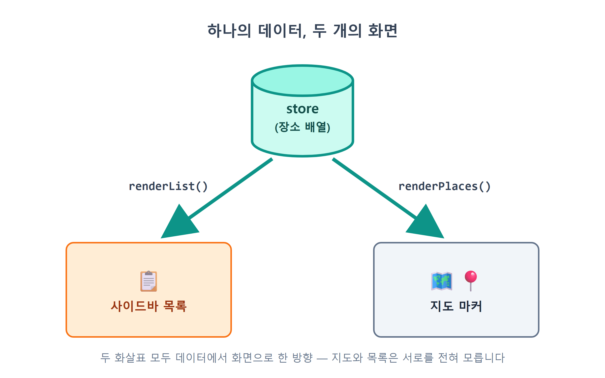
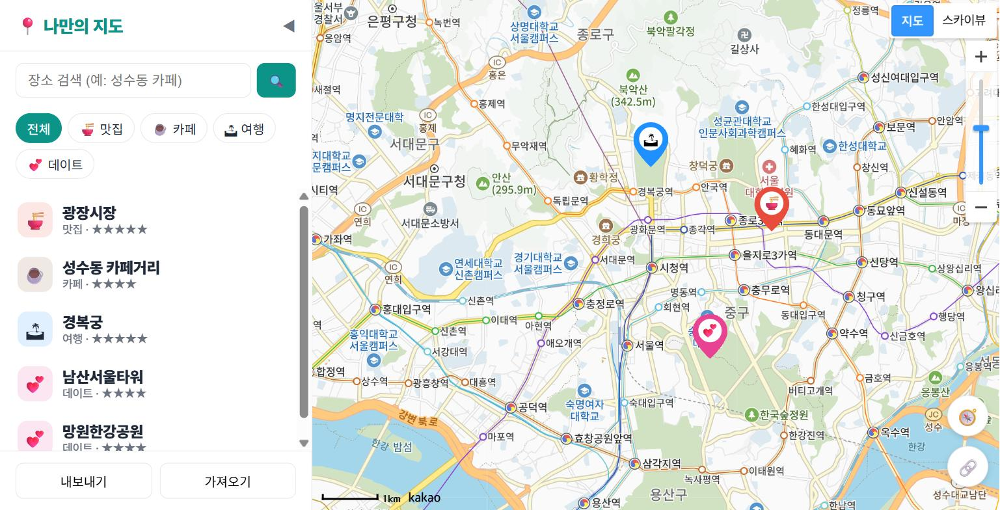
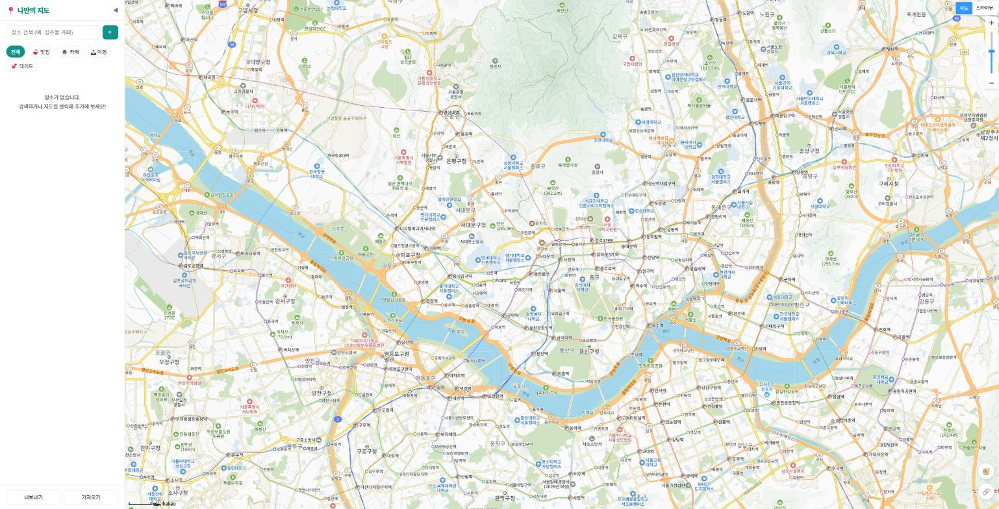
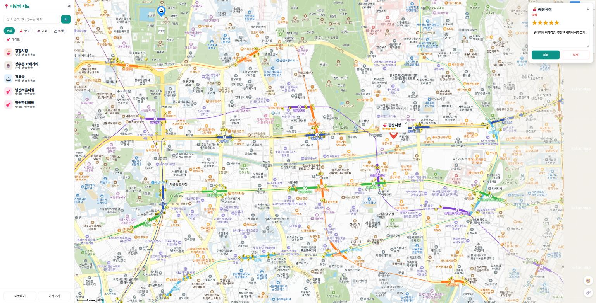
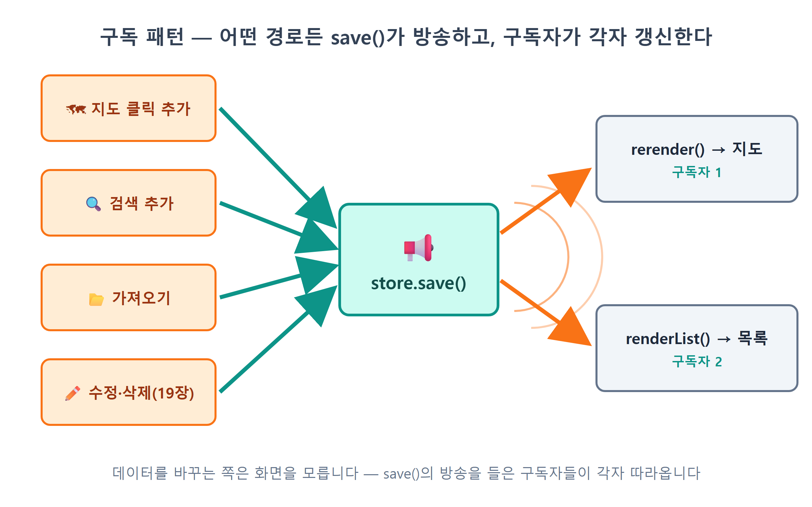

# 18장 사이드바 장소 목록

!!! note "이 장에서 배우는 것"
    - 배열의 `map()`과 `join()`으로 데이터 배열을 HTML 목록으로 바꾸는 정석 패턴을 익힙니다
    - 목록 항목을 클릭하면 지도가 그 장소로 날아가 말풍선을 여는 `focusPlace()` 연동을 만듭니다
    - 데이터가 바뀌면 화면이 저절로 갱신되는 구독(subscribe) 패턴을 완성합니다
    - 목록이 비었을 때 사용자를 안내하는 빈 상태(empty state) UI를 배웁니다

---

17장까지 진행하면서 우리 앱은 어느새 "진짜 앱"의 형태를 갖추었습니다. 이제 지도를 클릭하거나 검색하여 장소를 추가할 수 있으며, 추가한 장소는 localStorage에 저장되어 새로고침해도 사라지지 않습니다. 그런데 며칠 사용하다 보면 불편한 점이 하나 생깁니다. "내가 지금까지 저장한 장소가 몇 개더라? 지난주에 넣어 둔 그 카페 이름이 뭐였지?"의 정보를 확인하려면 지도를 이리저리 움직이며 핀을 하나씩 클릭해 보아야만 합니다. 지도는 장소의 위치를 보여주는 데는 효과적이지만, 저장된 내용을 한눈에 훑어보기에는 적절하지 않습니다.

카카오맵 앱을 열어보시면 지도 옆이나 아래에 항상 장소 목록이 함께 표시됩니다. 음식점을 검색하면 왼쪽에는 이름, 별점, 주소가 정리된 목록이 나타나고 오른쪽에는 핀이 표시된 지도가 보입니다. 목록에서 항목을 선택하면 지도가 해당 위치로 이동합니다. 이처럼 지도와 목록은 동일한 데이터를 서로 다른 방식으로 보여주는 것입니다. 이번 장에서는 우리 앱에도 이런 목록 기능을 추가하겠습니다.

이 장에서는 17장에서 설명을 미루었던 코드도 함께 살펴보겠습니다. `store.js`에 있던 비어 있는 `listeners` 배열과, `save()` 끝에서 그 배열을 순회하던 `forEach` 한 줄입니다. 이제 그 배열에 실제 동작하는 함수를 등록해 보겠습니다. 이 구조를 구독 패턴이라고 부릅니다. 이 패턴을 적용하면 데이터가 변경될 때 지도와 목록이 함께 자동으로 갱신됩니다. 16장에서 임시로 연결해 두었던 `notifyChange` 부분도 이 패턴으로 교체할 수 있습니다.

## 18.1 목록도 상태에서 그린다

새로운 기능이라고 해서 전체 설계를 새롭게 할 필요는 없습니다. 14장에서 세웠던 원칙을 그대로 다시 적용하면 됩니다. 상태를 중심으로 관리하고, 화면은 그 상태를 읽어 화면에 표시하는 방식입니다. 지도 위의 마커가 `store`의 장소 배열을 시각화한 결과이듯, 사이드바의 목록도 동일한 배열을 다른 형태로 보여주는 것일 뿐입니다.

{ width="760" }
/// caption
그림 18.1 — 하나의 데이터, 두 가지 표시 방식: store의 데이터를 지도(renderPlaces)와 목록(renderList)에서 각각 표시하는 구조
///

그림 18.1의 구조에서는 지도와 목록이 서로를 전혀 모른다는 점을 눈여겨보세요. 목록이 지도에게 "나 갱신했으니 너도 갱신해"라고 말하지 않습니다. 둘 다 그저 store만 바라보고, store가 바뀌면 각자 자기 화면을 다시 그립니다. 초보 시절에는 "장소를 추가하는 코드에서 지도도 고치고, 목록도 고치고, 개수 표시도 고치고…" 하는 식으로 화면 조각을 일일이 챙기는 실수를 흔히 저지릅니다. 그러면 화면 조각이 하나 늘 때마다 고칠 곳도 늘어나 금방 지옥이 되겠지요. 우리는 반대로 갑니다. 데이터를 바꾸는 쪽은 데이터만 바꾸고, 화면은 각자 알아서 따라오게 합니다. 그 "알아서 따라오게" 하는 장치가 이 장 후반의 구독 패턴입니다.

먼저 목록을 표시할 영역을 마련하겠습니다. 현재 `index.html`의 사이드바에는 목록을 담을 태그가 아직 없습니다. 필터 바 아래에 내용을 담을 빈 `<ul>` 요소를 하나 추가하겠습니다.

!!! tip "이렇게 물어보세요"
    > index.html 사이드바의 필터 바(#filter-bar) 바로 아래에 장소 목록이 들어갈 빈 ul을 추가해줘. id는 place-list로 하고, 내용은 자바스크립트로 채울 거니까 비워둬.

이제 Claude Code가 `index.html`에 추가한 마크업을 확인해 보겠습니다. 필터 바와 17장에서 만들었던 내보내기·가져오기 푸터 사이에 관련 코드가 한 줄 삽입되었습니다.

```html
  <button class="filter-btn" data-category="date">💕 데이트</button>
</nav>

<ul id="place-list"></ul>   <!-- ← 오늘 추가된 목록 자리 -->

<footer id="sidebar-footer">
```

저장하고 화면을 새로고침해도 화면 모습에는 변화가 없을 것입니다. 내용이 비어 있는 `<ul>` 요소는 화면에 표시되지 않기 때문입니다. 이제 이 목록에 내용을 채워보겠습니다.

## 18.2 map과 join: 배열을 HTML로 바꾸는 정석

Claude Code에게 작업을 요청할 때는 만들고자 하는 목록의 모습과 동작을 구체적으로 설명하는 것이 좋습니다.

!!! tip "이렇게 물어보세요"
    > sidebar.js에 renderList() 함수를 만들어서 #place-list에 장소 목록을 그려줘. 필터가 적용된 장소들(filteredPlaces)을 대상으로 하고, 항목마다 카테고리 이모지, 장소 이름, 카테고리 이름과 별점을 보여줘. 이모지는 카테고리 색을 연하게 깐 동그란 배경 위에 놓고, 장소 이름은 굵게, 카테고리 이름과 별점은 작은 회색 글씨로 ★을 반복해서 표시해줘. 각 li에는 data-id로 장소 id를 달아줘. 장소 이름은 escapeHtml로 감싸는 것 잊지 말고. 장소가 하나도 없으면 "장소가 없습니다. 검색하거나 지도를 클릭해 추가해 보세요!"라는 안내 문구를 보여줘.

요청한 내용을 바탕으로 Claude Code가 `sidebar.js`에 `renderList()` 함수를 추가하였습니다. 이 장에서 가장 중요한 함수이므로 차례로 자세히 살펴보겠습니다.

```js
import { store } from './store.js';
import { categoryOf } from './categories.js';
import { escapeHtml } from './mapView.js';

export function renderList() {
  const ul = document.getElementById('place-list');
  const places = filteredPlaces();
  if (places.length === 0) {
    ul.innerHTML = '<li class="empty">장소가 없습니다.<br>검색하거나 지도를 클릭해 추가해 보세요!</li>';
    return;
  }
  ul.innerHTML = places
    .map((p) => {
      const cat = categoryOf(p.category);
      const stars = '★'.repeat(p.rating || 0);
      return `
        <li class="place-item" data-id="${p.id}">
          <span class="place-emoji" style="background:${cat.color}22">${cat.emoji}</span>
          <span class="place-info">
            <strong>${escapeHtml(p.name)}</strong>
            <small>${cat.label} ${stars ? '· ' + stars : ''}</small>
          </span>
        </li>`;
    })
    .join('');
}
```

코드의 흐름을 보면, 배열을 `map()`으로 HTML 문자열 배열로 바꾸고, `join('')`으로 하나의 큰 문자열로 이어 붙인 뒤 `innerHTML`에 대입합니다. 자바스크립트로 목록을 그릴 때 가장 널리 쓰는 방식입니다. AI에게 "배열을 목록으로 그려줘"라고 시키면 열에 아홉은 이 모양의 코드가 나올 겁니다. 하나씩 뜯어 봅시다.

먼저 `map()` 부분부터 살펴보겠습니다. 이 메서드는 14장에서 배운 `filter()`와 쌍을 이루는 배열 메서드입니다. `filter()`가 조건을 만족하는 요소만 골라내는 기능이라면, `map()`은 배열의 모든 요소를 다른 형태로 변환하는 메서드입니다. 요소의 개수는 그대로 유지되며, 각 요소에 지정된 함수를 적용한 결과를 모아 새로운 배열을 반환합니다. 콘솔에서 직접 실행해 보시면 동작 방식을 쉽게 이해하실 수 있습니다.

```js
['광장시장', '성수동 카페거리'].map((name) => `<li>${name}</li>`);
// → ['<li>광장시장</li>', '<li>성수동 카페거리</li>']
```

장소 객체 배열이 입력되면 `<li>...</li>` 형식의 문자열 배열로 변환되어 반환됩니다. 이 과정에서 데이터가 화면에 표시될 형태로 가공되는 것입니다.

다음으로 `join('')` 부분을 살펴보겠습니다. `map()`이 반환하는 값은 아직 문자열의 배열 상태입니다. `innerHTML`에는 여러 문자열이 담긴 배열이 아닌 완성된 문자열 하나를 전달해야 하므로, `join('')`을 사용하여 배열의 모든 요소를 연결해 하나의 긴 문자열로 만드는 것입니다. 괄호 안의 `''`는 각 요소 사이에 구분 기호를 넣지 않고 연결하라는 의미입니다. 만약 이 부분을 생략하고 `join()`만 작성하면, 기본 구분자인 쉼표가 삽입되어 목록 항목마다 쉼표가 함께 표시되므로 주의하시기 바랍니다. AI가 생성한 코드를 검토할 때 이 부분을 확인하는 습관을 들이시는 것이 좋습니다.

백틱(`` ` ``) 문자열도 보세요. `<li>...</li>` 부분을 감싼 것은 따옴표가 아니라 백틱입니다. 이 문법을 템플릿 리터럴[^1]이라고 부르며, 두 가지 일을 할 수 있습니다. 문자열 안에서 줄바꿈을 마음껏 할 수 있고, `${...}` 자리에 변수나 표현식을 끼워 넣을 수 있습니다. 그래서 HTML 조각을 만들 때 쓰기 좋습니다. `${p.id}`, `${cat.emoji}`, `${escapeHtml(p.name)}`이 전부 이 문법으로 값을 끼워 넣은 자리입니다.

`data-id="${p.id}"`에서는 14장의 필터 버튼에서 쓴 데이터 속성이 다시 나옵니다. 각 `<li>`에 그 항목이 어떤 장소인지 표시해 둡니다. 잠시 뒤 클릭 처리에서 어느 항목이 눌렸는지 알아낼 때 이 값을 씁니다.

`'★'.repeat(p.rating || 0)`의 `repeat()` 메서드는 문자열을 지정된 횟수만큼 반복하는 기능을 합니다. 예를 들어 별점이 3점이면 `'★★★'`와 같이 별 기호가 세 번 반복되는 것입니다. 뒤에 붙은 `|| 0`는 값이 존재하지 않을 경우를 처리하기 위한 장치입니다. 아직 별점을 부여하지 않은 장소는 `rating`의 값이 `undefined`일 수 있으며, 이 상태에서 `undefined`를 `repeat()`에 전달하면 오류가 발생합니다. 그래서 `|| 0`을 추가하여 값이 없을 경우 0으로 간주하도록 처리한 것입니다. 그리고 목록 항목 템플릿의 `${stars ? '· ' + stars : ''}` 부분은 별점이 1 이상일 때만 별점과 함께 구분 기호를 표시하도록 하여, 별점이 0인 항목에 불필요한 기호가 나타나지 않도록 합니다.

`escapeHtml(p.name)`은 13장과 15장에서 약속한 규칙을 지킵니다. 사용자가 입력했을 수 있는 문자열을 `innerHTML`에 넣을 때는 반드시 이스케이프한다는 규칙입니다. 16장부터 장소 이름은 사용자가 직접 입력한 값을 씁니다. 이 규칙이 왜 필요한지는 19장에서 XSS라는 이름과 함께 다루겠습니다.

스타일 관련 내용으로는 `style.css`에 목록의 모습을 꾸미는 스타일이 추가되었습니다.

```css
#place-list { list-style: none; flex: 1; overflow-y: auto; padding: 4px 8px; }
.place-item {
  display: flex; align-items: center; gap: 10px;
  padding: 10px; border-radius: 10px; cursor: pointer;
}
.place-item:hover { background: #f0fdfa; }
```

`#place-list`에서 사용한 `flex: 1` 속성과 `overflow-y: auto` 속성의 조합이 중요합니다. 이를 통해 사이드바 내의 남는 공간은 목록 영역이 차지하며, 내용이 길어지면 목록 내부에서만 스크롤이 생기도록 합니다. 그래서 전체 사이드바의 레이아웃이 깨지거나 밀려나지 않습니다. 또한 `cursor: pointer`와 `:hover`의 배경색 차이를 통해 사용자는 해당 항목이 클릭 가능한 요소임을 직관적으로 인지할 수 있습니다. 아직 클릭 기능을 구현하지 않았지만, 이후 추가될 기능을 고려하여 미리 스타일을 적용한 것입니다.

이제 저장하고 화면에서 확인해 보겠습니다. `main.js`에서 `initSidebar()`를 호출할 때 `renderList()`도 함께 실행되도록 연결하면, 필터 바 아래에 장소 정보가 카드 형태로 정리되어 나타날 것입니다. 이 연결 부분은 이후 전체 코드에서 다시 확인하겠습니다.

{ width="760" }
/// caption
그림 18.2 — 완성된 사이드바 장소 목록: 이모지, 이름, 카테고리, 별점이 순서대로 표시된 모습
///

목록이 정상적으로 표시되면 이제 14장에서 만들었던 필터 버튼과 연결하겠습니다. 현재 ☕ 카페 버튼을 클릭해 보시면 지도의 마커는 필터링되어 변경되지만, 목록은 그대로 유지되는 것을 확인할 수 있습니다. 그 이유는 14장의 클릭 이벤트 처리 함수에서 지도를 갱신하는 함수인 `onFilterChange`만 호출하고, 목록을 갱신하는 함수인 `renderList()`는 호출하지 않았기 때문입니다. 14장에서 이 장을 위해 추가하겠다고 언급했던 바로 그 한 줄을 이제 추가하겠습니다.

!!! tip "이렇게 물어보세요"
    > sidebar.js의 필터 버튼 클릭 핸들러에서, active 클래스를 옮긴 다음에 renderList()도 호출해줘. 필터가 바뀌면 지도뿐 아니라 목록도 현재 필터에 맞게 다시 그려지게.

`initSidebar()`의 필터 관련 코드 부분에 한 줄을 추가하여 다음과 같이 수정합니다. `renderList()` 한 줄만 추가하면 됩니다.

```js
document.querySelectorAll('.filter-btn').forEach((btn) => {
  btn.addEventListener('click', () => {
    currentFilter = btn.dataset.category;
    document.querySelectorAll('.filter-btn').forEach((b) => b.classList.toggle('active', b === btn));
    renderList();      // ← 오늘 추가: 내 화면(목록)은 직접 다시 그린다
    onFilterChange();  // 남의 화면(지도)은 여전히 main.js의 콜백에게
  });
});
```

추가한 주석 내용을 보면 14장에서 설명했던 구분 방식이 그대로 적용됨을 알 수 있습니다. 목록은 사이드바에서 직접 관리하는 화면 요소이므로 별도의 콜백 없이 직접 호출하여 갱신하고, 지도는 콜백 함수를 통해 `main.js`에서 갱신하도록 처리한 것입니다. 모듈 간의 역할 분담은 그대로 유지한 채 필요한 부분 한 줄만 추가한 것입니다.

이제 필터 버튼을 클릭해 보시기 바랍니다. `renderList()`가 `store.all()` 대신 `filteredPlaces()`를 데이터 원본으로 사용하도록 변경되었으므로, ☕ 카페 버튼을 누르면 지도의 마커와 사이드바의 목록 모두 카페 장소만 표시됩니다. 이처럼 하나의 상태를 두 화면이 공유하여 사용하는 단방향 데이터 흐름 구조가 정상적으로 동작하는 것을 확인할 수 있습니다.

{ width="760" }
/// caption
그림 18.3 — 필터와 목록의 연동: ☕ 카페 필터를 누르면 마커와 목록이 함께 카페만 표시하는 모습
///

## 18.3 장소가 없을 때 보여 줄 안내문

`renderList()` 함수 앞부분의 `if (places.length === 0)` 조건문 부분을 다시 살펴보겠습니다. 등록된 장소가 하나도 없으면 목록 대신 안내 메시지를 표시하고, 곧바로 `return`에서 함수 실행을 마치는 내용입니다.

```js
if (places.length === 0) {
  ul.innerHTML = '<li class="empty">장소가 없습니다.<br>검색하거나 지도를 클릭해 추가해 보세요!</li>';
  return;
}
```

장소가 없을 때는 아무 내용도 표시하지 않아도 되지 않을까 생각할 수 있습니다. 기능적으로는 그렇게 보일 수 있습니다. 하지만 사용자의 입장에서는 다릅니다. 앱을 처음 실행했거나 필터 결과가 없는 경우에 그저 빈 공간만 보이면, 오류가 발생한 것인지 아니면 로딩 중인지 구분할 수 없습니다. 따라서 화면이 비어 있는 이유를 명확히 알려주는 것이 사용자 친화적인 처리 방식입니다.

그래서 잘 설계된 앱에서는 빈 화면을 그대로 두지 않고 안내 메시지를 표시합니다. 이런 디자인 처리를 빈 상태 디자인이라고 부릅니다. 빈 상태를 표시하는 메시지에는 현재 상황과 함께 사용자가 다음으로 취할 수 있는 행동을 함께 제시하는 것이 좋습니다. "장소가 없습니다" 부분은 오류가 아니라 데이터가 없음을 알리고, "검색하거나 지도를 클릭해 추가해 보세요!" 부분은 내용을 채우기 위해 어떤 동작을 하면 되는지 안내하는 내용입니다. 실제로 우리가 작성한 메시지도 바로 이 두 가지 내용을 포함하고 있습니다. 카카오톡의 "친구와 대화를 시작해 보세요"나 메일 앱의 "받은 편지함이 비어 있어요" 안내 메시지도 동일한 방식으로 작성된 예입니다.

```css
.empty { text-align: center; color: var(--muted); padding: 40px 10px; font-size: 14px; line-height: 1.7; }
```

스타일에도 의도가 반영되어 있습니다. `--muted`에서 안내 메시지를 흐린 색상으로 표시하고 여백을 넉넉히 주어 실제 내용과 시각적으로 구분되도록 한 것입니다. 만약 실제 목록 항목처럼 눈에 띄게 표시하면, 사용자가 클릭 가능한 항목으로 오인할 수도 있기 때문입니다.

이 기능을 확인하시려면 필터를 적용하여 결과가 없도록 만들어 보시면 됩니다. 예를 들어 아직 데이트 장소를 한 군데도 추가하지 않으셨다면, 💕 데이트 필터를 클릭해 보세요. 또는 19장의 내용을 미리 살펴보는 의미로 개발자 도구 콘솔에서 `localStorage.clear()`를 입력한 뒤 새로고침해 보시면, 저장했던 장소가 모두 사라지고 빈 상태의 안내 메시지가 표시되는 것을 확인할 수 있습니다. 만약 17장에서 내보내기 기능으로 백업해 두셨다면, 가져오기 기능을 통해 언제든지 복구하실 수 있습니다.

{ width="760" }
/// caption
그림 18.4 — 빈 목록 안내 메시지: 빈 공간 대신 상황과 다음 행동을 안내하는 문구가 표시된 모습
///

!!! tip "팁"
빈 상태 처리는 목록에만 필요한 것이 아닙니다. 검색 결과가 없을 때, 이미지 로딩 중일 때, 네트워크 연결이 끊겼을 때와 같이 정상적인 데이터가 존재하지 않는 모든 상황에 대해 미리 화면에 표시할 내용을 설계해 두어야 합니다. AI에게 화면 구현을 요청할 때 내용이 없거나 오류가 발생한 경우의 표시 방식까지 함께 제시하면, 앱의 완성도가 크게 향상됩니다. 요청하시는 내용에 예외 상황에 대한 설명을 한 줄 추가하는 것만으로도 결과물의 품질이 크게 달라집니다.

## 18.4 목록 클릭 → 지도 이동

이제 목록과 지도를 이어, 카카오맵에서 쓰던 것과 같은 동작을 만들어 보겠습니다. 목록에서 "광장시장"을 클릭하면 지도가 광장시장으로 미끄러지듯 이동하면서 확대되고, 말풍선까지 열리게 합니다.

!!! tip "이렇게 물어보세요"
    > 목록 항목을 클릭하면 지도가 그 장소로 이동하게 해줘. renderList에서 각 항목에 클릭 이벤트를 달아서 data-id를 콜백으로 넘기고, main.js에서는 그 id로 store에서 장소를 찾아 mapView의 focusPlace를 호출해줘. focusPlace는 지도를 레벨 4로 확대하면서 panTo로 부드럽게 이동하고, 그 장소의 말풍선을 열어줘.

`renderList()` 함수의 끝 부분에 관련 코드 몇 줄을 추가하였습니다.

```js
ul.querySelectorAll('.place-item').forEach((li) => {
  li.addEventListener('click', () => onSelect(li.dataset.id));
});
```

`innerHTML`를 이용해 목록을 그린 직후에 이벤트 리스너를 연결하는 것이 중요합니다. `innerHTML`에 새로운 값을 대입하면 기존의 모든 요소가 제거되고 새로운 문자열을 기반으로 요소가 다시 생성되기 때문입니다. 이전 요소에 연결해 두었던 이벤트 리스너도 함께 사라지게 되므로, 목록을 다시 그릴 때마다 이벤트 리스너를 새롭게 연결해야 합니다. 화면에 요소를 생성하는 작업과 이벤트를 연결하는 작업은 항상 함께 처리하시기 바랍니다. AI가 생성한 코드에서 처음에는 클릭이 정상 작동하지만 화면 갱신 후에는 동작하지 않는 현상이 발생한다면, 바로 이 순서를 확인해 보시기 바랍니다.

클릭한 항목이 어떤 장소에 해당하는지는 `li.dataset.id`를 통해 확인합니다. 앞서 18.2절에서 각 항목에 저장해 두었던 식별자 값을 이곳에서 읽어 사용하는 것입니다. 참고로 `onSelect`가 어떤 변수인지도 확인해 보겠습니다. `sidebar.js`의 상단 부분에 다음과 같이 선언되어 있습니다.

```js
let onSelect = () => {};   // 목록 항목이 선택되면 호출할 함수 (main.js가 넣어줌)

export function initSidebar({ onSelectPlace, onFilter }) {
  onSelect = onSelectPlace;
  // ... 14장에서 만들고 18.2절에서 renderList()를 보탠 필터 버튼 연결 ...
}
```

이 구조는 14장의 `onFilterChange`와 동일한 방식입니다. 사이드바는 단순히 항목이 선택되었다는 사실만 알릴 뿐, 그 이후에 어떤 동작이 수행될지는 알지 못합니다. 지도를 이동시킬지 상세 정보 화면을 보여줄지는 전체적인 흐름을 조율하는 `main.js`에서 결정하는 것입니다. 장소 상세 정보 화면은 19장에서 구현하겠습니다. 이처럼 사이드바는 지도의 존재 자체를 모른 채 자신의 역할만 수행하도록 설계함으로써, 모듈을 분리하여 개발하는 장점을 활용할 수 있습니다.

`main.js`의 전체 흐름을 조율하는 부분을 살펴보겠습니다.

```js
import { focusPlace } from './mapView.js';
import { initSidebar, filteredPlaces } from './sidebar.js';

initSidebar({
  onSelectPlace: (id) => {
    const p = store.get(id);
    if (p) focusPlace(p);
  },
  onFilter: rerender,
});
```

id로 `store.get(id)`를 호출해 장소 객체를 찾고, 찾았으면 `focusPlace(p)`에 넘깁니다. `if (p)`로 확인하는 덕분에 목록과 데이터가 어긋났을 때 에러 대신 조용히 넘어갑니다. 방금 삭제한 장소가 목록에서 아직 사라지기 전에 클릭하는 경우가 그렇습니다. 19장에서 상세 패널이 생기면 사이드바 코드는 그대로 둔 채 이 콜백에 `openDetail(id)` 한 줄만 더 붙습니다.

마지막으로 `mapView.js`의 `focusPlace()` 부분을 살펴보겠습니다.

```js
export function focusPlace(place, level = 4) {
  const pos = new kakao.maps.LatLng(place.lat, place.lng);
  map.setLevel(level);
  map.panTo(pos);
  const entry = markers.find((m) => m.place.id === place.id);
  if (entry) {
    closeOverlay();
    entry.overlay.setMap(map);
    openOverlay = entry.overlay;
  }
}
```

이 함수의 앞부분에서는 10장에서 배운 것처럼 `setLevel(4)`를 사용하여 해당 장소를 중심으로 주변 지역이 보이는 수준까지 지도를 확대하고, `setCenter()` 대신 `panTo()`를 사용하여 지도가 부드럽게 이동하도록 설정합니다. 지도가 자연스럽게 이동하므로 사용자가 클릭한 위치로 이동하는 과정을 놓치지 않고 인지할 수 있습니다.

함수의 뒷부분을 살펴보겠습니다. `markers` 배열은 13장에서 `{ marker, overlay, place }`를 짝으로 저장하기로 했던 그 배열입니다. `find()`를 사용하여 클릭한 장소에 해당하는 정보를 찾은 뒤, 미리 준비해 둔 `entry.overlay` 말풍선을 지도에 표시합니다. 이때 그 직전에 `closeOverlay()`를 호출하여 이전에 열려 있던 말풍선을 먼저 닫습니다. 이는 말풍선을 한 번에 하나만 표시한다는 13장의 규칙을 따르는 것입니다. 사용자가 지도의 마커를 직접 클릭하든 목록의 항목을 클릭하든, 접근 방식은 다르지만 동일한 규칙이 적용되는 것입니다.

이제 저장한 뒤 실제로 동작하는 것을 확인해 보겠습니다. 목록에서 아무 장소나 클릭해 보세요. 지도가 부드럽게 이동하여 해당 장소를 중심으로 보여주고, 확대된 뒤 말풍선까지 나타나는 것을 확인할 수 있습니다. 목록을 스크롤하며 여러 장소를 차례로 클릭해 보세요. 저장된 장소 사이를 자유롭게 이동할 수 있는 완성도 높은 지도 앱이 된 것을 확인하실 수 있습니다.

{ width="760" }
/// caption
그림 18.5 — 목록 항목 클릭 시 지도 이동: 목록에서 항목을 클릭하면 지도가 해당 위치로 부드럽게 이동·확대되고 말풍선이 열리는 모습
///

정상적으로 동작하는 것을 확인하였으므로 이제 변경 내용을 커밋하겠습니다. Claude Code에게 "지금까지 작업 커밋해줘. 메시지는 사이드바 장소 목록과 지도 연동 추가로"라고 요청하시면 관련 커밋 메시지와 함께 변경 내용을 기록해 둘 것입니다.

## 18.5 구독 패턴: 데이터가 바뀌면 화면이 따라온다

이제 17장에서 설명을 미루었던 부분을 처리하겠습니다. 현재 목록 기능에 한 가지 문제점이 있습니다. 지도를 클릭하여 새로운 장소를 추가하면 지도에는 즉시 마커가 표시되지만, 목록은 갱신되지 않고 그대로 유지된다는 점입니다. 목록에 새로운 장소가 나타나기 위해서는 화면을 새로고침해야만 합니다. 이는 16장에서 연결했던 `notifyChange`가 지도를 다시 그리는 함수인 `rerender`에만 연결되어 있기 때문입니다. 즉, `store.add()`에서는 지도만 변경 사항을 통보받고, 이번 장에서 추가한 `renderList()`는 아무런 통보도 받지 못하는 상태인 것입니다.

그렇다면 목록을 갱신하는 함수인 `renderList()`도 함께 호출하도록 연결하면 간단히 해결될 것처럼 보입니다. 하지만 데이터가 변경되는 지점을 세어보면, 16장의 지도 클릭 추가와 검색 결과 추가, 17장의 가져오기 기능, 그리고 이후 19장에서 구현할 별점 수정, 메모 수정, 삭제 기능까지 모두 합쳐 6곳 이상에 달합니다. 만약 그 모든 곳에서 매번 `renderList()`와 `rerender()`를 모두 호출하도록 작성한다면, 데이터 변경 위치의 개수와 갱신해야 할 화면 요소의 개수를 곱한 만큼 연결 관계가 늘어나게 됩니다. 이렇게 하면 연결 부분 중 하나라도 빠뜨릴 경우, 데이터는 정상적으로 저장되었지만 화면은 이전 상태 그대로 남아있는 버그가 발생하게 됩니다. 16장에서 해당 연결을 임시 방편이라고 언급했던 이유가 바로 여기에 있습니다.

이제 접근 방식을 바꾸어 보겠습니다. 화면 쪽에서 데이터가 변경되는 모든 곳을 일일이 찾아다니는 대신, 데이터를 관리하는 쪽에서 값이 변경되었음을 각 화면에 알리는 방식으로 개선하는 것입니다. 화면 쪽에서는 변경 사항을 통보받을 수 있도록 미리 등록해 두기만 하면 됩니다. 데이터가 변경될 때마다 데이터 관리 쪽에서 미리 등록된 함수들을 차례로 호출하므로, 화면 쪽에서는 언제 내용을 갱신해야 할지 직접 신경 쓸 필요가 없어집니다.

17장에서 간략히 언급했던 `store.js`의 코드가 바로 이런 역할을 수행하는 부분입니다.

```js
const listeners = [];            // 구독자 명단

function save() {
  try {
    localStorage.setItem(STORAGE_KEY, JSON.stringify(places));
  } catch (e) {
    console.warn('localStorage 저장 실패', e);
  }
  listeners.forEach((fn) => fn(places));   // ← 수수께끼였던 그 줄: 구독자 전원에게 방송
}

export const store = {
  // ...add, update, remove, replaceAll...
  subscribe(fn) {
    listeners.push(fn);          // 구독 신청: 명단에 함수를 올린다
  },
};
```

구조는 아주 단순합니다. `subscribe(fn)`은 함수를 `listeners` 배열에 넣어 두는 일만 합니다. 그리고 `save()` 끝에서 명단에 있는 함수를 전부 호출합니다. 17장에서 확인했듯 `add`든 `remove`든 `update`든 데이터가 바뀌면 반드시 `save()`를 마지막에 거쳐 갑니다. 데이터가 바뀌는 모든 경우가 어차피 `save()`를 지나가니, 거기서 한 번만 알리면 빠뜨릴 일이 없을 겁니다. 17장에서 저장 시점을 `save()` 한 곳으로 모아 둔 설계가 여기서 다시 도움이 됩니다.

이 구조를 발행-구독 패턴[^2]이라고 부릅니다. 유튜브 채널 구독, 앱 푸시 알림, 이메일 뉴스레터가 모두 같은 방식을 큰 규모로 쓴 예입니다. 우리는 방금 같은 장치를 배열 하나와 `forEach` 한 줄로 만들었습니다.

이제 구독 신청만 하면 됩니다.

!!! tip "이렇게 물어보세요"
    > store에 subscribe로 화면 갱신 함수들을 등록해서, 장소 데이터가 바뀌면 지도와 사이드바 목록이 자동으로 다시 그려지게 해줘. 지도 갱신(rerender)은 main.js에서, 목록 갱신(renderList)은 sidebar.js의 initSidebar 안에서 구독해줘. 이제 구독이 갱신을 책임지니까, 16장에 만들었던 search.js의 onChange 콜백(notifyChange)은 걷어내고 initSearch()는 인자 없이 호출하게 정리해줘.

총 두 군데에 각각 한 줄씩 관련 코드를 추가하겠습니다. 먼저 `sidebar.js`의 `initSidebar()` 끝 부분을 확인해 보겠습니다.

```js
export function initSidebar({ onSelectPlace, onFilter }) {
  // ...필터 버튼, 내보내기/가져오기 연결...

  store.subscribe(renderList);   // 데이터가 바뀌면 목록을 다시 그려주세요
  renderList();                  // 첫 화면은 직접 한 번 그린다
}
```

다음으로 `main.js`의 해당 부분을 확인하겠습니다.

```js
const rerender = () => renderPlaces(filteredPlaces());

store.subscribe(rerender);       // 데이터가 바뀌면 지도도 다시 그려주세요
rerender();
```

구독 방식은 구독을 신청한 이후 발생하는 변경 사항에만 반응합니다. 따라서 두 군데 모두 구독을 신청한 직후에 `renderList()`와 `rerender()`를 한 번씩 직접 호출하여, 초기 화면 내용이 정상적으로 표시되도록 하는 것입니다.

여기서 18.2절의 그 한 줄을 다시 떠올려 봅시다. 필터 클릭 핸들러에서는 `renderList()`를 직접 불렀는데, 구독이 있으니 그 줄을 지워도 될 것 같습니다. 하지만 이 줄은 지우면 안 됩니다. 구독 알림은 store의 데이터가 바뀌어 `save()`가 실행될 때만 울립니다. 그런데 필터 클릭은 사이드바의 화면 상태인 `currentFilter`만 바꿀 뿐, store는 건드리지 않습니다. `save()`도 알림도 일어나지 않으니 구독자는 아무 소식을 듣지 못합니다. 그래서 갱신하는 길을 둘로 나눠 둡니다. 데이터 변경은 구독이 맡고, 필터처럼 store를 거치지 않는 변경은 직접 호출로 처리합니다. 무엇이 바뀌었는지에 따라 알맞은 길을 고른 결과입니다.

그리고 앞서 예고하였던 대로 임시 연결 부분을 제거하겠습니다. 16장에서 `search.js`에 선언하였던 `notifyChange` 변수와, 장소 추가 버튼에 연결하였던 `notifyChange()` 호출 구문을 삭제하고, `main.js`의 호출 부분도 원래 형태로 되돌립니다.

```js
initSearch();   // 16장의 onChange 다리는 구독이 대신하므로 인자가 사라졌다
```

연결 부분을 제거하였는데도 지도에 마커가 즉각적으로 표시되는 이유는 무엇일까요? 장소가 추가되면 `store.add()`가 마지막에 `save()`를 호출하고, 그 과정에서 `save()`의 마지막 부분에 준비된 통보 기능이 등록된 구독자 `rerender`를 모두 호출하기 때문입니다. 즉, 장소를 추가하는 쪽 코드에서는 더 이상 지도나 목록의 존재를 알 필요가 없습니다. 데이터만 변경하면 그 이후의 모든 갱신 작업은 구독 통보를 통해 자동으로 이루어지는 구조가 완성된 것입니다.

이것으로 그림 18.1의 구조가 완성됐습니다. 확인해 봅시다. 지도의 빈 곳을 클릭해서 새 장소를 추가해 보세요. 다이얼로그에서 저장을 누르는 순간 지도에 마커가 생기고, 동시에 사이드바 목록에도 새 항목이 나타납니다. 목록에서 방금 그 항목을 클릭하면 지도가 그리로 이동하는 것까지 맞물려 돌아갑니다. 검색으로 추가해도, 가져오기로 파일을 통째로 불러와도 마찬가지입니다. 우리는 어디에도 "목록을 갱신하라"는 코드를 추가로 심지 않았습니다. 데이터가 바뀌었고, 구독자가 각자 따라왔을 뿐입니다.

{ width="760" }
/// caption
그림 18.6 — 구독 패턴의 동작 원리: 어떤 방식으로 데이터를 변경하든 save()가 변경 사항을 알리고, 구독자인 지도와 목록이 각자 자동으로 갱신되는 구조
///

!!! warning "주의"
구독 패턴을 사용할 때 초보 개발자가 가장 많이 빠지는 함정은, 구독한 함수 안에서 다시 데이터를 변경하는 것입니다. 예를 들어 목록을 그리는 함수인 renderList 안에서 `store.update(...)`를 호출하면, update 함수가 save 함수를 호출하고, save 함수는 다시 renderList를 호출하는 순환 구조가 발생하여 결국 브라우저가 응답하지 않게 됩니다. 따라서 반드시 지켜야 할 규칙은 간단합니다. 구독 함수 내에서는 데이터를 읽어 화면을 그리기만 할 뿐, 데이터 자체를 수정해서는 안 된다는 것입니다. 만약 화면이 응답하지 않고 콘솔에 "Maximum call stack size exceeded" 관련 오류 메시지가 표시된다면, 바로 이 순환 호출 문제를 의심해 보시고 Claude Code에게 "store를 구독한 함수 중에 store를 다시 수정하는 곳이 있는지 찾아줘"라고 요청하여 수정하시기 바랍니다.

바이브코딩 관점에서 한마디 보태겠습니다. 오늘 우리가 AI에게 시킨 프롬프트 어디에도 "발행-구독 패턴으로 만들어줘"라는 전문 용어는 없었습니다. "데이터가 바뀌면 지도와 목록이 자동으로 다시 그려지게 해줘"라고 원하는 결과를 말했을 뿐인데, AI는 검증된 패턴을 꺼내 왔습니다. 용어를 몰라도 결과를 정확히 말하면 좋은 구조가 나올 수 있습니다. 다만 나온 코드를 이번처럼 읽고 이름을 알아 두면, 다음부터는 "구독 패턴으로 해줘" 한마디로 더 정확하게 시킬 수 있습니다. 아는 어휘가 늘수록 프롬프트는 짧아질 겁니다.

## 18.6 마무리

이제 지도와 목록이 항상 함께 갱신되기 시작했습니다. 데이터가 변경될 때마다 변경 사항을 알려주고, 화면 쪽에서는 그 통보를 받아 스스로 내용을 다시 그리는 구조가 갖추어졌기 때문입니다. 이후 19장에서 장소 수정과 삭제 기능이 추가되더라도, 별도로 화면 갱신 코드를 추가할 필요가 없습니다. 데이터가 변경될 때마다 미리 등록해 둔 함수가 자동으로 호출될 것이기 때문입니다.

!!! abstract "이 장의 핵심"
    - 목록 렌더링의 정석은 배열 → `map()`으로 HTML 문자열 변환 → `join('')`으로 합치기 → `innerHTML` 대입 4단계입니다.
    - `innerHTML`로 다시 그리면 기존 요소와 이벤트가 함께 사라지므로, 그린 직후 이벤트를 다시 붙입니다. 어느 항목인지는 `data-id`로 식별합니다.
    - 빈 목록에는 침묵 대신 빈 상태(empty state) 안내를 넣습니다. "지금 상황"과 "다음 행동"을 함께 알려 줍니다.
    - `focusPlace()`는 `setLevel` + `panTo`로 지도를 부드럽게 이동시키고, `markers` 배열에서 짝꿍 말풍선을 찾아 엽니다.
    - 구독 패턴에서는 `store.subscribe(fn)`으로 구독자 명단에 함수를 올려 두면, 데이터가 바뀔 때마다 `save()`가 명단의 함수를 전부 호출합니다. 데이터를 바꾸는 쪽은 화면의 존재를 몰라도 됩니다.
    - 구독자는 읽고 그리기만 합니다. 구독한 함수 안에서 데이터를 다시 바꾸면 무한 반복에 빠질 수 있습니다.

!!! question "잠깐 생각해 봅시다"
Q1. `renderList()` 함수는 장소 중 일부만 변경되더라도 전체 목록을 삭제한 뒤 처음부터 다시 그립니다. 만약 장소가 매우 많다면 성능상 문제가 발생할 수도 있습니다. 그렇다면 우리 앱에서는 왜 이런 단순한 방식을 채택하였는지, 단순함과 성능의 균형 관점에서 여러분의 생각을 적어 보세요.

____________________________________________

Q2. 지금은 지도(rerender)와 목록(renderList) 두 구독자가 있습니다. 만약 사이드바 상단에 "저장된 장소 12개"처럼 개수를 보여주는 기능을 추가한다면, 구독 패턴 덕분에 코드 몇 줄이면 될까요? 어디에 무엇을 쓰면 될지 상상해 보세요.

____________________________________________ ch18.txt

!!! example "확인 문제"
    1. 브라우저 콘솔에서 `['a','b','c'].map((x) => x.toUpperCase())`와 `['a','b','c'].join('-')`을 각각 실행해 결과를 확인하고, 두 개를 이어서 `map(...).join('')` 형태로도 실행해 보세요.
    2. Claude Code에게 시켜 목록 항목에 좌표(`lat`, `lng`)를 소수점 4자리까지 작게 표시해 보세요. 확인했다면 git으로 되돌려도 좋습니다.
    3. 콘솔에서 `store.subscribe(() => console.log('데이터가 바뀌었다!'))`처럼 나만의 구독자를 등록해 보세요. 모듈이라 직접 접근이 안 되면 Claude Code에게 "콘솔에서 store를 쓸 수 있게 window에 잠깐 노출해줘"라고 시키세요. 장소를 추가할 때마다 콘솔에 메시지가 찍히나요?
    4. Claude Code에게 "목록을 이름 가나다순으로 정렬해서 보여줘"라고 시켜 보세요. `renderList()`의 어느 지점에 `sort()`가 끼어드는지, 원본 배열을 건드리지 않으려고 AI가 어떤 처리를 하는지 관찰해 보세요.

!!! info "더 찾아보기"
    - `이벤트 위임 (event delegation)` — 항목마다 리스너를 다는 대신 부모 `<ul>`에 하나만 달고 `event.target`으로 구분하는 기법. 항목이 수천 개일 때의 정석입니다.
    - `Array.prototype.sort` — 배열 정렬 메서드. 원본을 바꾸는 메서드라서 `[...배열].sort()`처럼 복사 후 정렬하는 관용구와 함께 알아 두세요.
    - `옵저버 패턴 (Observer pattern)` — 발행-구독 패턴의 뿌리가 되는 고전 디자인 패턴. Vue의 반응성, React 상태 관리 라이브러리의 조상입니다.
    - `<template> 태그` — HTML 조각을 문자열이 아닌 진짜 DOM 조각으로 미리 만들어 두고 복제해 쓰는 표준 방법.

> 다음 장으로. 목록에서 장소를 클릭하면 지도가 이동하지만, 그 장소의 별점을 고치거나 메모를 남기거나 삭제할 방법은 아직 없습니다. 19장에서는 장소 하나를 자세히 보여 주는 상세 패널을 만듭니다. 별점 버튼, 메모 저장, 확인 창을 거치는 삭제를 다루고, 13장부터 미뤄 둔 `escapeHtml`이 막아 주는 XSS 공격도 함께 설명합니다.

[^1]: 템플릿 리터럴(template literal) — 백틱(`` ` ``)으로 감싼 문자열. 여러 줄을 그대로 쓸 수 있고 `${표현식}`으로 값을 끼워 넣을 수 있어, HTML 조각을 만들 때 특히 유용한 ES6 문법입니다.
[^2]: 발행-구독 패턴(publish-subscribe pattern) — 데이터를 바꾸는 쪽(발행자)과 그 변화에 반응하는 쪽(구독자)을 직접 연결하지 않고, "구독 명단"을 사이에 두어 느슨하게 잇는 설계 방식. 발행자는 구독자가 몇이든 누구든 신경 쓰지 않고 방송만 하면 됩니다.
