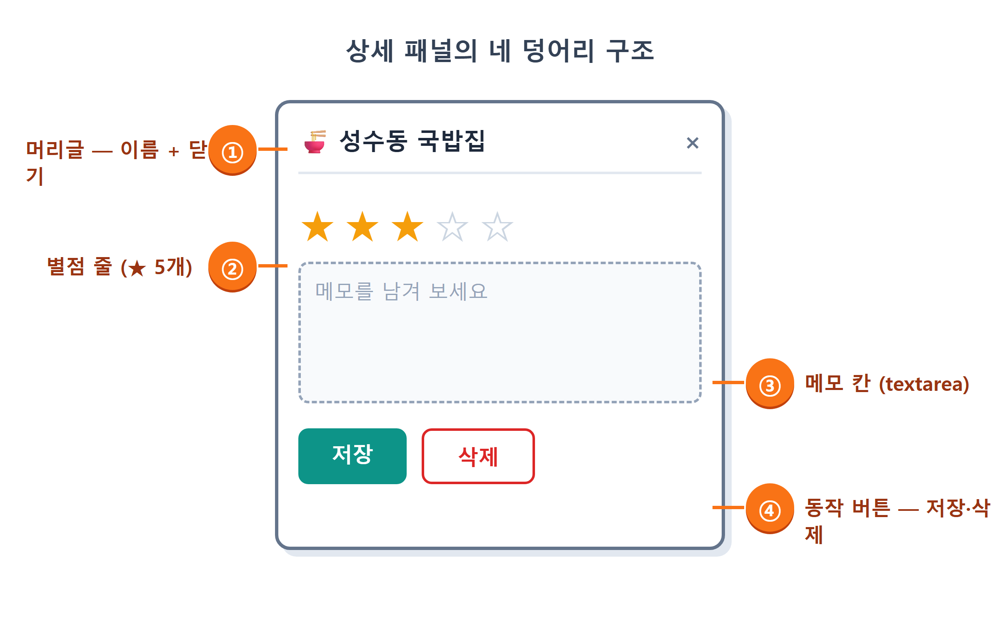
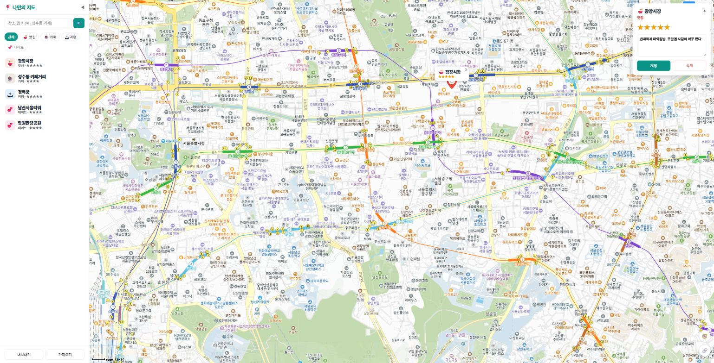
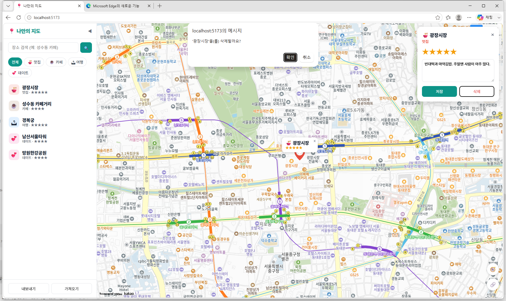
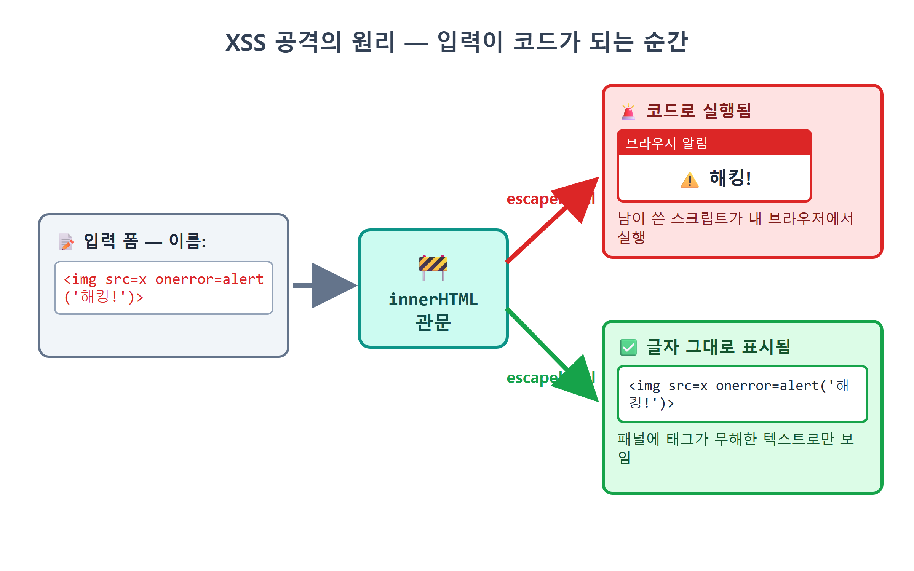
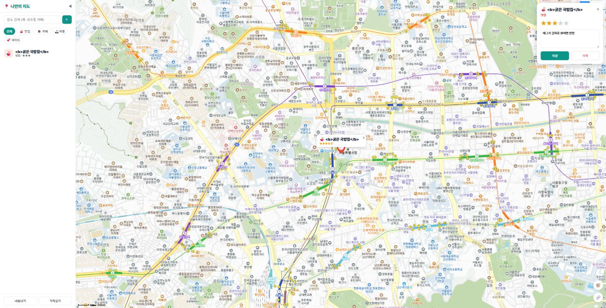

# 19장 상세 패널

!!! note "이 장에서 배우는 것"
    - 장소 하나를 자세히 보고 편집하는 상세 패널 UI를 만듭니다
    - 별점 버튼(1~5)으로 평점을 매기고, 클릭 즉시 화면에 반영합니다
    - 메모를 입력하고 저장하는 흐름과 `store.update`의 쓰임새를 익힙니다
    - 삭제 전에 `confirm`으로 한 번 더 물어보는 이유를 배웁니다
    - XSS 공격이 무엇인지 실험해 보고, `escapeHtml`로 막는 법을 배웁니다

---

16장에서는 장소를 추가하였고, 17장에서는 localStorage에 저장하였습니다. 18장에서는 사이드바 목록에서 확인할 수 있도록 만들었습니다. 아직 처리하지 못하는 작업이 두 가지 있습니다. 저장해 둔 장소의 별점과 메모를 수정할 수 없으며, 더 이상 필요하지 않은 장소를 삭제할 수도 없습니다. 데이터를 다루는 기본 동작을 통틀어 CRUD라고 부릅니다. Create는 생성, Read는 조회, Update는 수정, Delete는 삭제, 이 네 가지 동작의 첫 글자를 따서 지은 이름입니다. 지금까지 생성(C)과 조회(R) 기능을 구현하였으며, 이번 장에서는 수정(U)과 삭제(D) 기능을 만들어 보겠습니다.

이 두 가지 기능을 담을 상세 패널을 제작합니다. 지도에 표시된 마커나 목록에서 장소를 선택하면 지도 오른쪽 상단에 카드 형태의 화면이 나타나며, 해당 카드에는 장소의 이름, 카테고리, 별점, 메모를 보여 주고 그 자리에서 바로 수정할 수 있도록 구성합니다. 카카오맵에서 가게를 선택하면 옆에 상세 화면이 나타나는 것과 유사한 형태로, 해당 화면을 간소화한 모습이라고 생각하면 이해하기 쉽습니다. 그리고 이번 장의 마지막 부분에서는 15장에서 19장으로 미루어 두었던 `escapeHtml`을 다루겠습니다. XSS라는 웹 보안 취약점을 직접 실험을 통해 확인하고, 이를 방어하는 방법까지 함께 구현해 보겠습니다.

## 19.1 상세 패널 설계: 어디에, 무엇을

본격적으로 코드를 작성하기 전에, 이전에 해 왔던 것처럼 먼저 화면 구성을 그림으로 그려 보겠습니다. 상세 패널에 포함될 내용을 크게 네 부분으로 나누어 설계하였습니다.

1. 머리글: 카테고리 이모지 + 장소 이름, 그리고 닫기(×) 버튼
2. 별점 줄: ★ 버튼 다섯 개. 현재 별점까지 노란색이고, 누르면 그 값으로 바뀝니다
3. 메모 칸: 여러 줄을 입력할 수 있는 `textarea`
4. 동작 버튼: 저장, 그리고 빨간 글씨의 삭제

{ width="760" }
/// caption
그림 19.1 — 상세 패널의 네 가지 구성 요소와 구조
///

상세 패널은 지도 오른쪽 상단에 위치시키는 것이 적절합니다. 지도 왼쪽 영역은 사이드바가 차지하고 있으므로, 반대편에 패널을 표시하면 목록과 상세 정보를 화면에서 나란히 확인할 수 있습니다. 13장에서 사용하였던 말풍선처럼 지도 위에 겹쳐 표시되는 요소이므로 `position: absolute` 속성을 사용하며, 평상시에는 `hidden` 속성을 적용하여 화면에 보이지 않도록 숨겨 둡니다. 이는 15장에서 구현하였던 검색 결과 목록과 동일한 방식입니다. 즉, 화면 요소의 표시 여부를 상태에 따라 동적으로 제어하는 방식입니다.

상세 패널을 구현하기 전에 먼저 한 가지 사항을 결정해야 합니다. 패널에 표시할 내용을 HTML 문서에 미리 작성해 둘지, 아니면 패널을 열 때마다 자바스크립트를 통해 동적으로 생성하여 삽입할지 결정해야 합니다. 이전에 검색 결과 목록은 열릴 때마다 내용을 동적으로 생성하도록 구현하였으므로, 상세 패널도 동일한 방식으로 제작하겠습니다. 사용자가 어떤 장소를 선택할지, 별점은 몇 점인지, 메모에는 어떤 내용이 적혀 있는지 등의 정보는 사용자가 해당 장소를 클릭하기 전까지는 알 수 없기 때문입니다. 따라서 HTML에는 빈 공간만 남겨 둔 채, 패널이 열릴 때마다 해당 내용을 동적으로 채워 넣는 방식을 사용합니다. 이제 Claude Code에게 HTML 구조와 스타일 시트 작성을 요청해 보겠습니다.

!!! tip "이렇게 물어보세요"
    > index.html의 지도 영역 안에 상세 패널 그릇을 추가해줘. `<section id="detail-panel" hidden></section>` 하나면 되고 내용은 자바스크립트로 채울 거야. style.css에는 지도 오른쪽 위(right/top 12px)에 뜨는 폭 280px 흰색 카드로 스타일을 잡아줘. 둥근 모서리와 그림자로 말풍선·다이얼로그와 톤을 맞춰줘.

Claude Code는 `index.html`에 아래와 같은 한 줄의 코드를 추가하였습니다.

```html
<section id="detail-panel" hidden></section>
```

`style.css`에는 다음과 같은 스타일 규칙들을 추가하였습니다.

```css
#detail-panel {
  position: absolute; right: 12px; top: 12px; z-index: 25;
  width: 280px; background: #fff; border-radius: 14px;
  box-shadow: 0 6px 24px rgb(0 0 0 / 0.18); padding: 16px;
}
.detail-stars .star {
  border: none; background: none; font-size: 24px; cursor: pointer; color: #d1d5db;
}
.detail-stars .star.on { color: #f59e0b; }
#detail-memo {
  width: 100%; margin: 10px 0; padding: 8px; border: 1px solid var(--line);
  border-radius: 8px; font-family: inherit; font-size: 13px; resize: vertical;
}
button.primary { background: var(--brand); border-color: var(--brand); color: #fff; }
button.danger { color: #dc2626; border-color: #fecaca; }
```

특히 별점을 표시하는 부분을 주목하여 살펴보시기 바랍니다. 기본 상태의 `.star`는 일반적인 `#d1d5db`의 회색으로 표시되며, `on` 클래스가 적용된 요소에 한해서만 `#f59e0b`의 노란색으로 표시되도록 설정하였습니다. 이는 14장에서 제작하였던 필터 버튼의 `active` 토글 기능과 정확히 동일한 원리로 작동합니다. 즉, 요소의 시각적인 모습은 CSS가 담당하고, 기능의 활성화 여부는 클래스 추가 및 제거를 통해 제어하는 방식입니다. 그리고 삭제 버튼에는 `danger`라는 클래스를 적용하여 붉은색 계열의 색상을 입혔습니다. 이는 되돌릴 수 없는 동작을 수행하는 버튼에 붉은색을 사용하는 웹 서비스의 일반적인 관례에 따른 것입니다.

## 19.2 openDetail: 패널을 그리는 함수

이제 실제로 동작하는 코드를 작성해 보겠습니다. 지금까지 계속하여 사용하였던 규칙에 따라, 상세 패널과 관련된 코드는 별도의 파일 하나에 담아 관리하며, 파일의 이름은 `src/detail.js`로 정하겠습니다. 요구 사항을 정리한 후, 한 번에 구현하도록 요청해 보겠습니다.

!!! tip "이렇게 물어보세요"
    > src/detail.js를 새로 만들어줘. openDetail(id)과 closeDetail을 export하고, openDetail은 store.get(id)으로 장소를 찾아 #detail-panel 안에 카테고리 이모지+이름 머리글(닫기 × 버튼 포함), 별 버튼 5개(현재 별점만큼 on 클래스), 메모 textarea, 저장/삭제 버튼을 그려줘. 별을 누르면 store.update로 rating을 바꾸고, 저장은 memo를 update하고 toast를 띄우고, 삭제는 confirm으로 물어본 뒤 store.remove 해줘. 이름과 메모는 mapView.js의 escapeHtml로 감싸줘. 그리고 main.js에서 마커 클릭과 사이드바 목록 클릭이 openDetail을 부르게 연결해줘.

Claude Code가 작성하여 준 `src/detail.js`를 크게 세 부분으로 나누어 차례로 살펴보겠습니다. 먼저 상세 패널의 내용을 그려주는 앞부분의 코드부터 확인하겠습니다.

```js
// src/detail.js — 상세 패널: 별점·메모 편집, 삭제
import { store } from './store.js';
import { categoryOf } from './categories.js';
import { escapeHtml } from './mapView.js';
import { toast } from './sidebar.js';

let currentId = null;

export function openDetail(id) {
  const place = store.get(id);
  if (!place) return;
  currentId = id;
  const panel = document.getElementById('detail-panel');
  const cat = categoryOf(place.category);
  panel.hidden = false;
  panel.innerHTML = `
    <header>
      <h2>${cat.emoji} ${escapeHtml(place.name)}</h2>
      <button id="detail-close" title="닫기">×</button>
    </header>
    <p class="detail-cat" style="color:${cat.color}">${cat.label}</p>
    <div class="detail-stars" id="detail-stars">
      ${[1, 2, 3, 4, 5]
        .map((n) => `<button class="star ${n <= (place.rating || 0) ? 'on' : ''}" data-n="${n}">★</button>`)
        .join('')}
    </div>
    <textarea id="detail-memo" rows="4" placeholder="메모를 남겨 보세요">${escapeHtml(place.memo || '')}</textarea>
    <div class="detail-actions">
      <button id="detail-save" class="primary">저장</button>
      <button id="detail-delete" class="danger">삭제</button>
    </div>`;
```

코드의 첫 번째 줄부터 살펴보겠습니다. `store.get(id)`를 사용하여 선택한 장소에 해당하는 객체를 찾고, 만약 해당 객체가 존재하지 않으면 더 이상의 코드를 실행하지 않고 함수를 종료합니다. 이는 15장에서 배웠던 값 검증 방식을 그대로 적용한 것입니다. 만약 이미 삭제된 장소의 식별 번호가 어딘가에서 잘못 전달되더라도, 애플리케이션이 오류로 인해 비정상적으로 종료되는 현상을 방지할 수 있습니다. 그 다음으로 `panel.hidden = false`를 호출하여 상세 패널을 화면에 표시하고, `innerHTML`에 템플릿 문자열을 사용하여 패널에 표시될 전체 내용을 한 번에 삽입합니다. 이는 전혀 새로운 방식이 아니라, 12장부터 지금까지 계속하여 사용하여 왔던 것처럼 데이터를 HTML 형식의 문자열로 변환하여 삽입하는 기존의 방식과 동일합니다.

이제 별점을 그려주는 코드 부분을 자세히 살펴보겠습니다.

```js
[1, 2, 3, 4, 5].map((n) => `<button class="star ${n <= (place.rating || 0) ? 'on' : ''}" ...>★</button>`)
```

`<button class="star">★</button>`를 다섯 번 복사해 붙이는 대신, `[1, 2, 3, 4, 5]` 배열을 `map`으로 돌려 다섯 개를 만듭니다. 버튼은 저마다 번호 `n`을 갖습니다. `n <= place.rating`, 곧 자기 번호가 현재 별점 이하이면 `on` 클래스가 붙습니다. 별점이 3이면 1·2·3번 별에만 `on`이 붙어 노란색이 됩니다. `place.rating || 0`은 `rating`이 `undefined`인 장소를 0점으로 처리합니다. 삼항 연산자[^1] `조건 ? 참일때 : 거짓일때`는 이렇게 클래스 이름을 고를 때 요긴하게 쓸 수 있습니다.

`data-n="${n}"` 부분의 코드 역시 이전에 보았던 방식과 매우 유사합니다. 이는 15장에서 검색 결과를 표시할 때 사용하였던 `data-i` 요소에 순서 번호를 부여하는 방식과 동일한 형태의 코드입니다. 이렇게 각 요소에 번호를 붙여 두면, 나중에 사용자가 몇 번째 별을 클릭하였는지 쉽게 파악할 수 있기 때문입니다. 그리고 장소의 이름과 메모를 감싸고 있는 `escapeHtml` 요소는 해당 내용에 외부에서 입력한 문자열이 포함될 경우, 특수 문자를 미리 변환하여 처리하는 함수가 적용된 부분이라고만 알고 넘어가시면 됩니다. 이 부분에 대한 자세한 내용은 19.5절에서 해당 함수를 제거하면 어떤 문제가 발생하는지 직접 확인하며 알아보겠습니다.

{ width="760" }
/// caption
그림 19.2 — 마커를 클릭하면 지도 오른쪽 상단에 나타나는 상세 패널
///

## 19.3 별점 버튼: 클릭하면 다시 그린다

`innerHTML`를 호출하여 패널의 내용을 모두 그려 넣은 뒤에는, 방금 생성한 별점 선택 버튼들에 차례로 클릭 이벤트를 연결하겠습니다. 이제부터는 `openDetail` 함수의 뒷부분에 작성된 코드를 살펴보겠습니다.

```js
  panel.querySelector('#detail-close').addEventListener('click', closeDetail);
  panel.querySelectorAll('.star').forEach((btn) => {
    btn.addEventListener('click', () => {
      const n = Number(btn.dataset.n);
      // 다시 그리기 전에 쓰던 메모를 잃지 않게 보관한다
      const draft = panel.querySelector('#detail-memo').value;
      store.update(id, { rating: n });
      openDetail(id); // 다시 그려서 별 반영
      panel.querySelector('#detail-memo').value = draft;
    });
  });
```

화면에 표시된 다섯 개의 별 버튼을 `querySelectorAll`로 모두 선택한 뒤, 반복문을 사용하여 각 버튼에 차례로 클릭 이벤트 리스너를 연결합니다. 사용자가 특정 별을 클릭하면 `btn.dataset.n` 속성 값을 읽어 해당 별이 몇 번째 별인지 파악합니다. `dataset` 속성의 값은 항상 문자열 형식으로 전달되므로, 15장에서 사용하였던 것처럼 `Number()`를 통해 숫자 형식으로 변환하여 사용합니다. 그 다음 `store.update(id, { rating: n })`를 호출하여 해당 장소의 별점을 새롭게 수정하여 저장소에 기록합니다. 17장에서 제작한 `update` 함수는 변경된 값이 있는 경우에만 해당 장소 객체의 내용을 덮어쓰고, `save()`를 호출하여 localStorage에 변경 사항을 저장하는 기능까지 수행합니다. 따라서 별점을 수정하고 저장하는 과정이 이 한 줄의 코드로 모두 처리됩니다.

그런데 바로 이어서 등장하는 `openDetail(id)` 코드는, 방금 실행하고 있던 이 함수를 다시 한번 호출하는 코드입니다. 그 이유는 방금 별점을 3점에서 5점으로 변경하였더라도, 화면에 표시된 별점은 여전히 3개만 노란색으로 표시되어 있기 때문입니다. 즉, 별점 데이터는 변경되었지만 화면은 아직 갱신되지 않은 상태인 것입니다. 물론 노란색으로 표시될 별을 두 개 더 추가하는 코드를 별도로 작성할 수도 있습니다. 하지만 그보다는 상세 패널 전체를 다시 새롭게 그려주는 방식이 훨씬 간결하고 오류 발생 가능성이 적습니다. 왜냐하면 `openDetail` 함수는 현재의 최신 데이터를 기준으로 상세 패널의 내용을 다시 그려주는 함수이기 때문입니다. 따라서 데이터를 변경한 뒤 이 함수를 한 번 더 호출하면, 변경된 별점 정보가 반영된 새로운 상세 패널이 화면에 나타나게 됩니다. 즉, 화면의 일부 요소만 수정하기보다는, 데이터의 상태를 변경한 후 화면 전체를 다시 새롭게 그려주는 방식을 사용하는 것입니다. 이는 14장에서 필터 기능을 구현할 때 익혔던 데이터 우선 단방향 흐름 방식과 정확히 동일한 접근 방식입니다. React와 같은 최신 프레임워크들도 내부적으로는 바로 이 방식을 사용하여 화면을 갱신합니다. 우리는 그러한 동작 원리를 바닐라 자바스크립트로 직접 구현해 보고 있는 것입니다.

그리고 `openDetail(id)`를 앞뒤로 감싼 두 줄은 이 방식의 부작용을 처리합니다. `draft`에 값을 보관했다가 되돌려 놓는 코드입니다. 패널을 전부 다시 그리면 textarea도 새로 생깁니다. 메모 칸에 저장하지 않은 글을 쓰다가 별을 누르면, 새 textarea에 이전 메모가 들어가면서 쓰던 글이 사라질 수 있습니다. 그래서 다시 그리기 전에 textarea의 현재 값을 `draft` 변수에 담아 두고, 다시 그린 뒤에 그 값을 새 textarea에 넣습니다. 전체를 다시 그리는 단순한 구조는 유지하면서 이 부작용만 두 줄로 막았습니다.

이 방식의 또 다른 장점은 다른 곳에도 자동으로 연동된다는 점입니다. `store.update`가 `save()`를 호출하면, 18장에서 미리 구현하여 두었던 구독 패턴이 작동하게 됩니다. 즉, 데이터에 변경 사항이 발생하면 이를 구독하고 있던 모든 요소에 자동으로 변경 내용이 통보되는 방식입니다. `main.js`의 `store.subscribe(rerender)` 덕분에 지도 위에 표시된 마커와 말풍선의 내용도 별도의 코드를 추가하지 않았음에도 불구하고 자동으로 갱신됩니다. 13장에서 말풍선에 별점을 ★★★☆☆와 같이 표시하도록 구현하였었는데, 이제 상세 패널에서 별점을 변경하는 순간 지도 위 말풍선의 별점 표시도 함께 자동으로 변경되는 것을 확인할 수 있습니다. 이처럼 별도의 연동 코드를 전혀 작성하지 않았음에도 불구하고 의도한 대로 동작하는 것은, 데이터가 통과하는 중앙 관리 지점(`save`)에 데이터 변경을 알리는 통로를 미리 마련하여 두었기 때문입니다. 앞으로도 이 구조의 장점을 계속하여 활용하게 될 것입니다.

{ width="760" }
/// caption
그림 19.3 — 별 5개를 클릭한 직후, 상세 패널과 지도 말풍선의 별점이 함께 갱신된 모습
///

!!! tip "팁"
바꾸고 다시 그리는 방식을 쓰는 화면에서는 입력 중이던 값을 늘 조심하는 편이 좋습니다. 우리는 textarea 하나뿐이라 `draft` 두 줄로 끝났지만, 입력칸이 여러 개라면 챙길 것도 그만큼 많을 겁니다. React 같은 프레임워크가 입력 상태를 따로 관리하는 이유도 여기에 있습니다. AI가 짜 준 "다시 그리기" 코드를 검토할 때는 "다시 그리는 순간 사용자가 쓰던 값이 날아가지 않아?"라고 한 번 물어보는 습관을 들이세요. 연습 문제에서 이 두 줄을 실험해 봅니다.

## 19.4 메모 저장, 그리고 confirm으로 묻는 삭제

이제 상세 패널에 포함된 나머지 두 개의 버튼 기능을 살펴보겠습니다. 먼저 저장 버튼의 동작부터 확인하겠습니다.

```js
  panel.querySelector('#detail-save').addEventListener('click', () => {
    store.update(id, { memo: panel.querySelector('#detail-memo').value });
    toast('저장했습니다.');
  });
```

사용자가 메모 입력창에 작성한 내용을 읽어 들여 `store.update`를 사용하여 해당 장소 객체의 memo 항목에 덮어쓰고, `toast`를 호출하여 "저장했습니다."를 잠시 화면에 표시하여 사용자에게 알립니다. 이처럼 간단한 한 줄의 알림 표시 기능도 결코 가볍게 보아 넘길 것이 아닙니다. 왜냐하면 저장 동작은 눈에 보이는 화면상의 변화가 없기 때문입니다. 만약 별도의 알림이 없다면, 사용자는 자신의 클릭이 제대로 처리되었는지 알 수 없어 동일한 버튼을 여러 번 반복해서 누를 수도 있습니다. 따라서 화면상의 변화가 눈에 보이지 않는 동작을 수행할 때는 반드시 완료 알림을 표시하는 것이 사용자 경험 측면에서 바람직합니다.

다음으로 삭제 버튼의 동작을 살펴보겠습니다. 이 부분에서는 지금까지 보지 못하였던 새로운 함수가 등장합니다.

```js
  panel.querySelector('#detail-delete').addEventListener('click', () => {
    if (confirm(`'${place.name}'을(를) 삭제할까요?`)) {
      store.remove(id);
      closeDetail();
      toast('삭제했습니다.');
    }
  });
```

`confirm`는 브라우저에서 기본적으로 제공하는 확인용 대화 상자를 화면에 표시하는 함수입니다. 이 함수를 호출하면 사용자에게 확인을 요청하는 메시지와 함께 [확인] 버튼과 [취소] 버튼이 나타나며, 사용자가 어느 버튼을 누를 때까지 코드의 실행은 잠시 멈추게 됩니다. 만약 사용자가 [확인] 버튼을 누르면 `true` 값이 반환되고, [취소] 버튼을 누르면 `false` 값이 반환됩니다. 따라서 `if (confirm(...))` 조건문 안에 실제 삭제 처리를 수행하는 코드를 배치하면, 사용자가 취소를 선택한 경우에는 아무런 변경도 이루어지지 않게 됩니다.

그렇다면 삭제할 때는 왜 별도의 확인 절차를 거쳐야 할까요? 별점 변경이나 메모 수정은 언제든지 다시 변경하거나 수정할 수 있지만, 한번 삭제한 장소의 정보는 복구할 수 없기 때문입니다. `store.remove`가 실행되고 나아가 `save()`가 localStorage의 내용을 덮어쓰고 나면, 해당 장소에 관한 데이터는 완전히 사라지게 됩니다. 그리고 현재 이 애플리케이션에는 작업 취소 기능이 구현되어 있지 않습니다. 따라서 복구할 수 없는 중요한 동작을 수행할 때는 한 번 더 사용자의 확인을 구하는 것이 원칙입니다. 컴퓨터에서 파일을 삭제하거나 웹사이트에서 회원 탈퇴를 진행할 때 확인 창이 나타나는 것도 바로 같은 이유입니다. 그리고 확인 창에 표시되는 메시지에 장소의 이름 `place.name`를 일부러 포함시킨 것도, 단순히 삭제 여부만 묻는 "삭제할까요?"보다는 정확히 어떤 대상 "'성수동 국밥집'을(를) 삭제할까요?"를 삭제하려고 하는지를 명확히 함으로써 사용자의 실수를 줄이기 위한 배려입니다.

사용자가 [확인] 버튼을 누르면 이어서 세 줄의 코드가 차례로 실행됩니다. 먼저 `store.remove(id)`를 호출하여 데이터 목록에서 해당 장소를 제거하면, 미리 구현하여 둔 구독 패턴에 의거하여 지도 위의 마커와 사이드바 목록에서 해당 항목이 자동으로 함께 사라집니다. 그 다음 `closeDetail()`를 호출하여 상세 패널을 닫고, 마지막으로 알림 창을 표시하여 삭제 처리가 완료되었음을 사용자에게 알립니다. 참고로 `closeDetail`는 이 파일의 맨 끝에 작성된 짧은 보조 함수입니다.

```js
export function closeDetail() {
  const panel = document.getElementById('detail-panel');
  panel.hidden = true;
  currentId = null;
}
```

`hidden`를 호출하여 상세 패널을 화면에서 숨기고, "지금 열려 있는 장소" 기억 공간(`currentId`)에 보관하고 있던 정보를 비워 줍니다. 이 변수는 상세 패널이 열릴 때 해당 장소의 정보를 `currentId = id`에 저장하여 두고, 패널이 닫힐 때는 저장된 내용을 지워주는 역할을 합니다. 나중에 다른 기능에서 현재 상세 패널에 어떤 장소가 표시되어 있는지 확인하여야 할 경우를 대비하여 미리 마련하여 둔 공간입니다.

{ width="760" }
/// caption
그림 19.4 — 삭제 버튼을 클릭하면 표시되는 확인 대화 상자
///

마지막으로 이 기능들을 실제 화면의 조작과 연결하는 작업을 진행합니다. Claude Code는 `main.js`에서 두 곳의 이벤트를 `openDetail`로 연결하는 코드를 추가하였습니다.

```js
import { openDetail } from './detail.js';
// ...
setMarkerClickHandler((id) => openDetail(id));   // 마커 클릭 → 상세
initSidebar({
  onSelectPlace: (id) => {
    const p = store.get(id);
    if (p) {
      focusPlace(p);      // 지도 이동 + 말풍선 (18장)
      openDetail(id);     // 상세 패널도 함께
    }
  },
  // ...
});
```

즉, 사용자가 지도 위의 마커를 클릭하거나 사이드바 목록의 항목을 클릭하거나, 어느 쪽을 선택하더라도 동일한 상세 패널이 열리도록 연결한 것입니다. 이처럼 기능을 호출하는 입구는 여러 곳일 수 있지만, 실제로 처리하는 함수까지 여러 개일 필요는 없습니다. 이는 16장에서 추가 대화 상자를 재사용하였던 것과 동일한 개념의 접근 방식입니다.

## 19.5 XSS: 입력값이 HTML로 해석될 때

이제 이번 장의 초반부에서 미루어 두었던 숙제를 풀어 보겠습니다. 바로 15장부터 지금까지 코드 곳곳에 사용하였던 `escapeHtml`는 도대체 왜 필요한지에 관한 내용입니다. 글로만 이해하기보다는 직접 실험을 통해 확인하여 보겠습니다.

현재 이 애플리케이션에서 사용자가 입력한 문자열이 `innerHTML`를 통해 HTML로 삽입되는 부분은 장소의 이름과 메모 내용입니다. 16장에서 제작한 장소 추가 대화 상자에서는 장소의 이름에 어떤 내용이든 입력할 수 있습니다. 그렇다면 장소 이름에 일반적인 글자 대신 HTML 태그를 입력하면 어떻게 될까요? 지도를 클릭하여 장소 추가 대화 상자를 열고, 이름 입력란에 아래 예시와 같이 HTML 태그를 입력하여 저장하여 보겠습니다.

```
<b>굵은 국밥집</b>
```

내용을 저장한 뒤 해당 장소의 상세 패널을 열어 확인하여 보겠습니다. 우리가 작성한 애플리케이션에서는 입력한 `<b>굵은 국밥집</b>`이라는 문자열이 꺾쇠 기호까지 그대로 화면에 표시됩니다. 이는 `escapeHtml` 함수가 동작하였기 때문에 발생하는 결과입니다. 만약 이 처리 과정이 없었다면, 사용자가 입력한 문자열 속의 `innerHTML`가 포함하고 있던 `<b>`를 단순한 글자가 아니라 HTML 구조의 일부로 브라우저가 해석하여, 상세 패널에 굵은 글씨가 표시되었을 것입니다. 즉, 사용자가 입력한 문자열이 더 이상 단순한 내용이 아니라 애플리케이션의 HTML 구조를 변경하는 코드로 작동하게 되는 것입니다.

"글씨 좀 굵어지는 게 뭐 어때서?"라고 생각할 수 있습니다. 문제는 그다음에 있습니다. 태그로 할 수 있는 일이 굵은 글씨 정도인 것은 아닙니다. 이런 이름은 어떨까요?

```

```

존재하지 않는 이미지를 표시하려는 태그입니다. 브라우저는 `x`라는 이름의 이미지를 찾을 수 없으므로, 이미지 로딩에 실패하는 경우 실행될 코드로 지정하여 둔 `onerror`에 적힌 자바스크립트 코드를 실행하게 됩니다. 만약 이 애플리케이션에 별도의 방어 조치 `escapeHtml`가 없었다면, 이 이름을 가진 장소의 상세 패널을 여는 순간 의도하지 않은 경고창이 갑자기 나타나게 될 것입니다. 즉, 장소의 이름을 표시하였을 뿐인데, 제3자가 작성한 코드가 나의 브라우저에서 실행되는 것입니다. 이런 종류의 공격을 크로스 사이트 스크립팅, 약자로 XSS라고 부르며, 우리말로는 교차 사이트 스크립팅[^2]이라고 번역합니다. 이는 웹 환경에서 가장 오래되었으며 동시에 가장 널리 발생하는 보안 공격 방식 중 하나입니다.

{ width="760" }
/// caption
그림 19.5 — XSS 공격의 기본 원리: 사용자가 입력한 내용이 실행 가능한 코드로 해석되는 순간
///

지금은 내가 내 지도에 직접 특수한 이름을 입력하였을 뿐이므로, 피해를 보는 사람이 나 자신뿐이라고 생각할 수도 있습니다. 실제로 현재 버전의 애플리케이션은 모든 데이터가 사용자 본인의 브라우저 내에만 저장되므로, 그 말이 완전히 틀린 것은 아닙니다. 하지만 조금만 더 깊이 생각하여 보겠습니다. 우선 17장에서 제작한 가져오기 기능을 이용하면, 다른 사람이 만들어 공유한 JSON 형식의 데이터 파일을 불러올 수 있습니다. 만약 그 파일 안에 포함된 장소의 이름에 악의적인 공격 코드가 숨어 있다면 그대로 실행될 수밖에 없습니다. 또한 15장에서 추가한 검색 결과 역시 외부로부터 들어오는 데이터이므로 마찬가지로 검증 과정이 필요합니다. 그리고 추후 이 애플리케이션에 서버를 연결하여 여러 사람이 함께 장소 정보를 공유하게 된다면, 한 사람이 입력한 공격 코드가 해당 페이지를 방문하는 모든 사람의 브라우저에서 동시에 실행될 수도 있습니다. 실제로 발생하는 대부분의 XSS 보안 사고는 바로 이런 방식으로 발생합니다. 즉, 방명록, 댓글, 닉네임과 같이 다른 사람이 열람할 수 있는 곳에 삽입한 스크립트 코드가, 해당 페이지를 열람하는 모든 사람의 브라우저에서 실행되는 것입니다.

참고로 이 애플리케이션이 단순히 문자 변환 함수 하나만으로 보안을 지키고 있는 것은 아닙니다. 17장에서 데이터 저장 로직에 추가하여 둔 `normalize` 함수가 또 다른 하나의 방어선 역할을 수행하고 있습니다. 외부로부터 데이터 파일을 불러올 경우, 장소의 이름과 좌표 정보뿐만 아니라 `id`까지 엄격하게 검사하여, 영문자, 숫자, 밑줄, 하이픈으로만 구성된 식별 번호가 아닌 경우 완전히 새로운 식별 번호로 교체하여 버립니다. 식별 번호는 화면에 직접 보이지 않는 값이라 보안 검사에서 놓치기 쉽지만, 만약 `data-id="${p.id}"`와 같이 HTML 요소의 속성 값으로 사용되는 코드가 존재한다면, 그것 역시 중요한 공격 통로가 될 수 있기 때문입니다. 즉, 외부 데이터가 유입되는 시점에서는 `normalize`로 엄격하게 검증하고, 실제로 화면에 표시할 때는 `escapeHtml`로 특수 문자를 미리 변환하는, 이중 방어 구조를 적용하고 있는 것입니다. 두 단계 중 어느 한쪽에서 놓친 값이라도 다른 한쪽에서 걸러낼 수 있도록 하기 위한 설계입니다.

따라서 기억하여야 할 보안 원칙은 다음과 같이 간단합니다. 사용자 또는 외부로부터 입력된 문자열을 innerHTML을 통해 HTML에 삽입할 경우, 반드시 특수 문자를 미리 변환하는 처리 과정을 거쳐야 한다. `escapeHtml` 함수는 바로 이 처리를 수행하는 함수로, `mapView.js`에 위치한 비교적 짧은 여섯 줄짜리 코드입니다.

```js
// src/mapView.js — HTML 특수문자를 무해한 표기로 바꾼다
export function escapeHtml(s = '') {
  return s.replace(/[&<>"']/g, (c) => ({
    '&': '&amp;', '<': '&lt;', '>': '&gt;', '"': '&quot;', "'": '&#39;',
  })[c]);
}
```

이 함수는 정규식 `/[&<>"']/g`를 사용하여 HTML에서 특별한 의미를 지닌 다섯 종류의 특수 문자를 문서 전체에서 모두(`g`) 찾아낸 뒤, 각각을 HTML 엔티티라고 부르는 별도의 표기 방식으로 일괄 변경합니다. 예를 들어 `<` 기호는 `&lt;`로, `>` 기호는 `&gt;`로 변경하는 식입니다. 브라우저는 화면에 `&lt;`를 만나면 이를 HTML 태그의 시작으로 해석하지 않고, 그저 `<`라는 글자 그대로 표시하게 됩니다. 즉, 입력받은 내용을 태그로 해석할 가능성을 원천적으로 차단하는 것입니다.

| 원래 글자 | 바뀐 표기 | HTML에서의 원래 의미 |
|---|---|---|
| `&` | `&amp;` | 엔티티의 시작 |
| `<` | `&lt;` | 태그 열기 |
| `>` | `&gt;` | 태그 닫기 |
| `"` | `&quot;` | 속성값 따옴표 |
| `'` | `&#39;` | 속성값 따옴표 |

이제 15장에서 미뤄 둔 이야기를 마무리할 수 있습니다. 검색 결과의 `place_name`, 상세 패널의 `place.name`과 `place.memo`, 13장 말풍선의 이름이 그 길목입니다. 외부에서 온 문자열이 `innerHTML`을 통과하는 곳마다 우리 앱은 이미 이 함수를 세워 뒀습니다. 앞에서 `<b>굵은 국밥집</b>`을 넣었을 때 태그가 글자 그대로 보인 이유도 여기에 있습니다.

{ width="760" }
/// caption
그림 19.6 — escapeHtml 함수의 처리로 인해, 입력한 HTML 태그가 글자 그대로 화면에 표시된 상세 패널
///

!!! warning "주의"
심지어 `textarea`와 같은 입력 요소에 값을 넣을 때조차도 특수 문자 변환 처리는 필요합니다. 입력창 안에 넣는 내용이니 안전할 것이라고 "textarea는 입력칸이니까 괜찮겠지"라고 생각하기 쉽지만, 결코 그렇지 않습니다. 만약 사용자가 입력한 메모 내용에 `</textarea>`와 같은 문자열이 포함되어 있다면, 브라우저는 입력창을 그 위치에서 강제로 닫아 버리고 뒤쪽의 내용을 HTML 구조로 해석하여 실행하게 될 수도 있습니다. 따라서 메모 내용을 감싸고 있는 입력 요소를 `${escapeHtml(place.memo || '')}`로 처리한 것도 바로 이런 위험을 미리 막기 위한 조치입니다. 결론적으로 innerHTML을 통해 삽입하는 외부의 문자열은 예외 없이 모두 특수 문자 변환 처리를 거쳐야 합니다.

!!! tip "팁"
특수 문자를 변환하는 방법 외에도, 보다 근본적으로 안전한 방법이 하나 더 있습니다. 바로 `el.textContent = place.name` 속성에 값을 대입하는 방식을 사용하는 것인데, 이 방식을 사용하면 브라우저는 해당 내용을 절대로 HTML 구조로 해석하지 않고 오직 일반 텍스트로만 취급하므로 XSS 공격을 원천적으로 차단할 수 있습니다. 다만 이 방식은 우리가 지금처럼 템플릿 문자열 형식으로 HTML 구조 전체를 조립하여 작성하는 방식에서는 사용하기 어렵습니다. 따라서 우리는 전체적인 HTML 구조는 innerHTML 방식으로 생성하되, 그 안에 삽입하는 모든 사용자 입력값에 대해서는 반드시 escapeHtml 함수를 적용하여 특수 문자를 변환하는 방식을 선택한 것입니다. 앞으로 애플리케이션의 규모가 커지면 React와 같은 프레임워크가 이런 종류의 보안 처리를 자동으로 수행하여 주게 될 것입니다. 앞으로 AI가 작성하여 준 코드를 검토할 때는, 사용자가 입력한 값이 innerHTML을 통해 그대로 삽입되고 있는 부분이 없는지 항상 확인하는 습관을 들이시기 바랍니다. 심지어 인공지능이 작성한 코드라고 하더라도 보안 관련 검토까지 인공지능에게 맡기고 안심할 수는 없습니다.

## 19.6 실행 확인

전체 흐름을 점검해 봅시다. 브라우저를 새로고침하고 순서대로 해 보세요.

1. 마커를 클릭: 말풍선과 함께 오른쪽 위에 상세 패널이 열립니다.
2. 별 다섯 번째를 클릭: 별 5개가 노래지고, 말풍선의 별도 함께 바뀝니다.
3. 메모를 적고 저장: "저장했습니다." 토스트가 뜹니다. 새로고침해도 메모가 그대로 있는지 꼭 확인하세요. 17장의 localStorage가 동작하고 있다는 뜻입니다.
4. 사이드바 목록에서 다른 장소 클릭: 지도가 이동하며 패널 내용이 그 장소로 바뀝니다.
5. 삭제 버튼 → 취소: 아무 일도 없습니다. 다시 삭제 → 확인을 누르면 패널이 닫히고 마커와 목록에서도 사라집니다.
6. 지도를 클릭해 이름이 `<b>테스트</b>`인 장소를 추가: 상세 패널과 말풍선에 태그가 글자 그대로 보이면 이스케이프가 제대로 동작한다는 뜻입니다.

이 과정을 모두 마치면 장소의 추가, 조회, 저장, 목록 표시, 수정, 삭제 기능이 모두 완비되며, 데이터 처리의 CRUD 네 가지 기본 동작이 모두 완성됩니다. 이제 장소 관리 지도 애플리케이션의 개발 계획에서 정한 중간 목표 M5까지의 개발이 모두 완료된 것입니다. 이제 이 지도를 실제로 매일 사용하여도 아무런 불편함이 없을 것입니다.

## 19.7 마무리

!!! abstract "이 장의 핵심"
    - 상세 패널은 `<section id="detail-panel" hidden>`이라는 빈 요소만 HTML에 두고, 패널을 열 때마다 `openDetail(id)`이 현재 데이터로 내용을 다시 그립니다.
    - 별점은 `[1,2,3,4,5].map(...)`으로 버튼 5개를 찍어 내고, `n <= rating`인 별에만 `on` 클래스를 붙여 색을 켭니다. 클릭하면 `store.update` 뒤에 `openDetail`을 다시 불러 화면에 반영합니다. 쓰던 메모(draft)는 다시 그리기 전에 보관했다가 되돌려 놓습니다.
    - `store.update`가 `save()`를 부르는 순간 구독 패턴이 발동해, 말풍선·목록 등 다른 화면도 자동으로 갱신됩니다.
    - 되돌릴 수 없는 삭제 앞에서는 `confirm`으로 한 번 더 묻고, 메시지에 장소 이름을 넣어 무엇을 지우는지 알립니다.
    - XSS는 사용자 입력 속 태그가 `innerHTML`에서 코드로 해석되는 공격입니다. 외부 문자열이 innerHTML로 들어가는 모든 길목에 `escapeHtml`을 씌워 막습니다. &, <, >, ", ' 다섯 글자를 엔티티로 바꿔 줍니다.

!!! question "잠깐 생각해 봅시다"
Q1. 별점을 클릭한 뒤 노란색으로 표시될 별의 개수만 일부 변경하는 대신, `openDetail(id)` 함수를 호출하여 상세 패널 전체를 다시 그리는 방식의 장점과 단점을 각각 한 가지씩 적어 보십시오.

____________________________________________

____________________________________________

Q2. 장소를 삭제할 때는 `confirm`를 사용하여 확인 절차를 거치면서, 별점을 변경할 때는 확인 절차를 거치지 않은 이유는 무엇일까요? "되돌릴 수 있는가"를 기준으로 하여 설명하여 보십시오.

____________________________________________

____________________________________________ ch19.txt

!!! example "확인 문제"
    1. 장소 이름을 ``로 저장해 보고, 경고창이 뜨지 않는 이유를 escapeHtml의 다섯 글자 표에서 찾아 설명해 보세요. (확인 후 그 장소는 삭제!)
    2. 별을 다시 누르면 0점으로 돌아가는 별점 취소 기능을 Claude Code에게 시켜 보세요. 클릭한 `n`이 현재 `rating`과 같으면 0으로 바꾸면 됩니다.
    3. 별 클릭 리스너에서 `draft`를 보관·복원하는 두 줄을 잠시 주석 처리한 뒤, 메모에 저장 안 한 글이 있는 채로 별을 눌러 보세요. 글이 사라지는 문제를 재현했다면 주석을 되돌려 두 줄의 역할을 확인하세요.
    4. `confirm` 메시지를 "삭제하면 되돌릴 수 없습니다. 계속할까요?"로 바꿔 보고, 원래 메시지와 어느 쪽이 더 실수를 잘 막아 줄지 생각해 보세요.

!!! info "더 찾아보기"
    - `DOMPurify` — 태그를 일부 허용하면서도 위험한 것만 걸러 주는 유명 XSS 방어 라이브러리. 사용자에게 서식 있는 입력을 허용할 때 쓸 수 있습니다.
    - `Content-Security-Policy` — 브라우저에게 "이 출처의 스크립트만 실행해"라고 선언하는 HTTP 헤더. XSS의 2차 방어선입니다.
    - `<dialog>` 요소 — `confirm`보다 예쁘게 꾸밀 수 있는 HTML 표준 다이얼로그. `showModal()`로 엽니다.
    - `OWASP Top 10` — 세계적으로 정리된 웹 취약점 순위 목록. XSS 옆에 어떤 취약점이 있는지 구경해 보세요.

> 다음 장으로. 지도의 기본 기능이 완성됐으니 4부에서는 기능을 더 추가합니다. 20장에서는 내 위치 표시 기능을 만듭니다. 브라우저의 Geolocation API로 현재 위치를 얻어 파란 점으로 표시합니다. 위치 권한을 묻는 프롬프트를 처리하는 방법과, 이 기능이 https와 localhost에서만 동작하는 이유도 다룹니다.

[^1]: 삼항 연산자 — `조건 ? A : B` 형태로, 조건이 참이면 A를, 거짓이면 B를 값으로 내놓는 한 줄짜리 if문. 피연산자가 3개라서 "삼항"입니다.
[^2]: XSS(Cross-Site Scripting) — 공격자가 심은 스크립트가 다른 사용자의 브라우저에서 실행되게 만드는 공격. 약자가 CSS가 아닌 이유는 스타일시트(CSS)와 헷갈리지 않기 위해서입니다.
