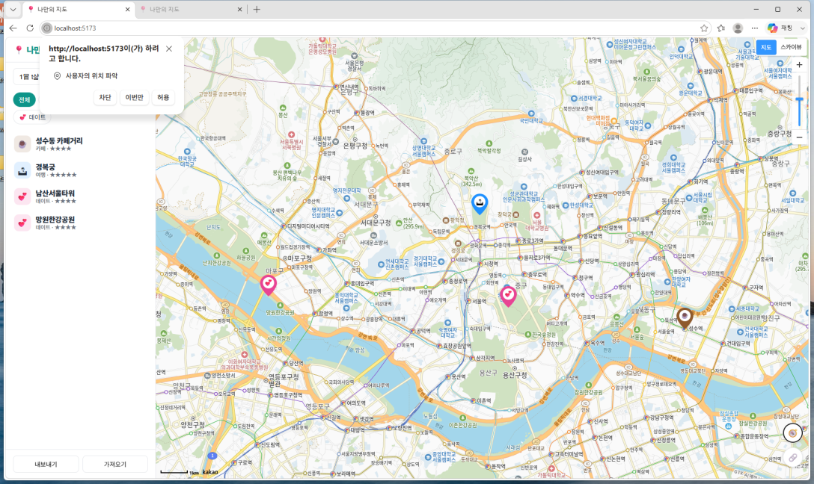
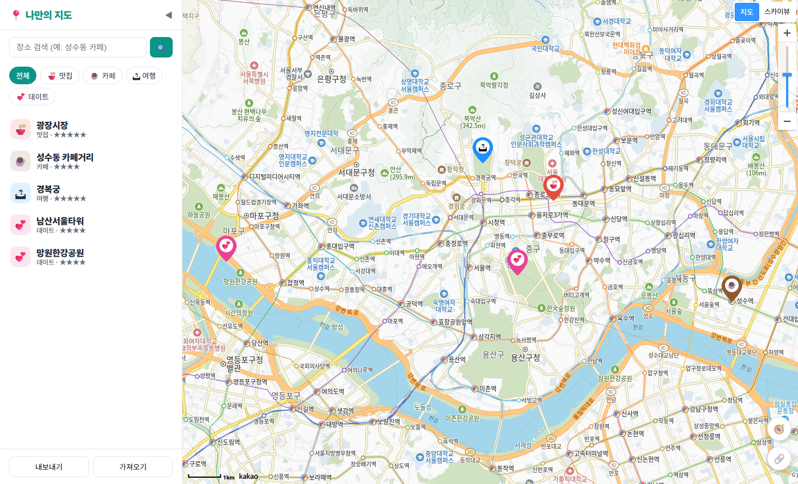
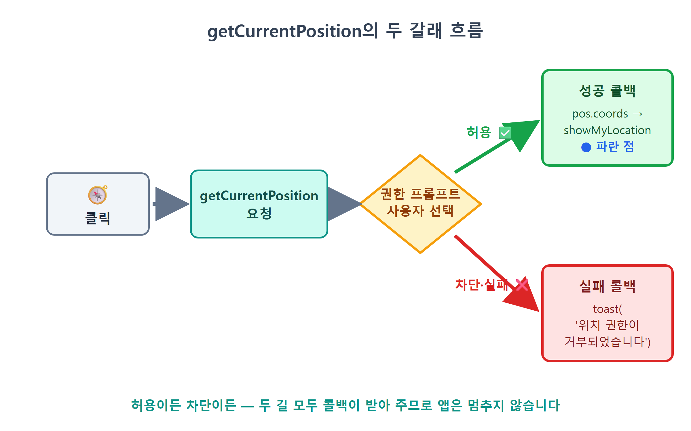
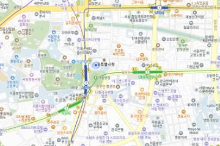
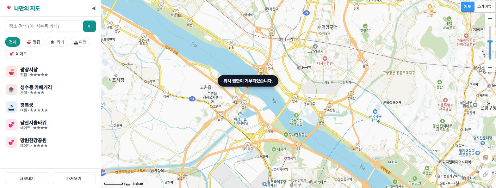
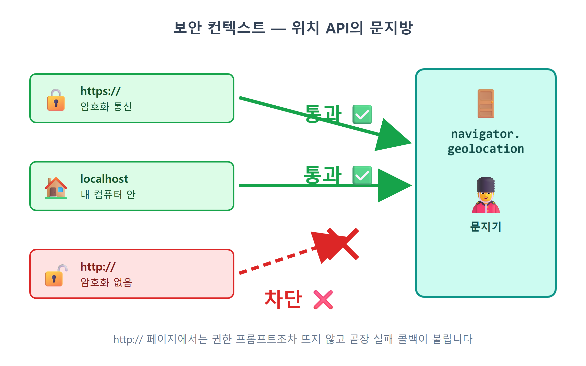

# 20장 내 위치 표시

!!! note "이 장에서 배우는 것"
    - 브라우저에 내장된 Geolocation API로 사용자의 현재 위치를 알아냅니다
    - 위치 권한 프롬프트가 왜 뜨는지, 언제 요청해야 좋은지(권한 UX)를 배웁니다
    - `getCurrentPosition`의 성공 콜백 / 실패 콜백 두 갈래 흐름을 처리합니다
    - CSS만으로 만든 파란 점 오버레이를 지도 위에 띄웁니다
    - 위치 기능이 https 또는 localhost에서만 동작하는 이유를 이해합니다

---

제3부까지 진행하며 지도 앱에 CRUD 기능을 모두 갖추었습니다. 이제 장소를 추가하고 저장하며, 목록에서 선택하고, 별점과 메모까지 남길 수 있습니다. 제4부에서는 앱의 편의성을 높일 기능을 하나씩 추가해 보겠습니다. 가장 먼저 구현할 기능은 내 위치 표시입니다.

야외에서 저장한 장소를 찾기 위해 앱을 열었다고 가정해 보겠습니다. 현재 지도는 서울시청을 중심으로 표시되어 있습니다. 만약 사용자가 직접 지도를 이동하며 현재 위치를 찾아야 한다면 매우 불편할 것입니다. 카카오맵이나 구글맵을 보면 현재 위치로 즉시 이동하는 버튼이 있으며, 이 버튼을 누르면 지도가 현재 위치로 이동하고 해당 위치에 파란색 점이 표시됩니다. 이번 장에서는 우리 앱에도 동일한 기능의 버튼을 만들어 보겠습니다.

이 기능은 카카오 SDK 없이도 대부분 구현할 수 있습니다. 사용자의 위치를 파악하는 기능 자체가 브라우저에 기본 탑재되어 있기 때문입니다. 즉, 위치 정보를 카카오에서 제공하는 것이 아닙니다. 카카오맵은 브라우저로부터 전달받은 좌표를 바탕으로 지도를 이동시키고 위치에 점을 표시하는 역할을 수행할 뿐입니다. 따라서 이번 장에서는 카카오 기능보다 웹 표준으로 정의된 Geolocation API를 중점적으로 다루겠습니다.

## 20.1 Geolocation API: 브라우저는 내 위치를 어떻게 알까

`Geolocation`이라는 이름은 지리적 위치를 의미하는 'geo'와 'location'을 합쳐 만들어졌습니다. 이름 그대로 사용자의 기기가 현재 지구상 어디에 위치하는지 브라우저에 요청하는 표준 API입니다. 크롬, 엣지, 사파리, 파이어폭스 등 주요 브라우저에서 모두 지원하므로 사용에 제한이 없습니다. 자바스크립트에서는 `navigator.geolocation`이라는 객체를 통해 해당 기능에 접근할 수 있습니다.

그런데 브라우저가 GPS 위성과 직접 통신하는 것도 아닌데, 어떻게 사용자의 위치를 정확하게 알 수 있을까요? 사실 브라우저는 운영체제에 위치 정보를 요청하며, 운영체제는 확보 가능한 정보를 최대한 활용하여 위치를 파악합니다. 위치 파악에 활용되는 주요 정보는 다음과 같습니다.

- GPS: 스마트폰이라면 GPS 칩이 위성 신호로 위치를 계산합니다. 오차 수 미터 수준으로 가장 정확하지만, 실내에서는 신호가 약해질 수 있습니다.
- 와이파이: 주변에 잡히는 와이파이 공유기 목록을 위치 데이터베이스와 대조합니다. 이런 공유기 조합이 보이면 강남역 근처라고 판단하는 식입니다. 도시에서라면 꽤 정확한 위치를 얻을 수 있습니다.
- IP 주소: 앞의 두 단서를 쓸 수 없을 때 마지막으로 씁니다. 인터넷 회선의 IP로 대략의 지역을 추정하는데, 시 단위까지만 맞고 동네는 자주 틀립니다.

{ width="760" }
/// caption
그림 20.1 — 브라우저의 위치 파악에 사용되는 세 가지 정보
///

따라서 동일한 코드라도 실행하는 기기에 따라 위치 정확도에 차이가 발생할 수 있습니다. GPS가 탑재된 스마트폰에서는 매우 정밀한 위치를 파악하지만, 유선 인터넷에 연결된 데스크톱 컴퓨터에서는 인접한 지역을 표시할 수도 있습니다. 이는 코드에 오류가 있는 것이 아니라 위치 파악 방식 자체의 한계입니다. 따라서 실제 위치와 약간의 오차가 발생하더라도 놀라지 않으시기 바랍니다.

한 가지 더 중요한 점이 있습니다. 위치 좌표를 계산하는 과정에 우리가 작성한 자바스크립트 코드는 관여하지 않습니다. 우리는 단순히 브라우저에 "위치 주세요"라고 요청할 뿐이며, 브라우저가 최선을 다해 위치를 파악하고 좌표 형태로 결과를 반환해 줍니다. 즉, 복잡한 계산 과정은 브라우저에 맡기고 우리는 최종 결과만 사용하게 됩니다.

!!! tip "팁"
개발자 도구 콘솔에 `navigator.geolocation`을 입력해 보십시오. `Geolocation {}` 객체가 정상적으로 표시된다면 해당 브라우저에서 위치 정보 기능을 사용할 수 있습니다. 최근 사용되는 대부분의 브라우저에서는 `undefined`가 표시되지 않지만, 기능을 사용하기 전에 먼저 지원 여부를 확인하는 습관을 들이는 것이 좋습니다. 이 확인 과정을 실제 코드에 어떻게 적용하는지에 대해 잠시 후 자세히 알아보겠습니다.

## 20.2 권한 프롬프트: 사용자에게 먼저 묻기

위치 정보는 매우 편리한 기능이지만 동시에 민감한 정보이므로 신중하게 다루어야 합니다. 사용자의 위치를 알 수 있다면 거주지, 직장, 이동 경로 등 많은 정보가 노출될 수 있기 때문입니다. 따라서 브라우저는 웹사이트가 임의로 위치 정보에 접근하는 것을 허용하지 않습니다. 웹사이트가 최초로 위치 정보를 요청하는 경우, 브라우저는 코드 실행을 잠시 멈추고 사용자에게 권한 사용 허가를 직접 묻는 절차를 수행합니다.

{ width="760" }
/// caption
그림 20.2 — 브라우저의 위치 정보 권한 요청 창
///

이와 같은 권한 요청용 대화상자를 권한 프롬프트라고 부릅니다. 사용자는 이 창에서 크게 세 가지 선택을 할 수 있으며, 선택한 내용에 따라 결과가 달라집니다.

| 사용자의 선택 | 무슨 일이 일어나나 |
|---|---|
| 허용 | 브라우저가 위치를 계산해 성공 콜백으로 좌표를 넘겨줍니다. 브라우저가 이 사이트의 허용을 기억합니다. |
| 차단 | 실패 콜백이 호출됩니다. 브라우저가 차단도 기억하므로, 다음부터는 프롬프트조차 뜨지 않고 곧장 실패합니다. |
| 무시(닫기) | 이번 요청만 실패하고, 다음에 다시 물어봅니다. |

개발자의 입장에서 반드시 기억해야 할 중요한 사항이 있습니다.

첫째, 사용자가 권한 요청을 거부하는 경우는 오류가 아닌 정상적인 응답이라는 점입니다. 사용자는 언제든지 권한 요청을 거부할 수 있으며, 우리가 만드는 앱은 그러한 경우에도 정상적으로 작동해야 합니다. 권한 허용을 전제로 앱을 제작하면 일부 기능만 구현한 것과 같습니다. 따라서 Geolocation API는 처음부터 성공 시 호출될 함수와 실패 시 호출될 함수를 함께 전달받는 구조로 설계되었습니다.

둘째, 권한 요청은 필요한 시점에 요청해야 한다는 점입니다. 웹사이트에 접속하자마자 즉시 위치 권한을 요청하는 경우, 사용자는 요청 목적을 알 수 없으므로 권한 요청을 거부할 가능성이 높습니다. 반면 사용자가 직접 위치 표시 버튼을 누른 직후 권한을 요청하면, 사용자가 요청 목적을 명확히 인지하고 있으므로 수용할 가능성이 높습니다. 따라서 권한 요청은 사용자가 특정 행동을 취한 후에 진행하는 것이 효과적입니다. 우리 앱에서도 페이지가 열릴 때 권한을 요청하는 것이 아니라, 사용자가 버튼을 클릭한 시점에 요청하는 것도 바로 이러한 이유 때문입니다.

!!! warning "주의"
테스트 과정에서 실수로 권한을 거부한 경우, 페이지를 새로고침하여도 권한 요청 창이 다시 나타나지 않습니다. 브라우저가 해당 사이트의 권한 설정을 기억하고 있기 때문입니다. 이 경우 크롬 브라우저 기준으로 주소창 왼쪽의 자물쇠 아이콘을 클릭한 후 사이트 설정에서 위치 권한을 "허용" 또는 "묻기"로 변경하고 페이지를 새로고침하면 권한 요청을 다시 받을 수 있습니다. 개발 과정에서 자주 접하게 되는 상황이므로 설정 변경 방법을 미리 기억해 두시기 바랍니다.

## 20.3 버튼 달고 위치 요청하기

이제 기본적인 개념 설명은 마치겠습니다. 이제부터는 실제로 코드를 작성해 보겠습니다. 구현할 내용은 지도 위에 위치 표시용 버튼을 추가하고, 버튼 클릭 시 위치 정보를 요청하며, 전달받은 좌표에 파란색 점을 표시하고 지도를 해당 위치로 이동시키는 함수를 제작하는 것입니다.

!!! tip "이렇게 물어보세요"
    > 지도 오른쪽 아래에 🧭 내 위치 버튼을 추가해줘. 누르면 Geolocation API로 현재 위치를 얻어서, 지도를 그 자리로 이동하고 카카오맵처럼 파란 점을 표시해줘. 파란 점은 CustomOverlay + CSS로 만들고, 권한이 거부되면 토스트로 알려줘. 위치 요청은 반드시 버튼을 눌렀을 때만 해야 해.

이번에 작성할 코드에 지금까지 배운 개념이 어떻게 반영되었는지 살펴보겠습니다. "버튼을 눌렀을 때만"은 앞서 설명한 권한 요청 시의 사용자 경험 원칙을 적용한 내용입니다. "거부되면 토스트로"은 위치 정보 획득 실패에 대한 처리 내용을 의미합니다. "CustomOverlay + CSS"는 제13장에서 배운 말풍선 표시 방식을 활용한 것입니다. 기본 개념을 정확하게 이해하고 활용하면 요청하는 내용이 명확해지고 원하는 결과물을 더욱 정확하게 얻을 수 있습니다.

제작 과정은 먼저 `index.html` 영역에 위치 표시용 버튼 요소를 추가하는 것부터 시작합니다.

```html
<main id="map-wrap">
  <div id="map"></div>
  <button id="btn-mylocation" title="내 위치">🧭</button>
</main>
```

그 다음 `style.css` 메서드를 사용하여 이 버튼을 지도 화면 위에 표시합니다.

```css
#btn-mylocation {
  position: absolute; right: 12px; bottom: 76px; z-index: 15;
  border: 1px solid var(--line); background: #fff; border-radius: 50%;
  width: 42px; height: 42px; cursor: pointer; font-size: 18px;
  box-shadow: 0 2px 6px rgb(0 0 0 / 0.15);
}
```

`#map-wrap` 스타일의 속성 값을 `position: relative`로 지정하면, 해당 요소에 `position: absolute` 속성을 적용하여 버튼이 지도 화면 위에 겹쳐서 표시되도록 할 수 있습니다. `border-radius: 50%` 속성으로 버튼을 원형으로 만들고, `z-index: 15` 속성으로 지도 타일보다 위에 표시되도록 우선순위를 조절하였습니다. 이렇게 제작하면 카카오맵에서 볼 수 있었던 위치 표시 버튼과 동일한 모양과 위치에 배치할 수 있습니다.

{ width="760" }
/// caption
그림 20.3 — 지도 우측 하단에 표시된 내 위치 표시 버튼
///

이제 제작한 버튼에 등록된 `src/main.js` 이벤트 처리 코드를 살펴보겠습니다. 코드의 분량은 비교적 짧지만 이 장에서 설명한 핵심 개념이 모두 포함되어 있습니다.

```js
// 내 위치
document.getElementById('btn-mylocation').addEventListener('click', () => {
  if (!navigator.geolocation) {
    toast('이 브라우저는 위치를 지원하지 않습니다.');
    return;
  }
  navigator.geolocation.getCurrentPosition(
    (pos) => showMyLocation(pos.coords.latitude, pos.coords.longitude),
    () => toast('위치 권한이 거부되었습니다.')
  );
});
```

이제 코드의 내용을 위에서부터 한 줄씩 자세히 살펴보겠습니다.

가장 먼저 `if (!navigator.geolocation)` 라인에서 Geolocation API의 지원 여부를 확인합니다. 만약 해당 기능을 지원하지 않는 브라우저라면 사용자에게 상황을 안내하고 더 이상의 진행을 중단합니다. 앞서 기능 사용 전에 존재 여부를 확인하라고 권장한 내용을 이 부분에 적용한 것입니다. 최근 브라우저에서는 해당 조건에 해당할 가능성이 낮지만, 이 몇 줄의 코드만으로도 다양한 환경에서 오류 없이 안정적으로 작동하도록 보장할 수 있습니다.

위치 정보 요청은 단 한 줄의 코드로 완료됩니다. `getCurrentPosition` 메서드는 이름 그대로 현재 위치 정보를 요청하는 기능입니다. 그런데 이 메서드의 반환 값을 변수에 저장하지 않는 점에 주목하시기 바랍니다. 즉, `const pos = navigator.geolocation.getCurrentPosition(...)`와 같은 형식으로 사용하지 않는다는 의미입니다. 이는 위치 좌표를 계산하는 데 상당한 시간이 소요될 수 있기 때문입니다. 권한 요청에 대한 사용자의 응답 대기 시간, GPS 신호 검색에 소요되는 시간 등을 예측할 수 없기 때문입니다. 따라서 이 시간 동안 앱의 작동을 멈추는 대신, 브라우저에 요청을 전달하고 작업 완료 시 지정한 함수를 호출해 달라고 요청하는 콜백 방식을 사용합니다. 이는 제15장에서 배웠던 `keywordSearch` 메서드가 검색 결과를 콜백 함수로 전달하던 방식과 동일한 원리입니다.

`getCurrentPosition` 메서드는 두 개의 콜백 함수를 전달받습니다. 첫 번째 인자로는 위치 정보 획득 성공 시 호출될 함수를 전달하며, 브라우저는 위치 정보를 성공적으로 찾은 경우 `pos` 객체와 함께 이 함수를 호출합니다. 두 번째 인자로는 위치 정보 획득 실패 시 호출될 함수를 전달합니다. 사용자가 권한 요청을 거부하였거나 위치 정보를 파악할 수 없는 경우 브라우저는 이 콜백 함수를 호출합니다. 성공한 경우 전달받은 좌표를 바탕으로 `showMyLocation`을 실행하여 지도에 파란색 점을 표시하고, 실패한 경우 `toast`을 실행하여 사용자에게 "위치 권한이 거부되었습니다"라고 상황을 알려줍니다. 오류가 발생하였을 때 아무런 반응이 없는 앱과 발생한 원인을 알려주는 앱은 사용자가 체감하는 사용 편의성 면에서 큰 차이가 있습니다.

이제 전달받은 위치 정보에서 실제 좌표 값을 추출하는 방법을 알아보겠습니다. 성공 콜백 함수의 매개변수로 전달받는 `pos` 객체는 `GeolocationPosition` 형식으로 구성되어 있으며, 실제 좌표 값은 이 객체 내부의 `pos.coords` 속성에 저장되어 있습니다. 우리는 그중 위도에 해당하는 `latitude` 값과 경도에 해당하는 `longitude` 값을 사용하게 됩니다. 이는 제9장에서 배웠던 위도와 경도의 개념과 동일합니다. 또한 `coords` 속성에는 위치 정보의 오차 범위를 미터 단위로 알려주는 `accuracy` 값도 포함되어 있으므로, 전달받은 좌표 정보의 신뢰 수준을 함께 파악할 수 있습니다.

{ width="760" }
/// caption
그림 20.4 — 현재 위치 요청의 성공 및 실패 처리 흐름
///

## 20.4 파란 점 오버레이: CSS 세 줄로 그리기

이제 추출한 좌표 정보를 바탕으로 지도에 위치를 표시하는 방법을 알아보겠습니다. 앞서 제작한 코드에서 `src/mapView.js`에 정의된 `showMyLocation` 함수를 살펴보겠습니다.

```js
let myLocationMarker = null;

export function showMyLocation(lat, lng) {
  const pos = new kakao.maps.LatLng(lat, lng);
  if (!myLocationMarker) {
    const el = document.createElement('div');
    el.className = 'my-location-dot';
    myLocationMarker = new kakao.maps.CustomOverlay({ content: el, position: pos, zIndex: 5 });
  }
  myLocationMarker.setPosition(pos);
  myLocationMarker.setMap(map);
  map.setLevel(4);
  map.panTo(pos);
}
```

지도에 표시할 파란색 위치 표시점은 제13장에서 배운 CustomOverlay를 활용하여 제작하였습니다. `content` 속성에는 `my-location-dot` 클래스가 지정된 빈 `div` 요소만을 전달하였습니다. 즉, 별도의 이미지 파일을 사용하지 않고 CSS 스타일만으로 위치 표시점을 구현한 것입니다. `style.css`에 해당하는 CSS 스타일 정의 내용은 다음과 같습니다.

```css
.my-location-dot {
  width: 16px; height: 16px; border-radius: 50%;
  background: #2563eb; border: 3px solid #fff;
  box-shadow: 0 0 0 6px rgb(37 99 235 / 0.25);
}
```

작성한 CSS 스타일을 살펴보면 카카오맵에서 사용되는 파란색 위치 표시점과 동일한 모양으로 제작되었음을 알 수 있습니다. 가로 세로 16px 크기의 정사각형 요소에 `border-radius: 50%` 속성을 적용하여 원형으로 만들고, `#2563eb` 색상으로 배경색을 지정한 후, 흰색 테두리를 3px 두께로 추가하였습니다. 마지막 줄의 스타일 속성에 주목하시기 바랍니다. 그림자 효과의 `box-shadow` 값을 0으로 지정하고 흐림 값을 6px로 지정하면, 일반적인 그림자 효과가 아닌 반투명한 파란색 테두리 효과가 나타납니다. 마치 GPS 위치 정보의 오차 범위를 나타내는 것처럼 보이는 이 효과는 단 한 줄의 CSS 스타일 설정만으로 구현할 수 있습니다.

자바스크립트 쪽에서는 `let myLocationMarker = null`과 `if (!myLocationMarker)` 조합을 눈여겨보세요. 파란 점 오버레이는 처음 한 번만 만들고, 그다음부터는 재사용합니다. 버튼을 열 번 누른다고 점이 열 개 생기는 것은 아닙니다. 하나뿐인 점을 `setPosition(pos)`으로 새 위치에 옮깁니다. 내 위치가 동시에 두 곳일 수는 없습니다. 그래서 점도 하나만 둡니다. 13장에서 열린 말풍선을 하나만 두려고 `openOverlay` 변수 하나로 관리했던 방식과 같습니다.

마지막 두 줄의 코드 `setLevel(4)`와 `panTo(pos)`는 제10장에서 배운 내용을 그대로 활용한 것입니다. 지도의 확대 수준을 적절하게 조절한 후, 지도 화면을 해당 좌표 위치로 부드럽게 이동시키는 기능입니다. 이는 `focusPlace` 기능을 사용하여 저장된 장소 위치로 지도를 이동시키던 방식과 동일합니다.

이제 제작한 앱을 실제로 실행하여 확인해 보겠습니다. `npm run dev` 기능이 활성화된 상태에서 브라우저 페이지를 새로고침하고 위치 표시 버튼을 클릭하십시오. 권한 요청 창이 나타나면 허용을 선택하십시오. 잠시 후 지도가 부드럽게 이동하며, 사용자의 현재 위치에 흰색 테두리가 적용된 파란색 원형 표시점이 나타날 것입니다.

{ width="520" }
/// caption
그림 20.5 — 현재 위치에 표시된 위치 표시점
///

이제 권한 요청을 거부한 경우의 동작도 확인해 보겠습니다. 브라우저 주소창의 사이트 설정에서 위치 정보 권한을 차단으로 변경한 후, 다시 위치 표시 버튼을 클릭해 보십시오. 이때 앱의 작동이 멈추는 대신 화면 하단에 알림 창이 나타나 "위치 권한이 거부되었습니다"라고 사용자에게 안내 메시지를 표시하면 정상적으로 기능이 구현된 것입니다. 이제 위치 정보 요청에 대한 성공 및 실패 모든 경우에 대한 처리가 완료되었습니다. 테스트가 종료된 후에는 브라우저의 위치 권한 설정을 다시 "묻기" 상태로 되돌려 두시기 바랍니다.

{ width="760" }
/// caption
그림 20.6 — 위치 권한 거부 시 표시되는 안내 메시지
///

!!! tip "팁"
데스크톱 컴퓨터 환경에서는 위치 표시점이 실제 위치와 약간의 거리 차이를 보일 수도 있습니다. 이는 프로그램에 오류가 있는 것이 아니라 앞서 설명한 위치 정보 파악 방식의 한계로 인한 현상입니다. 보다 정확한 좌표 값을 바탕으로 테스트를 진행하고 싶은 경우, 브라우저 개발자 도구의 센서 패널 기능을 활용할 수 있습니다. F12 키를 누른 후 개발자 도구 우측 상단의 메뉴에서 도구 더보기 항목을 통하여 센서 패널을 열고, 위치 정보를 "Tokyo"로 선택하거나 직접 위도와 경도 값을 입력하여 지정할 수 있습니다. 실제로 여행용 애플리케이션을 개발하는 개발자들도 이 방법을 활용하여 다른 지역의 위치 정보를 테스트하고 있습니다.

## 20.5 https와 localhost: 보안 컨텍스트 조건

마지막으로, 이후에 발생할 수 있는 중요한 한 가지 문제점을 미리 알아보겠습니다. Geolocation API는 모든 웹페이지에서 사용할 수 있는 것이 아니라 특정 조건이 충족된 환경에서만 사용 가능합니다. 브라우저는 이 API를 보안 컨텍스트 환경에서만 접근할 수 있도록 제한하고 있으며, 쉽게 말해 "안전하다고 믿을 수 있는 페이지" 환경에서만 사용할 수 있습니다. 이 판단 기준은 웹페이지의 접속 주소를 기준으로 적용됩니다.

- `https://`로 시작하는 페이지 — ✅ 동작
- `http://localhost` (우리의 `localhost:5173` 포함) — ✅ 동작 (개발용 특례)
- 그 밖의 `http://` 페이지: ❌ 차단. 권한 프롬프트조차 뜨지 않고 곧장 실패 콜백을 부릅니다.

그렇게 되는 이유는 HTTP 통신 프로토콜의 특성과 관련이 있습니다. `http://` 프로토콜을 사용하여 주고받는 데이터는 암호화 과정을 거치지 않으므로 인터넷을 통과하는 도중에 제3자가 내용을 엿볼 수 있는 가능성이 존재합니다. 특히 동일한 네트워크에 접속 중인 제3자는 전송되는 정보를 상대적으로 쉽게 확인할 수 있습니다. 따라서 사용자의 위치와 같은 민감한 정보를 암호화되지 않은 통신 방식으로 전송하는 것은 위험하므로, 브라우저가 자체적으로 해당 기능의 사용을 제한하는 것입니다. 반면 `https://` 프로토콜은 통신 내용 전체를 암호화하므로 브라우저에서 Geolocation API의 사용을 허용합니다. 또한 `localhost` 주소를 통한 접속은 사용자의 컴퓨터 내부에서만 통신이 이루어지므로 제3자가 정보를 엿볼 수 있는 경로 자체가 존재하지 않습니다. 따라서 개발의 편의성을 위하여 예외적으로 Geolocation API의 사용을 허용하고 있습니다.

{ width="760" }
/// caption
그림 20.7 — 보안 컨텍스트: Geolocation API 사용의 기준
///

현재 우리는 `localhost:5173` 주소를 통하여 개발을 진행하고 있으므로 Geolocation API가 정상적으로 작동합니다. 그러나 문제는 서비스를 실제로 배포하는 시점에 발생할 수 있습니다. 제25장에서 GitHub Pages로 서비스를 배포하는 경우 접속 주소가 `https://아이디.github.io/...` 형식이므로 아무런 문제가 없습니다. 하지만 다른 방식으로 서비스를 배포하였는데 접속 주소가 `http://` 형식인 경우, 개발 과정에서는 아무런 문제가 없었던 위치 표시 기능이 갑자기 작동하지 않게 될 수 있습니다. 이는 프로그램 코드 자체에는 아무런 변경 사항이 없지만 접속 주소의 형식으로 인하여 Geolocation API에 접근할 수 없게 되기 때문입니다. 이 내용을 기억해 두시면 서비스 배포 후 발생하는 문제의 원인을 보다 빠르게 파악할 수 있습니다.

!!! warning "주의"
동일한 이유로 인하여, 스마트폰과 같은 다른 기기에서 `http://192.168.0.x:5173` 주소 형식으로 접속 중인 개발 서버에 접근하는 경우에도 위치 표시 기능이 정상적으로 작동하지 않습니다. 즉, 로컬호스트 주소에 적용되는 예외 사항은 오직 `localhost`라는 특수한 주소에만 해당된다는 의미입니다. 따라서 스마트폰의 GPS 기능을 통하여 직접 테스트해 보고 싶은 경우, 제25장에서 배포하는 HTTPS 기반의 주소를 통하여 접속한 후 테스트를 진행하시는 것이 편리합니다.

## 20.6 마무리

버튼 하나, 함수 하나, CSS 네 줄. 코드 분량으로 치면 이 책에서 손꼽게 짧은 장이었습니다. 그렇다고 그 뒤에 있는 개념까지 가벼운 것은 아닙니다. 브라우저가 위치를 알아내는 방법, 사용자에게 물어보고 쓰는 권한 문화, 성공과 실패 두 갈래를 모두 준비하는 비동기 처리, 그리고 https라는 문지방까지 다뤘습니다. 앞으로 카메라, 마이크, 알림 같은 다른 브라우저 권한을 만나도 오늘 배운 틀을 그대로 쓸 수 있습니다. 요청은 사용자가 행동한 뒤에 하고, 거부는 정상 선택지로 두고, 민감한 API는 보안 컨텍스트에서만 씁니다.

!!! abstract "이 장의 핵심"
    - `navigator.geolocation`으로 쓰는 Geolocation API는 브라우저에 내장된 표준 API로, GPS·와이파이·IP를 단서로 위치를 계산합니다. 카카오 SDK가 제공하는 기능은 아닙니다.
    - 위치를 요청하면 브라우저가 권한 프롬프트를 띄웁니다. 거부는 오류가 아니라 사용자가 고를 수 있는 답입니다. 권한은 페이지를 여는 순간이 아니라 사용자가 버튼을 누른 순간에 요청하는 편이 낫습니다.
    - `getCurrentPosition(성공콜백, 실패콜백)` — 성공 시 `pos.coords.latitude / longitude`로 좌표를 얻고, 실패 시 토스트로 안내합니다.
    - 파란 점은 `CustomOverlay`와 CSS로 만듭니다. `border-radius: 50%`와 흰 `border`, 퍼짐만 준 `box-shadow` 링을 쓰고, 오버레이는 하나만 만들어 `setPosition`으로 재사용합니다.
    - Geolocation은 https 또는 localhost(보안 컨텍스트)에서만 쓸 수 있습니다. http 배포 주소에서는 프롬프트 없이 곧장 실패합니다.

!!! question "잠깐 생각해 봅시다"
Q1. 웹사이트에 접속하자마자 즉시 위치 권한을 요청하는 경우와 사용자가 직접 버튼을 클릭한 후에 권한을 요청하는 경우를 비교하였을 때, 사용자가 느끼는 차이점은 무엇이라고 생각하십니까? 또한 이 원칙을 우리 앱의 다른 기능에 적용할 수 있는 부분이 있다면 어디인지 생각해 보십시오.

____________________________________________

____________________________________________

Q2. 위치 표시용 파란색 점을 `Marker` 방식 대신 `CustomOverlay` 방식으로 제작한 이유는 무엇일까요? 제13장에서 배운 말풍선 제작 방식을 참고로 하여 두 가지 방식의 차이점을 설명해 보십시오.

____________________________________________

____________________________________________ ch20.txt

!!! example "확인 문제"
    1. 성공 콜백에서 `pos.coords.accuracy`를 콘솔에 출력하도록 Claude Code에게 시켜 보세요. 여러분의 환경에서 오차 반경은 몇 미터로 나오나요? 스마트폰과 PC의 값을 비교해 보세요.
    2. 실패 콜백은 사실 `err` 객체를 인자로 받습니다. `err.code`가 1(권한 거부), 2(위치 계산 불가), 3(시간 초과)일 때 각각 다른 토스트 메시지를 보여 주도록 개선해 보세요.
    3. `.my-location-dot`의 `box-shadow` 퍼짐 값을 6px에서 12px로, 색의 투명도를 바꿔 가며 링의 느낌이 어떻게 달라지는지 실험해 보세요.
    4. 개발자도구 센서 패널에서 위치를 "Berlin"으로 오버라이드한 뒤 🧭 버튼을 눌러, 파란 점이 베를린에 찍히는지 확인해 보세요.

!!! info "더 찾아보기"
    - `watchPosition` — 한 번이 아니라 이동할 때마다 계속 위치를 받아오는 메서드. 내비게이션처럼 파란 점이 나를 따라다니게 하려면 이것을 씁니다 (해제는 `clearWatch`).
    - `enableHighAccuracy` — `getCurrentPosition`의 세 번째 인자(옵션)로 넘기는 정확도 우선 모드. 배터리를 더 쓰는 대신 GPS를 적극 활용합니다.
    - `Permissions API` — `navigator.permissions.query`로 권한 상태(granted/denied/prompt)를 묻기 전에 미리 확인하는 표준 API.
    - `Geolocation heading/speed` — `pos.coords`에 함께 들어 있는 진행 방향·속도 값. 기기가 이동 중일 때만 값이 들어옵니다.

> 다음 장으로. 내 지도가 근사해질수록 누군가에게 보여 주고 싶어지겠지요. 21장에서는 지금 보고 있는 지도의 위치와 확대 레벨을 URL 하나에 담아 공유하는 기능을 만듭니다. 링크를 받은 친구가 열면 내가 보던 화면이 그대로 열립니다. 주소창의 `#` 뒤에 상태를 싣는 URL 해시 기법과 클립보드 API를 배웁니다.

