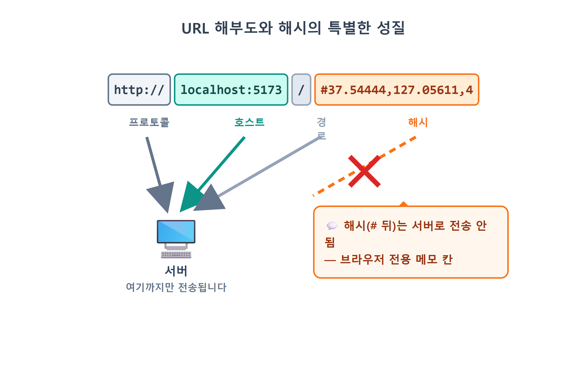
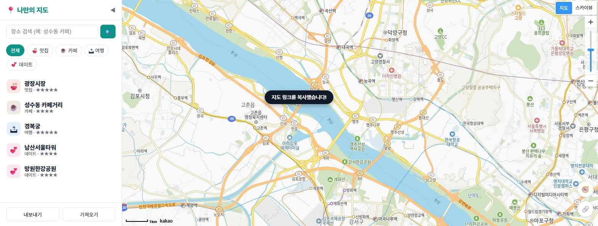
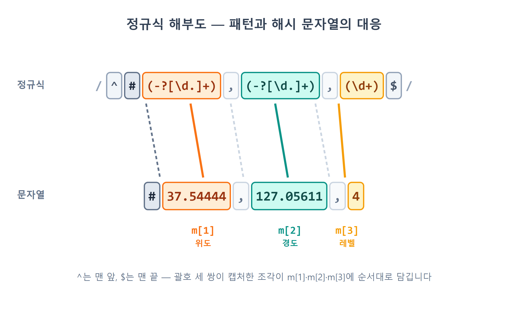
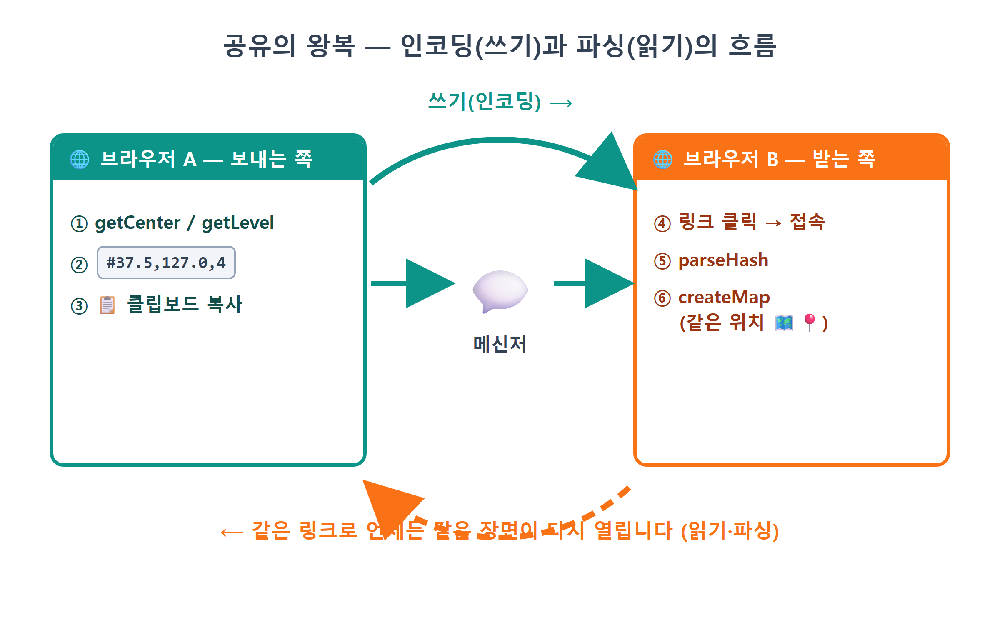
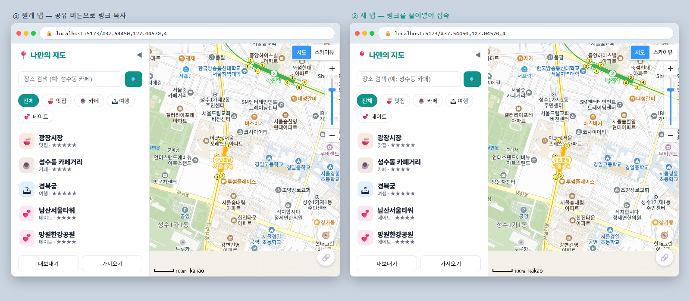
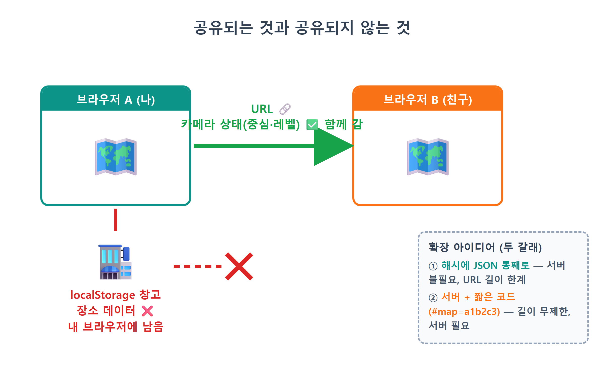

# 21장 URL로 지도 공유

!!! note "이 장에서 배우는 것"
    - URL의 구조와 해시(#) 부분이 하는 특별한 역할을 이해합니다
    - 지도의 현재 상태(중심 좌표·확대 레벨)를 `#lat,lng,level` 형식의 문자열로 인코딩합니다
    - 정규식(정규 표현식)으로 해시를 안전하게 파싱해 지도 상태로 되돌립니다
    - `navigator.clipboard.writeText`로 링크를 클립보드에 복사합니다
    - `history.replaceState`로 방문 기록을 어지럽히지 않고 주소창만 바꿉니다

---

20장까지 진행하면서 우리의 지도 기능은 상당히 쓸 만하게 발전되었습니다. 장소를 저장하고 검색하며, 별점과 메모를 추가하고, 심지어 내 위치까지 표시하게 되었습니다. 이쯤 되면 자연스럽게 이런 생각이 들 것입니다. 성수동 카페 거리를 보기 좋은 확대 수준으로 맞춘 후, 그 화면을 친구에게 공유하고 싶어질 것입니다. "야, 여기 봐봐."

하지만 현재는 그런 방법이 없습니다. 주소 표시줄의 URL을 복사하여 보내면, 받는 사람의 화면에는 서울시청 부근의 축척 레벨7 기본 화면이 나타날 것입니다. 9장에서 지도의 초기 위치를 코드에 고정해 두었기 때문입니다. 내가 현재 보고 있는 위치 정보는 오직 내 브라우저만 알고 있을 뿐, URL에 그 정보가 포함되어 있지는 않습니다.

카카오맵이나 구글맵은 이미 이 문제를 해결한 상태입니다. 지도를 이동시킨 후 주소 표시줄을 보면, URL 끝에 좌표와 같은 숫자가 붙어 있을 것입니다. 그 URL을 복사하여 보내면 받는 사람도 동일한 위치의 지도를 볼 수 있습니다. 지도의 상태 정보를 URL 안에 포함하고 있기 때문입니다. 이번 장에서는 우리의 지도에도 동일한 기능을 구현해 보겠습니다. 서버나 데이터베이스, 로그인 기능은 필요하지 않습니다. URL 문자열 하나만으로 현재 보고 있는 지도 화면을 그대로 공유할 수 있게 됩니다.

## 21.1 URL을 해부해 봅시다: 해시(#)라는 특별한 자리

먼저 URL의 구조가 어떻게 구성되는지 자세히 살펴보겠습니다. 개발 서버 주소에 해시 부분을 추가한 예시를 통해 각 부분의 명칭과 역할을 알아보겠습니다.

```
http://localhost:5173/#37.54444,127.05611,4
└──┬──┘└─────┬──────┘│└──────────┬─────────┘
프로토콜    호스트    경로       해시(hash)
```

- 프로토콜(`http:`): 통신 규약. 배포하면 `https:`가 됩니다.
- 호스트(`localhost:5173`): 어느 서버의 몇 번 포트인지. 자바스크립트에서는 프로토콜과 호스트를 합쳐 `location.origin`으로 읽습니다.
- 경로(`/`): 서버 안의 어느 페이지인지 가리키며, `location.pathname`으로 읽습니다.
- 해시(`#37.54444,...`): `#` 기호부터 끝까지. `location.hash`로 읽습니다.

그중에서도 해시는 URL의 다른 부분들과 두 가지 점에서 큰 차이가 있습니다.

첫째, 브라우저는 해시 부분을 서버로 전송하지 않습니다. 서버에 페이지를 요청할 때 `#` 뒤의 내용은 제외하고 전송합니다. 따라서 서버 입장에서는 `#37.5,127.0,4`이 붙어 있든 붙어 있지 않든 동일한 요청으로 간주하며, 동일한 `index.html`을 반환합니다. 해시는 오직 브라우저 내부에서만 사용하도록 설계된 부분입니다.

둘째, 해시 값이 변경되어도 페이지가 다시 로드되지 않습니다. 경로 부분이 변경되면 브라우저는 전체 페이지를 다시 불러오지만, 해시만 변경되면 페이지는 그대로 유지된 채 관련 값만 갱신됩니다. 본래 해시는 같은 문서 내에서 특정 위치로 바로 이동하는 용도로 사용되기 때문입니다. 긴 문서에서 목차 링크를 클릭하면 해당 위치로 이동하는 것을 떠올리면 이해하기 쉬울 것입니다.

이 두 가지 특성을 함께 생각해 보겠습니다. 해시는 서버로 전송되지 않고, 값이 변경되어도 페이지가 다시 로드되지 않으며, 자바스크립트에서 자유롭게 읽고 쓸 수 있습니다. 즉, 애플리케이션의 상태 정보를 URL에 포함하기에 매우 적합한 부분이라고 할 수 있습니다. 실제로 많은 웹 애플리케이션에서 이 방식을 사용하고 있습니다. 이처럼 URL에 상태 정보를 포함하여 공유하는 방식을 딥 링크(deep link)[^1]라고 부릅니다.

{ width="760" }
/// caption
그림 21.1 — URL 구조와 해시의 특별한 성질
///

## 21.2 상태를 문자열에 담기: 인코딩 설계

이제 지도 상태 중에서 어떤 정보를 URL에 포함할지 정하겠습니다. "지금 보고 있는 화면"을 복원하는 데 필요한 최소한의 정보는 무엇일까요? 9장에서 지도를 초기화할 때 전달했던 세 가지 요소를 떠올리면 답을 찾을 수 있습니다. 지도 중심의 위도, 경도, 그리고 확대 레벨입니다. 이 세 가지 숫자만 있으면 언제든지 동일한 지도 화면을 다시 표시할 수 있습니다.

이 세 숫자를 하나의 문자열로 변환할 규칙을 정하겠습니다. 가장 간단한 방식을 사용하도록 하겠습니다.

```
#위도,경도,레벨        →  예: #37.54444,127.05611,4
```

세 숫자를 쉼표로 구분하여 연결하는 방식입니다. 이처럼 데이터를 약속된 형식의 문자열로 변환하는 과정을 인코딩이라고 합니다. 반대로 문자열을 다시 원래의 데이터로 복원하는 과정은 디코딩 또는 파싱이라고 부릅니다. 17장에서 다루었던 `JSON.stringify`와 `JSON.parse`도 바로 이 관계입니다. 이번에는 JSON 형식 대신 우리가 직접 정한 쉼표 구분 방식을 사용하겠습니다. 인코딩과 디코딩은 항상 한 쌍으로 일관되게 설계하는 것이 좋습니다. 데이터를 작성하는 쪽과 읽어오는 쪽의 규칙이 다르면 공유한 링크가 정상적으로 작동하지 않게 됩니다.

추가로 한 가지 사항을 정해야 합니다. 지도에서 좌표 값을 가져오면 `37.544438912...`처럼 소수점 이하 자릿수가 매우 길게 나타날 수 있습니다. 이 모든 자릿수를 URL에 포함할 필요는 없습니다. 위도와 경도의 소수점 다섯 번째 자리는 실제 거리로 약 1미터에 해당합니다. 지도를 공유할 때 1미터의 오차는 문제가 되지 않으므로, 소수점 다섯 번째 자리까지 잘라서 사용하여도 충분합니다. 자바스크립트에서는 `toFixed(5)`를 사용하여 숫자를 소수점 이하 5자리 문자열 형식으로 반올림할 수 있습니다. URL은 짧을수록 가독성이 좋고 메신저에서 자동으로 줄 바뀌는 현상도 방지할 수 있습니다.

!!! tip "팁"
이처럼 URL에 상태 정보를 포함하는 방식은 지도 애플리케이션 외에도 광범위하게 활용되고 있습니다. 예를 들어 90초 시점부터 재생하도록 지정한 유튜브의 `?t=90`, 3페이지를 가격 순으로 정렬하도록 지정한 쇼핑몰의 `?page=3&sort=price`처럼, 잘 설계된 웹 서비스의 URL에는 현재 화면 상태에 대한 정보가 담겨 있습니다. 즉, URL만 있으면 해당 화면을 그대로 재현할 수 있는 것입니다. 평소에 자주 사용하는 서비스의 주소 표시줄을 유심히 살펴보는 습관을 들이면, 훌륭한 설계 방식을 익히는 데 큰 도움이 될 것입니다.

## 21.3 공유 버튼 만들기: 인코딩 + 클립보드 복사

이제 실제로 기능을 구현해 보겠습니다. 화면 오른쪽 아래쪽, 20장에서 추가했었던 내 위치 버튼 아래에 공유 버튼을 하나 추가하겠습니다. 이 버튼을 누르면 현재 지도 상태를 해시로 변환하여 주소 표시줄에 반영하고, 완성된 링크를 클립보드에 복사한 후, 완료 상태를 알려주는 메시지를 표시하는 기능입니다. 이 작업은 AI 도구를 활용하여 구현해 보겠습니다.

!!! tip "이렇게 물어보세요"
    > src/share.js를 새로 만들어줘. initShare 함수를 export하고, id가 btn-share인 🔗 공유 버튼을 내 위치 버튼 아래에 두고 index.html과 style.css도 함께 고쳐줘. 이 버튼을 클릭하면 지도의 현재 중심 좌표와 레벨을 #위도,경도,레벨 해시로 만들어줘. 좌표는 toFixed(5)로 자르고, history.replaceState로 주소창에 반영한 다음, 전체 URL을 navigator.clipboard.writeText로 복사하고 toast로 "지도 링크를 복사했습니다!"라고 알려줘. 클립보드 복사가 실패할 수도 있으니 try-catch로 감싸고 실패 시 안내 토스트를 띄워줘.

프롬프트에 이 장에서 배운 설계가 그대로 들어 있습니다. `toFixed(5)`, `replaceState`, 실패 대비까지 우리가 결정했고, AI는 그 결정을 코드로 옮깁니다. Claude Code가 만들어 준 `src/share.js`의 앞부분을 봅시다.

```js
// src/share.js — URL 해시로 지도 상태 공유 (#lat,lng,level)
import { getMap } from './mapView.js';
import { toast } from './sidebar.js';

export function initShare() {
  document.getElementById('btn-share').addEventListener('click', async () => {
    const map = getMap();
    const c = map.getCenter();
    const hash = `#${c.getLat().toFixed(5)},${c.getLng().toFixed(5)},${map.getLevel()}`;
    const url = location.origin + location.pathname + hash;
    history.replaceState(null, '', hash);
    try {
      await navigator.clipboard.writeText(url);
      toast('지도 링크를 복사했습니다!');
    } catch {
      toast('복사 실패 — 주소창의 URL을 직접 복사하세요.');
    }
  });
}
```

코드의 길이는 약 15줄 정도로 간결하지만, 그렇다고 새롭게 배울 내용이 적은 것은 아닙니다. 코드의 첫 부분부터 함께 자세히 살펴보겠습니다.

지도 상태 가져오기. `map.getCenter()`는 현재 화면 중심 좌표에 대한 `LatLng` 객체를 반환하며, `map.getLevel()`은 현재 확대 레벨 값을 반환합니다. 10장에서는 `setCenter`·`setLevel`를 사용하여 지도에 명령을 전달했다면, 이번에는 반대로 `get-` 메서드를 사용하여 지도의 현재 상태 정보를 읽어오는 것입니다. 두 가지 방식은 서로 짝을 이루는 기능이라고 할 수 있습니다.

템플릿 문자열로 인코딩. 백틱(`` ` ``) 문자열 안에 `${...}`를 끼워 넣어 `#37.54444,127.05611,4` 형태를 조립합니다. `toFixed(5)`로 좌표를 다섯 자리에서 반올림하는 부분도 앞에서 정한 대로입니다. 이 장에서 인코딩을 담당하는 코드는 이 한 줄뿐입니다.

`history.replaceState(null, '', hash)`. 이 부분에서는 주소 표시줄의 URL을 변경하는 작업을 수행합니다. `location.hash = ...`에 값을 할당하는 방식으로도 동작은 하지만, 예상치 못한 문제가 발생할 수 있습니다. `location.hash`에 값을 할당하면 브라우저는 페이지가 이동한 것으로 간주하여 방문 기록에 새로운 항목을 추가하게 됩니다. 즉, 사용자가 공유 버튼을 다섯 번 누르면 방문 기록이 다섯 칸이나 쌓이게 되는 것입니다. 이 경우 뒤로 가기 버튼을 클릭할 때마다 이전 상태를 하나씩 되돌아가야 하므로 매우 불편할 것입니다. 반면 `history.replaceState`는 이름 그대로 현재 방문 기록 항목을 새로운 내용으로 교체할 뿐이므로, 불필요한 기록이 쌓이지 않습니다. 첫 번째 매개변수에는 기록에 함께 저장할 데이터를 지정하는데, 여기서는 필요하지 않으므로 `null`을 전달합니다. 두 번째 매개변수는 페이지 제목을 지정하는 부분이지만, 최신 브라우저에서는 현재 사용하지 않으므로 빈 문자열을 전달합니다. 마지막 매개변수에는 변경할 새로운 주소를 전달합니다. 이처럼 상태 정보를 URL에 포함하는 애플리케이션들은 대부분 주소 표시줄만 업데이트하고 방문 기록에는 영향을 주지 않는 방식을 사용합니다.

클립보드 API 활용. `navigator.clipboard.writeText(url)`는 전달받은 문자열을 사용자의 클립보드에 복사하는 기능입니다. 클립보드에는 비밀번호와 같은 민감한 정보도 저장될 수 있으므로, 브라우저에서는 이 API 사용에 제한을 두고 있습니다. 20장에서 다루었던 위치 정보 API와 마찬가지로, 클립보드 API는 HTTPS나 localhost 환경에서만 동작하며, 사용자의 클릭과 같은 실제 상호작용을 통해 실행된 코드에서만 호출할 수 있습니다. 또한 이 함수는 처리 결과를 Promise 형태로 반환하므로, `await`를 사용하여 처리가 완료될 때까지 기다려야 합니다. 클릭 이벤트 리스너 함수 앞에 `async`를 붙인 것도 바로 이 이유 때문입니다.

try-catch 구문을 통한 예외 처리. 요청 조건이 충족되지 않았거나 권한이 거절된 경우, `writeText`는 정상적으로 실행되지 않을 수 있습니다. 이처럼 실패 가능성이 있는 API를 호출할 때는 17장에서 localStorage를 다루었을 때와 마찬가지로 try-catch 구문으로 감싸 안전하게 처리하는 것이 좋습니다. 주목할 점은 오류가 발생한 경우에도 사용자가 할 수 있는 조치를 안내한다는 것입니다. 설령 클립보드 복사에 실패하였다고 하더라도, `replaceState` 덕분에 주소 표시줄에는 이미 완성된 링크가 표시되어 있습니다. 따라서 사용자에게 직접 복사하도록 안내하면, 사용자는 여전히 목적을 달성할 수 있습니다. 즉, 기능이 실패하더라도 다른 방법으로 동일한 목적을 이룰 수 있도록 코드의 흐름을 구성한 것입니다.

이제 `main.js`에서 `initShare()`를 호출하여 이벤트를 연결하면, 공유 버튼이 정상적으로 동작하게 됩니다. 해당 부분의 코드는 잠시 후에 다시 살펴보겠습니다. 개발 서버를 실행한 후, 지도를 원하는 위치로 이동시키고 공유 버튼을 클릭해 보시기 바랍니다.

{ width="760" }
/// caption
그림 21.2 — 공유 버튼 클릭 시: 주소 표시줄에 해시가 생성되고 복사 완료 메시지가 표시되는 화면
///

주소 표시줄에 `#37.5...,127.0...,4` 형식의 해시가 나타나고 메시지가 표시된다면, 지금까지의 내용은 정상적으로 구현된 것입니다. 메모장을 열고 붙여넣기 기능을 사용하여 링크가 정상적으로 복사되었는지 확인해 보십시오. 다만, 이 링크를 새 탭에 붙여넣어 열면 여전히 서울시청 위치의 지도가 표시될 것입니다. 현재까지는 해시를 생성하는 코드만 작성했고, 해시 값을 읽어와 지도에 적용하는 코드는 아직 구현하지 않았기 때문입니다.

## 21.4 정규식으로 해시 읽기: 디코딩

이제 남은 작업, 즉 해시 값을 읽어와 지도의 초기 위치로 설정하는 파서를 구현하겠습니다. 웹 페이지에 접속할 때 URL의 해시 부분을 읽어와 지도의 초기 위치로 적용하는 과정입니다.

!!! tip "이렇게 물어보세요"
    > share.js에 parseHash 함수를 추가로 export해줘. location.hash가 #위도,경도,레벨 형식이면 { lat, lng, level } 객체(모두 숫자)를 돌려주고, 형식이 다르거나 해시가 없으면 null을 돌려줘. 형식 검사는 정규식으로 엄격하게 하고, 정규식을 통과해도 위도 -90~90, 경도 -180~180, 레벨 1~14 범위를 벗어나면 null을 돌려줘. 그리고 main.js에서 지도를 만들 때 parseHash 결과가 있으면 그 위치와 레벨로, 없으면 기존 기본값으로 시작하게 고쳐줘.

AI가 작성한 코드를 보면, `share.js`의 아래쪽에 새로운 함수가 추가되었습니다.

```js
// 접속 시 해시가 있으면 그 위치로 시작
export function parseHash() {
  const m = location.hash.match(/^#(-?[\d.]+),(-?[\d.]+),(\d+)$/);
  if (!m) return null;
  const lat = Number(m[1]);
  const lng = Number(m[2]);
  const level = Number(m[3]);
  // 이상한 링크(#.,.,7 같은)로 들어와도 지도가 깨지지 않게 범위를 확인한다
  if (!Number.isFinite(lat) || lat < -90 || lat > 90) return null;
  if (!Number.isFinite(lng) || lng < -180 || lng > 180) return null;
  if (!Number.isInteger(level) || level < 1 || level > 14) return null;
  return { lat, lng, level };
}
```

열 줄 남짓한 함수인데, 두 번째 줄의 `/^#(-?[\d.]+),(-?[\d.]+),(\d+)$/`가 눈에 먼저 들어올 겁니다. 이런 표기를 정규식, 또는 정규 표현식[^2]이라고 부릅니다. 문자열이 특정 패턴에 맞는지 검사하고, 맞으면 원하는 조각을 뽑아내는 데 씁니다. 처음 보면 읽기 어렵지만 부품 단위로 자르면 다 읽을 수 있습니다. 왼쪽부터 하나씩 봅시다.

| 부품 | 뜻 |
|---|---|
| `/ ... /` | 여기서부터 여기까지가 정규식이라는 울타리 |
| `^` | 문자열의 맨 앞이어야 함 |
| `#` | 글자 `#` 그 자체 |
| `-?` | 마이너스 기호가 있어도 되고 없어도 됨 (`?` = 0번 또는 1번) |
| `[\d.]+` | 숫자(`\d`) 또는 점(`.`)이 1개 이상(`+`) 이어짐 |
| `( ... )` | 괄호 안에 매칭된 조각을 **캡처**해서 따로 보관 |
| `,` | 글자 쉼표 그 자체 |
| `\d+` | 숫자만 1개 이상 (레벨은 소수점·마이너스가 없으니까) |
| `$` | 문자열의 맨 끝이어야 함 |

{ width="760" }
/// caption
그림 21.3 — 정규식 분석: 패턴과 해시 문자열의 대응 관계
///

이제 정규식 전체를 연결하여 읽어보겠습니다. "맨 앞이 `#`이고, 숫자·점 덩어리(마이너스 허용), 쉼표, 숫자·점 덩어리(마이너스 허용), 쉼표, 순수 숫자 덩어리로 끝나는 문자열."는 앞서 우리가 정의한 인코딩 규칙을 그대로 역순으로 표현한 형태입니다. 즉, 인코딩 규칙과 디코딩 규칙이 일관되게 설계되어야 한다는 약속을 그대로 준수한 것입니다.

`location.hash.match(정규식)`는 문자열이 지정된 패턴에 일치하면 일치하는 내용을 담은 배열을 반환하고, 일치하지 않으면 `null`을 반환합니다. 반환되는 결과 배열 `m`의 첫 번째 요소에는 패턴에 일치하는 전체 문자열이 포함됩니다. 두 번째 요소부터는 괄호로 지정한 각 그룹에서 추출한 부분 문자열이 순서대로 담깁니다. 즉, `m[1]`이 위도 값에 해당하고, `m[2]`이 경도 값, `m[3]`가 확대 레벨 값에 해당합니다. 이렇게 추출된 값은 문자열 형식이므로, 15장에서 검색 결과를 처리했을 때와 마찬가지로 `x`·`y`의 예시처럼 `Number()`를 사용하여 숫자 형식으로 변환하여 반환합니다.

`^`와 `$`, 그리고 `if (!m) return null;`이 왜 필요한지 봅시다. 해시는 사용자가 주소창에서 마음대로 고칠 수 있습니다. 누군가 `#abc`처럼 엉뚱한 값이나, 레벨이 빠진 `#37.5,127.0`, 값이 더 붙은 `#37.5,127.0,4,999` 같은 링크로 들어올 수도 있습니다. 앞뒤가 열린 느슨한 패턴이라면 이런 엉터리도 어중간하게 통과합니다. 그러면 `NaN` 좌표로 지도를 만들다 앱이 깨질 수 있습니다. `^`와 `$`로 양끝을 막아 두었으니 형식에서 한 글자라도 어긋나면 통째로 탈락합니다. 함수는 얌전히 `null`을 돌려줍니다. 19장에서 `escapeHtml`을 만들며 배운 원칙을 여기서도 그대로 적용합니다. 바깥에서 들어오는 값은 일단 의심하는 편이 낫습니다. URL도 사용자 입력으로 취급합니다.

그러나 정규식 검사만으로는 모든 오류를 완전히 걸러내기 어렵습니다. 그래서 코드의 뒷부분에 위치한 세 줄의 범위 검사 로직이 한 차례 더 안전장치 역할을 수행합니다. 예를 들어 `#999,999,7`라는 해시 값을 생각해 보십시오. 이 값은 숫자와 쉼표의 배열이 규칙에 맞게 배치되어 있으므로 정규식 검사는 통과할 수 있습니다. 하지만 위도 값으로 999도라는 것은 실제로 존재하지 않는 좌표입니다. 이 값을 그대로 사용하여 지도를 표시하면, 전혀 관련 없는 위치가 표시되거나 지도가 정상적으로 나타나지 않을 수 있습니다. 이와 유사하게 더욱 복잡한 예외 상황도 발생할 수 있습니다. `[\d.]+`는 숫자와 마침표로 구성된 문자열이므로, 마침표만으로 이루어진 `#.,.,7`과 같은 값도 정규식 검사를 통과할 수 있습니다. 하지만 이 값을 숫자로 변환하면 `Number('.')`은 `NaN`이 되므로 정상적인 좌표로 사용할 수 없습니다. 따라서 이처럼 형식은 맞지만 값 자체가 부적절한 경우를 걸러내기 위하여, 뒤쪽의 세 줄에서 각 값의 유효성을 차례로 확인하는 것입니다. 먼저 위도 값이 실제로 존재하는 숫자이며 -90도에서 90도 사이의 범위에 포함되는지 검사합니다. 이 과정에서 `Number.isFinite`가 `NaN`과 `Infinity`인 경우를 걸러내게 됩니다. 마찬가지로 경도 값은 -180도에서 180도 사이인지, 확대 레벨 값은 카카오맵에서 지원하는 1에서 14 사이의 정수인지 차례로 검사합니다. 이 조건 중 하나라도 만족하지 않으면, 함수는 앞서와 마찬가지로 `null`을 반환하고 지도는 기본 위치에서 시작하도록 처리합니다. 이는 17장에서 localStorage에 저장된 데이터를 처리할 때 사용했던 정제 작업을, URL 입력값에 대해서도 동일하게 적용하는 것입니다. 즉, 값의 형식이 올바른지 확인하는 형식 검사와, 값의 내용이 논리적으로 타당한지 확인하는 범위 검사는 서로 다른 단계에서 수행되는 보호 장치라는 의미입니다. 외부로부터 값을 입력받는 모든 코드를 검토할 때는 이 두 가지 검증 단계가 모두 포함되어 있는지 반드시 확인하여야 합니다.

!!! warning "주의"
정규식을 직접 작성하다 보면 처음 배울 때는 특히 실수하기 쉽습니다. 다행히 정규식을 일일이 수작업으로 작성할 필요는 없습니다. 정규식 작성은 인공지능이 매우 잘하는 분야이므로, 우리가 필요로 하는 형식을 검사하는 정규식을 만들어 달라고 요청하면 쉽게 얻을 수 있습니다. 그리고 제공받은 정규식이 정확한지 확신이 서지 않는다면, 브라우저의 개발자 도구 콘솔에서 `"#37.5,127.0,4".match(/^#(-?[\d.]+),(-?[\d.]+),(\d+)$/)`처럼 직접 입력하여 다양한 값을 테스트해 볼 수 있습니다. 정규식을 완벽하게 암기할 필요는 없으며 그 원리를 이해하면 된다는 1장의 학습 원칙을 여기서도 동일하게 적용하면 됩니다.

이제 읽는 쪽을 지도 생성에 연결하겠습니다. Claude Code가 고친 `main.js`의 지도 생성 부분을 봅시다.

```js
import { initShare, parseHash } from './share.js';

// 공유 링크(#lat,lng,level)로 들어왔으면 그 위치에서 시작
const hashState = parseHash();
const map = createMap(
  document.getElementById('map'),
  hashState ?? { lat: 37.5665, lng: 126.978 },
  hashState?.level ?? 7
);
// ... 다른 초기화 뒤
initShare();
```

`??`는 널 병합 연산자라고 불리는 문법으로, 왼쪽의 값이 `null`이거나 `undefined`인 경우에만 오른쪽에 지정된 기본 값을 사용하도록 지정하는 연산자입니다. 따라서 URL의 해시 부분이 유효한 경우에는 `hashState`에서 추출한 좌표 값으로 지도를 시작하고, `parseHash`가 `null`을 반환한 경우에는 기본 위치인 서울시청 좌표를 사용하게 됩니다. 한편 `hashState?.level`의 `?.`는 20장에서 한 차례 살펴보았던 옵셔널 체이닝 연산자입니다. 이 연산자는 `hashState`가 `null`인 경우, 오류를 발생시키는 대신 `undefined`을 반환하며, 그 반환 값은 다시 `undefined`에 의하여 `?? 7`의 기본 레벨 값으로 대체됩니다. 이처럼 두 가지 연산자를 함께 활용하면, 해시 값이 유효할 때는 해시의 정보를 사용하고 그렇지 않을 때는 기본 값을 사용하는 분기 로직을 if 구문 없이 간결하게 표현할 수 있습니다.

{ width="760" }
/// caption
그림 21.4 — 공유 기능의 전체 흐름: 인코딩(생성)과 파싱(복원) 과정
///

## 21.5 실행 확인: 링크 만들고 열어 보기

지도 상태를 URL에 포함하는 기능과, URL로부터 지도 상태를 복원하는 기능이 모두 연결되었습니다. 이제 기능의 전체 흐름을 처음부터 끝까지 테스트해 보겠습니다.

1. 지도를 좋아하는 동네로 움직이고, 골목이 보일 만큼 확대합니다 (레벨 3~4 정도).
2. 🔗 공유 버튼을 누르면 "지도 링크를 복사했습니다!" 토스트가 뜹니다.
3. 새 탭을 열고 주소창에 ++ctrl+v++ 로 붙여 넣어 이동합니다.
4. 새 탭의 지도가 기본 화면이 아니라 방금 보던 동네와 확대 레벨로 열리면 제대로 동작하는 겁니다.

{ width="820" }
/// caption
그림 21.5 — 공유한 링크를 새 탭에서 열었을 때의 결과: 동일한 위치와 동일한 확대 레벨 표시
///

이제 잘못된 값이 입력되었을 때 파서가 어떻게 대응하는지 테스트해 보겠습니다. 주소 표시줄의 해시 부분을 `#abc`와 같이 잘못된 값으로 변경한 후 Enter 키를 눌러 보십시오. 만약 지도에 오류가 발생하지 않고 기본 위치인 서울시청 지도가 정상적으로 표시된다면, `parseHash`의 `null` 단계에서 수행한 검증 작업이 제대로 기능하고 있다는 의미입니다. 이번에는 형식은 올바르지만 값의 범위가 잘못된 `#999,999,7`과 같은 해시 값을 입력해 보십시오. 이 경우 정규식 검사는 통과하지만 범위 검사 단계에서 걸러져, 역시 기본 위치의 지도가 안전하게 표시될 것입니다. 이처럼 잘못된 입력이 들어왔을 때 아무런 오류 메시지 없이 조용히 안전한 기본 동작으로 전환하는 것 역시 훌륭한 기능의 중요한 요소라고 할 수 있습니다.

혹시 복사 토스트 대신 "복사 실패" 안내가 뜬다면 접속 주소를 확인해 보세요. `localhost:5173`이 아니라 `192.168.x.x:5173` 같은 IP 주소로 접속했다면 https 또는 localhost에서만 동작하는 클립보드 API의 보안 조건에 걸렸을 겁니다. 이때도 주소창의 해시는 이미 바뀌어 있으니 URL을 그대로 복사해 공유할 수 있습니다. 우리가 catch에서 그렇게 안내하도록 만들어 두었습니다.

!!! tip "팁"
이번 장에서 구현한 공유 기능의 진정한 장점은 25장에서 GitHub Pages에 프로젝트를 배포한 후에 더욱 명확하게 드러날 것입니다. 현재는 개발 환경에서만 사용할 수 있는 `localhost` 형식의 링크이기 때문에 오직 본인의 컴퓨터에서만 접속할 수 있습니다. 하지만 배포를 완료하면 `https://여러분아이디.github.io/...#37.5,127.0,4` 형태의 공개된 링크가 생성되어 누구와도 자유롭게 공유할 수 있게 됩니다. 이때 우리가 작성한 코드는 단 한 줄도 수정할 필요가 없습니다. 상대 경로를 사용하여 주소를 조립하도록 `location.origin + location.pathname`를 설계하였기 때문에, 어떤 호스팅 환경에 배포하더라도 해당 환경의 주소에 맞춰 자동으로 적절한 경로를 인식하기 때문입니다.

## 21.6 한계와 확장: 장소까지 공유하려면?

다만 이 기능에도 한 가지 제한 사항이 있습니다. 공유한 링크를 친구가 열면 지도의 위치와 확대 레벨은 동일하게 표시되지만, 지도 위에 표시되는 즐겨찾기 마커들은 친구 본인이 저장한 것들만 보이게 된다는 점입니다. 즉, 사용자 본인이 열심히 저장한 맛집 정보 마커들은 상대방에게는 보이지 않는다는 의미입니다.

그 이유는 17장에서 다루었던 내용을 떠올리면 쉽게 이해할 수 있습니다. 우리가 저장한 장소 정보 데이터는 각 사용자의 브라우저 내부에 있는 localStorage에 저장되기 때문입니다. localStorage는 오직 해당 브라우저 내에서만 접근할 수 있는 저장소이므로, URL을 공유하여 지도의 위치 정보를 전달한다고 하여도 저장한 장소 데이터까지 함께 전달되지는 않습니다. 즉, URL에는 지도가 어느 위치를 보고 있는지에 대한 좌표 정보만 포함되어 있을 뿐, 그 위에 어떤 장소 정보가 표시되어 있는지에 대한 데이터는 포함되지 않는 것입니다.

그렇다면 지도의 위치뿐만 아니라 저장한 장소 정보까지 함께 공유하려면 어떻게 하여야 할까요? 크게 두 가지 접근 방식을 생각해 볼 수 있습니다.

첫 번째 길: 해시에 데이터를 통째로 싣기. 장소 배열을 `JSON.stringify`로 문자열로 바꾸고, URL에 넣어도 안전한 문자로 변환해 해시에 붙이는 방법입니다. 서버 없이 되니 지금 우리 실력으로도 도전할 수 있습니다. 다만 약점이 뚜렷합니다. URL이 순식간에 수천 글자로 불어납니다. 브라우저와 메신저마다 URL 길이 제한이 있어 장소가 수십 개만 돼도 잘려 나갈 수 있습니다. 장소 3~5개짜리 "미니 코스 공유" 정도가 현실적인 한계일 겁니다.

두 번째 방식은, 장소 데이터를 별도의 서버에 저장하고 짧은 식별 코드만을 공유하는 방식입니다. 즉, 장소 데이터를 서버의 데이터베이스에 저장해 두고, `#map=a1b2c3`과 같은 짧은 코드 번호만 URL에 포함하여 전달하는 방식입니다. 카카오맵의 "장소 공유"나 인터넷에서 흔히 사용되는 URL 단축 서비스가 바로 이런 원리로 작동하는 것입니다. 이 방식은 URL 길이 제한의 영향을 받지 않으며, 만약 원본 데이터의 내용을 수정하면 링크를 공유받은 사람의 화면에서도 내용이 자동으로 갱신된다는 장점이 있습니다. 하지만 이 방식을 구현하기 위해서는 서버와 데이터베이스에 대한 새로운 지식을 배워야 한다는 과제가 발생합니다. 이 내용은 이 책의 범위를 벗어나므로, 차후 26장의 "다음 단계 로드맵"에서 다시 살펴보도록 하겠습니다.

어디까지 되고 어디부터 다른 기술이 필요한지 알아 두면 다음 설계가 한결 쉬워질 겁니다.

{ width="760" }
/// caption
그림 21.6 — 공유되는 정보와 공유되지 않는 정보의 구분
///

## 21.7 마무리

!!! abstract "이 장의 핵심"
    - URL의 해시(#)는 서버로 전송되지 않고, 바뀌어도 새로고침이 일어나지 않습니다. 브라우저 안에서만 쓰는 자리라서 앱 상태를 싣기에 알맞습니다.
    - 지도 상태는 `getCenter()`·`getLevel()`로 읽어 `#위도,경도,레벨` 문자열로 인코딩합니다. 좌표는 `toFixed(5)`(약 1m 정밀도)로 잘라 URL을 짧게 유지합니다.
    - `history.replaceState(null, '', hash)`는 방문 기록을 쌓지 않고 주소창만 바꿉니다. `location.hash` 대입과의 차이를 기억하세요.
    - `navigator.clipboard.writeText`는 https/localhost에서만 동작하는 Promise 기반 API입니다. `await`와 try-catch로 다룹니다.
    - 디코딩은 정규식 `/^#(-?[\d.]+),(-?[\d.]+),(\d+)$/`으로 형식을 엄격히 검사하고, `m[1]`부터 `m[3]`까지 괄호로 캡처한 값을 `Number()`로 변환합니다. 형식이 어긋나면 `null`을 돌려줍니다. URL도 사용자 입력이므로 의심합니다.
    - 형식 검사 다음에는 범위 검사가 옵니다. `#999,999,7`처럼 정규식을 통과한 값도 위도 -90~90, 경도 -180~180, 레벨 1~14를 벗어나면 `null`로 탈락시켜 깨진 링크에서 앱을 지킵니다.

!!! question "잠깐 생각해 봅시다"
질문 1. 해시가 서버로 전송되지 않는다는 성질은 우리가 구현한 공유 기능에 왜 유리한지 설명하시오. 만약 해시가 서버로 전송되는 값이었다면 어떤 점이 달라졌을지 추론해 보시오.

____________________________________________

____________________________________________

질문 2. 만약 `history.replaceState` 대신 `location.hash = hash`를 사용하여 주소를 변경하였다면, 공유 버튼을 여러 번 클릭한 사용자가 "뒤로 가기" 버튼을 눌렀을 때 어떤 현상이 발생할 것인지 설명하시오.

____________________________________________

____________________________________________

!!! example "확인 문제"
    1. 브라우저 콘솔에서 `"#37.5,127.0,4".match(/^#(-?[\d.]+),(-?[\d.]+),(\d+)$/)`를 실행해 결과 배열의 0~3번 칸에 각각 무엇이 들어 있는지 확인해 보세요. 이어서 `"#abc"`로도 실행해 `null`이 나오는지 확인하세요.
    2. `toFixed(5)`를 `toFixed(2)`로 바꾸면 공유된 위치가 최대 몇 미터쯤 어긋날 수 있을지 추정해 보고(소수점 한 자리에 약 ×10), Claude Code에게 바꿔 달라고 시켜 실제로 비교한 뒤 되돌리세요.
    3. 주소창의 해시를 `#37.56650,126.97800,1`로 직접 고쳐 접속해 보세요. 레벨 1은 어느 정도의 확대일까요? 10장에서 배운 레벨 감각과 맞춰 보세요.
    4. 토스트 문구를 "링크 복사 완료! 친구에게 보내 보세요 ✈️"로 바꿔 달라고 Claude Code에게 시켜 보고, 마음에 드는 문구로 다듬어 보세요.

!!! info "더 찾아보기"
    - `hashchange 이벤트` — 페이지가 열린 상태에서 해시가 바뀌는 순간을 감지하는 이벤트. 뒤로 가기로 해시가 되돌아올 때 지도도 따라 움직이게 할 수 있습니다.
    - `URLSearchParams` — `?key=value` 형식의 쿼리 문자열을 읽고 쓰는 표준 도구. 해시보다 항목이 많아질 때 유용합니다.
    - `history.pushState` — replaceState의 형제. 기록을 교체하는 대신 쌓는 버전으로, SPA 라우팅의 핵심 부품입니다.
    - `encodeURIComponent` — 문자열을 URL에 안전하게 싣기 위한 변환 함수. "해시에 JSON 싣기" 확장에 도전할 때 꼭 필요합니다.
    - `Web Share API` — `navigator.share`로 모바일의 시스템 공유 시트(카카오톡·메시지 앱 선택 화면)를 직접 여는 API.

> 다음 장으로. 공유 기능까지 만들었지만, 장소를 계속 모으다 보면 다른 문제가 생깁니다. 마커가 50개, 100개로 늘어나면 마커가 화면을 덮어 지도가 보이지 않을 겁니다. 22장에서는 마커 클러스터러를 붙여, 가까이 있는 마커를 숫자가 적힌 원 하나로 묶고, 확대하면 다시 개별 마커로 나뉘도록 만들겠습니다.

[^1]: 딥 링크(deep link) — 앱이나 사이트의 첫 화면이 아니라 그 안의 특정 상태·화면으로 곧장 데려다주는 링크. "깊숙한 곳까지 연결된다"는 뜻에서 붙은 이름입니다.
[^2]: 정규 표현식(regular expression, 줄여서 regex) — 문자열의 패턴을 기술하는 표기법. 1950년대 수학(형식 언어 이론)에서 출발해 오늘날 거의 모든 프로그래밍 언어와 편집기에 내장된, 검색·검증의 표준 도구입니다.

