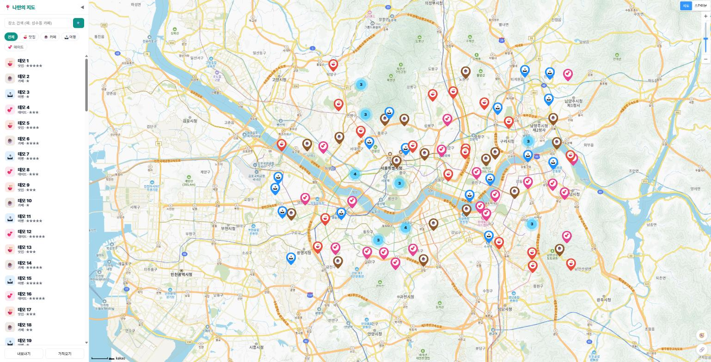
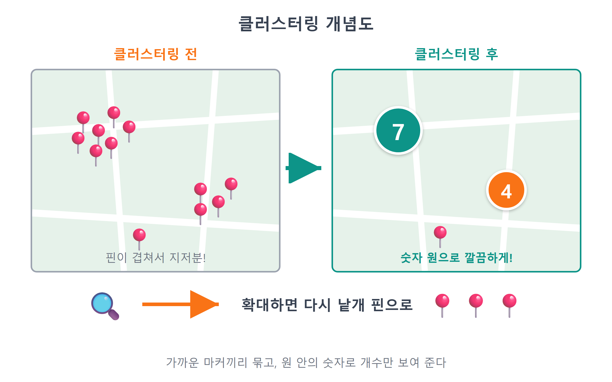
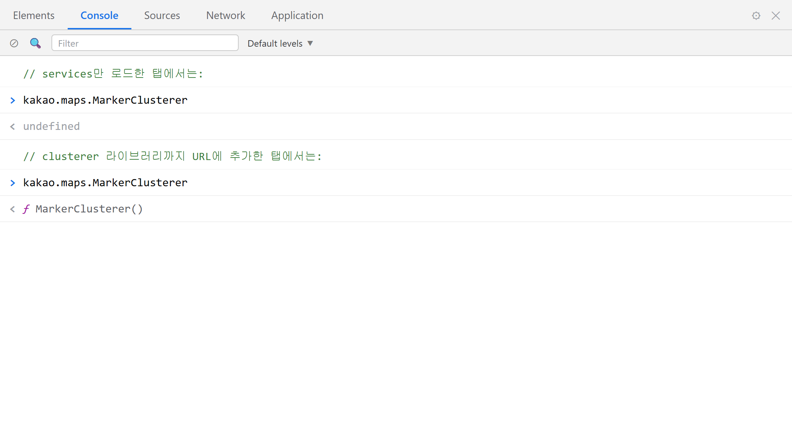
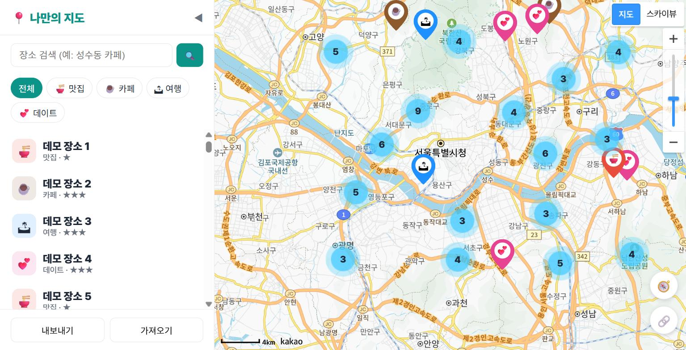
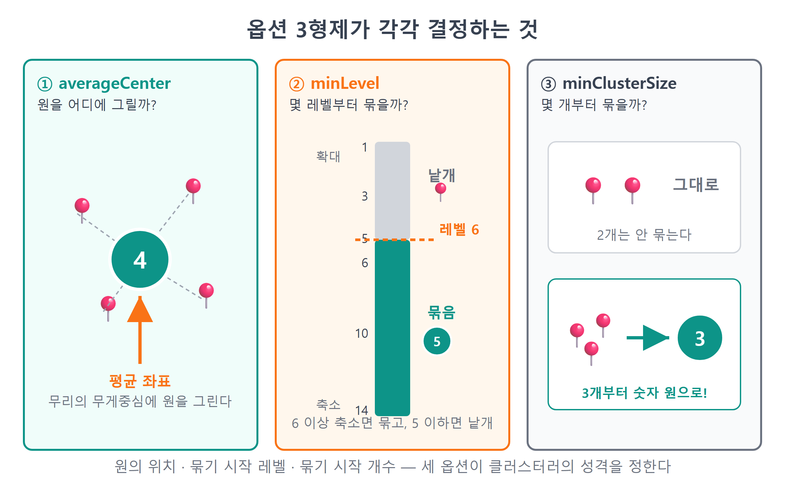
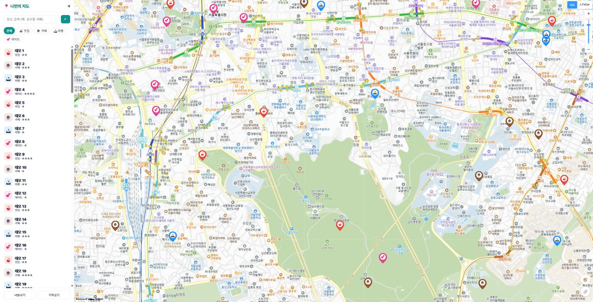

# 22장 마커 클러스터러

!!! note "이 장에서 배우는 것"
    - 마커가 100개쯤 되면 지도가 어떻게 망가지는지 일부러 만들어 확인합니다
    - 가까운 마커를 숫자 하나로 묶는 클러스터링 개념을 배웁니다
    - SDK 주소에 `&libraries=clusterer`를 붙여 클러스터러 확장팩을 로드합니다
    - `kakao.maps.MarkerClusterer`를 만들고 `addMarkers`/`removeMarkers`로 마커를 맡깁니다
    - `averageCenter`·`minLevel`·`minClusterSize` 세 가지 옵션의 의미를 이해합니다

---

우리 지도는 이제 앱이라고 불러도 충분합니다. 16장에서는 장소를 추가하였고, 17장에서는 새로고침하여도 내용이 사라지지 않도록 하였습니다. 18~19장에서는 목록과 상세 패널을 관리하였으며, 20장에서는 내 위치를 표시하였고, 21장에서는 링크로 공유하는 기능까지 추가하였습니다. 이제 이 앱을 열심히 사용하고 있을 미래의 모습을 상상해 보십시오. 맛집 탐방 1년 차가 되어 저장한 장소가 100개를 넘어섰다고 가정할 때, 그때의 지도는 어떤 모습일까요?

서울 지도 전체가 마커로 가득 차서 어디에 무엇이 있는지 전혀 보이지 않게 될 것입니다. 마커끼리 서로 가리게 되어, 클릭하려던 카페 대신 뒤에 숨은 국밥집 말풍선이 열리게 될 것입니다. 데이터가 많아진다고 해서 지도가 더욱 편리해지는 것은 아니며, 오히려 사용하기 더욱 불편해집니다. 다행히도 지도 서비스 분야에서는 이 문제에 대해 오랜 시간 고민해 온 바, 표준적인 해결 방법을 그대로 적용할 수 있습니다. 가까운 마커들을 하나로 묶어 개수를 숫자로 표시하는 클러스터링 기법이 그것입니다. 이번 장에서는 먼저 문제 상황을 인위적으로 만들어 확인한 뒤, 카카오에서 제공하는 클러스터러 확장 기능을 활용하여 이 문제를 해결하겠습니다. 이번 장에서는 기능을 개선하는 코드보다 문제 상황을 만드는 코드가 더 많을 것입니다.

## 22.1 장소 100개: 일부러 문제 만들기

문제를 해결하려면 우선 문제의 상황을 눈으로 확인할 수 있어야 합니다. 그런데 장소 100개를 일일이 수동으로 추가하려면 상당한 시간이 소요될 것입니다. 이러한 경우에는 인공지능의 도움을 받을 수 있습니다. 앱의 코드를 직접 수정하는 대신, 브라우저 콘솔에 입력하여 사용할 일회용 스크립트를 작성하도록 요청해 보십시오.

그에 앞서 데이터 백업을 먼저 진행하겠습니다. 이제부터 진행할 실습은 localStorage에 저장된 실제 장소 데이터를 테스트 데이터로 덮어쓰게 됩니다. 17장에서 구현한 내보내기 버튼을 클릭하여 현재의 데이터를 JSON 파일 형식으로 백업하여 주십시오. 실습이 종료된 후에는 이를 다시 불러와 원래대로 복원할 것입니다.

!!! warning "주의"
이번 실습에서는 localStorage의 내용을 덮어쓰게 되므로, 실습을 시작하기 전에 반드시 사이드바의 내보내기 기능을 이용하여 `places.json` 백업 파일을 별도로 보관하여 주십시오. 백업을 진행하지 않고 덮어쓸 경우, 지금까지 수집한 장소 데이터가 모두 사라지며, 3장에서 학습한 git으로도 복원할 수 없게 됩니다. 이는 localStorage가 별도의 코드 파일이 아닌 브라우저 내부에 저장되기 때문입니다.

데이터 백업을 확인하였다면, 이제 Claude Code에게 스크립트를 작성하도록 하겠습니다.

!!! tip "이렇게 물어보세요"
    > 브라우저 콘솔에 붙여 넣을 일회용 스크립트를 짜줘. 위도 37.45~37.65, 경도 126.85~127.15 범위의 서울 근처 무작위 좌표로 테스트 장소 100개를 만들어서 localStorage 키 'my-map-places-v1'에 저장하고 새로고침까지 해줘. 장소 스키마는 id/name/category/lat/lng/rating/memo이고 category는 food, cafe, travel, date를 골고루 섞어줘. 앱 파일은 건드리지 마.

Claude Code가 작성한 스크립트를 확인하겠습니다. F12 키를 눌러 개발자 도구의 콘솔을 연 뒤, 해당 스크립트를 전체 복사하여 붙여넣고 Enter 키를 눌러 주십시오.

```js
// 테스트용 장소 100개 생성 → localStorage 덮어쓰기 (일회용)
const cats = ['food', 'cafe', 'travel', 'date'];
const bulk = Array.from({ length: 100 }, (_, i) => ({
  id: 'bulk' + i,
  name: '테스트 장소 ' + (i + 1),
  category: cats[i % 4],
  lat: 37.45 + Math.random() * 0.2,
  lng: 126.85 + Math.random() * 0.3,
  rating: (i % 5) + 1,
  memo: '클러스터 실험용',
}));
localStorage.setItem('my-map-places-v1', JSON.stringify(bulk));
location.reload();
```

해당 코드는 비교적 간결합니다. 하지만 코드에 사용된 문법까지 단순한 것은 아닙니다. `Array.from({ length: 100 }, ...)`은 길이가 100인 배열을 생성하고, 각 위치에 두 번째 함수가 반환한 값을 채워 넣는 역할을 합니다. 이때 두 번째 함수의 `i`에는 0부터 99까지의 인덱스가 순서대로 전달됩니다. `cats[i % 4]`은 나머지 연산을 이용하여 네 가지 카테고리를 0, 1, 2, 3의 순서로 반복하여 할당합니다. 좌표 값은 `Math.random()`을 이용하여 생성하였으며, 0 이상 1 미만의 난수에 적절한 범위 값을 곱하여 서울 인근에 위치하도록 분포시켰습니다. 마지막 두 줄이 가장 중요합니다. 17장에서 학습한 바와 같이, 생성된 객체 배열을 JSON 문자열 형식으로 변환한 뒤, 우리 앱에서 사용하는 키 값에 맞추어 localStorage에 저장합니다. 그 후 `location.reload()`을 이용하여 페이지를 새로고침합니다. 페이지가 새로고침되면 `store.js`의 `load()`에서 해당 데이터를 읽어오게 됩니다. 이처럼 앱의 데이터 저장 방식을 이해하고 있으면, 앱의 외부에서 데이터를 주입하는 테스트용 도구도 제작할 수 있습니다.

새로고침된 화면을 확인하여 주십시오. 예상한 바와 같이 지도 위에 마커들이 무질서하게 겹쳐 있는 모습을 볼 수 있습니다.

{ width="760" }
/// caption
그림 22.1 — 마커 100개가 표시된 지도 (클러스터러 적용 전)
///

지도를 축소할수록 상황은 더욱 심각해집니다. 서울 전체가 보이는 지도 레벨에서는 마커들이 서로 완전히 겹쳐 있어 그 개수를 파악하기조차 어렵습니다. 마커를 클릭하여도 어떤 마커가 선택될 것인지 예측하기 어렵습니다. 사이드바의 목록은 스크롤하여 확인할 수 있지만, 지도는 표시할 수 있는 영역이 제한되어 있으므로 동일한 방식을 적용하기 어렵습니다. 이러한 현상을 마커 100개 문제라고 부릅니다. 마커 100개일 때에도 이와 같은 현상이 발생하는데, 마커 개수가 1,000개로 늘어나면 브라우저의 성능 저하 문제까지 함께 발생할 수 있습니다.

## 22.2 클러스터링: 묶으면 보인다

이 문제에 대한 해결 방법은 여러분이 일상에서 쉽게 접하고 있는 것입니다. 카카오맵이나 배달 관련 애플리케이션에서 지도를 축소하면, 개별 핀 대신 숫자가 표시된 원형 아이콘이 나타나는 것을 볼 수 있습니다. 스마트폰의 사진 관리 앱에서도 수천 장의 사진을 "서울 234장, 제주 89장"을 이용하여 그룹으로 묶어 보여주는 것과 동일한 원리입니다. 개별적으로 표시하기 어려울 만큼 대상이 많은 경우, 서로 인접한 것끼리 그룹으로 묶고 그 개수만을 요약하여 보여주는 방식입니다. 이러한 방식을 클러스터링[^1]이라고 부릅니다.

클러스터링의 기본 원리는 간단합니다. 지도를 축소하였을 때 화면상에서 가까이 위치한 마커들을 하나의 그룹(클러스터)으로 묶은 뒤, 개별 마커 대신 하나의 원형 아이콘을 표시하는 것입니다. 원형 아이콘 안에 표시되는 숫자는 해당 그룹에 포함된 마커의 총 개수를 의미합니다. 이를 통하여 해당 지역에 저장한 장소가 12곳임이라는 정보를 그대로 전달하면서도, 12개의 마커가 서로 겹쳐 보이던 문제를 해결할 수 있습니다. 지도를 확대하면 그룹은 점차 세분화되어 분리되며, 충분히 확대하면 다시 개별 마커의 모습으로 돌아옵니다. 즉, 멀리서 볼 때는 전체적인 요약 정보를 제공하고, 가까이서 볼 때는 개별 정보를 확인할 수 있도록 하는 방식입니다.

{ width="760" }
/// caption
그림 22.2 — 클러스터링 개념도
///

그렇다면 이처럼 마커를 묶어주는 계산을 우리가 직접 구현하여야 할까요? 다행히도 그렇지 않습니다. 해당 기능을 전문적으로 처리해 주는 `MarkerClusterer`가 카카오지도 SDK에 포함되어 있습니다. 다만 15장의 `services`와 마찬가지로, 기본 패키지에는 해당 기능이 포함되어 있지 않으며 `clusterer`이라는 이름의 확장 기능을 별도로 추가하여야 합니다. 우리는 해당 확장 기능을 활성화하고, 클러스터러 객체를 생성한 뒤, 마커의 관리 권한을 클러스터러에 이양하기만 하면 됩니다. 차례로 함께 살펴보겠습니다.

## 22.3 clusterer 라이브러리 로드하기

15장에서 SDK의 주소 뒤에 `&libraries=services`를 추가하면 "확장팩이 여러 개 필요하면 쉼표로 잇는다" 기능을 사용할 수 있다고 미리 설명한 바 있습니다. 이제 그 방법을 실제로 적용하여 보겠습니다. 이번에 수정할 파일은 단일 파일로 `src/loader.js` 하나뿐입니다.

!!! tip "이렇게 물어보세요"
    > src/loader.js의 카카오 SDK 주소에서 libraries에 clusterer를 추가해줘. 지금 services만 있는데 쉼표로 이어서 둘 다 로드되게 해줘. 다른 부분은 건드리지 마.

수정된 `loader.js`의 내용을 확인하여 주십시오. 아주 적은 부분만 변경되었음을 알 수 있습니다.

```js
// src/loader.js — 카카오 지도 SDK를 동적으로 불러오는 모듈
export function loadKakaoSdk() {
  return new Promise((resolve, reject) => {
    const key = import.meta.env.VITE_KAKAO_JS_KEY;
    if (!key) {
      reject(new Error('VITE_KAKAO_JS_KEY가 .env에 없습니다.'));
      return;
    }
    const script = document.createElement('script');
    script.src =
      `https://dapi.kakao.com/v2/maps/sdk.js?appkey=${key}` +
      `&autoload=false&libraries=services,clusterer`;   // ← 쉼표로 확장팩 추가!
    script.onload = () => kakao.maps.load(() => resolve(kakao));
    script.onerror = () => reject(new Error('카카오 SDK 로드 실패 — 키/도메인 확인'));
    document.head.appendChild(script);
  });
}
```

`libraries=services,clusterer`. 요청 주소의 쿼리 문자열 부분에 값 두 개를 쉼표로 구분하여 추가하였습니다. 해당 값이 정상적으로 적용되었는지 확인하는 방법은 15장에서 확인한 방식과 동일합니다. Ctrl+Shift+R 키를 눌러 캐시를 무시하고 페이지를 새로고침한 뒤, 콘솔에 특정 내용을 입력하여 확인하여 주십시오.

```js
kakao.maps.MarkerClusterer
```

`ƒ (a)`와 같은 함수가 정상적으로 표시된다면 확장 기능이 올바르게 로드된 것입니다. 만약 `undefined` 관련 메시지가 나타난다면, 입력한 내용의 오탈자를 확인하고 다시 한번 강력 새로고침을 시도하여 주십시오. 확장 기능을 정상적으로 추가하였음에도 불구하고 관련 내용이 나타나지 않는 경우, 대부분 브라우저의 캐시로 인한 문제입니다.

{ width="760" }
/// caption
그림 22.3 — 콘솔에서 MarkerClusterer 로드 상태 확인 예시
///

!!! tip "팁"
`services`는 15장에서 학습한 검색 기능에 사용되며, `clusterer`는 지도의 클러스터링 기능에 사용됩니다. 이 외에도 지도 위에 도형을 그리기 위한 `drawing`이라는 확장 기능도 별도로 제공됩니다. 확장 기능은 필요한 기능만을 선택적으로 로드하여 사용할 수 있습니다. 현재 우리의 앱에서는 검색 기능과 클러스터링 기능만을 사용하므로, 두 가지 확장 기능만을 로드하여 사용하여도 충분합니다.

## 22.4 MarkerClusterer 적용하기

이제 본격적으로 관련 코드를 수정하여 보겠습니다. 지금까지 우리 앱의 `mapView.js`에서는 `renderPlaces`에서 마커를 생성할 때마다 `marker.setMap(map)` 메서드를 호출하여 개별 마커를 지도에 직접 추가하였습니다. 그리고 지도를 다시 그릴 때에는 추가하였던 마커를 일일이 제거하였습니다. 클러스터러를 사용하는 경우 이러한 방식이 변경됩니다. 개별 마커를 지도에 직접 추가하는 대신, 생성한 마커를 클러스터러에 전달하여 관리 권한을 맡깁니다. 마커를 서로 묶어야 할지 개별적으로 표시하여야 할지는, 지도의 현재 확대 수준을 바탕으로 클러스터러가 스스로 판단합니다. 즉, 마커의 전반적인 관리 업무를 클러스터러에 이양하는 것입니다.

!!! tip "이렇게 물어보세요"
    > src/mapView.js에 마커 클러스터러를 적용해줘. createMap에서 kakao.maps.MarkerClusterer를 하나 만들어서 모듈 변수로 들고 있어줘. 옵션은 averageCenter를 켜고, minLevel 6, minClusterSize 3으로. 그리고 renderPlaces에서 마커를 setMap으로 직접 붙이지 말고 클러스터러의 addMarkers로 한꺼번에 맡기고, 다시 그리기 전에는 removeMarkers로 이전 마커들을 클러스터러에서 빼줘. 말풍선 오버레이 로직은 그대로 둬.

Claude Code가 수정한 `mapView.js`의 내용을 함께 살펴보겠습니다. 가장 먼저 지도 객체를 생성하는 `createMap` 부분부터 확인하겠습니다.

```js
// src/mapView.js — createMap에 클러스터러 생성 추가
let map;
let clusterer;
let markers = []; // { marker, overlay, place }

export function createMap(container, center = { lat: 37.5665, lng: 126.978 }, level = 7) {
  map = new kakao.maps.Map(container, {
    center: new kakao.maps.LatLng(center.lat, center.lng),
    level,
  });
  map.addControl(new kakao.maps.MapTypeControl(), kakao.maps.ControlPosition.TOPRIGHT);
  map.addControl(new kakao.maps.ZoomControl(), kakao.maps.ControlPosition.RIGHT);

  clusterer = new kakao.maps.MarkerClusterer({
    map,                  // 이 지도 위에서 일한다
    averageCenter: true,  // 클러스터 위치 = 묶인 마커들의 평균 좌표
    minLevel: 6,          // 레벨 6 이상(축소)일 때만 묶는다
    minClusterSize: 3,    // 3개 이상 모여야 묶는다
  });
  return map;
}
```

클러스터러는 지도처럼 앱에 하나만 있으면 됩니다. 그래서 지도를 만드는 `createMap`에서 함께 만들고 모듈 변수 `clusterer`에 보관합니다. 생성 옵션의 `map`으로 어느 지도 위에서 일할지 알려 줍니다. 꼭 생성 시점에 넘겨야 하는 것은 아닙니다. 만들어 두었다가 나중에 `setMap()`으로 연결할 수도 있습니다. 다만 우리는 처음부터 붙여 두는 편이 낫습니다. 나머지 세 옵션은 다음 절에서 하나씩 살펴보겠습니다.

다음은 `renderPlaces` 부분의 코드 내용입니다. 해당 부분의 시작과 끝 영역에서 두 군데의 코드가 변경되었습니다.

```js
export function renderPlaces(places) {
  closeOverlay();
  clusterer.removeMarkers(markers.map((m) => m.marker));  // ← 이전엔 setMap(null) 반복
  markers = [];

  for (const place of places) {
    const pos = new kakao.maps.LatLng(place.lat, place.lng);
    const marker = new kakao.maps.Marker({
      position: pos,
      image: markerImageFor(place.category),
      title: place.name,
      // setMap이 없다! 지도 배치는 클러스터러의 일
    });
    // ... 말풍선 오버레이와 클릭 리스너는 13장 그대로 ...
    markers.push({ marker, overlay, place });
  }
  clusterer.addMarkers(markers.map((m) => m.marker));  // ← 이전엔 setMap(map) 반복
}
```

변경된 내용을 위에서부터 차례로 설명하겠습니다.

`clusterer.removeMarkers(...)`. 다시 그리기 전, 이전 판의 마커를 클러스터러에서 뺍니다. `markers` 배열에는 `{ marker, overlay, place }` 꾸러미가 들어 있으므로 `markers.map((m) => m.marker)`로 마커만 뽑은 배열을 만들어 넘깁니다. 단수형 `removeMarker`를 반복문으로 100번 불러도 됩니다. 하지만 복수형 `removeMarkers`에 배열을 한 번 넘기는 쪽이 코드도 짧고, 클러스터러도 한 번에 처리할 수 있습니다. 공식 문서를 보면 두 메서드 모두 화면 다시 그리기를 미루는 `nodraw` 인자를 받을 수 있습니다. 성능을 더 다듬고 싶다면 이 키워드를 찾아보세요.

마커를 생성하는 코드 부분을 보면 기존의 `setMap` 관련 호출 구문이 더 이상 존재하지 않습니다. 이 부분에서 기존의 방식과 달라진 점이 있습니다. 마커를 생성하기는 하지만, 생성된 마커를 지도에 직접 추가하지 않는 것입니다. 개별 마커를 지도에 표시할 것인지, 아니면 주변 마커들과 묶어서 숨길 것인지에 대한 판단은 이제 우리가 아닌 클러스터러가 담당하게 됩니다. 만약 우리가 직접 `setMap(map)` 관련 메서드를 호출하여 버리면, 클러스터러에 의하여 마커가 묶인 경우에도 개별 마커가 함께 보이게 되는 비정상적인 현상이 발생할 수 있습니다.

`clusterer.addMarkers(...)`. 반복문을 통하여 모든 마커의 생성이 완료된 뒤, 새롭게 생성된 마커 전체를 배열 형태로 클러스터러에 한 번에 전달합니다. 이 과정 하나만으로 클러스터러는 현재 지도의 확대 수준을 파악한 뒤, 마커의 배치 작업을 일괄적으로 완료합니다. 즉, 묶어야 할 마커들은 서로 묶고, 개별적으로 표시하여야 할 마커들은 그대로 유지하여 보여주는 것입니다. 이후 사용자가 지도를 확대하거나 축소할 때마다, 클러스터러는 스스로 마커의 재배치 작업을 진행합니다. 우리가 별도로 이벤트를 등록하지 않았음에도 불구하고 이러한 동작이 자동으로 이루어집니다.

장소에 대한 상세 정보를 보여주는 말풍선(CustomOverlay)의 경우, 클러스터러의 관리 대상이 아니므로 기존 13장에서 학습한 방식 그대로 `setMap`을 이용하여 열고 닫을 수 있습니다. 클러스터러는 마커의 배치 및 관리 역할만을 수행할 뿐이며, 말풍선과 같은 오버레이 요소에 대해서는 별도의 관리를 수행하지 않습니다.

이제 페이지를 새로고침하여 그 결과를 확인하여 주십시오. 이전에 마커들이 무질서하게 겹쳐 있던 화면에, 이제는 숫자가 표시된 원형 아이콘들만이 일정하게 보이기 시작합니다.

{ width="760" }
/// caption
그림 22.4 — 클러스터러 적용 후: 그룹별로 정리되어 표시된 지도 예시
///

클러스터러를 적용하면 화면 표시 방식이 개선될 뿐만 아니라, 브라우저의 성능 역시 함께 향상됩니다. 브라우저의 입장에서 보면, 지도 위에 표시되는 마커 하나하나가 모두 별도의 이미지 요소와 같기 때문입니다. 지도를 드래그할 때마다 화면에 표시되는 모든 요소를 매번 다시 그려주어야 하는데, 마커가 100개이면 100개를 모두 다시 그려야 하고, 마커가 1,000개이면 1,000개를 모두 다시 그려야 하는 것입니다. 클러스터러가 90개의 마커를 3개의 그룹으로 묶어주는 경우, 브라우저는 실제로 화면에 보이는 적은 수의 요소만을 다시 그려주면 충분하게 됩니다. 이를 통하여 화면이 훨씬 깔끔하게 보일 뿐만 아니라, 지도의 응답 속도 역시 함께 개선되는 효과를 얻을 수 있습니다.

앞서 보여드린 그림 22.1과 그림 22.4는 동일한 데이터를 기반으로 합니다. 표시되는 내용상의 데이터는 전혀 변경되지 않았으며, 단순히 화면에 보여지는 방식만이 달라졌을 뿐입니다. 그룹 아이콘 안에 표시된 숫자를 확인하여 보십시오. "이 동네에 23곳"와 같은 요약된 정보가 오히려 개별 마커 23개를 일일이 확인하는 것보다 더욱 유용하게 활용될 수도 있을 것입니다. 이제 숫자가 표시된 원형 아이콘을 클릭하여 보십시오. 지도가 자동으로 한 단계 확대되면서, 해당 그룹에 속하였던 마커들이 더욱 작은 단위의 그룹들로 나누어지는 것을 확인할 수 있습니다. 이처럼 클릭하면 확대되는 동작은 클러스터러의 기본 기능에 해당하며, 별도로 코드를 작성하여 구현한 것이 아닙니다.

## 22.5 옵션 세 가지: averageCenter, minLevel, minClusterSize

이제 앞서 객체 생성 시점에 함께 작성한 세 가지 옵션 값에 대하여 자세히 알아보겠습니다. 이 세 가지 옵션이 클러스터러의 전반적인 동작 방식을 결정하게 됩니다.

| 옵션 | 우리 설정 | 의미 |
|---|---|---|
| `averageCenter` | `true` | 클러스터 원을 묶인 마커들의 평균 좌표에 그린다 (기본값 `false`면 첫 마커 위치) |
| `minLevel` | `6` | 레벨 6 이상(그만큼 축소된 상태)에서만 클러스터링한다 |
| `minClusterSize` | `3` | 3개 이상 모여야 묶는다 (기본값 2) |

`averageCenter`. 해당 옵션은 클러스터 그룹을 표시할 원형 아이콘을 지도상의 어느 위치에 그릴 것인지를 결정합니다. 기본값으로 설정된 `false`을 사용하는 경우, 그룹에 속한 마커 중 가장 첫 번째 마커의 위치에 원형 아이콘이 그려지게 됩니다. 이 방식은 계산이 간단하다는 장점이 있지만, 그룹에 속한 마커들이 한쪽으로 치우쳐 분포하고 있는 경우, 원형 아이콘이 마커들이 밀집된 위치가 아닌 그룹의 가장자리에 그려지게 되어 화면이 부자연스럽게 보일 수도 있습니다. 반면 `true` 옵션을 활성화하면, 그룹에 속한 마커들의 위도와 경도 값을 평균낸 지점에 원형 아이콘을 그리게 됩니다. 시각적으로 보았을 때는 평균 위치에 그리는 방식이 훨씬 자연스러운 것을 알 수 있습니다.

`minLevel`. 해당 옵션은 마커들을 서로 묶기 시작하는 지도의 최소 축소 수준을 지정합니다. 10장에서 설명한 바와 같이 카카오지도의 레벨 값은 숫자가 커질수록 더 넓은 범위의 지역을 보여줍니다. 예를 들어 `minLevel: 6`와 같이 값을 지정하면, 지도의 레벨이 6 이상으로 축소되었을 때에만 마커들을 그룹으로 묶기 시작합니다. 반대로 지도를 레벨 5 이하로 확대하면 그룹이 해제되고 개별 마커가 다시 보이게 됩니다. 지도를 충분히 확대하여 특정 지역의 상세 정보를 확인하는 단계에 이르면, 개별 장소를 하나씩 확인하고 싶은 것이 일반적이므로, 이때에는 마커를 묶지 않고 개별적으로 보여주는 것이 타당합니다. 실제로 우리 앱에서 사이드바의 장소 목록에 있는 항목을 클릭하면, `focusPlace` 관련 기능에 의하여 지도가 자동으로 레벨 4로 확대됩니다. 따라서 이때에는 주변의 마커들이 항상 개별적으로 표시되는 것입니다.

`minClusterSize`. 해당 옵션은 몇 개의 마커가 모여 있을 때 하나의 그룹으로 묶을 것인지를 결정합니다. 옵션의 기본값은 2로 설정되어 있으나, 마커가 2개인 경우에는 그대로 보여주어도 화면이 크게 복잡하지 않을 것이라 판단하여, 본 예제에서는 값을 3으로 상향 조정하여 마커가 3개 이상 인접하여 모여 있을 때에만 그룹으로 묶도록 설정하였습니다. 만약 이 값을 10으로 설정하면 마커가 상당히 많이 모이기 전까지는 그룹으로 묶이지 않게 되며, 반대로 값을 2로 낮추면 매우 적은 마커도 자주 그룹으로 묶이게 됩니다.

{ width="760" }
/// caption
그림 22.5 — 세 가지 옵션 값이 각각 결정하는 내용에 대한 설명
///

이 세 가지 옵션 값에 대하여 절대적으로 정답이라고 할 수 있는 값은 존재하지 않습니다. 본 예제에서 설정한 레벨 6과 개수 3이라는 값 역시, 서울 지역에 약 100여 개의 장소 데이터가 분포된 상황을 기준으로 설정한 하나의 시작점일 뿐입니다. 만약 전국 단위의 여행 정보를 담은 지도를 제작하는 경우라면, `minLevel` 값을 더욱 높여서 넓은 지역을 보여줄 때에만 마커를 묶는 방식이 더욱 적절할 수 있습니다. 반대로 특정 동네의 맛집 정보만을 모은 지도라면, 해당 값을 낮추어 더욱 세밀하게 표시하는 것이 타당할 것입니다. 다행히도 이 값들을 변경하여 테스트하는 데에는 많은 노력이 들지 않습니다. "minLevel을 8로 바꿔줘" 부분의 값 한 줄만 수정하도록 요청한 뒤 페이지를 한 번 새로고침하면, 변경된 결과를 즉시 확인할 수 있습니다. 직접 옵션의 값을 조금씩 변경해 가면서, 자신이 보유한 데이터의 성격에 가장 적합한 값을 찾아보시기 바랍니다.

이제 설정한 옵션들이 정상적으로 동작하는지 확인하여 보겠습니다. 지도 위에 표시된 그룹 중 마커 개수가 비교적 큰 그룹 하나를 선택한 뒤, 마우스 휠을 이용하여 지도를 천천히 확대하여 보십시오. 지도의 레벨이 낮아지면서 확대됨에 따라, 큰 규모의 그룹이 점차 작은 규모의 그룹들로 나누어지는 것을 확인할 수 있습니다. 지도의 레벨이 5에 도달하는 시점에, 그룹을 나타내던 원형 아이콘이 모두 사라지고 개별 마커가 일제히 나타나는 것을 볼 수 있습니다. 다시 지도를 축소하면 반대의 순서로 마커들이 그룹으로 묶이게 됩니다. 이어서 14장에서 구현한 카테고리 필터 기능을 동작시켜 보십시오. 필터의 선택을 변경하면 `renderPlaces` 관련 함수가 다시 호출되는 것을 알 수 있습니다. 이때 `removeMarkers` → `addMarkers`의 처리 흐름에 의존하여, 마커의 내용이 변경됨에 따라 그룹의 개수 역시 정확하게 재계산되어 표시됩니다. 예를 들어 카페 관련 필터만을 선택하면, 그룹 아이콘 안에 표시되는 숫자가 해당 카테고리에 속하는 마커의 개수만큼으로 자동으로 변경되는 것입니다.

{ width="760" }
/// caption
그림 22.6 — 지도를 확대하면 그룹이 해제되고 개별 마커가 나타나는 모습
///

!!! tip "팁"
만약 그룹 아이콘의 파란색 계열 스타일이 마음에 들지 않는다면, `styles` 옵션을 통하여 아이콘의 크기, 색상, 글꼴 등의 스타일을 전체적으로 원하는 디자인으로 변경할 수 있습니다. 예를 들어 "클러스터러 styles 옵션으로 우리 앱 브랜드 색에 맞는 원을 만들어줘"와 같이 스타일에 대한 규칙을 지정할 수 있습니다. 또한 그룹으로 묶인 마커의 개수에 따라, 예를 들어 10개 미만일 때는 작은 크기로, 100개 이상일 때는 큰 크기로 표시하는 등 개수 구간별로 서로 다른 스타일을 적용하는 것도 가능합니다. 관련 내용에 대한 보다 자세한 활용 방법은 장의 마지막 부분에 제시된 추가 학습 내용을 참고하시기 바랍니다.

실습이 모두 완료되었으면, 이제 테스트용 데이터를 대체하기 전에 미리 백업하여 두었던 원래의 데이터로 복원하겠습니다. 사이드바에 위치한 가져오기 버튼을 클릭한 뒤, 앞서 백업하여 두었던 `places.json` 파일을 선택하면 됩니다. 이렇게 17장에서 구현한 백업 및 복원 기능을, 구현한 지 약 5장 만에 다시 활용하게 되었습니다. 원래의 데이터로 복원하였다고 하여 클러스터러의 기능이 정지하는 것은 아닙니다. 저장된 장소의 개수가 적을 때에는 마커가 3개 이상 모이지 않으므로 개별 마커가 그대로 보이게 되고, 장소의 개수가 늘어나면 자동으로 그룹으로 묶이는 방식은 그대로 유지됩니다.

## 22.6 마무리

!!! abstract "이 장의 핵심"
    - 마커가 수십 개를 넘으면 서로 가리고 겹치는 마커 100개 문제가 생깁니다. 가까운 마커를 숫자 원으로 묶는 클러스터링으로 해결할 수 있습니다.
    - 클러스터러는 확장팩이므로 SDK 주소의 `libraries`에 쉼표로 이어 `libraries=services,clusterer`로 로드합니다.
    - `new kakao.maps.MarkerClusterer({ map, ... })`를 하나 만들고, 마커는 `setMap` 대신 `addMarkers`로 맡기고 `removeMarkers`로 뺍니다. 배치와 재계산은 클러스터러의 몫입니다.
    - `averageCenter: true`는 원을 무리의 평균 좌표에, `minLevel`은 묶기 시작하는 축소 레벨을, `minClusterSize`는 묶음의 최소 마커 수를 정합니다.
    - 클러스터 원 안의 숫자는 묶인 마커의 개수이고, 원을 클릭하면 지도가 확대되며 무리가 풀립니다.

!!! question "잠깐 생각해 봅시다"
Q1. 클러스터러를 쓰면서 마커에 `marker.setMap(map)`까지 직접 호출하면 어떤 문제가 생길까요? "배치 결정권이 누구에게 있는가"를 중심으로 설명해 보세요.

____________________________________________

____________________________________________

Q2. `minLevel`을 1로 낮추면 아무리 확대해도 마커가 묶여 있을 겁니다. 사용자 입장에서 왜 불편한지, 반대로 `minLevel`을 14로 올리면 무슨 일이 생길지 추리해 보세요.

____________________________________________

____________________________________________ ch22.txt

!!! example "확인 문제"
    1. `minClusterSize`를 2로 바꿔 보고, 마커 딱 2개가 몰린 곳의 표시가 어떻게 달라지는지 확인한 뒤 3으로 되돌리세요.
    2. `averageCenter`를 `false`로 바꾸면 클러스터 원의 위치가 어떻게 달라지는지 같은 구도에서 비교해 보고, 다시 `true`로 되돌리세요.
    3. 22.1의 콘솔 스크립트에서 `length: 100`을 `length: 500`으로 올려 500개로도 실험해 보세요. 클러스터 숫자가 어떻게 변하나요? 실험이 끝나면 가져오기로 원래 데이터를 복원하세요.
    4. 클러스터 원을 클릭했을 때 지도가 확대되지 않게 막는 옵션의 이름을 카카오지도 문서에서 찾아 Claude Code에게 물어보고, 한 줄로 적어 보세요.

!!! info "더 찾아보기"
    - `styles 옵션` — 클러스터 원의 크기·색·글꼴을 묶인 개수 구간별로 커스터마이징하는 방법.
    - `disableClickZoom` — 클러스터 클릭 시 자동 확대를 끄는 옵션. 끄면 `clusterclick` 이벤트로 나만의 동작을 달 수 있습니다.
    - `calculator · texts` — 숫자 대신 "10+", "많음" 같은 구간 텍스트를 보여 주도록 바꾸는 옵션 짝꿍.
    - `clustered · clusterclick 이벤트` — 클러스터가 만들어지거나 클릭될 때를 잡아내는 클러스터러 전용 이벤트.

> 다음 장으로. 지도는 이제 데이터 100개도 거뜬합니다. 그런데 이 앱, 스마트폰에서 열어 보셨나요? 좁은 세로 화면에서는 사이드바가 지도를 거의 다 가립니다. 23장에서는 개발자도구의 디바이스 모드로 모바일 화면을 흉내 내고, 미디어쿼리와 사이드바 접기 버튼으로 손 안에서도 쓸 만한 지도를 만듭니다.

[^1]: 클러스터링(clustering) — cluster는 "송이·무리"라는 뜻. 가까운 데이터를 한 무리로 묶는 기법을 통칭하며, 지도 마커뿐 아니라 통계·머신러닝에서도 같은 이름으로 씁니다.
