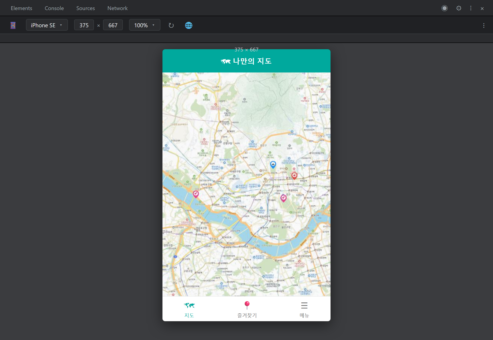
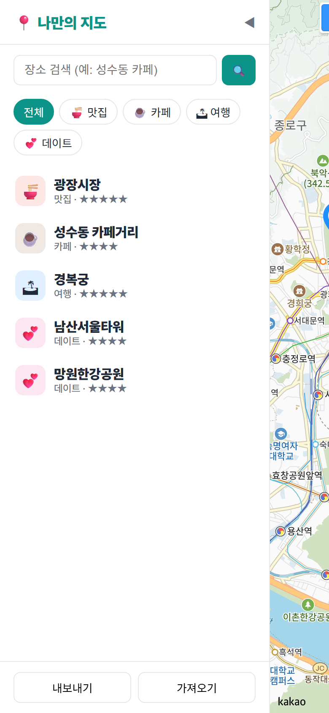
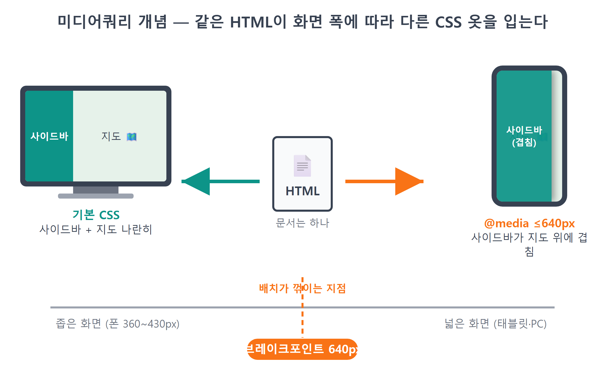
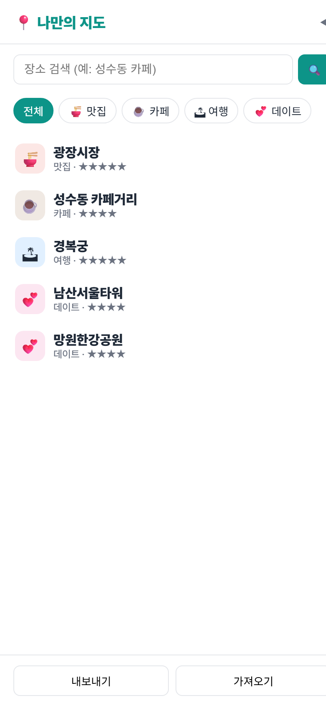
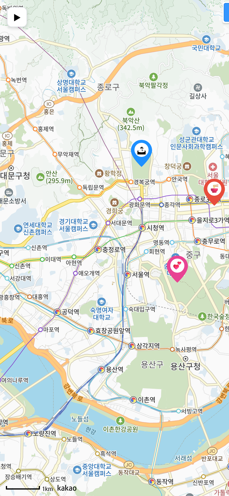
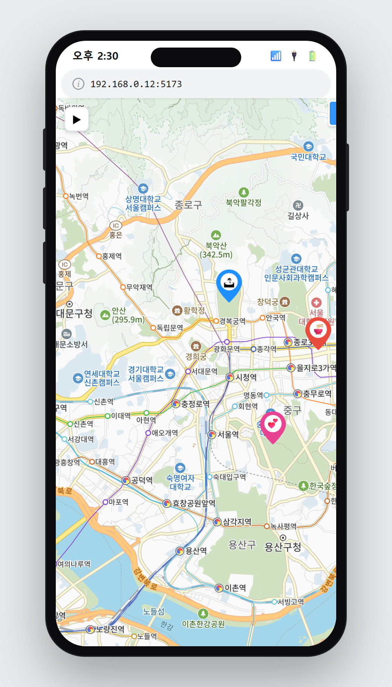

# 23장 모바일 대응

!!! note "이 장에서 배우는 것"
    - 폰 없이 폰 화면을 테스트하는 개발자도구 디바이스 모드를 익힙니다
    - 미디어쿼리(`@media`)로 화면 폭에 따라 다른 CSS를 적용합니다
    - 사이드바 접기/펼치기를 만들고 `collapsed` 클래스와 CSS 트랜지션을 배웁니다
    - 컨테이너 크기가 바뀌었다고 카카오지도에 알리는 relayout()을 배우고, 이를 몰라서 생긴 버그를 고칩니다
    - 터치 시뮬레이션과 실제 스마트폰 접속으로 모바일 동작을 확인합니다

---

22장까지 제작한 지도 앱은 검색, 추가, 별점, 저장, 공유 기능을 모두 갖추었으며, 장소가 100개라도 클러스터로 묶어 표시합니다. 다음 장에서 앱을 배포하고 다른 사람에게 링크를 전달하면, 수신자는 대부분 스마트폰에서 해당 링크를 열게 될 것입니다. 최근 웹 트래픽의 절반 이상은 모바일 환경에서 발생하며, 우리의 앱이라고 예외는 아닙니다. 지금까지는 PC 모니터에서만 앱을 확인해 왔지만, 사용자가 실제로 접하게 되는 화면은 그보다 훨씬 작을 것입니다.

현재 상태 그대로 스마트폰에서 앱을 열면, 320픽셀의 고정 폭 사이드바가 화면의 대부분을 차지하고, 지도는 오른쪽으로 좁게 밀려나 있을 것입니다. 이 장에서는 이 문제를 반응형 웹 기술로 해결해 보겠습니다. 화면이 넓은 경우에는 넓은 배치를, 좁은 경우에는 좁은 화면에 맞는 배치를 적용하는 방식입니다. 이 과정에서 CSS 미디어쿼리, 사이드바 접기 버튼, 그리고 지도가 일부만 표시되는 문제와 그 해결 방법을 차례로 다루겠습니다.

## 23.1 폰 없이 폰 화면 보기: 디바이스 모드

모바일 환경에 대응할 때는 CSS를 수정하기 전에 테스트 방법을 먼저 갖추는 것이 효율적입니다. 코드를 수정할 때마다 매번 스마트폰으로 접속하여 확인할 수는 없으니, 크롬 개발자도구의 디바이스 모드(Device Mode)를 활용하면 PC 브라우저에서 스마트폰의 화면 크기를 그대로 재현하여 확인할 수 있습니다.

`npm run dev`을 통해 앱을 실행한 상태에서 아래 내용을 따라해 보시기 바랍니다.

1. 브라우저에서 ++f12++ 를 눌러 개발자도구를 엽니다.
2. 개발자도구 왼쪽 위, 화살표 아이콘 옆에 있는 📱 모양의 기기 툴바 전환 아이콘을 클릭합니다. ++ctrl+shift+m++ 단축키로도 됩니다.
3. 화면 상단에 기기 선택 메뉴가 나타납니다. iPhone SE나 Galaxy S20 Ultra 같은 프리셋을 골라 보세요.

{ width="800" }
/// caption
그림 23.1 — 크롬 개발자도구 디바이스 모드 진입(기기 툴바와 기기 선택 메뉴)
///

기기를 선택하는 즉시 화면이 좁고 세로로 긴 스마트폰 비율로 변경됩니다. iPhone SE를 기준으로 하면 화면 폭이 375픽셀인데, 우리 앱의 사이드바는 `--sidebar-w: 320px`로 고정된 폭을 가지고 있습니다. 전체 폭 375픽셀 중 320픽셀을 사이드바가 차지하므로, 지도에 할당되는 폭은 고작 55픽셀에 불과합니다. 이는 지도라고 부르기 어려울 정도로 좁은 세로 띠 형태로 보이게 되며, 검색창과 필터 버튼 역시 공간이 부족해 불편하게 배치될 것입니다.

{ width="380" }
/// caption
그림 23.2 — 모바일 대응 적용 전: 사이드바가 화면의 대부분을 차지하고 지도는 오른쪽 좁은 영역으로 제한된 모습
///

현재 앱의 화면이 바로 이런 상태입니다. 문제점을 파악하였으니 이제 차근차근 수정해 보겠습니다.

!!! tip "팁"
디바이스 모드는 화면 크기, 터치 동작, 기기 정보 등을 시뮬레이션할 뿐이며, 실제 스마트폰의 성능, 브라우저 버전, 통신 환경까지 완벽하게 재현하는 것은 아닙니다. 따라서 개발 중에는 디바이스 모드로 신속하게 확인하고, 배포 전에는 반드시 실제 스마트폰에서 최종 확인하는 습관을 들이시기 바랍니다. 실제 스마트폰에서 접속하여 확인하는 구체적인 방법은 23.5절에서 자세히 설명하겠습니다.

한 가지 다행인 점을 미리 알아보겠습니다. `index.html`의 `<head>` 파일을 열어 보시면, 가장 처음부터 특정 줄이 포함되어 있음을 확인할 수 있습니다.

```html
<meta name="viewport" content="width=device-width, initial-scale=1.0" />
```

이는 Vite가 프로젝트를 생성할 때 자동으로 뷰포트[^1] 관련 설정을 추가해 준 것입니다. 만약 이 줄이 없다면, 모바일 브라우저는 화면을 "이 페이지는 PC용이겠거니"하고 980픽셀 너비의 가상 화면에 페이지를 렌더링한 뒤 스마트폰 화면 크기에 맞춰 축소하여 표시하게 됩니다. 예전 웹사이트들에서 글자가 매우 작게 보이던 현상이 바로 이런 이유에서 발생하였습니다. 이 설정이 있어야 브라우저가 기기의 실제 화면 폭을 기준으로 페이지를 정상적으로 렌더링하며, 이후에 작성할 미디어쿼리도 의도한 대로 정상 작동하게 됩니다. 직접 작성한 코드는 아니지만, 개발 도구가 기본으로 제공하는 중요한 설정이므로 한 번 내용을 확인해 두시는 것이 좋습니다.

## 23.2 미디어쿼리: 화면 폭에 따라 다른 CSS 적용하기

이제 발생한 문제를 명확하게 정리해 보겠습니다. 사이드바와 지도를 좌우로 나란히 배치하는 방식은 넓은 화면에서는 적절하지만, 좁은 화면에서는 사용하기 어렵습니다. 그렇다고 모바일 전용 HTML을 별도로 제작하는 것은 효율적이지 않습니다. HTML 파일을 두 가지 버전으로 관리하면, 기능을 수정할 때마다 두 곳을 모두 변경해야 하는 불편함이 발생하기 때문입니다. 따라서 HTML은 하나만 유지한 채, CSS만 화면 폭에 따라 다르게 적용하는 방식으로 문제를 해결하겠습니다.

이와 같은 작업을 가능하게 해주는 CSS 문법이 바로 미디어쿼리(media query)입니다.

```css
@media (max-width: 640px) {
  /* 화면 폭이 640px 이하일 때만 적용되는 규칙들 */
}
```

`@media (max-width: 640px)`는 CSS에 조건을 지정하는 문법입니다. 예를 들어 화면 폭이 640픽셀 이하일 경우에만 중괄호 안의 스타일 규칙을 적용하고, 넓은 화면에서는 해당 규칙을 적용하지 않는 것처럼 처리할 수 있습니다. 이때 기준이 되는 640px과 같은 값을 브레이크포인트[^2]라고 부르며, 레이아웃의 배치 방식이 전환되는 지점을 의미합니다. 대부분의 스마트폰 화면 폭은 360~430px이며, 태블릿 세로 화면은 768px 내외이므로, 640px을 기준으로 설정하면 스마트폰에서는 모바일용 배치가 적용되고, 태블릿 이상의 화면에서는 기존 PC용 배치를 그대로 사용할 수 있습니다.

{ width="760" }
/// caption
그림 23.3 — 미디어쿼리의 개념: 동일한 HTML이 화면 폭에 따라 다른 CSS 스타일을 적용하는 모습
///

그렇다면 좁은 화면에서는 어떤 배치가 적절할까요? 카카오맵이나 구글맵의 모바일 화면을 참고해 보면, 지도가 화면 전체를 차지하고, 장소 목록은 필요할 때 지도 위에 표시되는 방식으로 운영되고 있습니다. 목록이 지도를 옆으로 밀어내는 대신, 지도 위에 겹쳐서 나타나는 방식입니다. 우리 앱도 동일한 방식으로 구현하겠습니다. 배치 방식을 정하였으니, 이제 Claude Code에 요청하여 코드를 수정하겠습니다.

!!! tip "이렇게 물어보세요"
    > 앱을 모바일에 대응시켜줘. 화면 폭 640px 이하일 때는 ① 사이드바가 지도를 옆으로 밀어내지 말고 position: absolute로 지도 위에 겹치게 하고, 폭은 화면의 84% 정도로 해줘. ② 겹쳐 있다는 게 보이도록 사이드바 오른쪽에 그림자를 넣어줘. ③ 상세 패널은 화면 아래쪽에 좌우로 넓게 붙여줘. HTML은 건드리지 말고 style.css의 미디어쿼리로만 해결해줘.

이때 "HTML은 건드리지 말고 CSS로만"와 같이 요청 사항에 제약 조건을 명확히 명시한 부분에 주목하여 주시기 바랍니다. 이와 같은 제약을 제시하지 않으면, AI가 HTML 구조 자체를 모바일용으로 완전히 새롭게 작성하는 등 불필요한 수정 범위가 커질 수 있습니다. 우리는 기존 구조를 유지한 채 스타일만 변경하는 간단한 수정을 원하므로, 수정의 범위를 프롬프트에 명확히 지정하는 것이 중요합니다.

이제 Claude Code가 `style.css` 파일의 가장 하단에 미디어쿼리 관련 코드를 추가하였습니다.

```css
/* ── 모바일 ────────────────────────────── */
@media (max-width: 640px) {
  :root { --sidebar-w: 84vw; }
  #sidebar { position: absolute; left: 0; top: 0; box-shadow: 4px 0 16px rgb(0 0 0 / 0.12); }
  #detail-panel { left: 12px; width: auto; top: auto; bottom: 12px; }
}
```

추가된 코드는 단 5줄에 불과하지만, 각 줄이 매우 핵심적인 역할을 수행합니다.

- `:root { --sidebar-w: 84vw; }` — 우리는 사이드바 폭을 처음부터 `--sidebar-w`라는 CSS 변수 하나로 관리해 왔습니다. 그래서 모바일에서는 그 변수 값만 `84vw`로 바꾸면, 이 변수를 쓰는 모든 규칙(`width`, `min-width`, 잠시 뒤 볼 접기 규칙까지)이 한꺼번에 따라옵니다. `vw`는 viewport width의 약자로, `84vw`는 "화면 폭의 84%"입니다. 픽셀 고정값과 달리 어떤 폰에서든 오른쪽에 지도가 빼꼼 보일 만큼의 틈을 남겨 줍니다. 값 하나만 바꿨는데 전체가 따라 움직입니다. 12장에서 배운 "한 곳에서 관리"의 힘을 CSS에서 다시 확인할 수 있습니다.
- `position: absolute` — 이 한 줄이 배치 방식을 바꿉니다. 기본 상태의 사이드바는 flex 컨테이너에서 한 자리를 차지하며 지도를 옆으로 밀어냅니다. `absolute`가 되면 문서의 배치 흐름에서 빠져나와 부모(`#app`)를 기준으로 지정한 좌표에 놓입니다. 자리를 차지하지 않으므로 지도가 화면 전체를 쓰고, 사이드바는 그 위에 겹쳐 떠 있습니다.
- `box-shadow` — 사이드바가 지도 위에 떠 있다고 눈에 보이게 알려 주는 그림자입니다. 그림자가 없으면 사이드바와 지도가 같은 평면처럼 보여서, 사용자가 사이드바를 닫을 수 있는지 알기 어렵습니다.
- `#detail-panel` 규칙 — 19장에서 만든 상세 패널은 PC에서 오른쪽 위에 280px 폭으로 떠 있었습니다. 모바일에서는 `left: 12px`과 `width: auto`로 좌우에 모두 붙여 넓게 펴고, `top: auto; bottom: 12px`으로 화면 아래에 내려 앉힙니다. 모바일 앱에서 흔히 보는 바텀 시트 스타일입니다. 엄지손가락이 닿기 쉬운 아래쪽에 조작 UI를 두는 것은 모바일 UI의 오랜 관습입니다.

코드를 저장한 뒤 디바이스 모드에서 화면을 확인하여 보시기 바랍니다. 지도가 화면 전체에 걸쳐 표시되고, 사이드바가 그 위에 그림자를 가지고 떠 있는 형태로 나타난다면 정상적으로 적용된 것입니다. 앞서 그림 23.2의 모습과 비교하여 보시면 화면 구성이 크게 개선되었음을 확인할 수 있습니다.

{ width="380" }
/// caption
그림 23.4 — 미디어쿼리 적용 후: 지도가 화면 전체를 차지하고 사이드바가 지도 위에 겹쳐 표시된 모바일 화면
///

!!! warning "주의"
미디어쿼리를 적용하였으나 디바이스 모드에서 화면에 변화가 없다면, 다음 세 가지를 확인하여 주시기 바랍니다. 첫째, 디바이스 모드 상단에 표시되는 화면 폭 수치가 640px 이하인지 확인하시기 바랍니다. 둘째, `@media`로 지정한 스타일 블록이 기존 스타일 규칙보다 아래에 위치하는지 확인하시기 바랍니다. 동일한 우선순위일 경우 나중에 선언된 규칙이 적용되기 때문입니다. 셋째, 오타로 인해 `max-width`를 `min-width`와 같이 잘못 작성하지 않았는지 확인하시기 바랍니다. 세 번째 경우는 조건 자체가 정반대로 적용되는 흔한 실수이므로 각별히 주의하시기 바랍니다.

## 23.3 사이드바 접기/펼치기

레이아웃은 안정적으로 개선되었으나, 아직 중요한 문제가 하나 남아 있습니다. 사이드바가 지도 위에 떠 있기만 할 뿐, 사용자가 필요하지 않을 때 이를 숨길 방법이 없다는 점입니다. 화면의 약 84%를 사이드바가 차지하고 있으므로, 지도를 더 넓게 보기 위해서는 사이드바를 접고 펼칠 수 있는 기능이 필수적입니다. 해당 기능은 모바일 환경에서만 필요한 것이 아닙니다. PC 화면에서도 지도를 넓게 보고 싶을 때 사이드바를 접을 수 있으면 편리하므로, 접기/펼치기 기능을 공통 기능으로 구현한 뒤 모바일에서 특히 유용하게 활용하도록 하겠습니다.

!!! tip "이렇게 물어보세요"
    > 사이드바 접기/펼치기를 만들어줘. ① 사이드바 헤더 오른쪽에 ◀ 접기 버튼, 지도 왼쪽 위에 ▶ 펼치기 버튼을 두고, 펼치기 버튼은 사이드바가 열려 있을 땐 숨겨줘. ② 접기는 sidebar에 collapsed 클래스를 붙이는 방식으로 하고, CSS 트랜지션으로 왼쪽으로 미끄러지듯 사라지게 해줘. ③ 모바일 미디어쿼리에서도 확실히 화면 밖으로 나가게 처리해줘.

먼저 `index.html` 부분에 접기와 펼치기용 버튼 두 개를 추가하였습니다.

```html
<header id="sidebar-header">
  <h1>📍 나만의 지도</h1>
  <button id="btn-collapse" title="사이드바 접기">◀</button>
</header>
...
<main id="map-wrap">
  <div id="map"></div>
  <button id="btn-expand" title="사이드바 열기" hidden>▶</button>
```

`#btn-expand` 요소에 부여된 `hidden` 속성에 주목하여 주시기 바랍니다. 초기 화면에서는 사이드바가 열려 있는 상태이므로, 펼치기 버튼은 숨긴 상태에서 시작합니다. HTML 표준 속성인 `hidden`은 자바스크립트에서 `요소.hidden = true/false` 속성을 통해 쉽게 켜고 끌 수 있으므로, 이전에 토스트나 다이얼로그를 표시하거나 숨길 때 여러 차례 활용하였던 방식과 동일합니다.

다음은 `style.css`에 추가한 스타일 내용입니다. 사이드바가 접히는 효과를 구현하는 핵심 부분은 기존 사이드바 스타일에 추가된 두 줄과 새롭게 추가된 한 줄입니다.

```css
#sidebar {
  width: var(--sidebar-w);
  /* ...기존 규칙... */
  transition: margin-left 0.25s ease;
}
#sidebar.collapsed { margin-left: calc(-1 * var(--sidebar-w)); }

@media (max-width: 640px) {
  #sidebar.collapsed { margin-left: -100vw; }
}
```

사이드바를 접히도록 구현한 방식을 자세히 살펴보겠습니다. 요소를 완전히 숨기기 위해 `display: none` 속성을 사용하는 대신, 왼쪽 여백을 사이드바의 너비만큼 음수로 지정하였습니다. `calc(-1 * var(--sidebar-w))`의 폭이 320px이므로 왼쪽 여백은 -320px이 됩니다. 이처럼 왼쪽 여백을 -320px로 지정하면 사이드바는 화면 왼쪽 바깥으로 밀려나 보이지 않게 됩니다. `display: none` 속성은 값의 변화 과정이 없어 애니메이션 효과를 적용할 수 없으므로, 여백 방식을 선택한 것입니다. 반면 `margin-left` 속성은 0에서 -320까지 연속적인 값으로 변화하므로, `transition: margin-left 0.25s ease` 속성이 값이 변화하는 과정을 0.25초 동안 부드럽게 보여주게 됩니다. 이처럼 단 두 줄의 CSS 코드만으로도 사이드바가 부드럽게 접히는 애니메이션 효과를 구현할 수 있습니다.

모바일 환경용 미디어쿼리 안에 작성한 `margin-left: -100vw` 속성도 동일한 원리로 작동합니다. 모바일 화면의 폭이 최대 `84vw` 수준이므로 단순히 `-84vw` 값만 지정하여도 충분해 보이지만, 지도 영역 전체를 기준으로 하는 `-100vw` 값을 사용하였습니다. 이렇게 지정하면 사이드바에 그려진 그림자까지 포함하여 어떤 경우에도 화면에 잔상이 남는 현상을 방지할 수 있습니다.

이제 버튼의 클릭 동작과 스타일 변경을 자바스크립트 코드와 연결하겠습니다. `sidebar.js`의 `initSidebar()` 부분에 두 줄의 코드가 추가되었으며, 새로운 함수가 하나 정의되었습니다.

```js
document.getElementById('btn-collapse').addEventListener('click', () => toggleSidebar(false));
document.getElementById('btn-expand').addEventListener('click', () => toggleSidebar(true));
```

```js
export function toggleSidebar(open) {
  document.getElementById('sidebar').classList.toggle('collapsed', !open);
  document.getElementById('btn-expand').hidden = open;
}
```

`toggleSidebar(open)` 함수는 사이드바를 열지 또는 닫을지 여부를 단 하나의 매개변수로 전달받습니다. 첫 번째 줄에 사용된 `classList.toggle('collapsed', !open)` 문법은 14장에서 필터 버튼의 활성화 상태를 처리할 때 이미 접한 문법입니다. 두 번째 인자로 전달받은 값이 `true`에 해당하면 지정한 클래스를 요소에 추가하고, `false`에 해당하면 클래스를 제거하는 방식입니다. 예를 들어 사이드바를 열고자 할 때 전달하는 `open` 값이 `true`라면, `!open` 속성에 `false` 값이 부여되어 결과적으로 `collapsed` 클래스가 제거되고 사이드바가 나타나게 되며, 닫고자 할 때는 반대로 클래스가 추가되어 사이드바가 숨겨집니다. 그 다음 줄에서는 펼치기 버튼의 표시 상태를 사이드바의 열림 상태와 반대로 설정합니다. 사이드바가 열려 있으면 펼치기 버튼은 숨겨지고, 사이드바가 닫혀 있으면 펼치기 버튼이 나타나도록 제어하는 것입니다. 이처럼 하나의 상태 값으로 클래스 적용 여부와 버튼의 표시 여부를 함께 관리하면 코드를 간결하게 유지할 수 있습니다.

이제 코드를 저장한 뒤 직접 버튼을 눌러 확인하여 보시기 바랍니다. 접기 버튼을 누르면 사이드바가 부드럽게 왼쪽으로 사라지고 지도 왼쪽 상단에 펼치기 버튼이 나타나며, 펼치기 버튼을 누르면 다시 사이드바가 원래 위치로 부드럽게 나타나는 것을 확인할 수 있습니다.

{ width="380" }
/// caption
그림 23.5 — 사이드바를 접은 상태의 모바일 화면: 지도가 화면 전체를 차지하고 왼쪽 상단에 펼치기 버튼만 표시된 모습
///

## 23.4 지도가 반쪽만 나오는 버그: relayout()

그런 다음 PC 화면(디바이스 모드를 비활성화한 상태)에서 사이드바 접기 버튼을 눌러보시면, 예상치 못한 문제가 발생하는 것을 발견하게 될 것입니다. 사이드바가 사라지면서 지도가 표시되는 영역이 넓어졌으나, 새롭게 확장된 오른쪽 부분이 회색으로 비어 있는 상태로 보이는 현상입니다. 지도를 드래그하면 그제야 해당 부분에 지도 타일이 채워지는 모습을 보게 될 것인데, 이는 9장에서 다루었던 회색 화면 현상과 동일한 내용입니다.

{ width="760" }
/// caption
그림 23.6 — 사이드바를 접은 직후 발생하는 문제: 확장된 오른쪽 영역이 회색으로 표시되는 모습
///

이 문제의 발생 원인을 분석하여 보겠습니다. 카카오지도 API는 지도 객체가 최초로 생성될 때 지도가 표시될 컨테이너(`#map` 요소)의 크기를 측정한 뒤, 해당 크기에 맞는 지도 타일을 미리 준비하여 렌더링합니다. 하지만 CSS로 사이드바를 접어 컨테이너의 실제 크기가 변경되었더라도, 지도 객체 자체는 이 변경 사항을 인지하지 못합니다. CSS 스타일의 변경 사항이 자바스크립트에 존재하는 지도 객체에 자동으로 통지되지 않기 때문입니다. 지도 객체는 여전히 최초에 측정한 크기를 기준으로 동작하므로, 새롭게 확장된 영역에는 지도 타일을 그리지 않은 채 회색으로 남아 있게 되는 것입니다.

이처럼 문제가 발생하였을 때는 원인을 분석하여 설명하기보다, 확인된 증상을 그대로 설명하며 해결을 요청하는 것이 효율적입니다.

!!! tip "이렇게 물어보세요"
    > 사이드바를 접으면 지도가 넓어지는데, 새로 드러난 오른쪽 영역이 회색으로 비어 있어. 창 크기를 바꾸거나 지도를 드래그해야 그제야 채워져. 사이드바를 접거나 펼친 뒤에 지도가 새 크기에 맞게 다시 그려지도록 고쳐줘.

실제로 이 앱을 개발하는 과정에서 AI가 처음 제시한 해결 방법은 `kakao.maps.event.trigger(map, 'resize')`을 통해 지도에 크기가 변경되었음을 통지하는 방식이었습니다. 해당 방법은 얼핏 정상 작동하는 듯 보였으나, 간혹 새롭게 확장된 영역에 지도 타일이 정상적으로 표시되지 않는 문제가 지속되었습니다. 증상이 개선되지 않음을 다시 알리자, AI는 카카오지도 API가 이런 상황에 대응하기 위해 공식적으로 제공하는 메서드인 `relayout()`를 활용하는 방식으로 코드를 수정하였습니다. `relayout()` 메서드는 지도가 표시되는 컨테이너 요소의 크기를 다시 측정한 뒤 지도 레이아웃을 재구성하라는 명령입니다. 실제로 카카오지도 공식 문서에서도 지도를 표시하는 HTML 요소의 크기가 변경된 경우 해당 메서드를 호출할 것을 권장하고 있습니다. 이처럼 한 번에 정확한 해결책을 제시받지 못하더라도, 발생한 증상을 정확하게 다시 알리면 더욱 적절한 해결 방법을 제시받을 수 있습니다.

이제 수정된 `toggleSidebar()` 코드의 내용을 확인하여 보겠습니다.

```js
export function toggleSidebar(open) {
  document.getElementById('sidebar').classList.toggle('collapsed', !open);
  document.getElementById('btn-expand').hidden = open;
  // 지도 크기가 변하므로 카카오 지도에 알려준다 (CSS 트랜지션 0.25s가 끝난 뒤)
  setTimeout(() => window.__map.relayout(), 300);
}
```

코드의 마지막 줄에 주목하여 주시기 바랍니다. `relayout()` 메서드를 즉시 호출하지 않고, `setTimeout`을 통해 300밀리초가 지난 뒤 호출하도록 지정한 이유는 사이드바가 접히는 애니메이션의 진행 시간이 250밀리초이기 때문입니다. 사이드바의 표시 상태를 변경한 직후에는 아직 애니메이션이 진행 중이므로, 그 시점에 컨테이너의 크기를 측정하면 정확한 크기가 아닌 중간 단계의 값이 측정됩니다. 따라서 애니메이션 시간 250밀리초에 여유 시간 50밀리초를 추가하여 애니메이션이 완전히 종료된 뒤에 크기를 측정하도록 한 것입니다. CSS 애니메이션과 자바스크립트를 함께 활용할 경우, 이처럼 동작의 타이밍을 조절해야 하는 상황을 빈번하게 접하게 될 것입니다.

`window.__map`도 짚어 둡니다. 지도 객체는 `main.js`가 만들어 가지고 있는데, `sidebar.js`에서도 그 객체의 `relayout()`을 호출해야 합니다. 그래서 `main.js`가 지도를 만든 직후 전역 객체에 등록해 둡니다.

```js
window.__map = map; // 사이드바 접기에서 지도 크기 갱신용
```

이처럼 `window`에 속성을 할당하면, 어느 위치의 모듈에서든 해당 지도 객체에 접근할 수 있게 됩니다. 전역 변수를 남용하면 값이 언제 어디서 변경되었는지 추적하기 어려운 단점이 있으나, 앱 전체에서 단 하나만 존재하고 앞으로 변경될 일이 없는 지도 객체의 경우에는 이처럼 공유하여 사용하여도 무방합니다. 전역 객체 이름 앞에 붙인 밑줄 두 개(`__map`)는 "앱 내부용이니 함부로 만지지 마세요"의 의미를 담은 관례적인 표시일 뿐입니다.

이제 다시 사이드바 접기 버튼과 펼치기 버튼을 차례로 눌러 동작을 확인하여 보시기 바랍니다. 사이드바가 부드럽게 접히고 사라진 뒤 확장된 지도 영역까지 빠짐없이 매끄럽게 표시되는 것을 확인할 수 있습니다. PC 화면과 디바이스 모드에서 모두 동일하게 정상 작동합니다.

!!! warning "주의"
추후 브라우저 창의 크기를 변경하거나, 지도 컨테이너 요소의 크기를 코드로 동적으로 변경한 뒤 지도가 비정상적으로 보인다면, 대부분 `relayout()` 메서드를 호출하지 않은 것이 원인입니다. 반대로 `relayout()` 메서드를 호출하였음에도 불구하고 회색 영역이 사라지지 않는다면, 메서드 호출 시점의 타이밍을 의심하여 보시기 바랍니다. 애니메이션 효과가 완전히 종료된 뒤에 메서드를 호출하도록 설정하였는지, 지연 시간이 애니메이션의 진행 시간인 `setTimeout`보다 길게 설정되었는지 확인하여 보시기 바랍니다.

## 23.5 터치로 확인하기

지도의 레이아웃 구성은 모두 완료되었습니다. 마지막으로 터치 조작에 대한 대응 상태를 확인하여 보겠습니다. 마우스를 이용한 클릭과 드래그 동작이, 스마트폰에서 손가락으로 하는 탭과 스와이프 동작으로 자연스럽게 대체되어 정상 작동하는지 최종적으로 확인하는 과정입니다.

먼저 긍정적인 부분부터 살펴보겠습니다. 디바이스 모드를 활성화하면 마우스 커서가 동그란 점의 형태로 변경되는데, 이 상태에서 마우스로 조작하면 브라우저가 자동으로 해당 동작을 터치 이벤트로 변환하여 페이지에 전달합니다. 카카오지도 SDK 자체가 모바일 환경의 터치 조작을 기본적으로 지원하고 있으므로, 손가락 하나로 드래그하면 지도가 이동하고, 두 손가락을 벌리거나 오므리면 지도가 확대 또는 축소됩니다. 디바이스 모드에서 Shift 키를 누른 상태로 마우스를 드래그하면 두 손가락으로 지도를 확대하거나 축소하는 동작을 시뮬레이션할 수 있으므로, 해당 기능 역시 확인하여 볼 수 있습니다. 직접 추가한 기능들도 차례로 테스트하여 보시기 바랍니다. 필터 버튼 탭, 목록 탭 선택 시 지도 이동, 지도 탭 선택 시 장소 추가 다이얼로그 표시, 마커 탭 선택 시 상세 정보 패널 표시, 별점 탭 등의 동작이 그렇습니다. 해당 기능들은 모두 `click` 이벤트를 기반으로 구현되었으나, 모바일 브라우저가 터치 동작을 클릭 이벤트로 자동 변환하여 전달하므로, 별도의 수정 없이 그대로 정상 작동합니다.

그렇다고 하여도 버튼의 크기는 반드시 확인하여야 합니다. 마우스 포인터는 1픽셀 단위로 정밀한 조작이 가능하지만, 실제 손가락이 화면에 닿는 접촉 면적은 지름 약 1센티미터 이상이기 때문입니다. 이와 같은 이유로 애플과 구글의 공식 디자인 가이드에서는 터치 조작 대상의 최소 크기를 44~48픽셀로 권장하고 있습니다. 현재 우리 앱에 추가된 내 위치 버튼과 공유 버튼의 크기는 42px이며, 필터 버튼 역시 여백을 포함하면 30px대로 권장 크기에 비해 충분히 크지 않은 수준입니다. 디바이스 모드의 동그란 커서로 필터 버튼을 반복하여 눌러보았을 때 버튼을 정확히 누르기 어렵다고 느껴진다면, "모바일에서 필터 버튼 터치 영역을 키워줘"와 같이 요청하여 버튼의 크기를 조절할 수 있습니다. 수정하여야 할 부분은 미디어쿼리 안에 작성된 `padding` 관련 스타일 정도입니다.

마지막으로 실제 스마트폰에서 접속하여 최종 확인하는 방법을 알아보겠습니다. 아직 앱을 공식적으로 배포하지 않은 상태라도, 스마트폰과 개발용 PC가 동일한 Wi-Fi 네트워크에 연결되어 있다면 스마트폰에서 개발 서버에 직접 접속하여 확인할 수 있습니다.

1. 개발 서버를 이렇게 다시 띄웁니다: `npm run dev -- --host`. `--host`는 "내 컴퓨터 밖에서 오는 접속도 받아라"라는 뜻입니다. 이렇게 띄우면 터미널에 `Local:` 주소 외에 `Network: http://192.168.x.x:5173/` 같은 주소가 하나 더 나타납니다. 처음 띄울 때 윈도우 방화벽 허용 창이 뜨면 허용해 주세요.
2. 폰 브라우저에서 그 `Network:` 주소를 입력해 접속합니다.

그런 다음 스마트폰에서 앱에 접속하여도 지도가 표시되지 않고, 브라우저 콘솔에 403 오류가 표시되는 경우가 있습니다. 이는 7장에서 설명한 바와 같이 카카오지도 API의 도메인 제한 설정 때문입니다. 카카오 개발자 콘솔에 `http://localhost:5173` 주소만 등록하여 두었으나, 스마트폰은 `http://192.168.x.x:5173`라는 별도의 네트워크 주소로 접속하므로 카카오지도 서버에서 접속을 거절하는 것입니다. 이 문제를 해결하려면 카카오 개발자 콘솔(developers.kakao.com)에 접속한 뒤, 내 애플리케이션 → 앱 설정 → 플랫폼 → Web 메뉴에 접속하여, 개발 서버를 실행한 터미널에 표시된 `Network:` 주소를 추가로 등록하여 주시기 바랍니다. 해당 주소를 정상적으로 등록하면 스마트폰에서도 지도가 정상적으로 표시됩니다. 이제 실제 손가락 터치로 지도를 이동하고, 두 손가락으로 지도를 확대하며, 사이드바를 접고 펼치는 동작을 자유롭게 테스트하여 보시기 바랍니다.

{ width="360" }
/// caption
그림 23.7 — 스마트폰에서 접속하여 확인한 지도 앱 예시 (동일한 Wi-Fi 네트워크, 네트워크 주소로 접속)
///

!!! tip "팁"
개발 테스트 목적으로 등록한 `192.168.x.x` 주소는 공유기의 설정 변경 또는 네트워크 환경의 변화에 따라 언제든지 변경될 수 있으며, 다른 사람과 공유할 필요가 없는 주소입니다. 테스트가 완료되면 카카오 개발자 콘솔에서 해당 주소를 삭제하는 것이 좋습니다. 이후 25장에서 실제 배포용 도메인 주소를 등록할 때 다시 해당 설정 화면을 찾게 될 것입니다.

## 23.6 마무리

이 장은 코드 양이 적었지만 "내 화면 밖의 사용자"를 처음으로 생각한 장입니다. 화면 폭에 따라 CSS가 달라지게 만들고, CSS의 변화를 자바스크립트가 지도에 알려 주는 연결 고리까지 놓았습니다. 이제 이 앱은 어떤 화면에서 열려도 제 모습을 갖춥니다. 남에게 보여 줄 준비가 끝났습니다.

!!! abstract "이 장의 핵심"
    - 개발자도구의 디바이스 모드(++ctrl+shift+m++)로 폰 없이 모바일 화면과 터치를 테스트할 수 있습니다.
    - 미디어쿼리 `@media (max-width: 640px)`는 화면 폭이 조건에 맞을 때만 CSS를 적용합니다. HTML은 한 벌, CSS만 갈아입힙니다.
    - 모바일에서는 사이드바를 `position: absolute`로 지도 위에 겹치게 하고, CSS 변수 `--sidebar-w` 하나만 재정의해 폭을 바꿉니다.
    - 접기는 `collapsed` 클래스와 음수 margin-left, `transition`을 함께 써서 만듭니다. `display: none`으로는 애니메이션이 되지 않습니다.
    - 컨테이너 크기가 바뀌어도 카카오지도는 스스로 알지 못합니다. 트랜지션이 끝난 뒤 `map.relayout()`을 호출해 알려 줘야 합니다.

!!! question "잠깐 생각해 봅시다"
Q1. 사이드바를 숨길 때 `display: none` 속성을 사용하는 대신, 음수 값인 `margin-left`를 활용한 이유는 무엇일까요? 만약 `display: none` 속성을 사용하도록 변경한다면 사용자 입장에서 어떤 점이 달라 보이게 될까요?

____________________________________________

Q2. `toggleSidebar()`에서 지정한 `setTimeout`의 지연 시간을 현재 300밀리초에서 0밀리초로 변경하면 어떤 문제가 발생할까요? 사이드바의 트랜지션 진행 시간인 0.25초와 연결지어 설명하여 보시기 바랍니다.

____________________________________________ ch23.txt

!!! example "확인 문제"
    1. 디바이스 모드에서 기기를 iPad(768px)로 바꿔 보세요. 미디어쿼리가 적용되나요, 안 되나요? 그 이유를 브레이크포인트 값으로 설명해 보세요.
    2. 디바이스 모드 상단의 "반응형" 모드에서 화면 폭을 손으로 천천히 줄여 보세요. 정확히 몇 픽셀에서 배치가 꺾이는지 확인하고, 640이라는 숫자가 CSS 어디에서 왔는지 짚어 보세요.
    3. Claude Code에게 시켜 모바일에서는 앱이 사이드바가 접힌 상태로 시작하게 만들어 보세요. 화면 폭은 `window.matchMedia('(max-width: 640px)')`로 알 수 있습니다. 다 해 봤다면 커밋하거나, 마음에 안 들면 git으로 되돌리세요.

!!! info "더 찾아보기"
    - `반응형 웹 디자인 (Responsive Web Design)` — 오늘 배운 기법의 정식 명칭입니다. 유동 그리드·유동 이미지·미디어쿼리 세 요소로 이루어집니다.
    - `prefers-color-scheme` — 화면 폭이 아니라 사용자가 다크 모드를 쓰는지 확인하는 미디어쿼리. 다크 모드 대응에 씁니다.
    - `ResizeObserver` — 요소 크기 변화를 자동 감지하는 브라우저 API. `setTimeout` 없이 `relayout()` 시점을 잡는 세련된 방법입니다.
    - `PWA (Progressive Web App)` — 웹앱을 홈 화면에 설치해 진짜 앱처럼 쓰게 하는 기술. 우리 지도 앱의 다음 진화 후보입니다.

> 다음 장으로. 앱은 완성됐습니다. 이제 세상에 공개합니다. 24장에서는 지금까지 커밋해 온 우리 저장소를 GitHub에 올립니다. `gh repo create` 한 줄로 원격 저장소를 만들고, `.env`와 `node_modules`가 절대 따라 올라가지 않도록 `.gitignore`를 재점검하고, 첫 `git push`로 내 코드가 인터넷에 올라가는 순간을 경험합니다.

[^1]: 뷰포트(viewport) — 브라우저가 웹페이지를 그리는 논리적 화면 영역. 모바일 브라우저는 뷰포트 메타 태그가 없으면 PC 폭(약 980px)을 가정해 그린 뒤 축소해 표시합니다. `width=device-width`는 "기기 실제 폭을 뷰포트로 써라"는 지시입니다.
[^2]: 브레이크포인트(breakpoint) — 반응형 디자인에서 레이아웃이 바뀌는 기준 폭. 정해진 표준은 없지만 640/768/1024px 같은 값을 관례적으로 씁니다.


