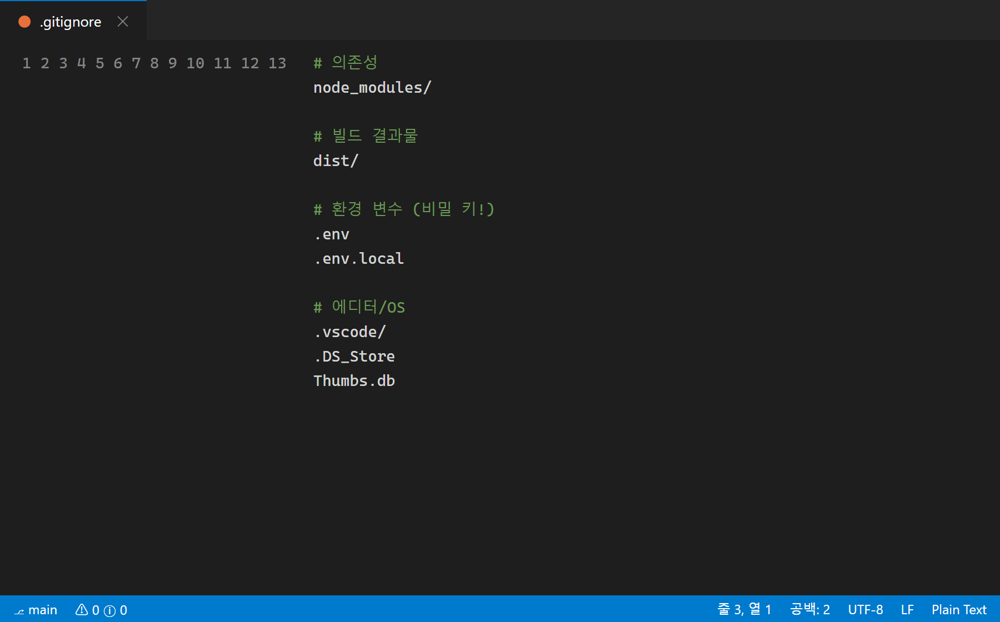
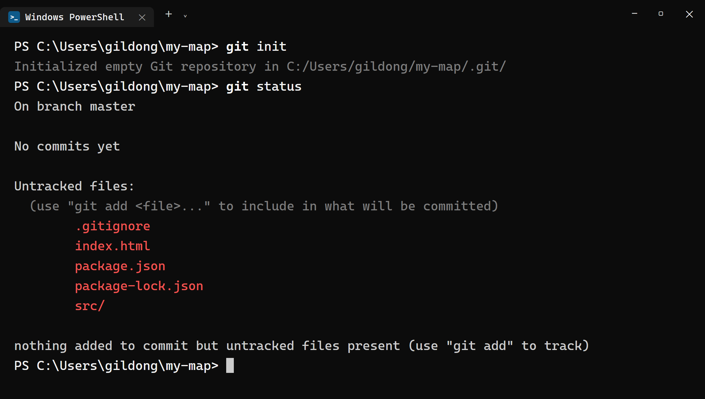
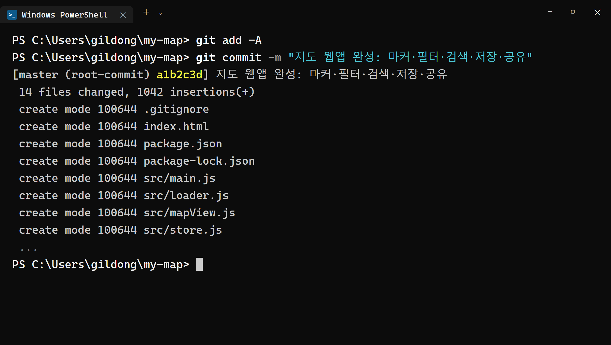
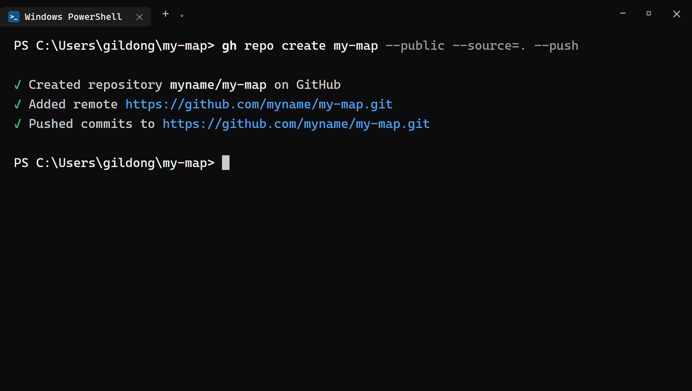
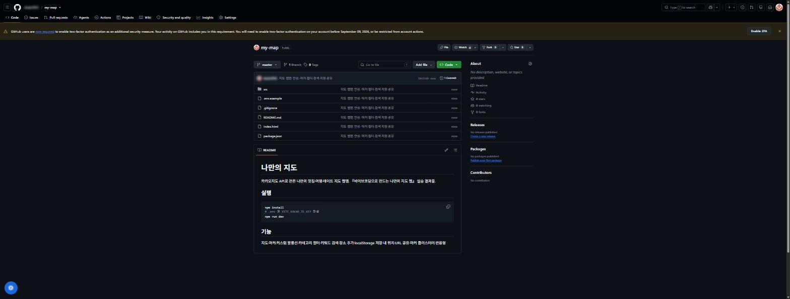
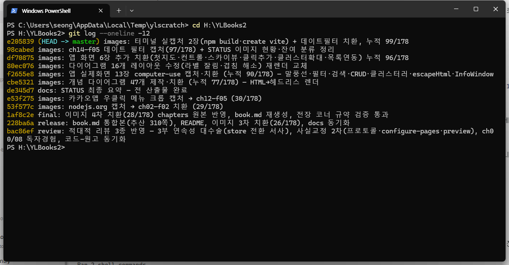

# 24장 GitHub에 올리기

!!! note "이 장에서 배우는 것"
    - `my-map` 프로젝트를 Git 저장소로 만들고 첫 커밋을 남깁니다
    - `.gitignore`를 최종 점검하고, `.env`와 `node_modules`를 왜 빼는지 확실히 이해합니다
    - `gh repo create my-map --public --source=. --push` 한 줄로 프로젝트를 깃허브에 올립니다
    - GitHub 웹 화면에서 올라간 파일을 검수하고, `.env`가 없는지 반드시 확인합니다
    - 앞으로 평생 쓸 커밋 메시지 습관을 만듭니다

---

이제 이 책의 마지막인 5부에 들어왔습니다. 지금까지 8장에서는 빈 폴더로 출발해 9장에서 지도를 띄우고, 11장에서 마커를 찍었습니다. 13~15장에서는 말풍선과 필터, 검색 기능을 추가했으며, 16~19장에서는 장소 정보를 추가하고 저장하고 관리하는 작업을 진행했습니다. 20~22장에서는 내 위치 표시, 공유 기능, 클러스터러를 구현했고, 23장에서는 스마트폰 화면에서도 잘 보이도록 화면을 최적화했습니다. 이제 `my-map`에 필요한 모든 기능이 갖춰졌습니다.

그런데 현재 이 앱은 여러분의 컴퓨터 안에만 존재합니다. 다른 사람에게 보여 주려면 직접 노트북을 들고 가야만 하고, 하드디스크에 문제가 생기면 앱이 함께 사라질 수도 있습니다. 5부에서는 이 앱을 인터넷에 공개하는 과정을 다룹니다. 그 첫 단계로 이번 장에서는 프로젝트를 깃허브에 올리는 작업을 진행합니다. 다음 장에서 진행할 배포(GitHub Pages)와 마지막 장의 README 작성 작업 모두 깃허브에 코드가 올라가 있어야 진행할 수 있습니다.

이번 장에서 진행할 작업은 5장에서 이미 한 번 연습한 내용입니다. `hello-github` 연습 저장소를 만들면서 `git init` → `commit` → `gh repo create`의 순서를 경험해 보았습니다. 이번에는 동일한 순서를 실제 프로젝트에 적용합니다. 다만 이번 프로젝트에는 카카오 JavaScript 키가 포함된 `.env` 파일이 존재하는데, 이 파일은 깃허브에 올려서는 안 됩니다. 그래서 이번 장의 절반 가량은 어떤 파일을 제외하고 올릴지 판단하는 내용으로 진행하겠습니다.

## 24.1 올리기 전 점검: 무엇을 빼고 올릴 것인가

이삿짐을 쌀 때 모든 물건을 그대로 싣지 않는 것과 마찬가지입니다. 쓸모없는 것은 버리고, 다시 채울 수 있는 것은 비우고, 중요한 것은 따로 보관하는 것처럼, 깃허브에 올릴 파일을 선별할 때도 기준을 정해 분류해야 합니다. 프로젝트 폴더 안에 있는 모든 파일을 그대로 깃허브에 올리는 것이 아닙니다. `my-map` 폴더를 열어 어떤 파일을 포함하고 어떤 파일을 제외할지 분류해 보겠습니다.

깃허브에 올려야 할 파일은 앱을 다시 만들 수 있을 만한 내용을 담고 있어야 합니다. `index.html`과 `src` 폴더에 담긴 자바스크립트와 CSS 파일 전체, 그리고 `package.json`이 여기에 해당합니다. 이 파일들만 있으면 어떤 컴퓨터에서든 여러분의 앱을 동일하게 다시 실행할 수 있습니다.

반대로 제외해야 할 파일은 두 가지 종류가 있으며, 그 이유는 서로 정반대입니다.

첫 번째로 제외할 파일은 인증 키가 포함된 `.env`입니다. 8장에서 카카오 JavaScript 키를 코드에 직접 적지 않고 별도의 `.env` 파일에 따로 보관했습니다. 앞으로 프로젝트 저장소를 `--public`으로 설정해 누구나 접근할 수 있게 할 예정이므로, 저장소에 포함된 모든 파일은 누구나 검색을 통해 찾아볼 수 있게 됩니다. 공개된 저장소에 올라온 API 키를 자동으로 수집하는 프로그램이 지금도 계속해서 작동하고 있습니다. 카카오 키는 7장에서 등록한 도메인에서만 작동하도록 설정했지만, 그렇다고 해서 키를 그대로 공개해 둘 수는 없습니다.

두 번째로 제외할 항목은 `node_modules`입니다. 이것은 인증 키가 포함되어 있어서가 아니라, 파일 용량이 매우 크고 필요할 때 언제든지 다시 만들 수 있기 때문에 제외합니다. 이 폴더에는 npm을 통해 설치한 외부 패키지들이 담겨 있으며, 그 수가 수천에서 수만 개에 달하고 용량도 수십에서 수백 메가바이트에 이릅니다. 하지만 이 폴더는 `package.json` 파일만 있으면 `npm install`이라는 명령어 한 번으로 즉시 다시 만들 수 있습니다. 따라서 `package.json` 파일만 올려 두면 `node_modules` 폴더는 제외해도 전혀 문제가 없습니다. 대부분의 프로젝트가 이와 같은 방식으로 관리하고 있습니다. 만약 `node_modules` 폴더까지 통째로 저장소에 올라가 있다면, 그것은 설정이 잘못된 것이라고 판단하면 됩니다.

이 "뺄 목록"을 적어 두는 파일이 바로 `.gitignore`였습니다. 8장에서 `.env`를 만들 때 Claude Code가 한 번 점검해 줬지만, 그때는 저장소를 만들기 한참 전이었습니다. 올리기 직전인 지금 다시 한번 점검합시다. 바이브코딩답게 점검도 Claude Code에게 맡겨 봅시다.

!!! tip "이렇게 물어보세요"
    > my-map 프로젝트를 깃허브 공개 저장소에 올리기 전 점검을 해줘. .gitignore에 .env와 node_modules, dist가 빠짐없이 들어 있는지 확인하고, 없으면 추가해줘. 그리고 이 프로젝트에서 절대 공개되면 안 되는 파일이 또 있는지 목록으로 보고해줘.

Claude Code가 `.gitignore` 파일을 열어 내용을 확인하고, 설정이 빠진 부분이 있다면 보완한 뒤 그 결과를 알려 줄 것입니다. 점검을 마친 `.gitignore` 파일에는 최소한 다음에 설명할 세 가지 내용이 포함되어 있어야 합니다.

```
node_modules
dist
.env
```

이제 각 항목을 한 줄씩 살펴보겠습니다. `node_modules`는 방금 언급한 패키지 관련 폴더를 가리키고, `.env`에는 인증 키가 보관되어 있습니다. `dist`은 25장에서 `npm run build` 명령을 실행하면 자동으로 생성되는 빌드 결과물 폴더입니다. 이 역시 소스코드만 있으면 다시 만들 수 있으므로 제외 대상입니다. Vite 템플릿을 사용한 프로젝트의 `.gitignore` 파일에는 이 외에도 `*.local`, 로그 파일, 에디터 설정 폴더 등이 미리 등록되어 있을 것입니다. 이 모든 항목은 동일한 기준으로 선별된 것입니다. 즉, 언제든지 다시 만들 수 있거나 특정 환경에서만 의미가 있는 파일이라면 제외하는 것이 원칙입니다.

{ width="620" }
/// caption
그림 24.1 — 점검을 마친 .gitignore 파일
///

!!! warning "주의"
`.gitignore`는 앞으로 새롭게 변경되는 내용부터 파일을 제외할 뿐, 이미 이전에 커밋된 파일까지 자동으로 삭제해 주지는 않습니다. Git은 파일의 변경 이력을 상세히 기록하는 도구이기 때문에, 한번 커밋에 포함된 `.env`는 나중에 파일을 삭제하고 다시 커밋하더라도 이전 커밋 기록에는 그대로 남아 있습니다. 깃허브에서 커밋 이력을 확인하면 누구라도 그 내용을 볼 수 있으므로 주의해야 합니다. 따라서 작업의 순서가 매우 중요합니다. 반드시 `.gitignore` 파일 점검 작업을 먼저 진행하고, 커밋은 그 이후에 진행해야 합니다. 만약 이미 `.env`가 커밋된 상태라면 이번 장 마지막 부분에 있는 24.4절의 내용을 참고하여 조치하시기 바랍니다.

## 24.2 git init에서 첫 커밋까지

깃허브에 올릴 파일과 제외할 파일을 정리했으니 이제부터 커밋 작업을 진행하겠습니다. 가장 먼저 `my-map` 폴더의 터미널에서 명령어를 입력해 현재 프로젝트의 상태를 확인합니다. 이때 사용하는 명령어는 3장에서 배운 상태 확인 명령어입니다.

```powershell
git status
```

이 작업을 실행하면 두 가지 형태의 결과 중 하나가 표시될 것입니다.

첫 번째 경우는 `fatal: not a git repository ...`이라는 오류 메시지가 나타나는 경우입니다. 이 오류가 나오더라도 놀라지 마시고, 앞으로 함께 차근차근 진행하면 됩니다. `npm create vite`는 프로젝트에 필요한 폴더와 파일을 생성해 줄 뿐, 해당 폴더를 Git 저장소로 초기화해 주지는 않습니다. 지금까지 이 프로젝트에서 한 번도 `git init` 작업을 진행한 적이 없다면 이 오류가 나타나는 것이 당연합니다.

두 번째 경우는 추적 중인 파일 목록이 나타나는 경우인데, 이것은 3장에서 배운 내용대로 작업 중간중간 커밋을 진행해 왔다는 의미입니다. 이미 Git 저장소가 설정되어 있으므로, 아래 내용 중 `git init` 부분은 건너뛰고 변경된 내용을 커밋하는 과정부터 이어서 진행하면 됩니다.

이번에도 전체 작업 과정을 Claude Code에게 요청하여 진행하겠습니다. 5장에서 연습했던 프롬프트와 내용은 비슷하지만, 이번에는 파일 점검 조건을 함께 제시하여 안전성을 높이겠습니다.

!!! tip "이렇게 물어보세요"
    > my-map 프로젝트를 git 저장소로 초기화하고 첫 커밋을 만들어줘. 커밋 전에 git status로 커밋될 파일 목록을 나에게 먼저 보여주고, .env나 node_modules가 목록에 있으면 멈추고 알려줘. 커밋 메시지는 "지도 웹앱 완성: 마커·필터·검색·저장·공유"로 해줘.

프롬프트에 포함된 내용 중 주목할 점은 단순히 작업을 진행하라는 "커밋해 줘"가 아니라, 안전을 위한 조건으로 "커밋될 목록을 먼저 보여 주고, 위험 신호가 있으면 멈춰라"라는 확인 절차를 붙였다는 것입니다. 작업을 에이전트에게 맡겼다고 해서 최종적인 확인 권한까지 넘긴 것은 아닙니다. 이것은 1장에서 강조한 작업을 잘게 나누어 실행하고 결과를 확인하는 방식을 그대로 적용한 것입니다. Claude Code는 사용자의 승인을 받아가며 필요한 명령어를 순서대로 실행할 것입니다.

```powershell
git init
git status
git add -A
git commit -m "지도 웹앱 완성: 마커·필터·검색·저장·공유"
```

이제 실행되는 명령어의 내용을 한 줄씩 확인해 보겠습니다.

- `git init` — 이 폴더에 `.git`이라는 숨김 폴더를 만들어 역사 기록을 시작합니다. 아직 아무것도 적지 않은 빈 장부를 새로 펼친 단계입니다.
- `git status` — 커밋 후보 파일을 보여 줍니다. 여기가 오늘의 검문소입니다.
- `git add -A` — 모든 변경 파일을 **스테이지**(기록 대기석)에 올립니다. 3장의 비유를 다시 쓰면, 사진 찍을 사람을 촬영장에 세우는 단계입니다.
- `git commit -m "..."` — 대기석에 오른 모습 그대로 역사에 도장을 찍습니다. `-m` 뒤가 이 커밋의 이름표입니다.

명령어의 실행 결과를 확인할 때는 어떤 점을 살펴보아야 할까요? `git status`의 실행 결과 중에서 Untracked files 항목에 어떤 파일이 포함되었는지 확인하면 됩니다. 만약 `index.html`, `package.json`, `package-lock.json`, `.gitignore`, `src/`과 같은 이름의 파일과 폴더가 보인다면 정상적으로 처리된 것입니다. 반대로 만약 `.env`나 `node_modules/`가 목록에 보인다면 절대로 다음 단계로 진행해서는 안 됩니다. 이 경우 24.1절의 `.gitignore` 점검 내용으로 돌아가 다시 확인하시기 바랍니다. 만약 `.gitignore` 파일이 제대로 설정되었다면, Git은 해당 파일들을 관리 대상으로 인식하지 않으므로 파일 목록에 나타나지 않을 것입니다.

{ width="760" }
/// caption
그림 24.2 — 커밋 전 git status 검문소
///

파일 목록에 문제가 없다면 확인 후 작업 진행을 승인합니다. 커밋 작업이 완료되면 터미널에 다음과 같은 내용이 표시될 것입니다.

```
[master (root-commit) a1b2c3d] 지도 웹앱 완성: 마커·필터·검색·저장·공유
 14 files changed, 1042 insertions(+)
 create mode 100644 .gitignore
 create mode 100644 index.html
 ...
```

결과의 첫 줄에 보이는 `a1b2c3d`와 같은 문자열은 이번 커밋에 부여된 고유 식별자인 해시[^1]로, 커밋을 구분하기 위한 일련번호와 같습니다. 그 뒤에 표시되는 `14 files changed`와 같은 숫자는 변경되거나 추가된 파일의 개수로, 프로젝트의 상황에 따라 달라질 수 있습니다. 이 부분에서는 파일 목록 중에 혹시라도 `.env`가 포함되어 있지 않은지만 확인하면 충분합니다.

{ width="760" }
/// caption
그림 24.3 — 첫 커밋 완료
///

!!! tip "팁"
커밋 직후 `git ls-files | Select-String env` 를 실행해 보세요. 저장소가 추적 중인 파일 중에 `env`가 들어간 이름이 있는지 한 번 더 확인할 수 있습니다. 아무것도 안 나오면 `.env`가 장부에 오르지 않았다는 뜻이니 안심해도 좋습니다. `git ls-files`는 지금 Git 장부에 올라 있는 파일 전체 목록을 보여 주므로, 의심스러울 때마다 꺼내 쓰면 좋습니다.

## 24.3 gh repo create: 한 줄로 깃허브에 올리기

이제 컴퓨터 내에 있는 프로젝트 기록을 깃허브 서버에 올리겠습니다. 5장에서 배운 명령어를 `my-map` 폴더의 터미널에서 입력하면 진행할 수 있습니다. Claude Code에게 "이 저장소 깃허브에 public으로 올려 줘"라고 요청하면 결국 동일한 명령어를 실행하게 될 것입니다.

```powershell
gh repo create my-map --public --source=. --push
```

이제 이 명령어가 실제로 어떤 의미를 담고 있는지 자세히 살펴보겠습니다. 이번은 연습이 아니라 실제 프로젝트를 적용하는 것이므로, 각 옵션이 어떤 의미를 가지는지 함께 알아보겠습니다.

- `my-map` — 깃허브에 만들 저장소 이름입니다. 보통 폴더 이름과 같게 짓습니다. 저장소 주소는 `github.com/여러분의아이디/my-map`입니다.
- `--public` — 누구나 볼 수 있는 공개 저장소로 만듭니다. 공개해도 되는 이유는 8장부터 키를 `.env`에 분리해 두었기 때문입니다. 코드에는 `import.meta.env.VITE_KAKAO_JS_KEY`라는 호출문만 있고 키값 자체는 없습니다. 코드는 공개하되 키는 내 컴퓨터에만 두기로 한 덕을 여기서 봅니다. 공개로 만드는 실용적인 이유도 두 가지 있습니다. 포트폴리오는 다른 사람이 볼 수 있어야 하고, 25장에서 쓸 GitHub Pages 무료 배포는 공개 저장소에서 쓸 수 있습니다.
- `--source=.` — 현재 폴더(`.`)의 저장소를 방금 만든 깃허브 저장소와 연결합니다. 이 연결로 깃허브 쪽 저장소는 `origin`이라는 별명을 얻습니다(5장 복습).
- `--push` — 연결만 하고 끝내지 않고, 지금까지 쌓인 커밋을 즉시 밀어 올립니다.

명령어를 실행하면 보통 수 초 내에 작업 결과가 표시됩니다.

```
✓ Created repository 여러분의아이디/my-map on GitHub
✓ Added remote https://github.com/여러분의아이디/my-map.git
✓ Pushed commits to https://github.com/여러분의아이디/my-map.git
```

{ width="760" }
/// caption
그림 24.4 — gh repo create 실행 결과
///

터미널에 세 줄의 체크 표시가 나타나면서, 저장소가 생성되었고(Created), 원격 저장소와 연결되었으며(Added remote), 파일이 정상적으로 업로드되었다는(Pushed) 내용이 표시되면 모든 과정이 완료된 것입니다. 그동안 많은 시간이 걸렸던 작업이 단 몇 초 만에 클라우드에 올라가는 것을 확인할 수 있습니다. 만약 "Name already exists"라는 오류가 나타난다면, 이는 과거에 동일한 이름의 저장소를 생성한 적이 있다는 의미입니다. 이 경우 저장소의 이름을 `my-map-app`처럼 변경하거나 기존의 저장소를 정리한 뒤 다시 명령어를 실행하는 것이 좋습니다. 만약 인증과 관련된 오류가 발생한다면 5장에서 배운 `gh auth status` 명령어를 이용해 깃허브 로그인 상태를 확인하시기 바랍니다.

!!! tip "팁"
`git init` 명령어를 이용해 생성한 원격 저장소의 기본 브랜치 이름은 사용자의 Git 설정에 따라 `master`일 수도 있고 `main`일 수도 있습니다. 하지만 어느 쪽이든 `gh repo create --push` 내용은 그대로 업로드되므로 이번 실습을 진행하는 데에는 아무런 문제가 없습니다. 최근 깃허브에서 권장하는 표준 브랜치 이름은 `main`입니다. 브랜치 이름을 통일하고 싶다면 파일을 푸시하기 전에 `git branch -M main` 명령어 한 줄로 브랜치 이름을 변경할 수 있습니다. 25장에서 진행할 배포 작업에서 브랜치 이름을 다시 확인하게 될 것이므로 기억해 두시기 바랍니다.

## 24.4 GitHub 웹에서 확인하기

터미널에 작업이 정상적으로 완료되었다는 메시지가 표시되었다고 해서 모든 확인 절차가 끝난 것은 아닙니다. 특히 오늘 작업하는 내용은 "무엇이 올라갔나"만큼이나 "무엇이 안 올라갔나"가 매우 중요하므로, 반드시 웹 브라우저를 열어 깃허브 페이지에 나타난 내용을 직접 확인하시기 바랍니다.

```powershell
gh repo view --web
```

웹 브라우저에 `github.com/여러분의아이디/my-map` 저장소 페이지가 열리면, 페이지 중앙에 프로젝트의 파일과 폴더 목록이 표시될 것입니다. 그중에서 `index.html`, `package.json`, `src` 폴더가 제대로 보이는지 확인합니다. `src` 폴더를 클릭해 들어가면 `main.js`, `mapView.js`, `store.js` 등 우리가 지금까지 작성해 온 파일들이 그대로 남아 있는 것을 확인할 수 있습니다. 이제 여러분의 프로젝트 코드에 인터넷 주소가 부여되어 언제 어디서든 접근할 수 있게 되었습니다.

{ width="760" }
/// caption
그림 24.5 — 깃허브에 올라간 my-map 저장소
///

이제 미리 정해 둔 검수 목록을 기준으로 하나씩 확인해 보겠습니다.

1. `.env`가 파일 목록에 없는가?: 가장 먼저 확인해야 합니다. 목록을 위에서 아래까지 훑어보고 `.env`가 없는지 확인하세요.
2. `node_modules` 폴더가 없는가?: 있다면 저장소가 쓸데없이 무거워집니다.
3. `.gitignore`는 있는가?: 이 파일은 비밀이 아니므로 올려도 좋습니다. 오히려 올라가 있어야 다른 컴퓨터에서 받아 작업할 때도 같은 파일을 계속 걸러 낼 수 있습니다.
4. 커밋이 보이는가?: 파일 목록 위의 커밋 수 표시(예: "1 commit")를 눌러 보세요. 방금 만든 "지도 웹앱 완성: ..." 커밋이 역사의 첫 페이지에 올라 있을 겁니다.

{ width="620" }
/// caption
그림 24.6 — 검수 포인트: .env와 node_modules가 없다
///

깃허브 페이지 상단에 위치한 검색창을 이용해서도 확인할 수 있습니다. 검색창에 `VITE_KAKAO_JS_KEY`를 입력해 보세요. 그 결과 키 값을 참조하는 코드가 적힌 `loader.js` 파일만 검색 결과로 나타나고, 실제 키 값이 보관된 파일은 전혀 나타나지 않아야 정상입니다. 이 확인 과정까지 모두 통과했다면, 중요한 정보는 안전하게 보호하면서 코드는 올바르게 공개하는 방법을 제대로 이해하고 익힌 것이라고 할 수 있습니다.

!!! warning "주의"
만약 검색 결과에서 `.env`가 나타난다면 다음 두 가지 작업을 순서대로 진행하시기 바랍니다. 가장 먼저 노출된 키를 즉시 사용 중지해야 합니다. 이를 위해 developers.kakao.com에 접속한 뒤 내 애플리케이션 → 앱 설정 → 앱 키 메뉴로 이동하여 JavaScript 키를 재발급받으면, 기존에 사용하던 키는 즉시 효력을 잃게 됩니다. 새롭게 발급받은 키를 `.env` 파일에 다시 저장하면 앱은 이전과 마찬가지로 정상적으로 작동하게 됩니다. 그 다음으로는 깃허브 저장소의 커밋 이력을 정리해야 합니다. 이 작업 역시 Claude Code에게 ".env가 깃허브에 올라갔어. 추적에서 제거하고 .gitignore에 추가해서 다시 푸시해 줘. 커밋 역사에 남은 것도 지워야 하면 방법을 알려 줘"라고 요청하면 편리하게 진행할 수 있습니다. 키를 가장 먼저 재발급받는 이유는, 이력을 정리하는 동안에도 키가 그대로 노출되어 있기 때문입니다.

## 24.5 커밋 메시지: 나중에 읽을 기록

프로젝트 코드가 깃허브에 정상적으로 업로드되었으므로, 이제부터 개발자로서 습관으로 삼아야 할 점에 대해 이야기하겠습니다. 앞으로 프로젝트의 기능을 수정하거나 보완할 때마다 작업 내용을 커밋하고 원격 저장소에 푸시하는 과정을 진행하게 될 것입니다. 이때 커밋 메시지를 대충 작성해도 괜찮은지 의문이 들 수도 있습니다.

먼저 미래의 상황을 가정해 보겠습니다. 나중에 시간이 지나 지도 기능이 예상과 다르게 작동하는 문제가 발생하여, 과거의 커밋 이력을 살펴보아야 하는 상황을 생각해 보시기 바랍니다. 만약 커밋 메시지가 "수정", "수정2", "진짜 마지막", "ㅁㄴㅇㄹ"와 같이 모호하게 적혀 있다면, 어느 시점의 작업으로 돌아가 문제를 찾아야 할지 알 수 없을 것입니다. 반대로 메시지가 "카테고리 필터 추가", "말풍선 닫힘 버그 수정", "모바일에서 사이드바 접기"와 같이 명확하게 작성되어 있다면, 문제가 발생한 원인과 시점을 보다 쉽고 정확하게 찾아낼 수 있습니다. 커밋 메시지는 다른 사람에게 보여 주기 위해 작성하는 것이 아니라, 바로 미래의 자신이 과거의 작업 내용을 쉽게 파악하기 위해 기록하는 것입니다.

좋은 커밋 메시지를 작성하는 데에는 거창한 규칙이 필요하지 않습니다. 다음에 설명할 세 가지 기본 원칙만 준수하면 충분합니다.

1. 한 커밋에는 한 가지 일만 담습니다. "필터 추가 + 버그 수정 + 색상 변경"을 한 커밋에 몰아넣으면 그중 하나만 골라 되돌릴 수 없습니다. 기능 하나를 확인할 때마다 커밋합니다. 14장부터 지켜 온 방식입니다.
2. 첫 줄에 요약을 한 문장 씁니다. 무엇을 했는지가 드러나게 쓰고, 한국어로 써도 됩니다.
3. 이유가 필요하면 본문에 덧붙입니다. 이유를 남겨 둘 만한 변경이라면 `git commit -m "요약" -m "이유 설명"`처럼 두 번째 `-m`으로 본문을 붙일 수 있습니다.

그리고 커밋 메시지는 특히 AI에게 작성시키면 매우 효율적입니다. Claude Code에게 "지금까지 작업 커밋해 줘"라고 간단히 요청하기만 해도, 변경된 파일의 내용을 분석하고 적절한 커밋 메시지를 제안해 줄 것입니다. 우리는 제안받은 메시지가 실제 작업 내용과 일치하는지 확인하고 승인만 하면 됩니다. 만약 메시지 내용이 마음에 들지 않는다면 "메시지는 ~로 바꿔서 커밋해"라고 추가로 요청하면 새로운 메시지를 제안받을 수 있습니다.

지금까지의 작업 이력을 한눈에 확인할 수 있는 명령어도 함께 알아두시기 바랍니다. 이 명령어는 지금까지의 커밋 내용을 요약하여 최신 순서로 간략하게 보여 줍니다.

```powershell
git log --oneline
```

```
f4e5d6c 모바일에서 사이드바 접기
c3b2a1f 마커 클러스터러 적용
...
a1b2c3d 지도 웹앱 완성: 마커·필터·검색·저장·공유
```

{ width="760" }
/// caption
그림 24.7 — git log --oneline으로 본 커밋 역사
///

이렇게 정리된 커밋 이력은 그대로 여러분의 개발 일지처럼 활용할 수 있습니다. 또한 깃허브 프로필 페이지에 표시되는 기여도 그래프에도, 커밋을 올린 날짜마다 초록색 칸이 하나씩 채워지며 자신의 개발 활동을 한눈에 확인할 수 있게 해줍니다.

!!! tip "이렇게 물어보세요"
    > 지금까지 변경된 내용을 커밋하고 푸시해줘. 커밋 메시지는 변경 내용을 보고 네가 한국어로 알맞게 지어서, 커밋하기 전에 나한테 먼저 보여줘.

앞으로 프로젝트에서 작업을 완료할 때마다 위의 과정을 반복하시기 바랍니다. 5장에서 미리 알려 드린 것처럼, 오늘부터는 작업 후 커밋하고 푸시하는 일련의 과정을 습관으로 만들 것을 권장합니다. 이 간단한 순서만 철저히 지켜도, 오랜 시간 진행한 작업의 내용이 통째로 사라지는 안타까운 상황은 겪지 않을 수 있습니다.

## 24.6 마무리

이번 장의 작업을 통해 `my-map`는 단순히 컴퓨터 속에 존재하던 프로젝트에서 인터넷 주소를 가진 공개 저장소로 거듭났습니다. `.gitignore` 파일을 이용해 인증 키가 포함된 `.env`와 언제든지 다시 만들 수 있는 `node_modules`를 제외했으며, `git init`부터 첫 커밋을 진행하기까지 모든 단계에서 빠짐없이 확인 절차를 거쳤습니다. 마지막으로 `gh repo create my-map --public --source=. --push` 명령어 한 줄로 깃허브에 파일을 업로드한 뒤, 웹 페이지에서 직접 내용을 확인하는 과정까지 마무리했습니다. 코드는 공개하되 중요한 정보는 안전하게 숨긴다는 기본 원칙은 앞으로의 어떤 프로젝트에서도 그대로 적용할 수 있습니다.

!!! abstract "이 장의 핵심"
    - 저장소에는 다시 만들 수 있는 파일과 키가 든 파일을 뺀 소스코드만 올립니다. `.env`는 키가 들어 있어서, `node_modules`는 `npm install`로 다시 만들 수 있어서 뺍니다.
    - `.gitignore`는 앞으로의 커밋만 걸러 줍니다. 반드시 `.gitignore` 점검 → 커밋 순서를 지키세요.
    - 커밋 전에 `git status`로 확인합니다. Untracked 목록에 `.env`나 `node_modules`가 보이면 진행하지 않습니다.
    - `gh repo create my-map --public --source=. --push` — 저장소 생성, origin 연결, 푸시까지 한 줄에 끝납니다.
    - 올린 뒤에는 웹에서 `.env` 없음, `node_modules` 없음, 커밋 역사까지 검수합니다.
    - 커밋 메시지는 나중의 내가 읽을 쪽지입니다. 한 커밋에 한 가지 일, 첫 줄 요약이면 충분합니다.

!!! question "잠깐 생각해 봅시다"
Q1. `.env`와 `node_modules`는 둘 다 깃허브에 올리지 않지만, 빼는 이유는 서로 다릅니다. 각각 한 문장으로 설명해 보세요.

____________________________________________

Q2. 친구가 여러분의 공개 저장소를 클론하여 실행하려고 합니다. 코드 외에 친구가 직접 준비해야 하는 것은 무엇일까요? (힌트: 저장소에 포함되지 않은 두 가지)

____________________________________________ ch24.txt

!!! example "확인 문제"
    1. `git ls-files`를 실행해 저장소가 추적 중인 파일 목록을 확인하고, `.env`가 없는지 직접 확인해 보세요.
    2. `src/style.css`에서 아무 색상 하나를 바꾼 뒤, Claude Code에게 커밋 메시지를 지어서 커밋·푸시하게 시켜 보세요. 그리고 깃허브 웹에서 새 커밋이 보이는지 확인해 보세요.
    3. 깃허브 저장소 페이지의 커밋 목록에서 첫 커밋을 클릭해, 그 커밋에 포함된 파일 목록과 24.2절의 `git status` 검문소에서 본 목록이 일치하는지 비교해 보세요.
    4. `.gitignore`에서 `.env` 줄을 지우면 `git status` 출력이 어떻게 달라지는지 실험해 보고, 반드시 다시 되돌려 놓으세요.

!!! info "더 찾아보기"
    - `.env.example` — 키값은 비우고 변수 이름만 적어 저장소에 올려 두는 견본 파일. 협업자에게 "이런 키가 필요하다"를 알리는 관례입니다.
    - `git rm --cached` — 파일은 남기고 Git 추적에서만 빼는 명령. 실수로 커밋한 파일을 빼낼 때 씁니다.
    - `Conventional Commits` — `feat:`, `fix:` 같은 접두어로 커밋 메시지를 규격화하는 세계적 관례.
    - `GitHub Secret scanning` — 깃허브가 공개 저장소에서 유출된 API 키를 자동 탐지해 경고해 주는 기능.
    - `git revert` — 특정 커밋을 "취소하는 새 커밋"을 만들어 안전하게 되돌리는 명령.

> 다음 장으로. 코드는 깃허브에 올라갔지만 아직 다른 사람이 우리 지도를 쓸 수는 없습니다. 25장에서는 `vite build`로 앱을 배포용 파일로 만들고, GitHub Actions와 GitHub Pages로 어디서나 접속할 수 있는 웹 주소를 만듭니다. 카카오 콘솔에 새 도메인까지 등록하면 링크 하나로 열리는 서비스가 됩니다.

[^1]: 커밋 해시 — 커밋 내용 전체를 바탕으로 계산한 40자리 고유 식별자(SHA-1). 터미널에는 보통 앞 7자리만 줄여서 보여 줍니다. `git log`나 깃허브 화면에서 특정 커밋을 가리킬 때 이 번호를 씁니다.
