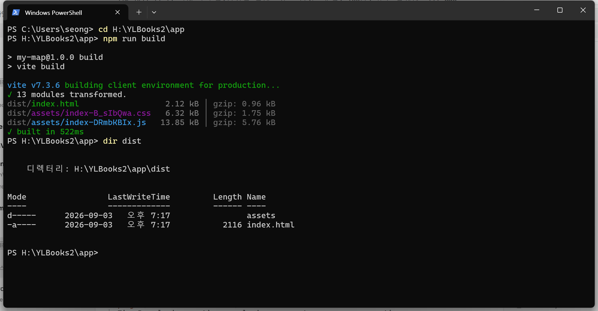
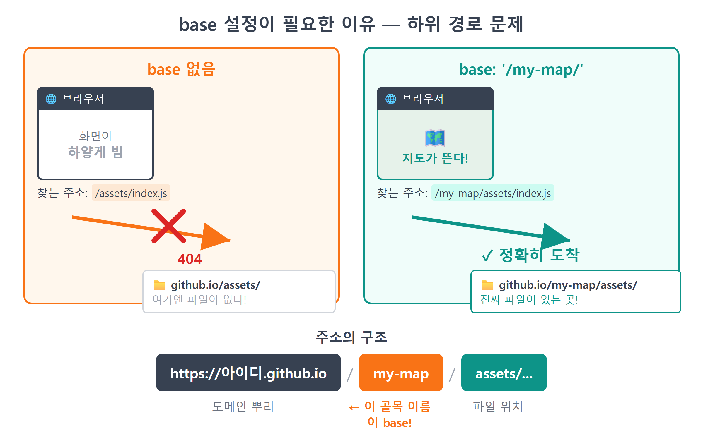
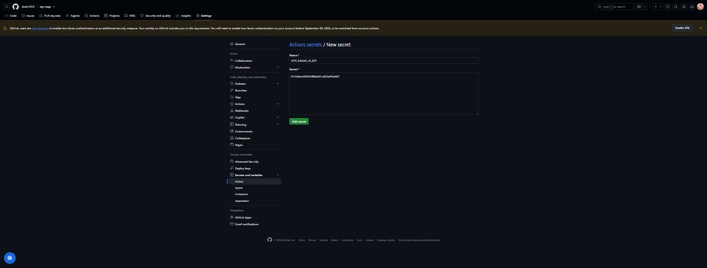
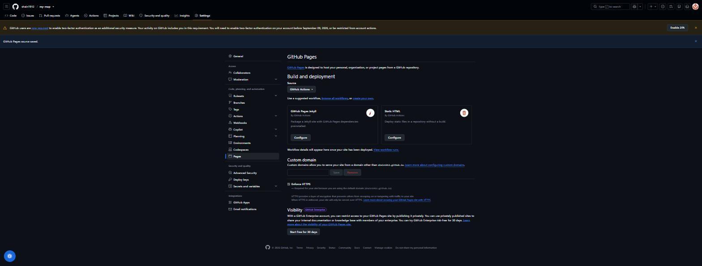
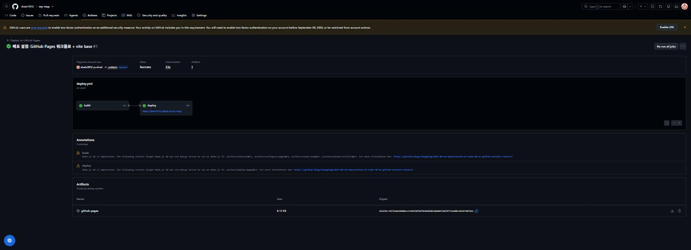
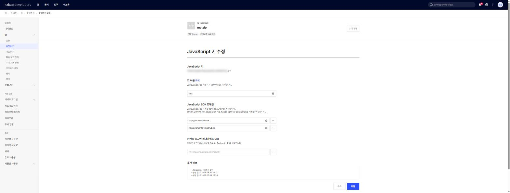
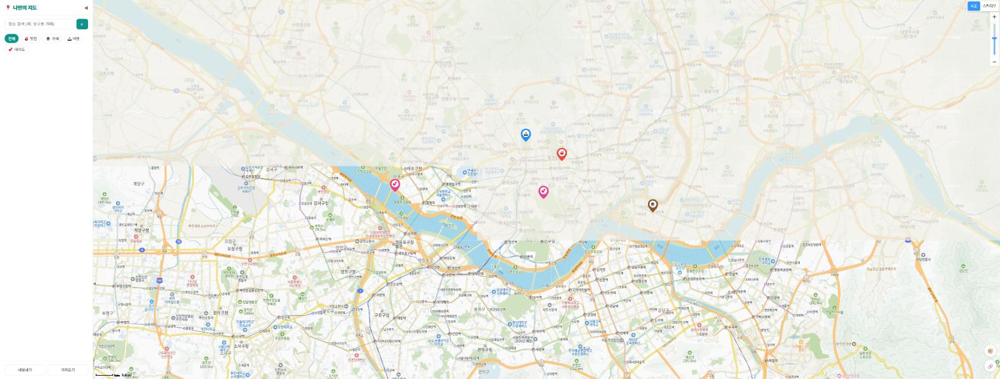

# 25장 GitHub Pages 배포

!!! note "이 장에서 배우는 것"
    - `npm run build`로 배포용 파일 묶음(`dist` 폴더)을 만들고 그 안에 무엇이 들었는지 확인합니다
    - `vite.config.js`에 `base: '/리포이름/'`을 설정해야 하는 이유를 Pages의 하위 경로 문제와 함께 이해합니다
    - GitHub Actions 워크플로(`deploy.yml`)로 푸시할 때마다 자동으로 배포하는 파이프라인을 만듭니다
    - 리포지토리 Secrets에 카카오 JS 키를 등록하고 빌드에 주입하는 법을 배웁니다
    - 카카오 개발자 콘솔에 `https://아이디.github.io` 도메인을 추가합니다 (안 하면 지도가 안 뜹니다)
    - 전 세계 누구나 접속할 수 있는 내 지도 앱의 주소를 손에 넣습니다

---

24장에서 작성한 코드를 GitHub에 업로드하였습니다. 리포지토리 페이지를 열면 소스 코드를 확인할 수 있습니다. 그러나 리포지토리는 코드를 보관하는 공간일 뿐, 해당 공간에서 지도가 실행되지는 않습니다. 다른 사람에게 리포지토리 주소를 전달하면 파일 목록만 확인할 수 있을 것입니다.

지금까지 지도는 `npm run dev`가 실행 중인 사용자의 컴퓨터 `localhost:5173`에서만 열렸습니다. localhost는 사용자의 컴퓨터를 가리키는 주소이므로, 개발 서버를 종료하면 지도 역시 열리지 않게 됩니다. 이번 장에서는 해당 지도를 GitHub의 무료 호스팅 서비스인 GitHub Pages[^1]에 업로드해 보겠습니다. 작업을 마치면 `https://아이디.github.io/my-map/`라는 주소가 부여되며, 서버를 실행해 두지 않아도 언제든지 접속할 수 있습니다. 비용은 발생하지 않습니다. 여기에 GitHub Actions도 함께 설정하겠습니다. 그러면 앞으로는 `git push` 작업만 수행하여도 배포 과정이 자동으로 진행됩니다. 배포는 최초 설정 시에만 일부 작업이 필요하며, 이후부터는 푸시 한 번으로 완료할 수 있습니다.

## 25.1 npm run build: 배포용 파일 만들기

개발 과정에서 우리는 `npm run dev`를 사용합니다. 그런데 8장에서 생성한 `package.json`을 다시 확인하면 스크립트가 하나 더 존재하였습니다.

```json
"scripts": {
  "dev": "vite",
  "build": "vite build",
  "preview": "vite preview"
}
```

`dev`와 `build`는 수행하는 작업이 상이합니다. `dev`는 개발용 임시 서버를 실행하며, 파일을 수정하면 즉시 반영되는 장점이 있으나 사용자의 컴퓨터에서만 동작하고 파일은 개발에 적합한 형태로 보존됩니다. 반면 `build`는 배포를 목적으로 파일을 정리합니다. 분산되어 있는 js 모듈을 병합하고 공백을 제거하여 용량을 줄이며, 브라우저에서 바로 실행할 수 있는 완성품 폴더 하나로 압축하여 묶습니다. 이 완성품은 Vite나 Node 환경이 없어도 파일 자체만으로 어느 웹 서버에서든 실행할 수 있습니다. 배포란 이 완성품 폴더를 인터넷 상에 업로드하는 과정을 의미합니다.

직접 파일을 묶어 보겠습니다. 터미널에서 프로젝트 폴더로 이동한 후 해당 명령어를 실행하시기 바랍니다.

```bash
npm run build
```

몇 초 내에 다음과 같은 실행 결과가 출력될 것입니다.

```
vite v7.1.0 building for production...
✓ 14 modules transformed.
dist/index.html                 0.72 kB │ gzip: 0.41 kB
dist/assets/index-Dk3xUxtB.css  4.21 kB │ gzip: 1.35 kB
dist/assets/index-C4f9x2ma.js  18.6 kB │ gzip: 6.02 kB
✓ built in 384ms
```

{ width="760" }
/// caption
그림 25.1 — npm run build 실행 결과와 dist 폴더
///

프로젝트 내에 `dist`라는 이름의 새 폴더가 생성되었습니다. 이는 배포판을 의미하는 distribution의 약자입니다. 폴더를 열어보면 `index.html` 파일 하나와 `assets` 폴더 내에 css 및 js 파일이 여러 개 존재하는 것을 확인할 수 있습니다. `src`에 분리하여 작성하였던 `loader.js`, `mapView.js`, `store.js`, `search.js` 등의 내용이 모두 js 파일 하나로 병합되었습니다. 파일 이름에 포함된 `C4f9x2ma`와 같은 문자열은 파일의 내용이 변경될 때마다 변동됩니다. 이를 통해 브라우저가 이전 버전의 파일을 캐시에서 계속 사용하는 현상을 방지할 수 있습니다.

이 과정에서 눈에 잘 띄지 않지만 중요한 처리가 이루어진 부분이 있으므로 짚고 넘어가겠습니다. 병합된 js 파일을 열어 검색하여 보면 `import.meta.env.VITE_KAKAO_JS_KEY`라는 코드가 사라지고 그 자리에 키 문자열이 포함되어 있는 것을 확인할 수 있습니다. `.env`는 개발 시에 Vite가 참조하는 파일일 뿐, 최종 결과물에 함께 포함되는 것은 아닙니다. 대신 빌드하는 시점에 해당 값이 코드에 삽입됩니다. 따라서 빌드를 수행하는 컴퓨터에 키가 존재하여야 최종 결과물에도 키가 포함됩니다. 이 점을 기억하여 주시기 바랍니다. 잠시 후 GitHub의 서버에서 빌드를 수행할 때 다시 한번 설명하겠습니다.

!!! tip "팁"
빌드 결과를 배포 전에 미리 확인하고 싶은 경우 `npm run preview`를 실행하시기 바랍니다. 해당 명령어는 `dist` 폴더를 실제 서비스 환경과 동일하게 실행하여 주며, 접속 주소는 일반적으로 `localhost:4173`입니다. 개발 서버와는 달리 빌드된 결과물을 기준으로 화면을 보여준다는 점에서 차이가 있습니다. 또한 `dist`는 언제든지 재생성할 수 있으므로 원격 저장소에 업로드하지 않습니다. Vite 템플릿의 `.gitignore`에 이미 해당 설정이 포함되어 있기 때문입니다.

## 25.2 base 설정: 앱이 하위 경로에 배포될 때

바로 배포를 진행하고 싶겠지만 그 전에 주의할 점이 있으므로 먼저 설명하겠습니다. 이 부분을 건너뛸 경우 배포 후 흰색 화면만 나타나는 흔한 문제가 발생할 수 있습니다.

GitHub Pages에서 제공하는 주소를 확인하여 주시기 바랍니다. 주소 형식이 `https://아이디.github.io/my-map/`와 같으며, 애플리케이션이 도메인의 최상단이 아니라 `/my-map/`라는 하위 경로에 위치하기 때문입니다. GitHub 사용자 계정 하나가 `github.io` 아래에 공간을 할당받고, 각 리포지토리마다 그 하위에 별도의 경로를 부여받는 구조이기 때문입니다. 그런데 Vite는 별도로 설정하지 않으면 애플리케이션이 도메인 최상단에 위치하는 것으로 간주하여 파일을 생성합니다. `dist/index.html` 파일을 열어보면 해당 내용이 기본 설정으로 기록되어 있습니다.

```html
<script type="module" src="/assets/index-C4f9x2ma.js"></script>
```

경로 맨 앞의 `/`는 도메인 최상단부터 파일을 찾으라는 의미입니다. 브라우저는 해당 파일을 `https://아이디.github.io/assets/...` 경로에서 요청하게 됩니다. 그러나 실제 파일은 `https://아이디.github.io/my-map/assets/...` 경로에 존재하므로 모든 요청이 404 오류로 실패하게 됩니다. html 파일은 정상적으로 열리지만 js 및 css 파일을 불러오지 못하므로 화면에 아무 내용도 표시되지 않는 것입니다.

{ width="760" }
/// caption
그림 25.2 — 기본 경로 설정이 필요한 이유: 하위 경로 문제
///

Vite에 애플리케이션의 접속 경로가 `/my-map/`임을 알려주면 문제를 해결할 수 있습니다. 해당 값은 프로젝트 최상단에 위치한 `vite.config.js` 파일에 작성합니다. 지금까지는 기본 설정으로 충분하였으므로 프로젝트에 해당 파일이 아직 존재하지 않습니다. Claude Code에게 요청하여 파일을 생성하도록 하겠습니다.

!!! tip "이렇게 물어보세요"
    > 이 프로젝트를 GitHub Pages에 배포할 거야. 리포 이름이 my-map이라서 https://아이디.github.io/my-map/ 하위 경로로 서비스돼. vite.config.js를 만들어서 base를 '/my-map/'으로 설정해줘. 다른 옵션은 건드리지 마.

Claude Code가 생성한 `vite.config.js` 파일의 내용은 다음과 같이 다섯 줄로 구성됩니다.

```js
// vite.config.js — Vite 설정 파일 (프로젝트 뿌리에 위치)
import { defineConfig } from 'vite';

export default defineConfig({
  base: '/my-map/', // GitHub Pages 하위 경로 = /리포이름/
});
```

`base` 항목에는 빌드 결과물의 모든 경로 앞에 추가할 기본 경로를 작성합니다. 이 값은 반드시 사용자의 리포지토리 이름과 문자 하나까지 정확히 일치하여야 하며, 양쪽의 슬래시도 누락되어서는 안 됩니다. 24장에서 리포지토리 이름을 `my-map`가 아닌 다른 이름으로 생성하였다면 그 이름을 사용하여야 합니다. 파일을 저장한 후 `npm run build` 명령어를 다시 실행하고 `dist/index.html` 파일을 열어보면 경로가 `/my-map/assets/...`로 변경되어 있는 것을 확인할 수 있습니다. 참고로 `base` 항목은 개발 서버에도 동일하게 적용됩니다. 이제 `npm run dev` 명령어를 실행하면 접속 주소가 `http://localhost:5173/my-map/`로 변경될 것입니다. 도메인 최상단인 `/`으로 접속하면 Vite가 `/my-map/` 경로로 이동할 것을 안내하는 페이지를 보여줍니다. 카카오 SDK의 도메인 등록은 경로 부분을 확인하지 않으므로 기존에 등록한 `http://localhost:5173` 정보는 그대로 사용할 수 있습니다.

원격 저장소에 푸시하기 전에 로컬 환경에서 결과물을 검증하여 보겠습니다. `npm run build` 명령어를 실행한 후 `npm run preview` 명령어를 실행합니다. 그리고 브라우저에서 기본 경로를 포함한 `http://localhost:4173/my-map/` 주소에 접속하여 흰색 화면 없이 애플리케이션이 정상적으로 표시되는지 확인하여 주시기 바랍니다. `dist/index.html` 파일을 직접 열어서 확인하는 경우 경로 기준이 달라 정상 여부를 정확히 확인할 수 없습니다. 미리보기 명령어는 실제 배포 환경과 동일한 조건으로 애플리케이션을 실행하여 주므로 정확한 확인이 가능합니다.

## 25.3 GitHub Actions: 푸시하면 자동으로 배포하기

이제 `dist`를 GitHub Pages에 배포하겠습니다. 수동으로 업로드하는 방법이 없는 것은 아닙니다. 그러나 그렇게 하면 코드를 수정할 때마다 빌드와 업로드 작업을 반복하여야 합니다. 빌드 작업을 누락한 채 예전 버전을 업로드하는 오류가 발생할 수도 있습니다. 따라서 처음부터 자동화하여 설정하겠습니다. 이 과정에서 GitHub Actions[^2]를 활용합니다. 리포지토리에 푸시 이벤트가 발생하면 GitHub의 서버가 미리 작성한 작업 순서에 따라 대신 작업을 수행하여 줍니다. 이 작업 순서를 워크플로라고 부르며, `.github/workflows/` 폴더 내에 YAML 파일 형식으로 작성합니다.

이 파일을 처음부터 직접 작성할 필요는 없습니다. Vite 공식 문서에 GitHub Pages 배포용 워크플로 작성 가이드가 제시되어 있습니다. 아래 예제는 해당 공식 가이드를 참고하여 작성하였습니다. Claude Code에게 가이드에 따라 파일을 생성하되, 카카오 API 키를 처리하는 조건 하나를 추가하도록 요청하겠습니다.

!!! tip "이렇게 물어보세요"
    > GitHub Pages에 자동 배포하는 GitHub Actions 워크플로를 .github/workflows/deploy.yml로 만들어줘. Vite 공식 정적 배포 가이드를 참고해서: main에 push되면 checkout → setup-node(Node 20, npm 캐시) → npm ci → npm run build → configure-pages로 Pages 설정을 준비하고 → dist를 upload-pages-artifact로 올리고 deploy-pages로 배포. 빌드 단계에서 VITE_KAKAO_JS_KEY 환경변수를 리포 Secrets에서 읽어 넣어줘.

Claude Code가 생성한 `.github/workflows/deploy.yml` 파일의 전체 내용을 확인하여 보겠습니다. 이 책에서 가장 내용이 긴 설정 파일입니다. 그러나 내용 자체가 어려운 것은 아니며, 한 줄씩 읽어보면 수행할 작업의 순서를 목록 형식으로 작성한 것에 불과합니다.

```yaml
# .github/workflows/deploy.yml — main에 push되면 빌드해서 Pages로 배포
name: Deploy to GitHub Pages

on:
  push:
    branches: [main]     # main 브랜치에 push될 때마다 실행
  workflow_dispatch:      # Actions 탭에서 수동 실행 버튼도 제공

permissions:
  contents: read          # 코드 읽기
  pages: write            # Pages에 배포하기
  id-token: write         # 배포 신원 증명용

concurrency:
  group: pages
  cancel-in-progress: true  # 연달아 push하면 진행 중이던 옛 배포는 취소

jobs:
  build:
    runs-on: ubuntu-latest              # GitHub이 빌려주는 리눅스 컴퓨터에서
    steps:                              # (액션 버전은 GitHub 공식 문서에서 최신을 확인하세요)
      - uses: actions/checkout@v5       # 1) 리포 코드를 내려받고
      - uses: actions/setup-node@v5     # 2) Node.js를 설치하고
        with:
          node-version: 20
          cache: npm
      - run: npm ci                     # 3) 의존성 설치 (lock 파일 그대로)
      - run: npm run build              # 4) 빌드!
        env:
          VITE_KAKAO_JS_KEY: ${{ secrets.VITE_KAKAO_JS_KEY }}  # 금고에서 키 꺼내 주입
      - uses: actions/configure-pages@v5  # 5) Pages 배포에 필요한 설정 준비
      - uses: actions/upload-pages-artifact@v4
        with:
          path: dist                    # 6) dist 폴더를 배포 꾸러미로 제출

  deploy:
    needs: build                        # build가 성공해야 시작
    runs-on: ubuntu-latest
    environment:
      name: github-pages
      url: ${{ steps.deployment.outputs.page_url }}
    steps:
      - id: deployment
        uses: actions/deploy-pages@v4   # 7) 제출된 꾸러미를 Pages에 개시
```

파일의 구조부터 살펴보겠습니다. `on` 항목에는 워크플로가 실행되는 조건을 작성합니다. main 브랜치에 푸시할 때 실행되며, 필요한 경우 수동으로도 실행할 수 있습니다. `jobs` 항목에는 수행할 작업을 명시하며 `build`와 `deploy`를 작성하였습니다. `build` 작업은 GitHub에서 제공하는 우분투 서버 환경에서 사용자의 컴퓨터에서 수행하였던 작업과 동일한 과정으로 진행됩니다. `checkout`로 코드를 가져오고, `setup-node`로 Node 환경을 설치하며, `npm ci`로 의존성 패키지를 설치한 후, `npm run build`로 빌드를 진행합니다. `npm ci`는 `npm install`와 달리 `package-lock.json`에 명시된 버전에 맞추어 설치합니다. 빌드 작업이 완료되면 `configure-pages`가 Pages 배포에 필요한 설정을 준비합니다. 완성된 결과물은 `dist`가 `upload-pages-artifact`가 배포용 파일 묶음으로 생성하여 전달합니다. 이어지는 `deploy` 작업에서는 `deploy-pages`가 해당 파일 묶음을 Pages 서버에 업로드합니다. `uses:` 형식으로 호출하는 `actions/checkout@v5`와 같은 작업 단위는 GitHub에서 공식적으로 제공하는 것입니다. 버전 번호는 지속적으로 갱신되므로 최신 버전은 GitHub 공식 문서에서 확인하여 주시기 바랍니다.

작업을 `build`와 `deploy` 두 단계로 분리한 데에는 이유가 있습니다. 빌드 작업과 배포 작업을 분리하여 두면, 빌드 과정에서 문제가 발생하였을 때 불완전한 결과물이 서비스에 업로드되는 것을 방지할 수 있습니다. `needs: build` 설정 한 줄로 인하여 빌드 작업이 정상적으로 완료된 경우에만 배포 작업이 진행됩니다. 파일 상단의 `permissions` 항목에는 이 워크플로에 부여할 권한을 명시합니다. 코드는 읽기 권한만 부여하고 Pages에 업로드할 수 있는 권한을 부여하였습니다. 4장에서 설명하였듯이 자동화된 작업에는 반드시 필요한 범위 내에서만 권한을 부여하는 것이 권장됩니다.

!!! warning "주의"
이 워크플로는 24장에서 생성한 구조, 즉 `my-map` 리포지토리의 최상단에 `package.json` 파일이 위치하는 구조를 전제로 작성되었습니다. 만약 애플리케이션이 `app/`와 같은 하위 폴더 내에 위치한다면, 최상단에서 `npm ci` 명령어를 실행하는 과정에서 package.json 파일을 찾을 수 없다며 실행이 즉시 실패할 것입니다. 그러한 구조에서는 `run` 단계마다 `working-directory: app` 경로를 지정하고, `setup-node`의 캐시 경로를 `cache-dependency-path: app/package-lock.json`로, 결과물 경로를 `path: app/dist`로 함께 수정하여야 합니다. 워크플로 실행 시 첫 단계부터 오류가 발생한다면 프로젝트 구조의 차이를 가장 먼저 확인하여 보시기 바랍니다.

빌드 단계에 작성된 `env:` 두 줄은 특히 주목하여 살펴보시기 바랍니다. 앞에서 미루어 설명하였던 내용을 이 부분에서 마무리하겠습니다. 빌드를 수행하는 컴퓨터에 API 키가 존재하여야 결과물에 키가 포함된다고 설명하였습니다. 그런데 이번에 빌드를 수행하는 컴퓨터는 GitHub의 서버입니다. 우리의 `.env` 파일은 24장에서 `.gitignore`로 관리되어 원격 저장소에 업로드되지 않았으므로 GitHub 서버에 존재하지 않습니다. 그대로 진행하면 빌드는 성공하여도 키 값이 비어있어 배포된 지도 서비스에서 "VITE_KAKAO_JS_KEY가 .env에 없습니다" 오류가 발생하게 될 것입니다. 따라서 GitHub에서 제공하는 보관소인 Secrets에 키를 저장하여 두고, `${{ secrets.VITE_KAKAO_JS_KEY }}` 표기 방식으로 빌드 시점에 환경 변수로 키를 전달하여 사용하도록 합니다.

API 키를 보관소에 등록하는 과정을 설명하겠습니다. 웹 브라우저에서 자신의 리포지토리 페이지를 열고 Settings → Secrets and variables → Actions → New repository secret 순서로 메뉴에 접근합니다. Name 항목에는 정확히 `VITE_KAKAO_JS_KEY`를 입력하고, Secret 입력란에는 7장에서 발급받은 본인의 JavaScript 키를 붙여넣은 후 Add secret 버튼을 클릭합니다.

{ width="760" }
/// caption
그림 25.3 — 리포지토리 Secrets에 VITE_KAKAO_JS_KEY 등록
///

한 번 저장한 비밀 값은 GitHub에서도 다시 확인할 수 없으며 수정하거나 삭제하는 것만 가능합니다. 리포지토리가 공개되어 있어도 Secrets에 저장된 내용은 외부에 노출되지 않으며, 워크플로 실행 기록에서도 값 대신 `***`로 표시됩니다.

!!! tip "팁"
5장에서 설치한 gh 명령어 도구를 사용하면 터미널에서 간단한 명령어 하나로 등록을 완료할 수도 있습니다. `gh secret set VITE_KAKAO_JS_KEY` 명령어를 실행하면 키 값을 입력하라는 메시지가 표시되며, 값을 붙여넣고 완료하면 등록이 완료됩니다. 웹 브라우저를 통한 접근이 필요하지 않으므로 이 방법이 더 간편할 것입니다.

!!! warning "주의"
JavaScript 키는 최종적으로 배포된 js 파일에 포함되어 누구나 확인할 수 있기 때문에 왜 Secrets에 등록하여야 하는지 의문이 생길 수도 있습니다. 카카오 JavaScript 키는 애초에 브라우저 환경에서 사용하는 것을 전제로 발급되기 때문에 외부에 노출되는 것이 기본입니다. 실제 보안 장치는 7장에서 설명한 도메인 제한 기능에 있습니다. 그럼에도 Secrets를 사용하는 이유는 다음과 같습니다. 첫째, 리포지토리의 소스 코드에 키를 직접 기록하지 않는 습관을 들이면, 이후에 REST API 키나 데이터베이스 접속 정보처럼 절대 노출되어서는 안 되는 값을 관리할 때에도 동일한 방식을 적용할 수 있습니다. 둘째, 키를 변경할 때 소스 코드를 수정하지 않고 Secrets의 값만 변경하면 되므로 편리합니다.

## 25.4 Settings → Pages: 배포 방식 선택

이제 필요한 설정이 모두 준비되었습니다. 마지막으로 한 가지 설정을 추가로 적용하여야 합니다. 빌드된 결과물을 Actions에서 GitHub Pages에 전달하도록 알려주는 설정입니다. 리포지토리 페이지에서 Settings → Pages 메뉴로 접근한 후, Build and deployment 항목의 Source 드롭다운 메뉴를 GitHub Actions로 변경합니다. 별도의 저장 버튼이 없으며 선택 즉시 설정이 적용됩니다.

{ width="760" }
/// caption
그림 25.4 — Settings → Pages에서 배포 방식을 GitHub Actions로 변경
///

드롭다운 메뉴의 다른 선택지인 "Deploy from a branch"는 특정 브랜치의 파일을 그대로 서비스하는 기존의 방식입니다. 빌드된 결과물을 별도의 브랜치에 직접 업로드하여야 하므로, 빌드 과정이 필요한 프로젝트에는 적합하지 않습니다. 최근에는 방금 설정한 GitHub Actions 방식을 주로 사용합니다.

이제 모든 준비가 완료되었습니다. 이번에 생성한 `vite.config.js` 파일과 `.github/workflows/deploy.yml` 파일을 커밋한 후 원격 저장소에 푸시합니다. 24장에서 배운 순서에 따라 진행하면 됩니다.

```bash
git add vite.config.js .github/workflows/deploy.yml
git commit -m "GitHub Pages 자동 배포 설정 (vite base + Actions 워크플로)"
git push
```

푸시 작업이 완료되자마자 리포지토리의 Actions 탭을 열어보시기 바랍니다. 방금 푸시한 커밋 메시지와 함께 워크플로가 실행 중인 상태로 표시될 것입니다. 해당 항목을 클릭하면 build와 deploy 두 단계의 작업이 차례로 진행되는 모습을 실시간으로 확인할 수 있습니다. GitHub의 서버에서 Node 환경을 설치하고 애플리케이션을 빌드하는 중입니다. 약 1~2분 후 두 단계 모두 초록색 체크 표시로 변경되면 정상적으로 완료된 것입니다.

{ width="760" }
/// caption
그림 25.5 — Actions 탭: build → deploy 모두 초록 체크
///

배포 작업 하단에 배포된 서비스의 주소가 링크 형식으로 표시됩니다. `https://아이디.github.io/my-map/`가 본인의 지도 서비스 주소입니다. 링크를 클릭하면 페이지는 정상적으로 열리지만 지도가 표시되지 않거나, 개발자 도구 콘솔에 403 오류가 표시될 수 있습니다. 아직 추가로 설정할 부분이 있기 때문입니다.

## 25.5 카카오 콘솔에 새 주소 등록하기

7장의 내용을 상기하여 주시기 바랍니다. 카카오 JavaScript 키에는 도메인 제한 설정이 적용되어 있어, 미리 등록된 도메인에서의 요청만 허용됩니다. 지금까지 등록한 도메인은 `http://localhost:5173` 하나뿐입니다. 따라서 `github.io` 도메인에서 요청하는 경우 카카오 서버에서 요청을 거절하고 403 오류를 반환하는 것은 설정이 정상적으로 작동하는 것입니다. 새로운 도메인을 등록 목록에 추가하여 주면 해결됩니다.

[developers.kakao.com](https://developers.kakao.com)에 로그인한 뒤 전체 앱에서 우리 앱을 고르고, 앱 > 플랫폼 키에서 JavaScript 키를 클릭해 JavaScript SDK 도메인 수정으로 들어갑니다. 기존 `http://localhost:5173` 아래에 한 줄을 추가하고 저장하세요.

```
https://아이디.github.io
```

{ width="760" }
/// caption
그림 25.6 — 카카오 개발자 콘솔 JavaScript SDK 도메인에 github.io 도메인 추가
///

세 가지를 조심하세요. 먼저 `아이디` 자리에 여러분의 GitHub 아이디를 넣어야 합니다. 7장에서 배웠듯 프로토콜은 하나만 등록해도 양쪽 다 통하지만, 호스트는 한 글자만 달라도 다른 주소로 봅니다. 그리고 뒤에 `/my-map/` 경로는 붙이지 않습니다. 도메인 등록은 `https://호스트`까지만 받고, 그 아래 모든 경로에 똑같이 적용됩니다. 마지막으로 GitHub Pages는 https를 쓰니, 실제 서비스 주소 그대로 `https`로 적어 두면 헷갈릴 일이 없을 겁니다. 저장했다면 배포된 페이지로 돌아가 ++ctrl+shift+r++로 강력 새로고침을 해 보세요. 이제 지도가 뜰 겁니다.

해당 설정을 누락하였을 때 나타나는 증상을 다시 한번 정리하여 보겠습니다. Actions 탭에서는 정상적으로 완료되었다고 표시되고 페이지도 열리지만 지도만 표시되지 않는 경우, 대부분 도메인을 등록하지 않은 것이 원인입니다. 배포 과정 자체는 정상적으로 완료되었으나 카카오 서버에서 요청을 거절한 상태입니다. 해당 증상과 대응 방법은 부록 B의 문제 해결 표에도 정리하여 두었습니다.

## 25.6 배포 확인: 배포된 주소로 접속하기

이제 최종적으로 정상 동작하는지 확인하여 보겠습니다. `https://아이디.github.io/my-map/` 주소에 접속하여 다음 사항들을 확인합니다.

- 지도가 뜬다: 도메인 등록까지 제대로 됐습니다.
- 마커·말풍선·필터·검색이 동작한다: 검색(15장)도 같은 JS 키를 쓰므로 함께 풀립니다.
- 장소 추가와 새로고침 유지: 17장에서 만든 localStorage는 데이터를 브라우저에 저장하므로 배포 후에도 동작합니다. 다만 도메인마다 따로 저장하므로 localhost에서 모은 장소는 보이지 않습니다. 17장의 내보내기와 가져오기로 옮길 수 있습니다.
- 내 위치 버튼: 20장에서 https에서만 동작한다고 했는데, Pages는 https라서 잘 동작합니다.
- 스마트폰으로 접속: 23장의 모바일 대응을 실제 기기에서 확인할 수 있습니다. 인터넷에 올라간 주소이므로 PC와 같은 와이파이를 쓸 필요도 없습니다.

{ width="760" }
/// caption
그림 25.7 — 배포 완료: GitHub Pages에서 정상 동작하는 지도
///

이 주소를 다른 사람에게 전달하여도 문제없이 접속할 수 있습니다. 다만 한 가지 알아두어야 할 점이 있습니다. 다른 사람이 접속하여 보는 지도는 사용자가 저장한 내용이 아닌 빈 지도라는 점입니다. 위치 정보는 각 사용자의 브라우저에 저장되기 때문에 사용자 본인이 저장한 장소 정보는 사용자의 기기에서만 확인할 수 있습니다. 다른 사람은 각자의 데이터를 입력하여 사용하여야 합니다. 애플리케이션 자체는 동일하지만 저장되는 데이터는 사용자별로 분리되는 것입니다. 이것이 현재 구조의 특징이자 제한 사항입니다. 모든 사용자가 동일한 데이터를 확인할 수 있도록 하려면 별도의 서버와 데이터베이스 환경이 필요하며, 해당 내용은 26장에서 다루겠습니다.

마지막으로 자동화 배포가 정상적으로 작동하는지 시험하여 보겠습니다. 코드의 일부를 수정하여 봅니다. 예를 들어 `index.html` 파일의 `<title>` 내용을 "OO의 맛집 지도"로 변경한 후 커밋하고 푸시합니다. Actions 탭을 확인하면 새로운 워크플로가 자동으로 실행되는 것을 확인할 수 있습니다. 약 1~2분 후 배포된 페이지를 새로고침하면 수정한 내용이 반영되어 있는 것을 확인할 수 있습니다. 이제 배포 과정을 별도로 신경쓸 필요가 없습니다. 이후 README 파일을 수정하거나 새로운 기능을 추가할 때에도 단순히 커밋과 푸시 작업만 수행하면 됩니다.

!!! tip "팁"
만약 수정한 내용이 반영되지 않는 것처럼 보인다면 우선 Actions 탭에서 워크플로가 정상적으로 완료되었는지 확인하여 주시기 바랍니다. 정상 완료되었다면 브라우저에서 강력 새로고침을 실행하여 보시기 바랍니다. 대부분의 경우 브라우저가 이전 버전의 파일을 캐시에서 불러오기 때문에 발생하는 현상입니다. 만약 Actions 탭에 오류가 표시된다면 해당 단계를 클릭하여 오류 내용을 확인한 후, Claude Code에게 오류 내용을 전달하고 "이 GitHub Actions 로그 보고 원인 찾아서 고쳐줘"라고 요청하면 문제 해결에 도움을 받을 수 있습니다.

## 25.7 마무리

!!! abstract "이 장의 핵심"
    - `npm run build`는 앱을 정적 파일 완성품 `dist` 폴더로 포장합니다. `.env`의 `VITE_` 값은 이때 코드에 새겨지므로 빌드하는 컴퓨터에 키가 있어야 합니다.
    - GitHub Pages는 앱을 `https://아이디.github.io/리포이름/` 하위 경로에 서비스하므로, `vite.config.js`에 `base: '/리포이름/'`을 설정해야 하얀 화면을 피할 수 있습니다. `base`는 dev 서버에도 적용되므로 개발 주소도 `localhost:5173/리포이름/`으로 바뀝니다. 푸시 전에는 `npm run preview`로 4173 포트에 띄우고 base 경로까지 붙여 접속해 완성품을 검증해 두는 편이 낫습니다.
    - `.github/workflows/deploy.yml` 워크플로는 main에 push될 때마다 checkout → setup-node → `npm ci` → `npm run build` → `configure-pages` → `upload-pages-artifact`(dist) → `deploy-pages` 순서로 자동 배포합니다(리포 루트에 package.json이 있는 구성 기준).
    - `.env`는 GitHub에 없으므로 카카오 JS 키를 리포 Secrets(`VITE_KAKAO_JS_KEY`)에 등록하고 빌드 단계 `env:`로 주입합니다. Settings → Pages의 Source는 GitHub Actions로 선택합니다.
    - 카카오 개발자 콘솔 플랫폼 키 → JavaScript 키의 JavaScript SDK 도메인에 `https://아이디.github.io`를 추가해야 배포된 지도가 뜹니다. 경로 없이 도메인까지만, https로 적습니다.

!!! question "잠깐 생각해 봅시다"
Q1. 워크플로의 빌드 단계에서 `env:` 두 줄을 삭제하고 배포하는 경우, 워크플로는 정상 완료되어 초록색 표시가 나타날까요? 아니면 오류가 발생하여 빨간색 표시가 나타날까요? 또한 배포된 페이지에서는 어떤 문제가 발생할까요? "키가 새겨지는 시점"를 중심으로 추론하여 보시기 바랍니다.

____________________________________________

____________________________________________

Q2. 배포된 지도에서 403 오류가 발생하는 문제와 흰색 화면만 표시되는 문제는 원인이 서로 상이합니다. 각각 어떤 설정과 관련이 있는지 짝지어 설명하여 보시기 바랍니다.

____________________________________________

____________________________________________

!!! example "확인 문제"
    1. `npm run build` 후 `dist/assets`의 js 파일을 에디터로 열어, 여러분의 JS 키 문자열이 실제로 새겨져 있는지 검색으로 확인해 보세요.
    2. `vite.config.js`의 `base`를 일부러 `'/wrong-name/'`으로 바꿔 푸시한 뒤 배포 페이지가 어떻게 망가지는지 관찰하세요. 개발자도구 Network 탭에서 404를 확인한 다음 원래대로 되돌려 다시 푸시하세요.
    3. Actions 탭에서 성공한 워크플로를 클릭해 build 작업의 `npm run build` 단계 로그를 열어 보세요. 로컬 터미널에서 보던 것과 같은 Vite 출력이 있는지, Secrets 값이 로그에 노출되는지 확인해 보세요.
    4. `workflow_dispatch` 덕분에 생긴 수동 실행 기능을 써 봅시다. Actions 탭에서 워크플로를 선택하고 Run workflow 버튼으로 푸시 없이 재배포해 보세요.

!!! info "더 찾아보기"
    - `커스텀 도메인 (Custom domain)` — 내 소유 도메인(예: mymap.co.kr)을 사서 Pages에 연결하는 방법. Settings → Pages에서 설정합니다.
    - `Netlify · Vercel · Cloudflare Pages` — GitHub Pages의 대안이 되는 무료 정적 호스팅 서비스. 리포를 연결하면 자동 배포까지 알아서 해 줍니다.
    - `GitHub Actions marketplace` — checkout, setup-node처럼 남이 만든 액션 부품을 검색해 조립하는 장터.
    - `환경변수 vs Secrets vs Variables` — GitHub Actions에서 민감한 값과 그냥 설정값을 구분해 관리하는 세 가지 방법.

> 다음 장으로. 지도 앱을 인터넷에 배포했습니다. 하지만 리포에 들어온 사람은 앱보다 README를 먼저 봅니다. 26장에서는 화면 캡처 방법부터 기능 소개, 배포 링크, 기술 스택까지 갖춘 README를 작성하고, 만든 앱을 공유하는 방법과 이 책 이후에 이어서 공부할 내용을 정리합니다.

[^1]: GitHub Pages — GitHub이 리포지토리의 정적 파일(html·css·js)을 무료로 호스팅해 주는 서비스. 서버 프로그램은 돌릴 수 없지만, 우리 앱처럼 브라우저에서만 도는 앱에는 안성맞춤입니다.
[^2]: GitHub Actions — 리포지토리에 push 등 사건이 일어나면 미리 적어 둔 작업(워크플로)을 GitHub의 컴퓨터에서 자동 실행해 주는 서비스. 빌드·테스트·배포 자동화(CI/CD)에 널리 쓰입니다. public 리포는 무료입니다.
