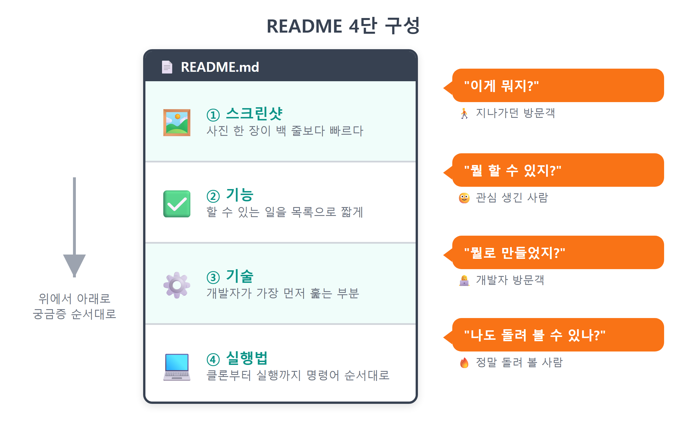
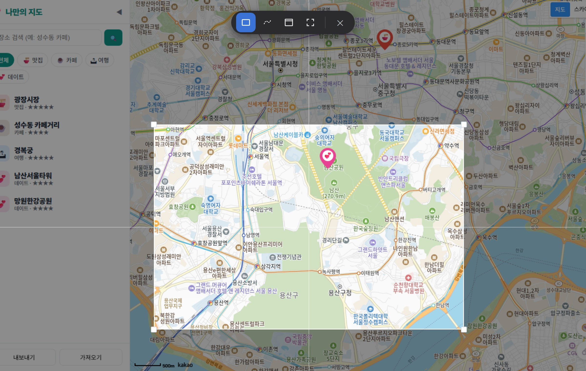
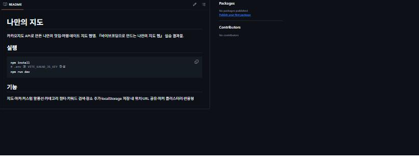
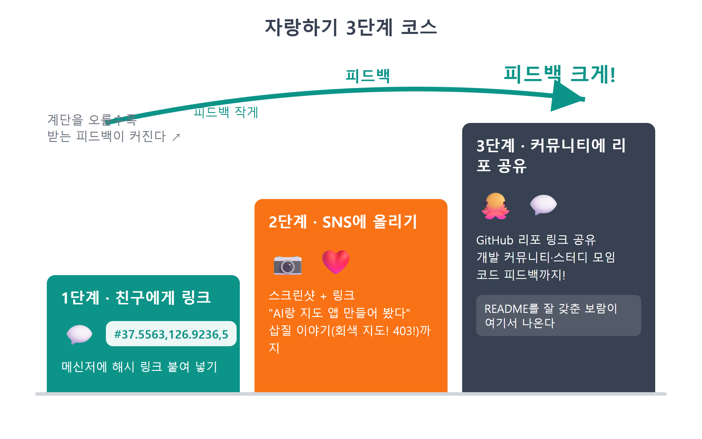
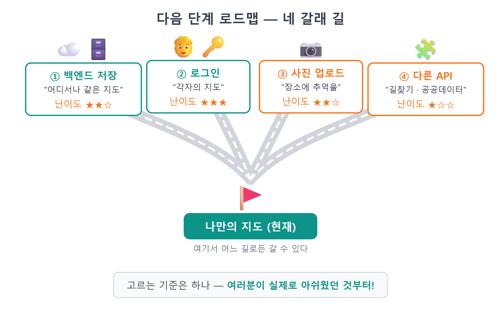
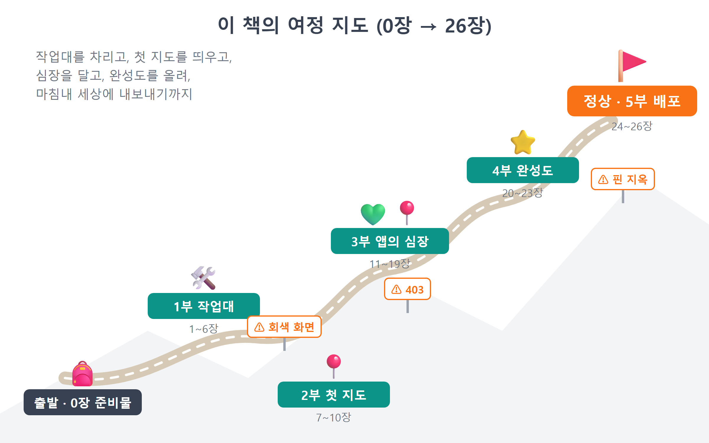

# 26장 README 작성과 공개

!!! note "이 장에서 배우는 것"
    - 리포지토리의 얼굴인 README가 왜 중요한지, 어떤 구조로 쓰는지 배웁니다
    - ++win+shift+s++ 캡처 도구로 앱의 대표 스크린샷을 찍고 리포에 넣습니다
    - Claude Code에게 시켜 스크린샷·기능·기술·실행법이 담긴 README를 완성합니다
    - 배포된 지도를 친구와 SNS에 자랑하는 요령을 익힙니다
    - 백엔드 저장·로그인·사진 업로드·다른 API로 이어지는 다음 단계 로드맵을 그립니다
    - 0장부터 여기까지 다룬 내용을 정리하며 책을 마무리합니다

---

축하합니다. 여러분의 지도가 이제 인터넷에 올라왔습니다. 제25장에서 GitHub Pages 배포가 완료된 시점부터, 여러분은 "코딩을 배워 보고 싶은 사람"에서 "웹 앱을 만들어 배포한 사람"이 되었습니다. 주소창에 `https://여러분의아이디.github.io/my-map/`을 입력하면 지구 반대편에서도 여러분의 지도를 확인할 수 있으며, 스마트폰이나 친구의 노트북에서도 자유롭게 열어 볼 수 있습니다.

다만 한 가지가 빠져 있습니다. 다른 사람에게 리포지토리 링크를 보내면, 상대방에게는 `main.js`, `store.js`와 같은 파일 목록만 보일 뿐입니다. 이 코드가 지도 앱이라는 점과 실행 방법에 대한 설명이 전혀 적혀 있지 않기 때문입니다. 이번 장에서는 그 설명을 README에 담는 방법을 알아보고, 완성된 지도를 공유하는 방법과 앞으로 나아갈 다음 단계도 함께 살펴보겠습니다. 마지막으로 제0장부터 다룬 내용을 정리하며 실습을 마무리하겠습니다.

## 26.1 README: 리포지토리의 첫 화면

README는 이름 그대로 "나를 먼저 읽어 주세요"라는 의미입니다. 리포지토리 최상위에 `README.md`이라는 이름으로 파일을 위치시키면, GitHub가 리포지토리 첫 화면에 이 파일을 렌더링하여 보여 줍니다. 방문자들은 보통 코드를 열어 보기 전에 이 문서를 먼저 확인합니다. 확장자 `.md`는 마크다운(Markdown)[^1] 형식을 나타냅니다. 이 책의 원고와 Claude Code와 주고받는 대화 내용에서도, 제목을 `#`으로 작성하고 목록을 `-`로 만드는 등 마크다운 문법을 공통으로 사용하고 있습니다.

좋은 README에 정해진 정답은 없습니다. 다만 개인 프로젝트의 경우, 전 세계 개발자들이 암묵적으로 동의한 4단 구성을 따르는 것이 효율적입니다. 읽는 사람이 궁금해할 내용을 순서대로 위에서부터 배치하는 방식입니다.

1. 스크린샷: 이 앱이 무엇인지 화면으로 보여 줍니다. 글로 설명하는 것보다 화면을 보여 주는 편이 빠릅니다. 제목 바로 아래에 둡니다.
2. 기능: "뭘 할 수 있지?"에 답합니다. 목록으로 짧게 씁니다. 우리 앱은 자랑할 기능이 열 개도 넘습니다.
3. 기술: "뭘로 만들었지?"에 답합니다. 개발자 방문객이 가장 먼저 훑어보는 부분이고, 나중에는 여러분의 포트폴리오 구실도 합니다.
4. 실행법: "나도 돌려 볼 수 있나?"에 답합니다. 클론부터 실행까지 명령어를 순서대로 적습니다. 우리 앱은 카카오 키가 필요하니 `.env` 안내를 꼭 넣어야 합니다.

{ width="760" }
/// caption
그림 26.1 — README 4단 구성
///

이렇게 구성하면 독자가 어느 위치에서 읽기를 중단하더라도 불편함이 없습니다. 간단히 살펴보는 사람은 스크린샷만 확인하고 지나갈 수 있으며, 관심이 생긴 사람은 기능 설명까지 자세히 읽을 수 있습니다. 또 개발자는 기술 사항을 확인하고, 직접 실행해 보고 싶은 사람만 실행 방법까지 찾아보게 됩니다. 모든 독자의 필요를 만족시키는 문서는 이처럼 단계별로 내용을 구성하는 것입니다.

!!! tip "팁"
README는 타인을 위해 작성하는 동시에, 6개월 후의 자신을 위해서도 작성하는 문서입니다. 시간이 지나면 본인이 직접 만든 앱의 실행 방법조차 잊어버리기 쉽기 때문입니다. "미래의 내가 아무것도 기억 못 한다"라고 가정하고 내용을 작성하면, 적절한 수준으로 친절하게 설명된 문서를 완성할 수 있습니다.

## 26.2 대표 스크린샷 찍기: ++win+shift+s++

README의 첫인상은 스크린샷이 좌우하므로, 본문 내용보다 먼저 화면 캡처 이미지를 준비하시기 바랍니다. 윈도우 운영체제에서는 별도의 캡처 프로그램을 설치할 필요 없이, Win+Shift+S 단축키 하나로 화면 캡처가 가능합니다. 해당 키를 누르면 화면이 어두워지며 상단에 캡처 도구 모음이 나타나고, 마우스로 원하는 영역을 드래그하면 해당 부분이 클립보드에 복사됩니다. 캡처 직후 화면 구석에 표시되는 알림을 클릭하면 편집 창이 열리며, 여기서 이미지를 자르거나 표시한 뒤 PNG 파일로 저장할 수 있습니다.

스크린샷을 촬영하기 전에, 보여 줄 화면을 정돈하는 과정이 중요합니다. 마치 인물 촬영 시 가장 멋진 각도를 찾는 것과 같습니다.

- `https://여러분의아이디.github.io/my-map/`으로 배포된 사이트를 엽니다. localhost보다 주소창이 그럴듯해 보일 겁니다.
- 지도를 여러분의 장소가 가장 몰려 있는 동네로 옮기고, 마커·말풍선·사이드바가 한 화면에 어우러지게 확대 레벨을 조절합니다. 말풍선을 하나 열어 두면 화면이 훨씬 생동감 있어 보일 겁니다.
- 개발자도구(++f12++)는 닫습니다. 브라우저 창을 적당히 키우고, 관계없는 탭이나 북마크바가 지저분하면 앱 영역만 드래그해서 담습니다.

{ width="860" }
/// caption
그림 26.2 — Win+Shift+S 캡처 도구로 앱 화면 캡처
///

이미지 파일의 저장 위치도 미리 정해 두는 것이 좋습니다. 프로젝트 폴더 내에 `docs` 폴더를 별도로 생성하고, 이미지 파일을 `screenshot.png` 형식으로 저장하는 것을 권장합니다. `src`는 앱 코드가 위치한 공간이므로, 문서용 이미지는 별도의 폴더에 관리하는 것이 효율적입니다. 이렇게 리포지토리 내부에 이미지를 저장하면 README에서 ``와 같은 한 줄 구문으로 쉽게 불러올 수 있으며, 리포지토리를 복제한 어느 환경에서나 이미지가 정상적으로 함께 표시됩니다.

!!! warning "주의"
공개된 리포지토리에 올린 스크린샷은 누구나 열람할 수 있으므로, 캡처 전에 개인 정보가 포함되지 않았는지 반드시 확인하시기 바랍니다. 특히 지도의 말풍선이나 메모에 집 주소, 실명, 전화번호와 같은 개인 정보가 노출되지 않도록 주의해야 하며, 상세 정보 패널의 메모가 열려 있는 경우 더욱 세심한 확인이 필요합니다. 우리가 만드는 지도는 개인이 아는 장소를 저장하는 특성상, 부주의하게 촬영한 이미지에 사생활 정보가 함께 포함될 수 있기 때문입니다. 제24장에서 설명한 내용을 다시 한번 강조하자면, `.env`의 키 값은 스크린샷으로도 유출될 수 있으므로, 설정 화면을 촬영할 경우 `.env` 탭이 열려 있지 않은지 반드시 확인하시기 바랍니다.

## 26.3 README 작성: Claude Code에게 시키기

README에 포함할 내용을 정했다면, 이제 직접 작성해 보겠습니다. 이번에도 Claude Code에게 작성을 요청할 수 있습니다. Claude Code는 프로젝트 폴더에 있는 전체 코드를 직접 확인할 수 있으므로, 기능 목록이나 사용된 기술 스택을 일일이 알려줄 필요가 없습니다. 포함할 내용과 작성 순서만 지시하면 됩니다. 이는 제4장에서 배운 프롬프트의 네 가지 요소 중, 특히 출력 형식을 상세하게 명시한 요청 방식입니다.

!!! tip "이렇게 물어보세요"
    > 프로젝트 루트에 README.md를 한국어로 만들어줘. 구조는 ①제목과 한 줄 소개와 배포 주소 https://여러분의아이디.github.io/my-map/, ②docs/screenshot.png 스크린샷, ③주요 기능 목록, ④기술 스택, ⑤로컬 실행법 순서로. 실행법은 클론, npm install, .env에 VITE_KAKAO_JS_KEY 설정, npm run dev 순서로 적어줘. 기능과 기술은 src 코드를 직접 읽고 정리해줘. 카카오 JS 키 발급과 플랫폼 도메인 등록이 필요하다는 안내도 실행법에 넣어줘. 실제 키 값은 절대 쓰지 마.

Claude Code가 `src` 폴더의 내용을 분석한 뒤 README 파일을 생성해 줄 것입니다. 생성된 내용 중 핵심 부분을 함께 살펴보겠습니다.

````markdown
# 🗺️ 나만의 지도

카카오지도 위에 내 맛집·카페·여행지를 모으는 나만의 장소 지도입니다.
**바이브코딩**(AI에게 시켜서 만들기)으로 만들었습니다.

👉 **바로 써 보기: https://여러분의아이디.github.io/my-map/**


## 주요 기능

- 🗺️ 카카오지도 위에 카테고리별 커스텀 마커(🍜맛집/☕카페/🏝여행/💕데이트)
- 💬 마커 클릭 시 커스텀 오버레이 말풍선
- 🔍 키워드 장소 검색 → 내 지도에 바로 추가
- ➕ 지도 클릭으로 장소 추가, ⭐ 별점·메모 편집, 삭제
- 💾 localStorage 자동 저장 + JSON 내보내기/가져오기
- 🧭 내 위치 표시, 🔗 URL 해시로 현재 화면 공유
- 🔢 마커 클러스터러(장소가 많아도 깔끔), 📱 모바일 반응형

## 기술 스택

- Vanilla JavaScript (프레임워크 없음) + Vite
- Kakao Maps JavaScript SDK (services, clusterer)
- localStorage / GitHub Pages + GitHub Actions 배포

## 로컬에서 실행하기

```bash
git clone https://github.com/여러분의아이디/my-map.git
cd my-map
npm install
```

1. [카카오 개발자 콘솔](https://developers.kakao.com)에서 앱을 만들고
   **JavaScript 키**를 발급받습니다.
2. 앱 설정 → 플랫폼 → Web에 `http://localhost:5173`을 등록합니다.
3. 프로젝트 루트에 `.env` 파일을 만들고 키를 넣습니다.

```
VITE_KAKAO_JS_KEY=여러분의_JS_키
```

4. 개발 서버를 켭니다.

```bash
npm run dev
```
````

제26.1절에서 설명한 4단 구성이 그대로 적용된 것을 확인할 수 있습니다. 주요 내용을 몇 가지 짚어보면 다음과 같습니다. 제목 바로 아래에 배포 주소를 굵은 글씨로 표시하여, 방문자가 설치 과정 없이 바로 서비스를 이용해 볼 수 있도록 하였습니다. `` 줄은 제26.2절에서 촬영한 스크린샷을 불러오는 마크다운 이미지 표기 방식으로, 대괄호 안에는 이미지가 표시되지 않을 경우 보여 줄 대체 텍스트를 기입합니다. 실행 방법 부분에는 제7장부터 제8장까지 진행한 설정 단계를 순서대로 적었습니다. 카카오 API 키 발급, 플랫폼 등록, 그리고 `.env` 작성까지 그 내용이 포함되어 있습니다. 이 세 가지 설명이 빠진 README는, 코드를 내려받은 사람이 제9장에서 경험했던 것과 동일한 회색 화면 문제를 겪게 될 것을 의미합니다. 따라서 본인이 거친 설정 단계는 다음 사용자를 위해 빠짐없이 상세하게 기입해야 합니다.

내용 확인이 끝났으면, 제24장에서 학습한 방법대로 파일을 저장한 뒤 원격 리포지토리에 푸시합니다. 스크린샷 이미지 파일도 함께 업로드하는 것을 잊지 마세요.

!!! tip "이렇게 물어보세요"
    > README.md와 docs/screenshot.png를 커밋하고 푸시해줘. 커밋 메시지는 "docs: README 추가 (스크린샷·기능·기술·실행법)"로.

푸시 작업이 완료되면 웹 브라우저에서 리포지토리 페이지를 새로고침해 보시기 바랍니다. 파일 목록 아래에 스크린샷과 기능 설명이 정상적으로 표시될 것입니다.

{ width="620" }
/// caption
그림 26.3 — GitHub 리포지토리 첫 화면에 표시된 README
///

!!! tip "팁"
리포지토리 페이지 오른쪽 상단에 위치한 About(설정 아이콘) 메뉴에도 프로젝트에 대한 간략한 설명과 배포 URL을 등록해 두시기 바랍니다. 리포지토리 목록이나 검색 결과를 접하는 사람들은 README 내용보다 About 정보를 먼저 확인하기 때문입니다. Website 입력 칸에 GitHub Pages 주소를 기입하면, 리포지토리 첫 화면에 클릭 가능한 링크가 자동으로 생성됩니다.

## 26.4 만든 앱 공유하기

배포 주소를 확보하고 README까지 완성했다면, 이제 직접 만든 서비스를 널리 알려 보시기 바랍니다. 이 과정을 건너뛰지 않기를 바랍니다. 진심으로 권장하는 사항입니다. 작업한 내용을 다른 사람에게 공유하면 두 가지 큰 도움을 얻을 수 있습니다. 첫째는 지속적인 개발을 이어갈 힘을 얻는 것입니다. "직접 만들었어?"라는 간단한 반응 하나가 다음 프로젝트를 시작하는 원동력이 됩니다. 둘째는 소중한 피드백을 받을 수 있다는 점입니다. 서비스를 이용하는 사람들은 개발자가 미처 생각하지 못한 다양한 방식으로 기능을 활용하기도 합니다. 친구가 가볍게 한 "사진은 못 넣어?"마디가, 차기 버전의 핵심 기획으로 이어질 수도 있습니다.

작업한 내용을 공유하는 방법을 난이도별로 제안해 드립니다.

- 1단계, 가족이나 친구에게 링크 보내기. 메신저에 배포 주소를 붙여 넣으면 됩니다. 여기서 21장의 URL 공유 기능을 씁니다. 기본 주소 대신 `#37.5563,126.9236,5`처럼 특정 위치가 보이는 링크를 만들어 보내 보세요. 받는 사람도 열자마자 같은 위치를 볼 수 있습니다.
- 2단계, SNS에 올리기. 26.2절에서 찍은 스크린샷에 링크를 함께 올려 보세요. 만드는 과정에서 겪은 문제(회색 지도, 403 오류)와 해결 방법을 함께 적으면 같은 문제를 겪는 사람에게 도움이 될 수 있습니다.
- 3단계, 개발 커뮤니티에 공유하기. GitHub 리포 링크와 함께 개발 커뮤니티나 스터디 모임에 올리면 코드 피드백까지 받을 수 있습니다. README를 잘 갖춰 놓은 보람을 여기서 느낄 수 있습니다.

{ width="760" }
/// caption
그림 26.4 — 공유하기 3단계 과정
///

한 가지 반드시 알아두어야 할 사항이 있습니다. 공유받은 사람의 지도에는 여러분이 저장해 둔 장소 정보가 표시되지 않습니다. 이는 제17장에서 설명한 바와 같이, 장소 데이터가 각 사용자의 브라우저 localStorage에 저장되기 때문입니다. 따라서 공유받은 사람에게는 기본 장소 정보만 표시된 지도가 보이게 됩니다. 저장해 둔 장소 정보를 함께 보여 주고 싶다면, 제17장에서 설명한 내보내기 기능으로 파일을 생성한 뒤 전달하고, 가져오기 기능으로 불러오도록 안내하면 됩니다. 다음 절에서 향후 발전 방향을 제시하는 것도 바로 이 같은 제약 사항 때문입니다.

## 26.5 다음 단계 로드맵

이 책에서 함께 만든 지도 앱은 하나의 완성된 예시이지만, 여러분은 이를 기반으로 더욱 발전된 형태의 서비스를 만들어 나갈 수 있습니다. 현재 앱의 기능적 한계를 정확히 파악하면, 앞으로 학습해야 할 내용이 자연스럽게 명확해질 것입니다. 발전 방향을 난이도 순으로 네 가지로 제안해 드립니다. 각 방향이 별도의 교재 한 권 분량에 해당하는 내용이므로, 여기서는 각 분야의 입구만 소개하는 수준으로 정리했습니다. 그럼에도 나아갈 방향을 아는 것과 모르는 것은 큰 차이가 있습니다.

첫 번째는 백엔드 시스템을 적용하는 방향입니다. 장소 데이터를 브라우저 외부의 서버로 옮기는 과정에 해당합니다. 현재는 localStorage에 데이터를 저장하므로, 다른 브라우저나 기기에서는 접속할 때마다 저장된 내용이 사라지고 초기화됩니다. 데이터를 서버의 데이터베이스에 저장하면, 어떤 기기에서 접속하더라도 동일한 내용의 지도를 확인할 수 있습니다. Firebase나 Supabase와 같은 서비스형 백엔드(BaaS)[^2]를 활용하면, 서버를 직접 구축하고 운영하지 않아도 관련 기능을 쉽게 적용할 수 있습니다. 우리가 `store.js`를 제작할 때 데이터 저장 관련 기능을 `save()` 한 곳에 일관되게 모아서 작성한 바 있으므로, 이제 그 장점을 활용할 수 있습니다. 데이터 저장 방식을 변경할 때 해당 부분 한 곳만 수정하면 되기 때문입니다.

두 번째는 사용자 로그인 기능을 추가하는 방향입니다. 여러 사용자가 각자만의 지도를 독립적으로 관리할 수 있도록 하는 과정입니다. 백엔드 환경이 구축되면 자연스럽게 "누구의 데이터인가"라는 인증 관련 과제가 발생하게 됩니다. 카카오 로그인과 같은 소셜 로그인 기능을 연동하면, 사용자별로 고유한 지도 공간을 제공할 수 있으며, 나아가 "커플이 함께 쓰는 데이트 지도", "친구들과 공동 편집하는 맛집 지도"와 같은 실제 서비스 수준의 기능으로 발전시켜 나갈 수 있습니다.

세 번째는 사진 업로드 기능을 추가하는 방향입니다. 별점과 메모 기능에 더해 장소 관련 사진을 함께 저장하면, 지도 위 말풍선에서 보여 줄 수 있는 정보의 폭이 크게 넓어집니다. 파일 업로드 방식, 이미지 파일의 저장 공간 관리, 데이터 용량 제한과 보안 처리 등을 함께 고려하며 학습할 수 있는 내용이 풍부합니다.

네 번째는 외부 API를 연동하는 방향입니다. 지도 위에 다양한 공공 정보와 외부 데이터를 표시하는 기능을 추가하는 것입니다. 카카오지도 SDK에도 아직 활용하지 않은 길찾기 연동, 로드뷰, 도형 그리기 등의 유용한 기능이 다수 포함되어 있습니다. 또한 공공데이터포털에는 무료로 활용할 수 있는 API가 수천 가지에 이릅니다. 우리 동네 무인 도서 반납함, 전기차 충전소, 미세먼지 측정소 위치 등 표시할 수 있는 정보는 무궁무진합니다. 제7장에서 API 키 발급 절차를, 제15장에서 API 호출 방식과 콜백 함수를 다룬 바 있으므로, 어떤 형식의 API 문서를 접하더라도 익숙하게 대응할 수 있을 것입니다.

{ width="760" }
/// caption
그림 26.5 — 다음 단계 발전 방향 네 가지 갈래
///

어느 분야부터 학습할지는 서비스를 이용하며 실제로 불편했던 점을 기준으로 선택하는 것이 효율적입니다. 친구에게 장소 정보를 공유할 수 없었던 점이 아쉬웠다면 백엔드와 로그인 기능부터, 지도 위 말풍선의 내용이 단조롭게 느껴졌다면 사진 업로드 기능부터 추가해 보시기 바랍니다. 실제 필요에 따라 학습한 내용이 가장 오래 기억에 남고 활용도도 높기 때문입니다. 어떤 방향을 선택하더라도 작업 진행 방식은 이 책에서 학습한 것과 동일합니다. 기능을 작은 단위로 구현하고, 정상 작동하는지 확인한 뒤, 변경 내용을 커밋하고, 예기치 않은 문제가 발생하면 오류 메시지를 그대로 AI에게 전달하여 해결하는 방식을 따르시면 됩니다.

!!! tip "팁"
새로운 기능 개발을 시작할 때는 첫 프롬프트에서 전체적인 개발 계획을 먼저 요청하는 습관을 들이시기 바랍니다. "이 앱에 Supabase로 백엔드 저장을 붙이고 싶어. 코드를 고치기 전에, 어떤 파일을 어떻게 바꿔야 할지 단계별 계획만 먼저 보여줘."와 같이 요청하면 됩니다. 변경 범위가 크고 복잡한 작업일수록, 실제 코드 작성에 착수하기 전에 전체 계획을 검토하고 승인하는 단계를 거치는 것이 안정적인 개발에 도움이 됩니다.

## 26.6 지금까지 한 일 정리

마지막으로, 이 책 전체에서 함께 학습한 내용을 정리해 보겠습니다. 제0장에서 이 책은 "코드를 직접 입력하지 않고 AI에게 요청하여 원하는 서비스를 제작한다"는 학습 방향을 제시했습니다. 이 방식을 바탕으로 우리는 어떤 내용을 순서대로 학습하고 구현했는지 되짚어 보겠습니다.

제1부(제1장~제6장)에서는 서비스 개발을 위한 환경을 구축했습니다. Node.js, Git, Claude Code, GitHub, Orca를 차례로 설치하고 기본 설정을 완료했습니다. 제2부(제7장~제10장)에서는 카카오 API 키를 발급받고 Vite 프로젝트 환경을 구성한 뒤, 지도를 웹 화면에 표시하는 작업을 진행했으며, 회색 화면 표시 오류와 403 접근 오류에 대한 대응 방법도 함께 학습했습니다. 제3부(제11장~제19장)에서는 이 책에서 가장 긴 학습 과정을 거쳤습니다. 지도 마커, 데이터 구조 설계, 말풍선 디자인, 장소 필터, 검색 기능, 장소 추가, 데이터 저장, 목록 표시, 상세 정보 표시 기능을 단계별로 구현하며, 데이터 상태와 화면을 연결하는 기본적인 서비스 구조를 완성했습니다. 제4부(제20장~제23장)에서는 현재 위치 표시, URL을 통한 정보 공유, 마커 클러스터링, 모바일 환경 대응 기능을 추가했으며, 제5부(제24장~제26장)에서 서비스를 인터넷에 공개하는 배포 작업을 완료했습니다.

{ width="760" }
/// caption
그림 26.6 — 이 책의 전체 학습 구성 (제0장~제26장)
///

이 과정에서 우리는 단순히 지도 앱 하나를 제작한 것이 아닙니다. 서비스 개발에 필요한 세 가지 핵심 역량을 반복해서 연습하며 익혔습니다.

첫째, 작은 단위로 요청하는 능력입니다. 제1장에서 정한 기본 원칙을 실제 작업에 적용했습니다. 한 번에 전체 시스템을 만들어 달라고 "지도 앱 만들어줘"와 같이 요청한 적은 단 한 번도 없습니다. "SDK 주소에 clusterer를 추가해줘, 다른 부분은 건드리지 마"와 같이 작업의 맥락과 목표, 제약 조건을 명확히 제시하고 작은 단위로 나눈 요청을 수십 차례 이어갔습니다. 부록 A에 정리해 둔 이 책의 프롬프트 예시를 살펴보면, 요청을 효과적으로 작성하는 방식을 쉽게 파악할 수 있을 것입니다. 이 요청 방식은 어떤 종류의 AI 도구를 사용하더라도 그대로 활용할 수 있는 범용적인 기술입니다.

둘째, 결과를 읽고 판단하는 능력입니다. 전체 코드를 통째로 외우지는 않더라도, AI가 제시한 코드의 의미를 매번 함께 분석하고 확인했습니다. `autoload=false`가 왜 필요한지, `subscribe`가 화면 내용을 자동으로 갱신하는 원리가 무엇인지, `escapeHtml`가 어떤 문제를 예방하는지 파악했습니다. 제1장에서 설명한 "이해하려 노력하되 외우지 않는다"라는 기본 방침 덕분에, AI가 잘못된 코드를 제시하더라도 그 오류를 정확히 인지하고 수정할 수 있었습니다. AI와 함께 개발하는 바이브코딩 환경에서 사람의 역할은 직접 타이핑하는 것이 아니라, 제시된 내용을 검토하고 판단하는 것입니다.

되돌리기. git은 3장에서 되돌리기 도구로 소개했습니다. 책 전체에서 그 역할을 했습니다. 커밋이 있었기 때문에 결과를 모르는 수정도 시도해 볼 수 있었습니다. 결과가 좋지 않으면 되돌리면 됩니다. 되돌릴 수 있는 환경에서는 더 많이 시도하고, 시도한 만큼 빨리 익힐 수 있습니다.

이 세 가지 핵심 역량을 갖추면, 여러분이 만들고 싶은 서비스를 명확한 말로 정리하여 AI에게 제작을 요청할 수 있게 됩니다. 제시된 결과를 검토하고 판단하며, 만족스럽지 않으면 되돌려 다시 수정하는 과정을 거쳐 원하는 결과물을 완성할 수 있습니다. 이 책과 함께 하는 실습은 여기까지입니다. 이제 다음 프로젝트부터는 빈 폴더에서 직접 개발을 시작할 수 있습니다. 새로운 아이디어가 떠오르면 터미널 창을 열고 다음과 같이 작업을 시작하시면 됩니다. "새 프로젝트를 시작하고 싶어. 계획부터 세워 보자."

즐겁게 만드세요. 그리고 만든 것을 꼭 자랑하세요.

---

## 26.7 마무리

!!! abstract "이 장의 핵심"
    - README는 리포지토리 첫 화면에 자동 렌더링되는 프로젝트의 얼굴로, 스크린샷 → 기능 → 기술 → 실행법의 4단 구성이 기본입니다
    - 윈도우 캡처는 ++win+shift+s++ 하나면 충분하며, 스크린샷은 `docs/` 폴더에 넣어 ``로 README에 싣습니다
    - 실행법에는 카카오 JS 키 발급·플랫폼 등록·`.env` 작성 등 내가 거친 설정 단계를 빠짐없이 적어야 다음 사람이 회색 화면을 만나지 않습니다
    - 공유 링크를 받은 사람에게는 내 localStorage 장소가 보이지 않습니다. 내보내기/가져오기로 전달하거나, 백엔드 저장을 다음 단계로 삼습니다
    - 다음 단계 로드맵은 백엔드 저장, 로그인, 사진 업로드, 다른 API 네 갈래이며, 실제로 아쉬웠던 것부터 고르면 됩니다
    - 바이브코딩에서 익힐 것은 작게 시키기, 읽고 판단하기, 되돌리기 세 가지이며 도구가 바뀌어도 그대로 쓸 수 있습니다

!!! question "잠깐 생각해 봅시다"
Q1. README에 적힌 실행 방법을 처음 보는 사람이 설명한 내용을 그대로 따라 한다고 가정할 때, 어느 단계에서 이해하기 어렵거나 막힐 것이라고 생각하는가? 그 단계에 어떤 안내 내용을 한 줄 추가하면 좋을지 적어 보세요.

____________________________________________

____________________________________________

Q2. 제26.5절에서 제시한 네 가지 발전 방향인 백엔드 적용, 로그인 기능 추가, 사진 업로드 기능, 외부 API 연동 중에서, 여러분이 가장 먼저 시도해 보고 싶은 분야는 무엇인가? 서비스를 이용하며 실제로 불편하거나 아쉬웠던 점을 근거로 설명해 보세요.

____________________________________________

____________________________________________

!!! example "확인 문제"
    1. ++win+shift+s++ 로 앱의 대표 스크린샷을 찍어 `docs/screenshot.png`로 저장하고, README에서 불러와 GitHub에서 그림이 보이는지 확인해 보세요.
    2. Claude Code에게 시켜 README에 "만들면서 배운 것" 섹션을 추가해 보세요. 이 책에서 가장 기억에 남는 삽질(예: 회색 지도, 403)과 해결 과정을 세 줄로 적는 겁니다.
    3. 21장의 URL 공유 버튼으로 여러분의 아지트가 보이는 링크를 만들어 친구 한 명에게 보내 보세요. 어떤 반응이 오는지, 어떤 기능을 물어보는지 기록해 두세요. 그 기록이 다음 버전의 기획이 될 수도 있습니다.
    4. 리포지토리 About에 한 줄 소개와 배포 URL을 등록하고, 리포 첫 화면에서 링크가 클릭되는지 확인해 보세요.

!!! info "더 찾아보기"
    - `shields.io` — README 상단에 붙이는 배지(빌드 상태, 라이선스 등) 생성 서비스
    - `오픈소스 라이선스 (MIT License)` — 공개 리포에 "이 코드를 이렇게 써도 됩니다"를 밝히는 문서
    - `Firebase / Supabase` — 서버 없이 시작하는 서비스형 백엔드(BaaS). 백엔드 저장과 로그인을 다룰 때 씁니다
    - `공공데이터포털 (data.go.kr)` — 지도에 얹을 수 있는 무료 공공 API 수천 종
    - `GitHub Profile README` — 아이디와 같은 이름의 리포를 만들면 프로필 첫 화면이 되는 특별한 README

> 다음 장으로. 본편은 여기서 끝입니다. 다만 책을 덮기 전에 챙겨 갈 선물이 두 개 더 있습니다. 부록 A에는 이 책의 모든 장에서 썼던 핵심 프롬프트에 더해 버그 잡기·리팩토링·설명 요청·되돌리기 같은 상황별 프롬프트 템플릿을 한데 모았습니다. 다음 프로젝트를 시작할 때 옆에 펴 두고 쓰면 됩니다.

[^1]: 마크다운(Markdown) — `#`, `-`, `**` 같은 간단한 기호로 서식을 표현하는 경량 문서 형식. GitHub, 노션, Claude Code와의 대화까지 개발 생태계 곳곳에서 표준 문서 형식으로 씁니다.
[^2]: BaaS(Backend as a Service) — 데이터베이스, 로그인, 파일 저장 같은 서버 기능을 직접 구축하지 않고 서비스로 빌려 쓰는 방식. 대표적으로 Google의 Firebase, 오픈소스 진영의 Supabase가 있습니다.

