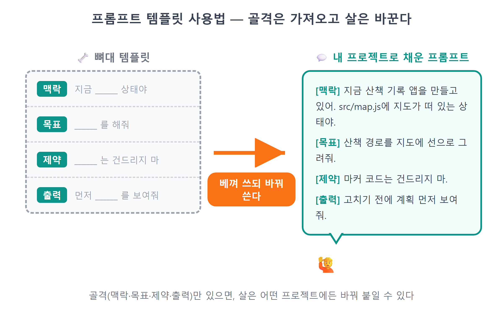
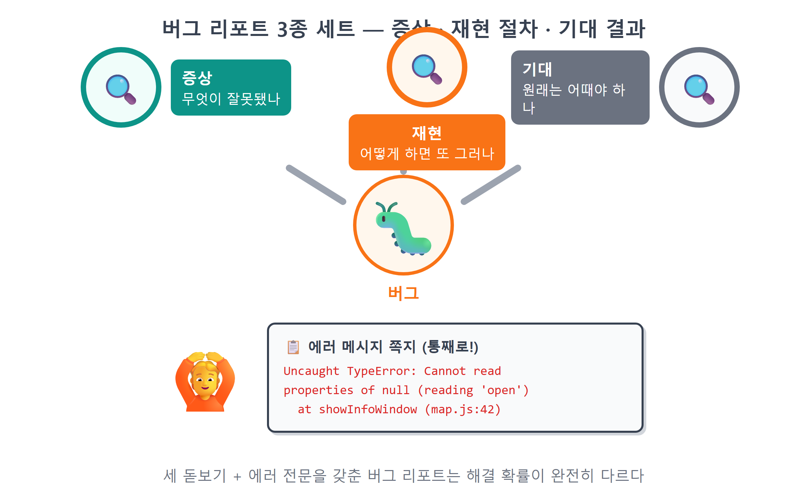

# 부록 A: 프롬프트 템플릿 모음

!!! note "이 장에서 배우는 것"
    - 1~26장의 핵심 프롬프트를 장 순서대로 다시 찾아 쓰는 법
    - 버그 잡기·리팩토링·설명 요청·되돌리기·기능 추가·디자인 수정, 여섯 가지 상황별 템플릿
    - 좋은 프롬프트 4요소(맥락·목표·제약·출력) 최종 체크리스트

---

이 부록은 처음부터 끝까지 읽기보다 필요할 때 펼쳐서 참고하는 내용에 가깝습니다. 본문에서 만나본 "이렇게 시키세요" 박스를 한 곳에 모았으며, 책을 마치고 본인의 프로젝트를 진행할 때 활용할 수 있는 양식 템플릿도 추가하였습니다. 프롬프트는 정해진 규칙이 아니며, 아래 문장을 한 글자도 틀리지 않고 외워야 하는 것은 아닙니다. 대신 각 프롬프트가 무엇을 어떻게 설명하는지 살펴보시기 바랍니다. 어떤 파일을 가리키는지, 어떤 문제점을 미리 알려주는지, 어느 범위까지 진행하라고 제한하는지를 파악하시면 충분합니다. 그 기본 틀만 참고하시면 세부 내용은 본인의 프로젝트에 맞게 자유롭게 수정하여 사용할 수 있습니다.

{ width="760" }
/// caption
그림 A.1 — 프롬프트 템플릿 사용법: 기본 구조는 활용하고 세부 내용은 변경하기
///

## A.1 장별 핵심 프롬프트 모음

각 장의 핵심 프롬프트를 장 순서대로 정리하였으며, 프롬프트 앞에는 사용하는 상황을 한 줄로 표기하였습니다. 이후 유사한 작업을 진행할 때 해당 장을 다시 찾아보지 않고 이곳에서 즉시 확인할 수 있습니다.

### 1부: 바이브코딩 준비운동

1장 · AI에게 코드 설명 요청하기: AI가 작성한 코드의 내용을 이해하기 어려울 때 사용합니다.

> 방금 만든 코드를 프로그래밍을 처음 배우는 사람에게 설명하듯이, 위에서 아래로 실행 순서를 따라가며 설명해줘. 비유를 하나 들어줘.

2장 · 설치 문제 해결: Node.js 설치 후 `node -v`가 정상적으로 작동하지 않을 때 사용합니다. 설치 과정에서는 새로 만들기보다 문제를 해결하는 방법을 중심으로 진행합니다.

> Node.js를 설치했는데 새 터미널에서 node -v가 안 먹혀. 오류 메시지는 이거야: (오류 붙여넣기) PATH 문제인지 확인하고 해결 방법을 단계별로 알려줘.

3장 · 명령어 간단히 요청하기: git 명령어를 외우지 않고 설명으로 요청할 때 사용합니다.

> 지금까지 작업한 걸 "지도 마커 기능 추가"라는 메시지로 커밋해줘.

> 방금 네가 고친 것 때문에 화면이 하얗게 나와. 마지막 커밋 상태로 전부 되돌려줘.

4장 · 첫 대화와 기본 요소 연습: Claude Code와 처음 대화할 때, 그리고 4가지 기본 요소를 익힐 때 사용합니다.

> 안녕! 이 폴더에 hello.txt 파일을 만들고, 그 안에 "바이브코딩 시작!"이라고 써줘.

> 여기는 연습용 폴더야. (맥락) 내가 좋아하는 장소 세 곳의 이름과 한 줄 소개를 담은 places.txt 파일을 만들어줘. (목표) 파일은 하나만 만들고, 내용은 한국어로 써. (제약) 다 만들면 파일 내용을 보여줘. (출력 형식)

5장 · 원격 저장소에 업로드하기: 폴더 전체를 깃허브 저장소로 올릴 때 사용합니다.

> hello-github 라는 연습용 저장소를 만들고 싶어. 이 폴더에 나를 소개하는 README.md를 한국어로 짧게 만들고, git 저장소로 초기화해서 첫 커밋을 한 다음, gh로 내 깃허브에 public 리포로 올려 줘.

6장 · 작업 단위 할당하기: Orca 워크트리의 터미널에서 작업 단위를 에이전트에게 요청할 때 사용합니다.

> 이 폴더는 카카오지도 웹앱 프로젝트야. 지도에 마커를 찍는 기능을 만들어 줘. 기존 코드 스타일을 따르고, 다 만들면 바꾼 파일 목록을 정리해 줘.

7장 · 카카오 개발자 콘솔 설정: 이 장은 브라우저에서 직접 설정하는 내용입니다. 별도의 제작용 프롬프트가 있지는 않으며, 설정에 문제가 생겼을 때 아래와 같이 요청하시기 바랍니다.

> 카카오 개발자 콘솔에서 Web 플랫폼에 http://localhost:5173 을 등록했는데도 지도가 403으로 막혀. 콘솔에서 확인해야 할 화면과 순서를 알려줘. 키는 절대 보여주지 않을게.

### 2부: 카카오 지도 첫걸음

8장 · 프로젝트 기본 구조 생성: Vite 기반 프로젝트를 새로 시작할 때 사용합니다.

> Vite로 새 프로젝트를 만들어줘. 프로젝트 이름은 my-map, 템플릿은 vanilla(순수 자바스크립트)로. 만든 다음 의존성 설치까지 해줘.

8장 · API 키 보호: API 키를 코드에서 분리하고 깃허브에 공개되지 않도록 관리할 때 사용합니다. 키 값 자체는 AI에게도 알리지 않아야 합니다.

> 프로젝트 루트에 .env 파일을 만들고 VITE_KAKAO_JS_KEY라는 이름으로 카카오 JavaScript 키를 넣을 자리를 만들어줘. 실제 키값은 내가 직접 붙여 넣을게. 그리고 .env가 절대 git에 올라가지 않게 .gitignore도 확인해줘.

9장 · 동적 스크립트 로더: 지도 관련 라이브러리를 동적으로 불러오는 모듈을 제작할 때 사용합니다.

> 카카오지도 JS SDK를 동적으로 불러오는 모듈을 src/loader.js로 만들어줘. 키는 .env의 VITE_KAKAO_JS_KEY에서 읽고, autoload=false로 받아서 kakao.maps.load()가 끝나면 resolve되는 Promise를 반환해줘. 키가 없거나 로드에 실패하면 이유를 알 수 있는 에러로 reject해줘.

9장 · 지도가 정상적으로 표시되지 않을 때: 회색 화면이 나타나거나 401·403과 같은 오류가 발생했을 때 사용합니다. 오류 내용을 그대로 포함하여 요청해야 AI가 정확한 원인을 파악할 수 있습니다.

> 지도가 안 떠. 브라우저 콘솔에 이런 에러가 나와. 원인을 찾아서 고쳐줘. 카카오 콘솔 설정 문제라면 뭘 확인해야 하는지 알려줘. 에러 내용은 이거야: 콘솔의 빨간 에러 메시지를 그대로 붙여 넣습니다

10장 · 지도 기본 기능 추가: 지도에 기본적인 조작 도구를 추가하고 클릭한 위치의 좌표를 가져오고자 할 때 사용합니다.

> 지도 오른쪽 위에 일반지도/스카이뷰 전환 버튼을, 오른쪽에 확대·축소 버튼을 달아줘. 카카오 SDK가 기본 제공하는 컨트롤을 사용해.

> 지도를 클릭하면 클릭한 지점의 위도·경도를 콘솔에 출력해줘. 나중에 이 좌표로 장소를 추가할 거라 좌표를 정확히 얻는 게 목적이야.

### 3부: 나만의 장소 지도 만들기

11장 · 맞춤형 마커 제작: 별도의 이미지 파일 없이 SVG 형식으로 종류별 아이콘을 제작할 때 사용합니다.

> 이미지 파일 없이 SVG로 마커 핀을 그리고 싶어. 색과 이모지를 인자로 받아서, 그 색의 핀 안에 흰 원과 이모지가 들어간 MarkerImage를 돌려주는 함수 markerImageFor를 만들어줘. SVG는 data URI로 변환해서 써줘. 핀 끝이 좌표에 정확히 닿게 offset도 맞춰줘.

12장 · 데이터 구조 설계: 데이터와 화면 표시 내용을 분리하고 데이터 형식을 정의할 때 사용합니다.

> src/defaultPlaces.js 파일을 만들어줘. 처음 실행할 때 보여줄 예시 장소 5개를 배열로 export 해줘. 각 장소는 id, name, category, lat, lng, rating, memo 속성을 가진 객체야. category는 food/cafe/travel/date 중 하나로 하고, 서울의 유명한 장소들로 채워줘. 좌표는 실제 위치와 맞게.

13장 · 정보 표시창 제작: 기본 제공되는 창 대신 직접 디자인한 정보 표시창을 제작할 때 사용합니다.

> InfoWindow 대신 CustomOverlay로 말풍선을 바꾸고 싶어. mapView.js에 말풍선 HTML을 만드는 함수를 추가해줘. 말풍선에는 카테고리 이모지 + 장소 이름, 별점(★☆ 5개), 오른쪽 위 × 닫기 버튼을 넣어줘. 스타일은 style.css에 .bubble 클래스로: 흰 배경, 둥근 모서리, 그림자, 아래쪽 가운데에 꼬리 삼각형. 장소 이름은 나중에 사용자가 입력할 수도 있으니 HTML 이스케이프 처리해줘.

14장 · 분류 기능 구현: 분류 선택 상태를 관리하고 버튼으로 전환하는 기능을 제작할 때 사용합니다.

> src/sidebar.js 모듈을 새로 만들어줘. currentFilter 변수로 현재 선택된 카테고리를 기억하고(초기값 'all'), filteredPlaces() 함수는 전체 장소 배열에서 currentFilter에 해당하는 장소만 골라 돌려줘. 'all'이면 거르지 말고 전부 돌려줘. 그리고 initSidebar() 함수에서 .filter-btn들에 클릭 이벤트를 달아서, 누른 버튼의 data-category를 currentFilter에 넣고, active 클래스를 누른 버튼으로 옮기고, 마지막에 화면을 다시 그리는 콜백을 호출해줘.

15장 · 검색 기능 구현: 검색 기능 전체를 요청할 때 사용합니다. "x가 경도, y가 위도"과 같이 알려진 문제점을 함께 명시하면 더욱 효과적입니다.

> src/search.js를 새로 만들어줘. initSearch 함수를 export하고, 그 안에서 kakao.maps.services.Places로 키워드 검색을 구현해줘. 🔍 버튼 클릭이나 Enter 키로 검색을 실행하고, Status.OK가 아니면 toast로 "검색 결과가 없습니다."를 띄우고 목록을 숨겨줘. 성공하면 상위 7개만 #search-results에 이름+주소로 렌더링하고, 항목을 클릭하면 지도를 레벨 3으로 확대해서 그 좌표로 panTo 해줘. x가 경도, y가 위도인 것과 문자열이라는 점을 주의해줘. 만든 initSearch는 main.js에서 호출해줘.

16장 · 입력 양식 공유: 검색과 상세 정보 입력에서 공통으로 사용하는 양식을 제작할 때 사용합니다.

> src/search.js에 openAddDialog 함수를 만들어서 export 해줘. { name, lat, lng }를 받아서 화면 가운데에 장소 추가 다이얼로그를 띄우는 함수야. 이름 입력칸(name이 있으면 미리 채움), 카테고리 select, 메모 textarea, 취소/추가 버튼을 넣어줘. 이 함수는 검색 결과 추가와 지도 클릭 추가 두 곳에서 공용으로 쓸 거야. 다이얼로그는 한 번에 하나만 열리게 하고, 반투명 배경으로 지도를 덮어줘.

17장 · 로컬 저장소 활용: 페이지를 새로고침해도 데이터가 유지되도록 구현할 때 사용합니다. 키 이름·저장 함수·예외 처리 구조, 이 세 가지 핵심 원칙을 기준으로 구현하도록 요청합니다.

> src/store.js에 localStorage 영속화를 추가해줘. 키 이름은 'my-map-places-v1'로 하고, 시작할 때 저장된 데이터가 있으면 JSON.parse로 불러오고 없거나 깨져 있으면 기본 데이터로 시작해줘. 저장하는 코드는 save() 함수 딱 한 곳에만 두고, add·update·remove처럼 데이터를 바꾸는 모든 메서드 끝에서 save()를 부르게 해줘. localStorage는 사생활 모드 같은 데서 실패할 수 있으니 읽기와 쓰기 모두 try-catch로 감싸고, 실패해도 앱이 죽지 않게 해줘.

18장 · 데이터 변경 반영: 데이터가 변경될 때 화면 내용이 자동으로 갱신되도록 구현할 때 사용합니다.

> store에 subscribe로 화면 갱신 함수들을 등록해서, 장소 데이터가 바뀌면 지도와 사이드바 목록이 자동으로 다시 그려지게 해줘. 지도 갱신(rerender)은 main.js에서, 목록 갱신(renderList)은 sidebar.js의 initSidebar 안에서 구독해줘.

19장 · 상세 정보 화면 제작: 평점·메모·삭제 기능을 하나의 단위로 제작할 때 사용합니다. 입력 내용을 안전하게 처리하는 부분도 함께 요청합니다.

> src/detail.js를 새로 만들어줘. openDetail(id)과 closeDetail을 export하고, openDetail은 store.get(id)으로 장소를 찾아 #detail-panel 안에 머리글, 별 버튼 5개, 메모 textarea, 저장/삭제 버튼을 그려줘. 별을 누르면 store.update로 rating을 바꾸고, 삭제는 confirm으로 물어본 뒤 store.remove 해줘. 이름과 메모는 escapeHtml로 감싸줘.

### 4부: 한 단계 더

20장 · 현재 위치 표시: 위치 정보 접근 권한 처리 기준 "버튼을 눌렀을 때만"을 프롬프트에 포함하여 요청할 때 사용합니다.

> 지도 오른쪽 아래에 🧭 내 위치 버튼을 추가해줘. 누르면 Geolocation API로 현재 위치를 얻어서, 지도를 그 자리로 이동하고 카카오맵처럼 파란 점을 표시해줘. 파란 점은 CustomOverlay + CSS로 만들고, 권한이 거부되면 토스트로 알려줘. 위치 요청은 반드시 버튼을 눌렀을 때만 해야 해.

21장 · 링크 공유: 지도의 현재 상태를 주소 형식으로 변환하여 공유할 수 있도록 제작할 때 사용합니다.

> src/share.js를 새로 만들어줘. 🔗 공유 버튼을 클릭하면 지도의 현재 중심 좌표와 레벨을 #위도,경도,레벨 해시로 만들어줘. 좌표는 toFixed(5)로 자르고, history.replaceState로 주소창에 반영한 다음, 전체 URL을 navigator.clipboard.writeText로 복사하고 toast로 알려줘. 클립보드 복사가 실패할 수도 있으니 try-catch로 감싸줘.

22장 · 마커 그룹화: 표시할 위치가 많아 지도가 복잡할 때 마커를 그룹으로 묶어주는 기능을 제작할 때 사용합니다.

> src/mapView.js에 마커 클러스터러를 적용해줘. createMap에서 kakao.maps.MarkerClusterer를 하나 만들어서 모듈 변수로 들고 있어줘. 옵션은 averageCenter를 켜고, minLevel 6, minClusterSize 3으로. 그리고 renderPlaces에서 마커를 setMap으로 직접 붙이지 말고 클러스터러의 addMarkers로 한꺼번에 맡기고, 다시 그리기 전에는 removeMarkers로 이전 마커들을 빼줘. 말풍선 오버레이 로직은 그대로 둬.

23장 · 모바일 화면 대응: 작은 화면에서 사이드바를 접고 펼칠 수 있도록 제작할 때 사용합니다.

> 화면 폭 640px 이하에서 사이드바가 지도 아래쪽에 접힌 상태로 시작하고, 손잡이를 탭하면 펼쳐지게 미디어쿼리와 collapsed 클래스로 만들어줘. 사이드바가 접히고 펼쳐질 때 지도 크기가 달라지니 kakao 지도의 relayout(resize)을 꼭 다시 호출해줘. 데스크톱 레이아웃은 바뀌면 안 돼.

### 5부: 세상에 공개하기

24장 · 깃허브에 배포용 업로드: 완성한 앱을 공개 저장소로 만들 때 사용합니다. `.env` 사항을 함께 확인하도록 요청하면 중요 정보가 함께 공개되는 것을 방지할 수 있습니다.

> 이 프로젝트를 git으로 초기화해줘. 먼저 .gitignore에 .env와 node_modules가 들어 있는지 확인하고, 빠져 있으면 추가해줘. 그다음 "나만의 지도 v1"이라는 메시지로 첫 커밋을 하고, gh로 my-map이라는 public 리포를 만들어서 푸시해줘. 푸시 전에 커밋에 .env가 포함되지 않았는지 한 번 더 확인해줘.

25장 · 자동 배포 설정: 프로젝트 빌드와 깃허브 Pages를 통한 자동 배포 환경을 설정할 때 사용합니다.

> 이 Vite 프로젝트를 GitHub Pages로 배포하고 싶어. vite.config.js에 base를 '/my-map/'으로 설정하고, GitHub 공식 Pages 배포 Actions 워크플로를 추가해서 main에 푸시할 때마다 자동 배포되게 해줘. 다 되면 내가 카카오 콘솔에 등록해야 할 배포 도메인 주소를 알려줘.

26장 · 설명 문서 작성: 프로젝트의 전반적인 내용을 알기 쉽게 정리한 문서를 제작할 때 사용합니다.

> README.md를 만들어줘. 맨 위에 앱 스크린샷 자리, 그 아래 한 줄 소개, 주요 기능 목록(지도·마커·검색·필터·저장·공유), 사용 기술, 로컬 실행 방법(.env 설정 포함), 배포 링크 순서로 구성해줘. 전부 한국어로, 자랑스럽지만 담백하게.

!!! tip "팁"
프롬프트를 다시 찾아 사용할 때는 장 번호보다 파일 이름을 기준으로 찾는 것이 더 빠릅니다. loader.js 파일은 9장, store.js 파일은 17장, search.js 파일은 15~16장, share.js 파일은 21장을 참고하시면 됩니다. 각 파일에 해당 장을 배정하였으므로 책의 목차를 색인처럼 활용하실 수 있습니다.

---

## A.2 상황별 템플릿: 자주 쓰는 여섯 가지

책을 마친 후 실제로 접하는 상황이 장 순서대로 이루어지지는 않을 것입니다. 오류를 수정하고, 코드를 정리하고, 다른 사람이 작성한 코드를 분석하는 상황이 예고 없이 발생할 수 있습니다. 이런 경우를 대비하여 활용할 템플릿을 여섯 가지로 정리하였으니, 괄호 안의 내용을 본인의 상황에 맞게 변경하여 사용하시기 바랍니다.

### ① 버그 잡기: 증상·재현·기대, 세 가지를 갖춰서

"안 돼요" 내용만으로는 충분한 프롬프트가 되지 않습니다. AI가 오류의 원인을 찾기 위해서는 사람이 분석할 때와 마찬가지로 세 가지 정보가 필요합니다. 첫째, 무엇이 문제인지 증상을 명확히 작성합니다. 둘째, 문제가 다시 발생하는 조건과 순서를 구체적으로 작성합니다. 셋째, 정상적인 경우 어떻게 작동하여야 하는지 예상되는 결과를 명시합니다. 여기에 발생한 오류 메시지를 그대로 포함하면 AI가 추측 없이 실제 정보를 바탕으로 분석할 수 있습니다. 9장에서 설명한 것처럼 오류 내용을 요약하지 말고 그대로 전달하시기 바랍니다.

!!! tip "이렇게 물어보세요"
    > (증상) 마커를 클릭해도 말풍선이 안 열려.
    > (재현) 앱을 새로고침하고 → 필터에서 카페를 누른 다음 → 아무 카페 마커나 클릭하면 매번 그래.
    > (기대) 클릭한 마커 위에 말풍선이 하나 열려야 해.
    > (증거) 콘솔에는 이 에러가 나와: Uncaught TypeError: Cannot read properties of null (에러 전문 붙여넣기)
    > 원인을 찾아서 고쳐줘. 고치기 전에 어디가 문제였는지 한 줄로 먼저 말해줘.

마지막에 "고치기 전에 원인을 먼저 말해줘" 내용을 추가하는 작은 습관은 매우 큰 효과를 가져옵니다. 문제의 원인을 잘못 파악하면 수정 방향도 잘못될 가능성이 높습니다. 예상되는 원인을 함께 제시하면 코드를 수정하기 전에 요청의 방향을 올바르게 정리할 수 있습니다.

{ width="760" }
/// caption
그림 A.2 — 오류 요청의 세 가지 핵심 요소: 증상, 재현 조건, 예상 결과
///

### ② 리팩토링: 동작은 그대로, 구조만 바꾸기

코드 정리는 외부 기능은 그대로 유지한 채 내부 구조만 개선하는 작업입니다. 이 기준을 프롬프트에 명시적으로 작성하여 요청하시기 바랍니다. 그리고 코드 정리를 시작하기 전에는 반드시 현재 상태를 저장한 후 진행하시기 바랍니다. 정상 작동하는 상태를 기준점으로 확보하여야 하며, 문제가 발생할 경우 이전 상태로 되돌아갈 수 있어야 합니다.

!!! tip "이렇게 물어보세요"
    > 리팩토링 전에 지금 상태를 "리팩토링 전"으로 커밋해줘.
    > 그다음 (main.js) 파일이 너무 길어졌어. 지도 초기화, 이벤트 연결, 화면 갱신 부분이 뒤섞여 있으니 역할별로 함수를 나눠서 정리해줘.
    > 단, 겉보기 동작은 절대 바뀌면 안 돼. 새 파일은 만들지 말고 이 파일 안에서만 정리해줘.
    > 다 되면 무엇을 어떻게 옮겼는지 목록으로 보여줘.

만약 "동작은 바뀌면 안 돼"과 같은 제한을 명시하지 않으면, AI는 코드를 정리하는 과정에서 기능 자체를 변경할 수도 있습니다. 기능 개선 자체가 잘못된 것은 아니지만, 코드 정리와 기능 변경이 함께 이루어지면 어느 부분에서 차이가 발생하였는지 파악하기 어려워집니다. 한 번에 한 가지 목적에 집중하도록 요청하는 것이 효과적인 작업 방법입니다.

### ③ 설명 요청: 이해될 때까지 다시 묻기

코드 설명 요청은 파일 내용을 변경하지 않습니다. 별도의 권한 요청도 발생하지 않으며, 여러 차례 요청하여도 부작용이 없습니다. 이 책에서 가장 자주 사용하게 될 템플릿이라 할 수 있습니다. 설명의 수준과 형식을 함께 명시하면 더욱 만족스러운 결과를 받을 수 있습니다. "설명해줘"과 같이 요청하는 것보다 "처음 배우는 사람에게, 한 줄씩"과 같이 구체적으로 요청하면 훨씬 적절한 설명을 받을 수 있습니다.

!!! tip "이렇게 물어보세요"
    > (src/store.js)의 (subscribe 함수)를 한 줄씩 설명해줘. 프로그래밍을 처음 배우는 사람 기준으로, 각 줄이 "왜" 필요한지도 같이 말해줘.

    > 이 코드에서 (async/await)가 뭘 하는 건지 설명해줘. 그리고 이 문법이 없으면 무슨 일이 생기는지도 알려줘.

    > 방금 네가 고친 부분에서, 고치기 전과 후가 어떻게 다른지 비교해서 설명해줘.

같은 내용을 여러 차례 요청하여도 전혀 문제가 없습니다. "이해하려 노력하되 외우지 않는다"에서 설명한 것처럼 필요할 때 언제든지 다시 참고하고 요청할 수 있도록 구성한 것이 이 책의 기본 방향이기도 합니다.

### ④ 되돌리기: git으로 이전 상태로 돌아가기

3장에서 깃허브의 되돌리기 기능을 설명한 바 있습니다. 작업 내용을 이전 시점으로 되돌리기 위해서는 평소에 주기적으로 저장을 해 두어야 합니다. 상황에 따라 사용할 수 있는 되돌리기 프롬프트를 몇 가지로 구분하였습니다.

!!! tip "이렇게 물어보세요"
평소에 기능 단위로 작업을 마칠 때마다:

    > 지금까지 작업한 걸 "(검색 기능 완성)"이라는 메시지로 커밋해줘.

방금 진행한 내용만 취소하고 싶을 때:

    > 방금 네가 고친 것 때문에 (화면이 하얗게 나와). 마지막 커밋 상태로 전부 되돌려줘.

특정 파일만 복구하거나 일정 기간 이전의 상태로 되돌리고 싶을 때:

    > (style.css)만 마지막 커밋 상태로 되돌려줘. 다른 파일은 그대로 둬.

    > 커밋 목록을 최근 10개 보여줘. 그중 "(말풍선 완성)" 커밋 시점으로 코드 전체를 되돌리고 싶은데, 지금 상태도 잃고 싶지 않아. 안전한 방법으로 해줘.

마지막 프롬프트에 포함된 "지금 상태도 잃고 싶지 않아" 내용은 매우 중요합니다. 일부 되돌리기 명령은 저장하지 않은 현재 작업 내용을 완전히 삭제할 수도 있기 때문입니다. 이 조건을 명시하면 AI가 별도의 작업 공간을 만들거나 임시로 저장하는 등 안전한 방법을 우선적으로 고려하게 됩니다. 원하는 바를 명확히 알리고 방법은 AI에게 맡기되, 보존하여야 할 내용은 반드시 명시하여 주시기 바랍니다.

!!! warning "주의"
"전부 되돌려줘" 기능은 매우 강력한 반면 저장하지 않은 작업 내용까지 함께 삭제할 수 있습니다. 되돌리기 작업을 실행하기 전에 "지금 커밋 안 된 변경이 뭐가 있는지 먼저 보여줘"와 같이 확인을 요청하는 습관을 들이면 예기치 않은 손실을 방지할 수 있습니다.

### ⑤ 기능 추가: 4요소를 갖춰서

책을 마친 후 새로운 기능을 제작할 때 가장 자주 사용하게 될 템플릿입니다. 새로운 기능일수록 AI가 임의로 판단할 여지가 커지므로, 요청 시 네 가지 기본 요소를 빠짐없이 갖추어야 원하는 결과를 받을 수 있습니다. 특히 어느 파일의 어느 위치에 추가할 것인지를 정확히 알려주시기 바랍니다. 사용하지 않을 라이브러리나 접근하지 않아야 할 파일에 대한 제한 사항도 함께 명시합니다.

!!! tip "이렇게 물어보세요"
    > 카카오지도 JS SDK를 쓰는 Vite 바닐라 JS 프로젝트야. 장소 데이터는 store.js가 관리하고 지도는 mapView.js가 그려. (맥락)
    > 장소마다 "방문함" 체크 표시를 붙이고 싶어. 상세 패널에 체크박스를 넣고, 방문한 장소의 마커는 반투명하게 표시해줘. (목표)
    > 장소 스키마에는 visited 속성 하나만 추가하고, 새 라이브러리는 설치하지 마. 기존 데이터를 불러올 때 visited가 없으면 false로 취급해줘. (제약)
    > 바뀐 파일 목록과 함께, 바뀐 부분만 보여주고 한 줄씩 설명해줘. (출력 형식)

제한 사항 중에서도 "기존 데이터에 visited가 없으면 false로" 내용을 특별히 주의 깊게 살펴보시기 바랍니다. 데이터 구조를 변경하였다고 하여 기존에 저장된 데이터가 자동으로 새로운 구조에 맞추어 변경되지 않습니다. 15장에서 "x가 경도, y가 위도" 내용으로 설명한 바와 같이, 이런 부분도 프롬프트에 미리 명시하여 알려줄 수 있습니다.

### ⑥ 디자인 수정: 형용사 대신 측정할 수 있는 말로

"예쁘게 해줘" 요청은 AI가 처리하기 가장 어려운 요청 중 하나입니다. 보기 좋은 디자인의 기준이 사람마다 다르고 요청하는 분의 머릿속에만 정해져 있기 때문입니다. 디자인 관련 요청을 하실 때는 두 가지 원칙을 준수하여 주시기 바랍니다. 첫째, 모호한 표현 대신 구체적인 수치나 비교 기준으로 설명합니다. "더 크게"과 같이 적는 대신 "글자를 16px로"와 같이 작성하고, "세련되게"과 같이 적는 대신 "말풍선과 같은 톤으로, 흰 배경에 둥근 모서리와 그림자"와 같이 구체적으로 작성합니다. 둘째, 한 번에 한 가지 요소씩 변경하도록 요청합니다. 전체 디자인을 한 번에 변경하도록 요청하면 마음에 들지 않는 부분만 되돌리기 어렵게 됩니다.

!!! tip "이렇게 물어보세요"
    > 사이드바 목록 항목이 답답해 보여. 항목 위아래 여백을 지금의 1.5배로 늘리고, 장소 이름은 15px 굵게, 카테고리·별점 줄은 12px 회색으로 바꿔줘. style.css의 목록 부분만 수정해.

    > 필터 버튼의 선택 상태가 눈에 잘 안 띄어. 선택된 버튼은 해당 카테고리 색을 배경으로 채우고 글자를 흰색으로 해줘. categories.js에 정의된 색을 그대로 써서 다른 곳과 톤을 맞춰줘.

    > 상세 패널 디자인을 말풍선(.bubble)과 같은 스타일 언어로 맞춰줘: 같은 둥근 모서리 값, 같은 그림자, 같은 글꼴 크기 체계.

앞서 제작하여 만족스러운 요소를 기준으로 제시하면 요청이 더욱 효과적으로 전달됩니다. 현재 제작 중인 앱에서 마음에 드는 디자인 요소가 있다면, 그 부분을 기준으로 일관성 있게 제작하도록 요청할 수 있습니다.

---

## A.3 좋은 프롬프트 4요소: 최종 체크리스트

4장에서 설명한 요청 공식을 다시 한번 상기하여 봅시다. 프롬프트를 전송하기 전 잠시 시간을 내어 네 가지 항목이 모두 포함되었는지 확인하여 주시기 바랍니다.

| 요소 | 스스로 묻는 질문 | 빠졌을 때의 증상 |
|---|---|---|
| **맥락** | AI가 이 프로젝트/파일에 대해 알아야 할 배경을 줬나? 기준이 되는 파일을 짚어 줬나? | 엉뚱한 파일을 만들거나, 프로젝트 스타일과 동떨어진 코드가 온다 |
| **목표** | 무엇이 "완성"인지 한 문장으로 말했나? 목표가 한 걸음 크기인가? | 결과물이 내 상상과 다르거나, 너무 커서 확인·되돌리기가 어렵다 |
| **제약** | 하지 말 것(다른 파일 금지, 라이브러리 금지)과 지킬 것(스키마, 함정)을 말했나? | 부탁 안 한 곳까지 고쳐 놓거나, 아는 함정에 그대로 빠진다 |
| **출력 형식** | 결과를 어떻게 보여 달라고 했나(바뀐 부분만, 목록으로, 설명과 함께)? | 무엇이 바뀌었는지 파악하는 데 시간이 더 든다 |

여기에 이 책 전반에 걸쳐 강조한 세 가지 습관을 더하면 보다 완전한 점검 목록이 완성됩니다.

- 작게 시켰나?: 지도 띄우기, 그다음 마커, 그다음 말풍선. 한 프롬프트 한 걸음.
- 확인할 방법이 있나?: 실행해 보기, 콘솔 열어 보기, 바뀐 부분 설명 듣기.
- 돌아갈 곳이 있나?: 큰 수정 전에는 커밋을 남깁니다. 커밋이 없으면 되돌릴 수 없습니다.

매번 네 가지 요소를 모두 상세하게 작성하여야 하는 것은 아닙니다. "오타 고쳐줘" 내용은 간략하게 한 줄로 작성하여도 충분합니다. 다만 결과가 만족스럽지 않을 때 프롬프트를 다시 살펴보면, 네 가지 요소 중 하나가 빠져 있던 경우가 많습니다. 그럴 때 다시 이 내용을 참고하여 보완하여 주시기 바랍니다.

{ width="760" }
/// caption
그림 A.3 — 프롬프트 전송 전 확인 사항: 4가지 기본 요소 + 3가지 권장 습관
///

---

## A.4 마무리

!!! abstract "이 장의 핵심"
    - 장별 프롬프트는 외우지 말고 골격을 가져다 씁니다. 파일 이름으로 찾으면 빠릅니다.
    - 버그 리포트에는 증상과 재현 절차와 기대 결과를 적고 에러 원문을 통째로 붙입니다.
    - 리팩토링은 "동작은 그대로"를 명시하고 시작 전에 커밋합니다. 되돌리기는 "잃으면 안 되는 것"을 명시합니다.
    - 디자인 수정은 형용사 대신 값과 비교 대상으로, 한 번에 한 요소씩.
    - 프롬프트 점검은 맥락·목표·제약·출력 4요소 + 작게·확인·되돌리기 3습관.

!!! question "잠깐 생각해 봅시다"
Q1. 최근에 원하는 결과를 얻지 못했던 프롬프트를 하나 떠올려 보십시오. 4가지 기본 요소 중 어떤 요소가 빠져 있었습니까?

____________________________________________

____________________________________________ ch27.txt

!!! example "확인 문제"
    1. "지도가 이상해"라는 문장을 A.2의 버그 잡기 템플릿에 맞춰 증상·재현·기대 3종 세트로 다시 써 보세요.
    2. 여러분의 지도에 넣고 싶은 새 기능 하나를 골라, ⑤ 기능 추가 템플릿의 4요소를 모두 채운 프롬프트를 작성해 보세요.
    3. A.1에서 프롬프트 하나를 골라 맥락·목표·제약·출력이 각각 어느 부분인지 밑줄로 분해해 보세요.

!!! info "더 찾아보기"
    - `프롬프트 엔지니어링` — 좋은 지시문을 설계하는 기법을 다루는 분야. 이 부록의 4요소는 그 입문판입니다.
    - `CLAUDE.md` — 프로젝트 폴더에 두면 Claude Code가 매번 읽는 프로젝트 규칙 파일. 자주 반복하는 맥락·제약을 여기 적어 두면 프롬프트가 짧아집니다.
    - `git revert` — 되돌린 기록까지 남기는 안전한 되돌리기. "지금 상태도 잃고 싶지 않아"의 정석 답안 중 하나.

> 다음 장으로. 부록 B에서는 이 책의 실습에서 만날 만한 문제를 증상→원인→해결 표로 정리합니다. git·gh·npm 명령과 카카오 SDK 객체 목록도 한 장에 모읍니다. 지도가 회색이거나 401이 뜨면 부록 B를 확인하세요.
