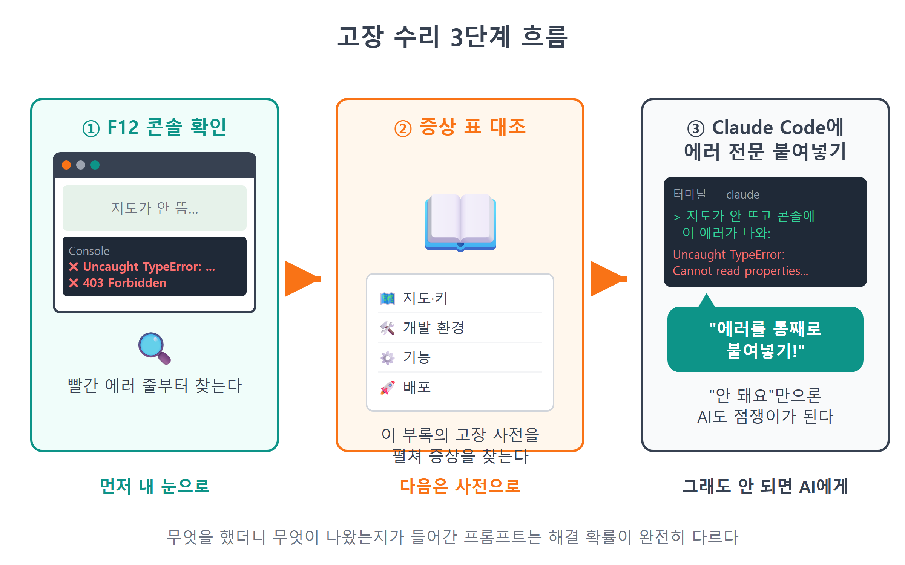
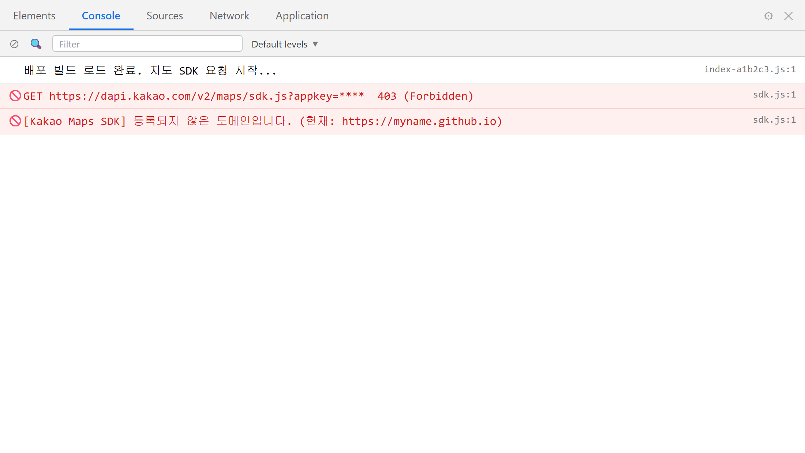

# 부록 B 트러블슈팅 & 치트시트

!!! note "이 장에서 배우는 것"
    - 고장 신고 접수 순서: 콘솔 확인 → 증상 표 대조 → Claude Code에게 수리 의뢰
    - 이 책에서 만난 대표 고장 15가지의 증상 → 원인 → 해결 총정리
    - git · gh · npm 명령을 한 장에 모은 명령어 치트시트
    - 카카오지도 SDK의 객체·메서드를 한눈에 보는 SDK 치트시트

---

축하합니다. 이 부분까지 진행하셨다면 지도 웹앱을 이미 공개하셨을 것입니다. 그런데 앱은 제작한 뒤에도 지속적으로 관리할 부분이 생깁니다. 내일 새 기능을 추가하거나, 몇 달 뒤 장비를 교체하고 프로젝트를 다시 열어보면 분명히 문제가 발생할 것입니다. 그때마다 책을 처음부터 다시 찾아볼 수는 없습니다. 그래서 이 부록을 마련하였습니다. 문제가 발생하였을 때 이 부록만 참고하면 되도록, 책 전체에 분산된 트러블슈팅 방법과 명령어, SDK 관련 지식을 한 곳에 정리하였습니다.

활용 방법은 간단합니다. 현재 특정 기능이 정상 작동하지 않는다면 B.1의 증상 표에서 유사한 증상을 찾아보시면 됩니다. 명령어가 기억나지 않는 경우 B.2를, "그 메서드 이름이 뭐였더라?" 필요한 경우 B.3을 참고하시면 됩니다. 책상 옆에 두고 사전처럼 활용하셔도 좋습니다.

## B.1 증상 → 원인 → 해결 표

본격적인 표 내용을 살펴보기 전에, 이 책에서 다루는 문제 해결 절차를 다시 한번 정리해 보겠습니다. 이 책의 내용을 따라왔다면 이미 익히 알고 계시겠지만, 급한 마음에 순서를 놓치기 쉽기 때문입니다.

첫 번째 단계는 콘솔을 확인하는 것입니다. 브라우저에서 ++f12++ 키를 누르고 Console 탭을 확인하시기 바랍니다. 화면에 붉은색 글씨로 표시된 내용이 있다면 그곳에 문제의 원인이 적혀있을 것입니다. 메시지를 확인하는 순서는 다음과 같습니다. 가장 먼저 첫 부분을 읽으십시오. `401 (Unauthorized)`, `kakao is not defined`과 같이 첫 줄에 문제의 종류가 제시됩니다. 그다음 메시지 우측 끝에 표시된 파일 이름과 줄 번호를 확인하십시오. `loader.js:14`와 같은 형식의 내용을 통하여 문제가 발생한 위치를 파악할 수 있습니다. 메시지가 영문으로 표시되어 있다고 하여 문제될 것은 없습니다. 9장에서 `loader.js`에 포함한 `'VITE_KAKAO_JS_KEY가 .env에 없습니다.'`과 같은 한글 에러 메시지도 이곳에 표시됩니다. 영문으로 된 에러 메시지는 그대로 복사하여 AI에 전달하면 다음 단계의 처리에 활용할 수 있습니다.

두 번째 단계는 아래의 표에서 해당 증상을 찾는 것입니다. 문제의 원인만 정확히 파악하여도 문제 해결의 절반 이상은 진행된 것입니다.

세 번째 단계는, 위의 방법으로도 원인을 파악하기 어려운 경우 에러 내용을 Claude Code에 전달하여 확인하는 것입니다. 이때 효율적인 활용 방법이 하나 있습니다. 그저 "안 돼요"라고만 요청하면 AI가 정확한 내용을 파악하기 어려울 수 있습니다. 발생한 에러 메시지 전체를 복사하여 함께 전달하시기 바랍니다. 어떤 작업을 수행하였을 때 어떤 현상이 발생하였는지 함께 명시하면, 문제 해결 가능성이 크게 높아집니다.

!!! tip "이렇게 물어보세요"
    > npm run dev로 서버를 켜고 localhost:5173에 들어갔는데 지도가 안 뜨고 콘솔에 이 에러가 나와: (에러 메시지 전체 붙여넣기). 원인을 찾아서 고쳐줘. 고치기 전에 뭘 바꿀 건지 먼저 설명해줘.

{ width="760" }
/// caption
그림 B.1 — 문제 해결 3단계 흐름
///

이제 본격적인 문제 해결 표를 살펴보겠습니다. 표는 증상별로 지도·인증키, 개발 환경, 기능, 배포의 네 가지 분야로 구분하여 정리하였습니다.

### 지도와 키: 첫 화면에서 문제가 생길 때

첫 번째 분야는 지도를 처음으로 표시하려는 9장 부근에서 자주 발생하는 문제들을 모은 것입니다. 대부분의 경우 카카오 서버와의 통신 과정에서 문제가 발생합니다. 단, 화면이 회색으로 표시되는 경우는 예외입니다. 이 경우 서버와의 통신 문제가 아니라 CSS 설정 오류가 원인입니다. 콘솔에 에러 메시지가 표시된다면 해당 내용에서 상태 코드(401/403)를 찾아 확인하시고, 에러 메시지가 없으면서 화면이 회색으로 보인다면 첫 번째 항목부터 순서대로 확인하시기 바랍니다.

| 증상 | 원인 | 해결 |
|---|---|---|
| 지도 자리가 회색 또는 빈 화면, 콘솔 에러 없음 | `#map` 컨테이너의 높이가 0. CSS에서 높이를 안 줬거나, 숨겨진(display:none) 상태에서 지도를 만듦 | `#map`에 `height: 100vh` 등 실제 높이를 지정. 숨겼다 펼치는 화면이면 펼친 뒤 `map.relayout()` 호출 (23장 사이드바 접기에서 배운 그 방법) |
| 콘솔에 401 (Unauthorized) | 가장 흔한 원인은 카카오 서버가 키를 인정하지 않은 경우. JS 키가 아닌 REST API 키를 넣었거나, 키를 복사하다 한 글자가 잘렸거나, 키를 재발급한 뒤 `.env`를 안 바꿈 | developers.kakao.com → 전체 앱 → 앱 > 플랫폼 키에서 JavaScript 키를 다시 복사해 `.env`에 붙여넣고 서버 재시작 (7장) |
| 콘솔에 403 (Forbidden) | 가장 흔한 원인은 키는 맞지만 지금 접속한 주소가 SDK 도메인에 미등록. 카카오는 등록된 도메인에서 온 요청만 허락함. 프로토콜(`http`/`https`)은 하나만 등록해도 양쪽 인정, 호스트·포트는 정확히 일치해야 함(`localhost:5173` ≠ `5174`) | 플랫폼 키 → JavaScript 키의 JavaScript SDK 도메인에 현재 주소를 등록. 개발 중이면 `http://localhost:5173`, 배포 후면 Pages 주소까지 (7장 · 25장) |
| 콘솔에 `kakao is not defined` | SDK 로드가 끝나기 전에 `kakao.maps.*`를 사용. `autoload=false`인데 `kakao.maps.load()` 콜백 밖에서 지도를 만들었거나, `await loadKakaoSdk()`를 빼먹음 | 지도 관련 코드는 반드시 `await loadKakaoSdk()` 다음 줄부터 실행되게 순서를 잡기 (9장) |
| `'카카오 SDK 로드 실패 — 키/도메인 확인'` 에러 | `loader.js`의 `script.onerror`가 발동. 인터넷이 끊겼거나 키·도메인 문제로 SDK 파일 자체를 못 받음 | 네트워크 확인 → 401/403 항목 순서로 점검 (9장) |

여기서 401 오류와 403 오류의 차이를 다시 한번 정리해 보겠습니다. 두 가지를 혼동하기 쉽지만 그 원인은 상이합니다. 401 오류는 카카오측에서 인증키 자체를 인식하지 못하는 경우 발생하므로 `.env`에 설정된 인증키를 확인하시기 바랍니다. 403 오류는 인증키는 정상적이지만 접속한 주소가 등록된 도메인 목록에 없다는 의미이므로, 카카오 개발자 콘솔의 JavaScript SDK 도메인 설정 내용을 확인하시기 바랍니다. 이처럼 상태 코드에 따라 확인하여야 할 위치가 `.env`와 카카오 개발자 콘솔로 구분됩니다. 다만 이러한 구분이 공식적인 분류 기준은 아닙니다. 가장 빈번하게 발생하는 원인들을 기준으로 정리하였을 뿐입니다. 광고 차단 프로그램 사용이나 보안 정책의 영향으로 상태 코드 자체가 표시되지 않는 경우도 있을 수 있습니다. 그러한 경우에는 Network 탭으로 이동하여 실패한 `dapi.kakao.com` 요청의 주소와 응답 내용을 우선 확인하시기 바랍니다.

### 개발 환경: 터미널에서 문제가 생길 때

이번에는 브라우저가 아닌 터미널에서 발생하는 문제들을 살펴보겠습니다. 대부분의 경우 프로그램 코드 자체의 문제라기보다는 사용 환경의 문제일 것입니다. 따라서 해결 방법도 재시작, 재설치, 설정 내용 확인의 순서로 진행하게 됩니다. 특히 "터미널을 껐다 켠다" 방법이 권장되는 경우가 많은데, 이는 단순한 관행이 아닙니다. 터미널은 실행되었을 당시의 환경 정보(PATH, `.env` 등)를 기억하고 있으며, 그 이후에 변경된 내용은 반영하지 않기 때문입니다. 사용 환경에 변경이 발생하였다면 터미널을 새로 실행하는 것이 바람직합니다.

| 증상 | 원인 | 해결 |
|---|---|---|
| `import.meta.env.VITE_KAKAO_JS_KEY`가 undefined | ① 변수 이름에 `VITE_` 접두사가 없음 — Vite는 `VITE_`로 시작하는 변수만 브라우저에 넘겨줌 ② `.env`를 고친 뒤 개발 서버를 재시작하지 않음 — `.env`는 서버가 켜질 때 한 번만 읽힘 ③ `.env` 파일 위치가 프로젝트 루트가 아님 | 변수 이름을 `VITE_KAKAO_JS_KEY`로 확인 → `.env`가 `package.json` 옆에 있는지 확인 → 서버를 ++ctrl+c++ 로 끄고 `npm run dev` 재시작 (8장) |
| `npm run dev` 했더니 주소가 5174로 뜸 (5173 충돌) | 5173 포트를 다른 프로그램(대개 끄지 않은 또 하나의 개발 서버)이 이미 사용 중. Vite가 자동으로 옆 포트를 잡은 것. 문제는 카카오 JavaScript SDK 도메인에 5173만 등록해서 5174에선 403이 남 | 다른 터미널 창에 살아 있는 `npm run dev`를 찾아 ++ctrl+c++ 로 종료 후 재시작. 못 찾겠으면 `netstat -ano | findstr 5173`으로 점유한 프로세스 확인 |
| `node` / `git` / `gh` 입력 시 "인식할 수 없는 명령" | 설치 직후라면 PATH 반영 전 — 설치 프로그램이 등록한 경로를 이미 켜져 있던 터미널은 모름. 아니면 설치 시 PATH 등록이 누락 | 터미널(과 VS Code)을 완전히 껐다가 새로 열기. 그래도 안 되면 재설치하며 PATH 옵션 확인 (2장 · 3장 · 5장) |
| `npm install` 이 에러로 중단 | 네트워크 순단, 회사·학교 프록시, 또는 꼬여 버린 캐시·의존성 | 인터넷 확인 후 재시도 → 안 되면 `node_modules` 폴더와 `package-lock.json`을 지우고 `npm install` 다시 → 그래도 안 되면 `npm cache clean --force` 후 재시도. 에러 로그를 Claude Code에 붙여넣는 게 가장 빠를 때도 많음 |

### 기능: 마커·검색·저장이 이상할 때

지도는 정상적으로 표시되지만 지도 상의 기능에 문제가 발생하는 경우들을 정리하였습니다. 이 분야의 문제들은 별도의 에러 메시지 없이 정상적으로 작동하지 않는 경우가 많습니다. 마커가 보이지 않거나 데이터가 저장되지 않는 경우에도 콘솔 상에는 별도의 오류 표시가 나타나지 않을 수 있습니다. 그러한 경우 콘솔에서 직접 내용을 확인해 보시는 것이 가장 빠른 방법입니다. `console.log(store.all())` 명령으로 해당 데이터가 실제로 존재하는지 확인하고, `console.log(map.getCenter())` 명령으로 지도가 현재 어떤 위치를 기준으로 표시하고 있는지 확인하여 보시기 바랍니다. 눈에 보이는 증상만으로는 파악하기 어려운 원인이, 실제 데이터 내용을 확인하면 명확하게 드러날 것입니다.

| 증상 | 원인 | 해결 |
|---|---|---|
| 마커가 안 보임 | ① `new kakao.maps.LatLng(lat, lng)`에서 위도·경도 순서를 바꿔 넣음(한국 좌표인데 아프리카 앞바다에 찍힘) ② 마커 생성 시 `map` 연결(옵션 또는 `setMap`)을 빼먹음 ③ 카테고리 필터가 켜져 있어 걸러짐 | 좌표 순서 확인(한국은 위도 33~38, 경도 124~132) → `marker.setMap(map)` 확인 → 필터를 "전체"로 (11장 · 14장) |
| 커스텀 오버레이가 엉뚱한 위치에 붙음 (마커를 가리거나 아래로 처짐) | `yAnchor` 미설정. 기본값 0.5라 오버레이의 세로 중앙이 좌표에 붙음 — 말풍선은 꼬리 끝이 좌표에 닿아야 함 | `yAnchor`를 1보다 크게(우리 앱은 마커 높이만큼 더 올리려 1.4 근처) 조정해 꼬리가 마커 위에 앉게 하기 (13장) |
| 검색을 눌러도 결과가 없거나 콘솔에 `kakao.maps.services is undefined` | SDK 주소에 `&libraries=services`가 빠짐 — 검색은 부록 라이브러리라 따로 신청해야 실림 | `loader.js`의 SDK 주소에 `&libraries=services,clusterer` 확인 후 새로고침 (15장). 진짜 결과가 0건일 수도 있으니 `Status.ZERO_RESULT` 처리도 확인 |
| 새로고침하면 저장한 장소가 사라짐 (localStorage에 안 남음) | ① 추가·수정 코드가 `store`를 거치지 않아 `save()`가 안 불림 ② 시크릿(사생활 보호) 창 — 닫으면 localStorage가 비워짐 ③ 저장 데이터가 깨져 `load()`의 try-catch가 기본 데이터로 후퇴 | 데이터 변경은 반드시 `store.add/update/remove`로만 → 일반 창에서 테스트 → F12 → Application → Local Storage에서 `my-map-places-v1` 키 확인 (17장) |
| 장소가 많아도 클러스터로 안 묶임 | ① `&libraries=clusterer` 누락 ② 마커를 클러스터러에 안 넣고 `setMap(map)`으로 지도에 직접 올림 ③ 현재 확대 레벨이 `minLevel`보다 낮아 묶지 않는 게 정상 동작 | SDK 주소 확인 → 마커는 `clusterer.addMarkers(markers)`로만 등록 → 지도를 축소해 `minLevel` 이상에서 확인 (22장) |

### 배포: 배포한 뒤 문제가 생길 때

마지막 분야는 개인용 컴퓨터에서는 정상적으로 작동하지만, 배포한 이후에는 정상 작동하지 않는 경우에 관한 내용입니다. 이러한 문제의 원인은 대부분 로컬 환경과 배포 환경의 차이에서 비롯됩니다. 접속하는 주소가 상이하고 파일 참조 기준 경로도 다르기 때문입니다. 25장에서 경험한 내용이지만, 프로젝트를 새로 생성할 때마다 다시 접하게 되는 문제이므로 이곳에 정리하여 두었습니다.

| 증상 | 원인 | 해결 |
|---|---|---|
| GitHub Pages 주소가 흰 화면, 콘솔에 JS·CSS 404 | `vite.config.js`의 `base` 미설정. Pages 주소는 `사용자명.github.io/리포명/`처럼 한 칸 들어간 주소인데, 빌드 결과물이 파일을 루트(`/`)에서 찾음 | `vite.config.js`에 `base: '/리포명/'` 설정 후 다시 커밋·푸시해 재배포 (25장) |
| 배포 페이지는 뜨는데 지도만 안 뜸 (콘솔 403) | 카카오 JavaScript SDK 도메인에 `localhost:5173`만 등록하고 배포 도메인은 등록하지 않음 | 플랫폼 키 → JavaScript 키의 SDK 도메인에 `https://사용자명.github.io` 추가 (25장) |

!!! warning "주의"
표에 제시된 해결 방법을 적용하였음에도 불구하고, 브라우저가 이전 버전의 파일을 기억하고 있어 변경 내용이 반영되지 않은 것처럼 보일 수 있습니다. 특히 배포 관련 문제를 수정한 경우 ++ctrl+shift+r++ 키 조합으로 캐시를 무시하고 새로고침하여 확인하시기 바랍니다. 문제를 수정하였음에도 동일한 증상이 나타난다면, 절반 이상은 캐시 기능으로 인하여 이전 내용이 보이는 것일 수 있습니다.

{ width="760" }
/// caption
그림 B.2 — 403 Forbidden 오류 메시지가 표시된 콘솔 화면
///

## B.2 명령어 치트시트: git · gh · npm

이 책에서 활용한 터미널 명령어들을 정리하였습니다. 명령어를 억지로 암기할 필요 없이 필요할 때마다 찾아서 사용하시면 됩니다. 이 표를 참고하여 사용하다 보면 자주 사용하는 명령어들은 자연스럽게 익숙해지게 될 것입니다. 각 표의 제목에는 해당 도구가 처음 소개된 장 번호를 표시하여 두었으니, "이 명령이 왜 필요하더라?" 필요한 경우 관련 내용이 있는 장으로 돌아가서 참고하시면 됩니다.

본격적인 내용을 살펴보기 전에, 터미널 사용에 도움이 되는 범용적인 명령어 하나를 소개하여 드립니다. 어떤 명령어이든 뒤에 `--help` 내용을 추가하여 입력하면 해당 명령어의 사용 방법과 옵션 목록이 표시됩니다. `git commit --help`나 `gh repo create --help`과 같은 형식으로 사용하시면 됩니다. 이 표에 정리되지 않은 옵션에 대하여 알아보고자 할 때는 인터넷 검색보다 더 빠르게 정보를 확인할 수 있는 경우도 있습니다.

### git: 기록하고 되돌리기 (3장 · 24장)

| 명령 | 하는 일 |
|---|---|
| `git -v` | 설치 확인 (버전 출력) |
| `git config --global user.name "이름"` | 커밋에 적힐 이름 설정 (최초 1회) |
| `git config --global user.email "메일"` | 커밋에 적힐 이메일 설정 (최초 1회) |
| `git init` | 현재 폴더를 저장소로 만들기 |
| `git status` | 무엇이 바뀌었는지 확인 — 막히면 일단 이것부터 |
| `git add .` | 바뀐 파일 전부를 커밋 대기줄에 올리기 |
| `git commit -m "메시지"` | 대기줄의 변경을 하나의 기록(커밋)으로 저장 |
| `git log --oneline` | 커밋 역사를 한 줄씩 훑어보기 |
| `git diff` | 아직 커밋 안 된 변경의 내용 비교 |
| `git restore 파일명` | 커밋 안 된 변경을 버리고 파일 되돌리기 |
| `git push` | 로컬 커밋을 GitHub에 올리기 |
| `git pull` | GitHub의 변경을 로컬로 받아오기 |

### gh: 터미널에서 GitHub까지 (5장 · 24장)

| 명령 | 하는 일 |
|---|---|
| `winget install GitHub.cli` | gh 설치 (윈도우) |
| `gh auth login` | 브라우저 인증으로 GitHub 로그인 |
| `gh auth status` | 로그인 상태 확인 |
| `gh repo create 이름 --public --source . --push` | 현재 폴더를 공개 리포로 만들고 바로 푸시 |
| `gh repo view --web` | 지금 리포를 브라우저로 열기 |
| `gh browse` | 리포 페이지 열기 (위와 비슷한 단축) |

git 명령어와 gh 명령어의 역할 분담이 헷갈린다면 다음과 같이 기억하시기 바랍니다. git은 개인용 컴퓨터 내부의 변경 내용 이력을 관리하는 데 사용하며, gh는 GitHub 서비스 상에서 이루어지는 작업을 터미널에서 처리할 수 있도록 지원하는 명령어입니다. 파일의 변경 내용을 기록하거나 이전 상태로 복구하는 등 로컬 환경에서의 작업은 git이 담당하며, 원격 저장소를 생성하거나 페이지를 여는 등 GitHub 계정 단위의 작업은 gh 명령어를 통하여 처리합니다. 두 명령어의 연계 작업은 `git push`와 `git pull` 명령어를 통하여 수행하게 됩니다.

### npm: Node의 패키지 관리 (2장 · 8장)

| 명령 | 하는 일 |
|---|---|
| `node -v` / `npm -v` | Node / npm 설치 확인 |
| `npm create vite@latest` | Vite 프로젝트 기본 구조 생성 (8장) |
| `npm install` | `package.json`의 의존성 전부 설치 |
| `npm run dev` | 개발 서버 켜기 (기본 5173 포트) |
| `npm run build` | 배포용 결과물을 `dist/`에 생성 (25장) |
| `npm run preview` | 빌드 결과물을 로컬에서 미리 확인 |
| `npm install -g @anthropic-ai/claude-code` | Claude Code 전역 설치 (4장) |
| `npm cache clean --force` | 설치가 꼬였을 때 캐시 청소 |

!!! tip "팁"
명령어가 기억나지 않을 때, 이 책에서 권장하는 방식은 다음과 같습니다. Claude Code에게 "지금까지 작업 커밋하고 푸시해줘"라고 요청하면 필요한 내용을 안내받을 수 있습니다. 다만, AI가 제시하는 명령어 내용을 이 표의 내용과 비교하며 확인하는 습관을 가지시기 바랍니다. 그러한 습관을 통하여, AI의 도움 없이도 작업을 진행할 수 있는 개발자로 성장하실 수 있을 것입니다.

## B.3 카카오 SDK 치트시트

마지막으로 카카오 지도 JavaScript SDK의 활용 방법을 정리하였습니다. 이 책에서 사용한 주요 객체 여덟 가지의 생성 방법과 자주 사용하는 메서드를 중심으로 정리하였습니다. 모든 객체는 `kakao.maps.` 하위에 포함되어 있습니다. `new` 형식으로 생성하며, 옵션 값들은 중괄호로 묶인 객체 형식으로 전달합니다. 이 세 가지 기본 문법만 기억하고 계시면 표의 내용을 쉽게 이해하실 수 있을 것입니다. 표에 제시된 코드는 전체 구조를 요약한 내용이므로, 전체적인 맥락을 파악하고자 할 때는 각 항목에 표시된 장 번호의 내용을 함께 참고하시기 바랍니다. 또한 이 표의 내용은 Claude Code에게 작업을 요청할 때도 매우 유용하게 활용될 것입니다. "마커를 옮겨줘"라고 포괄적으로 요청하는 것보다 "`setPosition`으로 마커를 옮겨줘"라고 구체적으로 명시하면, AI가 정확한 내용을 파악하는 데 소요되는 시간을 크게 줄일 수 있습니다. 정확한 용어와 객체 이름을 사용하여 지시하면 보다 정확한 결과를 얻을 수 있습니다.

| 객체 | 만드는 법 | 자주 쓰는 것 | 한 줄 설명 (장) |
|---|---|---|---|
| `Map` | `new kakao.maps.Map(container, { center, level })` | `setCenter(latlng)` 즉시 이동 · `panTo(latlng)` 부드러운 이동 · `setLevel(n)` 확대 조절 · `getCenter()` / `getLevel()` 현재 상태 읽기 · `relayout()` 컨테이너 크기 변경 후 재계산 · `addControl(...)` 컨트롤 부착 | 지도 본체. 컨테이너·center·level 3요소로 태어남 (9~10장) |
| `LatLng` | `new kakao.maps.LatLng(lat, lng)` | `getLat()` / `getLng()` | 위도·경도 한 쌍. 위도가 먼저라는 것만 기억 (9장) |
| `Marker` | `new kakao.maps.Marker({ position, map, image, title })` | `setMap(map)` 지도에 올리기 · `setMap(null)` 내리기 · `setPosition(latlng)` 위치 변경 · `setImage(img)` 이미지 교체 | 좌표에 꽂는 핀 (11장) |
| `MarkerImage` | `new kakao.maps.MarkerImage(src, size, options)` | `src`에 SVG data URI 가능 · `size`는 `new kakao.maps.Size(w, h)` · `options.offset`으로 꼭짓점 조정 | 마커의 옷. 카테고리별 색·이모지 핀이 이걸로 (11장) |
| `CustomOverlay` | `new kakao.maps.CustomOverlay({ position, content, yAnchor })` | `setMap(map)` 열기 · `setMap(null)` 닫기 · `content`에 HTML 문자열 · `yAnchor`로 세로 기준점 조정 | HTML·CSS 자유형 말풍선. InfoWindow의 상위 호환 (13장) |
| `services.Places` | `new kakao.maps.services.Places()` | `keywordSearch(키워드, callback)` · 콜백에서 `status === kakao.maps.services.Status.OK` 확인 · 결과의 `y`가 위도, `x`가 경도 | 키워드 장소 검색. `&libraries=services` 필수 (15장) |
| `MarkerClusterer` | `new kakao.maps.MarkerClusterer({ map, averageCenter, minLevel, minClusterSize })` | `addMarkers(배열)` 등록 · `removeMarkers(배열)` / `clear()` 비우기 | 마커 뭉치 관리인. `&libraries=clusterer` 필수 (22장) |
| `event` | (생성 없음 — 도구 모음) | `kakao.maps.event.addListener(대상, '이벤트', 핸들러)` · 지도 이벤트: `click`, `dragend`, `zoom_changed` · 마커 이벤트: `click` · 지도 클릭 핸들러의 `e.latLng`로 클릭 좌표 | 지도·마커에 귀를 다는 창구 (10장 · 16장) |

아래의 세 가지 사항은 특별히 유의하여야 할 내용이므로 별도로 정리하였습니다. 표의 내용을 살펴보다가 놓치기 쉽지만, 실제로 가장 자주 문제를 일으키는 부분들이기도 합니다.

가장 먼저 좌표의 순서에 주의하시기 바랍니다. `LatLng` 객체는 위도 값을 먼저 전달받는 반면, `Places` 검색 기능의 결과 값은 `x` 항목에 경도를, `y` 항목에 위도를 포함하고 있습니다. 따라서 검색 결과 값을 바탕으로 좌표 정보를 생성할 때는 `new kakao.maps.LatLng(item.y, item.x)`과 같이 값의 순서를 바꾸어 전달하여야 합니다. 15장에서 한 차례 경험하였더라도 상당한 시간이 지나면 다시 혼동하기 쉬운 부분입니다.

다음으로 추가 라이브러리의 포함 여부를 확인하시기 바랍니다. `Places` 기능과 `MarkerClusterer` 기능은 기본 SDK에 기본으로 포함되어 있지 않습니다. `loader.js`의 SDK 호출 주소의 마지막 부분에 `&libraries=services,clusterer` 내용을 추가하여 호출하여야 해당 라이브러리가 함께 로드됩니다. 공식 문서에 제시된 방법대로 설정하였음에도 불구하고 `undefined` 오류가 발생한다면, 가장 먼저 이 부분을 확인하여 보시기 바랍니다.

마지막으로, 지도 상의 객체를 표시하거나 숨기는 기능은 `setMap` 메서드 하나로 처리할 수 있습니다. 마커이든 오버레이이든 지도 화면에 표시할 때는 `setMap(map)` 메서드를 사용하고, 화면에서 숨길 때는 `setMap(null)` 메서드를 사용합니다. 객체를 삭제하였다고 오해하기 쉽지만, `setMap(null)` 메서드는 단순히 화면에서 보이지 않도록 숨기는 기능일 뿐입니다. 객체 자체는 그대로 유지되므로 필요할 때 언제든지 다시 화면에 표시할 수 있습니다. 이 책의 예제에서 사용한 말풍선 기능인 "하나만 열기" 객체도 동일한 방식으로 처리됩니다.

## B.4 마무리

이 부록의 내용을 마무리하기 전에 한 가지 사실을 다시 한번 상기시켜 드리겠습니다. 이 책을 집필하는 과정에서도 지도가 회색으로 표시되는 현상이 수십 차례 발생하였으며, 403 오류 역시 여러 차례 경험하였습니다. 이러한 문제는 실력이 부족하여 발생하는 것이 아닙니다. 무언가를 새롭게 만들어가는 과정에서는 누구나 마주칠 수 있는 보편적인 현상입니다.

그리고 문제가 발생하였을 때 의지할 수 있는 방법은 두 가지가 있습니다. 첫 번째는 git 버전 관리 시스템입니다. 작업 내용을 커밋으로 기록하여 두었다면 어떤 내용을 수정하여도 안심하고 시도하여 볼 수 있으며, 만약 수정 내용이 적절하지 않은 경우 언제든지 이전 상태로 복구할 수 있습니다. 다른 하나는 에러 메시지를 분석하고 원인을 제시하여 주는 AI 도구입니다. 에러 메시지를 전달하고 원인에 대한 설명을 들은 뒤, 수정 방향에 대한 계획을 확인하는 과정을 반복하다 보면, 문제를 해결하는 능력이 자연스럽게 향상될 것입니다.

한 가지 습관을 더 권장하여 드립니다. 이 표에 제시되지 않은 문제를 해결한 경우, 그 증상과 해결 방법을 어딘가에 간략하게라도 기록하여 두시기 바랍니다. 프로젝트 폴더 내의 간단한 메모 파일이어도 좋고, 프로젝트 저장소의 README 파일 하단에 기록하여 두어도 좋습니다. 동일한 문제는 대부분의 경우 다시 발생하게 될 것입니다. 그때가 되면 지금 알게 된 해결 방법을 이미 기억하지 못할 가능성이 높습니다. 전문 개발자들이 블로그에 문제 해결에 관한 글을 작성하는 이유도 타인에게 과시하기 위함이 아닙니다. 미래의 자신에게 보내는 참고 자료로 활용하기 위함인 것입니다.

지도 관련 기능 구현은 이제 마무리되었습니다. 그렇다고 하여 앞으로의 작업이 완전히 끝난 것은 아닙니다. 26장에서 정리한 바와 같이, 백엔드 연동, 로그인 기능 구현, 사진 업로드 기능 등 다음 단계의 작업을 진행하는 과정에서 문제가 발생한다면 언제든지 이 부록으로 돌아와서 참고하시기 바랍니다. 이 표에 제시되지 않은 문제를 직접 해결하게 되는 경우, 그 내용을 별도로 정리하여 두시기를 권장합니다.

---

!!! abstract "이 장의 핵심"
    - 고장 수리는 순서가 전부입니다: F12 콘솔 확인 → 증상 표 대조 → 에러 전문을 붙여 Claude Code에 의뢰
    - 지도와 키 문제는 대개 셋 중 하나입니다. 컨테이너 높이가 0이면 회색 화면이 되고, 401은 잘못된 키, 403은 도메인 미등록에서 옵니다. 로컬은 `localhost:5173`을, 배포 후에는 Pages 도메인까지 등록해야 합니다. 도메인은 프로토콜과 무관하지만 호스트와 포트는 정확히 일치해야 합니다
    - `.env`는 `VITE_` 접두사 + 서버 재시작이 세트, 검색·클러스터는 `&libraries=services,clusterer` 가 세트입니다
    - GitHub Pages 흰 화면은 `vite.config.js`의 `base: '/리포명/'`, 명령이 안 먹으면 터미널 재시작(PATH) 부터
    - 명령과 메서드는 외우지 말고 이 부록에서 찾아 쓰세요. 자주 쓰는 것은 저절로 외워집니다

!!! question "잠깐 생각해 봅시다"
Q1. 배포한 지도 앱을 본인의 컴퓨터에서는 정상적으로 사용할 수 있는데, 다른 사람의 기기에서는 지도가 표시되지 않는다고 합니다. B.1의 표에서 어떤 항목부터 확인하여야 할 것이며, 그 이유는 무엇인가요?

____________________________________________

____________________________________________ ch28.txt

!!! example "확인 문제"
    1. `.env`의 키 이름을 일부러 `KAKAO_JS_KEY`(접두사 없이)로 바꾸고 서버를 재시작해 보세요. 콘솔에 어떤 에러가 나오는지 확인하고, `loader.js`의 몇 번째 줄이 그 에러를 만들었는지 찾아보세요.
    2. `loader.js`의 SDK 주소에서 `&libraries=services,clusterer`를 지우고 새로고침한 뒤, 검색 기능이 어떤 에러를 내는지 확인하고 원상 복구하세요.
    3. B.2의 git 표만 보고, 파일 하나를 수정 → 상태 확인 → 커밋 → 푸시까지 명령 네 개로 완주해 보세요.

!!! info "더 찾아보기"
    - `크롬 개발자도구 Network 탭` — 콘솔 다음으로 강력한 수사 도구. 어떤 요청이 몇 번 상태 코드로 실패했는지 한눈에 보입니다
    - `git revert / git reset` — 커밋 단위로 되돌리는 두 가지 방식과 그 차이
    - `카카오맵 API 공식 문서 (apis.map.kakao.com)` — 이 표에 없는 객체와 옵션의 원전. Sample 페이지의 예제가 특히 유용합니다
    - `console.table()` — 배열 데이터를 표로 찍어 주는 콘솔 명령. 장소 배열 디버깅이 한결 편해집니다

> 다음 장으로. 다음 장은 없습니다. 이 책의 지도는 여기까지고, 다음 페이지부터는 여러분이 직접 그립니다. 막히면 언제든 이 부록으로 돌아오세요. 즐거운 바이브코딩 되시길!
